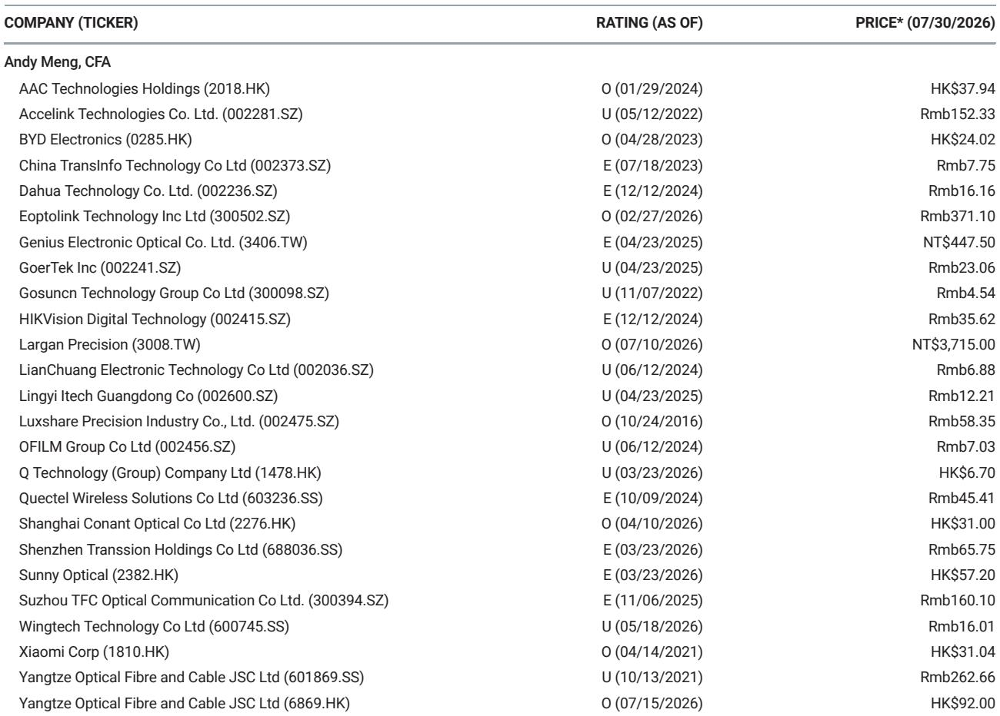
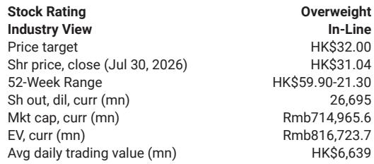

# 小米SkyNomad定价重塑增程式SUV细分市场，销量表现成为核心关注点

小米进入增程式电动车领域的举措，已不仅是工程能力的检验。7月30日，其全新SkyNomad品牌的技术发布揭示了具有竞争力的定价结构：旗舰七座N90 Max起售价为人民币299,900元，而大五座四驱N70 Max定价为人民币259,900元。随着完整定价与正式发布计划于2026年9月进行，公司已表明其意图在规模上竞争，而非高端定位。市场对此已有所反应，公司报价为31.04港元，52周区间为21.30至59.90港元，一家全球投资银行维持其报告观点。

战略意义不仅限于表面数字。两款车型的“Pro”版和标准版预计将定价更低，N70系列覆盖人民币200,000至250,000元区间，N90系列覆盖人民币250,000至300,000元区间。这一市场定位使小米直接进入中国竞争最激烈的汽车领域，家庭导向型消费者正日益从燃油车转向电动化替代方案。报告的核心观点简洁明了：有吸引力的定价结合创新的内饰设计，使强劲的销售表现成为大概率事件，而这一销量轨迹将在未来12至18个月内成为公司表现的主要驱动因素。

此次发布的特别意义在于时机。中国电动车市场已进入整合阶段，规模决定生存能力。小米的做法——利用其现有生态系统、品牌认知度和供应链专长——与其智能手机业务成为全球力量所采用的策略如出一辙。SkyNomad品牌代表公司首次扩展至增程式电动车领域，这一技术解决了续航焦虑问题，同时为日常通勤提供纯电运行的成本优势。问题不再是小米能否造出有竞争力的车型，而是能否将其定价优势转化为可持续的市场份额。

## N90与N70定价形成对家庭SUV市场的双层攻势，迫使现有参与者做出回应

SkyNomad产品线的定价架构是一项深思熟虑的战略选择，瞄准中国汽车市场中最具盈利能力和增长最快的细分领域。N90 Max定价人民币299,900元，定位为高端家庭用车，较现有增程式电动车制造商的同类产品低约15%至20%。N70 Max定价人民币259,900元，瞄准大众市场细分领域的高端，该领域需求弹性最大，也是小米在年轻、科技 savvy 家庭中品牌资产较强的领域。

产品线预计扩展至包括“Pro”版和标准版，形成覆盖多个收入层级的定价阶梯。N70系列覆盖人民币200,000至250,000元，N90系列覆盖人民币250,000至300,000元，意味着小米不仅是在推出单一产品，而是在建立一个能够吸收首次购买电动车用户和现有电动车升级用户需求的产品家族。这是一项规模策略，而非利润率策略，反映了对中国当前市场环境的清晰理解：规模通过制造效率和供应链杠杆带来盈利能力。

竞争回应将受到成本结构的制约。现有增程式电动车制造商多年来一直在优化其供应链和制造流程，但小米以积极定价进入市场表明，它要么已实现相当的成本效率，要么愿意接受较低的初始利润率以稳固市场地位。报告的概率加权估值方法——为电动车业务分配20%的乐观情形概率、60%的基础情形概率和20%的保守情形概率——表明市场正在对一系列结果进行定价。然而，定价策略使天平向基础情形或更优方向倾斜。

## 自适应内饰架构重新定义座舱价值，将空间转化为差异化特征而非规格参数

小米为SkyNomad提出的设计理念——“通过智能重新定义空间”——代表了从静态座舱布局向适应用户需求的灵活配置的转变。这不是一项表面功能，而是对家庭如何使用车辆内部空间的根本性重新思考。座舱空间不应是静态的，而应灵活适应用户需求和偏好的理念，对潜在买家如何感知和评价车辆具有实际意义。

智能驱动的空间利用方式创造了竞争对手无法仅通过定价复制的差异化。虽然其他制造商提供相似的物理尺寸和座椅配置，但根据使用模式——无论是日常通勤、周末出行还是货物运输——动态重新配置座舱的能力，增加了与家庭买家产生共鸣的实用性，而家庭买家正是七座SUV的主要目标人群。这在中国城市环境中尤为重要，停车空间受限，家庭往往依赖单一车辆满足多种用途。

小米更广泛生态系统的整合为座舱体验增添了另一维度。已使用小米智能手机、智能家居设备和其他生态产品的买家将发现无缝整合，这是竞争对手无法比拟的。这种生态系统锁定效应一直是小米在其他产品类别中成功的关键驱动力，现在正被部署到汽车领域。结果是，车辆不仅是一种交通工具，更是用户数字生活的延伸，这增强了品牌忠诚度并增加了重复购买的可能性。

## 销量预期而非估值指标将决定公司情况更新

当前公司报价与电动车业务估值之间的差距意味着，上行空间取决于2026年9月正式发布后订单接收的速度和规模以及客户反馈。报告将好于预期的订单和客户反馈确定为主要上行风险，这清楚表明投资论点取决于商业执行，而非技术创新或制造能力。

分部加总估值方法为理解价值创造预期发生的位置提供了框架。应用于智能手机、物联网和互联网服务业务的剩余收益模型使用11%至11.4%的股权成本假设，终端增长率分别为3%、3%和6%。这些是反映这些业务成熟度的保守假设。相比之下，电动车业务使用贴现现金流模型进行估值，加权平均资本成本为12.2%，终端增长率为5%，概率权重为20%乐观、60%基础和20%保守。

概率权重本身揭示了市场对电动车业务轨迹的不确定性。分配给保守情形的20%概率承认了持续激烈电动车竞争的风险以及智能手机业务利润率压力的可能性。然而，SkyNomad的定价策略通过使小米的产品在性价比基础上更具吸引力，直接应对了竞争风险。剩余风险在于执行：小米能否在不影响质量或交付时间表的情况下提高产量以满足需求。

## 中国增程式电动车细分市场正进入规模竞赛，小米的供应链与生态系统优势相互叠加

中国的增程式电动车细分市场已从小众技术演变为主流家庭选择。增程式电动车兼具两全其美：日常通勤的纯电效率和长途旅行的汽油发电机，消除了续航焦虑。这使得该细分市场对无法依赖家庭充电设施或经常进行长途旅行的家庭特别有吸引力。小米以积极定价进入这一细分市场，标志着市场正进入竞争新阶段，规模与成本效率将决定胜者。

小米的供应链专长，经过多年智能手机和物联网制造的磨练，提供了竞争对手难以匹敌的结构性成本优势。公司与零部件供应商的关系、制造能力以及在多个产品类别中实现规模经济的能力，创造了一个支持积极定价同时保持可接受利润率的成本结构。这是使小米成为全球最大智能手机制造商之一的同一策略，现在正被应用于汽车领域。

生态系统优势不仅限于成本。小米26,695百万股稀释流通股和人民币714,965.6百万元市值，反映了一家拥有雄厚财务资源可投资于电动车业务的公司。报告将海外市场更高份额增长确定为上行风险，表明公司的国际扩张策略可能在中国以外提供额外增长机会。然而，目前重点是国内市场渗透，SkyNomad的定价策略旨在快速获取市场份额。

## 评估小米电动车轨迹的决策框架：订单动能、产能爬坡与竞争回应

对于评估小米公司的读者而言，SkyNomad发布提供了未来12至18个月可监控的具体指标集。第一个指标是2026年9月正式发布后的订单接收情况。报告强调“好于预期的订单和客户反馈”作为上行风险，表明订单数量将是公司表现的主要催化剂。读者应跟踪每周或每月的订单公告，与内部产能和行业基准进行比较。

第二个指标是产能爬坡。小米必须证明其能够在不影响质量或交付时间表的情况下扩大生产以满足需求。电动车业务是资本密集型，产能爬坡延迟不仅会影响收入，还会损害品牌信心。报告对电动车业务12.2%的加权平均资本成本反映了与这种资本密集度相关的风险，任何生产问题都可能导致对乐观和基础情形概率权重的重新评估。

第三个指标是竞争回应。现有增程式电动车制造商不会不战而弃市场份额，其未来六个月的定价决策将揭示小米的定价策略是否可持续。如果竞争对手以积极降价回应，小米的利润率可能面临压力，这将影响电动车业务的估值。或者，如果竞争对手维持定价，小米的规模优势将复合增长，巩固其市场地位并改善其电动车业务的经济效益。

第四个指标是线下扩张。报告将“中国线下扩张的良好推进及强劲的销量贡献”确定为上行风险，表明小米的零售网络将在推动销售方面发挥关键作用。公司在为其智能手机和物联网产品建设和运营零售渠道方面的经验提供了基础，但汽车零售需要不同的能力组合，包括试驾体验、服务中心和售后支持。这一扩张的速度和质量将是销量论点能否如期实现的关键决定因素。

## 保守情形并非关乎技术，而是关乎利润率压缩与竞争强度

报告将“持续激烈的电动车竞争”和“库存去化和需求疲弱导致的智能手机毛利率压力”确定为下行风险，凸显了小米面临的更广泛竞争动态。中国电动车市场已变得日益拥挤，数十家制造商争夺市场份额。这种竞争已在各细分领域引发价格战，增程式电动车细分市场也不例外。小米对SkyNomad的积极定价可能引发竞争回应，从而压缩整个行业的利润率。

智能手机业务作为小米重要的收入和利润来源，面临自身挑战。全球智能手机市场的库存去化和需求疲弱对毛利率构成压力，这可能抵消电动车业务的收益。报告对智能手机业务的剩余收益模型使用11%的股权成本和3%的终端增长率，反映了这一市场的成熟性和竞争性。智能手机利润率的任何进一步变化都将影响整体估值。

市场对智能电动车投资的担忧是另一个需要关注的因素。小米对电动车业务的大量投资一直是读者焦虑的来源，报告指出“对智能电动车投资的更多担忧，可能对公司构成压力”。SkyNomad发布旨在通过展示商业牵引力来应对这些担忧，但如果发布未能达到预期，读者信心可能受到侵蚀。对电动车业务进行概率加权估值的方法反映了这种不确定性，市场将寻找乐观情形变得更有可能的证据。

公司52周区间为21.30至59.90港元，表明存在显著波动性，当前31.04港元的报价位于区间中点下方。市场已对合理的基础情形进行了定价。跑赢的潜力取决于电动车业务超出预期，这需要强劲的订单接收、快速的产能爬坡以及允许小米维持其定价优势的竞争环境的组合。SkyNomad发布已奠定基础，但未来六个月将决定销量论点能否转化为股东价值。

*仅供参考。部分内容可能基于源材料由AI辅助生成、翻译、摘要或编辑，可能包含遗漏或错误。请独立核实。本文不构成投资、法律、税务、会计或其他专业建议。*

仅供参考。部分内容可能基于源材料由AI辅助生成、翻译、摘要或编辑，可能包含遗漏或错误。请独立核实。本文不构成投资、法律、税务、会计或其他专业建议。

