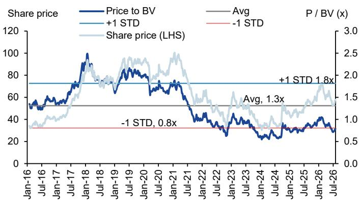
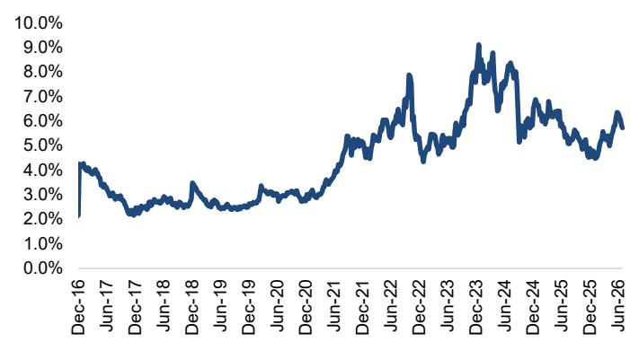
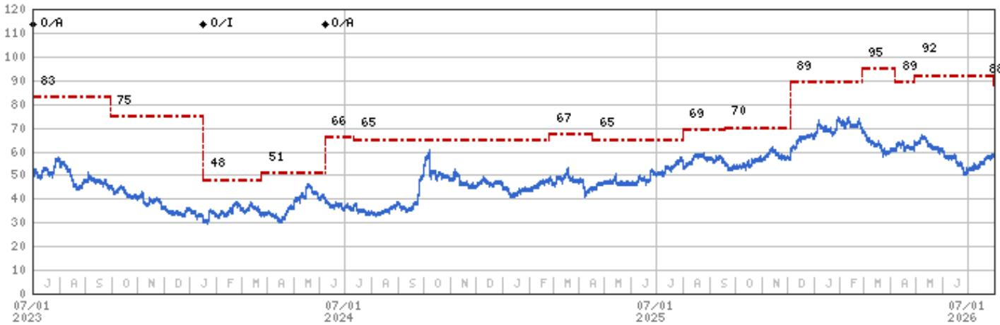

2026年7月30日 01:00 PM GMT

中国平安保险（集团）股份有限公司 | 亚太市场

# 2026年上半年业绩前瞻：动能延续，新业务价值增长为关注重点

我们预计中国平安将交出稳健的2026年上半年业绩，在当前市场环境变化中，其估值水平与分红回报表现具备一定吸引力。

## 核心要点

归母营运利润预计实现8%的平稳增长，归母净利润上半年或增长29%，其中第二季度同比增幅可能超过50%，主要受市场行情回暖带动。

■ 新业务价值上半年增速或放缓至11%，对应第二季度同比小幅回落3%。部分银保渠道调整可能在短期内影响增长节奏……

\- …不过，我们仍维持全年11%的增速预期，与管理层指引一致，后续将继续跟踪新业务价值的增长动能。

关于2026年合同服务边际余额提升及资管板块实现盈利的指引，目前推进情况符合预期。

中国平安将于8月20日盘后发布2026年上半年业绩。我们预计上半年归母营运利润增长8%，归母净利润增长29%。资管与寿险板块是净利润增长的主要驱动。由于配置了较多高股息FVOCI权益资产，其净利润弹性可能不及部分同业（同业上半年同比增幅普遍超过50%），但我们认为其下半年基数相对同业更为友好。

寿险新业务价值上半年增速为11%，对应第二季度同比小幅回落3%。第三季度同样面临较高基数，而管理层维持全年双位数增长目标。第四季度基数较低（2025年第四季度仅占全年新业务价值的3.2%），叠加假设调整因素，有望对全年目标达成形成支撑。产险综合成本率上半年改善0.2个百分点至95.0%，与同业水平相当，若灾害损失保持可控，公司预计全年综合成本率与去年（96.8%）基本持平。银行业务盈利保持正增长，上半年及全年增速均为3%。资管板块增长强劲（同比增103%），主要由证券业务驱动，不动产相关拖累影响有限。详细分部数据请参见附录1。

归母净资产环比增长3.1%，主要受分红派息及OCI权益调整影响。每股股息同比增长5.6%。合同服务边际余额上半年环比及全年同比均有望实现1%的小幅增长。更多细节及同业比较，请参考我们于2026年7月30日发布的报告《香港/中国保险行业2026年上半年业绩前瞻：盈利强劲，新业务价值稳健；第三季度高基数为短期关注点》。

<table><tr><td colspan="2">MS亚洲有限公司+</td></tr><tr><td colspan="2">徐俊贤，CFA</td></tr><tr><td colspan="2">股票研究分析师</td></tr><tr><td>Richard.Xu@morganstanley.com</td><td>+852 2848-6729</td></tr><tr><td colspan="2">赵磊</td></tr><tr><td colspan="2">股票研究分析师</td></tr><tr><td>Rick.Zhao@morganstanley.com</td><td>+852 2239-7033</td></tr><tr><td colspan="2">刘晨倩</td></tr><tr><td colspan="2">研究助理</td></tr><tr><td>Chenqian.Liu@morganstanley.com</td><td>+852 3963-0359</td></tr></table>

## 亚洲夏季研讨会 2026

## 中国平安保险（集团）股份有限公司（2318.HK）

## 首选标的

香港/中国保险 | 中国

<table><tr><td>股票评级</td><td>增持</td></tr><tr><td>行业观点</td><td>具有吸引力</td></tr><tr><td>目标价</td><td>88.00港元</td></tr><tr><td>目标价上行空间（%）</td><td>50</td></tr><tr><td>收盘价（2026年7月30日）</td><td>58.70港元</td></tr><tr><td>52周区间</td><td>74.70-50.00港元</td></tr><tr><td>摊薄后股本（百万股）</td><td>7,448</td></tr><tr><td>总市值（百万美元）</td><td>143,663</td></tr><tr><td>日均成交额（百万美元）</td><td>311</td></tr></table>

<table><tr><td>财年截至</td><td>12/25</td><td>12/26e</td><td>12/27e</td><td>12/28e</td></tr><tr><td>每股收益（人民币）**</td><td>7.66</td><td>8.35</td><td>9.13</td><td>10.14</td></tr><tr><td>此前每股收益（人民币）**</td><td>-</td><td>-</td><td>-</td><td>-</td></tr><tr><td>市盈率</td><td>7.9</td><td>5.9</td><td>5.5</td><td>4.8</td></tr><tr><td>市净率</td><td>1.1</td><td>0.8</td><td>0.8</td><td>0.7</td></tr><tr><td>净资产回报表现（%）</td><td>14.5</td><td>15.7</td><td>15.2</td><td>16.2</td></tr><tr><td>股息率（%）</td><td>4.6</td><td>5.7</td><td>6.0</td><td>6.4</td></tr><tr><td>寿险内含价值（十亿元人民币）</td><td>928.6</td><td>1,023.6</td><td>1,112.2</td><td>1,211.1</td></tr><tr><td>新业务价值（扣除资本成本，十亿元人民币）</td><td>36.9</td><td>41.1</td><td>47.8</td><td>55.1</td></tr></table>

除非另有说明，所有指标均基于MS ModelWare框架
\*\* = 基于一致预期方法
e = MS预测

MS从事并寻求与报告所覆盖公司开展业务。因此，读者应知悉公司可能存在利益冲突，影响报告的客观性。读者应将MS视为决策因素之一。

## 分析师认证及其他重要披露，请参阅本报告末尾的披露章节。

+= 受雇于非美国关联公司的分析师未在FINRA注册，可能不是该成员的关联人士，可能不受FINRA关于与标的公司沟通、公开露面及持有研究分析师账户证券交易限制的约束。

## AlphaSignals 业绩前瞻

核心指标

核心指标预期

对一致预期每股收益的潜在影响*

中国平安保险（集团）股份有限公司 2318.HK

业绩与新业务价值

\- 符合预期

↑ 小幅上修

*对一致预期每股收益的潜在影响为未来12个月

资料来源：公司数据，MS

附录1：中国平安主要预测

<table><tr><td>人民币百万元</td><td>2Q25</td><td>2Q26E</td><td>同比</td><td>1H25</td><td>1H26E</td><td>同比</td></tr><tr><td colspan="7">归母营运利润（按分部）</td></tr><tr><td>寿险</td><td>25,570</td><td>26,494</td><td>4%</td><td>52,434</td><td>54,589</td><td>4%</td></tr><tr><td>产险</td><td>6,773</td><td>8,633</td><td>27%</td><td>10,010</td><td>11,435</td><td>14%</td></tr><tr><td>银行</td><td>6,244</td><td>6,381</td><td>2%</td><td>14,414</td><td>14,799</td><td>3%</td></tr><tr><td>资管</td><td>1,638</td><td>2,351</td><td>44%</td><td>2,723</td><td>5,533</td><td>103%</td></tr><tr><td>金融科技</td><td>264</td><td>814</td><td>208%</td><td>811</td><td>744</td><td>-8%</td></tr><tr><td>其他</td><td>-664</td><td>-1,491</td><td>不适用</td><td>-2,660</td><td>-3,138</td><td>18%</td></tr><tr><td>归母营运利润</td><td>39,825</td><td>43,183</td><td>8.4%</td><td>77,732</td><td>83,963</td><td>8.0%</td></tr><tr><td colspan="7">归母净利润（按分部）</td></tr><tr><td>寿险</td><td>28,938</td><td>47,075</td><td>63%</td><td>48,320</td><td>58,533</td><td>21%</td></tr><tr><td>产险</td><td>6,773</td><td>8,633</td><td>27%</td><td>10,010</td><td>11,435</td><td>14%</td></tr><tr><td>银行</td><td>6,244</td><td>6,381</td><td>2%</td><td>14,414</td><td>14,799</td><td>3%</td></tr><tr><td>资管</td><td>1,638</td><td>2,351</td><td>44%</td><td>2,723</td><td>5,533</td><td>103%</td></tr><tr><td>金融科技</td><td>264</td><td>814</td><td>208%</td><td>-2,603</td><td>744</td><td>不适用</td></tr><tr><td>其他</td><td>-2,826</td><td>-2,370</td><td>不适用</td><td>-4,817</td><td>-3,138</td><td>不适用</td></tr><tr><td>净利润</td><td>41,031</td><td>62,885</td><td>53.3%</td><td>68,047</td><td>87,907</td><td>29.2%</td></tr><tr><td colspan="7">其他关键指标</td></tr><tr><td>综合成本率%</td><td>93.8</td><td>94.2</td><td>0.4个百分点</td><td>95.2</td><td>95.0</td><td>-0.2个百分点</td></tr><tr><td>首年保费</td><td>39,983</td><td>40,437</td><td>1%</td><td>85,573</td><td>106,777</td><td>25%</td></tr><tr><td>新业务价值率%</td><td>23.6</td><td>22.7</td><td>-0.9个百分点</td><td>26.1</td><td>23.2</td><td>-2.9个百分点</td></tr><tr><td>新业务价值</td><td>9,443</td><td>9,190</td><td>-2.7%</td><td>22,335</td><td>24,764</td><td>10.9%</td></tr><tr><td>人民币百万元</td><td>1Q26</td><td>2Q26E</td><td>环比</td><td>FY25</td><td>1H26E</td><td>环比</td></tr><tr><td>归母净资产</td><td>1,018,310</td><td>1,031,694</td><td>1%</td><td>1,000,419</td><td>1,031,694</td><td>3.1%</td></tr><tr><td>寿险内含价值</td><td>-</td><td>-</td><td>-</td><td>928,630</td><td>985,732</td><td>6.1%</td></tr><tr><td>合同服务边际余额</td><td>-</td><td>-</td><td>-</td><td>725,119</td><td>728,452</td><td>0.5%</td></tr></table>

资料来源：公司数据，MS预测

附录2：中国平安H股市净率

资料来源：Factset，MS预测

附录3：中国平安H股股息率

资料来源：Factset，MS预测

## 估值方法与风险

## 中国平安保险（集团）股份有限公司（2318.HK）

基准情景。我们采用三阶段DDM模型对中国平安进行估值，假设2026-28年、2029-34年及2034年以后三个阶段的股息支付率分别为33%、46%和70%，对应股息增长率分别为6%、20%和2%。基准情景下资本成本假设为12%。

## 上行风险

■ 归母营运利润增长恢复，尤其是资管板块

■ 寿险新业务价值增长快于预期，利润率改善且银保渠道扩张

■ 股息持续稳定增长

■ A股市场表现向好

■ 生态圈及综合金融创造更多价值

## 下行风险

■ 中国权益市场及利率波动

■ 利率持续处于低位或资产及不动产相关风险上升

■ 股东减持压力

■ 资本水平及股息下降

## 披露章节

本报告中的信息和观点由MS亚洲有限公司（对其内容负责）及/或MS亚洲（新加坡）私人有限公司（注册号199206298Z）及/或MS亚洲（新加坡）证券私人有限公司（注册号200008434H，受新加坡金融管理局监管，对其内容承担法律责任，如有任何相关问题请联系）及/或MS台湾有限公司及/或MS国际股份有限公司首尔分行及/或MS澳大利亚有限公司（ABN 67 003 734 576，持有澳大利亚金融服务牌照号233742，对其内容负责）及/或MS财富管理澳大利亚私人有限公司（ABN 19 009 145 555，持有澳大利亚金融服务牌照号240813，对其内容负责）及/或MS印度私人有限公司（公司识别号CIN U22990MH1998PTC115305，受印度证券交易委员会（SEBI）监管，持有研究分析师牌照（SEBI注册号INH000001105）；股票经纪商（SEBI股票经纪商注册号INZ000244438）、商人银行家（SEBI注册号INM000011203）及国家证券存管有限公司存管参与者（SEBI注册号IN-DP-NSDL-567-2021），注册办公地址为Altimus, Level 39 & 40, Pandurang Budhkar Marg, Worli, Mumbai 400018, India；电话+91-22-61181000；合规官联系方式：Tejarshi Hardas先生，电话+91-22-61181000或电邮tejarshi.hardas@morganstanley.com；投诉官联系方式：Tejarshi Hardas先生，电话+91-22-61181000或电邮msic-compliance@morganstanley.com，对其内容负责，如有相关问题请联系）及其关联公司（合称"MS"）编制或发布。MS印度私人有限公司（MSICPL）可能在提供研究服务时使用AI工具。本报告中的所有建议均由具备相应资格的研究分析师作出。

有关本报告所涉公司的重要披露、股价图表及股票评级历史，请参阅MS披露网站 www.morganstanley.com/eqr/disclosures/webapp/generalresearch，或联系您的投资代表或MS，地址：1585 Broadway, (Attention: Research Management), New York, NY, 10036 USA。

有关本研究报告中所载任何建议、评级或目标价相关的估值方法和风险，请联系客户支持团队：美国/加拿大 +1 800 303-2495；香港 +852 2848-5999；拉丁美洲 +1 718 754-5444（美国）；伦敦 +44 (0)20-7425-8169；新加坡 +65 6834-6860；悉尼 +61 (0)2-9770-1505；东京 +81 (0)3-6836-9000。或联系您的投资代表或MS，地址：1585 Broadway, (Attention: Research Management), New York, NY 10036 USA。

## 分析师认证

以下分析师特此证明，本报告中关于所涉公司及其证券的观点准确反映了其个人观点，且其未收到也不会因在本报告中表达具体建议或观点而获得直接或间接补偿：徐俊贤，CFA；赵磊。

## 全球研究冲突管理政策

MS已按照我们的冲突管理政策发布，该政策可在 www.morganstanley.com/institutional/research/conflictpolicies 查阅。政策葡萄牙语版本可在 www.morganstanley.com.br 查阅。

## 关于标的公司的重要监管披露

截至2026年6月30日，MS实益拥有以下MS所覆盖公司1%或以上普通股权益：友邦保险集团有限公司、中国人寿保险股份有限公司、中国太平洋保险（集团）股份有限公司、中国平安保险（集团）股份有限公司。

在过去12个月内，MS管理或共同管理了中国太平洋保险（集团）股份有限公司、富卫集团有限公司的公开证券发行（或144A发行）。

在过去12个月内，MS因投资银行服务从中国太平洋保险（集团）股份有限公司、富卫集团有限公司、中国平安保险（集团）股份有限公司获得报酬。

在未来3个月内，MS预计将从以下公司获得或寻求投资银行服务报酬：友邦保险集团有限公司、中国人寿保险股份有限公司、中国太平洋保险（集团）股份有限公司、中国太平保险控股有限公司、富卫集团有限公司、新华人寿保险股份有限公司、中国人民保险集团、中国平安保险（集团）股份有限公司、众安在线财产保险股份有限公司。

在过去12个月内，MS因投资银行服务以外的产品和服务从以下公司获得报酬：友邦保险集团有限公司、中国人寿保险股份有限公司、中国太平保险控股有限公司、富卫集团有限公司、中国人民保险集团、中国平安保险（集团）股份有限公司、众安在线财产保险股份有限公司。

在过去12个月内，MS已向或正在向以下公司提供投资银行服务，或与以下公司存在投资银行客户关系：友邦保险集团有限公司、中国人寿保险股份有限公司、中国太平洋保险（集团）股份有限公司、中国太平保险控股有限公司、富卫集团有限公司、新华人寿保险股份有限公司、中国人民保险集团、中国平安保险（集团）股份有限公司、众安在线财产保险股份有限公司。

在过去12个月内，MS已向或正在向以下公司提供非投资银行、证券相关服务，及/或过去已签订服务协议或与以下公司存在客户关系：友邦保险集团有限公司、中国人寿保险股份有限公司、中国太平洋保险（集团）股份有限公司、中国太平保险控股有限公司、富卫集团有限公司、中国人民保险集团、人保财险股份有限公司、中国平安保险（集团）股份有限公司、众安在线财产保险股份有限公司。

主要负责编制MS的股票研究分析师或策略师已根据多种因素获得报酬，包括研究质量、读者客户反馈、选股表现、竞争因素、公司收入和整体投资银行收入。股票研究分析师或策略师的报酬不与MS进行的投资银行或资本市场交易，或特定交易台的盈利能力或收入挂钩。

MS及其关联公司与MS所覆盖的公司/工具开展业务，包括做市、提供流动性、基金管理、商业银行、信贷扩展、投资服务和投资银行。MS以本金方式向客户销售和购买MS所覆盖公司的证券/工具。MS可能持有本报告所讨论公司债务或工具的头寸。MS可能作为本金交易债务证券（或相关衍生品），该等证券为债务研究报告的主题。

上述部分披露亦为遵守非美国司法辖区的适用法规。

## 股票评级

MS采用相对评级体系，使用增持、平配、未评级或减持等术语（定义见下文）。MS不对我们覆盖的股票分配买入、持有或报告评级。增持、平配、未评级和减持不等同于买入、持有和卖出。读者应仔细阅读MS中使用的所有评级定义。此外，由于MS包含分析师观点的更完整信息，读者应仔细阅读完整MS，而非仅从评级推断内容。在任何情况下，评级（或研究）不应被用作或依赖为研究交流。读者买卖股票的决定应取决于个人情况（如读者现有持仓）及其他考虑因素。

## 全球股票评级分布

## （截至2026年6月30日）

下文所述股票评级适用于MS的基础股票研究，不适用于公司生产的债务研究。

仅为披露目的（根据FINRA要求），我们在增持、平配、未评级和减持评级旁边包含买入、持有和卖出类别标题。MS不对我们覆盖的股票分配买入、持有或报告评级。增持、平配、未评级和减持不等同于买入、持有和卖出，但代表建议的相对权重（定义见下文）。为满足监管要求，我们将增持（我们最正面的股票评级）对应买入建议；将平配和未评级对应持有建议，将减持对应卖出建议。

<table><tr><td></td><td colspan="2">覆盖范围</td><td colspan="3">投资银行客户（IBC）</td><td colspan="2">其他重要投资服务客户（MISC）</td></tr><tr><td>股票评级类别</td><td>数量</td><td>占总计%</td><td>数量</td><td>占IBC总计%</td><td>占评级类别%</td><td>数量</td><td>占其他MISC总计%</td></tr><tr><td>增持/买入</td><td>1544</td><td>42%</td><td>453</td><td>49%</td><td>29%</td><td>757</td><td>44%</td></tr><tr><td>平配/持有</td><td>1577</td><td>43%</td><td>390</td><td>42%</td><td>25%</td><td>769</td><td>44%</td></tr><tr><td>未评级/持有</td><td>3</td><td>0%</td><td>1</td><td>0%</td><td>33%</td><td>1</td><td>0%</td></tr><tr><td>减持/卖出</td><td>544</td><td>15%</td><td>89</td><td>10%</td><td>16%</td><td>204</td><td>12%</td></tr><tr><td>总计</td><td>3,668</td><td></td><td>933</td><td></td><td></td><td>1731</td><td></td></tr></table>

数据包括当前已分配评级的普通股和ADR。投资银行客户指在过去12个月内从MS获得投资银行报酬的公司。由于四舍五入，"占总计%"列中的百分比可能不完全等于100%。

## 分析师股票评级

增持（O）。预计该股票未来12-18个月经风险调整后的总回报将超过分析师行业（或行业团队）覆盖范围的平均总回报。

平配（E）。预计该股票未来12-18个月经风险调整后的总回报将与分析师行业（或行业团队）覆盖范围的平均总回报一致。

未评级（NR）。分析师目前对该股票相对于分析师行业（或行业团队）覆盖范围平均总回报的经风险调整后总回报没有足够的信心。

减持（U）。预计该股票未来12-18个月经风险调整后的总回报将低于分析师行业（或行业团队）覆盖范围的平均总回报。

除非另有说明，MS中包含的目标价时间框架为12至18个月。

## 分析师行业观点

具有吸引力（A）：分析师预计其行业覆盖范围未来12-18个月的表现相对于相关广泛市场基准具有吸引力，如下所示。

符合预期（I）：分析师预计其行业覆盖范围未来12-18个月的表现与相关广泛市场基准一致，如下所示。谨慎（C）：分析师对其行业覆盖范围未来12-18个月的表现相对于相关广泛市场基准持谨慎态度，如下所示。各区域基准如下：北美——标普500；拉丁美洲——相关MSCI国家指数或MSCI拉丁美洲指数；欧洲——MSCI欧洲；日本——TOPIX；亚洲——相关MSCI国家指数或MSCI次区域指数或MSCI AC亚太除日本指数。

## 股价、目标价及评级历史（见评级定义）

7/31/25 : 69; 9/18/25 : 70; 12/4/25 : 89; 2/26/26 : 95; 4/6/26 : 89; 4/29/26 : 92; 7/30/26 : 88

股票评级：增持（O）平配（E）减持（U）未评级（NR）无评级（NA）

中国平安保险（集团）股份有限公司（2318.HK）- 截至2026年7月30日GMT，港元计价，行业：香港/中国保险

股票评级历史：8/1/21 : O/A; 9/9/21 : O/I; 1/6/23 : O/A; 3/17/23 : NA/A; 5/11/23 : NA/NR; 5/30/23 : O/A; 1/17/24 : O/I; 6/7/24 : O/A

目标价历史：2/9/21 : 118; 9/9/21 : 82; 2/25/22 : 73; 7/27/22 : 74; 8/25/22 : 69; 11/3/22 : 61; 1/6/23 : 81; 2/23/23 : 83;

3/17/23 : NA; 5/30/23 : 83; 9/29/23 : 75; 1/17/24 : 48; 3/25/24 : 51; 6/7/24 : 66; 7/11/24 : 65; 2/25/25 : 67; 4/16/25 : 65;

资料来源：MS 日期格式：MM/DD/YY 目标价 = 未分配目标价（NA）

股价（当前分析师未覆盖）——股价（当前分析师覆盖）

股票和行业评级（缩写如下）以 ♦ 股票评级/行业观点 形式显示

行业观点：具有吸引力（A）符合预期（I）谨慎（C）无评级（NR）

自2014年1月13日起，MS亚太地区覆盖的股票将相对于分析师行业（或行业团队）覆盖范围进行评级。

自2014年1月13日起，MS亚太地区的行业观点基准如下：相关MSCI国家指数或MSCI次区域指数或MSCI AC亚太除日本指数。

## 对MS Smith Barney LLC客户的重要披露

关于任何可能合理预期影响MS Smith Barney LLC选择第三方研究提供商或第三方研究报告标的公司的重大利益冲突的重要披露，可在MS财富管理披露网站 www.morganstanley.com/online/researchdisclosures 查阅。有关MS的具体披露，请参阅 https://www.morganstanley.com/eqr/disclosures/webapp/generalresearch。

每份MS报告均经代表MS Smith Barney LLC的审核和批准。该审核和批准由代表MS审核研究报告的同一人执行。这可能产生利益冲突。

## 其他重要披露

MS政策是根据研究分析师和研究管理层认为适当的情况更新研究报告，基于发行人、行业或市场的发展，该等发展可能对研究观点或意见产生重大影响。此外，某些研究出版物旨在定期更新（每周/每月/每季度/每年），通常将按该频率更新，除非研究分析师和研究管理层根据当前情况确定不同的发布时间表更合适。

MS不担任市政顾问，本报告所载观点或意见不旨在也不构成《多德-弗兰克华尔街改革和消费者保护法》第975条含义内的建议。

MS生产一种名为"战术观点"的股票研究产品。特定股票的"战术观点"中所载观点可能与同一股票研究中表达的建议或观点相反。这可能是由于时间框架、方法论、市场事件或其他因素的不同所致。有关特定股票的所有研究，请联系您的销售代表或访问Matrix http://www.morganstanley.com/matrix。

MS通过我们专有的研究门户Matrix向客户提供，并由MS以电子方式分发给客户。部分（而非全部）MS产品也通过第三方供应商向客户提供，或通过其他电子方式作为便利重新分发。如需访问所有可用的MS，请联系您的销售代表或访问Matrix http://www.morganstanley.com/matrix。

对MS的任何访问和/或使用均受MS使用条款（http://www.morganstanley.com/terms.html）约束。访问和/或使用MS即表示您已阅读并同意受我们的使用条款（http://www.morganstanley.com/terms.html）约束。此外，您同意MS根据我们的隐私政策和全球Cookie政策（http://www.morganstanley.com/privacy_pledge.html）处理您的个人数据并使用Cookie，包括用于设置您的偏好和收集读者数据，以便我们为您提供更好、更个性化的服务和产品。如需了解更多关于MS如何处理个人数据、如何使用Cookie以及如何拒绝Cookie的信息，请参阅我们的隐私政策和全球Cookie政策（http://www.morganstanley.com/privacy_pledge.html）。请使用提供的链接查看MS印度私人有限公司的条款和条件及最重要条款和条件（https://www.morganstanley.com/assets/pdfs/about-us-global-offices/india/Terms_and_conditions.pdf），并通过以下链接查看审计报告（https://ny.matrix.ms.com/eqr/research/webapp/researchdocs/MSICPL_Morgan_Stanley_Research_Audit_Report.pdf）。

如果您不同意我们的使用条款和/或不愿同意MS处理您的个人数据或使用Cookie，请勿访问我们的研究。

MS不提供量身定制的个人研究交流。MS的编制未考虑接收者的个人情况和目标。MS建议读者独立评估特定投资和策略，并鼓励读者寻求财务顾问的建议。投资或策略的适当性将取决于读者的个人情况和目标。MS中讨论的证券、工具或策略可能不适合所有读者，某些读者可能没有资格购买或参与部分或全部产品。MS不构成买入或卖出要约，或招揽买入或卖出任何证券/工具或参与任何特定交易策略的要约。您的研究价值和收入可能因利率、汇率、违约率、提前偿还率、证券/工具价格、市场指数、公司运营或财务状况或其他因素的变化而变动。期权或其他证券/工具交易权利可能存在时间限制。过往表现不一定是未来表现的指引。未来表现的估计基于可能无法实现的假设。如提供且除非另有说明，封面上的收盘价为标的公司证券/工具主要交易所的收盘价。

固定收益研究分析师、策略师或经济学家主要负责编制MS，其报酬基于多种因素，包括研究质量、准确性和价值、公司盈利能力或收入（包括固定收益交易和资本市场盈利能力或收入）、客户反馈和竞争因素。固定收益研究分析师、策略师或经济学家的报酬不与MS进行的投资银行或资本市场交易，或特定交易台的盈利能力或收入挂钩。

MS中的"关于标的公司的重要监管披露"部分列出了MS拥有1%或以上公司普通股权益的所有公司。对于MS中提及的所有其他公司，MS可能持有少于1%的证券/工具或证券/工具衍生品投资，并可能以与MS中讨论不同的方式进行交易。未参与MS编制的MS员工可能持有所提及公司的证券/工具或证券/工具衍生品投资，并可能以与MS中讨论不同的方式进行交易。衍生品可能由MS或关联人士发行。

除有关MS的信息外，MS基于公开信息。MS尽一切努力使用可靠、全面的信息，但我们不对其准确性或完整性作出陈述。除我们打算停止对标的公司进行股票研究覆盖的情况外，我们没有义务在MS中的意见或信息发生变化时通知您。MS中呈现的事实和观点未经MS其他业务领域（包括投资银行人员）的专业人士审核，可能不反映其已知信息。

MS人员可能参与公司活动，如实地考察，除非经研究管理层授权成员预先批准，通常禁止接受公司支付的相关费用。

MS可能做出与本报告中的建议或观点不一致的投资决策。

致台湾读者或交易台湾证券/工具的读者：在台湾交易的证券/工具信息由MS台湾有限公司（"MSTL"）分发。该等信息仅供参考。读者应独立评估投资风险，并自行承担投资决策责任。未经MS明确书面同意，MS不得向公共媒体分发、引用或由公共媒体使用。访问和/或接收MS的台湾证券交易所建议条例第7-1条范围内的任何非客户读者不得向任何第三方（包括但不限于关联方、关联公司和任何其他第三方）提供MS，或从事任何可能产生或看似产生利益冲突的MS相关活动。不在台湾交易的证券/工具信息仅供参考，不构成对交易该等证券/工具的建议或招揽。MSTL可能不执行客户在该等证券/工具中的交易。

MS中的某些信息由MS亚洲有限公司上海代表处员工为MS亚洲有限公司使用而获取。MS未根据中国法律注册，本报告相关研究在中国境外进行。MS不构成在中国境内出售任何证券的要约或招揽购买任何证券的要约。中国读者应具备投资该等证券的相关资格，并应自行负责从相关政府机构获得所有相关批准、许可、验证和/或注册。本报告及其任何部分均不旨在也不构成中国法律定义的证券投资咨询或顾问服务。该等信息仅供参考。

MS在巴西由MS C.T.V.M. S.A.分发，地址：Av. Brigadeiro Faria Lima, 3600, 6th floor, São Paulo - SP, Brazil；受巴西证券委员会监管；在墨西哥由MS México, Casa de Bolsa, S.A. de C.V分发，受国家银行和证券委员会监管，地址：Paseo de los Tamarindos 90, Torre 1, Col. Bosques de las Lomas Floor 29, 05120 Mexico City；在日本由MS MUFG证券株式会社分发，且仅就商品相关研究报告由MS Capital Group Japan Co., Ltd分发；在香港由MS亚洲有限公司（对其内容负责）和MS银行亚洲有限公司分发；在新加坡由MS亚洲（新加坡）私人有限公司（注册号199206298Z）及/或MS亚洲（新加坡）证券私人有限公司（注册号200008434H，受新加坡金融管理局监管，对其内容承担法律责任，如有相关问题请联系）和MS银行亚洲有限公司新加坡分行（注册号T14FC0118）分发；在澳大利亚向《澳大利亚公司法》含义内的"批发客户"由MS澳大利亚有限公司ABN 67 003 734 576分发，持有澳大利亚金融服务牌照号233742，对其内容负责；在澳大利亚向"批发客户"和"零售客户"由MS财富管理澳大利亚私人有限公司ABN 19 009 145 555分发，持有澳大利亚金融服务牌照号240813，对其内容负责；在韩国由MS国际股份有限公司首尔分行分发；在印度由MS印度私人有限公司分发，公司识别号CIN U22990MH1998PTC115305，受印度证券交易委员会（SEBI）监管，持有研究分析师牌照（SEBI注册号INH000001105）；股票经纪商（SEBI股票经纪商注册号INZ000244438）、商人银行家（SEBI注册号INM000011203）及国家证券存管有限公司存管参与者（SEBI注册号IN-DP
