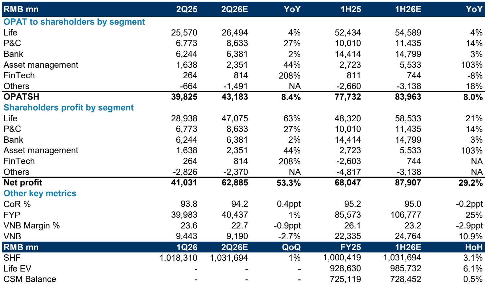
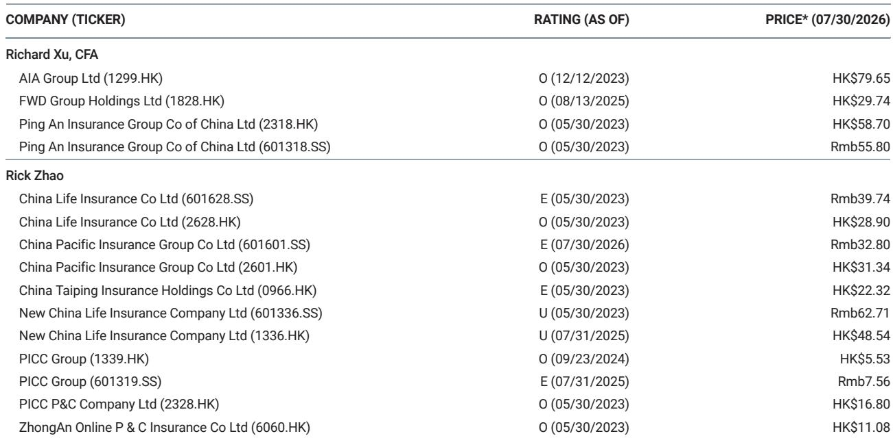

# MS：中国平安上半年业绩前瞻与寿险新业务价值增速观察

中国平安将于8月20日盘后发布2026年上半年业绩。MS在7月30日的报告中预计，公司上半年归母净利润同比增长29%，其中二季度单季增速可能超过50%，主要受权益市场回升带动。这份报告更值得关注的判断在于：寿险新业务价值（VNB）上半年增速可能节奏变化至11%，二季度单季或出现3%的同比下滑，但管理层仍维持全年双位数增长目标。

报告认为，在0.77倍2027年预期市净率和6.0%股息率的估值水平下，市场风格轮动使这类高股息资产的吸引力上升。净资产的环比增长、分红提升以及资产管理板块的扭亏进展，构成这份业绩前瞻的另外几条线索。

## 1. 二季度净利润增速可能超过50%，但全年基数效应需留意

MS预计上半年归母净利润同比增长29%，其中二季度单季增速可能达到53%。增长主要来自寿险和资产管理两个板块：寿险股东利润上半年预计同比增长21%，资产管理板块的股东利润预计同比增长103%，由标的业务驱动。

报告同时指出，中国平安的净利润增速可能不及部分同业（后者上半年同比增速可能超过50%），原因在于公司持有较多高股息FVOCI公司，权益市场上涨对利润的传导路径不同。但下半年的比较基数相对同业更轻松，这为全年利润表现留出空间。

> **KC评论：** 净利润增速的行业比较需要看资产配置结构。高股息FVOCI持仓占比高的公司，权益上涨更多体现在净资产而非当期利润，这是理解平安与同业利润增速差异的关键。

## 2. 寿险新业务价值二季度或现3%下滑，全年目标仍为双位数

报告预计上半年VNB同比增长10.9%，但二季度单季可能同比下降2.7%。银保渠道的阶段性调整是短期影响因素之一。三季度面临更高的比较基数，而四季度基数较低（2025年四季度VNB仅占全年3.2%，受假设调整影响），这为全年实现双位数增长目标提供支撑。

合同服务边际（CSM）余额上半年预计环比增长0.5%，全年同比增长约1%。管理层关于CSM余额提升和资产管理板块2026年实现盈利的指引，目前进展符合预期。

## 3. 产险综合成本率改善0.2个百分点，银行与资产管理板块各有看点

产险上半年综合成本率预计为95.0%，较去年同期改善0.2个百分点，与同业水平相当。公司预计若灾害损失可控，全年综合成本率将保持平稳（2025年为96.8%）。银行板块上半年净利润预计同比增长3%，符合预期。资产管理板块的OPAT同比增长103%，主要来自标的业务，地产影响可能已不显著。

净资产上半年预计环比增长3.1%，在分红派息和OCI公司市值调整之后仍保持增长。每股股息同比增长5.6%，延续了分红提升的趋势。

> **KC评论：** 资产管理板块从亏损到盈利的转变，是这份报告里容易被忽视的结构性变化。如果标的业务贡献持续，这一板块对集团利润的影响将明显减弱，估值修复的逻辑也会更完整。

## 4. 观察框架：从VNB增速、CSM余额与股息三条线跟踪业绩兑现

报告提供了一套可复用的跟踪框架。第一条线是VNB增速：二季度下滑是否如预期收窄，三季度高基数下能否守住正增长，四季度低基数能否推动全年实现双位数目标。第二条线是CSM余额：上半年环比增长0.5%的幅度虽然不大，但CSM作为未来利润的储备池，其趋势比单季利润更能反映寿险业务的真实质量。第三条线是股息：每股股息同比增长5.6%，在净资产增长和分红率提升的背景下，这一指标对高股息资金的吸引力具有直接意义。

报告同时提示了需要持续观察的不确定性因素：中国权益市场和利率的波动、持续低利率环境下的资产与地产不确定性、股东观点偏谨慎不确定性，以及资本水平和股息派发的可持续性。这些因素在8月20日业绩发布后会有更清晰的验证。

For informational purposes only. Portions may be generated,translated,summarized,or edited with AI assistance based on source materials and may contain omissions or errors. Please verify independently. This is not investment,legal,tax,accounting,or other professional advice.

