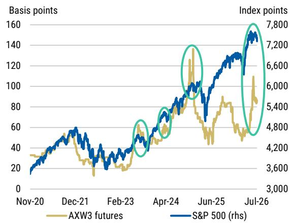
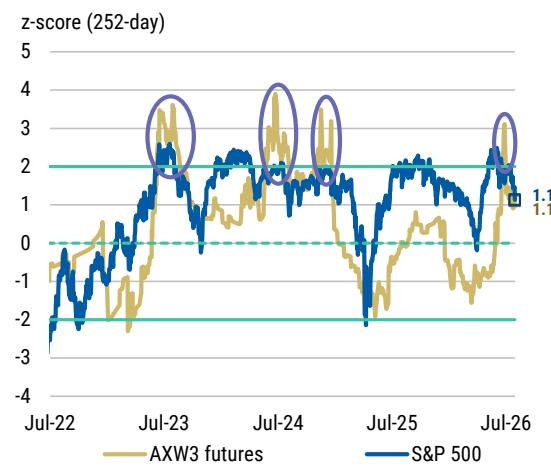
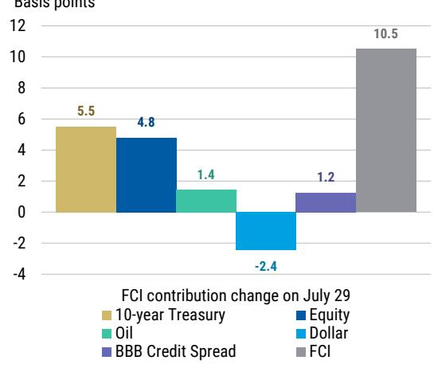
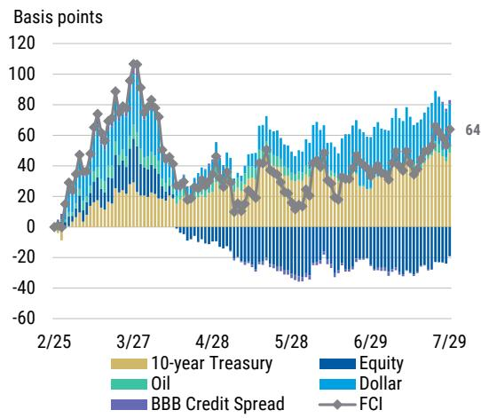
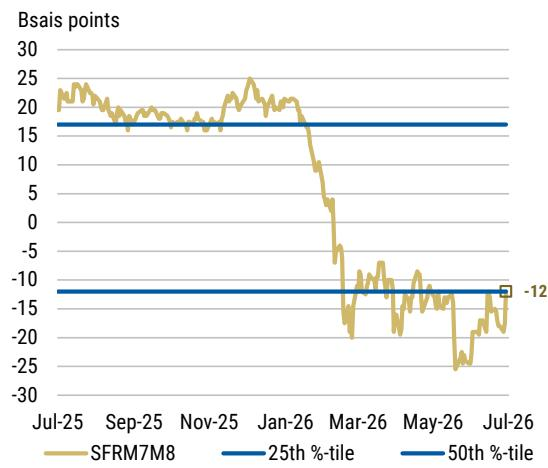
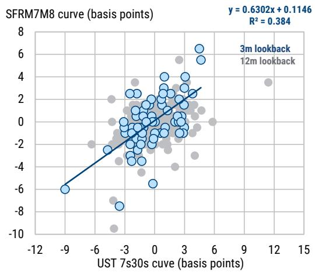
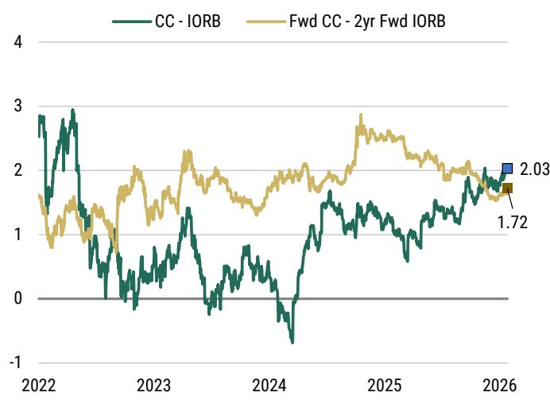
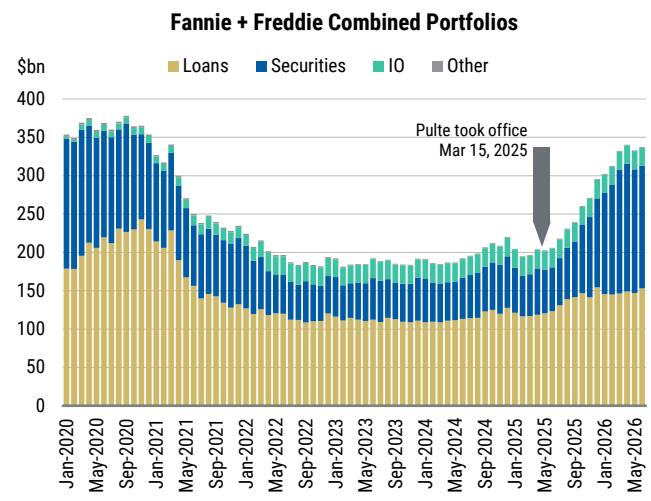
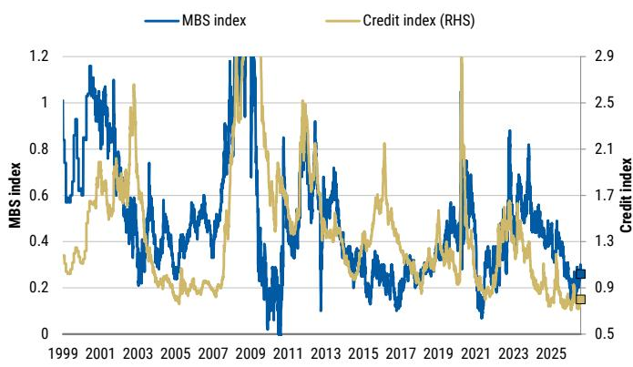
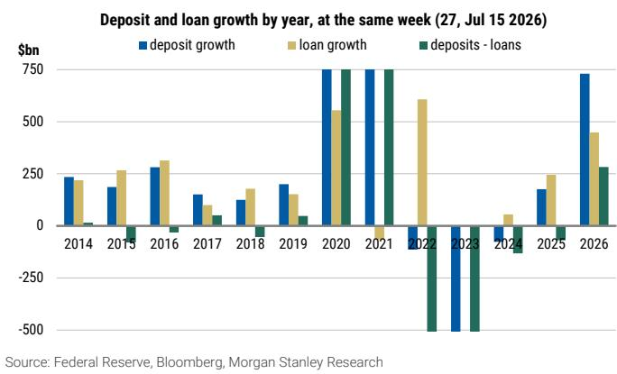

July 30, 2026 12:45 AM GMT

US Economics and Fixed Income Strategy | North America

# July FOMC Reaction: A question of credibility

We maintain our view that the Fed will remain on hold this year. Chairman Warsh's comments imply the bar to hike may be higher than some expected. We forecast disinflation ahead, but stickier inflation is a risk to our call.

## Key points

- The FOMC held the target range for the funds rate unchanged at 3.50-3.75%, but with 3 dissents in favor of a hike from Reserve Bank Presidents Hammack, Kashkari, and Logan.

- The Chair's desire to take time to "understand the underlying and generalized change in prices that are happening in the economy" and "see whether we can't separate the noise from the signal" suggests the bar for rate hikes is likely higher than markets previously thought.

- We retain our outlook for no Fed hikes this year given our expectations for disinflation in coming months. If inflation remains sticky, then we think the Fed will move to rate hikes this year, perhaps as early as September, but we see potential conflict between the Chair's reaction function and the rest of the committee.

- Our rates strategists think the yield curve steepens further unless inflation comes in higher than consensus expects and Chair Warsh clarifies his press conference remarks on inflation. A steeper curve tightens financial conditions, and tighter financial conditions support a steeper yield curve. They suggest investors stay in the SFRV6 96.125/96.25 call spreads at 3.25 ticks (ref. SFRZ6 at 95.84), stay in UST 7s30s curve steepeners and SFRM7M8 curve steepeners, and remain long 2y UST-SOFR swap spreads.

- Our FX strategists continue to see downside risks to the dollar. A softer NFP figure on August 7th followed by another CPI miss the following week could be enough to convince investors that, while the FOMC maintained some emphasis on its willingness to defend the $2\%$ inflation goal, the necessity to do so isn't demonstrated in the data. Should it become clearer that investors will begin to price out these hikes, we think EUR/USD has room to continue its break higher as rate differentials move in EUR's favor and the USD discount to rate differentials remains.

- Our agency strategists maintain their tactical underweight on mortgage basis.

<table><tr><td colspan="2">MS &amp; CO. LLC</td></tr><tr><td colspan="2">Michael T Gapen</td></tr><tr><td colspan="2">Chief US Economist</td></tr><tr><td>Michael.Gapen@morganstanley.com</td><td>+1 212 761-0571</td></tr><tr><td colspan="2">Matthew Hornbach</td></tr><tr><td colspan="2">Strategist</td></tr><tr><td>Matthew.Hornbach@morganstanley.com</td><td>+1 212 761-1837</td></tr><tr><td colspan="2">Jay Bacow</td></tr><tr><td colspan="2">Strategist</td></tr><tr><td>Jay.Bacow@morganstanley.com</td><td>+1 212 761-2647</td></tr><tr><td colspan="2">Sam D Coffin</td></tr><tr><td colspan="2">Economist</td></tr><tr><td>Sam.Coffin@morganstanley.com</td><td>+1 212 761-4630</td></tr><tr><td colspan="2">Diego Anzoategui</td></tr><tr><td colspan="2">Economist</td></tr><tr><td>Diego.Anzoategui@morganstanley.com</td><td>+1 212 761-8573</td></tr><tr><td colspan="2">Arunima Sinha</td></tr><tr><td colspan="2">Global Economist</td></tr><tr><td>Arunima.Sinha@morganstanley.com</td><td>+1 212 761-4125</td></tr><tr><td colspan="2">Heather Berger</td></tr><tr><td colspan="2">Economist</td></tr><tr><td>Heather.Berger@morganstanley.com</td><td>+1 212 761-2296</td></tr><tr><td colspan="2">Lingdi Xu</td></tr><tr><td colspan="2">Economist</td></tr><tr><td>Lingdi.Xu@morganstanley.com</td><td>+1 212 761-2957</td></tr><tr><td colspan="2">Andrew M Watrous</td></tr><tr><td colspan="2">Strategist</td></tr><tr><td>Andrew.Watrous@morganstanley.com</td><td>+1 212 761-5287</td></tr><tr><td colspan="2">Martin W Tobias, CFA</td></tr><tr><td colspan="2">Strategist</td></tr><tr><td>Martin.Tobias@morganstanley.com</td><td>+1 212 761-6076</td></tr><tr><td colspan="2">Mark T Schmidt, CFA</td></tr><tr><td colspan="2">Strategist</td></tr><tr><td>Mark.Schmidt1@morganstanley.com</td><td>+1 212 296-8702</td></tr><tr><td colspan="2">Aryaman Singh</td></tr><tr><td colspan="2">Strategist</td></tr><tr><td>Aryaman@morganstanley.com</td><td>+1 212 761-1993</td></tr><tr><td colspan="2">Eli P Carter</td></tr><tr><td colspan="2">Strategist</td></tr><tr><td>Eli.Carter@morganstanley.com</td><td>+1 212 761-4703</td></tr><tr><td colspan="2">Janie Xue</td></tr><tr><td colspan="2">Strategist</td></tr><tr><td>Janie.Xue@morganstanley.com</td><td>+1 212 761-6051</td></tr><tr><td colspan="2">Molly Nickolin</td></tr><tr><td colspan="2">Strategist</td></tr><tr><td>Molly.Nickolin@morganstanley.com</td><td>+1 212 761-3592</td></tr></table>

MS does and seeks to do business with companies covered in MS. As a result, investors should be aware that the firm may have a conflict of interest that could affect the objectivity of MS. Investors should consider MS as only a single factor in making their investment decision.

For analyst certification and other important disclosures, refer to the Disclosure Section, located at the end of this report.

- Our muni strategists think muni yields will catch up to the UST rate move. They favor the muni curve 22Y and in, and prefer 5% coupon structures over lower coupons.

MS & CO. LLC
Michael Gapen
Michael Gapen@morganstanley.com
+1 212 761-0571

Sam.Coffin@morganstanley.com +1 212 761-4630

Diego.Anzoategui@morganstanley.com +1 212 761-2305

Arunima.Sinha@morganstanley.com +1 212 761-4125

Heather.Berger@morganstanley.com +1 212 761-2296

Lingdi.Xu@morganstanley.com +1 212 761-2957

## July FOMC meeting: A question of credibility

Financial markets went into today's July FOMC meeting thinking the new Fed chair might take decisive action on interest rates to establish inflation-fighting bona fides, regardless of favorable incoming data. They likely came out of the meeting more confused than they went in.

If one of the main potential outcomes of the July FOMC meeting was that the Fed would surprise with a rate hike and markets would price in additional rate hikes going into year-end, that clearly didn't happen and prospects for this path going forward have been diminished. Chair Warsh does not appear to want to hike for credibility reasons.

However, we don't fully know what not hiking at the July FOMC means. We thought the Fed would stay on hold in July because softer employment data and favorable inflation data during the intermeeting period meant a hike in July was less compelling than a hike in June. Chair Warsh said this was not true and emphasized that June inflation played little to no role in the committee's decision. In fact, he refrained from characterizing the economy outside of robust AI-related spending and resilient growth.

## Key takeaways:

Is the bar for rate hikes higher? The Chair's desire to take time to "understand the underlying and generalized change in prices that are happening in the economy" and "see whether we can't separate the noise from the signal" suggests the bar for rate hikes is higher than previously thought, particularly if the Chair is going to look at a "broader set of inflation data than PCE" to determine if the Fed is meeting its mandate. Market reactions to reduce rate hike probabilities, steepen the yield curve, and increase breakevens would be consistent with this interpretation. We pose this conclusion as a question because the answer is unclear, but the inference is not.

We retain our outlook for no Fed hikes this year. Our view is that forthcoming disinflation will keep the Fed on the sidelines for the remainder of this year. We continue to expect that payback from tariff price pressures, diminishing shelter inflation, relatively muted second-round effects from oil prices, and other factors will keep year-on-year rates of inflation heading lower. If so, the Fed can stay on hold into year end, and it could reward the Fed's decision today to remain patient.

A potential conflict between the Chair's reaction function and the rest of the FOMC. If inflation remains sticky and convergence to the 2% target remains in doubt, then we think the Fed will move to hike later this year, perhaps as early as September. We see potential conflict between the Chair's reaction function – which appears to have a higher bar for rate hikes than markets previously assessed – and the rest of the committee, who we think will take their signals from inflation data in the months ahead.

We have the following high-level takeaways from the July FOMC meeting:

No rate hike. As we expected, the Fed held steady at the July FOMC meeting, maintaining the target range for the federal funds rate at 3.50-3.75%. Even though Chair Warsh appears to have a non-traditional reaction function that downplays the signal from incoming data, the rest of the FOMC remains more conventional in its thinking. We expected that thinking to mean the Fed will prefer to see more data before taking any decision on interest rate policy.

Three dissents in favor of hikes. The decision to maintain the target range for the federal funds rate at 3.50-3.75% was not unanimous like it was in June. The vote to keep interest rates unchanged was 9-3, with Reserve Bank Presidents Hammack, Kashkari, and Logan voting to raise the federal funds rate by 25bp. We expected two dissents, from Presidents Logan and Hammack, so the outcome was largely in line with our thinking. Dissents in favor of hikes suggests the committee as a whole moved closer to raising rates, though the chair's comments in the press conference cloud this conclusion.

Market movements carry more weight than data for the chair. Chair Warsh appears to extract little information about the economy from the evolving data backdrop, preferring to look at longer-run trends than month-to-month movements in the data. Instead, he sees Treasury yields, the evolution of real and nominal interest rates, the dollar, and equity markets – broad measures of financial conditions – as decentralized signals (some might say forecasts) of US economic fundamentals. As he said in the press conference:

"Market prices are a valuable, real-time source of information about growth, inflation, and financial conditions, but the Fed's job is to learn from those signals, not mechanically follow them."

There is certainly truth to this view. We agree market movements contain important signals. Where we differ with the Chair is about whether market movements are an uncontaminated signal for the Fed. The Chair seems to think that by pulling back on communication, the Fed can extract market views that are independent of the Fed's thinking (or reaction function). At various points in the press conference, he said:

"By not spoon-feeding markets. By not previewing our decisions. By not sort of giving nudges and leans, my colleagues and I have found in the intermeeting period, what we're getting is the views from a very accomplished economist. That's the internals of financial markets, instead of just repeating or echoing what we're saying back to us, they're giving us somewhat, not perfect, their own judgment."

"We're trying not to interfere with that market signal. It's part of the reason why we've been somewhat spare in our words and pulled back from forward guidance, so they're reacting to events I would say much more directly over the 42 days since we last met."

"Market participants are learning to play the ball, not the referee, and market prices will continue to respond in the direction and magnitude they see fit."

We are not convinced. In fact, we strongly disagree. We find it hard to believe that financial markets see and evaluate a piece of data without thinking how the Fed might react. In fact, during the intermeeting period, markets responded to upside risk to inflation from rising oil prices by pricing in rate hikes, pushing real yields higher, and keeping breakevens low. This response was due, in part, to communication from the Chair and others on the FOMC and views on what the Fed's reaction function might be.

Yes, the market can do some of the heavy lifting for the Fed, but if and only if the Fed validates those market signals at some point by taking action (to ease or tighten monetary policy, for example).

Is a redefinition of price stability in the works? Chair Warsh said the Fed's official inflation target remains 2% PCE inflation, but he does not believe PCE alone adequately captures the underlying inflation process. He appears to be looking across a broader range of inflation indicators to estimate what he calls the "underlying generalized change in prices," and he is deliberately unwilling to disclose the precise framework because he does not want markets to anchor on a particular indicator or formula.

The risk is Chair Warsh may be playing with fire here. Markets can be forgiven for thinking this sounds very much like a Fed Chair who thinks the official target is 2% PCE, but who privately has a more expansive concept of what constitutes true price stability. We view post-meeting financial market moves through this lens.

In a response to his views on what constitutes price stability, he said:

"The Federal Reserve every January outlines a statement of purposes and strategy and in that strategy document... it describes a measure of PCE inflation as the objective function there. So that's our number, we're sticking with it."

Then he followed with,

"Some version of the Lucas critique, some version of Goodhart's Law in economics should remind us that when we talk about measures of inflation or something else, and we describe those measures as being consistent with our objectives, we might make them such that they are not very good measures or very good objectives."

"Broadly, if you said to me standing in front of you, I abide fully by the strategy document, we're going to deliver 2% inflation and not a whisper more, but to achieve that, I'm looking at a broader set of inflation data than PCE...Without sort of fully revealing my cards...I will not tell you exactly how I'm measuring underlying inflation...I'm trying to understand like my colleagues what's the underlying

generalized change in prices that are happening in the economy."

More comfortable with front-end volatility. Even though Chair Warsh places a lot of weight on market movements and financial conditions, he also said the Fed's job is "to learn from those signals, not mechanically follow them." In other words, the Fed should talk less, take a step back, let markets call balls and strikes, and then the Fed should debate what is the right course of action. This suggests to us that he has a greater degree of comfort with volatility. He wants to see the market moves, interpret their meaning, but not necessarily validate those views.

A murky interest rate transmission mechanism. On one hand, Chairman Warsh appears to believe that higher interest rates can be part of the solution to reduce inflation and expressed a general willingness to tighten policy when underlying inflation is too high. However, he does not appear to view monetary policy primarily through a traditional aggregate-demand-management framework. He repeatedly backs away from any trade-off between higher interest rates, softer demand, and weaker labor market conditions, saying there is no explicit trade-off. This may be true in the longer run – achieving price stability can improve long-run macro outcomes – but standard central bank thinking says higher interest rates that lead to softer demand can help reduce inflation, and this can often mean temporarily softer labor market conditions.

Instead, we read his comments to say that he sees monetary policy operating through a combination of financial conditions, real interest rates, market prices, credibility, inflation expectations, and balance-sheet effects. This in and of itself is not controversial. However, in his framework, it sounds to us like he thinks rate hikes are an important tool, but one that works alongside broader monetary and financial channels, including the balance sheet. Indeed, he appears to believe that restoring confidence in the Fed's commitment to price stability and allowing markets to generate informative price signals may be nearly as important as changes in the policy rate itself.

A longer-horizon view on dual mandate convergence. When asked about the importance of the June inflation data in the decision to stay on hold, Warsh rejected its importance and instead emphasized he looks at policy on a meeting-to-meeting basis. He said:

"I'd like to believe that the Committee shares my views which is the historic problem with data dependence is the data and the dependence...We are not relying on any one individual piece of data as cover or as an excuse, or as validation...What I care about and what I think the Committee cares about is trends on the data."

In our view, this means a Warsh-led Fed is not measuring the speed of convergence to dual mandate outcomes on a high-frequency, meeting-to-meeting basis. Instead it may take longer for Chairman Warsh to conclude deviations from target warrant a response. We think this could mean greater volatility in financial markets in the meantime from a Fed that may more less frequently, but one that moves more rapidly when it does.

## Exhibit 1: July FOMC statement

The Federal Open Market Committee approved the following statement for release by a 12-09-3 vote:

The Committee decided to maintain the target range for the federal funds rate at 3-1/2 to 3-3/4 percent, in support of the Federal Reserve's dual mandate. The Committee reaffirmedis continuing its policy of maintaining ample reserves in the banking system.

Economic activity is expanding at a solid pace despite elevated uncertainty that owes, in part, to the conflict in the Middle East. Productivity growth and capital investment are strong. Job gains have kept pace with the workforce, and the unemployment rate has changed little.

Inflation remains elevated relative to the Committee's 2 percent goal, in part reflecting supply shocks that have driven price increases in certain sectors, including energy. The Committee will deliver price stability.

Voting against the monetary policy action were Beth M. Hammack, Neel Kashkari, and Lorie K. Logan, who preferred to raise the target range for the federal funds rate by 1/4 percentage point at this meeting.

Source: Federal Reserve Board, MS

# Global Macro Strategy

MS & CO. LLC
Matthew Hornbach, CMT
+1 212 761-1837
Matthew Hornbach@morganstanley.com

Matthew.Hornbach@morganstanley.com

Martin Tobias, CFA, CMT
Martin.Tobias@morganstanley.com +1 212 761-6076

Aryaman Singh +1 212 761-1993

Aryaman Singh
Aryaman@morganstanley.com +1 212 761-1993

Eli.Carter@morganstanley.com +1 212 761-4703

## Stick with the curve steepener

Chair Warsh hinted at the idea that financial conditions tightened sufficiently enough to forgo a rate hike at this meeting. But we don't think investors reacted as much to that rationalization as they did to his description of inflation, its measurement, his assessment of it, and the exact metric the Fed targets.

The reaction in macro markets – a bear steepening of the curve, wider breakeven inflation rates, a weaker US dollar, and lower equity market prices – suggests strongly that investors (1) disagree that financial conditions tightened enough to expect lower inflation ahead, (2) dislike the idea of shifting the inflation goal post, and/or (3) disagree with the Chair's assessment of underlying inflation and its risks.

- We think investors primarily interpreted his comments as a possible shifting of the goal posts – as defined by PCE inflation and its core PCE cousin.

We think Warsh could more easily assuage these investor concerns than concerns investors may express about the relationship between financial conditions and appropriate monetary policy. At the same time, if investors remain concerned about the inflation goal posts moving, the following feedback loop may take hold:

- A bear-steepening of the yield curve $\rightarrow$ tighter financial conditions $\rightarrow$ lower odds the Fed will hike rates, independent of the inflation outlook $\rightarrow$ a bear-steepening of the yield curve $\rightarrow$ tighter financial conditions $\rightarrow$ lower odds the Fed will hike rates, independent of the inflation outlook $\rightarrow$ etc.

We don't think this feedback loop lasts for very long, but it does support our view for a steeper Treasury curve. What can break this feedback loop?

- Clarify the goal posts: With feedback from market prices in hand, Chairman Warsh may decide to clarify his comments about inflation, its measurement, and the Fed's PCE inflation target. This might go some way to assuaging investors concerns that goal posts did not shift and, just as importantly, will not shift next year.

• This may flatten the yield curve somewhat.

- Lower-than-expected inflation data: If inflation softens over the coming months, as our economists expect, investor nerves should calm and breakeven inflation rates should moderate.

• This should steepen the yield curve.

- Hawkish policy action, relative to now-more-dovish expectations: if inflation doesn't moderate as expected, based on tighter financial conditions, then Warsh may conclude that financial markets didn't tighten financial conditions enough on their own – necessitating a higher monetary policy rate than priced by markets.

- Initially, higher inflation data may steepen the yield curve until the Fed responds with hawkish policy action – action that will flatten the yield curve.

In the view of our economists, inflation should come in lower than consensus expectations. And, in our view, that should keep the yield curve steepening. If inflation comes in higher than consensus expects, we think the yield curve would flatten.

But if inflation comes in close to consensus expectations – which sit higher than those of our economists – we think the odds would favor a steeper yield curve until Chair Warsh clarifies his comments relating to the inflation goal post.

## The Theory of Reflexivity: stay in SFRM7M8 steepeners

In Equity Funding: A Macro Variable, we introduced a framework that linked the transmission from equity financing microstructure to tighter macro financial conditions.

- We think investors need to be cognizant of financing costs (measured via AXW futures), dealer equity repo exposure, balance sheet capacity, and leverage concentration when evaluating the equity contribution to financial conditions.

As dealer balance sheet capacity becomes scarce relative to client demand for leverage, financing costs rise, increasing the hurdle rate for maintaining leveraged long positions.

Exhibit 2: Generic third, quarterly AXW futures contract and the S&P 500 since December 2020  
  
Source: MS, Bloomberg

Exhibit 3: Generic third, quarterly AXW futures contract and the S&P 500 since July 2022, rolling 252-day z-score  
  
Source: MS, Bloomberg

If financing costs are too prohibitive, they may ultimately limit the ability of levered investors to further increase gross exposure. In that scenario, markets that have benefited from financing-related demand could become more vulnerable to deleveraging.

- As shown in Exhibit 2, more prohibitive equity financing costs (i.e., the price of levered equity positioning) have coincided with peaks in the S&P 500.

The implication is financing costs for hedge funds to put on levered longs become so prohibitive it caps additional leverage, or it makes maintaining current positions less compelling from a returns standpoint, leading to position unwinds.

- Said another way, the same technical forces that amplify upside momentum in risky assets – through leverage expansion – could also cut in the other direction.

In Exhibit 3, we show that there is a statistical relationship between equity funding costs and the S&P 500. When equity funding cost proxies reach extreme levels (>2 z-scores), S&P 500 performance has mean reverted over the next three months.

- Said another way, when the degree of equity financing stress reaches statistically unusual levels, subsequent equity returns have normalized.

AXW3 futures reached >2 z-scores on June 18 and we think this transmission from equity financing microstructure to broader macro financial conditions now becomes all the more salient after the reaction in macro markets to Chair Warsh's press conference.

- Our economists' Financial Conditions Index, based on the FRB/US-based model, aims to capture how changes in asset prices will weigh on future economic activity.

It illustrates the equivalent change in the federal funds rate, expressed in basis points, required to generate a similar effect on economic activity.

The index includes five daily variables: 10-year Treasury yield, S&P 500 returns, BBB corporate credit spread, the valuation of the U.S. dollar, and the price of oil.

Exhibit 4: MS Financial Conditions Index, expressed as the equivalent change in the fed funds rate in basis points on July 29  
  
Source: MS estimates

Exhibit 5: MS Financial Conditions Index, expressed as the equivalent change in the fed funds rate in basis points since February 25  
  
Source: MS estimates

- These are aggregated based on their estimated growth elasticities relative to the fed funds rate, using the Federal Reserve's FRB/US model.

In Exhibit 4, we show that financial conditions tightened by 10.5bp on July 29. Amidst the bear-steepening of the yield curve, 10-year Treasury yields tightened financial conditions by 5.5bp while lower equity market prices tightened financial conditions by 4.8bp.

- For much of the last three months, equities eased financial conditions, on net, in a narrow breadth, high leverage reliance regime (see Exhibit 5).

Should the aforementioned feedback loop persist, we think constraints on balance sheet capacity, current leverage concentration, and elevated financing costs likely prompt equities to stop offsetting tighter conditions and begin reinforcing them.

Tighter financial conditions are a factor supporting M7 outperformance vs. M8 and a steeper SOFR M7M8 futures curve. M7M8 steepeners also have a better correlation to – and complement – our core UST 7s30s steepener view (Exhibit 6 and Exhibit 7).

If investors are not cognizant of financing costs (AXW futures), dealer equity repo, and balance sheet capacity when evaluating the equity contribution to financial conditions, they may underestimate the risks beneath what otherwise appear to be resilient equity indexes.

Exhibit 6: SOFR M7M8 curve over the past year with 25th and 50th %-tile ranges  
  
Source: MS, Bloomberg

Exhibit 7: UST 7s30s curve and SOFR M7M8 curve daily changes over the past year  
  
Source: MS, Bloomberg

- Trade idea: Maintain SFRV6 96.125/96.25 call spread for 3.25 ticks (ref. SFRZ6 at 95.84).

- Trade idea: Maintain UST 7s30s steepeners, DV01 neutral, at 66bp with a target of 100bp and stop of 50bp.

- Trade idea: Maintain long 2-year (Sep '27) UST SOFR swap spreads at -10.6bp with a target of -9bp and a trailing stop of -13.5bp.

- Trade idea: Maintain SFRM7M8 curve steepeners at -12bp with a target of -4bp and an initial stop of -26bp.

## Remember, you have to do your own homework

Similar to the first press conference, the outcome of the second press conference largely adhered to our views about how things might change for the US rates market under a Kevin Warsh chairmanship (see A Kevin Warsh-led Federal Reserve and US Treasuries). The first key takeaway in that note:

- A Federal Reserve led by Kevin Warsh could allow for higher interest rate volatility and greater signaling qualities of macro markets.

In the note, we made the following point, the essence of which Chair Warsh conveyed in his press conference remarks for the second meeting in a row:

A Fed that steps away from the spotlight via

- fewer communications with the investing public (think: fewer media interviews with Federal Reserve bank presidents, fewer pre-meeting discussions with reporters) and/or

- different types of communications (think: removal of the dot-plot or Summary of Economic Projections)

would likely free investors to rely on their own assessment of economic data and the evolution of the Fed's reaction function as opposed to relying on FOMC participants to lead the way. Less forward guidance from FOMC participants suggests less consensus among investors and more policy surprises – both of which could mean higher levels of realized volatility as risk exposures change hands more often.

As investors express their own views in markets more so than parrot the Fed's own views back to it, the set of financial conditions the Fed observes should contain more meaning. In many ways, the more the Fed lets markets speak, the more clarity it might receive when listening to them.

We have reviewed FOMC meeting transcripts from 2006-2011 with a focus on statements made by then-Governor Kevin Warsh and have presented key takeaways from our reading of the transcripts. We summarized 108,347 transcript words into 2,727. Below, we repeat the lessons that reminded us of what we heard in Warsh's first press conference:

## Warsh on markets

Warsh didn't like to keep the market beholden to the Fed's view of growth, inflation, and monetary policy. He wanted the market to take its own view, both of how the economy is evolving relative to the Fed's mandate and how the Fed should react to that evolution. He was comfortable with the market having a different view than the Fed, but he won't necessarily reinforce the market's view if it differs from his.

He didn't seem to mind the idea of disappointing market expectations, but was conscious about the "right time" to do it. He gave markets credit for healing on their own, and didn't think Fed policies, while necessary, deserve "a disproportionate amount of credit".

## Warsh on Fed communications

Warsh believed that Fed debates shouldn't be aired in public. He thought the markets judge the Fed's actions more than its words. He saw the chairman's communications with the public as paramount. He viewed the Monetary Policy Report as a key avenue to "set the tone" for business leaders. Regarding the SEP, Warsh didn't seem to mind giving economic projections, but didn't like the idea of assigning appropriate policy projections to them, given concern the market would misinterpret them as "policy commitments".

Warsh was very against assigning names/numbers to individual projections. Warsh supported the idea of longer-term economic projections, but thought the benefits would be largely felt within the FOMC in that it would allow participants to better understand each other's views. Warsh thought the Fed's credibility is more important to its impact on the economy than its ability to cut rates. Despite not liking QE, once it was voted for, he thought the Fed “should work to achieve that existing commitment, for credibility purposes.”

## Warsh on financial conditions

Warsh was versed in speaking about financial conditions. He thought about the degree of accommodation as...

...a function both of our target fed funds rate and what the financial markets do with it, by which I don't mean just what the expected fed funds targets are out in the future, but the transition mechanism.

He subscribed to the idea that higher Treasury yields tighten financial conditions. He spoke about term premiums and volatility (both VIX and MOVE), and looked at the T-bill market, the Treasury repo market, and the percentage of cash holdings in money market funds to see if markets were operating normally.

Warsh also spent time talking about the importance of the wealth effect...

...[an] increase of, say, 30 percent on average in asset values from spring until now might be more consequential than all of the fiscal stimulus packages in trying to help get this economy going again. And to the extent that those wealth effects are reversed, I think that's likely to be hugely consequential.

# US Agency MBS – Still Underweight

MS & CO. LLC

Jay Bacow

Jay.Bacow@morganstanley.com

+1 212 761-2647

Janie Xue

MS & CO. LLC

Janie.Xue@morganstanley.com

+1 212 761-6051

Chair Warsh laid out an environment where "The message from markets is the message from markets." In our view, that's one where markets are going to have to rely on data, geopolitics, and minimal guidance from the Fed. With two inflation prints before the next FOMC meeting, there is much uncertainty around the Fed path both near and short term – we think that uncertainty could extend beyond the September meeting as well if the emphasis continues to be on data dependence. The Fed's meeting minutes and public commentary by other board members will be interesting if they illuminate more specific metrics the Fed is considering, but our expectations is that markets are not going to get much guidance. For instance, Chair Warsh commented, "[W]ithout sort of fully revealing my cards, I'm trying to understand, like my colleagues, what's the underlying generalized change in prices that are happening in the economy."

If the Fed has decided to provide less guidance, then there will be less shock absorbers in the system, and we think this results in higher volatility. This is definitely a concern for the mortgage basis, and one reason why we advocate for a mortgage short despite valuations that have cheapened somewhat. We remain concerned that the lack of clarity in the Fed path will table demand technicals, and specifically demand from banks. However, the selloff in MBS may also cause some overseas investors to stop out of duration longs, which also would hurt demand, and FX hedging costs are still elevated.

Exhibit 8: Yield on mortgages doesn't look as attractive to the forwards  
  
Source: Bloomberg, MS

Exhibit 9: The GSEs have essentially kept their portfolios flat through 2Q  
  
Source: Fannie Mae, Freddie Mac, MS

The GSEs have essentially maintained flat portfolios over the second quarter too. Any benefit of yield curve steepening are mitigated by the fact that the mortgage market isn't particularly concerned about prepays right now. We are also waiting for clarity around the task forces, specifically the balance sheet. While we don't think the Fed is going to sell MBS anytime soon, we would not be surprised to see headlines around the balance sheet task force discussing what those sales would look like, another negative. Lastly, the forward yield on mortgages doesn't look attractive, either. Mortgages look wide vs Fed funds, but that's more about the steepening of the yield curve, and we think the regional bank crisis and tightening cycle after COVID has taught banks a lesson about simply moving out of cash and into MBS duration.

Exhibit 10: Mortgage spreads have moved wider, especially vs. IG credit  

Exhibit 11: Bank deposit growth is still outpacing loan growth  
  
Source: Federal Reserve
