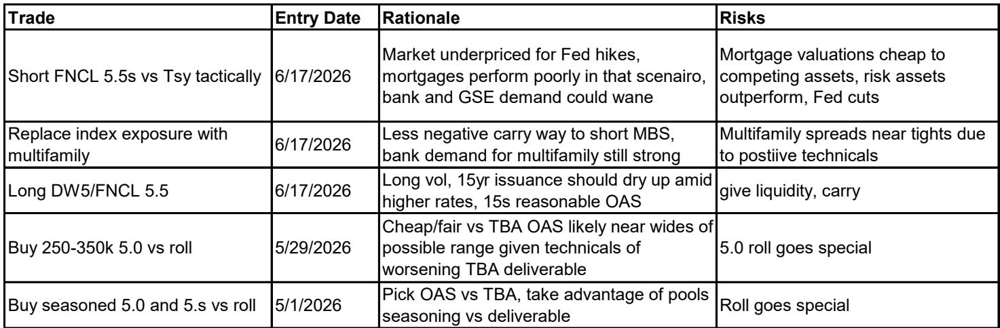
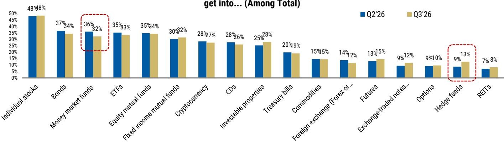
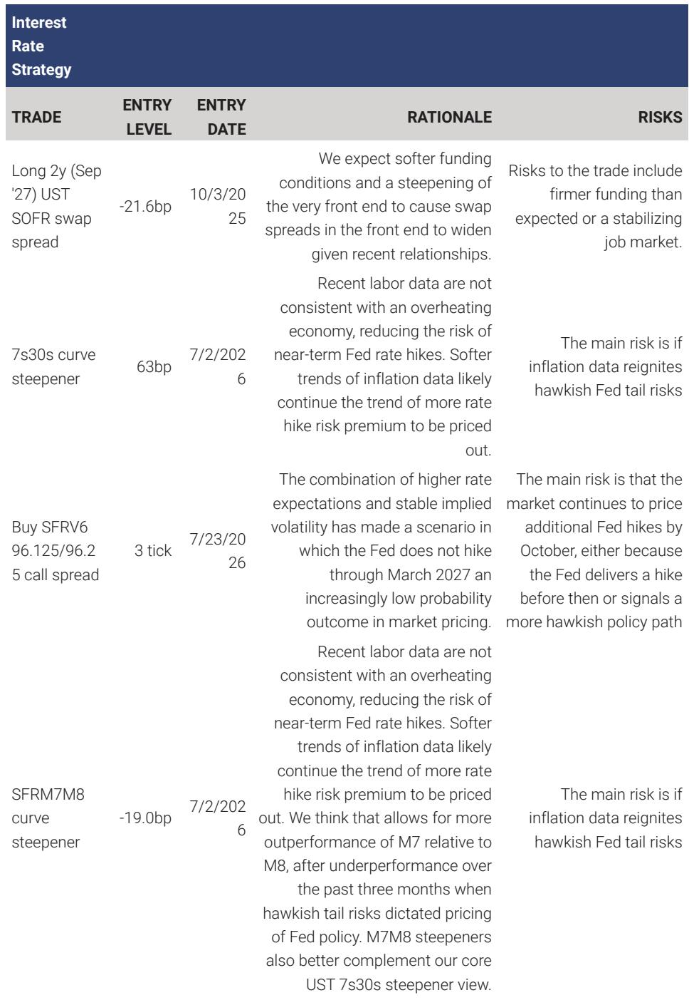

# MS：研究主题与行业变化观察

2026年7月30日，美联储在FOMC会议上将联邦产品利率目标区间维持在3.50%-3.75%不变，投票结果为9比3，三位地区联储主席投下加息25个基点的反对票。MS在会后研报中提出一个核心判断：新任主席Warsh对加息的态度比市场此前评估的更为谨慎，年内继续按兵不动的概率较高，但这一判断能否成立，取决于未来几个月的通胀数据是否如该机构预期的那样回落。

这份报告最有信息量的部分，不是利率决议本身，而是主席在新闻发布会上的措辞。Warsh明确表示，不想为了建立“抗通胀信誉”而加息，并强调需要时间“理解宏观环境中正在发生的、普遍而广义的价格变化”，试图“把噪音从信号中分离出来”。MS认为，这种表述意味着加息的门槛可能比市场原先认为的更高，尤其是当主席表示要参考比PCE更广泛的通胀指标时。

## 1. 主席对市场信号的依赖程度高于对单一数据的依赖

Warsh在发布会上多次表示，市场价格的变动是宏观环境增长、通胀和资金条件的实时信息来源，美联储的工作是“从这些信号中学习，而不是机械地跟随”。他提到，通过减少前瞻指引、不预告决策、不给出暗示，委员会在两次会议之间的42天里获得了来自市场内部人士的独立判断，而不是市场对美联储立场的回声。

MS对此明确表示不同意。报告认为，市场在评估数据时不可能不猜测美联储的反应函数。以本次会议前的时期为例，油价上涨带来的通胀上行不确定性让市场迅速定价加息，推高实际回报表现并压低盈亏平衡通胀率——这一反应本身就部分源于市场对Warsh及其同事沟通方式的解读。报告指出，市场可以为美联储分担一些工作，但前提是美联储在某个时点通过实际行动验证这些市场信号。

> **KC评论：** 这里的分歧实质上是“市场是否独立于央行”的认知差异。Warsh认为减少沟通能让市场给出更纯粹的判断，但MS指出，市场定价从来都包含对央行行为的预期，减少沟通并不会让这个预期消失，只会让它变得更不确定。

## 2. 对价格稳定的定义可能比官方目标更宽泛

Warsh在发布会上确认，美联储的官方通胀目标仍是2%的PCE通胀，但他同时表示，不认为PCE单独能充分捕捉潜在通胀过程。他倾向于观察更广泛的通胀指标，估算他所称的“宏观环境中普遍而广义的价格变化”，并且刻意不披露具体框架，理由是避免市场锚定在某个特定指标或公式上。

MS认为，这种表态存在一个容易被忽视的不确定性：市场有理由猜测，这位主席虽然嘴上说坚持2%的PCE目标，但私下对“真正的价格稳定”有更宽泛的定义。报告引用Warsh的原话——“我不会完全亮出底牌”——并指出，会后市场的反应正是从这个角度被解读的。该机构同时提到，Warsh援引了Lucas批判和Goodhart法则的逻辑，认为当央行公开描述某个指标与目标一致时，这个指标可能就不再是好的衡量标准。

## 3. 年内不加息仍是基准判断，但委员会内部路径可能分化

MS维持年内不加息的判断，依据是未来几个月将出现的通胀回落：关税带来的价格不确定性消退、住房通胀减弱、油价第二轮效应相对温和，这些因素应推动同比通胀率继续节奏变化。如果这一判断成立，美联储可以维持观望到年底，今天的耐心决定也会得到验证。

但报告同时指出一个潜在冲突：如果通胀保持黏性、向2%目标的收敛存疑，那么美联储今年晚些时候可能转向加息，最早可能在9月。问题在于，主席的反应函数——对加息设置更高门槛——与委员会其他成员之间可能存在分歧。后者更可能依据未来几个月的通胀数据做决定，而主席更看重长期趋势而非单月数据。这种分歧本身，可能成为下半年利率路径最大的不确定性来源。

> **KC评论：** 三位地区联储主席投下加息反对票，说明委员会整体确实比6月更接近加息。但主席在发布会上的表态又给这个结论蒙上一层阴影——市场需要区分“委员会想加息”和“主席会让加息发生”是两件事。

## 4. 回报表现曲线、美元与市政债的策略含义

报告各资产策略团队给出了具体的持仓方向。利率策略团队认为，除非通胀高于共识预期且主席澄清其发布会言论，否则回报表现曲线将进一步陡峭化。更陡的曲线会收紧资金条件，而收紧的资金条件又支持曲线继续陡峭，形成自我强化的循环。外汇策略团队继续看美元节奏变化不确定性，认为8月7日疲软的非农数据加上随后一周的CPI低于预期，可能足以让读者意识到，虽然FOMC保留了捍卫2%通胀目标的措辞，但数据并未证明这种必要性。市政债策略团队则认为市政债回报表现将追赶国债利率的变动，偏好22年及以内的曲线段，并倾向于5%票息结构。

一个值得留意的观察框架是：Warsh似乎更愿意接受前端波动。他明确表示美联储应该少说话、退后一步、让市场“叫好球和坏球”，然后委员会再讨论正确的行动路径。MS认为，这意味着他可能更频繁地容忍市场波动，而不是像前任那样通过沟通来平滑预期。对读者而言，这意味着未来一段时间的利率路径可能更依赖数据本身的演变，而非央行的事前引导。

For informational purposes only. Portions may be generated,translated,summarized,or edited with AI assistance based on source materials and may contain omissions or errors. Please verify independently. This is not investment,legal,tax,accounting,or other professional advice.

For informational purposes only. Portions may be generated,translated,summarized,or edited with AI assistance based on source materials and may contain omissions or errors. Please verify independently. This is not investment,legal,tax,accounting,or other professional advice.

