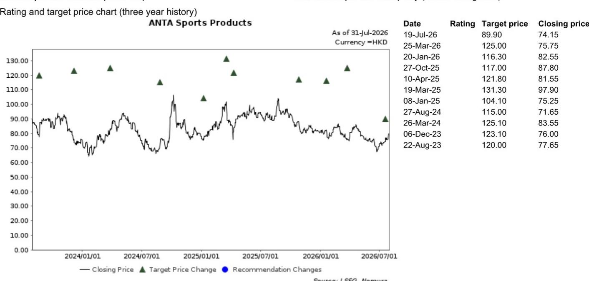

# 中国运动服饰行业观察

2026年7月31日

股票研究：消费相关

# 从adidas 2026年第二季度业绩看行业趋势

运营利润低于预期，鞋类销售增速放缓；2026年第二季度在中国市场继续获得份额提升

**adidas 2026年第二季度收入增长稳健，但运营利润未达预期**

adidas（ADS GR，未评级）于7月30日公布了2026年上半年业绩，整体表现低于市场此前较高的预期：季度收入同比增长14%至67亿欧元，略高于彭博一致预期的66亿欧元；季度运营利润同比增长5%至5.74亿欧元，低于一致预期的6.16亿欧元，主要由于销售和品牌推广投入增加，导致季度运营利润率同比下降0.7个百分点至8.5%。与此同时，adidas核心鞋类业务在2026年第二季度仅实现1%的同比增长，较2026年第一季度的4%同比增速有所放缓。管理层维持全年运营利润指引23亿欧元，低于彭博一致预期的25亿欧元。

## 2026年第二季度在中国市场继续获得份额提升

在大中华区市场，adidas继续获得市场份额，2026年第二季度销售额同比增长15%，较2026年第一季度17%的同比增速略有放缓。根据我们6月与中国运动服饰行业专家的渠道调研（参见我们的报告），adidas在2026年第二季度在中国内地实现了中高双位数的同比增长，与公司第二季度业绩基本一致。公司业绩显示，adidas在跑步和运动休闲等关键品类中仍具有显著的竞争优势，这得益于其相较于国际同行更深入的本土化产品设计和渠道运营（例如将户外产品线adidas Terrex专门针对中国市场更名为"山川里"）。考虑到当前消费环境的变化以及运动服饰领域激烈的竞争态势，安踏体育（2020 HK，买入）仍是我们关注的重点标的，其在跑步和户外等结构性增长领域具备长期布局，同时估值水平具有吸引力。

## adidas 2026年第二季度业绩要点

- 2026年第二季度，欧洲、北美、大中华区、韩国/日本和拉丁美洲的收入同比增速分别为+6%、+17%、+15%、+18%和+28%，而2026年第一季度分别为+6%、+12%、+17%、+23%和+26%。其中，欧洲和大中华区的货币中性收入增速低于彭博一致预期的8.7%和15.8%。

- 分品类看，鞋类、服装和配饰在2026年第二季度分别实现+1%、+35%和+20%的同比增长，而2026年第一季度分别为+4%、+31%和+13%。

- 分渠道看，2026年第二季度直营渠道收入中，线下零售同比增长23%，线上销售同比增长27%；批发渠道收入同比增长6%。

- 公司上调2026财年收入增长预期至9%-10%（此前指引为高个位数同比增长）。

（续第2页）

## 研究分析师

中国消费相关
董继舟，CFA - NIHK
jizhou.dong@NOM.com
+852 2252 1554

钱夏 - NIHK
summer.qian@NOM.com
+852 2252 6220

- adidas管理层观察到，高消费力人群对该品牌的偏好持续增强，这得益于区域团队对全球理念的成功本土化，以及零售渠道的持续一致执行。

- 管理层提到，adidas中国本地团队对业务的运营掌控力较以往时期有了显著提升。

- 关于Nike（NKE US，未评级）近期在中国线上直营策略的调整，adidas管理层认为该调整在批发分销渠道上需要更长时间才能见效，短期内影响仍存在不确定性。

## 附录A-1

本报告由NOM International (Hong Kong) Ltd. (NIHK) 编制。NOM集团实体详情请参阅免责声明。

## 分析师声明

本人董继舟特此声明：(1) 本研究报告中所表达的观点准确反映了我个人对报告中提及的任何或所有标的证券或发行人的看法；(2) 我的薪酬中没有任何部分直接或间接与本研究报告中表达的具体建议或观点相关；(3) 我的薪酬中没有任何部分与NOM Securities International, Inc.、NOM International plc或任何其他NOM集团公司进行的特定投资银行业务交易挂钩。

## 发行人特定监管披露

本文中使用的"NOM"和"NOM集团"指NOM Holdings, Inc.及其关联公司和子公司，包括NOM Securities International, Inc.（'NSI'）和Instinet, LLC（'ILLC'），均为美国注册经纪交易商和SIPC成员。

## 重点提及的发行人

<table><tr><td>发行人</td><td>代码</td><td>价格</td><td>价格日期</td><td>股票评级</td><td>行业评级</td><td>披露</td></tr><tr><td>安踏体育</td><td>2020 HK</td><td>78.95港元</td><td>2026年7月31日</td><td>买入</td><td>不适用</td><td></td></tr></table>

评级说明请参阅图表后的股票评级键

**估值方法** 我们对安踏的目标价为89.9港元，基于17.5倍未来12个月市盈率，与公司在中国运动服饰行业的领先地位和稳定增长轨迹相符。安踏的基准指数为恒生指数。

**可能阻碍目标价实现的风险** 我们对安踏报告评级和目标价的下行风险包括：1）来自国内外参与者的竞争加剧；2）销售增长慢于预期；3）宏观环境变化弱于预期。

## 重要披露

## 研究报告在线获取及利益冲突披露

NOM集团研究报告可在www.NOMnow.com/research、Bloomberg、Capital IQ、Factset、LSEG上获取。

重要披露可在http://go.NOMnow.com/research/m/Disclosures阅读，或向NOM Securities International, Inc.索取。如网站访问遇到问题，请发送邮件至grpsupport@NOM.com寻求帮助。

负责编写本报告的分析师已根据多种因素获得薪酬，包括公司总收入，其中一部分来自投资银行活动。除非另有说明，本报告首页列出的非美国分析师未在FINRA规则下注册/取得研究分析师资格，可能不是NSI的关联人员，且可能不受FINRA规则2241关于与所覆盖公司沟通、公开露面以及研究分析师账户持有证券交易的限制。

NOM Global Financial Products Inc. (NGFP)、NOM Derivative Products Inc. (NDP)和NOM International plc (NIplc)已在商品期货交易委员会和国家期货协会（NFA）注册为互换交易商。NGFP、NDPI和NIplc主要从事互换和其他衍生品交易，其中任何一项均可能构成本报告的主题。

## 评级分布（NOM集团）

NOM集团全球股票研究发布的所有评级分布如下：

58%被授予报告评级，出于强制披露目的，该评级被归类为报告评级；其中33%的公司是NOM集团的投资银行客户*。0%被授予该评级的公司（获准在欧洲经济区受监管市场交易）由NOM集团提供重大服务**。

39%被授予中性评级，出于强制披露目的，该评级被归类为持有评级；其中57%的公司是NOM集团的投资银行客户*。0%被授予该评级的公司（获准在欧洲经济区受监管市场交易）由NOM集团提供重大服务。

3%被授予减持评级，出于强制披露目的，该评级被归类为报告评级；其中15%的公司是NOM集团的投资银行客户*。0%被授予该评级的公司（获准在欧洲经济区受监管市场交易）由NOM集团提供重大服务。

截至2026年6月30日

*NOM集团定义见本报告末尾免责声明部分。

**根据欧盟市场滥用监管条例定义

## NOM集团股票研究评级体系和行业定义

评级体系为相对体系，表示相对于为每只个股确定的特定基准的预期表现，受有限的管理裁量权约束。分析师的目标价是基于分析师确定的适当估值方法对股票当前内在公允价值的评估。估值方法包括但不限于现金流折现分析、预期净资产回报表现和倍数分析。分析师也可能指出相对于所述目标价的预期相对上涨/下跌空间，定义为（目标价-当前价格）/当前价格。

## 股票

"买入"评级表示分析师预期该股票在未来12个月内将跑赢基准。"中性"评级表示分析师预期该股票在未来12个月内将与基准表现一致。"减持"评级表示分析师预期该股票在未来12个月内将跑输基准。"暂停"评级表示评级、目标价和预测已暂时中止，以遵守适用法规和/或公司政策。标记为"未评级"或"无评级"的证券和/或公司不在常规研究覆盖范围内。读者不应期望NOM继续提供或提供有关此类证券和/或公司的额外信息。基准如下：美国/欧洲/亚洲（除日本）：请参阅估值方法了解股票相关基准的说明，可访问：http://go.NOMnow.com/research/m/Disclosures；全球新兴市场（除亚洲）：MSCI新兴市场（除亚洲），除非估值方法中另有说明；日本：Russell/NOM大盘指数。

## 行业

"看多"立场表示分析师预期该行业在未来12个月内将跑赢基准。"中性"立场表示分析师预期该行业在未来12个月内将与基准表现一致。"看空"立场表示分析师预期该行业在未来12个月内将跑输基准。标记为"未评级"或"N/A"的行业不分配评级。基准如下：美国：标普500；欧洲：道琼斯STOXX 600；全球新兴市场（除亚洲）：MSCI新兴市场（除亚洲）。日本/亚洲（除日本）：不分配行业评级。

## 目标价

如讨论目标价，则表示分析师对12个月时间范围内股价的预测，部分反映了分析师对该公司盈利的预测。任何目标价的实现可能受到总体市场和宏观趋势以及公司与市场相关的其他风险的阻碍，如果公司盈利与预测不符，则可能无法实现。

## 免责声明

本出版物包含由第1页确定的NOM集团实体准备的材料，如适用，还包括一个或多个NOM集团实体的贡献，其员工及其各自隶属关系在第1页或本出版物其他位置注明。本文中使用的"NOM集团"指NOM Holdings, Inc.及其关联公司和子公司，包括：(a) NOM Securities Co., Ltd.（'NSC'）日本东京，(b) NOM Financial Products Europe GmbH（'NFPE'）德国，(c) NOM International plc（'NIplc'）英国，(d) NOM Securities International, Inc.（'NSI'）美国纽约，(e) NOM International (Hong Kong) Ltd.（'NIHK'）中国香港，(f) NOM Financial Investment (Korea) Co., Ltd.（'NFIK'）韩国（在韩国金融投资协会（'KOFIA'）注册的NOM分析师信息可在KOFIA内网http://dis.kofia.or.kr查询），(g) NOM Singapore Ltd.（'NSL'）新加坡（注册号197201440E，受新加坡金融管理局监管），(h) NOM Australia Ltd.（'NAL'）澳大利亚（ABN 48 003 032 513），受澳大利亚证券和投资委员会（'ASIC'）监管，持有澳大利亚金融服务牌照号246412，(i) NOM Securities Malaysia Sdn. Bhd.（'NSM'）马来西亚，(j) NIHK台北分公司（'NITB'）中国台湾，(k) NOM Financial Advisory and Securities (India) Private Limited（'NFASL'）印度孟买（注册地址：Ceejay House, Level 11, Plot F, Shivsagar Estate, Dr. Annie Besant Road, Worli, Mumbai-400 018, India；电话：91 22 4037 4037，传真：91 22 4037 4111；CIN号：U74140MH2007PTC169116，SEBI证券经纪业务注册号：INZ000255633；SEBI商人银行注册号：INM000011419；SEBI研究注册号：INH000001014 - 合规官：Ms. Pratiksha Tondwalkar，91 22 40374904，投诉邮箱：investorgrievancesra@NOM.com 网页：链接

对于涉及印度公众公司或由印度NFASL研究分析师撰写的报告：(i) 证券市场投资存在市场风险。投资前请仔细阅读所有相关文件。(ii) SEBI授予的注册和NISM认证不以任何方式保证中介机构的业绩或向读者提供任何回报保证。(iii) NFASL提供研究服务的条款和条件已在NFASL网页上披露。

(l) NOM Fiduciary Research & Consulting Co., Ltd.（'NFRC'）日本东京。(m) NOM Orient International Securities Co., Ltd（"NOI"）是NOM集团、东方国际（集团）有限公司和上海黄浦投资控股（集团）有限公司共同持股的合资企业。根据中华人民共和国（"中国"，就本文件而言不包括香港、澳门和台湾）法律，NOI在中国获得提供证券研究和研究交流的许可，并独立于NOM集团其他成员运营；特别是，NOI在中国证券中的利益不向任何其他NOM集团实体披露或与其持仓合并，其他NOM集团实体在中国证券中的利益也不向NOI披露或与其持仓合并。研究报告首页上NOI旁边印制的个人姓名表示该个人受雇于NOI，根据研究合作协议为NIHK提供研究协助。研究报告首页上员工姓名旁的'NSFSPL'表示该个人受雇于NOM Structured Finance Services Private Limited，根据公司间协议为某些NOM实体提供协助。研究报告首页上个人姓名旁的'Verdhana'表示该个人受雇于PT Verdhana Sekuritas Indonesia（'Verdhana'），根据研究合作协议为NIHK提供研究协助，Verdhana和该个人均未在印度尼西亚境外获得许可。

本材料：(I) 仅供您私人参考，我们不据此招揽任何行动；(II) 不构成在任何司法管辖区出售或招揽购买任何证券的要约，在该等司法管辖区此类要约或招揽将属非法；(III) 除与NOM集团相关的披露外，基于我们认为可靠的来源信息编制，但未经NOM集团独立核实。

除与NOM集团相关的披露外，NOM集团不对本文件的公平性、准确性、完整性、正确性、可靠性、适用于任何特定目的或适销性作出明示或暗示的保证、陈述或承诺，并在适用法律和/法规允许的最大范围内，不承担因使用本文件及相关数据而产生的任何行为（或决定不行为）的责任（无论是过失还是其他，全部或部分）。在适用法律和/法规允许的最大范围内，NOM集团的所有保证和其他承诺特此排除，NOM集团不对因使用、误用或分发本材料或本材料所含信息或以其他方式与之相关而产生的任何损失承担责任（无论是过失还是其他，全部或部分）。

本材料中表达的观点或估计为原始发布日期当前的观点，本材料中包含的信息（包括其中包含的观点和估计）如有变更，恕不另行通知。但NOM集团明确否认任何更新或修订本文件的义务，因此没有责任更新或修订本文件。本文中的任何评论或陈述均为作者的观点，可能不同于NOM集团其他方持有的观点。客户应考虑本报告中的任何建议或推荐是否适合其特定情况，如适当，应寻求专业建议，包括税务建议。NOM集团不提供税务建议。

在适用法律和/法规允许的范围内，NOM集团和/或其高级管理人员、董事、员工和关联方可能以委托人、代理人或其他身份进行交易，或持有本文提及的发行人或证券的多头或空头头寸，或买入或卖出其证券、商品或工具，或基于其的期权或其他衍生工具。NOM集团公司也可能担任发行人金融工具的市场做市商或流动性提供者（根据英国适用法规的含义）。如市场做市商活动按照美国或其他司法管辖区特定法律法规赋予的定义进行，将在特定发行人披露中单独披露。

本文件可能包含从第三方获得的信息，包括但不限于信用评级机构（如标准普尔）的评级。NOM集团特此明确否认对本材料中包含的或以其他方式与之相关的从第三方获得的任何信息的原创性、公平性、准确性、完整性、正确性、适销性或适用于特定目的的所有陈述、保证或承诺，并且不对因使用或误用本材料中包含的或以其他方式与之相关的从第三方获得的任何信息而产生的任何直接、间接、附带、示例性、补偿性、惩罚性、特殊或后果性损害、成本、费用、法律费用或损失（包括收入或利润损失和机会成本）承担责任（无论是过失还是其他，全部或部分）。禁止以任何形式复制和分发第三方内容，除非事先获得相关第三方的书面许可。第三方内容提供者不明确或暗示保证任何信息（包括评级）的公平性、准确性、完整性、正确性、及时性或可用性，并且不对因使用或误用此类内容而产生的任何错误或遗漏（无论是过失还是其他）或结果负责。第三方内容提供者不提供明示或暗示的保证，包括但不限于适销性或适用于特定目的或用途的任何保证。第三方内容提供者不对因使用或误用其内容（包括评级）而产生的任何直接、间接、附带、示例性、补偿性、惩罚性、特殊或后果性损害、成本、费用、法律费用或损失（包括收入或利润损失和机会成本）承担责任（无论是过失还是其他，全部或部分）。信用评级是意见陈述，不是事实陈述，也不是购买、持有或出售证券的建议。它们不涉及证券的适当性或证券是否适合研究目的，不应作为研究交流依赖。

本文件中的任何MSCI来源信息均为MSCI Inc.（'MSCI'）的专有财产。未经MSCI事先书面许可，不得为任何目的复制、转载、再传播、再分发或使用本信息和任何其他MSCI知识产权，包括创建任何金融产品和任何指数。本信息按"现状"提供。用户承担使用本信息的全部风险。MSCI、其关联方和任何参与计算或编制信息的第三方特此明确否认对本材料或本材料所含信息或以其他方式与之相关的任何原创性、公平性、准确性、完整性、正确性、适销性或适用于特定目的的所有陈述、保证或承诺。在不限制前述规定的情况下，MSCI、其任何关联方或任何参与计算或编制信息的第三方在任何情况下均不对任何类型的损害承担责任（无论是过失还是其他）。MSCI和MSCI指数是MSCI及其关联方的服务标志。

Russell/NOM日本股票指数的知识产权和其他权利属于NOM Fiduciary Research & Consulting Co., Ltd.（"NFRC"）和FTSE Russell（"Russell"）。NFRC和Russell不保证指数的公平性、准确性、完整性、正确性、可靠性、有用性、适销性、适销性或适用于特定目的，并且不考虑任何指数用户和/或其关联方使用该指数进行的商业活动或服务。

读者应将本文件视为做出投资决策的单一因素，因此，本报告不应被视为识别或暗示与任何投资决策相关的所有直接或间接风险。NOM集团生产多种不同类型的研究产品，包括但不限于基本面分析和定量分析；一种研究产品中包含的建议可能不同于其他类型研究产品中的建议，无论是由于时间范围、方法论或其他方面的差异。NOM集团以多种不同方式发布研究产品，包括在NOM集团门户网站上发布产品和/或直接分发给客户。不同客户群体可能根据其个人需求从研究部门获得不同的产品和服务。

本文中呈现的数字可能指过去的表现或基于过去表现的模拟，这些不是未来或可能表现的可靠指标。当信息包含对未来表现和业务前景的预期、预测或指示时，此类预测可能不是未来或可能表现的可靠指标。此外，模拟基于模型和简化假设，可能过度简化且不反映未来的回报分布。本文件中为说明目的创建和发布的任何数字、策略或指数均不旨在"用作"欧洲基准监管条例定义的"基准"。某些证券会受到汇率波动的影响，可能对投资的价值或价格或由此产生的收入产生不利影响。

关于固定收益研究：建议分为两类：战术性，通常持续最多三个月；或战略性，通常持续6-12个月。然而，交易建议可能随时根据情况变化进行审查。还提供交易的"止损"水平；如果触及，将自动关闭交易建议。建议中显示的价格和回报表现在提交发布时获取，基于当时Bloomberg、LSEG或NOM的指示性价格和回报表现。显示的价格和回报表现不一定是可以实施交易建议的价格。

本文所述证券可能未根据美国1933年证券法（'1933年法案'）注册，在此情况下，除非已根据1933年法案注册，或符合1933年法案注册要求的豁免，否则不得在美国或向美国人发售或出售。除非管辖法律另有许可，任何交易应通过您所在司法管辖区的NOM实体执行。

本文件已获NIplc批准在英国作为投资研究分发。NIplc由审慎监管局授权并受金融行为监管局和审慎监管局监管。NIplc是伦敦证券交易所成员。本文件不构成适用英国法规下的个人建议，也不考虑个人读者的特定投资目标、财务状况或需求。本文件仅面向符合适用英国法规目的的"合格对手方"或"专业客户"的读者，因此不得再分发给"零售客户"。

本文件已获NOM Financial Products Europe GmbH（"NFPE"）批准在欧洲经济区作为投资研究分发。NFPE是一家根据德国法律组织的有限责任公司，在法兰克福法院商业注册处注册，注册号HRB 110223。NFPE由德国联邦金融监管局（BaFin）授权和监管。

本文件已获NIHK批准在香港分发，NIHK受香港证券及期货事务监察委员会监管。本文件仅面向符合适用香港法规目的的"专业读者"的读者，因此不得再分发给非"专业读者"。

本文件已获NAL批准在澳大利亚分发，NAL在澳大利亚由ASIC授权和监管。

本文件也已获NSM批准在马来西亚分发。

在新加坡，本文件由NSL分发，NSL是《财务顾问法》（第110章）定义的豁免财务顾问，受新加坡金融管理局监管。NSL可根据《财务顾问条例》第32C条安排分发其外国关联公司制作的此文件。本文件面向《证券和期货法》（第289章）定义的认可、专家或机构读者。如本文件接收者不是认可、专家或机构读者，NSL仅在法律要求的范围内对此类接收者承担本文件内容的法定义务。新加坡的本文件接收者应就本文件引起或与之相关的事项联系NSL。本文件供一般分发。它不考虑任何特定个人的特定投资目标、财务状况或特殊需求。接收者在承诺购买任何证券前应考虑其特定投资目标、财务状况或特殊需求，包括在单独委托下寻求独立财务顾问关于投资适当性的建议，如接收者认为合适。除非1933年法案S条例的规定禁止，本材料在美国由NSI分发，NSI是一家美国注册经纪交易商，根据1934年美国证券交易法规则15a-6的规定接受其内容责任。

编制本文件的实体允许NOM集团内单独运营的关联公司向其客户提供此类文件的副本。

本文件未经批准分发给沙特阿拉伯王国（'沙特阿拉伯'）的'授权人士'、'豁免人士'或'机构'（由资本市场管理局定义）或阿拉伯联合酋长国（'阿联酋'）的'市场对手方'或'专业客户'（由迪拜金融服务管理局定义）或卡塔尔国（'卡塔尔'）的'市场对手方'或'商业客户'（由卡塔尔金融中心监管局定义）以外的人士，由NOM Saudi Arabia、NIplc或NOM集团任何其他成员（视情况而定）分发。本文件及其任何副本不得由未经授权的人士直接或间接带入、传输或分发到沙特阿拉伯、阿联酋或卡塔尔，或分发给沙特阿拉伯的'授权人士'、'豁免人士'或'机构'、阿联酋的'市场对手方'或'专业客户'、卡塔尔的'市场对手方'或'商业客户'以外的任何人士。未能遵守这些限制可能构成违反阿联酋、沙特阿拉伯或卡塔尔法律。

对于涉及台湾公众公司或由台湾研究分析师撰写的报告：

本文件仅供参考。您应独立评估投资风险，并自行承担投资决策的责任。未经NOM集团书面授权，任何部分报告不得由新闻媒体或任何其他人复制或引用。根据台湾证券商推介客户买卖有价证券业务管理办法和/或其他适用法律法规，您不得向他人（包括但不限于关联方、关联公司和任何其他第三方）提供报告或从事与报告相关的可能涉及利益冲突的任何活动。关于NOM International (Hong Kong) Ltd.台北分公司不可执行的证券/工具信息仅供参考，不构成推荐或招揽交易此类证券/工具。

本材料不得在印度尼西亚分发或传入印度尼西亚共和国境内，或分发给印度尼西亚公民（无论其住所或所在地）或印度尼西亚实体或居民，如果该等分发构成印度尼西亚共和国法律下的公开发售。本文件中提及的证券不得在印度尼西亚或向印度尼西亚公民（无论其住所或所在地）或印度尼西亚实体或居民发售或出售，如果该等发售构成印度尼西亚共和国法律下的公开发售。

研究报告首页上NOI旁边印制的个人姓名表示本文件是NOI在中国发布的研究报告的翻译件。在所有其他情况下，本文件由未在中国获得证券研究许可的NOM集团或其子公司或关联公司（统称"离岸发行人"）编制。本研究报告未经批准或旨在在中国境内分发。A股相关分析（如有）不面向位于中国或在中国注册的任何人士。接收者不应依赖本研究报告中包含的任何信息做出投资决策，离岸发行人对不承担相关责任。未经NOM集团成员事先书面同意，本材料的任何部分不得(I)以任何方式、任何手段复制、影印、复制或复印；或(II)再传播、再发布或再分发。如本文件通过电子传输方式分发，如电子邮件，则此类传输不能保证安全或无错误，因为信息可能被拦截、损坏、丢失、销毁、延迟到达或不完整，或包含病毒。因此，发送方不对本文件内容中因电子传输可能产生的任何错误或遗漏承担责任（无论是过失还是其他，全部或部分）。如需验证，请索取纸质版本。

NOM集团通过其合规政策和程序（包括但不限于利益冲突、中国墙和保密政策）以及维护中国墙和员工培训来管理与研究生产相关的冲突。

如需获取本文件所含任何研究交流所使用的方法论或模型的额外信息，请联系NOM首页所列研究分析师。披露信息可应要求提供，披露信息可在NOM披露网页获取：

http://go.NOMnow.com/research/m/Disclosures

版权所有 © 2026 NOM International (Hong Kong) Ltd.，香港。保留所有权利。
