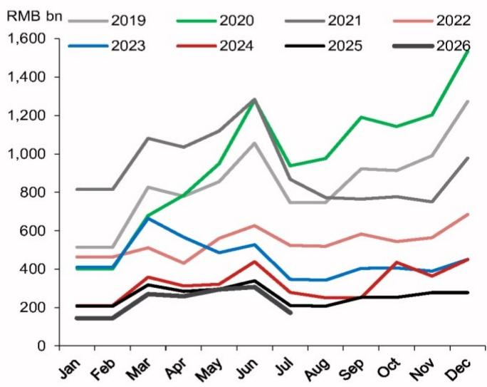

# 宏观观察 | 7月房企销售数据解读：市场分化格局下的政策考量

**2026年7月31日**

**宏观环境 - 亚洲（除日本）**

## 中国：7月开发商合约销售数据观察

区域间的结构性差异，可能使得针对房地产领域的政策调整节奏进一步延后。

## 研究分析师

亚洲宏观研究

王婧 - NIHK

jing.wang@NOM.com

+852 2252 1011

陆挺 - NIHK

ting.lu@NOM.com

+852 2252 1306

图1：百强房企新建商品住宅合约销售金额

- 7月百强房企合约销售金额同比下降18.3%，较6月9.6%的降幅有所扩大，年初至今累计增速为-14.6%（2025年全年为-19.3%）。销售金额变化，或与部分城市住宅价格调整有关，尤其低线城市表现相对明显，而高线城市已呈现一定企稳迹象。

- 从城市层面数据来看，20个主要城市新建商品住宅销售面积同比增速由6月的-6.7%回升至7月的3.2%，部分受低基数影响；18个主要城市二手房成交量增速则由12.3%放缓至9.4%。20城整体正增长主要由一线城市带动，其销售增速从6月的-2.2%升至7月的16.6%；二线城市销售基本持平，低线城市降幅相对明显。

- 从历史经验看，高线城市住房市场的改善有时会带动更广泛的市场回暖。但当前阶段或有所不同——新兴产业的发展使得资源更多向部分核心城市集中，城市间差异有所扩大。年中相关会议再次强调稳定住房市场的重要性，而区域间的结构性分化增加了政策制定的复杂性，传统政策工具的空间也相对有限。

## 附录A-1

本报告由NOM International (Hong Kong) Ltd. (NIHK)编制。NOM集团实体详情请参阅免责声明。

## 分析师声明

我们，王婧和陆挺，特此声明：(1) 本研究报告中所表达的观点准确反映了我们对本报告提及的任何或所有标的公司或发行人的个人看法；(2) 我们的薪酬中没有任何部分直接或间接与本研究报告中的具体建议或观点相关；(3) 我们的薪酬中没有任何部分与NOM Securities International, Inc.、NOM International plc或任何其他NOM集团公司执行的特定投资银行业务挂钩。

## 重要披露

## 研究报告在线获取及利益冲突披露

NOM集团研究报告可在www.NOMnow.com/research、Bloomberg、Capital IQ、Factset、LSEG平台获取。

重要披露信息可在http://go.NOMnow.com/research/m/Disclosures查阅，或向NOM Securities International, Inc.索取。如网站访问遇到问题，请发送邮件至grpsupport@NOM.com寻求帮助。

负责编写本报告的分析师薪酬基于多种因素确定，包括公司总收入，其中一部分来自投资银行业务。除非另有说明，本报告首页列出的非美国分析师未在FINRA规则下注册/取得研究分析师资格，可能不是NSI的关联人员，且可能不受FINRA规则2241关于与覆盖公司沟通、公开露面及研究分析师账户持有证券交易等限制的约束。

NOM Global Financial Products Inc. (NGFP)、NOM Derivative Products Inc. (NDP)和NOM International plc (NIplc)已在商品期货交易委员会和美国国家期货协会(NFA)注册为互换交易商。NGFP、NDPI和NIplc主要从事互换及其他衍生品交易，其中任何产品均可能构成本报告的主题。

## 免责声明

本出版物包含由第1页所列NOM集团实体准备的材料，并可能包含一个或多个NOM集团实体的贡献，其员工及其各自隶属关系在第1页或本出版物其他位置注明。本出版物中使用的"NOM集团"一词指NOM Holdings, Inc.及其关联公司和子公司，包括：(a) NOM Securities Co., Ltd.（'NSC'），日本东京；(b) NOM Financial Products Europe GmbH（'NFPE'），德国；(c) NOM International plc（'NIplc'），英国；(d) NOM Securities International, Inc.（'NSI'），美国纽约；(e) NOM International (Hong Kong) Ltd.（'NIHK'），中国香港；(f) NOM Financial Investment (Korea) Co., Ltd.（'NFIK'），韩国（在韩国金融投资协会（'KOFIA'）注册的NOM分析师信息可在KOFIA内网http://dis.kofia.or.kr查询）；(g) NOM Singapore Ltd.（'NSL'），新加坡（注册号197201440E，受新加坡金融管理局监管）；(h) NOM Australia Ltd.（'NAL'），澳大利亚（ABN 48 003 032 513），受澳大利亚证券和投资委员会（'ASIC'）监管，持有澳大利亚金融服务牌照号246412；(i) NOM Securities Malaysia Sdn. Bhd.（'NSM'），马来西亚；(j) NIHK台北分公司（'NITB'），中国台湾；(k) NOM Financial Advisory and Securities (India) Private Limited（'NFASL'），印度孟买（注册地址：Ceejay House, Level 11, Plot F, Shivsagar Estate, Dr. Annie Besant Road, Worli, Mumbai- 400 018, India；电话：91 22 4037 4037；传真：91 22 4037 4111；CIN号：U74140MH2007PTC169116；SEBI证券经纪业务注册号：INZ000255633；SEBI投资银行业务注册号：INM000011419；SEBI研究业务注册号：INH000001014 - 合规官：Ms. Pratiksha Tondwalkar，电话：91 22 40374904，投诉邮箱：investorgrievancesra@NOM.com 网页：链接

关于印度上市公司或由印度NFASL研究分析师撰写的报告：(i) 证券投资存在市场风险。投资前请仔细阅读所有相关文件。(ii) SEBI的注册及NISM的认证不保证中介机构的业绩，也不提供任何投资回报保证。(iii) NFASL提供研究服务的条款和条件已在NFASL网页上披露。

(l) NOM Fiduciary Research & Consulting Co., Ltd.（'NFRC'），日本东京。(m) NOM Orient International Securities Co., Ltd（'NOI'）是NOM集团、东方国际（集团）有限公司和上海黄浦投资控股（集团）有限公司共同投资设立的合资公司，NOM集团为控股方。根据中华人民共和国（'中国'，就本文件而言，不含香港、澳门和台湾）法律，NOI在中国境内获准提供证券研究和研究交流服务，并独立于NOM集团其他成员运营；特别是，NOI在中国证券中的利益不向任何其他NOM集团实体披露，也不与其他NOM集团实体的持仓合并计算；其他NOM集团实体在中国证券中的利益不向NOI披露，也不与NOI的持仓合并计算。研究报告首页上NOI旁边的个人姓名表示该个人受雇于NOI，根据研究合作协议为NIHK提供研究协助。研究报告首页上员工姓名旁的'NSFSPL'表示该个人受雇于NOM Structured Finance Services Private Limited，根据公司间协议为某些NOM实体提供协助。研究报告首页上个人姓名旁的'Verdhana'表示该个人受雇于PT Verdhana Sekuritas Indonesia（'Verdhana'），根据研究合作协议为NIHK提供研究协助，Verdhana及该个人均未在印度尼西亚境外获得许可。

本材料：(I) 仅供您个人参考，我们不据此招揽任何行动；(II) 不构成在任何司法管辖区出售或招揽购买任何证券的要约，在该等司法管辖区此类要约或招揽将属非法；(III) 除与NOM集团相关的披露外，基于我们认为可靠的来源信息编制，但未经NOM集团独立核实。

除与NOM集团相关的披露外，NOM集团不对本文件的公平性、准确性、完整性、正确性、可靠性、适用于任何特定目的或适销性作出明示或暗示的保证、陈述或承诺，并在适用法律和/或法规允许的最大范围内，不承担因使用本文件及相关数据而产生的任何责任（无论是过失或其他，全部或部分）。在适用法律和/或法规允许的最大范围内，NOM集团的所有保证和其他承诺在此予以排除，NOM集团不对因使用、误用或分发本材料或其中所含信息或以其他方式与之相关而产生的任何损失承担任何责任（无论是过失或其他，全部或部分）。

本材料中表达的观点或估计为原始发布日期时的当前观点，本材料中包含的信息（包括其中所含的观点和估计）如有变更，恕不另行通知。但NOM集团明确声明不承担更新或修订本文件的任何义务，因此没有更新或修订本文件的义务。本文件中的任何评论或陈述均为作者本人的观点，可能不同于NOM集团其他方的观点。客户应考虑本报告中的任何建议或推荐是否适合其特定情况，并在适当情况下寻求专业建议，包括税务建议。NOM集团不提供税务建议。

在适用法律和/或法规允许的范围内，NOM集团及/或其高级管理人员、董事、员工和关联方可能以主事人、代理人或其他身份进行交易，或持有本报告提及的发行人或证券的多头或空头头寸，或买卖其证券、商品或工具，或基于其上的期权或其他衍生工具。NOM集团公司也可能担任发行人金融工具的市场做市商或流动性提供者（按英国适用法规的定义）。如市场做市商活动按照美国或其他司法管辖区特定法律法规的定义进行，将在特定发行人披露中单独披露。

本文件可能包含从第三方获得的信息，包括但不限于信用评级机构（如标准普尔）的评级。NOM集团特此明确声明，对本材料中包含的或以其他方式与之相关的任何第三方信息，不作任何原创性、公平性、准确性、完整性、正确性、适销性或特定目的适用性的陈述、保证或承诺，并且不对因使用或误用本材料中包含的或以其他方式与之相关的任何第三方信息而承担任何责任（无论是过失或其他，全部或部分），包括直接、间接、偶然、示例性、补偿性、惩罚性、特殊或后果性损害、成本、费用、律师费或损失（包括收入或利润损失和机会成本）。未经相关第三方事先书面许可，禁止以任何形式复制和分发第三方内容。第三方内容提供者不对任何信息（包括评级）的公平性、准确性、完整性、正确性、及时性或可用性作出明示或暗示的保证，并且不对任何错误或遗漏（无论是否过失）或使用或误用此类内容所产生的结果负责。第三方内容提供者不作任何明示或暗示的保证，包括但不限于适销性或特定目的或用途的适用性保证。第三方内容提供者不对因使用或误用其内容（包括评级）而产生的任何直接、间接、偶然、示例性、补偿性、惩罚性、特殊或后果性损害、成本、费用、律师费或损失（包括收入或利润损失和机会成本）承担责任（无论是过失或其他，全部或部分）。信用评级是意见陈述，不是事实陈述，也不是购买、持有或出售证券的建议。它们不涉及证券的适当性或证券是否适合研究目的，不应作为研究交流依赖。本文件中的任何MSCI来源信息均为MSCI Inc.（'MSCI'）的专有财产。未经MSCI事先书面许可，不得为任何目的复制、转载、再传播、再分发或使用本信息及任何其他MSCI知识产权，包括创建任何金融产品和任何指数。本信息按"现状"提供。使用者承担使用本信息的全部风险。MSCI、其关联方及任何参与或与计算或编制本信息相关的第三方特此明确声明，不对本材料或其中所含信息或以其他方式与之相关的任何材料的原创性、公平性、准确性、完整性、正确性、适销性或特定目的适用性作任何陈述、保证或承诺。在不限制前述规定的前提下，MSCI、其任何关联方或任何参与或与计算或编制本信息相关的第三方在任何情况下均不对任何类型的损害承担责任（无论是过失或其他）。MSCI和MSCI指数是MSCI及其关联方的服务标志。

Russell/NOM日本股票指数的知识产权及其他权利归NOM Fiduciary Research & Consulting Co., Ltd.（'NFRC'）和FTSE Russell（'Russell'）所有。NFRC和Russell不保证指数的公平性、准确性、完整性、正确性、可靠性、有用性、适销性、可销售性或特定目的适用性，也不对任何指数用户和/或其关联方使用该指数进行的业务活动或服务负责。

读者应将本文件视为其投资决策的单一因素，因此，本报告不应被视为识别或暗示与任何投资决策相关的所有直接或间接风险。NOM集团制作多种不同类型的研究产品，包括基本面分析和定量分析等；一种研究产品中的建议可能与其他类型研究产品中的建议不同，无论是由于时间跨度、方法论或其他方面的差异。NOM集团以多种不同方式发布研究产品，包括在NOM集团门户网站上发布和/或直接分发给客户。不同客户群体可能根据其个人需求从研究部门获得不同的产品和服务。

本文件中呈现的数据可能指过往表现或基于过往表现的模拟，这些并非未来或可能表现的可靠指标。如信息中包含对未来表现和业务前景的预期、预测或指示，此类预测可能并非未来或可能表现的可靠指标。此外，模拟基于模型和简化假设，可能过度简化且不能反映未来的回报分布。本文件中为说明目的而创建和发布的任何数据、策略或指数，不旨在作为欧洲基准法规定义的"基准"使用。某些证券会受到汇率波动的影响，可能对投资的价值或价格或收入产生不利影响。

关于固定收益研究：建议分为两类：战术性建议，通常持续最多三个月；或战略性建议，通常持续6-12个月。然而，交易建议可能随时根据情况变化进行审查。建议中还提供了交易的"止损"水平；如触及该水平，交易建议将自动关闭。建议中显示的价格和回报表现在提交发布时获取，基于当时指示性的Bloomberg、LSEG或NOM价格和回报表现。显示的价格和回报表现不一定是可以实施交易建议的价格和回报表现。

本文件所述证券可能未根据美国1933年证券法（'1933年法案'）注册，在此情况下，除非已根据1933年法案注册，或符合1933年法案注册要求的豁免，否则不得在美国或向美国人发售或出售。除非适用法律允许，任何交易应通过您所在司法管辖区的NOM实体执行。

本文件已获批准在英国作为投资研究由NIplc分发。NIplc受审慎监管局授权并受金融行为监管局和审慎监管局监管。NIplc是伦敦证券交易所会员。本文件不构成英国适用法规意义上的个人推荐，也未考虑个人读者的特定投资目标、财务状况或需求。本文件仅面向英国适用法规意义上的'合格交易对手'或'专业客户'，因此不得再分发给'零售客户'。

本文件已获批准在欧洲经济区作为投资研究由NOM Financial Products Europe GmbH（'NFPE'）分发。NFPE是一家根据德国法律组建的有限责任公司，在法兰克福/美因法院商业登记处注册，注册号HRB 110223。NFPE受德国联邦金融监管局（BaFin）授权和监管。

本文件已获NIHK批准在香港分发，NIHK受香港证券及期货事务监察委员会监管。本文件仅面向香港适用法规意义上的'专业读者'，因此不得再分发给非'专业读者'人士。

本文件已获批准在澳大利亚由NAL分发，NAL在澳大利亚受ASIC授权和监管。

本文件也已获批准在马来西亚由NSM分发。

在新加坡，本文件由NSL分发，NSL是《财务顾问法》（第110章）定义的豁免财务顾问，并受新加坡金融管理局监管。NSL可根据《财务顾问条例》第32C条安排分发其外国关联公司制作的此文件。本文件面向《证券及期货法》（第289章）定义的认可、专家或机构读者。如本文件接收者不是认可、专家或机构读者，NSL仅在法律要求的范围内就该接收者对本文件内容承担法律责任。新加坡的本文件接收者应就本文件引起或与之相关的事项联系NSL。本文件供一般分发。未考虑任何特定人士的具体投资目标、财务状况或特殊需求。接收者在作出购买任何证券的承诺前，应考虑其具体投资目标、财务状况或特殊需求，包括在认为合适的情况下，通过单独委托独立财务顾问就投资的适当性寻求建议。除非1933年法案S条例的规定禁止，本材料在美国由NSI分发，NSI是一家美国注册经纪交易商，根据1934年美国证券交易法规则15a-6的规定接受其内容责任。编制本文件的实体允许NOM集团内独立运营的关联公司向其客户提供此类文件的副本。

本文件未获批准在沙特阿拉伯王国（'沙特阿拉伯'）向'授权人士'、'豁免人士'或'机构'（按资本市场管理局定义）以外的人士，或在阿拉伯联合酋长国（'阿联酋'）向'市场交易对手'或'专业客户'（按迪拜金融服务管理局定义）以外的人士，或在卡塔尔国（'卡塔尔'）向'市场交易对手'或'商业客户'（按卡塔尔金融中心监管局定义）以外的人士分发，由NOM Saudi Arabia、NIplc或NOM集团任何其他成员（视情况而定）进行。本文件及其任何副本不得由未经授权的人士直接或间接带入、传输或分发到沙特阿拉伯、阿联酋或卡塔尔，或分发给沙特阿拉伯的'授权人士'、'豁免人士'或'机构'以外的人士，或阿联酋的'市场交易对手'或'专业客户'以外的人士，或卡塔尔的'市场交易对手'或'商业客户'以外的人士。未能遵守这些限制可能构成违反阿联酋、沙特阿拉伯或卡塔尔法律。

关于台湾上市公司或由台湾研究分析师撰写的报告：

本文件仅供参考。您应独立评估投资风险，并对您的投资决策自行负责。未经NOM集团书面授权，任何部分报告不得由新闻媒体或任何其他人复制或引用。根据台湾证券商推介客户买卖有价证券营运办法及/或其他适用法律或法规，您不得将报告提供给他人（包括但不限于关联方、关联公司和任何其他第三方）或从事与报告相关的可能涉及利益冲突的任何活动。关于NOM International (Hong Kong) Ltd.台北分公司不可执行的证券/工具信息仅供参考，不构成推荐或招揽交易此类证券/工具。

本材料不得在印度尼西亚分发或传递至印度尼西亚共和国境内，或传递给印度尼西亚公民（无论其住所或所在地）或印度尼西亚的实体或居民，如果该等行为构成印度尼西亚共和国法律下的公开发售。本文件中提及的证券不得在印度尼西亚或向印度尼西亚公民（无论其住所或所在地）或印度尼西亚的实体或居民发售或出售，如果该等行为构成印度尼西亚共和国法律下的公开发售。

研究报告首页上NOI旁边的个人姓名表示本文件是NOI在中国发布的研究报告的翻译件。在所有其他情况下，本文件由未在中国获得证券研究许可的NOM集团或其子公司或关联公司（统称'离岸发行人'）编制。本研究报告未经批准在中国境内分发，也不打算在中国境内分发。A股相关分析（如有）并非为位于或注册于中国的人士编制。接收者不应依赖本研究报告中的任何信息作出投资决策，离岸发行人对本报告不承担任何责任。未经NOM集团成员事先书面同意，本材料的任何部分不得(I)以任何方式、任何形式复制、影印、复印或复制；或(II)再传播、再发布或再分发。如本文件通过电子传输方式（如电子邮件）分发，则此类传输无法保证安全或无错误，因为信息可能被拦截、损坏、丢失、销毁、延迟到达或不完整，或包含病毒。因此，发送方不对本文件内容中的任何错误或遗漏（无论是过失或其他）承担责任，这些错误或遗漏可能因电子传输而产生。如需验证，请索取纸质版本。

## NOM Securities Co., Ltd.

金融工具公司，注册于关东财务局（注册号142）

会员协会：日本证券业协会；日本投资管理协会；日本金融期货协会；第二类金融工具业协会；日本证券型代币发行协会。

NOM集团通过其合规政策和程序（包括但不限于利益冲突、中国墙和保密政策）以及维护中国墙和员工培训来管理研究报告制作中的利益冲突。

有关本文件中包含的任何研究交流所使用的方法或模型的更多信息，可联系本报告首页所列NOM研究分析师索取。披露信息可应要求提供，披露信息可在NOM披露网页获取：

http://go.NOMnow.com/research/m/Disclosures

版权所有 © 2026 NOM International (Hong Kong) Ltd.，香港。保留所有权利。
