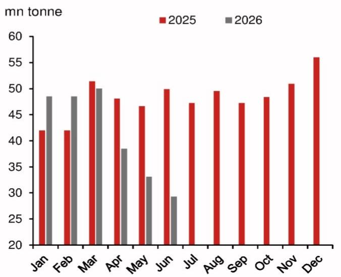
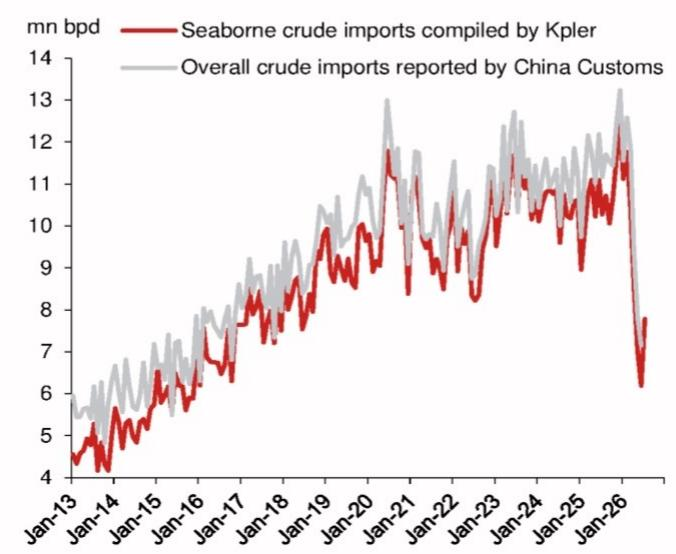
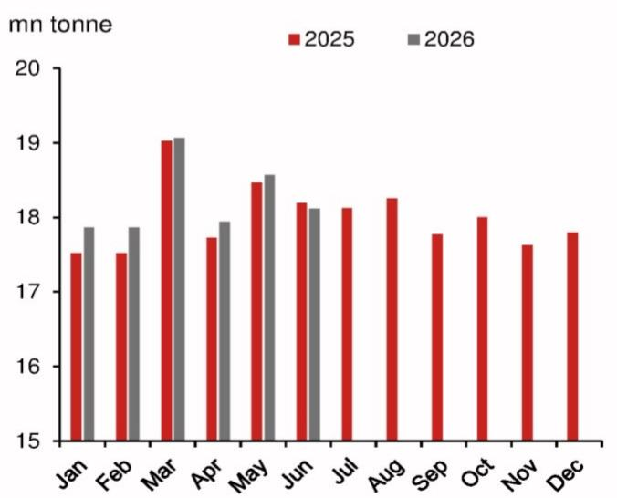
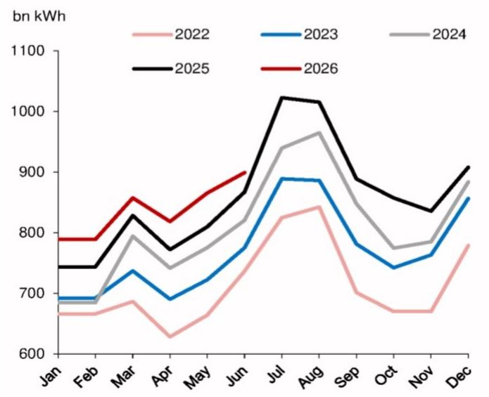
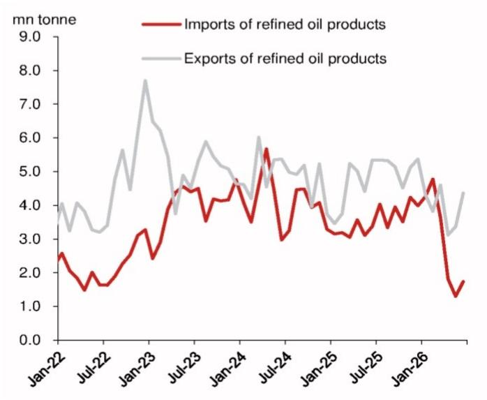
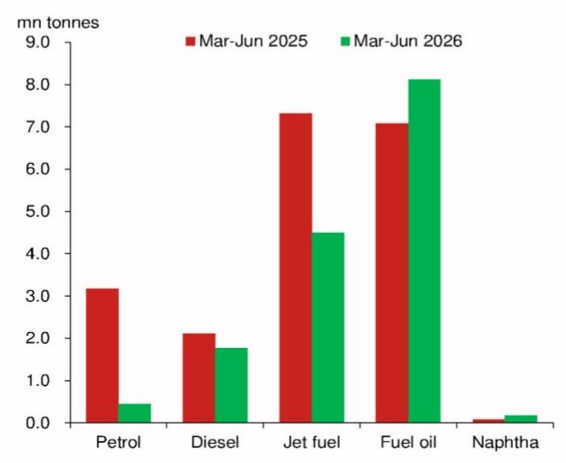

# 宏观观察：亚洲（除日本外）

## 中国：全球原油市场的稳定器（以伊朗局势为例）

自2026年2月底霍尔木兹海峡通行受阻以来，中国在第二季度将原油进口量同比缩减了30.3%，6月单月缩减幅度达到41.3%。中国之所以被视为重要的市场稳定力量，不仅因为其是全球最大的原油进口国，更因为其拥有全球规模最大的战略石油储备——截至2025年底约为12.5亿桶，显著高于位居第二的美国（4.13亿桶）。凭借相当于约112天净进口量的充足储备，中国能够在近期少见的能源供应紧张时期主动压缩进口规模，这对全球原油报价起到了积极的稳定作用。据估算，截至6月底，中国已动用约19%的战略储备；未来若原油报价回落至合理区间，中国有望逐步恢复进口节奏。对全球原油市场而言，需要关注的一个变量是：如果供应紧张持续较长时间，中国可能不得不增加进口，从而加剧供应偏紧的格局，对原油报价形成额外影响。

## 中国削减原油进口的可能途径

目前没有证据表明国内原油产量或电力消费出现突然增长。对部分燃料的出口限制可能仅能解释进口缩减的一小部分。与亚洲其他一些国家不同，北京方面迄今未采取配给制。2026年第二季度，燃料需求并未因价格上涨而受到明显抑制——当季燃料零售额同比增速为-4.9%，甚至略高于第一季度的-6.4%和2025年全年的-5.7%。

## 中国的战略石油储备体系

中国于2004年启动战略石油储备计划，旨在对冲供应风险、缓冲国际市场波动对国内的影响。二十余年来，这一体系已发展得相当完善，既包括政府层面的战略储备，也包括国有石油企业持有的商业库存。有充分迹象表明，在伊朗局势升级之前，中国加快了原油储备节奏。以2025年底为节点（约为局势升级前一个季度），各方估算显示，政府与国有企业合计持有的储备量约为12至13亿桶，可覆盖约112天的净原油进口量。

## 战略储备的动用程度

据估算，中国战略储备在第一季度增加约8500万桶，第二季度则减少约3.2亿桶。其中6月单月减少约1.51亿桶，为最大单月降幅。总体来看，中国战略储备从2025年底的约12.5亿桶降至6月底的约10.15亿桶。按6月的消耗速度推算，现有储备可维持约6.7个月。出于审慎考虑，当原油报价回落至合理水平时，中国倾向于增加进口。7月的高频数据已显示进口量环比回升，这些原油很可能是在5月下旬至6月布伦特报价跌破每桶90美元期间采购的。我们预计，当布伦特报价回到每桶60美元以下时，中国将明显加大进口力度以补充储备。

## 研究分析师

亚洲经济研究

陆挺 - NIHK
ting.lu@NOM.com
+852 2252 1306

张浩 - NIHK
harrington.zhang@NOM.com
+852 2252 2057

刘涵 - NIHK
hannah.liu@NOM.com
+852 2252 1082

王静 - NIHK
jing.wang@NOM.com
+852 2252 1011

## 伊朗局势期间中国的原油进口

中国是全球第二大原油消费国，也是最大的进口国。2025年，中国原油进口总量同比增长4.9%，达到每日1160万桶，主要受年底补库推动。这一进口量占中国自身总消费量的73%，占全球总产量的10.9%。在2026年2月28日局势升级之前，中国约有一半的原油进口经由霍尔木兹海峡运输。局势升级后，中国通过国家储备和国有炼厂两个渠道大幅压缩了原油进口。进口同比增速从1-2月的+15.6%分别降至3月、4月、5月和6月的-2.8%、-20.0%、-29.0%和-41.3%（图1）。

图1：原油进口量

资料来源：Wind，NOM全球经济研究。

图2：月度原油进口量

资料来源：Kepler，中国海关，Wind，NOM全球经济研究。

局势升级前，每日约有1500万桶原油（约占全球每日石油贸易量的25%）经由霍尔木兹海峡运输，其中中国约占39%。6月中旬相关协议达成后，6月经由该海峡的原油流量恢复至约每日480万桶，但仍较正常水平低68.0%。对中国而言，6月经由霍尔木兹海峡的原油进口骤降86.2%，这对抑制全球原油报价起到了显著作用。

中国削减原油进口的潜在途径包括：动用战略储备、以非化石能源发电替代燃油、提高燃料价格以抑制需求、限制或配给国内燃料消费、以及限制原油或燃料出口。与亚洲其他一些国家不同，北京迄今未采取配给制。北京多次上调燃料价格（在原油报价下跌时也相应下调），3-5月燃料价格一度走高，随后回落至2026年2月底的水平。我们认为，第二季度燃料需求并未因价格上涨而受到明显抑制——当季燃料零售额同比增速为-4.9%，甚至略高于第一季度的-6.4%和2025年全年的-5.7%。燃料消费的稳步下降主要反映了经济增长节奏的变化以及电动汽车的日益普及。与此同时，没有证据表明国内原油产量或电力消费出现突然增长。最后，对部分燃料的出口限制可能仅能解释进口缩减的一小部分。

## 国内原油产量未见激增

国家统计局数据显示，中东局势升级后，国内原油产量增速保持平稳。国内原油产量同比增速从第一季度的1.3%放缓至第二季度的0.4%。从相对量看，第二季度国内产量同比仅增加20万吨，低于第一季度70万吨的增幅（图3）。与此同时，第二季度原油进口量同比减少4300万吨，与第一季度增加1200万吨形成鲜明对比。国内产量保持平稳，说明中国石油企业难以通过增产来弥补进口的大幅缺口。

在原油进口依赖度高达73%的情况下，中国以国内产量替代进口的能力受到地质和运营条件的制约。尽管国家持续支持增强能源安全，但过去十年国内原油产量已趋于平稳。成熟陆上油田需要越来越密集且成本高昂的油藏管理来维持稳定生产。国家统计局数据显示，自2025年以来，年产量一直徘徊在2.16亿吨左右，与2015年的2.15亿吨相比变化不大。

图3：原油产量

注：使用1-2月平均值以平滑春节因素。资料来源：Wind，NOM全球经济研究。

图4：电力消费

注：使用1-2月平均值以平滑春节因素。资料来源：国家能源局，Wind，NOM全球经济研究。

## 电气化难以提供快速替代

虽然有人认为快速电气化可以通过以电代油来缓解原油报价冲击的影响，但我们认为，向电力转型是一个多年期的结构性变化，而非短期内的灵活缓冲手段。目前电力消费和发电量增长均未出现显著跃升。国家统计局数据显示，第二季度电力消费同比增速稳定在5.5%，较第一季度的5.6%略有回落（图4）；发电量同比增速从第一季度的3.8%放缓至第二季度的2.9%。

以电代油的替代效应在汽车领域最为明显——在零售汽油价格上涨的背景下，家庭对电动汽车的接受速度加快。据中国乘用车市场信息联席会数据，国内乘用车市场电动汽车渗透率从第一季度的45%跃升至第二季度的62%。这一快速普及自然带动了电动汽车充电的电力需求。不过，据国家能源局数据，电动汽车充电用电量占全国总用电量的比重不足2%。因此，总用电量增长保持相对平稳，以充电替代加油的需求远不足以吸收突然出现的原油供应冲击。

## 2026年3月出口限制实施以来的成品油情况

据报道，为应对霍尔木兹海峡的持续通行受阻，北京已暂停成品油出口（资料来源：路透社）。我们估算，用于生产出口成品油的原油量约为每日150-210万桶，相当于中国原油表观消费量的9.4%-13.2%，或总原油进口量的12.8%-18.0%。2025年，中国约占全球燃料出口的3.7%，在全球出口国中排名第九。航空煤油占2025年中国成品油出口的近40%。由于中国是成品油净出口国，在极端情景下——即中国全面禁止燃料出口，且假定除俄罗斯外其他国家也基本全面禁止燃料出口——我们估算中国可在不影响国内燃料供应的前提下将原油进口量减少2.8%。

中国燃料出口在第二季度同比下降26.5%，而第一季度为增长2.3%。理论上，这一降幅可抵消约4.0%的原油进口量。这个"4.0%"有助于解释30.3%的原油进口降幅。然而，由于霍尔木兹海峡通行受阻和其他国家的出口限制，中国燃料进口在第二季度同比骤降51.8%（第一季度为增长35.0%），这意味着中国消费者要么动用了燃料储备，要么更多依赖原油加工（图5）。2025年，燃料进口量相当于燃料出口量的73.3%，约相当于中国原油进口量的11.0%；据此推算，第二季度燃料进口同比骤降51.8%相当于中国原油进口量减少5.7%。综合来看，尽管北京对部分燃料实施了出口限制（图6），中国仍面临相当于原油进口量约1.7%的燃料净流出。

图5：成品油月度贸易量

资料来源：海关总署，Wind，NOM全球经济研究。

图6：各类燃料出口量

资料来源：海关总署，Wind，NOM全球经济研究。

## 中国的战略石油储备

外界普遍认为中国拥有全球规模最大的战略石油储备，但官方并未公布相关数据。我们以2025年底为节点——即伊朗局势升级前一个季度。各方估算显示，截至2025年底，政府与国有企业合计持有的储备量约为12至13亿桶，可覆盖约112天的净原油进口量。由于北京对主要石油企业（多为国有企业）的石油储备拥有直接管控权，我们将"商业储备"也计入中国的战略石油储备范畴。

中国于2004年启动战略石油储备计划，旨在对冲供应风险、缓冲国际市场波动对国内的影响。最初的储备基地集中在东部和南部沿海的山东、浙江和辽宁，设计容量约为30天的进口量。二十余年来，这一体系已发展得相当完善，规模显著扩大、结构也发生了变化，既包括政府层面的战略储备，也包括国有石油企业持有的商业库存——自2024年起，国有企业被要求在其商业储罐中增加应急原油储备，实际上构成了第二战略储备层。

有充分迹象表明，在伊朗局势升级之前，中国加快了原油储备节奏。从2025年第二季度到2026年第一季度，中国原油进口同比增速分别加快至4.6%、5.1%、10.0%和8.6%，而2024年为-1.9%，2025年第一季度为-1.5%。

**各方估算显示，局势升级前北京持有约12-13亿桶储备**

当我们以可比口径整合第三方估算——即截至2025年底的陆上原油总库存（含商业和战略储备）——读数在约11亿至14亿桶之间，中枢估计为12-13亿桶。Kpler的数据显示陆上库存约为12亿桶，2025年期间增加了约1亿桶；Vortexa估计，截至2025年底，中国陆上库存（不含地下储库）达到约11.3亿桶的历史高位。美国能源信息署（EIA）采用最宽口径（也是相对少见明确包含商业库存的口径），给出的总量接近14亿桶；牛津能源研究所的估算为11-13亿桶，该区间主要基于Kpler和Vortexa的数据推导而来，而非独立估算。由于各数据源对政府、商业、陆上和地下储库的覆盖范围略有不同，我们认为差异主要来自口径定义，综合中枢估计12-13亿桶是比较合适的比较基准。这些储备也是主动积累而非被动形成的——按EIA的估算，2025年全年平均每天增加约110万桶。

## 总量全球领先，但覆盖天数相对有限

与其他主要经济体相比，中国的储备覆盖天数高于国际能源署（IEA）90天的最低标准，但与亚洲主要经济体相比仍有差距。日本和韩国均为IEA成员国，根据IEA公布的数据，两国持有的储备分别相当于约200天和208天的净进口量。该指标以净进口量（即进口减去原油和成品油出口）为基准计算，因此韩国的数值尤其高——其进口大量原油，但很大一部分以成品油形式再出口，净进口需求相对库存而言较小。

中国并非IEA成员国，我们估算其报告的原油储备总量对应的净原油进口覆盖天数略超100天。根据海关总署数据，2025年中国出口原油430万吨、成品油5800万吨，进口原油5.777亿吨、成品油4240万吨。这意味着2025年中国原油和成品油合计出口量约为进口量的10%，折合2025年日均净进口原油和成品油约1120万桶。

美国仅以相对量衡量——因其现在是石油净出口国，净进口天数指标对其没有意义——即便如此，截至2025年底，其战略石油储备仍为全球最大单一库存，约为4.11亿桶，对应库容为7.14亿桶（未计入商业库存）。

结论是：北京在伊朗局势升级前拥有全球最大的相对储备量，且是在2025年期间主动积累的；但从覆盖天数看，约100天的缓冲仍低于日本的200天和韩国的208天。这种"总量庞大但相对有限"的储备格局，加之近四分之三的石油依赖进口，或许解释了为何能源安全而非价格因素主导了北京在此次危机中的应对——从大幅削减原油进口到实施燃料出口限制，均体现了这一思路。

## 专栏1：IEA的协调释放

2026年3月11日，国际能源署（IEA）32个成员国同意从战略储备中释放4亿桶，这是该机构历史上规模最大的一次协调释放，也是继1991年、2005年、2011年和2022年两次释放之后的第六次。从规模看，这比2022年俄罗斯相关事件后释放的1.82亿桶多出一倍以上。美国以全年1.72亿桶居首，日本8000万桶，韩国2250万桶（创纪录），英国1350万桶，西班牙1150万桶。

执行过程平稳而有节制。截至4月底，美国已释放约1750万桶，其战略储备降至约3.98亿桶。6月，全球观测石油库存四个月来首次上升，增加2100万桶，因霍尔木兹海峡的流量出现部分、暂时性的正常化（在最近一次反复之前），这表明释放行动加上过境缓解正开始温和地改善供需平衡。剩余储备能力可观但有限——IEA成员国合计持有约18亿桶公共和行业库存，因此4亿桶的释放计划约占总量五分之一，进一步释放将侵蚀该系统旨在保护的90天覆盖水平。考虑到IEA估计此次局势可能每日减少多达800万桶的供应，协调释放可以平抑冲击，但在长期供应中断的情况下无法替代海湾地区流量的恢复。

## 中国战略储备的动用程度

2019年（疫情前）至2024年的五年间，中国原油进口年均增速为1.8%。2025年增速加快至4.3%，主要受11月和12月进口激增推动。假设2025年底中国战略储备为12.5亿桶，且不含补充储备的正常进口增速为零（这一假设合理，因为2023年至2024年进口增速已降至1.9%）。基于这些假设，中国战略储备在第一季度增加约8500万桶，第二季度减少约3.2亿桶。其中6月单月减少约1.51亿桶，为最大单月降幅。总体来看，中国战略储备从2025年底的约12.5亿桶降至6月底的约10.15亿桶。按6月的消耗速度推算，现有储备可维持约6.7个月。

我们估算，截至6月底，中国已动用约19%的战略储备，仍具备吸收较大冲击的能力。不过，出于审慎考虑，当原油报价回落至合理水平时，中国倾向于增加进口。7月的高频数据已显示进口量环比回升（图2），这些原油很可能是在5月下旬至6月布伦特报价跌破每桶90美元期间采购的。我们预计，当布伦特报价回到每桶60美元以下时，中国将明显加大进口力度以补充储备。

## 附录A-1

本报告由NOM国际（香港）有限公司（NIHK）编制。免责声明详见NOM集团实体信息。

## 分析师声明

我们——陆挺、张浩、刘涵和王静——特此声明：（1）本研究报告中所表达的观点准确反映了我们对本报告提及的任何或所有标的公司或发行人的个人看法；（2）我们的薪酬中没有任何部分与本研究报告中表达的具体建议或观点直接或间接相关；（3）我们的薪酬中没有任何部分与NOM国际公司、NOM国际有限公司或任何其他NOM集团公司执行的任何特定投资银行业务挂钩。

## 重要披露

## 研究报告在线获取及利益冲突披露

NOM集团研究报告可在 www.NOMnow.com/research、Bloomberg、Capital IQ、Factset、LSEG 上获取。

重要披露可在 http://go.NOMnow.com/research/m/Disclosures 查阅，或向NOM国际公司索取。如网站访问遇到问题，请发送邮件至 grpsupport@NOM.com 寻求帮助。

负责编制本报告的分析师薪酬基于多种因素，包括公司总收入（其中一部分来自投资银行业务）。除非另有说明，本报告首页列出的非美国分析师未在FINRA规则下注册/取得研究分析师资格，可能不是NSI的关联人员，且可能不受FINRA规则2241关于与覆盖公司沟通、公开露面及研究分析师账户持有证券交易等限制的约束。

NOM全球金融产品公司（NGFP）、NOM衍生品公司（NDP）和NOM国际有限公司（NIplc）在美国商品期货交易委员会和美国国家期货协会注册为互换交易商。NGFP、NDPI和NIplc主要从事互换及其他衍生品交易，其中任何产品均可能构成本报告的主题。

## 免责声明

本出版物包含由第1页所列NOM集团实体编制的内容，并可能包含一个或多个NOM集团实体的贡献，其员工及各自所属机构在第1页或本出版物其他位置注明。本出版物中使用的"NOM集团"指NOM控股及其关联公司和子公司，包括：（a）NOM株式会社（NSC），日本东京；（b）NOM金融产品欧洲有限公司（NFPE），德国；（c）NOM国际有限公司（NIplc），英国；（d）NOM国际公司（NSI），美国纽约；（e）NOM国际（香港）有限公司（NIHK），中国香港；（f）NOM金融投资（韩国）有限公司（NFIK），韩国（在韩国金融投资协会注册的NOM分析师信息可在KOFIA内网 http://dis.kofia.or.kr 查询）；（g）NOM新加坡有限公司（NSL），新加坡（注册号197201440E，受新加坡金融管理局监管）；（h）NOM澳大利亚有限公司（NAL），澳大利亚（ABN 48 003 032 513），受澳大利亚证券和投资委员会监管，持有澳大利亚金融服务牌照号246412；（i）NOM马来西亚有限公司（NSM），马来西亚；（j）NIHK台北分公司（NITB），中国台湾；（k）NOM金融咨询和证券（印度）私人有限公司（NFASL），印度孟买（注册地址：Ceejay House, Level 11, Plot F, Shivsagar Estate, Dr. Annie Besant Road, Worli, Mumbai- 400 018, India；电话：91 22 4037 4037，传真：91 22 4037 4111；CIN号：U74140MH2007PTC169116，SEBI证券经纪业务注册号：INZ000255633；SEBI投资银行业务注册号：INM000011419；SEBI研究业务注册号：INH000001014——合规官：Pratiksha Tondwalkar女士，电话：91 22 40374904，投诉邮箱：investorgrievancesra@NOM.com 网页：链接

对于涉及印度上市公司或由印度NFASL研究分析师撰写的报告：（i）证券投资受市场风险影响。投资前请仔细阅读所有相关文件。（ii）SEBI的注册和NISM的认证均不保证中介机构的业绩，也不提供任何投资回报保证。（iii）NFASL提供研究服务的条款和条件已在NFASL网页上披露。

（l）NOM信托研究与咨询有限公司（NFRC），日本东京；（m）NOM东方国际证券有限公司（NOI），是NOM集团、东方国际（集团）有限公司和上海黄浦投资控股（集团）有限公司共同出资的合资企业，NOM集团持股比例较高。根据中华人民共和国（为本文件之目的，不含香港、澳门和台湾）法律，NOI获准在中国境内提供证券研究和研究交流服务，并独立于NOM集团其他成员运营；特别是，NOI在中国境内的权益不向任何其他NOM集团实体披露，也不与其持仓合并计算；其他NOM集团实体在中国境内的权益不向NOI披露，也不与NOI的持仓合并计算。研究报告首页上NOI旁边的个人姓名表示该个人受雇于NOI，根据研究合作协议为NIHK提供研究协助。研究报告首页上员工姓名旁的"NSFSPL"表示该个人受雇于NOM结构化融资服务私人有限公司，根据公司间协议为某些NOM实体提供协助。研究报告首页上个人姓名旁的"Verdhana"表示该个人受雇于PT Verdhana Sekuritas Indonesia（"Verdhana"），根据研究合作协议为NIHK提供研究协助，Verdhana及其该个人均未在印度尼西亚境外取得牌照。

本材料：（一）仅供您私人参考，我们不据此招揽任何行动；（二）不构成在任何司法管辖区出售或招揽购买任何证券的要约（在该等要约或招揽非法的司法管辖区除外）；（三）除与NOM集团相关的披露外，基于我们认为可靠的来源信息编制，但未经NOM集团独立核实。

除与NOM集团相关的披露外，NOM集团不对本文件的公平性、准确性、完整性、正确性、可靠性、适用于任何特定目的或适销性作出任何明示或暗示的保证、陈述或承诺，并在适用法律和/或法规允许的最大范围内，不对因使用本文件及相关数据而产生的任何行为（或决定不行为）承担责任（无论是过失责任还是其他责任，无论是全部还是部分）。在适用法律和/或法规允许的最大范围内，NOM集团的所有保证和其他承诺在此予以排除，NOM集团不对因使用、滥用或分发本材料或其中所含信息而产生的任何损失承担责任（无论是过失责任还是其他责任，无论是全部还是部分）。

本材料中表达的观点或估计为原始发布日期当时的最新观点，本材料中的信息（包括其中所含的观点和估计）如有变更，恕不另行通知。但NOM集团明确声明不承担更新或修订本文件的任何义务，因此没有更新或修订本文件的义务。本文中的任何评论或陈述均为作者本人的观点，可能与NOM集团其他方的观点不同。客户应考虑本报告中的任何建议或推荐是否适合其特定情况，并在适当情况下寻求专业建议（包括税务建议）。NOM集团不提供税务建议。

在适用法律和/或法规允许的范围内，NOM集团及其高级管理人员、董事、员工和关联方可能以主事人、代理人或其他身份进行交易，或持有本报告所述发行人的证券、商品或工具、或基于其的期权或其他衍生工具的多头或空头头寸，或买入或卖出该等证券。NOM集团公司也可能担任发行人金融工具的市场做市商或流动性提供者（按英国适用法规的定义）。如市场做市商活动按照美国或其他司法管辖区特定法律法规的定义进行，将在特定发行人披露中单独说明。

本文件可能包含从第三方获取的信息，包括但不限于信用评级机构（如标准普尔）的评级。NOM集团特此明确声明，对从第三方获取的、包含在本材料中或以其他方式与本材料相关的任何信息，不作任何原创性、公平性、准确性、完整性、正确性、适销性或适用于特定目的的任何陈述、保证或承诺，并且不对因使用或滥用从第三方获取的、包含在本材料中或以其他方式与本材料相关的任何信息而产生的任何直接、间接、附带、惩戒性、补偿性、惩罚性、特殊或后果性损害、成本、费用、法律费用或损失（包括收入或利润损失和机会成本）承担责任（无论是过失责任还是其他责任，无论是全部还是部分）。未经相关第三方事先书面许可，禁止以任何形式复制和分发第三方内容。第三方内容提供者不对任何信息（包括评级）的公平性、准确性、完整性、正确性、及时性或可用性作出明示或暗示的保证，并且不对因使用或滥用该等内容而产生的任何错误或遗漏（无论是否过失）或结果负责。第三方内容提供者不作任何明示或暗示的保证，包括任何适销性或适用于特定目的或用途的保证。第三方内容提供者不对因使用或滥用其内容（包括评级）而产生的任何直接、间接、附带、惩戒性、补偿性、惩罚性、特殊或后果性损害、成本、费用、法律费用或损失（包括收入或利润损失和机会成本）承担责任（无论是过失责任还是其他责任，无论是全部还是部分）。信用评级是意见陈述，不是事实陈述，也不是购买、持有或出售证券的建议。它们不涉及证券的适当性或证券是否适合研究目的，不应作为研究交流依赖。本文件中任何MSCI来源的信息均为MSCI Inc.（"MSCI"）的专有财产。未经MSCI事先书面许可，不得以任何形式复制、转载、再传播、再分发或使用本信息及任何其他MSCI知识产权（包括用于创建任何金融产品和任何指数）。本信息按"现状"提供。使用者承担使用本信息的全部风险。MSCI、其关联方及任何参与计算或编制本信息的第三方特此明确声明，不对本材料或其中所含信息或以其他方式与之相关的任何材料的原创性、公平性、准确性、完整性、正确性、适销性或适用于特定目的作出任何陈述、保证或承诺。在不限制前述规定的前提下，MSCI、其任何关联方或任何参与计算或编制本信息的第三方在任何情况下均不对任何类型的任何损害承担责任（无论是过失责任还是其他责任）。MSCI和MSCI指数是MSCI及其关联方的服务标志。

罗素/NOM日本股票指数的知识产权及其他权利归NOM信托研究与咨询有限公司（"NFRC"）和富时罗素（"Russell"）所有。NFRC和Russell不保证该指数的公平性、准确性、完整性、正确性、可靠性、有用性、适销性、可销售性或适用于特定目的，且不对任何指数使用者和/或其关联方使用该指数所进行的商业活动或服务负责。

读者应将本文件视为其投资决策的单一因素，因此，本报告不应被视为识别或提示与任何投资决策相关的所有直接或间接风险。NOM集团制作多种不同类型的研究产品，包括但不限于基本面分析和量化分析；一种研究产品中的建议可能与另一种研究产品中的建议不同，无论是由于时间跨度、方法论还是其他方面的差异。NOM集团以多种不同方式发布研究产品，包括在NOM集团门户网站上发布和/或直接向客户分发。不同客户群体可能根据其个人需求从研究部门获得不同的产品和服务。

本文所呈现的数字可能涉及过往表现或基于过往表现的模拟，这些并非未来或可能表现的可靠指标。当信息包含对未来表现和业务前景的预期、预测或指示时，该等预测可能并非未来或可能表现的可靠指标。此外，模拟基于模型和简化假设，可能过度简化且不能反映未来的回报分布。本文件中为说明目的而创建和发布的任何数字、策略或指数均不旨在"用作"欧洲基准法规所定义的"基准"。某些证券会受到汇率波动的影响，可能对投资的价值、价格或收入产生不利影响。

关于固定收益研究：建议分为两类：战术性建议，通常持续至多三个月；或战略性建议，通常持续6-12个月。然而，交易建议可能随时根据情况变化而重新评估。建议中还提供了"止损"水平；一旦触及，交易建议将自动平仓。建议中显示的价格和回报表现在提交发布时获取，基于当时Bloomberg、LSEG或NOM的指示性价格和回报表现。所显示的价格和回报表现不一定是可以执行交易建议的价格和回报表现。

本文所述证券可能未根据美国1933年证券法（"1933年法案"）注册，在此情况下，除非已根据1933年法案注册，或符合1933年法案注册要求的豁免条件，否则不得在美国或向美国人发售或出售。除非适用法律允许，任何交易均应通过您所在司法管辖区的NOM实体执行。

本文件已获NIplc批准在英国作为投资研究分发。NIplc受审慎监管局授权并由金融行为监管局和审慎监管局监管。NIplc是伦敦证券交易所会员。本文件不构成英国适用法规意义上的个人推荐，也未考虑个人读者的特定投资目标、财务状况或需求。本文件仅面向英国适用法规意义上的"合格交易对手"或"专业客户"，因此不得向"零售客户"再分发。

本文件已获NOM金融产品欧洲有限公司（NFPE）批准在欧洲经济区作为投资研究分发。NFPE是一家根据德国法律注册成立的有限责任公司，在法兰克福/美因法院商业登记处注册号为HRB 110223。NFPE受德国联邦金融监管局（BaFin）授权和监管。

本文件已获NIHK批准在香港分发，NIHK受香港证券及期货事务监察委员会监管。本文件仅面向香港适用法规意义上的"专业读者"，因此不得向非"专业读者"再分发。

本文件已获NAL批准在澳大利亚分发，NAL在澳大利亚受ASIC授权和监管。

本文件也已获NSM批准在马来西亚分发。

在新加坡，本文件由NSL分发。NSL是《财务顾问法》（第110章）定义的豁免财务顾问，受新加坡金融管理局监管。NSL可根据《财务顾问条例》第32C条的安排分发其外国关联公司编制的本文件。本文件面向《证券和期货法》（第289章）定义的认可、专家或机构读者。如本文件接收者非认可、专家或机构读者，NSL仅在法律要求的范围内就该等接收者对本文件内容承担法律责任。新加坡的接收者应就本文件引起或相关的事宜联系NSL。本文件供一般分发。未考虑任何特定个人的具体投资目标、财务状况或特殊需求。接收者在承诺购买任何证券前应考虑其具体投资目标、财务状况或特殊需求，包括在认为合适的情况下，另行委托独立财务顾问就投资的适当性提供建议。除非1933年法案S条例的规定禁止，本材料在美国由NSI分发。NSI是美国注册经纪交易商，根据1934年美国证券交易法规则15a-6的规定接受其内容的相应责任。编制本文件的实体允许NOM集团内独立运营的关联公司向其客户提供本文件的副本。

本文件未经批准分发给沙特阿拉伯王国资本市场管理局定义的"授权人士"、"豁免人士"或"机构"、阿拉伯联合酋长国迪拜金融服务管理局定义的"市场交易对手"或"专业客户"、或卡塔尔金融中心监管局定义的"市场交易对手"或"商业客户"以外的任何人。本文件及其任何副本不得由未经授权的人士直接或间接带入、传输或分发至沙特阿拉伯、阿联酋或卡塔尔，或分发给沙特阿拉伯境内的"授权人士"、"豁免人士"或"机构"、阿联酋的"市场交易对手"或"专业客户"、或卡塔尔的"市场交易对手"或"商业客户"以外的任何人。未能遵守这些限制可能构成违反阿联酋、沙特阿拉伯或卡塔尔法律的行为。

关于涉及台湾上市公司或由台湾研究分析师撰写的报告：

本文件仅供参考。您应独立评估投资风险，并自行承担投资决策的全部责任。未经NOM集团书面授权，任何媒体或其他人士不得复制或引用本报告的任何部分。根据台湾证券商推介客户买卖有价证券业务管理办法及/或其他适用法律法规，您不得向他人（包括但不限于关联方、关联公司及任何其他第三方）提供本报告，或从事与本报告相关的可能涉及利益冲突的任何活动。关于NOM国际（香港）有限公司台北分公司不可执行的证券/工具信息仅供参考，不构成对该等证券/工具的交易推荐或招揽。

本材料不得在印度尼西亚境内分发或传递，不得向印度尼西亚共和国境内的个人（无论其住所或所在地）或印度尼西亚实体或居民分发，除非该等分发不构成印度尼西亚法律下的公开要约。本文件提及的证券不得在印度尼西亚或向印度尼西亚公民（无论其住所或所在地）或印度尼西亚实体或居民发售或出售，除非该等发售不构成印度尼西亚法律下的公开要约。

研究报告首页上NOI旁边的个人姓名表示本文件是NOI在中国境内发布的研究报告的翻译版本。在所有其他情况下，本文件由未在中国境内取得证券研究牌照的NOM集团或其子公司或关联公司（统称"离岸发行人"）编制。本研究报告未经批准，也不打算在中国境内分发。A股相关分析（如有）并非为位于或注册于中国境内的任何人士编制。接收者不应依赖本研究报告中的任何信息做出投资决策，离岸发行人对该等使用不承担任何责任。未经NOM集团成员事先书面同意，不得以任何方式（一）复制、影印、翻印或复制本材料的任何部分；或（二）再传播、再发布或再分发本材料。如本文件通过电子传输方式（如电子邮件）分发，则该等传输无法保证安全或无错误，因为信息可能被拦截、篡改、丢失、销毁、延迟到达或不完整，或包含病毒。因此，发送方不对本文件内容中因电子传输可能产生的任何错误或遗漏承担责任（无论是过失责任还是其他责任，无论是全部还是部分）。如需验证，请索取纸质版本。

## NOM株式会社

金融工具公司，关东财务局注册（注册号142）

会员协会：日本证券业协会；日本投资管理协会；日本金融期货协会；第二类金融工具业协会；日本证券代币发行协会。

NOM集团通过其合规政策和程序（包括但不限于利益冲突、中国墙和保密政策）以及维护中国墙和员工培训来管理研究生产的利益冲突。

有关本文件中包含的任何研究交流所使用的方法或模型的更多信息，可联系本报告首页所列NOM研究分析师索取。披露信息可应要求提供，披露信息可在NOM披露网页获取：

http://go.NOMnow.com/research/m/Disclosures

版权所有 © 2026 NOM国际（香港）有限公司，中国香港。保留所有权利。
