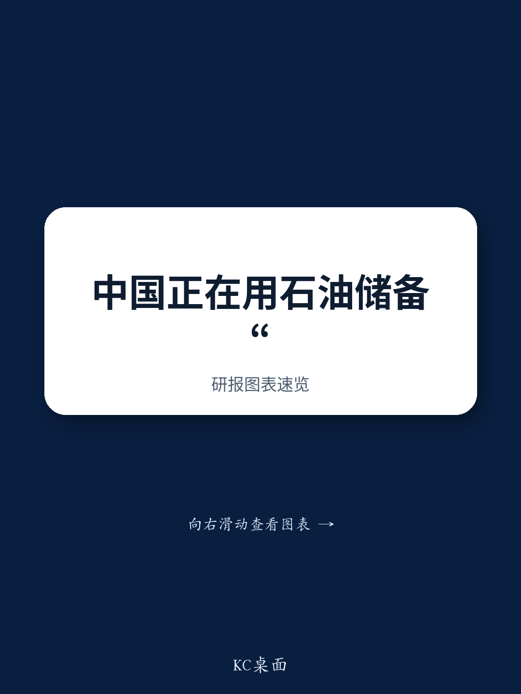

# NOM：中国战略石油储备在霍尔木兹海峡关闭期间充当缓冲

2026年2月底霍尔木兹海峡关闭后，中国原油进口量在二季度同比下降30.3%，6月单月降幅扩大至41.3%。NOM亚洲宏观环境团队在最新报告中提出一个判断：中国之所以能承受如此大幅度的进口削减，并非源于国内增产、燃油出口限制或电动车替代，而是依托全球规模最大的战略石油储备。

这份报告的价值在于，它把中国从“全球最大原油买家”重新定位为“全球油市的减震器”。当多数国家在供应冲击面前被动应对时，中国凭借约1250亿桶的储备规模，主动压缩进口，客观上帮助抑制了国际油价的上行幅度。

## 1. 中国原油进口降幅远超国内产出与需求变化可解释的范围

报告排除了几个常见的解释路径。国内原油产量在二季度同比增速从一季度的1.3%节奏变化至0.4%，相对增量仅20万吨，远不足以对冲4300万吨的进口降幅。电力消费增速稳定在5.5%左右，没有出现燃油被电力大规模替代的迹象。燃油零售额同比下滑4.9%，甚至略好于一季度的-6.4%，说明价格并未显著抑制需求。

燃油出口限制的贡献同样有限。二季度燃油出口同比下降26.5%，理论上可解释约4%的进口降幅，但同期燃油进口下降51.8%，两者相抵后，中国仍面临相当于原油进口量1.7%的净燃油流出。

> **KC评论：** 报告把“进口为什么降这么多”拆成了几块，每一块都算了一笔账。读者容易忽略的是燃油进口同步明显波动这个细节——它说明中国消费者要么在消耗燃油库存，要么在加大原油直接加工，出口禁令的实际效果比表面数字要弱。

## 2. 战略石油储备规模与动用速度构成核心缓冲机制

中国战略石油储备体系始于2004年，最初设计为约30天的进口覆盖。经过二十年的建设，目前由政府储备和国有油企商业库存共同构成，后者自2024年起被要求承担应急储备功能，形成事实上的第二战略层。

NOM综合Kpler、Vortexa、美国能源信息署和牛津能源研究所的估算，截至2025年底，中国陆上原油库存总量在11亿至14亿桶之间，中心估计为12亿至13亿桶，相当于约112天的净进口覆盖。这一规模显著高于美国约4.13亿桶的战略储备，但按天数计算低于日本的约200天和韩国的约208天。

报告估算，中国战略储备在一季度增加8500万桶，二季度动用3.2亿桶，其中6月单月动用1.51亿桶。截至6月底，储备降至约10.15亿桶，按6月的动用速度还可维持约6.7个月。7月的高频数据已显示进口环比回升，这些原油大概率是在5月底至6月布伦特油价跌破每桶90美元时采购的。

## 3. 储备回补节奏将决定中国从缓冲器转为需求增量的时点

报告认为，中国会在布伦特油价回落至每桶60美元以下时显著增加进口以补充储备。这意味着中国对全球油市的影响正在从“减少需求”转向“潜在新增需求”，转变的触发条件是价格而非政治决策。

一个值得注意的对比是IEA的协调释放。3月11日，IEA成员国同意释放4亿桶战略储备，规模为2022年俄乌冲突后释放量的两倍以上。但IEA成员合计持有约18亿桶公共和行业库存，4亿桶的释放计划约占其中五分之一。相比之下，中国单方面在二季度动用的3.2亿桶，规模已接近IEA整体释放计划的八成。

> **KC评论：** 中国储备的相对规模大，但按天数算只有100天出头，低于日韩。这个结构意味着中国在仍在调整初期有充足空间削减进口，但持续消耗后，回补需求会相当集中。观察中国进口恢复的节奏，比观察油价本身更能预判供应紧张何时缓解。

## 4. 观察中国油市行为的三个先行指标

报告提供了几个可跟踪的指标。其一是燃油零售额增速，它比油价更能反映真实需求变化；其二是国内原油产量增速，目前稳定在0.4%左右，说明增产空间有限；其三是电动车渗透率，二季度乘用车市场EV渗透率从45%升至62%，但EV充电用电量占全国总用电量不足2%，短期内难以替代燃油需求。

这三个指标共同指向一个结论：中国应对供应冲击的主要工具是储备管理，而非生产或消费端的快速调整。这也解释了为什么北京在扰动中的反应集中在进口节奏和出口限制上，而非国内配给或价格干预。

For informational purposes only. Portions may be generated,translated,summarized,or edited with AI assistance based on source materials and may contain omissions or errors. Please verify independently. This is not investment,legal,tax,accounting,or other professional advice.

