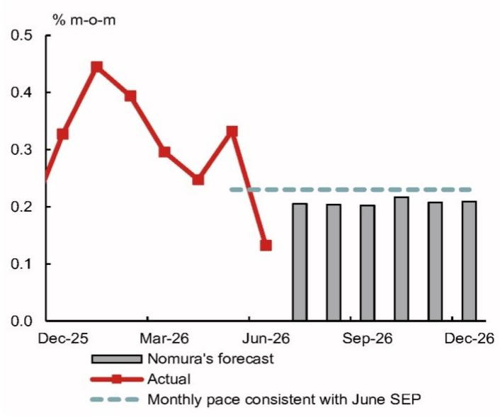
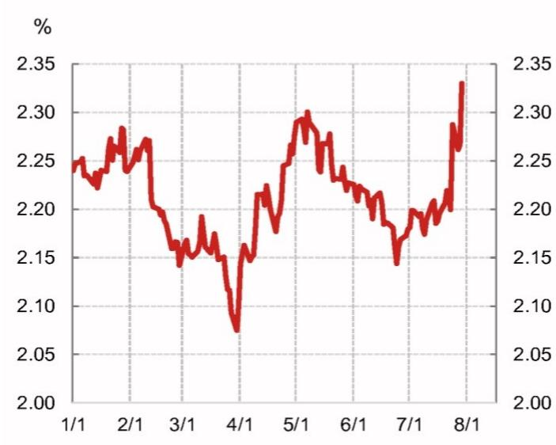
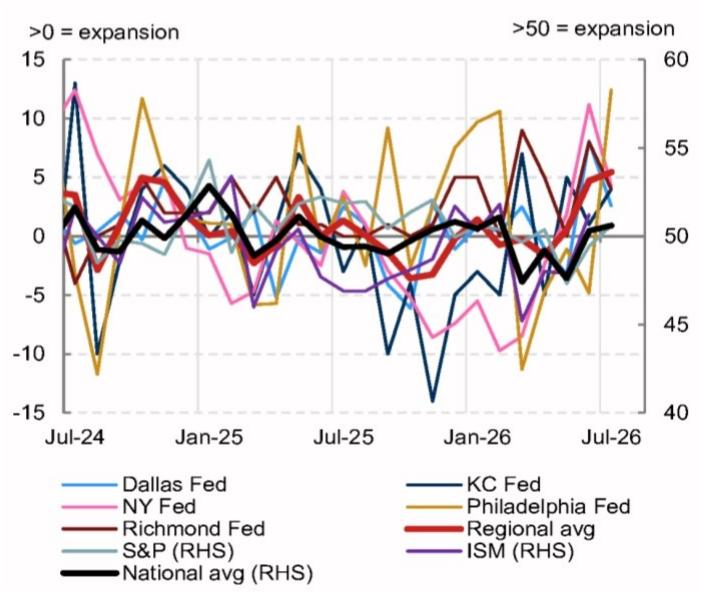
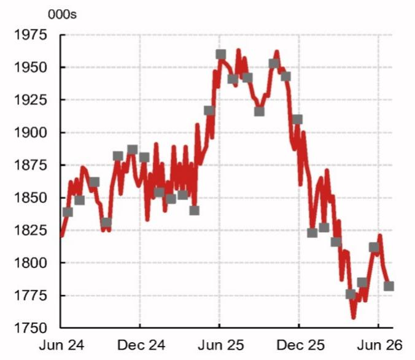
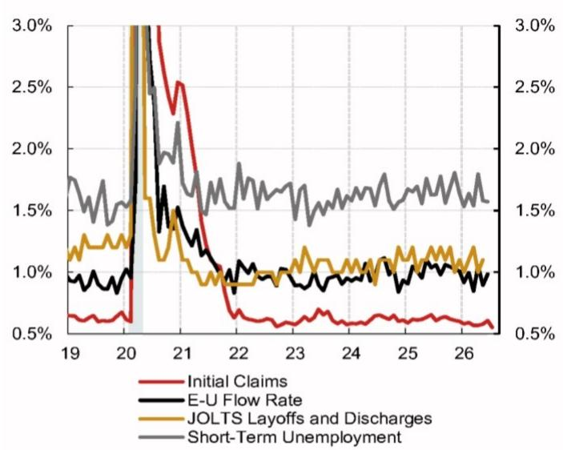
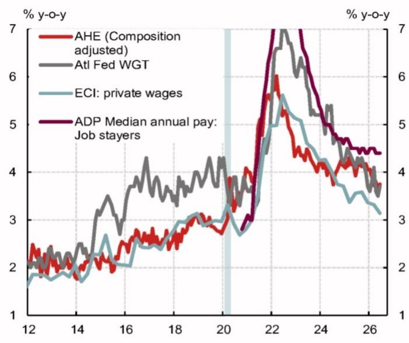
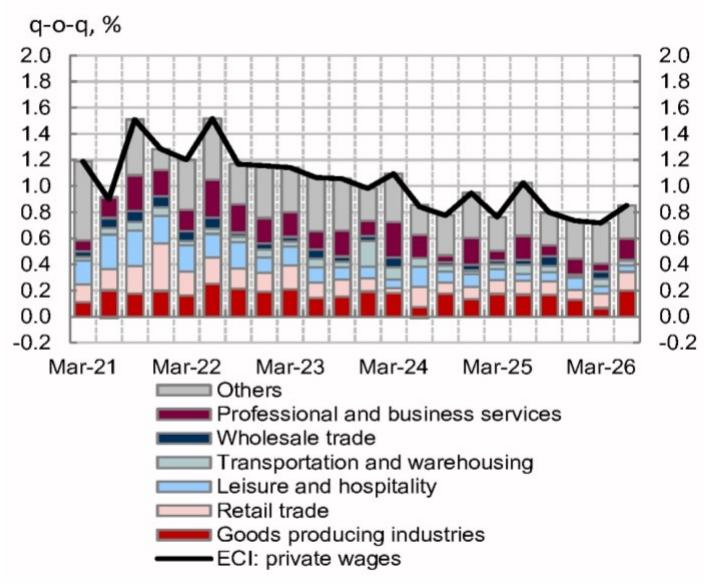
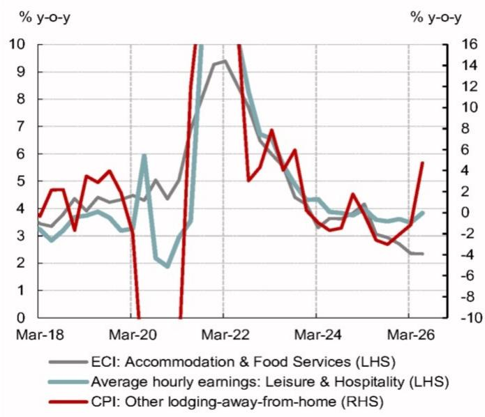

# 北美宏观观察

## 市场在适应政策节奏

- 联邦公开市场委员会（FOMC）维持利率不变，符合我们的预期。主席沃什（Warsh）持续释放偏宽松信号，叠加其对政策反应函数解释不够清晰，引发市场对央行通胀可信度的关注。值得注意的是，若通胀数据重新加速，沃什过度宽松的表态反而可能推高加息风险。

- 我们预计7月非农就业新增人数将从6月的5.7万人回升至13万人。失业率大概率保持在4.2%附近，平均时薪环比增速放缓至0.2%。整体来看，劳动力市场仍具韧性，这或使央行继续聚焦于通胀风险。

- 本周公布的通胀数据支持了央行观望的态度。6月核心PCE通胀环比明显放缓至0.132%。尽管二季度整体就业成本指数（ECI）略超预期，但私营服务业ECI的持续温和表现令人鼓舞，显示服务业通胀重新抬升的风险有限。

## FOMC按兵不动，但卡什卡利投下异议票

FOMC在7月会议上维持利率不变，符合我们的预期。会议声明基本没有变化。三位地区联储主席——洛根（Logan）、哈马克（Hammack）和卡什卡利（Kashkari）——投下支持加息的异议票。前两位的异议在我们的预期之内，但卡什卡利的立场令人意外。他在会后的声明中表示，日益担心一系列供给冲击可能使高通胀变得根深蒂固。

## 通胀框架仍不明朗

沃什在开场发言中重申了央行对价格稳定的承诺，以及对通胀高于2%的低容忍度，与其近期公开发言一致。他还强调，通胀及相应的政策应对是讨论的关键议题。

尽管如此，沃什再次拒绝明确阐述其通胀框架。他重复了“通胀”与“物价上涨”之间的区分，暗示与人工智能相关的需求及供给冲击可能不需要更紧的政策来应对。他还淡化了针对供给端精细调节总需求的必要性，隐含表达了对人工智能驱动下通胀回落的信心，同时暗示部分通胀可能反映的是过去资产负债表政策的影响，而非宽松利率所致。

沃什没有给出前瞻指引，对政策反应函数的表述依然模糊。他表示6月通胀数据的下行意外对7月决策影响有限，仅指出持续高企的通胀会让他更倾向于加息，并补充说“利率很可能是解决方案的一部分”。

## 市场信号受到关注

另一个偏宽松的进展是，沃什暗示市场回报表现上升可以替代央行加息。他在开场发言中特别提到近期名义和实际回报表现的上行，称其“属于过去二十年中最显著的变动之一”。在随后的新闻发布会上，他更加明确地将市场走势与央行维持利率不变的决定联系起来。当被问及为何央行没有加息时，沃什回答：利率已经处于较高水平。

在我们看来，这与沃什过去的一些表态似乎不太一致。此前他曾主张市场是在预期央行政策，而非替代政策。例如，在近期欧洲央行辛特拉论坛上，沃什曾指出利率上行和通胀预期回落是市场理解央行政策反应函数的迹象。

沃什在本次发布会上并未直接认可任何市场走势，但他暗示，在央行减少前瞻指引的情况下，两次会议之间的价格动态可能带来一定益处。他声称，来自市场的“未经过滤”信号对政策制定者更有用，并补充说市场参与者正在“学着适应规则，而不是评判裁判”。他似乎坚持认为前瞻指引并非必需，并表示将在即将到来的杰克逊霍尔演讲中讨论一个宏大主题，而非近期政策前景。

**图1：我们预计未来数月核心PCE通胀温和，或支持央行保持耐心**
月度核心PCE通胀

来源：BLS、BEA、Haver、NOM

**图2：7月FOMC会议后，市场隐含的长期通胀预期有所上升**
5年5年远期盈亏平衡通胀率

来源：Bloomberg、NOM

## 市场可信度挑战构成偏紧风险

我们继续预计核心PCE通胀将在未来数月逐步回落（图1），原因包括关税效应减弱、季节性残余影响、工资增长趋缓，以及BEA即将进行的方法论修订。这些因素有望缓解对通胀风险以及央行抗通胀可信度的担忧。

话虽如此，风险正日益偏向加息方向。沃什的偏宽松基调，加上政策反应函数不清晰，以及市场走势究竟是政策的输入变量还是输出结果存在模糊性，似乎削弱了央行在通胀方面的可信度。市场反应明显，盈亏平衡通胀率上升，30年期国债回报表现显著走高（图2）。盈亏平衡通胀率上升增加了长期通胀预期脱锚的风险，这是沃勒（Waller）等部分政策制定者关注的关键问题。在这种环境下，即使出现通胀走强或回落停滞的温和迹象，也可能引发市场对央行可信度的更强烈反应，更重要的是，可能促使委员会收紧政策。

## 7月就业增长或有所回升

我们预计7月总体非农就业新增人数从6月的5.7万人回升至13万人，较年初至今月均9.2万人的水平温和加速。当月私营部门就业明显回升，就业增长广度可能保持稳健，显示劳动力市场仍具韧性。

过去两年，7月劳动力市场数据均出现下行意外，引发市场大幅重新定价和央行的“保险性”降息。尽管2024年（失业率上升触发萨姆规则）和2025年（5月和6月非农数据出现前所未有的负向修正）的放缓担忧在时间上相似，但我们没有看到强有力的证据表明失业率或非农数据存在明显的季节性残余。此外，整体背景也很重要——与近年不同，目前进入7月就业报告前，几乎没有更广泛劳动力走弱的迹象。

**图3：7月主要地区和全国调查的就业指数有所改善**

来源：地区联储银行、ISM、S&P Global、Haver、NOM

**图4：持续申领失业金人数在7月调查参考周内下降**

注：标记对应非农调查参考周
来源：DOL、BLS、Haver、NOM

服务业调查和持续申领失业金人数等领先指标在7月有所改善（图3和图4）。周度ADP数据也显示私营部门就业持续扩张。此外，我们认为6月拖累招聘的一些暂时性因素可能在7月逆转。

我们预计7月失业率保持在4.2%不变。上月报告中的下降似乎是由噪音数据驱动的，但基本面随后有所改善。裁员人数保持低位，初请失业金人数呈下降趋势并处于多年低点（图5）。尽管劳动力需求指标表现不一，我们看到了初步改善的迹象。

我们预计平均时薪环比增速从6月的0.3%放缓至0.2%，与近期替代性工资指标的走软一致（图6）。负日历效应和平均每周工时可能上升的风险支持我们的预测。总体而言，我们认为劳动力市场的韧性可能使央行继续关注通胀风险。

**图5：裁员指标，尤其是初请失业金人数，保持低位**

来源：BLS、Haver、NOM

**图6：我们预计7月平均时薪增速放缓，与近期替代性工资指标走软一致**
工资增长指标

来源：亚特兰大联储、ADP、BLS、NBER、Haver、NOM

## 核心PCE通胀放缓，服务业工资增长持续温和

6月核心PCE通胀低于预期，环比仅上升0.132%（市场预期：0.2%，NOM：0.175%）。从细节看，我们4个基点预测偏差的一半以上来自为住户服务的非营利机构（NPISH）的最终消费支出。NPISH价格环比下降1.3%，降幅超出我们的预期，创下2017年10月以来最大月度降幅。6月数据弱于预期，将核心PCE同比通胀推低至3.287%，略低于我们预测的3.321%（市场预期：3.3%）。我们继续认为核心PCE同比通胀已在5月见顶，并将在今年下半年逐步回落。

就业成本指数（ECI）——央行偏好的工资指标——略超预期，二季度环比上升0.9%（NOM：0.7%，市场预期：0.8%）。意外上行主要来自商品生产行业（建筑业和制造业）（图7）。这是强劲的资本支出需求可能开始影响劳动力市场和工资的早期迹象。不过，对通胀的近期解读偏宽松，因为私营服务业工资增长略有放缓（图8）。

**图7：二季度ECI私营部门工资增长加速，受商品生产行业意外走强推动**
ECI私营部门工资环比增长分解

来源：BLS、Haver、NOM

**图8：ECI数据显示，今年上半年住宿价格走强的态势不可持续**
住宿及餐饮服务业ECI私营工资 vs. CPI其他住宿价格

来源：BLS、Haver、NOM

## 经济活动保持稳健

实际GDP环比年化增速从2.1%放缓至1.5%（NOM：1.8%，市场预期：2.0%），政府支出和净出口等波动较大的分项对GDP增长形成拖累。不过，面向私人国内购买者的实际最终销售（即消费支出与私人固定投资之和，可视为国内最终需求的代理指标）环比年化增速从一季度的1.7%明显加快至3.9%（NOM：3.4%）。

从细节看，个人消费保持稳健，商品和服务消费普遍增长。固定投资也有所上升，设备和知识产权产品投资的强势抵消了私人库存投资和非住宅建筑投资的疲弱。BEA指出设备投资增长较为普遍，进一步证明资本支出正在从科技/人工智能领域向外扩展。住宅投资自2024年四季度以来首次实现增长，符合我们的预期。

## 数据前瞻

## 未来一周展望

我们预计就业增长回升至13万人，失业率保持在4.2%不变。

**ISM制造业（周一）**：我们预计7月ISM制造业指数从6月的53.3升至53.8，与其他地区调查一致。新订单可能小幅回落，但仍高于50。生产可能保持韧性，就业指数当月有所改善。价格指数可能仍处高位，交付时间或因中东局势再度紧张而延长。

**汽车销售（周一）**：7月汽车销售年化速度可能从6月的1650万辆加快至1670万辆。融资成本下降和经销商激励支出增加，可能抵消不确定性上升带来的不利影响。

**贸易收支（周二）**：我们预计6月贸易逆差从5月的776亿美元收窄至730亿美元。商品贸易先行报告显示当月进口明显下降，商品出口小幅回落。

**JOLTS职位空缺（周二）**：我们预计6月JOLTS职位空缺从5月的759.4万降至740万。我们的预测显示V-U比率保持在1.04不变，职位空缺率从4.6%降至4.4%。需要注意的是，近期JOLTS数据波动较大，表现优于Indeed和Lightcast等替代性劳动力需求指标，这些指标也显示5月数据可能被下修。

**ISM服务业（周三）**：我们预计7月ISM服务业指数从6月的54.0升至54.8。当月全国和地区服务业调查普遍积极。我们预计商业活动和新订单保持韧性，就业指数可能处于扩张区间。

**失业金申领（周四）**：本周初请和持续申领失业金人数均保持低位，进一步证明裁员有限、劳动力市场具有韧性。

**就业报告（周五）**：我们预计7月总体就业增长从6月的5.7万人加速至13万人。服务业调查有所改善，持续申领失业金人数在调查参考周内呈下降趋势，表明招聘有所增强。

我们预计失业率保持在4.2%不变，风险偏向上行。尽管6月失业率下降存在噪音，但7月参考周内劳动力市场基本面似乎有所增强，裁员人数降至多年低点。

我们预计平均时薪环比增速从6月的0.3%放缓至0.2%。负日历效应和平均每周工时可能回升支持我们的预测。

尽管过去两年7月劳动力市场数据均出现下行意外，但我们没有看到强有力的证据表明非农或失业率存在明显的季节性残余。与近年不同，进入本月报告前几乎没有更广泛劳动力走弱的迹象。

**图9：8月3日当周经济指标预测**

<table><tr><td colspan="2">周一 8月3日</td><td>单位</td><td>时期</td><td>前值2</td><td>前值1</td><td>最新</td><td>NOM</td><td>市场预期</td></tr><tr><td>9:45</td><td>S&amp;P制造业PMI</td><td>指数</td><td>7月终值</td><td>55.1</td><td>53.9</td><td>53.8</td><td>—</td><td>—</td></tr><tr><td>10:00</td><td>ISM制造业</td><td>指数</td><td>7月</td><td>52.7</td><td>54.0</td><td>53.3</td><td>53.8</td><td>54.0</td></tr><tr><td>10:00</td><td>建筑支出</td><td>环比%</td><td>6月</td><td>0.4</td><td>0.3</td><td>0.1</td><td>—</td><td>—</td></tr><tr><td></td><td>汽车总销量</td><td>百万辆年化</td><td>7月</td><td>15.9</td><td>16.1</td><td>16.5</td><td>16.7</td><td>16.5</td></tr><tr><td colspan="9">周二 8月4日</td></tr><tr><td>8:30</td><td>贸易收支</td><td>十亿美元</td><td>6月</td><td>-56.6</td><td>-55.9</td><td>-77.6</td><td>-73.0</td><td>-73.0</td></tr><tr><td>10:00</td><td>工厂订单</td><td>环比%</td><td>6月</td><td>1.8</td><td>5.3</td><td>-1.3</td><td>—</td><td>0.5</td></tr><tr><td>10:00</td><td>JOLTS职位空缺</td><td>千人</td><td>6月</td><td>6887</td><td>7585</td><td>7594</td><td>7400</td><td>—</td></tr><tr><td colspan="9">周三 8月5日</td></tr><tr><td>7:00</td><td>抵押贷款申请</td><td>环比%</td><td>7月31日</td><td>-2.7</td><td>1.9</td><td>-6.4</td><td>—</td><td>—</td></tr><tr><td>8:15</td><td>ADP私营就业</td><td>千人</td><td>7月</td><td>105</td><td>122</td><td>98</td><td>—</td><td>75</td></tr><tr><td>9:45</td><td>S&amp;P服务业PMI</td><td>指数</td><td>7月</td><td>51</td><td>50.7</td><td>51.2</td><td>—</td><td>—</td></tr><tr><td>10:00</td><td>ISM服务业</td><td>指数</td><td>7月</td><td>53.6</td><td>54.5</td><td>54.0</td><td>54.8</td><td>54.3</td></tr><tr><td colspan="9">周四 8月6日</td></tr><tr><td>8:30</td><td>初请失业金人数</td><td>千人</td><td>8月1日</td><td>209</td><td>188</td><td>197</td><td>—</td><td>218</td></tr><tr><td>8:30</td><td>持续申领失业金人数</td><td>千人</td><td>7月25日</td><td>1798</td><td>1789</td><td>1782</td><td>—</td><td>1820</td></tr><tr><td>8:30</td><td>非农生产率</td><td>环比年化%</td><td>二季度初值</td><td>5.2</td><td>1.6</td><td>0.3</td><td>—</td><td>—</td></tr><tr><td>8:30</td><td>单位劳动力成本</td><td>环比年化%</td><td>二季度初值</td><td>1.0</td><td>2.1</td><td>1.8</td><td>—</td><td>—</td></tr><tr><td colspan="9">周五 8月7日</td></tr><tr><td>8:30</td><td>非农就业</td><td>千人</td><td>7月</td><td>148</td><td>129</td><td>57</td><td>130</td><td>93</td></tr><tr><td>8:30</td><td>私营就业</td><td>千人</td><td>7月</td><td>150</td><td>97</td><td>49</td><td>120</td><td>93</td></tr><tr><td>8:30</td><td>失业率</td><td>%</td><td>7月</td><td>4.3</td><td>4.3</td><td>4.2</td><td>4.2</td><td>4.2</td></tr><tr><td>8:30</td><td>平均时薪</td><td>环比%</td><td>7月</td><td>0.2</td><td>0.3</td><td>0.3</td><td>0.2</td><td>0.3</td></tr><tr><td>8:30</td><td>平均每周工时</td><td>水平</td><td>7月</td><td>34.3</td><td>34.3</td><td>34.3</td><td>34.3</td><td>34.3</td></tr></table>

来源：Haver、Bloomberg、NOM
注：美国东部夏令时（EDT）。所有NOM预测均为众数预测。

## 美国宏观展望

我们预计央行将无限期维持利率不变（风险偏向加息），原因是价格压力持续、劳动力市场稳定以及政治压力减弱。

**经济活动**：近期增长保持稳健，受益于关税不确定性缓解、财政刺激措施以及宽松金融环境下此前降息的滞后效应。商业投资似乎正在向人工智能领域之外扩展。尽管伊朗战争导致能源价格上涨，消费仍保持韧性，部分得益于退税增加和强劲的工资收入增长。非农数据虽有波动，但一系列指标显示劳动力市场趋于稳定并出现初步回升迹象。虽然近期失业率下降是一次性因素所致，但我们预计失业率将在年底前逐步回落至4.1%。由于能源商品在家庭消费中占比较小，加上国内能源生产充足，美国经济对伊朗战争引发的原油价格冲击相对具有韧性。

**通胀**：核心通胀仍明显高于央行2%的目标，风险偏向上行。我们预测2026年四季度核心PCE同比通胀为3.2%，但BEA计划对部分PCE价格分项进行方法论调整，可能使2026年四季度核心PCE同比通胀降低约20个基点至3.1%。关税相关的价格压力正在消退，但需求强劲和供给短缺带来的新的人工智能相关价格压力可能推高商品通胀。总体而言，考虑到季节性残余和工资增长趋缓，我们预计核心PCE通胀将在未来数月回落。

**政策**：我们预计央行将无限期维持利率不变。美联储主席沃什可能仍有动力放松政策，但通胀高企和偏鹰派的官员表态表明，他可能无法说服多数人支持降息。此外，他可能倾向于让委员会维持政策利率不变，直到近期宣布的工作组就数据和货币政策的不同方面提出建议。风险平衡偏向收紧，特别是沃什的偏宽松言论引发了市场对央行抗通胀可信度的担忧。

**风险**：地缘政治风险进一步升级可能导致金融环境收紧和财政前景恶化。FOMC参与者面临的政治压力增加可能削弱央行可信度并引发市场剧烈反应。人工智能泡沫破裂可能导致资产估值大幅修正和商业投资减少。伊朗战争长期化导致的存储芯片持续短缺和供应链中断，可能对通胀产生第二轮影响。

**图10：美国预测详情**

<table><tr><td rowspan="2">%</td><td rowspan="2"></td><td rowspan="2">25Q1</td><td rowspan="2">25Q2</td><td rowspan="2">25Q3</td><td rowspan="2">25Q4</td><td rowspan="2">26Q1</td><td rowspan="2">26Q2</td><td rowspan="2">26Q3</td><td rowspan="2">26Q4</td><td rowspan="2">27Q1</td><td rowspan="2">27Q2</td><td rowspan="2">27Q3</td><td rowspan="2">27Q4</td><td colspan="3">同比%</td><td colspan="3">四季度/四季度%</td></tr><tr><td>2025</td><td>2026</td><td>2027</td><td>2025</td><td>2026</td><td>2027</td></tr><tr><td></td><td>环比</td><td></td><td></td><td></td><td></td><td></td><td></td><td></td><td></td><td></td><td></td><td></td><td></td><td></td><td></td><td></td><td></td><td></td></tr><tr><td rowspan="2">实际GDP</td><td>(%, 年化)</td><td>-0.6</td><td>3.8</td><td>4.4</td><td>0.5</td><td>2.1</td><td>1.5</td><td>2.1</td><td>1.9</td><td>1.9</td><td>1.9</td><td>1.7</td><td>1.6</td><td>2.1</td><td>2.1</td><td>1.9</td><td>2.0</td><td>1.9</td><td>1.8</td></tr><tr><td>(%)</td><td>-0.2</td><td>0.9</td><td>1.1</td><td>0.1</td><td>0.5</td><td>0.4</td><td>0.5</td><td>0.5</td><td>0.5</td><td>0.5</td><td>0.4</td><td>0.4</td><td></td><td></td><td></td><td></td><td></td><td></td></tr><tr><td>个人消费</td><td>(%, 年化)</td><td>0.6</td><td>2.5</td><td>3.5</td><td>1.9</td><td>0.5</td><td>3.2</td><td>1.8</td><td>1.8</td><td>1.8</td><td>1.7</td><td>1.5</td><td>1.5</td><td>2.6</td><td>2.0</td><td>1.8</td><td>2.1</td><td>1.8</td><td>2.1</td></tr><tr><td>非住宅固定投资</td><td>(%, 年化)</td><td>9.5</td><td>7.3</td><td>3.2</td><td>2.4</td><td>10.6</td><td>8.4</td><td>4.5</td><td>3.6</td><td>3.4</td><td>3.1</td><td>2.5</td><td>2.5</td><td>4.1</td><td>6.3</td><td>3.6</td><td>5.6</td><td>6.7</td><td>5.0</td></tr><tr><td>住宅固定投资</td><td>(%, 年化)</td><td>-1.0</td><td>-5.1</td><td>-7.1</td><td>-1.7</td><td>-7.8</td><td>1.5</td><td>3.2</td><td>3.0</td><td>2.8</td><td>2.8</td><td>2.5</td><td>2.5</td><td>-2.2</td><td>-2.7</td><td>2.7</td><td>-3.8</td><td>-0.1</td><td>2.6</td></tr><tr><td>政府支出</td><td>(%, 年化)</td><td>-1.0</td><td>-0.1</td><td>2.2</td><td>-5.6</td><td>4.4</td><td>-0.8</td><td>0.9</td><td>0.9</td><td>1.0</td><td>1.0</td><td>1.0</td><td>1.0</td><td>1.1</td><td>0.3</td><td>0.8</td><td>-1.2</td><td>1.4</td><td>0.5</td></tr><tr><td>出口</td><td>(%, 年化)</td><td>0.2</td><td>-1.8</td><td>9.6</td><td>-3.2</td><td>10.9</td><td>4.5</td><td>2.3</td><td>2.3</td><td>2.3</td><td>2.3</td><td>2.2</td><td>2.1</td><td>1.6</td><td>4.3</td><td>2.4</td><td>1.1</td><td>4.9</td><td>2.8</td></tr><tr><td>进口</td><td>(%, 年化)</td><td>38.0</td><td>-29.3</td><td>-4.4</td><td>-1.0</td><td>11.8</td><td>11.5</td><td>3.5</td><td>3.3</td><td>2.8</td><td>2.5</td><td>2.3</td><td>2.0</td><td>2.7</td><td>2.5</td><td>3.3</td><td>-1.9</td><td>7.4</td><td>5.2</td></tr><tr><td>对GDP的贡献：</td><td></td><td></td><td></td><td></td><td></td><td></td><td></td><td></td><td></td><td></td><td></td><td></td><td></td><td></td><td></td><td></td><td></td><td></td></tr><tr><td>最终销售</td><td>(百分点, 年化)</td><td>-3.2</td><td>7.3</td><td>4.5</td><td>0.3</td><td>1.9</td><td>2.2</td><td>1.9</td><td>1.8</td><td>1.8</td><td>1.8</td><td>1.6</td><td>1.6</td><td>2.2</td><td>2.3</td><td>1.8</td><td>2.1</td><td>2.0</td><td>1.7</td></tr><tr><td>净出口</td><td>(百分点, 年化)</td><td>-4.7</td><td>4.8</td><td>1.6</td><td>-0.2</td><td>-0.4</td><td>-1.0</td><td>-0.2</td><td>-0.2</td><td>-0.1</td><td>-0.1</td><td>0.0</td><td>0.0</td><td>-0.2</td><td>0.1</td><td>-0.2</td><td>0.4</td><td>-0.4</td><td>0.0</td></tr><tr><td>库存</td><td>(百分点, 年化)</td><td>2.6</td><td>-3.4</td><td>-0.1</td><td>0.1</td><td>0.2</td><td>-0.7</td><td>0.2</td><td>0.1</td><td>0.1</td><td>0.1</td><td>0.1</td><td>0.0</td><td>-0.1</td><td>-0.3</td><td>0.1</td><td>-0.1</td><td>-0.1</td><td>0.1</td></tr><tr><td></td><td>注</td><td></td><td></td><td></td><td></td><td></td><td></td><td></td><td></td><td></td><td></td><td></td><td></td><td></td><td></td><td></td><td></td><td></td></tr><tr><td>失业率</td><td>(%)</td><td>4.1</td><td>4.2</td><td>4.3</td><td>4.5</td><td>4.3</td><td>4.3</td><td>4.2</td><td>4.1</td><td>4.0</td><td>3.9</td><td>3.9</td><td>3.9</td><td>4.3</td><td>4.2</td><td>3.9</td><td></td><td></td><td></td></tr><tr><td>非农就业</td><td>(千人)</td><td>20</td><td>34</td><td>23</td><td>-39</td><td>73</td><td>111</td><td>90</td><td>120</td><td>100</td><td>90</td><td>90</td><td>90</td><td>10</td><td>99</td><td>90</td><td></td><td></td><td></td></tr><tr><td>新屋开工</td><td>(千套, 年化)</td><td>1397</td><td>1356</td><td>1347</td><td>1323</td><td>1418</td><td>1347</td><td>1430</td><td>1420</td><td>1400</td><td>1390</td><td>1390</td><td>1380</td><td>1356</td><td>1404</td><td>1390</td><td></td><td></td><td></td></tr><tr><td>消费者价格</td><td>(%, 同比)</td><td>2.7</td><td>2.5</td><td>2.9</td><td>2.7</td><td>2.7</td><td>3.8</td><td>3.4</td><td>3.4</td><td>3.0</td><td>1.8</td><td>2.0</td><td>1.9</td><td>2.7</td><td>3.3</td><td>2.2</td><td></td><td></td><td></td></tr><tr><td>核心CPI</td><td>(%, 同比)</td><td>3.1</td><td>2.8</td><td>3.1</td><td>2.7</td><td>2.5</td><td>2.7</td><td>2.4</td><td>2.6</td><td>2.6</td><td>2.4</td><td>2.5</td><td>2.4</td><td>2.9</td><td>2.6</td><td>2.5</td><td></td><td></td><td></td></tr><tr><td>PCE平减指数</td><td>(%, 同比)</td><td>2.6</td><td>2.4</td><td>2.7</td><td>2.8</td><td>3.1</td><td>3.8</td><td>3.6</td><td>3.5</td><td>3.0</td><td>2.1</td><td>2.1</td><td>2.1</td><td>2.6</td><td>3.5</td><td>2.4</td><td></td><td></td><td></td></tr><tr><td>核心PCE</td><td>(%, 同比)</td><td>2.8</td><td>2.7</td><td>2.9</td><td>2.9</td><td>3.1</td><td>3.3</
