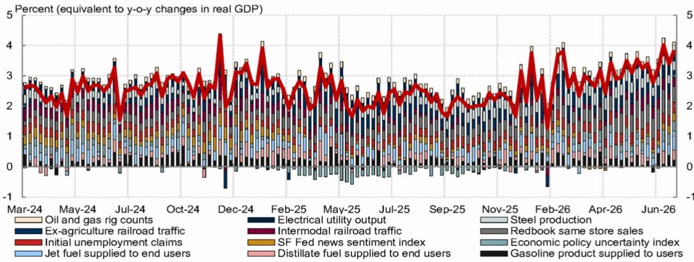
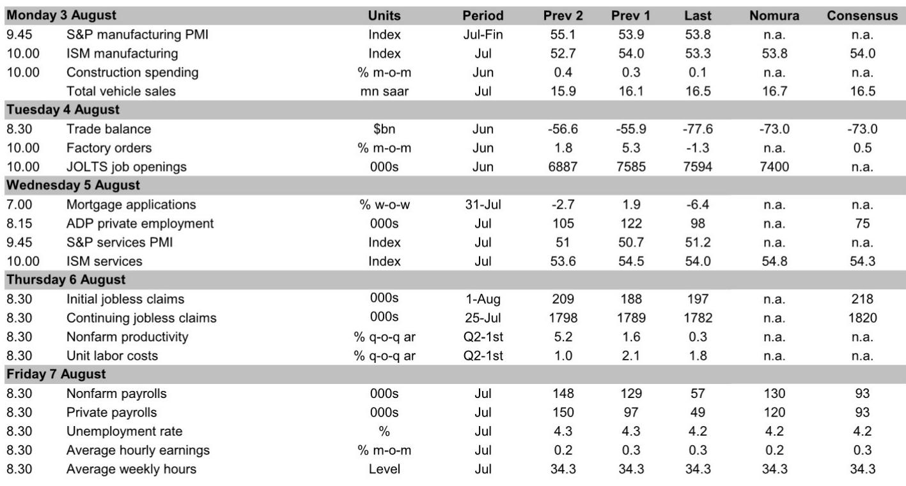
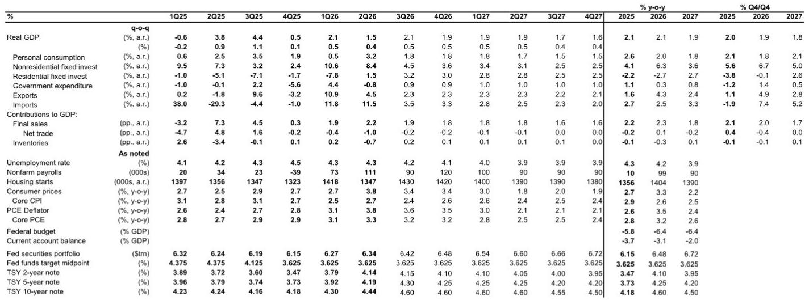

# NOM：研究主题与行业变化观察

7月FOMC会议按兵不动，符合市场预期，但这次会议传递的信号并不平静。NOM在最新研报中指出，主席Warsh的立场、模糊的反应函数，以及他对市场利率替代政策紧缩的暗示，正在削弱美联储对抗通胀的可信度。一个反直觉的推论是：过度宽松的表态，反而提高了未来若通胀重新加速、联储被迫加息的概率。

报告同时给出了一个关键数据锚点：6月核心PCE环比仅上涨0.132%，显著低于市场预期的0.2%。通胀降温与政策姿态之间的错位，构成了当前宏观定价的核心矛盾。

## 1. 三位委员反对按兵不动，Kashkari的立场超出市场预期

本次会议有三张反对票，均主张加息，来自Logan、Hammack和Kashkari。前两位的反对在NOM预期之内，Kashkari的立场则让市场意外。他在会后的声明中表示，越来越担心一系列供给冲击可能使高通胀固化。

这一细节值得注意。Kashkari历来被视为中间偏宽松的委员，他的转向可能反映了委员会内部对通胀不确定性的评估正在变化。当一位以耐心著称的官员开始担心通胀锚定，市场的反应函数需要相应调整。

## 2. Warsh回避通胀框架，市场利率被纳入政策考量

Warsh在发布会上重申了对价格稳定的承诺，以及对于通胀高于2%的低容忍度，但再次拒绝明确其通胀框架。他延续了此前对“通胀”与“物价上涨”的区分，暗示AI相关的需求与供给冲击可能不需要更紧的政策来应对。

更值得关注的是，Warsh明确提到近期名义与实际回报表现的上升是“过去二十年中最显著的变动之一”，并将其与联储维持利率不变的决定联系起来。在被问及为何不加息时，他的回答是“利率已经更高了”。

这一表述与Warsh此前在ECB辛特拉论坛上的观点存在张力。当时他认为市场是在预期联储政策，而非替代政策。如今他暗示市场利率可以部分承担紧缩功能，并称“不受过滤”的市场信号对决策者更有用。NOM认为，这种模糊性正在削弱联储的可信度。

> **KC评论：** 市场定价与政策立场之间的循环关系，是理解本次会议的关键。如果联储暗示市场利率可以替代政策行动，那么通胀预期的波动就会被放大——因为市场会试图猜测联储何时会接受更高的利率作为“事实上的紧缩”。

## 3. 盈亏平衡通胀率上升，长期通胀预期面临脱锚不确定性

市场对本次会议的反应是直接的。5年5年远期盈亏平衡通胀率在FOMC会议后跳升，30年期国债回报表现显著走高。NOM指出，盈亏平衡通胀率的上升增加了长期通胀预期脱锚的不确定性，这正是Waller等官员关注的核心问题。

在这种环境下，即使只是温和的通胀回升迹象，也可能引发市场对联储可信度的更强烈反应，进而促使委员会收紧政策。NOM对核心PCE的基准预测是逐步节奏变化——关税效应减弱、剩余季节性、工资增长温和以及BEA方法修订都将支持这一路径——但不确定性已经明显偏向加息一侧。

## 4. 7月非农预计回升至13万，劳动力市场韧性支撑联储关注通胀

NOM预计7月非农就业新增13万人，较6月的5.7万人明显回升，失业率维持在4.2%，时薪环比增速节奏变化至0.2%。这一预测基于几个证据：地区联储和全国性调查的就业指数在7月改善，持续申领失业金人数在调查参考周内下降，ADP周度数据也指向私营部门继续扩员。

报告特别指出，过去两年7月劳动力数据均意外节奏变化，引发市场剧烈重新定价和联储“保险式”降息。但NOM认为，目前没有强证据显示失业率或非农存在显著剩余季节性，且与近年不同，当前进入7月报告时几乎没有更广泛劳动力走弱的迹象。

一个可复用的观察框架是：不要只看非农的单一数字，而是将调查类指标（ISM、地区联储）、高频数据（申领失业金、ADP）和临时性因素（日历效应、天气、一次性调整）放在一起交叉验证。当多个独立数据源指向同一方向时，单月数字的噪音权重应该降低。

## 5. 核心PCE降温与ECI工资数据的分化

6月核心PCE环比仅上涨0.132%，其中超过一半的预测偏差来自为住户服务的非营利机构（NPISH）价格，该分项环比下跌1.3%，创2017年10月以来最大月度降幅。同比核心PCE降至3.287%，NOM认为同比增速已在5月见顶。

与此同时，联储偏爱的工资指标ECI在二季度环比上涨0.9%，超出NOM预期的0.7%。意外走强集中在商品生产行业——建筑业和制造业——这可能是强劲资本开支需求开始影响劳动力市场和工资的早期信号。但对通胀的短期传导是宽松的：私营服务业工资增长略有节奏变化。

> **KC评论：** ECI与核心PCE的分化说明，通胀的供给侧逻辑正在变化。商品生产行业的工资不确定性来自资本开支周期，而服务业的工资节奏变化则指向需求侧降温。联储需要判断哪一边会主导未来几个季度的通胀路径，这比单月数据更重要。

## 6. 国内终端需求强劲，资本开支正在拓宽

二季度实际GDP增速节奏变化至1.5%，但这一数字掩盖了内需的韧性。对私人国内购买者的实际最终销售——消费加上私人固定研究的代理指标——环比年化增长3.9%，较一季度的1.7%明显加速。设备研究增长广泛，BEA指出其强势分布在各行业，进一步证明资本开支正在从科技和AI领域向外拓宽。

住宅研究自2024年四季度以来首次增长。整体来看，宏观环境活动保持强劲，而通胀在降温，劳动力市场稳定——这组组合支持联储维持观望，但Warsh的沟通方式让市场对政策路径的能见度下降了。

NOM对联储的基准判断是无限期按兵不动，不确定性偏向加息。通胀不确定性持续、劳动力市场稳定、政治不确定性减弱，这三个条件共同支撑这一判断。但市场已经开始对联储的可信度定价，盈亏平衡通胀率的上升表明，长期通胀预期的锚定程度正在被测试。接下来一周的就业数据，将是检验劳动力市场韧性与通胀不确定性之间平衡的第一个窗口。

For informational purposes only. Portions may be generated,translated,summarized,or edited with AI assistance based on source materials and may contain omissions or errors. Please verify independently. This is not investment,legal,tax,accounting,or other professional advice.

For informational purposes only. Portions may be generated,translated,summarized,or edited with AI assistance based on source materials and may contain omissions or errors. Please verify independently. This is not investment,legal,tax,accounting,or other professional advice.

