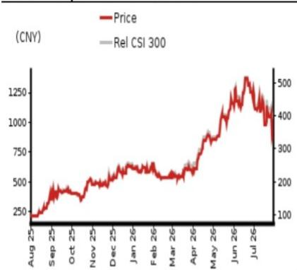
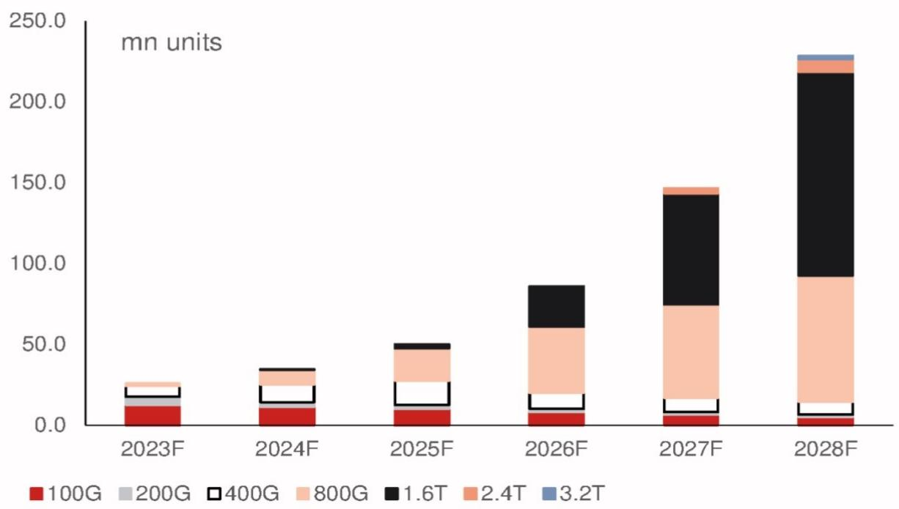

# 科技板块研究

## 多增长引擎驱动，行业领先地位稳固

### 2.4T光模块/NPO产品2027年启动，3.2T/CPO长期布局

**观点：维持积极评级，目标价上调至人民币1,375元**

尽管近期公司报价有所调整，我们认为其基本面增长动力在FY26-28F期间保持稳固：1）1.6T和硅光（SiPh）光模块的升级；2）2.4T相干-lite光模块和NPO（近场封装光学）产品预计于2027年开始商业化；3）3.2T光模块、XPO（超高密度可插拔光学）和CPO（共封装光学）市场的长期拓展。我们预测FY26-27F全球800G/1.6T光模块出货量分别为40.8-57.8百万/25.1-68.8百万只，同时预计FY27-28F 2.4T光模块出货量为3-8百万只，NPO产品为8百万/25百万只。因此，我们上调FY26-28F收入/盈利预测2-5%/4-10%，以反映强劲的产品升级和利润率提升。我们维持积极评级，并将目标价上调至人民币1,375元，基于21倍（此前为20倍）FY27F每股收益人民币65.47元，与WIND中国A股科技/电子元器件行业中位数估值水平一致。当前报价对应FY27F每股收益13.8倍。

### 利润率有望持续提升——上游供应缓解与产品升级共振（2H26F）

我们认为上游材料（如InP晶圆）和元器件（如EML/CW激光器）的供应瓶颈可能在2H26F逐步缓解，得益于产能加速扩张和公司有效的供应链管理。此外，我们认为利润率提升存在多重驱动因素，包括硅光光模块渗透率持续提升、2.4T光模块商业化以及NPO产品自2027年起逐步放量。我们认为新产品升级周期将足以抵消上游材料价格上涨的影响。因此，我们上调FY26-28F毛利率1.5-3.1个百分点。

### 竞争加剧担忧过度；多项新技术有望助力公司保持领先

我们认为市场对新进入者的担忧过度，因为新技术路线（如2.4T/3.2T/NPO/CPO）的技术壁垒将进一步提升。我们相信公司持续的研发投入和产品开发有助于维持市场领先地位，预计公司在FY26-28F全球AIDC光模块市场将保持30-35%的市场份额（1.6T及以上产品份额超过40%）。

<table><tr><td>截至12月31日</td><td colspan="2">FY25</td><td colspan="2">FY26F</td><td colspan="2">FY27F</td><td colspan="2">FY28F</td></tr><tr><td>货币（人民币）</td><td>实际</td><td>原预测</td><td>新预测</td><td>原预测</td><td>新预测</td><td>原预测</td><td>新预测</td></tr><tr><td>收入（百万元）</td><td>38,240</td><td>122,105</td><td>124,240</td><td>261,031</td><td>266,386</td><td>371,545</td><td>388,945</td></tr><tr><td>报告净利润（百万元）</td><td>10,797</td><td>33,654</td><td>35,844</td><td>73,396</td><td>76,341</td><td>103,944</td><td>114,172</td></tr><tr><td>标准化净利润（百万元）</td><td>10,797</td><td>33,654</td><td>35,844</td><td>73,396</td><td>76,341</td><td>103,944</td><td>114,172</td></tr><tr><td>摊薄后标准化每股收益</td><td>9.72</td><td>30.29</td><td>30.74</td><td>66.06</td><td>65.47</td><td>93.55</td><td>97.91</td></tr><tr><td>摊薄后标准化每股收益增速（%）</td><td>110.7</td><td>211.7</td><td>216.3</td><td>118.1</td><td>113.0</td><td>41.6</td><td>49.6</td></tr><tr><td>摊薄后标准化市盈率（倍）</td><td>92.8</td><td>-</td><td>29.3</td><td>-</td><td>13.8</td><td>-</td><td>9.2</td></tr><tr><td>EV/EBITDA（倍）</td><td>71.3</td><td>-</td><td>21.1</td><td>-</td><td>9.5</td><td>-</td><td>5.8</td></tr><tr><td>市净率（倍）</td><td>33.7</td><td>-</td><td>10.0</td><td>-</td><td>6.2</td><td>-</td><td>4.0</td></tr><tr><td>股息率（%）</td><td>0.2</td><td>-</td><td>0.6</td><td>-</td><td>1.2</td><td>-</td><td>1.8</td></tr><tr><td>净资产回报表现（%）</td><td>44.2</td><td>76.8</td><td>53.0</td><td>82.8</td><td>55.6</td><td>63.8</td><td>52.6</td></tr><tr><td>净债务/权益（%）</td><td>净现金</td><td>净现金</td><td>净现金</td><td>净现金</td><td>净现金</td><td>净现金</td><td>净现金</td></tr></table>

来源：公司数据，NOM预测

**评级维持积极**

**目标价**
由人民币1,325.00元上调
至人民币1,375.00元

**2026年7月31日收盘价** 人民币902.01元

<table><tr><td>隐含上行空间</td><td>+52.4%</td></tr></table>

<table><tr><td>市值（百万美元）</td><td>155,913.2</td></tr><tr><td>日均交易量（百万美元）</td><td>5,251.3</td></tr></table>

## 相对表现图

  
来源：LSEG，NOM

## 研究分析师

中国科技行业  
Bing Duan - NIHK  
bing.duan1@NOM.com  
+852 2252 2141

Ethan Zhang - NIHK  
ethan.zhang@NOM.com  
+852 2252 2157

## 中际旭创关键数据

<table><tr><td>表现（%）</td><td>1个月</td><td>3个月</td><td>12个月</td><td></td><td></td></tr><tr><td>相对表现（人民币）</td><td>-29.0</td><td>5.2</td><td>314.5</td><td>市值（百万美元）</td><td>155,913.2</td></tr><tr><td>相对表现（美元）</td><td>-28.5</td><td>6.6</td><td>341.9</td><td>自由流通比例（%）</td><td>68.1</td></tr><tr><td>相对沪深300</td><td>-20.3</td><td>10.5</td><td>302.9</td><td>3个月日均交易量（百万美元）</td><td>5,251.3</td></tr></table>

<table><tr><td colspan="6">利润表（百万元人民币）</td></tr><tr><td>截至12月31日</td><td>FY24</td><td>FY25</td><td>FY26F</td><td>FY27F</td><td>FY28F</td></tr><tr><td>收入</td><td>23,862</td><td>38,240</td><td>124,240</td><td>266,386</td><td>388,945</td></tr><tr><td>营业成本</td><td>-15,796</td><td>-22,166</td><td>-65,594</td><td>-138,085</td><td>-197,207</td></tr><tr><td>毛利润</td><td>8,067</td><td>16,074</td><td>58,646</td><td>128,301</td><td>191,738</td></tr><tr><td>销售及管理费用</td><td>-2,170</td><td>-2,170</td><td>-13,261</td><td>-33,762</td><td>-51,240</td></tr><tr><td>员工股份支出</td><td></td><td></td><td></td><td></td><td></td></tr><tr><td>营业利润</td><td>5,897</td><td>13,905</td><td>45,385</td><td>94,539</td><td>140,498</td></tr><tr><td>EBITDA</td><td>6,442</td><td>14,644</td><td>45,892</td><td>95,135</td><td>141,161</td></tr><tr><td>折旧</td><td>-545</td><td>-740</td><td>-508</td><td>-595</td><td>-663</td></tr><tr><td>摊销</td><td></td><td></td><td></td><td></td><td></td></tr><tr><td>EBIT</td><td>5,897</td><td>13,905</td><td>45,385</td><td>94,539</td><td>140,498</td></tr><tr><td>净利息支出</td><td>144</td><td>-183</td><td>-594</td><td>-1,273</td><td>-1,859</td></tr><tr><td>联营及合营企业</td><td></td><td></td><td></td><td></td><td></td></tr><tr><td>其他收入</td><td>11</td><td>-122</td><td>-397</td><td>-852</td><td>-1,243</td></tr><tr><td>税前利润</td><td>6,052</td><td>13,600</td><td>44,394</td><td>92,415</td><td>137,396</td></tr><tr><td>所得税</td><td>-681</td><td>-2,020</td><td>-6,594</td><td>-13,726</td><td>-20,407</td></tr><tr><td>税后净利润</td><td>5,372</td><td>11,580</td><td>37,800</td><td>78,689</td><td>116,989</td></tr><tr><td>少数股东权益</td><td>-200</td><td>-782</td><td>-1,956</td><td>-2,347</td><td>-2,817</td></tr><tr><td>其他项目</td><td></td><td></td><td></td><td></td><td></td></tr><tr><td>优先股股息</td><td></td><td></td><td></td><td></td><td></td></tr><tr><td>标准化归母净利润</td><td>5,171</td><td>10,797</td><td>35,844</td><td>76,341</td><td>114,172</td></tr><tr><td>特殊项目</td><td></td><td></td><td></td><td></td><td></td></tr><tr><td>报告归母净利润</td><td>5,171</td><td>10,797</td><td>35,844</td><td>76,341</td><td>114,172</td></tr><tr><td>股息</td><td>-845</td><td>-1,764</td><td>-5,856</td><td>-12,472</td><td>-18,652</td></tr><tr><td>转入储备</td><td>4,327</td><td>9,033</td><td>29,988</td><td>63,870</td><td>95,520</td></tr><tr><td>估值与比率</td><td></td><td></td><td></td><td></td><td></td></tr><tr><td>报告市盈率（倍）</td><td>195.6</td><td>92.8</td><td>29.3</td><td>13.8</td><td>9.2</td></tr><tr><td>标准化市盈率（倍）</td><td>195.6</td><td>92.8</td><td>29.3</td><td>13.8</td><td>9.2</td></tr><tr><td>摊薄后标准化市盈率（倍）</td><td>195.6</td><td>92.8</td><td>29.3</td><td>13.8</td><td>9.2</td></tr><tr><td>股息率（%）</td><td>0.1</td><td>0.2</td><td>0.6</td><td>1.2</td><td>1.8</td></tr><tr><td>价格/现金流（倍）</td><td>319.6</td><td>92.0</td><td>28.5</td><td>13.4</td><td>9.3</td></tr><tr><td>市净率（倍）</td><td>52.9</td><td>33.7</td><td>10.0</td><td>6.2</td><td>4.0</td></tr><tr><td>EV/EBITDA（倍）</td><td>163.1</td><td>71.3</td><td>21.1</td><td>9.5</td><td>5.8</td></tr><tr><td>EV/EBIT（倍）</td><td>178.2</td><td>75.1</td><td>21.4</td><td>9.6</td><td>5.8</td></tr><tr><td>毛利率（%）</td><td>33.8</td><td>42.0</td><td>47.2</td><td>48.2</td><td>49.3</td></tr><tr><td>EBITDA利润率（%）</td><td>27.0</td><td>38.3</td><td>36.9</td><td>35.7</td><td>36.3</td></tr><tr><td>EBIT利润率（%）</td><td>24.7</td><td>36.4</td><td>36.5</td><td>35.5</td><td>36.1</td></tr><tr><td>净利润率（%）</td><td>21.7</td><td>28.2</td><td>28.9</td><td>28.7</td><td>29.4</td></tr><tr><td>实际税率（%）</td><td>11.2</td><td>14.9</td><td>14.9</td><td>14.9</td><td>14.9</td></tr><tr><td>股息支付率（%）</td><td>16.3</td><td>16.3</td><td>16.3</td><td>16.3</td><td>16.3</td></tr><tr><td>净资产回报表现（%）</td><td>31.0</td><td>44.2</td><td>53.0</td><td>55.6</td><td>52.6</td></tr><tr><td>总资产回报率（税前%）</td><td>29.1</td><td>47.9</td><td>111.8</td><td>171.4</td><td>190.3</td></tr><tr><td>增长（%）</td><td></td><td></td><td></td><td></td><td></td></tr><tr><td>收入</td><td>122.6</td><td>60.3</td><td>224.9</td><td>114.4</td><td>46.0</td></tr><tr><td>EBITDA</td><td>150.4</td><td>127.3</td><td>213.4</td><td>107.3</td><td>48.4</td></tr><tr><td>标准化每股收益</td><td>70.4</td><td>110.7</td><td>216.3</td><td>113.0</td><td>49.6</td></tr><tr><td>标准化摊薄每股收益</td><td>70.4</td><td>110.7</td><td>216.3</td><td>113.0</td><td>49.6</td></tr></table>

来源：公司数据，NOM预测

现金流量表（百万元人民币）

<table><tr><td colspan="6">现金流量表（百万元人民币）</td></tr><tr><td>截至12月31日</td><td>FY24</td><td>FY25</td><td>FY26F</td><td>FY27F</td><td>FY28F</td></tr><tr><td>EBITDA</td><td>6,442</td><td>14,644</td><td>45,892</td><td>95,135</td><td>141,161</td></tr><tr><td>营运资本变动</td><td>-4,452</td><td>-910</td><td>275</td><td>1,279</td><td>-2,093</td></tr><tr><td>其他经营现金流</td><td>1,174</td><td>-2,839</td><td>-9,313</td><td>-17,970</td><td>-26,098</td></tr><tr><td>经营活动现金流</td><td>3,165</td><td>10,896</td><td>36,854</td><td>78,443</td><td>112,970</td></tr><tr><td>资本支出</td><td>-2,866</td><td>-2,760</td><td>-2,460</td><td>-2,160</td><td>-1,860</td></tr><tr><td>自由现金流</td><td>298</td><td>8,136</td><td>34,394</td><td>76,283</td><td>111,110</td></tr><tr><td>投资减少</td><td>0</td><td>0</td><td>0</td><td></td><td></td></tr><tr><td>净收购</td><td></td><td></td><td></td><td></td><td></td></tr><tr><td>其他长期资产减少</td><td>0</td><td>0</td><td>0</td><td></td><td></td></tr><tr><td>其他长期负债增加</td><td>917</td><td>130</td><td>0</td><td>0</td><td>0</td></tr><tr><td>调整项</td><td>-993</td><td>12</td><td>0</td><td></td><td></td></tr><tr><td>投资活动后现金流</td><td>223</td><td>8,278</td><td>34,394</td><td>76,283</td><td>111,110</td></tr><tr><td>现金股息</td><td>-845</td><td>-1,764</td><td>-5,856</td><td>-12,472</td><td>-18,652</td></tr><tr><td>股权发行</td><td>246</td><td>205</td><td>45,690</td><td>0</td><td>0</td></tr><tr><td>债务发行</td><td>1,685</td><td>-1,114</td><td>500</td><td>500</td><td>500</td></tr><tr><td>可转换债券发行</td><td></td><td></td><td></td><td></td><td></td></tr><tr><td>其他</td><td>428</td><td>328</td><td>0</td><td>0</td><td>0</td></tr><tr><td>融资活动现金流</td><td>1,514</td><td>-2,344</td><td>40,334</td><td>-11,972</td><td>-18,152</td></tr><tr><td>净现金流</td><td>1,737</td><td>5,933</td><td>74,728</td><td>64,312</td><td>92,958</td></tr><tr><td>期初现金</td><td>3,317</td><td>5,054</td><td>10,987</td><td>85,715</td><td>150,027</td></tr><tr><td>期末现金</td><td>5,054</td><td>10,987</td><td>85,715</td><td>150,027</td><td>242,985</td></tr><tr><td>期末净债务</td><td>-2,377</td><td>-9,391</td><td>-83,619</td><td>-147,431</td><td>-239,889</td></tr></table>

资产负债表（百万元人民币）

<table><tr><td colspan="6">截至12月31日</td></tr><tr><td></td><td>FY24</td><td>FY25</td><td>FY26F</td><td>FY27F</td><td>FY28F</td></tr><tr><td>现金及等价物</td><td>5,054</td><td>10,987</td><td>85,715</td><td>150,027</td><td>242,985</td></tr><tr><td>有价证券</td><td></td><td></td><td></td><td></td><td></td></tr><tr><td>应收账款</td><td>4,988</td><td>6,635</td><td>8,629</td><td>10,962</td><td>13,597</td></tr><tr><td>存货</td><td>7,051</td><td>12,681</td><td>21,536</td><td>34,422</td><td>51,577</td></tr><tr><td>其他流动资产</td><td>1,103</td><td>781</td><td>781</td><td>781</td><td>781</td></tr><tr><td>流动资产合计</td><td>18,196</td><td>31,084</td><td>116,661</td><td>196,192</td><td>308,939</td></tr><tr><td>长期投资</td><td></td><td></td><td></td><td></td><td></td></tr><tr><td>固定资产</td><td>5,872</td><td>8,503</td><td>10,455</td><td>12,020</td><td>13,217</td></tr><tr><td>商誉</td><td>378</td><td>378</td><td>291</td><td>205</td><td>118</td></tr><tr><td>其他无形资产</td><td>4,420</td><td>5,325</td><td>5,184</td><td>5,042</td><td>4,901</td></tr><tr><td>其他长期资产</td><td></td><td></td><td></td><td></td><td></td></tr><tr><td>总资产</td><td>28,866</td><td>45,289</td><td>132,591</td><td>213,458</td><td>327,175</td></tr><tr><td>短期债务</td><td>2,070</td><td>1,086</td><td>1,586</td><td>2,086</td><td>2,586</td></tr><tr><td>应付账款</td><td>4,417</td><td>10,446</td><td>21,570</td><td>38,068</td><td>55,765</td></tr><tr><td>其他流动负债</td><td>10</td><td>27</td><td>27</td><td>27</td><td>27</td></tr><tr><td>流动负债合计</td><td>6,497</td><td>11,558</td><td>23,182</td><td>40,180</td><td>58,377</td></tr><tr><td>长期债务</td><td>606</td><td>510</td><td>510</td><td>510</td><td>510</td></tr><tr><td>可转换债务</td><td></td><td></td><td></td><td></td><td></td></tr><tr><td>其他长期负债</td><td>1,470</td><td>1,599</td><td>1,599</td><td>1,599</td><td>1,599</td></tr><tr><td>总负债</td><td>8,573</td><td>13,668</td><td>25,292</td><td>42,290</td><td>60,486</td></tr><tr><td>少数股东权益</td><td>1,159</td><td>1,856</td><td>1,856</td><td>1,856</td><td>1,856</td></tr><tr><td>优先股</td><td></td><td></td><td></td><td></td><td></td></tr><tr><td>普通股</td><td>19,134</td><td>29,765</td><td>105,443</td><td>169,313</td><td>264,833</td></tr><tr><td>留存收益</td><td></td><td></td><td></td><td></td><td></td></tr><tr><td>拟派股息</td><td></td><td></td><td></td><td></td><td></td></tr><tr><td>其他权益及储备</td><td></td><td></td><td></td><td></td><td></td></tr><tr><td>股东权益合计</td><td>19,134</td><td>29,765</td><td>105,443</td><td>169,313</td><td>264,833</td></tr><tr><td>权益及负债合计</td><td>28,866</td><td>45,289</td><td>132,591</td><td>213,458</td><td>327,175</td></tr><tr><td>流动性（倍）</td><td></td><td></td><td></td><td></td><td></td></tr><tr><td>流动比率</td><td>2.80</td><td>2.69</td><td>5.03</td><td>4.88</td><td>5.29</td></tr><tr><td>利息保障倍数</td><td>-</td><td>76.1</td><td>76.4</td><td>74.2</td><td>75.6</td></tr><tr><td>杠杆率</td><td></td><td></td><td></td><td></td><td></td></tr><tr><td>净债务/EBITDA（倍）</td><td>净现金</td><td>净现金</td><td>净现金</td><td>净现金</td><td>净现金</td></tr><tr><td>净债务/权益（%）</td><td>净现金</td><td>净现金</td><td>净现金</td><td>净现金</td><td>净现金</td></tr><tr><td>每股数据</td><td></td><td></td><td></td><td></td><td></td></tr><tr><td>报告每股收益（人民币）</td><td>4.61</td><td>9.72</td><td>30.74</td><td>65.47</td><td>97.91</td></tr><tr><td>标准化每股收益（人民币）</td><td>4.61</td><td>9.72</td><td>30.74</td><td>65.47</td><td>97.91</td></tr><tr><td>摊薄后标准化每股收益（人民币）</td><td>4.61</td><td>9.72</td><td>30.74</td><td>65.47</td><td>97.91</td></tr><tr><td>每股净资产（人民币）</td><td>17.07</td><td>26.79</td><td>90.42</td><td>145.19</td><td>227.11</td></tr><tr><td>每股股息（人民币）</td><td>0.75</td><td>1.59</td><td>5.02</td><td>10.69</td><td>15.99</td></tr><tr><td>运营效率（天）</td><td></td><td></td><td></td><td></td><td></td></tr><tr><td>应收账款周转天数</td><td>61.0</td><td>55.5</td><td>22.4</td><td>13.4</td><td>11.6</td></tr><tr><td>存货周转天数</td><td>131.1</td><td>162.5</td><td>95.2</td><td>74.0</td><td>79.8</td></tr><tr><td>应付账款周转天数</td><td>94.1</td><td>122.4</td><td>89.1</td><td>78.8</td><td>87.1</td></tr><tr><td>现金循环周期</td><td>98.0</td><td>95.6</td><td>28.5</td><td>8.6</td><td>4.3</td></tr></table>

来源：公司数据，NOM预测

## 公司简介

中际旭创是一家总部位于中国的公司，主要从事高端光通信收发模块业务和智能制造设备业务。公司向云计算数据中心、数据通信、5G无线网络和电信传输网络提供光收发模块。

## 估值方法

我们的目标价为人民币1,375.00元，基于2027年预测每股收益人民币65.47元的21倍估值，与其A股历史中位数市盈率一致。基准指数为恒生指数。

## 可能影响目标价实现的风险

下行风险：1）数通和电信市场对高端光模块的需求不及预期；2）400G和800G光模块领域竞争激烈；3）产品升级（如800G、1.6T）进度慢于预期；4）价格竞争加剧可能影响公司对全球客户的出口。

## ESG

中际旭创作为具有社会责任感的企业，为电信网络和数据中心提供基础设施产品。光模块的制造需要土地、设备和其他材料，可能对环境产生影响，而工厂自动化可能有助于提升其环境友好性。

## 投资论点

### 投资亮点一：高速光模块领先地位稳固，产品升级按计划推进

我们认为800G/1.6T光模块是旭创在FY26-28F期间的关键增长驱动力，同时预计2.4T和NPO产品将于2027年开始出货，开启新一轮产品升级周期。我们预计2026F/27F/28F 800G光模块出货量分别为40.8百万/57.8百万/78.0百万只，1.6T光模块出货量分别为25.1百万/68.8百万/126.0百万只。我们将FY27-28F 2.4T相干-lite光模块出货量预测从2百万/5百万只上调至3百万/8百万只，以反映强于预期的需求。我们认为旭创将从2.4T相干-lite光模块的大规模商业化中受益。我们还认为3.2T光模块出货可能于2028年开始，初期出货量较小（2百万只）。

我们预计凭借强大的研发实力和有效的供应链管理，公司将在全球AIDC光模块市场保持30-35%的市场份额。此外，我们预计公司在FY26-28F期间1.6T/2.4T/3.2T产品将分别保持40-47%/40-50%/50-55%的市场份额，在高端光模块市场保持领先地位。此外，我们认为旭创在硅光光模块领域的渗透率持续提升，有望带来更高的毛利率，公司作为硅光技术的先行者也将受益于技术红利。

图1：全球数据中心光模块出货量预测（百万只）  
  
来源：NOM预测

### 投资亮点二：NPO/CPO并非主要威胁，而是新的增长机遇

我们预计scale-out CPO交换机（包括以太网和IB交换机市场）在2026F/2027F的渗透率仍将较低（按数量计渗透率为3%/8%，按金额计为6.5%/16.7%），出货量可能达到约18,000/54,000台，主要受技术难度（如良率较低）和供应链挑战的影响。我们预计scale-out CPO交换机的渗透率到2030F将提升至20%（按数量计，按金额计为41.8%），其市场规模可能从2025F的4.
