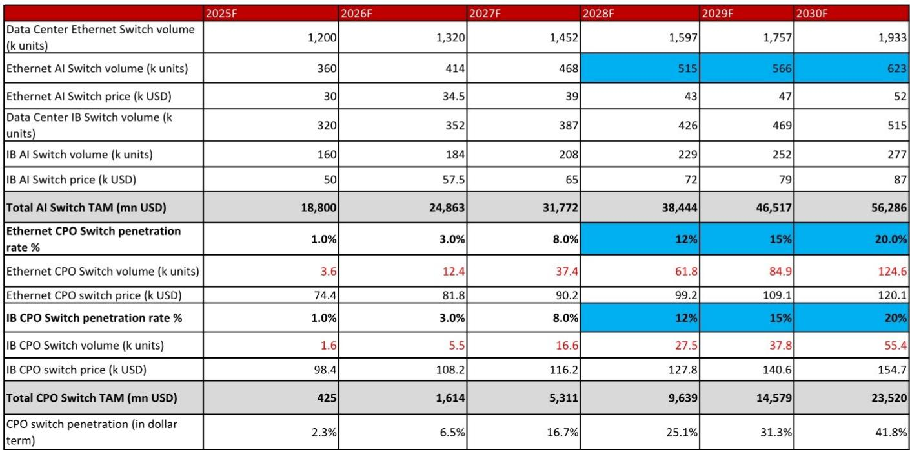
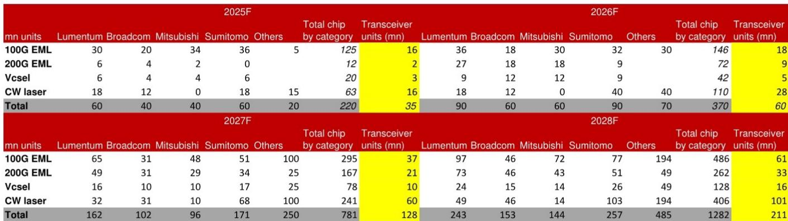

# 中际旭创的下一增长曲线已显现，市场定价尚未充分反映

过去一个月，公司股价回落约29%，但同期盈利预测并未下调，反而有所上修。据某全球投资银行研究报告，中际旭创——AI数据中心高速光模块领域的主要厂商——FY26年正常化盈利预计增长216%，FY27年再增113%。股价显著回落与盈利预测持续上调之间的反差，是任何认真研究此公司的观察者都无法回避的核心事实。市场似乎正在计入竞争威胁与供应链风险，而该报告的分析认为，这些担忧要么被夸大，要么已被公司的技术路线图所消化。

报告给出目标价CNY902.01，维持原有评级。估值基准为FY27F每股收益CNY65.47的21倍，与A股科技及电子元器件板块市盈率中位数一致。当前股价对应同一FY27盈利预测仅为13.8倍。这并非一个关于“便宜股票”的故事，而是一个关于成长型公司在其产品管线即将迎来第二、第三波升级之际，盈利预期正被市场向下重估的故事。

核心论点在于：中际旭创的增长并非单一产品周期，而是一系列相互重叠的技术迭代。1.6T与硅光（SiPh）升级周期是当前驱动力；2027年起2.4T coherent-lite收发器与近场封装光学（NPO）的商业化是下一引擎；3.2T收发器、超密集可插拔光学（XPO）与共封装光学（CPO）的扩展则构成更长期的前景。每一轮迭代都在抬高技术门槛——这正是报告认为对新进入者的担忧实属过虑的原因。

## 市场混淆了供应链紧张与需求问题，而两者正朝相反方向演变

近期股价走弱，部分源于对上游元器件短缺的担忧，尤其是磷化铟（InP）晶圆、电吸收调制激光器（EML）及连续波（CW）激光器。这些约束真实存在，也确实给短期毛利率的持续性带来了不确定性。但报告的分析将这些短缺视为时间问题，而非结构性问题。供应商的加速扩产以及公司自身的供应链管理，预计将在2026年下半年逐步缓解这些瓶颈。

毛利率的走向与对短缺叙事的线性解读恰恰相反。报告将FY26-28F毛利率预测上调1.5至3.1个百分点，并非因为投入成本下降，而是因为产品组合正转向更高价值、技术更复杂的收发器。SiPh收发器的渗透、2.4T产品的商业化以及2027年起NPO产品的推出，预计将足以抵消上游材料价格上涨的影响。毛利率轨迹清晰可见：从FY25的42.0%升至FY26F的47.2%、FY27F的48.2%和FY28F的49.3%。公司并非被供应链挤压，而是在利用短缺期加速向结构性更高毛利率的产品转型。

由此产生的二阶含义是：市场对元器件短缺的短期关注，可能错置了注意力。真正的问题不在于未来两个季度InP晶圆供应是否紧张，而在于公司能否按计划完成向2.4T和NPO产品的过渡。报告对2.4T收发器FY27-28F出货量300万至800万只、NPO同期800万只和2500万只的预测表明，这一过渡并非猜测，而是已嵌入数据之中。

## 1.6T与硅光转型并非周期顶点，而是通向更稳固竞争地位的桥梁

当前增长驱动力是800G和1.6T收发器升级周期。报告给出的全球出货预测颇为可观：800G在FY26F为4080万只，FY27F升至5780万只；1.6T在FY26F为2510万只，FY27F升至6880万只。这些并非渐进式改善，而是AI数据中心光模块部署规模与价值的台阶式跃升。公司在全球AI数据中心收发器市场的份额，FY26-28F预计为30-35%，在1.6T及以上细分领域份额达40%以上。

1.6T周期的战略意义在于，它不仅仅是速率升级。它需要硅光集成，这改变了制造经济性和竞争壁垒。报告认为，在2.4T、3.2T、NPO和CPO的新技术路线图中，技术门槛将进一步抬高。每一代产品都需要更深的研发投入、更精密的封装能力，以及与超大规模客户的更紧密协同工程。这是一个在位优势不断累积的市场。

市场对新进入者的担忧，考虑到光模块行业历史上份额随代际更迭而转移的模式，是可以理解的。但报告的反驳论点是：技术的性质正在改变。从可插拔光学向NPO和CPO的迁移，不仅是速率提升，更是光学引擎相对于交换ASIC位置的改变。这需要一系列不同的能力，包括近场封装和共封装技术，而这些并非仅掌握可插拔模块组装的公司所能轻易复制。报告维持30-35%份额的信心并非源于惯性，而是基于路线图复杂度的持续上升。

## 2.4T与NPO转型是第二条S曲线，在第一条曲线见顶之前就已开启——这一重叠正是研究关注所在

报告中最具结构性的洞察，是1.6T周期与2.4T/NPO周期在时间上的重叠。报告预测2.4T收发器FY27-28F出货量为300万至800万只，NPO在FY27F为800万只、FY28F升至2500万只。相较于800G/1.6T的体量，这些数字并不大，但它们代表着一个新产品代的早期阶段，很可能遵循市场已在800G和1.6T上见证过的类似采用曲线。

战略含义在于：中际旭创并非单一产品周期的故事。公司正在跑一场接力赛——1.6T周期交接给2.4T周期，再交接给3.2T/CPO周期。报告的收入预测反映了这一点：FY26F收入CNY1242亿，FY27F为CNY2664亿，FY28F为CNY3889亿。增速从FY26F的225%降至FY27F的114%和FY28F的46%，但相对收入增量依然巨大。盈利增长的故事更为突出：正常化每股收益FY26F为CNY30.74，FY27F为CNY65.47，FY28F为CNY97.91。

周期之间的重叠正是研究价值所在。当一家公司从一代产品向下一代过渡时，通常存在一段不确定期，市场因尚未看到规模而低估新周期。报告的出货预测恰好提供了当前周期与下一周期之间的量化桥梁。2.4T和NPO的数据并非猜测，而是基于客户接洽与技术成熟度。

## 毛利率扩张由产品复杂度驱动，而非定价权——这一区别对可持续性至关重要

对光模块公司的一个常见担忧是，毛利率天然波动较大，因为行业历史上易陷入价格战。报告的回应是：当前毛利率扩张并非传统意义上的定价权驱动，而是产品复杂度驱动。向SiPh收发器的迁移、2.4T coherent-lite产品的推出，以及向NPO和CPO的迈进，都涉及更精密的制造工艺和更高价值的元器件。FY28F毛利率49.3%的预测并非周期性高点，而是单位附加值结构性提升的体现。

报告将FY26-28F毛利率上调1.5至3.1个百分点，这是一次实质性的修正，而非微调——是对公司毛利率结构的重新评估。具体驱动因素包括：SiPh收发器的持续渗透、2.4T产品的商业化，以及2027年起NPO产品的推出。每一类产品相较前代都有不同的毛利率特征，其组合预计将足以抵消上游材料价格上涨的影响。

毛利率扩张的可持续性得到资产负债表的支撑。公司预计至FY28F保持净现金状态，净现金从FY25的CNY94亿增至FY28F的CNY2399亿。现金转化能力突出：自由现金流FY26F为CNY344亿、FY27F为CNY763亿、FY28F为CNY1111亿。FY28F经营现金流CNY1129.7亿对应仅CNY18.6亿的资本开支，表明这是一种无需成比例资本投入即可扩张的轻资产模式。这不是一家需要融资来支撑增长的公司，而是一家现金产生速度快于配置速度的公司。

## 研究框架：区分市场正在计入什么，与报告正在预测什么

报告为评估该公司提供了一个清晰框架，可归纳为三步。第一步，评估AI数据中心高速光模块的需求是结构性持久还是周期性见顶。报告对800G和1.6T收发器的出货预测，加上2.4T和NPO的早期体量，指向前者。市场远未饱和，而是处于多年部署周期的早期阶段。

第二步，评估新进入者的竞争威胁是切实可信还是被夸大。报告的论点是技术壁垒在上升而非下降。从可插拔光学向NPO和CPO的过渡需要不易复制的能力。公司在1.6T及以上细分市场40%以上的份额正是这一壁垒的体现，而非暂时优势。

第三步，判断毛利率扩张是可持续还是周期性现象。报告FY28F毛利率49.3%的预测由产品复杂度驱动，而非短暂定价权。资产负债表支持这一判断——净现金状态和强劲的自由现金流为应对竞争压力提供了缓冲。

该框架的风险不在需求前景，而在新产品路线图的执行风险。报告明确指出，产品升级慢于预期（尤其是800G和1.6T），以及400G和800G细分领域价格竞争加剧，是下行风险。2.4T和NPO的时间表较为进取，任何延迟都将压缩周期重叠——而这一重叠正是研究逻辑的核心。市场一个月内29%的回落表明部分风险已被计入，但报告的预测修正表明风险可能被过度折价。

研究的关键不在于光模块市场是否会增长，而在于随着技术复杂度提升，中际旭创能否维持其份额。报告的答案是：复杂度正是公司的护城河，而非其软肋。从1.6T到2.4T再到3.2T，从可插拔到NPO再到CPO的产品路线图，是一系列逐级抬高进入门槛的迭代。市场将当前股价回落视为周期尾声的开始，而报告的分析则指向下一周期的开端。

*仅供参考。部分内容可能基于原始材料由AI辅助生成、翻译、摘要或编辑，可能存在遗漏或错误。请独立核实。本文不构成投资、法律、税务、会计或其他专业建议。*

仅供参考。部分内容可能基于原始材料由AI辅助生成、翻译、摘要或编辑，可能存在遗漏或错误。请独立核实。本文不构成投资、法律、税务、会计或其他专业建议。

