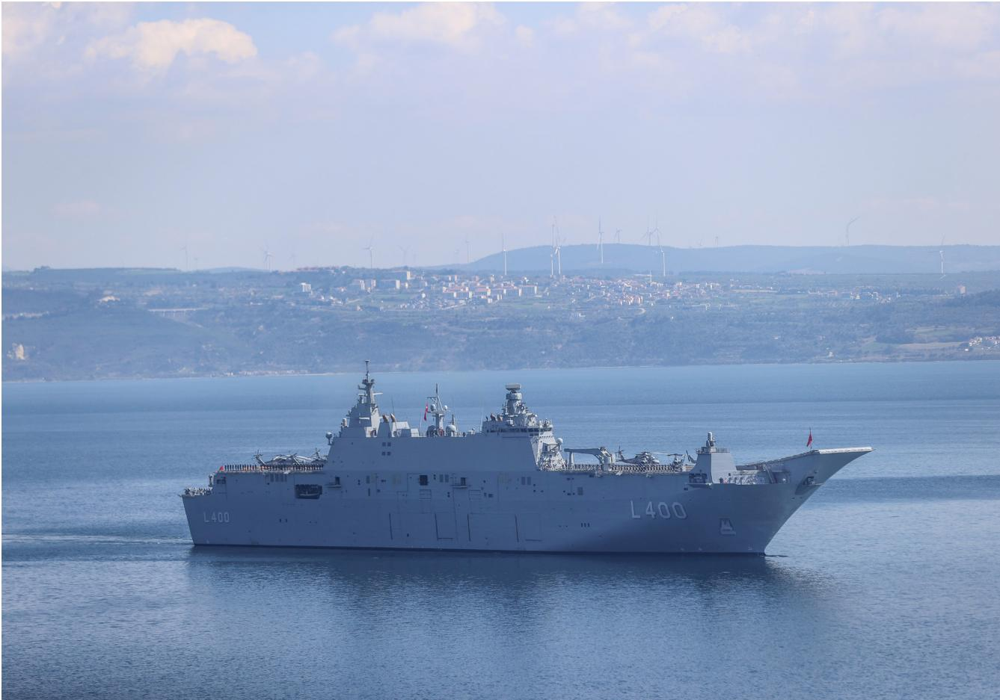
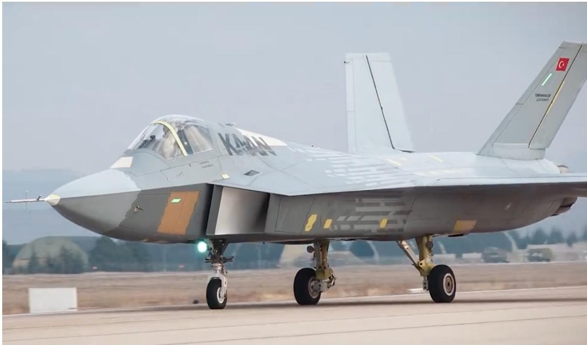
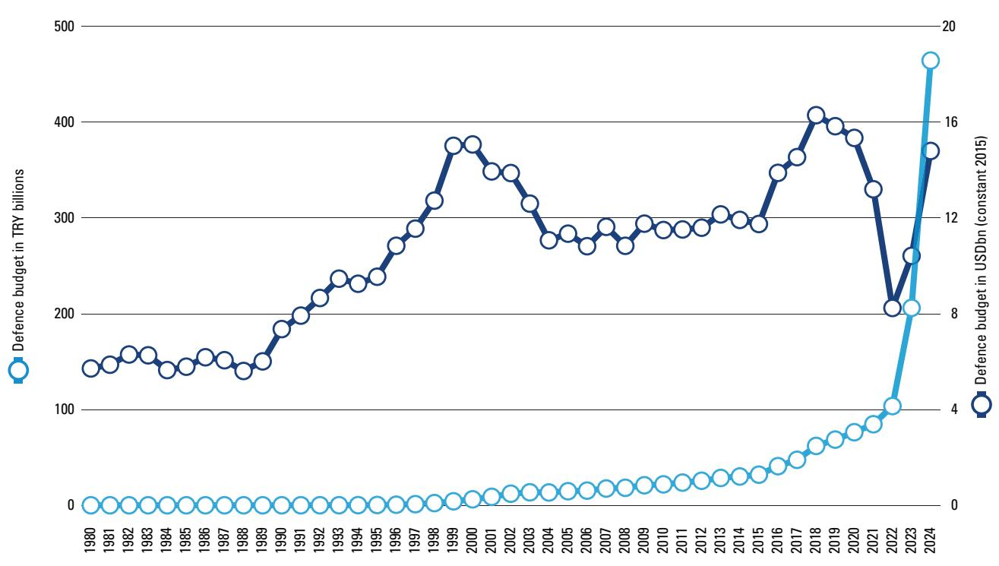
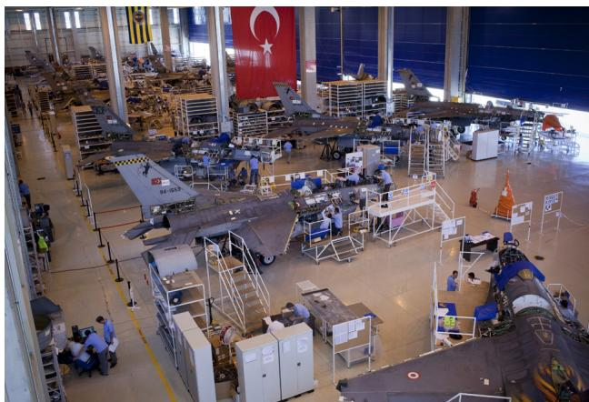
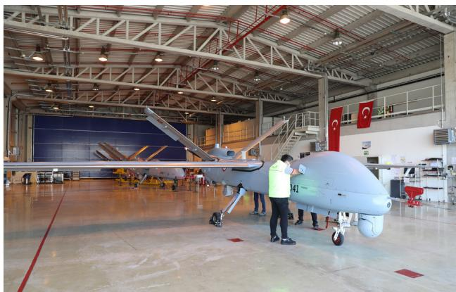
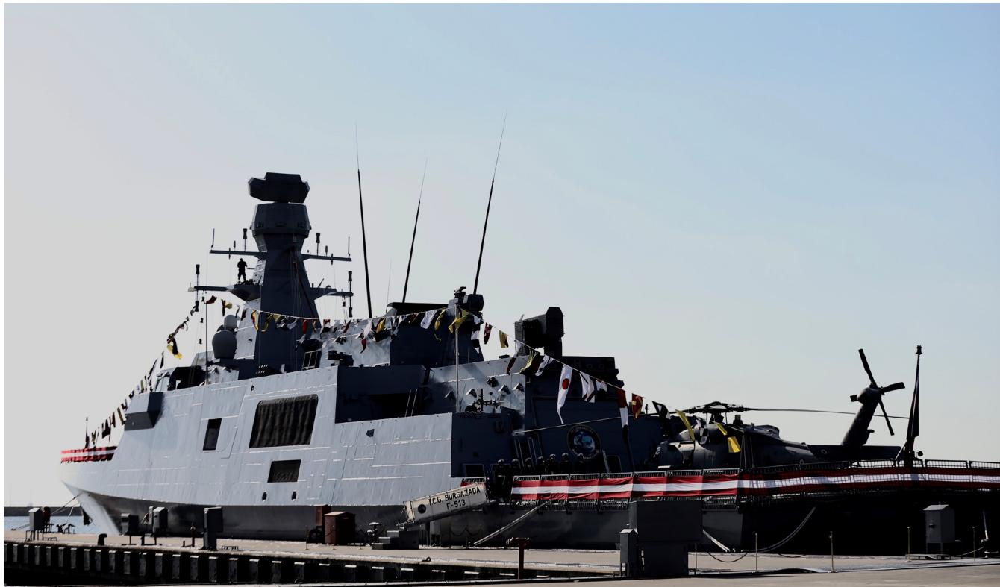
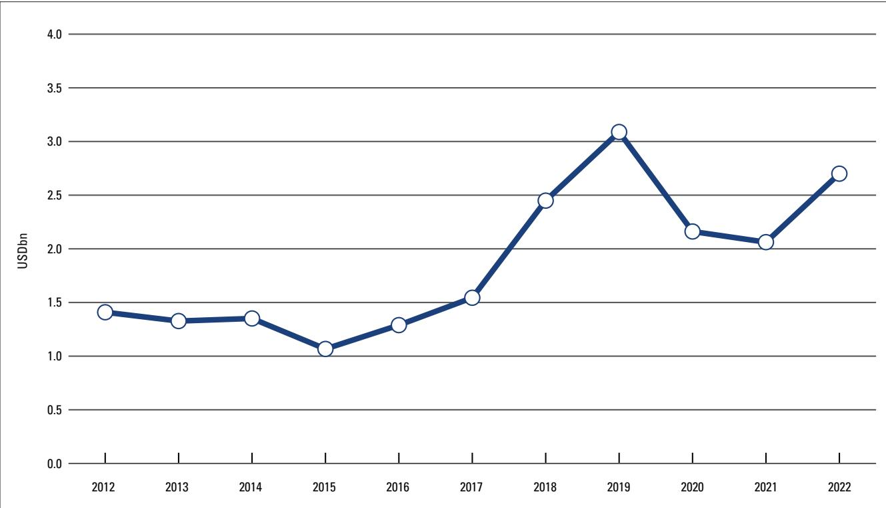
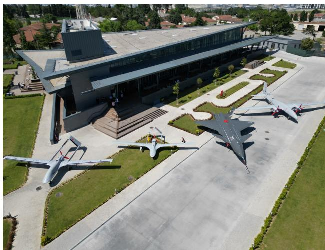
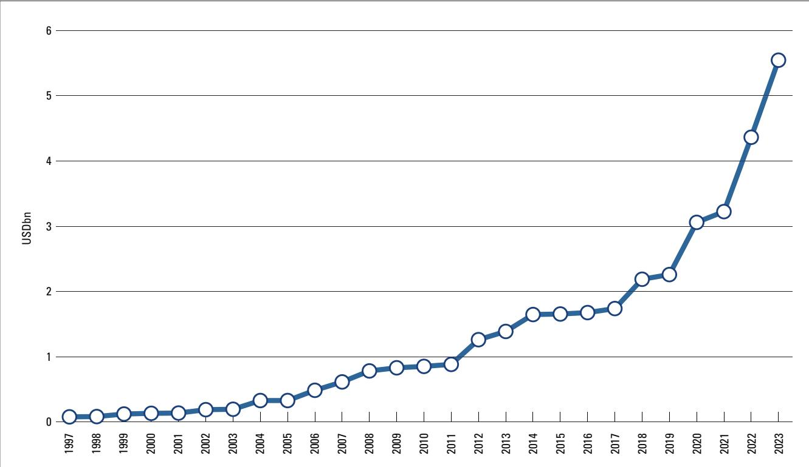
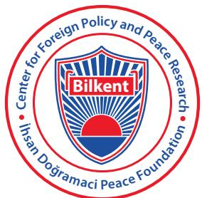

# From Client to Competitor: The Rise of Turkiye's Defence Industry

Sıtkı Egeli, Serhat Güvenç, Çağlar Kurç and Arda Mevlütoğlu

May 2024

## Acknowledgements

This paper is a part of ‘National Defence Industry: From an Enabler of Turkey’s Pursuit of Strategic Autonomy to a Bridge between Turkey and Europe’, a joint project between the Center for Foreign Policy and Peace Research (CFPPR) and the International Institute for Strategic Studies (IISS). The project is supported by the Centre for Applied Turkey Studies (CATS).

## Disclaimers

The views outlined in this paper are exclusively those of the authors and do not represent institutional views of the CFPPR or the IISS.

## Contents

Executive Summary 4
Introduction 5
Section 1: Stops and Starts: The First 50 Years 7
Turkiye as a Client in the International Arms Production and Trade System: 1923–47 7
Turkiye as a Recipient of US Military Aid: 1947–64 8
The Pursuit of Limited Strategic Autonomy in the Era of Detente: 1964–73 8
The Pivotal Year: 1974 9
Section 2: Revamping the Defence Industry: 1980s and 1990s 10
F-16 Production Comes to Turkiye 10
Prime Minister Özal, the 'Joint Venture' Approach and the Creation of the SSM 10
No Peace Dividend Here: Turkish Defence Procurement in the 1990s 14
Section 3: Turkiye's Indigenous Development Model and the Period of Incubation: 2004–Present 16
Prime Minister Erdoğan and the First Indigenous Designs 16
A Push for the Nationalisation of the Defence Industry 17
Indigenisation Versus International Collaboration 18
Conclusion 25
Notes 27

# Executive Summary

Turkiye's defence industry is at a crossroads, and decision-makers face a difficult choice regarding its future path. On one hand, Turkiye's long-standing ambition to establish a self-sufficient defence industry has led to considerable industrial growth and increased Ankara's strategic autonomy by reducing the influence of foreign suppliers. On the other hand, continued goals of self-sufficiency will become increasingly challenging and costly, particularly as the scale and sophistication of modern weaponry evolve and new competitors enter the marketplace. Although this provides an impetus for increasing industrial cooperation, the development of Turkiye's defence industry has historically been rooted in its response to Western arms embargoes and the country's decision-makers are strongly aware of the vulnerability of defence cooperation to foreign influence.

The international system has provided opportunities and challenges for Turkish defence industrialisation. However, to understand this process and the factors that will shape future decisions, it is necessary to consider how domestic factors such as the attitudes of leaders, a desire for strategic autonomy and the maturation of Turkiye's nascent industry have impacted its trajectory.

Political leaders such as Mustafa Kemal Atatürk in the 1920s and 1930s, Adnan Menderes in the 1950s, Turgut Özal in the 1980s and Recep Tayyip Erdoğan since the 2000s have left their marks on Turkiye's defence industry. In doing so, they have reflected and responded to the changing nature of the international system – ranging from acceptance of and reliance on American defence goods early on during the Cold War to a growing realisation that Turkiye needed its own defence industry in the 1960s. These ambitions were solidified after the 1974 Turkish military operation in Cyprus, when Turkish allies enforced declared and undeclared arms embargoes on Ankara. This catalysed a revamping of Turkiye's defence-industry capabilities.

Alongside the reorganisation of the country's domestic defence industry, the switch from import-substitution to export-driven industrialisation permitted large-scale private-sector involvement in the defence industry. Defence companies that were built from scratch in the 1980s by private-sector investors were encouraged to work with foreign partners to bring in skills, technologies and capital. This approach prompted the rise of joint ventures, which seemed to offer the best model to secure technology transfer. The Undersecretariat for Defence Industries (originally known as the Defence Industry Development and Support Administration Office and as the Defence Industry Agency since 2022) was also a major factor in the growth of the defence industry after the consolidation of much of the industry under the Turkish Armed Forces Foundation (Türk Silahlı Kuvvetlerini Güçlendirme Vakfı) in 1987.

Turkish decision-makers have come to understand that absolute autonomy is practically unattainable. Although the indigenisation of weapon systems permits many freedoms, the process also introduces different forms of dependencies. Furthermore, the 'top-down' strategy employed by Turkiye in establishing its defence-industrial base, going from the platform level down to components and technologies, has also faced criticism, mainly due to poor prioritisation and a lack of a coherent procedural approach.

To offset costs, Turkish defence industrialisation has become highly dependent on arms exports as it continues to indigenise and produce military technologies. Despite its booming turnover and export figures, however, the sector faces long-term challenges, including the emergence of new market competitors and an increasing rate of 'brain drain', especially since the late 2010s.

It is against this backdrop that Turkiye's decision-makers face a crossroads. Although Turkiye would prefer to work with its Western allies, it is also open to cooperation with non-Western countries. This is because dependence, of varying degrees, on foreign arms suppliers could still restrict Turkiye in pursuing its national interests, especially if the policies and priorities of Ankara and its principal suppliers fail to align.

## Introduction

Turkiye's process of defence industrialisation since the early twentieth century perfectly represents the pressures and dilemmas that an emerging state faces in this area. Defence industrialisation does not happen in a vacuum, and the path it takes is formed by both domestic (e.g., historical path dependence, innovation capabilities, the military requirements of the armed forces, institutional capacities and civil-military relations) and international factors (e.g., the impact of globalisation of arms production, alliance politics and the international system). $^{1}$ For Turkiye, shifts in the international environment provided both opportunities and challenges. For example, the multipolar international system of the interwar period (1918–39) enabled Turkiye to establish relations with major powers, draw international investment and build its defence industry. The bipolar world of the Cold War, on the other hand, froze defence industrialisation in Turkiye as immediate security concerns took priority over longer-term defence-industrial development. The end of the Cold War marked new opportunities and a dramatic shift in international arms production, on which Turkiye successfully capitalised. As the world moves toward a more tumultuous era, Turkiye is faced with difficult choices in its defence industrialisation and foreign policy.

The overall trajectory of Turkish defence industrialisation, however, has been most significantly determined by domestic factors. During the interwar years, progress was hindered by the country's weak industrial capability and lack of capital. Then, at the end of the Second World War, the influx of American military aid enabled the newly elected Democrat Party to overlook the needs of the military and the defence industry. This significantly slowed domestic defence-industrial development until the country re-experienced the challenges of dependency on a foreign supplier, when Turkiye's allies enacted arms embargoes against it following its 1974 military operation in Cyprus. Despite this reignition of ambitions to invest in its defence industrialisation, backed by much greater defence spending (see Figure 1), progress in the 1980s and 1990s was impeded by competition between different decision-making actors and their approaches to developing Turkish industrial and managerial capabilities. More recently, as Turkish defence-industrial capabilities have improved and the number of indigenous systems has increased, the sector has become more popular domestically and its products have become symbols of success and prestige. However, the Turkish defence industry has now reached a point where it needs to make difficult choices again.

The Turkish fighter jet Kaan is flown for the first time, 21 February 2024  
  
(Turkish Defence Industry Agency/Anadolu Agency via Getty Images)

Figure 1: Turkiye: defence spending, 1980–2024  
  
Note: Figures in Turkish lira reflect the revaluation in 2005, which removed six zeros from the currency. Sources: NATO, 'Financial and Economic Data Relating to NATO Defence'; Military Balance+; IISS analysis

Although Turkish defence industrialisation originally aimed at self-sufficiency, financial limitations have moderated this ambition. Producing all systems is not financially feasible. While Turkiye seeks to make its defence industry sustainable through exports, international cooperation provides another avenue for maintaining this growth. Engaging in international cooperation, however, comes at the expense of autarky, and this trade-off can present very difficult choices. In this report, we will present a comprehensive look into Turkiye's process of defence industrialisation – its policy choices, the hurdles it has faced and potential solutions.

# 1. Stops and Starts: The First 50 Years

## Turkiye as a Client in the International Arms Production and Trade System: 1923–47

From 1923–47, three factors shaped Turkiye's approach to arms procurement: 1) historical experience, 2) the interwar international arms-trade system and 3) the availability of funds from international arms suppliers under favourable terms.

The experience of the late Ottoman Empire suggested that relying on a single supplier exposed the state to the influence of major arms-producing powers. This formed a strategic lesson that the new Republic of Turkiye under the leadership of Atatürk drew upon: that is, alliances with stronger powers result in a loss of sovereignty for the minor partner. Ankara therefore shied away from alliances or arms deals that could compromise Turkiye's sovereignty.

The interwar international arms-trade system imposed structural constraints on Turkiye's choice of arms suppliers. Germany was wholly excluded from the system due to the restrictions on its arms production and trade under the Treaty of Versailles. Meanwhile, the United Kingdom and France were uninterested in supplying arms at affordable prices and under favourable credit terms. Turkiye was also not yet considered a politically and economically reliable client for British or French arms. Only Italy and the Soviet Union, therefore, could cater for Turkiye's requirements.

Nevertheless, Germany could figure prominently in terms of financing Turkish arms orders. In 1925, Turkiye placed an order for two coastal submarines from a Dutch shipyard, established by three German shipbuilders – Friedrich Krupp Germaniawerft (Kiel), A.G. Weser (Bremen) and Vulkanwerft (Hamburg and Stettin) – to get around the Versailles restrictions on German submarine production. $^{2}$

Similarly, German aircraft manufacturer, Junkers, set up an assembly plant in Kayseri (Central Anatolia) in 1926 to preserve German know-how on military aircraft production. The plant assembled A-20 and A-20W

Havoc military aircraft as well as a few F-13 civilian airliners to meet Turkish orders, although that venture was ultimately not successful. $^{4}$

In the early republican era, the Turkish defence industry consisted mostly of factories established to manufacture small arms and their ammunition. The German connection was also evident in this period. Companies such as Rheinmetall, Mauser, Nielsen & Winther and Allgemeine Elektricitäts-Gesellschaft were involved in Turkish small-arms and ammunition manufacturing. $^{4}$

This modest industrial base was more or less sufficient to cater for an infantry and cavalry-dominated army. $^{5}$ The Turkish army was introduced to mechanised warfare through a somewhat experimental unit equipped with tanks (T-26Bs) and armoured cars (BA-6s) acquired from the Soviet Union in 1934. $^{6}$ However, the transition from a manpower and horsepower army to a motorised one would prove to be difficult and costly for Turkiye, with an attendant increase in dependence on foreign suppliers and limits on military capability in the interim.

On the eve of the Second World War, Ankara found in the UK a pro-status quo European power that was willing to sell arms to Turkiye under very generous credit terms. London also helped revamp Turkiye's aircraft-manufacturing capability with the licensed assembly of Miles Magister trainer aircraft at the Mechanical and Chemical Industry Corporation's aircraft factory in Ankara. $^{7}$

Turkish diplomatic manoeuvring during the Second World War made it possible for Ankara to procure arms from France, Germany and the UK. Germany offered arms to Turkiye to liquidate debts accrued as a result of barter trade between the two countries. Ankara ordered four new submarines from the German company Krupp AG directly, as Adolf Hitler had unilaterally denounced the Treaty of Versailles restrictions on German arms production. Under this new contract, two boats were to be built in Germany, the other two in Turkiye. $^{8}$ In October 1939, Turkiye signed a tripartite alliance treaty with France and the UK. This resulted in the expedited delivery of British and French tanks and fighter aircraft and led Hitler to suspend arms supplies to Turkiye.

Throughout the war, Turkiye remained neutral; but, in 1942, it became a recipient of the United States' Lend-Lease programme. $^{9}$ This marked the beginning of Turkiye's transformation from a client of arms producers to a mere recipient of US military aid. The availability of surplus US equipment in large quantities spelled the slow death of Turkiye's fledgling domestic-arms industry after the Second World War. $^{10}$ The sheer magnitude of US arms transfers to Turkiye from 1947–80 can be understood from the quantities involved – e.g. 3,085 M48 and M48A2C Patton tanks between 1963 and 1970 and about 260 F-100C/D/F Super Sabre fighter ground-attack aircraft between 1958 and 1973. $^{11}$

## Turkiye as a Recipient of US Military Aid: 1947–64

The Cold War radically altered the drivers of Turkish foreign and defence policy. The flow of US military equipment to Turkiye gathered momentum after the Truman Doctrine was announced in 1947. Ankara then shifted its focus from local production to operating and maintaining the new equipment. In the 1940s, Turkiye's aircraft industry was able to produce an upgraded version of the British Miles Magister trainer aircraft, the MKEK-4 Uğur, to meet the Turkish Air Force's trainer requirements. $^{12}$ However, it stood no chance against the abundance of North American Aviation T-6 Texan trainers donated from US stocks.

Turkiye's political climate at the time also worked against investing in the defence industry. In May 1950, Turkiye transitioned from single-party rule to multi-party politics. For prime minister Adnan Menderes of the newly elected Democrat Party, competitive party politics required prioritising the needs and demands of the electorate over those of the armed forces. The optimum choice for him was to depend solely on US military assistance – provided in return for Turkiye joining NATO – in order to keep the country's large military afloat. This choice often worked to the detriment of local industry. $^{13}$ The result was total dependence on the US for not only equipment procurement but maintenance and logistics as well.

Menderes was ousted and subsequently executed after a military coup in May 1960. This dramatic turn of events did not result in any change in Turkiye's foreign relations. His successors continued the policy of relying heavily on US aid. However, the 1962 Cuban Missile Crisis and the subsequent US decision to remove the nuclear-armed Jupiter medium-range ballistic missiles from Turkiye – despite the latter's initial reluctance – exposed tensions in the relationship. $^{14}$

The 1960s, meanwhile, was a decade of significant change in the United States' approach to foreign military assistance. The administration of president John F. Kennedy devised a new policy aimed at turning US military-assistance recipients into clients under credits. This marked a move away from grants (Mutual Assistance Programs) to the Foreign Military Sales framework. Around the same time, Ankara had to endure the more severe consequences of its total dependence on the US in defence. During the Cyprus Crisis of 1963–64, president Lyndon B. Johnson sent a very strongly worded letter to Turkish prime minister İsmet İnönü that dissuaded him from intervening militarily in Cyprus. The letter served as a harsh reminder to Ankara that Turkiye could not employ US-supplied arms and equipment for non-NATO contingencies.

## The Pursuit of Limited Strategic Autonomy in the Era of Detente: 1964–73

As events in Cyprus unfolded, successive governments in Turkiye sought to develop greater military capabilities to complement diplomacy. This included diversifying its suppliers and beginning production of small-calibre guns and support weapons under German and US licences, respectively. $^{15}$ Moreover, Ankara established foundations for each of the armed services to raise money from the public to produce equipment needed for national contingencies.

Turkiye also began to show interest in European NATO allies' joint arms-production projects. For instance, it offered to manufacture wingtip missile launchers for the F-104G Starfighter as part of a European consortium. The

US turned down this proposal, however, because that particular aircraft part was considered too sophisticated for Turkiye's rudimentary aircraft industry. $^{16}$

In the 1960s and 1970s, the Turkish Armed Forces went through a partial transformation to acquire regional power-projection capabilities for future crises in Cyprus. As part of this process, the Turkish Naval Forces embarked on a programme to build a landing-craft fleet. To overcome engine shortages, decommissioned tank engines were converted to power the locally built vessels. Naval shipyards also built two escort destroyers based on a US design. The Cyprus Crisis of 1963–64 placed Turkiye's navy ahead of its other services in terms of developing and implementing indigenous solutions.

## The Pivotal Year: 1974

The defining role of Cyprus in Turkish foreign policy became evident once again in 1974 when Ankara launched a military operation in response to a coup engineered by the Greek military junta. This was followed by the US placing an arms embargo on Turkiye that resulted in serious supply and sustainability issues for the Turkish military. Though Germany stepped in to fill the gap, developing a robust national defence industry was the only way forward in the long term for Turkiye. Not long afterwards, in 1974, the Turkish Air Force purchased 18 F-104S Starfighters from Italy. Although a US design originally, the 'S' version of the Lockheed F-104 Starfighter was also the first new combat aircraft bought from a European producer since 1947.

The next step for Turkiye was co-production of a European design. To this end, several options were considered, including the SEPCAT Jaguar (British–French), the Aermacchi MB-326/339 (Italian) and the Panavia Tornado (British–German–Italian). However, the pursuit of non-US alternatives was short lived – the plan was shelved when the US lifted its embargo in 1978.

The US embargo left a deep scar in US–Turkiye relations. Self-sufficiency in arms became Turkiye's ultimate, albeit long-term, goal. Ankara prioritised the local production of key components that had faced shortages – rendering certain weapons systems inoperable – during and after the Turkish military operation in Cyprus. It also upgraded its existing military repair and maintenance network to be self-sufficient in sustaining the equipment. The foundations that were established to support individual services in the 1960s and 1970s were consolidated under the Turkish Armed Forces Foundation (Türk Silahlı Kuvvetlerini Güçlendirme Vakfı, TSKGV) in 1987. These individual service foundations furnished the initial capital for companies such as ASELSAN, HAVELSAN, TUSAŞ (now known as Turkish Aerospace Industries) and ASPİLSAN that would form the core of the Turkish defence industry.

# 2. Revamping the Defence Industry: 1980s and 1990s

## F-16 Production Comes to Turkiye

Turkiye's determination to reduce its dependence on foreign suppliers and boost its local capabilities transcended the political and economic instability of the 1970s. The leaders of the 1980 military coup pursued an even more ambitious political objective of domestically producing cutting-edge, high-visibility military systems.

Heightened US–Soviet tensions during the last phase of the Cold War magnified Turkiye's strategic value for Washington, which had already increased in the immediate aftermath of the Iranian Revolution. This new, favourable international environment enabled Turkiye to reap industrial, technological and financial benefits from the US to an unprecedented degree. The most visible outcome of this was the deal inked in 1983 with General Dynamics for the licensed production of F-16C/D (Block 30/40) Fighting Falcon fighter aircraft at two purpose-built facilities, one in Akıncı (formerly Mürted) for the final assembly of the fuselages and the other in Eskişehir as a joint venture (JV) with General Electric for the engines.

From a defence-procurement point of view, the F-16 deal signified an important milestone. It demonstrated that Turkiye could now afford to acquire major equipment of its own choosing and that it could do so

Technicians work on an F-16 fighter aircraft at the Turkish Aerospace Industries (TAI) manufacturing facility in Ankara, 14 September 2011

  
(Kerem Uzel/Bloomberg via Getty Images)

by including its nascent industrial and technological capacities in the deal. F-16 co-production greatly contributed to Turkiye's wider ability to produce defence systems. This was primarily because the skilled manpower trained under these two seasoned American manufacturers and the wholesale transfer of the most recent industrial management and documentation, process-control, quality-assurance, and integrated logistics-support concepts later constituted the driving wheel for Turkiye's fledging defence industry. This contribution was not just confined to the aviation industry, but also extended into the entire defence industry and other high-tech sectors of the economy.

## Prime Minister Özal, the 'Joint Venture' Approach and the Creation of the SSM

The year 1983 heralded yet another dramatic shift in Turkiye's political and economic scenery following a decisive parliamentary election win by Turgut Özal. He had already been at the helm of the Turkish economy when the country began transitioning from a closed and protectionist economic regime to more liberal policies aimed at opening up the economy to global markets. Following his election as prime minister, Özal accelerated the implementation of these liberal economic and fiscal policies and, in parallel, sought to cut back the military's influence over Turkiye's politics and economy.

One of the sectors that was impacted first was Turkiye's defence industry. Up until then, Turkiye's efforts to develop its defence industry had centred around military maintenance facilities and shipyards, plus a handful of state-funded enterprises, all of which functioned under the close watch and guidance of the armed forces. From 1985, however, Özal authorised greater private-sector involvement as part of the broader defence-industrial strategy codified by Law No 3238. $^{17}$ In order to help facilitate his plan to create defence companies from scratch, Özal encouraged Turkiye's private-sector investors to team up with foreign partners and establish ‘technology transfer’ and ‘joint venture’ firms to bring in the required skills, technologies and capital. To lure in both domestic and foreign investors, the Turkish military’s sizable, and at times inflated, requirements for new defence equipment were tabled. In this sense, Özal approached the defence industry from a primarily economic, cost–benefit point of view. He believed that if large sums of financial resources were to be spent on meeting the Turkish military’s overdue equipment needs, then channelling those funds toward local industries would reduce the negative impact of defence spending on Turkiye’s fiscal balance; boost employment; generate tax revenues; and bring in foreign direct investment (FDI) and advanced technologies to benefit both the defence and other sectors. Özal also hoped that investment in the defence sector would fuel Turkiye’s economic growth in line with his wider export-driven economic-development strategy.

Another axis of Özal's plan to boost the defence industry involved a series of administrative and fiscal changes to Turkiye's notoriously cumbersome bureaucracy to facilitate the transition toward the JV model. On the administrative front, a new state agency called the Undersecretariat for Defence Industries (Savunma Sanayii Müsteşarlığı, SSM) (originally known as the Defence Industry Development and Support Administration Office) was created in 1985. This new entity's official responsibilities included tendering and contracting large-scale defence programmes and overseeing the production and delivery phases. In reality, the SSM was put in charge of management, strategic planning and financing for the entire defence industry. Significantly, promoting and coordinating defence R&D programmes, introducing offset trade and promoting defence exports – responsibilities that were all quietly entrusted with the SSM – were entirely new functions for the Turkish defence industry. Another prominent feature of the SSM was that its staff consisted exclusively of civilians. This generated, for the first time, civilian expertise and insights into defence technology and equipment matters. The SSM's establishment was a major factor in the growth of the defence industry a decade or two later.

A second administrative breakthrough took place at the decision-making level, when the SSM began to receive its directives and guidance not from the military, but from the Defense Industry Executive Committee (Savunma Sanayii İcra Komitesi, SSİK), headed by the prime minister. $^{18}$ All decisions regarding SSM-run defence procurement and production projects were debated and made by the SSİK, which took Turkiye's external-relations and foreign-policy priorities into account when selecting new defence partners and suppliers. The SSM's actions based on these decisions could also not be contested through Turkiye's administrative judiciary system or by the military. This arrangement represented a shift in the domestic political balance, awarding primary authority to political leadership rather than the military in defence-industry matters.

Özal also introduced, with the establishment of the SSM, an extra-budgetary fiscal mechanism that drew its income from a variety of taxes, including the so-called 'sin taxes' generated from alcoholic and tobacco products, joint bets, football games, etc. The proceeds from this mechanism went directly to the SSM and accounted for approximately one-third to half of Turkiye's spending on defence equipment at the time. Thus, Özal equipped the SSM not only with political and administrative authority, but also with a sustainable and predictable monetary instrument to finance its multi-year contracts.

This dramatic shift in the management, finances and decision-making processes of Turkiye's embryonic defence industry resulted in the creation of half-a-dozen new JV companies. Each was established for a specific, major co-production programme and a distinct defence-product category. Through follow-on orders and product diversification, about half of those JVs have survived to the present day and retain their original stakeholder composition. The other half also survived, but foreign and private shares in them were taken over by companies controlled by the TSKGV.

Notably, alongside the JV model and various licensed-production contracts awarded by the SSM, defence contractors from several European countries invested in Turkiye's nascent defence industry and market (see Table 1). Prior to Özal's election, German shipyards that helped Turkish naval yards build submarines, frigates and missile boats were the only European contractors to have succeeded in this otherwise US-dominated sector. Turkiye's application for full membership in the European Economic Community in 1987, and the concomitant rise of a strong pro-European vision in Turkiye, provided the political, economic and intellectual context within which defence-industrial cooperation with European partners could take place.

<table><tr><td>Programme</td><td>Type</td><td>Contract year</td><td>Contracting authority</td><td>Procurement type</td><td>Foreign contractor*</td><td>Local entity</td></tr><tr><td>Rüzgar (Lürssen 57m)</td><td>Fast patrol craft</td><td>1982</td><td>Ministry of National Defence (MND)</td><td>Licensed production</td><td>Fr. Lürssen Werft</td><td>Taşkızak Naval Shipyard</td></tr><tr><td>Yavuz (MEKO 200 Mod)</td><td>Frigate</td><td>1983</td><td>MND</td><td>Licensed production</td><td>Blohm &amp; Voss</td><td>Gölcük Naval Shipyard</td></tr><tr><td rowspan="2">F-16C/D (Block 30/40) Fighting Falcon (Peace Onyx I)</td><td rowspan="2">Fighter ground-attack (FGA) aircraft</td><td rowspan="2">1984</td><td rowspan="2">MND</td><td rowspan="2">Licensed production</td><td>General Dynamics</td><td>Turkish Aircraft Industries (TAI)</td></tr><tr><td>General Electric</td><td>Tusaş Engine Industries (TEI)</td></tr><tr><td rowspan="2">FIM-92 Stinger</td><td rowspan="2">Man-portable air-defence system</td><td rowspan="2">1988</td><td rowspan="2">MND</td><td rowspan="2">International consortium</td><td rowspan="2">European Stinger Project Group</td><td>Barış Savunma Endüstrisi</td></tr><tr><td>Kalekalip Roketsan</td></tr><tr><td>ZMA</td><td>Family of armoured vehicles</td><td>1989</td><td>SSM</td><td>Joint-venture company (JVC)</td><td>FMC</td><td>FNSS</td></tr><tr><td>Self Protection Electronic Warfare System (SPEWS-I) for F-16</td><td>Aircraft electronic-warfare system</td><td>1989</td><td>SSM</td><td>JVC</td><td>Loral</td><td>MIKES</td></tr><tr><td>HF SSB</td><td>Radio</td><td>1990</td><td>SSM</td><td>JVC</td><td>GEC-Marconi</td><td>MKAS</td></tr><tr><td>M270 MLRS</td><td>227mm multiple rocket launcher (MRL)</td><td>1990</td><td>SSM</td><td>Off the shelf</td><td>Lockheed Martin</td><td></td></tr><tr><td>MGM-140A ATCAMS</td><td>Short-range ballistic missile (SRBM)</td><td>1994</td><td></td><td></td><td></td><td></td></tr><tr><td rowspan="2">Turkish Mobile Radar Complexes (TMRC)</td><td>Mobile radar</td><td>1990</td><td>SSM</td><td>JVC</td><td>Thomson-CSF</td><td>Thomson Tekfen Radar</td></tr><tr><td>Command and control communications systems</td><td></td><td></td><td></td><td>Aydin Corporation</td><td>AYESAŞ</td></tr><tr><td>Barbaros (MEKO 200 mod)</td><td>Frigate</td><td>1990</td><td>MND</td><td>Licensed production</td><td>Blohm &amp; Voss</td><td>Gölcük Naval Shipyard</td></tr><tr><td>Preveze (Type-209/1400)</td><td>Attack submarine</td><td>1990</td><td>MND</td><td>Licensed production</td><td>Howaldtswerke-Deutsche Werft (HDW)</td><td>Gölcük Naval Shipyard</td></tr><tr><td>AH-1W Super Cobra</td><td>Attack helicopter</td><td>1990</td><td>SSM</td><td>Off the shelf</td><td>Bell Helicopter</td><td></td></tr><tr><td rowspan="2">CN235M</td><td>Light transport aircraft</td><td>1991</td><td>SSM</td><td>Licensed production</td><td>CASA</td><td>TAI</td></tr><tr><td>Maritime patrol aircraft</td><td>1998</td><td></td><td></td><td></td><td></td></tr><tr><td>NATO Air Defense Ground Environment System (NADGE)</td><td>Radar maintenance</td><td>1991</td><td>MND/NATO Maintenance and Supply Agency</td><td>JVC</td><td>Serco</td><td>ESDAŞ</td></tr><tr><td>SF-260D</td><td>Training aircraft</td><td>1991</td><td>SSM</td><td>Licensed production</td><td>Aermacchi</td><td>TAI</td></tr><tr><td>Yıldız (Lürssen 57m derivative)</td><td>Fast patrol craft</td><td>1991</td><td>MND</td><td>Licensed production</td><td>Fr. Lürssen Werft</td><td>Taşkızak Naval Shipyard</td></tr><tr><td>Adatepe (Knox)</td><td>Frigate</td><td>1992</td><td>MND</td><td>Off the shelf (second hand)</td><td>US Navy</td><td></td></tr><tr><td>S-70A Black Hawk</td><td>Medium transport helicopter</td><td>1992</td><td>SSM</td><td>Off the shelf</td><td>Sikorsky</td><td></td></tr><tr><td rowspan="2">F-16C/D (Block 50) Fighting Falcon (Peace Onyx II)</td><td rowspan="2">FGA aircraft</td><td rowspan="2">1992</td><td rowspan="2">MND</td><td rowspan="2">Licensed production</td><td>Lockheed Martin</td><td>TAI</td></tr><tr><td>General Electric</td><td>TEI</td></tr><tr><td rowspan="2">AS532AL/UL Cougar (Phoenix I/II)</td><td rowspan="2">Medium transport helicopter</td><td>1993</td><td>SSM</td><td>Licensed production</td><td>Aerospatiale</td><td>TAI</td></tr><tr><td>1997</td><td></td><td></td><td>Eurocopter Group</td><td>EUROTAI</td></tr><tr><td>Mi-17 Hip H</td><td>Multi-role helicopter</td><td>1993</td><td>MND</td><td>Off the shelf (tea/tobacco barter deal)</td><td>Rosoboronexport</td><td></td></tr><tr><td>BTR-80</td><td>Wheeled armoured personnel carrier</td><td></td><td></td><td></td><td></td><td></td></tr><tr><td>Kılıç (Lürssen 62m)</td><td>Fast patrol craft</td><td>1994</td><td>MND</td><td>Licensed production</td><td>Fr. Lürssen Werft</td><td>Gölcük Naval ShipyardIstanbul Naval ShipyardTaşkızak Naval Shipyard</td></tr><tr><td>KC-135R Stratotanker</td><td>Tanker aircraft</td><td>1994</td><td>MND</td><td>Off the shelf</td><td>Boeing</td><td></td></tr><tr><td>F-4E Phantom 2020</td><td>FGA aircraft (upgrade and modernisation)</td><td>1995</td><td>MND</td><td>Off the shelf + licensed upgrade</td><td>Israel Aerospace Industries (IAI)</td><td>Turkish Air Force (TurAF)Air Supply and Maintenance Center Command (ASMC)</td></tr><tr><td>T-300 Kasırga (WS-1)</td><td>302mm MRL</td><td>1997</td><td>MND</td><td>Licensed production</td><td>China Precision Machinery Import-Export Corporation (CPMIEC)</td><td>Roketsan</td></tr><tr><td>B-611 (CH-SS-9)</td><td>SRBM</td><td>1998</td><td></td><td></td><td></td><td></td></tr><tr><td>S-70B Seahawk</td><td>Anti-submarine warfare helicopter</td><td>1997</td><td>SSM</td><td>Off the shelf</td><td>Sikorsky</td><td></td></tr><tr><td>Low Altitude Navigation and Targeting Infrared for Night (LANTIRN)</td><td>Targeting pod</td><td>1997</td><td>MND</td><td>Off the shelf</td><td>Lockheed Martin</td><td></td></tr><tr><td>Popeye I</td><td>Air-to-surface missile</td><td>1997</td><td>MND</td><td>Off the shelf</td><td>Rafael Advanced Defense Systems</td><td></td></tr><tr><td>Bell 412EP Twin Huey</td><td>Multi-role helicopter</td><td>199819992004</td><td>SSM</td><td>Off the shelf (for coast guard)</td><td>AgustaAgustaWestland</td><td></td></tr><tr><td>F-5-2000</td><td>Fighter aircraft (upgrade and modernisation)</td><td>1998</td><td>SSM</td><td>Licensed modernisation</td><td>Elbit SystemsIAISingapore Technologies Engineering</td><td>TurAF 1st ASMC</td></tr><tr><td>Gür (Type-209/1400)</td><td>Attack submarine</td><td>1998</td><td>MND</td><td>Licensed production</td><td>HDW</td><td>Gölcük Naval Shipyard</td></tr><tr><td>Eryx</td><td>Man-portable anti-tank missile</td><td>1998</td><td>MND</td><td>Licensed production</td><td>Aerospatiale</td><td>Barış Savunma EndüstrisiMechanical and Chemical Industry Corporation (MKE)Transvaro</td></tr><tr><td>HK33</td><td>Infantry assault rifle</td><td>1998</td><td>SSM</td><td>Licensed production</td><td>Heckler &amp; Koch</td><td>MKE</td></tr><tr><td>Gabya (Oliver Hazard Perry)</td><td>Frigate</td><td>1998–2003</td><td>MND</td><td>Off the shelf (second hand)</td><td>US Navy</td><td></td></tr><tr><td>F-35A Lightning II</td><td>FGA aircraft</td><td>Cancelled1999</td><td>SSM</td><td>International programme</td><td>Lockheed Martin</td><td>TAI</td></tr><tr><td>SeaHake (DM2A3)</td><td>Heavyweight torpedo</td><td>1999</td><td>MND</td><td>Off the shelf</td><td>STN Atlas Elektronik</td><td></td></tr><tr><td>Rapier</td><td>Point defence towed surface-to-air missile (SAM) system</td><td>1999</td><td>MND</td><td>Licensed production</td><td>Matra BAe Dynamics</td><td>ASELSANKALEKALIP Roketsan</td></tr><tr><td>SPEWS-II for F-16</td><td>Aircraft electronic-warfare system</td><td>1999</td><td>SSM</td><td>JVC</td><td>Loral</td><td>MiKES</td></tr><tr><td>Harpy</td><td>Loitering and direct attack munitions</td><td>1999</td><td>MND</td><td>Off the shelf</td><td>IAI</td><td></td></tr><tr><td>Aydin (Frankenthal mod)</td><td>Oceangoing minehunter</td><td>1999</td><td>SSM</td><td>Licensed production</td><td>Abeking &amp; RasmüssenFr. Lürssen Werft</td><td>Istanbul Naval Shipyard</td></tr><tr><td>LOROP</td><td>Targeting pod</td><td>1999</td><td>MND</td><td>Off the shelf</td><td>Elbit Systems</td><td></td></tr></table>

<table><tr><td>A400M</td><td>Heavy transport aircraft</td><td>1999</td><td>SSM</td><td>International programme</td><td>M</td><td>Airbus</td><td>MKAS TAI</td></tr><tr><td>MIM-23 HAWK</td><td>Medium-range towed SAM system</td><td>2000</td><td>MND</td><td>Off the shelf</td><td></td><td>Raytheon Company</td><td></td></tr><tr><td>Kılıç II (Lürssen 62m)</td><td>Fast patrol craft</td><td>2000 2001</td><td>MND</td><td>Licensed production</td><td></td><td>Fr. Lürssen Werft</td><td>Taşkızak Naval Shipyard</td></tr><tr><td>T-155 Fırtına</td><td>155mm self-propelled artillery</td><td>2001</td><td>MND</td><td>Licensed production</td><td></td><td>Samsung Techwin</td><td>MKE</td></tr><tr><td>Countermeasure Dispensing System/ Chaff and Flare Decoy (CMDS/CFD)</td><td>Helicopter self-protection system</td><td>2001</td><td>SSM</td><td>Licensed production</td><td></td><td>Israel Military Industries (IMI)</td><td>ASELSAN</td></tr><tr><td>Burak (d&#x27;Estienne d&#x27;Orves)</td><td>Corvette</td><td>2001</td><td>MND</td><td>Off the shelf (second hand)</td><td></td><td>French Navy</td><td></td></tr><tr><td>Missile Warning System-Turkiye (MWS-TU)</td><td>Helicopter missile warning system</td><td>2002</td><td>SSM</td><td>Licensed production</td><td></td><td>DASA</td><td>ASELSAN</td></tr><tr><td>B-737</td><td>Airborne early warning and control aircraft</td><td>2002</td><td>SSM</td><td>Off the shelf + local content</td><td></td><td>Boeing</td><td>ASELSAN HAVELSAN MKE</td></tr><tr><td>Combat systems for CN235 MPA (Meltem II)</td><td>Maritime patrol aircraft combat systems</td><td>2002</td><td>SSM</td><td>Off the shelf + local installation</td><td></td><td>Thales</td><td>HAVELSAN TAI</td></tr><tr><td>M60T</td><td>Main battle tank (upgrade and modernisation)</td><td>2002</td><td>SSM</td><td>Licensed upgrade</td><td></td><td>IMI</td><td>ASELSAN MKE</td></tr><tr><td>Long Horizon Integrated Maritime Surveillance System</td><td>Maritime surveillance radar</td><td>2003</td><td>SSM</td><td>Off the shelf + integration</td><td></td><td>Thales</td><td>AYESAŞ</td></tr></table>

M = Multinational  
\*Company name as of contract year  
Sources: various, analyst research

## No Peace Dividend Here: Turkish Defence Procurement in the 1990s

While many NATO allies reduced defence spending at the end of the Cold War, that was not the case for Turkiye. Due to both a dramatic increase in the separatist violence instigated by the Kurdistan Workers' Party (Partiya Karkerên Kurdistanê, PKK) in Turkiye's southeast, as well as the enduring tensions with Greece in the Aegean Sea and over Cyprus, Ankara rushed to procure a variety of counter-insurgency and conventional military hardware. Yet, in the altered post-Cold War strategic environment, Ankara's European and North American allies were hesitant to supply Turkiye with the urgently needed equipment. Allegations of human-rights violations in Turkiye's fight against the

PKK, as well a desire to not add fuel to Greek–Turkish tensions, resulted in the delayed delivery or outright rejection of Turkiye's military-hardware requests. Switzerland, Norway and Germany issued especially uncompromising arms embargoes, reversing several key contracts for guns, missiles and naval vessels, while the administration of US president Bill Clinton, for its part, refused to sell attack helicopters and surplus frigates to Ankara. Such overt or covert embargoes deepened the sense of Turkish isolation that had first emerged when some NATO allies questioned the validity of Article 5 assurances for Turkiye during the 1991 Gulf War. This growing sense of isolation re-energised the military's and policymakers' resolve to develop domestic arms production.

Compared to off-the-shelf acquisition, however, procurement through JVs and multiyear licensed-production schemes was less vulnerable to diplomatic rifts and export restrictions. Acquisition through multinational programmes ensured even greater security of supply. The European Stinger Project Group programme to produce Stinger man-portable air-defence systems to meet the needs of several European militaries was the first example of this. Turkiye held the largest share (40.5%) in the programme and established Roketsan as a joint-stock company between public and private sectors to fulfil its production share. Nearly 14,000 missiles were produced under the programme that spanned from 1988–2003. Through this project, Roketsan laid a solid foundation for Turkiye's successful missile industry. $^{19}$

The second and even more visible example of such ventures was Turkiye's participation in the European Future Large Aircraft (A400M transport aircraft) programme. Development issues, cost overruns and delays in deliveries notwithstanding, Turkish industry assumed a far greater role in aircraft design and development than it had previously. Perhaps more significantly, all ten A400M transport aircraft earmarked for Turkiye were delivered between 2014 and 2022, a relatively tumultuous period in Turkiye's defence-procurement history. $^{20}$ Even the F-35 Lightning II Joint Strike Fighter (JSF) programme that Turkiye joined as a level-three partner in 1999 seemed very resilient in the face of deteriorating US-Turkiye relations, until Turkiye was finally kicked out of the programme in 2019 due to its brazen insistence on purchasing S-400 (RS-SA-21 Growler) air-defence systems from Russia. $^{21}$ Except for the F-35 case, multilateral projects have proven to be more resilient to diplomatic fluctuations than purchases on a bilateral basis.

Another avenue explored by Turkish procurement authorities was to diversify and seek suppliers outside of Europe and North America. From the mid-1990s onwards, Israeli contractors reaped major benefits from Turkish defence programmes, until the leaders of the two countries collided head-on in 2009 during the

World Economic Forum at Davos and defence cooperation between them ended abruptly. Meanwhile, Turkish authorities occasionally approached China to get the know-how and materials to produce ballistic missiles, and Ankara obtained its first equipment from the Russian Federation (following the collapse of the Soviet Union) in the 1990s as well. It acquired utility helicopters, wheeled armoured vehicles, tank transporters and small arms, albeit as part of a barter deal to liquidate Russia's outstanding debt to Turkiye.

Despite the growth, dynamism and even the first export orders that Turkiye's JV model began generating, this heavy tilt in favour of the private sector and foreign investors, as well as the augmented role of civilian institutions in defence procurement, produced a backlash from the armed forces and older defence enterprises. The pressure on the SSM and JV companies after president Özal's death in 1993 peaked in the aftermath of the military's so-called 'postmodern coup' against the Islamist-led coalition government in 1997. In line with their strong and decisive return to politics, the top military brass sought to bring the SSM under the military-controlled defence ministry. $^{22}$ Thereafter, defence-procurement decisions reflected a bias toward off-the-shelf orders and public and military enterprises on the one hand, and American and Israeli contractors on the other. The SSM's special fund fell prey to Turkiye's worsening economic crisis as well. Consecutive governments drew on its resources to patch budget deficits. $^{23}$ The outcome was a close-to-total halt in new projects for joint production of capabilities such as attack and utility helicopters, main battle tanks, uncrewed aerial vehicles (UAVs) and electronic-warfare equipment.

# 3. Turkiye's Indigenous Development Model and the Period of Incubation: 2004–Present

## Prime Minister Erdoğan and the First Indigenous Designs

The Turkish defence industry's recovery from this traumatic phase in the 1980s and 1990s came with yet another seismic development in Turkish politics: the 2002 electoral victory of the Justice and Development Party (Adalet ve Kalkınma Partisi, AKP). While not hiding its Islamist roots and affiliation, the AKP under the leadership of Recep Tayyip Erdoğan stuck to a platform of political and economic liberalism in its bid for full membership in the European Union and remained committed to Turkiye's strategic partnership with the US. The AKP's devotion to economic liberalisation and its efforts to bring the Turkish Armed Forces more fully under political control provided a new direction for the SSM and the defence industry. The model that the AKP adopted was slightly different from the JV- and technology-transfer-based approach of the previous two decades. Instead, the appointment in 2004 of a new head of the SSM – for the first time, a former SSM employee with a defence-industry background – ushered in what the Turkish government termed the era of ‘indigenous solutions’. Within this, the government pledged to support the development of new defence products by private- and public-sector contractors using ample R&D funds furnished by the SSM. The aim was to break free of Turkiye's dependence on foreign suppliers and their governments. Additionally, the AKP hoped that developing equipment indigenously would generate exports and further strengthen the industry. Participation in international programmes was another tenet of the new SSM strategy, but Ankara failed to produce any such programmes during the subsequent two decades.

This emphasis on gaining technological autonomy sought to address one of the weak points of the technology-transfer-based JV model. Foreign partners and their respective export-control authorities were seen as reluctant or unwilling to transfer cutting-edge and sensitive technologies. Turkiye's impasse with the US over the software source codes and threat library for

F-16 self-protection suites supplied by the JV in Turkiye was an eye-opener. So was its dispute with an American contractor and the administration of president George W. Bush in the 2000s over the mission computer for AH-1Z King Cobra attack helicopters selected for co-production in Turkiye. Failure to resolve the dispute resulted in Turkiye awarding the contract to Italy's AgustaWestland (now Leonardo) in 2007.

The indigenous-production solution was an ambitious and arduous route for developing the defence industry. To begin with, the end-user's requests for urgent delivery had to be put off for years. Fortunately for defence-industry officials, the 2000s coincided with the most favourable and relaxed security environment for Turkiye in centuries: the PKK threat was largely contained; building upon the diplomacy and mutual assistance that followed successive earthquakes in 1999, a rapprochement with Greece was underway; Russia was not in a position to challenge Turkiye due to its difficult economic and political conditions; the US had just eliminated the threat posed by Saddam Hussein in Iraq and restrained Tehran in the process; and tensions between Turkiye and Syria were abating. This was, in retrospect, a largely peaceful period for Turkiye. Indeed, Erdoğan's chief foreign-policy advisor, later foreign minister and prime minister, Ahmet Davutoğlu, conceptualised Turkish foreign policy as a pursuit of 'zero problems with neighbours'. $^{24}$ In practical terms, this reflected a clear desire to refrain from using military measures in foreign policy. Nevertheless, instead of cutting back on defence spending, Ankara invested in the development of indigenous products such as main battle tanks, UAVs, and utility and attack helicopters for which it could conveniently defer deliveries.

Another prerequisite for such an ambitious investment scheme, access to fresh funds, was available thanks to Turkiye's significant economic growth during the first decade of the 2000s, as well as the abundance of funds in international markets and the subsequent boom in FDI. Furthermore, successive AKP governments continued to be fully committed to developing the defence industry not only due to geostrategic considerations, but also because of then-prime minister Erdoğan's personal fascination with capital defence equipment. Later, the potential of such outputs for mobilising the electorate solidified AKP governments' uninterrupted commitment to the industry.

Turkish Air Force Anka UAVs are manufactured by TAI, 5 March 2021  
  
(Adem Altan/AFP via Getty Images)

This new period was ushered in by a SSİK meeting on 14 May 2004, in which the committee made some significant decisions, including the cancellation of several programmes, such as those for main battle tanks, attack helicopters and UAVs. $^{25}$ The proposed acquisition model for these scrapped programmes called for mostly off-the-shelf procurement from foreign suppliers, with limited local-industry involvement in terms of licensed production of certain components or assembly. The SSİK instead launched new programmes that included substantial local development. The Altay main battle tank, the T129 ATAK attack helicopter, the Anka UAV and the MilGem corvette are all products of this new approach (see Table 2). Through these programmes, and the rapidly increasing number of others that would follow, the SSM was able to restore and revitalise its central role in the management of the national defence industry.

## A Push for the Nationalisation of the Defence Industry

Strong economic growth also led to a rise in the number of domestic suppliers, both as main contractors and subcontractors, and the number of R&D and production personnel employed in the sector. This rapid growth was accompanied by efforts by the SSM to restructure the industry, in terms of main contractors and major actors.

One such effort was an ultimately unsuccessful plan to merge TSKGV-owned companies such as ASELSAN, TUSAŞ, HAVELSAN and Roketsan into a single-holding structure. Another one was intended to improve the opportunities for small-and-medium-sized enterprises (SMEs) to enter the sector, and another involved buying back foreign investors' shares in several defence JVs. In 2005, the SSM and TSKGV-owned TUSAŞ purchased Lockheed Martin's shares in Turkish Aircraft Industries (TAI) and renamed it 'Turkish Aerospace Industries'. Similarly, Thomson Tekfen Radar was acquired by the TSGV-owned HAVELSAN and became HAVELSAN Teknoloji Radar in 2003. A decade later, in 2015, MİKES, another JV formed to licence-produce electronic-warfare suites for F-16, was purchased by ASELSAN. In sum, the main driver in this new era of the Turkish defence industry was national control and the top priority was indigenous solutions.

During the second half of the 2000s, the sector rapidly expanded both horizontally and vertically. The SSM established a greater number of acquisition programmes across the capability spectrum while main contractors began to build ecosystems of local subcontractors and suppliers. Major programmes initiated in 2004 and onwards reflected a 'top-down' approach in the reorganisation of the industry. Priority was given to the acquisition of platforms with the maximum amount of local content available. The ATAK attack helicopter project is a good example of this approach: Turkiye selected an existing helicopter platform, the A129 Mangusta from AgustaWestland, and equipped it with locally developed avionics by ASELSAN and weapon systems by Roketsan. The local manufacture and development by TUSAŞ provided infrastructure and experience for subsequent helicopter programmes, the most important of which would be the T625 Gökbey indigenous light multipurpose helicopter.

Another example of the 'top-down' programme approach is the MilGem indigenous corvette project. Optimised for the Aegean Sea, the MilGem corvette was designed around an indigenous combat-management system, the GENESIS. The design, engineering and classification, as well as several subsystems and components, were provided by local sources, while many major subsystems such as sensors, countermeasures, powerplants and other machinery were imported. The lead ship of this class, TCG Heybeliada, was launched in

2008 and commissioned in 2011. Local content gradually increased in the next three ships through the large-scale involvement of the Istanbul-based network of shipyards and many SMEs around the country. The MilGem experience paved the way for follow-up programmes such as the İstif-class frigate, the Ufuk-class intelligence-gathering ship, the Hisar-class offshore patrol vessel and export versions of the MilGem corvette for Pakistan and Ukraine.

This ‘platform first, components later’ indigenisation approach produced another significant outcome in the domestic political domain. All these major platforms, such as attack helicopters, armed UAVs and warships, symbolised Turkiye’s growing self-sufficiency in the defence industry and self-reliance in foreign and security policies. As embargoes continued to haunt Turkish society, the indigenous platforms symbolised Turkiye’s military and political ambitions. The ruling elite therefore attempted to convert the popularity of such platforms into political support, particularly on the eve of elections. Developments in the defence industry in terms of projects, increasing revenues, exports and employment were appropriated as major themes in political rhetoric. A significant aspect of this was the emphasis placed on the percentage of domestic products in the overall inventory, i.e. the contribution of the national defence industry to Turkiye's military acquisition. While the basis for such calculations remains ambiguous, it was presented as a major indicator of Turkiye's progress in achieving self-sufficiency.

By the early 2010s, major platform programmes such as MilGem, ATAK and Anka started to materialise. Consequently, the spectrum of local solutions and products expanded in the realm of land vehicles, infantry weapons, command-and-control communications, intelligence systems, guided and unguided munitions, and naval platforms. After their introduction into service, the SSM's efforts focused on sustaining them. Therefore, starting in the 2010s, performance-based logistics and product lifecycle support became recurring themes in defence-industry circles.

## Indigenisation Versus International Collaboration

Turkiye's increasing indigenisation of its defence industry, however, did not hinder its international collaboration efforts during the 2000s. Its continued commitment to two major multinational aircraft-development

A military ceremony is held for the delivery of the third MilGem corvette, 4 November 2018  
  
(Ahmet Bolat/Anadolu Agency via Getty Images)

<table><tr><td>Programme</td><td>Type</td><td>Contract year</td><td>Contracting authority</td><td>Procurement type</td><td>Foreign contractor*</td><td>Local entity</td></tr><tr><td>Anka</td><td>Intelligence, surveillance and reconnaissance (ISR) UAV</td><td>2004</td><td>SSM</td><td>Local development</td><td></td><td>TAI</td></tr><tr><td>Ada (MilGem)</td><td>Corvette</td><td>2004</td><td>SSM</td><td>Local development</td><td>Boeing (ASHM)GE Aviation (gas turbine engines)MTUFriedrichshafen (diesel engines)Oto Melara (main gun)RAM-System (SAM)Thales (ESM/ECM)Thales Nederland (radar and EO sensor)Ultra Electronics (torpedo defence)</td><td>Istanbul Naval ShipyardSavunma Teknolojileri ve Mühendislik (STM)</td></tr><tr><td>RF-4E/TM Phantom II/ Phantom (Işık)</td><td>ISR aircraft upgrade (avionics)</td><td>2004</td><td>SSM</td><td>Local development</td><td></td><td>TurAF 1st ASMC</td></tr><tr><td>F-16C/D (Block 30/40/50) Fighting Falcon (Peace Onyx III)</td><td>FGA aircraft upgrade (avionics)</td><td>2005</td><td>SSM</td><td>Licensed production</td><td>Lockheed Martin</td><td>TAI</td></tr><tr><td>C-130B/E Hercules (Erciyes)</td><td>Medium transport aircraft upgrade (avionics)</td><td>2006</td><td>SSM</td><td>Local development</td><td></td><td>TAI</td></tr><tr><td>F-4E Phantom II (Şimşek)</td><td>FGA aircraft upgrade (avionics)</td><td>2006</td><td>SSM</td><td>Local development</td><td></td><td>TurAF 1st ASMC</td></tr><tr><td>Hürkuş</td><td>Training aircraft</td><td>2006</td><td>SSM</td><td>Local development</td><td>Pratt &amp; Whitney Canada (engines)BAE Systems (displays)</td><td>TAI</td></tr><tr><td>AGM-84K SLAM-ER (for F-16C/D)</td><td>Air-launched cruise missile</td><td>2006</td><td>MND</td><td>Off the shelf</td><td>Boeing</td><td></td></tr><tr><td>T129 ATAK</td><td>Attack helicopter</td><td>2007</td><td>SSM</td><td>Licensed production</td><td>AgustaWestland</td><td>TAI</td></tr><tr><td>F-16C/D (Block 50+) Fighting Falcon (Peace Onyx IV)</td><td>FGA aircraft</td><td>2007</td><td>SSM</td><td>Licensed production</td><td>Lockheed Martin</td><td>TAI</td></tr><tr><td>T-38M Talon (Arı)</td><td>Training aircraft upgrade</td><td>2007</td><td>SSM</td><td>Local development</td><td></td><td>TAI</td></tr><tr><td>KT-1T</td><td>Training aircraft</td><td>2007</td><td>SSM</td><td>Licensed production</td><td>Korea Aerospace Industries</td><td>TAI</td></tr><tr><td>Altay</td><td>Main battle tank development</td><td>2008</td><td>SSM</td><td>Local development</td><td>Hyundai Rotem</td><td>Otokar</td></tr><tr><td>Boran</td><td>105mm towed artillery</td><td>2009</td><td>SSM</td><td>Local development</td><td></td><td>MKE</td></tr><tr><td>Reis (Type-214TN)</td><td>Attack submarine with air-independent propulsion</td><td>2009</td><td>SSM</td><td>Licensed production</td><td>HDW/Marine Force International</td><td>Gölcük Naval Shipyard STM</td></tr><tr><td>Atmaca</td><td>Long-range anti-ship missile</td><td>2009</td><td>SSM</td><td>Local development</td><td>Microturbo (engines)</td><td>Roketsan</td></tr><tr><td>Akya</td><td>Heavyweight torpedo</td><td>2009</td><td>SSM</td><td>Local development</td><td></td><td>Roketsan</td></tr><tr><td>MPT-76</td><td>Infantry assault rifle</td><td>2009</td><td>SSM</td><td>Local development</td><td></td><td>MKE</td></tr><tr><td>CH-47F Chinook</td><td>Heavy transport helicopter</td><td>2010</td><td>SSM</td><td>Off the shelf</td><td>Boeing</td><td></td></tr><tr><td>Korkut</td><td>35mm self-propelled air defence artillery</td><td>2010</td><td>SSM</td><td>Local development</td><td></td><td>ASELSAN</td></tr><tr><td>Bayraktar TB2</td><td>Combat ISR medium UAV</td><td>2011</td><td>SSM</td><td>Local development</td><td>Hensoldt South Africa (EO payload)**L3 WESCAM (EO payload) Rotax (engines)</td><td>Baykar Kale Group</td></tr><tr><td>HISAR-A/O</td><td>Short-range SAM</td><td>2011</td><td>SSM</td><td>Local development</td><td></td><td>ASELSAN</td></tr><tr><td>Bayraktar</td><td>Landing ship tank</td><td>2011</td><td>SSM</td><td>Local development</td><td></td><td>Anadolu Shipyard</td></tr><tr><td>Alemdar (MOSHIP)</td><td>Submarine rescue ship</td><td>2011</td><td>SSM</td><td>Local development</td><td></td><td>İstanbul Shipyard</td></tr><tr><td>Işin (RATSHIP)</td><td>Submarine rescue ship</td><td>2011</td><td>SSM</td><td>Local development</td><td></td><td>İstanbul Shipyard</td></tr><tr><td>Derya (DİMDEG)</td><td>Fleet replenishment ship</td><td>2012</td><td>SSM</td><td>Local development</td><td></td><td>Sefine Shipyard</td></tr><tr><td>FD-2000 (HQ-9) (LORAMIDS)</td><td>Long-range SAM system</td><td>Cancelled</td><td>SSM</td><td>Off the shelf</td><td>CPMIEC</td><td></td></tr><tr><td>T625 Gökbey</td><td>Light transport helicopter</td><td>2013</td><td>SSM</td><td>Local development</td><td>LHTEC (engines)</td><td>TAI</td></tr><tr><td>SOM</td><td>Air-launched cruise missile series production</td><td>2013</td><td>MND</td><td>Local development</td><td>Microturbo (engines)</td><td>Roketsan</td></tr><tr><td>T-70 Black Hawk (Turkish Utility Helicopter)</td><td>Medium transport helicopter</td><td>2014</td><td>SSM</td><td>Licensed production</td><td>Sikorsky</td><td>TAI</td></tr><tr><td>Kargı</td><td>Loitering munition</td><td>2015</td><td>SSM</td><td>Local development</td><td></td><td>Vestel Defence (later Lentatek)</td></tr><tr><td>Anadolu (Juan Carlos I mod)</td><td>Amphibious assault ship</td><td>2015</td><td>SSM</td><td>Licensed production</td><td>Navantia</td><td>Sedef Shipyard</td></tr><tr><td>ASELPOD</td><td>Targeting-pod series production</td><td>2016</td><td>SSM</td><td>Local development</td><td></td><td>ASELSAN</td></tr><tr><td>Early Warning Radar System (EIRS)</td><td>Radar</td><td>2016</td><td>SSM</td><td>Local development</td><td></td><td>ASELSAN</td></tr><tr><td>Kaan (TF-X)</td><td>FGA aircraft development</td><td>2016</td><td>SSM</td><td>Local development</td><td>BAE Systems</td><td>TAI</td></tr><tr><td>STA</td><td>Self-propelled anti-tank system</td><td>2016</td><td>SSM</td><td>Local development</td><td></td><td>FNSS</td></tr><tr><td>Ufuk (MilGem)</td><td>Intelligence collection vessel</td><td>2016</td><td>SSM</td><td>Local development</td><td>MTU Friedrichshafen (diesel engines)</td><td>STM</td></tr><tr><td>Aksungur</td><td>Combat ISR heavy UAV</td><td>2017</td><td>SSM</td><td>Local development</td><td></td><td>TAI</td></tr><tr><td>Bayraktar Akinci</td><td>Combat ISR heavy UAV</td><td>2017</td><td>SSM</td><td>Local development</td><td>Hensoldt South Africa (EO payload)** Ivchenko-Progress (engines) L3 WESCAM (EO payload) Motor Sich (engines)** Pratt &amp; Whitney Canada (engines)</td><td>Baykar</td></tr><tr><td>S-400 (RS-SA-21 Growler)</td><td>Long-range self-propelled SAM system</td><td>2017</td><td>SSM</td><td>Off the shelf</td><td>Rosoboronexport</td><td></td></tr><tr><td>Altay</td><td>Main battle tank series production</td><td>2018</td><td>SSM</td><td>Local development</td><td></td><td>BMC</td></tr><tr><td>Barbaros (MEKO 200 mod)</td><td>Frigate upgrade</td><td>2018</td><td>SSM</td><td>Local development</td><td></td><td>ASELSAN HAVELSAN</td></tr><tr><td>Hürjet</td><td>Training and light attack aircraft</td><td>2018</td><td>SSM</td><td>Local development</td><td>BAE Systems (HUD) GE Aviation (engines) Honeywell</td><td>TAI</td></tr><tr><td>Pars İzci (ÖMTTZA)</td><td>Armoured reconnaissance vehicle</td><td>2018</td><td>SSB</td><td>Local development</td><td></td><td>FNSS</td></tr><tr><td>SİPER</td><td>Long-range SAM</td><td>2018</td><td>SSM</td><td>Local development</td><td></td><td>ASELSAN Roketsan TÜBİTAK SAGE</td></tr><tr><td>SOM-J (for F-35A)</td><td>Air-launched cruise missile</td><td>2018</td><td>SSB</td><td>Joint development</td><td>Lockheed Martin</td><td>Roketsan SAGE</td></tr><tr><td rowspan="2">İstif (MilGem)</td><td rowspan="2">Frigate</td><td rowspan="2">2019</td><td rowspan="2">SSB</td><td rowspan="2">Local development</td><td>GE Aviation (gas turbine engines)</td><td rowspan="2">STM</td></tr><tr><td>MTU Friedrichshafen (diesel engines)</td></tr><tr><td>AW119T Koala</td><td>Training helicopter</td><td>2021</td><td>SSB</td><td>Off the shelf</td><td>Leonardo</td><td></td></tr><tr><td>Anka-3</td><td>Uninhabited combat aerial vehicle</td><td>2022</td><td>SSB</td><td>Local development</td><td>Motor Sich (engines)</td><td>TAI</td></tr></table>

AShM = Anti-ship missile  
EO = Electro optical  
ESM/ECM = Electronic support measures/electronic countermeasures  
HUD = Heads-up display  
SAM = Surface-to-air missile  
\*Company name as of contract year

\*\*Subcontracted at a later date

Sources: various, analyst research

programmes, namely the F-35 and the A400M, was a testament to the SSM's strategic goals in taking advantage of international collaboration on complex, long-term projects. Both platforms are regarded by the Turkish Air Force as cornerstones of its modernisation roadmap through the 2020s.

The Mavi Marmara incident on 31 May 2010, in which ten Turkish aid workers were killed during a raid by Israeli special forces on a convoy of ships headed towards Gaza, marked a low point in already deteriorating Turkish-Israeli relations. $^{26}$ Turkiye abruptly suspended all defence projects with Israel, except for those under contract.

In 2013, Ankara announced the Chinese FD-2000 (the export variant of the HQ-9) system as the winner of the tender for its Long-Range Missile Defense System (LORAMIDS). What followed can be understood as another turning point in the history of the Turkish defence industry. The decision sparked controversy and strong backlash from NATO members, especially from the US. The SSM defended the tender's conclusion on purely technical and engineering grounds without much regard to its political and strategic implications. SSM officials later admitted such implications were not given any consideration.[27] After two years of protracted negotiations, Turkiye cancelled the whole programme and stated that it would pursue indigenous solutions to meet the requirement.

Shortly after the selection of the FD-2000 system, İsmail Demir was appointed as the new head of the SSM, succeeding Murad Bayar, who had held this position since 2004. Demir immediately implemented a large-scale reform of the SSM's organisational and operational structure, starting with procedures and directives to reduce red tape and streamline programme-management practices. $^{28}$ This resulted in the concentration of decision-making in the hands of the top management.

In May 2013, protests over the plan to remove the Taksim Gezi Park in downtown Istanbul and to rebuild the Ottoman-era Taksim Artillery Barracks quickly triggered anti-government demonstrations and unrest across the country. Erdoğan likely concluded that the unrest was an attempt to topple his government. His perception resonated in his rhetoric about the issue, and the impact on the defence industry was immediate. The contract for the construction of the second batch of MilGem corvettes that had been awarded to RMK Marine shipyard, a subsidiary of the Koç Group, which Erdoğan accused of instigating the protests, was cancelled later that year. Another Koç Group company, Otokar, had been developing the Altay main battle tank under a contract signed in 2008. However, the SSM did not award the production contract to Otokar following the completion of the development phase. Instead, the BMC, which had neither the physical capacity nor the human resources to produce a main battle tank, won the series production contract.

In the mid-2010s, in parallel with Turkiye's deteriorating relations with the West, especially the US and leading EU members, the Turkish defence industry began experiencing difficulties accessing subsystems, components and the know-how necessary to run programmes. This supply-chain bottleneck was especially evident in power and transmission systems, as well as microelectronic and sensor components.

All the above, however, pales in comparison to the coup attempt on 15 July 2016 in terms of its impact on Turkiye's society, bureaucracy and politics – as well as the defence industry. Following the attempted coup, the

Figure 2: Turkiye: defence and aerospace imports, 2012–22  
  
Source: Turkish Defence and Aerospace Industry Manufacturers Association (SASAD)

SSM was placed under the direct authority of the presidency in 2018. It was accordingly renamed the Defence Industry Agency (Savunma Sanayii Başkanlığı, SSB). This upgraded status was remarkable as it emphasised the importance accorded to the sector by the government and, particularly, by President Erdoğan.

Operation Euphrates Shield, which Turkiye launched in northern Syria about a month after the coup attempt, and the subsequent operations Olive Branch, Peace Spring and ultimately Spring Shield in February–March 2020 served as opportunities to test Turkish defence-industry products in conflict zones. These operations exemplified two major factors impacting the local defence sector. Firstly, they made evident the imbalance between the military's urgent operational requirements and the domestic defence industry's capacity to provide products and solutions at pace. In some cases, the local industry faced challenges in supplying necessary ammunition, sensors and equipment to the troops on the frontlines in sufficient quantities. Secondly, they demonstrated the ways in which official or unofficial embargoes imposed by NATO allies on Turkiye and its defence sector continued to hamper ongoing development and production projects. The SSB and the defence sector initiated a large-scale, high-tempo effort to find alternative sources for components, subsystems and know-how. Ukraine, for example, figured prominently as a crucial partner in this period, especially as a supplier of aviation engines and radar systems.

Turkiye's purchase of the S-400 (RS-SA-21 Growler) air-defence system from Russia in 2017 and its delivery in 2019 marked yet another shift in Turkish foreign policy and, consequently, in the defence industry's trajectory.

The 500th Bayraktar TB2 UAV is presented next to the Bayraktar TB3, the Bayraktar Kızılelma and the Bayraktar Akıncı, 23 June 2023  
  
(Baykar/Handout/Anadolu Agency via Getty Images)

Figure 3: Turkiye: defence and aerospace exports, 1997–2023  
  
Source: SASAD

In stark contrast to the bottom-up, purely technical and price-based considerations that led to the selection of the Chinese FD-2000 air- and missile-defence system in 2013, the S-400 order was the outcome of a top-down process initiated by political authorities, with technical and operational justifications generated afterwards. $^{29}$ The S-400 procurement decision was the culmination of the extraordinary political circumstances and hype in the immediate aftermath of the 2016 coup attempt. As such, it reflected the Turkish leadership's altered threat perceptions and re-positioning within the Western alliance, as well as Ankara's need for an urgent reinvigoration of its relationship with Moscow. In retrospect, not only did the S-400 deal not align well with Turkiye's operational requirements, but it also drove a wedge between Turkiye and its NATO allies. Furthermore, the deal signified a step back from Turkiye's half-a-century old, strictly enforced defence-industrialisation policy that prioritised local industry involvement, as it was the first large-sum defence order in four decades without any benefits or role for the Turkish defence industry (see Figure 2).

The selection was outright denounced by the US, and, shortly after the delivery, the administration of

Donald Trump announced sanctions on the SSB and four of its officials under the Countering America's Adversaries Through Sanctions Act in December 2020. The US also removed Turkiye from the JSF programme, cancelling the handover of the six F-35A fighters that had been built so far. $^{30}$ Only a small number of industrial collaboration programmes involving the manufacturing of aircraft and engine parts managed to survive this watershed moment in US–Turkiye relations.

Regardless of the state of Turkiye's defence-industrial relations with the US and European countries, the Turkish defence industry has become more active in new export markets (see Figure 3). As well as generating sales, this has led to greater military cooperation with other nations such as Libya, Qatar and Somalia. In 2018, Qatar, Turkiye's closest ally in the Gulf region, ordered Bayraktar TB2 UAVs from Baykar, a Turkish defence company. This was followed shortly after by an order from Ukraine.

Indeed, domestic UAVs have symbolised Turkiye's increasing footprint in neighbouring regions. The performance of TUSAŞ Anka and Baykar Bayraktar TB2 UAVs in counter-terrorism and cross-border operations in Iraq and Syria drew attention from many countries, especially in Africa. The rapidly growing demand for Turkish UAVs has resulted in Turkiye becoming one of the leading exporters of this type of product: Baykar, for example, had exported UAVs to more than 30 countries as of the end of 2023. $^{31}$

Despite booming turnover and export figures, however, the sector has been suffering from an increasing rate of brain drain, especially since the late 2010s. Many experienced and highly skilled engineers and programme managers have migrated, mostly to the US, Canada and Europe. Their experience in handling many challenging platform- and system-development projects in the early 2000s made them ideal candidates for becoming medium- and high-level programme managers, team leaders and even executives. The short-and long-term impact of this experience and know-how drain on the Turkish defence industry is a topic that remains to be extensively analysed.

## Conclusion

Turkiye's development of its defence industry has thus far aligned with its ambitions to achieve strategic autonomy. Despite the fluctuations in its decisions since the 1980s, the ultimate goal for Turkish defence industrialisation remains emancipation from external influences and pressures. $^{32}$

In the past two decades, the Turkish defence industry has demonstrated remarkable capabilities in developing and manufacturing substitutes for many sophisticated components and subsystems that were previously imported. As a direct result of its 'top-down' approach, Turkiye initiated platform-level programmes, such as the MilGem corvette, the T129 ATAK attack helicopter and the Altay main battle tank. Upon successful completion of the development phase of these and many other similar programmes, the government concentrated its efforts on developing Turkiye's defence-industrial base to provide major subsystems and their associated components and critical technologies – as demonstrated by the SSB's focus technology network programme (Odak Teknoloji Ağı) to coordinate R&D activities required for the production of critical subsystems. However, in doing so, Turkiye has found it difficult to generate a defence-industrial base that has sufficient economies of scale to be financially viable and meet the requirements of the armed forces. This economic reality has resulted in a search for a more feasible policy that would inevitably require dependence on others.

Because of this, Turkiye has come to understand that absolute autonomy is practically unattainable. As the technology becomes more complex, producing components and technologies of sufficient quality becomes more and more difficult for a country with a defence budget the size of Turkiye's to accomplish. As the cost increases, Turkiye must increase the scale and seek greater market access for that particular technology. While it is relatively easy to reach economies of scale in major platforms, it becomes more difficult as the state goes deeper into the subsystem and component levels. It is for this reason that there are many UAV producers internationally but only a handful of sensor producers. $^{33}$ Turkiye thus continues to use foreign inputs for feasibility reasons, meaning that dependence continues.

When developing a subsystem for a platform indigenously, a critical component may need to be imported, thereby creating another form of dependency on foreign sources, paradoxically complicating the indigenisation process. Turkiye therefore has to shift its industry and foreign-policy goals in relation to its defence industrialisation. It has already moved away from the goal of complete strategic autonomy due to the reasons above, but this is a slow process. Pursuing relative or flexible autonomies is a more realistic alternative, industrially and geopolitically. $^{34}$

Turkiye's ‘top-down’ strategy for establishing its defence-industrial base, going from the platform level to components and technologies, has faced criticism, mainly due to poor prioritisation and a lack of a coherent procedural approach. The main challenge lies in determining priorities in planning and initiating projects. In doing so, the government must allocate necessary funds to the correct projects under the guidance of a robust technology and industry policy. A strong financial backbone is crucial to running these programmes, particularly due to the high costs associated with advanced technology development in terms of infrastructure and human resources. High rates of inflation evident in Turkiye in recent years have also added to this cost pressure and budget increases have been substantial in response. Sustained financial support should be leveraged by employing economies of scale, which are only achievable through exports. Thus, Turkish defence industrialisation is becoming highly dependent on arms exports as it continues to indigenise military technologies.

Sustainable, and even increased, arms exports necessitate competitive power, international collaboration and the utilisation of diplomatic influence. Failure to access international markets, both as a supplier and as a partner, poses a direct threat to the sustainability of the Turkish defence industry. To increase exports, Turkiye presents itself as a reliable and no-strings-attached supplier. In other words, it promises not to leverage arms exports to influence the recipient state's foreign policy. On the other hand, Turkiye is also aware that selling arms requires careful judgement – walking the fine line between a state's right to self-defence and the protection of human rights on a case-by-case basis. $^{35}$ Exports are only one pillar of Turkiye's strategy to make its defence industry sustainable. The other is integration into international supply chains, which Turkiye has pursued since the early 2010s. $^{36}$

While Turkiye would prefer to work with its Western allies, it is still open to cooperation with non-Western countries and there are two factors driving this. Firstly, Western sanctions in the late 2010s compelled the Turkish defence industry to innovate and seek alternative sources to address such challenges. Occasional mentions by Turkish officials of Russia or China as alternative sources should be viewed as a reflection of these efforts. Within the NATO alliance, Turkiye perceives Italy, Poland, Spain and the UK as more favourable partners than others, such as Germany. $^{37}$ Secondly, Turkiye's threat perception is different than that of its NATO allies. It does not see Russia or China as posing a direct or significant threat, militarily or politically. This difference has the potential to influence the government's approach to collaboration with these countries in defence and aerospace. $^{38}$

Equality has also become a significant factor in Turkiye's selection of partners. Turkiye prefers international cooperation in which it can make a real impact and contribute, not only financially but also technologically. It would therefore be willing to work with NATO and EU members as long as those partnerships were established on the basis of equality. This would substantially enhance the sustainability of Turkiye's defence industry, while contributing to the Alliance's defence.

From an industrial-policy perspective, it is clear that Turkiye is currently at a crossroads. Ankara must decide its next steps in its defence industrialisation: which areas to focus on and in which areas it will accept dependence. Prioritisation is arguably the most important and difficult issue to be addressed, given the financial situation of the country. The lessons learned from the Russia–Ukraine war have already led Ankara to reconsider this. For instance, manufacturing ammunition, which was previously seen as dull and mundane, has now become top priority. $^{39}$ Thus, Turkiye could decide to focus on and prioritise the production of equipment that meets the immediate and projected needs of allied and friendly states. It already has the infrastructure and connections to make this industrial strategy work.

Despite oscillations in its relations with Western suppliers, Turkiye's defence industry has developed in a predominantly Western defence-industrial ecosystem. NATO standards and requirements have shaped the conceptualisation, design and manufacturing of its products. Consequently, Turkiye's defence exports may have indirectly contributed to the promotion and projection of Western standards and specifications across the globe.

## Notes

1 Lucie Béraud-Sudreau and Olivier Schmitt, 'Alliance Politics and National Arms Industries: Creating Incentives for Small States?', European Security, January 2024, pp. 1–21, https://doi.org/10.1080/09662839.2024.2304294; Marc R. DeVore, 'Defying Convergence: Globalisation and Varieties of Defence-Industrial Capitalism', New Political Economy, vol. 20, no. 4, 2015, pp. 569–93, https://doi.org/10.1080/13563467.2014.951612; Çağlar Kurç and Stephanie G. Neuman, 'Defence Industries in the 21st Century: A Comparative Analysis', Defence Studies, vol. 17, no. 3, 2017, pp. 219–27, https://doi.org/10.1080/14702436.2017.1350105; and Çağlar Kurç and Richard A. Bitzinger, 'Defense Industries in the 21st Century: A Comparative Analysis—The Second E-workshop', Comparative Strategy, vol. 37, no. 4, 2018, pp. 255–259, https://doi.org/10.1080/01495933.2018.1497318.

2 Serhat Güvenç and Dilek Barlas, 'Atatürk's Navy: Determinants of Turkish Naval Policy, 1923–38', Journal of Strategic Studies, vol. 26, no. 1, 2003, pp. 1–35, https://doi.org/10.1080/01402390308559306.

3 Tuncay Deniz, Turkish Aircraft Production (Ankara: Ertem Matbaa, 2004), pp. 9–34.

4 Century of Turkish Defence (Ankara: Altay Group, 1992), p. 57.

5 Serhat Güvenç, 'The Cold War Origins of the Turkish Motor Vehicle Industry: The Tuzla Jeep, 1954–1971', Turkish Studies, vol. 15, no. 3, 2014, pp. 536–555, https://doi.org/10.1080/14683849.2014.954749.

6 Ihsan Gurkan, Tank ve Tankcilik 50 Yasinda!... [Tanks and Tank Corps Are 50 Years Old!...] (Istanbul: K.K.K. Basimevi, 1967), p. 85.

7 Deniz, Turkish Aircraft Production, pp. 35–56.

8 Germany delivered only one of the two Ay-class boats built in Kiel to Turkiye. The Saldıray was commissioned by the Turkish navy in June 1939. The second boat, the Batıray, was commandeered into the Kriegsmarine service as UA in 1939. It was scuttled by its crew in Kiel in May 1945. As for the two units slated to be assembled in Turkiye, the Atilay and the Yıldıray were laid down under German supervision in the Taşkızak Naval Shipyard in Istanbul. The Atilay was completed and commissioned by the Turkish navy in 1939. It was lost with all hands in July 1942 in the Dardanelles while performing diving tests. It is believed to have hit a First World War-era mine. The second boat, the Yıldıray,

could not be completed due to the departure of German engineers and Berlin's refusal to deliver its diesel engines in 1939. The Yıldıray could finally be built under Turkish engineers' supervision and was commissioned in 1946; it remained in service with the Turkish navy until 1958.

Dilek Barlas, Şuhnaz Yılmaz and Serhat Güvenç, 'Revisiting the British-US-Turkish Triangle During the Transition From Pax Britannica to Pax Americana (1947-1957)', Southeast European and Black Sea Studies, vol. 20, no. 4, 2020, pp. 641–659.

Türkiye Milli Harp Sanayii Semineri [Seminar on National Arms Industry in Turkiye] (Ankara: Ankara Ticaret Odası [Ankara Chamber of Commerce], 1975), pp. 209–216.

Zırhlı Birlikler Okulu ve Eğitim Tümen Komutanlığı Tarihçesi [History of Armoured Corps School and the Training Division], (Ankara: Zh. Brl. Okl. Ve Eğt. Tüm. K.lığı Matbaası, 2004), pp. 61–62; and Levent Başara, F-100 Super Sabre in Turkish Air Force (Hobbytime, 2013), vol. 2.

Peter Amos, Jack Meaden and Ole Nikolajsen, 'The Miles Magister in Turkey', Air-Britain Archive, vol. 4, Winter 1999, pp. 99–108.

See Güvenç, 'The Cold War Origins of the Turkish Motor Vehicle Industry: The Tuzla Jeep, 1954–1971', pp. 536–555.

14 Nur Bilge Criss, 'Strategic Nuclear Missiles in Turkey: The Jupiter Affair, 1959–1963', Journal of Strategic Studies, vol. 20, no. 3, 1997, pp. 97–122, https://doi.org/10.1080/01402399708437689.

15 Century of Turkish Defence, p. 62.

16 National Archives and Records Administration, 'From Capt. Holmes, US Mission to NATO, Paris, to Capt. Taylor, ONG-OP415, Washington, DC.', NND 984061, RG6330/64A-2382-41, 400.686, 8 February 1961.

17 Republic of Türkiye Directorate for EU Affairs, 'Screening Chapter 20, Enterprise and Industrial Policy, Agenda Item XV: Defence Industries', 4–5 May 2006, https://www.ab.gov.tr/files/tarama/tarama\_files/20/SC2oDET\_DEFENCE.pdf.

The defence minister, chief of the general staff and head of the SSM (now the SSB) are also members of the SSİK, amongst other cabinet ministers.

İbrahim Sünnetçi, 'Turkey & Stinger MANPADS Missile Procurement,' Defence Turkey, no. 101, November

2020, https://www.defenceturkey.com/en/content/turkey-stinger-manpads-missile-procurement-4253.

Jon Lake, 'Turkey Is First Operator to Complete Deliveries of A400M', Times Aerospace, 28 September 2022, https://www.timesaerospace.aero/features/defence/turkey-is-first-operator-to-complete-deliveries-of-a400m.

Aaron Mehta, 'Turkey Officially Kicked out of F-35 Program, Costing US Half a Billion Dollars', Defense News, 17 July 2019, https://www.defensenews.com/air/2019/07/17/turkey-officially-kicked-out-of-f-35-program/.

'Turkish Military Backs off From SSM Takeover Plan', Jane's Defence Weekly, 21 January 1998, p. 11.

'Savunma Sanayinde Dün, Bugün, Yarın' [Yesterday, Today, Tomorrow in the Defence Industry], Savunma ve Havacılık [Defence and Aviation], vol. 11, no. 4, 1997, p. 30.

Ahmet Davutoğlu, 'Zero Problems in a New Era', Republic of Turkiye, Ministry of Foreign Affairs, 21 March 2013.

'Tank ve helikopter ihaleleri iptal edildi' [Tank and Helicopter Tenders Cancelled], Hurriyet, 14 May 2004, https://www.hurriyet.com.tr/ekonomi/tank-ve-helikopter-ihaleleri-iptal-edildi-225670.

26 Burcu Ozcelik, 'Overcoming Hurdles to Turkish-Israeli Reconciliation', IISS, 6 May 2022.

27 See SSM Undersecretary İsmail Demir's comments in SETA, 'Panel | Stratejik Hava Savunma Sistemleri ve Türkiye'nin

Yol Haritası' [Strategic Air Defence Systems and Turkiye's Road Map], YouTube, 26 October 2015, https://www.youtube.com/watch?v=ueThuoxCkB8.

'Interview with Undersecretary Prof. Dr. Ismail Demir', MSI, 29 May 2017, https://www.savunmahaber.com/en/interview-prof-dr-ismail-demir-undersecretary-for-defence-industries-4/.

Sıtkı Egeli, 'Making Sense of Turkey's Air and Missile Defense Merry-go-round', All Azimuth, vol. 8, no. 1, 2019, pp. 69–92.

Gareth Jennings, 'US, Turkey Continue Talks to Settle F-35 Dispute', JANES, 24 January 2023, https://www.janes.com/defence-news/news-detail/us-turkey-continue-talks-to-settle-f-35-dispute.

'Indigenous UCAV Bayraktar TB2 Completes 750 Thousand Flight Hours', Baykar, 11 December 2023, https://baykartech.com/en/press/indigenous-ucav-bayraktar-tb2-completes-750-thousand-flight-hours/.

32 Interview with former senior SSM official, 24 November 2023.
33 Ibid.

34 Interview with senior think-tank analyst, 23 November 2023.  
35 Interview with senior diplomat, 24 November 2023.

37 Interview with former senior SSM official, 24 November 2023.

38 Interview with senior diplomat, 24 November 2023.

39 Interview with former senior SSM official, 24 November 2023.

The Center for Foreign Policy and Peace Research (CFPPR) aims to develop agendas and promote policies that contribute to the peaceful resolution of international and inter-communal conflicts, particularly in the regions surrounding Turkey, through analyzing and interpreting contemporary policies from a critical, comparative, but also constructive, and peace-oriented perspective. Together with All Azimuth, it provides a platform for homegrown international relations and foreign policy research conceptualizations

## CATS Centre for Applied Turkey Studies NETWORK

Federal Foreign Office

  
Stiftung Wissenschaft und Politik
German Institute for
International and Security Affairs

The Centre for Applied Turkey Studies (CATS) at the Stiftung Wissenschaft und Politik (SWP) in Berlin is funded by Stiftung Mercator and the Federal Foreign Office. CATS is the curator of the CATS Network, an international network of think tanks and research institutions working on Turkey. 'National Defence Industry: From an Enabler of Turkey's Pursuit of Strategic Autonomy to a Bridge between Turkey and Europe' is a project of CATS Network.

The International Institute for Strategic Studies (IISS) is an international institute that owes allegiance to no government. It is a registered UK charity and company. Its core objective is to promote the development of sound policies that further global peace and security, and maintain civilised international relations. IISS experts work from five offices in London, Washington DC, Berlin, Bahrain and Singapore. They carry out fact-based research, convene and frame discussions, and produce publications including The Military Balance, the definitive annual assessment of defence capabilities, and Survival, the global politics and strategy journal. The IISS organises and convenes conferences including the IISS Shangri-La Dialogue and IISS Manama Dialogue, world-leading forums for the discussion of security issues. IISS research helps governments, academics, the media and the private sector.