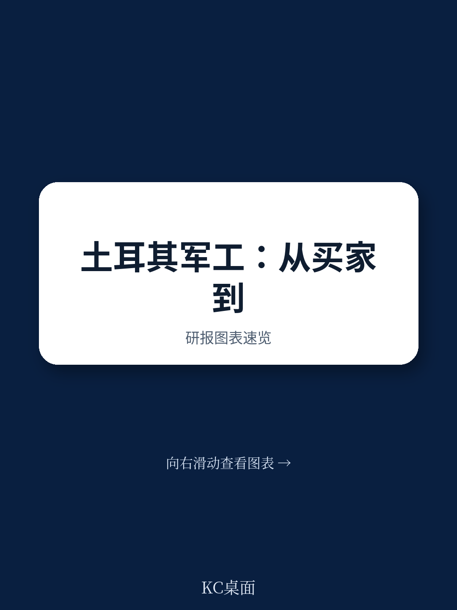
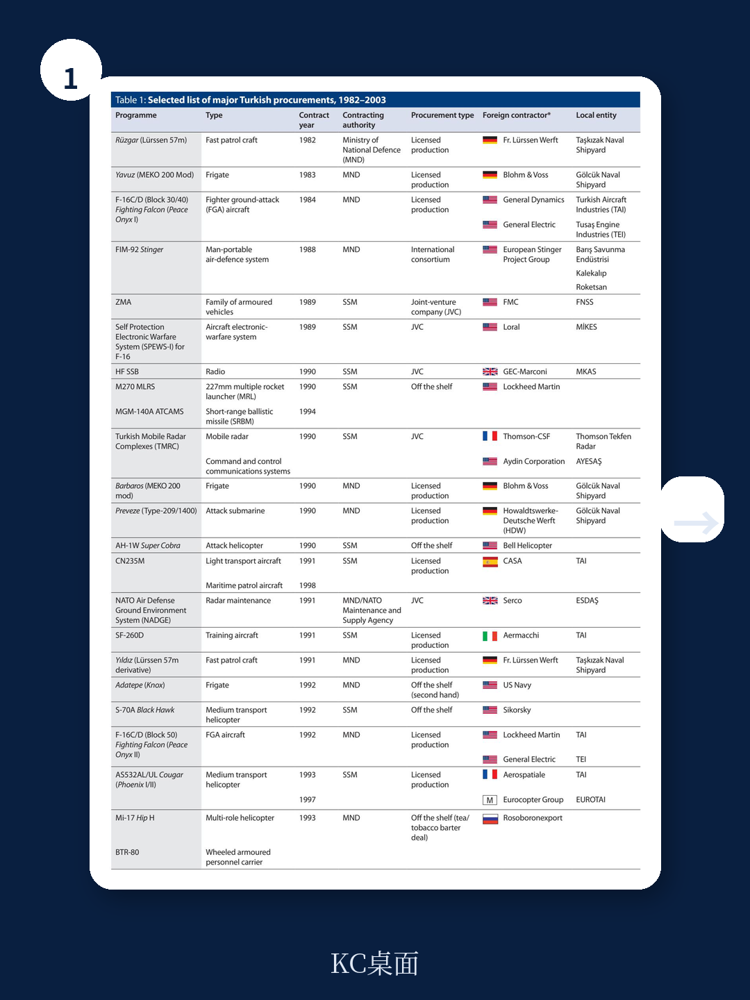
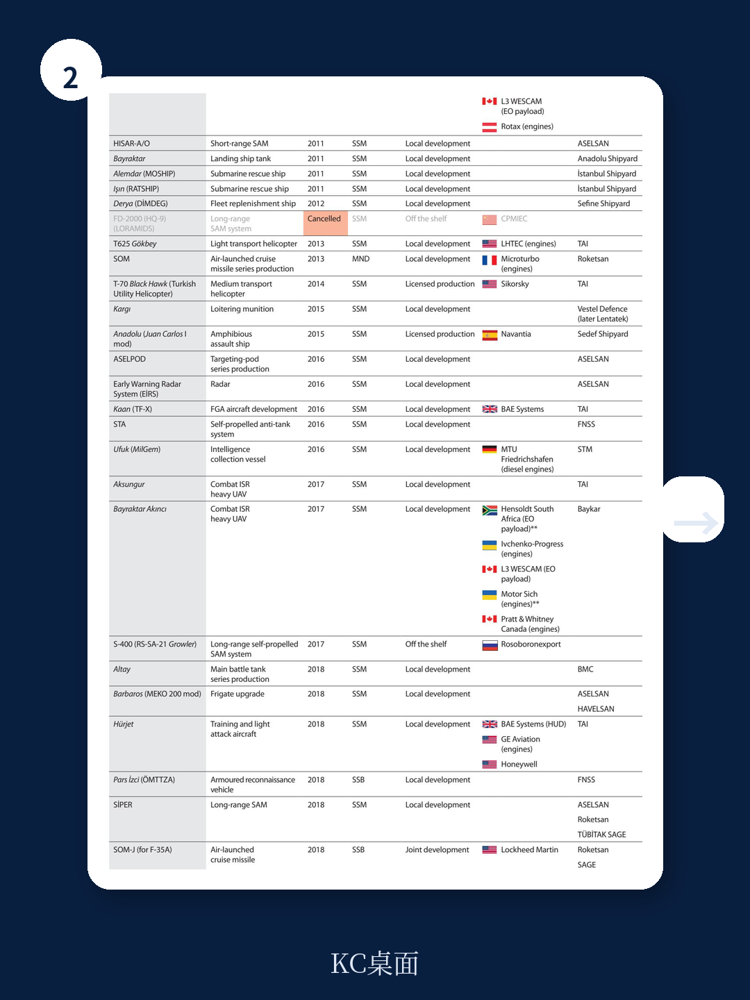

# 布鲁金斯学会：土耳其军工的“十字路口”是欧洲的机遇，也是北约的难题

一份来自布鲁金斯学会与IISS的联合报告，把土耳其的国防工业推到了一个不容回避的审视台上。报告的核心判断并非土耳其能否造出第五代战斗机，而是这个从“客户”蜕变为“竞争者”的过程，正在重塑欧洲安全供应链的底层逻辑。对于关注地缘政治与产业博弈的读者而言，这份报告的价值不在于罗列土耳其的装备清单，而在于揭示一个中等强国如何用七十年的时间，把被禁运的屈辱转化为出口的筹码，并最终让自己成为国际军工体系里一个“无法忽视、但也不好合作”的角色。

报告开篇就点明了土耳其当前面临的根本矛盾：自主性与可持续性之间的张力。一方面，从1923年建国至今，对单一供应商的恐惧——尤其是1974年塞浦路斯行动后西方盟友的武器禁运——一直是驱动土耳其国产化的核心动力。另一方面，当国产化走到平台级装备（如KAAN战斗机、阿纳多卢号两栖攻击舰）阶段时，成本与技术复杂度呈指数级上升，“完全自主”在经济学上已不现实。报告由此引出一个关键追问：当出口成为维系产业的唯一出路，土耳其的武器买家将如何影响其外交选择？这个问题，欧洲和北约至今没有给出清晰答案。

## 1. 禁运是最好的催化剂：土耳其军工的“创伤记忆”决定了其行为逻辑

报告用大量篇幅回溯了土耳其军工的“创伤记忆”，这不是历史回顾，而是理解当前决策的钥匙。1923年至1947年间，土耳其作为“客户”在国际军火体系中摸索，但两次关键事件彻底改变了轨迹。第一次是1964年约翰逊总统的信件——美国明确警告土耳其不得使用美制装备干预塞浦路斯。第二次是1974年塞浦路斯行动后，美国、欧洲多国对土耳其实施了全面或局部武器禁运。

> **KC评论：** 禁运的冲击力不在于“买不到武器”，而在于它摧毁了土耳其对盟友的信任假设。这解释了为什么今天土耳其宁可忍受技术风险，也要坚持在KAAN战斗机上使用国产发动机——哪怕进度延误。对于决策者来说，这是一个重要的认知锚点：土耳其的“国产化执念”并非民族主义口号，而是基于历史教训的理性防御。

报告指出，禁运之后，土耳其政府做了一个关键制度安排：1985年成立国防工业发展支持与管理办公室（即后来的SSM/SSB），并允许私营企业大规模参与军工生产。这与之前依赖国有军工企业的模式完全不同。F-16的许可生产项目成为转折点——土耳其不仅学会了组装，更通过“联合生产”条款，逐步建立起自己的航电、发动机维修和零部件供应链。这个阶段培养的工程师和管理人才，直接催生了后来Baykar、TAI等民营巨头的崛起。

## 2. “自上而下”的国产化路径：先造平台，再补零件，风险与收益并存

报告对土耳其国产化路径的分析，是全文最具产业洞察力的部分。与大多数新兴军工国家“先攻克关键子系统、再集成整机”的渐进路线不同，土耳其选择了“自上而下”的策略：先通过许可生产或国际合作掌握平台级装备（如F-16、M60坦克升级、A400M运输机），再反向分解技术，逐级实现子系统国产化。

这个策略的好处是显而易见的：快速形成战斗力，并在国际市场上建立品牌认知。Bayraktar TB2无人机在纳卡冲突、乌克兰战争中的表现，就是这种策略的广告。但报告也毫不客气地指出了代价：缺乏从底层技术出发的系统规划，导致国产化过程中经常出现“为了国产而国产”的重复投资，以及关键子系统（如高性能发动机、航电芯片）长期依赖进口，只不过供应商从美国变成了德国或英国。

> **KC评论：** 这个观察对投资者和企业战略家有直接含义。土耳其军工企业的估值逻辑不能简单等同于“国产化率”。一家公司如果只是在组装层面实现了国产化，而核心部件仍受制于人，其盈利韧性和地缘风险溢价都会打折扣。完整报告里有一张关于土耳其武器系统“国产化深度”的拆解图表，值得仔细对照。

报告特别提到了一个“未完全解答”的问题：当土耳其的无人机、装甲车开始在国际市场上与韩国、以色列甚至欧洲传统军工企业正面竞争时，这种“先做大、再做强”的模式是否还能持续？毕竟，TB2的成功很大程度上得益于其“低成本、可消耗”的定位，而一旦市场进入更高端、更依赖于系统集成的领域（如战斗机、导弹防御系统），土耳其的技术短板就会暴露得更明显。

## 3. 出口导向的“双刃剑”：繁荣背后的结构性脆弱

报告的第三部分集中讨论了土耳其军工出口的现状与隐忧。2020年代以来，土耳其国防工业的营业额和出口额均大幅增长，Baykar、Aselsan、TAI等公司成为全球军工展上的常客。但这繁荣背后，报告指出了三个结构性挑战。

第一是“人才外流”。报告特别提到，2010年代末以来，土耳其工程技术人才向欧美、海湾国家的流失速度加快，这对于需要长期积累的军工研发而言是致命伤。第二是“新竞争者涌入”。韩国、以色列、甚至印度都在积极拓展同一市场区间，土耳其的“性价比优势”正在被蚕食。第三是“出口管制与政治风险”。土耳其的武器出口对象并不总是与北约盟友保持一致，这导致其在获取某些关键零部件时可能面临二次制裁风险。

> **KC评论：** 这里有一个经常被忽视的悖论：土耳其越是通过出口来摊薄国产化成本，就越容易陷入新的依赖——依赖海外客户的政治稳定性，依赖第三方供应链的连续性。完整报告对这个“依赖转移”的分析非常透彻，并且附有土耳其主要出口目的地与进口来源地的对比图，能直观看出其供应链的脆弱节点。

报告没有直接给出答案，但提出了一个尖锐的问题：如果未来某个土耳其武器的主要进口国与北约发生冲突，土耳其将如何选择？这个问题不仅关乎土耳其的外交信誉，更直接影响到欧洲国家对土耳其军工企业的合作意愿。

## 4. 报告尚未完全回答的关键问题：欧洲的“桥”还是“墙”？

作为一份由欧洲智库（CATS、SWP）支持的研究，报告在结论部分刻意留下了一个开放性问题：土耳其国防工业究竟是连接土耳其与欧洲的“桥梁”，还是加深彼此隔阂的“高墙”？报告倾向于认为，如果欧洲能够把土耳其纳入更广泛的防务合作框架（如通过联合研发、技术共享），那么土耳其的军工能力可以成为欧洲安全自主的有益补充。反之，如果欧洲继续对土耳其采取“选择性合作”（即只买无人机、不分享核心技术），那么土耳其会加速向非西方供应商（如俄罗斯、中国、巴基斯坦）靠拢。

但报告也承认，这个“桥梁”假设面临巨大障碍。土耳其的国内政治环境、对库尔德问题的立场、以及在东地中海的能源争端，都是欧洲无法忽视的变量。更重要的是，土耳其军工体系的“决策黑箱”——SSB的权力边界、军方与文官政府之间的博弈——对于习惯于透明治理的欧洲企业而言，仍然是难以逾越的信任门槛。

## 5. 给观察者的一套分析框架：如何判断土耳其军工的下一步

基于报告的论证逻辑，我们可以提炼出一套判断土耳其军工走向的观察框架，供读者在后续跟踪中使用。

第一，看“发动机国产化”的进展。KAAN战斗机的发动机目前仍依赖通用电气，如果土耳其能在2030年前实现涡扇发动机的自主生产，将是其“自主性”的里程碑。否则，其高端装备的出口潜力将始终受制于人。

第二，看“人才回流”机制是否建立。报告提到的人才外流问题，目前没有看到土耳其政府有系统性的解决方案。如果未来2-3年内，土耳其无法通过税收优惠、股权激励等手段留住核心工程师，其研发后劲堪忧。

第三，看“出口目的地”的多元化程度。如果土耳其的武器出口仍然高度集中在少数几个中东、北非国家，那么其地缘风险就会高度集中。相反，如果能进入欧洲、拉美市场，则意味着其产品获得了更高标准的认证，也意味着其政治立场需要做出更多妥协。

第四，看“国际合作模式”是否升级。土耳其目前仍以“许可生产”和“联合研发”为主，尚未出现类似欧洲“台风”战斗机那样多国深度共享知识产权的项目。如果土耳其能与欧洲国家启动一个真正的“共同定义、共同投资”的项目，将是一个重大信号。

> **KC评论：** 这四个观察点，每一个在完整报告中都有对应的案例和数据支撑。尤其是关于发动机国产化的技术路线图，报告引用了多位前SSM官员的访谈，信息密度很高。限于篇幅，我们无法在此一一展开，但这些内容正是我们社群每日解读的核心价值所在。

---

这份报告给我们最大的启发是：土耳其军工的崛起不是孤立的产业故事，而是全球权力转移、供应链重构与中等强国战略自主诉求交织的缩影。对于中国的产业观察者而言，土耳其的经验既有参考价值——比如“自上而下”的路径选择、出口导向的可持续性困境——也有警示意义：当自主性追求与商业利益发生冲突时，任何国家都必须在理想与现实之间做出艰难的权衡。

报告的结论是开放的，但问题清单已经足够清晰。接下来的关键，不在于土耳其能否造出更先进的武器，而在于它能否在“成为竞争者”之后，找到一种让欧洲、北约乃至全球市场都能接受的新身份。这不仅是土耳其的课题，也是每一个试图在现有国际秩序中谋求“战略自主”的国家必须面对的课题。

如果你想深入理解土耳其军工的供应链地图、人才流失的具体数据、以及它与韩国、以色列的竞争格局对比，欢迎加入我们的社群。我们每天会由AI agent与人工review相结合，生成国际投行与顶尖智库的中文摘要与KC评论，daily更新，约10-40页，也包含当天最新数据图表合集，既方便喂给AI，也方便人工快速把握市场dynamics。顺着这些未解问题，继续读完整报告，你会看到更多有趣的细节。

Personal reading notes and learning share only. Not investment advice.

