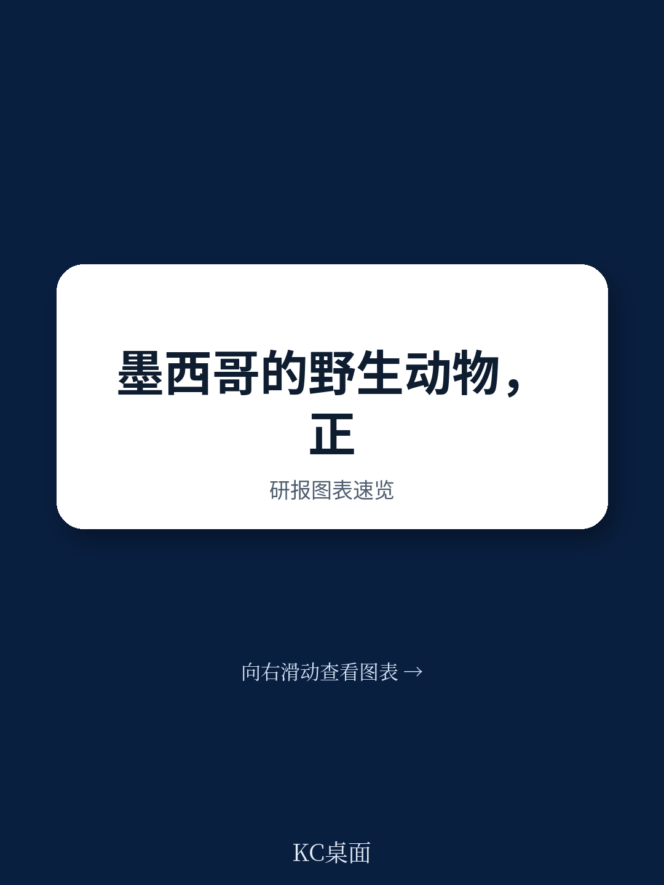

# 布鲁金斯学会：墨西哥野生动物走私，正被贩毒集团“收编”为中墨地下贸易通道

当你以为野生动物走私只是环保议题时，它已经变成了毒品贸易的“结算系统”。

这份来自布鲁金斯学会的深度报告揭示了一个被严重低估的现实：在墨西哥，针对中国市场的野生动物盗猎与走私，早已不是孤立的生态犯罪。它正被锡那罗亚等贩毒集团系统性地“收编”，成为毒品前体化学品交易的价值转移工具，以及洗钱的新通道。

报告的核心判断是：墨西哥的野生动物走私，正在从“盗猎者-中国买家”的简单链条，演变为“贩毒集团控制渔场与林场-强制介入中间环节-以珍稀物种作为毒品交易的‘硬通货’”的复杂地下经济网络。这一变化，远比单纯的物种灭绝威胁更为深远——它意味着中国买家与墨西哥最暴力的犯罪组织之间，正在形成一种结构性的共生关系。

这不仅仅是一份环保报告，它是一份关于跨国犯罪、毒品经济与全球供应链阴影地带的深度商业与安全分析。以下是我们从这份报告中提炼出的五个核心洞察。

> **KC评论：** 这份报告最反常识的地方在于，它没有把问题归结为“中国消费者爱吃鱼翅/穿山甲”，而是指出中国贸易商在墨西哥的采购行为，正在被当地贩毒集团“绑架”。如果你只关注环保，你会错过背后那个更庞大的非法经济网络。完整报告里对锡那罗亚卡特尔如何从渔民手中“收税”的细节描写，会让你对“供应链控制”这个词有全新的认识。

## 1. 贩毒集团正在对墨西哥渔业实施“全链条垄断”，中国买家被迫与其直接交易

报告指出，墨西哥的有组织犯罪集团，特别是锡那罗亚卡特尔，正在试图垄断从捕捞到出口的全链条。他们不仅向合法和非法渔民征收“保护费”，更强制规定渔民只能将渔获卖给他们，甚至要求面向国际游客的餐厅只能从他们手中进货。

这意味着，曾经直接与当地渔民或猎手交易的中国贸易商，现在不得不与这些武装集团打交道。犯罪集团强行将自己插入为中间人，控制了定价权和交易渠道。这种关系的转变，使得中国贸易商无论主观意愿如何，都深度卷入了墨西哥有组织犯罪的生态系统。

这种“中间人”角色的确立，是理解整个问题的钥匙。它不再是零散的盗猎，而是有组织的、受暴力保护的资源掠夺。

## 2. 珍稀物种正在成为毒品交易的“价值转移”工具，而非单纯的商品

这是报告最具洞察力的部分。报告明确指出，各种野生动物产品，正在被墨西哥犯罪集团用作与中国贸易商交换芬太尼和冰毒前体化学品的价值转移机制。

在这个体系中，一公斤石首鱼鱼鳔（Totoaba swim bladder）或一批海参，其价值不再仅仅取决于终端市场的消费需求，而是变成了毒品交易的“结算货币”。这种“以货易货”的模式，绕开了传统的金融监管，使得追踪资金流变得更加困难。

这意味着，打击野生动物走私，已经不再是单纯的环保执法问题，而是打击毒品洗钱和切断毒品供应链的关键一环。任何试图通过加强海关检查来阻止野生动物走私的努力，如果不同步打击毒品前体贸易和洗钱网络，效果都将大打折扣。

> **KC评论：** 这才是报告真正的“魔鬼细节”。很多人会惊讶于“海参”和“芬太尼”能划等号，但在地下经济中，价值转移的逻辑就是这么直接。完整报告中详细描述了这种“价值转移”的具体操作路径和规模估算，这对于理解全球毒品贸易的资金流动模式，有极高的参考价值。

## 3. 墨西哥环保执法能力正在被系统性削弱，为犯罪集团创造了“真空地带”

报告毫不客气地批评了墨西哥现任总统洛佩斯·奥夫拉多尔（AMLO）政府的政策。报告指出，在他的任期内，墨西哥的环保机构和执法能力正在被“去势”（becoming more emaciated）。环保机构的预算被大幅削减，人员配备不足，甚至连在保护区内进行基本巡逻的“护林员”体系都几乎不存在。

与此同时，墨西哥有组织犯罪集团控制着大片政府官员和环保人士无法进入的“禁区”。在这种“真空地带”里，盗猎和非法采伐几乎不受任何约束。报告还特别提到，墨西哥的“野生动物保护与管理单位”（UMA）系统，原本旨在通过赋予社区经济权益来保护物种，如今却可能被犯罪集团利用，通过伪造或强占土地所有权，将其变为合法洗白盗猎动物的“灰色地带”。

这种“执法能力坍塌”与“犯罪集团扩张”的双重趋势，意味着墨西哥的生物多样性正面临前所未有的威胁，而针对中国市场的走私活动只是这场灾难的冰山一角。

## 4. 中国政府的应对策略是“有限合作”与“责任推卸”，合作效果有限

报告分析了中国政府在应对这一问题上的态度。一方面，中国政府在国际压力下，进行过几次针对野生动物零售市场的突击检查，这些行动确实将公开的非法交易逼入了地下，转向了线上和私密渠道。但另一方面，报告认为，中国政府“在很大程度上拒绝承认中国对墨西哥盗猎和野生动物走私负有责任”，并坚持认为“这些问题应由墨西哥政府自行解决”。

因此，中墨之间的执法合作“微乎其微且断断续续”。中国更倾向于个案式的非正式合作，而非建立制度化的联合执法机制。这种“选择性执法”和“责任外包”的态度，使得打击跨国走私网络的努力缺乏系统性和持续性。

> **KC评论：** 报告对中国政府的这部分评价很克制，但信息量很大。“拒绝承认责任”和“偏好个案合作”这两点，解释了为什么很多跨国环保倡议在操作层面会陷入困境。完整报告里还分析了中国政府在“打击非法野生动物零售”上的具体行动案例，以及这些行动如何改变了走私者的行为模式，这部分内容对于理解执法与市场的博弈非常有价值。

## 5. 报告尚未回答的关键问题：中国贸易商是如何被“卷入”的？他们是否有选择？

报告清晰地描绘了犯罪集团如何“强制”介入，但并未充分展开一个关键问题：在墨西哥的中国贸易商和买家，其主观能动性与被动性各占多少？他们是纯粹被贩毒集团裹挟的受害者，还是主动寻求与犯罪集团合作以降低采购成本或获取稳定货源？

报告中提到“中国贸易商对某种动物或植物物种的兴趣，以及他们在墨西哥大规模采购的努力，会吸引墨西哥犯罪集团的注意”。这句话暗示，犯罪集团的介入往往是对中国市场需求的一种“反应性”控制。那么，是否存在一些中国贸易商，在明知风险的情况下，仍然主动选择与犯罪集团合作？又或者，他们是否可以利用中国本土的执法网络或外交渠道，来规避这种“强制交易”？

这个问题的答案，将直接决定未来干预策略的有效性。如果中国贸易商是受害者，那么重点应放在保护他们并切断犯罪集团的控制链；如果他们是有意参与者，那么打击的重点就应转向其资金来源和终端市场。

## 结语：从物种保护到地下经济治理

这份布鲁金斯学会的报告，为我们打开了一个观察中墨之间“非法经济共生”的新窗口。它提醒我们，在全球化时代，环保议题、毒品战争、洗钱网络和供应链安全是高度交织的。单纯从一个维度出发的解决方案，注定是无效的。

对于关注全球供应链风险、跨国犯罪动态以及地缘政治经济的读者来说，这份报告的价值远不止于野生动物保护。它提供了一个绝佳的案例，展示了在法治薄弱地区，市场需求如何催生出一个由暴力组织控制的、与毒品经济深度绑定的地下生态系统。

这些未解的问题——中国贸易商的真实处境、价值转移的精确规模、以及中国国内执法网络如何与墨西哥的犯罪生态互动——正是我们在社群中持续追踪和讨论的重点。每一天，我们的AI agent都会从全球十数家顶级投行和研究机构的最新报告中，筛选出类似这样有深度、有反常识洞察的内容，并由人工进行解读和评论。

如果你希望看到这份报告的完整图表、详细案例以及我们对其背后商业与投资含义的深度拆解，欢迎加入我们的社群。我们每天都会更新一份约10-40页的“国际投行中文摘要与KC评论合集”，既方便你喂给AI进行二次分析，也方便你在繁忙的工作中快速把握全球市场的关键动态。

Personal reading notes and learning share only. Not investment advice.

