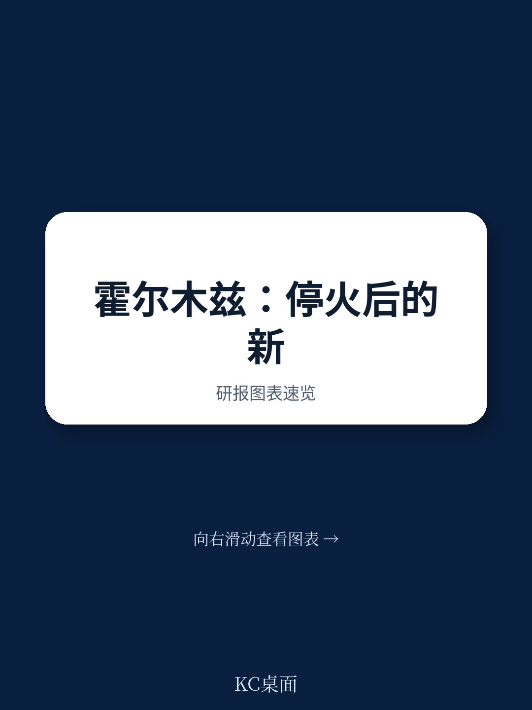
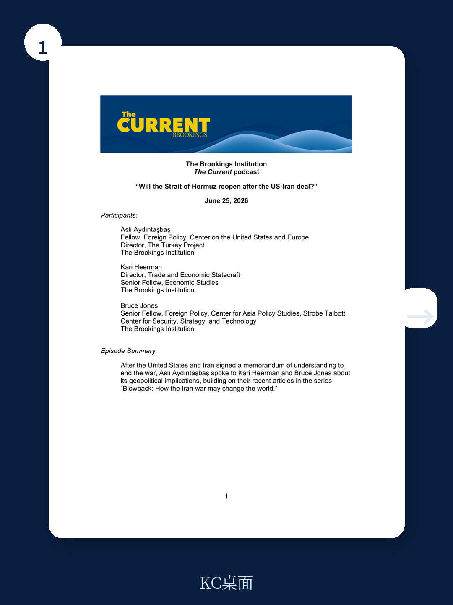
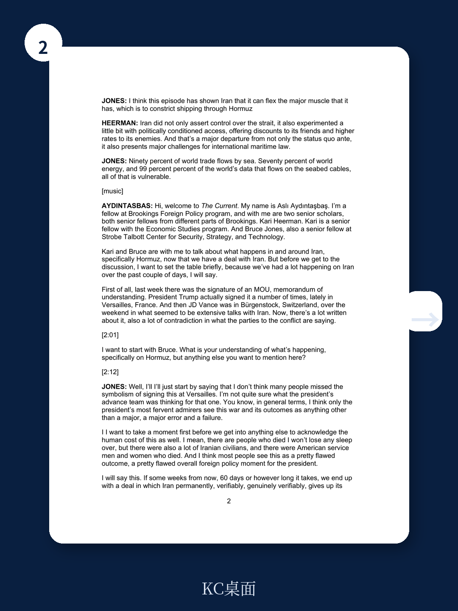

# 布鲁金斯学会：霍尔木兹海峡不会回到从前，伊朗已学会“政治定价”

美伊签署谅解备忘录结束战争，霍尔木兹海峡正在重新开放。第一批油轮已试探性通过，全球能源市场松了一口气。然而，布鲁金斯学会三位资深学者在最新一期播客中发出一个被市场忽略的警告：即便海峡今天开放，伊朗已经改变了全球航运的底层规则。这场战争留下的真正遗产，不是伊朗核计划的去留，而是一个主权国家第一次将“政治定价”系统性地嵌入国际水道通行权。

这意味着什么？意味着全球贸易的“高速公路”可能从此不再是公共品，而变成了地缘杠杆。伊朗建立了波斯湾海峡管理局，开设了国有保险公司保险政策，甚至尝试对盟友打折、对敌人加价。这些做法没有因为停火而撤销。备忘录中，伊朗只是承诺60天内免费通行，但明确保留了与阿曼协商未来海峡管理权的条款。换句话说，伊朗没有承诺“永不封锁”，它只是换了一种更精细的控制方式。

> **KC评论：** 市场往往把“重新开放”等同于“恢复正常”。但布鲁金斯学会的分析提醒我们，伊朗正在把霍尔木兹海峡从一个物理瓶颈升级为一个制度化的政治工具。这对全球航运成本结构、保险定价、甚至供应链地缘布局都有深远影响。完整报告里有一张关于“政治定价”的机制图解，值得细看。

---

## 1. 伊朗的“政治定价”实验，可能成为全球航运的新常态

伊朗在整个战争期间做的，不仅仅是封锁海峡。它做了一件更危险的事：根据对象国与自己的政治关系，差异化定价。盟友享受折扣，敌人支付溢价。这不是传统意义上的“战时管制”，而是把国际水道变成了一个可调节的地缘阀门。

布鲁金斯学会经济研究高级研究员Kari Heerman指出，这种做法不仅背离了数十年来的国际惯例，也直接挑战了国际海洋法的基本原则。传统上，国际海峡的通行权是“非歧视性”的，所有国家享有同等待遇。伊朗的“政治定价”一旦被容忍或默许，就可能被其他拥有战略水道的国家效仿。

马六甲海峡、丹麦海峡、博斯普鲁斯海峡——这些全球贸易的命门，都可能成为下一个“政治定价”的试验场。Heerman特别强调，这不是明天就会发生的事，因为大多数国家从自由航行中获得的收益远超封锁带来的杠杆。但问题在于，当“政治定价”开始被正常化，当出口管制、关税和地理控制被放在同一个工具箱里，国际秩序就在悄然改变。

> **KC评论：** 这里有一个被许多人忽略的细节：伊朗在备忘录中并未撤销波斯湾海峡管理局，而是将其作为未来协商的主体。这意味着，即便海峡开放，伊朗仍然保留了一个常设机构来管理通行权。这为未来“常态化收费”埋下了制度基础。完整报告中对这个管理局的运作机制有更详细的拆解。

---

## 2. 战争的最大输家是美国海军，而非伊朗

布鲁金斯学会高级研究员Bruce Jones在文章中提出了一个更令人不安的判断：这场战争真正暴露的，不是伊朗的脆弱，而是美国海军力量的边界。

Jones的核心论据有三。第一，伊朗证明了自己可以承受美国军事打击，同时保持威胁海峡的能力。伊朗的军事能力确实被削弱了，但封锁海峡是一件“低技术、低成本”的事——布雷、无人机、反舰导弹，这些都不需要一支完整海军。第二，美国海军规模从冷战结束时的600艘缩减到如今的约280艘，而同期全球贸易量和海底电缆数据流量却增长了数倍。第三，中国已成为全球最全面的海上力量，而美国维持全球航行自由的能力正在相对下降。

Jones总结了一个尖锐的悖论：美国花费巨大代价保护的全球海上航道，其最大受益者之一恰恰是其主要战略竞争对手中国。他认为，美国需要认真考虑“两个全球化”的框架——一个由美国保障，另一个则不是。

> **KC评论：** 这个“两个全球化”的构想非常大胆，但报告没有完全展开它的操作细节。比如，如何界定“美国保障”与“不保障”的边界？中国是否会主动填补美国留下的安全真空？这些问题的答案，将直接影响未来十年全球贸易的路线图和成本结构。完整报告中对这个悖论有更深入的数据支撑。

---

## 3. 海底电缆：比石油更脆弱的“暗线”

在石油航运之外，还有一个被市场严重低估的风险——海底数据电缆。霍尔木兹海峡不仅承载着全球约20%的石油运输，还铺设了连接中东、非洲和亚洲的关键数据电缆。这些电缆承载着99%的全球数据流量。

伊朗在战争期间威胁对通过这些电缆的数据流征收通行费。Jones指出，与石油不同，封锁石油会损害伊朗自身经济，但破坏数据电缆对伊朗影响极小，却能对区域通信造成巨大破坏。备忘录中没有涉及任何关于数据电缆的条款，这意味着这个风险敞口依然存在。

对于全球金融机构、科技公司和通信运营商来说，这是一个尚未被充分定价的尾部风险。如果伊朗或其他国家在未来效仿这种“数据征税”模式，全球互联网的底层物理架构将面临系统性挑战。

---

## 4. 制裁解除不是“一键重启”，重建基金充满不确定性

Kari Heerman对制裁解除的复杂性给出了清醒的评估。备忘录中，美国财政部确实发布了通用许可证，允许伊朗在60天内以美元出售石油。但长期制裁的解除涉及法律复杂性：部分制裁需要国会行动，部分是多边制裁，不可能在短期内完全解除。

关于重建基金，备忘录只是笼统提及，但具体规模、资金来源、管理机制均未明确。JD Vance已明确表示不会使用美国纳税人资金。Heerman指出，战后经济安全是维持和平的关键，但谁将从重建中获益、重建基金将如何重塑区域经济格局，目前都是未知数。

> **KC评论：** 这里有一个关键但未被回答的问题：重建基金的资金来源如果是私人投资或区域盟友，那么这些投资者会要求什么样的政治或经济回报？这可能导致伊朗经济在战后被重新“分割”，而非真正意义上的独立恢复。完整报告中对重建基金的可能结构有更细致的推演。

---

## 5. 报告尚未完全回答的关键问题：这个“先例”会不会扩散？

布鲁金斯学会的讨论提出了一个核心问题，但并未给出确定答案：伊朗的“政治定价”会不会被其他国家效仿？

一方面，大多数国家从自由航行中获得的收益远超封锁。另一方面，当“地理杠杆”被成功使用一次，它就会成为其他国家工具箱里的一个选项。特别是在大国竞争加剧、多边机制弱化的背景下，这种“先例”的扩散风险真实存在。

马六甲海峡、苏伊士运河、巴拿马运河、丹麦海峡——这些水道的控制国是否会在未来某个时刻，以“维护主权”或“公平收费”的名义，引入类似的政治定价机制？这不是一个短期问题，但值得所有依赖全球供应链的决策者提前思考。

---

## 6. 对读者的观察框架：如何跟踪这个“新常态”的演变

基于布鲁金斯学会的分析，我们建议读者关注以下三个观测指标，以判断霍尔木兹海峡“政治定价”是否会成为长期趋势：

第一，波斯湾海峡管理局的后续行动。它是否会发布正式的通行费标准？是否会对不同国家实施差异化定价？这是最直接的信号。

第二，国际海洋法法庭或相关仲裁机构是否受理相关案件。如果国际社会对伊朗的做法提出法律挑战，将决定“政治定价”的合法性边界。

第三，其他战略水道的控制国是否出现类似讨论。例如，马来西亚和印尼是否开始讨论马六甲海峡的“管理费”或“通行费”？这将是“先例扩散”的最早信号。

这些指标不需要每天追踪，但每季度审视一次，可以帮助决策者在供应链布局、保险成本和地缘风险敞口上做出更理性的判断。

---

霍尔木兹海峡的重新开放，并不意味着全球航运回到了熟悉的旧世界。伊朗已经证明，一个中等国家可以通过控制地理瓶颈，在不拥有核武器的情况下获得巨大的地缘杠杆。这个教训，不会因为一纸备忘录而消失。

布鲁金斯学会的这份讨论，为我们提供了一个比市场共识更深刻的观察框架。但报告本身也留下了一些未完全展开的盲点：例如，伊朗内部政治力量如何影响协议执行？中国和俄罗斯在战后重建中的角色是什么？美国海军能力下降的具体时间表如何？

这些问题，以及报告中的原始图表和详细数据，我们将在每日研报解读社群中持续跟踪。每天，我们的AI agent与人工review团队会从高盛、摩根士丹利、摩根大通、瑞银、花旗、布鲁金斯学会等机构的最新报告中，提取10-40页的中文摘要与KC评论，包括当天最新的数据图表合集。这些内容既方便喂给AI模型进行二次分析，也方便人工快速把握全球市场的动态变化。

如果你正在跟踪全球供应链、能源市场或地缘政治风险，欢迎加入社群，与我们一起持续拆解这些正在重塑世界的力量。

Personal reading notes and learning share only. Not investment advice.

