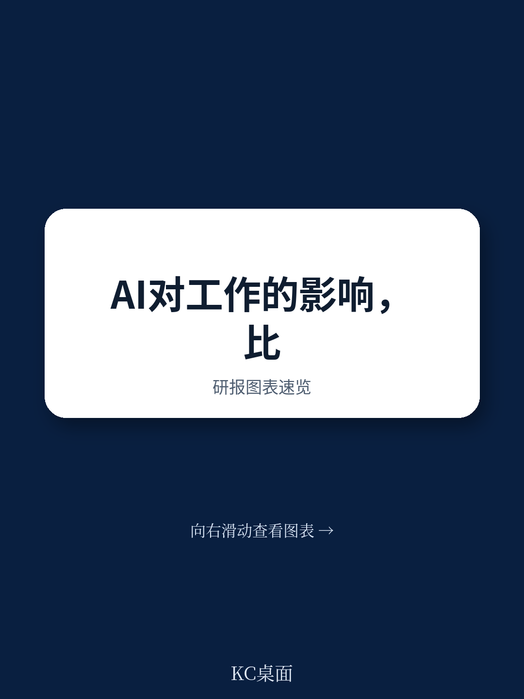
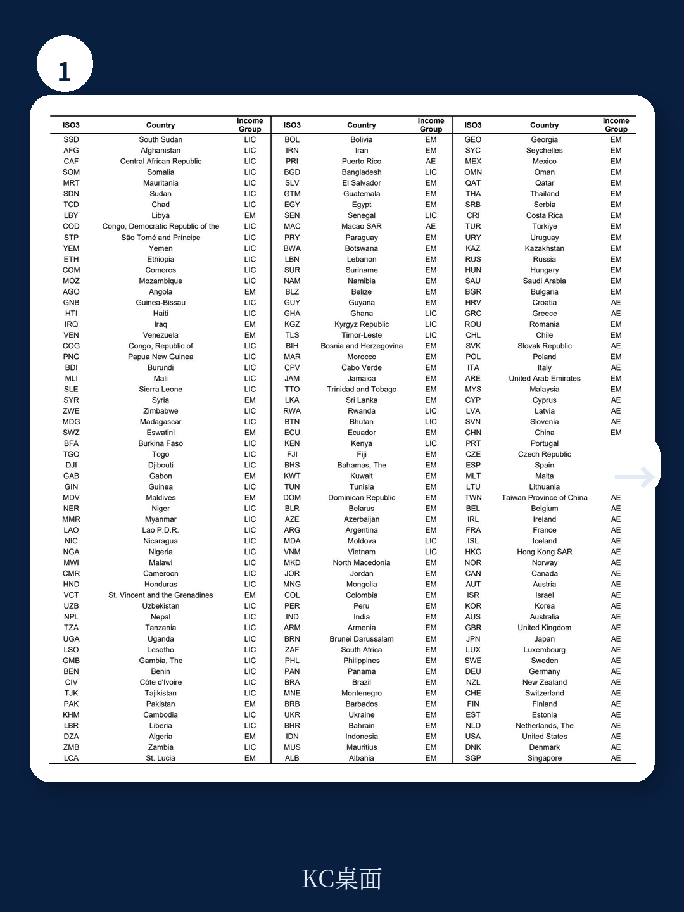
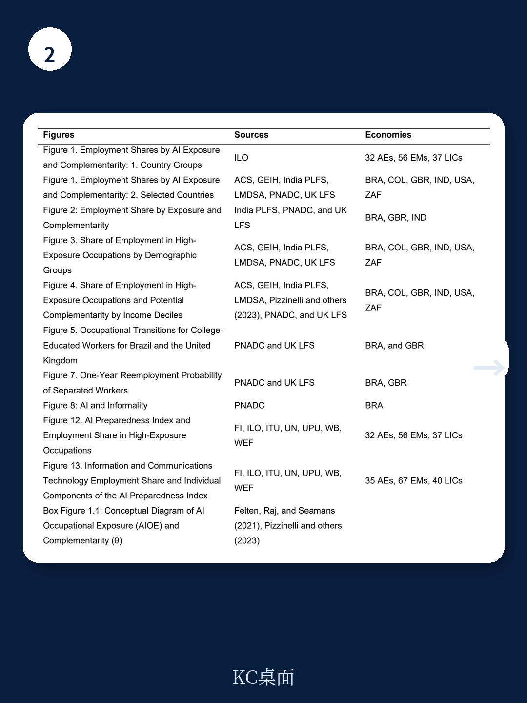

# 国际货币基金组织：IMF：AI将冲击全球60%高薪岗位，但真正危险的只有一半

这份由国际货币基金组织（IMF）在2024年1月发布的Staff Discussion Note，可能是迄今为止对AI与劳动力市场关系最系统的全球性分析。它没有停留在“AI会取代多少工作”这类粗糙判断上，而是试图回答一个更关键的问题：哪些岗位会被AI替代，哪些会被AI增强，以及这种分化将如何重塑国家之间、阶层之间的财富分配。

报告的核心结论值得每一个产业决策者和高净值读者认真对待：全球近40%的就业岗位暴露在AI影响之下，但不同国家、不同人群的命运将截然不同。先进经济体约60%的岗位面临AI冲击，其中约一半可能被削弱，另一半则可能因AI而获得生产力跃升。新兴市场和发展中经济体的暴露度则低得多，分别为40%和26%。

这意味着什么？AI不会均匀地改变世界。它正在制造一条新的分界线——不是南北国家之间的旧分界线，而是“谁有能力利用AI”与“谁只能被动承受AI”之间的新分界线。

## 1. 先进经济体面临的双重命运：60%的暴露率背后是“一半天堂，一半地狱”

报告最引人注目的发现之一，是先进经济体极高的AI暴露率。约60%的就业岗位被判定为“暴露于AI”——这个数字远高于新兴市场的40%和低收入国家的26%。原因很直接：先进经济体的就业结构以认知密集型岗位为主，而AI擅长的正是认知任务。

但报告没有止步于此。它引入了一个关键区分：AI暴露并不等于AI替代。研究团队开发了一套新的衡量指标，试图区分“AI可能替代人类”和“AI可能增强人类”两种截然不同的影响路径。在先进经济体的高暴露岗位中，大约一半属于“高互补性”——即AI有望大幅提升这些岗位的生产力；而另一半则属于“高风险”——AI可能直接替代这些岗位的核心职能。

> **KC评论：** 这个区分是整份报告最有价值的贡献之一。过去关于AI对就业影响的讨论，往往把“暴露”等同于“危险”，导致公众要么过度恐慌，要么轻率否定。IMF的研究提醒我们：同样是高暴露岗位，一个病理医生和一个人工客服代表的命运可能完全不同。前者可能因为AI辅助诊断而变得更强，后者则可能被AI直接取代。完整报告中对不同职业的暴露度和互补性评分表，值得每一位读者仔细对照自己的行业。

这一判断对资产定价的含义是什么？在先进经济体中，那些能够通过AI实现“人机协同”的行业——如医疗诊断、法律分析、金融建模——可能迎来生产力跃升和利润率改善；而那些依赖认知重复劳动的行业——如基础数据处理、初级咨询分析、标准化内容生产——则面临结构性压缩。投资者需要重新审视自己所持资产中，哪些属于“被增强”的赛道，哪些属于“被替代”的赛道。

## 2. 收入不平等的新逻辑：AI不再只冲击中低技能岗位

与以往自动化浪潮不同，AI的冲击范围向上延伸到了高技能、高收入的岗位。报告明确指出，AI的先进算法现在可以增强甚至替代那些过去被认为“免疫于自动化”的高技能角色——需要细微判断、创造性问题解决或复杂数据解读的工作，如今也在AI的射程之内。

但这里有一个关键的反直觉发现：虽然高收入者面临更高的AI暴露风险，但他们同时也拥有更高的“潜在互补性”。换句话说，AI对高收入者的影响是双刃的——可能替代他们，也可能增强他们。最终结果取决于AI与高收入工人的互补性有多强。

报告通过模型模拟给出了一个清晰的结论：如果AI与高收入工人的互补性很强，那么高收入者的劳动收入将获得超比例增长，从而拉大劳动收入不平等。同时，AI带来的资本回报提升将进一步加剧财富不平等——因为高收入者往往也是资本的主要持有者。

> **KC评论：** 这个发现对高净值读者的个人资产配置和职业规划都有直接启示。如果你是高收入的知识工作者，你需要问自己一个残酷的问题：你的工作核心是“判断和决策”，还是“信息处理和模式识别”？前者更可能被AI增强，后者更可能被AI替代。完整报告中的收入分位数分析图表，展示了不同收入水平人群在AI冲击下的差异化路径，值得仔细研读。

这一判断对政策制定者的含义同样深刻。传统的再分配政策可能不足以应对AI带来的不平等——因为AI不仅影响劳动收入，还通过资本回报渠道加剧财富集中。报告暗示，各国关于AI产权归属的定义——即AI创造的价值归谁所有——将成为决定未来收入分配的关键制度变量。这一点在报告的正文中有更详细的讨论，但并未完全展开，留给读者自行挖掘。

## 3. 劳动者的适应能力存在结构性差异：大学学历成为AI时代的关键分水岭

报告利用英国和巴西的微观数据，分析了劳动者在AI高风险岗位和高互补性岗位之间的历史流动模式。结果揭示了一个令人不安的规律：大学学历的劳动者更容易从高风险岗位转向高互补性岗位，而没有接受过高等教育的劳动者则表现出显著较低的流动性。

具体来说，在英国和巴西，大学学历的劳动者历史上更容易从那些现在被判定为“高替代风险”的岗位，转移到“高互补性”的岗位。这意味着他们更有可能在AI转型中“向上流动”。相反，没有大学学历的劳动者——即使他们当前处于高风险岗位——也很难找到通往高互补性岗位的路径。

年龄也是一个关键变量。年轻劳动者由于适应能力强、对新技术的熟悉度高，更有可能利用AI带来的新机会。而年长劳动者在再就业、技术适应、流动性和新技能培训方面可能面临更大困难。

> **KC评论：** 这一发现的政策含义非常直接：教育不是AI时代的“备选项”，而是“准入门槛”。但报告没有充分展开的是，这种结构性差异在不同国家之间可能被放大或缩小。例如，德国的职业培训体系是否能够为没有大学学历的劳动者提供更好的转型路径？北欧的高福利社会模式是否能够缓冲AI带来的调整成本？这些问题的答案需要读者在完整报告中寻找，因为报告对英国和巴西的案例分析只是引子，更广泛的跨国比较在附录中。

对于企业决策者来说，这意味着人才战略需要重新设计。单纯招聘“AI人才”是不够的，企业需要建立内部技能再培训体系，帮助现有员工从高风险岗位向高互补性岗位迁移。那些能够有效实现“内部劳动力再配置”的企业，将在AI转型中获得显著的竞争优势。

## 4. 生产力跃升可能是缓解不平等的唯一路径

尽管报告对AI加剧不平等的前景给出了清晰警告，但它也指出了一个关键的“逃生路线”：如果AI带来的生产力提升足够大，那么大多数工人的收入水平仍有可能上升。

模型模拟显示，由于资本深化和生产力激增，AI的采用预计将提升总收入。如果AI在某些职业中与人类劳动形成强互补，并且生产力提升足够显著，那么更高的增长和劳动力需求可能足以弥补AI对部分劳动任务的替代——这样，收入水平在大部分收入分布区间内都可能上升。

报告给出了一个具体的量化框架：在“高互补性”情景下，大部分收入群体的收入都会增长，尽管高收入者的增长幅度更大；在“低互补性”情景下，低收入群体的收入可能不升反降。两种情景的分野，取决于AI是增强还是替代高收入劳动者的工作。

> **KC评论：** 这个“生产力补偿”机制是理解AI宏观影响的核心。历史上，每一次技术革命都经历了类似的逻辑：短期看，技术替代了部分工作；长期看，生产力提升创造了新的需求和工作岗位。但AI的不同之处在于，它可能同时替代认知劳动和体力劳动，使得“新的工作岗位在哪里”成为一个更难回答的问题。报告的模型框架提供了情景分析，但对“新岗位会是什么”这个关键问题着墨不多，这恰恰是读者在完整报告中需要重点关注的部分——附录中的行业转型分析可能提供了更多线索。

对于投资者而言，这个框架意味着需要区分两类AI受益者：一类是直接通过AI提升自身生产力的公司（如采用AI辅助诊断的医疗企业），另一类是那些能够创造AI时代“新岗位”的平台或生态系统（如AI培训、AI审计、AI治理等新兴服务）。后者的长期价值可能更大，但也更难识别。

## 5. 报告尚未完全回答的关键问题：AI时代的“赢家通吃”效应有多强？

尽管这份报告在AI对劳动力市场的影响方面提供了迄今为止最系统的分析，但它有一个明显的局限：它主要关注AI对“劳动者”的影响，而对“企业”和“市场结构”的影响着墨不多。

报告在方法部分坦诚地指出了这一点：分析假设行业规模是固定的，每个职业的任务要求是不变的。这意味着分析结果更适用于短期到中期（5-10年），而对于更长的时间跨度——AI可能催生全新行业、改变企业间的竞争格局——报告提供的指导有限。

一个未被充分探讨的关键问题是：AI是否会加剧“赢家通吃”效应？如果AI使得领先企业的生产力优势进一步扩大，那么市场集中度可能上升，利润可能向少数头部企业集中。这意味着，即使整体生产力提升，劳动者在收入分配中的份额可能进一步下降——因为更多的价值被资本（即AI技术和数据的所有者）所捕获。

报告的模型确实考虑了资本回报对不平等的影响，但对“企业层面的AI采用差异”如何转化为“市场结构变化”和“劳动者议价能力变化”的分析还不够深入。这可能是读者最值得在完整报告中寻找答案的方向——附录中关于AI准备度指数的细分维度，以及不同国家在“AI创新与整合”方面的差异，可能提供了理解这一问题的线索。

## 6. 一个可供读者自行追踪的观察框架

基于这份报告的框架，我们可以提炼一个简单的三层观察框架，帮助读者在接下来12-18个月内持续追踪AI对劳动力市场的影响：

第一层：关注“高互补性”职业的工资和就业变化。报告识别出的高互补性职业——如医生、律师、高级分析师——如果其工资和就业持续增长，说明AI正在发挥增强效应；如果这些职业的就业增长放缓或工资下降，则说明AI的替代效应可能已经超出了预期。

第二层：关注“中年高学历劳动者”的转型路径。报告指出，大学学历是AI时代的关键分水岭。但“大学学历”本身是一个粗糙的指标。更精细的观察是：那些拥有“可被AI增强的技能组合”的高学历者（如数据分析、模式识别、决策优化）是否比拥有“可被AI替代的技能组合”的高学历者（如基础法律研究、标准化报告撰写）表现更好。

第三层：关注各国的“AI准备度”差异。报告构建的AI准备度指数涵盖了数字基础设施、人力资本、创新能力和监管框架四个维度。不同国家在这四个维度上的得分差异，将决定它们在AI时代的相对竞争力。读者可以重点关注那些在“数字基础设施”和“人力资本”两个维度上得分较低但正在快速追赶的新兴市场——它们可能成为AI时代的“后发优势”案例。

这份IMF报告的完整版本包含了大量未在本文中展开的细节：详细的职业暴露度评分表、不同收入分位数的AI影响模拟、以及AI准备度指数的完整构建方法。这些内容对于希望深入理解AI对自身行业和资产影响的读者来说，是不可或缺的参考材料。

---

以上讨论只是对这份报告的初步解读。报告中还有大量未在本文中展开的细节——包括完整的职业暴露度评分表、不同收入分位数的AI影响模拟、以及AI准备度指数的完整构建方法。这些内容对于希望深入理解AI对自身行业和资产影响的读者来说，是不可或缺的参考材料。

在我们的社群中，每天由AI agent结合人工审核，生成约10-40页的国际投行中文摘要与深度评论，包含当天最新数据图表合集。这些内容既方便直接喂给AI进行分析，也方便人工快速把握全球市场的动态变化。如果你希望获取这份IMF报告的完整解读版本（包含原始图表和附录），或者希望加入讨论AI对特定行业的影响，欢迎扫码加入社群。

Personal reading notes and learning share only. Not investment advice.

