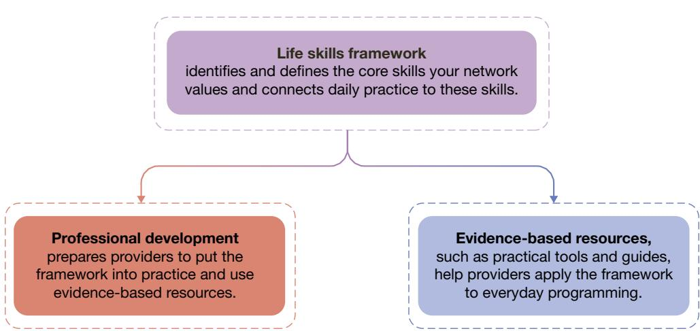
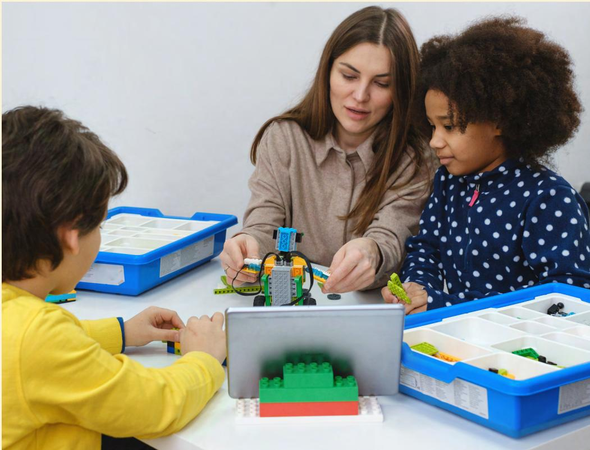
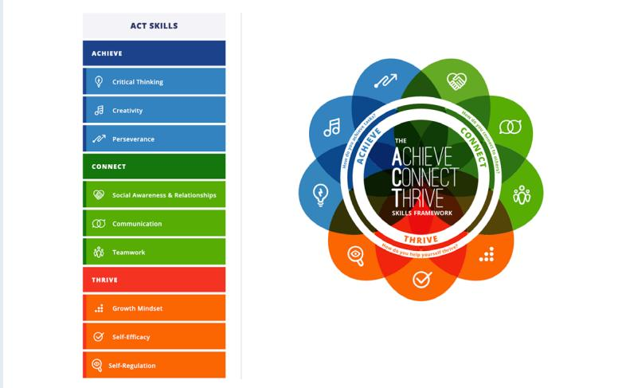

# Strengthening Young People's Life Skills

# Practical Guidance and Resources for Intermediaries Supporting Out-of-School-Time Programs

JENNIFER T. LESCHITZ, ALICE HUGUET, CATHERINE H. AUGUSTINE, KATIE TOSH, AND LAURA S. HAMILTON

For more information on this publication, visit www.rand.org/t/TLA4416-1.

## About RAND

RAND is a research organization that develops solutions to public policy challenges to help make communities throughout the world safer and more secure, healthier and more prosperous. RAND is nonprofit, nonpartisan, and committed to the public interest. To learn more about RAND, visit www.rand.org.

## Research Integrity

Our research integrity is grounded in RAND's core values of quality and objectivity. Rigorous quality assurance procedures, conflict of interest screening, and transparency in funding ensure that every study is objective and nonpartisan. Learn more at www.rand.org/integrity.

RAND's publications do not necessarily reflect the opinions of its research clients and sponsors.

Published by the RAND Corporation, Santa Monica, Calif.

© 2026 RAND Corporation

RAND $^{®}$ is a registered trademark.

Library of Congress Cataloging-in-Publication Data is available for this publication.

ISBN: 978-1-9774-1610-0

Cover: Photo provided by Monkey Business/Adobe Stock, Eva Kali/Adobe Stock

Interior: page iv-WavebreakMediaMicro/Adobe Stock, page 4-SDI Productions/Getty Images, page 8-Monkey Business/Adobe Stock, page 22-Halfpoint/Adobe Stock, page 24-AnnaStills/Adobe Stock, page 27-Monkey Business/Adobe Stock, page 31-Monkey Business/Adobe Stock, page 36-insta\_photos/Adobe Stock.

Limited Print and Electronic Distribution Rights

This publication and trademark(s) contained herein are protected by law. This representation of RAND intellectual property is provided for noncommercial use only. Unauthorized posting of this publication online is prohibited; linking directly to its webpage on rand.org is encouraged. Permission is required from RAND to reproduce, or reuse in another form, any of its research products for commercial purposes. For information on reprint and reuse permissions, please visit www.rand.org/about/publishing/permissions.

We developed this guide for organizations that support out-of-school-time (OST) providers. In it, we share practical guidance and resources to help OST programs support young people's life skills development.

The Wallace Foundation designed the Partnerships for Social and Emotional Learning Initiative (PSELI) to explore whether and how young people benefit when schools and OST programs partner to improve and coordinate life skills programming, as well as what it takes to do this work. Six communities participated in PSELI: Boston, Massachusetts; Dallas, Texas; Denver, Colorado; Palm Beach County, Florida; Tacoma, Washington; and Tulsa, Oklahoma. We derived the lessons in this guide from our study of more than 100 afterschool programs across these six communities. A companion resource with five editable planning templates is available at www.rand.org/t/TLA4416-1.

## RAND Education, Employment, and Infrastructure

RAND Education, Employment, and Infrastructure, a division of RAND that aims to improve educational opportunity, economic prosperity, and civic life for all, conducted this study in its Education and Employment Program. For more information, visit www.rand.org/eei or email EEI@rand.org.

## Funding

The Wallace Foundation sponsored this research. The Foundation seeks to help all communities build a more vibrant and just future by fostering advances in the arts, education leadership, and youth development. For more information and research on these and other related topics, please visit www.wallacefoundation.org.

## Acknowledgments

We thank the OST program and OST intermediary staff in the six PSELI communities who generously spent their time providing us information about their work. We also thank The Wallace Foundation staff, as well as intermediary organizations in Arizona, Connecticut, Oregon, Pennsylvania, Tennessee, Texas, and Vermont, for carefully reviewing drafts of this guide and helping improve it. We are especially grateful to Ann Stone at The Wallace Foundation for her support and guidance throughout this project. Michelle Bongard contributed to data analysis for this guide. This guide benefited substantively from the careful reviews and constructive feedback provided by our quality assurance manager, Elaine Wang, reviewers Joie Acosta and Anamarie Whitaker, and colleague Andrea Phillips. Finally, we appreciate the Research Editorial and Production team at RAND, including Stephanie Lonsinger, who edited this guide; Katherine Wu, who designed it; and Monette Velasco, who oversaw its production. Any flaws that remain are solely the authors' responsibility.

## Contents

About This Guide....iii

CHAPTER ONE
Overview ....1
Where Life Skills Grow: The Power of OST Programs....2
Inside This Guide....6

CHAPTER TWO
Establishing a Life Skills Framework....9
Understanding Life Skills Frameworks and Their Importance....9
Laying the Groundwork....11
Choosing an Approach That Fits Your Conditions....13
Putting the Framework to Work....18
Planning Your Framework Launch....20
Anticipating Potential Barriers to Adapting or Developing a Framework....22

CHAPTER THREE
Connecting OST Providers to Evidence-Based Resources....25
Helping Providers Put Climate-Building Routines into Action....26
Showing Providers How Life Skills Connect to Program Activities....29
Offering Direct Instruction Resources Designed for the OST Setting....30
Sharing Tools to Measure Progress....33
Anticipating Potential Barriers to Connecting Providers to Resources....34

CHAPTER FOUR
Offering Opportunities for Professional Development....37
Creating a Purposeful Professional Development Sequence....37
Tailoring Professional Development Approaches to Meet Providers’ Needs....42
Ensuring Strong Facilitation....45
Anticipating Potential Barriers to Professional Development....45

## CHAPTER FIVE

Key Takeaways .... 47
Establishing a Life Skills Framework .... 48
Connecting OST Providers to Evidence-Based Resources.... 49
Offering Opportunities for Professional Development.... 50
Anticipating Barriers to Implementation.... 51

APPENDIX A
Featured Resources .... 53

APPENDIX B
Bringing Life Skills into OST Programming: Planning Tools and Samples.... 59
Notes .... 80
Abbreviations .... 83
References .... 84

## COMPANION RESOURCE

Bringing Life Skills into Out-of-School-Time Programming: Planning Tools and Templates
Available at www.rand.org/t/TLA4416-1

## Overview

Young people who have well-developed life skills—such as self-awareness, teamwork, perseverance, and responsible decisionmaking—tend to do better in school, have better health and relationships, and enjoy greater overall well-being than those who do not. $^{1}$ The World Health Organization defines life skills as the “abilities for adaptive and positive behaviour that enable individuals to deal effectively with the demands and challenges of everyday life.” $^{2}$ There is an evidence base for how to help young people develop these skills, and out-of-school-time (OST) programs can play a key role.

This guide aims to help you, as intermediaries—i.e., the organizations that coordinate and support OST programs—assist OST providers in building their capacity to strengthen young people’s life skills development. We offer practical, ready-to-use strategies to help you broaden your network’s impact and improve life skills outcomes for young people.

Building on the work that many intermediaries already do, this guide highlights three ways that you can help OST providers build young people's life skills:

\- Establish a life skills framework to guide programming and practice.

\- Connect providers to evidence-based resources that support effective skill development.

\- Offer opportunities for professional development (PD) to build staff capacity and confidence.

Figure 1.1 illustrates how a life skills framework, PD, and evidence-based resources interconnect to bring life skills into OST programming. The framework provides the foundation, guiding both PD and the selection of evidence-based resources. PD prepares OST providers to apply the framework in their practice. Evidence-based resources, such as practical tools and guides, support this application in everyday programming.

## Where Life Skills Grow: The Power of OST Programs

OST programs provide opportunities for fostering positive youth development. They offer young people safe and supportive environments where they can develop relationships with caring adults and peers and engage in activities that help to build important life skills, such as self-control, working in teams, solving problems collaboratively with peers, setting goals, and persisting toward completing them. $^{3}$ Research shows that OST programs can improve outcomes for young people by providing evidence-based life skills training that includes time for skill practice and clear learning objectives. $^{4}$ Parents seem to recognize the important function of life skills: In a 2021 nationally representative survey, parents and guardians ranked social skills, teamwork, and confidence as the three skills most important for their children to develop in OST programs. $^{5}$

## How Intermediaries and Other Coordinating Entities Strengthen the OST Field

We use the term intermediary to refer to any organization that connects and supports OST programs through networking and coordinating tasks. These organizations build the capacity of OST providers by bringing programs together around shared goals, connecting program staff to best practices and instructional resources, providing PD, supporting continuous quality improvement, facilitating partnerships with schools and districts (see the “Learn More: Schools as Partners in Strengthening Life Skills” box), and, in some cases, providing funding.

# A Note on Terminology: Why We Use the Terms “Life Skills” and “Young People”

We choose to use the term life skills in this guide because it encompasses a broad range of behavioral, cognitive, and inter- and intrapersonal competencies that are important for success across multiple domains in life, including school, home, and work. $^{a}$ Life skills include self-management, self-awareness, decisionmaking and problem solving, critical thinking, and communication skills. $^{b}$ Unlike such terms as character skills, workforce readiness skills, or 21st-century skills, which may imply narrower applications or specific contexts, the term life skills reflects the transferable nature of these competencies across settings and in everyday activities and challenges that young people face.

At the same time, we recognize that the definitions of such skills vary by community and professional context. In some places, the term life skills may carry a narrower or different meaning than our broad definition. Wherever possible, we encourage intermediaries to adapt language to the community context, so these concepts resonate with the young people, program staff, families, and other stakeholders with whom you work. Whatever terminology you use, the goal is the same: supporting young people in building skills that help them navigate life's challenges and thrive in the environments and relationships they encounter.

Throughout this guide, we use young people rather than youth because the term encompasses a broader age range, including elementary-aged children. In the literature, the word youth typically refers more narrowly to older adolescents. We still use youth in established phrases, such as youth voice and youth-serving programs. The strategies in this guide (i.e., establishing a life skills framework, connecting providers to evidence-based resources, and offering PD) are relevant for a range of age groups, even though specific examples often focus on elementary-aged children. These strategies can inform work in other youth-serving settings, including schools and community-based programs.

$^{a}$ Danish et al., “Enhancing Youth Development Through Sport.”

$^{b}$ World Health Organization, Department of Mental Health, “Partners in Life Skills Education.”

OST intermediaries can take many forms. These capacity-building roles are not limited to organizations that formally identify themselves as OST intermediaries. Many other youth-serving organizations carry out similar functions; examples include such organizations as the YMCA and the Boys & Girls Clubs of America that oversee multiple program sites or branches within a community; the United Way, which directly funds or partners with OST providers; and city departments that operate OST programs. Cities, municipalities, and school district departments are often essential partners in citywide efforts to strengthen OST programming, and in some cases, they also serve as intermediaries themselves. They can provide public spaces or staffing for programs, bring together stakeholders from different sectors to coordinate initiatives around shared goals, and set supportive policies that advance young people's development. $^{6}$ In addition to those at the local and regional levels, statewide intermediaries can serve as valuable resources, helping establish statewide quality standards and advocating for state-level funding for OST providers.

OST programs often collaborate directly with schools, and intermediaries can work with districts to facilitate such collaboration. The initiative that underpins this guide was rooted in a partnership-based approach, intentionally linking these two environments in its design and implementation. $^{a}$ Schools are often considered “anchor” institutions in the lives of young people, and collaboration between schools and OST programs can reinforce skills, providing consistent messaging about expectations and norms. $^{b}$ Learners are more likely to build and sustain life skills when they see and practice them in multiple contexts, $^{c}$ making these partnerships important bridges between learning environments.

Partnerships work best when you, as intermediaries, engage schools and districts early—ideally as stakeholders in defining your goals and approach to building life skills—so that priorities and strategies are coordinated from the start. Many districts operate their own OST programs or have existing partnerships, so doing your homework before approaching potential partners is important. Understanding the district’s and schools’ goals, structures, and existing resources can help you identify how your network’s capabilities can complement and extend theirs.

Effective strategies for building and sustaining partnerships include relationship building, learning about each other's organizations, and setting up formal collaboration activities and memorandums of understanding. For example, partnerships might establish committees and regular meetings in which district/school staff and intermediary/OST program staff plan together and agree on shared language and practices. Shared staff-onboarding materials can also help ensure day-to-day consistency across settings.

# When built and maintained with care, partnerships with schools and districts can amplify your life skills work and strengthen a community-wide approach to supporting young people.

There are also challenges in forming and maintaining partnerships. As we found in our study, partnerships can be affected by such factors as leadership changes and differences in decisionmaking power. $^{a}$ Strategies for navigating these barriers include maintaining relationships with staff in various roles at the district, securing broad buy-in from staff, and offering clear value, such as access to quality programming, shared resources, or PD opportunities. When built and maintained with care, partnerships with schools and districts can amplify your life skills work and strengthen a community-wide approach to supporting young people.

We suggest two resources that may be useful to you and/or providers interested in collaborating with school partners:

\- Collaboration tools for schools and OST providers, developed by the Collaborative for Academic, Social, and Emotional Learning (CASEL), include tips for developing a shared vision and a roadmap for building social and emotional learning and for navigating difficult conversations, as well as templates for establishing working agreements. $^{d}$

\- Planning Tool 1: District-Intermediary Partners—Life Skills Coordination Form, created by a school district and intermediary partnership to coordinate their efforts to build young people's life skills, required these partners to define aspects of their work, such as key vocabulary terms, shared guiding principles, and the activities that school and OST program partners would engage in to reinforce the efforts of the other. You will find a completed example of this form in Appendix B and an editable template in the companion resource, Bringing Life Skills into Out-of-School-Time Programming: Planning Tools and Templates, available at www.rand.org/t/TLA4416-1.

## Inside This Guide

We organized this guide around three common functions that you, as intermediaries, can perform to support OST program providers: establishing a shared framework for life skills development (Chapter 2), linking providers to effective resources (Chapter 3), and offering PD opportunities (Chapter 4). We share suggestions and practical examples of intentional approaches to life skills development learned from intermediaries in the six communities where RAND conducted research on this topic: Boston, Massachusetts; Dallas, Texas; Denver, Colorado; Palm Beach County, Florida; Tacoma, Washington; and Tulsa, Oklahoma. Intermediaries in these communities helped OST program providers create high-quality, focused opportunities to foster life skills in elementary-aged children, working in partnership with schools and districts as part of The Wallace Foundation's Partnerships for Social and Emotional Learning Initiative (PSELI).

Using extensive data from our study of PSELI communities, we provide suggestions for how you can approach these three functions to help OST providers focus intentionally on life skills development. While intermediaries engage in many other functions, we highlight three that intermediaries in our study used most often to help OST providers build young people's life skills, as well as others developed by external organizations. These examples and resources reflect key approaches to life skills development

## The Research Behind This Guide

To develop this guide, we drew on data from our study of PSELI participants, including more than 120 interviews with OST program staff and OST intermediary leaders and coaches; 1,200 surveys of OST program staff; 1,200 observations of OST activities (e.g., arts sessions, sports and games, homework time); and documents from more than 100 OST program providers in six communities between the 2017–2018 and 2022–2023 school years. The leader and coach interviews and document reviews primarily inform the framework discussed in Chapter 2, while the discussion of resources in Chapter 3 reflects aggregated findings across all data. Interviews, surveys, and document reviews primarily inform our discussion of PD opportunities in Chapter 4.

You can find more information about the work of these PSELI intermediaries and OST programs in our 2023 report, Skills for Success: Developing Social and Emotional Competencies in Out-of-School-Time Programs. $^{a}$ You can also find a more detailed description of our methods and the data we collected in the technical appendix of our 2020 report, Early Lessons from Schools and Out-of-School-Time Programs Implementing Social and Emotional Learning. $^{b}$ There are nine RAND reports about PSELI to date, covering early implementation lessons, school-OST program provider partnerships, and practical guidance for OST providers focused on young people's social and emotional development. We include brief descriptions and links to these reports in Appendix A.

and offer practical tools to support your work. You will find featured resources in the appendixes.

## Navigating Featured Resources

Throughout this guide, we feature real-world examples and suggestions of no-cost tools and resources. Look for them in text boxes with visual icons. You can find a complete list in Appendix A. All links in this guide were accurate at the time of this writing.

These resources are organized as follows:

From the Field—examples from the intermediaries in our PSELI study

Ready to Share—links to no-cost, downloadable resources, including guides, reports, and tools that you can easily share with OST providers

Learn More—supplementary information and resources on topics that complement the chapter focus (e.g., school partnerships, continuous improvement)

Tools and Samples (Appendix B)—planning tools (each with a filled-in example), plus sample ideas for incorporating life skills content into OST programming. You can find editable versions of the planning tools in the companion resource, Bringing Life Skills into Out-of-School-Time Programming: Planning Tools and Templates, available at www.rand.org/t/TLA4416-1.

# Establishing a Life Skills Framework

As intermediaries, you can bring youth-serving organizations together to work toward common goals, enabling these organizations to accomplish more for young people collectively than they could individually. When it comes to life skills development, a framework is one way to make that collaboration concrete; it provides a shared reference point to help out-of-school-time (OST) programs in your network coordinate such activities as program design, professional development (PD), instruction, and continuous improvement.

## Understanding Life Skills Frameworks and Their Importance

A life skills framework is a document or tool that identifies and defines the core skills your network

## Topics in This Chapter

\- Understanding life skills frameworks and their importance

\- Laying the groundwork

\- Choosing an approach that fits your conditions

\- Putting the framework to work

\- Planning your framework launch

\- Anticipating potential barriers to adapting or developing a framework

values most and organizes them in a way that links daily practice with longer-term efforts. A framework captures the core skills that young people need to develop to succeed in school, careers, relationships, and community life. For example, a life skills framework might include such broad core skills as self-management, relationship skills, and social awareness and related skills, including resilience, collaboration, and civic participation.

However, a framework is more than a list of core skills. Frameworks may also include the following:

\- an overarching vision or purpose statement (e.g., “Our community supports young people in developing skills that help them thrive in school, work, and life.”)

• clear definitions of core skills

\- sample indicators or observable behaviors to help providers recognize when young people are demonstrating these skills

\- guidance on how to support life skills development, including instructional strategies, activity ideas, or tips for integrating skills development into different types of programs.

A framework can connect daily practice to the big-picture life skills your network wants to instill as follows:

\- Provide a common language for youth development across settings. $^{7}$ If all programs—be they music clubs, sports leagues, or science, technology, engineering, and mathematics (STEM) programs—use the same definition of leadership, for example, they can design activities that build that skill in consistent ways, even when program activities differ. Common language can be a helpful foundation for training so that staff in different programs share a clear understanding of each skill, use consistent terminology, and can transfer strategies from one setting to another. For instance, to help develop leadership in young people, a music instructor might assign student section leaders and ask students to lead warm-ups prior to practice; similarly, a soccer coach might assign a weekly captain and ask players to lead warm-ups and drill stations.

\- Clarify and connect with bigger-picture priorities. $^{8}$ Some intermediaries capture priorities in a formal theory of change, while others prefer a vision statement or a strategic plan. The framework can be used to translate broad goals into a list of concrete skills or practices that all providers in the network focus on.

\- Serve as a day-to-day touchstone for decisionmaking. A framework can guide choices at every level, including on-the-spot adjustments. For example, a group leader planning for the day's activities might refer to their framework; seeing that it emphasizes collaboration, they could design a challenge that requires shared problem-solving, such as asking young people to silently line up by birthday (month and day), then debriefing on how they worked together and resolved confusion during the activity.

\- Support advocacy and secure resources. A shared framework can help program networks show funders and policymakers how their work aligns with funding priorities, which may make it easier to advocate for support.

\- Build capacity through the creation process. The collaborative work of developing or adapting a framework can itself serve as PD for participants. Engaging in discussions about definitions, priorities, and strategies can build staff understanding of young people's life skills development and foster a shared commitment to applying the framework once it is complete.

A framework will likely be more effective if accompanied by tools, guides, and resources that translate its priorities into everyday action, a process we discuss throughout this guide. For example, programs might create lesson-planning templates with built-in sections that highlight life skills from their framework, such as problem-solving. Or an intermediary might seek or develop measurement tools that directly relate to their framework's priorities, such as an observation rubric with fields to note the ways in which instructors encourage youth voice or persistence in their practice.

Before adapting or creating a framework, consider your capacity—including time, staffing, and other constraints that might shape your approach. If you have a small budget or few staff, you can scope the work to fit those realities. This chapter offers practical options for adopting and adapting an existing framework or creating one tailored to your needs, along with lessons learned from communities that have gone through this process. We also discuss common challenges at the end of this chapter and offer strategies to address them.

## Laying the Groundwork

Before you begin selecting or designing a life skills framework, consider taking time for foundational thinking. This early phase helps you organize your process, clarify expectations, and ensure that everyone understands how and when they can contribute—all of which can help the work feel more manageable.

## Sequencing the Work

Planning a clear sequence of steps early on can help you organize the work and avoid overwhelming your team and stakeholders. For example, you might outline a plan to do the following:

\- Clarify the framework's purpose and intended use.

\- Identify and engage stakeholders, including young people, with defined roles and commitments.

\- Review existing frameworks for fit.

\- Select your approach (adapt an existing framework or create a new one).

\- Draft or adapt the framework with feedback from stakeholders.

\- Pilot the framework with select programs to test its usability.

\- Develop supporting resources and tools.

\- Hold a high-engagement event to launch the framework in the network.

Laying out the process in advance helps keep the work focused and manageable, even when unexpected challenges arise. Clear sequencing also makes it easier for stakeholders to see where they fit in, stay engaged over time, and understand how their contributions connect to the bigger picture.

## Clarifying Purpose and Intended Use

Before you begin framework selection or design, make explicit decisions about what you want the framework to accomplish. Will it primarily serve as a guiding vision, a practical planning tool, a way to ensure accountability for common goals, or some blend of these? Being transparent about the framework's intended use will help your immediate team and stakeholders understand the scope of the work, keep efforts focused, and set realistic expectations.

## Engaging Key Stakeholders

Involving your network participants and other community partners in shaping the framework can make it more relevant and usable in practice. You might consider collaborating with the following stakeholders:

\- OST providers in your network, representing different program focuses, sizes, and populations served

\- youth advisory groups, which can inform your choice of language and help you understand community context

• school and district representatives

• community leaders, including business and city leaders

\- families and caregivers

• experts in youth development.

Taking time early on to think through the size, makeup, purpose, and time commitment for your stakeholder group can pay off down the road. A smaller group can foster deeper, ongoing dialogue, while larger groups allow you to gather input from more perspectives. Being clear with participants about the time commitment—whether it is a one-time session or multi-month involvement—and the type of input you are seeking (advisory versus decisionmaking) can help set realistic expectations. Remember that stakeholders often balance competing demands for their time and have resource constraints; recognizing these dynamics early on can better prepare you to navigate them.

You might also think about ways to engage young people as active partners in shaping the framework. For example, they could contribute to research, provide regular feedback, or participate in advisory groups.

## Exploring Existing Frameworks

Whether you intend to use an existing framework or create your own, familiarize yourself with widely used life skills frameworks. Some frameworks address the school context but can be applicable to the OST context as well. As you review potential frameworks, consider how well each reflects your community's values and current priorities. Consider how easily you can adapt the framework for different types of programs and populations. Some providers in your network may already be working with established frameworks that work well for them. Rather than asking them to start over, consider showing how the life skills framework overlaps or connects with theirs.

## Choosing an Approach That Fits Your Conditions

When deciding whether to select and adapt an existing framework or do the work to create your own, consider the following factors: Do existing frameworks fit your community's priorities? What is your capacity, and the capacity of your network and stakeholders, to participate? You might prefer to adapt an existing framework if a well-established model closely matches your needs, and you can tailor it with input from stakeholders. Creating a new framework might make sense if existing options do not reflect your community's values, if you seek to address unique local priorities, or if you want to foster greater ownership and buy-in through a collaborative development process. However, building a framework from the ground up demands significant time, expertise, and resources, which many intermediaries may not have, and intermediaries may not need to build a new framework if reasonable options already exist.

## Approach 1: Selecting and Adapting an Existing Framework

## Narrowing Framework Options

As you explore options, look for frameworks that best fit your community's needs. You might start by scanning a few options and noticing which ones feel understandable and relevant to your work. The “Ready-to-Share Resources: Life Skills Frameworks” box includes links to examples of life skills–relevant frameworks.

The frameworks below show how different organizations define and organize life skills. We provide them as examples that you can adapt rather than as endorsed models. Some of these originated in school settings but can still inform OST intermediary teams as they consider language and approaches that fit their local context. The following list is not intended to be exhaustive.

\- The University of Chicago Consortium on School Research's Foundations for Young Adult Success is a developmental framework that spans from early childhood through young adulthood. It is organized around three core elements—agency, integrated identity, and competencies—and describes enabling conditions, such as supportive relationships and rich learning experiences, that can help young people develop life skills. $^{a}$

\- Forum for Youth Investment's Ready by 21 approach organizes young people's readiness into five areas—learning, working, thriving, connecting, and leading—and provides a structured way to track life skills development across age ranges. It links indicators of progress (e.g., safety, positive development, meaningful participation) with multiple inputs, helping partners align goals, data, and resources. $^{b}$

\- ACT for Youth's Positive Youth Development (PYD) approach is a strengths-based tool for communities and youth-serving programs to create opportunities that help young people thrive. It prioritizes partnering with young people in decisionmaking, using inclusive strategies, and collaborating with multiple sectors to establish lasting relationships, safe settings, and meaningful opportunities. $^{c}$

\- The Collaborative for Academic, Social, and Emotional Learning (CASEL)
Social and Emotional Learning Framework focuses on five broad areas: self-awareness, self-management, social awareness, relationship skills, and responsible decisionmaking. It enables teams to coordinate practices across four key settings—classrooms, schools, families, and community programs—and provides tools and guidance that teams can adapt to local contexts, including OST settings. $^{d}$

\- Achieve, Connect, Thrive (ACT) Skills Framework offers a shared language linking education and young people's life skills development in school, afterschool, and summer settings. The core skills that it targets are organized into three domains: Achieve (critical thinking, creativity, perseverance), Connect (social awareness and relationships, communication, teamwork), and Thrive (growth mindset, self-efficacy, self-regulation). $^{e}$

$^{a}$ Nagaoka et al., Foundations for Young Adult Success.

$^{b}$ Ferber, Pittman, and Marshall, “Steering a Course Toward Effective Youth Policies.”

$^{c}$ ACT for Youth, “Principles of Positive Youth Development.”

$^{d}$ CASEL, “What Is the CASEL Framework?”

$^{e}$ Boston After School & Beyond, “ACT Skills.”

There are a few questions you and your team can consider as you explore existing framework options. You do not need to have perfect answers before moving forward. The following questions can help guide this discussion and narrow your choices:

\- What skills does this framework prioritize? What would those skills look like in practice, and how might OST program activities look different than they do now if providers implemented the framework? As you review a framework, consider naming one or two specific skills and describing how staff would support them during a typical activity (for example, a homework session or club). This can help you gauge whether the framework feels concrete and applicable to your current programs—or whether it might need some adaptation.

\- Does the framework include any information about how developers created or tested it? While researchers have studied only a small number of frameworks in depth, many draw on existing research or expert consensus. You might look for a short description of how developers created the framework, such as citations or references to recognized organizations (for example, universities or national youth development organizations); you can often find this information on the organization's website or in the framework guide. You might also explore whether communities or programs similar to yours have used the framework, which may help confirm its relevance.

\- What PD would providers and program staff need to help them understand the framework? Does it offer ready-to-use materials that program staff could apply to their programs—such as sample activities, training guides, videos, or handouts? You may also want to consider how much time staff realistically has for learning something new and whether the available materials match that level of time and capacity (for example, short guides versus multi-day trainings).

\- Do the core skills in the framework reflect the priorities of your community, as far as you can tell? You can do a simple check by comparing the framework's language with what young people, families, and partners have already said they care about (for example, through past surveys, listening sessions, or informal conversations). If the framework omits important local priorities, note them so you can adapt the language later. You might explore this further, with stakeholder input, at a later time.

\- Does accessing the framework's materials involve any costs? Check for any subscription fees, licensing requirements, or training costs, and consider whether your organization and partners have the budget to cover them. Free or low-cost frameworks may be more feasible for many communities, especially when you are just getting started.

This is not an exhaustive list, and there are no prescriptive answers. This process is about considering fit. Think through additional questions that you feel are relevant to your specific context.

## Seeking Feedback for Tailoring the Framework

After you narrow your framework options, consider seeking input from the stakeholders you identified. You can invite their perspectives about each framework's suitability and how a framework could be improved through surveys, in-person convenings, or other discussion formats. Inviting stakeholders to weigh in on selecting and tailoring the framework can help ensure that it resonates with the community and gains support for later phases.

This collaborative process allows OST providers and other stakeholders to shape elements of the framework—suggesting adjustments to terminology, clarifying definitions of core skills, and adding emphasis on locally prioritized core skills. These refinements can help make the framework more relevant and actionable to your network of OST providers. As you adapt a selected framework, however, keep in mind that making too many changes may cause you to lose the original framework’s structure or purpose; at a certain point, extensive adaptations can turn into creating a new framework altogether, which requires more time and resources. If research informs the framework, making extensive changes could also limit how well the original evidence applies to your adapted version. See the “From the Field: Adapting an Existing Framework for Local Use” box for an example of how one intermediary in our study approached this work.

## Approach 2: Creating Your Own Life Skills Framework

## Convening Your Identified Stakeholders to Seek Input

If you decide to develop your own framework, you might begin by convening your stakeholders. Convening may be virtual and even asynchronous, so the process can occur in online forums when stakeholders are able to participate or involve tools, such as surveys, that allow stakeholders to weigh in on their own schedule.

Early convenings can offer a chance to co-create a shared vision that partners can rally around (for example, strengthening interpersonal skills). Together with stakeholders, you might identify the life skills that matter most, grounding the process in young people's perspectives and needs, OST providers' priorities, and the community's broader goals, including those of employers. Pinpointing these priority core skills will help make the framework meaningful rather than overly broad or generic. Some providers may need support in recognizing how their current programming already addresses life skills or how they could adjust it to do so.

Several intermediary-district partnerships in our study adapted the CASEL framework. $^{a}$ The framework includes five core skills (see the “Ready-to-Share Resources: Life Skills Frameworks” box) and three core components to support implementation (climate, instruction, integration). Using CASEL’s example, one intermediary and its community and district partners created a tailored approach to life skills development that resonated with OST providers and schools in their community. Together, they developed the SEL Dallas Implementation Guidebook. $^{b}$ This guidebook was the community’s way of operationalizing and building on the CASEL framework for the specific setting—that is, it was the community’s way of translating high-level skills into concrete tools and routines that local practitioners could use. The guidebook outlines a plan to address core skills in OST programs and schools and sets comparable expectations for those core skills across both school and OST settings.

In adapting the CASEL framework, the intermediary emphasized the practices most relevant to local goals and added use of routines as a fourth core component to reinforce young people's life skills learning (see Chapter 3 for more on routines). The intermediary team created practical tools, such as pacing guides (scheduled plans for when and how to address specific skills), lesson templates, and protocols for meetings to help OST providers integrate the framework into their day-to-day activities. By grounding their efforts in the CASEL framework and thinking through how to apply it in their community and local programs, the intermediary brought its network together around shared life skills goals and provided a roadmap for coordinated programming across school and OST settings.

$^{a}$ CASEL, "What Is the CASEL Framework?

$^{b}$ SEL Dallas, SEL Dallas Implementation Guidebook.

## Drafting the Framework

As you draft the framework, describe each concept in clear, accessible language. After you and your stakeholders identify and agree on priorities, consider offering concise definitions for each life skill; for example, you might describe collaboration as working respectfully with others toward a shared goal by listening, contributing ideas, and resolving differences constructively. Consider consulting existing research and frameworks (for example, on youth development, social and emotional learning, or college and career readiness) or talking with experts familiar with these topics to check that your definitions are consistent with current research. This clarity can help OST providers by making it easier for them to connect their programming and training back to the framework. Many teams also create a brief, user-friendly document that states the framework's purpose and lists the priority core skills, sometimes paired with a simple visual for quick reference.

## Gathering Feedback to Refine the Framework

Consider reconnecting with the stakeholders you initially convened—or a smaller group of highly engaged participants—to gather feedback on how well the framework reflects your community's context and needs and what refinements they would suggest. You may choose to do this multiple times, depending on how in-depth their feedback is.

For a real-world example, see the Achieve, Connect, Thrive (ACT) Skills Framework, $^{9}$ described in the “From the Field: Collaboratively Creating a New Life Skills Framework” box. The example of the ACT Skills Framework shows what is possible with significant time, expertise, and stakeholder engagement, but this approach might not work for all communities—particularly those with limited staff, funding, or infrastructure to support an extended development process. Creating a framework from scratch is most feasible for well-resourced intermediaries and communities with strong, established collaboration among OST providers.

## Putting the Framework to Work

Whether you choose to adapt an existing framework or create your own, a next step could be translating its priorities into day-to-day practice across programs. To support this, consider developing planning tools, PD, explicit guidance for data-use routines, and convenings to launch and reflect on the framework.

## Developing Supporting Materials and Practical Tools

Practical materials can help providers apply the framework to everyday work. Intermediary teams can compile instructional planning templates that prompt staff to name the life skill and a given activity target, as well as short guides that offer examples and discussion prompts. User-friendly resources—such as checklists (e.g., CASEL's "SEL-Integrated Lesson or Activity Planning Checklist" $^{10}$ ) or sample lesson plans (e.g., SEL Dallas's "Out of School Time Curriculum Guide" $^{11}$ ) and simple visual aids that summarize the framework's core skills—can make the framework accessible and actionable for a wide variety of providers.

When developing these materials, consider involving program staff and participants, including instructors and young people, so that the tools feel relevant to their daily activities. Piloting early drafts in a small group of programs can highlight where to simplify instructions, clarify examples, or tailor content to different groups. Complement these tools with short training sessions, tip sheets, or coaching sessions that demonstrate how to use the framework in practice. Embedding these tools into regular planning or reflection routines, rather than treating them as add-ons, can help reinforce the framework as an everyday reference point for OST providers.

## Using the Framework to Guide Continuous Improvement

The framework can also serve as a foundation for continuous improvement. Continuous improvement is an ongoing, structured process for collecting and using

One intermediary in our study followed a multistep process to create its ACT Skills Framework, ensuring that the framework reflected the priorities of its network and the broader community. First, the intermediary identified key stakeholders, including OST providers, school district representatives, and community leaders, so that diverse perspectives shaped the framework. To foster collaboration, the intermediary formed an advisory group with representatives from summer and afterschool programs in its network. This group met regularly throughout the framework development process to provide input on potential changes. The intermediary reviewed studies about youth development, social and emotional learning, and college and career readiness to identify critical skills for success. This groundwork ensured that the framework drew from the evidence and reflected local needs.

This work required a substantial investment of time and capacity—including years of continually developing and refining the tools that would support the use of the framework. As the convening process unfolded over time, the intermediary gathered input through surveys, focus groups, and a large working session with more than 180 OST partners. This session helped pinpoint priority competencies, such as creativity, which existing frameworks did not emphasize but that resonated strongly with community members. Once the ACT Skills Framework was drafted, the intermediary refined it using iterative feedback from its advisory group and piloted it in select programs to assess its usability and relevance.

To support the framework's use, the intermediary developed, tested, and refined a suite of tools, including measurement scales, that linked program practices to outcomes. The intermediary launched the framework at what it called the ACT Skills Summit. This event brought together nearly 200 representatives from the community's OST sector, schools, and other partners, building momentum and fostering commitment to the framework. The ongoing collaborative process ensured that the ACT Skills Framework provided actionable guidance and reflected the community's priorities.

  
SOURCE: Reproduced from Boston After School & Beyond, "ACT Skills." Used with permission.

data to reflect on practice, make decisions, and strengthen program quality over time. It involves setting clear goals, gathering evidence about implementation and outcomes, analyzing what is working and what is not, adjusting to better serve young people, and continuing the cycle over time. Clarifying which life skills your network values most in the framework development process will help your team identify which data are most important to collect and analyze. You can support OST providers in selecting or adapting data collection tools—such as observation rubrics, program participant self-assessments, or staff reflection forms—that correspond to the core skills in the framework.

Using the framework as an anchor for continuous improvement keeps data collection efforts focused. Regular reflection meetings, guided by data relevant to the framework, allow staff to celebrate successes, identify areas for growth, and plan targeted PD. Consider coordinating these activities across programs, if possible; convening providers to share lessons learned can strengthen their understanding of how the framework comes to life in different contexts. See the “Learn More: Continuous Improvement Resources” box for more information on continuous improvement resources.

## Using the Framework to Guide Programming for Young People

A life skills framework should be more than an abstract vision; it can also help inform what kinds of programming your network chooses to invest in. The framework can provide a filter for determining which curricula, enrichment activities, or instructional approaches best cultivate the competencies your network has prioritized. For instance, if teamwork and communication skills are central to the framework, OST providers might prioritize curricula or activities that promote collaboration and debate.

When selecting or adapting programming resources, examine how well each option maps to the core skills and practices identified in the framework. You can help providers make these connections by developing a simple crosswalk between framework skills and elements of program activities or curricula. A crosswalk matches your framework's skill names and definitions to the terms that programs already use. For instance, a sports program's definition of teamwork (shared goal setting, turn-taking) or an arts program's group project programming (building on peers' ideas, resolving differences) may reflect collaboration from your framework. Making these connections lets programs keep familiar program activities while working toward common framework goals.

## Planning Your Framework Launch

A thoughtful launch plan can help introduce the framework and build momentum. Depending on your context, you might host a summit or convening to share core concepts with OST providers, showcase examples, facilitate peer learning, and gather feedback. After the launch, continued supports—such as training, coaching, and opportunities for collaboration across your network—can help providers put the framework into practice.

Research suggests that robust continuous improvement processes can enhance implementation quality and outcomes for young people and program staff. $^{a}$ Well-designed continuous improvement processes typically include several key elements: clear quality standards that signal goals and expectations, regular collection of data, and a process for analyzing, interpreting, and making use of the data to inform decisions. $^{b}$ While many intermediaries play a key role in supporting continuous quality improvement processes, not all have the capacity to do so—and those that do may still struggle with how to effectively use data.

Whether you and your network of programs are experienced with or new to continuous improvement work, you will need to answer several questions to develop your processes: what to measure and how to measure it, whether to use existing data collection tools or create your own, and how frequently data should be collected. The following resources may help you and providers in your network plan for continuous improvement:

\- Putting Data to Work for Young People: A Framework for Measurement, Continuous Improvement, and Equitable Systems, published by Every Hour Counts (EHC), aims to assist intermediaries in identifying their data needs and in planning data collection. The framework includes outcomes for young people and OST programs and also presents options for measuring progress. $^{c}$

\- Putting Data to Work for Young People: Guidebook is a detailed guide to complement EHC's framework for measurement and continuous improvement. It provides additional information about framework outcomes and guidance for setting data goals and establishing processes to support data use. The guidebook also includes a data toolkit with assessment tools and sample data-related materials for OST settings. $^{d}$

\- Skills for Success: Developing Social and Emotional Competencies in Out-of-School-Time Programs is a RAND report based on the work of OST programs and intermediaries in our study. It provides strategies and recommendations for incorporating life skills into OST work. It also has a chapter on the continuous improvement process used by the intermediaries in our study, including a table with examples of data types and specific measurement tools and a detailed example of how intermediary coaches supported the process. $^{b}$

$^{a}$ Smith et al., Continuous Quality Improvement in Afterschool Settings; Sheldon et al., “Investing in Success.”

$^{b}$ Leschitz et al., Skills for Success.

$^{c}$ McCombs and Whitaker, “Putting Data to Work for Young People.”

$^{d}$ McCombs and Whitaker, Putting Data to Work for Young People: Guidebook.

## Anticipating Potential Barriers to Adapting or Developing a Framework

As you bring your network together around adapting or developing a life skills framework, it can be helpful to anticipate and plan for potential barriers that might arise during the process. Doing so can help right-size your efforts, foster greater buy-in, incorporate a variety of perspectives into the framework, and help OST providers make the framework a meaningful part of their practice. Here, we outline some common challenges and offer strategies for addressing them:

\- Navigating limited capacity. Creating or adapting a framework can be resource-intensive, so if you have a small budget or team, your efforts will need to be strategic. If this is a concern, you might choose to adapt an existing model rather than create your own. Other resource-saving strategies include using virtual or asynchronous tools (such as online surveys or shared documents) to gather input efficiently and adapting current resources (such as templates or observation forms) so they fit the framework's priorities instead of starting from scratch. It is helpful to sequence the work over time to avoid overwhelming your team.

\- Securing participation from stakeholders. You may not have established practices for convening your networks, so consider what it will take to solicit meaningful input. In some communities, competing interests or priorities may make it hard to get the right stakeholders to the table. Offering incentives, such as compensation for participation, marketing support, or other benefits, can help foster engagement.

When resources are limited, highlighting the benefits of collaboration (e.g., learning opportunities, access to new tools, stronger collective impact) may also motivate participation.

\- Accommodating diverse provider goals. Making the framework meaningful to all providers in your network can be challenging. OST providers might prioritize different life skills depending on their program focus, whether it be sports, arts, academic support, or something else. For this reason, it is important to show how the framework can apply to various kinds of programs when introducing it. Concrete examples can help make the framework's applicability clear; for instance, relationship skills could be built into both a team sport, in which players learn to cooperate on the playing field, and a homework club, in which students work together to solve academic problems.

\- Coordinating with existing approaches and tailoring to context. Some OST providers may already use their own frameworks or have established practices for building life skills. A new framework should connect to, rather than replace, such frameworks and practices. Look for overlaps in skills (e.g., perseverance in an existing provider framework and persistence in the new one) and consider developing crosswalks to show how core skills relate to one another. In doing so, you can help providers customize the shared framework to their specific program contexts. Offering adaptable templates, lesson examples, or observation guides can help providers work on shared priorities in ways that reflect their specific needs.

# Connecting OST Providers to Evidence- Based Resources

Another key function of intermediaries is to disseminate a variety of resources to their network of out-of-school-time (OST) providers. These resources, including tools, templates, and guidance, can help bring your life skills framework into providers' everyday practice. Often, intermediaries are not structured to have the authority to direct or require OST providers to design and conduct their programs in specific ways, but they are typically well positioned to share best practices, both by identifying and disseminating evidence-based resources and spotlighting providers' innovations.

In this chapter, we focus on three approaches that OST programs in our study implemented to target life skills development: climate-building routines, connecting life skills content to program activities, and direct instruction. These three approaches

## Topics in This Chapter

• Helping providers put climate-building routines into action

\- Showing providers how life skills connect to program activities

\- Offering direct instruction resources designed for the OST setting

\- Sharing tools to measure progress

\- Anticipating potential barriers to connecting providers to resources

encourage skill building and practice in different ways, and routines also foster positive relationships. These approaches draw from the literature on quality implementation, which recommends dedicating sufficient time to focus on life skills and providing opportunities for skill building and practice. $^{12}$ We present sample materials related to each approach that intermediaries can use to connect providers to evidence-based resources. We also acknowledge that you may have constraints in finding or creating new resources, such as limited time, funding, or staff with specialized expertise. We hope the resources shown in this chapter will help mitigate some of those challenges.

## Helping Providers Put Climate-Building Routines into Action

A positive climate refers to an environment where young people feel welcomed, connected to adults and each other, supported, and valued—and this positive environment sets the foundation for developing life skills. While there are many approaches to improving program climate, the OST providers in our study commonly used routines designed to foster positive social interactions and create a sense of community; we refer to them as climate-building routines. These routines are brief, consistent practices that help structure the interactions and experiences of young people and adults. Research also suggests that, in addition to strengthening connections, such routines as group-sharing sessions can offer opportunities for young people to build many life skills (e.g., respectful communication, listening to the perspectives of others, setting goals). $^{13}$

Climate-building routines are low-lift, low-cost practices that providers can adapt to fit their goals for young people—making them practical to use and sustain over time. $^{14}$ You can facilitate providers' use of climate-building routines by providing a variety of simple, straightforward options and examples, as well as guidance on when and how to use them. The OST providers in our study commonly used short routines, such as welcoming routines (e.g., a morning meeting or personalized greetings), closure routines that encouraged reflection, sharing circles in which young people shared personal stories and experiences with one another, and emotion check-ins in which young people identified their own emotions. These routines can be used during program arrival and dismissal and throughout regular program activities.

Climate-building routines are low-lift, low-cost practices that providers can adapt to fit their goals for young people—making them practical to use and sustain over time.

Providers will appreciate written guidance and modeling. Outlining the specific life skills involved in such routines can help providers recognize how these routines relate to their goals for young people (e.g., sharing circles help build relationships and practice such life skills as communicating one's ideas and perspective taking). Written guidance can also be useful when onboarding new staff. Information about the time needed for a routine and options for when to use different types of routines (e.g., first activity of the day, meals, start and end of every activity, dismissal) can help providers select routines that fit best with program schedules. In addition, using climate-building routines during staff meetings (e.g., welcoming and closure routines) can help staff feel more comfortable using these same routines with young people.

The following features may be useful to consider when you create, select, or adapt guidance for climate-building routines:

\- an overview of the routine

• time needed for the routine

\- when and why the routine should be used (e.g., all activities, staff meetings)

\- specific life skills targeted

• detailed instructions for use

\- modification options.

The “From the Field: Supporting the Use of Climate-Building Routines” box offers examples of resources that intermediaries in our study provided to OST programs to support climate-building routines. The “Ready-to-Share Resources: Climate-Building Routines” box includes links to climate-building routine guides and a planning tool.

The intermediaries in our study provided a variety of resources to encourage providers' use of climate-building routines. Some intermediaries worked with technical assistance providers to develop their routine plans and prompts, while others pulled examples from external sources. All intermediaries provided training on using climate-building routines and resources to supplement the training. A few examples of resources they provided include:

\- List of sharing circle prompts organized by such themes as “getting to know you,” “sharing values,” and “personal experiences” (e.g., If you had an unexpected free day, what would you choose to do? Share about a time you felt outside your comfort zone). The sharing circle offers opportunities for young people to build perspective taking and communication skills. One intermediary selected circle prompts from the Institute for Restorative Practices to share with their network’s OST providers. $^{a}$

\- Structured snack routines with discussion prompts to incorporate community building, skill building, and discussion into snack time. One intermediary developed a new daily snack structure for providers to use with elementary-aged children. The snack session started with a welcome greeting, followed by young people sharing their emotions, and ended with question prompts intended to bolster life skills. For example, the instructor would give each child an air fist bump at the start of snack time (welcoming routine), then the instructor would ask the group to share how they were feeling and act out their emotions (emotion check-in). To end, the instructor would ask the group a “reflection question of the day” (closure routine), such as, What are different ways to express [insert emotion]?

\- Reflection questions added to regular program activities, such as questions prompting young people to identify strengths, challenges, and/or new strategies going forward. This opportunity for reflection can encourage self-confidence, problem-solving, and goal setting. For example, one intermediary drafted a lesson plan for a relay race that required young people to work as a team and included reflection questions for the instructor to pose after the activity (e.g., What went well working as a team today? What did you find challenging? What could you do differently next time?).

\- Sample welcoming and closure prompts to use with adults at parent events and staff meetings or trainings to encourage connection and reflection. For example, one intermediary launched its training with round-robin share-outs (e.g., share an experience from your summer, use one word to describe your mood today) and ended the training with a reflection question (e.g., What are you looking forward to this school year? What do you think worked well in today's meeting?). Another intermediary developed a tool for providers to plan out their routines and prompts (see Appendix B).

$^{a}$ Cole and Dedinsky, “Sample Prompting Questions/Topics for Circles.”

\- The Signature Practices Playbook is an extensive guide developed by the Collaborative for Academic, Social, and Emotional Learning (CASEL) that offers multiple examples of climate-building routines. Each example includes when and why to use the routine, how to facilitate it, modification options, and the specific skills involved. CASEL's webpage also allows OST providers to shape their search to fit their interests and needs—for instance, by filtering by routine/practice type, time needed for the routine (e.g., 1–5 minutes, 5–15 minutes), and audience (e.g., elementary- or secondary-aged children, adult staff). $^{a}$

\- The SEL Dallas Implementation Guidebook, developed by an intermediary, translates the CASEL framework into coordinated, practical tools for use across schools and OST programs, including shared language and climate-building routines. $^{b}$ You can find several examples of climate-building routine prompts and activities for use with children and adults, excerpted from this guidebook, under Planning Tool 3 in Appendix B.

\- Planning Tool 3: Climate-Building Routines with Adults (Appendix B) helps providers plan their use of climate-building routines in staff meetings and family events. You will find a completed example and editable template in the companion resource.

$^{a}$ CASEL, “SEL 3 Signature Practices Playbook.”

$^{b}$ SEL Dallas, SEL Dallas Implementation Guidebook.

## Showing Providers How Life Skills Connect to Program Activities

OST providers can also integrate skill building into their regular program activities, such as sports, arts and crafts, drama, and science, technology, engineering, and mathematics (STEM). There are two main approaches to integrating life skills: (1) embedding explicit connections to specific life skills into program activities, such as having young people identify others' strengths or discuss strategies for resolving conflicts and (2) incorporating instructional strategies that explicitly support the development of a specific life skill (e.g., offering opportunities for young people to provide input and make choices or engage in activities that require them to reflect, set goals, or brainstorm multiple solutions to a group problem). These approaches are not mutually exclusive; OST program activities can do both. For example, an instructor can set up a collaboration activity by first defining collaboration and rules for teamwork (explicit connection) and then assigning an activity that requires young people to collaborate (e.g., create a skit or dance) and select their own team roles (instructional strategies).

While life skills can be well integrated into a variety of existing program activities, ensuring that they are requires intentional planning time up front. Consider creating a document for providers in your network that matches the relevant life skills with OST program or activity sequences. $^{15}$ For example, in an afterschool soccer program, the program sequence may focus on such skills as ball control, passing, and shooting, while the connected life skills could include self-confidence, teamwork, decisionmaking, and resilience. You might also share planning templates and guides that explicitly identify connections to life skills to encourage such integration and support providers' planning efforts (see the “Ready-to-Share Resources: Connecting Life Skills to Program Activities” box for tool options).

## Ready-to-Share Resources: Connecting Life Skills to Program Activities

\- Planning Tool 4: Connecting Life Skills to Program Activities—Weekly Planner and Planning Tool 5: Connecting Life Skills to Program Activities—Lesson Plan assist providers in identifying and planning for opportunities to incorporate life skills development into their program activities. We adapted these tools from those used by intermediaries in our study. Both tools prompt OST providers to list specific life skills of focus, set life skills objectives, and plan related activities. You will find completed examples and editable versions of both tools in the companion resource.

\- The SEL-Integrated Lesson or Activity Planning Checklist, developed by CASEL, describes strategies to help young people practice life skills, such as asking open-ended questions and offering opportunities for youth choice, partner discussions, and group problem-solving. The checklist also includes tips for facilitation and sample question prompts. $^{a}$ See Appendix B for a sample from this checklist, under Planning Tool 5.

\- The Playworks Skill Development Game Guide offers a variety of game ideas and lists the life skills involved in each. The guide also organizes the games by several features (e.g., life skills focus, grade level, activity location, time available, group size) to help providers choose activities that fit their program goals and context. One example from the guide, “Invent a Game,” supports the development of self-management, decisionmaking, problem-solving, and teamwork. In this game, young people are put into teams and provided with a pile of sports equipment. Teams must use all equipment in their pile to make up a new game, with rules, boundaries, and safety procedures. Each team takes turns teaching the other teams how to play the game. $^{b}$

$^{a}$ CASEL, “SEL-Integrated Lesson or Activity Planning Checklist (OST).”

$^{b}$ Playworks, Skill Development Game Guide.

## Offering Direct Instruction Resources Designed for the OST Setting

Research also shows that certain program features in schools and OST settings lead to meaningful improvements in young people's life skills: a sequenced set of activities, opportunities for young people to actively practice skills, and an explicit focus on specific, clearly defined skills. $^{16}$ Some curricula with stand-alone lessons targeting life skills are designed for OST programs, such as Second Step, Harmony, and RULER. $^{17}$ Formal curricula provide a structured plan for teaching life skills. They include themed units, sequenced activities that relate to each unit, resources to support instruction, and training options or materials. For example, Second Step has four life skills units (e.g., growth mindset and goal setting), defined learning objectives for each (e.g., young people learn strategies to overcome mistakes, make and follow plans, support peers through challenges), and 12–13 sequenced lesson plans. Each lesson has two features: explicit instruction on a skill (e.g., instructor describes three strategies to work through challenges) and an activity for young people to practice that skill (e.g., applying the strategies as they build a complex tower).

Unlike routines and the integration of life skills content, which are embedded in existing activities, these are stand-alone lessons. Providers should approach these lessons like any other program activity they offer—setting aside time for life skills instruction in the schedule just as they do for snack time, arts and crafts, or sports. The “From the Field: Intermediary-Developed Life Skills Curriculum” box presents a real-world example of a life skills curriculum that intermediary partners in our study designed for OST programs. The “Ready-to-Share Resources: Direct Instruction on Life Skills” box has links to relevant curricula and planning resources.

One intermediary partnered with a district's afterschool program office to develop a 16-unit life skills curriculum for OST providers to use with elementary-aged children. These district-intermediary partners used instructor feedback to refine the materials. The team designed the final curriculum to coordinate with—but not duplicate—life skills lessons taught in schools that partnered with the OST providers. Each unit includes an overview, lessons focused on skill building and skill practice, and theme-related reflection questions.

We describe each of these areas using examples from the unit on collaboration, which targets young people's relationship skills.

\- The overview identifies the unit's purpose and life skills focus and includes a script to help the instructor introduce the unit.

\- Example: The instructor introduces how working together and collaboration can bring change to the world, then asks reflection questions, such as What do you know about the word collaboration? How have you seen people work together to make changes in their community?

\- Skill-building lessons include a literacy connection and theme-related hands-on creative activity.

\- Example: The instructor reads the theme-related book, “Lost and Found Cat,” to the whole group (literacy connection). The instructor then divides the young people into small groups; the groups co-create a “lost cat” poster (a hands-on creative activity requiring their collaboration and teamwork).

\- Skill practice lessons use movement and games that fit the theme.

\- Example: Young people have a three-legged relay race or partner wheelbarrow race to collect balls (a game that encourages collaboration and teamwork).

\- Theme-related reflection questions are embedded in each activity.

\- Example: The instructor asks reflection questions of the whole group at the end of each activity, such as What are some things that went well as you worked together? What was difficult in working together? (Young people reflect on collaborating with peers and listen to others' experiences, which builds self- and social awareness, as well as relationship skills.)

SOURCE: SEL Dallas, "Out of School Time Curriculum Guide."

\- A Harvard Graduate School of Education guide with evidence-based social and emotional learning programs for OST settings, Navigating SEL from the Inside Out, provides a list and overview of formal skill-building curricula targeting life skills in OST settings. It also outlines components that support high-quality implementation (e.g., allotting sufficient time for instruction, prioritizing staff training, using data for improvement), as well as considerations for adapting school-based resources to OST settings (see Chapter 2 of the report). $^{a}$

\- The OST Settings Worksheet complements the Navigating SEL from the Inside Out report. You can share this worksheet with OST providers interested in using a life skills curriculum. The worksheet helps providers define their goals and identify needs so they can choose materials that best fit their context. $^{b}$ You could prepopulate parts of this worksheet with the goals and skills identified in your life skills framework.

\- SEL Dallas's Out of School Time Curriculum Guide is a publicly available life skills curriculum developed by an intermediary. The guide includes 16 units and full lesson plans for OST providers. $^{c}$

$^{a}$ Jones et al., Navigating SEL from the Inside Out—Looking Inside & Across 33 Leading SEL Programs.

$^{b}$ Jones et al., “OST Settings Worksheet.”

$^{c}$ SEL Dallas, “Out of School Time Curriculum Guide.”

## Sharing Tools to Measure Progress

In addition to offering programming tools and guides, consider sharing tools for measuring life skills and tracking program practices to help OST providers see how well they are meeting their goals for young people. Using data from these measurement tools can help providers identify areas for growth and select relevant professional development (PD), as well as refine their approaches to incorporating life skills into their programming. Many providers may benefit from additional support to use measurement tools and data in this way—something we discuss in Chapter 4.

When assessing practices and their impact, the literature suggests that it is best to draw on a variety of data—capturing both program quality and outcomes. $^{18}$ Program quality indicators typically address program staffing, operations, the program environment (climate), and implementation. $^{19}$ The OST sector has contributed to the development of numerous well-established continuous improvement resources related to both instruction and climate. Several approaches can assess life skills development, including self-report surveys, ratings provided by instructors, peer assessments, and performance-based assessments that require young people to apply life skills to a problem or scenario.

When selecting assessment tools to share with providers, consider the purpose (e.g., program improvement, accountability) and whether existing options are practical for the context, the investment involved (time, cost, and data requirements), and potential risks and benefits. $^{20}$ This can be challenging work. The “Ready-to-Share Resources: Measuring Life Skills and Program Practices” box includes links to guidance to help you and your network of providers determine whether and how to assess programming, identify data needs and outcomes, and plan for data collection. It also includes options for measuring both life skills and program practices. For more on continuous improvement, see the “Learn More: Continuous Improvement Resources” box in Chapter 2.

## Anticipating Potential Barriers to Connecting Providers to Resources

Providers may encounter barriers to using the resources you offer, such as

\- Provider capacity constraints. Although sharing resources with OST providers can support their work, providers will vary in their capacity to use them. PD and other supports can help providers understand how to use such resources. For example, you might train providers in how to write life skills learning objectives and identify and select strategies for instructors. We offer several suggestions for PD in the next chapter.

\- Diverse provider needs. It can also be a challenge to select resources that are flexible enough to fit a wide variety of contexts and needs. For example, some routine prompts may be available only in English, which would require translation for instructors who wish to use them with English-language learners. Translation of materials is an ongoing challenge that requires additional resources, such as staff expertise and time or funding to hire outside help. Artificial intelligence (AI) translation tools may offer a cost-effective option, or if you have a district partner, they may have staff who can assist with translation. Several of the resources mentioned in this chapter offer flexibility in terms of time allotted, skill focus, age group, or preferred instructional methods (e.g., games, videos, projects).

\- Resource distribution options. When providers are spread across different locations without a shared online platform, getting resources to everyone takes more coordination. The intermediaries in our study shared their programming resources in provider trainings, professional learning communities (PLCs), and coaching sessions, as well as via email. In most cases, they paired resources with some form of PD to help instructors feel comfortable using climate-building routines, connecting life skills to program activities, or using a life skills curriculum.

## Guidance on assessment and data planning

\- Putting Data to Work for Young People: A Framework for Measurement, Continuous Improvement, and Equitable Systems, published by Every Hour Counts (EHC), aims to assist intermediaries in identifying their data needs and in planning data collection. The framework includes outcomes for young people and OST programs and presents options for measuring progress. You may find this to be a useful resource to guide your selection of options to share with OST providers. $^{a}$

\- Putting Data to Work for Young People: Guidebook is a detailed guide to EHC's framework for measurement and continuous improvement. It provides additional information about framework outcomes and guidance for setting data goals and establishing structures to support data use. The guidebook also includes a data toolkit with assessment tools and sample data-related materials for OST settings. $^{b}$

\- Stop, Think, Act: Ready to Assess is a toolkit developed by the American Institutes for Research to help practitioners decide whether and how to assess opportunities for developing social and emotional learning competencies. The toolkit includes a decision tree to guide providers in selecting assessments and creating an assessment plan, as well as a tools index of assessment options. $^{c}$

\- Skills for Success: Developing Social and Emotional Competencies in Out-of-School-Time Programs provides a table with examples of data collected by the intermediaries in our study, including data types and specific measurement tools. $^{d}$

## Measurement options

\- Annenberg Institute's EdInstruments database allows you or the providers in your network to see what kinds of assessments of young people's well-being are available. This database gives you the option to filter assessments by topic, grade, respondent, and availability (e.g., open access) to help choose options that match your interests and context. $^{e}$

\- Social and Emotional Learning Program Quality Assessment (SEL PQA) is an observation walkthrough tool developed by the David P. Weikart Center for Youth Program Quality to assess program practices that support social and emotional development. The tool can help you and your partners assess the extent to which programs use such practices as helping young people discuss and name emotions and providing opportunities for youth leadership, youth choice, and planning and goal setting, among several others. This resource provides an overview of the assessment items and scales. $^{f}$

\- Afterschool Program Assessment System (APAS) is an evaluation tool for OST programs developed by the National Institute on Out-of-School Time. The system uses both observation and self-assessment tools to determine the extent to which program practices support a positive program environment for young people and staff, promote positive staff and peer relationships, and offer opportunities for young people to work collaboratively, make decisions, and build skills, such as problem-solving. This website includes additional details, including training information, for each system tool. $^{9}$

$^{a}$ McCombs and Whitaker, “Putting Data to Work for Young People.”

$^{b}$ McCombs and Whitaker, Putting Data to Work for Young People: Guidebook.

$^{c}$ American Institutes for Research, “Are You Ready to Assess Social and Emotional Learning and Development? (Second Edition).”

# Offering Opportunities for Professional Development

Many intermediaries offer training to out-of-school-time (OST) providers within their networks, covering such topics as instructional methods, strategies for engaging young people, and continuous improvement. Professional development (PD) prepares providers to put your framework into practice and helps to build their capacity to use the resources that you provide. Given the diverse backgrounds, varied levels of experience, and frequent turnover in the OST workforce, ongoing, on-the-job training is important to promoting and maintaining program quality. Effective PD should facilitate active learning, support collaboration, and allow for feedback and reflection. The intermediaries in our study gave themselves a long

## Topics in This Chapter

\- Creating a purposeful professional development sequence

\- Tailoring professional development approaches to meet providers’ needs

\- Ensuring strong facilitation

\- Anticipating potential barriers to professional development

runway to plan PD that would equip OST staff to support young people's life skills development; many spent a full school year organizing what training would cover and how to deliver it. The following sections draw from examples from our study communities to first address the what of the training (content), followed by the how (the techniques used to deliver it).

## Creating a Purposeful Professional Development Sequence

Some intermediaries in our study designed year-long PD calendars that sequenced learning over time and differentiated training for specific staff roles. Structured calendars that include role-specific training options can support continuous learning that is coherent across the program year. When developing your own sequence of PD, it

can be helpful to start with one or more foundational sessions that introduce your life skills framework and key concepts. Gathering staff input on their learning needs at these introductory sessions can help to shape the selection and design of additional PD offerings. As staff become more comfortable with the framework and the core life skills that it identifies, later sessions can move from big-picture ideas to hands-on practice (e.g., modeling routines, planning activities with life skills content) to using data for continuous improvement. The “From the Field: Key Components of a Professional Development Plan” box highlights key components of PD plans, such as sequence, topics, format, and role-specific options. In the next sections, we explore each component and how to apply it in practice.

## Beginning with Foundational Sessions to Introduce Your Life Skills Framework

Consider a foundational training that builds staff familiarity with your life skills framework, including its purpose, structure, and the core skills it highlights. Think of these sessions as “kickoff” events or introductory (“101”) overview sessions that bring staff together to learn a common language before diving into specific skill areas or instructional practices. These sessions are typically designed for all staff to establish a shared foundation for later, more-targeted trainings focused on resources, instructional strategies, or continuous improvement processes.

These introductory sessions typically include an overview of the framework and its core skills, opportunities for staff to reflect on how their current programming already supports life skills development, and discussions or practice activities that connect the framework's ideas to everyday interactions with young people. For example, staff might talk through scenarios in which young people struggle to collaborate on a group project and brainstorm facilitation techniques—such as prompting them to set shared goals or reflect on teamwork—to link the framework's core skills to their real-life practice. Some intermediaries also use these sessions to introduce their PD calendar and outline opportunities for participation.

These sessions take time; several intermediaries in our study found that a half-day, full-day, or even multi-day format worked best. You might also consider inviting staff to share their

Introductory sessions cover the framework, help staff reflect on how their programming already supports life skills, and provide practice connecting these ideas to daily interactions.

## From the Field: Key Components of a Professional Development Plan

Two intermediaries in our study developed PD plans that include

\- an overview training for all staff, covering the life skills framework and its core life skills, prior to their programs' school-year launch or as needed to onboard new hires

• foundational and focused sessions for instructors, such as

\- a core series on foundations of life skills programming (e.g., building community, using climate-building routines)

\- specialized topics that include content for building instructors' own life skills and practices that instructors can use with young people

\- an extended series focused on strategies to connect life skills to program activities

\- optional and as-needed monthly “micro-PD sessions” of 15 to 30 minutes to reinforce key topics or practices based on instructor needs

\- specific topics for specialized roles, such as program leaders and family engagement staff, including

\- a “leadership series” to strengthen the capacity of program leaders to support staff and use data

\- a “train-the-trainer series” to prepare OST program staff to facilitate conversations with families about life skills (e.g., managing stress at home)

– communities of practice for OST program directors and school partners to discuss goals and continuous improvement efforts.

NOTE: See Appendix B for a sample PD plan with these components.

learning needs early on (e.g., what they most want and need to learn, what training features are most useful to support their practice). You can gather this feedback in several ways, such as through informal conversations, quick reflection surveys, or simple needs questionnaires during early PD sessions. Looking across this feedback—and combining it with program quality data—can help you identify training priorities and plan upcoming sessions more effectively.

## Training on Different Approaches to Building Life Skills

Once you establish this foundation, consider how to structure your training sessions to best support staff learning and application. Our study found that OST program staff valued trainings that included opportunities for modeling and practice of the strategies and routines they would use with young people. We also found that OST providers needed to be trained in how to adapt practices or routines for different learning needs and/or backgrounds (e.g., linguistic or cultural). For these reasons, we suggest providing training on the resources that you share with staff and provide materials to support their use. For instance, after a workshop on emotion check-ins, you could share a simple quick-start kit—a prompt card with feeling words and visuals, a 3- to 5-minute demonstration video, and a one-page facilitation checklist—that staff can then use to run the routine the next day to orient new hires.

In addition, if you suggest that OST providers use a life skills curriculum in their programming, staff will benefit from having the time and support to learn it thoroughly. In our study, one intermediary held weekly training sessions to help instructors navigate their curriculum guide, combining written materials with hands-on practice to strengthen delivery. Ongoing coaching and feedback helped instructors refine their facilitation skills and adapt lessons to different groups of young people. Providing structured training and follow-up support can help staff implement the curriculum more consistently and with greater confidence.

It may also be helpful to consider structuring each training session into two components: (1) introducing a life skill or instructional strategy and (2) providing time for hands-on practice and planning. For instance, program staff might practice facilitating a brief partner share activity, then collaborate to adapt it for different program types—sports, arts, or homework clubs—while discussing common challenges and how to address them. This combination of hands-on practice and planning time helps staff apply the learned strategies to their own programs.

## Prioritizing and Sequencing the Life Skills in Your Framework

In PD planning, prioritizing means selecting a small set of framework-aligned skills to focus on first and then sequencing this set of skills over time. For example, you might start by focusing on self-awareness, exploring what it involves and how it connects to real-life scenarios that providers encounter in programming (e.g., responding to a frustrated young person struggling to express why they feel upset), and identifying strategies to reinforce practice over time (e.g., emotion check-ins). You could then build on this foundation by turning to interpersonal skills (e.g., relationship skills), highlighting how young people's growing self-awareness can support such skills as perspective taking and resolving conflicts with peers. Targeted trainings on specific core skills may be most relevant for instructors who work directly with young people, although understanding life skills and how to develop them might also help managers better support their teams.

We suggest sequencing training sessions to prioritize intrapersonal skills (e.g., self-awareness, self-management) before advancing to interpersonal skills (e.g., active listening, navigating conflict). Researchers suggest that intrapersonal skills, such as self-awareness (e.g., emotion recognition and expression) and self-management, serve as a foundation for interpersonal skills, such as social awareness, collaboration, and relationship skills. $^{21}$ Studies have found that, in school settings, programs that teach intrapersonal skills prior to interpersonal skills see greater improvements in young people's outcomes compared with those that use a different sequence. $^{22}$

## Attending to Adults' Life Skills Development, as Well as That of Young People

As you plan which life skills to emphasize and when, consider addressing both young people's and adults' development. Studies suggest that PD that helps educators strengthen their own life skills—such as mindfulness, emotion regulation, and empathy—can reduce their stress, improve emotion management, and improve classroom dynamics, all of which supports effective instruction. $^{23}$ All intermediaries in our study provided training on supporting young people's life skills development. Some also included training to strengthen adults' life skills—such as self-awareness and self-management—and several increased this focus as the study went on. The intermediaries in our study—and the providers they supported—saw developing adults' life skills as essential to their efforts to support life skills development in young people. These trainings helped instructors deepen their understanding of inter- and intrapersonal skills, develop their self-regulation strategies, and strengthen relationship-building abilities—all so they could model positive behaviors for young people.

Creating opportunities for adults to reflect on their own growth, share experiences, and discuss challenges with peers can support their development and practice with young people. This could occur in professional learning communities (PLCs), coaching sessions, or facilitated reflection sessions. Your training could include strategies for adults to connect life skills development into their daily routines, such as brief exercises at the start of meetings or regular check-ins about their well-being. For example, you might try quick breathing practices to promote stress management or short prompts that invite participants to share one success and one challenge from their week to build self-awareness and empathy for others on the team. Coaches—typically experienced staff or external mentors who provide individualized, on-the-job support—can also help sustain this focus on adult growth. They might observe sessions, offer targeted feedback, or facilitate small learning circles that help staff reflect on their own professional and personal skills.

## Helping OST Providers Use Data

Beyond building their own life skills, providers also benefit from receiving training on how to assess and improve their practices in using data. Sessions that focus on collecting and using data can help OST providers strengthen how they support young people in developing life skills. Examples of data include young people's self-reports on their own skill development, staff observations of program climate, and feedback from families. If providers already engage in continuous improvement processes, you might time these trainings to complement those efforts.

The main purpose of using data is to improve programs over time. Data can help teams decide what practices to keep, what to adjust, and where to focus extra support. Trainings on data use do not need to be complicated; they can walk staff through a few basic steps using simple, real-world examples.

It is helpful to start with a simple, focused review of data. For instance, a data training might have providers review one data source, such as a short observation checklist on the use of climate-building routines. Provider teams could review a few completed checklists, identify patterns (e.g., consistent use of welcoming routines, inconsistent use of closure routines), and then plan one small change to try in the coming month (e.g., reserve 5 minutes at the end of each activity for a closure routine). In a follow-up session, these same teams could review their more-recent observation data to see whether they implemented the change and its impact. You can also invite coaches or program-quality advisors who are familiar with data-use tools and cycles to model how to interpret findings and facilitate dialogue. The “From the Field: Involving Coaches in Continuous Improvement Professional Development” box provides examples of how coaches from intermediaries in our study helped providers use data.

Sessions on data use are particularly valuable for program managers and site directors, who oversee implementation and identify improvement strategies. However, including instructors can support a broader culture of learning and ownership around data use. Some intermediaries combine these trainings with cross-program PLCs, in which program staff from different sites share findings, compare strategies for addressing common challenges, and celebrate progress.

## Tailoring Professional Development Approaches to Meet Providers' Needs

Building capacity may require flexibility and responsiveness to staff needs. Most intermediaries in our study learned that they needed to offer PD in various formats to accommodate busy schedules and individual learning styles. Thoughtfully selecting training facilitators and adapting delivery formats to staff roles and experience levels can help ensure that PD is effective and accessible for all providers in your network.

## Offering Professional Development in Various Formats

Offering PD in different formats gives you flexibility to match training to OST providers' needs. For example, workshops may work well for introducing new strategies and providing practice time. Shorter micro-PD sessions (15–20 minutes) may work best for quick reminders or specific strategies. PLCs may help program managers collaborate and problem-solve together. This multi-format worked well for intermediaries in our

## From the Field: Involving Coaches in Continuous Improvement Professional Development

Having a continuous quality improvement process is an important way for OST providers to assess how their program delivers life skills activities and where they might need to modify their efforts. But OST providers might be limited in their capacity to select measurement tools and to analyze and use data. In our study, intermediaries often addressed this by designating staff or coaches with specific expertise in life skills and/or quality assurance to lead or support continuous improvement efforts. These coaches helped providers set goals, collect and interpret data, and develop action plans based on data.

One intermediary in our study built on an existing continuous quality improvement process by adopting the Social and Emotional Learning Program Quality Assessment (SEL PQA) tool and hiring coaches to support its use in OST programs. $^{a}$ These coaches worked with program leadership teams to develop, review, and work toward programmatic goals, using data to monitor progress. The coaches organized cross-program PLCs in which participants used SEL PQA data to engage in discussions and planning. Coaches also conducted observations and walkthroughs, provided feedback to OST managers, led PD activities, and contributed to the creation of annual plans.

Another intermediary created a new coaching observation tool and report that combined positive youth development practices (which promote life skills) with indicators to capture the specific instructional approaches targeting life skills used in each OST program. For example, program reports included the extent to which the program staff used climate-building routines and strategies from an adopted life skills curriculum. The coaches used this report to create a growth plan for the OST program.

We recognize that coaching can be resource-intensive, and not all intermediaries can sustain a full coaching model. Intermediaries with limited capacity can still support program quality improvement through lighter-touch options, such as peer-led PLCs, virtual office hours, shared observation rubrics and checklists, and short site visits that model a routine or strategy.

$^{a}$ David P. Weikart Center for Youth Program Quality, “SEL PQA.”

study, helping them to accommodate different learning preferences and scheduling constraints. They used a variety of formats, such as

\- longer events or workshops—full-day, half-day, or multi-day training sessions offered one to three times per year

\- traditional PD sessions—frequent (e.g., monthly) 1- to 2-hour workshops focused on specific life skills

\- micro-PD sessions—brief (15–20 minutes), focused sessions that happened frequently

\- weekly virtual sessions—regular online meetings - self-paced modules—virtual resources that allow staff to engage with content when convenient for them

\- in-person PLCs—role-alike communities, in which staff with similar roles (e.g., instructors, managers) from different programs meet to share challenges, exchange strategies, and reflect on their practices.

Asynchronous modules or recorded micro-PD sessions can be particularly helpful for program staff who balance multiple jobs, allowing them to engage with important topics on their own schedule and revisit material as needed. These formats are also useful for quickly onboarding new staff who join programs midyear. Pairing these options with online discussion threads or follow-up conversations can help reinforce learning and deepen engagement with the material.

## Differentiating Training by Staff Role and Experience Level

Tailoring PD by both staff role and experience level can strengthen your PD approach. Introductory sessions can build foundational knowledge for newer staff, while advanced offerings on complex strategies help experienced staff deepen their expertise. Role-specific training ensures that each group develops skills relevant to their responsibilities. For example, training for program leaders might focus on coaching staff and data use, while instructors might focus on the use of routines and strategies to encourage young people's life skills practice. A structured PD calendar (i.e., a plan outlining sessions by date, topic, and audience) can help you organize content by both staff role and experience level, as well as keep participants informed of upcoming opportunities. This approach allows staff to engage in learning that supports their growth. See the "From the Field: Role-Specific Training Topics" box for examples of role-specific training topics from intermediaries in our study.

## From the Field: Role-Specific Training Topics

Some intermediaries in our study offered the following examples:

\- Instructor trainings focused on supporting young people's self-awareness through regular check-ins and reflective conversations.

\- Program site manager trainings focused on observing life skills routines in action, modeling them in staff meetings, and coaching staff with concrete feedback to strengthen practice.

\- Program director trainings focused on bigger-picture issues, such as using program data to inform and plan staff development.

## Ensuring Strong Facilitation

Once you plan your PD approach, the next step is ensuring that you have skilled facilitators to bring it to life. Effective facilitators understand both life skills content and the needs of OST providers. You can draw on a variety of facilitators, such as

\- Your staff. You might already have dedicated PD and coaching staff who specialize in life skills. If not, consider training staff members to fill this role. In our study, intermediaries often had staff members who were responsible for multiple types of oversight, including developing and/or delivering training for OST staff.

\- Technical assistance (TA) providers. TA providers with expertise in life skills or youth development can deliver or support PD. In our study, all intermediaries worked with a TA provider in some capacity; TA providers sometimes advised on organizational approaches to PD and sometimes delivered PD. In some cases, they provided direct coaching support to OST instructors.

\- Local partners. Community organizations, educators, or practitioners with relevant expertise can bring local knowledge and different types of real-world experience to their facilitation. Partnering within the community can also expand your network and add mentoring capacity.

\- Peer trainers. You might consider a train-the-trainer model, in which one team member (a site coordinator or experienced instructor, for example) attends a centralized training and then shares what they have learned with the rest of the team. Ongoing mentoring, coaching, or observation can strengthen this approach and help trainers feel more confident as they lead sessions and support their colleagues.

When choosing a facilitation approach, think about your resources, staff capacity, and what providers need most. Whichever approach feels right for your context, invest time in preparing your facilitators to deliver engaging, relevant content. Quality facilitation can transform PD from a routine requirement into meaningful learning that builds staff capacity.

## Anticipating Potential Barriers to Professional Development

As you plan life skills PD for your network of OST providers, consider potential barriers that may limit training participation or consistency. Below, we describe several common challenges raised by intermediaries and provide suggestions for addressing them:

\- Scheduling challenges. Coordinating schedules can be difficult when multiple organizations are involved. Consider offering PD in varied formats—including brief, focused micro-trainings or asynchronous modules—to make participation more flexible. You might also incorporate some PD sessions into existing meetings or schedule them to coincide with seasonal transitions (e.g., between summer and school-year programming) to bolster engagement.

\- Limited motivation for participation. Offering compensation for PD time when resources allow can encourage participation and signal that professional learning is a valued part of staff members' jobs. If that is not feasible, consider nonmonetary incentives, such as certificates for completed training hours or other forms of public recognition. Emphasizing the immediate relevance of PD content by connecting sessions to staff priorities or program challenges can also increase motivation to participate.

\- Onboarding new staff. High turnover in OST program instructor positions is common for many OST providers. In our study, longer-term staff sometimes expressed frustration with frequent training sessions designed to onboard new colleagues, which could feel repetitive. This experience can limit engagement among team members who must repeatedly attend introductory sessions and hinder their learning beyond the basics. Intermediaries in our study addressed this challenge by developing dedicated onboarding materials and training sessions specifically for new staff.

\- Funding constraints. Several ways of providing PD can stretch your funding. Peer-to-peer learning formats can reduce expenses by drawing on internal expertise. Reusable, asynchronous training libraries can make professional learning more sustainable over time. Other approaches include pursuing grant support for staff training or hosting joint PD sessions with OST partners (e.g., school districts, youth-serving nonprofits, or local colleges) to share costs and strengthen community relationships.

By anticipating these barriers and considering practical solutions for your specific context, you can position your PD offerings to support ongoing learning for staff in your network.

You can strengthen your PD by using many of the strategies described in this chapter. The “Ready-to-Share Resources: Professional Development Plan” box links to a sample PD plan that brings together these approaches.

## Ready-to-Share Resources: Professional Development Plan

\- Planning Tool 2: Professional Development Plan (Appendix B) offers a sample plan adapted from schedules developed by intermediaries in our study. It includes many of the components discussed in this chapter, such as sequenced PD topics, session formats, and role-specific trainings. You will find a completed example and editable template in the companion resource.

## Key Takeaways

Out-of-school-time (OST) programs play a critical role in positive youth development, and the work of intermediaries is vital in strengthening these programs. OST programs can help young people develop such life skills as self-management, setting goals, working in teams, and problem-solving. $^{24}$ Young people who have well-developed life skills tend to do better in school, have better health and relationships, and enjoy greater overall well-being than those who do not. $^{25}$ This guide underscores the important and multifaceted role that intermediaries can play in helping OST providers effectively foster life skills in the young people they serve.

In this chapter, we summarize insights from earlier chapters in the guide to help you think about how to support life skills work among providers in your network. We also have compiled a list of the resources featured throughout this guide in Appendix A. The planning tools and samples in Appendix B can be used to support OST providers in your network doing this important work. We also created editable versions of the planning tools, which you can access in the companion resource. Click on a box below to jump to that resource.

Appendix A provides a complete list and brief description of all resources mentioned in this guide, with web links as available.

Appendix B provides practical planning tools and samples for climate-building routines, connecting life skills to OST program activities, PD planning, and coordinating with district partners.

The companion resource provides editable versions of each planning tool at www.rand.org/t/TLA4416-1.

## Establishing a Life Skills Framework

A clear, shared framework can help coordinate life skills efforts across your network. A life skills framework identifies and defines your network's priority life skills, providing an overarching vision or purpose for the work. It can give your network a common language, help align daily practice with long-term goals, and support more-focused training and measurement. The following points can help guide your thinking about establishing a life skills framework, involving stakeholders in the process, and ensuring the framework's applicability to various types of programs (for more details, see Chapter 2):

\- Engaging key stakeholders: Consider involving a variety of voices (providers, young people, schools, community leaders) to help shape the work while carefully considering the group's size, purpose, and time commitment. Gathering input at key points can help refine the framework so it reflects local priorities and gains community support.

\- Exploring existing frameworks: You might explore widely used life skills frameworks (including those designed for schools) to help you determine which skills you want to focus on (e.g., critical thinking, self-regulation, leadership) and identify models that may be relevant or adaptable to your context. You can find examples of life skills—relevant frameworks in the “Ready-to-Share Resources: Life Skills Frameworks” box.

\- Choosing an approach that fits your conditions: Reflect on whether available frameworks fit your community's needs and whether you and your stakeholders can dedicate the time and resources required to develop a framework. While creating your own framework can build strong ownership, adapting an existing model may be a more feasible option.

\- Developing supporting materials and practical tools: User-friendly templates, guides, and training can help providers intentionally connect priority life skills to program activities (e.g., offering opportunities for young people to practice leadership during a music activity). This may include refocusing data collection efforts based on the framework or providing tools or lesson plans that help OST providers see how the framework connects with their existing priorities.

\- Planning your framework launch: Consider hosting a convening or summit to introduce the framework, share examples of how it works in different types of programs, and inspire providers to try integrating it into their programs.

## Connecting OST Providers to Evidence-Based Resources

Your framework can come to life through the resources you share and the practices you spotlight. As intermediaries, you can help bridge the gap between vision and practice by distributing evidence-based resources and highlighting innovative provider practices. Research recommends dedicated time for skill development and opportunities for youth to practice. Providers in our study used three approaches to build life skills: climate-building routines, connecting life skills content to program activities, and direct instruction. All three approaches encourage skill building and practice in different ways. Here are some ways to support providers in using each of these approaches (for more details, see Chapter 3):

\- Helping providers put climate-building routines into action: Climate-building routines—such as welcoming activities, sharing circles, and closures—are simple, consistent practices that can help to create positive environments and strengthen connections. You can support providers in using these routines by sharing examples and clear, written guidance that outlines the purpose and timing of each routine, as well as the specific life skill it targets. We include some examples of these routines in Appendix B.

\- Showing providers how life skills connect to program activities: Providers can make explicit connections to life skills (e.g., discussing conflict resolution strategies) and use instructional strategies to build life skills (e.g., offering opportunities for choice or goal setting). Consider sharing activity planning templates and written guidance to help providers intentionally connect life skills to their regular program activities. For planning tool options and strategies, see Appendix B.

\- Offering direct instruction resources designed for the OST setting: Delivering direct instruction on life skills takes dedicated program time. Consider sharing life skills curricula and lessons designed for OST programs, along with guidance on adapting them as needed. You can find examples of OST life skills curricula and a provider settings worksheet in the “Ready-to-Share Resources: Direct Instruction on Life Skills” box.

\- Sharing tools to measure progress: Consider sharing tools that measure both life skills and program practices. Data from such measures can help providers see their progress, identify professional development (PD) needs, and refine their approaches (e.g., use of routines or strategies to encourage skill practice). Selecting tools to share, along with identifying data needs, can be challenging; you can find guidance on assessment and data planning, as well as measurement options, in the “Ready-to-Share Resources: Measuring Life Skills and Program Practices” box.

## Offering Opportunities for Professional Development

Professional learning is key to helping providers put frameworks and resources into practice. Your PD offerings can be designed as a year-long arc that starts with shared foundations, moves into hands-on practice, and may also cover how to use data for continuous program improvement. For a PD plan example, see Appendix B. The following options can help you develop your own PD plan (for more details, see Chapter 4):

\- Creating a purposeful PD sequence: A year-long PD calendar with sequenced, role-specific learning opportunities can help OST staff build skills progressively and support coherent professional growth throughout the year. It can be helpful to start with foundational concepts, such as introducing your life skills framework, and progress to targeted skills, adult life skills, program practices and strategies, curricula (if applicable), and data use.

\- Training on different approaches to building life skills: Providers in our study valued trainings that included modeling and opportunities for hands-on practice of the routines and strategies they would use with young people. After introducing a focal skill or strategy, it may also help to allow time during the training for staff planning and review of materials or tools related to the training topics. You might also consider training providers on how to use data for continuous improvement.

\- Attending to adults' life skills development, as well as that of young people: PD that helps staff strengthen their own intra- and interpersonal skills can benefit both adults and young people. Creating opportunities for adults to reflect on their own growth can deepen their understanding and practice. This might include peer learning opportunities, simple breathing exercises at the start of meetings, weekly check-ins about successes and challenges, and coaching support.

\- Offering PD in various formats: Providing PD through varied approaches (workshops, micro-trainings, virtual sessions, learning communities) can help accommodate different staff schedules and individual learning styles. Offering varied formats can help make provider attendance more feasible and less time-intensive for facilitators.

\- Differentiating training by staff role and experience level: Tailoring training for different staff roles (e.g., directors, managers, instructors) and experience levels (e.g., new versus seasoned staff) can help ensure relevance—for example, by using onboarding materials for newcomers and offering advanced sessions for experienced providers.

\- Ensuring strong facilitation: Working with internal staff or coaches, technical assistance (TA) providers, or local partners who understand life skills content and different OST contexts can strengthen your PD. You might also consider a train-the-trainer model, in which one team member attends a training and then shares key learning with colleagues. Pairing this model with mentoring or observation can support quality and consistency.

## Anticipating Barriers to Implementation

Each chapter in this guide describes barriers to carrying out life skills development work and offers practical suggestions for addressing them. While the strategies are not exhaustive, they may help you think of other ideas for navigating your own challenges. This section highlights some issues that emerged across framework development, sharing evidence-based resources, and PD planning—along with ways to address them. For more strategies and context, see the “Anticipating Potential Barriers” sections at the end of Chapters 2–4.

\- Navigating limited capacity: Many intermediaries are supporting life skills work while navigating limited time, staffing, and funding. Rather than building your life skills supports from scratch, you might adapt existing materials and right-size your efforts to fit your capacity. For example, when establishing a framework, consider adapting existing models and gathering stakeholder input to refine it. When putting together a set of evidence-based resources, no-cost tools that work as-is or with minor modifications can be especially helpful (see Appendix A for resources featured in this guide). If you are planning PD, reusable virtual training content (e.g., recorded videos) may be more sustainable than delivering the same material in person multiple times.

\- Encouraging stakeholder and staff engagement: Everyone involved in this work is balancing multiple priorities, which can make sustained engagement challenging. Providers come with different levels of capacity, interest, and availability for framework development, resource adoption, and PD. Highlighting what participants will gain—such as practical tools, peer learning opportunities, or resources they can use right away—can help make the value clear and encourage participation. When inviting stakeholders and staff into such processes as framework development, it helps to be clear about what their role involves and the time commitment. Pairing resources with some guidance on their practical use can also make them easier to adopt. For PD, compensating staff for training time demonstrates that you value their participation. When payment is not possible, other forms of recognition, such as certificates of completion, can show appreciation as well.

\- Making supports usable for various types of programs: Programs in your network likely vary in their goals and instructional styles. Supports that are flexible and accessible tend to work better across program types. For instance, resources that give providers options in terms of time needed, skill focus, age group, and format (e.g., games, videos, projects) can fit more contexts. Similarly, distributing resources through multiple channels, such as email, training sessions, professional learning communities (PLCs), or coaching can help reach providers in ways that work best for them. Offering PD in different formats—in person, recorded, or self-paced—also allows staff to participate in ways that work with their schedules.

\- Balancing network-wide consistency while respecting different approaches: You likely work with programs that have different practices and priorities already in place. Building consistency without disrupting what is working can be challenging. Developing a shared language around life skills and offering flexible tools that complement providers' existing work can help. Showing providers how your framework connects to their existing priorities, offering adaptable templates and examples, and including a mix of foundational and tailored PD can also support this balance.

\- Working with staff schedules and turnover in OST programs: Ongoing turnover and coordinating varied schedules across organizations are common realities in the OST setting. When possible, think about developing self-paced onboarding materials for new staff, offering asynchronous training formats that work with different schedules, and integrating PD into existing routines (e.g., a brief 15-minute training during a provider's standing meetings).

Supporting OST programs in building young people's life skills is important and complex. This guide draws on lessons from six intermediaries who worked to establish life skills frameworks, connected providers to evidence-based resources, and provided PD. These intermediaries also navigated challenges common to OST settings: limited capacity, different program approaches, and varying schedules. Whether you are just beginning to think about a framework or looking to strengthen existing supports, we hope the strategies and resources provided in this guide prove useful. You can revisit and adapt them as your network's needs evolve.

# Featured Resources

This appendix provides brief descriptions and links to resources referenced in this guide, organized by chapter topics. All links were available at the time of this writing. This appendix concludes with a special section on the nine RAND reports produced from the Partnerships for Social and Emotional Learning Initiative (PSELI). The initiative included six intermediary–school district partnerships focused on supporting high-quality life skills programming for elementary-aged children.

## Establishing a Life Skills Framework

\- The University of Chicago Consortium on School Research's Foundations for Young Adult Success is a developmental framework that spans from early childhood through young adulthood. It is organized around three core elements—agency, integrated identity, and competencies—and describes enabling conditions, such as supportive relationships and rich learning experiences, that can help young people develop life skills. $^{26}$

\- Forum for Youth Investment's Ready by 21 approach organizes young people's readiness into five areas—learning, working, thriving, connecting, and leading—and provides a structured way to track development across age ranges. It links indicators of progress (e.g., safety, positive development, meaningful participation) with multiple inputs, helping partners align goals, data, and resources. $^{27}$

\- ACT for Youth's Positive Youth Development (PYD) approach is a strengths-based tool for communities and youth-serving programs to create opportunities that help young people thrive. It prioritizes partnering with young people in decisionmaking, using inclusive strategies, and collaborating with multiple sectors to establish lasting relationships, safe settings, and meaningful opportunities. $^{28}$

\- The Collaborative for Academic, Social, and Emotional Learning (CASEL) Social and Emotional Learning Framework focuses on five broad areas: self-awareness, self-management, social awareness, relationship skills, and responsible decisionmaking. It enables teams to coordinate practices across four key settings (classrooms, schools, families, and community programs) and provides tools and guidance that teams can adapt to local contexts, including out-of-school-time (OST) settings. $^{29}$

\- Achieve, Connect, Thrive (ACT) Skills Framework offers a shared language linking education and young people's life skills development in school, afterschool, and summer settings. The core skills that it targets are organized into three domains: Achieve (critical thinking, creativity, perseverance), Connect (social awareness and relationships, communication, teamwork), and Thrive (growth mindset, self-efficacy, self-regulation). $^{30}$

## Connecting OST Providers to Evidence-Based Resources

## Helping Providers Put Climate-Building Routines into Action

\- Signature Practices Playbook is an extensive guide developed by CASEL that offers multiple examples of climate-building routines. Each example includes when and why to use the routine, how to facilitate it, modification options, and the specific skills involved. CASEL's webpage also allows providers to shape their search to fit their interests and needs—for instance, by filtering by routine/practice type, time needed for the routine (e.g., 1–5 minutes, 5–15 minutes), and audience (e.g., elementary- or secondary-aged children, adult staff). $^{31}$

\- The SEL Dallas Implementation Guidebook, developed by an intermediary, translates the CASEL framework into coordinated, practical tools for use across schools and OST programs, including shared language and climate-building routines. $^{32}$ You can find several examples of climate-building routine prompts and activities for use with children and adults, excerpted from this guidebook, under Planning Tool 3 in Appendix B.

\- Planning Tool 3: Climate-Building Routines with Adults (see Appendix B) helps providers plan their use of climate-building routines in staff meetings and family events. You will find a completed example and editable template in the companion resource.

## Showing Providers How Life Skills Connect to Program Activities

\- Planning Tool 4: Connecting Life Skills to Program Activities—Weekly Planner and Planning Tool 5: Connecting Life Skills to Program Activities—Lesson Plan assist providers in identifying and planning for opportunities to incorporate life skills development into their program activities. We adapted these tools from those used by intermediaries in our study. Both tools prompt OST providers to list specific life skills of focus, set life skills objectives, and plan related activities. You will find completed examples and editable versions of both tools in the companion resource.

\- The SEL-Integrated Lesson or Activity Planning Checklist, developed by CASEL, describes strategies to help young people practice life skills, such as asking open-ended questions and offering opportunities for youth choice, partner discussions, and group problem-solving. The checklist also includes tips for facilitation and sample question prompts. $^{33}$ See Appendix B for a sample from this checklist, under Planning Tool 5.

\- The Playworks Skill Development Game Guide offers a variety of game ideas and lists the life skills involved in each. The guide also organizes the games by several features (e.g., life skills focus, grade level, activity location, time available, group size) to help providers choose activities that fit their program goals and context. $^{34}$

## Offering Direct Instruction Resources Designed for the OST Setting

\- A Harvard Graduate School of Education guide with evidence-based social and emotional learning programs for OST settings, Navigating SEL from the Inside Out provides a list and overview of formal skill-building curricula targeting life skills in OST settings. It also outlines components that support high-quality implementation (e.g., allotting sufficient time for instruction, prioritizing staff training, using data for improvement), as well as considerations for adapting school-based resources to OST settings (see Chapter 2 of the report). $^{35}$

\- The OST Settings Worksheet complements the Navigating SEL from the Inside Out report. You can share this worksheet with OST providers interested in using a life skills curriculum. The worksheet helps providers define their goals and identify needs so they can choose materials that best fit their context. $^{36}$ You could prepopulate parts of this worksheet with the goals and skills identified in your life skills framework.

\- SEL Dallas's Out of School Time Curriculum Guide is a publicly available life skills curriculum developed by an intermediary. The guide includes 16 units and full lesson plans for OST providers. $^{37}$

## Sharing Tools to Measure Progress

## Guidance on Assessment and Data Planning

\- Putting Data to Work for Young People: A Framework for Measurement, Continuous Improvement, and Equitable Systems, published by Every Hour Counts (EHC), aims to assist intermediaries in identifying their data needs and in planning data collection. The framework includes outcomes for young people and OST programs and also presents options for measuring progress. $^{38}$ You may find this to be a useful resource to guide your selection of options to share with OST providers.

\- Putting Data to Work for Young People: Guidebook is a detailed guide to EHC's framework for measurement and continuous improvement. It provides additional information about framework outcomes and guidance for setting data goals and establishing structures to support data use. The guidebook also includes a data toolkit with assessment tools and sample data-related materials for OST settings. $^{39}$

\- Stop, Think, Act: Ready to Assess is a toolkit developed by the American Institutes for Research to help practitioners decide whether and how to assess opportunities for developing social and emotional learning competencies. The toolkit includes a decision tree to guide providers in selecting assessments and creating an assessment plan, as well as a tools index of assessment options. $^{40}$

\- Skills for Success: Developing Social and Emotional Competencies in Out-of-School-Time Programs provides a table with examples of data collected by the intermediaries in our study, including data types and specific measurement tools. $^{41}$

## Measurement Options

\- Annenberg Institute's EdInstruments database allows you or the providers in your network to see what kinds of assessments of young people's well-being are available. This database gives users the option to filter assessments by topic, grade, respondent, and availability (e.g., open access) to help choose options that match their interests and context. $^{42}$

\- Social and Emotional Learning Program Quality Assessment (SEL PQA) is an observation walkthrough tool developed by the David P. Weikart Center for Youth Program Quality to assess program practices that support social and emotional development. The tool can help you and your partners assess the extent to which programs use such practices as helping young people discuss and name emotions and providing opportunities for youth leadership, youth choice, and planning and goal setting, among several others. This resource provides an overview of the assessment items and scales. $^{43}$

\- Afterschool Program Assessment System (APAS) is an evaluation tool for OST programs developed by the National Institute on Out-of-School Time. The system uses both observation and self-assessment tools to determine the extent to which program practices support a positive program environment for young people and staff, promote positive staff and peer relationships, and offer opportunities for young people to work collaboratively, make decisions, and build skills, such as problem-solving. This website includes additional details, including training information, for each system tool. $^{44}$

## Offering Opportunities for Professional Development

\- Planning Tool 2: Professional Development Plan (Appendix B) offers a sample training plan adapted from schedules developed by intermediaries in our study. It includes many of the components discussed in Chapter 4, such as sequenced PD topics, session formats, and role-specific trainings. You will find a completed example and editable template in the companion resource.

## Learn More: Schools as Partners in Strengthening Life Skills

\- Collaboration tools for schools and OST providers, developed by CASEL, include tips for developing a shared vision and roadmap for building social and emotional learning and for navigating difficult conversations, as well as templates for establishing working agreements. $^{45}$

\- Planning Tool 1: District-Intermediary Partners—Life Skills Coordination Form, created through a school district and intermediary partnership to coordinate their efforts to build young people's life skills, required these partners to define aspects of their work, such as key vocabulary terms and shared guiding principles, and the activities that school and OST program partners would engage in to reinforce the efforts of the other. You will find a completed example and editable template in the companion resource.

## Learn More: Continuous Improvement Resources

\- Putting Data to Work for Young People: A Framework for Measurement, Continuous Improvement, and Equitable Systems, published by Every Hour Counts (EHC), aims to assist intermediaries in identifying their data needs and in planning data collection. The framework includes outcomes for young people and OST programs and also presents options for measuring progress. $^{46}$

\- Putting Data to Work for Young People: Guidebook is a detailed guide to complement EHC's framework for measurement and continuous improvement. It provides additional information about framework outcomes and guidance for setting data goals and establishing processes to support data use. The guidebook also includes a data toolkit with assessment tools and sample data-related materials for OST settings. $^{47}$

\- Skills for Success: Developing Social and Emotional Competencies in Out-of-School-Time Programs is a RAND report based on the work of OST programs and intermediaries in our study. It provides strategies and recommendations to OST programs for incorporating life skills into their work. It also has a chapter on the continuous improvement process used by the intermediaries in our study, including a table with examples of data types and specific measurement tools and a detailed example of how intermediary coaches supported the process. $^{48}$

## RAND Research on the Partnerships for Social and Emotional Learning Initiative

\- Early Lessons from Schools and Out-of-School-Time Programs Implementing Social and Emotional Learning presents findings and recommendations from the first two years of the four-year initiative, during which districts and intermediaries partnered to support high-quality life skills programming for elementary-aged children. $^{49}$

\- Strengthening Students' Social and Emotional Skills: Lessons from Six Case Studies of Schools and Their Out-of-School-Time Program Partners summarizes themes identified from six case studies of school–OST program partnerships that facilitated the successful implementation of programming to support social and emotional development. $^{50}$

\- Expanding Social and Emotional Learning Beyond the School Walls in Boston describes how one school and afterschool program formed a new partnership and approached building staff buy-in for social and emotional learning. $^{51}$

\- Building an Effective Social and Emotional Learning Committee in Dallas describes how one school and afterschool program created an effective committee to guide their social and emotional learning work. $^{52}$

\- Jointly Prioritizing Time for Social and Emotional Learning in Denver describes how one school and afterschool partner allocated time for social and emotional learning and complementary practices across the two settings. $^{53}$

\- Engaging Teachers, Staff, and Parents in Social and Emotional Learning in Palm Beach County describes how one school and afterschool program partner approached promoting positive adult-student interactions across settings, including home. $^{54}$

\- Prioritizing Racial Equity Within Social and Emotional Learning in Tacoma describes how one school incorporated racial equity into its social and emotional learning work. $^{55}$

\- Learning to Focus on Adult Social and Emotional Learning First in Tulsa describes how one school and afterschool program partner invested in adult social and emotional skill building. $^{56}$

\- Skills for Success: Developing Social and Emotional Competencies in Out-Of-School-Time Programs provides practical tips and recommendations for OST programs and intermediaries looking to incorporate instruction and practices to support young people's social and emotional development into their work, including information on the continuous improvement process used by intermediaries in RAND's study. $^{57}$

# Bringing Life Skills into OST Programming: Planning Tools and Samples

This appendix offers practical tools and samples to help incorporate life skills content into out-of-school-time (OST) programming. You will find planning tools and sample routines, discussion prompts, and strategies to connect life skills to program activities. We adapted the tools from the work of six intermediaries that partnered with school districts to support high-quality life skills programming for elementary-aged children. You will find the following tools and samples:

\- Planning Tool 1 can help you and district partners coordinate life skills practices, terminology, and expectations.

\- Planning Tool 2 can help you plan professional development (PD) for providers.

\- Planning Tool 3 for OST providers can help with planning climate-building routines with adults.

\- This tool includes an excerpt from the SEL Dallas Implementation Guidebook with sample ideas and prompts for welcoming and closure routines with adults and young people.

\- Planning Tool 4 for OST providers can help with connecting life skills to their weekly programming.

\- Planning Tool 5 for OST providers can help with connecting life skills to daily lessons.

\- This tool includes sample strategies and tips from CASEL's SEL-Integrated Lesson or Activity Planning Checklist to help providers connect life skills to program activities.

For each tool, you will see a brief description along with hyperlinks to relevant external resources and to sections of this guide for context and guidance. We also provide a completed version of each tool as an example. You can find editable templates for all of these tools in the companion resource, Bringing Life Skills into Out-of-School-Time Programming: Planning Tools and Templates, available at www.rand.org/t/TLA4416-1. Appendix A includes a complete list of all resources mentioned in the guide, with web links included where available.

## Planning Tool 1: District-Intermediary Partners—Life Skills Coordination Form

This planning tool can help you and district partners coordinate your life skills practices, terminology, and expectations. We recommend using this tool before planning your life skills PD and other activities that include your district partners. For more details on district and intermediary partnerships, see the “Learn More: Schools as Partners in Strengthening Life Skills” box in Chapter 1. You will find an editable template in the companion resource.

## Supporting Resource

See CASEL's collaboration tools for schools and OST providers for more guidance on developing a shared vision and coordinating practices. $^{58}$

## Example: Life Skills Coordination Form

<table><tr><td colspan="2">Site: ABC</td></tr><tr><td colspan="2">Curriculum (if applicable): None shared</td></tr><tr><td colspan="2">Aligned practice summary:</td></tr><tr><td colspan="2">Shared vocabulary terms</td></tr><tr><td colspan="2">Calm breathing: Taking slow, deep breaths to help yourself feel relaxed and centered.Cooperation: Working together with others to achieve a shared goal.Positive self-talk: Using uplifting and encouraging words to motivate and support yourself.Positive leader: Someone who leads by example, supports the group, and inspires others through helpful actions.</td></tr><tr><td colspan="2">Shared guiding principles</td></tr><tr><td colspan="2">Building positive relationships is essential for both cognitive development and social growth.Practicing life skills is a critical component of young people&#x27;s development.Educators and other adults serve as role models, demonstrating behaviors and values for young people to emulate.</td></tr><tr><td colspan="2">Main focus (routines, expectations for curriculum use, common protocols, or other practices)</td></tr><tr><td colspan="2">Daily use of welcome and closure routinesCalm-down steps:1. Stop: Use your personal stop signal to pause and regain control.2. Identify your feelings: Name the emotions you are experiencing.3. Calm yourself: Choose one or more calming strategies:a. Practice deep breathing.b. Count slowly to refocus your thoughts.c. Use positive self-talk to reassure and ground yourself.</td></tr><tr><td colspan="2">Staff can use this calm-down protocol before addressing other skills, such as problem-solving, with young people who are visibly upset. By taking a moment to guide them through these steps, everyone—staff and young people—can reach a calmer state, making it easier to discuss the situation and work toward a solution.</td></tr><tr><td>Expectations for all educators (school and OST)</td><td>Core life skills</td></tr><tr><td>Offer young people opportunities for choice.Use welcome and closure routines.Model core life skills.Check for young people&#x27;s understanding of life skills content.</td><td>Intrapersonal: self-awareness and self-managementInterpersonal: social relationships, conflict resolution, and relationship skillsApplied: responsible/ethical decisionmaking, consequences</td></tr></table>

## Planning Tool 2: Professional Development Plan

This planning tool can help you organize PD for OST providers in your network. It includes a calendar for a quick snapshot of the year, plus detailed sections where you can outline topics and key content by role, identify facilitators, and plan format and timing.

The example shows a filled-in PD calendar and detailed sections for required and as-needed PD offerings planned for the school year. Plans for each training session appear after the calendar and include the training audience, topic, timing, format, facilitator, and key content covered. This plan brings together the key PD components—sequenced topics, format, role-specific options—discussed in Chapter 4. You will find an editable template in the companion resource.

## Example: Professional Development Plan

Professional Development Calendar (School Year)

<table><tr><td>Training Session</td><td>Audience</td><td>July/Aug</td><td>Sep</td><td>Oct</td><td>Nov</td><td>Dec</td><td>Jan</td><td>Feb</td><td>Mar</td><td>Apr</td><td>May</td><td>Jun</td></tr><tr><td colspan="13">REQUIRED SESSIONS</td></tr><tr><td colspan="2">Overview</td><td></td><td></td><td></td><td></td><td></td><td></td><td></td><td></td><td></td><td></td><td></td></tr><tr><td>Life Skills 101 Overview</td><td>All staff</td><td>■</td><td></td><td></td><td></td><td></td><td></td><td></td><td></td><td></td><td></td><td></td></tr><tr><td>New Staff Onboarding</td><td>New staff</td><td>∪</td><td>∪</td><td>∪</td><td>∪</td><td>∪</td><td>∪</td><td>∪</td><td>∪</td><td>∪</td><td>∪</td><td>∪</td></tr><tr><td colspan="2">Core series</td><td></td><td></td><td></td><td></td><td></td><td></td><td></td><td></td><td></td><td></td><td></td></tr><tr><td>Parts 1-2: Foundations</td><td>Instructors</td><td></td><td>—</td><td></td><td></td><td></td><td></td><td></td><td></td><td></td><td></td><td></td></tr><tr><td>Special Topics 1-6</td><td>Instructors</td><td></td><td>—</td><td>—</td><td>—</td><td></td><td></td><td></td><td></td><td></td><td></td><td></td></tr><tr><td colspan="2">Extended series</td><td></td><td></td><td></td><td></td><td></td><td></td><td></td><td></td><td></td><td></td><td></td></tr><tr><td>Connecting Life Skills to Activities (4 parts)</td><td>Instructors</td><td></td><td></td><td></td><td>—</td><td>—</td><td>—</td><td>—</td><td></td><td></td><td></td><td></td></tr><tr><td colspan="2">Specialized roles</td><td></td><td></td><td></td><td></td><td></td><td></td><td></td><td></td><td></td><td></td><td></td></tr><tr><td>Leadership series (4 parts)</td><td>Directors Assistant Directors</td><td></td><td>—</td><td></td><td>—</td><td></td><td></td><td>—</td><td></td><td></td><td>—</td><td></td></tr><tr><td>Train-the-trainer (2 parts)</td><td>Family facilitators</td><td></td><td></td><td>—</td><td></td><td></td><td></td><td></td><td>—</td><td></td><td></td><td></td></tr><tr><td>Community of Practice</td><td>School and OST program leadership</td><td></td><td></td><td>●</td><td></td><td></td><td></td><td></td><td></td><td>●</td><td></td><td></td></tr><tr><td colspan="13">OPTIONAL/AS-NEEDED SESSIONS</td></tr><tr><td>Micro-PD sessions (15-20 minutes)</td><td>Instructors</td><td></td><td>∪</td><td>∪</td><td>∪</td><td>∪</td><td>∪</td><td>∪</td><td>∪</td><td>∪</td><td>∪</td><td></td></tr></table>

KEY: ■ multi-day session; ● single session; — series spanning multiple weeks or months; ⬤ available as needed/ongoing.

## Required Professional Development Sessions

All Staff/New Staff: Overview

<table><tr><td>Training Topic</td><td>When</td><td>Format, Facilitator</td><td>What&#x27;s Covered</td></tr><tr><td>Overview: Life Skills 101 and life skills lesson format</td><td>Multi-day session, pre-program launch</td><td>In-person session with intermediary coach</td><td>Life skills definitionFramework and core skills of focus (competencies)Benefits of life skillsImplementation approachesLife skills lesson format overview</td></tr><tr><td>New Staff Onboarding: Life Skills Basics</td><td>As needed</td><td>Online, self-paced content</td><td>Life skills definitionFramework and core skills of focus (competencies)Benefits of life skillsImplementationImplementation approaches (e.g., climate-building routines, instruction, connecting life skills to activities)</td></tr></table>

Instructors: Core Series (8-part series)

<table><tr><td>Training Topic</td><td>When</td><td>Format, Facilitator</td><td>What's Covered</td></tr><tr><td>Part 1: Foundations (prerequisite)</td><td>Fall (start of program)</td><td>In-person intermediary coach</td><td>Adult life skills focus:Self-awareness, self-managementProgram practices:Life skills framework and goalsIntroduction to life skills lesson format</td></tr><tr><td>Part 2: Foundations (prerequisite)</td><td>Fall (start of program)</td><td>In-person intermediary coach</td><td>Adult life skills focus:Self-awareness, self-managementProgram practices:Building community with young peopleClimate-building routines</td></tr><tr><td>*Special Topic 1: Adult Self and Social Awareness</td><td>Fall</td><td>Hybrid: In-person intermediary coach and self-paced content</td><td>Adult life skills focus:Self-awarenessProgram practices: Planning wel-coming routines</td></tr><tr><td>*Special Topic 2: Recognizing and Managing Stress: Adults and Young People</td><td>Fall</td><td>Hybrid: In-person intermediary coach and self-paced content</td><td>Adult life skills focus:Self-awarenessProgram practices: Positive approaches to discipline</td></tr><tr><td>*Special Topic 3: Adult and Young People's Self-Management</td><td>Fall</td><td>Hybrid: In-person intermediary coach and self-paced content</td><td>Adult life skills focus: Self-managementProgram practices: Selecting self-management activities for young people</td></tr><tr><td>*Special Topic 4: Communication and Understanding Others</td><td>Fall</td><td>Hybrid: In-person intermediary coach and self-paced content</td><td>Adult life skills focus: Social awareness, Relationship skillsProgram practices: Modeling life skills for young people</td></tr><tr><td>*Special Topic 5: Kindness with Adults and Young People</td><td>Fall</td><td>Hybrid: In-person intermediary coach and self-paced content</td><td>Adult life skills focus: Social awarenessProgram practices: Life skills lesson planning</td></tr><tr><td>Special Topic 6: Adult Reflection and Intro to Life Skills Curriculum</td><td>Fall</td><td>In-person intermediary coach</td><td>Adult life skills focus: Self-reflectionProgram practices: Life skills curriculum and lesson planning</td></tr></table>

Instructors: Extended Series

<table><tr><td>Training Topic</td><td>When</td><td>Format, Facilitator</td><td>What&#x27;s Covered</td></tr><tr><td>Connecting Life Skills to Program Activities(4-part series)</td><td>Across the year</td><td>In-person intermediary coach</td><td>Climate-building routines that connect to program activitiesStrategies to encourage skill building during program activitiesPlanning weekly and daily programming with life skills contentReflecting on practice and areas for modification</td></tr></table>

Specialized Roles: Varied Topics

<table><tr><td>Training Topic, Staff Role(s)</td><td>When</td><td>Format, Facilitator</td><td>What&#x27;s Covered</td></tr><tr><td>Leadership series (4-part series)Role(s):Directors and Assistant Directors</td><td>Across the year</td><td>In-person intermediary coach</td><td>Life skills frameworkProgram-wide practicesStrengthening leader capacity (monitoring implementation, observation of program practices, data use, identifying PD needs)</td></tr><tr><td>Train-the-trainer series: Family engagement (2-part series)Role(s):School and OST family session facilitators</td><td>Fall and spring</td><td>In-person intermediary coach</td><td>Train-the-trainer to prepare for parent/guardian sessions on life skills topics (e.g., stress management at home)</td></tr><tr><td>Community of Practice (bi-annual)Role(s):Joint leadership team (school and OST program)</td><td>Fall and spring</td><td>In-person intermediary coach</td><td>Site-specific life skills goalsAssessment planningData useContinuous improvement</td></tr></table>

## As-Needed Professional Development Sessions

## Instructors: Micro-PD Sessions

<table><tr><td>Training Topic</td><td>When</td><td>Format, Facilitator</td><td>What&#x27;s Covered</td></tr><tr><td>Varies(15-20 minutes)</td><td>Ongoing, across the year</td><td>In-person intermediary coach</td><td>Life skills topics based on program needs and interests, such asCalming strategies for staffPlanning opportunities for youth choiceTips for facilitating sharing circlesPlanning weekly activities with life skills content</td></tr></table>

## Planning Tool 3: Climate-Building Routines with Adults

You can share this planning tool with OST providers. It helps them plan and document the use of climate-building routines with adults during meetings or events (e.g., program instructor meetings, family events). Providers can use it to identify which routines to use, the purpose of these routines, and how to facilitate them.

We developed the example using activities from CASEL's Signature Practices Playbook. Following the example, we include a sample excerpt from the SEL Dallas Implementation Guidebook that provides additional ideas and prompts for welcoming and closure routines to use with young people and adults. You can learn more about how to support providers' use of climate-building routines in Chapter 3. You will find an editable template in the companion resource.

## Supporting Resources

The following resources offer additional ideas for climate-building routines to guide providers as they complete this template:

\- CASEL's Signature Practices Playbook $^{59}$

\- SEL Dallas Implementation Guidebook $^{60}$ (see welcoming and closure routines sample)

Example: Planning Climate-Building Routines with Adults

<table><tr><td colspan="2">Choose routine(s) to use during your meeting/event</td></tr><tr><td>Welcoming Routine(opening activities to build connection, 1–10 minutes)</td><td>Closure Routine(opportunities for reflection and looking ahead, 3–5 minutes)</td></tr><tr><td colspan="2">Routine activity: (Description of activity)Welcoming (5 minutes): What&#x27;s the News?In this group-share activity, each person shares one piece of personal news with a partner or whole group. The facilitator shares first to model.Closure (5 minutes): One Takeaway I Am Going to Try.This activity encourages reflection, connection of learning to practice, ownership, and goal setting. Each person thinks about the day&#x27;s meeting/event; identifies an idea, strategy, or tool they would like to try and why; and shares their thinking with a partner. The facilitator may also ask for a few volunteers to share their ideas with the group.</td></tr><tr><td colspan="2">Purpose of Routine: (e.g., boost energy, stress management, build community, reflect)Welcoming: Build community/belongingClosure: Goal setting</td></tr><tr><td colspan="2">Life skills focus: (list at least one core life skills area of focus—e.g., social awareness, self-management, self-awareness)Welcoming: Social awarenessClosure: Self-management</td></tr><tr><td colspan="2">Message: (i.e., What will you share with staff/participants about the purpose of the routine or its fit with the meeting/event?)Welcoming: Today we will start with a quick share-out activity to help us learn more about each other. We invite each of you to share with the group one highlight from your summer break. I will go first [facilitator shares].Closure: To end our meeting, we would like each of you to connect something you learned from today&#x27;s meeting to your practice. Take one minute to think: What is one takeaway that you want to try and why? A takeaway can be an idea, tool, or strategy. Then, share your thoughts with the person next to you, and we will come together to hear a few ideas from the group.</td></tr></table>

SOURCE: Sample welcoming and closure routines are taken from CASEL, "SEL 3 Signature Practices Playbook."

## Sample: Climate-Building Welcoming and Closure Routines

The following excerpt from the SEL Dallas Implementation Guidebook offers sample ideas and prompts that OST providers can use for welcoming and closure routines with both young people and adults. $^{61}$ You will notice that this sample uses slightly different terminology than that used in this guide and refers to welcoming routines as “welcoming activities” and closure routines as “optimistic closures.” For more on supporting providers’ use of climate-building routines, see Chapter 3.

## Welcoming Activities

Welcoming activities provide dedicated time for students and staff members to get to know each other, find commonalities, and share about recent experiences to build community. Below are example discussion questions and other welcoming activity ideas to consider when planning a staff meeting, a lesson, or beginning an activity in the OST environment.

Note that welcoming activities can be facilitated virtually: students/participants can share responses to questions via chat box or sharing in a “circle” (and the speaker chooses the next person to share out in their virtual meeting space).

## Example Discussion Questions

\- If you could have any superpower, what would it be and why?

\- If you could invite three people (living, dead, or fictional) to a dinner party, who would you pick?

\- If you could be a radio DJ for one hour today, what would you play?

• What are you thankful for today?

• What is your favorite comfort food?

• How do you like to celebrate your birthday?

• How do you manage stress?

\- What is a tradition that you appreciate (with family, friends, co-workers, etc.)?

\- What did you do this past weekend or what are you planning to do this weekend?

• What is your favorite fall/winter/spring/summer activity?

\- What is your favorite activity or game? (For staff members: When you were a child, what was your favorite game or activity?)

\- What is your favorite type of music? Do you have a favorite group/singer/performer?

\- What have you read or watched lately that brought you joy? Share a book, TV show, or movie suggestion.

• What do you want to be when you grow up?

\- What's the best piece of advice that you've been given?

• Who do you look up to as a leader (living, dead, fictional, etc.)?

\- What's new? Think of something that is new with you that you'd like to share with the group.

\- When did you last sing to yourself or someone else?

\- If you could go anywhere on vacation, where would you go and what would you do?

\- Share a song that reminds you of love (significant other, family, friends, etc.).

\- Share a song that always makes you feel good.

Discussion questions can also be linked to upcoming learning/meeting content to guide participants into the right mindset or focus area.

## Example Questions

• What is something that makes a student feel supported in their classroom?

\- When was the last time that you reached a goal (personal/professional/academic) and how did it feel? What did it take to reach that goal?

\- When was the last time that you learned something new? What was it, and what was the process like?

• What has been a memorable learning experience for you and why?

\- Share two characteristics of a positive team member.

• What does it mean to work in a team?

\- When was the last time that you were in a new place?

• How do you manage feelings of frustration?

• What does mastery of a skill look like?

\- When do you know that you're good at something or that it's a strength?

• Today, I'm hoping to gain . . .

## Example Welcoming Activities

\- SEL Dallas Start with Heart/welcoming activity videos $^{a}$

\- Bingo: Find Somebody Who ... $^{b}$ : Consider using the layout of a bingo game card to share different interests, experiences, and characteristics. Encourage people to mingle with others, check off commonalities or findings, and score Bingo!

\- Name Game: To learn everyone's name, encourage participants to choose an adjective that starts with the first letter of their name (e.g., Joyful Jane, Excellent Elridge, Laughing Lucy). Take turns in a circle to give everyone a chance to introduce their name and remember the previous names that have been introduced.

\- Life Maps: Provide time, paper, and markers/colored pencils for participants to write or draw out their own life map. Ideally, this is a longer activity with time to identify key milestones in one's life and illustrate/write about them to then share out with the group.

\- Dance Break: Provide one to two minutes for dancing to burn off some energy.

\- Fist of Five: How are you feeling? How well do you know (specific topic)? Participants show one to five fingers (5 usually being the best/most positive/most knowledgeable and 1 being not feeling well/need to learn more/ room to grow).

SOURCE: Reproduced from SEL Dallas, SEL Dallas Implementation Guidebook, pp. 52–54. Used with permission.

$^{a}$ SEL Dallas, “SEL Dallas Virtual Learning Resources.”

$^{b}$ SEL Dallas, “Find Somebody Who . . . Bingo!”

## Optimistic Closures

For young people and adults alike, reflection is a valuable component of any learning experience, including afterschool activities, learning new content, or collaborating with others on lesson plan development, among many others. Leading a brief closure activity helps with identifying meaningful takeaways, connecting with others about their experiences, and even metacognition (or “thinking about thinking”) to reflect on how you learned. Moreover, optimistic closures can build greater self-awareness, social awareness, and responsible decision-making skills.

## Examples of Optimistic Closures

• What is your next step?

• What was the learning process like?

• What questions do you still have?

\- What do you know now that you didn’t before?

\- When did you productively struggle today and what was the outcome?

• What is something that are you curious/excited/interested in?

• What are you wondering about?

\- What suggestions do you have to improve our next session/meeting/activity?

\- What is one idea/strategy that you will try this week (based on our time together/activity, etc.)?

• How are you going to practice self-care this week/weekend?

\- Based on your experience with this content/activity, what advice would you give to others?

\- Based on our time together, what is something that you want to start, stop, and/or continue?

• Share an Appreciation, Apology, or Aha! $^{a}$

\- Share an appreciation, aspiration, or action by completing one of the following sentences: I appreciate . . . ; I aspire to . . . ; I want to act on . . .

\- Facilitate a quick Peer Shout Out $^{b}$ time to recognize teammates. Depending on the size of your group, you may increase the shout out time to 2–5 minutes.

\- In one word or a short phrase, share something that reflects your inspiration from today (e.g., a strategy, change in mindset, further learning, etc.).

\- Head/Heart/Hand reflection: Share one thing that you learned, one thing that you connected with, and one thing that you will do after this session.

• Take a few minutes to write a thank you note to someone.

\- SEL Dallas End with Friends/optimistic closure videos $^{c}$

SOURCE: Reproduced from SEL Dallas, SEL Dallas Implementation Guidebook, pp. 56–57. Used with permission.

$^{a}$ Edutopia, “60-Second Strategy: Appreciation, Apology, Aha!”

$^{b}$ Edutopia, “60-Second Strategy: Shout-Outs.”

$^{c}$ SEL Dallas, “SEL Dallas Virtual Learning Resources.”

## Planning Tool 4: Connecting Life Skills to Program Activities—Weekly Planner

This planning tool helps OST providers intentionally bring life skills content into their weekly programming. The tool guides providers to identify life skills objectives, which routines to use, and life skills activities or strategies to encourage skill practice. Providers could use this weekly planner in addition to a daily lesson plan (see Planning Tool 5) to fully plan out the program activity.

The example weekly planner shows a core monthly life skills focus (e.g., relationship skills), weekly life skills (teamwork, communication), and related objectives, routines, and activities. We drew example routines and activities from an intermediary guide's planner and our observation of an OST program's art activity during our study. The supporting resources offer additional ideas for activities and routines to help guide providers as they complete this tool. You can learn more about helping providers connect life skills to program activities in Chapter 3. You will find an editable template in the companion resource.

## Supporting Resources

• Life skills activities and strategies

\- SEL-Integrated Lesson or Activity Planning Checklist $^{62}$

\- Playworks Skill Development Game Guide $^{63}$

• Climate-building routine ideas

\- CASEL's Signature Practices Playbook $^{4}$

\- SEL Dallas Implementation Guidebook $^{65}$ (see welcoming and closure routines sample)

Example: Weekly Planner—Connecting Life Skills to Program Activities

<table><tr><td>Month</td><td>April</td></tr><tr><td>Monthly core life skills focus</td><td>Relationship skills</td></tr><tr><td>Week of</td><td>4/13</td></tr><tr><td>Weekly skills focus</td><td>teamwork, communication</td></tr></table>

<table><tr><td>Life Skills Objectives</td><td>Welcoming Routine(opening activity,1-10 minutes)</td><td>Life Skills Activity/Strategies(description of the activity)</td><td>Closure Routine(prompts forreflection/looking ahead)</td></tr><tr><td colspan="4">Day of the Week: MondayMain Activity: Arts</td></tr><tr><td>Young people willpractice communica-tion and collaborationwhile working toward ashared goal.</td><td>Greet &amp; Share(Young people and the instruc-tor stand in a circle. Eachperson greets the group andshares their favorite song ormusical artist.)</td><td>Team Flag(Young people split into smallgroups to create a team flag thatreflects values they select. Eachgroup presents their flag andmeaning behind their design to thewhole group.)</td><td>What is some-thing new thatyou learnedabout one of yourteammates today?</td></tr><tr><td colspan="4">Day of the Week: TuesdayMain Activity: Sports</td></tr><tr><td>Young people willidentify strategies toresolve conflict.</td><td>Greet &amp; Shake(Young people and theinstructor stand in a circle.Each person greets the personnext to them and gives thema handshake.)</td><td>Create a Group Cheer(Young people split into smallgroups to create a new cheer withorganized movements. Each grouppresents their cheer to the wholegroup at the end of the activity.)</td><td>What is somethingyou learned aboutworking in yourgroup today?</td></tr><tr><td colspan="4">Day of the Week: WednesdayMain Activity: Music</td></tr><tr><td>Young people willidentify strategies tosupport their peers.</td><td>Greet &amp; Sing(Young people and theinstructor stand in a circle.Each person greets the groupand shares their mood usingone word. Afterward, the classchooses a song to practicethat reflects the mood ofthe class.)</td><td>Group Rhythm Game(Young people work in small groupsto create a simple rhythm patternusing claps, stomps, and snaps.Each group member contributesone sound to the pattern. Eachgroup performs their rhythm forthe whole group and teaches itto others.)</td><td>How did your grouplisten to eachother to stay insync today?</td></tr><tr><td colspan="4">Day of the Week: ThursdayMain Activity: Games</td></tr><tr><td>Young people willpractice communica-tion and collaborationwhile working toward ashared goal.</td><td>Greet &amp; Share(Young people and theinstructor stand in a circle.Each person greets the groupand shares their favoriteboard game.)</td><td>Scavenger Hunt(Young people work in small teamsto find and collect listed objects.First team to find all the objects onthe list wins.)</td><td>What strategies didyour team take tofind objects?</td></tr><tr><td colspan="4">Day of the Week: FridayMain Activity: Arts</td></tr><tr><td>Young people will iden-tify strategies to com-municate with othersand regulate emotions.Young people will prac-tice identifying their ownemotions and others&#x27;.</td><td>Mood Check-In(Young people and the instruc-tor stand in a circle. Goingaround the circle, each personreferences a feelings poster toidentify how they are feelingcoming into the activity.)</td><td>Abstract Art(Young people compose anabstract painting to apply featuresof abstract art and express howthey feel; young people then workwith a partner to share their paint-ing and to identify what they feeland what they think their partneris feeling.)</td><td>·What did youlike abouttoday&#x27;s activity?·What did youfind challeng-ing duringthis activity?</td></tr></table>

## Planning Tool 5: Connecting Life Skills to Program Activities—Lesson Plan

This planning tool helps OST providers intentionally bring life skills content into their daily program activity lessons. The weekly planner (see Planning Tool 4 in the previous section) gives providers an overview of the life skills emphasis for the week, while the lesson plan maps out the details of each program activity. Providers can think of this like any lesson plan they typically use—it helps them plan everything out, including what materials they need, which life skills to emphasize, learning objectives (both for the activity and life skills), detailed prompts to use during the lesson, and how much time to spend on each part of the lesson.

The example shows a complete lesson plan for Friday from the weekly planner shown in the previous section (Planning Tool 4) to help distinguish the purposes of these two tools. It includes the climate-building routines and life skills content built into an arts activity—for instance, prompts that an instructor might use to help young people identify strategies for communicating with others and regulating their emotions. This example draws on our observation of an OST program’s art activity during our study and discussion prompts from the SEL Dallas Out of School Time Curriculum Guide. $^{66}$

The supporting resources offer additional ideas for activities and routines as providers complete this planning tool. For more on helping providers connect life skills to program activities, see Chapter 3. You will find an editable template in the companion resource.

## Supporting Resources

• Life skill activities and strategies

\- SEL-Integrated Lesson or Activity Planning Checklist $^{67}$

\- Playworks Skill Development Game Guide $^{68}$

• Climate-building routine ideas

\- CASEL's Signature Practices Playbook $^{69}$

\- SEL Dallas Implementation Guidebook $^{70}$ (see welcoming and closure routines sample)

Example: Lesson Plan—Connecting Life Skills to Program Activities

<table><tr><td>Activity</td><td colspan="2">Afternoon Arts</td></tr><tr><td>Grade level(s)</td><td colspan="2">Grades 3–5</td></tr><tr><td>Activity objectives</td><td colspan="2">1. Young people will learn features of abstract art.2. Young people will create an abstract painting using these features.</td></tr><tr><td>Life skills objectives</td><td colspan="2">3. Young people will practice identifying their own emotions and others'.4. Young people will identify strategies to communicate with others and regulate their emotions.</td></tr><tr><td rowspan="2">Life skills focus</td><td>Core Life Skills (all that apply)</td><td>List Specific Life Skills</td></tr><tr><td>self-awarenessself-managementrelationship skills</td><td>emotion recognitionemotion regulation strategiescommunication</td></tr><tr><td>Climate-building routines</td><td colspan="2">welcoming, emotion check-in, closure</td></tr><tr><td>Activity materials</td><td colspan="2">paint, water cups (2–3 per group), paintbrushes, paper (for sketching, notes, and painting), cleaning rags, abstract art books and other examples (printouts, images to display on board/tablet), pencils, music playlist to play during main activity (optional)</td></tr><tr><td>Activity</td><td>Duration</td><td>Objectives Covered</td></tr><tr><td>Welcoming routine (name of routine activity &amp; skill practice, steps/process, discussion prompts, materials needed)</td><td>5 min</td><td>Objectives 3 and 4</td></tr><tr><td colspan="3">Mood check-inInstructor: model for the group how to answer the mood check-inSkill practice: young people reference a feelings poster to identify how they are feeling coming into the activityGroup shareInstructor: ask group questions to prompt discussion; expand on group answersSkill practice: young people identify strategies to manage emotions and communicate with othersExample: In today's art activity you'll create abstract art. Abstract art can be used to express ideas and emotions. First, does anyone want to share how you're feeling coming to art today? (mood check-in)Follow-up discussion questions (adapt as needed based on group's answers to the mood check-in)What are some strategies we can use to help us when we're feeling [overwhelmed, angry, hurt, tired, bored, sad]?How does it feel when someone doesn't listen to you?How do you think others feel when they are ignored?Name some ways we can show each other how we want to be treated.Name some ways you can help a friend who is feeling [insert here]?</td></tr><tr><td>Transition</td><td>1 min</td><td>transition</td></tr><tr><td>Main activity[name of activity &amp; skill practice, steps/process, discussion prompts]</td><td>19 min</td><td>Objectives 1-3</td></tr><tr><td colspan="3">Abstract paintingInstructor: launch the main program activity and incorporate life skills strategies or prompts to encourage practiceSkill practice: young people compose an abstract painting to apply features of abstract art and express how they feelExample: Let's review a few features of abstract paintings-you'll be using lines, shapes, colors to create a painting that expresses a feeling, but we're not painting any recognizable objects or anything that looks realistic.Instructor: display a few examples of abstract paintings for the group, ask:What emotions do you see in this painting and what features make you feel this way (e.g., color, shape, form)?Think about how you want to compose your painting, what colors, shapes and lines to use. (Instructor goes to each table during the activity and asks young people to identify the feeling they painted and features used; instructor expands on responses.)As young people complete their work, do partner share activity: assign partners, each pair answers the following questions on a sheet of paper and turns in the assignment.What elements do you see most in your partner's painting (color, line shape, space, etc.)?How does your partner's painting make you feel?What do you think the artist is trying to say?What title would you give this painting?</td></tr><tr><td>Transition</td><td>1 min</td><td>transition</td></tr><tr><td>Closure routine(activity and skill practice, steps/ process, discussion prompts, materials needed)</td><td>3 min</td><td>Objectives 1 and 3, reflection practice</td></tr><tr><td colspan="3">Group shareInstructor: ask group reflection questions about the day's activitySkill practice: identifying interests, challenges, and solutionsExample: Think about today's activity . . . (ask reflection questions; group sharing is optional)What did you like about today's activity?What did you find challenging during this activity?Did anyone else find this challenging and how did you address it?</td></tr><tr><td colspan="3"></td></tr><tr><td colspan="3">Instructor Activity Reflection</td></tr><tr><td>What worked well in today's activity?Partner share activity</td><td colspan="2">List modifications for next timePrepare materials prior to group paint</td></tr></table>

## Sample: Planning Checklist—Connecting Life Skills to Program Activities

The following excerpt from CASEL's SEL-Integrated Lesson or Activity Planning Checklist provides sample tips for building collaborative discussions and problem-solving into program activities. $^{71}$ OST providers may incorporate these types of strategies into their programming or daily lesson plans. For more strategies to help providers connect life skills to program activities, see Chapter 3.

## Include More Partner Discussions

Look for places to use the “Turn to Your Partner” or “Think-Pair-Share” strategy. $^{a}$ This helps students process and make sense of what they are learning and increases their confidence before asking them to begin an assignment or share an idea with the whole class. You can plan ahead for moments you’ll ask students to discuss with a partner, but you can also do so spontaneously whenever you notice that only a few students are talking, or when many students want to talk (e.g., “This is a tough question. Turn to your partner first, then we’ll hear ideas from a few pairs”).

Be intentional and clear about SEL [social and emotional learning] by first framing a skill students should try to use with their partners (e.g., listening to understand, ensuring all voices are heard, compromising, offering or asking for support, asking follow-up questions) and later prompting reflection about what they noticed.

## Facilitating Partner Discussions

\- Teach a procedure for how students should find their partner, ensure they both have time to talk, and wrap up their conversation at your attention signal. Have students practice until they can do this comfortably and productively with any classmate.

\- Pose an open-ended question before giving the prompt to discuss with a partner (e.g., “How does this connect to what we learned yesterday? Turn to your partner.”)

\- During partner discussions, scan the class and observe. As the conversation begins to dwindle, signal for attention. Immediate silence is not the goal—just as in an adult setting, students should be permitted to finish their train of thought. Use proximity or a verbal reminder with a neutral tone if it takes more than about 10 seconds for any pairs to finish.

\- Partner discussions are best for boosting engagement and thinking, and serve as an inclusive segue into a task, activity, or topic. For this reason, it’s usually not necessary to spend a lot of time (if any) on whole-class sharing after the partners talk. Just call on a few volunteers before moving on and acknowledge any moments where SEL skills were apparent.

SOURCE: Reproduced from CASEL, "SEL-Integrated Lesson or Activity Planning Checklist." Used with permission.

$^{a}$ CASEL, “Turn to Your Partner.”

## Structure Tasks to Require Collaborative Problem-Solving

Look for places where you can have students work in pairs or groups to accomplish a collective goal while maintaining individual accountability. Restructure tasks so that they require talk and teamwork (e.g., games, art, research projects, class presentations), and foster interdependence by requiring students to both individually contribute and negotiate agreements to complete the task. Teach and explicitly practice and reflect upon the skills needed for working effectively as a team. Consider defining specific teamwork roles for group members to focus on and brainstorm sentence stems for each collaborator as in the example below.

## Teamwork Roles

Each student in a group can take on any of these roles during a small group discussion or project. After discussion, ask students to identify and discuss the roles they played most, what was helpful, and what they might do differently next time.

• The Instigator begins conversations.

What do you think? The big question is . . . The first thing we need to do is . . .

\- The Builder builds on and develops others' answers.
Yes, and then you could . . . I would add to that . . . That's a good point, it could also . . .

\- The Challenger reminds the group to consider other possibilities and think critically. But what about ... You said \_\_\_\_, but ... Let's take a step back and think about other options ...

\- The Clarifier makes sure ideas are fully explored and understood. What do you mean when you say . . . Can you give an example . . . Can you explain a little more about . . .

\- The Summarizer surfaces the main points from discussion to bridge to a next step. Is it correct to say that we . . . So, what we need to do next is . . . Would you agree the headline from our discussion is . . .

SOURCES: Teamwork roles are adapted from Minero, "Talking in Class." Reproduced from CASEL, "SEL-Integrated Lesson or Activity Planning Checklist (OST)." Used with permission.

## NOTES

$^{1}$ El Mallah, “Toward Equity-Oriented Assessment of Social and Emotional Learning”; Jones and Kahn, “The Evidence Base for How We Learn”; Jones, Greenberg, and Crowley, “Early Social-Emotional Functioning and Public Health.”

$^{2}$ World Health Organization, Skills for Health, p. 3.

$^{3}$ Hurd and Deutsch, “SEL-Focused After-School Programs”; Hinson et al., Positive Youth Development Measurement Toolkit; National Academies of Sciences, Engineering, and Medicine, The Future of Youth Development.

$^{4}$ Durlak, Weissberg, and Pachan, “A Meta-Analysis of After-School Programs That Seek to Promote Personal and Social Skills in Children and Adolescents.”

$^{5}$ Loeb et al., “Out-of-School Time Programs.”

$^{6}$ Stockman, “Municipal Support of Out of School Time Programs.”

$^{7}$ Voogt and Roblin, “A Comparative Analysis of International Frameworks for 21st Century Competences.”

$^{8}$ Rychen and Salganik, Defining and Selecting Key Competencies.

$^{9}$ Boston After School & Beyond, “ACT Skills.

$^{10}$ CASEL, “SEL-Integrated Lesson or Activity Planning Checklist.

$^{11}$ SEL Dallas, “Out of School Time Curriculum Guide.”

$^{12}$ Jones et al., Navigating SEL from the Inside Out—Looking Inside & Across 33 Leading SEL Programs; National Academies of Sciences, Engineering, and Medicine, The Future of Youth Development.

$^{13}$ Jones et al., Kernels of Practice for SEL.

$^{14}$ Jones et al., Kernels of Practice for SEL.

$^{15}$ Smith et al., Preparing Youth to Thrive.

$^{16}$ Durlak, Weissberg, and Pachan, “A Meta-Analysis of After-School Programs That Seek to Promote Personal and Social Skills in Children and Adolescents”; Durlak et al., “The Impact of Enhancing Students’ Social and Emotional Learning”; Cipriano et al., “The State of Evidence for Social and Emotional Learning.”

$^{17}$ Jones et al., Navigating SEL from the Inside Out—Looking Inside & Across 33 Leading SEL Programs.

$^{18}$ Hough et al., Evidence-Based Practices for Assessing Students' Social and Emotional Well-Being.

$^{19}$ National Academies of Sciences, Engineering, and Medicine, The Future of Youth Development.

$^{20}$ American Institutes for Research, “Are You Ready to Assess Social and Emotional? (Second Edition).”

$^{21}$ Jones et al., Navigating SEL from the Inside Out—Looking Inside & Across 33 Leading SEL Programs.

$^{22}$ Cipriano et al., “The State of Evidence for Social and Emotional Learning.”

$^{23}$ Jennings and Alamos, “What Is Educator SEL?”; Roeser, Braun, and Choles, “Teacher Expertise and Contemplative SEL.”

$^{24}$ Hurd and Deutsch, “SEL-Focused After-School Programs”; Hinson et al., Positive Youth Development Measurement Toolkit; National Academies of Sciences, Engineering, and Medicine, The Future of Youth Development.

$^{25}$ El Mallah, “Toward Equity-Oriented Assessment of Social and Emotional Learning”; Jones and Kahn, “The Evidence Base for How We Learn”; Jones, Greenberg, and Crowley, “Early Social-Emotional Functioning and Public Health.”

$^{26}$ Nagaoka et al., Foundations for Young Adult Success.

$^{27}$ Ferber, Pittman, and Marshall, “Steering a Course Toward Effective Youth Policies.”

$^{28}$ ACT for Youth, “Principles of Positive Youth Development.”

$^{29}$ CASEL, “What Is the CASEL Framework?”

$^{30}$ Boston After School & Beyond, “ACT Skills.”

$^{31}$ CASEL, “SEL 3 Signature Practices Playbook.”

$^{32}$ SEL Dallas, SEL Dallas Implementation Guidebook.

$^{33}$ CASEL, “SEL-Integrated Lesson or Activity Planning Checklist (OST).”

$^{34}$ Playworks, Skill Development Game Guide.

$^{35}$ Jones et al., Navigating SEL from the Inside Out—Looking Inside & Across 33 Leading SEL Programs.

$^{36}$ Jones et al., “OST Settings Worksheet.”

$^{37}$ SEL Dallas, “Out of School Time Curriculum Guide.”

$^{38}$ McCombs and Whitaker, “Putting Data to Work for Young People.”

$^{39}$ McCombs and Whitaker, Putting Data to Work for Young People: Guidebook.

$^{40}$ American Institutes for Research, “Are You Ready to Assess Social and Emotional Learning and Development? (Second Edition).”

$^{41}$ Leschitz et al., Skills for Success.

$^{42}$ Annenberg Institute at Brown University, “Annenberg EdExchange EdInstruments.”

$^{43}$ David P. Weikart Center for Youth Program Quality, “SEL PQA.”

$^{44}$ National Institute on Out-of-School Time, “Measuring OST Success with APAS.”

$^{45}$ CASEL, “Collaboration Tools for Building SEL Across the School Day and Out-of-School Time.”

$^{46}$ McCombs and Whitaker, “Putting Data to Work for Young People.”

$^{47}$ McCombs and Whitaker, Putting Data to Work for Young People: Guidebook.

$^{48}$ Leschitz et al., Skills for Success.

$^{49}$ Schwartz et al., Early Lessons from Schools and Out-of-School Time Programs Implementing Social and Emotional Learning.

$^{50}$ Tosh, Schwartz, and Augustine, Strengthening Students’ Social and Emotional Skills.

$^{51}$ Tosh, Augustine, and Schwartz, Expanding Social and Emotional Learning Beyond the School Walls in Boston.

$^{52}$ Huguet, Schwartz, and Augustine, Building an Effective Social and Emotional Learning Committee in Dallas.

$^{53}$ Prado Tuma, Augustine, and Schwartz, Jointly Prioritizing Time for Social and Emotional Learning in Denver.

$^{54}$ Leschitz, Augustine, and Schwarz, Engaging Teachers, Staff, and Parents in Social and Emotional Learning in Palm Beach County.

$^{55}$ Faxon-Mills, Schwartz, and Augustine, Prioritizing Equity Within Social and Emotional Learning in Tacoma.

$^{56}$ Christianson, Augustine, and Schwartz, Learning to Focus on Adult Social and Emotional Learning First in Tulsa.

$^{57}$ Leschitz et al., Skills for Success.

$^{58}$ CASEL, “Collaboration Tools for Building SEL Across the School Day and Out-of-School Time.”

$^{59}$ CASEL, “SEL 3 Signature Practices Playbook.”

$^{60}$ SEL Dallas, SEL Dallas Implementation Guidebook.

$^{61}$ SEL Dallas, SEL Dallas Implementation Guidebook.

$^{62}$ CASEL, “SEL-Integrated Lesson or Activity Planning Checklist (OST).”

$^{63}$ Playworks, Skill Development Game Guide.

$^{64}$ CASEL, “SEL 3 Signature Practices Playbook.”

$^{65}$ SEL Dallas, SEL Dallas Implementation Guidebook.

$^{66}$ SEL Dallas, “Out of School Time Curriculum Guide.”

$^{67}$ CASEL, “SEL-Integrated Lesson or Activity Planning Checklist (OST).”

$^{68}$ Playworks, Skill Development Game Guide.

$^{69}$ CASEL, “SEL 3 Signature Practices Playbook.”

$^{70}$ SEL Dallas, SEL Dallas Implementation Guidebook.

$^{71}$ CASEL, “SEL-Integrated Lesson or Activity Planning Checklist (OST).”

## ABBREVIATIONS

<table><tr><td>ACT</td><td>Achieve, Connect, Thrive</td></tr><tr><td>APAS</td><td>Afterschool Program Assessment System</td></tr><tr><td>CASEL</td><td>Collaborative for Academic, Social, and Emotional Learning</td></tr><tr><td>EHC</td><td>Every Hour Counts</td></tr><tr><td>OST</td><td>out-of-school-time</td></tr><tr><td>PD</td><td>professional development</td></tr><tr><td>PLC</td><td>professional learning community</td></tr><tr><td>PQA</td><td>Program Quality Assessment</td></tr><tr><td>PSELI</td><td>Partnerships for Social and Emotional Learning Initiative</td></tr><tr><td>PYD</td><td>Positive Youth Development</td></tr><tr><td>SEL</td><td>Social and Emotional Learning</td></tr><tr><td>STEM</td><td>science, technology, engineering, and mathematics</td></tr><tr><td>TA</td><td>technical assistance</td></tr></table>

## REFERENCES

ACT for Youth, “Principles of Positive Youth Development,” webpage, undated.
As of May 1, 2026:
https://actforyouth.org/pyd/

American Institutes for Research, “Are You Ready to Assess Social and Emotional Learning and Development? (Second Edition),” webpage, October 1, 2019. As of May 1, 2026: https://www.air.org/resource/are-you-ready-assess-social-and-emotional-learning-and-development-second-edition

Annenberg Institute at Brown University, “Annenberg EdExchange EdInstruments: Student Well-Being,” database, undated. As of May 1, 2026: https://edinstruments.org/topics/student-well-being

Boston After School & Beyond, “ACT Skills,” webpage, undated.
As of January 15, 2026:
https://insight.bostonbeyond.org/act-skills/

CASEL—See Collaborative for Academic, Social, and Emotional Learning.

Christianson, Karen, Celia J. Gomez, Catherine H. Augustine, and Heather L. Schwartz, Learning to Focus on Adult Social and Emotional Learning First in Tulsa: One of Six Case Studies of Schools and Out-of-School-Time Program Partners, Vol. 2, Part 7, RAND Corporation, RR-A379-10, 2022.
As of May 1, 2026:
https://www.rand.org/pubs/research\_reports/RRA379-10.html

Cipriano, Christina, Michael J. Strambler, Lauren H. Naples, Cheyeon Ha, Megan Kirk, Miranda Wood, Kaveri Sehgal, Almut K. Zieher, Abigail Eveleigh, Michael McCarthy, Melissa Funaro, Annett Ponnock, Jason C. Chow, and Joseph Durlak, "The State of Evidence for Social and Emotional Learning: A Contemporary Meta-Analysis of Universal School-Based SEL Interventions," Child Development, Vol. 94, No. 5, September–October 2023.

Cole, Kristi, and Paul Dedinsky, “Sample Prompting Questions/Topics for Circles,” Institute for Restorative Practices, undated. As of May 1, 2026: https://www.iirp.edu/images/conf\_downloads/RZrVvi\_Sample\_Prompting\_Circles\_Questions.pdf

Collaborative for Academic, Social, and Emotional Learning, “SEL 3 Signature Practices Playbook,” webpage, undated. As of May 1, 2026: https://signaturepractices.casel.org/practices/

Collaborative for Academic, Social, and Emotional Learning, “What Is the CASEL Framework?” webpage, undated. As of May 1, 2026: https://casel.org/fundamentals-of-sel/what-is-the-casel-framework/

Collaborative for Academic, Social, and Emotional Learning, “Turn to Your Partner,” CASEL Guide to Schoolwide SEL, 2019. As of May 1, 2026: https://schoolguide.casel.org/resource/turn-to-your-partner/

Collaborative for Academic, Social, and Emotional Learning, “Collaboration Tools for Building SEL Across the School Day and Out-of-School Time,” CASEL Guide to Schoolwide SEL, 2020. As of May 1, 2026: https://schoolguide.casel.org/resource/collaboration-tools-for-building-sel-across-the-school-day-and-out-of-school-time/

Collaborative for Academic, Social, and Emotional Learning, “SEL-Integrated Lesson or Activity Planning Checklist (OST),” CASEL Guide to Schoolwide SEL, 2024. As of May 1, 2026:
https://schoolguide.casel.org/resource/
sel-integrated-lesson-or-activity-planning-checklist/

Danish, Steven, Tanya Forneris, Ken Hodge, and Ihirangi Heke, “Enhancing Youth Development Through Sport,” World Leisure Journal, Vol. 46, No. 3, 2004.

David P. Weikart Center for Youth Program Quality, “SEL PQA: Social & Emotional Learning Program Quality Assessment—An Overview of Items & Scales,” Forum for Youth Investment, 2021. As of May 1, 2026: https://forumfyi.org/wp-content/uploads/2021/05/ SEL-PQA-Overview-of-Items-and-Scales.pdf

Durlak, Joseph A., Roger P. Weissberg, Allison B. Dymnicki, Rebecca D. Taylor, and Kriston B. Schellinger, “The Impact of Enhancing Students’ Social and Emotional Learning: A Meta-Analysis of School-Based Universal Interventions,” Child Development, Vol. 82, No. 1, January–February 2011.

Durlak, Joseph A., Roger P. Weissberg, and Molly Pachan, “A Meta-Analysis of After-School Programs That Seek to Promote Personal and Social Skills in Children and Adolescents,” American Journal of Community Psychology, Vol. 45, Nos. 3–4, June 2010.

Edutopia, “60-Second Strategy: Shout-Outs,” video, October 3, 2017. As of May 1, 2026: https://www.edutopia.org/video/60-second-strategy-shout-outs

Edutopia, “60-Second Strategy: Appreciation, Apology, Aha!” video, August 10, 2018. As of May 1, 2026: https://www.edutopia.org/video/60-second-strategy-appreciation-apology-aha

El Mallah, Shereen, “Toward Equity-Oriented Assessment of Social and Emotional Learning: Examining Equivalence of Concepts and Measures,” Urban Education, Vol. 57, No. 2, 2022.

Fagan, Abigail A., J. David Hawkins, and Valerie B. Shapiro, “Taking SEL to Scale in Schools: The Role of Community Coalitions,” in Joseph A. Durlak, Celene E. Domitrovich, Roger P. Weissberg, and Thomas P. Gullotta, eds., Handbook of Social and Emotional Learning: Research and Practice, 1st ed., Guilford Press, 2015.

Faxon-Mills, Susannah, Heather L. Schwartz, and Catherine H. Augustine, Prioritizing Equity Within Social and Emotional Learning in Tacoma: One of Six Case Studies of Schools and Out-of-School-Time Program Partners, Vol. 2, Part 6, RAND Corporation, RR-A379-9, 2022. As of May 1, 2026: https://www.rand.org/pubs/research\_reports/RRA379-9.html

Ferber, Thaddeus, Karen J. Pittman, and Tara Marshall, “Steering a Course Toward Effective Youth Policies: Ready by 21 Dashboards for Youth,” Forum for Youth Investment, 2008. As of May 1, 2026: https://forumfyi.org/knowledge-center/ready-by-21-dashboards-for-youth/

Hinson, Laura, Chisina Kapungu, Cassandra Jessee, Martie Skinner, Mark Bardini, and Tracy Evans-Whipp, Positive Youth Development Measurement Toolkit: A Guide for Implementers of Youth Programs, YouthPower Learning, Making Cents International, December 2016.

Hough, Heather, Joe Witte, Caroline Wang, and Dave Calhoun, Evidence-Based Practices for Assessing Students' Social and Emotional Well-Being, Brief No. 13, EdResearch for Action, February 2021.

Huguet, Alice, Heather L. Schwartz, and Catherine H. Augustine, Building an Effective Social and Emotional Learning Committee in Dallas: One of Six Case Studies of Schools and Out-of-School-Time Program Partners, Vol. 2, Part 3, RAND Corporation, RR-A379-6, 2022. As of May 1, 2026: https://www.rand.org/pubs/research\_reports/RRA379-6.html

Hurd, Noelle, and Nancy Deutsch, “SEL-Focused After-School Programs,” Future of Children, Vol. 27, No. 1, Spring 2017.

Jennings, Patricia A., and Pilar Alamos, “What Is Educator SEL? Why Is It Important, and How Can It Be Promoted?” in Joseph A. Durlak, Celene E. Domitrovich, and Joseph L. Mahoney, eds., Handbook of Social and Emotional Learning, 2nd ed., Guilford Press, 2024.

Jones, Damon E., Mark Greenberg, and Max Crowley, “Early Social-Emotional Functioning and Public Health: The Relationship Between Kindergarten Social Competence and Future Wellness,” American Journal of Public Health, Vol. 105, No. 11, November 2015.

Jones, Stephanie, Rebecca Bailey, Katharine Brush, and Jennifer Kahn, Kernels of Practice for SEL: Low-Cost, Low-Burden Strategies, Easel Lab at the Harvard Graduate School of Education, December 8, 2017.

Jones, Stephanie M., Katharine E. Brush, Thelma Ramirez, Zoe Xinyi Mao, Michele Marenus, Samantha Wettje, Kristen Finney, Natasha Raish, Nicole Podoloff, Jennifer Kahn, Sophie Barnes, Laura Stickle, Gretchen Brion-Meisels, Joseph McIntyre, Jorge Cuartas, and Rebecca Bailey, Navigating SEL from the Inside Out—Looking Inside & Across 33 Leading SEL Programs: A Practical Resource for Schools and OST Providers, Preschool & Elementary Focus, 2nd ed., Easel Lab at the Harvard Graduate School of Education, July 2021. As of May 1, 2026: https://wallacefoundation.org/sites/default/files/2023-08/navigating-social-and-emotional-learning-from-the-inside-out-2ed.pdf

Jones, Stephanie M., Katharine E. Brush, Thelma Ramirez, Zoe Xinyi Mao, Michele Marenus, Samantha Wettje, Kristen Finney, Natasha Raish, Nicole Podoloff, Jennifer Kahn, Sophie Barnes, Laura Stickle, Gretchen Brion-Meisels, Joseph McIntyre, Jorge Cuartas, and Rebecca Bailey, “OST Settings Worksheet,” Easel Lab at the Harvard Graduate School of Education, 2023. As of May 1, 2026: https://wallacefoundation.org/sites/default/files/2023-09/Out-of-School-Time-Worksheet.pdf

Jones, Stephanie M., and Jennifer Kahn, “The Evidence Base for How We Learn: Supporting Students’ Social, Emotional, and Academic Development,” consensus statements of evidence from the Council of Distinguished Scientists, National Commission on Social, Emotional, and Academic Development, Aspen Institute, September 13, 2017.

Leschitz, Jennifer T., Catherine H. Augustine, and Heather L. Schwartz, Engaging Teachers, Staff, and Parents in Social and Emotional Learning in Palm Beach County: One of Six Case Studies of Schools and Out-of-School-Time Program Partners, Vol. 2, Part 5, RAND Corporation, RR-A379-8, 2022.
As of May 1, 2026:
https://www.rand.org/pubs/research\_reports/RRA379-8.html

Leschitz, Jennifer T., Susannah Faxon-Mills, Andrea Prado Tuma, Katie Tosh, Catherine H. Augustine, and Heather L. Schwartz, Skills for Success: Developing Social and Emotional Competencies in Out-of-School-Time Programs, Vol. 3, RAND Corporation, RR-A379-11, 2023. As of May 1, 2026: https://www.rand.org/pubs/research\_reports/RRA379-11.html

Little, Priscilla, and Karen J. Pittman, “Building Partnerships in Support of Where, When, & How Learning Happens,” National Commission on Social, Emotional, and Academic Development, Aspen Institute, October 2018.

Loeb, Pam, Stacia Tipton, Erin Wagner, Lynn Olson, Bibb Hubbard, Windy Lopez-Aflitto, and David Park, “Out-of-School Time Programs: Paving the Way for Children to Find Passion, Purpose, & Voice—National Surveys of K–8 Parents, Teachers, and Program Providers,” presentation, Learning Heroes, Edge Research, September 2021.

McCombs, Jennifer Sloan, and Anamarie A. Whitaker, “Putting Data to Work for Young People: A Framework for Measurement, Continuous Improvement, and Equitable Systems,” Every Hour Counts, 2021a. As of May 1, 2026: https://wallacefoundation.org/sites/default/files/2024-10/ every-hour-counts-measurement-framework.doi\_.10.59656%252FYD-OS7384.001.pdf

McCombs, Jennifer Sloan, and Anamarie A. Whitaker, Putting Data to Work for Young People: Guidebook, Every Hour Counts, 2021b. As of May 1, 2026: https://wallacefoundation.org/sites/default/files/2023-08/ Every-Hour-Counts-Putting-Data-to-Work-Guidebook.pdf

Minero, Emelina, “Talking in Class,” Edutopia, September 15, 2016. As of May 1, 2026: https://www.edutopia.org/practice/oracy-classroom-strategies-effective-talk

Nagaoka, Jenny, Camille A. Farrington, Stacy B. Ehrlich, Ryan D. Heath, David W. Johnson, Sarah Dickson, Ashley Cureton Turner, Ashley Mayo, and Kathleen Hayes, Foundations for Young Adult Success: A Developmental Framework, University of Chicago Consortium on Chicago School Research, June 2015. As of May 1, 2026: https://consortium.uchicago.edu/publications/foundations-young-adult-success-developmental-framework

National Academies of Sciences, Engineering, and Medicine, The Future of Youth Development: Building Systems and Strengthening Programs, National Academies Press, 2025.

National Institute on Out-of-School Time, “Measuring OST Success with APAS,” webpage, undated. As of May 1, 2026: https://www.niost.org/Tools-Training/measuring-ost-success

Playworks, Skill Development Game Guide, undated. As of May 1, 2026: https://www.playworks.org/resources/get-the-skill-development-game-guide/skill-development-game-guide-download/?tfa\_3262&tfa\_3269&tfa\_3274

Prado Tuma, Andrea, Catherine H. Augustine, and Heather L. Schwartz, Jointly Prioritizing Time for Social and Emotional Learning in Denver: One of Six Case Studies of Schools and Out-of-School-Time Program Partners, Vol. 2, Part 4, RAND Corporation, RR-A379-7, 2022. As of May 1, 2026: https://www.rand.org/pubs/research\_reports/RRA379-7.html

Roeser, Robert W., Summer S. Braun, and Jaiya R. Choles, “Teacher Expertise and Contemplative SEL: Implications for Teacher Professional Development,” in Joseph A. Durlak, Celene E. Domitrovich, and Joseph L. Mahoney, eds., Handbook of Social and Emotional Learning, 2nd ed., Guilford Press, 2024.

Rychen, Dominique Simone, and Laura Hersh Salganik, eds., Defining and Selecting Key Competencies, Hogrefe & Huber Publishers, 2001.

Schwartz, Heather L., Laura S. Hamilton, Susannah Faxon-Mills, Celia J. Gomez, Alice Huguet, Lisa H. Jaycox, Jennifer T. Leschitz, Andrea Prado Tuma, Katie Tosh, Anamarie A. Whitaker, and Stephani L. Wrabel, Early Lessons from Schools and Out-of-School Time Programs Implementing Social and Emotional Learning, Vol. 1, RAND Corporation, RR-A379-1, 2020. As of May 1, 2026: https://www.rand.org/pubs/research\_reports/RRA379-1.html

SEL Dallas, “Find Somebody Who . . . Bingo!” appendix, undated. As of May 1, 2026: https://drive.google.com/file/d/1BGJk02x3D0iJ4DRL5uPz5jO12btVsGeF/view?pli=1

SEL Dallas, “Out of School Time Curriculum Guide,” webpage, undated. As of May 1, 2026:
https://seldallas.org/ost-curriculum/

SEL Dallas, “SEL Dallas Virtual Learning Resources,” webpage, undated. As of May 1, 2026:
https://seldallas.org/sel-dallas-virtual-learning-resources/

SEL Dallas, SEL Dallas Implementation Guidebook, 2020–2021. As of May 1, 2026: https://seldallas.org/wp-content/uploads/2021/04/ SEL-Dallas-Guidebook-2020\_FINAL.pdf

Sheldon, Jessica, Amy Arbreton, Leigh Hopkins, and Jean Baldwin Grossman, "Investing in Success: Key Strategies for Building Quality in After-School Programs," American Journal of Community Psychology, Vol. 45, No. 3, 2010.

Smith, Charles, Tom Akiva, Samantha Sugar, Yun-Jai Lo, Kenneth Frank, Stephen C. Peck, Kai S. Cortina, and Thomas Devaney, Continuous Quality Improvement in Afterschool Settings: Impact Findings from the Youth Program Quality Intervention Study, Forum for Youth Investment, 2012.

Smith, Charles, Gina McGovern, Reed Larson, Barbara Hillaker, and Stephen C. Peck, Preparing Youth to Thrive: Promising Practices for Social & Emotional Learning, Forum for Youth Investment, January 2016.

Stockman, Brandis, “Municipal Support of Out of School Time Programs,” National League of Cities, 2024.

Tosh, Katie, Catherine H. Augustine, and Heather L. Schwartz, Expanding Social and Emotional Learning Beyond the School Walls in Boston: One of Six Case Studies of Schools and Out-of-School-Time Program Partners, Vol. 2, Part 2, RAND Corporation, RR-A379-5, 2022. As of May 1, 2026: https://www.rand.org/pubs/research\_reports/RRA379-5.html

Tosh, Katie, Heather L. Schwartz, and Catherine H. Augustine, Strengthening Students' Social and Emotional Skills: Lessons from Six Case Studies of Schools and Their Out-of-School-Time Program Partners, Vol. 2, Part 1, RAND Corporation, RR-A379-4, 2022. As of May 1, 2026: https://www.rand.org/pubs/research\_reports/RRA379-4.html

Voogt, Joke, and Natalie Pareja Roblin, “A Comparative Analysis of International Frameworks for 21st Century Competences: Implications for National Curriculum Policies,” Journal of Curriculum Studies, Vol. 44, No. 3, 2012.

Weare, Katherine, and Melanie Nind, “Mental Health Promotion and Problem Prevention in Schools: What Does the Evidence Say?” Health Promotion International, Vol. 26, Suppl. 1, December 2011.

World Health Organization, Skills for Health: Skills-Based Health Education Including Life Skills: An Important Component of a Child-Friendly/Health-Promoting School, WHO Information Series on School Health, Document 9, 2003.

World Health Organization, Department of Mental Health, “Partners in Life Skills Education: Conclusions from a United Nations Inter-Agency Meeting,” WHO/MNH/NHP/99.2, 1999.

Young people who have well-developed life skills—such as self-awareness, teamwork, perseverance, and responsible decisionmaking—tend to do better in school, have better health and relationships, and enjoy greater overall well-being than those who do not. There is an evidence base for how

to help young people develop these skills, and out-of-school-time (OST) programs can play a key role.

This guide (and its companion resource) aims to help OST intermediaries, the organizations that coordinate and support OST programs, build OST providers' capacity to strengthen young people's life skills development. It contains practical, ready-to-use strategies and resources to help broaden the impact of OST programs and improve life skills outcomes for young people.

Building on the work that many intermediaries already do, this guide highlights three key ways that intermediary organizations can help OST providers bring life skills into everyday OST programming: (1) establish a life skills framework to guide programming and practice, (2) connect providers to evidence-based resources that support effective skill development, and (3) offer opportunities for professional development to build staff capacity and confidence. The guide also addresses several common challenges raised by intermediaries engaged in this important work.

Whether just beginning to think about a framework or looking to strengthen existing supports, OST intermediaries can use the strategies and resources provided in this guide and adapt them over time to meet evolving needs.

Commissioned by
The Wallace Foundation

www.rand.org

\$44.00

