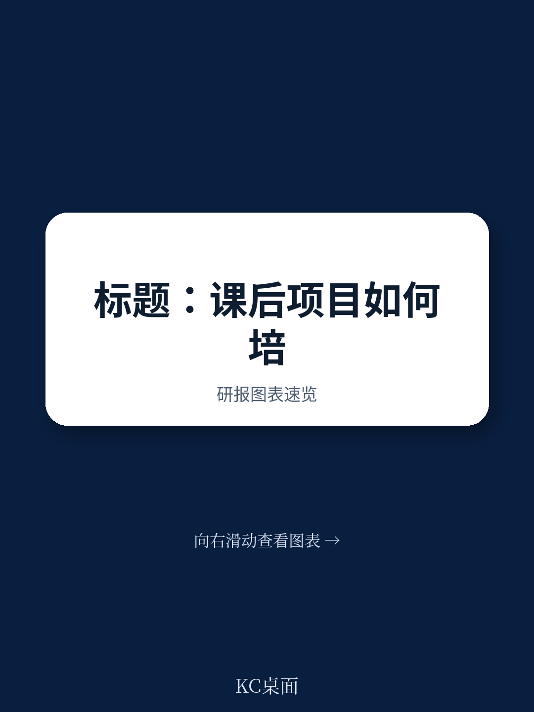
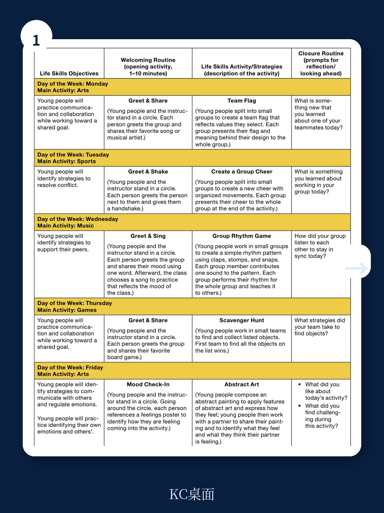
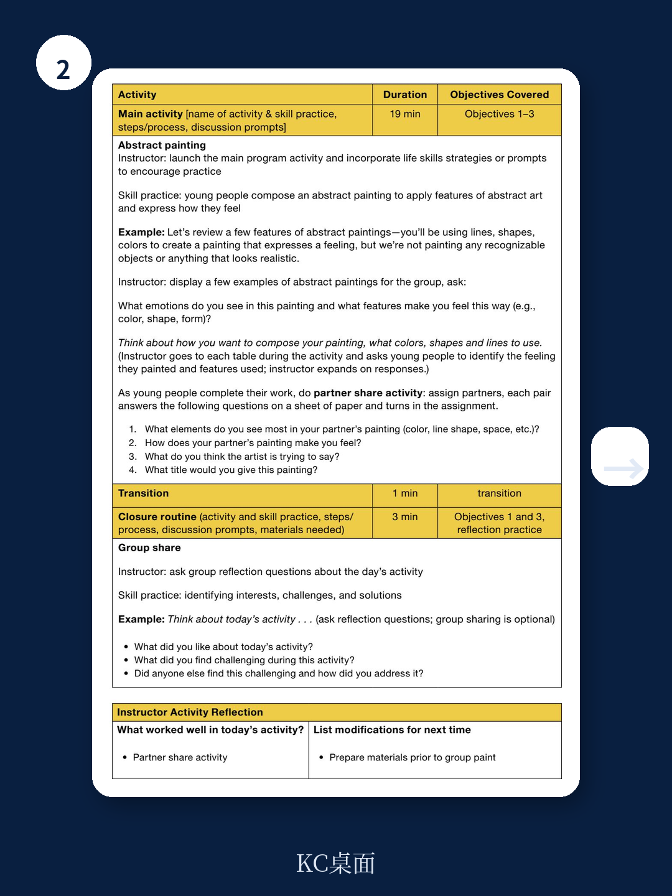

# 兰德公司：课外时间才是年轻人“软技能”的真正战场

当大多数讨论聚焦于学校课堂如何培养孩子的品格与社交能力时，一份来自兰德公司的最新研究报告给出了一个反直觉的判断：真正决定年轻人能否掌握“生活技能”的关键场景，不在校内，而在放学后。

这份长达80余页、由华莱士基金会资助的实践指南，基于对全美六个城市超过100个课后项目的长期追踪，提炼出一个核心主张——课外时间项目（OST）才是年轻人发展自我意识、团队协作、毅力和负责任决策能力的最优场域。而连接这些项目与标准化学校的“中介组织”，正在成为整个教育生态中最被低估的力量。

这不是一份关于“教育公平”的泛泛之谈。兰德公司给出的是一套可复制的操作框架：从建立生活技能框架，到连接循证资源，再到设计专业发展路径。每一个环节都指向同一个问题——我们如何把“软技能”从一个模糊的概念，变成可衡量、可执行、可规模化的事实。

## 1. 中介组织才是“软技能”落地的核心杠杆，而非学校本身

报告开篇即点明一个被长期忽视的结构性事实：课外时间项目提供了学校无法替代的环境——安全、低压力、关系驱动。在课后场景中，年轻人与关爱他们的成年人和同龄人建立关系，在活动中练习自我控制、团队合作、目标设定和坚持完成。这些正是生活技能的核心要素。

但问题在于，大多数课后项目缺乏系统性的能力建设框架。此时，兰德公司定义的“中介组织”就成为了关键角色。这类组织可以是联合劝募协会、基督教青年会、男孩女孩俱乐部，也可以是城市政府部门或州级协调机构。它们不直接面对年轻人，而是连接、协调、赋能那些直接提供服务的课后项目。

> **KC评论：** 这意味着，如果你关注年轻人发展，不要只盯着学校改革。真正值得投入资源的地方，是那些看似边缘的课后项目及其背后的协调网络。这些中介组织正在扮演“能力建设者”的角色，而报告给出了它们如何系统化运作的具体路径。完整报告中对每个城市的案例拆解，值得所有从事教育投资或政策设计的人仔细阅读。

## 2. 建立生活技能框架不是学术练习，而是规模化落地的前提

报告第二章的核心洞察是：任何有效的生活技能干预，都始于一个共同的框架。这不是一个可有可无的“理念对齐”，而是决定后续所有资源能否协同的基础设施。

兰德公司强调，框架的作用在于：为项目人员提供共同语言，确保不同场景下的实践一致性，并让评估成为可能。报告特别指出，框架的定义应当因社区而异——在某个地区被称为“社交情感学习”的概念，在另一个社区可能更适合称为“21世纪技能”或“品格教育”。

> **KC评论：** 许多组织在引入生活技能项目时，容易跳过框架建立这一步，直接采购课程或工具。报告的实际案例表明，这种“先行动后对齐”的做法往往导致资源浪费和效果稀释。框架不是理论，而是战略基础设施。读者若想了解框架建立的具体流程和常见陷阱，必须回到完整报告中的“Planning Your Framework Launch”部分。

## 3. 证据为本的资源不是清单，而是需要中介组织主动“翻译”的桥梁

报告第三章探讨了如何将循证资源连接到课后项目。这里的关键发现是：仅仅提供资源列表远远不够。中介组织需要扮演“翻译者”的角色，帮助一线项目人员理解：这些资源如何在课外时间场景中真正落地。

兰德公司提出了三个具体路径：帮助项目建立营造氛围的日常程序、展示生活技能如何与活动内容连接、提供专门为课后环境设计的直接教学资源。报告特别强调，课后项目的时间限制和人员流动性，要求资源必须“即插即用”，而非需要大量培训才能上手。

这里的隐含逻辑是：资源不是短缺，而是适配度不足。真正的中介组织能力，体现在能否将通用框架转化为一线可执行的工具。

## 4. 专业发展不是一次性培训，而是有目的性的序列设计

第四章关于专业发展的论述，可能是整份报告中最具操作价值的部分。兰德公司指出，许多课后项目失败的原因，不是没有意愿，而是缺乏“有目的性的专业发展序列”。

报告建议中介组织设计一个递进式的成长路径：从基础意识培养，到技能实践，再到持续辅导。这意味着专业发展不能是零散的“一天工作坊”，而应该是持续的、嵌入日常工作的学习过程。

报告还特别讨论了“优质引导”的重要性——即使有最好的资源和框架，如果引导者缺乏能力，效果也会大打折扣。中介组织需要投资于引导者的选拔和培养，而不仅仅是内容开发者。

## 5. 报告尚未完全回答的关键问题：规模化与质量控制的张力

尽管兰德公司的这份指南提供了极其详尽的实践建议，但它也留下了一个尚未完全解决的问题：当课后项目从几十个扩展到几百个时，如何保持框架的一致性和质量？

报告承认，在中介组织覆盖多个城市或州时，框架的本地化与标准化之间存在天然张力。它建议“根据社区语境调整语言”，但没有给出在规模化过程中如何平衡灵活性与一致性的具体机制。

> **KC评论：** 这是所有试图将“软技能”从试点推向规模的组织都会面临的挑战。兰德公司的案例研究提供了丰富的质性证据，但它对量化评估和规模化路径的讨论相对有限。读者如果想深入理解这个张力，完整报告附录中的“Featured Resources”和五个可编辑的规划模板，提供了进一步探索的起点。

---

这份报告的价值，不在于它提出了多么颠覆性的理论，而在于它把“生活技能”从一个被过度使用的概念，变成了一个可操作、可衡量、可复制的系统。对于教育政策制定者、基金会项目官员、以及任何关注年轻人发展的决策者来说，兰德公司给出的不是一个答案，而是一套工具。

但正如报告本身所暗示的，工具的有效性最终取决于使用者的判断力。框架如何本地化？资源如何翻译？专业发展如何持续？这些问题的答案，需要在实践中不断迭代。

如果你也希望加入这场关于“下一代能力建设”的持续讨论，欢迎加入我们的社群。每天，我们的AI agent与人工团队会一起筛选并解读来自国际顶级智库和投行的最新报告，生成10-40页的中文摘要与深度评论。这些内容既方便你快速把握全球市场动态，也适合直接喂给AI做进一步分析。更重要的是，你可以在社群中与其他关注教育与人力资本的投资人和决策者，一起探讨那些报告里没有完全展开的二阶问题。

Personal reading notes and learning share only. Not investment advice.

