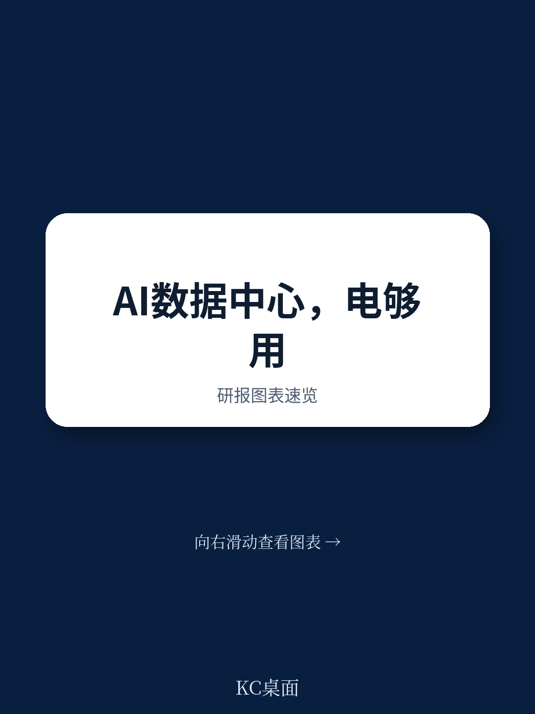
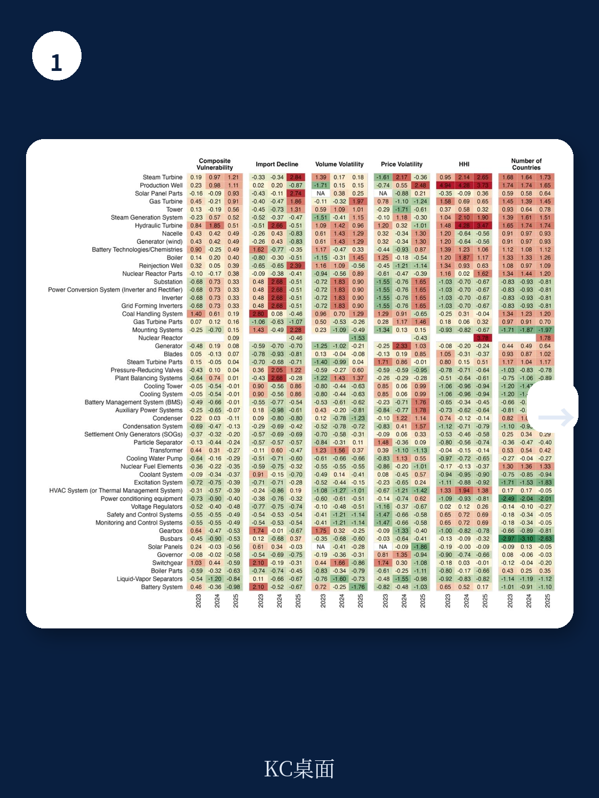
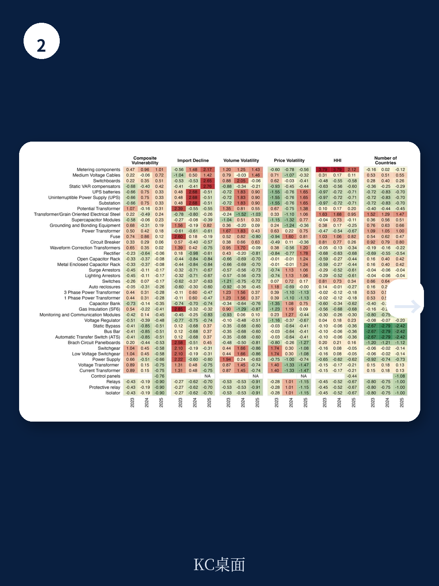

# 兰德公司：AI缺的不是芯片，是电网里的天然气轮机

当全球目光聚焦于英伟达的GPU供应是否充足时，一份来自兰德公司的深度报告揭示了更底层、也更棘手的瓶颈：支撑AI算力扩张的电力基础设施，其供应链远比想象中脆弱。

这份由兰德公司Center on AI, Security, and Technology团队撰写的研究，系统性地评估了美国为满足前沿AI数据中心电力需求所需的关键电气设备供应链。结论并非耸人听闻，但足够令人警觉：到2030年，仅前端计量（FTM）设备的供应链威胁，就可能导致美国电网可用净容量下降7%至31%。而如果数据中心被迫大规模转向离网供电（Bridge Power），对天然气轮机的额外需求将是一个在现有供应链上几乎不可能完成的任务。

这不再是一个“电力够不够用”的宏观叙事，而是一个“设备能不能按时造出来、运到、装好”的工程与供应链问题。对于任何关注AI基础设施投资、科技巨头资本开支方向以及美国再工业化进程的决策者而言，这份报告提供了一个必须纳入决策框架的分析工具。

> **KC评论：** 很多关于AI能源的讨论停留在“可再生能源占比”或“核电重启”的宏大叙事上。兰德这份报告的价值在于，它把问题拆解到了具体设备级别——天然气轮机、变压器、电池——并量化了每种设备供应链脆弱性的来源。读完你会发现，真正的瓶颈可能不是“有没有电”，而是“能不能造出足够多的变压器和轮机来把电送到数据中心”。

## 1. 供应链脆弱性并非均匀分布：发电设备比输电设备更危险

报告的核心贡献之一，是构建了一个复合供应链脆弱性评分体系，并以此对关键电气设备进行排名。结论清晰且具有政策含义：发电侧组件的脆弱性系统性高于输电侧组件。

在2025年的排名中，前端计量（FTM）发电类别里，蒸汽轮机、地热生产井和太阳能板部件位居脆弱性榜首。电池技术及化学体系也显示出较高的复合脆弱性。而在FTM输电类别中，导线电缆和无功功率补偿器风险最高。对于后端计量（BTM）设备，备用电源组件集中出现在排名前列。

这种差异并非偶然。报告指出，这反映了根本性的市场结构差异：输电设备是更成熟、标准化的技术；而发电组件往往涉及专业化、技术快速迭代的系统，生产来源更有限，新制造商进入壁垒更高。

这意味着，任何试图通过“多建输电线路”来缓解AI电力压力的策略，可能忽略了真正的问题所在——发电设备的供应瓶颈才是更硬的约束。

## 2. 离网不是解药：它只是把供应链压力从一种设备转移到另一种

一个反直觉的发现是：当电网容量不足时，数据中心运营商转向离网（Bridge Power）方案，并不能消除供应链约束，反而可能制造新的需求峰值。

报告明确指出，FTM设施所需的天然气轮机，同样是离网桥接电源的核心设备。这意味着，无论数据中心选择并网还是离网，对天然气轮机的竞争性需求只会加剧。

报告量化了这一后果：为填补能源缺口，到2027年需要额外91至123台110MW级或451至611台30MW级的航改轮机；到2030年，这一数字将膨胀至1,582至1,690台110MW级或7,909至8,449台30MW级轮机。

这是一个足以让任何燃气轮机供应商产能规划部门感到压力的数字。全球主要燃气轮机制造商的产能扩张计划是否足以应对？报告没有给出明确答案，但暗示了答案的方向——在当前供应链脆弱性下，这几乎是不可能的。

> **KC评论：** 这是报告中最具政策冲击力的一个测算。它揭示了一个残酷的三角关系：AI算力需求暴增 -> 电网容量不足 -> 转向离网 -> 离网需要轮机 -> 轮机供应链同样脆弱且与并网方案竞争。这实际上意味着，无论数据中心怎么选，供应链都是一个绕不开的硬约束。完整报告中对这个测算的假设条件和敏感性分析值得细看，它们决定了这个结论的可靠程度。

## 3. 脆弱性的根源各不相同：一刀切的政策注定失效

报告的一个重要洞见是，不同设备的供应链脆弱性来源差异显著，这意味着有效的韧性策略必须因“设备”施策。

以变压器为例，其脆弱性的主要来源是“产量波动”（volume volatility）。全球变压器产能近年来经历了剧烈的需求波动，导致制造商投资意愿不足，扩产谨慎。而天然气轮机的脆弱性则主要源于“市场集中度”（market concentration）。全球能够生产大型燃气轮机的厂商屈指可数，任何一家出现供应中断，都会产生系统性影响。电池的脆弱性则介于两者之间，同时受制于原材料供应集中度和产能扩张速度。

这种异质性意味着，简单的“增加库存”或“补贴国内生产”无法解决所有问题。对于市场集中度高的设备，需要战略储备或推动技术标准化以引入更多供应商；对于产量波动大的设备，需要改善需求预测和长期采购合同以稳定制造商预期；对于受原材料约束的设备，则需要推动替代化学体系的商业化。

报告提出的决策框架（Table 6.1）正是基于这种异质性，为政策制定者提供了一个根据脆弱性类型、程度和持续时间来选择干预工具的系统性方法。这个框架本身，对于企业供应链管理团队而言，同样具有参考价值。

## 4. 报告未完全回答的关键问题：谁为供应链韧性买单？

尽管报告提供了详尽的方法论和量化估算，但它留下了一个关键问题悬而未决：供应链韧性的成本由谁承担？

报告建议建立关键电网组件的战略储备，并援引了战略石油储备、国防储备等先例。但电力设备与石油有本质区别：石油是标准化的可储存商品，而变压器、轮机等设备高度定制化，技术迭代快，且储存成本高昂。一个储存了三年的变压器，可能已经因为技术标准更新而无法直接使用。

谁来为这些储备的折旧和仓储成本买单？是纳税人（通过政府预算），还是数据中心的最终用户（通过更高的电价），还是设备制造商（通过补贴产能保留）？报告没有给出答案，但这恰恰是政策落地前必须解决的核心经济问题。

同样，报告建议推动设备标准化以降低市场集中度风险，但标准化可能抑制技术创新和差异化竞争。如何在标准化带来的供应链韧性提升与技术创新活力之间取得平衡，也是一个需要更深入讨论的议题。

> **KC评论：** 这份报告的价值在于，它把问题从“我们是否需要更多电力”推进到了“我们需要什么样的电力基础设施，以及如何确保它被造出来”。但它也暴露了当前研究的边界：我们擅长识别风险，但在设计风险分担机制和激励相容的政策工具方面，还有很长的路要走。完整报告中关于决策框架（Table 6.1）和政策建议的详细讨论，正是为了填补这个空白。

## 5. 对决策者的观察框架：三个需要持续跟踪的指标

基于这份报告的分析框架，决策者可以建立一个持续跟踪AI电力供应链健康状况的观察清单：

**第一，关注天然气轮机的交付周期和订单积压。** 这是整个供应链中最敏感的节点。如果主要制造商（如GE Vernova、西门子能源、三菱重工）的订单积压持续延长，或者交付周期突破历史均值，就意味着AI数据中心的建设进度将面临实质性延迟。

**第二，跟踪变压器的产能利用率与价格指数。** 变压器是电力系统的“通用接口”，其供应紧张程度可以视为整个电网建设节奏的先行指标。Wood Mackenzie已经预测2025年电力变压器将面临30%的供应缺口。如果这个缺口继续扩大，意味着从发电到输电的每一个环节都会被拖慢。

**第三，关注电池化学体系的多元化进展。** 报告特别指出，从高脆弱性的锂化学体系向低脆弱性的钠化学体系转型，是缓解储能供应链压力的有效路径。如果钠离子电池的商业化进程加速，将直接降低AI数据中心的储能成本与供应风险。

这三个指标，比任何宏观电力需求预测都更能反映AI基础设施建设的真实节奏。

---

这份兰德公司的报告，以其一贯的严谨方法论，将AI能源讨论从“够不够用”的模糊争论，推进到了“哪里会卡住、卡多严重、该怎么办”的具体工程与政策分析。它揭示了一个残酷的现实：AI的指数级增长，正在撞上线性扩张的电力基础设施供应链。

对于投资者而言，这意味着AI基础设施投资回报的确定性，可能比市场预期的要低。对于政策制定者而言，这意味着需要从“鼓励建设”转向“系统性管理供应链风险”。对于产业界而言，这意味着与设备供应商建立长期、透明的合作关系，比短期的价格谈判更为重要。

报告没有给出一个简单的答案，但它提供了一个清晰的框架。而这个框架，正是我们继续追问和讨论的起点。

在我们即将发布的完整研报解读中，我们将进一步拆解兰德公司这份报告中的核心模型、敏感性分析细节，以及它对不同投资策略的具体含义。我们会每天由AI agent结合人工review，生成国际投行与顶级智库的中文摘要与深度评论，daily更新，约10-40页，也包含当天最新数据图表合集。这些内容既方便喂给AI进行二次分析，也方便人工快速把握市场动态与供应链风险的全景图。

如果你希望更深入地理解AI能源供应链的每一个脆弱环节，并跟踪最新的政策与产业动态，欢迎加入我们的社群。在那里，我们可以继续讨论：天然气轮机的产能瓶颈何时会真正爆发？变压器标准化能否在五年内落地？以及，谁最终会为这场供应链韧性买单。

Personal reading notes and learning share only. Not investment advice.

