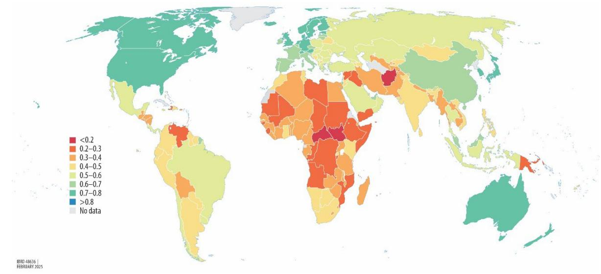
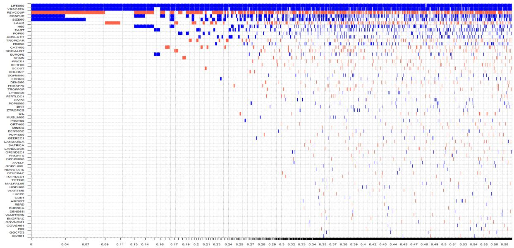
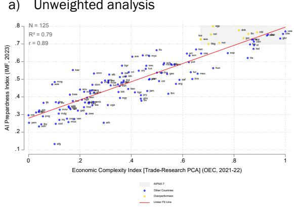
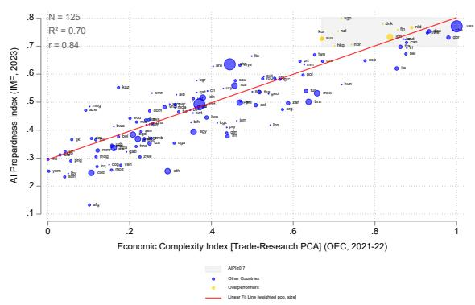
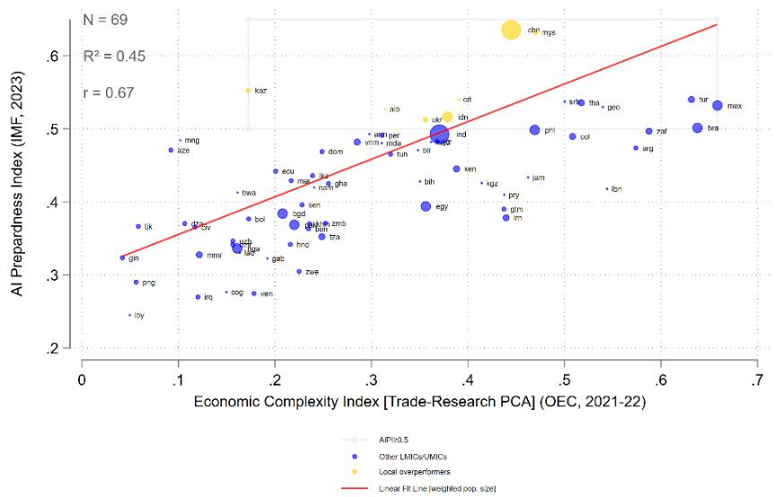
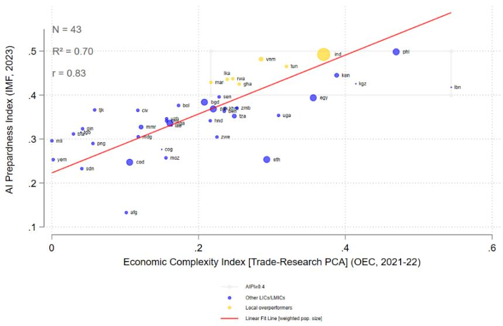
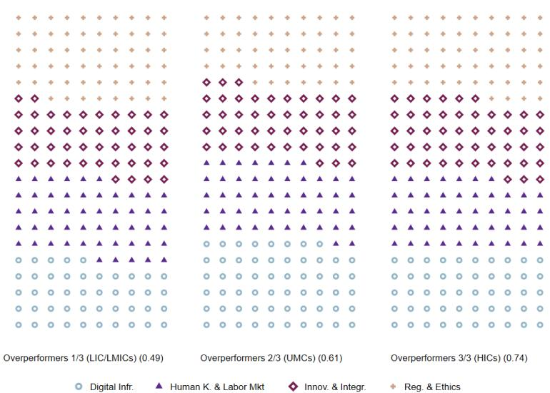
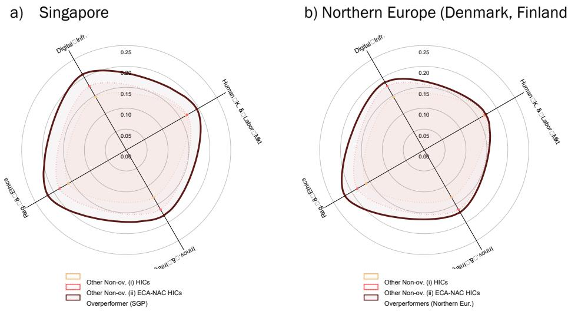
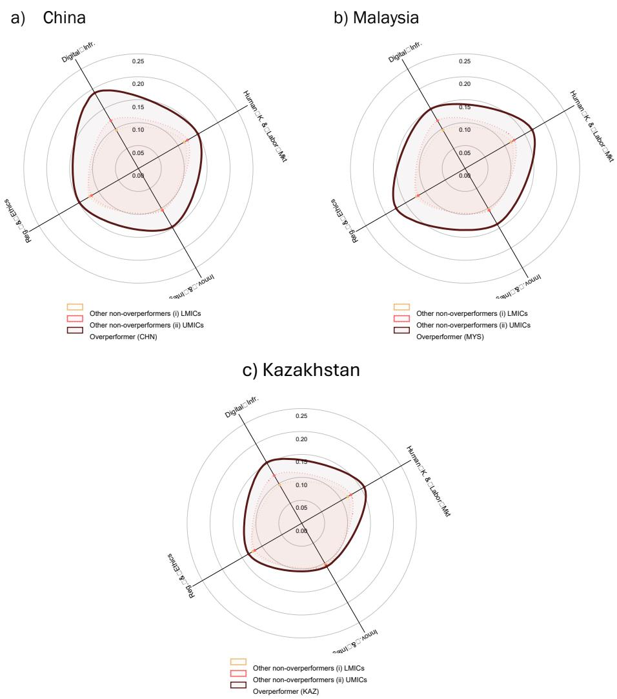
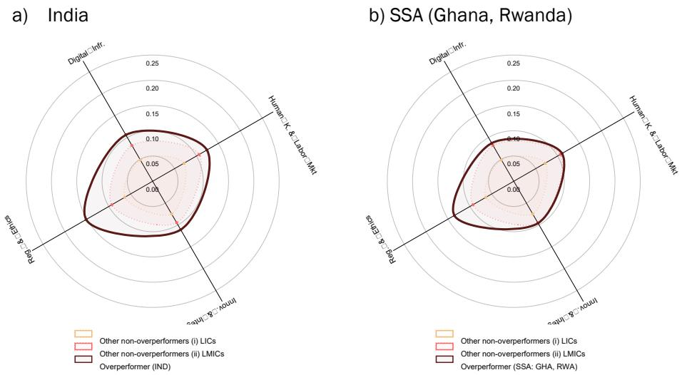

# Beyond the AI Divide

# A Simple Approach to Identifying Global and Local Overperformers in AI Preparedness

Pierre Mandon

POLICY RESEARCH WORKING PAPER 11073

## Abstract

This paper examines global disparities in artificial intelligence preparedness, using the 2023 Artificial Intelligence Preparedness Index developed by the International Monetary Fund alongside the multidimensional Economic Complexity Index. The proposed methodology identifies both global and local overperformers by comparing actual artificial intelligence readiness scores to predictions based on economic complexity, offering a comprehensive assessment of national artificial intelligence capabilities. The findings highlight the varying significance of regulation and ethics frameworks, digital infrastructure, as well as human capital and labor market development in driving artificial intelligence overperformance across different income levels. Through case studies, including Singapore, Northern Europe, Malaysia, Kazakhstan, Ghana, Rwanda, and emerging demographic giants like China and India, the analysis illustrates how even resource-constrained nations can achieve substantial artificial intelligence advancements through strategic investments and coherent policies. The study underscores the need for offering actionable insights to foster peer learning and knowledge-sharing among countries. It concludes with recommendations for improving artificial intelligence preparedness metrics and calls for future research to incorporate cognitive and cultural dimensions into readiness frameworks.

# Beyond the AI Divide:

A Simple Approach to Identifying Global and Local Overperformers in AI Preparedness

Pierre Mandon (World Bank Group) $^{1}$

Keywords: AI Preparedness; Economic Complexity; Peer Learning; Policy Overperformance.
JEL codes: F63; H11; O33; O38.

The transformative potential of artificial intelligence (AI) is reshaping economies, societies, and global competitiveness (Brynjolfsson and Unger, 2023), making its adoption a critical priority for nations worldwide. $^{2}$ The most prominent accounting and consulting firms claim that AI is projected to contribute significantly to the global economy, with estimates ranging from US2.6 trillion to US4.4 trillion annually (Chui et al., 2023), to US15.7 trillion by 2030, driven by productivity and consumption gains (PwC, 2017). Some recent NBER publications $^{3}$ highlight that AI has the potential to significantly boost productivity and economic growth by automating tasks and driving innovation. However, the realization of these gains depends on complementary policies, institutions, and societal adaptation to ensure equitable and sustainable outcomes (Aghion, Jones, and Jones, 2019; Trammell and Korinek, 2023; Acemoglu, 2024). To summarize, AI, and particularly generative AI, has the potential to boost economic growth and productivity but poses risks of labor market disruptions, including premature de-professionalization—where skilled jobs are replaced or diminished before workers can fully capitalize on their expertise—and challenges for developing economies, such as reduced opportunities for high-skill job creation, increased inequality, and difficulties in integrating AI technologies into less-developed industrial and educational systems (Liu, 2024).

Such substantial socio-economic impacts underscore the critical importance for countries to adopt and integrate AI technologies to remain competitive and keep a sovereign public policy. $^{4}$ However, the benefits of AI are not uniformly distributed. The 2023 Government AI Preparedness Index (AIPI) from the International Monetary Fund (IMF) reveals significant disparities in AI preparedness and readiness among nations, highlighting a growing divide between those equipped to leverage AI and those at risk of falling behind (Cazzaniga et al., 2024). $^{5}$ Related to this, Liu and Wang (2024) highlight that middle-income countries exhibit unexpectedly high engagement with generative AI tools relative to their economic scale, while low-income economies are notably underrepresented. In this context, it becomes imperative to identify effective strategies for enhancing a country's AI readiness. This paper aims to explore such strategies, providing a framework for nations to efficiently bolster their AI capabilities and ensure inclusive growth in the evolving digital landscape.

The methodology outlined in this paper is straightforward: it evaluates AI preparedness at the country level using the AIPi and compares it to each country's assessed level of economic complexity. This approach identifies countries that outperform in AI preparedness and readiness relative to their economic complexity for a given income level, aiming to uncover the factors driving their overperformance. Economic complexity refers to the knowledge intensity of an economy, captured by the diversity and sophistication of the goods and services it produces. The Economic Complexity Index (ECI), initially developed by Hidalgo and Hausmann (2009), measures this complexity by analyzing a country's export mix, reflecting its capabilities to produce and export diverse, high-value products. More recently, the ECI expanded to technology, based on patents data, and research, based on research papers (Stojkoski, Koch, and Hidalgo, 2023), since trade data can miss key information about innovative activities.

Using this methodology, we categorize distinct groups of AI overperformers based on their Economic Complexity Index (ECI) and their preparedness and readiness levels. Notably, overperformers are not simply the countries with the highest AIPI scores but those that (i) meet a minimum AIPI threshold and (ii) outperform their predicted scores given their economic complexity. Among high-income economies, global overperformers include Australia, Japan, the Netherlands, New Zealand, three of the four Asian Tigers (Hong Kong SAR, China; Singapore; and the Republic of Korea), and Northern European countries such as Denmark, Finland, and Norway—aligning with findings on the long-term determinants of AIPI detailed later. Upper-middle-income local overperformers comprise Albania, China, Costa Rica, Indonesia, Kazakhstan, Malaysia, and Ukraine. Finally, lower-middle- and low-income local overperformers include Ghana, India, Morocco, Rwanda, Sri Lanka, Tunisia, and Viet Nam.

From this list of AI overperformers, we observe that AI regulation and ethics consistently emerge as top drivers of AI preparedness across income groups, emphasizing the universal importance of institutions in managing AI integration. In low- and lower-middle-income countries (LICs/LMICs), regulation and workforce development dominate, reflecting foundational priorities amid resource constraints, while digital infrastructure and innovation receive less emphasis. For upper-middle-income countries (UMICs), regulation and human capital remain critical, but digital infrastructure becomes increasingly significant as technological capacities expand. High-income countries (HICs) prioritize regulation alongside well-established digital infrastructure and innovation systems, supported by advanced workforce readiness strategies.

This progression illustrates how AI preparedness strategies align with the unique capacities and priorities of each income group, offering tailored policy pathways for countries aiming to enhance their AI readiness. By understanding these patterns, policy makers can adopt fitted strategies to develop their countries' AI ecosystems based on their specific economic and institutional contexts and might effectively bridge the gap in the global AI divide.

The rest of the paper is organized as follows: Section II outlines the data and methodology, Section III presents the main empirical findings, Section IV examines how different categories of countries overperform in AI preparedness, and Section V concludes and opens avenue for future research on AI preparedness.

## II- Data and Methodology

## II.a- Data

The AIPI serves as our main output of interest and is designed by the IMF to assess the readiness of 174 countries to adopt and integrate AI technologies as of 2023 (Cazzaniga et al., 2024). It is built around four core pillars that are deemed essential for smooth AI adoption: (i) digital infrastructure, (ii) human capital and labor market policies, (iii) innovation and economic integration, and (iv) regulation and ethics. Each dimension is calculated by averaging a set of normalized sub-indicators that capture specific aspects relevant to AI readiness, such as internet accessibility (pillar i), STEM education (pillar ii), R&D investment (pillar iii), and adaptable legal frameworks (pillar iv). $^{6}$ The global AIPI index, scaled from 0 to 1, combines these four pillars, each contributing up to 0.25. Higher scores indicate greater AI preparedness, providing stakeholders with a benchmark for identifying areas needing improvement to enhance AI integration across economies. The AIPI focuses on AI adoption preparedness rather than invention leadership—dominated by China and the United States, $^{7}$ as highlighted in the “Draghi Report”—thereby enabling a comparative assessment of preparedness levels across all economies.

The AIP distribution (Figure 1) reveals substantial disparities in AI preparedness and readiness across nations. Research underscores that AI readiness is influenced by a country's economic structure, infrastructure, and policy environment. For example, Liu and Wang (2024) find strong correlations between income level, digital infrastructure, and human capital with AI uptake, with higher-income nations demonstrating more advanced AI ecosystems. $^{8}$ These findings align with growing evidence of a widening divide between countries equipped to leverage AI and those at risk of being left behind (Cazzaniga et al., 2024).

Figure 1: Global distribution of AIPI (2023)  

Source: IMF, AIPI data mapper [https://www.imf.org/external/datamapper/AI\_PI@AIPI/ADVEC/EME/LIC]. Notes: The map is checked and validated by the World Bank Cartography Unit as of February 02, 2025.

A methodological decision in this study is the choice of the recent AIPI from the IMF over the AI Readiness Index developed by the private UK-based consulting firm Oxford Insights. $^{9}$ This decision is primarily driven by the IMF's reputation as a globally recognized multilateral institution and supposed to be accountable, which ensures greater scrutiny and transparency in the development of its products. In contrast, the outputs of private entities like Oxford Insights, though valuable, do not operate within the same level of oversight or accountability. Furthermore, the AI Readiness Index is explicitly designed to assess the extent to which governments are prepared to deploy AI in public service delivery. $^{10}$ In contrast, the AIPI aims to focus on a more comprehensive evaluation of how countries can harness AI capabilities effectively. That said, the choice of index does not significantly impact the broader contribution of this study, as the proposed methodology remains adaptable and replicable.

Employing Bayesian Model Averaging (BMA), we analyze a comprehensive set of 67 historical, political, and economic indicators from growth determinants literature to identify robust predictors of national AIPI. The BMA framework, $^{11}$ as implemented here, enables us to isolate the most robust determinants of AI preparedness from a wide range of potential predictors, as defined and built by Sala-i-Martin, Doppelhofer, and Miller (2004). $^{12}$ Figure 2 illustrates the inclusion probabilities of various covariates in the top 5,000 models. The results highlight that initial conditions—such as life expectancy, higher education levels, and economic size in 1960—along with cultural and geographic influences, including Confucian heritage and an East Asian regional dummy, are positively correlated with AIPI. Conversely, the indicator political instability, captured by the frequency of revolutions and military coups, shows a negative association with AIPI. $^{13}$

Figure 2: Model Inclusion in BMA on AIPI [hyper-g/n prior; random model prior]

  
Source: Author's construction, based on the AIPi and the database from Sala-i-Martin, Doppelhofer, and Miller (2004). The database is available here: https://www.openicpsr.org/openicpsr/project/116024/version/V1/view. Notes: The BMA considers a chain of three million recorded draws with one million burn-ins, by applying the birth-death sampler, using the BMS package from Zeugner and Feldkircher (2015). The figure depicts the results of BMA. The explanatory variables are ranked according to their Posterior Inclusion Probabilities (PIPs) from the highest on the top to the lowest at the bottom. The horizontal axis shows the values of cumulative posterior probability. Blue (darker in greyscale) and red (lighter in greyscale) colors denote the positive and negative sign of the estimated parameter of explanatory variable, respectively. No color means the corresponding explanatory variable is not included in the model.

The results from the BMA align with existing literature on the risks of a growing AI divide, emphasizing that established industrialized nations and East Asian economies, particularly those with Confucian cultural influences (i.e., China; Hong Kong SAR, China; Singapore; Korea; and Taiwan, China), consistently lead in AI preparedness and readiness. Conversely, politically unstable countries face significant challenges in this domain. This finding motivates the approach in the current paper to move beyond these general trends by identifying both global and local AI overperformers relative to the complexity of their economic structures. The goal is to uncover how countries can learn from these champions to effectively enhance their AI policy agendas.

To measure the economic complexity of each country, we consider ECIs for trade, technology, and research available on the Observatory of Economic Complexity (OEC) website. $^{14}$ However, since the ECI for technology, derived from patent data, is available for fewer countries (90 compared to 133 for ECI trade and 130 for ECI research), we perform a Principal Component Analysis (PCA) using only ECI trade and ECI research for 2021–22, the most recent years available. The first principal component, which explains over 50 percent of the variance, is used to represent the multidimensional economic complexity of each country. This component is then normalized and scaled between 0 and 1 across the sample of countries.

As highlighted by Hidalgo (2023), ECI offers valuable insights into a country's productive capabilities by analyzing the diversity and sophistication of its exports, and by extension, its academic research. The paper demonstrates how metrics derived from ECI, such as relatedness and complexity, can guide industrial policies and diversification strategies, positioning ECI as a critical tool for identifying opportunities for structural transformation and economic upgrading. ECI's relevance logically extends to capturing ability to adopt cutting-edge technology, such as AI preparedness and readiness, as it reflects a country's knowledge intensity, innovation capacity, and productive capabilities. Higher ECI scores suggest that economies are better equipped to adopt advanced technologies like AI due to their diversified industrial base, skilled workforce, and robust infrastructure.

Finally, the income levels of countries are classified using the World Bank's Atlas Method, incorporating updated income classifications for FY25 based on 2023 GNI per capita data. $^{15}$ This classification is crucial for distinguishing between global AI overperformers, likely concentrated among HICs, and local overperformers within LICs, LMICs, and UMICs.

## II.b- Methodology

To identify AI global and local overperformers, we adopt a two-step approach: (i) identifying countries with AIPI scores above the weighted median and average scores of their respective income groups, $^{16}$ and (ii) determining those with AIPI scores exceeding their predicted values based on their economic complexity. Formally, a weighted least square approach is considered:

$$
A I P I _ {I} = \alpha + \beta E C I _ {i} + \varepsilon_ {i},\tag{1}
$$

$$
\mathrm{where:} m i n _ {\alpha , \beta} P _ {i} (A I P I _ {i} - (\alpha + \beta E C I _ {i})) ^ {2}\tag{2}
$$

$$
\widehat {A I P I} _ {l} = \widehat {\alpha} + \widehat {\beta} E C I _ {i}\tag{3}
$$

The $\widehat{AIPI}$ index for country i is then predicted by an intercept $\hat{\alpha}$ , and the first component of the ECI on trade and research $\hat{\beta}$ , weighted by the population size of each country. Such weighting is crucial to ensure the real-world representativeness of AI preparedness and economic complexity index scores. $^{17}$ The ex-ante idiosyncratic error term ( $\varepsilon_{i}$ ) or ex-post residual term ( $\widehat{\varepsilon_{i}}$ ) captures respectively the theoretical and actual gap between observed AIP1 and predicted $\widehat{AIPI}$ scores. Accordingly, a country is classified as an overperformer if:

$$
\left\{ \begin{array}{l} A I P I _ {i} > \widehat {A I P I _ {\iota}}, o r \widehat {\varepsilon_ {\iota}} > 0 \\ A I P I _ {i} > A I P I _ {i, t h e s h o l d} \end{array} \right.\tag{4}
$$

where $A_{IPI_{i,threshold}}$ indicates the relevant average and median AICI score for country i for relevant income categories.

## III- Empirical findings

## III.a- Global overperformers

The analysis of the two charts below, one unweighted and the other weighted by population size, reveals important insights about the relationship between the AIPI and the ECI trade, research composite obtained from 125 matching countries at a global level (Figure 3). $^{18}$ A strong relationship emerges between AIPI and ECI, with $R^{2}$ values of 0.79 (unweighted) and 0.70 (weighted), indicating that approximately three-quarters of the variance in AIPI is explained by the variance in ECI, and vice versa. The partial correlations (r) of 0.89 (unweighted) and 0.84 (weighted) further indicate a very high positive linear correlation, and it is statically significant at 0.1 percent. These results highlight the strong (and expected) link between economic complexity and AI preparedness, demonstrating that greater economic sophistication—reflected in the diversity and complexity of exports and research output—significantly enhances a country's capacity to adopt and integrate AI technologies effectively, irrespective of population weighting.

Figure 3: Global relationship between AIPI and ECI

a) Unweighted analysis  

b) Population-weighted analysis  
  
Source: The AIP score for 2023 is obtained from the IMF website [https://www.imf.org/external/datamapper/datasets/AIP] and the ECI on trade and research for 2021-22 are obtained from the OEC website [https://oec.world/en/rankings/eci/hs6/hs96?tab=ranking]. Notes: The first principal component (PCA) of ECI trade and ECI research, with an eigenvalue exceeding 50 percent, is used to capture the multidimensional aspects of national economic complexity. Population size for 2023, used for the weighted analysis, is sourced from the "wbopendata" module in Stata (Azevedo, 2020), with data for Taiwan Province of China obtained from the Statista website. All countries with an observed AIP score exceeding 0.7 (the weighted average and median score for HICs) are highlighted in the grey quadrant. Among these, only countries with AIP scores surpassing their predicted values (above the linear fit line) are marked in yellow and identified as global overperformers.

Both charts highlight the top performers in AI preparedness, concentrated in the northeast quadrants. Consistent with previous BMA findings and the critical role of initial conditions in AI readiness, these top performers are exclusively HICs. To identify global overperformers within this group, we focus on countries with an observed AIPI score exceeding 0.7—corresponding to the population-weighted average and median AIPI scores for HICs (rounded to one decimal)—and surpassing their predicted AIPI score (i.e., above the linear fit line) given their level of trade and research economic complexity. These 10 overperformers, marked in yellow, include Australia, Japan, the Netherlands, New Zealand, three of the four Asian Tigers (Hong Kong SAR, China; Singapore; and Korea), as well as Northern European countries such as Denmark, Finland, and Norway. $^{19}$ Their observed AIPI scores are statistically significantly above their predicted scores (at 0.1 percent threshold). The relative prominence of East Asian economies, particularly the three recently developed Asian Tigers and particularly Singapore—ranked #1 in observed AIPI score for 2023, much above its predicted score—aligns with prior BMA findings, which underscore the significant influence of “Confucian cultural values” on AI preparedness. By contrast, other HICs with strong AIPI scores, such as the United States and Switzerland, do not qualify as overperformers. This is because their observed AIPI scores align with the predictions based on their high levels of economic complexity rather than exceeding them. Additionally, the largest economies, like the United States, may face challenges in scaling top-level AI implementation uniformly across regions (Hunt, Cockburn, and Bessen, 2024).

## III.b- Local overperformers

Figure 4, weighted by population size, demonstrates a positive but more moderate (yet still economically significant) correlation between AIPI and multidimensional economic complexity for the subgroup of 69 LMICs and UMICs, with an $R^{2}$ value of 0.45 and r of 0.67 (statically significant at 0.1 percent). This suggests that while economic complexity likely plays a role in shaping AI preparedness for these countries, policy decisions appear to have a more substantial independent impact on AIPI performance. A likely explanation, explored further in the next section, is that some of these countries, especially among UMICs, have greater macro-fiscal capacity than LICs (Choudhary, Ruch, and Skrok, 2024), enabling them to implement ambitious digital and AI-specific policy agendas. However, these countries often lack a fully developed infrastructure, and specifically digital infrastructure (pillar i of AIPI) and a sufficiently skilled workforce (pillar ii of AIPI), which are still in the process of being built, especially in comparison to HICs (World Bank, 2021; 2024c).

Figure 4: AI preparedness and economic complexity in LMICs and UMICs: Identifying local overperformers  
  
Source: The AIP score for 2023 is obtained from the IMF website [https://www.imf.org/external/datamapper/datasets/AIP] and the ECI on trade and research for 2021-22 are obtained from the OEC website [https://oec.world/en/rankings/eci/hs6/hs96?tab=ranking]. Notes: The first principal component (PCA) of ECI trade and ECI research, with an eigenvalue exceeding 50 percent, is used to capture the multidimensional aspects of national economic complexity. Population size for 2023, used for the weighted analysis, is sourced from the "wbopendata" module in Stata (Azevedo, 2020). All countries with an observed AIP score exceeding 0.5 (the weighted average and median score for the subgroup) are highlighted in the grey quadrant. Among these, only countries with AIP scores surpassing their predicted values (above the linear fit line) are marked in yellow and identified as local overperformers.

Local overperformers are the seven countries with an observed AIPI score exceeding 0.5—equivalent to the population-weighted average and median AIPI scores for the subgroup (rounded to one decimal)—and surpassing their predicted AIPI scores based on their trade and research economic complexity. These overperformers include Albania, China, Costa Rica, Indonesia, Kazakhstan, Malaysia, and Ukraine. Their observed AIPI scores are statistically significantly above their predicted scores (at the 1 percent threshold). Among them, China and Malaysia stand out with the highest observed AIPI scores, reaffirming the strong AI readiness of East Asian countries in addition to industrialized nations. Kazakhstan also exhibits a notably high observed AIPI score relative to its economic complexity—its export basket being heavily reliant on hydrocarbons and mineral products, which limits its ECI trade score (ranked #76 out of 133 countries) and its research economic complexity is low (ranked #121 out of 130 countries) for the 2021–22 period. While the drivers of this overperformance will be examined further in the next section, it is important to emphasize China’s critical role in the global AI landscape. As a co-leader in AI innovation alongside the United States (European Commission, 2024), China has made significant investments in chip supply chains, $^{20}$ and in digital infrastructure (de Seta, 2023) $^{21}$ and, in January 2024, introduced draft guidelines aimed at standardizing the AI sector (PRC MIIT, 2024). $^{22}$ Furthermore, in December 2024, China's Ministry of Industry and Information Technology (MIIT) established an artificial intelligence standardization technical committee. This committee is tasked with developing industry standards in areas such as large language models (LLMs) and AI risk assessment. Lastly, DeepSeek-R1, an open-source reasoning model developed by the Chinese AI startup DeepSeek (or 深度求索) was publicly released on January 20, 2025. A notable aspect of this LLM is its cost-effectiveness. The model was developed with an investment of under US6 million, a fraction of the expenditure—estimated to be multiple billions—reportedly associated with training models like OpenAI's o1. It also relies on inferior chips. $^{23}$ By contrast, certain UMICs with relatively high observed AIP scores, such as Brazil, Mexico and Türkiye, appear to underperform relative to their multidimensional ECI.

Last but not least, Figure 5, also weighted by population size, highlights the relationship between AIPI and multidimensional economic complexity for the subgroup of 43 LICs and LMICs, with an $R^{2}$ value of 0.70 and r of 0.83 (statically significant at 0.1 percent). This stronger correlation aligns with the earlier explanation regarding fiscal buffers. Unlike certain UMICs, these countries, particularly LICs, face severe fiscal constraints, including notably low levels of tax mobilization, which significantly limit their policy options (Choudhary, Ruch, and Skrok, 2024). As a result, they are compelled to prioritize cost-effective digital and AI-specific strategies whenever feasible. This also highlights that, similar to HICs at the opposite end of the spectrum, their AI preparedness is on average very closely linked to their trade and research complexity. However, this relationship functions at a much lower equilibrium, constrained by their critical multidimensional development challenges (UNSD, 2024).

Figure 5: AI preparedness and economic complexity in LICs and LMICs: Identifying local overperformers  
  
Source: The AIP score for 2023 is obtained from the IMF website [https://www.imf.org/external/datamapper/datasets/AIP] and the ECI on trade and research for 2021-22 are obtained from the OEC website [https://oec.world/en/rankings/eci/hs6/hs96?tab=ranking]. Notes: The first principal component (PCA) of ECI trade and ECI research, with an eigenvalue exceeding 50 percent, is used to capture the multidimensional aspects of national economic complexity. Population size for 2023, used for the weighted analysis, is sourced from the "wbopendata" module in Stata (Azevedo, 2020). All countries with an observed AIP score exceeding 0.4 (the weighted average and median score for the subgroup) are highlighted in the grey quadrant. Among these, only countries with AIP scores surpassing their predicted values (above the linear fit line) are marked in yellow and identified as local overperformers.

Nonetheless, seven countries have been identified as overperformers in AI preparedness, with an observed AIP score exceeding 0.4—equivalent to the population-weighted average and median AIP scores for the subgroup (rounded to one decimal): Ghana, India, Morocco, Tunisia, Rwanda, Sri Lanka, and Viet Nam. Their observed AIP scores are statistically significantly above their predicted scores (at the 0.1 percent threshold). While the inclusion of countries like India, Tunisia, and Viet Nam is consistent with their well-established digital agendas, which emphasize leveraging technology for economic growth, institutional improvements, and social development, Rwanda's presence is particularly striking as the only LIC among the overperformers. Rwanda's strong performance can be partly attributed to its high domestic revenue mobilization, supported by effective donor engagement, and a vertically integrated decisional structure that facilitates bold reforms (Todd, 2019; IMF, 2023). $^{24}$ This fiscal capacity, coupled with a high Country Policy and Institutional Assessment (CPIA) score (World Bank, 2024b), so a substantial International Development Association (IDA) envelope allocation, and a business-friendly environment (World Bank 2024a), enables the country to advance an ambitious digital agenda. A notable example of this commitment is Rwanda's Ministry of Information Communication Technology and Innovation (MINICT) co-developing the AI Playbook for Small States in collaboration with Singapore's Ministry of Digital Development and Information under the Digital Forum of Small States initiative (Digital FOSS,

2024). In contrast, a few LMICs with relatively high observed AIP scores, such as Kenya, Kyrgyzstan, Lebanon, and the Philippines, fall short of the performance levels suggested by their multidimensional ECI.

## IV- Decoding overperformance: Insights into AI preparedness success

## IV.a- Unpacking the Pillars of Overperformance across Income Groups

Figure 6 provides a comparative visual representation of the pillars driving AI preparedness across the three groups of overperformers. Each income group exhibits distinct patterns in the emphasis placed on the four pillars of AI preparedness described in Section II: digital infrastructure (pillar i), human capital and labor markets (pillar ii), innovation and integration (pillar iii), and regulation and ethics (pillar iv).

Figure 6: Key pillars driving overperformance across income groups of overperformers  

<table><tr><td rowspan="2"></td><td colspan="3">Overperformers</td></tr><tr><td>LIC/LMICs</td><td>UMICs</td><td>HICs</td></tr><tr><td>Digital Infr.</td><td>22.0%</td><td>28.8%</td><td>24.7%</td></tr><tr><td>Human K. &amp; Labor Mkt</td><td>25.3%</td><td>24.0%</td><td>23.1%</td></tr><tr><td>Innov. &amp; Integr.</td><td>22.6%</td><td>22.7%</td><td>24.3%</td></tr><tr><td>Reg. &amp; Ethics</td><td>30.1%</td><td>24.5%</td><td>27.9%</td></tr></table>

Source: The AIPI score and pillars for 2023 are obtained from the IMF website [https://www.imf.org/external/datamapper/datasets/AIPI]. Notes: Population size for 2023, used for the weighted analysis, is sourced from the “wbopendata” module in Stata (Azevedo, 2020). Weighted average AIPI scores per group in parenthesis. Each symbol represents 0.5 percent of the total AIPI score per group. Digital Infrastructure (pillar i, ○): Investments and capabilities in foundational technologies to support AI readiness. Human Capital & Labor Markets (pillar ii, ▲): Workforce skills and readiness for AI-driven economies. Innovation & Integration (pillar iii, ◇): The ability to innovate and integrate AI into industries and economic activities. Regulation & Ethics (pillar iv, +): Institutional frameworks and ethical guidelines to support responsible AI deployment. The “waffle” package is taken from Naqvi (2024b).

In low-income and lower-middle-income overperformers, regulation and ethics emerge as the most significant driver of AI preparedness, accounting for 30.1 percent of the emphasis (Indian and Sub-

Saharan Africa/SSA models as detailed hereafter). This highlights the critical role of institutions in building trust and establishing frameworks for AI deployment, even amid considerable structural challenges. Following closely is the focus on human capital and labor markets (25.3 percent, Indian model), reflecting the pressing need to develop skills and prepare the workforce for a technology-driven future. However, digital infrastructure (22.0 percent) and innovation and integration (22.6 percent) are less emphasized, likely constrained by limited fiscal resources and technological investment capacity.

For upper-middle-income overperformers, the emphasis shifts, with digital infrastructure taking the lead (28.8 percent, Chinese model), reflecting the growing technological capabilities and infrastructure investments of these nations. Regulation and ethics remain essential at 24.5 percent (Malaysian model), underscoring the importance of robust institutional framework in fostering AI readiness. Human capital and labor markets (24.0 percent, Malaysian and Kazakh model) also maintain a strong focus as these nations work to enhance workforce preparedness. Innovation and integration, however, remain the least prioritized pillar at 22.7 percent, possibly due to structural constraints, though this requires careful interpretation. For instance, China's status may be underestimated in this metric due to the "economic integration" component, which accounts for tariff and non-tariff barriers, as well as restrictions on capital and labor movement. This underscores that robust domestic innovation can thrive even with lower scores in economic integration measures.

High-income overperformers present a more balanced profile, with regulation and ethics taking the lead at 27.9 percent (Singapore and North Europe model), emphasizing the importance of institutional frameworks in managing advanced AI integration. Digital infrastructure follows at 24.7% (Singapore model), reflecting the continuous effort to maintain a technological edge. Innovation and integration (24.3 percent) gain slightly more prominence compared to lower-income groups, while human capital and labor markets (23.1 percent) play a supporting role, as these countries already benefit from well-established systems for education and workforce development.

Across all income levels, regulation and ethics consistently top the list, but the relative emphasis on digital infrastructure, workforce development, and innovation adapts to the specific needs and capacities of each economic group.

IV.b- Selected country cases  
Figure 7: Selected HICs (global) overperformers  
  
Source: The AIPI score and pillars for 2023 are obtained from the IMF website [https://www.imf.org/external/datamapper/datasets/AIPI]. Notes: Population size for 2023, used for the weighted analysis, is sourced from the "wbopendata" module in Stata (Azevedo, 2020). Weighted average AIPI scores per group in parenthesis. Dotted yellow shows the weighted average pillar scores for non-overperformer HICs in Europe, Central Asia, or North America, while dotted red shows the scores for all other non-overperformer HICs. The "spider" package is taken from Naqvi (2024a).

Singapore's AI readiness strategy strongly emphasizes all the AIPi pillars detailed above, and particularly regulation and ethics, as well as the development of robust digital infrastructure and solid human capital and labor market policies to enable responsible and efficient AI adoption (Figure 7a). $^{25}$

Singapore's “Model AI Governance Framework,” developed by the Infocomm Media Development Authority (IMDA) and the Personal Data Protection Commission (PDPC), is a cornerstone of its AI strategy. $^{26}$ This framework provides practical guidelines for deploying AI ethically, with a focus on principles such as transparency, fairness, and accountability. To ensure these principles are actionable, Singapore launched AI Verify, a world-first AI testing framework and toolkit that enables organizations to validate the trustworthiness of their AI systems against regulation standards. These efforts reflect Singapore’s commitment to balancing innovation with public trust, ensuring AI systems are both ethical and effective.

Under its first National AI Strategy or NAIS (Smart Nation Singapore, 2019), about two years before the release of GPT-3.5 by OpenAI, Singapore emphasized heavy investments in digital infrastructure to create a foundation for widespread AI adoption. Key initiatives included expanding high-speed connectivity networks and building state-of-the-art data centers to support AI applications requiring significant computational and data-sharing capabilities. The government also supported the integration of AI across nine priority sectors such as health care, transport, and finance $^{27}$ by creating sector-specific data ecosystems and AI solutions. The orientations are reaffirmed in the NAIS 2.0 (Smart Nation Singapore, 2023). This infrastructure ensures Singapore can effectively deploy AI at scale while maintaining seamless interoperability and efficiency.

Northern Europe (i.e., Denmark, Finland, and Norway), has developed comprehensive AI readiness strategies that prioritize regulation and ethics to ensure responsible AI development and deployment (Figure 7b).

Denmark has established ethical principles for AI, as part of its national strategy to maintain high levels of trust in technology (Danish Gvt, 2019). $^{28}$ These principles reflect “Danish values” and are based on recommendations from an official expert group on data ethics, as well as draft EU ethical guidelines for AI. The framework is designed to guide both public authorities and businesses in the responsible use of AI, ensuring that ethical considerations are integrated into AI development and application.

The “Artificial Intelligence 4.0 Programme” highlights Finland's focus on robust regulation and ethics as central pillars in its AI strategy (MEAEE, 2022). The program emphasizes the importance of balancing digital and green transitions, underpinned by principles of sustainable development and technological sovereignty. By prioritizing ethics and regulation, Finland seeks to establish trust in AI technologies, ensure responsible deployment, and position itself as a frontrunner in creating fair and sustainable AI-driven solutions for global markets. The approach includes collaboration involving public, private, and research sectors to align digital innovation with societal and environmental goals.

The Norwegian “Digitalization Strategy 2024-2030” emphasizes a holistic approach to policy making and ethics in the context of AI readiness and digital transformation (MDPG, 2024). The regulatory framework includes ensuring robust privacy protection, secure digital infrastructure, and transparent use of AI technologies aligned with ethical standards. It also prioritizes fostering public trust through inclusive digital practices and safeguarding against digital vulnerabilities such as fraud and misinformation. The strategy integrates AI into broader societal and economic objectives, reinforcing oversight structures to create equitable opportunities while addressing societal challenges like security, environmental sustainability, and the ethical use of advanced technologies.

Figure 8: Selected UMICs overperformers  
  
Source: The AIPI score and pillars for 2023 are obtained from the IMF website [https://www.imf.org/external/datamapper/datasets/AIPI]. Notes: Population size for 2023, used for the weighted analysis, is sourced from the “wbopendata” module in Stata (Azevedo, 2020). Weighted average AIPI scores per group in parenthesis. Dotted yellow shows the weighted average pillar scores for non-overperforming LMICs and dotted red shows them for non-overperforming UMICs. The “spider” package is taken from Naqvi (2024a).

Spiderweb charts illustrate that China and Malaysia excel in all AIPi pillars relative to the average of non-overperformers within their income group. Notably, China demonstrates exceptional proficiency in digital infrastructure (Figure 8a), whereas Malaysia shows significant strengths in regulation and ethics, as well as human capital and labor market policies (Figure 8b).

As already underlined, China's AI readiness strategy heavily emphasizes the development of robust digital infrastructure as a cornerstone for its technological ambitions (de Seta, 2023). Central to this effort is the “New Generation Artificial Intelligence Development Plan” or AIDP (China State Council, 2017), which outlines a roadmap to position China as a global AI leader by 2030, underscoring the critical role of advanced infrastructure. $^{29}$ Through significant investments, China has built the world's largest 5G network and an extensive fiber-optic broadband system, enabling high-speed connectivity and the Internet of Things (IoT) essential for AI applications across industries. Complementing this, initiatives such as the Digital Silk Road under the Belt and Road Initiative aim to enhance global digital connectivity, extending China's AI influence internationally. To meet its domestic AI computing needs, China's MIIT is advancing plans to bolster computational power and develop indigenous AI technologies by 2027. $^{30}$ Furthermore, China's smart city initiatives, exemplified by projects like City Brain, leverage AI and advanced infrastructure to optimize urban management and services (Zhang et al., 2019). While these efforts have positioned China as a leader in digital infrastructure, challenges such as regional disparities and regulatory complexities remain, prompting continuous efforts to ensure balanced and sustainable development, $^{31}$ as also observed in the United States, for instance (Hunt, Cockburn, and Bessen, 2024).

Malaysia has implemented robust frameworks to ensure responsible AI adoption, aligning with ethical principles. Its “AI Roadmap,” or AI-Rmap (MOSTI, 2021) establishes guidelines to safeguard data privacy, promote transparency, and mitigate risks such as cybersecurity threats. Institutional frameworks like the AI-Catalyst coordinate implementation across government, industry, and academia. These efforts are reinforced by the “National Fourth Industrial (4IR) Policy” (EPU, 2021), which integrates anticipatory and agile regulatory approaches, ensuring that legislation adapts to evolving technological needs.

In September 2024, the country introduced its “National Guidelines on AI Governance & Ethics,” or AIGE (MOSTI, 2024). These guidelines provide a comprehensive framework for stakeholders—including end users, policy makers, and developers—to adopt AI technologies in a safe, transparent, and ethical manner. The AIGE outlines seven fundamental principles designed to promote responsible AI practices across various sectors (e.g., finance, health care, manufacturing). $^{32}$

To further strengthen its AI framework, Malaysia launched the National AI Office (NAIO) in December 2024. The NAIO serves as a centralized agency dedicated to formulating AI policies, addressing regulatory issues, and coordinating strategic planning and research.

Malaysia also emphasizes the development of a skilled workforce to drive AI adoption. The AI-Rmap (MOSTI, 2021) identifies fostering AI talents as a core strategy, focusing on reskilling and upskilling programs and partnerships with universities to cultivate industry-ready talent. Additionally, the National 4IR Policy (EPU, 2021) supports initiatives to match talent pipelines with future economic needs and reduce disparities in access to 4IR opportunities.

The Human Resources Ministry (KESUMA) recently conducted a comprehensive study on the impact of AI, digitalization, and the green economy across 10 strategic sectors. $^{33}$ The findings, released in September 2024, identified over 600,000 jobs requiring skill enhancements and highlighted 60 emerging roles, such as AI engineers and sustainability specialists, essential for advancing Malaysia's digital and green economy. $^{34}$

Finally, Kazakhstan's “National Artificial Intelligence Development Concept for 2024–2029” (MDDIAI, 2024) $^{35}$ outlines a comprehensive strategy to position the country as a regional leader in AI, with a strong emphasis on human capital and labor market policies (Figure 8c). The strategy prioritizes human capital development through AI-focused education, reskilling programs, and widespread AI literacy campaigns, aiming to train 1 million citizens in AI skills. It emphasizes fostering research and innovation, including the development of a LLM to preserve Kazakh cultural and linguistic heritage, alongside investments in robust digital infrastructure. By integrating AI into traditional industries like agriculture and mining and promoting economic modernization, Kazakhstan aims to enhance productivity and global competitiveness while addressing labor market adaptation to technological advancements.

Figure 9: Selected LICs/LMICs overperformers  
  
Source: The AIPI score and pillars for 2023 are obtained from the IMF website [https://www.imf.org/external/datamapper/datasets/AIPI]. Notes: Population size for 2023, used for the weighted analysis, is sourced from the “wbopendata” module in Stata (Azevedo, 2020). Weighted average AIPI scores per group in parenthesis. Dotted yellow shows the weighted average pillar scores for non-overperforming LICs and dotted red shows them for non-overperforming LMICs. The “spider” package is taken from Naqvi (2024a).

India's AI readiness strategy places a significant emphasis on both human capital development and an ethical framework to support its vision of becoming a leader in AI innovation (Figure 9a). On the human capital and labor market front, the IndiaAI Expert Group Report (MeitY, 2023) outlines a comprehensive approach that includes establishing Centers of Excellence (CoEs) for AI research and education, fostering industry-academic partnerships, and promoting entrepreneurship. The report emphasizes large-scale upskilling initiatives, such as the FutureSkills Program, which aims to build a robust AI talent pool through specialized curricula, faculty training, and career pathways for roles like data scientists and AI ethicists. $^{36}$ These interventions target not only IT professionals but also school students, graduates, and non-IT sectors, ensuring widespread AI literacy. Similarly, the National Strategy for Artificial Intelligence (NITI Aayog, 2018) highlights the importance of democratizing AI education through public-private partnerships and certification programs with market value, aiming to position India as an “AI Garage” capable of serving global AI needs. $^{37}$

In terms of regulation and ethics, both documents prioritize the establishment of a robust framework to ensure responsible AI deployment. The NITI Aayog Strategy (NITI Aayog, 2018) advocates for "Responsible AI for All," emphasizing fairness, accountability, and transparency (FAT) as guiding principles. It proposes the creation of Ethics Councils within Centers of Research Excellence (COREs) to monitor compliance with ethical standards. $^{38}$ Data privacy and protection frameworks aligned with international norms are highlighted to mitigate risks related to bias, privacy violations, and security breaches. The IndiaAI Expert Group Report (MeitY, 2023) reinforces this by proposing a secure and transparent India Dataset Platform (IDP) to support ethical data usage while ensuring public trust through anonymization and secure protocols. $^{39}$

Ghana and Rwanda are two SSA countries with notable performance in the regulation and ethics aspect of their AI preparedness strategies, indicating their efforts to develop responsible and inclusive AI ecosystems (Figure 9b). In Ghana's National Artificial Intelligence Strategy (MOCD, 2022), the establishment of a Responsible AI Office (RAI Office) is a key component to coordinate stakeholders, monitor policy implementation, and promote trustworthy AI development. $^{40}$ The strategy emphasizes data privacy, transparency, and the creation of a regulatory framework to mitigate algorithmic bias and ensure secure data sharing. Ghana's approach includes enforcing a robust data framework through initiatives like the Ghana Open Data Initiative (GODI), aimed at supporting responsible AI adoption while safeguarding human rights. $^{41}$ Similarly, Rwanda's National AI Policy (MINICT, 2023) underscores practical ethical guidelines to align AI solutions with human rights and societal values. The policy mandates an annual review of these guidelines by the Rwanda Utilities Regulatory Authority (RURA) and incorporates fairness, transparency, and accountability in public sector applications. $^{42}$ Rwanda also integrates AI ethics into national education and collaborates with global institutions to align with international standards. The establishment of a Responsible AI Office (RAIO) further reinforces oversight and promotes ethical practices. $^{43}$ Both countries' strategies highlight a commitment to using frameworks to balance technological progress with social accountability, ensuring that AI advancements contribute to inclusive and sustainable development.

## V- Discussion

The findings presented here underscore the multifaceted nature of AI preparedness and highlight the importance of tailored strategies that reflect the unique socio-economic and institutional realities of individual nations. The proposed methodology, which combines the AIPi with multidimensional ECI, offers a nuanced framework for assessing national AI readiness relative to economic complexity capacities. By identifying both global and local overperformers, this approach not only captures excellence at the highest level, but also elevates the achievements of countries that have outperformed their predicted potential despite economic constraints.

A recurring theme in global policy discussions on AI is the widening readiness gap between high-income nations and lower-income economies (Cazzaniga et al., 2024). While this AI divide highlights disparities in digital infrastructure, access to data, and human capital, it often overlooks the strides made by local "champions"—countries that, despite resource limitations, have implemented forward-thinking strategies to bolster their AI ecosystems. By shifting the focus from the divide itself to identifying and following the examples set by these overperformers, the proposed methodology reframes the narrative. It encourages policy makers to learn from the experiences of peer nations that have successfully leveraged regulatory coherence, ethical frameworks, and targeted investments to enhance their AI capacities.

For example, Rwanda and Ghana seem to demonstrate that robust regulation and ethics structures, combined with strategic partnerships and capacity-building initiatives, can compensate for limited economic complexity and fiscal constraints. Similarly, Kazakhstan's seemingly ambitious AI literacy and upskilling programs illustrate how countries can focus on workforce transformation to align their economic potential with AI advancements. These examples emphasize the importance of fostering innovation ecosystems that support sustainable AI adoption rather than merely seeking to close the divide.

The identification of both global and local overperformers encourages a peer-learning model where countries facing similar structural challenges can exchange best practices and tailor their AI readiness strategies. By promoting knowledge-sharing and collaboration, the framework proposed here helps transcend income-based categorizations and instead fosters a more comprehensive AI development landscape. This peer-learning approach also supports policy experimentation, enabling nations to test scalable, cost-effective solutions before committing to large-scale deployments. By spotlighting overperformers across income groups, the methodology provides actionable insights into the pillars—whether regulatory, educational, or infrastructural—that drive AI overperformance.

In this study, the methodological decision to use the recent AIPI from the IMF instead of the AI Readiness Index developed by the private UK-based consulting firm Oxford Insights is based on several considerations. The IMF, as a globally recognized multilateral institution, offers a higher level of accountability, scrutiny, and transparency in the development of its products. Conversely, while the contributions of private entities like Oxford Insights are valuable, they do not operate under the same oversight or accountability. Moreover, the AI Readiness Index specifically assesses the preparedness of governments to deploy AI in public service delivery, whereas the AIPI provides a more comprehensive evaluation of how countries can effectively harness AI capabilities. That said, the choice of index does not significantly impact the broader contribution of this study, as the proposed methodology remains adaptable and replicable. The focus is on providing a transparent, data-driven approach that allows policy makers to assess their country's AI preparedness relative to their economic complexity. By prioritizing a clear and simple framework, this study enables comparisons across different datasets and indices, reinforcing the robustness and utility of its findings regardless of the specific AI readiness index used.

Future research could also explore ways to improve the AIPI or similar indexes. For instance, our findings suggest that a significant number of East Asian countries—particularly those influenced by Confucian traditions—tend to overperform in AI preparedness regardless of their income levels, from Viet Nam to Singapore and China. This trend warrants further investigation to determine whether it reflects specific cultural norms and values that prioritize “social harmony” and collective design (Kung and Ma, 2014) that are appropriate for AI readiness, and/or if it is influenced by higher average cognitive abilities in these countries (Lynn and Meisenberg, 2010; Jones, 2011). Notably, collective cognitive abilities have been shown to positively impact economic performance (Madsen, 2016) and could be better captured in future iterations of the AIPI if they prove relevant for readiness in cutting-edge technologies like AI.

## References

Acemoglu, D. 2024. "The Simple Macroeconomics of AI." NBER Working Paper 32487.

Aghion, P., B. F. Jones, and C. I. Jones. 2019. “Artificial Intelligence and Economic Growth.” In The Economics of Artificial Intelligence: An Agenda. Edited by Ajay Agrawal, Joshua Gans & Avi Goldfarb. National Bureau of Economic Research and University of Chicago Press.

Azevedo, J. P. 2020. “WBOPENDATA: Stata Module to Access World Bank Databases.” Statistical Software ComponentsS457234, Boston College Department of Economics. https://github.com/jpazvd/wbopendata?tab=readme-ov-file.

Brynjolfsson, E., and G. Unger. 2023. “The Macroeconomics of Artificial Intelligence.” IMF Finance and Development December:21–25.

Cazzaniga, M., F. Jaumotte, L. Li, G. Melina, A. J. Planton, C. Pizzinelli, E. Rockall, and M. M. Tavares. 2024. “Gen-AI: Artificial Intelligence and the Future of Work.” Staff Discussion Note. International Monetary Fund.

China State Council. 2017. New Generation Artificial Intelligence Development Plan. National State Council.

Choudhary, R., F. U. Ruch, and E. Skrok. 2024. “Taxing for Growth: Revisiting the 15 Percent Threshold.” World Bank Policy Research Working Paper No. 10943.

Chui, M., E. Hazan, R. Roberts, A. Singla, K. Smaje, A. Sukharevsky, L. Yee, and R. Zemmel. 2023. The Economics Potential of Generative AI. The Next Productivity Frontier (June 2023). McKinsey & Company.

Danish Gvt. 2019. National Strategy for Artificial Intelligence (March 2019). Ministry of Finance and Ministry of Industry, Business and Financial Affairs.

Digital FOSS. 2024. AI Playbook for Small States (September 2024). Developed by Singapore's Infocomm Media Development Authority (IMDA) and Rwanda's Ministry of ICT and Innovation. Digital Forum of Small States (Digital FOSS).

Durand, C. 2024. How Silicon Valley Unleashed Techno-Feudalism: The Making of the Digital Economy. Verso Books.

EPU. 2021. National Fourth Industrial Revolution (4IR) Policy. Economic Planning Unit, Prime Minister's Department.

European Commission. 2024. The Future of European Competitiveness Part A | A Competitiveness Strategy for Europe (September 2024). European Commission.

Hidalgo, C. 2023. “The Policy Implications of Economic Complexity.” Research Policy 52 (9): 104863.

Hidalgo, C., and R. Hausmann. 2009. “The Building Blocks of Economic Complexity.” Proceedings of the National Academy of Sciences of the United States of America (PNAS) 106 (26): 10570–75.

Hunt, J., I. M. Cockburn, and J. Bessen. 2024. “Is Distance from Innovation a Barrier to the Adoption to Artificial Intelligence.” NBER Working Paper 33022.

IMF. 2023. Rwanda: Selected Issues. Vol. 2023. IMF Staff Country Reports 423. International Monetary Fund. African Department.

Jones, G. 2011. “National IQ and National Productivity: The Hive Mind Across Asia.” Asian Development Review 28 (1): 51–71.

Kung, J. K-S, and C. Ma. 2014. “Can Cultural Norms Reduce Conflicts? Confucianism and Peasant Rebellions in Qing China.” Journal of Development Economics 111 (November): 132–49.

Liu, Y. 2024. “Generative AI Catalyst for Growth or Harbinger of Premature De-Professionalization?” World Bank Policy Research Working Paper No. 10915.

Liu, Y., and H. Wang. 2024. “Who on Earth Is Using Generative AI?” World Bank Policy Research Working Paper No. 10870.

Lynn, R., and G. Meisenberg. 2010. “National IQs Calculated and Validated for 108 Nations.” Intelligence 38 (4): 353–60.

Madsen, J. 2016. “Barriers to Prosperity: Parasitic and Infectious Diseases, IQ, and Economic Development.” World Development 78 (February): 172–87.

MDDIAI. 2024. Kazakhstan's Concept for the Development of Artificial Intelligence for 2024–2029. Ministry of Digital Development, Innovation, and Aerospace Industry of the Republic of Kazakhstan.

MDPG. 2024. The Digital Norway of the Future. Norwegian Ministry of Digitalisation and Public Governance.

MEAEE. 2022. Artificial Intelligence 4.0 Programme Finland as a Leader in Twin Transition – Final Report. 2022:63. Finnish Ministry of Economic Affairs and Employment Enterprises.

MeitY. 2023. IndiaAI 2023. First Edition, by Expert Group to Ministry of Electronics and Information Technology. Ministry of Electronics and Information Technology, Government of India.

MINICT. 2023. The National AI Policy. Ministry of ICT and Innovation.

MOCD. 2022. Republic of Ghana National Artificial Intelligence Strategy: 2023-2033. Developed by the Ministry of Communications and Digitalisation with Smart Africa, GIZ FAIR Forward, and The Future Society (TFS).

MOSTI. 2021. Malaysia National Artificial Intelligence Roadmap 2021-2025 (AI-Rmap). Malaysian Ministry of Science, Technology and Innovation.

——. 2024. National Guidelines on AI Governance & Ethics. Malaysian Ministry of Science, Technology and Innovation.

Naqvi, A. 2022. “Stata Package \`\`schemepack’.” https://github.com/asjadnaqvi/stata-schemepack.

——. 2024a. “Stata Package \`spider’.” https://github.com/asjadnaqvi/stata-spider.

——. 2024b. “Stata Package \`\` waffle”.” https://github.com/asjadnaqvi/stata-waffle.

NITI Aayog. 2018. National Strategy for AI: #AlforAll (June 2018). National Institution for Transforming India.

PRC MIIT. 2024. “Guidelines for the Development of a Comprehensive System of National Industrial Standards for Artificial Intelligence.” PRC Ministry of Industry and Information Technology (MIIT).

PwC. 2017. Sizing the Prize What's the Real Value of AI for Your Business and How Can You Capitalise? PricewaterhouseCoopers (PwC).

Sala-i-Martin, X., G. Doppelhofer, and R. Miller. 2004. “Determinants of Long-Term Growth: A Bayesian Averaging of Classical Estimates (BACE) Approach.” American Economic Review 94(4): 813–37.

Seta, G. de. 2023. “China’s Digital Infrastructure: Networks, Systems, Standards.” Global Media and China 8 (3): 245–53.

Smart Nation Singapore. 2019. National Artificial Intelligence Strategy. National AI Office under the Smart Nation and Digital Government Office.

——. 2023. NAIS 2.0 National Artificial Intelligence Strategy. AI for the Public Good for Singapore and the World. National AI Office under the Smart Nation and Digital Government Office.

Stojkoski, V., P. Koch, and C. Hidalgo. 2023. “Multidimensional Economic Complexity and Inclusive Green Growth.” Communications Earth & Environment 4:1–12.

Todd, E. 2019. Lineages of Modernity: A History of Humanity from the Stone Age to Homo Americanus. Polity.

Trammell, P., and A. Korinek. 2023. “Economic Growth under Transformative AI.” NBER Working Paper 31815.

UN HLAB-AI. 2024. Governing AI for Humanity. Final Report (September 2024). The United Nations.

UNSD. 2024. The Sustainable Development Goals Report 2024. United Nations Statistics Division.

World Bank. 2021. The Changing Wealth of Nations 2021: Managing Assets for the Future. The World Bank Group.

——. 2024a. Business Ready (B-Ready). World Bank Group.

——. 2024b. CPIA Africa Assessing Africa's Policies and Institutions - Structural Reforms for a Vibrant Private Sector (June 2024). World Bank Group, Office of the Chief Economist for the Africa Region.

——. 2024c. The Changing Wealth of Nations: Revisiting the Measurement of Comprehensive Wealth. The World Bank Group.

Zeugner, S., and M. Feldkircher. 2015. “Bayesian Model Averaging Employing Fixed and Flexible Priors: The BMS Package for R.” Journal of Statistical Software 68 (4).

Zhang, J., X-S Hua, J. Huang, X. Shen, J. Chen, Q. Zhou, Z. Fu, and Y. Zhao. 2019. “City Brain: Practice of Large-Scale Artificial Intelligence in the Real World.” IET Smart Cities 1 (1): 28–37.

## Appendix:

Table A.1: Macro covariates and AI preparedness [BMA]

<table><tr><td rowspan="2"></td><td colspan="4">Post</td></tr><tr><td>Mean</td><td>Post SD</td><td>Cond.Pos.Sign</td><td>PIP</td></tr><tr><td>(Intercept)</td><td>-0.009</td><td>NA</td><td>NA</td><td>1.000</td></tr><tr><td>LIFE060</td><td>0.007</td><td>0.002</td><td>1.000</td><td>0.998</td></tr><tr><td>YRSOPEN</td><td>0.145</td><td>0.049</td><td>1.000</td><td>0.946</td></tr><tr><td>REVCOUP</td><td>-0.091</td><td>0.068</td><td>0.000</td><td>0.690</td></tr><tr><td>CONFUC</td><td>0.119</td><td>0.157</td><td>1.000</td><td>0.403</td></tr><tr><td>SIZE60</td><td>0.006</td><td>0.009</td><td>1.000</td><td>0.360</td></tr><tr><td>LAAM</td><td>-0.013</td><td>0.027</td><td>0.000</td><td>0.200</td></tr><tr><td>H60</td><td>0.117</td><td>0.263</td><td>1.000</td><td>0.188</td></tr><tr><td>EAST</td><td>0.012</td><td>0.035</td><td>1.000</td><td>0.122</td></tr><tr><td>POP60</td><td>0.000</td><td>0.000</td><td>1.000</td><td>0.076</td></tr><tr><td>ABSLATIT</td><td>0.000</td><td>0.000</td><td>1.000</td><td>0.071</td></tr><tr><td>TROPICAR</td><td>-0.004</td><td>0.015</td><td>0.000</td><td>0.071</td></tr><tr><td>PI6090</td><td>0.000</td><td>0.000</td><td>1.000</td><td>0.062</td></tr><tr><td>CATH00</td><td>-0.003</td><td>0.014</td><td>0.000</td><td>0.058</td></tr><tr><td>SOCIALIST</td><td>-0.004</td><td>0.019</td><td>0.000</td><td>0.054</td></tr><tr><td>EUROPE</td><td>0.005</td><td>0.024</td><td>0.989</td><td>0.047</td></tr><tr><td>SPAIN</td><td>-0.002</td><td>0.010</td><td>0.006</td><td>0.033</td></tr><tr><td>IPRICE1</td><td>0.000</td><td>0.000</td><td>0.000</td><td>0.027</td></tr><tr><td>HERF00</td><td>-0.001</td><td>0.011</td><td>0.000</td><td>0.019</td></tr><tr><td>SCOUT</td><td>0.000</td><td>0.004</td><td>0.000</td><td>0.017</td></tr><tr><td>COLONY</td><td>-0.001</td><td>0.006</td><td>0.000</td><td>0.017</td></tr><tr><td>SQPI6090</td><td>0.000</td><td>0.000</td><td>0.981</td><td>0.017</td></tr><tr><td>ECORG</td><td>0.000</td><td>0.001</td><td>1.000</td><td>0.016</td></tr><tr><td>DENS60</td><td>0.000</td><td>0.000</td><td>0.000</td><td>0.015</td></tr><tr><td>PRIEXP70</td><td>-0.001</td><td>0.010</td><td>0.028</td><td>0.015</td></tr><tr><td>TROPPOP</td><td>-0.001</td><td>0.006</td><td>0.009</td><td>0.013</td></tr><tr><td>LT100CR</td><td>0.001</td><td>0.006</td><td>1.000</td><td>0.013</td></tr><tr><td>FERTLDC1</td><td>-0.001</td><td>0.009</td><td>0.000</td><td>0.013</td></tr><tr><td>CIV72</td><td>0.001</td><td>0.007</td><td>0.963</td><td>0.012</td></tr><tr><td>POP6560</td><td>0.008</td><td>0.094</td><td>0.980</td><td>0.012</td></tr><tr><td>BRIT</td><td>0.000</td><td>0.003</td><td>1.000</td><td>0.011</td></tr><tr><td>ZTROPICS</td><td>0.001</td><td>0.007</td><td>1.000</td><td>0.011</td></tr><tr><td>OIL</td><td>0.000</td><td>0.005</td><td>0.000</td><td>0.011</td></tr><tr><td>MUSLIM00</td><td>0.000</td><td>0.005</td><td>0.996</td><td>0.010</td></tr><tr><td>PROT00</td><td>0.000</td><td>0.005</td><td>0.988</td><td>0.010</td></tr><tr><td>ORTH00</td><td>-0.001</td><td>0.013</td><td>0.000</td><td>0.009</td></tr><tr><td>MINING</td><td>-0.001</td><td>0.015</td><td>0.000</td><td>0.009</td></tr><tr><td>DENS65C</td><td>0.000</td><td>0.000</td><td>0.981</td><td>0.008</td></tr><tr><td>POP1560</td><td>-0.001</td><td>0.022</td><td>0.028</td><td>0.008</td></tr><tr><td>GEEREC1</td><td>0.008</td><td>0.121</td><td>0.989</td><td>0.008</td></tr><tr><td>LANDAREA</td><td>0.000</td><td>0.000</td><td>0.274</td><td>0.008</td></tr><tr><td>SAFRICA</td><td>0.000</td><td>0.004</td><td>0.280</td><td>0.008</td></tr><tr><td>LANDLOCK</td><td>0.000</td><td>0.003</td><td>0.000</td><td>0.007</td></tr><tr><td>OPENDEC1</td><td>0.000</td><td>0.004</td><td>0.685</td><td>0.007</td></tr><tr><td>PRIGHTS</td><td>0.000</td><td>0.001</td><td>0.068</td><td>0.006</td></tr><tr><td>DPOP6090</td><td>-0.007</td><td>0.141</td><td>0.017</td><td>0.006</td></tr><tr><td>AVELF</td><td>0.000</td><td>0.003</td><td>0.894</td><td>0.005</td></tr><tr><td>GDPCH60L</td><td>0.000</td><td>0.002</td><td>0.832</td><td>0.005</td></tr><tr><td>NEWSTATE</td><td>0.000</td><td>0.001</td><td>0.654</td><td>0.005</td></tr><tr><td>OTHFRAC</td><td>0.000</td><td>0.002</td><td>0.143</td><td>0.005</td></tr><tr><td>TOT1DEC1</td><td>-0.001</td><td>0.020</td><td>0.005</td><td>0.005</td></tr><tr><td>TOTIND</td><td>0.000</td><td>0.005</td><td>0.579</td><td>0.005</td></tr><tr><td>MALFAL66</td><td>0.000</td><td>0.002</td><td>0.594</td><td>0.005</td></tr><tr><td>HINDU00</td><td>0.000</td><td>0.006</td><td>0.912</td><td>0.005</td></tr><tr><td>WARTIME</td><td>0.000</td><td>0.005</td><td>0.080</td><td>0.005</td></tr><tr><td>LHCPC</td><td>0.000</td><td>0.000</td><td>0.329</td><td>0.004</td></tr><tr><td>GDE1</td><td>0.001</td><td>0.027</td><td>0.932</td><td>0.004</td></tr><tr><td>AIRDIST</td><td>0.000</td><td>0.000</td><td>0.698</td><td>0.004</td></tr><tr><td>RERD</td><td>0.000</td><td>0.000</td><td>0.417</td><td>0.004</td></tr><tr><td>BUDDHA</td><td>0.000</td><td>0.004</td><td>0.167</td><td>0.004</td></tr><tr><td>DENS65I</td><td>0.000</td><td>0.000</td><td>0.571</td><td>0.004</td></tr><tr><td>WARTORN</td><td>0.000</td><td>0.001</td><td>0.186</td><td>0.004</td></tr><tr><td>ENGFRAC</td><td>0.000</td><td>0.002</td><td>0.414</td><td>0.004</td></tr><tr><td>GOVNOM1</td><td>0.000</td><td>0.009</td><td>0.556</td><td>0.004</td></tr><tr><td>GOVSH61</td><td>0.000</td><td>0.008</td><td>0.940</td><td>0.004</td></tr><tr><td>P60</td><td>0.000</td><td>0.004</td><td>0.436</td><td>0.004</td></tr><tr><td>GGCFD3</td><td>0.000</td><td>0.012</td><td>0.805</td><td>0.003</td></tr><tr><td>GVR61</td><td>0.000</td><td>0.007</td><td>0.620</td><td>0.003</td></tr></table>

Source: Author's construction, based on the AIPI and the database from Sala-i-Martin, Doppelhofer, and Miller (2004). The database is available here: https://www.openicpsr.org/openicpsr/project/116024/version/V1/view. Notes: The BMA considers a chain of three million recorded draws with one million burn-ins, by applying the birth-death sampler, using the BMS package from Zeugner and Feldkircher (2015). SD, and PIP stand for standard deviation, and posterior inclusion probability, respectively. Acronyms of covariates are available in Sala-i-Martin, Doppelhofer, and Miller (2004).

Table A.2: Descriptive statistics

<table><tr><td></td><td>Economy</td><td>Region</td><td>Income level</td><td>ECI (multi., scaled)</td><td>AIPI (observed)</td><td>AIPI (predicted)</td><td>Overperformer</td></tr><tr><td>1</td><td>Afghanistan</td><td>South Asia</td><td>LIC</td><td>0.101</td><td>0.133</td><td>0.291</td><td>No</td></tr><tr><td>2</td><td>Albania</td><td>Europe and Central Asia</td><td>UMC</td><td>0.314</td><td>0.527</td><td>0.466</td><td>Yes (Local)</td></tr><tr><td>3</td><td>Algeria</td><td>Middle East and North Africa</td><td>UMC</td><td>0.106</td><td>0.370</td><td>0.358</td><td>No</td></tr><tr><td>4</td><td>Argentina</td><td>Latin America and Caribbean</td><td>UMC</td><td>0.574</td><td>0.474</td><td>0.600</td><td>No</td></tr><tr><td>5</td><td>Armenia</td><td>Europe and Central Asia</td><td>UMC</td><td>0.298</td><td>0.493</td><td>0.457</td><td>No</td></tr><tr><td>6</td><td>Australia</td><td>East Asia and Pacific</td><td>HIC</td><td>0.671</td><td>0.727</td><td>0.636</td><td>Yes (Global)</td></tr><tr><td>7</td><td>Austria</td><td>Europe and Central Asia</td><td>HIC</td><td>0.875</td><td>0.725</td><td>0.739</td><td>No</td></tr><tr><td>8</td><td>Azerbaijan</td><td>Europe and Central Asia</td><td>UMC</td><td>0.092</td><td>0.471</td><td>0.351</td><td>No</td></tr><tr><td>9</td><td>Bangladesh</td><td>South Asia</td><td>LMC</td><td>0.208</td><td>0.384</td><td>0.362</td><td>No</td></tr><tr><td>10</td><td>Belarus</td><td>Europe and Central Asia</td><td>UMC</td><td>0.348</td><td>0.471</td><td>0.483</td><td>No</td></tr><tr><td>11</td><td>Belgium</td><td>Europe and Central Asia</td><td>HIC</td><td>0.876</td><td>0.672</td><td>0.740</td><td>No</td></tr><tr><td>12</td><td>Benin</td><td>Sub-Saharan Africa</td><td>LMC</td><td>0.235</td><td>0.363</td><td>0.380</td><td>No</td></tr><tr><td>13</td><td>Bolivia</td><td>Latin America and Caribbean</td><td>LMC</td><td>0.173</td><td>0.377</td><td>0.339</td><td>No</td></tr><tr><td>14</td><td>Bosnia and Herzegovina</td><td>Europe and Central Asia</td><td>UMC</td><td>0.350</td><td>0.428</td><td>0.484</td><td>No</td></tr><tr><td>15</td><td>Botswana</td><td>Sub-Saharan Africa</td><td>UMC</td><td>0.161</td><td>0.413</td><td>0.387</td><td>No</td></tr><tr><td>16</td><td>Brazil</td><td>Latin America and Caribbean</td><td>UMC</td><td>0.638</td><td>0.501</td><td>0.633</td><td>Yes (Local)</td></tr><tr><td>17</td><td>Bulgaria</td><td>Europe and Central Asia</td><td>HIC</td><td>0.364</td><td>0.577</td><td>0.480</td><td>No</td></tr><tr><td>18</td><td>Burkina Faso</td><td>Sub-Saharan Africa</td><td>LIC</td><td>0.029</td><td>0.312</td><td>0.243</td><td>No</td></tr><tr><td>19</td><td>Cambodia</td><td>East Asia and Pacific</td><td>LMC</td><td>0.236</td><td>0.370</td><td>0.381</td><td>No</td></tr><tr><td>20</td><td>Cameroon</td><td>Sub-Saharan Africa</td><td>LMC</td><td>0.156</td><td>0.341</td><td>0.328</td><td>No</td></tr><tr><td>21</td><td>Canada</td><td>North America</td><td>HIC</td><td>0.877</td><td>0.713</td><td>0.740</td><td>No</td></tr><tr><td>22</td><td>Chile</td><td>Latin America and Caribbean</td><td>HIC</td><td>0.555</td><td>0.586</td><td>0.577</td><td>No</td></tr><tr><td>23</td><td>China</td><td>East Asia and Pacific</td><td>UMC</td><td>0.445</td><td>0.635</td><td>0.533</td><td>No</td></tr><tr><td>24</td><td>Colombia</td><td>Latin America and Caribbean</td><td>UMC</td><td>0.508</td><td>0.489</td><td>0.566</td><td>No</td></tr><tr><td>25</td><td>Congo, Dem. Rep.</td><td>Sub-Saharan Africa</td><td>LIC</td><td>0.106</td><td>0.247</td><td>0.294</td><td>No</td></tr><tr><td>26</td><td>Congo, Rep.</td><td>Sub-Saharan Africa</td><td>LMC</td><td>0.150</td><td>0.277</td><td>0.323</td><td>No</td></tr><tr><td>27</td><td>Costa Rica</td><td>Latin America and Caribbean</td><td>UMC</td><td>0.390</td><td>0.540</td><td>0.505</td><td>Yes (Local)</td></tr><tr><td>28</td><td>Croatia</td><td>Europe and Central Asia</td><td>HIC</td><td>0.558</td><td>0.582</td><td>0.578</td><td>No</td></tr><tr><td>29</td><td>Czechia</td><td>Europe and Central Asia</td><td>HIC</td><td>0.672</td><td>0.646</td><td>0.636</td><td>No</td></tr><tr><td>30</td><td>Denmark</td><td>Europe and Central Asia</td><td>HIC</td><td>0.819</td><td>0.779</td><td>0.711</td><td>Yes (Global)</td></tr><tr><td>31</td><td>Dominican Republic</td><td>Latin America and Caribbean</td><td>UMC</td><td>0.249</td><td>0.469</td><td>0.432</td><td>No</td></tr><tr><td>32</td><td>Ecuador</td><td>Latin America and Caribbean</td><td>UMC</td><td>0.201</td><td>0.442</td><td>0.407</td><td>No</td></tr><tr><td>33</td><td>Egypt, Arab Rep.</td><td>Middle East and North Africa</td><td>LMC</td><td>0.356</td><td>0.394</td><td>0.461</td><td>No</td></tr><tr><td>34</td><td>Ethiopia</td><td>Sub-Saharan Africa</td><td>LIC</td><td>0.293</td><td>0.254</td><td>0.419</td><td>No</td></tr><tr><td>35</td><td>Finland</td><td>Europe and Central Asia</td><td>HIC</td><td>0.856</td><td>0.758</td><td>0.730</td><td>Yes (Global)</td></tr><tr><td>36</td><td>France</td><td>Europe and Central Asia</td><td>HIC</td><td>0.862</td><td>0.698</td><td>0.733</td><td>No</td></tr><tr><td>37</td><td>Gabon</td><td>Sub-Saharan Africa</td><td>UMC</td><td>0.192</td><td>0.323</td><td>0.403</td><td>No</td></tr><tr><td>38</td><td>Georgia</td><td>Europe and Central Asia</td><td>UMC</td><td>0.540</td><td>0.530</td><td>0.582</td><td>Yes (Local)</td></tr><tr><td>39</td><td>Germany</td><td>Europe and Central Asia</td><td>HIC</td><td>0.932</td><td>0.753</td><td>0.768</td><td>No</td></tr><tr><td>40</td><td>Ghana</td><td>Sub-Saharan Africa</td><td>LMC</td><td>0.255</td><td>0.425</td><td>0.394</td><td>Yes (Local)</td></tr><tr><td>41</td><td>Greece</td><td>Europe and Central Asia</td><td>HIC</td><td>0.568</td><td>0.582</td><td>0.583</td><td>No</td></tr><tr><td>42</td><td>Guatemala</td><td>Latin America and Caribbean</td><td>UMC</td><td>0.437</td><td>0.390</td><td>0.529</td><td>No</td></tr><tr><td>43</td><td>Guinea</td><td>Sub-Saharan Africa</td><td>LMC</td><td>0.042</td><td>0.324</td><td>0.251</td><td>No</td></tr><tr><td>44</td><td>Honduras</td><td>Latin America and Caribbean</td><td>LMC</td><td>0.216</td><td>0.342</td><td>0.368</td><td>No</td></tr><tr><td>45</td><td>Hong Kong SAR, China</td><td>East Asia and Pacific</td><td>HIC</td><td>0.701</td><td>0.701</td><td>0.651</td><td>Yes (Global)</td></tr><tr><td>46</td><td>Hungary</td><td>Europe and Central Asia</td><td>HIC</td><td>0.719</td><td>0.563</td><td>0.660</td><td>No</td></tr><tr><td>47</td><td>India</td><td>South Asia</td><td>LMC</td><td>0.370</td><td>0.493</td><td>0.471</td><td>No</td></tr><tr><td>48</td><td>Indonesia</td><td>East Asia and Pacific</td><td>UMC</td><td>0.379</td><td>0.516</td><td>0.499</td><td>Yes (Local)</td></tr><tr><td>49</td><td>Iran, Islamic Rep.</td><td>Middle East and North Africa</td><td>UMC</td><td>0.439</td><td>0.378</td><td>0.530</td><td>No</td></tr><tr><td>50</td><td>Iraq</td><td>Middle East and North Africa</td><td>UMC</td><td>0.120</td><td>0.270</td><td>0.365</td><td>No</td></tr></table>

Table A.2: Descriptive statistics (cont'd)

<table><tr><td></td><td>Country</td><td>Region</td><td>Income level</td><td>ECI (multi., scaled)</td><td>AIPI (observed)</td><td>AIPI (predicted)</td><td>Overperformer</td></tr><tr><td>51</td><td>Ireland</td><td>Europe and Central Asia</td><td>HIC</td><td>0.878</td><td>0.693</td><td>0.741</td><td>No</td></tr><tr><td>52</td><td>Israel</td><td>Middle East and North Africa</td><td>HIC</td><td>0.870</td><td>0.725</td><td>0.737</td><td>No</td></tr><tr><td>53</td><td>Italy</td><td>Europe and Central Asia</td><td>HIC</td><td>0.853</td><td>0.621</td><td>0.728</td><td>No</td></tr><tr><td>54</td><td>Côte d&#x27;lvoire</td><td>Sub-Saharan Africa</td><td>LMC</td><td>0.117</td><td>0.366</td><td>0.302</td><td>No</td></tr><tr><td>55</td><td>Jamaica</td><td>Latin America and Caribbean</td><td>UMC</td><td>0.462</td><td>0.434</td><td>0.542</td><td>No</td></tr><tr><td>56</td><td>Japan</td><td>East Asia and Pacific</td><td>HIC</td><td>0.837</td><td>0.733</td><td>0.720</td><td>Yes (Global)</td></tr><tr><td>57</td><td>Jordan</td><td>Middle East and North Africa</td><td>UMC</td><td>0.368</td><td>0.483</td><td>0.493</td><td>No</td></tr><tr><td>58</td><td>Kazakhstan</td><td>Europe and Central Asia</td><td>UMC</td><td>0.173</td><td>0.552</td><td>0.392</td><td>Yes (Local)</td></tr><tr><td>59</td><td>Kenya</td><td>Sub-Saharan Africa</td><td>LMC</td><td>0.388</td><td>0.445</td><td>0.483</td><td>Yes (Local)</td></tr><tr><td>60</td><td>Kuwait</td><td>Middle East and North Africa</td><td>HIC</td><td>0.355</td><td>0.461</td><td>0.475</td><td>No</td></tr><tr><td>61</td><td>Kyrgyz Republic</td><td>Europe and Central Asia</td><td>LMC</td><td>0.414</td><td>0.426</td><td>0.500</td><td>Yes (Local)</td></tr><tr><td>62</td><td>Lao PDR</td><td>East Asia and Pacific</td><td>LMC</td><td>0.164</td><td>0.330</td><td>0.333</td><td>No</td></tr><tr><td>63</td><td>Lebanon</td><td>Middle East and North Africa</td><td>LMC</td><td>0.544</td><td>0.418</td><td>0.587</td><td>Yes (Local)</td></tr><tr><td>64</td><td>Libya</td><td>Middle East and North Africa</td><td>UMC</td><td>0.050</td><td>0.245</td><td>0.329</td><td>No</td></tr><tr><td>65</td><td>Lithuania</td><td>Europe and Central Asia</td><td>HIC</td><td>0.499</td><td>0.665</td><td>0.548</td><td>No</td></tr><tr><td>66</td><td>Madagascar</td><td>Sub-Saharan Africa</td><td>LIC</td><td>0.118</td><td>0.305</td><td>0.302</td><td>No</td></tr><tr><td>67</td><td>Malaysia</td><td>East Asia and Pacific</td><td>UMC</td><td>0.470</td><td>0.632</td><td>0.546</td><td>No</td></tr><tr><td>68</td><td>Mali</td><td>Sub-Saharan Africa</td><td>LIC</td><td>0.000</td><td>0.296</td><td>0.223</td><td>No</td></tr><tr><td>69</td><td>Mexico</td><td>Latin America and Caribbean</td><td>UMC</td><td>0.658</td><td>0.532</td><td>0.643</td><td>No</td></tr><tr><td>70</td><td>Moldova</td><td>Europe and Central Asia</td><td>UMC</td><td>0.311</td><td>0.481</td><td>0.464</td><td>No</td></tr><tr><td>71</td><td>Mongolia</td><td>East Asia and Pacific</td><td>UMC</td><td>0.102</td><td>0.484</td><td>0.356</td><td>No</td></tr><tr><td>72</td><td>Morocco</td><td>Middle East and North Africa</td><td>LMC</td><td>0.217</td><td>0.429</td><td>0.368</td><td>Yes (Local)</td></tr><tr><td>73</td><td>Mozambique</td><td>Sub-Saharan Africa</td><td>LIC</td><td>0.155</td><td>0.257</td><td>0.327</td><td>No</td></tr><tr><td>74</td><td>Myanmar</td><td>East Asia and Pacific</td><td>LMC</td><td>0.122</td><td>0.327</td><td>0.305</td><td>No</td></tr><tr><td>75</td><td>Namibia</td><td>Sub-Saharan Africa</td><td>UMC</td><td>0.241</td><td>0.420</td><td>0.428</td><td>No</td></tr><tr><td>76</td><td>Netherlands</td><td>Europe and Central Asia</td><td>HIC</td><td>0.890</td><td>0.766</td><td>0.747</td><td>Yes (Global)</td></tr><tr><td>77</td><td>New Zealand</td><td>East Asia and Pacific</td><td>HIC</td><td>0.710</td><td>0.754</td><td>0.655</td><td>Yes (Global)</td></tr><tr><td>78</td><td>Nigeria</td><td>Sub-Saharan Africa</td><td>LMC</td><td>0.161</td><td>0.336</td><td>0.331</td><td>No</td></tr><tr><td>79</td><td>North Macedonia</td><td>Europe and Central Asia</td><td>UMC</td><td>0.362</td><td>0.482</td><td>0.490</td><td>No</td></tr><tr><td>80</td><td>Norway</td><td>Europe and Central Asia</td><td>HIC</td><td>0.742</td><td>0.706</td><td>0.672</td><td>Yes (Global)</td></tr><tr><td>81</td><td>Oman</td><td>Middle East and North Africa</td><td>HIC</td><td>0.255</td><td>0.533</td><td>0.424</td><td>No</td></tr><tr><td>82</td><td>Pakistan</td><td>South Asia</td><td>LMC</td><td>0.220</td><td>0.369</td><td>0.370</td><td>No</td></tr><tr><td>83</td><td>Panama</td><td>Latin America and Caribbean</td><td>HIC</td><td>0.471</td><td>0.501</td><td>0.534</td><td>No</td></tr><tr><td>84</td><td>Papua New Guinea</td><td>East Asia and Pacific</td><td>LMC</td><td>0.056</td><td>0.290</td><td>0.261</td><td>No</td></tr><tr><td>85</td><td>Paraguay</td><td>Latin America and Caribbean</td><td>UMC</td><td>0.437</td><td>0.410</td><td>0.529</td><td>No</td></tr><tr><td>86</td><td>Peru</td><td>Latin America and Caribbean</td><td>UMC</td><td>0.311</td><td>0.491</td><td>0.464</td><td>No</td></tr><tr><td>87</td><td>Philippines</td><td>East Asia and Pacific</td><td>LMC</td><td>0.469</td><td>0.498</td><td>0.537</td><td>No</td></tr><tr><td>88</td><td>Poland</td><td>Europe and Central Asia</td><td>HIC</td><td>0.624</td><td>0.597</td><td>0.612</td><td>No</td></tr><tr><td>89</td><td>Portugal</td><td>Europe and Central Asia</td><td>HIC</td><td>0.617</td><td>0.646</td><td>0.608</td><td>No</td></tr><tr><td>90</td><td>Qatar</td><td>Middle East and North Africa</td><td>HIC</td><td>0.364</td><td>0.535</td><td>0.480</td><td>No</td></tr><tr><td>91</td><td>Romania</td><td>Europe and Central Asia</td><td>HIC</td><td>0.525</td><td>0.584</td><td>0.562</td><td>No</td></tr><tr><td>92</td><td>Russian Federation</td><td>Europe and Central Asia</td><td>HIC</td><td>0.456</td><td>0.559</td><td>0.527</td><td>No</td></tr><tr><td>93</td><td>Rwanda</td><td>Sub-Saharan Africa</td><td>LIC</td><td>0.246</td><td>0.437</td><td>0.388</td><td>Yes (Local)</td></tr><tr><td>94</td><td>Saudi Arabia</td><td>Middle East and North Africa</td><td>HIC</td><td>0.459</td><td>0.577</td><td>0.528</td><td>No</td></tr><tr><td>95</td><td>Senegal</td><td>Sub-Saharan Africa</td><td>LMC</td><td>0.228</td><td>0.396</td><td>0.376</td><td>No</td></tr><tr><td>96</td><td>Serbia</td><td>Europe and Central Asia</td><td>UMC</td><td>0.500</td><td>0.537</td><td>0.561</td><td>No</td></tr><tr><td>97</td><td>Singapore</td><td>East Asia and Pacific</td><td>HIC</td><td>0.718</td><td>0.801</td><td>0.660</td><td>Yes (Global)</td></tr><tr><td>98</td><td>Slovak Republic</td><td>Europe and Central Asia</td><td>HIC</td><td>0.528</td><td>0.592</td><td>0.563</td><td>No</td></tr><tr><td>99</td><td>Slovenia</td><td>Europe and Central Asia</td><td>HIC</td><td>0.627</td><td>0.634</td><td>0.613</td><td>No</td></tr><tr><td>100</td><td>South Africa</td><td>Sub-Saharan Africa</td><td>UMC</td><td>0.588</td><td>0.497</td><td>0.607</td><td>No</td></tr></table>

Table A.2: Descriptive statistics (end)

<table><tr><td></td><td>Country</td><td>Region</td><td>Income level</td><td>ECI (multi., scaled)</td><td>AIPI (observed)</td><td>AIPI (predicted)</td><td>Overperformer</td></tr><tr><td>101</td><td>Korea, Rep.</td><td>East Asia and Pacific</td><td>HIC</td><td>0.670</td><td>0.727</td><td>0.635</td><td>Yes (Global)</td></tr><tr><td>102</td><td>Spain</td><td>Europe and Central Asia</td><td>HIC</td><td>0.776</td><td>0.648</td><td>0.689</td><td>No</td></tr><tr><td>103</td><td>Sri Lanka</td><td>South Asia</td><td>LMC</td><td>0.239</td><td>0.436</td><td>0.383</td><td>Yes (Local)</td></tr><tr><td>104</td><td>Sudan</td><td>Sub-Saharan Africa</td><td>LIC</td><td>0.041</td><td>0.233</td><td>0.251</td><td>No</td></tr><tr><td>105</td><td>Sweden</td><td>Europe and Central Asia</td><td>HIC</td><td>0.928</td><td>0.748</td><td>0.766</td><td>No</td></tr><tr><td>106</td><td>Switzerland</td><td>Europe and Central Asia</td><td>HIC</td><td>0.991</td><td>0.757</td><td>0.798</td><td>No</td></tr><tr><td>107</td><td>Taiwan, China</td><td>East Asia and Pacific</td><td>HIC</td><td>0.652</td><td>0.669</td><td>0.626</td><td>No</td></tr><tr><td>108</td><td>Tajikistan</td><td>Europe and Central Asia</td><td>LMC</td><td>0.058</td><td>0.366</td><td>0.262</td><td>No</td></tr><tr><td>109</td><td>Tanzania</td><td>Sub-Saharan Africa</td><td>LMC</td><td>0.249</td><td>0.352</td><td>0.390</td><td>No</td></tr><tr><td>110</td><td>Thailand</td><td>East Asia and Pacific</td><td>UMC</td><td>0.517</td><td>0.536</td><td>0.570</td><td>No</td></tr><tr><td>111</td><td>Togo</td><td>Sub-Saharan Africa</td><td>LIC</td><td>0.039</td><td>0.316</td><td>0.250</td><td>No</td></tr><tr><td>112</td><td>Tunisia</td><td>Middle East and North Africa</td><td>LMC</td><td>0.320</td><td>0.465</td><td>0.437</td><td>Yes (Local)</td></tr><tr><td>113</td><td>Türkiye</td><td>Europe and Central Asia</td><td>UMC</td><td>0.632</td><td>0.540</td><td>0.629</td><td>No</td></tr><tr><td>114</td><td>Uganda</td><td>Sub-Saharan Africa</td><td>LIC</td><td>0.309</td><td>0.354</td><td>0.430</td><td>No</td></tr><tr><td>115</td><td>Ukraine</td><td>Europe and Central Asia</td><td>UMC</td><td>0.356</td><td>0.512</td><td>0.487</td><td>Yes (Local)</td></tr><tr><td>116</td><td>United Arab Emirates</td><td>Middle East and North Africa</td><td>HIC</td><td>0.404</td><td>0.628</td><td>0.500</td><td>No</td></tr><tr><td>117</td><td>United Kingdom</td><td>Europe and Central Asia</td><td>HIC</td><td>0.980</td><td>0.731</td><td>0.792</td><td>No</td></tr><tr><td>118</td><td>United States</td><td>North America</td><td>HIC</td><td>1.000</td><td>0.771</td><td>0.803</td><td>No</td></tr><tr><td>119</td><td>Uruguay</td><td>Latin America and Caribbean</td><td>HIC</td><td>0.429</td><td>0.549</td><td>0.513</td><td>No</td></tr><tr><td>120</td><td>Uzbekistan</td><td>Europe and Central Asia</td><td>LMC</td><td>0.156</td><td>0.346</td><td>0.328</td><td>No</td></tr><tr><td>121</td><td>Venezuela, RB</td><td>Latin America and Caribbean</td><td>UMC</td><td>0.178</td><td>0.275</td><td>0.395</td><td>No</td></tr><tr><td>122</td><td>Viet Nam</td><td>East Asia and Pacific</td><td>LMC</td><td>0.285</td><td>0.482</td><td>0.414</td><td>Yes (Local)</td></tr><tr><td>123</td><td>Yemen, Rep.</td><td>Middle East and North Africa</td><td>LIC</td><td>0.002</td><td>0.253</td><td>0.225</td><td>No</td></tr><tr><td>124</td><td>Zambia</td><td>Sub-Saharan Africa</td><td>LMC</td><td>0.252</td><td>0.371</td><td>0.392</td><td>No</td></tr><tr><td>125</td><td>Zimbabwe</td><td>Sub-Saharan Africa</td><td>LMC</td><td>0.225</td><td>0.305</td><td>0.374</td><td>No</td></tr></table>

Source: The AIPI score for 2023 is obtained from the IMF website [https://www.imf.org/external/datamapper/datasets/AIPI] and the ECI on trade and research for 2021-22 are obtained from the OEC website [https://oec.world/en/rankings/eci/hs6/hs96?tab=ranking]. Notes: The first PCA of ECI trade and ECI research, with an eigenvalue exceeding 50 percent (normalized and scaled between 0 and 1 across the sample of countries) is reported here. Global and local overperformers are identified through a two-step approach: (i) comparing AIPI scores to the weighted median and average of income groups, and (ii) identifying scores exceeding predicted values based on economic complexity. Population size for 2023, used for the weighted analysis to obtain the AIPI predicted score, is sourced from the “wbopendata” module in Stata (Azevedo, 2020), with data for Taiwan Province of China obtained from the Statista website. For more details, see the \`\` Data and Methodology" and \`\` Empirical Findings" sections.