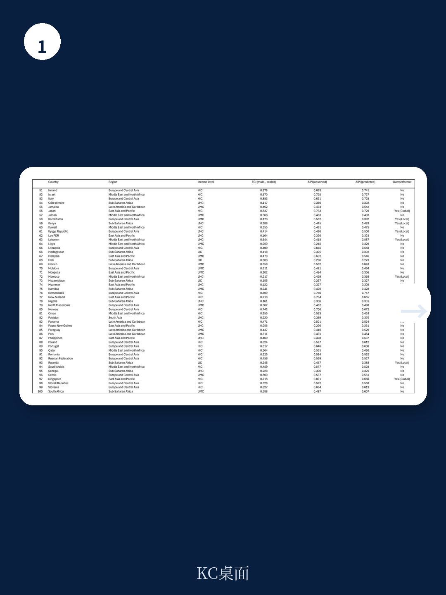
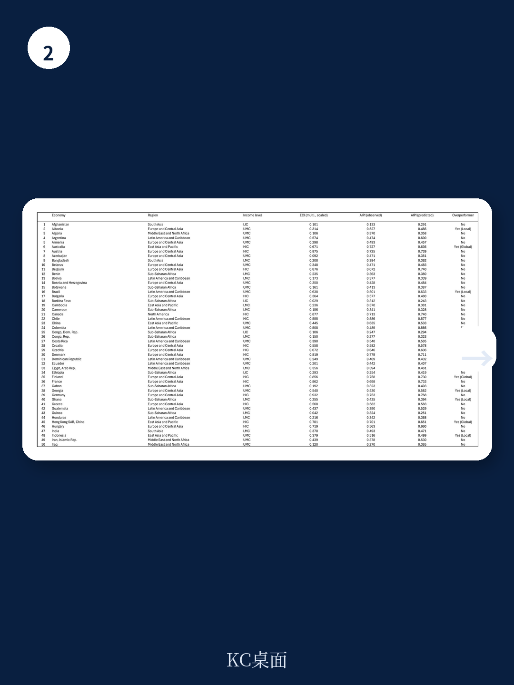

# 世界银行：AI准备度差距的真正分水岭，不在算力而在经济复杂度

全球AI竞赛的叙事，长期被两个极端主导。一端是中美两国在基础模型、算力集群和前沿人才上的军备竞赛；另一端是大量发展中国家连基本数字基础设施都尚未完成，似乎注定被新一轮技术鸿沟吞噬。但世界银行最新发布的工作论文《超越AI鸿沟》给出了一个更具政策操作性的判断：决定一个国家能否在AI时代“超常发挥”的关键变量，不是它有多少GPU，而是其经济复杂度——即经济体所拥有的知识、技能和生产能力的多样性与精密程度。

这份报告利用国际货币基金组织2023年发布的AI准备度指数，结合经济复杂度指数，构建了一套筛选“全球和本地AI超常表现者”的简洁方法。研究覆盖125个国家，发现经济复杂度可以解释约70%-80%的AI准备度差异。但真正有价值的不是这个相关系数，而是那些落在回归线上方的国家——它们以低于预期的经济复杂度，实现了高于预期的AI准备度。这些国家的经验，才是全球政策制定者最应该学习的样本。

## 1. 经济复杂度是AI准备度的最强单一预测因子，但超常表现者揭示的才是关键

报告的核心方法论并不复杂。研究者将每个国家的AI准备度指数对经济复杂度指数做加权回归，然后识别出那些实际得分显著高于预测得分的国家。R方值高达0.70-0.79，意味着经济复杂度几乎可以解释AI准备度四分之三的跨国差异。

这个发现本身并不令人意外。一个能够生产复杂电子产品、拥有深厚研发积累的经济体，自然更容易部署和吸收AI技术。但报告的价值在于追问：为什么有些国家能够“超常发挥”？它们做对了什么，让AI准备度超过了经济复杂度的“天花板”？

答案指向一个被广泛讨论但较少被量化检验的维度：制度质量。通过贝叶斯模型平均法分析67个历史、政治和经济指标，报告发现，1960年的预期寿命、高等教育水平和经济规模，以及儒家文化传统和东亚区域特征，都是AI准备度的显著正向预测因子。而政治不稳定——用革命和军事政变的频率来衡量——则是显著的负向因子。

> **KC评论：** 这意味着AI准备度在很大程度上是“历史遗产”的函数。那些在半个世纪前就建立了良好教育体系和稳定制度的国家，今天在AI赛道上天然领先。但报告真正想说的是，历史不是宿命——超常表现者证明了，通过正确的政策选择，后发国家可以打破历史决定论。完整报告中包含详细的贝叶斯模型结果图表，展示了哪些历史变量对AI准备度有最强的预测力，这些数据对于理解各国AI差距的深层根源至关重要。

## 2. 全球超常表现者集中在东亚和北欧，但它们的成功路径并不相同

报告识别出的全球超常表现者——即在高收入国家中，AI准备度显著高于经济复杂度预测值的国家——包括澳大利亚、日本、荷兰、新西兰、三个亚洲四小龙成员（香港、新加坡、韩国），以及丹麦、芬兰、挪威等北欧国家。

这些国家的一个共同特征是“制度优势”。报告特别强调，在所有收入组别中，AI监管和伦理框架始终是AI准备度的首要驱动力。这意味着，即使没有最先进的技术产业，一个能够制定清晰、可执行的AI治理规则的国家，也能在准备度上获得加分。

但东亚和北欧的路径存在微妙差异。东亚超常表现者的优势更多体现在数字基础设施和创新整合维度，这与它们强大的制造业基础和出口导向型经济结构一脉相承。北欧国家的优势则更多来自人力资本和劳动力市场政策——终身学习体系、强大的社会保障网络和高度数字化的公共服务，使得劳动力对技术变革的适应能力更强。

> **KC评论：** 这对中国产业政策制定者有一个直接启示：如果目标是“AI准备度”而非“AI发明领先”，那么监管框架的完善和人力资本的再培训，可能比单纯追逐算力规模更有效。报告中的图3展示了加权和未加权两种情形下的AIPI-ECI散点图，清晰地标出了每个超常表现者的位置，值得仔细研读。

## 3. 中等收入国家的超常表现者揭示了一条“监管先行”的追赶路径

报告最有趣的部分，也许是对中等收入和低收入国家中超常表现者的分析。中国、马来西亚、哈萨克斯坦、印度尼西亚、哥斯达黎加和乌克兰被列为中高收入组别的本地超常表现者；印度、越南、加纳、卢旺达、摩洛哥、突尼斯和斯里兰卡则在中低收入和低收入组别中表现突出。

这些国家的共同特点是：在资源约束下，它们优先选择了“低成本高杠杆”的领域。对于低收入国家而言，AI监管和劳动力市场政策是驱动超常表现的最主要支柱，而数字基础设施和创新的权重相对较低。这看似反直觉——一个连宽带都没普及的国家，为什么要先制定AI监管规则？

但报告的逻辑是：监管框架是“软件”，数字基础设施是“硬件”。在硬件投资需要大量资金且见效周期长的情况下，先建立清晰的法律和伦理框架，可以吸引国际合作伙伴和投资，同时为未来的硬件建设铺平道路。卢旺达和加纳的案例表明，即使经济复杂度很低，通过聚焦治理改革和人力资本建设，也能在AI准备度上取得显著进步。

对于中国而言，这个发现尤其值得关注。中国在中高收入组别中被列为超常表现者，这意味着其AI准备度已经超过了经济复杂度的预测水平。但报告同时指出，随着收入水平提升，数字基础设施的重要性会逐渐超过监管和人力资本。中国当前在AI基础设施上的大规模投入，恰恰符合这一规律——但报告也隐含了一个提醒：基础设施投入的边际收益终将递减，届时制度质量和劳动力适应能力将重新成为瓶颈。

## 4. 报告未完全回答的关键问题：AI准备度能否转化为实际增长

这份报告在方法论上非常严谨，但它留下了一个关键问题没有回答：AI准备度指数高，是否意味着一个国家能够从AI中实际获得更高的经济增长和生产力提升？

报告承认，AIPI衡量的是“采用准备度”而非“发明领导力”。中美两国在AI发明上遥遥领先，但在准备度指数上，美国（0.771）和中国（0.588）并非全球最高——新加坡（0.718）、韩国（0.727）、芬兰（0.724）等国家得分相近甚至更高。这引出一个尖锐的问题：如果一个国家AI准备度很高，但缺乏自己的大模型和算力基础设施，它能否真正享受到AI红利？

报告引用了Liu（2024）的研究，指出AI可能带来“过早去职业化”风险——高技能岗位被AI替代的速度，超过了工人能够重新掌握新技能的速度。对于发展中国家来说，这意味着即使AI准备度很高，如果不能同步推进产业升级和就业转型，也可能面临“准备好了但没有机会”的困境。

> **KC评论：** 这是整份报告最值得追问的伏笔。报告给出了一个优秀的诊断框架——哪些国家在AI准备上做得比预期好——但没有给出预后：这些准备能否转化为增长。完整报告中的案例研究部分，对新加坡、马来西亚、加纳等国的具体政策做了更详细的拆解，这些案例为回答“准备度如何转化为增长”提供了线索，但最终的因果证据仍需后续研究。

## 5. 对决策者的观察框架：从“AI军备竞赛”转向“AI能力拼图”

综合报告的核心发现，可以提炼出一个更实用的观察框架。对于投资者和产业决策者而言，评估一个国家的AI潜力，不应只看它有多少算力或大模型，而应该关注以下四个维度的“拼图”是否完整：

第一，数字基础设施是底座，但边际收益递减。宽带覆盖率、数据中心容量和云计算渗透率是必要条件，但一旦超过某个阈值，进一步投资对AI准备度的提升效果会下降。

第二，人力资本和劳动力市场政策是中期变量。STEM教育质量、终身学习体系、劳动力流动性和社会保障网络，决定了技术和人能否有效结合。北欧国家的经验表明，这部分投入的回报周期较长，但可持续性更强。

第三，创新和经济整合是杠杆。研发投入、产学研合作、国际技术贸易和外商直接投资，决定了AI技术能否从实验室走向产业。东亚超常表现者的优势在此。

第四，监管和伦理框架是准入门槛。数据隐私保护、算法问责、知识产权保护和跨境数据流动规则，决定了AI生态系统能否健康运转。报告发现，这是所有收入组别中最稳定的正向驱动因素。

对于关注全球AI投资布局的读者而言，这个框架意味着：不要被算力竞赛的叙事所迷惑。那些经济复杂度中等但AI准备度超常的国家——如马来西亚、越南、印度——可能提供了更好的风险调整后回报。而一些资源丰富但制度薄弱的国家，即使购买了再多的GPU，也可能因为缺乏配套能力而无法有效利用。

报告在结论部分呼吁将认知和文化维度纳入未来的AI准备度研究，这暗示了当前框架的局限。AI准备度不仅仅是技术问题，还是一个社会吸收能力的问题——而这恰恰是量化研究最难捕捉的部分。

---

这份世界银行报告提供了一个难得的“反叙事”视角：在全民关注“谁在发明AI”的时代，它提醒我们，“谁准备好使用AI”可能是一个更具政策可操作性的问题。报告中的完整数据表格和案例研究，包含了每个国家的AIPI得分、ECI得分和超常表现分类，这些原始数据对于进行更深入的国家比较和投资研判具有不可替代的价值。

如果你想获取完整报告的中文解读、原始数据表格，以及每日更新的国际投行研报摘要和KC评论，欢迎加入我们的社群。我们每天由AI agent和人工review生成约10-40页的国际投行中文摘要，涵盖高盛、摩根士丹利、摩根大通、瑞银、花旗等机构的最新报告，既方便喂给AI分析，也方便人工快速把握市场动态。这些材料可以帮助你建立自己的“AI能力拼图”分析框架。

Personal reading notes and learning share only. Not investment advice.

