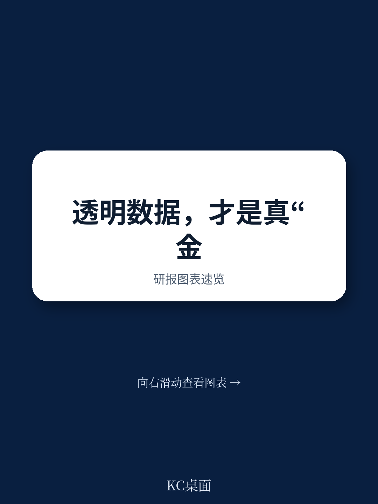
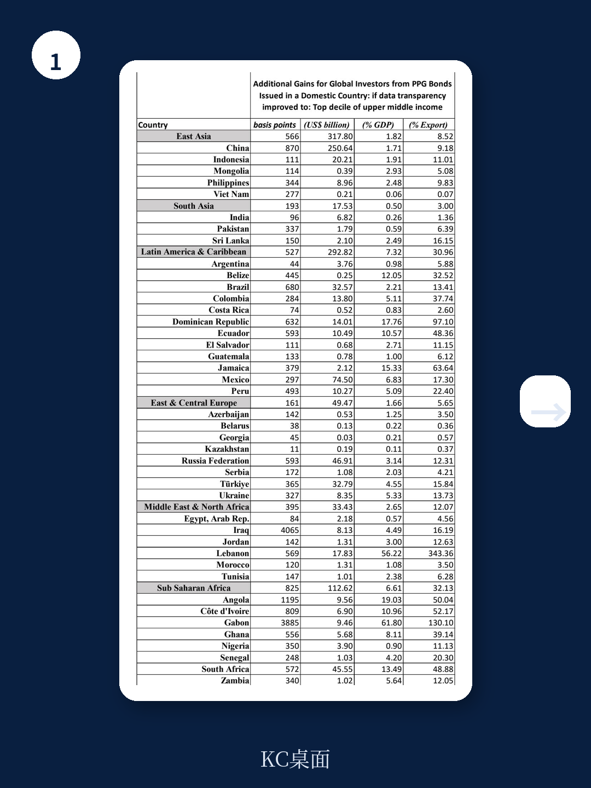
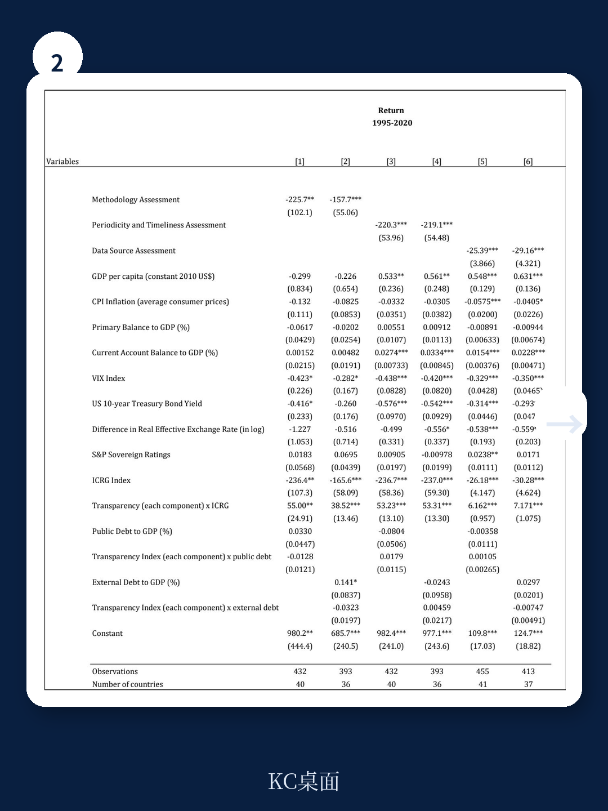

# 世界银行：高债务国家反而能从数据透明中获益——这对全球债券投资者意味着什么

全球投资者在配置新兴市场主权债券时，习惯性将“高债务”等同于“高风险、低回报”。世界银行最新工作论文（Policy Research Working Paper 11054）提供了一个反直觉的结论：在高债务国家，提升数据透明度不仅不会压低回报，反而能吸引更多资本流入，显著提升主权债券回报率。这一发现挑战了传统认知——过去学界和市场的注意力几乎全部集中在“透明度如何降低借款国融资成本”这一面，而几乎没有人系统测算透明度对债权人（即全球债券投资者）的收益贡献。

这份报告的真正价值在于，它把数据透明度的受益者从借款国扩展到投资者，并给出了可量化的阈值和国别收益表。对于正在重新评估新兴市场敞口的机构投资者而言，这是一个需要认真对待的信号。

## 1. 数据透明度的回报效应存在“制度门槛”——低于这个门槛，透明度反而无效

报告的核心发现之一是，数据透明度对主权债券回报的正向影响并非线性，而是取决于借款国的制度质量。研究使用国际国家风险指南（ICRG）指数作为制度质量的代理变量，发现只有当ICRG指数（取对数后）超过4.15时，提升透明度才能显著提高债券回报。换算成原始分值，这意味着借款国的制度质量得分至少需要达到约63.66分（满分100分）。

这个门槛的含义非常清晰：在制度质量较低的国家，即使政府发布更多数据，投资者也不会因此给予更高的回报溢价。原因在于，在制度薄弱的环境中，数据的可信度本身存疑——投资者无法确定公开数据是否反映了真实的经济状况。只有在制度质量达到中等以上水平时，透明度的提升才能转化为投资者信心的改善，进而推高债券价格。

> **KC评论：** 投资者在筛选新兴市场债券时，不应只看债务率和透明度指标本身，而应先看制度质量是否跨过阈值。报告给出的4.15（对数）是一个可以直接用于筛选的参考线。完整报告中还包含了不同透明度子维度（方法论、数据来源、时效性）的阈值差异，这些细节在单一图表中呈现，对精细化配置决策有帮助。

## 2. 高债务不是终点——透明度可以“对冲”债务对回报的压制

报告另一个核心发现是，主权债券回报在高债务国家通常更低——这一点符合直觉。但报告进一步发现，当将透明度与债务水平的交互项纳入模型后，透明度提升可以显著缓解高债务对回报的负面冲击。换句话说，一个高债务但高透明的国家，其债券回报可能优于一个低债务但低透明的国家。

这一结论的政策含义非常直接：对于已经背负较高公共债务的新兴市场国家，改善数据透明度不是“锦上添花”，而是一种可以实际降低融资成本、吸引国际资本的策略工具。对于投资者而言，这意味着在评估高债务国家时，透明度的权重应当被系统性地提高——尤其是在那些制度质量已经跨过门槛的国家。

报告在表7中进一步测算了不同国家提升透明度后，全球投资者可以获得的额外收益。以中国为例，如果将数据透明度提升至上中等收入国家的最高十分位水平，全球投资者每年可额外获得约870个基点的回报，对应约250.64亿美元的收益，占中国GDP的1.71%。巴西的对应数据是680个基点、32.57亿美元。俄罗斯为593个基点、46.91亿美元。

## 3. 信用评级和外汇储备是独立信号——透明度不能替代它们，但能放大它们

报告在回归模型中引入了S&P主权信用评级和总外汇储备作为额外解释变量。结果显示，这两个变量对主权债券回报均有显著解释力。但更重要的是，在控制评级和储备后，透明度与制度质量的交互项依然显著——说明透明度提供的增量信息是信用评级无法完全覆盖的。

这一发现对投资者的实践含义是：透明度不应被视为评级或储备的替代品，而应被视为一个独立的“信号放大器”。当一个国家的评级较高、储备充足，同时透明度也较高时，其债券回报的正面效应会超出三者各自效应的简单加总。反过来，如果评级低、储备少，透明度单独发挥作用的空间也有限——因为制度门槛可能尚未跨过。

## 4. 报告尚未完全回答的关键问题：透明度的“边际收益递减”何时出现？

报告证明了透明度提升在制度门槛之上是正向的，也给出了国别层面的额外收益估算。但它没有系统讨论透明度的边际收益是否递减——即透明度达到很高水平后，继续提升是否还能带来等比例的回报增长？从逻辑上讲，当透明度已经很高时，投资者的信息不对称程度已经很低，进一步透明化的边际价值可能下降。但报告的数据样本中，高透明度国家的数量有限，这一假设尚无法验证。

此外，报告使用的透明度指标主要来自世界银行统计能力指标（SCI）和IMF的数据公布特殊标准（SDDS），这些指标更多衡量“数据发布的频率和覆盖面”，而非“数据本身的准确性或可信度”。如果未来能够引入衡量数据质量（而非仅数量）的指标，分析框架将更具说服力。

> **KC评论：** 完整报告包含了对透明度各子维度（方法论、数据来源、时效性）的独立回归结果，以及不同透明度指标（世界银行 vs. IMF）的对比分析。这些细节在摘要中无法展开，但对于想构建“透明度因子”的投资者来说，是不可或缺的底层分析。

## 5. 投资者的观察框架：三个维度筛选高回报机会

基于报告的实证发现，投资者可以构建一个简单的三维筛选框架：

第一，制度质量门槛。优先关注ICRG指数对数超过4.15的国家。低于这一门槛的国家，透明度提升对回报的拉动效果不显著，不值得为此支付溢价。

第二，债务与透明度的组合。在高债务国家中，优先选择透明度指标位于所在收入组别中位数以上的。报告表7的测算显示，这类国家往往能提供显著的额外收益。

第三，信用评级与储备的验证。将透明度信号与评级、储备交叉验证。如果三个维度同时指向正面，则回报增强效应最为可靠。

## 顺着这些未解问题，继续深入讨论

报告打开了“透明度-回报”这一被长期忽视的研究方向，但也留下了几个值得继续追问的问题：透明度的边际收益何时递减？不同透明度子维度对回报的驱动机制是否相同？当全球风险偏好急剧变化时，透明度效应是否依然稳健？

这些问题的答案，往往隐藏在报告正文的回归表格、稳健性检验和国别数据细节中。我们每天会由AI agent配合人工review，从国际投行最新研报中提取核心判断、关键图表和未解问题，形成约10-40页的中文摘要与评论，既方便直接阅读，也适合作为AI分析的输入素材。如果你希望拿到这份世界银行报告的完整原文、全部回归表格以及我们整理的国别收益计算明细，欢迎加入社群，每天获取更新。

Personal reading notes and learning share only. Not investment advice.

