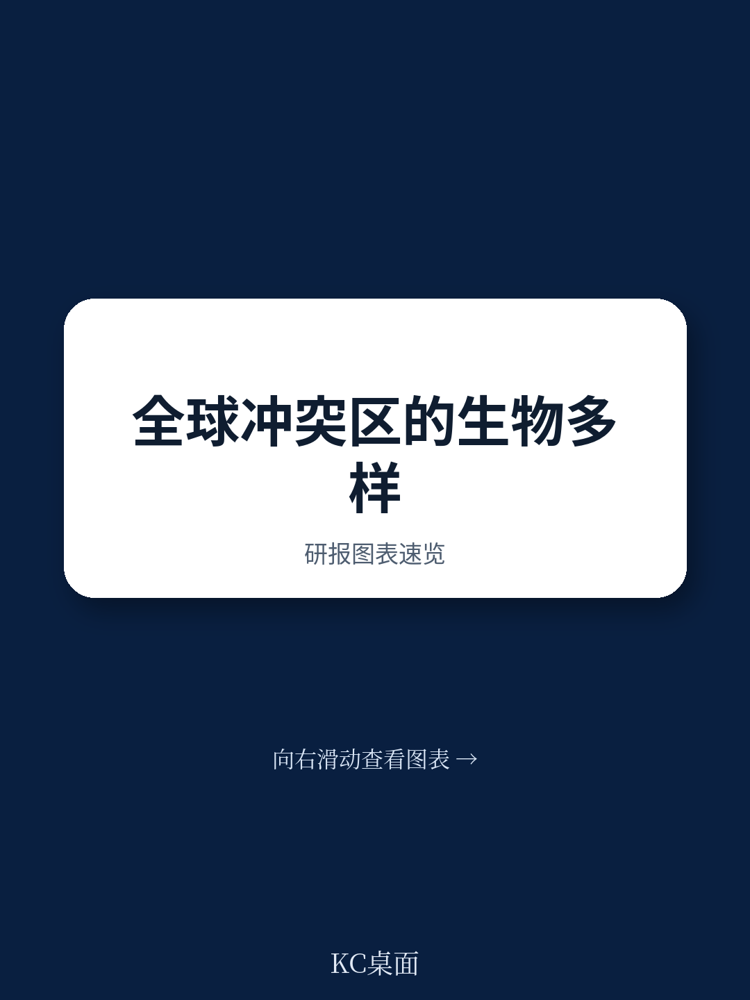
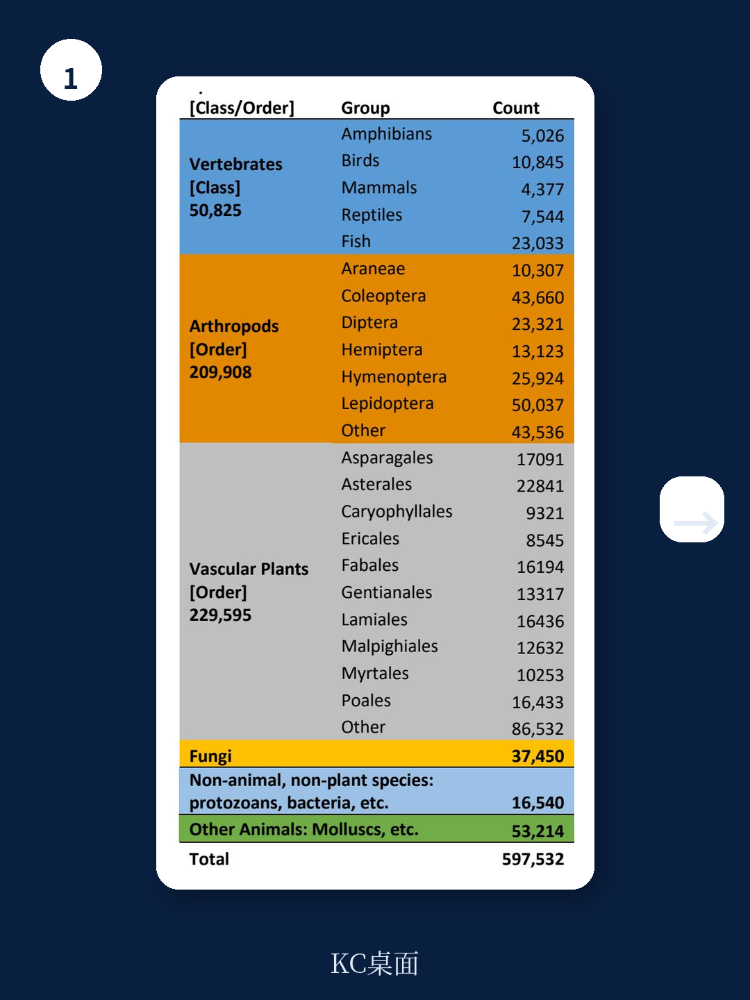
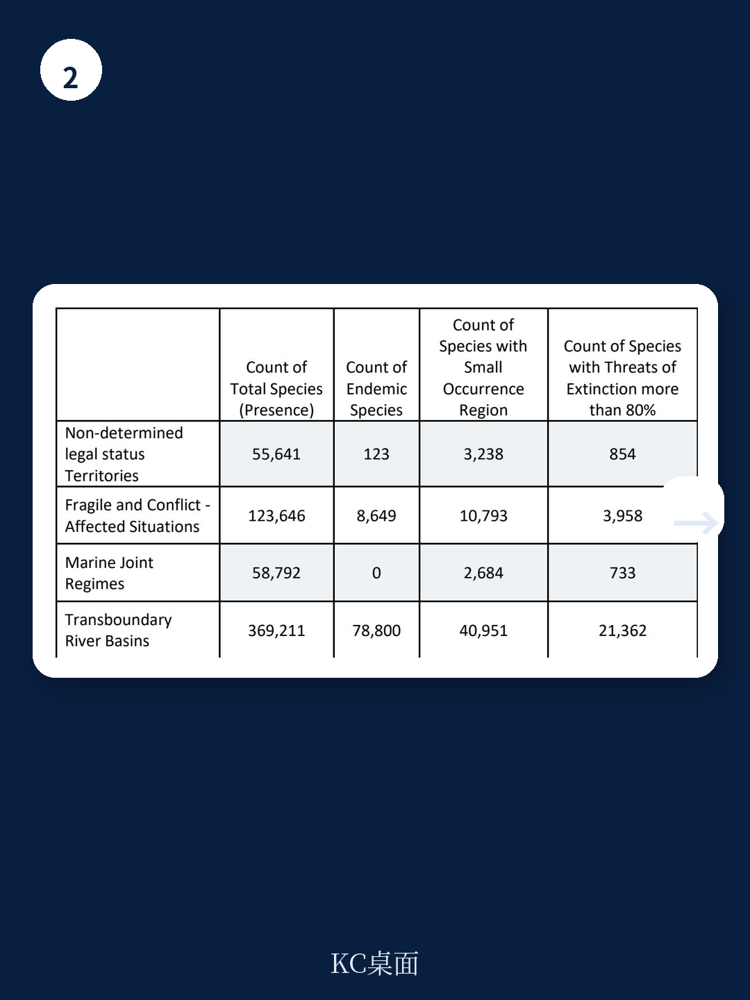

# 世界银行：冲突地带才是全球生物多样性保护的真正盲区

全球生物多样性正在以自然基线1000倍的速度消失。1万个物种濒临灭绝，68%的种群规模自1970年以来已经下降。这些数字并不新鲜。真正值得关注的问题是：最需要保护的区域，恰恰是数据最稀缺、治理最薄弱、冲突最频繁的地方。

世界银行最新发布的工作论文（Policy Research Working Paper 11076）给出了一个反常识的判断：全球生物多样性保护的最大缺口，不在亚马逊雨林，不在东南亚热带丛林，而在那些“法律地位未定”的领土、武装冲突频发的国家、以及机构脆弱的失败国家。这些区域覆盖了311个国际河流流域、18个海洋联合管辖区、35个非确定法律地位领土，以及19个冲突影响国家和20个脆弱国家。

更关键的是，世界银行的团队利用全球生物多样性信息设施（GBIF）的开放数据，通过机器学习方法绘制了近60万个物种的分布地图。这些地图揭示了一个令人不安的事实：上述区域不仅是物种丰富度最高的地区之一，也是特有物种和濒危物种最集中的地区。换句话说，人类冲突最激烈的地方，恰好是地球生物多样性最珍贵的地方。

---

## 1. 冲突与治理真空地带，恰恰是物种多样性的最后堡垒

世界银行的这项研究并非凭空发出呼吁。它基于一套全新的、经过专家验证的物种分布数据库。研究团队利用GBIF自1970年以来的数亿条经纬度标记的物种记录，通过alphahull算法和k-means聚类算法，生成了涵盖陆生、淡水和海洋环境的近60万个物种的分布图。

将这些地图与全球冲突数据库、脆弱国家指数、国际河流流域边界等空间数据叠加后，一个清晰的模式浮现出来：非确定法律地位领土（如西撒哈拉、克什米尔等）、冲突影响国家（如叙利亚、也门）、以及机构脆弱国家（如索马里、中非共和国），其物种丰富度和特有物种比例显著高于全球平均水平。

以国际河流流域为例。全球311个国际河流流域中，许多跨越了多个政治实体，各国对水资源的争夺往往导致环境监管的真空。研究团队发现，这些流域中栖息着大量依赖特定河岸生态系统的特有物种和濒危物种。当上游国家修建水坝、过度取水或排放污染物时，下游的生物多样性会遭受不可逆的破坏。但由于缺乏统一的监测数据和跨境合作机制，这些破坏往往被忽视。

> **KC评论：** 世界银行的这项研究实际上揭示了一个“悖论”：冲突和治理薄弱区域之所以成为生物多样性热点，并非因为人类活动少，而是因为这些区域往往处于国际关注的边缘地带，既没有系统的保护规划，也没有有效的监管执行。这意味着，传统意义上的“保护区”策略在这些区域完全失效。

---

## 2. 数据不是工具，而是建立信任的唯一桥梁

报告的第二个核心判断是：在冲突和治理薄弱区域，生物多样性保护的关键突破点不是资金，不是技术，而是“可靠且可比的数据”。

为什么数据如此重要？因为在这些区域，各方利益主体之间缺乏最基本的信任。当叙利亚政府和反对派武装各自控制不同区域时，任何一方提出的“保护区”方案都可能被对方视为政治操弄。当尼罗河流域的上游国家（如埃塞俄比亚）和下游国家（如埃及、苏丹）在水资源分配上剑拔弩张时，任何单方面发布的生态数据都会被对方质疑。

世界银行的解决方案是：利用GBIF这样的开放、中立、第三方数据平台，生成各方都无法否认的事实基础。GBIF的数据来自全球数千个研究机构、博物馆和公民科学项目的贡献，经过标准化处理和时间戳记录。研究团队在此基础上生成的物种分布图，不依赖于任何一方的官方统计，因此具有天然的“中立性”。

报告特别强调，这种数据驱动的路径已经在一些跨境生态合作中展现出潜力。例如，在湄公河流域，湄公河委员会（MRC）利用共享的水文和生态数据，在成员国之间建立了一定程度的互信。在尼罗河流域，尼罗河流域倡议（NBI）也试图通过联合监测来推动合作。但世界银行的数据集将这一逻辑推向了更广的范围——它覆盖了311个国际河流流域、18个海洋联合管辖区，以及数十个冲突区域，为更大规模的跨境合作提供了可能。

> **KC评论：** 世界银行的这一判断其实暗含了一个更深的逻辑：在政治对话陷入僵局时，生态数据可以成为“非政治化”的突破口。如果各方都能认可同一张物种分布图，那么保护区的边界、资源使用的配额、补偿机制的建立就有了共同的基础。这比直接谈判政治边界要容易得多。

---

## 3. 特有物种和濒危物种的分布，暴露了保护规划的致命盲区

报告中最具操作性的贡献，是它首次系统性地量化了冲突和治理薄弱区域中特有物种和濒危物种的分布情况。

特有物种是指那些只分布在特定地理区域的物种。它们的生存完全依赖于该区域的生态系统健康。一旦栖息地被破坏，这些物种将面临不可逆的灭绝。世界银行的数据库显示，在非确定法律地位领土和冲突影响国家中，特有物种的比例显著高于全球平均水平。例如，在克什米尔地区，由于印巴长期对峙，该区域的雪豹、喜马拉雅棕熊等特有物种的栖息地保护几乎处于真空状态。在叙利亚，持续的战争导致该国特有的植物物种（如叙利亚鸢尾）的栖息地被严重破坏。

同样令人担忧的是濒危物种。世界自然保护联盟（IUCN）红色名录中的许多濒危物种，其分布范围恰好与冲突区域高度重叠。研究团队发现，在19个冲突影响国家中，有大量两栖类、爬行类和哺乳类物种处于濒危状态。这些物种的生存本已脆弱，冲突加剧了栖息地破坏、非法狩猎和资源过度开采，使它们的生存前景更加暗淡。

报告还特别强调了“海洋联合管辖区”的问题。全球有18个海洋区域由多个国家共同管理，如地中海、南海、加勒比海等。这些区域往往是渔业资源最丰富、生物多样性最高的海域，但同时也是主权争端最频繁的区域。世界银行的数据显示，这些海洋联合管辖区中栖息着大量洄游鱼类、海龟和海洋哺乳动物，它们的保护需要所有沿岸国家的协调行动。但在缺乏统一数据和监测机制的情况下，过度捕捞和污染问题长期得不到解决。

> **KC评论：** 这里有一个容易被忽视的细节：世界银行的数据库不仅涵盖了传统研究的脊椎动物（两栖类、鸟类、哺乳类、爬行类、鱼类），还首次大规模纳入了节肢动物（如昆虫、蜘蛛）、维管植物和真菌。这意味着，我们对冲突区域生物多样性的认知盲区比想象中更大。那些肉眼看不见的物种，可能正在悄无声息地消失。

---

## 4. 报告尚未完全回答的关键问题：数据之后，谁来执行？

世界银行的这份报告在方法论和数据层面做出了重要贡献，但它也留下了一个尚未完全回答的问题：有了可靠的数据之后，谁来推动执行？

报告提到了“信任重建”和“合作框架”，但并没有给出具体的执行机制。在非确定法律地位领土，如西撒哈拉或克什米尔，连主权归属都无法达成共识，任何保护区的设立都可能被视为政治行为。在冲突影响国家，如也门或叙利亚，政府职能已经崩溃，即使有数据，也没有机构能够执行保护措施。在脆弱国家，如索马里或中非共和国，腐败和治理能力不足使得任何保护计划都难以落地。

世界银行似乎意识到这一问题，因此在报告中提到了“利益相关方协调”和“全球框架”的重要性，但并没有深入讨论如何在具体场景中实施。这可能是未来研究的方向，也可能是这份报告最值得继续追问的部分。

---

## 5. 对决策者的观察框架：从“保护什么”转向“在什么条件下可以保护”

对于产业决策者和高净值读者而言，世界银行的这份报告提供了一个新的观察框架：评估生物多样性保护项目时，不能只看“物种丰富度”或“生态重要性”，还必须评估“治理可行性”。

传统上，国际保护组织倾向于将资源集中在物种最丰富、生态系统最完整的区域。但世界银行的数据表明，这些区域往往也是冲突最频繁、治理最薄弱的区域。这意味着，单纯的技术方案（如建立保护区、恢复栖息地）在这些区域可能无法奏效。

一个更实用的框架是：将治理能力纳入保护规划的核心变量。在治理较强的区域，可以实施严格保护；在治理中等但存在冲突风险的区域，需要优先建立数据共享和信任机制；在治理崩溃的区域，可能需要通过中立平台（如GBIF）先建立事实基础，等待政治条件成熟后再推动保护行动。

世界银行的这份报告为这个框架提供了基础数据，但还远远不够。接下来需要回答的是：哪些区域可以通过数据驱动的方式先行突破？哪些区域需要等待政治进程？哪些区域可能永远无法实现有效保护？

---

这份世界银行的报告提供了一个重要的起点，但它更像是一张地图，而不是导航。地图告诉我们哪里有物种、哪里是盲区，但如何到达目的地，还需要更多的研究和实践。

如果你希望深入阅读这份报告的完整内容，包括60万种物种的分布图、38个非确定法律地位领土的具体数据、以及311个国际河流流域的物种丰富度排名，欢迎加入我们的社群。

我们每天会由AI agent加上人工review，生成国际投行与多边机构的中文摘要与KC评论，每日更新，约10-40页。内容包括当天最新数据图表合集，既方便喂给AI，也方便人工快速把握全球市场动态与地缘环境趋势。你可以领取这份世界银行报告的完整解读与原始图表，并与我们一起探讨：在冲突与生态的交汇地带，数据能否成为真正的桥梁。

Personal reading notes and learning share only. Not investment advice.

