Policy Research Working Paper

11082

# Businesses of the State in Brazil The Impact on Employment and Business Dynamism

Sara Brolhato

Xavier Cirera

Antonio Martins-Neto

POLICY RESEARCH WORKING PAPER 11082

## Abstract

Businesses of the state (BOS) have regained the public debate in midst of the COVID-19 pandemic, especially as a source of resilience to shocks and a mechanism for technology development and diffusion. However, little is known about the impacts on the economy. This paper uses a novel dataset that allows exploring the importance of BOS in Brazil, including registered state-owned or mixed enterprises and with indirect state participation in competitive sectors. The paper looks at their impact through two connected perspectives: employment and business dynamism. First, the analysis tests whether BOS pay a wage premium to their employees. Then, it estimates the impacts of privatization on workers' outcomes and firms' total employment. The findings indicate that BOS firms pay a substantial wage premium in Brazil and that privatization events lead to a significant decline in workers' wages. Yet, the analysis does not find robust evidence that privatization results in a decline in total employment. The findings show that BOS tend to use more technical workers, a proxy for innovation, and are larger and grow faster in terms of employment than private companies. Finally, the paper analyzes what the presence of BOS means for the business dynamism of sectors. It finds that a higher presence of BOS in a given sector is negatively correlated with young firms' participation and exit rates, and job destruction rates. Meanwhile, BOS participation is positively correlated with market concentration, but also job creation rates. The results suggest that BOS have significant impacts on markets, and that assessment of the state's footprint needs to consider the effects of public investments in private companies, directly and indirectly.

# Businesses of the State in Brazil: The Impact on Employment and Business Dynamism

Sara Brolhato $^{1}$ , Xavier Cirera $^{*1}$ , and Antonio Martins-Neto $^{1}$

$^{1}$ The World Bank

## 1 Introduction

After decades of uneven privatization across countries, the recent Covid-19 pandemic has brought back discussions about the role of state-owned enterprises (SOEs) and firms with state participation in the economy. Increasing economies' resilience to shocks, using state participation as a mechanism for the diffusion of technologies for climate mitigation and adaptation, and ensuring the production of critical health products, technologies, and infrastructure in the midst of growing geopolitical tensions are being used to justify an increased presence of Businesses of the State (BOS) - defined as firms with direct or indirect state participation of at least 10% - in the economy.

In the case of Brazil, despite the large privatization program in the 1990s and the recent privatization processes carried out by the latest administrations, BOS are still important in some sectors - especially in infrastructure, extractive industries, and postal activities - and the state footprint has expanded to investments to private firms in competitive sectors. However, little is known about the impact of these BOS on markets and how effectively they play some of the roles they are supposed to play. This paper studies the effects of BOS in Brazil from different angles, particularly their effects on the labor market and business dynamism. The contribution of this paper is twofold. First, in addition to the traditional analysis of SOEs, the analysis uses a unique dataset that allows describing BOS in their different modalities, from fully public enterprises to private companies with minority state participation operating in competitive sectors. Second, in addition to measuring the effects of specific roles of the state footprint on the labor market, we also study the impact that BOS presence has on business dynamism.

Specifically, we first provide a descriptive analysis of BOS and find that, on average, BOS pay higher wages, are older, and are larger than their private peers. Next, we perform a series of estimates controlling for firms' characteristics to examine how BOS differ from private firms in terms of innovation, employment and employment growth. Using data from 2016 to 2020, we find that BOS are more innovative and larger than fully private companies, consistent with findings in China (Lo et al., 2022). In particular, participated companies - private companies with public investments - are more innovative and have higher employment relative to other types of BOS, thus suggesting the public sector invests essentially in some key sectors and innovative private companies. Furthermore, BOS grew more in terms of employment, although it is only statistically significant for participated firms.

Following this initial assessment, we explore the link between BOS and the labor market by testing for a wage premium associated with BOS. BOS, especially public enterprises, have different wage-setting mechanisms, commonly resulting in a wage premium, which, in turn, is usually linked to distortions in workers' employment choices and productivity losses (Cavalcanti and Santos, 2020). We estimate several firm-level and worker-level regressions and find a robust positive wage premium of $18.5\%$ ; yet, once we add workers' fixed effect to control for workers' sorting into BOS, the wage premium declines to $4.5\%$ in our preferred specification.

As an alternative to exploring the wage premium of SOEs, we also analyze the effects of privatizations on workers' wages and firms' total employment. Using an event-study methodology, our estimates indicate that privatizations negatively affect workers' wages. For instance, workers who are part of a privatization event see relative wages decline by about 10% in the first two years after the shock compared to the control group. Furthermore, in exploring the heterogeneities of our results, we observe that privatized firms tend to lay off more educated, older, and long-tenured individuals.

Our findings are consistent with the growing literature on the impacts of privatization. For instance, Olsson and Tåg (2021) evaluate the impact of privatizations in Sweden from 1997 to 2011 and find that wage declines of about 4% in the first two years and 9% during the third and fourth years $^{1}$ . In the case of Brazil, Arnold (2022) evaluates the impact of privatizations during the 1990s - the first wave of large privatization in the country. Focusing on the banking, telecommunications, and electricity sectors, the author observes a substantial wage premium for public firms and that privatizations negatively affect workers' wages.

Lastly, we study the relationship between BOS and business dynamism. In particular, we test whether a higher concentration of BOS is correlated to entry rate, exit rate, gross job creation, and other measures of business dynamism at the industry level. We find robust evidence that BOS' participation correlates with a smaller share of employment in young firms and higher market concentration. In competitive industries, we also find that a higher concentration of BOS is associated with lower firm exit rates. In terms of labor market dynamics, we find that BOS participation is associated with higher net employment change - resulting from simultaneously higher gross job creation and lower job destruction rates. Combined, our results suggest that the presence of BOS could potentially generate adverse impacts on the sectors in which they operate, reducing business dynamics through lower entrepreneurship, less intense selection, higher concentration and, consequently, limited competition.

The rest of the paper is structured as follows. Section 2 describes the datasets used in this study and our classification of BOS. Section 3 presents a description of the industries in which BOS operate and their performance, innovation, employment and employment growth relative to privately-owned firms. Section 4 estimates the wage premium associated with workers in BOS relative to the private sector using firm-level and worker-level data. Section 4.3 uses privatizations of public firms as a natural experiment for providing additional evidence on the BOS wage premium, and estimates the effects of these events on worker and firm-level outcomes. Section 5 presents empirical evidence on business dynamism in Brazil over the last decade, and estimates how the presence of BOS affects multiple measures of dynamism at the industry level. Section 6 concludes.

## 2 Data

Our main data source is the Relação Anual de Informações Sociais (RAIS), an annual census of active working contracts for all formal employees in Brazil. The dataset includes information on over 3 million establishments and 40 million workers annually. Each entry in the RAIS dataset is an employee-employer match, with both establishments and individuals having a unique identifier. Establishments' identifiers include 14-digits, with the first 8-digits representing the firm. Throughout our analysis, we will concentrate on firm-level data. The primary use of the RAIS is to compute federal wage supplements, social security benefits, and unemployment insurance. Data collection is mandatory, and given its importance, firms and workers provide high-quality information, especially on wages.

We use data from 2010 to 2020 and focus on the productive sector – we exclude workers in public administration, non-profit organizations, extraterritorial organizations, and specific categories for individual entities such as political candidates and individual rural producers. We use worker-level information including age, level of education, tenure, wage, gender, date of admission, and occupation (CBO classification codes). At the firm-level, we measure employment as the number of active workers on December 31st of each reference year, and we include only establishments with positive employment in the sample. We also use the information on the 4-digit CNAE sector classification codes $^{2}$ and the legal nature of firms, which is a key variable in this study used to identify state-owned firms.

We also compute firm characteristics from worker-level information, for instance, we measure average firm wage, the share of college-educated workers, and firm-level innovation intensity, which is measured as the share of employment in technical and scientific occupations (PoTec), a proxy for R&D expenditure proposed by Araújo et al. (2009). We take advantage of the database panel structure to infer firm entry and exit based on the first and last years a firm is observed in the data. Since RAIS does not directly contain the entry year for each firm, we compute age considering that a firm's entry year is the earliest observed admission year reported for workers in that firm. $^{3}$ We correct these age measures whenever they are inconsistent with the entry observed in our sampled period.

To define state-owned firms, we primarily use firms' legal nature information available in RAIS. The problem of using only legal nature is that it omits a large footprint of the state via investing in private firms. Therefore, we complement our analysis by identifying private firms with government participation using ownership information from the Orbis database available for 2019. Specifically, we define three types of BOS based on the magnitude of state participation within a firm: public, mixed, and participated firms. Using the information on the legal nature of firms provided in RAIS, we identify fully public and mixed-capital firms (those where the government owns the majority of voting shares). Participated firms are defined as private firms with minority state participation. $^{4}$ These are firms for which state ownership is identified through the Orbis database but that are classified as fully private in RAIS. $^{5}$ Whenever we generally speak of BOS, we are referring to the definition that encompasses all these three groups of firms, unless stated otherwise.

Table 1 details the merge of firms with state participation in Orbis with the RAIS dataset. Of 1,302 firms with state ownership containing a valid Brazilian tax identifier in 2019, we can find 1,067 of these firms in RAIS within the same year (82%). Even though RAIS is supposed to be a census of all Brazilian firms in the formal sector, we cannot match 235 firms. Additionally, 323 of the matched firms did not report worker-level information in 2019, either because they had no active working contracts or halted operations during the reference year. Of the 1,067 matched companies, 129 are registered as fully public firms, and 238 are registered as mixed capital firms. We define as participated the 377 firms that are registered in RAIS as fully private firms but contain minority state participation as identified in Orbis. Table 2 presents the resulting number of firms by year in the sample, along with a decomposition between the number of privately-owned firms (POEs) and BOS, and their classification into each of the three BOS types after combining data from Orbis and legal nature information in RAIS.

Additionally, we use Orbis data combined with firm ownership structure information to obtain estimates for the share of government ownership in each BOS. Whenever firms are directly owned by the state, with only one public entity as the shareholder, we consider the percentage of government ownership provided by Orbis or by other sources used to validate the data, such as the Overview of State-Owned Companies made available by the Secretariat for Coordination and Governance of State-owned Companies (SEST). $^{6}$ In the case of indirect ownership by the government, through multiple entities or other state-owned firms, it is less straightforward to obtain a reliable measure of the ownership fraction. In those cases, we provide a conservative estimate of the government ownership share by considering the minimum share observed in the multiple layers of ownership.

We test the reliability of the ownership share estimates by plotting a distribution of the firms' government shares in Orbis for each BOS type according to the classification in RAIS. Figure 1 illustrates that the government ownership shares are mostly consistent with the information on ownership type in RAIS, concentrated in $100\%$ for fully public firms, with values ranging from $50\%$ and $99\%$ for mixed firms, and with a more scattered distribution in values lower than $50\%$ for participated firms. We use available ownership information in RAIS to correct the shares of government ownership shares when possible: we input ownership of $100\%$ for all public firms, and we input ownership of $51\%$ for mixed-capital firms whenever the estimated share is below that level or when an estimate for that firm is not available.

Lastly, we use the sector taxonomy industry classification proposed by Dall'Olio et al. (2022), which defines three groups based on the rationale for industry state participation. According to this classification, competitive industries are those with no issues of economic efficiency or market failures that would justify the presence of state-owned enterprises. By contrast, industries described as natural monopolies or partially contestable would have some grounds for justifying the presence of state-owned firms. While in natural monopolies this justification is based on a market structure characterized by economies of scale and subadditivity costs, partially contestable industries are defined by the presence of market failures that could be addressed with direct state participation, such as market power or externalities (Dall'Olio et al., 2022). Table 3 shows the total number of firms within our sample within each taxonomy group in 2020, along with the corresponding percentage relative to the total number of firms and the number of BOS within those groups.

Table 1: Summary of RAIS matching (2019).

<table><tr><td colspan="3">Matched firms</td></tr><tr><td>Firms with a valid tax id</td><td>1,302</td><td>100%</td></tr><tr><td>Matched</td><td>1,067</td><td>82%</td></tr><tr><td>Not matched</td><td>235</td><td>18%</td></tr><tr><td colspan="3">Matched firms by establishment type</td></tr><tr><td>Public</td><td>129</td><td>12%</td></tr><tr><td>Mixed</td><td>238</td><td>22%</td></tr><tr><td>Participated</td><td>377</td><td>35%</td></tr><tr><td>Zero employment</td><td>323</td><td>30%</td></tr><tr><td>Total matched</td><td>1,067</td><td>100%</td></tr></table>

Note: This table summarizes the number of BOS identified through Orbis that we were able to locate in RAIS, using firm identifiers. In the lower panel, the table illustrates the legal nature information in RAIS of firms successfully located in RAIS, as well as the number of firms which are registered as having zero employment during the whole year of 2019. Data from RAIS and Orbis, 2019.

Table 2: Number of firms by year.

<table><tr><td>Year</td><td>Firms</td><td>POEs</td><td>BOS</td><td>Public</td><td>Mixed</td><td>Participated</td></tr><tr><td>2016</td><td>2,531,848</td><td>2,529,989</td><td>1,859</td><td>910</td><td>583</td><td>366</td></tr><tr><td>2017</td><td>2,518,208</td><td>2,516,404</td><td>1,804</td><td>877</td><td>559</td><td>368</td></tr><tr><td>2018</td><td>2,501,936</td><td>2,500,773</td><td>1,163</td><td>389</td><td>408</td><td>366</td></tr><tr><td>2019</td><td>2,494,135</td><td>2,493,215</td><td>920</td><td>243</td><td>291</td><td>386</td></tr><tr><td>2020</td><td>2,464,407</td><td>2,463,514</td><td>893</td><td>233</td><td>290</td><td>370</td></tr></table>

Note: This table illustrates the total number of firms, including the distinction between private firms and BOS, in the sample. Data from RAIS, from 2016 to 2020.

Table 3: Sector taxonomy, 2020.

<table><tr><td></td><td>Number of firms</td><td>(%)</td><td>Number of BOS</td></tr><tr><td>Competitive</td><td>2,234,377</td><td>90.67</td><td>521</td></tr><tr><td>Partially contestable</td><td>34,228</td><td>1.39</td><td>163</td></tr><tr><td>Natural monopoly</td><td>13,310</td><td>0.54</td><td>190</td></tr><tr><td>Excluded</td><td>182,492</td><td>7.41</td><td>19</td></tr></table>

Note: Data from RAIS, 2020.

Figure 1: Distribution of ownership shares by BOS type  
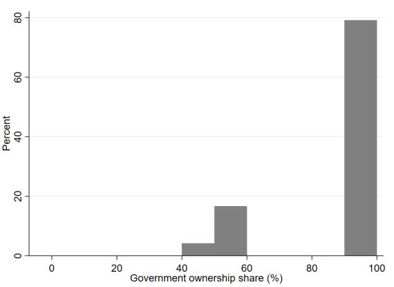  
(a) Public

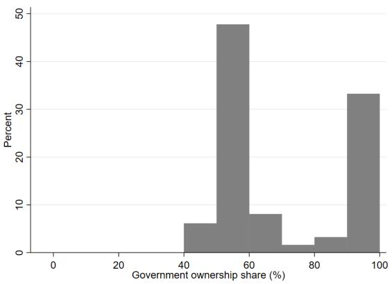  
(b) Mixed

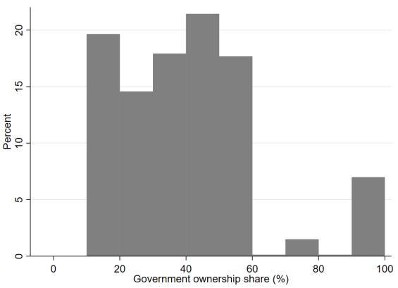  
(c) Participated  
Note: The figures show the distribution of ownership shares computed using data obtained from Orbis. Data from Orbis, 2019. Public and mixed firms are, respectively, firms 100% owned by the Brazilian government and firms where the government has majority participation according to ownership information contained in RAIS. Participated firms are private enterprises with minority government participation, identified using Orbis data.

## 3 Characteristics of BOS firms

In this section, we provide a description of sectors with the highest concentration of BOS, what are some of those firms' characteristics, and how their performance differs from privately owned firms. Table 4 presents the 15 industries with the highest concentration of firms with direct or indirect state participation above 10% in 2020, measured as the percentage of total industry employment in those firms. Additionally, tables 5, 6 and 7 describe the sectors with the highest concentration of BOS for each ownership type: fully public firms, mixed capital firms, and private firms with state participation, respectively.

As would be expected, we find that BOS participation is highest in industries with high fixed costs and natural monopolies, encompassing activities in mining, extraction of petroleum and gas, and infrastructure. Another reasoning for state participation in the economy is to ensure the supply of critical services to the population, which is confirmed by the high concentration of BOS observed in sectors such as utilities, postal services, financial services, research and health. While the sector composition of BOS is similar for public and mixed firms, privately-owned firms with state participation are relatively more concentrated in competitive sectors. For example, these firms with government investment operate in manufacturing industries, including the production of chemicals, motor vehicles, and air and spacecraft machinery.

Table 4: Industries with the highest concentration of BOS, 2020.

<table><tr><td>Industry</td><td>Share of emp. (%)</td></tr><tr><td>Transport via pipeline</td><td>94.04</td></tr><tr><td>Postal activities</td><td>91.20</td></tr><tr><td>Water collection, treatment and supply</td><td>88.58</td></tr><tr><td>Extraction of crude petroleum and natural gas</td><td>88.27</td></tr><tr><td>Manufacture of air and spacecraft and related machinery</td><td>78.81</td></tr><tr><td>Support and regulation of health activities</td><td>76.75</td></tr><tr><td>Research and experimental development on natural sciences and engineering</td><td>73.42</td></tr><tr><td>Mining of iron ores</td><td>72.40</td></tr><tr><td>Other financial service activities</td><td>69.90</td></tr><tr><td>Waste treatment and disposal</td><td>61.14</td></tr><tr><td>Transport via railways</td><td>55.19</td></tr><tr><td>Manufacture of refined petroleum products</td><td>55.19</td></tr><tr><td>Electric power generation, transmission and distribution</td><td>50.40</td></tr><tr><td>Manufacture of gas; distribution of gaseous fuels through mains</td><td>44.70</td></tr><tr><td>Sea and coastal water transport</td><td>42.01</td></tr></table>

Note: The table shows the 15 industries (at the 3-digit level) with the highest concentration of BOS, measured as the percentage of workers employed by BOS relative to total employment in 2020.

Table 8 shows unconditional statistics of key firm characteristics for private firms and BOS - including the three subgroups of public, mixed, and participated firms - and suggests significant differences between these groups. First, the average wage is higher for BOS, both in terms of hourly and total monthly wages. While the average hourly wage equals R\$8.75 for private firm workers, the average wage for workers in BOS is R\$27.00. The table also illustrates that there is significant heterogeneity in average wages across the three BOS types. Hourly wages are, on average, higher for private firms with state participation - equal to R\$40.54 - while in public and mixed-capital firms those figures are R\$17.71 and R\$27.09, respectively.

Public and private firms do not differ only in terms of the wages paid to their workers; they are also different in other dimensions. BOS are, on average, larger, older, and more innovative - measured as the share of technical occupations - when compared to the private sector. While the average private sector firm is less than 10 years old and employs 12 workers, the average BOS is 23 years old and employs 931 workers. BOS also outperform fully private firms in two different measures of innovation. Over 43% of BOS employ workers in occupations associated with innovation, which accounts for an average of 5.66% of total firm employment, while these figures for the private sector are 3% and 0.61%, respectively. Interestingly, the differences in employment and innovation are again more pronounced in participated BOS. On average, private firms with state participation employ 1,329 workers on average, and almost 10% of those employ technical and scientific occupations that are highly correlated with investment in R&D.

Table 5: Industries with the highest concentration of public firms, 2020.

<table><tr><td>Industry</td><td>Emp. (%)</td></tr><tr><td>Postal activities</td><td>91.20</td></tr><tr><td>Support and regulation of health activities</td><td>76.75</td></tr><tr><td>Research and experimental development on natural sciences and engineering</td><td>70.21</td></tr><tr><td>Manufacture of weapons and ammunition</td><td>25.87</td></tr><tr><td>Service activities incidental to air transportation</td><td>22.24</td></tr><tr><td>Remediation activities and other waste management services</td><td>21.11</td></tr><tr><td>Transport via railways</td><td>20.89</td></tr><tr><td>Non-monetary intermediation - other fundraising instruments</td><td>19.84</td></tr><tr><td>Monetary intermediation - deposits</td><td>18.16</td></tr><tr><td>Other professional, scientific and technical activities</td><td>05.61</td></tr><tr><td>Service activities incidental to water transportation</td><td>05.35</td></tr><tr><td>Office administrative and support activities</td><td>04.87</td></tr><tr><td>Manufacture of medicinal chemical products</td><td>03.91</td></tr><tr><td>Radio broadcasting</td><td>03.83</td></tr><tr><td>Support activities for other mining and quarrying</td><td>03.72</td></tr></table>

Note: The table shows the 15 industries (at the 3-digit level) with the highest concentration of public firms, measured as the percentage of workers employed by public firms relative to total employment in 2020.

Table 6: Industries with the highest concentration of mixed firms, 2020.

<table><tr><td>Industry</td><td>Emp. (%)</td></tr><tr><td>Extraction of crude petroleum and natural gas</td><td>88.27</td></tr><tr><td>Water collection, treatment and supply</td><td>81.77</td></tr><tr><td>Other financial service activities</td><td>68.76</td></tr><tr><td>Waste treatment and disposal</td><td>60.94</td></tr><tr><td>Manufacture of refined petroleum products</td><td>52.14</td></tr><tr><td>Manufacture of gas; distribution of gaseous fuels through mains</td><td>34.61</td></tr><tr><td>Electric power generation, transmission and distribution</td><td>22.34</td></tr><tr><td>Transport via railways</td><td>21.79</td></tr><tr><td>Monetary intermediation - deposits</td><td>16.82</td></tr><tr><td>Mining of hard coal</td><td>09.06</td></tr><tr><td>Waste collection</td><td>08.17</td></tr><tr><td>Non-monetary intermediation - other fundraising instruments</td><td>07.93</td></tr><tr><td>Other reservation service and related activities</td><td>07.29</td></tr><tr><td>Data processing, hosting and related activities</td><td>06.27</td></tr><tr><td>Support activities to water transportation</td><td>04.99</td></tr></table>

Note: The table shows the 15 industries (at the 3-digit level) with the highest concentration of mixed firms, measured as the percentage of workers employed by mixed firms relative to total employment in 2020.

Table 7: Industries with the highest concentration of private firms with government participation, 2020.

<table><tr><td>Industry</td><td>Share of emp. (%)</td></tr><tr><td>Transport via pipeline</td><td>94.04</td></tr><tr><td>Manufacture of air and spacecraft and related machinery</td><td>78.81</td></tr><tr><td>Mining of iron ores</td><td>72.40</td></tr><tr><td>Sea and coastal water transport</td><td>42.01</td></tr><tr><td>Processing and preserving of meat</td><td>34.77</td></tr><tr><td>Electric power generation, transmission and distribution</td><td>27.87</td></tr><tr><td>Sewerage</td><td>25.83</td></tr><tr><td>Manufacture of bodies (coachwork) for motor vehicles</td><td>23.66</td></tr><tr><td>Manufacture of basic organic chemicals</td><td>18.86</td></tr><tr><td>Capitalization</td><td>18.28</td></tr><tr><td>Casting of metals</td><td>18.03</td></tr><tr><td>Transport via railways</td><td>12.50</td></tr><tr><td>Finishing of textiles</td><td>12.45</td></tr><tr><td>Activities auxiliary to financial service activities</td><td>12.20</td></tr><tr><td>Manufacture of gas; distribution of gaseous fuels through mains</td><td>10.09</td></tr></table>

Note: The table shows the 15 industries (at the 3-digit level) with the highest concentration of participated firms, measured as the percentage of workers employed by private firms with state participation relative to total employment in 2020.

In order to look at these differences with more robustness, we test whether innovation intensity, firm size, and employment growth are different across BOS and the private sector after controlling for firm observable characteristics. First, we estimate the following regression:

$$
I n n o v a t i o n _ {f t} = \alpha_ {0} + \alpha_ {1} B O S _ {f t} + \alpha_ {2} B O S _ {f t} * d 2 0 2 0 _ {t} + \beta_ {1} F i r m S i z e _ {f t} + \beta_ {2} F i r m A g e _ {f t} + \delta_ {s} + \delta_ {t} + \varepsilon_ {f t}\tag{1}
$$

where $Innovation_{ft}$ is a measure of innovation intensity for firm f in year t, computed as the firm-level fraction of occupations in technical and scientific occupations (PoTec). $^{7}$ The main coefficient of interest is $\alpha_{1}$ , associated with a dummy indicating businesses of the state. This coefficient quantifies how innovation intensity in BOS differs from private firms. Additionally, we include an interaction between the BOS dummy and a dummy variable equal to one for data from 2020, $BOS_{ft} * d2020_{t}$ , to test whether this difference across BOS and private firms was altered by the economic crisis following the Covid-19 pandemic. We include controls for firm employment and age, $^{8}$ which are observable characteristics believed to be correlated with firm performance and innovation, as well as 2-digit sector and year fixed effects.

The estimates from equation 1 are presented in Table 9 and shows that, on average, BOS have a higher level of innovation intensity relative to private firms. Our baseline specification in column (1) implies that innovation intensity, measured as the fraction of workers in occupations associated with R&D, is 3.05 percentage points higher in BOS relative to fully private firms. In 2020, following the outbreak of the Covid-19 pandemic, we find that the difference in innovation between BOS and private firms was accentuated by 1.38 percentage points. One possible explanation for this result is that private firms reduced the intensity of R&D as a response to a negative shock in sales and heightened uncertainty, and hence modified the structure of employed occupations. Meanwhile, BOS could have benefited from higher stability and resources made available by the government, resulting in less intense changes in innovation intensity.

However, it is important to note that our innovation measure reflects changes in worker composition, which in turn have been affected by the economic crisis following the outbreak of Covid-19. Therefore, the positive coefficient estimated for the interaction term for BOS in 2020 could point to a lower reduction in skilled workers in public firms relative to private firms. Such result would arise, for example, if private firms were disproportionately affected or had fewer resources to cope with the negative consequences of the crisis, resulting in disproportionate layoff of skilled employees in innovative occupations.

Next, column (2) emphasizes the heterogeneity across the three definitions of BOS by including dummy variables for public, mixed-capital, and private firms with state participation. The results show that our baseline results are robust, and innovation intensity is significantly higher for all BOS types relative to the private sector. We also find heterogeneity among BOS types: innovation is higher in participated and mixed-capital firms relative to firms that are 100% state-owned, with innovation intensity that is, respectively, 5.79, 2.82, and 1.48 percentage points higher relative to the private sector. Once more, we find that the interaction between BOS dummies and a dummy variable indicating the year 2020 is positive and statistically significant for BOS, except for participated firms. This result indicates that the innovation intensity of public and mixed firms relative to private companies was intensified by the economic crisis.

To test if innovation intensity is related to the ownership share of the state, we replicate this exercise by including dummies for four ownership groups among BOS: firms with state participation between 10% and 25%, between 25% and 50%, between 50 and 100%, and fully public firms with state ownership of 100%. The results in column (3) reveal that innovation intensity in BOS firms is higher relative to fully private firms for the four ownership share groups considered. The difference in innovation intensity relative to private firms is highest for firms with minority state ownership between 25% and 50% - equal to 7.91 percentage points - and lowest for fully public firms - with a difference of 1.47 percentage points. Consistent with our results in column (2), we find that, after the pandemic, the relative innovation intensity has increased for firms with state ownership over 50%, corresponding to mixed and public firms.

Lastly, columns (4), (5) and (6) of Table 9 show that our previous results are robust to restricting the sample to competitive industries. These results suggest that differences between BOS and fully private firms do not derive from the lower competitiveness in industries in which BOS typically operate, such as natural monopolies that could justify state intervention. In the Appendix, Table A7 shows that all of our previous results do not significantly change if we exclude micro firms from the sample, that is, firms with less than 10 workers.

It is important to take into account the caveat that results might not indicate not that BOS have higher investments in innovation and better performance than their private counterparts, but they could be driven by the fact that private firms in Brazil, on average, invest very little in innovation.

We test for additional differences across BOS and private firms by estimating 1 using the level of employment and the yearly growth rate of employment as dependent variables. The first column of Table 10 presents initial evidence on the relationship between state ownership and firm employment. In this first specification, we provide additional evidence for the descriptive statistics depicted in Table 8: firms with state participation have, on average, higher employment - even after controlling for firm and sector characteristics - with 19.5% higher employment relative to private firms. We find that, in 2020, the magnitude of the difference across BOS and public firm increased by an additional 10.3 percentage points, resulting in almost 30% higher employment in BOS relative to private firms. This result, together with the innovation intensity estimates in Table 9, supports the hypothesis that BOS firms' performance was less negatively affected by the adverse effects of Covid-19.

The size differences between BOS and private firms are more pronounced in participated firms - private firms with state participation over 10%. In those firms, employment is 35.1% higher relative to similar fully private firms, while for public and mixed-capital firms this figure equals 9.34% and 19.7% (column (2)). As in the results for innovation intensity, we find that while 2020 has intensified the employment of public and mixed BOS relative to that of private companies, the difference in participated firms has remained the same as in the previous years.

Column (3) of Table 10 tests whether the fraction of state ownership matters for the employment of BOS relative to that of private firms. We find that higher employment in BOS relative to private firms is mostly driven by firms with minority state ownership (participated firms), and firms with majority state ownership below 100% (mixed-capital BOS). In 2020, on the other hand, we find that the difference in employment between public and private firms is amplified, as it rises over 16 percentage points, while for participated firms - corresponding to firms with state ownership between 10% and 50% - employment levels relative to fully private firms remain constant across time. The results above are robust to restricting the sample to competitive 4-digit industries (columns (4), (5) and (6) of Table 10), as well as excluding micro firms with employment below 10 workers (Table A8 in the Appendix).

Lastly, we assess the differences in yearly employment growth rates between private firms and businesses of state in Table 11. We find a positive and statistically significant relationship between state ownership and employment growth, implying a higher growth rate for BOS of 5.08 percentage points relative to private firms, even when including fixed effects to control for initial firm size, initial age, sector and year. However, once we disaggregate the BOS indicator variable into public, mixed and participated firms, we find that only the difference in employment growth for participated firms remain statistically significant. The magnitude of the coefficient implies that employment growth in participated firms is, on average, 11.3 percentage points higher than in similar firms with no state participation. In column (3), we find consistent results that employment growth is higher than the private sector only in BOS firms with minority state ownership from 25% to 50%. In all specifications shown in columns (1), (2) and (3), we do not find that the differentials in employment growth between BOS and private firms were altered in 2020, across all BOS types and ownership shares. Once more, robustness checks show that our results are qualitatively unchanged by restricting the sample to competitive industries (columns (4), (5), and (6)), and excluding micro firms from the analysis (Table A9).

Table 8: Descriptive statistics of BOS and private firms.

<table><tr><td></td><td>Private firms</td><td>BOS</td><td>Public</td><td>Mixed</td><td>Participated</td></tr><tr><td>Hourly wage</td><td>8.75(10.83)</td><td>27.00(31.84)</td><td>17.71(27.71)</td><td>27.09(28.11)</td><td>40.54(36.44)</td></tr><tr><td>Monthly wage</td><td>1219.51(1016.48)</td><td>4200.26(5488.14)</td><td>2572.84(3984.26)</td><td>4126.92(4397.15)</td><td>6609.86(7300.15)</td></tr><tr><td>Employment</td><td>12.54(193.06)</td><td>931.70(6347.82)</td><td>692.10(6528.31)</td><td>891.84(5835.50)</td><td>1319.84(6629.42)</td></tr><tr><td>Age</td><td>9.84(8.88)</td><td>23.99(19.27)</td><td>20.83(17.79)</td><td>28.85(21.78)</td><td>22.93(17.02)</td></tr><tr><td>Fraction of innovative firms</td><td>3.04%17.19</td><td>43.42%49.56</td><td>22.24%41.59</td><td>46.03%49.85</td><td>70.68%45.53</td></tr><tr><td>Innovation intensity</td><td>0.61%(5.85)</td><td>5.66%(12.29)</td><td>3.10%(10.30)</td><td>5.14%(10.45)</td><td>9.93%(15.36)</td></tr></table>

Note: This table presents descriptive statistics for firm characteristics, using RAIS data from 2016 to 2020. Means and standard errors, in parentheses, are calculated for the subset of private firms and BOS, and for each BOS type: public, mixed capital, and private firms with state participation. Innovative firms are defined as firms with at least one worker employed in technical or scientific occupations (PoTec), while innovation intensity is measured as the share of PoTec workers relative to firm employment. Standard errors in parentheses.

Table 9: Innovation intensity, 2016-2020.

<table><tr><td rowspan="2"></td><td colspan="3">All sample</td><td colspan="3">Competitive sectors</td></tr><tr><td>(1)</td><td>(2)</td><td>(3)</td><td>(4)</td><td>(5)</td><td>(6)</td></tr><tr><td>BOS</td><td>0.0305***(0.00145)</td><td></td><td></td><td>0.0273***(0.00174)</td><td></td><td></td></tr><tr><td>BOS * 2020</td><td>0.0138***(0.00428)</td><td></td><td></td><td>0.0196***(0.00603)</td><td></td><td></td></tr><tr><td>Public</td><td></td><td>0.0148***(0.00183)</td><td></td><td></td><td>0.0107***(0.00180)</td><td></td></tr><tr><td>Mixed</td><td></td><td>0.0282***(0.00228)</td><td></td><td></td><td>0.0248***(0.00279)</td><td></td></tr><tr><td>Participated</td><td></td><td>0.0579***(0.00359)</td><td></td><td></td><td>0.0733***(0.00594)</td><td></td></tr><tr><td>Public * 2020</td><td></td><td>0.0192***(0.00705)</td><td></td><td></td><td>0.0229**(0.00916)</td><td></td></tr><tr><td>Mixed * 2020</td><td></td><td>0.0112*(0.00626)</td><td></td><td></td><td>0.0137*(0.00815)</td><td></td></tr><tr><td>Participated * 2020</td><td></td><td>-0.00236(0.00807)</td><td></td><td></td><td>-0.00650(0.0136)</td><td></td></tr><tr><td>Ownership 10-&lt;25%</td><td></td><td></td><td>0.0488***(0.00574)</td><td></td><td></td><td>0.0747***(0.0110)</td></tr><tr><td>Ownership 25-&lt;50%</td><td></td><td></td><td>0.0791***(0.00709)</td><td></td><td></td><td>0.124***(0.0146)</td></tr><tr><td>Ownership 50-&lt;100%</td><td></td><td></td><td>0.0308***(0.00214)</td><td></td><td></td><td>0.0262***(0.00258)</td></tr><tr><td>Ownership 100%</td><td></td><td></td><td>0.0147***(0.00181)</td><td></td><td></td><td>0.0105***(0.00181)</td></tr><tr><td>Ownership 10-&lt;25% * 2020</td><td></td><td></td><td>0.00285(0.0133)</td><td></td><td></td><td>-0.00336(0.0246)</td></tr><tr><td>Ownership 25-&lt;50% * 2020</td><td></td><td></td><td>-0.00383(0.0161)</td><td></td><td></td><td>-0.00313(0.0346)</td></tr><tr><td>Ownership 50-&lt;100% * 2020</td><td></td><td></td><td>0.00939*(0.00553)</td><td></td><td></td><td>0.0102(0.00704)</td></tr><tr><td>Ownership 100% * 2020</td><td></td><td></td><td>0.0170**(0.00688)</td><td></td><td></td><td>0.0201**(0.00895)</td></tr><tr><td>Firm size</td><td>Yes</td><td>Yes</td><td>Yes</td><td>Yes</td><td>Yes</td><td>Yes</td></tr><tr><td>Firm age</td><td>Yes</td><td>Yes</td><td>Yes</td><td>Yes</td><td>Yes</td><td>Yes</td></tr><tr><td>Sector 2d</td><td>Yes</td><td>Yes</td><td>Yes</td><td>Yes</td><td>Yes</td><td>Yes</td></tr><tr><td>Year</td><td>Yes</td><td>Yes</td><td>Yes</td><td>Yes</td><td>Yes</td><td>Yes</td></tr><tr><td>Observations</td><td>10762276</td><td>10762276</td><td>10762052</td><td>9827417</td><td>9827417</td><td>9827251</td></tr><tr><td>R-squared</td><td>0.152</td><td>0.152</td><td>0.152</td><td>0.162</td><td>0.162</td><td>0.162</td></tr></table>

Note: The table presents the results from firm-level regressions of innovation intensity on ownership status. All specifications include fixed effects to control for initial firm size, initial firm age, 2-digit industry and year. Innovation is measured as the share of workers in technical and scientific occupations (PoTec) relative to total employment for firm f in year t. Data from RAIS, from 2016 to 2020. Robust standard errors in parentheses. Significance levels: \* 10%, \*\* 5%, \*\*\* 1%.

Table 10: Employment, 2016-2020.

<table><tr><td rowspan="2"></td><td colspan="3">All sample</td><td colspan="3">Competitive sectors</td></tr><tr><td>(1)</td><td>(2)</td><td>(3)</td><td>(4)</td><td>(5)</td><td>(6)</td></tr><tr><td>BOS</td><td>0.195***(0.0118)</td><td></td><td></td><td>0.160***(0.0140)</td><td></td><td></td></tr><tr><td>BOS * 2020</td><td>0.103***(0.0329)</td><td></td><td></td><td>0.124***(0.0445)</td><td></td><td></td></tr><tr><td>Public</td><td></td><td>0.0934***(0.0182)</td><td></td><td></td><td>0.0464**(0.0191)</td><td></td></tr><tr><td>Mixed</td><td></td><td>0.197***(0.0200)</td><td></td><td></td><td>0.137***(0.0226)</td><td></td></tr><tr><td>Participated</td><td></td><td>0.351***(0.0231)</td><td></td><td></td><td>0.485***(0.0367)</td><td></td></tr><tr><td>Public * 2020</td><td></td><td>0.168**(0.0733)</td><td></td><td></td><td>0.0760(0.0813)</td><td></td></tr><tr><td>Mixed * 2020</td><td></td><td>0.0962*(0.0572)</td><td></td><td></td><td>0.111(0.0726)</td><td></td></tr><tr><td>Participated * 2020</td><td></td><td>-0.0204(0.0479)</td><td></td><td></td><td>-0.0252(0.0791)</td><td></td></tr><tr><td>Ownership 10-&lt;25%</td><td></td><td></td><td>0.290***(0.0463)</td><td></td><td></td><td>0.457***(0.0866)</td></tr><tr><td>Ownership 25-&lt;50%</td><td></td><td></td><td>0.266***(0.0321)</td><td></td><td></td><td>0.345***(0.0572)</td></tr><tr><td>Ownership 50-&lt;100%</td><td></td><td></td><td>0.208***(0.0185)</td><td></td><td></td><td>0.170***(0.0219)</td></tr><tr><td>Ownership 100%</td><td></td><td></td><td>0.105***(0.0181)</td><td></td><td></td><td>0.0520***(0.0189)</td></tr><tr><td>Ownership 10-&lt;25% * 2020</td><td></td><td></td><td>0.00797(0.0931)</td><td></td><td></td><td>-0.0423(0.178)</td></tr><tr><td>Ownership 25-&lt;50% * 2020</td><td></td><td></td><td>-0.0748(0.0651)</td><td></td><td></td><td>-0.0216(0.124)</td></tr><tr><td>Ownership 50-&lt;100% * 2020</td><td></td><td></td><td>0.0858*(0.0496)</td><td></td><td></td><td>0.101(0.0653)</td></tr><tr><td>Ownership 100% * 2020</td><td></td><td></td><td>0.167**(0.0711)</td><td></td><td></td><td>0.0747(0.0785)</td></tr><tr><td>Firm size</td><td>Yes</td><td>Yes</td><td>Yes</td><td>Yes</td><td>Yes</td><td>Yes</td></tr><tr><td>Firm age</td><td>Yes</td><td>Yes</td><td>Yes</td><td>Yes</td><td>Yes</td><td>Yes</td></tr><tr><td>Sector 2d</td><td>Yes</td><td>Yes</td><td>Yes</td><td>Yes</td><td>Yes</td><td>Yes</td></tr><tr><td>Year</td><td>Yes</td><td>Yes</td><td>Yes</td><td>Yes</td><td>Yes</td><td>Yes</td></tr><tr><td>Observations</td><td>10762276</td><td>10762276</td><td>10762052</td><td>9827417</td><td>9827417</td><td>9827251</td></tr><tr><td>R-squared</td><td>0.625</td><td>0.625</td><td>0.625</td><td>0.613</td><td>0.613</td><td>0.613</td></tr></table>

Note: The table presents the results of firm-level regressions of employment on ownership status. All specifications include fixed effects to control for initial firm size, initial firm age, 2-digit industry and year. Data from RAIS, from 2016 to 2020. Robust standard errors in parentheses. Significance levels: \* 10%, \*\* 5%, \*\*\* 1%.

Table 11: Employment growth, 2016-2020.

<table><tr><td rowspan="2"></td><td colspan="3">All sample</td><td colspan="3">Competitive sectors</td></tr><tr><td>(1)</td><td>(2)</td><td>(3)</td><td>(4)</td><td>(5)</td><td>(6)</td></tr><tr><td>BOS</td><td>0.0508***(0.0191)</td><td></td><td></td><td>0.0401*(0.0226)</td><td></td><td></td></tr><tr><td>BOS * 2020</td><td>0.536(0.423)</td><td></td><td></td><td>0.686(0.672)</td><td></td><td></td></tr><tr><td>Public</td><td></td><td>0.0121(0.0160)</td><td></td><td></td><td>0.00327(0.0181)</td><td></td></tr><tr><td>Mixed</td><td></td><td>0.0422(0.0313)</td><td></td><td></td><td>0.0151(0.0274)</td><td></td></tr><tr><td>Participated</td><td></td><td>0.113**(0.0535)</td><td></td><td></td><td>0.173*(0.0976)</td><td></td></tr><tr><td>Public * 2020</td><td></td><td>2.160(1.653)</td><td></td><td></td><td>2.217(2.231)</td><td></td></tr><tr><td>Mixed * 2020</td><td></td><td>0.0304(0.0698)</td><td></td><td></td><td>0.0816(0.0997)</td><td></td></tr><tr><td>Participated * 2020</td><td></td><td>-0.0896(0.0557)</td><td></td><td></td><td>-0.0983(0.102)</td><td></td></tr><tr><td>Ownership 10-&lt;25%</td><td></td><td></td><td>0.0357(0.0325)</td><td></td><td></td><td>0.0794(0.0515)</td></tr><tr><td>Ownership 25-&lt;50%</td><td></td><td></td><td>0.219*(0.129)</td><td></td><td></td><td>0.346(0.294)</td></tr><tr><td>Ownership 50-&lt;100%</td><td></td><td></td><td>0.0423(0.0277)</td><td></td><td></td><td>0.0268(0.0256)</td></tr><tr><td>Ownership 100%</td><td></td><td></td><td>0.0147(0.0157)</td><td></td><td></td><td>0.00636(0.0179)</td></tr><tr><td>Ownership 10-&lt;25% * 2020</td><td></td><td></td><td>0.0167(0.0426)</td><td></td><td></td><td>-0.00300(0.0623)</td></tr><tr><td>Ownership 25-&lt;50% * 2020</td><td></td><td></td><td>-0.205(0.132)</td><td></td><td></td><td>-0.262(0.299)</td></tr><tr><td>Ownership 50-&lt;100% * 2020</td><td></td><td></td><td>0.0137(0.0572)</td><td></td><td></td><td>0.0676(0.0836)</td></tr><tr><td>Ownership 100% * 2020</td><td></td><td></td><td>2.056(1.574)</td><td></td><td></td><td>2.104(2.118)</td></tr><tr><td>Firm size</td><td>Yes</td><td>Yes</td><td>Yes</td><td>Yes</td><td>Yes</td><td>Yes</td></tr><tr><td>Firm age</td><td>Yes</td><td>Yes</td><td>Yes</td><td>Yes</td><td>Yes</td><td>Yes</td></tr><tr><td>Sector 2d</td><td>Yes</td><td>Yes</td><td>Yes</td><td>Yes</td><td>Yes</td><td>Yes</td></tr><tr><td>Year</td><td>Yes</td><td>Yes</td><td>Yes</td><td>Yes</td><td>Yes</td><td>Yes</td></tr><tr><td>Observations</td><td>10762276</td><td>10762276</td><td>10762052</td><td>9827417</td><td>9827417</td><td>9827251</td></tr><tr><td>R-squared</td><td>0.00618</td><td>0.00620</td><td>0.00620</td><td>0.00643</td><td>0.00645</td><td>0.00645</td></tr></table>

Note: The table presents the results of firm-level regressions of yearly employment growth rates on ownership status. All specifications include fixed effects to control for initial firm size, initial firm age, 2-digit industry and year. Data from RAIS, from 2016 to 2020. Robust standard errors in parentheses. Significance levels: \* 10%, \*\* 5%, \*\*\* 1%.

## 4 The wage premium in state-owned enterprises

This section more formally explores the relationship between BOS and wages by estimating the wage premium of BOS in Brazil. A wage premium associated with state-owned firms has been empirically observed in several economies (Gindling et al., 2020; Lausev, 2014). In the case of Brazil, Cavalcanti and Santos (2020) estimate a public wage premium ranging from 19 to 25 percent, while Arnold (2022) finds a premium between 14.1 to 49.2 log points depending on the sector and econometric specification. Moreover, World Bank Group (2019) shows a high level of heterogeneity in the public sector wage premium. While in the municipal sphere, the public wage premium is negligible, in the federal government, wages are $96\%$ higher compared to similar occupations in the private sector. In our case, an important question is then, what is the wage premium of workers in BOS, and what is the role of ownership in determining these wage differences relative to the private sector.

## 4.1 The SOE wage premium at the firm level

In estimating the wage premium paid by BOS, we start by exploring firm-level estimates as follows:

$$
l n (A v g W a g e _ {f t}) = \alpha_ {0} + \alpha_ {1} B O S _ {f t} + \alpha_ {2} B O S _ {f t} * d 2 0 2 0 _ {t} + \beta_ {1} F i r m S i z e _ {f t} + \beta_ {2} F i r m A g e _ {f t} + \delta_ {s} + \delta_ {t} + \varepsilon_ {f t}\tag{2}
$$

where the dependent variable is the logarithm of $AvgWage_{ft}$ , the average wage across workers in firm f and year t. $BOS_{fst}$ is an indicator variable equal to one for all BOS firms and zero otherwise. The estimation of $\alpha_{1}$ , the coefficient associated with $BOS_{ft}$ , is our main outcome of interest as it measured the difference in average wage across BOS and private firms. The regression to be estimated includes an interaction of $BOS_{ft}$ and $d2020_{t}$ , a dummy variable equal to one in the year of 2020, to allow for the possibility that the wage premium in BOS was modified due to the economic effects of the Covid-19 pandemic. As in section 3, we include controls for firm employment ( $FirmSize_{ft}$ ) and age ( $FirmAge_{ft}$ ), as well as fixed effects for 2-digit industries and years in the sample.

The first column of Table 12 provides initial evidence of a wage premium for workers in BOS, as it reports that the average wage in businesses of the state is 45% higher than in similar private firms without state participation. Moreover, we find that this difference in wages was more pronounced in 2020, highlighting the importance of taking into account the particularities of the sample and outlier years into the estimation.

In column (2), we disaggregate the BOS dummy into the three types of state businesses:

public, mixed and participated firms. The results of this specification suggests that, similarly to other firm outcomes, the wage premium to state ownership is not constant across all businesses of state. The highest wage premium is observed in participated firms, where the average wage is 72.2% higher than in similar private firms. Comparatively, the estimated wage premium is 50.4% in mixed-capital and 23.4% in public firms. The effects of the Covid-19 outbreak in 2020 were also heterogeneous for each BOS type: while the wage premium for public firms increased 21.7 percentage points, resulting in a premium of 45.1%, it increased only 8.7 percentage points for mixed firms, and in participated firms the wage premium was reduced 11.7 percentage points, dropping to 60.5%.

Column (3) presents the heterogeneity of the wage premium across four categories of ownership shares, and confirms that the wage premium is lowest in BOS with 100% of state ownership, equal to 25.1%, and highest in the category of participated firms with state ownership between 25% and 50%, where the average wage is 70.9% higher relative to a similar private firm. These magnitudes are consistent with our previous estimated results in column (2) based on the BOS classification based on the legal nature of firms.

The last three columns of Table 12 provide similar estimates of the wage premium in BOS restricting the sample to competitive sectors. We find that the overall wage premium (40.9% in column (1)) and the premium for public and mixed firms are lower when considering only competitive sectors (18.2% and 44.6%, respectively). However, the wage premium for participated firms in competitive sectors is higher than our comprehensive estimation for the Brazilian economy (column (2) of Table 12), reaching 91.8%. This result implies that wages in participated firms in competitive industries is almost twice as large as wages in similar private firms. In the Appendix, we show our results are robust to the exclusion of micro firms (Table A10).

One issue with the estimation of the BOS wage premium using Equation 2 is that it takes into account only the average wage at the firm level, without considering the composition of workers and occupations within the firm. One possible explanation for our findings of a positive BOS wage premium is that a higher average wage in those firms reflects a higher share of skilled, higher-paid occupations, or more productive, skilled or experienced workers. Hence, in subsection 4.2 we perform an alternative, more refined estimation of the wage premium controlling for worker characteristics, occupation and other work characteristics that affect wage setting.

## 4.2 The SOE wage premium at the worker level

A possible concern when using firm-level estimates is that BOS' wage premium could relate to differences in the composition of employment. For instance, as discussed in the previous section, BOS have a larger share of workers in professional and technical occupations, which could partially explain the wage premium. To account for differences in workers' characteristics, we further explore BOS wage premium through a canonical Mincer-type wage equation $^{9}$ :

$$
l n (w _ {i f t}) = \alpha_ {0} + \alpha_ {1} B O S _ {f t} + \sum_ {n} \beta_ {n} X _ {i t} + \rho F i r m S i z e _ {f t} + \delta_ {t} + \delta_ {r} + \delta_ {s} + \delta_ {o} + \varepsilon_ {i f t}\tag{3}
$$

where the dependent variable $\ln(w_{ift})$ is the log of the hourly wage of worker i, in firm f and year t. $BOS_{ft}$ is a dummy equals to 1 if firm f is a BOS at time t. Moreover, we include $X_{it}$ , a set of individual worker characteristics including age, gender, education level dummies, tenure, and a dummy indicating a temporary work contract. Additionally, we control for firm size, $FirmSize_{ft}$ , measured by total employment in firm f in year t. Finally, we include year fixed effects, $\delta_{t}$ , to control for macroeconomic events affecting wages simultaneously, as well as industry ( $\delta_{s}$ ), region ( $\delta_{r}$ ), and occupation ( $\delta_{o}$ ) fixed effects, to control for other factors determining wage levels. Nonetheless, if more productive, high-wage workers self-select into public firms, the estimates of $\alpha_{1}$ in Equation 3 would be biased upwards. To control for unobserved worker characteristics that are constant across time, we add workers' fixed effects to Equation 3 and estimate the following specification:

$$
l n (w _ {i f t}) = \alpha_ {0} + \alpha_ {1} B O S _ {f t} + \sum_ {n} \beta_ {n} X _ {i t} + \rho F i r m S i z e _ {f t} + \delta_ {i} + \delta_ {t} + \varepsilon_ {i f t}\tag{4}
$$

where $\delta_{i}$ accounts for workers' fixed effects and $X_{it}$ only includes age, tenure, and a dummy indicating a temporary work contract. In this specification, the estimated BOS wage premium is identified from workers switching between jobs at public and private firms. $^{10}$ The main coefficient of interest in our analysis is the wage difference between the wage of workers in BOS and private firms, $\alpha_{1}$ . A positive value of $\alpha_{1}$ in this case would imply that there is a wage premium to workers in BOS, even after controlling for firm characteristics, occupation, as well as both observed and unobserved individual worker characteristics.

Table 13 presents the estimation results for Equation 3 and Equation 4. Columns (1) to (3) show the estimates for the Myncerian equation (Equation 3). In column (1), we find a substantial wage premium, with BOS paying a premium of 33.8% compared to private firms. Column (2) adds year and sector fixed effects, while column (3) includes also occupation and region fixed effects. Once we include additional controls, the premium halves to 15.6% in column (2), and 18.5% in column (3). The estimated wage premium of BOS is considerably smaller than the one observed by Arnold (2022), who finds a premium of 25% for 1992 to 1995 using a similar specification to column (3).

In the fourth column of Table 13 we find that the inclusion of worker-level fixed effects reduces the magnitude of the estimated wage premium of BOS, which is not statistically different from zero. Column (5) includes a dummy for public and mixed BOS (excluding participated firms), and shows that these groups of firms pay a wage premium of 4.5%, and this estimate is significant even after controlling for individual unobserved characteristics. This result suggests that the wage premium paid by BOS to its workers might differ according to the firms' ownership structure. Lastly, column (6) reveals that our results are not driven by the inclusion of micro firms in the sample, by repeating the estimation of our preferred specification in column (4) excluding firms with less than 10 employees. In this exercise, we find that excluding micro firms increases the magnitude of the estimated wage premium, equal to 1.8% and statistically significant.

Table 12: Firm-level BOS wage premium, 2016-2020.

<table><tr><td rowspan="2"></td><td colspan="3">All sample</td><td colspan="3">Competitive sectors</td></tr><tr><td>(1)</td><td>(2)</td><td>(3)</td><td>(4)</td><td>(5)</td><td>(6)</td></tr><tr><td>BOS</td><td>0.450***(0.00963)</td><td></td><td></td><td>0.409***(0.0115)</td><td></td><td></td></tr><tr><td>BOS * 2020</td><td>0.105***(0.0268)</td><td></td><td></td><td>0.141***(0.0369)</td><td></td><td></td></tr><tr><td>Public</td><td></td><td>0.234***(0.0131)</td><td></td><td></td><td>0.182***(0.0135)</td><td></td></tr><tr><td>Mixed</td><td></td><td>0.504***(0.0171)</td><td></td><td></td><td>0.446***(0.0194)</td><td></td></tr><tr><td>Participated</td><td></td><td>0.722***(0.0187)</td><td></td><td></td><td>0.918***(0.0283)</td><td></td></tr><tr><td>Public * 2020</td><td></td><td>0.217***(0.0546)</td><td></td><td></td><td>0.189***(0.0596)</td><td></td></tr><tr><td>Mixed * 2020</td><td></td><td>0.0871*(0.0515)</td><td></td><td></td><td>0.0689(0.0695)</td><td></td></tr><tr><td>Participated * 2020</td><td></td><td>-0.117***(0.0379)</td><td></td><td></td><td>-0.169***(0.0595)</td><td></td></tr><tr><td>Ownership 10-&lt;25%</td><td></td><td></td><td>0.594***(0.0339)</td><td></td><td></td><td>0.747***(0.0527)</td></tr><tr><td>Ownership 25-&lt;50%</td><td></td><td></td><td>0.709***(0.0284)</td><td></td><td></td><td>0.974***(0.0517)</td></tr><tr><td>Ownership 50-&lt;100%</td><td></td><td></td><td>0.567***(0.0165)</td><td></td><td></td><td>0.527***(0.0197)</td></tr><tr><td>Ownership 100%</td><td></td><td></td><td>0.251***(0.0134)</td><td></td><td></td><td>0.199***(0.0140)</td></tr><tr><td>Ownership 10-&lt;25% * 2020</td><td></td><td></td><td>-0.0861(0.0628)</td><td></td><td></td><td>-0.141(0.0944)</td></tr><tr><td>Ownership 25-&lt;50% * 2020</td><td></td><td></td><td>-0.108*(0.0596)</td><td></td><td></td><td>-0.129(0.114)</td></tr><tr><td>Ownership 50-&lt;100% * 2020</td><td></td><td></td><td>0.0608(0.0461)</td><td></td><td></td><td>0.0509(0.0639)</td></tr><tr><td>Ownership 100% * 2020</td><td></td><td></td><td>0.219***(0.0532)</td><td></td><td></td><td>0.195***(0.0586)</td></tr><tr><td>Firm size</td><td>Yes</td><td>Yes</td><td>Yes</td><td>Yes</td><td>Yes</td><td>Yes</td></tr><tr><td>Firm age</td><td>Yes</td><td>Yes</td><td>Yes</td><td>Yes</td><td>Yes</td><td>Yes</td></tr><tr><td>Sector 2d</td><td>Yes</td><td>Yes</td><td>Yes</td><td>Yes</td><td>Yes</td><td>Yes</td></tr><tr><td>Year</td><td>Yes</td><td>Yes</td><td>Yes</td><td>Yes</td><td>Yes</td><td>Yes</td></tr><tr><td>Observations</td><td>10605699</td><td>10605699</td><td>10605476</td><td>9685870</td><td>9685870</td><td>9685705</td></tr><tr><td>R-squared</td><td>0.163</td><td>0.163</td><td>0.163</td><td>0.157</td><td>0.157</td><td>0.157</td></tr></table>

Note: The table presents the results of firm-level regressions of the average wage on ownership status, controlling for firm size, age, 2-digit industry and year fixed effects. Data from RAIS, from 2016 to 2020. Robust standard errors in parentheses. Significance levels: \* 10%, \*\* 5%, \*\*\* 1%.

Table 13: Worker-level BOS wage premium, 2016-2020.

<table><tr><td rowspan="2"></td><td colspan="6">Dependent variable: ln(wifjt)</td></tr><tr><td>(1)</td><td>(2)</td><td>(3)</td><td>(4)</td><td>(5)</td><td>(6)</td></tr><tr><td>BOS</td><td>0.338***(0.087)</td><td>0.156***(0.041)</td><td>0.185***(0.043)</td><td>0.011(0.008)</td><td></td><td>0.0184**(0.00829)</td></tr><tr><td>Public/Mixed</td><td></td><td></td><td></td><td></td><td>0.045***(0.014)</td><td></td></tr><tr><td>Age</td><td>0.298***(0.005)</td><td>0.289***(0.003)</td><td>0.255***(0.003)</td><td>0.771***(0.018)</td><td>0.770***(0.018)</td><td>0.911***(0.0261)</td></tr><tr><td>Gender</td><td>-0.223***(0.003)</td><td>-0.157***(0.001)</td><td>-0.140***(0.001)</td><td></td><td></td><td></td></tr><tr><td>Primary school</td><td>0.087***(0.004)</td><td>0.093***(0.003)</td><td>0.039***(0.002)</td><td></td><td></td><td></td></tr><tr><td>Middle school</td><td>0.168***(0.005)</td><td>0.159***(0.004)</td><td>0.083***(0.003)</td><td></td><td></td><td></td></tr><tr><td>High school</td><td>0.301***(0.007)</td><td>0.254***(0.004)</td><td>0.160***(0.003)</td><td></td><td></td><td></td></tr><tr><td>College or higher</td><td>1.092***(0.012)</td><td>0.903***(0.007)</td><td>0.602***(0.006)</td><td></td><td></td><td></td></tr><tr><td>Tenure</td><td>0.086***(0.001)</td><td>0.073***(0.0007)</td><td>0.065***(0.0007)</td><td>0.026***(0.0005)</td><td>0.026***(0.0005)</td><td>0.0278***(0.000656)</td></tr><tr><td>Temporary</td><td>0.022*(0.012)</td><td>0.284***(0.024)</td><td>0.166***(0.018)</td><td>0.050***(0.008)</td><td>0.050***(0.008)</td><td>0.0510***(0.00784)</td></tr><tr><td>Firm size</td><td>0.043***(0.002)</td><td>0.043***(0.001)</td><td>0.044***(0.001)</td><td>0.024***(0.0006)</td><td>0.024***(0.0006)</td><td>0.0190***(0.000740)</td></tr><tr><td>Year</td><td></td><td>Yes</td><td>Yes</td><td>Yes</td><td>Yes</td><td>Yes</td></tr><tr><td>Sector</td><td></td><td>Yes</td><td>Yes</td><td>Yes</td><td>Yes</td><td>Yes</td></tr><tr><td>Occupation</td><td></td><td></td><td>Yes</td><td></td><td></td><td></td></tr><tr><td>Region</td><td></td><td></td><td>Yes</td><td></td><td></td><td></td></tr><tr><td>Worker</td><td></td><td></td><td></td><td>Yes</td><td>Yes</td><td>Yes</td></tr><tr><td>Observations</td><td>147943807</td><td>147943807</td><td>147943807</td><td>137063393</td><td>137063385</td><td>109720650</td></tr><tr><td>R-squared</td><td>0.410</td><td>0.489</td><td>0.562</td><td>0.910</td><td>0.910</td><td>0.916</td></tr></table>

Note: This table reports worker-level regressions where the dependent variable is the logarithm of the hourly wage. Firm size is measured as employment. The inclusion of fixed effects for year, sector (4-digit CNAE code), occupation (2-digit CBO code), region, and worker is indicated at the bottom of the Table. Data from RAIS, 2016-2020. Robust standard errors clustered at the firm level in parentheses. Significance levels: \* 10%, \*\* 5%, \*\*\* 1%.

To further investigate heterogeneities in the wage premium of BOS across ownership types, we re-estimate Equations 3 and 4 including separate dummy variables for fully public, mixed-capital and participated firms (Table 14). Confirming our results from the fifth column in Table 13, we find that only public and mixed-capital firms have a statistically significant wage premium relative to privately-owned firms. Results from the basic specification in column (1) imply that public firms pay a wage premium of 41.3%, while wages in mixed-capital firms are 60% higher than in private firms, even when controlling for firm and worker-specific characteristics. After including sector and year fixed effects, and additionally occupation and regional fixed effects (columns (2) and (3), respectively), we find that the wage premium of BOS, although still positive, is lower and more similar across BOS types. Estimates from the more complete specification in column (3) imply a wage premium equal to 36.9% in public firms versus 39.3% in mixed-capital firms, while in participated firms the wage premium remains not statistically different from zero.

Lastly, column (4) shows that our results are robust to the inclusion of worker fixed effects, even if the wage premium associated with this specification is reduced to 4.3% and 4.7% for public and mixed firms, respectively. One interesting implication from these results is that, although the average wage for participated firms is higher relative to fully private firms (Table 12), the wage premium relative to fully private firms is not statistically significant. Even if, at first, these two results might seem contradictory, they suggests that higher average wages in participated BOS - private firms with state participation - reflect the composition of occupations and workers' skills, together with other firm or sector characteristics that are associated with higher wages. Hence, our findings suggest that the BOS wage premium is positive in cases in which the state has either the majority of votes or the complete ownership. A potential channel for these results is the wage setting mechanism, closer to the public sector workers ones for these types of firms, while participated firms use sector and individual wage setting mechanisms as the rest of the private sector.

Table 14: Worker-level BOS wage premium, 2016-2020. Differences across ownership types.

<table><tr><td rowspan="2"></td><td colspan="5">Dependent variable: ln(wifjt)</td></tr><tr><td>(1)</td><td>(2)</td><td>(3)</td><td>(4)</td><td>(5)</td></tr><tr><td>Public</td><td>0.413**(0.192)</td><td>0.342**(0.160)</td><td>0.369**(0.162)</td><td>0.043***(0.014)</td><td>0.0439***(0.0148)</td></tr><tr><td>Mixed</td><td>0.600***(0.108)</td><td>0.291***(0.049)</td><td>0.393***(0.035)</td><td>0.047***(0.017)</td><td>0.0460***(0.0167)</td></tr><tr><td>Participated</td><td>0.099(0.099)</td><td>0.023(0.036)</td><td>0.018(0.028)</td><td>0.0004(0.010)</td><td>0.00968(0.00958)</td></tr><tr><td>Age</td><td>0.290***(0.004)</td><td>0.286***(0.003)</td><td>0.252***(0.003)</td><td>0.770***(0.018)</td><td>0.911***(0.0261)</td></tr><tr><td>Gender</td><td>-0.223***(0.003)</td><td>-0.157***(0.001)</td><td>-0.140***(0.001)</td><td></td><td></td></tr><tr><td>Primary school</td><td>0.086***(0.004)</td><td>0.093***(0.003)</td><td>0.038***(0.003)</td><td></td><td></td></tr><tr><td>Middle school</td><td>0.165***(0.005)</td><td>0.160***(0.004)</td><td>0.083***(0.003)</td><td></td><td></td></tr><tr><td>High school</td><td>0.297***(0.006)</td><td>0.254***(0.004)</td><td>0.160***(0.003)</td><td></td><td></td></tr><tr><td>College or higher</td><td>1.082***(0.010)</td><td>0.903***(0.007)</td><td>0.600***(0.006)</td><td></td><td></td></tr><tr><td>Tenure</td><td>0.085***(0.001)</td><td>0.072***(0.0006)</td><td>0.064***(0.0006)</td><td>0.026***(0.0005)</td><td>0.0278***(0.000656)</td></tr><tr><td>Temporary</td><td>0.018(0.012)</td><td>0.282***(0.024)</td><td>0.164***(0.018)</td><td>0.050***(0.008)</td><td>0.0509***(0.00785)</td></tr><tr><td>Firm size</td><td>0.043***(0.002)</td><td>0.043***(0.001)</td><td>0.045***(0.001)</td><td>0.024***(0.0006)</td><td>0.0190***(0.000741)</td></tr><tr><td>Year</td><td></td><td>Yes</td><td>Yes</td><td>Yes</td><td>Yes</td></tr><tr><td>Sector</td><td></td><td>Yes</td><td>Yes</td><td>Yes</td><td>Yes</td></tr><tr><td>Occupation</td><td></td><td></td><td>Yes</td><td></td><td></td></tr><tr><td>Region</td><td></td><td></td><td>Yes</td><td></td><td></td></tr><tr><td>Worker</td><td></td><td></td><td></td><td>Yes</td><td>Yes</td></tr><tr><td>Observations</td><td>147943807</td><td>147943807</td><td>147943807</td><td>137063393</td><td>109720650</td></tr><tr><td>R-squared</td><td>0.413</td><td>0.490</td><td>0.563</td><td>0.910</td><td>0.916</td></tr></table>

Note: This table reports worker-level regressions where the dependent variable is the logarithm of the hourly wage. Firm size is measured as employment. The inclusion of fixed effects for year, sector (4-digit CNAE code), occupation (2-digit CBO code), region, and worker is indicated at the bottom of the Table. Data from RAIS, 2016-2020. Robust standard errors clustered at the firm level in parentheses. Significance levels: \* 10%, \*\* 5%, \*\*\* 1%.

## 4.3 The effects of privatization on the wage premium of SOEs

We use an innovative approach to estimate the wage effects associated to state-owned enterprises (SOEs) by leveraging privatization events as a natural experiment. Brazil undertook a significant privatization program from the early 1990s to the early 2000s, transferring control to the private sector of over 100 SOEs at federal and state levels. One noteworthy outcome of this program was privatizing Vale, which has since become the world's leading iron ore and nickel producer. Since then, privatizations have become more sporadic. During the administrations of Lula (2003-2010), Dilma (2011-2016), and Temer (2016-2018), Brazil underwent additional privatization efforts. Under Lula's governance, federal highways like the BR-101 were subject to concessions, as well as the Santo Antônio and Jirau hydroelectric plants. Dilma's tenure witnessed further privatization through concessions, including major roadways like the Ponte Rio-Niterói and the BR-050, alongside prominent airports such as Guarulhos and Brasília. Temer's administration took a more ambitious approach by initiating a comprehensive privatization package encompassing power plants like Eletroacre and Ceron, ports, airports, and highways.

In order to estimate the effects of privatization and indirectly estimate SOEs wage premium, we focus on the period 2013 to 2017 and compare the effects before and after the privatization, thereby eliminating potential unobserved characteristics that could influence our results. This indirect assessment, which examines differences between SOEs and private firms through privatization events, has been utilized, for example, by La Porta and López-de Silanes (1999). The authors investigated the privatization process in 1990s Mexico and discovered that firms began adjusting employment before privatization and that there is a transfer from displaced workers' costs to profitability. Interestingly, in the medium term, the workers who stay experience a real wage increase due to productivity gains. In Brazil, the effects of privatization in the 1990s, which marked the beginning of the largest privatization effort in the country, are analyzed by Arnold (2022). The study specifically examines privatization in the banking, telecommunications, and electricity sectors and indicates a notable wage premium for workers in SOEs. Furthermore, the research suggests that individuals working in privatized firms face a higher likelihood of job displacement and tend to transition to lower-paying jobs.

We follow Arnold (2022) and define privatization events as changes in firms' legal nature from public to private from $t$ to $t + 1$ . SOEs consist of public companies (totality of the capital owned by the government) or mixed-capital companies (state owns more than half of the voting shares) and our treatment consists of shifts in firm ownership from public to private status. $^{11}$ Given that firms are not randomly privatized and that workers could also sort into state-owned companies, selection bias is a particular concern in our empirical strategy. To mitigate these concerns, we build a control group of similar workers and SOEs that are not part of a privatization event. $^{12}$ The framework compares the evolution of wages for workers in privatized firms to the one of similar workers in non-privatized companies. In doing so, we use a sample of workers from 2011 to 2020 and apply an event-study method. To avoid capturing false privatizations, we exclude cases in which firms switch between public and private status more than once during the whole period.

Methodologically, we follow a growing literature on the effects of privatization and combine matching techniques with difference-in-differences (DiD) methods (see Arnold, 2022; Olsson and Tåg, 2021; Bastos et al., 2014). In the first stage, we take the sample of privatized and non-privatized SOEs and build a control group based on workers' characteristics. In particular, for each year, we limit our sample to sectors with at least one privatized and non-privatized company and apply the CEM matching algorithm (Iacus et al., 2012) on workers' wage, age, gender, occupation, tenure, education, and firm size. In the second stage, we stack cohorts of matched individuals in the treatment and control groups and estimate the following specification:

$$
y _ {i t} = \alpha_ {0} + \sum_ {k = - 2, k \neq - 1} ^ {3} [ \nu_ {t} ^ {k} + \nu_ {t} ^ {k} T _ {i} \beta_ {k} ] + \lambda_ {i} + \theta_ {t} + \delta_ {s} + \sigma_ {j} + \epsilon_ {i j s t}\tag{5}
$$

where $y_{it}$ is the outcome of interest, the relative monthly salary, or the probability of layoff. $^{13}$ Relative wages are measured compared to worker's compensation in t-1, while layoff is a dummy equal to one if the worker is unemployed in a given period. Wages are taken as zero whenever the individuals are unemployed. $T_{i}$ is a treatment indicator that is equal to one if the worker was employed in a firm that privatized and zeroes otherwise, and $\nu_{t}$ represents time-to-event dummies from two years before the event to three years after privatization (t-1 is the baseline). $\lambda_{i}$ and $\theta_{t}$ account for individual and year fixed effects, and $\delta_{s}$ and $\sigma_{j}$ are sector and region dummies.

Figure 2 shows the effects of privatization on workers' relative wages. In panel (a), we observe that the coefficients are non-different from zero until $t$ , thus indicating that workers from the treatment and control groups had similar trajectories until the year of privatization. Following the privatization of SOEs, individuals in privatized firms faced a substantial wage decline. For instance, in $t + 2$ , workers in the treatment arm see relative wages declining by about 10% compared to the control group and declining even further in $t + 3$ . $^{14}$ Our results are similar to other studies in Brazil (Arnold, 2022) but differ from those in Sweden (Olsson and Tåg, 2021). In Brazil, the adverse effects of privatization seem to be larger and to hold in the medium run, while in Sweden, they are only temporary and of a smaller magnitude. This is likely related to the large wage premium of SOEs in Brazil, which is corrected with the privatization.

The results from panel (a) combine within-firm changes in average wages and workers moving to unemployment or low-paying companies. To disentangle these simultaneous effects, panel (b) focuses on incumbent workers. Although the magnitude of the effect declines slightly, the results are qualitatively similar, suggesting that workers that remained employed in privatized firms also faced a large and negative effect on wages. Figure B1 in the Appendix shows similar results using an alternative, less restrictive matching procedure, as we allow workers in SOEs to match with workers from different sectors and occupations. As a result, our sample increases from 4,824 workers to 15,266. Yet, the results are almost identical. $^{15}$

Figure 3 focuses on incumbent workers and explores possible heterogeneities in the effects of privatization. For instance, panel (a) indicates that although college and non-college degree workers are affected by a drop in wages in $t + 1$ , college workers seem more likely to recover from the wage losses. Moreover, panels (b) and (c) suggest that the adverse effects concentrate mainly on younger and short-tenured individuals. Younger individuals face a negative effect of about 20% in $t + 3$ , while the coefficient is not statistically different from zero for older individuals. Similarly, long-tenured individuals observe non-significant effects. Finally, panel (d) shows that workers previously employed in managerial positions are able to avoid wage losses. In fact, although non-statistically significant, the coefficients for managers are positive from t to $t + 3$ . Figure B2 replicates the results using our broader sample and finds similar results for age, tenure, and occupations. However, the difference between college and non-college workers is significantly smaller relative to our baseline results.

Figure 2: Effect of privatization on workers' wages  
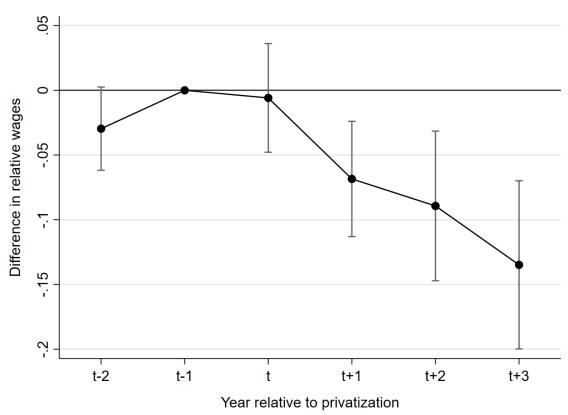  
(a) All workers

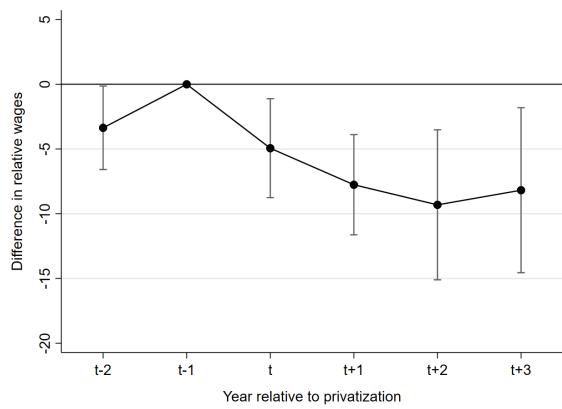  
(b) Incumbents  
Note: The figures show the estimates of time-to-event dummies interacted with a privatization indicator from regressions including individual, region, sector, time-to-event dummies, and year fixed effects. Panel (a) includes all workers employed in SOEs at the time of treatment, while panel (b) only includes workers that stayed in the same company until $t + 3$ . The dependent variable is relative wages. Relative wages are measured by dividing the worker's monthly wage by the worker's average wage in year $t - 1$ . Year $t - 1$ is the base year. Vertical bars show estimated $95\%$ confidence interval based on standard errors clustered at individual level.

Figure 3: Effect of privatization on workers' wages for different groups  
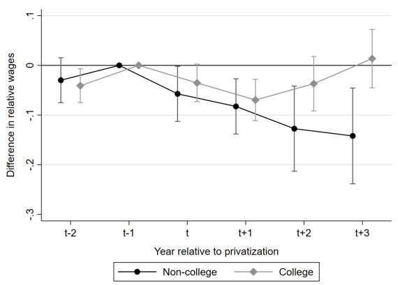  
(a) Education

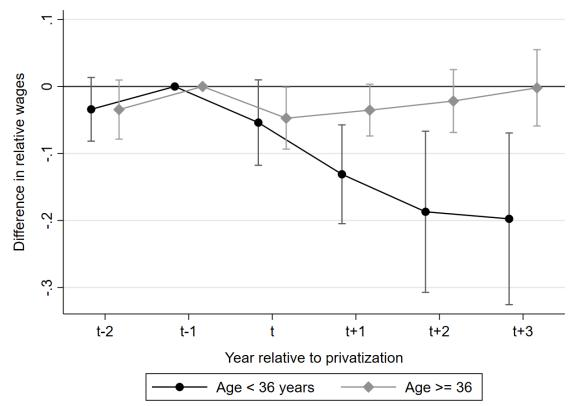  
(b) Age

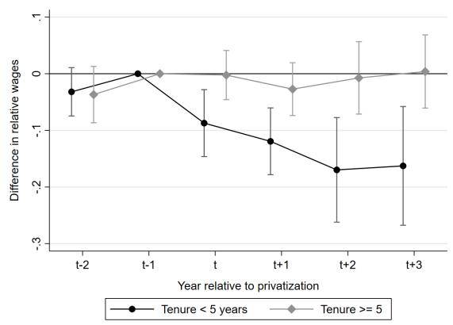  
(c) Tenure

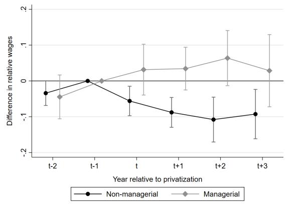  
(d) Occupation  
Note: The figures show the estimates of time-to-event dummies interacted with a privatization indicator from regressions including individual, region, sector, time-to-event dummies, and year fixed effects. All panels only include workers that stayed in the same company until $t + 3$ . The dependent variable is relative wages. Relative wages are measured by dividing the worker's monthly wage by the worker's average wage in year t - 1. Year t - 1 is the base year. Vertical bars show estimated 95% confidence interval based on standard errors clustered at individual level.

In addition to workers' wages, we examine the impact of privatization on workers' probability of unemployment for different groups (see Figure 4). Altogether, the results indicate that privatized firms tend to lay off more educated, older, and long-tenured individuals. For instance, in $t + 3$ , college workers are $10\%$ more likely to be unemployed, which is largely similar to the findings for long-tenured workers. Our findings coincide with those observed in Arnold (2022), who also find that short-tenured workers were less likely to be displaced following privatization. Similarly, Olsson and Tåg (2021) find that older workers are at a higher risk of unemployment following privatizations in Sweden.

Figure 4: Effect of privatization on workers' probability of unemployment  
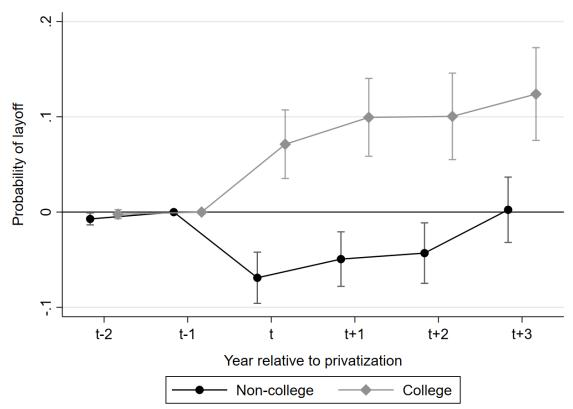  
(a) Education

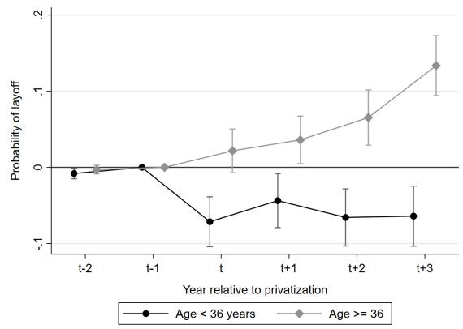  
(b) Age

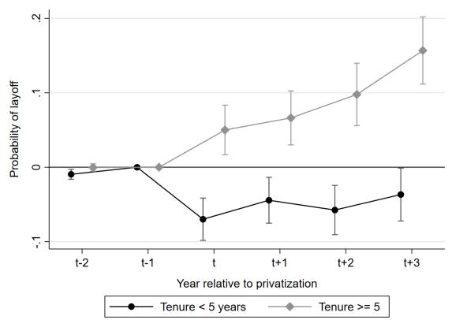  
(c) Tenure

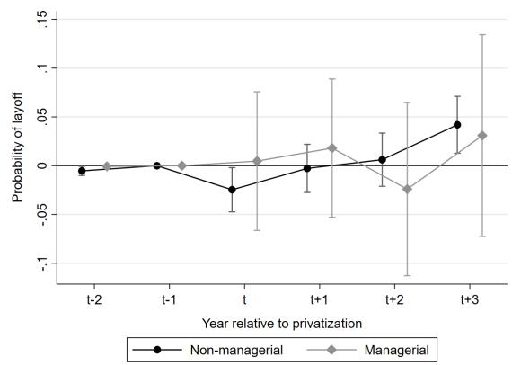  
(d) Occupation  
Note: The figures show the estimates of time-to-event dummies interacted with a privatization indicator from regressions including individual, region, sector, time-to-event dummies, and year fixed effects. The dependent variable is a dummy equal to one if the worker is out of the formal labor market in a given year. Year t-1 is the base year. Vertical bars show estimated $95\%$ confidence interval based on standard errors clustered at individual level.

While the previous results are associated with workers dynamics, an important question is what happens with the privatized firms. Interestingly, workers' displacement does not result in a substantial decline in firms' employment. We take the sample of SOEs with at least 50 employees in the year before the potential event and match on firms' characteristics (average wage, size, share of college-educated workers, and sector). Figure 5 presents the estimates of Equation 5 at the firm-level. Panel (a) is largely consistent with our findings at the worker level, showing a substantial decline in average wages. In contrast, panel (b) indicates that privatized companies do not reduce employment. Overall, these findings align with the hypothesis that privatized firms go through a significant reorganization of the labor force (Boycko et al., 1996) after privatization. If political interests capture state-owned enterprises, resulting in excess employment and a disparity between workers' wages and productivity, new owners are likely willing to opt for a restructuring process (Olsson and Tåg, 2021).

Figure 5: Effect of privatization on firms' average wages and employment  
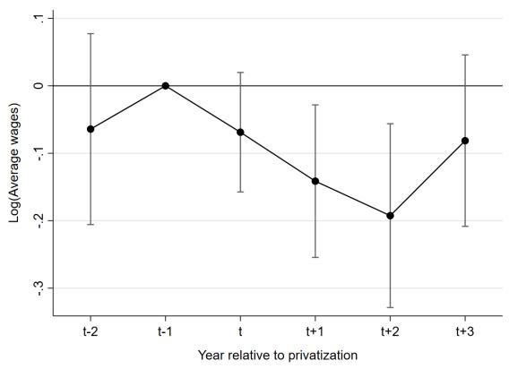  
(a) Average wage

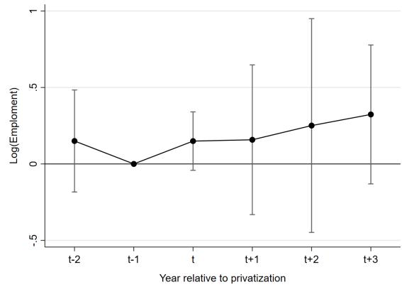  
(b) Employment  
Note: The figures show the estimates of time-to-event dummies interacted with a privatization indicator from regressions including individual, sector, time-to-event dummies, and year fixed effects. The dependent variables are the logarithm of average wages and the logarithm of total employment. Year t - 1 is the base year. Vertical bars show estimated $95\%$ confidence interval based on standard errors clustered at firm level.

## 5 Impact on business dynamism

While it is important to understand whether BOS fulfill their objective in terms of employment or innovation, a critical issue for policy is what are the impacts of the state footprint on other firms and markets more generally. To this end, we explore some empirical trends in business dynamism for Brazil and investigate how the presence of BOS is associated with some key metrics of dynamism. Given the available information in RAIS, we focus on the metrics of business dynamism that can be measured with employment and establishment entry and exit using data from 2010 to 2020. While it is well documented that business dynamism in the United States had been declining over the last few decades (see Akcigit and Ates (2021)), less is known about a large developing economy like Brazil.

## 5.1 Facts of business dynamism

## Market concentration

First, we describe the evolution of the concentration of BOS in economic activity, measured as the fraction of employment in BOS relative to total employment. Figure 6 shows that the aggregate concentration of BOS in Brazil has not changed dramatically over time, fluctuating between 3.6% and 3.8% from 2010 to 2020. Confirming our previous description of BOS characteristics in section 3, Figure A1 in the Appendix shows that BOS are concentrated in a small number of industries. Electricity and gas is the industry where BOS are most prominent, accounting for almost 60% of employment in that sector during the sample period. In water distribution and mining industries, BOS account for about 40% of employment, and 30% of employment in financial activities.

Figure 6: Employment share of BOS.  
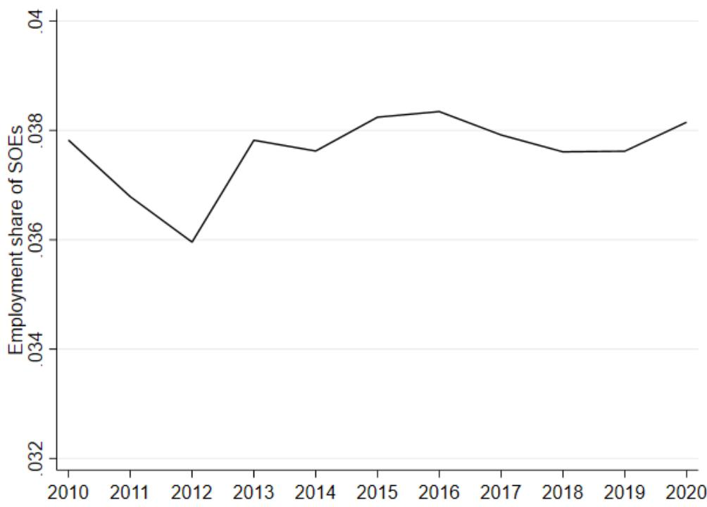  
Note: Aggregate employment share of BOS for the private sector, measured as the percentage of employment in BOS relative to aggregate employment. Data includes productive sectors from RAIS, 2010-2020.

## Entry and exit

Next, Figure 7 illustrates aggregate entry and exit rates. Consistent with evidence documenting lower entry rates over time in the United States (Decker et al., 2016), Figure 7 illustrates that Brazil has faced a steady decrease in firm entry rates until 2016, from 20% to about 15%, and then slightly increased from 2016 to 2019. At the same time, exit rates remained relatively stable at around 15% during this period. However, we show that the outbreak of the Covid-19 pandemic has had adverse effects on business dynamism in Brazil, leading to a sharp drop of 5 percentage points in both entry and exit rates in 2020. In the Appendix, we provide evidence that this pattern is robust for most disaggregated sectors, and that the negative effects of the pandemic resulted in lower dynamism across all industries (Figure A2).

Figure 7: Entry and exit rates.  
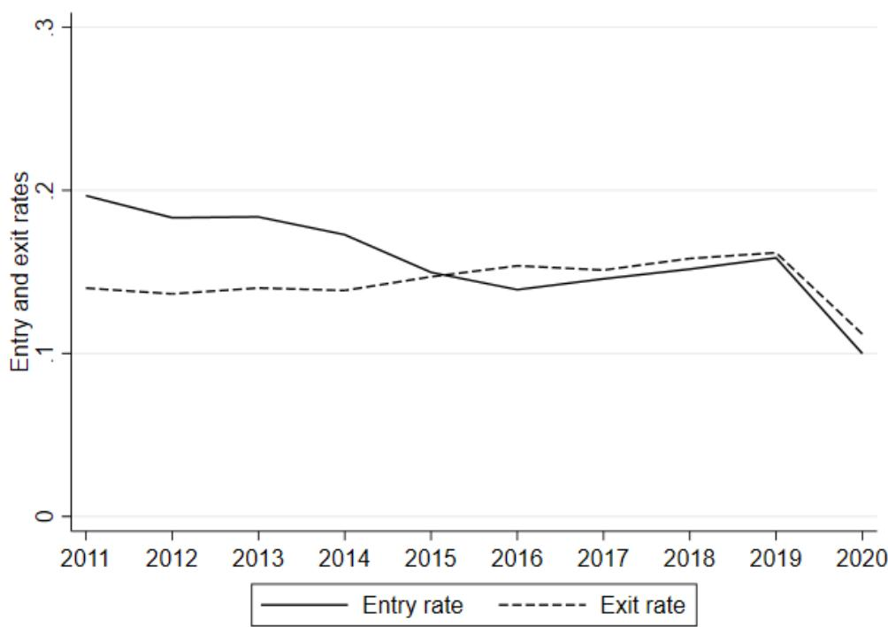  
Note: Aggregate entry and exit rates for the private sector. Entry rate in year t is the number of entering firms from t-1 to t divided by the average number of incumbent firms in years t-1 and t. Exit rate in year t is the number of firms exiting the market from t-1 to t divided by the average number of incumbent firms in years t-1 and t. Data includes productive sectors from RAIS, 2010-2020.

Following the observed decline in the entry rate of new firms, we also find a steady fall in the employment share of young firms. Figure 8 reveals that the fraction of employment in firms operating for less than five years has decreased from $20\%$ in 2010 to less than

15% in 2020. This empirical fact is consistent with evidence from Criscuolo et al. (2014) documenting the declining rate of start-ups in Brazil. The show a decline of ten percentage points in the share of young firms, defined as firms with up to three years of age, from 2002 to 2010. Lower levels of entrepreneurship can slow down competition and selection in markets, leading to lower life cycle growth and detrimental effects on aggregate productivity growth (Hsieh and Klenow, 2014). At the sector level, the fraction of employment in young firms either decreases or remains roughly constant across all sectors, with the exception of household services.

Figure 8: Employment share of <5-year old firms.  
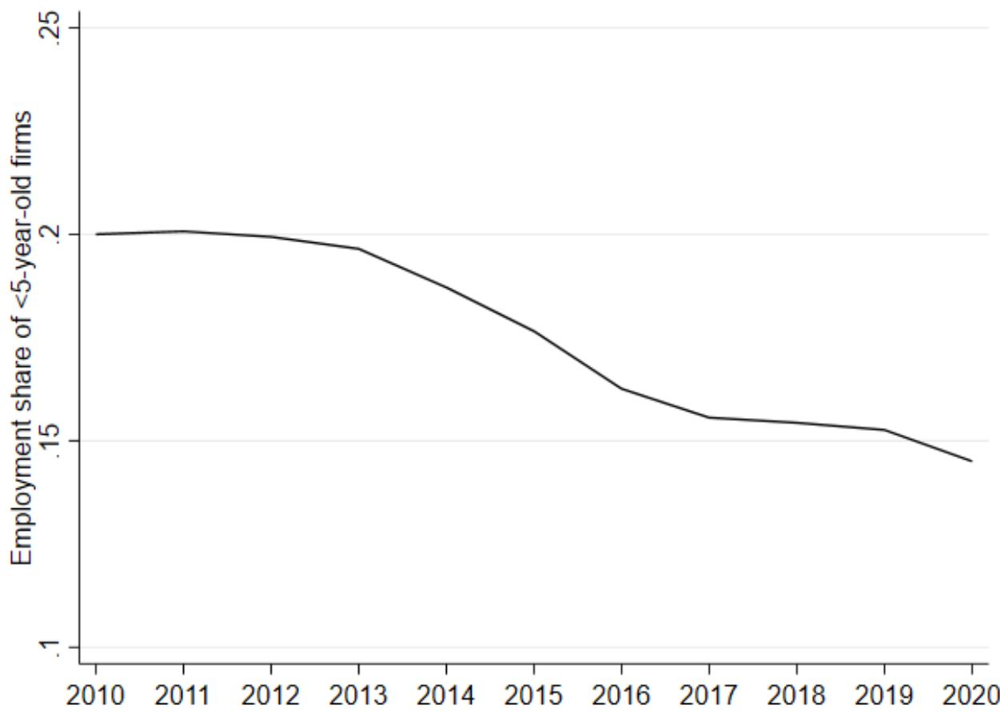  
Note: Fraction of employment of firms with up to 5 years of age relative to aggregate employment. Data includes productive sectors from RAIS, 2010-2020.

## Churning and reallocation

Figure 9 plots the gross job creation and job destruction in Brazil from 2010 to 2020. Gross job creation rate in year t is defined as the sum of employment gains across expanding and new firms between t - 1 and t, divided by the average number of incumbent firms in periods t - 1 and t. Likewise, gross job destruction rate in year t is the sum of employment losses across contracting or exiting firms between t - 1 and t, divided by the average number of firms operating in these two periods. Job creation and destruction have mirrored trends during the period. While job creation falls in the first half of the sample and increases in the second half, job destruction first increases and then decreases. In 2020, following the economic crisis triggered by the pandemic, we observe a trend reversal characterized by a sharp drop in the aggregate entry rate, from 16% to 9%. The effect for exit rates was not as pronounced, and the decrease for this period does not contrast with the downward trend observed in previous years. Figure 10 plots, in addition to gross job creation and destruction, net employment change (the difference between job creation and destruction rates) and job reallocation (the sum of job creation and destruction rates). The figure indicates that there is a downward trend in job reallocation, a measure of business dynamism, although our data does not span a period of time as long as other studies (Decker et al., 2016). In 2020, following the outbreak of pandemic, the sharp reduction in job creation leads to a similar movement in job reallocation and net employment change. Figures A4 and A5 in the Appendix confirm that these facts also hold at the sector level.

Figure 9: Job creation and destruction.  
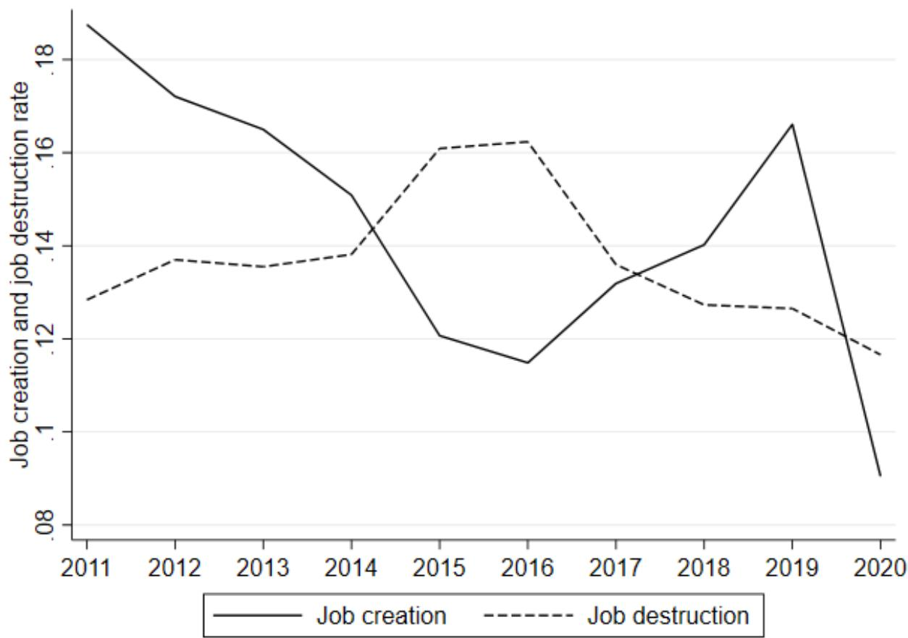  
Note: Gross job creation in year t is the sum of employment gains across all firms that expand or entry the market between years t - 1 and t divided by the average number of operating firms in years t - 1 and t. Gross job destruction in year t is the sum of employment losses across all firms that contract or shut down, divided by the average number of operating firms across the two periods. Data includes productive sectors from RAIS, 2010-2020.

Figure 10: Job reallocation.  
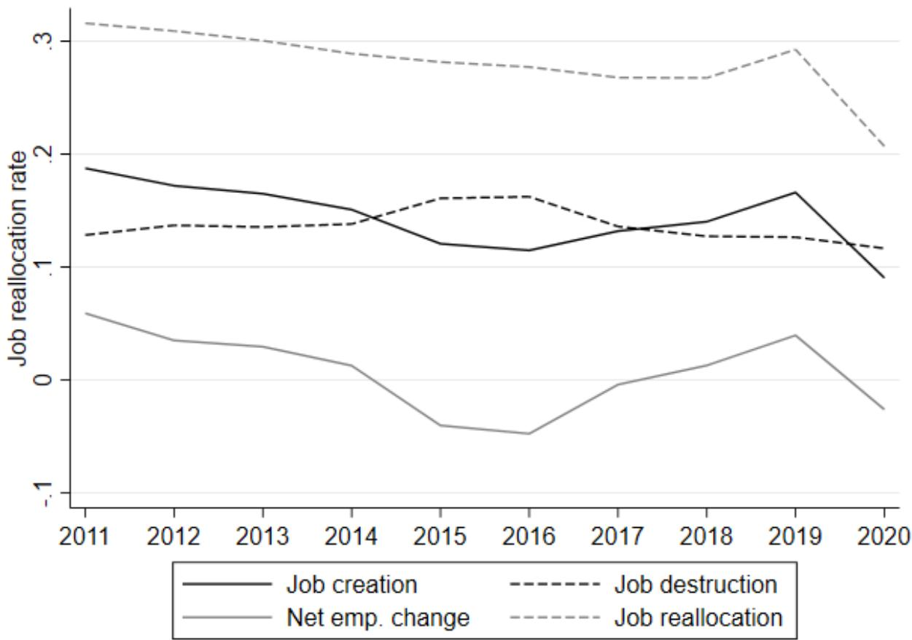  
Note: Gross job creation in year t is the sum of employment gains across all firms that expand or entry the market between years t - 1 and t divided by the average number of operating firms in years t - 1 and t. Gross job destruction in year t is the sum of employment losses across all firms that contract or shut down, divided by the average number of operating firms across the two periods. Net employment change is the difference between gross job creation and destruction. Gross job reallocation is the sum of gross job creation and gross job destruction. Data includes productive sectors from RAIS, 2010-2020.

A lower level of business dynamism is also associated with declining variation in firm-level growth rates. Although there is a declining trend in the standard deviation of firm-level employment growth rates after 2016 for the private sector, the dispersion in employment growth for BOS limits any conclusions, at least considering the limited time series available (Figure 11). In the Appendix, we show that this fact also holds at the sector level (Figure A6).

Figure 11: Standard deviation of firm employment growth.  
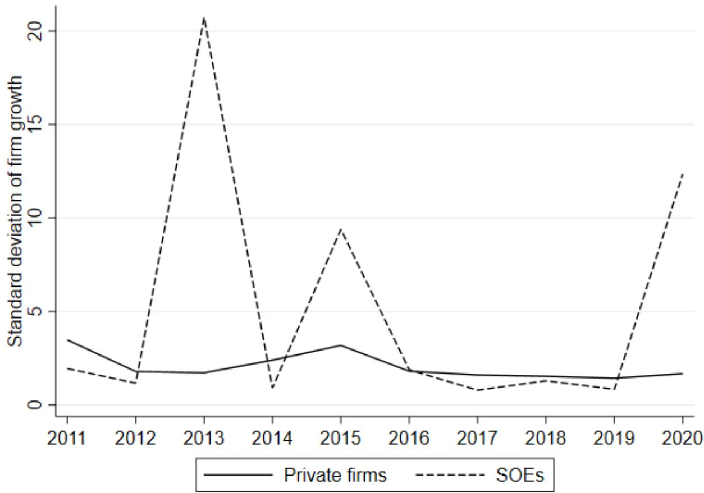  
Note: Standard deviation of firm-level employment growth rates for private firms and BOS. Data includes productive sectors from RAIS, 2010-2020.

## 5.2 BOS and business dynamism

We test whether a high concentration of BOS is associated with different metrics of business dynamism using variation in the industry-level share of BOS employment. We run simple regressions where the dependent variable is one of the measures of business dynamism highlighted by Akcigit and Ates (2021): entry rate, exit rate, share of employment in young firms, standard deviation of employment growth rate, gross job creation, gross job destruction, net employment change, gross job reallocation, and the Herfindahl–Hirschman index (HHI) $^{16}$ ; and the independent variable of interest is the industry-level concentration of BOS, measured as the fraction of employment in BOS relative to total industry employment. To control for industry-level factors affecting firm dynamics, we include the average firm size - measured by employment - and age in year t - 1, employment share, and lastly sector and year fixed effects. Because of the sharp effects of the Covid-19 pandemic on firm dynamics, we exclude 2020 from our analysis, and instead focus on the period from 2016 to 2019.

Table 15 presents the baseline estimation results at the 2-digit industry level for the nine measures of business dynamism. We find that a higher concentration of BOS in industry-level employment is associated with lower employment share of young firms and increased market concentration as measured by the HHI, consistent with lower levels of business dynamism. On the other hand, we find that the share of employment in BOS is also related with higher job creation and lower job destruction, which result in net positive effect over employment change. However, their similar magnitudes result in an overall effect on job reallocation that is not statistically different from zero. Moreover, we do not find evidence that the concentration of BOS either encourages or discourages firm entry, and exit rates are not statistically different from other industries with lower presence of state businesses. In Table 16, we show that our results are consistent when estimated at a more disaggregated industry classification at the 3-digit level.

Finally, we perform one last robustness check by restricting the sample to competitive industries at the 2-digit level. Table 17 reports that all of the results described previously - considering the entirety of the economy - persist. Additionally, we find a statistically significant negative correlation between exit rates and the concentration of BOS in competitive industries. Our results suggest that industries with a higher presence of BOS are characterized by lower shares of young firms, lower levels of selection and higher market concentration, all of which contribute to restricting business dynamism and firm life growth (Hsieh and Klenow, 2014). However, we do not find a statistically significant relationship between the employment share of BOS and entry rates, which would corroborate the negative relationship reported for entrepreneurship activity, measured by the employment share of young firms. In terms of the labor market, a positive correlation between the presence of BOS and job creation could be reflecting the ability of these firms to grow even in an environment of overall lower business dynamics. As we have shown in section 3, firms with state participation have higher employment growth rates relative to private firms.

Table 15: Business dynamism and SOE concentration at the sectoral level (2d), 2016-2019.

<table><tr><td rowspan="2"></td><td>Entry rate</td><td>Exit rate</td><td>Share young</td><td>SD(growth)</td><td>Creation</td><td>Destr.</td><td>Net change</td><td>Realloc.</td><td>HHI</td></tr><tr><td>(1)</td><td>(2)</td><td>(3)</td><td>(4)</td><td>(5)</td><td>(6)</td><td>(7)</td><td>(8)</td><td>(9)</td></tr><tr><td>Share of emp. in BOS</td><td>0.0355(0.0785)</td><td>-0.0677(0.0492)</td><td>-0.319**(0.157)</td><td>-0.581(3.112)</td><td>0.650***(0.209)</td><td>-0.703*(0.410)</td><td>1.353***(0.394)</td><td>-0.0526(0.518)</td><td>0.290***(0.0463)</td></tr><tr><td>Average size</td><td>Yes</td><td>Yes</td><td>Yes</td><td>Yes</td><td>Yes</td><td>Yes</td><td>Yes</td><td>Yes</td><td>Yes</td></tr><tr><td>Average age</td><td>Yes</td><td>Yes</td><td>Yes</td><td>Yes</td><td>Yes</td><td>Yes</td><td>Yes</td><td>Yes</td><td>Yes</td></tr><tr><td>Sector emp. share</td><td>Yes</td><td>Yes</td><td>Yes</td><td>Yes</td><td>Yes</td><td>Yes</td><td>Yes</td><td>Yes</td><td>Yes</td></tr><tr><td>Sector 2d</td><td>Yes</td><td>Yes</td><td>Yes</td><td>Yes</td><td>Yes</td><td>Yes</td><td>Yes</td><td>Yes</td><td>Yes</td></tr><tr><td>Year</td><td>Yes</td><td>Yes</td><td>Yes</td><td>Yes</td><td>Yes</td><td>Yes</td><td>Yes</td><td>Yes</td><td>Yes</td></tr><tr><td>Observations</td><td>340</td><td>340</td><td>340</td><td>340</td><td>340</td><td>340</td><td>340</td><td>340</td><td>340</td></tr><tr><td>R-squared</td><td>0.943</td><td>0.843</td><td>0.982</td><td>0.443</td><td>0.892</td><td>0.754</td><td>0.640</td><td>0.883</td><td>0.992</td></tr></table>

Note: Dependent variables at the 2-digit industry level are, for each column, entry rate, exit rate, share of employment in firms up to 5 years of age, standard deviation of employment growth rate, gross job creation, gross job destruction, net employment change, job reallocation, and the Herfindahl–Hirschman index (HHI). The share of employment in SOEs is the fraction of employment in all SOEs relative to total employment. All models include year and sector-fixed effects. Data includes private sectors from RAIS, 2016-2019. Robust standard errors in parentheses. Significance levels: \* 10%, \*\* 5%, \*\*\* 1%.

Table 16: Business dynamism and SOE concentration at the sectoral level (3d), 2016-2019.

<table><tr><td rowspan="2"></td><td>Entry rate</td><td>Exit rate</td><td>Share young</td><td>SD(growth)</td><td>Creation</td><td>Destr.</td><td>Net change</td><td>Realloc.</td><td>HHI</td></tr><tr><td>(1)</td><td>(2)</td><td>(3)</td><td>(4)</td><td>(5)</td><td>(6)</td><td>(7)</td><td>(8)</td><td>(9)</td></tr><tr><td>Share of emp. in BOS</td><td>0.0256(0.0222)</td><td>-0.00955(0.0302)</td><td>-0.0946***(0.0360)</td><td>0.463(1.713)</td><td>0.136**(0.0607)</td><td>-0.147*(0.0878)</td><td>0.283**(0.124)</td><td>-0.0109(0.0858)</td><td>0.578***(0.121)</td></tr><tr><td>Average size</td><td>Yes</td><td>Yes</td><td>Yes</td><td>Yes</td><td>Yes</td><td>Yes</td><td>Yes</td><td>Yes</td><td>Yes</td></tr><tr><td>Average age</td><td>Yes</td><td>Yes</td><td>Yes</td><td>Yes</td><td>Yes</td><td>Yes</td><td>Yes</td><td>Yes</td><td>Yes</td></tr><tr><td>Sector emp. share</td><td>Yes</td><td>Yes</td><td>Yes</td><td>Yes</td><td>Yes</td><td>Yes</td><td>Yes</td><td>Yes</td><td>Yes</td></tr><tr><td>Sector 3d</td><td>Yes</td><td>Yes</td><td>Yes</td><td>Yes</td><td>Yes</td><td>Yes</td><td>Yes</td><td>Yes</td><td>Yes</td></tr><tr><td>Year</td><td>Yes</td><td>Yes</td><td>Yes</td><td>Yes</td><td>Yes</td><td>Yes</td><td>Yes</td><td>Yes</td><td>Yes</td></tr><tr><td>Observations</td><td>1107</td><td>1107</td><td>1107</td><td>1096</td><td>1107</td><td>1107</td><td>1107</td><td>1107</td><td>1107</td></tr><tr><td>R-squared</td><td>0.831</td><td>0.724</td><td>0.949</td><td>0.372</td><td>0.775</td><td>0.715</td><td>0.579</td><td>0.830</td><td>0.968</td></tr></table>

Note: Dependent variables at the 3-digit industry level are, for each column, entry rate, exit rate, share of employment in firms up to 5 years of age, standard deviation of employment growth rate, gross job creation, gross job destruction, net employment change, job reallocation, and the Herfindahl–Hirschman index (HHI). The share of employment in SOEs is the fraction of employment in all SOEs relative to total employment. All models include year and sector-fixed effects. Data includes private sectors from RAIS, 2016-2019. Robust standard errors in parentheses. Significance levels: \* 10%, \*\* 5%, \*\*\* 1%.

Table 17: Business dynamism and SOE concentration at the sectoral level (2d), 2016-2019. Competitive sectors.

<table><tr><td rowspan="2"></td><td>Entry rate</td><td>Exit rate</td><td>Share young</td><td>SD(growth)</td><td>Creation</td><td>Destr.</td><td>Net change</td><td>Realloc.</td><td>HHI</td></tr><tr><td>(1)</td><td>(2)</td><td>(3)</td><td>(4)</td><td>(5)</td><td>(6)</td><td>(7)</td><td>(8)</td><td>(9)</td></tr><tr><td>Share of emp. in SOEs</td><td>0.0446(0.0863)</td><td>-0.150**(0.0577)</td><td>-0.357**(0.180)</td><td>1.657(2.120)</td><td>0.738***(0.224)</td><td>-0.830*(0.435)</td><td>1.567***(0.334)</td><td>-0.0920(0.606)</td><td>0.262***(0.0403)</td></tr><tr><td>Average size</td><td>Yes</td><td>Yes</td><td>Yes</td><td>Yes</td><td>Yes</td><td>Yes</td><td>Yes</td><td>Yes</td><td>Yes</td></tr><tr><td>Average age</td><td>Yes</td><td>Yes</td><td>Yes</td><td>Yes</td><td>Yes</td><td>Yes</td><td>Yes</td><td>Yes</td><td>Yes</td></tr><tr><td>Sector emp. share</td><td>Yes</td><td>Yes</td><td>Yes</td><td>Yes</td><td>Yes</td><td>Yes</td><td>Yes</td><td>Yes</td><td>Yes</td></tr><tr><td>Sector 2d</td><td>Yes</td><td>Yes</td><td>Yes</td><td>Yes</td><td>Yes</td><td>Yes</td><td>Yes</td><td>Yes</td><td>Yes</td></tr><tr><td>Year</td><td>Yes</td><td>Yes</td><td>Yes</td><td>Yes</td><td>Yes</td><td>Yes</td><td>Yes</td><td>Yes</td><td>Yes</td></tr><tr><td>Observations</td><td>260</td><td>260</td><td>260</td><td>260</td><td>260</td><td>260</td><td>260</td><td>260</td><td>260</td></tr><tr><td>R-squared</td><td>0.947</td><td>0.934</td><td>0.979</td><td>0.446</td><td>0.897</td><td>0.844</td><td>0.751</td><td>0.913</td><td>0.988</td></tr></table>

Note: Dependent variables at the 2-digit industry level are, for each column, entry rate, exit rate, share of employment in firms up to 5 years of age, standard deviation of employment growth rate, gross job creation, gross job destruction, net employment change, job reallocation, and the Herfindahl–Hirschman index (HHI). The share of employment in SOEs is the fraction of employment in all SOEs relative to total employment. All models include year and sector-fixed effects. The sample is restricted to competitive sectors. Data includes private sectors from RAIS, 2016-2019. Robust standard errors in parentheses. Significance levels: \* 10%, \*\* 5%, \*\*\* 1%.

## 6 Conclusion

This paper uses the employer-employee census in Brazil and data from ORBIS to better measure the state footprint in Brazil. BOS in Brazil are, on average, larger, older, and more innovative than the average private sector firm. This is especially the case for private firms with public investments, which are almost double the size of public firms and much more innovative when proxied by the share of technical occupations. This may suggest that the government's investment decisions are strategically focused on large, more productive, and innovative companies. In addition, SOEs are more present in sectors with high sunk costs and natural monopolies, but participated firms are more present in some manufacturing sectors, such as spacecraft or motor vehicles. Another interesting result is that there are heterogeneities across BOS types - public, mixed-capital, and private firms with direct or indirect state participation. In the three dimensions explored, participated firms outperformed public and mixed firms, which suggests inherent differences between this group of firms and other BOS.

Furthermore, we have explored the employment outcomes associated with working on a BOS in more detail. Consistent with the findings in other countries, we find a positive and significant wage premium associated with working on a BOS. Workers in BOS enjoy a wage premium ranging from 15.6% to 18.5%, partially due to their skill composition. However, when controlling for worker fixed effects, the premium decreases in magnitude to 4.5%. Although the average wage of BOS relative to private firms is highest for participated firms, this difference disappears once we account for occupation and worker characteristics essential to the wage-setting mechanism. Hence, in our preferred specification, we observe a wage premium only with public and mixed firms.

As an additional exercise, we use some episodes of privatization of public and mixed firms, especially in 2018, to explore what happens to wages and employment when firms are privatized. Consistent with the episodes in the 1990s (Arnold, 2022), we find that workers experience a wage decrease of around 10% in t+2 and 14% in t+3, and around 10% when restricting only to workers that stay in the privatized company. This suggests that some of the wage premium that workers in BOS experience is likely to be related to wage-setting mechanisms rather than productivity premiums, which are corrected once the firm is privatized. Interestingly, privatized firms managed to keep employment levels.

Finally, we provide some initial evidence on the potential effects of BOS presence over business dynamism by analyzing the correlation between the employment share of BOS and measures of market dynamics at the industry level. Using two different levels of data aggregation, at 2- or 3-digit sector levels, we find that a high concentration of BOS is associated with market outcomes related to lower business dynamism. In industries where BOS represent a considerable share of total employment, we observe a lower participation of young firms on employment, lower selection and higher market concentration. Nevertheless, we find that the presence of BOS is positively correlated with net employment change, which could be associated with the fact that employment growth rates are, on average, higher for BOS.

To conclude, while BOS clearly play an important role in terms of employment outcomes, both in terms of wages and in job creation resulting from employment growth, more research is needed to understand some of the potential negative effects these firms create. Not only can BOS have adverse impacts on business dynamism, but also through downstream and upstream channels. For example, given their presence in some natural monopolies, what are the potential effects through their prices? In addition, there is less clarity on their role in terms of investing in large and innovative private firms, and what this implies for their growth and future performance once invested.

## References

Akcigit, U. and S. T. Ates (2021). Ten facts on declining business dynamism and lessons from endogenous growth theory. American Economic Journal: Macroeconomics 13(1), 257–98.

Araújo, B. C. P. O. d., L. R. Cavalcante, and P. F. Alves (2009). Variáveis proxy para os gastos empresariais em inovação com base no pessoal ocupado técnico-científico disponível na Relação Anual de Informações Sociais (RAIS).

Arnold, D. (2022). The impact of privatization of state-owned enterprises on workers. American economic journal: applied economics 14(4), 343–80.

Bastos, P., N. P. Monteiro, and O. R. Straume (2014, October). The effect of private versus public ownership on labour earnings. Oxford Economic Papers 66(4), 983–1005.

Boycko, M., A. Shleifer, and R. W. Vishny (1996, March). A Theory of Privatisation. The Economic Journal 106(435), 309–319.

Callaway, B. and P. H. Sant'Anna (2021). Difference-in-differences with multiple time periods. Journal of Econometrics 225(2), 200–230. Themed Issue: Treatment Effect 1.

Card, D., A. R. Cardoso, J. Heining, and P. Kline (2018). Firms and labor market inequality: Evidence and some theory. Journal of Labor Economics 36(S1), S13–S70.

Cavalcanti, T. and M. Santos (2020, 09). (MIS) Allocation Effects of an Overpaid Public Sector. Journal of the European Economic Association 19(2), 953–999.

Criscuolo, C., P. N. Gal, and C. Menon (2014). The dynamics of employment growth: New evidence from 18 countries.

Dall'Olio, A., T. Goodwin, M. Martinez Licetti, A. C. Alonso Soria, M. Drozd, J. Orlowski, F. Patiño Peñ, and D. Sanchez-Navarro (2022). Are all state-owned enterprises equal? a taxonomy of economic activities to assess soe presence in the economy.

Decker, R. A., J. Haltiwanger, R. S. Jarmin, and J. Miranda (2016). Where has all the skewness gone? the decline in high-growth (young) firms in the us. European Economic Review 86, 4–23.

Gindling, T., Z. Hasnain, D. Newhouse, and R. Shi (2020). Are public sector workers in developing countries overpaid? evidence from a new global dataset. World Development 126, 104737.

Hsieh, C.-T. and P. J. Klenow (2014). The life cycle of plants in india and mexico. The Quarterly Journal of Economics 129(3), 1035–1084.

Iacus, S. M., G. King, and G. Porro (2012). Causal inference without balance checking: Coarsened exact matching. Political Analysis 20(1), 1–24.

La Porta, R. and F. López-de Silanes (1999, 11). The Benefits of Privatization: Evidence from Mexico\*. The Quarterly Journal of Economics 114(4), 1193–1242.

Lausev, J. (2014). What has 20 years of public–private pay gap literature told us? eastern european transitioning vs. developed economies. Journal of Economic Surveys 28(3), 516–550.

Lo, D., L. Gao, and Y. Lin (2022). State ownership and innovations: Lessons from the mixed-ownership reforms of china's listed companies. Structural Change and Economic Dynamics 60, 302–314.

Olsson, M. and J. Tåg (2021, February). What is the Cost of Privatization for Workers?

World Bank Group (2019). Gestão de Pessoas e Folha de Pagamentos no Setor Público Brasileiro: o Que Os Dados Dizem (Vol. 2) (Portuguese). http://documents.worldbank.org/curated/en/449951570645821631/Gesto-de-Pessoas-e-Folha-de-Pagamentos-no-Setor-Pblico-Brasileiro-o-Que-Os-Dados-Dizem.

## A Appendix A

Figure A1: Employment share of BOS by sector.  
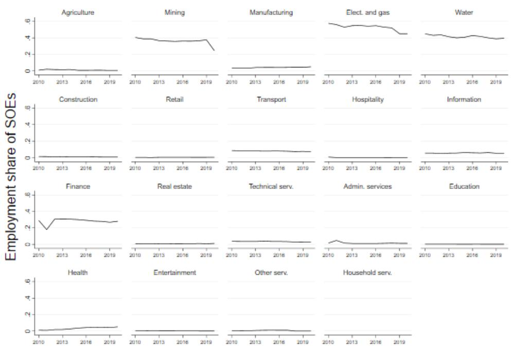  
Graphs by sector  
Note: Aggregate employment share of BOS for the private sector, measured as the percentage of employment in BOS relative to aggregate employment. Data includes productive sectors from RAIS, 2010-2020.

Table A1: Transition matrix of workers - Probabilities.

<table><tr><td></td><td>Private</td><td>Public</td><td>Mixed</td><td>Participated</td><td>Total</td></tr><tr><td>Private</td><td>99.79</td><td>0.02</td><td>0.02</td><td>0.17</td><td>100.00</td></tr><tr><td>Public</td><td>2.07</td><td>97.57</td><td>0.34</td><td>0.02</td><td>100.00</td></tr><tr><td>Mixed</td><td>2.12</td><td>2.49</td><td>94.40</td><td>0.99</td><td>100.00</td></tr><tr><td>Participated</td><td>8.12</td><td>0.07</td><td>0.15</td><td>91.65</td><td>100.00</td></tr><tr><td>Total</td><td>95.80</td><td>1.25</td><td>1.30</td><td>1.66</td><td>100.00</td></tr></table>

Table A2: Transition matrix of workers - Frequencies.

<table><tr><td></td><td>Private</td><td>Public</td><td>Mixed</td><td>Participated</td><td>Total</td></tr><tr><td>Private</td><td>94,457,493</td><td>20,159</td><td>18,473</td><td>161,141</td><td>94,657,266</td></tr><tr><td>Public</td><td>24,926</td><td>1,176,384</td><td>4,139</td><td>218</td><td>1,205,667</td></tr><tr><td>Mixed</td><td>28,215</td><td>33,161</td><td>1,255,851</td><td>13,154</td><td>1,330,381</td></tr><tr><td>Participated</td><td>129,478</td><td>1,167</td><td>2,461</td><td>1,461,426</td><td>1,594,532</td></tr><tr><td>Total</td><td>94,640,112</td><td>1,230,871</td><td>1,280,924</td><td>1,635,939</td><td>98,787,846</td></tr></table>

Table A3: Transition matrix of BOS status - Probabilities.

<table><tr><td></td><td>Private</td><td>BOS</td><td>Total</td></tr><tr><td>Private</td><td>99.99</td><td>0.01</td><td>100.00</td></tr><tr><td>BOS</td><td>24.66</td><td>75.34</td><td>100.00</td></tr><tr><td>Total</td><td>99.95</td><td>0.05</td><td>100.00</td></tr></table>

Table A4: Transition matrix of BOS status - Frequencies.

<table><tr><td></td><td>Private</td><td>BOS</td><td>Total</td></tr><tr><td>Private</td><td>8,772,858</td><td>479</td><td>8,773,337</td></tr><tr><td>BOS</td><td>1,292</td><td>3,948</td><td>5,240</td></tr><tr><td>Total</td><td>8,774,150</td><td>4,427</td><td>8,778,577</td></tr></table>

Table A5: Transition matrix of firm status - Probabilities.

<table><tr><td></td><td>Private</td><td>Public</td><td>Mixed</td><td>Participated</td><td>Total</td></tr><tr><td>Private</td><td>99.99</td><td>0.00</td><td>0.00</td><td>0.00</td><td>100.00</td></tr><tr><td>Public</td><td>41.50</td><td>57.83</td><td>0.57</td><td>0.09</td><td>100.00</td></tr><tr><td>Mixed</td><td>24.84</td><td>1.80</td><td>72.83</td><td>0.54</td><td>100.00</td></tr><tr><td>Participated</td><td>0.00</td><td>0.27</td><td>0.62</td><td>99.11</td><td>100.00</td></tr><tr><td>Total</td><td>99.95</td><td>0.02</td><td>0.02</td><td>0.02</td><td>100.00</td></tr></table>

Table A6: Transition matrix of firm status - Frequencies.

<table><tr><td></td><td>Private</td><td>Public</td><td>Mixed</td><td>Participated</td><td>Total</td></tr><tr><td>Private</td><td>8,772,858</td><td>310</td><td>169</td><td>0</td><td>8,773,337</td></tr><tr><td>Public</td><td>877</td><td>1,222</td><td>12</td><td>2</td><td>2,113</td></tr><tr><td>Mixed</td><td>415</td><td>30</td><td>1,217</td><td>9</td><td>1,671</td></tr><tr><td>Participated</td><td>0</td><td>4</td><td>9</td><td>1,443</td><td>1,456</td></tr><tr><td>Total</td><td>8,774,150</td><td>1,566</td><td>1,407</td><td>1,454</td><td>8,778,577</td></tr></table>

Table A7: Innovation intensity, 2016-2020. Excluding micro firms.

<table><tr><td rowspan="2"></td><td colspan="3">All sample</td><td colspan="3">Competitive sectors</td></tr><tr><td>(1)</td><td>(2)</td><td>(3)</td><td>(4)</td><td>(5)</td><td>(6)</td></tr><tr><td>SOE</td><td>0.0394***(0.00186)</td><td></td><td></td><td>0.0379***(0.00252)</td><td></td><td></td></tr><tr><td>SOE * 2020</td><td>0.0135***(0.00502)</td><td></td><td></td><td>0.0171**(0.00763)</td><td></td><td></td></tr><tr><td>Public</td><td></td><td>0.0283***(0.00309)</td><td></td><td></td><td>0.0236***(0.00371)</td><td></td></tr><tr><td>Mixed</td><td></td><td>0.0361***(0.00279)</td><td></td><td></td><td>0.0315***(0.00363)</td><td></td></tr><tr><td>Participated</td><td></td><td>0.0521***(0.00348)</td><td></td><td></td><td>0.0616***(0.00569)</td><td></td></tr><tr><td>Public * 2020</td><td></td><td>0.0234**(0.0105)</td><td></td><td></td><td>0.0353**(0.0166)</td><td></td></tr><tr><td>Mixed * 2020</td><td></td><td>0.00965(0.00745)</td><td></td><td></td><td>0.0105(0.0102)</td><td></td></tr><tr><td>Participated * 2020</td><td></td><td>0.00737(0.00836)</td><td></td><td></td><td>0.00305(0.0137)</td><td></td></tr><tr><td>Ownership 10-&lt;25%</td><td></td><td></td><td>0.0494***(0.00582)</td><td></td><td></td><td>0.0687***(0.0106)</td></tr><tr><td>Ownership 25-&lt;50%</td><td></td><td></td><td>0.0649***(0.00681)</td><td></td><td></td><td>0.0886***(0.0141)</td></tr><tr><td>Ownership 50-&lt;100%</td><td></td><td></td><td>0.0393***(0.00259)</td><td></td><td></td><td>0.0335***(0.00328)</td></tr><tr><td>Ownership 100%</td><td></td><td></td><td>0.0270***(0.00308)</td><td></td><td></td><td>0.0221***(0.00375)</td></tr><tr><td>Ownership 10-&lt;25% * 2020</td><td></td><td></td><td>0.00884(0.0141)</td><td></td><td></td><td>0.0117(0.0257)</td></tr><tr><td>Ownership 25-&lt;50% * 2020</td><td></td><td></td><td>0.0162(0.0167)</td><td></td><td></td><td>0.0181(0.0338)</td></tr><tr><td>Ownership 50-&lt;100% * 2020</td><td></td><td></td><td>0.00875(0.00650)</td><td></td><td></td><td>0.00703(0.00867)</td></tr><tr><td>Ownership 100% * 2020</td><td></td><td></td><td>0.0188*(0.0103)</td><td></td><td></td><td>0.0272*(0.0162)</td></tr><tr><td>Firm size</td><td>Yes</td><td>Yes</td><td>Yes</td><td>Yes</td><td>Yes</td><td>Yes</td></tr><tr><td>Firm age</td><td>Yes</td><td>Yes</td><td>Yes</td><td>Yes</td><td>Yes</td><td>Yes</td></tr><tr><td>Sector 2d</td><td>Yes</td><td>Yes</td><td>Yes</td><td>Yes</td><td>Yes</td><td>Yes</td></tr><tr><td>Year</td><td>Yes</td><td>Yes</td><td>Yes</td><td>Yes</td><td>Yes</td><td>Yes</td></tr><tr><td>Observations</td><td>2224743</td><td>2224743</td><td>2224540</td><td>1985821</td><td>1985821</td><td>1985669</td></tr><tr><td>R-squared</td><td>0.341</td><td>0.341</td><td>0.341</td><td>0.356</td><td>0.356</td><td>0.356</td></tr></table>

Table A8: Employment, 2016-2020. Excluding micro firms.

<table><tr><td rowspan="2"></td><td colspan="3">All sample</td><td colspan="3">Competitive sectors</td></tr><tr><td>(1)</td><td>(2)</td><td>(3)</td><td>(4)</td><td>(5)</td><td>(6)</td></tr><tr><td>BOS</td><td>0.271***(0.0154)</td><td></td><td></td><td>0.265***(0.0191)</td><td></td><td></td></tr><tr><td>BOS * 2020</td><td>0.0452(0.0372)</td><td></td><td></td><td>0.0623(0.0514)</td><td></td><td></td></tr><tr><td>Public</td><td></td><td>0.210***(0.0295)</td><td></td><td></td><td>0.149***(0.0318)</td><td></td></tr><tr><td>Mixed</td><td></td><td>0.255***(0.0233)</td><td></td><td></td><td>0.196***(0.0262)</td><td></td></tr><tr><td>Participated</td><td></td><td>0.338***(0.0264)</td><td></td><td></td><td>0.478***(0.0408)</td><td></td></tr><tr><td>Public * 2020</td><td></td><td>0.190**(0.0846)</td><td></td><td></td><td>0.164(0.1000)</td><td></td></tr><tr><td>Mixed * 2020</td><td></td><td>0.0109(0.0625)</td><td></td><td></td><td>0.0148(0.0795)</td><td></td></tr><tr><td>Participated * 2020</td><td></td><td>-0.0196(0.0554)</td><td></td><td></td><td>-0.0401(0.0884)</td><td></td></tr><tr><td>Ownership 10-&lt;25%</td><td></td><td></td><td>0.287***(0.0514)</td><td></td><td></td><td>0.465***(0.0914)</td></tr><tr><td>Ownership 25-&lt;50%</td><td></td><td></td><td>0.200***(0.0350)</td><td></td><td></td><td>0.315***(0.0610)</td></tr><tr><td>Ownership 50-&lt;100%</td><td></td><td></td><td>0.257***(0.0214)</td><td></td><td></td><td>0.228***(0.0257)</td></tr><tr><td>Ownership 100%</td><td></td><td></td><td>0.224***(0.0289)</td><td></td><td></td><td>0.149***(0.0310)</td></tr><tr><td>Ownership 10-&lt;25% * 2020</td><td></td><td></td><td>-0.0231(0.111)</td><td></td><td></td><td>-0.0557(0.206)</td></tr><tr><td>Ownership 25-&lt;50% * 2020</td><td></td><td></td><td>-0.0523(0.0725)</td><td></td><td></td><td>-0.0172(0.131)</td></tr><tr><td>Ownership 50-&lt;100% * 2020</td><td></td><td></td><td>0.0160(0.0542)</td><td></td><td></td><td>0.0108(0.0712)</td></tr><tr><td>Ownership 100% * 2020</td><td></td><td></td><td>0.170**(0.0818)</td><td></td><td></td><td>0.131(0.0962)</td></tr><tr><td>Firm size</td><td>Yes</td><td>Yes</td><td>Yes</td><td>Yes</td><td>Yes</td><td>Yes</td></tr><tr><td>Firm age</td><td>Yes</td><td>Yes</td><td>Yes</td><td>Yes</td><td>Yes</td><td>Yes</td></tr><tr><td>Sector 2d</td><td>Yes</td><td>Yes</td><td>Yes</td><td>Yes</td><td>Yes</td><td>Yes</td></tr><tr><td>Year</td><td>Yes</td><td>Yes</td><td>Yes</td><td>Yes</td><td>Yes</td><td>Yes</td></tr><tr><td>Observations</td><td>2224743</td><td>2224743</td><td>2224540</td><td>1985821</td><td>1985821</td><td>1985669</td></tr><tr><td>R-squared</td><td>0.598</td><td>0.598</td><td>0.598</td><td>0.586</td><td>0.586</td><td>0.586</td></tr></table>

Table A9: Employment growth, 2016-2020. Excluding micro firms.

<table><tr><td rowspan="2"></td><td colspan="3">All sample</td><td colspan="3">Competitive sectors</td></tr><tr><td>(1)</td><td>(2)</td><td>(3)</td><td>(4)</td><td>(5)</td><td>(6)</td></tr><tr><td>BOS</td><td>0.0161**(0.00726)</td><td></td><td></td><td>0.0161*(0.00948)</td><td></td><td></td></tr><tr><td>BOS * 2020</td><td>-0.00191(0.0191)</td><td></td><td></td><td>0.00921(0.0308)</td><td></td><td></td></tr><tr><td>Public</td><td></td><td>0.0143(0.0136)</td><td></td><td></td><td>0.00734(0.0170)</td><td></td></tr><tr><td>Mixed</td><td></td><td>0.00352(0.0122)</td><td></td><td></td><td>-0.00183(0.0148)</td><td></td></tr><tr><td>Participated</td><td></td><td>0.0302***(0.0107)</td><td></td><td></td><td>0.0478***(0.0168)</td><td></td></tr><tr><td>Public * 2020</td><td></td><td>-0.0197(0.0182)</td><td></td><td></td><td>-0.0190(0.0249)</td><td></td></tr><tr><td>Mixed * 2020</td><td></td><td>0.0217(0.0484)</td><td></td><td></td><td>0.0332(0.0731)</td><td></td></tr><tr><td>Participated * 2020</td><td></td><td>-0.0149(0.0194)</td><td></td><td></td><td>-0.00925(0.0328)</td><td></td></tr><tr><td>Ownership 10-&lt;25%</td><td></td><td></td><td>0.0411**(0.0206)</td><td></td><td></td><td>0.0663*(0.0381)</td></tr><tr><td>Ownership 25-&lt;50%</td><td></td><td></td><td>0.0295*(0.0177)</td><td></td><td></td><td>0.0519*(0.0293)</td></tr><tr><td>Ownership 50-&lt;100%</td><td></td><td></td><td>0.00251(0.0106)</td><td></td><td></td><td>-0.000902(0.0130)</td></tr><tr><td>Ownership 100%</td><td></td><td></td><td>0.0153(0.0133)</td><td></td><td></td><td>0.00850(0.0167)</td></tr><tr><td>Ownership 10-&lt;25% * 2020</td><td></td><td></td><td>-0.000522(0.0274)</td><td></td><td></td><td>0.00467(0.0517)</td></tr><tr><td>Ownership 25-&lt;50% * 2020</td><td></td><td></td><td>-0.0144(0.0327)</td><td></td><td></td><td>-0.0172(0.0589)</td></tr><tr><td>Ownership 50-&lt;100% * 2020</td><td></td><td></td><td>0.0142(0.0402)</td><td></td><td></td><td>0.0342(0.0621)</td></tr><tr><td>Ownership 100% * 2020</td><td></td><td></td><td>-0.0189(0.0183)</td><td></td><td></td><td>-0.0160(0.0257)</td></tr><tr><td>Firm size</td><td>Yes</td><td>Yes</td><td>Yes</td><td>Yes</td><td>Yes</td><td>Yes</td></tr><tr><td>Firm age</td><td>Yes</td><td>Yes</td><td>Yes</td><td>Yes</td><td>Yes</td><td>Yes</td></tr><tr><td>Sector 2d</td><td>Yes</td><td>Yes</td><td>Yes</td><td>Yes</td><td>Yes</td><td>Yes</td></tr><tr><td>Year</td><td>Yes</td><td>Yes</td><td>Yes</td><td>Yes</td><td>Yes</td><td>Yes</td></tr><tr><td>Observations</td><td>2224743</td><td>2224743</td><td>2224540</td><td>1985821</td><td>1985821</td><td>1985669</td></tr><tr><td>R-squared</td><td>0.00251</td><td>0.00251</td><td>0.00251</td><td>0.00752</td><td>0.00752</td><td>0.00752</td></tr></table>

Table A10: Firm-level BOS wage premium, 2016-2020. Excluding micro firms.

<table><tr><td rowspan="2"></td><td colspan="3">All sample</td><td colspan="3">Competitive sectors</td></tr><tr><td>(1)</td><td>(2)</td><td>(3)</td><td>(4)</td><td>(5)</td><td>(6)</td></tr><tr><td>SOE</td><td>0.556***(0.0117)</td><td></td><td></td><td>0.542***(0.0146)</td><td></td><td></td></tr><tr><td>SOE * 2020</td><td>0.0501*(0.0296)</td><td></td><td></td><td>0.0649(0.0423)</td><td></td><td></td></tr><tr><td>Public</td><td></td><td>0.426***(0.0219)</td><td></td><td></td><td>0.345***(0.0245)</td><td></td></tr><tr><td>Mixed</td><td></td><td>0.613***(0.0197)</td><td></td><td></td><td>0.572***(0.0230)</td><td></td></tr><tr><td>Participated</td><td></td><td>0.610***(0.0187)</td><td></td><td></td><td>0.724***(0.0262)</td><td></td></tr><tr><td>Public * 2020</td><td></td><td>0.266***(0.0726)</td><td></td><td></td><td>0.288***(0.0908)</td><td></td></tr><tr><td>Mixed * 2020</td><td></td><td>0.0222(0.0570)</td><td></td><td></td><td>-0.0239(0.0819)</td><td></td></tr><tr><td>Participated * 2020</td><td></td><td>-0.0563(0.0372)</td><td></td><td></td><td>-0.0800(0.0552)</td><td></td></tr><tr><td>Ownership 10-&lt;25%</td><td></td><td></td><td>0.499***(0.0348)</td><td></td><td></td><td>0.633***(0.0475)</td></tr><tr><td>Ownership 25-&lt;50%</td><td></td><td></td><td>0.602***(0.0313)</td><td></td><td></td><td>0.721***(0.0566)</td></tr><tr><td>Ownership 50-&lt;100%</td><td></td><td></td><td>0.640***(0.0179)</td><td></td><td></td><td>0.614***(0.0215)</td></tr><tr><td>Ownership 100%</td><td></td><td></td><td>0.442***(0.0215)</td><td></td><td></td><td>0.364***(0.0244)</td></tr><tr><td>Ownership 10-&lt;25% * 2020</td><td></td><td></td><td>-0.103*(0.0586)</td><td></td><td></td><td>-0.118(0.0882)</td></tr><tr><td>Ownership 25-&lt;50% * 2020</td><td></td><td></td><td>-0.0212(0.0590)</td><td></td><td></td><td>-0.0667(0.112)</td></tr><tr><td>Ownership 50-&lt;100% * 2020</td><td></td><td></td><td>0.00981(0.0495)</td><td></td><td></td><td>-0.0245(0.0711)</td></tr><tr><td>Ownership 100% * 2020</td><td></td><td></td><td>0.256***(0.0689)</td><td></td><td></td><td>0.283***(0.0852)</td></tr><tr><td>Firm size</td><td>Yes</td><td>Yes</td><td>Yes</td><td>Yes</td><td>Yes</td><td>Yes</td></tr><tr><td>Firm age</td><td>Yes</td><td>Yes</td><td>Yes</td><td>Yes</td><td>Yes</td><td>Yes</td></tr><tr><td>Sector 2d</td><td>Yes</td><td>Yes</td><td>Yes</td><td>Yes</td><td>Yes</td><td>Yes</td></tr><tr><td>Sector 4d</td><td></td><td></td><td></td><td></td><td></td><td></td></tr><tr><td>Year</td><td>Yes</td><td>Yes</td><td>Yes</td><td>Yes</td><td>Yes</td><td>Yes</td></tr><tr><td>Observations</td><td>2211388</td><td>2211388</td><td>2211186</td><td>1974154</td><td>1974154</td><td>1974003</td></tr><tr><td>R-squared</td><td>0.224</td><td>0.224</td><td>0.224</td><td>0.215</td><td>0.215</td><td>0.214</td></tr></table>

Figure A2: Entry and exit rates by sector.  
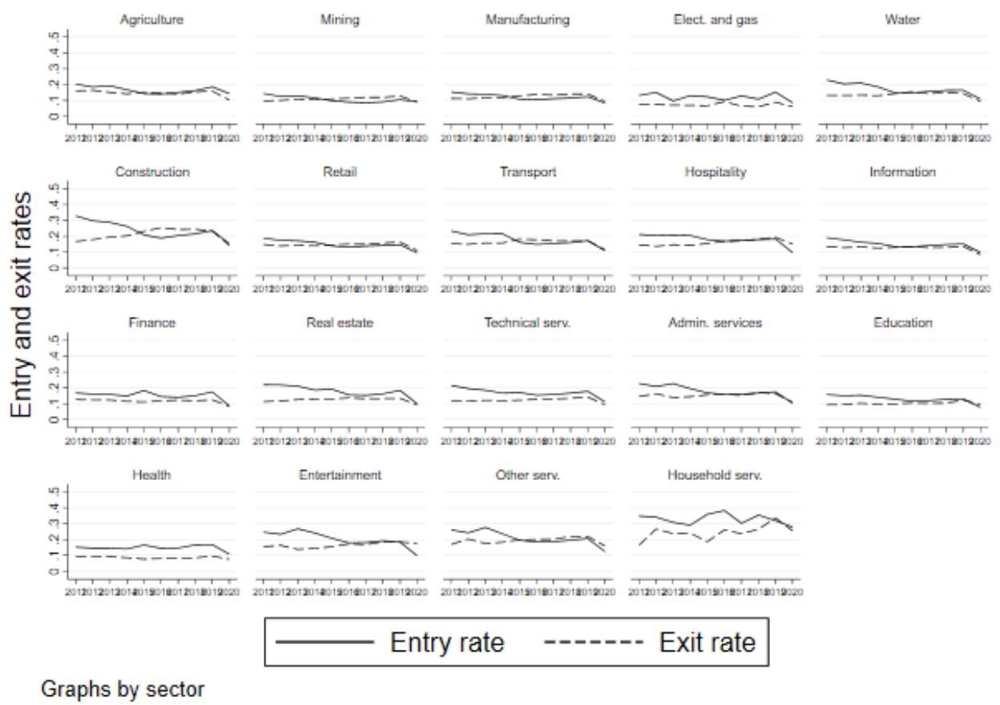  
Note: Aggregate entry and exit rates for the private sector. Entry rate in year t is the number of entering firms from t-1 to t divided by the number of incumbent firms in year t-1. Exit rate in year t is the number of firms exiting the market from t to $t+1$ divided by the number of incumbent firms in year t. Data includes private sectors from RAIS, 2010-2020.

Figure A3: Employment share of young firms by sector.  
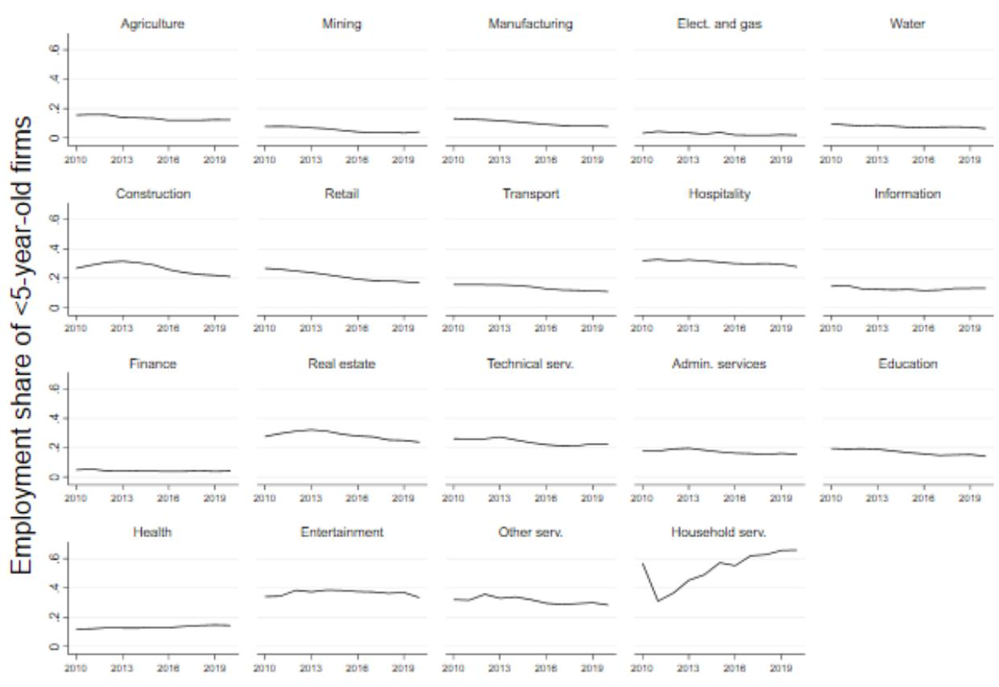  
Note: Fraction of employment of firms with up to 5 years of age relative to aggregate employment. Data includes productive sectors from RAIS, 2010-2020.

Figure A4: Job creation and destruction by sector.  
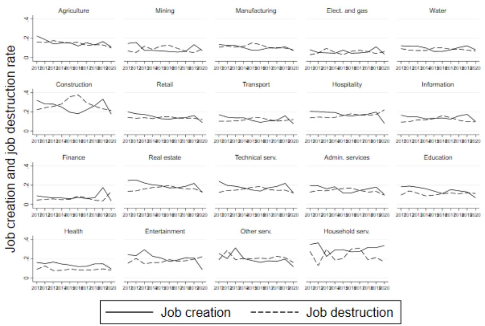  
Note: Gross job creation is the sum of employment gains across all firms that expand or entry the market. Gross job destruction is the sum of employment losses across all firms that contract or shut down. Data includes productive sectors from RAIS, 2010-2020.

Figure A5: Job reallocation by sector.  
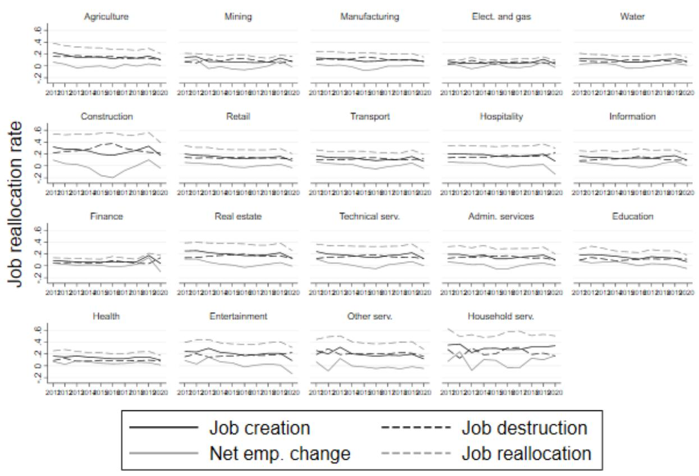

Note: Gross job creation is the sum of employment gains across all firms that expand or entry the market. Gross job destruction is the sum of employment losses across all firms that contract or shut down. Net employment change is the difference between gross job creation and destruction. Gross job reallocation is the sum of all firm-level employment gains and losses. Data includes productive sectors from RAIS, 2010-2020.

Figure A6: Standard deviation of firm employment growth by sector - BOS.  
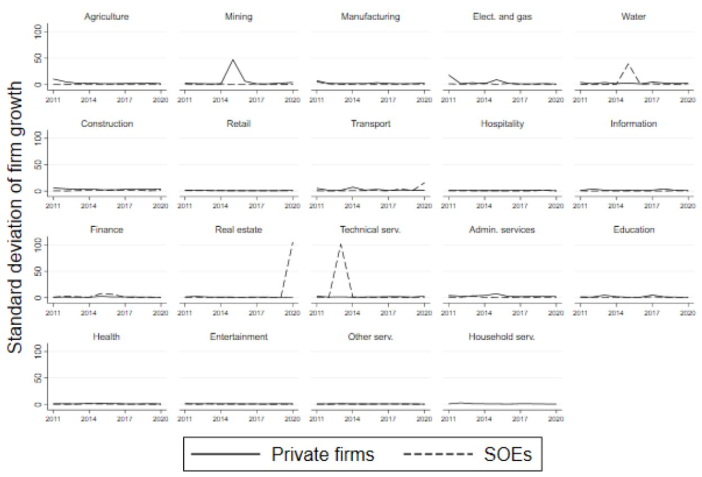  
Note: Standard deviation of firm-level employment growth rates for private firms and BOS. Data includes productive sectors from RAIS, 2010-2020.

# B Appendix B - Results with less restrictive matching

Figure B1: Effect of privatization on workers' wages

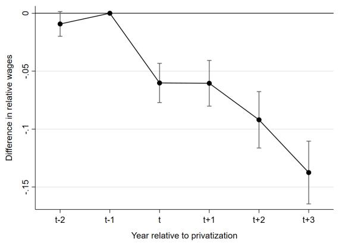  
(a) All workers

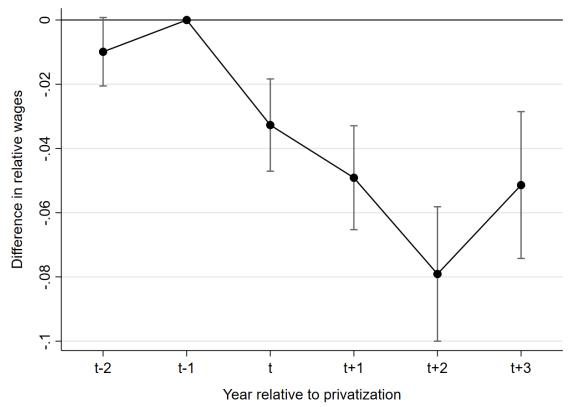  
(b) Incumbents  
Note: The figures show the estimates of time-to-event dummies interacted with a privatization indicator from regressions including individual, region, sector, time-to-event dummies, and year fixed effects. Panel (a) includes all workers employed in BOS at the time of treatment, while panel (b) only includes workers that stayed in the same company until $t + 3$ . The dependent variable is relative wages. Relative wages are measured by dividing the worker's monthly wage by the worker's average wage in year t - 1. Year t - 1 is the base year. Vertical bars show estimated 95% confidence interval based on standard errors clustered at individual level.

Figure B2: Effect of privatization on workers' wages for different groups  
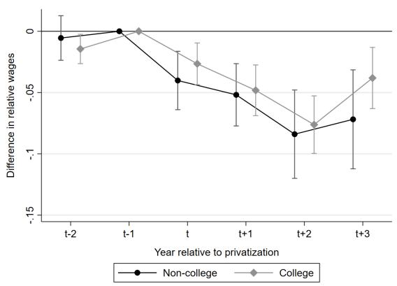  
(a) Education

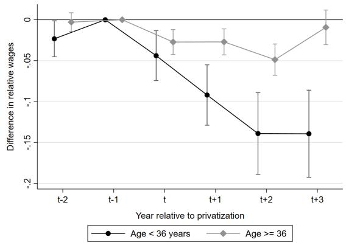  
(b) Age

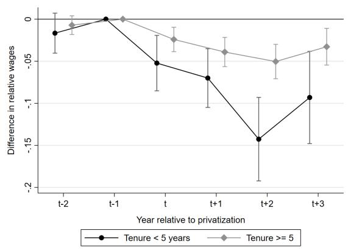  
(c) Tenure

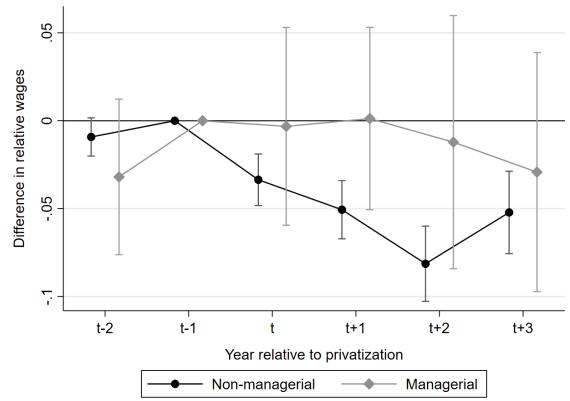  
(d) Occupation  
Note: The figures show the estimates of time-to-event dummies interacted with a privatization indicator from regressions including individual, region, sector, time-to-event dummies, and year fixed effects. All panels only include workers that stayed in the same company until $t + 3$ . The dependent variable is relative wages. Relative wages are measured by dividing the worker's monthly average wage by the worker's wage in year t - 1. Year t - 1 is the base year. Vertical bars show estimated 95% confidence interval based on standard errors clustered at individual level.

# C Appendix C - Results using broader matching and alternative Difference-in-Differences (DiD) method

Figure C1: Effect of privatization on workers' wages

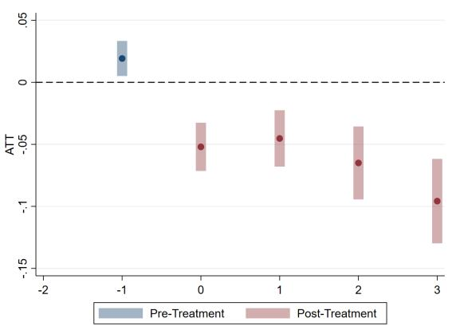  
(a) All workers

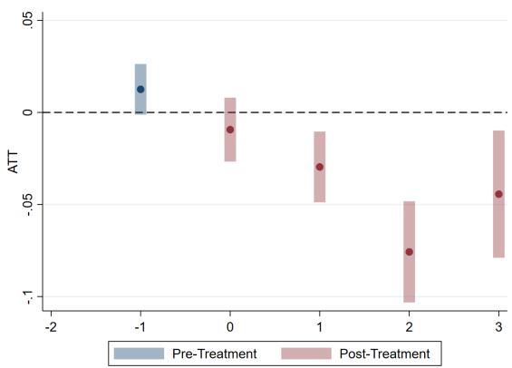  
(b) Incumbents  
Note: The figures show the estimates of time-to-event dummies interacted with a privatization indicator from regressions including individual, region, sector, time-to-event dummies, and year fixed effects. Panel (a) includes all workers employed in BOS at the time of treatment, while panel (b) only includes workers that stayed in the same company until $t + 3$ . The dependent variable is relative wages. Relative wages are measured by dividing the worker's monthly average wage by the worker's wage in year t - 1. Year t - 1 is the base year. Vertical bars show estimated 95% confidence interval based on standard errors clustered at individual levels.

## D Appendix D - Fixed effects

This section examines whether privatized BOS pay a larger wage premium than other BOS. To this end, we estimate an AKM model for the largest connected set in the period 2010 and 2014 and compare firms' fixed effects between non-privatized BOS and those that privatized from 2015 to 2020 $^{17}$ . In particular, we estimate the following wage model:

$$
l n (w _ {i t}) = \alpha_ {0} + \beta_ {i} \theta_ {f} + \sigma_ {t} + X _ {i t} ^ {\prime} \delta + \epsilon_ {i t}\tag{6}
$$

where $w_{it}$ is the log hourly wage. $\theta_{f}$ is a firm-specific intercept, $\beta_{i}$ is an individual-level intercept, $\sigma_{t}$ are yearly dummies, and $\epsilon_{it}$ is an idiosyncratic error term. Moreover, $X_{it}^{\prime}$ is a vector of education, quadratic, and cubic age interacted with year indicators. We follow Card et al. (2018) and normalized workers' age to 40 years old for males and 35 for females. We then estimate a simple linear model controlling for sectors (2-digits CNAE) and weighting by firms' number of employees. The results indicate that privatized BOS have a wage premium of 0.04 log points larger than their non-privatized peers, the difference between the two groups is not statistically different from zero. $^{18}$