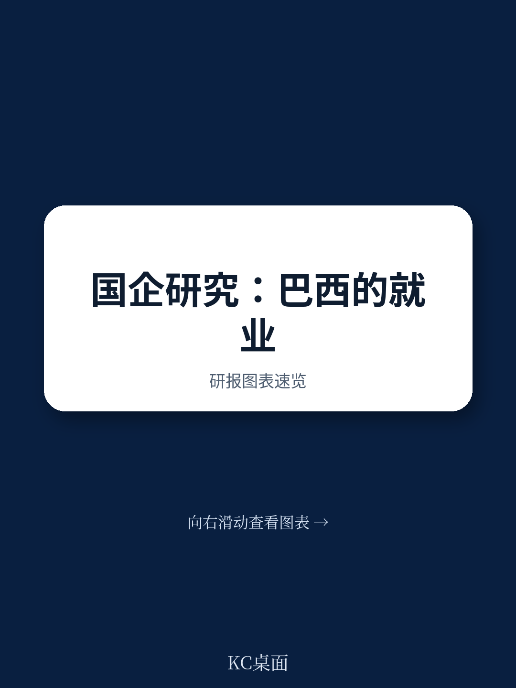
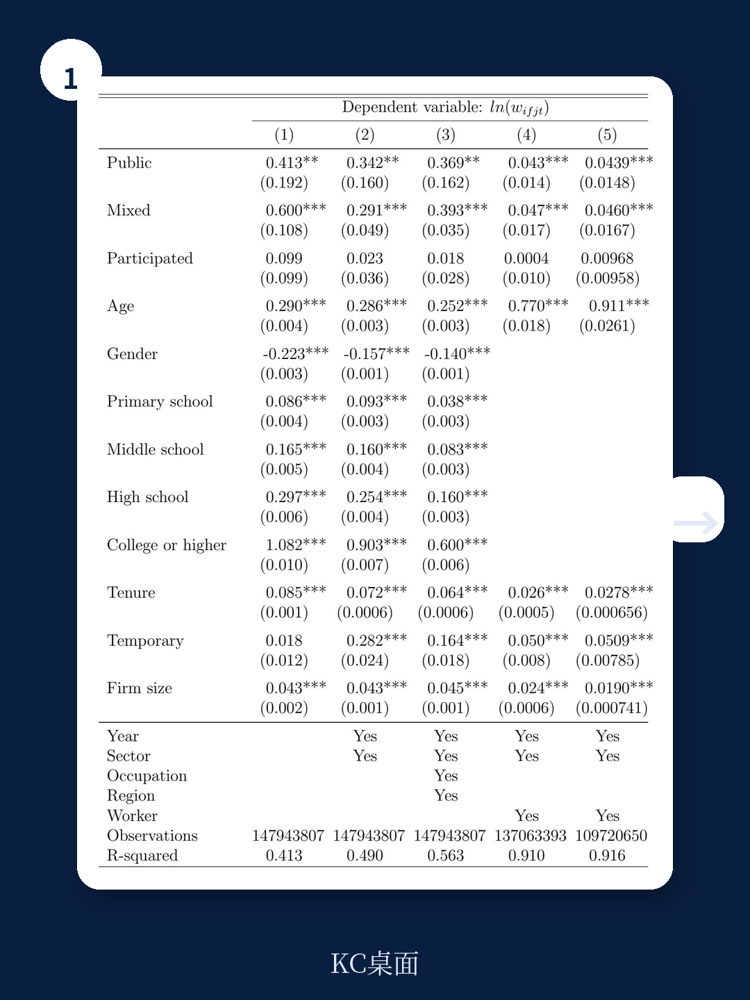
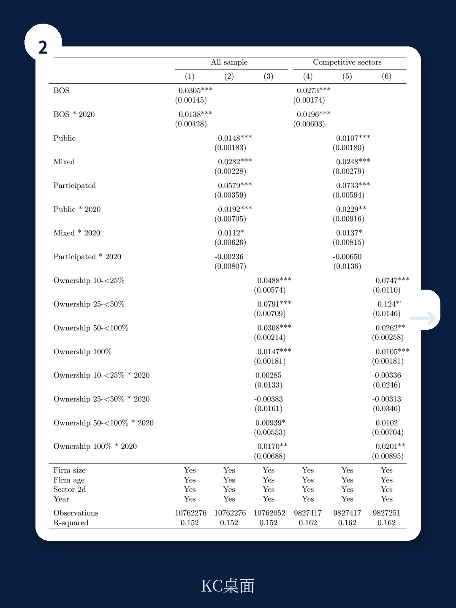

# 世界银行：国企不是铁饭碗，它真正改变的是市场生态

过去几年，关于国有企业在疫情中扮演“稳定器”角色的讨论重新升温。但一个被长期忽视的问题是：当政府以股东身份深度参与竞争性行业时，它对就业、创新和整个市场的活力究竟意味着什么？

世界银行最新发布的工作论文，以巴西为样本，给出了一个层次丰富的答案。这份报告没有停留在“国企效率高还是低”的二元争论，而是通过一个涵盖全资国有、混合所有制和参股企业的独特数据集，揭示了国家作为企业所有者的多重影响。

核心判断是：国企确实支付了显著更高的工资溢价，私有化会压降工人薪资，但并未导致大规模裁员。真正值得警惕的，是国企的行业存在感越高，年轻企业的生存空间越小，市场集中度越高——这种“稳态”可能是以牺牲创新和竞争为代价的。

## 1. 国企的工资溢价不是幻觉，但私有化的冲击也真实存在

报告首先确认了一个直观感受：在巴西，国企员工确实挣得更多。在控制企业特征后，国企的工资溢价约为18.5%。但当进一步控制员工个体固定效应——即排除“能力强的人更倾向于选择国企”这种自选择偏差后，溢价大幅缩水至4.5%。

这意味着，国企高薪的相当一部分，是因为它吸引了更优秀的人才，而非单纯因为“体制内”的定价机制。但即便如此，4.5%的纯制度性溢价仍然存在。

更关键的是私有化带来的冲击。报告采用事件研究法发现，私有化发生后，留在原企业的员工在头两年内相对工资下降约10%。而且被裁撤的员工更集中于高学历、高年龄和长工龄群体——这暗示私有化不仅是薪资调整，更是一次面向效率的劳动力重组。

> **KC评论：** 这组数据值得投资人关注。如果中国推进国企混改或竞争性领域退出，短期内的劳资摩擦和薪资调整是必然的，但报告也指出“没有稳健证据表明私有化导致总就业下降”。这意味着市场可能高估了私有化对就业的冲击，而低估了对人力资本结构的重塑。

## 2. 国企在创新和规模上有优势，但“参股企业”才是真正的变量

报告将国企细分为三类：全资国有、混合所有制和参股企业。一个有趣的发现是：参股企业——即政府仅持有少数股权的私营公司——在创新指标（技术岗位占比）和就业规模上表现最为突出。

这并不意外。政府作为少数股东，往往选择投资于那些已经具备创新能力和成长潜力的私营企业。换句话说，政府的“选股”能力可能被低估了。这种模式既避免了全资国企的激励问题，又通过资本注入放大了优质企业的扩张。

但报告也指出，国企整体在就业增长上快于私企，这一差异在统计上仅对参股企业显著。这提示我们：政府直接经营与政府参股，对经济的传导机制截然不同。前者更像“稳定器”，后者更像“放大器”。

## 3. 国企的行业存在感越高，市场活力越低——这才是最值得警惕的信号

报告最核心的发现来自对行业动态的分析。在国企参与度更高的行业，年轻企业（成立5年内）的就业占比显著更低，企业退出率也更低，但市场集中度更高。

这构成了一个两难局面：国企的存在降低了行业的不确定性——企业退出少、就业波动小，但代价是创业活跃度下降和竞争减弱。市场变得“安静”了，但这种安静可能掩盖了效率的损失。

从劳动力市场动态看，国企参与度高的行业同时呈现“高岗位创造”和“低岗位毁灭”的特征。这听起来像是好事，但组合在一起意味着劳动力资源配置的僵化：该淘汰的企业没有淘汰，该扩张的领域可能被国企挤占。

> **KC评论：** 对于产业投资者而言，国企密集的行业往往意味着更高的进入壁垒和更低的退出率。这既是“护城河”，也可能是“沼泽地”——你很难进入，但一旦进入，竞争格局相对稳定。关键在于判断这个行业是否真的需要“稳定”而不是“迭代”。

## 4. 报告尚未完全回答的关键问题：参股企业的长期效应

尽管报告数据翔实，但它留下了一个关键缺口：参股企业的长期影响究竟如何？

目前的数据仅覆盖2016-2020年，且参股企业的识别依赖2019年的Orbis数据库。这意味着我们无法区分“政府参股后企业表现更好”究竟是因果效应，还是政府本来就选择了优质企业。此外，参股企业的退出机制和资本回报率没有纳入分析——这恰恰是讨论“国有资本是否有效配置”的核心。

另一个未解问题是：国企对行业动态的负面影响，在竞争性行业和自然垄断行业中是否对称？报告初步区分了行业类型，但样本量限制了更细颗粒度的分析。对于中国这样国企深度参与多种行业的国家，这个问题的答案将直接影响改革路径的选择。

## 5. 给读者的观察框架：如何判断你所在行业的“国进民退”风险

基于报告的发现，可以建立一个简单的评估框架来判断一个行业是否正在经历“有代价的稳定”：

第一，看年轻企业占比。如果行业前五大企业的市场份额持续上升，但新进入者数量停滞或下降，这可能是国企挤出效应的早期信号。

第二，看岗位创造与毁灭的比例。如果岗位毁灭率异常低，同时岗位创造率主要由在位企业而非新企业贡献，说明行业正在丧失“创造性破坏”的能力。

第三，看参股企业的分布。如果政府参股集中于少数头部企业而非新兴领域，那么“国家资本”可能正在固化既有格局而非促进创新。

这三个指标可以帮助投资者和决策者在宏观数据之外，更早地识别行业生态的变化。

> **KC评论：** 报告的巴西数据与中国现状有很强的参照价值。中国国企改革正从“管资产”转向“管资本”，参股模式也在扩大。但巴西的经验提醒我们：参股不等于市场化，政府作为股东的激励和行为逻辑，与私人股东有本质区别。完整报告中包含的图表和回归细节，可以帮助我们更精确地理解这些差异的量化含义。

---

这份世界银行报告的价值，不在于给出“国企好还是坏”的简单结论，而在于它用数据拆解了国家作为企业所有者时，对不同群体的差异化影响：工人拿到溢价，但代价是市场活力下降；私有化压降薪资，但未必减少就业；参股企业表现亮眼，但长期效果存疑。

这恰恰是当前全球关于产业政策与国有资本讨论中，最需要被认真对待的复杂性。

如果你想获取完整的报告解读、原始数据图表，以及每日由AI agent和人工审核生成的国际投行中文摘要与评论（约10-40页，涵盖当天最新数据图表合集，方便喂给AI或快速把握市场动态），欢迎加入社群继续讨论。

Personal reading notes and learning share only. Not investment advice.

