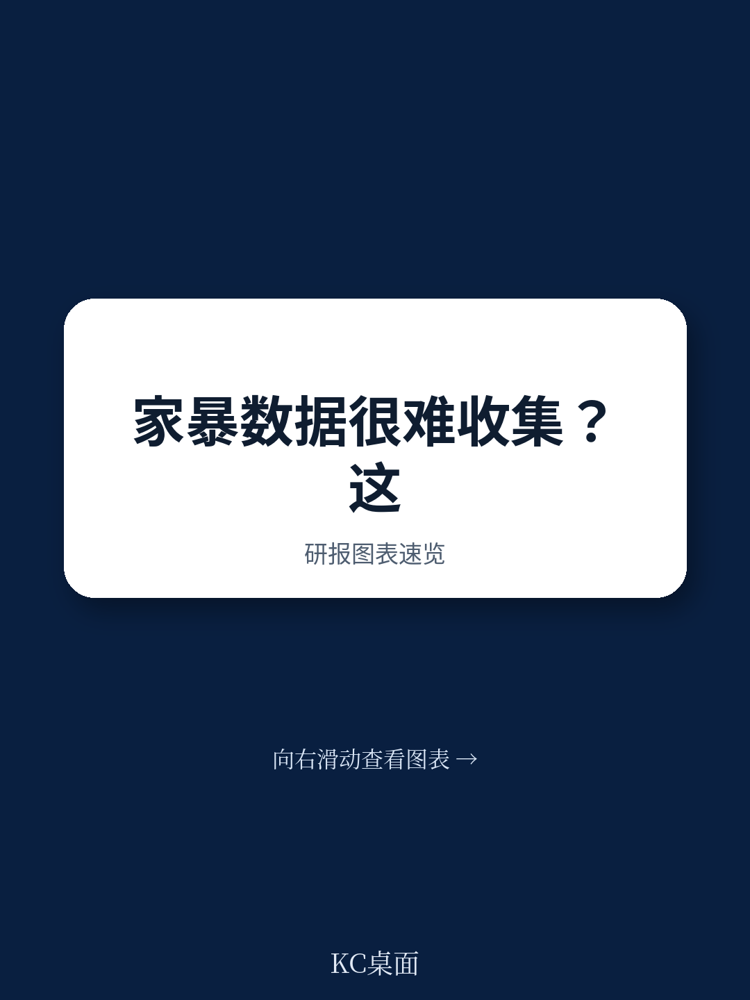
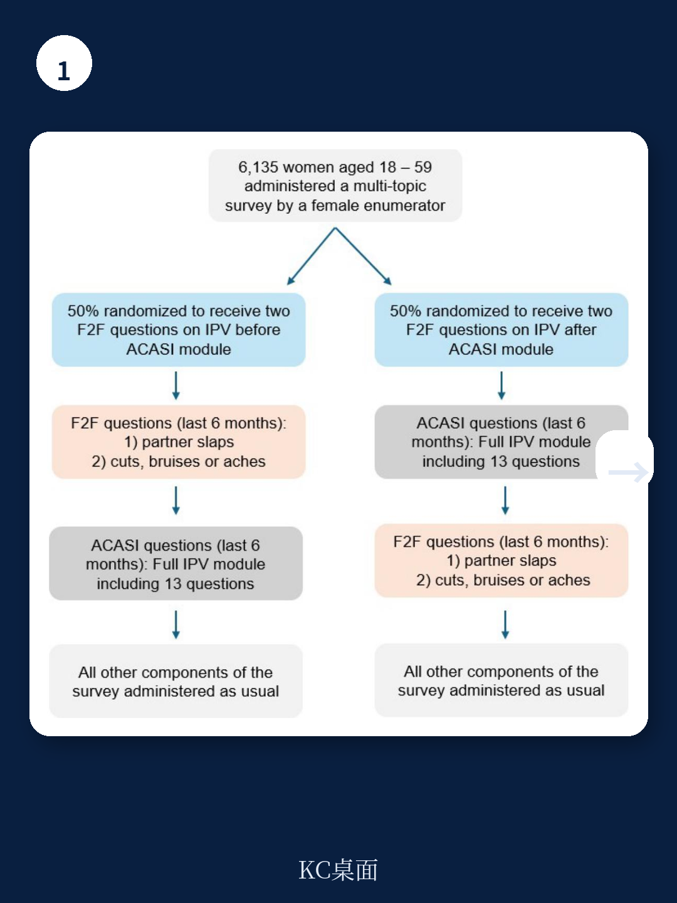
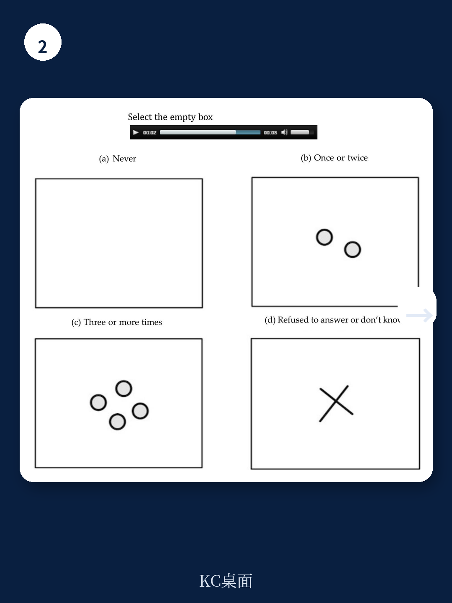

# 世界银行：亲密伴侣暴力数据采集，隐私先行不是可选项

在发展中国家农村地区，亲密伴侣暴力（IPV）是一个被严重低估的问题。传统面对面访谈中，女性因恐惧、羞耻和隐私担忧而选择沉默，这不仅是数据质量问题，更是政策干预失准的根源。世界银行最新政策研究工作报告（编号11077）基于巴基斯坦农村近6,135名已婚女性的实验，给出了一个反常识的发现：让受访者先用音频电脑辅助自填问卷（ACASI）私下回答敏感问题，能显著提升随后面对面访谈中的披露率——幅度高达41%至57%。

这不是技术细节，而是测量方法论的范式转换。它意味着，在文盲率高达93%的农村贫困环境中，隐私保护不是可选项，而是获取真实数据的必要条件。对于所有从事发展中国家社会政策评估、性别研究及发展经济学实证研究的从业者而言，这份报告的价值不在于技术本身，而在于它挑战了一个长期存在的假设：文盲群体无法有效使用自填问卷。

## 1. 文盲并非自填问卷的障碍，设计不当才是

长期以来，学界普遍认为自填问卷在低识字率群体中不可行。Park等人（2021）在利比里亚和马拉维的研究显示，约三分之一的受访者无法正确回答训练问题，这直接挑战了ACASI方法在文盲群体中的有效性。但世界银行团队在巴基斯坦拉亚县（Layyah）的实验给出了截然不同的结论。

关键在于界面设计的适应性改进。传统ACASI使用彩色方块或形状代表不同答案选项，要求受访者记忆颜色与答案的映射关系，这对认知能力是额外负担。世界银行团队与当地调查员合作，开发了更直观的图像：将频率类李克特量表的每个选项与具体图像关联，而非抽象符号。例如，“从未发生”对应空白，“发生一次或两次”对应少量符号，“发生三次及以上”对应多个符号。

实验结果显示，即使随机化答案选项的排列顺序（升序与降序），受访者的报告频率没有统计显著差异。这意味着受访者真正理解了图像与答案的对应关系，而非机械选择第一个选项。此外，在非敏感问题（如丈夫过去一周吃肉、吃水果、吃鸡蛋的频率）上，ACASI与面对面回答的一致性高达94%至96%。

> **KC评论：** 这不是技术问题，是设计思维问题。传统观点认为文盲群体无法使用自填问卷，但世界银行的实验证明，只要将交互界面从“文字-颜色映射”改为“图像-频率映射”，文盲群体的理解力并不低于识字群体。对于任何在低教育水平地区进行大规模调查的团队而言，这提供了一个低成本、高回报的改进方向。完整报告中包含了具体的图像设计示例和训练问题截图，值得仔细研究。

## 2. 隐私先行的顺序效应：41%至57%的披露率提升

这是整份报告最核心的实验发现。研究团队设计了“受访者内随机化”实验：对一半受访者，先通过ACASI私下询问两个IPV问题，再在面对面访谈中重复询问；对另一半，顺序相反。两个问题分别是：“过去6个月，你的丈夫打过你几次？”以及“过去6个月，你是否因丈夫的行为而有过割伤、淤青或疼痛？”

结果清晰而有力。当受访者先用ACASI私下回答后，他们在后续面对面访谈中披露暴力频率的意愿显著提高：掌掴频率报告高出57%，割伤频率报告高出47%。从发生率的广度来看，先ACASI组报告掌掴发生的可能性比先面对面组高出3.2个百分点（相对增幅52%），报告割伤的可能性高出1.6个百分点（相对增幅41%）。

更值得注意的是，这种效应只出现在敏感问题上。对于非敏感问题（如食物消费），ACASI与面对面之间的回答高度一致，不存在顺序效应。这意味着，私下回答敏感问题本身帮助受访者“破冰”——她们在后续面对调查员时更愿意保持一致性，也更放松地讨论困难话题。

> **KC评论：** 这个发现的实际含义远超测量方法论。在发展援助项目中，IPV干预措施的效果评估往往受限于基线数据失真。如果受访者因恐惧而低报暴力，干预后的改善可能被高估或低估。世界银行的实验提供了一个简单可行的解决方案：在正式调查前，先用ACASI让受访者“热身”。完整报告还讨论了这种顺序效应是否可能受限于特定文化背景，以及是否适用于其他类型的敏感问题，这些细节对研究设计至关重要。

## 3. 耳机带来的隐私悖论：设计细节决定伦理底线

报告还揭示了一个常被忽视的伦理细节：在贫困农村家庭中，要求受访者佩戴耳机反而可能引发家庭成员的怀疑。调查团队在预试验中发现，当调查员要求女性戴上耳机时，其他家庭成员会好奇并试图偷听问题内容，这增加了受访者因报告暴力而遭受报复的风险。

解决方案出人意料地简单：在ACASI模块开头加入一些非敏感问题（如食物消费），即使家庭成员要求听，听到的也是无关紧要的内容。虽然研究团队没有对此特征进行随机化实验，但调查员的定性反馈表明，这一设计有效缓解了家庭成员的怀疑，保护了受访者的隐私安全。

这个细节提醒我们，在低收入国家进行敏感话题调查时，伦理设计不能停留在知情同意书层面，而必须嵌入到数据采集的每一个具体环节。耳机的使用、问题的顺序、答案选项的呈现方式，每一个看似技术性的选择都可能影响受访者的安全和数据质量。

## 4. 报告未完全回答的关键问题：通用性、成本与长期效应

尽管世界银行的实验设计严谨，但仍有几个关键问题悬而未决，这也是完整报告值得深入阅读的原因。

第一，通用性问题。巴基斯坦农村是一个特定文化背景：伊斯兰教主导、父权制强、家庭空间狭小。这种顺序效应在非洲、南亚或拉美的其他低教育水平环境中是否同样显著？报告引用了Park等人在非洲的证据，但结论并不一致——在利比里亚，ACASI并未显著提高所有类型IPV的报告率。这提示文化差异可能扮演重要角色。

第二，成本与规模化问题。ACASI需要设备（平板电脑或手机）、耳机、预录音频和本地化图像设计。在大型调查中，这些成本是否可控？世界银行团队使用了超过6,000名受访者的样本，但并未提供详细的成本效益分析。对于资源有限的发展中国家统计机构而言，这是决策的关键变量。

第三，长期效应。受访者在初次使用ACASI后更愿意披露，但这种“破冰效应”是否会随时间衰减？如果同一受访者被多次调查，这种效应是否持续？报告聚焦于单次调查，未涉及面板数据场景。

> **KC评论：** 世界银行的实验为IPV数据采集提供了强有力的方法论支持，但距离大规模政策应用仍有距离。完整报告包含了实验设计的完整流程图、统计回归结果表格以及与非敏感问题的对比分析，这些细节对于评估方法的可复制性至关重要。如果你正在设计或评估发展中国家性别暴力干预项目，这份报告的原始图表和附录数据是不可或缺的参考。

## 5. 对研究者和政策制定者的观察框架

基于这份报告，我们可以提炼出一个四步评估框架，用于判断任何发展中国家IPV调查的质量：

第一步，检查隐私保护机制。调查是否提供了单独、私密的回答环境？是否使用了ACASI或其他自填工具？如果仅依赖面对面访谈，数据失真风险极高。

第二步，验证工具的可理解性。在正式调查前，是否进行了理解力测试？是否随机化了答案选项的顺序以检验受访者的理解？如果未做这些测试，ACASI的优势可能被高估。

第三步，评估顺序效应的方向。调查是否考虑了问题顺序对披露率的影响？是否在设计中加入了顺序随机化？如果所有受访者都先回答敏感问题，披露率可能系统性偏高；如果都后回答，则可能系统性偏低。

第四步，关注伦理细节。调查员是否接受了应对家庭成员干扰的培训？是否设计了保护受访者安全的退出机制？耳机使用是否经过了文化适应性调整？

这四步框架并非世界银行报告的直接结论，而是从其实验逻辑中推导出的评估准则。对于任何从事国际发展、性别研究或公共政策评估的读者而言，这些准则可以作为审阅调查报告质量的基本标尺。

---

**完整的世界银行报告包含了实验设计的全部细节、统计回归表格、图像示例以及与非洲证据的系统比较。这些内容因篇幅限制无法在此展开，但对于严谨的研究设计和政策评估具有直接参考价值。**

**我们每天由AI agent与人工review联合生成国际投行中文摘要与KC评论，涵盖世行、IMF、世界银行等机构的最新政策研究工作报告，每日更新约10-40页，包含当天最新数据图表合集。既方便喂给AI进行深度分析，也方便人工快速把握全球发展研究的前沿动态。欢迎加入社群，领取完整研报解读与原始图表，与同行一起探讨这些方法论创新如何落地到你的研究或项目评估中。**

Personal reading notes and learning share only. Not investment advice.

