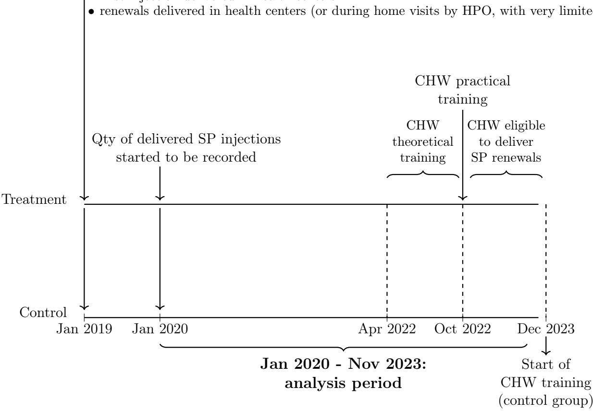
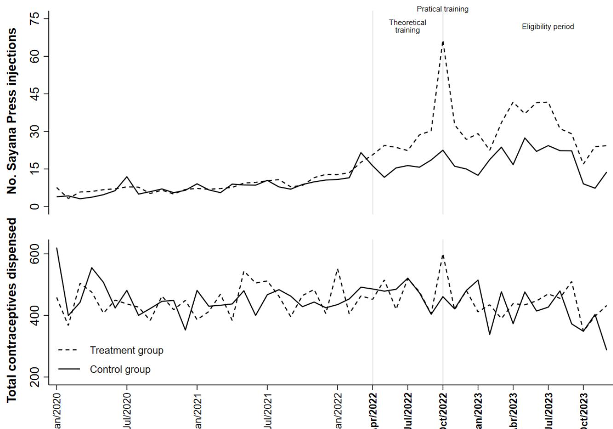
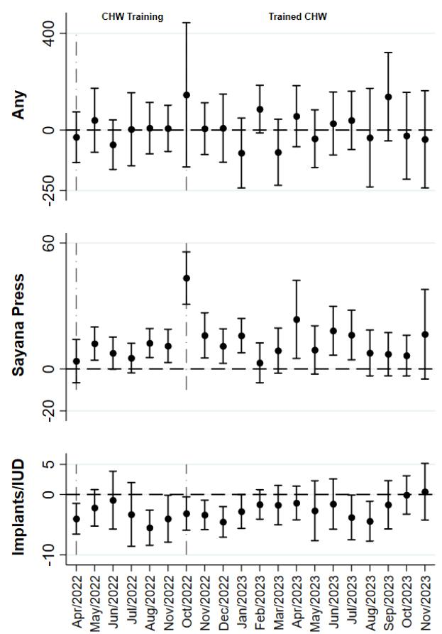
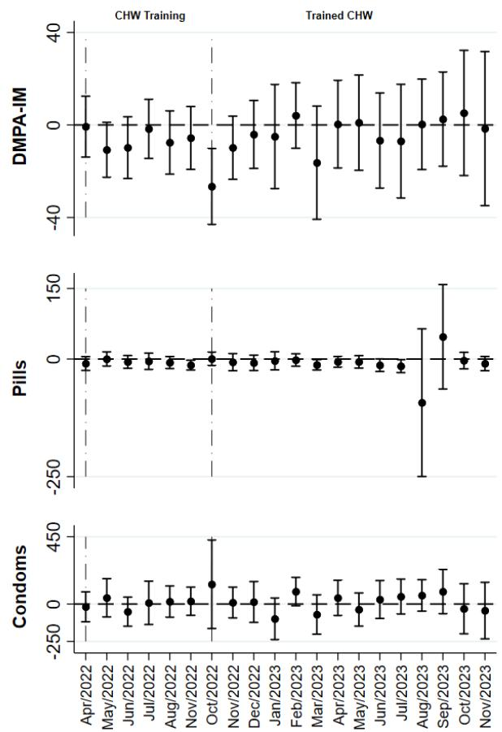

# Community Health Workers as Key Providers of Easy-to-Use Contraceptive Injectables

Experimental Evidence from Rural Burundi

Michele Andreottola

Olivier Basenya

Victor Orozco-Olvera

Arndt Reichert

Paula Spinola

POLICY RESEARCH WORKING PAPER 11074

## Abstract

This study employs a cluster randomized controlled trial and administrative health center data to investigate the effects of authorizing community health workers to deliver a new generation of contraceptive injections directly to women during routine home visits following comprehensive training. The paper observes a significant increase of approximately 70 percent in the administered quantity of these injections, which provide average protection for three months. However, the results suggest that the intervention does not produce a statistically significant change in contraceptive coverage because of significant substitution effects away from long-acting contraceptive implants and intrauterine devices that women might otherwise have adopted.

# Community Health Workers as Key Providers of Easy-to-Use Contraceptive Injectables: Experimental Evidence from Rural Burundi $^{1}$

Michele Andreottola $^{3}$ Olivier Basenya $^{4}$

Victor Orozco-Olvera $^{3}$ Arndt Reichert $^{5}$ Paula Spinola $^{2,6}$

Key words: Family planning, fertility preferences, contraceptive injections, community health workers, randomized field experiment, administrative data, health centers.
JEL Codes: I10, I15, I18, J13.

## 1 Introduction

In Sub-Saharan Africa and many other parts of the world, there persists a notable discrepancy between high fertility rates and the desire of many women for fewer children (United Nations, 2022; Dupas, 2011). This underscores the significant challenge of low utilization rates of (free-of-charge) modern contraceptive services. Governments and development organizations are increasingly focused on enhancing contraception coverage not only to support women in aligning reproductive choices with their preferences and reducing the risks associated with early childbearing (Patton et al., 2009), but also to capitalize on the substantial economic advantages such measures can provide including for instance, professional career investments of women (Ashraf et al., 2014; Goldin and Katz, 2002). $^{1}$

Accessing contraceptives typically requires women to visit health centers, as current methods, such as the most popular intramuscular contraceptive injections in Sub-Saharan Africa (Tsui et al., 2017), require administration by trained and highly-skilled health care professionals (PATH, 2018). Barriers such as travel distance, transportation costs, and logistical challenges related to scheduling appointments and arranging child care likely deter utilization. Long wait times and the risk of not finding qualified staff available may further discourage visiting health centers. Additionally, entrenched social norms and significant stigma surrounding contraception potentially constrain women from seeking birth control at health centers because of confidentiality risks (Bassi and Rasul, 2017; Munshi and Myaux, 2006). These risks arise from, for example, being seen entering health centers or the lack of private spaces within them, which can disclose a woman's contraceptive intentions. While reducing the number of health center visits, home delivery by external health care officials (i.e., professionals from outside the community) can also inadvertently disclose contraceptive use to community members who typically associate these professionals with delivering family planning services (Ndayizigiye et al., 2017).

In this randomized field experiment conducted in a rural setting, we estimate the effect of authorizing internal (i.e., local community members), low-skilled community health workers (CHWs) to administer contraceptive injectables within villages following comprehensive training. A large network of CHWs typically performs routine home visits in their area of residence for various services unrelated to contraception, thus avoiding the need for extra appointments and reducing the ability of the social environment to infer about the provision of injectable shots. $^{2}$ We take advantage of a unique setting in Burundi, where Sayana Press, a new generation of non-intramuscular contraceptive injections, had been deployed across the country in recent years. Their operational advancement consists of simplified injections by using a pre-filled syringe for subcutaneous administration, making it easier for lower-skilled professionals to administer while offering the same three-month protection as the traditional injectable method (Keith et al., 2014; Askew and Wells, 2018). However, their key attribute for rural areas—safe administration by CHWs (Burke et al., 2014)—was not yet leveraged. In coordination with health authorities willing to allow administration upon proper theoretical and practical training more broadly and with a large World Bank operation providing financing, we implemented an intervention at the health-center level to make CHWs eligible for administering non-intramuscular injections. $^{3}$ It comprised a theoretical training that would help CHWs encourage rural women to visit health centers for medical assessment and receive their initial non-intramuscular injection. After completing a practical phase, CHWs became eligible to administer injection renewals during their routine home visits in the communities. Rather than the overall effect of introducing the new generation of injectables, the randomized intervention allows us to evaluate their novel feature of a substantively easier but still equally safe administration, which makes it feasible to entrust CHWs with the deployment of contraceptive injections in remote areas.

Using detailed administrative data from health centers, we find that the average number of non-intramuscular injections administered was approximately 13 units higher per month within health centers' catchment areas due to the intervention, representing roughly a $70\%$ increase over the mean of the control group. This statistically significant increase was observed during both the theoretical and practical phases of the CHW training. After certification, there was also a strong and statistically significant increase in renewal injections administered by CHWs

during home visits.

However, the total quantity of health centers' dispensed contraceptives was not significantly affected by the intervention. Consistent with this finding, we observe a statistically significant shift away from long-acting contraceptive methods which would have been introduced in the absence of the intervention, particularly implants and intrauterine devices (IUDs). The estimated monthly decline in the use of these devices amounts to 2.7 units per health center, which greatly diminished the protection benefits of Sayana Press. Accounting for the different protection horizons of the available contraceptive methods, explorative estimates suggest that the intervention, in net terms, did not result in added contraceptive coverage throughout the analysis period.

Our paper contributes to the literature on the effects of public efforts to enhance contraceptive protection. Most existing studies focus on improving or facilitating access to health facilities and family planning centers (Dupas et al., 2024; Miller, 2010; Ferre et al., 2023; Cronin et al., 2018; Karra et al., 2022) and promoting awareness through education interventions (Strupat, 2017; Carr and Packham, 2017). Community outreach programs have also been studied (Sinha, 2005; Phillips et al., 2012; Joshi and Schultz, 2013; Desai and Tarozzi, 2011). However, none of these studies examines a family planning strategy that fully leverages the advantages of an established rural health service delivery approach centered around CHW routine home visits for the provision of modern contraceptives. Our study therefore fills an important evidence gap. It is also the first to elucidate the potential of the substantively simplified administration of the new generation of injectables to enhance contraceptive coverage rates, whose relevance is arguably further heightened when women eventually are entrusted with self-administration (Burke et al., 2018; Aderoba et al., 2023). Additionally, given the added privacy arguably associated with the examined intervention, our paper relates to previous literature on interventions aimed at enhancing the privacy of health services (Ashraf et al., 2014; Church et al., 2013; Li et al., 2013).

The remainder of this paper is structured as follows. Sections 2 and 3 present the background and the intervention under evaluation, respectively. Section 4 details the study design, including the randomization procedure, the data used, the study sample, as well as the empirical strategy adopted. Results are reported in Section 5 and further discussed in Section 6.

Finally, Section 7 concludes.

## 2 Background

## Contraceptive Coverage and Provision

Burundi has one of the lowest contraceptive coverage rates globally (United Nations, 2022). In 2017, only 21.5% of women aged 15 to 49 used reversible modern contraceptive methods such as pills, condoms, injectables, implants, and IUDs, while 6.3% used traditional methods (Burundi Institute of Statistics and Economic Studies, 2017). $^{4}$ Even though birth control tools are free of charge, there is a significant unmet need for family planning in the country, with three out of every ten women of childbearing age not using any contraceptive method despite wanting to space their next birth or stop childbearing altogether. The average number of children per woman in a union is 5.5, which exceeds their desired number of children by 1.9 (Burundi Institute of Statistics and Economic Studies, 2017).

In Burundi, contraceptive services are primarily provided by the government, especially for modern methods. Approximately 85% of modern contraceptives dispensed in the country between 2016 and 2017 were supplied by the public sector (Burundi Institute of Statistics and Economic Studies, 2017). $^{5}$ This percentage is expected to be significantly higher in rural areas, where private facilities are scarce. Within this framework, health centers play a crucial role by delivering health planning services to defined catchment areas. Each health center is staffed with skilled personnel, supported by affiliated CHWs (Agents de Santé Communautaires) and, occasionally, an associated health promotion officer (HPO, Technicien de Promotion de la Santé). Although less common, HPOs are trained healthcare professionals who possess more advanced skills compared to CHWs. HPOs and CHWs primarily operate within the community, with their affiliated health centers monitoring their activities and supplying them with the necessary resources for their home visits during monthly coordination meetings. CHWs receive performance incentives based on the delivery of a comprehensive package of community activities, with a key focus on family planning. Their tasks typically include distributing condoms and pills, as well as referring women to health centers if they express interest in the adoption of more modern family planning alternatives.

## Sayana Press Introduction

In early 2019, Sayana Press (SP) was added into the pool of modern contraceptive methods available in Burundi. SP represents a significant technological and operational advancement, enabling lower-skilled professionals to safely administer contraceptive injections (Burke et al., 2014). Unlike the incumbent injectable solution, DMPA-IM, SP uses a relatively short syringe pre-filled with the contraceptive drug (subcutaneous depo medroxyprogesterone acetate). It simplifies the administration process because the syringe is injected into the fat underneath the skin rather than into the muscle and is longer filled from a separate vial (PATH, 2018). SP has been evaluated as equally effective as the DMPA-IM, providing protection for a duration of three months (Keith et al., 2014; Askew and Wells, 2018).

An initial visit to the health center, with or without a referral from community workers, is required for eligibility assessment and administration of the initial SP injection. Renewals, needed every three months for continuous protection, were available at health centers or, depending on availability, by HPOs at the women's homes upon request. Despite being eligible to administer the injectable, the limited availability of HPOs hindered their involvement in providing SP renewals. Health center personnel and affiliated HPOs, already skilled in delivering DMPA-IM injections, required minimal training to start administering SP due to its simpler application. CHWs were not eligible to administer SP prior to the intervention.

## 3 The Intervention

The intervention being evaluated involved training CHWs to become certified and administer SP injection renewals during routine home visits within communities. This training was part of the Reproductive Health National Program under the Ministry of Health's supervision. It was financed by the World Bank through the Investing in Early Years and Fertility in Burundi project, which targeted six of the country's 18 provinces, namely Bubanza, Cankuzo, Cibitoke, Kirundo, Makamba, and Muyinga. $^{6}$

The training comprised three stages: a theoretical component, a practical internship, and a final stage where CHWs administered SP renewals within communities. The theoretical sessions, conducted at the provincial level, lasted three days and included approximately 40 CHWs from geographically connected health centers. They aimed to equip CHWs with comprehensive knowledge about Sayana Press, covering product characteristics, potential side effects, counseling skills, and general instructions on how to administer the injectable. The practical internship involved a five-day training at their affiliated health centers, where CHWs gained hands-on experience administering SP injections under the supervision of health staff. CHWs needed to apply five SP injections to complete their internship and be certified for its administration.

Figure 1 outlines the timeline for the introduction of the SP program and the CHW training sessions. Upon our engagement with the ministry, health centers started recording SP injections in January 2020. In April 2022, CHWs in the treatment arm commenced the theoretical stage of training, followed by the practical internship in October 2022. By November 2022, all health centers in the treatment group had completed the practical internship phase and were authorized to offer the injectable within their communities. Since CHW training was extended to the control group in December 2023, our analysis focuses on the period before this month.

## Figure 1: Intervention timeline

\- renewals delivered in health centers (or during home visits by HPO, with very limited capacity)

## 4 Study Design

## Randomization

Our study sample includes all health centers within the six provinces targeted by the World Bank operation, where SP was already available but CHWs had not yet been trained to administer the injectable. This cluster randomized controlled trial assigned half of the 138 health centers to either a treatment or a control group. Nearly all the health centers in our study sample are classified by the government as rural (136 of 138). To improve comparability between the treatment and control groups and achieve efficiency gains (Bruhn and McKenzie, 2009), the randomization was stratified based on province, population density, total number of contraceptive products, and the proportion of alternative contraceptive injections (DMPA-IM) delivered in 2021. The group assignments for health centers were disclosed to the government on February 17, 2022.

## Data and Outcomes

The data were sourced from the National Health Information System (NHIS). This system provides monthly data at the health center level on the quantity of each contraceptive method distributed within their designated catchment area by the Burundian government as well as the number of CHW referrals to health center facilities. An important limitation of the NHIS data is the difficulty of distinguishing between true zeros and missing values when a health center reports no data for a contraceptive method in a given month. To partly address this issue, we classify observations as missing if all contraceptive methods show zero quantities for a given health center and month. This classification applies to approximately 5% of our sample.

The primary outcome of our study is the quantity of SP injections reported by health centers in the NHIS data. As secondary outcomes, we employ the quantities of relevant alternative contraceptive methods to investigate potential substitution effects.

## Study Sample

Table 1 summarizes key information on the 138 study health centers, revealing the limited capacity of health centers and low contraceptive utilization (column 1). Panel A shows that only 38 health centers (28%) had HPO availability. Among these health centers, each had only one HPO, indicating very limited in-home administration capacity before the CHW intervention rollout. On average, there were 16 CHWs serving a population of 15,775 within the health centers' catchment areas. Of this population, an estimated 3,739 are women of childbearing age, translating to roughly 230 women per CHW.

Panel B presents the baseline number of SP injections administered per month within the catchment area of health centers as well the overall quantity of all contraceptives dispensed, including injectables (SP and DMPA-IM), condoms, birth control pills, emergency contraceptive pills, implants, and intra-uterine devices. It is worth noting that this measure should be interpreted with caution given the varying protection duration across contraceptive methods. A detailed breakdown by each contraceptive method is provided in Table A1. Given the estimated average of 3,739 women of childbearing age residing in the catchment area served by each health center, these figures suggest low contraceptive coverage in our study areas. According to Burundi Institute of Statistics and Economic Studies (2017), the weighted average contraceptive coverage across the six provinces for the methods listed in Table A1 was 20.8% during the years of 2016 and 2017, just below the national average of 21.5% (Burundi Institute of Statistics and Economic Studies, 2017). $^{7}$

Table 1: Characteristics and contraceptive provision by health centers

<table><tr><td></td><td>(1)All</td><td>(2)Treatment</td><td>(3)Control</td><td>(4)Treatment – Control</td></tr><tr><td>No. health centers</td><td>138</td><td>69</td><td>69</td><td>-</td></tr></table>

Panel A: Characteristics of health centers

<table><tr><td></td><td colspan="3">Mean/(SD)</td><td>Mean difference</td></tr><tr><td>% of health centers with HPO availability</td><td>0.28(0.45)</td><td>0.33(0.48)</td><td>0.22(0.42)</td><td>0.12</td></tr><tr><td>No. HPO (conditional on &gt;0)</td><td>1.0(0.00)</td><td>1.0(0.00)</td><td>1.0(0.00)</td><td>-</td></tr><tr><td>No. CHW</td><td>16.12(9.6)</td><td>15.29(9.34)</td><td>16.94(9.86)</td><td>-1.65</td></tr><tr><td>Distance (in km) to local health authority</td><td>27.48(20.14)</td><td>30.11(21.8)</td><td>24.85(18.1)</td><td>5.26</td></tr><tr><td>Distance (in km) to regional health authority</td><td>14.95(10.09)</td><td>15.15(9.34)</td><td>14.76(10.86)</td><td>0.39</td></tr><tr><td>Population</td><td>15775(8564)</td><td>15387(7465)</td><td>16163(9577)</td><td>-776</td></tr><tr><td>Childbearing-aged women</td><td>3739(2030)</td><td>3647(1769)</td><td>3831(2270)</td><td>-184</td></tr></table>

Panel B: Monthly number of contraceptives administered by health centers between Jan 2020 and Mar 2022

<table><tr><td></td><td colspan="3">Mean/(SD)</td><td>Mean difference</td></tr><tr><td>Sayana Press</td><td>8.17(13.63)</td><td>8.47(15.2)</td><td>7.87(11.96)</td><td>0.6</td></tr><tr><td>Any contraceptive dispensed</td><td>447.4(328.5)</td><td>445.5(305.1)</td><td>449.3(352.6)</td><td>-3.7</td></tr></table>

Notes: Mean (SD) represents the mean and standard deviation at the health center level, while the last column shows the mean difference between the treatment and control groups. Significance: $***=.01$ , $**=.05$ , $*=.1$ Panel A reports characteristics of health centers, based on data provided by the Burundian Ministry of Health in the first trimester of 2024. The count of women of childbearing age (15-49 years old) at each health center is estimated by multiplying the local population within the health center's catchment area by the national proportion of this demographic (23.7%). The local health authority refers to the nearest administrative office within the community, while the regional health authority corresponds to the official health district office where the health center is located. Panel B presents the monthly quantity of contraceptives administered during the baseline period, according to the National Health Information System (NHIS). Data for the period between January 2020 and March 2022 (i.e., before training was implemented in the treatment arm) were collapsed at the health center level.

All statistics presented in the table are statistically similar between the treatment and control groups (columns 2 and 3). We observe statistically significance differences neither in the capacity levels of health centers nor contraceptive delivery between the two groups (column

Figure 2: Evolution of Sayana Press injections (above) and overall number of contraceptives dispensed (below)  
  
Notes: The first figure plots the average number of Sayana Press injections while the second figure shows the average total quantity of all contraceptives dispensed, including Sayana Press, DMPA-IM, condoms, morning pills, birth control pill, implants, and IUD, for each month of our analysis period. The dashed line represents the 69 health centers in the treatment group, while the solid line depicts the 69 health centers in the control group. The first vertical gray line marks the beginning of the theoretical training stage, while the second one indicates the practical internship month, when community health workers were required to administer several injections at health centers to qualify for eligibility to deliver them during home visits.

Figure 2 displays the evolution of the average number of SP injections (top of the plot) and total number of dispensed contraceptives (bottom of the plot) among treated and control health centers over time. We observe clear parallel trends between the two groups prior to the commencement of CHW training in April 2022 (denoted by the first vertical line). Since then, SP usage has increased more substantially in the treatment group compared to the control group. $^{9}$ However, no systematic differences in the average total number of contraceptives dispensed were observed between the treatment and control groups after the rollout of the intervention.

## Empirical Strategy

We implement a differences-in-differences strategy to assess the extent to which the intervention contributed to the delivery of SP injections. While positive trends are anticipated for both groups considering its ongoing SP expansion, we hypothesize that the increase will be significantly higher among health centers in the treatment arm. $^{10}$ The empirical specification of the model is presented below.

$$
Y _ {i t} = \alpha + \beta \{T r e a t _ {i} \mathrm{x} P o s t _ {t} \} + \theta P o s t _ {t} + \lambda T r e a t _ {i} + \eta^ {'} S t r a t a _ {i} + \varepsilon_ {i t}\tag{1}
$$

where the left-hand side variable represents the outcome in health center i at month t. $Treat_{i}$ is a dummy variable that takes the value one if health center i is part of the treatment group, and zero otherwise. $Post_{t}$ equals one if month t falls after or during April 2022, and zero otherwise. Strata fixed effects, $Strata_{i}$ , are also added to the regression model. $^{11}$ We estimate it employing ordinary least squares. The error term is denoted by $\varepsilon_{it}$ . To account for serial correlation within health centers' catchment area, we cluster standard errors at the health center level.

The interaction term coefficient, $\beta$ , captures the average treatment effect. Random differences between treated and control groups during the baseline period are captured by $\lambda$ . Finally, $\theta$ captures the changes experienced by the control group during the post-intervention period compared to the baseline period, representing the counterfactual scenario of how the treatment group would have evolved had the intervention not been implemented. Results are also estimated for alternative contraceptive methods as well as for the overall quantity of all contraceptives dispensed within the health centers' catchment areas.

## 5 Results

Effects on Sayana Press Injections and Overall Contraceptive Delivery

Column 1 of Table 2 shows results for the effects of the intervention on the total number of SP shots. We find an additional 12.72 units in the treatment group per month and health center. Given a post-intervention quantity in the control group of 18.47 (10.22 + 8.25), our point estimate indicates an increase in SP injections of roughly 70% (12.72/18.47). Results are robust across Poisson and Negative Binomial regression specifications.

Table 2: Effect on the quantity of Sayana Press and overall contraceptives dispensed

<table><tr><td rowspan="4"></td><td>(1)</td><td>(2)</td><td>(3)</td><td>(4)</td><td>(5)</td></tr><tr><td colspan="4">Sayana Press</td><td>Any</td></tr><tr><td rowspan="2">Total</td><td rowspan="2">Health Center</td><td colspan="2">Home visit</td><td rowspan="2">contraceptive dispensed</td></tr><tr><td>By HPO</td><td>By CHW</td></tr><tr><td>Treat x Post</td><td>12.72***(2.78)</td><td>9.38***(2.53)</td><td>0.18(0.19)</td><td>3.16***(0.59)</td><td>8.42(36.27)</td></tr><tr><td>Post</td><td>10.22**(1.25)</td><td>9.85***(1.26)</td><td>0.18**(0.07)</td><td>0.19*(0.11)</td><td>-4.30(28.29)</td></tr><tr><td>Treat</td><td>0.62(2.16)</td><td>0.58(2.13)</td><td>-0.06(0.09)</td><td>0.10(0.11)</td><td>-7.02(41.96)</td></tr><tr><td>Observations</td><td>6,139</td><td>6,139</td><td>6,139</td><td>6,139</td><td>6,139</td></tr><tr><td>Baseline mean</td><td>8.25</td><td>8.16</td><td>0.08</td><td>0.00</td><td>450.68</td></tr></table>

Notes: The table presents results based on the estimation of Equation 1, where the outcome concerns quantities of Sayana Press injections as described in the column titles. Standard errors, presented in parentheses, are clustered at the health center level. The stars next to the estimated coefficients follow the usual convention ( $***$ p<0.01, $**$ p<0.05, $*$ p<0.1).

Columns 2 to 4 of Table 2 break down the total quantity of SP injections into shots delivered by the health center and (renewal) shots by HPO and CHW, respectively. We observe that the effects are driven in large part by shots in health centers and to some extent by CHWs. Shots provided by HPO, on the contrary, were not affected by the intervention. While the initial shots were always required to be provided by the health center, we note that about half of the shots added as a result of the intervention were still administered by the centers during the eligibility phase (Appendix Table A2). $^{12}$ The last column of Table 2 displays the estimated impact of the intervention on the total number of contraceptives dispensed, which is statistically insignificant. The remaining part of this section explores the possibility that the intervention may have caused substitution away from other contraceptive methods.

## Substitution Effects

Given the focus of the intervention on the integration of CHWs into the delivery of contraceptive injectables, we might expect possible substitution effects to be concentrated among alternative contraceptive methods that are routinely administered by them and therefore potentially crowded by the new injectable method. However, as shown in the previous section, Sayana Press dispensing in health centers was also strongly influenced by the intervention, which makes it important to examine its effects on the broad spectrum of contraceptive methods.

Table 3 shows the intervention's effects on the use of alternative reversible modern contraceptive methods. To address multiple hypothesis testing concerns, we include adjusted p-values in brackets, based on Romano and Wolf (2005), following the procedure outlined by Clarke (2021). We observe negative coefficients for DMPA-IM, monthly pills, and implants/IUD, suggesting a switch from these alternative methods to Sayana Press. While the negative coefficients for DMPA-IM injections and monthly pills are not statistically significant, $^{13}$ we observe a statistically significant decrease of 2.7 per month in the introduction of new IUDs/implants. This indicates that the additional SP injections due to the intervention at least partly replaced the adoption of long-acting devices that would have occurred in the absence of the intervention. The last column of the table indicates that the intervention did not induce the removal of previously inserted devices. $^{14}$

Table 3: Effect on the quantity of alternative contraceptives delivered, by type

<table><tr><td rowspan="2"></td><td>(1)Injectable</td><td colspan="2">(2)Short-acting</td><td colspan="2">(4)Long-acting</td></tr><tr><td>DMPA-IM</td><td>Monthly Pill</td><td>Condom &amp; Morning Pill</td><td>Implants &amp; IUD Introduced</td><td>Implants &amp; IUD Removed</td></tr><tr><td>Treat x Post</td><td>-5.06(5.90)[0.159]</td><td>-8.67(6.51)[0.052]</td><td>12.15(33.50)[0.494]</td><td>-2.70**(1.05)[0.004]</td><td>-0.33(0.28)[0.064]</td></tr><tr><td>Post</td><td>-3.48(4.65)</td><td>2.94(4.23)</td><td>-17.98(26.92)</td><td>4.01***(0.80)</td><td>0.16(0.19)</td></tr><tr><td>Treat</td><td>11.91*(6.85)</td><td>7.88(5.49)</td><td>-27.99(38.08)</td><td>0.55(1.03)</td><td>0.28(0.37)</td></tr><tr><td>Observations</td><td>6,139</td><td>6,139</td><td>6,139</td><td>6,139</td><td>6,486</td></tr><tr><td>Baseline mean</td><td>95.37</td><td>43.03</td><td>293.91</td><td>10.11</td><td>2.19</td></tr></table>

Notes: The table presents results based on the estimation of Equation 1, where the outcome concerns quantities of contraceptives described in the column titles. Standard errors, presented in parentheses, are clustered at the health center level. The stars next to the estimated coefficients follow the usual convention ( $***$ p<0.01, $**$ p<0.05, $*$ p<0.1). To interpret the statistical significance of the interaction term coefficient, we correct for multiple hypothesis testing following the procedure outlined by Clarke (2021). More specifically, we use the Stata command -rwolf2-with 250 bootstrap replications to obtain Romano-Wolf p-values which are presented in brackets.

## 6 Discussion

Our estimates should be considered lower bounds for the effects of the intervention on SP injections and delivery of alternative methods in the presence of potential spillover effects, such as information spreading from treated health centers to control health centers. While the observed (lower) positive trend in SP adoption for the control group (as indicated by the coefficient of the binary post-intervention dummy variable in Table 2) was anticipated due to the ongoing expansion of the introduced innovation, it is possible that such spillover effects also played a role in the positive trend of SP injections in the control group. The risk of information spillover becomes more pertinent towards the final period of our analysis, as control units were closer in time to receiving the intervention themselves.

The study's main limitation is related to data constraints and the restricted time horizon available for the analysis. First, the inability to distinguish zero values from missing information in our data implies that our analyses suffer from measurement error in the dependent variable, which yields inflated standard errors. Second, we are unable to ascertain whether women initiating SP receive timely renewals, i.e., maintaining uninterrupted contraceptive protection, since we cannot track them over time with aggregated health facility data. Third, we do not have information on women's demographics in our data. Consequently, we cannot determine whether women who would have chosen long-acting devices belong to the same demographic group as those opting for the new product. Contraceptive coverage for younger women is particularly beneficial, given the disruptive impact of unintended pregnancies on this demographic, especially teenagers. $^{15}$ Finally, we are unable to assess the longer-term effects of the intervention.

## 7 Conclusion

This paper assesses the effects of an intervention designed to incorporate community health workers as key participants in the distribution of a new generation of injectable contraceptives in a rural setting. CHWs in the treatment group received theoretical and hands-on-training followed by eligibility to administer these non-intramuscular injections directly to women at their homes. In contrast, in the control group, the distribution of the new contraceptive was exclusively handled by more skilled workers primarily within health centers.

Our experimental findings indicate a notable change in injectable contraceptive delivery by health centers. On average, we observe roughly 12.72 additional Sayana Press injections as a result of the intervention. This implies an increase of 70 percent over the control group mean. Assuming uniform coverage rates across the six provinces in our sample, this point estimate corresponds to roughly 8% of the overall coverage rate in 2017, estimated to range around 20.8%. $^{16}$

However, despite this strong surge in the number of administered injections, our experimental results concerning the overall number of dispensed contraceptives, albeit positive, are statistically insignificant. We explain this finding by substitution effects away from long-acting contraceptive devices. Specifically, we observe a monthly decrease of 2.70 implants and IUDs due to the intervention. In an exploratory analysis that accounts for differences in the protection horizon offered for each of the contraceptive methods dispensed by health centers in our sample, in net terms, we find no evidence that Sayana Press significantly affected the overall contraceptive coverage. If at all, our analysis points to a statistically insignificant net reduction

(see the Appendix for details).

In the overall assessment of the novel intervention examined in our paper, we aim to take a quite nuanced perspective. On the one hand, our results show that extending contraceptive provision to community health workers has the potential to effectively increase adoption of the latest generation of injectables in rural villages. By educating and training community health workers to administer injections locally, the scale-up of the new family planning services can be expedited. These results underscore the promising potential of the self-administration attribute of the injectable. On the other hand, the intervention did not significantly increase overall contraceptive coverage, meaning it failed to better match contraceptive options with the preferences of women in the study. While the rise in new contraceptive injections suggests an improved fit of the menu of contraceptive services for women in the area, the decline in the use of longer-acting methods is a concern for public health and economic development, especially when follow-up injections are missed. $^{17}$

Our findings highlight the need for further research. First, individual-level data will be required to identify which sub-populations are gaining protection coverage and which are losing it as a result of the intervention. Second, a more comprehensive intervention should be tested that exploits the potential associated with the self-administration attribute of the new injectable method while ensuring that the adoption of longer-acting contraceptive methods is not penalized. This may involve a better integration of service delivery models and associated health worker incentives, i.e., actively offering the entire contraceptive choice set and measuring health center performance based on women-months of coverage. A promising component is educational campaigns that highlight the benefits of the various contraceptive methods with an emphasis of the importance of maintaining continuous protection. Third, future research should aim at separately exploring the relevance of the various barriers to contraceptive utilization. This knowledge will likely stimulate development of tailored contraceptive technologies and research on effective service delivery strategies.

## APPENDIX

## Summary statistics: Detailed breakdown by contraceptive products

Table A1: Monthly number of contraceptives administered by health centers between Jan 2020 and Mar 2022

<table><tr><td></td><td>All</td><td>Treatment</td><td>Control</td><td>Treatment - Control</td></tr><tr><td></td><td></td><td>Mean/(SD)</td><td></td><td>Mean difference</td></tr><tr><td>Injectables (3-month protection horizon)</td><td></td><td></td><td></td><td></td></tr><tr><td>Sayana Press</td><td>8.17(13.63)</td><td>8.47(15.2)</td><td>7.87(11.96)</td><td>0.6</td></tr><tr><td>DMPA-IM</td><td>94.39(69.27)</td><td>99.19(73.28)</td><td>89.58(65.2)</td><td>9.61</td></tr><tr><td>Short-acting methods</td><td></td><td></td><td></td><td></td></tr><tr><td>Condom</td><td>288.8(276.26)</td><td>276.7(241.88)</td><td>301.0(308.14)</td><td>-24.34</td></tr><tr><td>Morning-after Pill</td><td>2.23(5.08)</td><td>2.88(6.98)</td><td>1.57(1.55)</td><td>1.31</td></tr><tr><td>Birth control Pill</td><td>43.76(45.42)</td><td>47.97(58.01)</td><td>39.55(27.46)</td><td>8.43</td></tr><tr><td>Long-acting devices</td><td></td><td></td><td></td><td></td></tr><tr><td>Implant</td><td>9.13(6.77)</td><td>9.44(6.57)</td><td>8.82(7.00)</td><td>0.63</td></tr><tr><td>Intrauterine device (IUD)</td><td>0.92(1.61)</td><td>0.92(1.78)</td><td>0.91(1.44)</td><td>0.01</td></tr></table>

Notes: The table presents the monthly quantity of contraceptives administered during the baseline period, according to the National Health Information System (NHIS). DMPA-IM refers to depot-medroxyprogesterone acetate shots administered via intramuscular injection. Data for the period between January 2020 and March 2022 (i.e., before training was implemented in the treatment arm) were collapsed at the health center level. Mean (SD) represents the mean and standard deviation at the health center level, while the last column shows the mean difference between the treatment and control groups. Significance: \*\*\*=.01, \*\*=.05,\*=.1.

## Effect on SP by intervention phase

To study the potential impacts of the intervention across its various stages—the theoretical sessions (April 2022 to September 2022), the practical internship period (October 2022), and the eligibility period (post-October 2022)—we replace the single time indicator variable ( $Post_t$ ) with three separate indicator variables in Equation 1. $^{18}$

$$
\begin{array}{r l r} & & {^ {1 8} \mathrm{Theempiricalspecificationismodifiedasfollows:}} \\ & & {Y _ {i t} = \alpha + \beta_ {1} \{T r e a t _ {i} \times T h e o r y _ {t} \} + \beta_ {2} \{T r e a t _ {i} \times P r a c t i c e _ {t} \} + \beta_ {3} \{T r e a t _ {i} \times E l i g i b i l i t y _ {t} \} +} \\ & & {\theta_ {1} T h e o r y _ {t} + \theta_ {2} P r a c t i c e _ {t} + \theta_ {3} E l i g i b i l i t y _ {t} + \lambda T r e a t _ {i} + \eta^ {'} S t r a t a _ {i} + \varepsilon_ {i t},} \end{array}\tag{2}
$$

Table A2 breaks down the quantity of SP injections by intervention phase (theoretical training, practical internships, and post-certification of CHWs) and by location (health centers or home visits, with the latter further divided into HPOs and CHWs). $^{19}$ During the theoretical training period, when CHWs were not yet authorized to administer injections during home visits, the increase in the number of administered shots was mainly driven by injections delivered in the health centers (8.5 SP injections per month). The same applies to the practical training, albeit the point estimate is much more pronounced which is arguably attributable to the requirement of delivering five shots per CHW during this phase of the intervention. This finding aligns with the high mobilization efforts of CHWs aimed at encouraging women to visit health centers for SP initiation during the same time, as shown in Table A3.

Following the completion of the training and granting of the authorization to CHWs, the increase stemmed from injections administered in the health centers and renewal shots given during home visits (7.2 and 5.0 SP injections per month respectively). $^{20}$ The low baseline values observed for injections delivered by HPOs (0.08) aligns with the fact that this option was not commonly utilized in practice due to their restricted availability. $^{21}$

Much of the impact during the practice phase is likely attributable to the requirement of community health workers to deliver several shots under supervision. Several factors may explain the increase in SP observed in health centers during the final stage of the intervention, in addition to community deliveries by CHWs. Firstly, initial shots are still only administered at health center facilities. Secondly, the increase could be due to an arising challenge for CHWs to serve the large number of women needing renewals in their communities. As a result, women may need to seek renewals at health centers for uninterrupted protection. Thirdly, women who started SP might receive subsequent shots at health centers when visiting for other reasons.

Table A2: Effect on the quantity of Sayana Press delivered: breakdown by first and renewal shot

<table><tr><td rowspan="4"></td><td>(1)</td><td>(2)</td><td>(3)</td></tr><tr><td colspan="3">Sayana Press</td></tr><tr><td rowspan="2">Health Center</td><td colspan="2">Home visit</td></tr><tr><td>By HPO</td><td>By CHW</td></tr><tr><td>Treat x Theory</td><td>8.48***(3.03)</td><td>-0.04(0.09)</td><td>0.12(0.17)</td></tr><tr><td>Treat x Practice</td><td>42.01***(6.17)</td><td>1.24**(0.58)</td><td>0.04(0.06)</td></tr><tr><td>Treat x Eligibility</td><td>7.16**(3.02)</td><td>0.21(0.25)</td><td>5.04***(0.95)</td></tr><tr><td>Theory</td><td>7.65***(1.29)</td><td>0.14*(0.08)</td><td>0.06(0.05)</td></tr><tr><td>Practice</td><td>14.74***(3.99)</td><td>0.06(0.06)</td><td>0.01(0.02)</td></tr><tr><td>Eligibility</td><td>10.60***(1.48)</td><td>0.21*(0.11)</td><td>0.27*(0.14)</td></tr><tr><td>Treat</td><td>0.58(2.13)</td><td>-0.06(0.09)</td><td>0.10(0.11)</td></tr><tr><td>Observations</td><td>6,139</td><td>6,139</td><td>6,139</td></tr><tr><td>Baseline mean</td><td>8.16</td><td>0.08</td><td>0.00</td></tr></table>

Notes: The table presents results based on the estimation of Equation 2, where the outcome concerns quantities of Sayana Press injections delivered by the provider described in the column titles. The Theory, Practice, and Eligibility indicators correspond, respectively, to dummy variables representing the periods of theoretical training, practical training, and the period after which community health workers in the treatment arm were granted authorization to administer Sayana Press renewal injections during home visits. Standard errors, presented in parentheses, are clustered at the health center level. The stars next to the estimated coefficients follow the usual convention ( $^{***}$ p<0.01, $^{**}$ p<0.05, $^{*}$ p<0.1).

## Effect on referrals to health centers for contraceptive initiation

Table A3 displays the impact of the intervention on the number of women visiting health centers following referrals from CHWs. $^{22}$ Considering the entire post-intervention period, there is no statistically significant impact (column 1). However, when breaking down this period into the three different stages of the intervention (column 2), we observe a substantial jump in referrals during the practice stage. This finding aligns with the high mobilization efforts aimed at encouraging women to visit health centers for SP initiation, thereby facilitating CHWs in completing the required number of injections to gain their certification.

Table A3: Effect on the quantity of referrals by community health workers

<table><tr><td rowspan="2"></td><td>(1)</td><td>(2)</td></tr><tr><td colspan="2">CHW Referrals to Health Centers</td></tr><tr><td>Treat x Post</td><td>-1.31(3.31)</td><td></td></tr><tr><td>Treat x Theory</td><td></td><td>1.84(2.66)</td></tr><tr><td>Treat x Practice</td><td></td><td>21.90***(6.57)</td></tr><tr><td>Treat x Eligibility</td><td></td><td>-4.92(4.22)</td></tr><tr><td>Post</td><td>11.70***(2.49)</td><td></td></tr><tr><td>Theory</td><td></td><td>6.20***(1.76)</td></tr><tr><td>Practice</td><td></td><td>9.88***(3.11)</td></tr><tr><td>Eligibility</td><td></td><td>14.78***(3.23)</td></tr><tr><td>Treat</td><td>6.49**(2.81)</td><td>6.49**(2.81)</td></tr><tr><td>Observations</td><td>6,139</td><td>6,139</td></tr><tr><td>Baseline mean</td><td>16.10</td><td>16.10</td></tr></table>

Notes: Columns 1 and 2 present results based on the estimation of Equations 1 and 2, respectively. The outcome concerns the number of women visiting health centers for contraceptive initiation following referral by community health workers. The Theory, Practice, and Eligibility indicators correspond, respectively, to dummy variables representing the periods of theoretical training, practical training, and the period after which community health workers in the treatment arm were granted authorization to administer Sayana Press renewal injections during home visits. The Post indicator, on the other hand, corresponds to the entire period since the start of the intervention. Standard errors, presented in parentheses, are clustered at the health center level. The stars next to the estimated coefficients follow the usual convention ( $***$ p<0.01, $**$ p<0.05, $*$ p<0.1).

## Possible channels underlying effects on SP injections

We use plausibility arguments to propose potential mutually reinforcing channels throughout different stages of the intervention, such as information dissemination and a larger pool of eligible injection providers. Additionally, we discuss channels specific to renewal injections delivered in the communities in the later phases of the intervention, including reduced transaction costs

and privacy benefits for women.

Information dissemination: the increase in SP injections in health centers during the period CHWs were undergoing theoretical sessions and could not yet administer the contraceptive injections (Table A2, column 1, coefficient Treat x Theory) suggests that information provision and dissemination played a role in explaining these findings. The comprehensive training likely heightened the awareness of health center staff about SP and deepened their understanding of its advantages over other contraceptive alternatives. This knowledge was likely conveyed to women of childbearing age visiting the health centers, thereby increasing the likelihood women would adopt the new product. As the acquired knowledge is unlikely to vanish quickly, the information channel also potentially explains the estimated effects on SP injections delivered in the health centers observed in the two subsequent phases of the intervention (other two coefficients displayed in column 1 of Table A2).

Larger pool of injection providers: the intervention aimed at enlarging the pool of health workers capable of administering SP injections. This was shown by the notable increase in the number of injections administered at health centers during the practical training sessions (Table A2, column 1, coefficient Treat x Practice). Within communities, the stock of providers offering injectable contraceptives increased during the eligibility period, which is consistent with increases in injections observed during this final stage (Table A2, column 3, coefficient Treat x Eligibility).

Reduced transaction costs for renewals delivered at home: receiving contraceptive renewals at home reduces costs associated with visiting health centers such as transportation expenses and the opportunity cost of time. Given that the option for in-home SP delivery by HPOs was available in fewer than a third of the study's catchment areas and even in those areas capacity was notably limited (see Table 1), the observed surge in SP during the final phase of the intervention within villages could plausibly be driven by these factors (Table A2, column 3, coefficient Treat x Eligibility). $^{23}$

Privacy benefits of renewal injections during routine home visits: accessing contraceptives at health centers poses confidentiality risks. Alternatively, home visits by non-community members known for delivering contraceptive injectables, such as HPOs (when available), often lead villagers to infer that women are receiving these products. In contrast, SP delivery during home visits that are commonly associated with a wide range of health services by local community members provides a more secure option, preserving contraceptive users' privacy from other villagers. In a context where fear of social stigma represents a major barrier to contraceptive adoption in Burundi (Hakizimana and Odjidja, 2021; Manirakiza et al., 2022; Ndayizigiye et al., 2017; Nkunzimana et al., 2021), we posit that the more confidential provision of SP also potentially contributed to the higher adoption among residents within the treatment arm.

## Explorative analyses of net contraceptive coverage effects

Next, we evaluate the change in the number of protected women-month units during the analysis period as a result of the intervention.

First, we estimate event study models for the total number of contraceptives dispensed as well as for each method by replacing the post-treatment dummy variable in Equation 1 with indicators of each post-intervention calendar month (April 2022 - November 2023). $^{24}$ Figure A1 reports the 95% confidence intervals of the coefficient estimates for the interaction terms between the treatment status indicator and the post-intervention monthly dummies. The results align with the aggregate findings reported earlier in the paper: we observe a statistically significant increase in the number of SP injections administered and a decrease in the introduction of implants and IUDs, but no clear treatment effect on overall contraceptive use. $^{25}$ The confidence bands of the month-specific point estimates are in parts relatively wide as the gains in terms of statistical power from using multiple post-intervention data points to estimate a single treatment effect no longer apply (McKenzie, 2012).

Figure A1: Event study analysis: changes in the quantity of contraceptives dispensed  

  
Notes: The figure plots the 95% confidence intervals of the interaction term of Equation 1, where the post-treatment dummy variable is replaced with indicators of each calendar month of our study sample. The omitted category is the month prior to the start of the intervention, March 2022. The last plot includes condoms as well as emergency contraceptive pills (methods providing protection against pregnancy per individual act of intercourse).

To calculate changes in the number of protected women-month units following the start of the intervention, we multiply the estimated post-intervention coefficients for the given contraceptive method by the number of months of provided protection until the last month of our analysis. The latter depends on the protection duration of the respective method and the time remaining from when it was administered until the end of our analysis period. $^{26}$ The multiplier factor, $F_{mt}$ , for method m administered in month t is described by the formula below.

$$
F _ {m t} = M i n (P _ {m}, \text {number of months between} t \text {and last month of analysis})\tag{3}
$$

where the first argument, $P_{m}$ , refers to the number of months of contraceptive protection offered by method m. The second argument corresponds to the number of months between t and November 2023, the last month of our analysis. For Sayana Press and DMPA-IM injections, $F_{mt}$ equals three (i.e., the total protection period) for all months until September 2023, after which it decreases to reflect the number of remaining months until the end of the analysis ( $F_{mt} = 2$ for t = October 2023 and $F_{mt} = 1$ for t = November 2023). Since implants and IUDs provide longer protection horizons (around 3 years), we assume that devices introduced during the post-intervention period (April 2022 until November 2023) offer protection until the end period of our analysis (November 2023). Therefore, each month-specific coefficient on implants/IUD is multiplied by the number of months between the month it was administered and November 2023. Finally, protection from birth control pills is limited to the exact month when they are adopted, while condoms and emergency contraceptive pills are considered to protect women against pregnancy solely during part of the respective month.

Based on these calculations, we find an addition of 721 women-months (95% CI: +406 to +1035; p-value = 0.000) due to increased Sayana Press utilization and a reduction of 631 women-months (95% CI: -1067 to -196; p-value = 0.004) due to a decrease in the adoption of long-acting devices. Results for the remaining methods are not statistically significant. $^{27}$ Taking all contraceptives together, we find a net decrease of 269 women-months, which is equivalent to an average coverage reduction of 13 women throughout the 20-month post-intervention period. This reduction in contraceptive coverage is not statistically significantly different from zero (95% CI: -1472 to 935; p-value = 0.662). $^{28}$

## References

Aderoba, A. K., P. S. Steyn, and J. N. Kiarie (2023). Implementation strategies to scale up self-administered depot medroxyprogesterone acetate subcutaneous injectable contraception: a scoping review. Systematic Reviews 12(1), 114.

Angrist, J., V. Lavy, and A. Schlosser (2010). Multiple experiments for the causal link between the quantity and quality of children. Journal of Labor Economics 28(4), 773–824.

Ashraf, N., E. Field, and J. Lee (2014). Household bargaining and excess fertility: an experimental study in Zambia. American Economic Review 104(7), 2210–2237.

Askew, I. and E. Wells (2018). DMPA-SC: an emerging option to increase women's contraceptive choices. Contraception 98(5), 375–378.

Bassi, V. and I. Rasul (2017). Persuasion: A case study of papal influences on fertility-related beliefs and behavior. American Economic Journal: Applied Economics 9(4), 250–302.

Bloom, D. E., D. Canning, G. Fink, and J. E. Finlay (2009). Fertility, female labor force participation, and the demographic dividend. Journal of Economic growth 14, 79–101.

Bruhn, M. and D. McKenzie (2009). In pursuit of balance: Randomization in practice in development field experiments. American economic journal: applied economics 1(4), 200–232.

Burke, H. M., M. Chen, M. Buluzi, R. Fuchs, S. Wevill, L. Venkatasubramanian, L. Dal Santo, and B. Ngwira (2018). Effect of self-administration versus provider-administered injection of subcutaneous depot medroxyprogesterone acetate on continuation rates in Malawi: a randomised controlled trial. The Lancet Global Health 6(5), e568–e578.

Burke, H. M., M. P. Mueller, C. Packer, B. Perry, L. Bufumbo, D. Mbengue, B. M. Daff, and A. Mbonye (2014). Provider acceptability of Sayana®Press: results from community health workers and clinic-based providers in Uganda and Senegal. Contraception 89(5), 368–373.

Burundi Institute of Statistics and Economic Studies (2017). Troisième enquête démographique et de santé: 2016-2017. Technical report, Demographic and Health Survey.

Carr, J. B. and A. Packham (2017). The effects of state-mandated abstinence-based sex education on teen health outcomes. Health Economics 26(4), 403–420.

Church, K., A. Wringe, P. Fakudze, J. Kikuvi, D. Simelane, S. H. Mayhew, and T. I. Initiative (2013). Are integrated hiv services less stigmatizing than stand-alone models of care? a comparative case study from swaziland. Journal of the International AIDS Society 16(1), 17981.

Clarke, D. (2021, jul). RWOLF2: Stata module to calculate Romano-Wolf stepdown p-values for multiple hypothesis testing. Statistical Software Components, Boston College Department of Economics.

Cronin, C. J., D. K. Guilkey, and I. S. Speizer (2018). The effects of health facility access and quality on family planning decisions in urban Senegal. Health economics 27(3), 576–591.

Desai, J. and A. Tarozzi (2011). Microcredit, family planning programs, and contraceptive behavior: evidence from a field experiment in ethiopia. Demography 48(2), 749–782.

Dupas, P. (2011). Health behavior in developing countries. Annu. Rev. Econ. 3(1), 425–449.

Dupas, P., S. Jayachandran, A. Lleras-Muney, P. Rossi, J. Romo, and R. Building (2024). the Negligible Effect of Free Contraception on Fertility: Experimental Evidence From Burkina Faso. NBER Working Paper WP 32427.

Ferre, Z., P. Triunfo, and J.-I. Antón (2023). Subdermal contraceptive implants and repeat teenage motherhood: Evidence from a major maternity hospital-based program in Uruguay. Health Economics 32(12), 2679–2693.

Goldin, C. and L. F. Katz (2002). The power of the pill: Oral contraceptives and women's career and marriage decisions. Journal of political Economy 110(4), 730–770.

Hakizimana, S. and E. N. Odjidja (2021). Beyond knowledge acquisition: factors influencing family planning utilization among women in conservative communities in Rural Burundi.

Reproductive Health 18(1), 1–9.

Joshi, S. and T. P. Schultz (2013). Family planning and women's and children's health: Long-term consequences of an outreach program in matlab, bangladesh. Demography 50(1), 149–180.

Karra, M., D. Maggio, M. Guo, B. Ngwira, and D. Canning (2022). The causal effect of a family planning intervention on women's contraceptive use and birth spacing. Proceedings of the National Academy of Sciences 119(22), e2200279119.

Keith, B., S. Wood, S. Tifft, and J. Hutchings (2014). Home-based administration of Sayana® Press: Review and assessment of needs in low-resource settings. Contraception 89(5), 344–351.

Li, L., Z. Wu, L.-J. Liang, C. Lin, J. Guan, M. Jia, K. Rou, and Z. Yan (2013). Reducing HIV-related stigma in health care settings: A randomized controlled trial in China. American Journal of Public Health 103(2), 286–292.

Manirakiza, E., R. Niyonsaba, G. Nyinawumuntu, J. Nsabimana, and E. Gasaba (2022). Evaluation of Knowledge and Practice regarding Family Planning among Christians Pregnant Women of Gihanga Attending Antenatal Careat Vyizigiro Health Center, Bubanza, Burundi. Open Journal of Nursing 12(5), 363–375.

McKenzie, D. (2012). Beyond baseline and follow-up: The case for more t in experiments. Journal of Development Economics 99(2), 210–221.

Miller, G. (2010). Contraception as development? new evidence from family planning in colombia. The Economic Journal 120(545), 709–736.

Munshi, K. and J. Myaux (2006). Social norms and the fertility transition. Journal of development Economics 80(1), 1–38.

Ndayizigiye, M., M. C. Fawzi, C. T. Lively, and N. C. Ware (2017). Understanding low uptake of contraceptives in resource-limited settings: a mixed-methods study in rural Burundi. BMC Health Services Research 17(1), 1–12.

Nkunzimana, E., M. Sufiyan Babale, A. Ndoreraho, and J. Nyandwi (2021). Uptake of Modern Contraceptive Methods among Burundian Women and Associated Factors: Analysis of Demographic and Health Survey Data, Burundi 2016–2017. East African Health Research Journal 5(1), 75–81.

PATH (2018). The power to prevent pregnancy in women's hands: Dmpa-sc injectable contraception.

Patton, G. C., C. Coffey, S. M. Sawyer, R. M. Viner, D. M. Haller, K. Bose, T. Vos, J. Ferguson, and C. D. Mathers (2009). Global patterns of mortality in young people: a systematic analysis of population health data. The lancet 374 (9693), 881–892.

Phillips, J. F., E. F. Jackson, A. A. Bawah, B. MacLeod, P. Adongo, C. Baynes, and J. Williams (2012). The long-term fertility impact of the navrongo project in northern ghana. Studies in Family Planning 43(3), 175–190.

Romano, J. P. and M. Wolf (2005). Exact and approximate stepdown methods for multiple hypothesis testing. Journal of the American Statistical Association 100(469), 94–108.

Sinha, N. (2005). Fertility, child work, and schooling consequences of family planning programs: Evidence from an experiment in rural bangladesh. Economic Development and Cultural Change 54(1), 97–128.

Strupat, C. (2017). Do Targeted Reproductive Health Services Matter?—The Impact of a Midwife Program in Indonesia. Health Economics 26(12), 1667–1681.

Tsui, A. O., W. Brown, and Q. Li (2017). Contraceptive Practice in Sub-Saharan Africa. Population and development review 43(Suppl Suppl 1), 166–191.

United Nations (2022). World Family Planning 2022: Meeting the changing needs for family planning: Contraceptive use by age and method. UN DESA/POP/2022/TR/NO. 4.