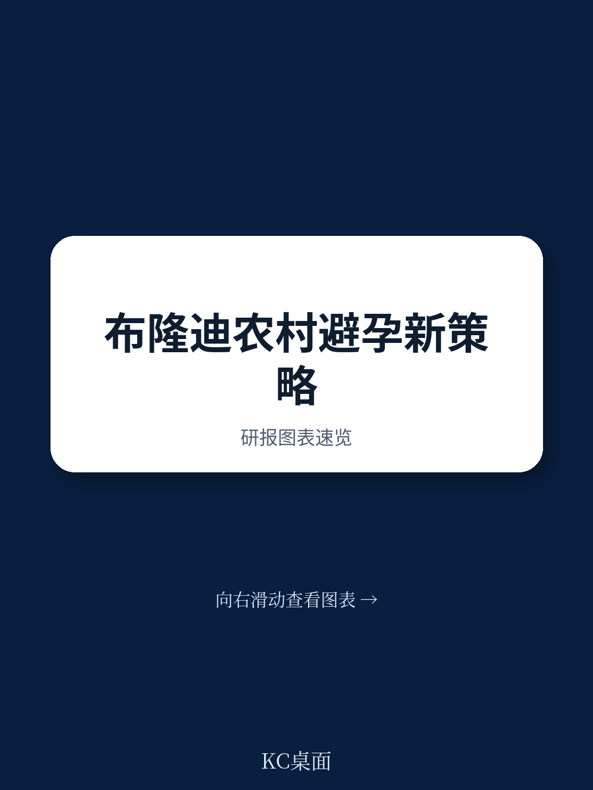
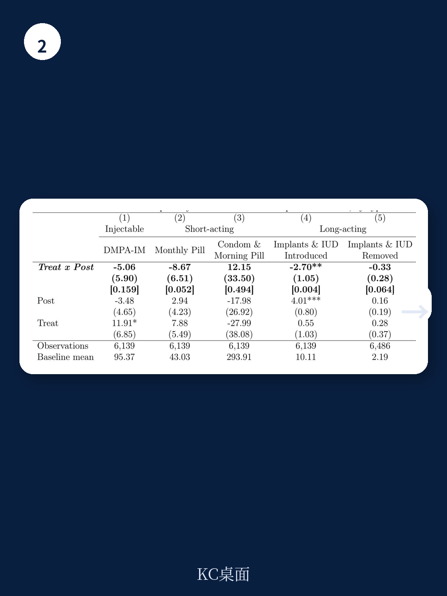

# 世界银行：避孕针到家，反而降低了避孕覆盖率？

在布隆迪的农村，一项旨在让社区健康工作者上门提供长效避孕注射剂的干预实验，得到了一个反直觉的核心结论：服务可及性的大幅提升，并没有带来避孕覆盖率的净增长。世界银行发布的这份政策研究工作论文指出，授权社区健康工作者在例行家访中提供新一代皮下避孕注射剂，虽然使得这种注射剂的用量飙升约70%，但代价是女性放弃了原本可能选择的长效避孕植入物和宫内节育器。这意味着，一个看似“更便捷”的供给方案，最终可能削弱了整体的避孕保护效果。

这份报告的价值，不在于它否定社区健康工作者的作用，而在于它揭示了发展干预中一个极易被忽视的结构性问题：**供给侧的效率提升，如果无法匹配需求侧的真实偏好和认知，可能引发非预期的替代效应，最终导致干预目标的落空。** 对于任何关注新兴市场、公共卫生政策、以及“最后一公里”服务交付的决策者而言，这都是一则必须认真对待的警示。

## 1. 便捷性提升并未转化为整体覆盖率的增长，替代效应是核心原因

这份研究最核心的发现，是干预措施在增加特定产品使用量的同时，未能扩大整体避孕药具的覆盖范围。实验数据显示，在干预组，Sayana Press（一种预充式、可皮下注射、提供三个月保护的新型避孕针）的月均使用量比对照组高出约13个单位，增幅约70%。然而，健康中心报告的总避孕药具分发量并没有发生统计学上显著的变化。

> **KC评论：** 这组数据揭示了一个关键逻辑：当一种新服务被引入时，我们不能只看它自身的增长，更要看它是否在“吃掉”其他更有效的服务。世界银行的这份报告明确指出了“替代效应”的存在。对于读者而言，这意味着在评估任何政策或商业模式的创新时，必须同时考察其“净增量”和“替代量”，而非仅仅关注“使用量”的增长。完整报告中对替代效应的量化分析，以及与不同保护期限避孕方法的对比，值得仔细研读。

研究进一步证实了这种替代效应的方向：干预导致了从长效避孕方法（特别是皮下植入物和宫内节育器）的显著转移。据估算，每个健康中心每月长效避孕方法的使用量下降了约2.7个单位。考虑到这些方法提供数年保护，而Sayana Press仅提供三个月保护，这种替代在净效果上可能大幅降低了总体的避孕保护人年数。报告中的探索性估算表明，在整个分析期内，干预并未带来净的避孕覆盖增长。

## 2. 隐私优势是干预设计的核心逻辑，但可能被高估了

这项干预设计的核心逻辑，是利用社区健康工作者的“内部人”身份来降低避孕服务的隐私成本。在布隆迪农村，女性去健康中心寻求避孕服务面临着多重障碍：路途遥远、交通成本、等候时间长，以及更关键的——被熟人看见进入诊所可能泄露避孕意图的社会污名。社区健康工作者本身就生活在同一社区，其日常家访服务（包括儿童疫苗接种、疟疾筛查等）已经常态化，因此他们上门提供避孕注射，理论上不会额外暴露女性的隐私。

然而，最终结果的“无效”，暗示了这种隐私优势可能被高估了。报告提到，即使由外部医疗人员上门提供避孕服务，也可能因为社区成员将这类人员与计划生育服务直接关联而无意中泄露信息。但社区健康工作者提供的服务包是综合性的，理论上降低了这种“信号”效应。那么，为什么替代效应仍然如此显著？一个可能的解释是，**对于许多女性而言，选择避孕方法的决策并不仅仅取决于获取的便捷性或隐私，更取决于她们对方法本身的知识、信任和长期规划。** 长效植入物和IUD虽然获取流程更复杂，但一旦植入，数年无需操心，这种“一劳永逸”的特性可能被许多女性看重。

> **KC评论：** 这里有一个我们容易忽略的认知偏差。我们往往假设“更方便=更好”，但用户的决策逻辑可能是“更省心=更好”。对于农村女性来说，定期（每三个月）接受一次注射，意味着需要持续的记忆、计划，以及每次与社区健康工作者互动时可能产生的社交压力。而一个植入物，一旦放置，就彻底解决了这些后续问题。世界银行的报告虽然没有完全展开这一点，但数据结果强烈暗示了这种可能性。它提醒我们，在设计干预时，不能只从“供给效率”的角度思考，必须深入理解用户对“总拥有成本”（包括时间、精力、心理成本）的权衡。

## 3. 干预的有效性在理论培训阶段就已显现，但并未转化为长期行为改变

一个有趣的细节是，干预效果在社区健康工作者仅完成理论培训阶段（尚未获得最终认证和在家访中注射的授权）就已经显现。数据显示，在这一阶段，Sayana Press的用量同样出现了显著增长。这很可能是因为理论培训激发了社区健康工作者的积极性，他们开始更有力地向女性宣传和推荐这种新型注射剂，并鼓励她们去健康中心完成首次注射。

然而，这种由“供给端积极性”驱动的增长，最终被“需求端”对长效方法的偏好所抵消。这揭示了一个深层问题：**单纯提升服务提供者的知识和动力，如果缺乏对用户决策机制的深刻理解，很容易产生“推绳子”的效果。** 社区健康工作者成功地将更多女性“推”向了更便捷的注射剂，但那些原本可能选择更长效、更省心方法的女性，却因此被“推”离了更优的选择。这并非社区健康工作者的失误，而是整个干预设计没有预见到或没有能力管理这种替代风险。

报告尚未完全回答的关键问题是：**这种替代效应是暂时性的，还是结构性的？** 随着女性对新型注射剂的认知加深，以及社区健康工作者提供注射服务的常态化，她们是否会重新评估不同方法的价值，并在未来回归到更长效的方法？或者，这种一次性选择会形成路径依赖，使女性长期锁定在“便捷但短期”的避孕模式上？这需要更长期的跟踪数据来验证。

## 4. 对政策制定者和投资者的观察框架：从“可及性”转向“决策生态”

这份世界银行的报告为所有关注“最后一公里”服务交付的人提供了一个新的观察框架。过去，我们往往将“服务可及性”作为核心指标，认为只要消除了物理距离、成本和隐私障碍，需求就会自然释放。但布隆迪的案例表明，**“可及性”只是用户决策生态中的一个变量，它与其他变量（如方法特性、长期规划、认知成本、社会规范）之间存在复杂的互动和替代关系。**

对于政策制定者而言，这意味着在设计家庭规划项目时，不应孤立地推广某一种“更便捷”的方法，而应构建一个整合的、以用户为中心的“决策支持系统”。这包括：
- **综合信息提供**：确保女性在做出选择时，充分了解所有可用方法的优缺点，特别是保护期限、副作用和长期成本。
- **分层服务设计**：将“便捷获取”与“专业咨询”相结合。例如，可以由社区健康工作者提供基础信息和首次注射，但同时建立清晰的转诊路径，让对长效方法有意愿的女性能够便捷地获得植入或放置服务。
- **动态监测与反馈**：建立系统，持续监测不同避孕方法的使用趋势，及时发现并应对非预期的替代效应。

对于投资者而言，这个案例的价值在于提供了一个“压力测试”模型。任何声称能通过提升“可及性”来改变用户行为的项目，都应该被追问：你的“可及性”提升，是否会以牺牲“有效性”或“持续性”为代价？你的目标用户，在获得“更便捷”的选择后，是否会做出“更优”的长期决策？布隆迪的实验结果是一个明确的信号：**答案并非自动为“是”。**

这份报告中最引人深思的部分，也许并非其结论本身，而是它揭示的复杂性和不确定性。它提醒我们，在资源有限的发展环境中，一个看似完美的“效率提升”方案，可能因为忽略了用户行为的内在逻辑而走向反面。对于政策制定者和产业决策者而言，真正有价值的洞察，往往就隐藏在这些“反直觉”的发现之中。

---

以上是基于世界银行这份政策研究工作论文的深度解读。报告中的原始数据、详细的回归分析结果、以及关于替代效应的更细致讨论，都包含在完整报告中。这些图表和假设检验，对于理解干预效果的边界条件和政策含义至关重要。

我们的社群每天会由AI agent结合人工review，生成国际投行和研究机构的中文摘要与深度评论，每日更新，内容涵盖约10-40页的精华提炼，并包含当天最新的数据图表合集。这既方便你快速喂给自己的AI模型，也便于你人工快速把握全球市场动态和前沿研究。

如果你对这份布隆迪的实验如何设计、替代效应如何精确量化、以及报告对“自我注射”未来的展望感兴趣，欢迎加入社群，领取完整研报解读与原始图表。

Personal reading notes and learning share only. Not investment advice.

