# Decarbonization in MENA Countries An Empirical Analysis of Policy Impacts

Hamid Mohtadi

Željko Bogetić

POLICY RESEARCH WORKING PAPER 11064

## Abstract

This paper empirically examines the multiple impacts of alternative, major fiscal instruments on decarbonization in countries in the Middle East and North Africa. It also examines the effects of decarbonization pathways on decarbonization, using a database covering 41 countries, including countries in the Middle East and North Africa region. The analysis uses several methods to compare and contrast the findings and test their robustness. These new estimates contribute to the literature seeking to understand the pros and cons and effectiveness of various policy instruments in promoting decarbonization, with particular focus on the Middle East and North Africa region. The principal findings include the following. Oil subsidies among the region's oil producers strongly and positively impact higher carbon dioxide emissions. This effect seems to work through the energy consumption path. Even after controlling the consumption effect, there remains a direct net effect of subsidies on carbon dioxide, likely arising from other sources such as manufacturing. Comparing three groups—all 41 countries, only countries in the Middle East and North Africa, and only oil producers in the Middle East and North Africa—the adverse effect of oil subsidies on carbon dioxide emissions matters only for oil producers in the Middle East and North Africa, not the other two groups. Flaring contributes to carbon dioxide emissions for oil producers in the Middle East and North Africa. Oil subsidies do not have a significant effect on short-run or long-run economic growth. Thus, reducing subsidies does not adversely impact economic growth. This is true for all countries, including oil exporters, in the Middle East and North Africa.

# Decarbonization in MENA Countries: An Empirical Analysis of Policy Impacts\*

Hamid Mohtadi and Željko Bogetić

JEL Classification: O44 (Environment and Growth), O47 (Empirical Studies of Economic Growth), H2 (Taxation, Subsidies and Revenues), Q4 (Energy), Q5 (environmental economics), O53 (Asia including Middle East), O55 (Africa)

## Decarbonization in MENA Countries: An Empirical Analysis of Policy Impacts

## 1. Introduction

The MENA countries collectively produced about only 5% of global greenhouse gas (GHG) emissions in 2019, a relatively small contribution compared, for example, to East Asia (27%) (Lienard, Brussels International Center, 2022) $^{1}$ (see the caveat at the end of this paragraph). Despite this modest contribution, there are several reasons to consider addressing GHG emissions in the Middle East and North Africa (MENA) region, of high priority. First, MENA's GHG emissions of 13 tons of CO2 per capita per year are just below North America's 19 tons and above Europe's 7.8 tons per capita per year (ibid.). Second, GHG production has been increasing in this region at a breathtaking pace (World Resources Institute, Insights, May 8, 2023). The case is even more dramatic among the Persian Gulf states. Qatar, for example, had the highest GHG emissions per capita in the world, rising by 30% over only 5 years from 2010 to 2015 (Lienard, Brussels International Center, 2022). Third, we will show in this paper that removal of carbon subsidies can be growth enhancing in the long run, even if not in the short run. Fourth, if mitigation strategies involve removal of subsidies, there may be local externality benefits (besides global ones) such as better health outcomes. This is because industrial processes that use or produce fossil fuels often involve health hazards with attendant impacts on fatalities and worker productivity (e.g., black lung disease in coal mining, and multiple diseases due to air pollution). Air pollution has been shown to result in large impacts, “causing more deaths globally than malnutrition, AIDS,

tuberculosis, and malaria combined." (Fuchs et al. 2023). As such, a transformation of the industrial base to renewables may well confer additional health benefits and reduce substantial fatalities. Finally, we will find in the paper that, while a large carbon tax is CO2-reducing, where fossil subsidies are large, their removal is the first best strategy. Since both subsidy removal and carbon taxes are needed to support decarbonization to a significant extent, this is a matter of practical sequencing because the introduction of the carbon tax requires more time than subsidy rationalization.

Beyond the above factors regarding the potential benefits of decarbonization for MENA's own citizens, there is an overwhelming reason why the world, as a whole, should care about decarbonization in MENA: its massive contribution to global climate change as the largest producer and exporter of fossil fuels to the world. In 2023 MENA's share of total world oil production stood at 36.1 percent and that of gas production in 2022 stood at 21.7 percent (U.S. Energy Information Agency, World Bank, and Tagliapietra 2019). Oil and gas production contribute 15 percent of global GHG as reported by the International Energy Agency (IEA 2023). Importantly, this figure does not include GHG produced in the “usage” or consumption of fossil fuels, such as, for example, in the transport sector. In 2021, CO2 emissions in the transport sector alone was 23 percent of all CO2 emissions worldwide (United Nations 2021). $^{2}$ With the transport sector added, this means that MENA's figure of 5% of global CO2 emission is likely vastly underestimated.

Much of the recent literature on decarbonization transition in oil producing countries has focused on the stranded asset problem (van der Ploeg and Rezai 2020, Semieniuk et al. 2022, Daumas, 2023). While this issue is of great importance for the oil producing MENA countries, little has been said about the actual

effectiveness of decarbonization policies in terms of actual reduction of GHGs as well as on the growth prospect of a future without oil in MENA. The latter is important because it can counter the secular economic downturn for MENA oil producers associated with a potential stranded assets risk.

Against this backdrop, the aim of this paper is (a), to gauge the effectiveness of GHG mitigation measures on CO2 emission reduction in MENA countries (b), to examine the pathway through which such GHG mitigation measure would work, and (c), to assess the impact of GHG mitigation measures on economic growth in MENA countries in both the short run and the long run. We do this by studying and comparing the effects of mitigation measures for three groups of countries: the MENA countries as a whole, the MENA oil producers, and the world.

Certainly, removing fuel subsidies or imposing a carbon tax are two effective ways in which countries can reduce their carbon footprint. While a carbon tax has been discussed as the most efficient carbon mitigation policy among various other policy instruments, for example by Timilsina (2022), such a comparison does not include comparing carbon taxes with the removal of fossil fuel subsidies as an alternative policy. Yet fossil fuel subsidies are the dominant fiscal instrument that results in underpricing of carbon, certainly among oil producers. So imposing a carbon tax alone will not be effective in changing the relative prices without eliminating massive underpricing of carbon as a result of fuel subsidies. For example, the International Energy Commission (2021) reports that most oil producers are the top subsidizers of fossil fuel (Figure 1). Given this background, the issue of eliminating fuel subsidies versus imposing carbon taxes raises efficiency issues and practical, policy sequencing issues. On one hand, subsidizing production of renewables and/or imposing a

carbon tax or are Pareto superior strategies because they either reduce a negative externality or increase the production of a positive externality. $^{3}$ On the other hand, subsidizing the production or consumption of a product with negative externality, such as fossil fuels, creates an economic distortion which, if combined with a carbon tax, produces further economic distortion and therefore even greater inefficiency, as is well known from the theory of second best. For example, this would imply removing fossil fuel subsidies first, before imposing a carbon tax. Policy sequencing in the context of decarbonization, however, has emphasized political economy factors over efficiency considerations. This form of sequencing has been followed, in the European Union, California, and currently China (Meckling, Sterner, and Wagner, 2017). In this form of sequencing, interest groups are formed through subsidizing innovation in renewables, before embarking on less popular carbon pricing (ibid). In such cases carbon pricing is often the last policy in the sequence, (Linsenmeier, Mohommad and Schwerhof 2022). However, in this paper we show that removal of fossil fuel subsidies can also be growth enhancing. $^{4}$ The question then is whether this provides the political justification for considering a sequencing in which the removal of subsidy of a negative externality would have higher priority than subsidizing a positive externality. Despite the importance of this question, however, we ignore the sequencing of policies in this paper, as our focus is not the social or political economy efficiency of policies but rather, their impact in reducing GHG emissions.

Figure 1: Fossil Fuel Subsidies by Country (latest year available)  
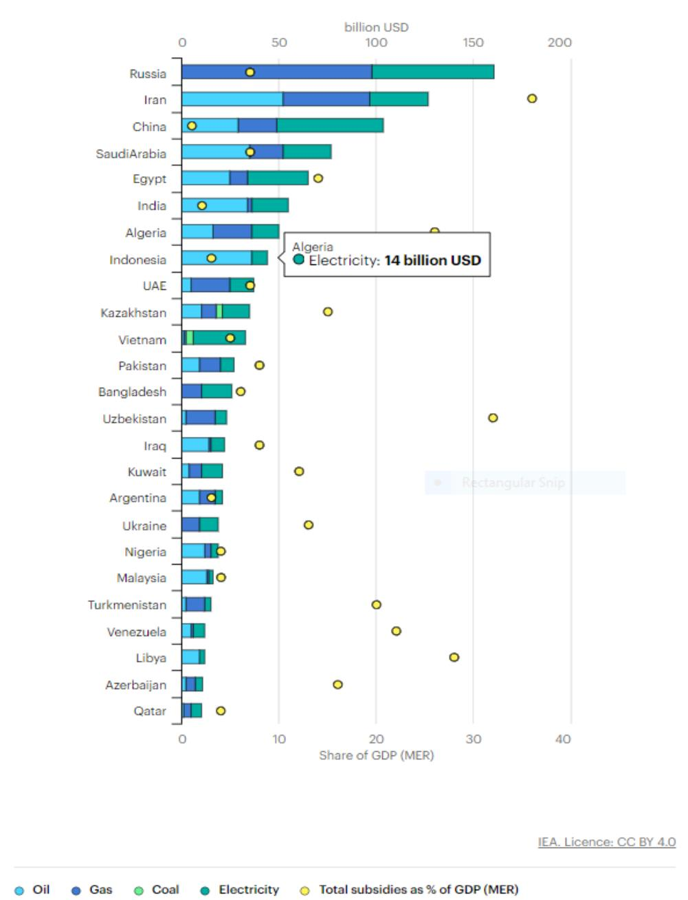  
Source: https://www.iea.org/topics/energy-subsidies

## 2. Fossil Fuel Subsidies, Resource Rent and Carbon Emissions among Oil Exporters

The magnitudes of global subsidies of fossil fuels are staggering. Black et al. (2023) in an IMF working paper estimate that the total global subsidies of fossil fuels amounted to \$7 trillion in 2022, equivalent to the size of the economies of Germany and France, combined. The scale of this issue is not always appreciated. Simply put, governments around the world—especially in MENA—are paying producers and consumers of fossil fuel as much money as the annual GDP of France and Germany in order to produce and consume fossil fuels, with attendant impact on global GHG emissions. So, it would not be an exaggeration to state that fossil fuel subsidies are one of the most inefficient and climate damaging policies on a global scale. This figure includes total subsidies that encompass explicit subsidies, i.e., undercharging relative to true supply costs as well as implicit subsidies, i.e. undercharging relative to negative externalities of climate change and local pollution (Figure 2). To put this in perspective, the World Food Programme estimates that it would take only \$330 billion by 2030 to end world hunger according to the International Institute for Sustainable Development.

Figure 2. Global Fossil Fuel Subsidies: historical and projected  
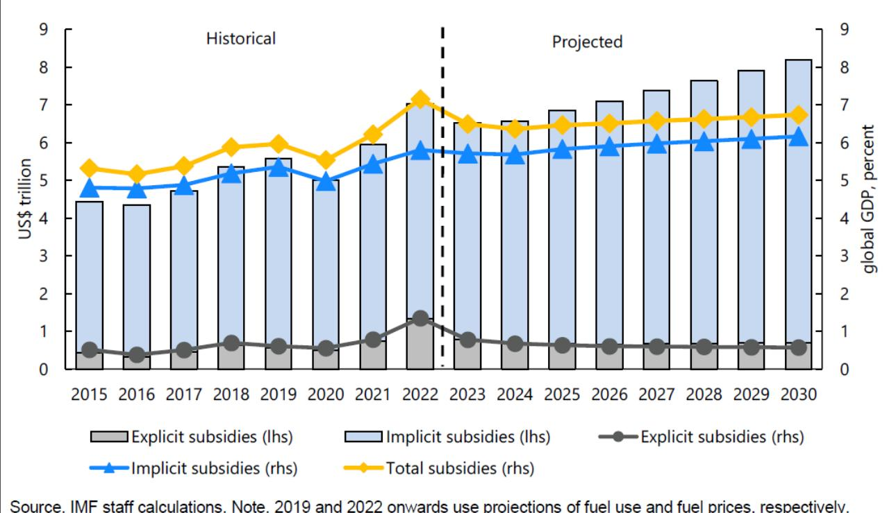

However, the above report and other studies of fossil fuel subsidies, such as one by Kojum and Koplow (2017), focus on oil consuming/importing countries or fossil fuel consuming sectors of the economy. The oil and gas producing countries, on the other hand, face a very different structure that has been far less investigated. For one, they sell at world market prices far above their cost of production. For example, in 2016 the average cost of production in Saudi Arabia and the Islamic Republic of Iran was about \$8.5 per barrel, $^{5}$ while the price of oil averaged to about \$43. Adding the cost of refining of \$3-\$5 per barrel (Favenec, 2022) and estimating domestic transport cost from refining to retail by pipelines for domestic use (approximately 37 cents per barrel), $^{6}$ the total cost would be about \$14 in 2016, as the unsubsidized retail cost of petroleum. This is far less than the international price. How does the classical case of oil subsidy work in this case? For one thing, an explicit subsidy is when the price is below the cost of production, while a typical MENA oil producer enjoys an international price far above the cost of production as we have seen above. Naturally, while governments can use the production cost of approximately \$14 per barrel in the above example as a point of reference to subsidize the price, oil producing companies may consider any price below the international price as foregone profits and thus lobby for subsidy levels relative to the international market, rather than the domestic marginal cost of production. In such a case, the level of subsidy will vary depending on the prevailing world oil price.

To better understand the relation between these variables for a typical oil exporter, Figure 3, developed by the authors, provides further insights. To streamline the modeling, we abstract from the monopoly power of individual oil producers and assume that all sell at a set international price of P\*. This is partly because, except for Saudi Arabia, no other single OPEC member has full price setting capability. Further, even in the case of Saudi Arabia, we can imagine that the geopolitical process by which P\* is arrived at precedes the value of P\* and focus instead on the implication of this for subsidies. For a typical oil producer, especially those in MENA, P\* exceeds the marginal cost of production at that point, as captured in the figure. The market is segmented into the domestic and the world market. But the price faced by domestic users differs from the world price, due to two factors; that the cost of production is far less than the world price, and that the governments further subsidize the production and transportation of oil for domestic consumption, but not world exports.

Several key takeaways from this analysis. First that producer gain may be quite substantial if government subsidizes production relative to the world price than relative to the domestic cost of production as a point of reference. This is depicted by the difference between the vertically shaded area versus the vertically and horizontally shaded areas combined (including the checkered area). Naturally, in the latter case, the magnitude of subsidy by the government to the producers, and thus producers' rents, will vary depending on the world price of oil. In Figure 3, the producer added rents from the subsidy are not only limited to the domestic market but extended the to export market. The question is why. One reason is that apart from the rather small subsidy associated with the cost of transporting oil and gas to the domestic users (in the case of Saudi Arabia we estimated this as only 37 cents per barrel as shown in Appendix 1), the most significant subsidy may occur in the production process itself, in which case one cannot distinguish between subsidy for domestic use versus for the world market. An alternative scenario in which the government subsidizes the oil producer only for domestic sales via monetary compensation at the point of sale, does limit the producer gain rectangle somewhat as depicted in Figure 3a. Second, consumer gains from the subsidy, while they may be substantial, are likely to be significantly smaller than the producer gain in rents as the scale of world demand for any single oil producer will be far larger than the size of domestic demand. This cannot be captured in the figure, due to space limitation. Figure 3 assumes domestic consumer subsidies are relative to the cost of production, while in practice, free market forces imply that the domestic market would be governed by the world price. In such a case, the subsidy would be relative to the world demand as depicted in Figure 3a. Third, implicit subsidies, i.e., the difference between the private supply price and external costs to the climate and local pollution, are quite significant. While in Figures 3 and 3a, per unit size of the implicit and explicit subsidies are close, we saw in Figure 2 that total magnitude of implicit subsidies dwarfs explicit subsidies. This is, again, because the scale of world demand for any single oil producer will be far larger than the size of domestic demand that can be captured in the figure due to space limitation. Fourth, for a similar reason as above, every single oil producer contributes far more to greenhouse gas emissions from its exports to the world market than from domestic overuse. The somewhat larger gap in Figures 3 and 3a between the socially efficient consumption and private consumption levels in the export sector ( $Q_{w,p} - Q_{w,soc}$ ) versus the domestic consumption ( $Q_{D,sub} - Q_{D,soc}$ ), is again not fully captured due to space limitations.

Figure 3. Fossil Fuel Subsidies, Resource Rents and Carbon emission among Oil Exporters: Case 1  
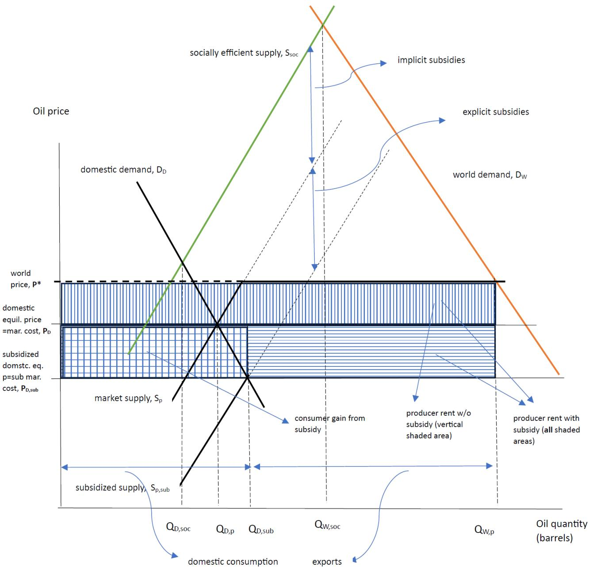  
Note: The figure assumes producers are subsidized at the production level and thus for full output aimed at domestic and world markets. It also assumes domestic consumer subsidy occurs relative to domestic production cost rather than world price. For alternative assumption on both,

see Figure 3a. Produced by the authors based on stylized facts regarding the structure of the oil markets among oil producers.

Figure 3a. Fossil Fuel Subsidies, Resource Rents and Carbon emission among Oil Exporters: Case 2  
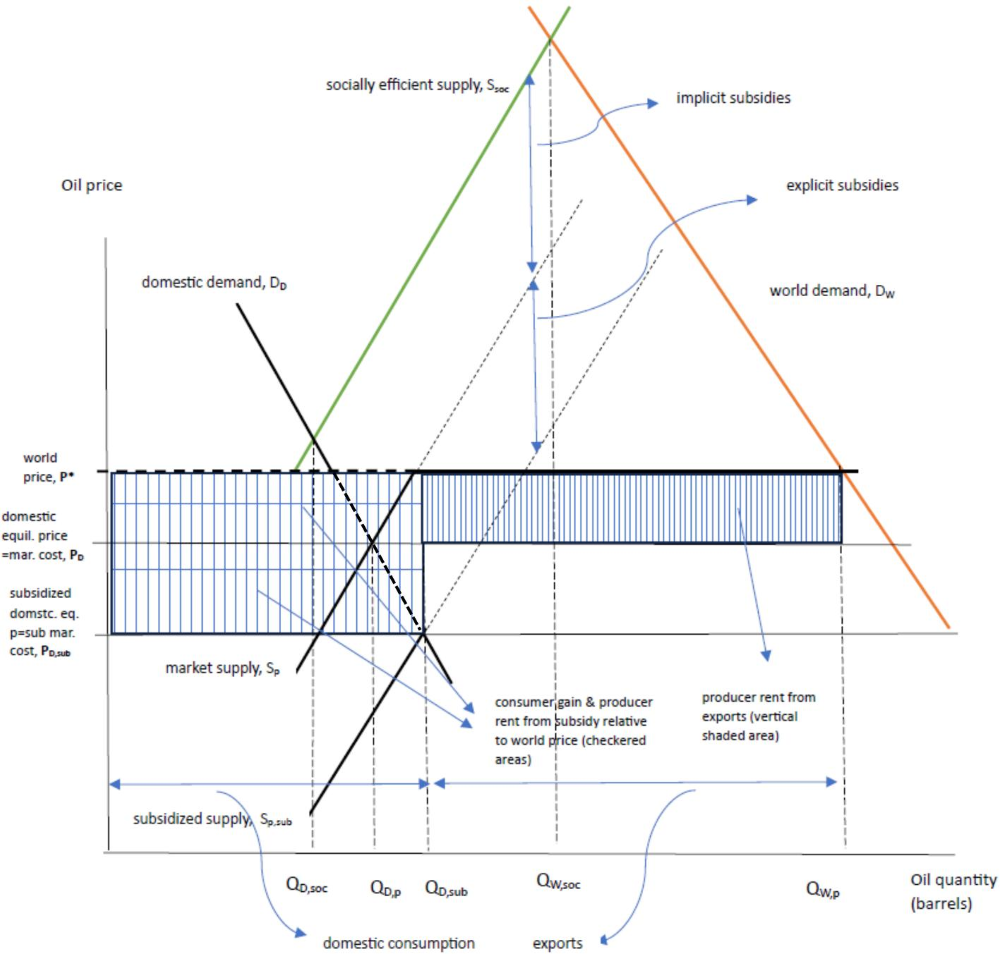

Note: The figure assumes producers are subsidized only for production in the domestic market. It also assumes domestic consumer subsidy occurs relative to the world price. For alternative assumption on both, see Figure 3. Produced by the authors based on stylized facts regarding the structure of the oil markets among oil producers.

We will examine whether a higher world price might require higher domestic subsidies if the domestic demand is to stay constant (Figure 3a). This proposition is empirically examined in Section 5 and is found to hold for MENA oil exporters.

## 3. Method and Data

Our data is from International Energy Agency (IEA, 2021) and covers the years 2011-2018 for 41 countries for which complete data for our purposes exists. The data covers subsidies for four distinct products, oil, gas, electricity, and coal. It also provides separate coverage of “Transport subsidy.” Although the data nominally covers most countries, there are numerous missing observations with the result that 328 observations corresponding to 41 countries are covered (Appendix 2, Table A2.1). One question is whether this produces a biased sample. To answer this question, we consider both the probability density for CO2 emissions and descriptive statistics for subsidies as well CO2 emissions (Appendix 2, Figure A2.1 and Table A2.2). Despite the fact the sample includes the largest emitters, both the density function and the descriptive statistics confirm that it also includes nearly zero polluters as well zero subsidies. Given this large variance we believe that there is sufficient heterogeneity in the sample to pre-empt a biased outcome. These are nominally consumption subsidies. But as was shown in Figure 3 and 3a, in practice, any subsidy that lowers the retail price of fossil fuels to the users beyond an equilibrium price can only achieve this goal by reducing production and transportation cost and this amounts to an outward shift of the supply curve. Thus, in principle, there can be no conceptual distinction between production and consumption subsidies. That said, differential gains of both users and producers from a subsidy can certainly be assessed, as was illustrated in Figures 3 and 3a.

Our empirical methodology, detailed below, is supplemented with a scenario-based forecast of countries using the World Bank-IMF joint analytical tool, Climate Policy Assessment Tool (CPAT), which is an Excel based large macro accounting tool calibrated to detailed country-level data. Although CPAT is a partial equilibrium tool, this limitation is overcome by the consistency that we find between our empirical results and the CPAT scenario-based forecasts, at least in terms of focus on CO2 emissions. This is confirmed in nearly all cases. Beyond that, however, the use of this methodology allows us to compare the effectiveness of a possible

subsidy reduction scheme with an increase in carbon tax, in terms of their effect on curbing CO2 emissions. While we investigate the separate effects of a carbon tax and fossil fuel subsidies in a ceteris paribus framework, tracing the effect of each, there is no a priori reason not to expect both to co-exist, even when such combination is not efficient (Section I). In such cases, it is possible to speak of total carbon price (TCP) as has been done in an interesting new investigation in a recent paper by Agnolucci et al. (2023). The question of what constitutes TCP is complex because TCP includes not only carbon taxes and subsidies but many indirect forms of carbon pricing such as emission trading systems, carbon credit mechanisms, value added deviations on fuel versus other commodities, clean energy standard, etc. These questions are extensively discussed by Agnolucci et al. (2023) but are beyond the scope of this paper.

The empirical analysis uses three different econometric techniques, depending on the question we ask. In the first, we simply run fixed effects panel regressions to examine and estimate the role of fossil fuel subsidies in CO2 emissions. We do this across the 41 countries in our sample, across all the 20 MENA countries, and across the 7 large oil producing MENA countries. In the second, we estimate the extent to which subsidies impact CO2 emissions via their role in the usage or consumption of fossil fuel-based products. We do this by adopting a more novel and less frequently used technique, known as Sequential G (SG) Estimation. In a separate empirical section, a third empirical technique is employed to examine the short-run versus the long-run effect of fossil fuel subsidies on economic growth. That technique is based on a dynamic Autoregressive Distributive Lag (ARDL) method with an Error Correction (EC) component.

In what follows, Section 4 presents a summary of the findings; Section 5 covers the first three empirical methods and the corresponding results; Section 6 covers country projections based on CPAT product alluded earlier; Section 7 returns to empirical analysis, using ARDL-EC method mentioned above to examine the role of fossil fuel subsidies in economic growth. This analysis is conducted for all of MENA, as a whole, for MENA oil producers as a group, and for all of the 41 countries for which data is available; Section 8 concludes. Throughout the analysis, policy prescriptions are emphasized.

## 4. Summary of Findings

## 4a. Summary of Empirical Findings (Sections 5 and 7)

Before we discuss our findings in greater detail, we briefly summarize major findings from our econometric analysis. Later, we compare our findings in this section with our projection of country-level CO2 emissions based on different subsidy and tax scenarios, using the WB-IMF tool (CPAT). From the econometric analysis, the following are the key findings:

1. Oil subsidies among MENA oil producers strongly and positively impact higher CO2 emission.

2. This effect seems to work through the energy consumption path.

3. Even after the consumption effect is controlled for, there remains a direct net effect of subsidies on CO2, likely arising from other sources such as manufacturing.

4. Comparing three groups; all 41 countries, only MENA countries, and only MENA oil producers, the adverse effect of oil subsidies on CO2 emission matters only for MENA oil producers and not the other two groups.

5. Flaring contributes to CO2 emission for MENA oil producers.

6. Oil subsidies do not have a significant effect on short-run or long-run economic growth. Thus, reducing subsidies does not adversely impact economic growth. This is true for all countries, for MENA, and for MENA oil exporters. Single country projections from CPAT (below) are consistent with these findings in the long run but differ in the short-run, probably because of the select nature of our single country analysis and differences in the methods used.

## 4b. Summary of Country Projections (Section 4)

1. Focusing on several individual MENA countries and comparing the policy of removing fossil fuel subsidies with imposing a carbon tax, in terms of projected CO2 reductions, we find that in general when the carbon tax is modest, removing fossil fuel subsidies is more effective, but when the carbon tax is large, it may dominate or tie with removal of subsidies, depending on the country.

2. In general, when subsidies are larger, it takes a larger carbon tax to yield equivalent CO2 reduction. Thus, in general, oil producing MENA countries that experience large subsidies have equivalent carbon tax levels that are larger than those of non-oil MENA countries.

3. MENA governments' budgets dramatically improve with either a moderate carbon tax (\$25 per ton of CO2) or removal of fossil fuel subsidy. The improvements are often sustained through 2035 or 2036.

4. In most cases of the select MENA countries chosen here, under either of the two fiscal instruments, growth is stabilized in the long run, after a small initial drop. The long run result is consistent with empirical panel results as well.

## 5. Detailed Empirical Results

## 5.1. Oil subsidies among MENA oil producers strongly and positively impact CO2 emissions

In Table 1, the regressions are based on fixed effects panel estimates that control for country and time fixed effect and use robust error. $^{7}$ For comparison, this is done for the full sample, for the MENA subsample, and for the subsample of MENA oil group. The typical regression is of the form,

$$
Y _ {i t} = a + b _ {1} S _ {i t} + b _ {2} S _ {i t - 1} + b _ {3} Y _ {i t} * M E N A \_ o i l + \overrightarrow {c ^ {\prime}} \overrightarrow {X} _ {i t} + u _ {i} + v _ {t} + \mu_ {i t}\tag{1}
$$

where for each country i and time t, Y represents CO2 emissions, S is oil subsidy, $\overline{X}$ is (m x 1) column vector of all other controls (GDP, population, gas flaring) and $\vec{c}'$ is (1 x m) row vector of corresponding coefficients. The regression errors $u_{i}$ and $v_{t}$ represent country and time specific error terms and $\mu_{it}$ represent regression error. The period covered is 2011-2018. The results are perhaps not surprising. Fossil fuel subsidies are associated with more CO2 emissions only among MENA oil exporters.

As for the measure of the dependent variable, rather than focusing on CO2 as a fraction of GDP or relative to population, we instead control for both GDP and population as independent variables and use total CO2 production as the dependent variable of interest. The advantage of this method is that the result no longer depends on which measure of CO2 emission we use. Naturally, the high degree of significance of both variables indicates that size matters both in terms of population and in terms of output. The measures of

subsidies are as a share of GDP which inoculates the measure against inflation. While this produces very small values (thus causing the corresponding regression coefficients to be large), an alternative to consider subsidies as share of government expenditures requires introducing additional data, possibly reducing the sample size even further. Further, considering subsidies relative to the size of the economy may be a more reasonable measure to use. $^{8}$

## 5.2. The above effect works through the CO2 intensive consumption path

Results up to this point are in reduced form. We may want to provide some structure to the analysis. For example, we may want to (a) examine whether fossil fuel subsidies impact CO2 emission by encouraging CO2 intensive consumption and (b) ask whether after the consumption effect is controlled, there remains a direct net effect of subsidies on CO2 emissions outside the CO2 intensive consumption effect, for example working through other (unobserved) channels such as manufacturing. For this purpose, we run what is known as the Sequential g estimation method (SG) (Acharya, Blackwell, & Sen 2016) in which we run the full model (first equation below). We then “de-mediate” this effect by subtracting the effect of consumption $\hat{\beta}_{1}x_{it}$ from $Y_{it}$ (second equation) and re-run the regression again to obtain the “net” or direct effect of subsidy on CO2 outside its effect via consumption of CO2 or energy (third equation). Equations in (2) represent all three stages of the model.

$$
\begin{array}{l} Y _ {i t} = \alpha_ {1} + \beta_ {1}. c o n s _ {i t} + \gamma_ {1} ^ {1} S _ {i t} + \gamma_ {1} ^ {2} S _ {i t - 1} + \overrightarrow {\theta_ {1}} ^ {\prime} \overrightarrow {X} _ {i t} + u 1 _ {i} + v 1 _ {t} + \mu 1 _ {i t} \\ Z _ {i t} = Y _ {i t} - \hat {\beta} _ {1}. c o n s _ {i t} \\ Z _ {i t} = \alpha_ {2} + \gamma_ {2} ^ {1} S _ {i t} + \gamma_ {2} ^ {2} S _ {i t - 1} + \overrightarrow {\theta_ {2}} ^ {\prime} \overrightarrow {X} _ {i t} + u 2 _ {i} + v 2 _ {t} + \mu 2 _ {i t} \end{array}\tag{2}
$$

Results are reported in Table 2, showing that (a) CO2-intensive consumption does contribute to more CO2 emissions (columns 1 and 3) and (b) for the MENA oil group, even after the consumption effect is “demediated” as previously described, the remains a direct net effect of subsidies on CO2 (column 4),

probably arising from other sources such as manufacturing. Further, for the MENA oil group both subsidy and its lag remain highly significant even in the de-mediated regression in which the effect of CO2-intensive consumption is removed (column 4). We present this result conceptually in the chart below.

Figure 4: Fossil Fuel Subsidies significantly contribute to CO2 Emissions in Oil Exporting MENA  
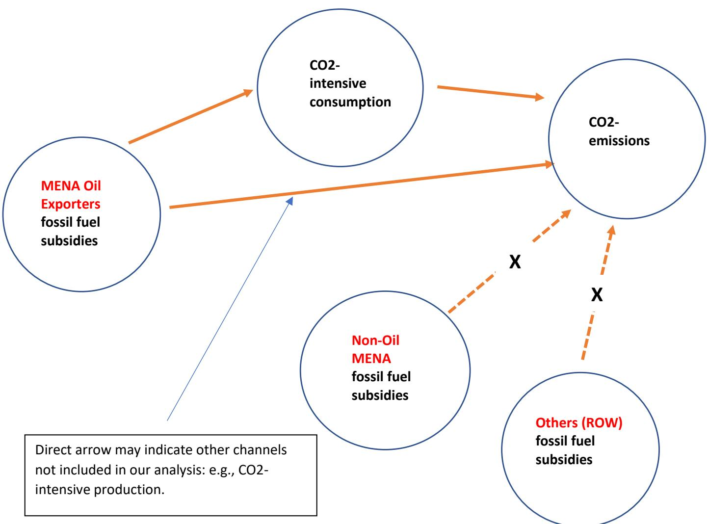  
Source: Authors.

## 5.3. Flaring matters in contributing to CO2 emissions only for the full sample of 41 countries

Table 2 also shows that flaring contributes to CO2 emissions only among MENA oil exporters (columns 4 and 5). This is not surprising. Figure 5 shows 4 of the largest 9 flaring countries are the Islamic Republic of Iran, Iraq, Alegria and Libya, that are in the MENA oil group, with the Islamic Republic of Iran and Iraq second and third only after the Russian Federation. Unfortunately, the relation between flaring and oil production has been remarkably stable globally (Figure 6), suggesting little effort has been made globally to reduce flaring over the past 30 years.

Figure 5. Flaring by Country  
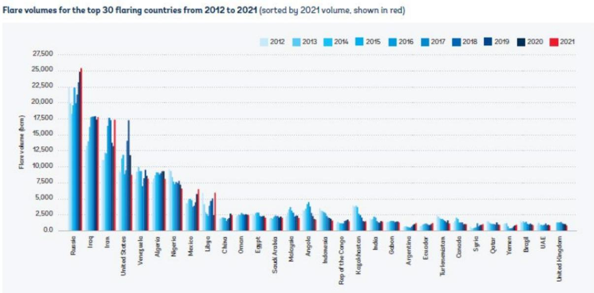  
Source: NOAA, Payne Institute and Colorado School of Mines, GGFR

## Figure 6. Trends in flaring

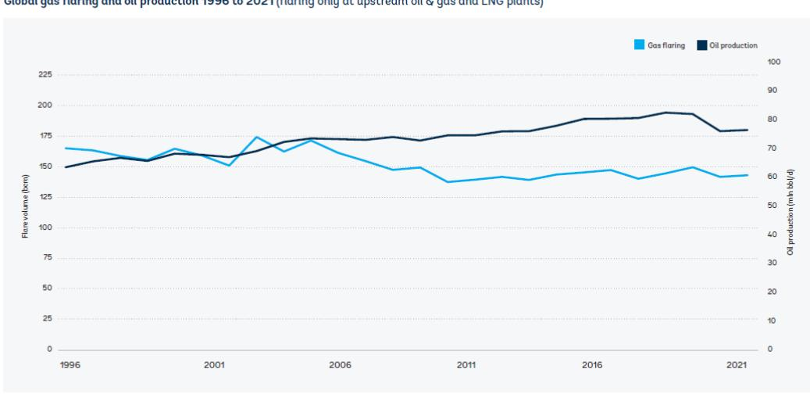  
Source: NOAA, Payne Institute and Colorado School of Mines, GGFR

## 5.4 World oil prices affect the level of subsidy

In Table 3, our panel data estimates show that higher world prices are associated with higher domestic subsidy with a lag in the MENA and MENA oil groups. In Figure 3A--the relevant figure here--this would mean that an upward shift of the P\* line is matched by upward shift in the line $P_{D,sub}$ so as to maintain overall domestic demand. Econometrically, one point is worth noting. We cannot assess the direct effect of world oil prices due to all countries facing the same price each year and the price changing only in time. This means that a time fixed effect in a fixed panel regression would yield no or meaningless estimates, so that the correct estimate can only be done with an interaction term of oil prices and region, for the full sample as is done in Table 3.

## 6. Country-Level Projections: Removing Subsidies or Taxing Carbon?

In this section we develop country-level projections for 2022-2036 by applying the CPAT tool which is a macro accounting model calibrated to country data, developed by the World Bank and the International Monetary

Fund. $^{9}$ CPAT is a spreadsheet tool based on both empirical estimation to calculate response elasticities of various outcome variables to inputs such as fuel prices and user based choice such as fuel taxes as well as some macro relationships. Moving from global elasticity estimates and applying those to country level elasticity estimates involves econometric modeling assumptions detailed in the “CPAT Methodology” document. The tool consists of several modules of which the central module is the CPAT "Mitigation" module. $^{10}$ To illustrate the working of the CPAT tool, the following diagram is useful:

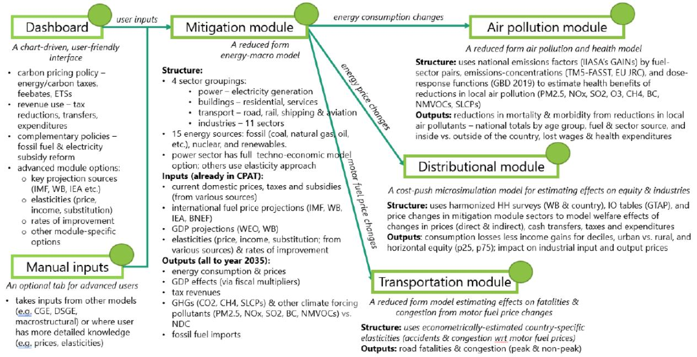  
Source: CPAT documentation.

We divide the country projections into two types of projections, (a) CO2 emissions and (b) fiscal revenue and growth projections. Applying this tool, results are reported in Figures 7 to 10 and described below in detail. As for CO2 projections, in general we find that while in all instances the combination of a carbon tax and the removal of fossil fuel subsidies is most carbon reducing, as would be expected, there are some tradeoffs between imposing a modest carbon tax or removal of fossil fuel subsidies. In general, we find that when the carbon tax is modest, e.g., \$5 per ton of carbon, removing subsidies is a more effective mitigation strategy. But the situation changes when we compare much larger carbon tax, e.g., \$50 per ton of carbon, with the removal of subsidies, where with some exceptions (e.g., Saudi Arabia), carbon tax dominates as a mitigation strategy. But in general, the fact that for small carbon tax, subsidy removal is the most effective strategy corroborates and generalizes our empirical findings of the previous section.

As for any generalizations in projecting the fiscal and growth profile of the country under carbon tax or subsidy removal schemes, we see that both schemes improve the fiscal space for all countries with a moderate carbon tax of \$25 per ton of CO2, generally dominating subsidy reduction expect for cases where subsidy is extremely high, such as Saudi Arabia and Iraq (see below). The growth results of both policies are, however, neutral in the long run and adverse in the short run, a finding that is different from the empirical findings, which we will discuss in section 7.

Below are some specific country projections of CO2 reductions based on a comparison of tax and subsidy strategies.

## 6.1 Examples from Oil Producing MENA

## 6.1.1 Saudi Arabia

Here, for a modest carbon tax of \$5 per ton of CO2, removing fossil fuel subsidies is more effective in reducing CO2 emission whether or not carbon tax is imposed (yellow and blue lines coincide and produce less CO2 emission). In fact, imposing carbon tax does little to reduce CO2 (orange and gray lines coincide and produce more CO2) (Figure 7a). But only at much higher carbon tax of \$50 per ton of CO2 does carbon tax-based CO2 reductions exceed subsidy elimination (compare gray-orange gap with orange-blue gap). Further, removing fossil fuel subsidy and imposing no carbon tax (yellow line) still ties, until 2029, with a policy of imposing a carbon tax and keeping the subsidies (orange line) and only after 2030 is carbon tax more effective in reducing CO2 (Figure 7b).

As for government revenues, while both carbon tax of \$25 and removal of fossil fuel subsidies improves the revenue, removal of fossil fuel subsidies dominates by a wide margin (Figure 7c). Both policy instruments cause growth to decline very slightly in the short run, with no long run effects, as growth rates converge to the baseline in the long run (Figure 7d).

## 6.1.2. Iraq

As in Saudi Arabia, for a modest carbon tax of \$5 per ton of CO2, removing fossil fuel subsidies is more effective in reducing CO2 emission regardless of whether or not carbon tax is imposed (yellow and blue lines coincide and produce less CO2 emission). In fact, imposing carbon tax does little to reduce CO2 (orange and gray lines coincide and produce more CO2) (Figure 8a). Only at much higher carbon tax of \$50 per ton of CO2 does carbon tax-based CO2 reductions exceed subsidy elimination (compare gray-orange gap vs. orange-blue gap) (Figure 8b). The fiscal and growth effects are similar to Saudi Arabia (Figures 8c and 8d).

## 6.2 Country Example from Non-Oil Producing MENA

## 6.2.1 Arab Republic of Egypt

For small carbon tax, results are similar to those for Saudi Arabia (Figure 9a similar to figure 7a), but with smaller magnitudes. At \$50 per ton of CO2, although swapping carbon tax and fossil fuel subsidy policies (imposing the tax but keeping the fuel subsidy -as in orange line- versus no tax but removing the subsidy-as in yellow line) leads to largest gain in CO2 reduction (yellow to orange line shift in In Figure 9b), the gain in CO2 reduction by removing the subsidies when there is no tax (shift of gray to yellow line) is substantially larger than doing the same at a carbon tax rate of \$50 per ton (shift of orange to blue line). As for government revenues, while both carbon tax of \$25 and removal of fossil fuel subsidies improves the revenue, carbon tax dominates removal of fossil fuel subsidies (Figure 9c), unlike Saudi Arabia and Iraq. As in other cases, both policy instruments cause growth to decline very slightly in the short run, and no long run effect is observed as growth rates converge to the baseline in the long run (Figure 9d).

## 6.3 Country Example from Fragile States

## 6.3.1 Lebanon

Regardless of the carbon tax scenario (Figures 10a and 10b), we see a steep drop in CO2 emissions until 2020. In the case of low carbon tax scenario of \$5 per ton of CO2, we see a very even divide between the four possible combinations of the two policies (Figure 10a). In the case of high carbon tax scenario of \$50 per ton of CO2, we see that as in the case of Egypt's high tax scenario, there is a bifurcation of the four combinations (Figure 10b). In particular, in this case a large carbon tax is always much more effective than the removal of fossil fuel subsidies, probably due to the very small size of the subsidies. Finally, both figures show a uniquely large decline in CO2 emissions after about 2032 (kink in all the lines) despite the growth of the economy. This decline is independent of all policies as the gray line shows. Also, while both a carbon tax of \$25 and removal of fossil fuel subsidies improves the revenue, the carbon tax dominates removal of fossil fuel subsidies by (Figure 10c), unlike Saudi Arabia and Iraq, but similar to Egypt except that the effect is more dramatic. As in other cases, both policy instruments cause growth to decline slightly in the short run, with no long run effect on growth observed, and rates converge to the baseline in the long run Figure 10d).

## 6.4 Country Example from non-FCV Economies

## 6.4.1 Morocco

For a modest carbon tax of \$5 per ton of CO2, removing or leaving small fossil fuel subsidies makes little difference. This is indicated in Figure 11a by the coincidence of the yellow and gray lines, suggesting that the subsidy must be very small and inconsequential. A large carbon tax of \$50 per ton of CO2 does makes some difference, where the lines bifurcate (Figure 11b). Again, however, the subsidy, or lack thereof, makes little difference as indicated by the coincidence--this of the orange and blue lines--suggesting that, once again, the subsidy must be very small and inconsequential. Also, the government budget benefits from a \$25 carbon tax more than subsidy removal, but the effect is less dramatic than in Lebanon or even Egypt (Fig. 11c). The growth effect of both policies shows same short run dip and long run convergence to the baseline as in other countries, but the dip is much shallower (Fig. 11d).

## REMOVING FOSSIL FUEL SUBSIDIES VS CARBON TAX: MENA OIL GROUP

## Figures 7a and 7b: CO2 Emissions. Saudi Arabia

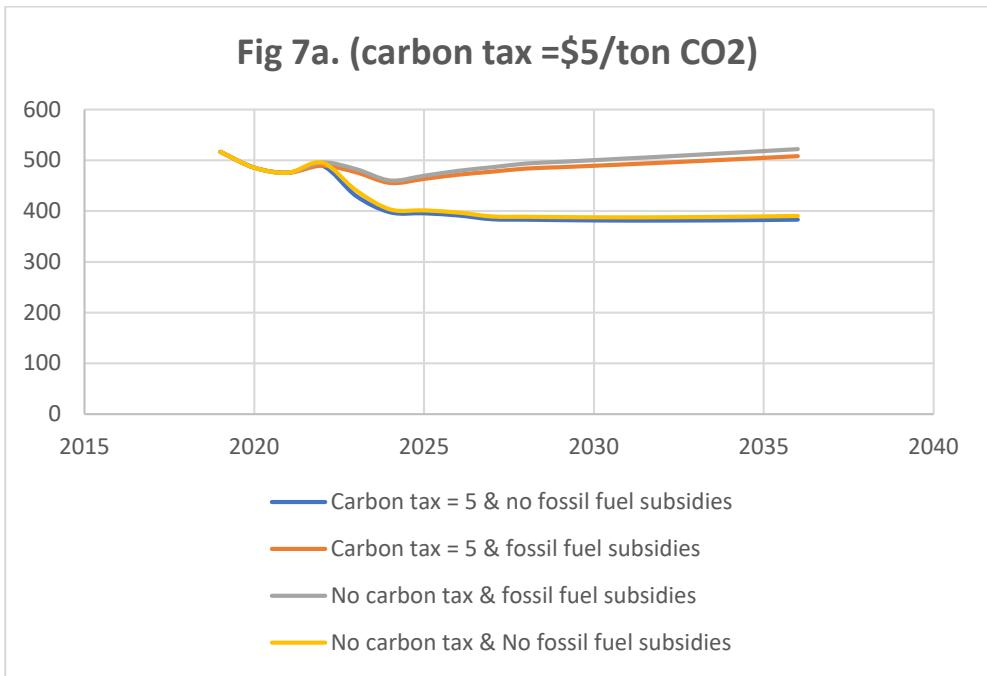

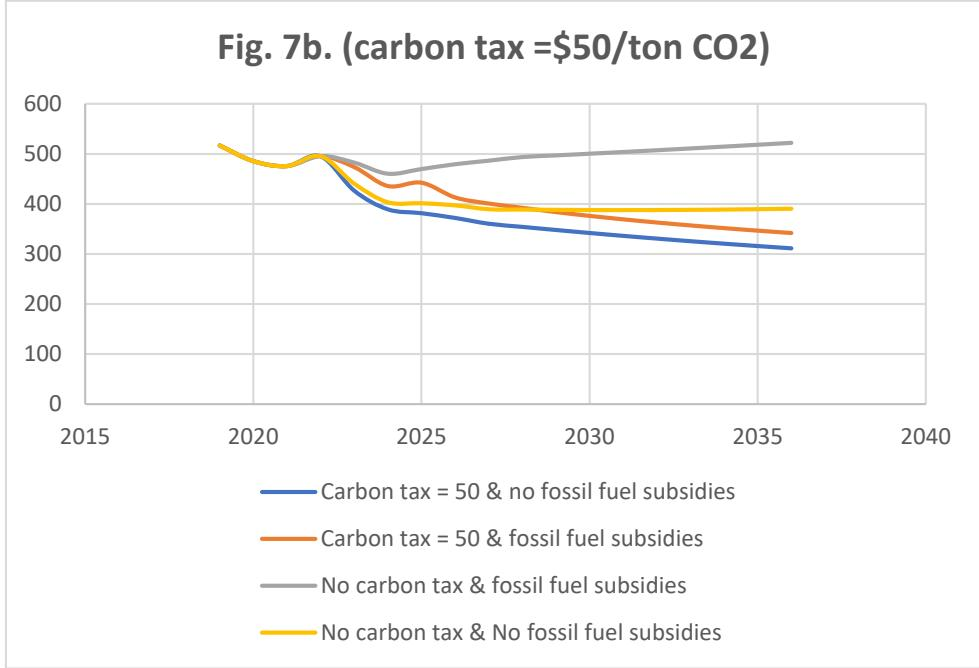

Figures 7c and 7d: Government Revenue and growth: Saudi Arabia  
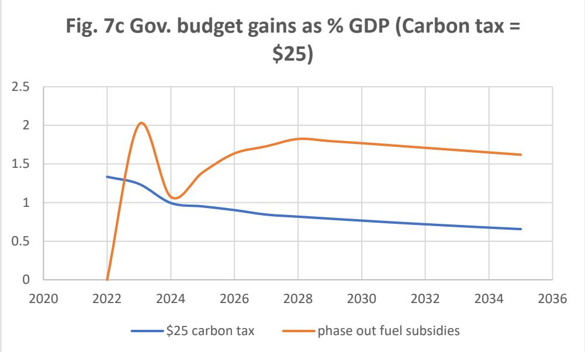

Fig. 7d. Growth contribution of carbon tax vs removing fuel subsidies  
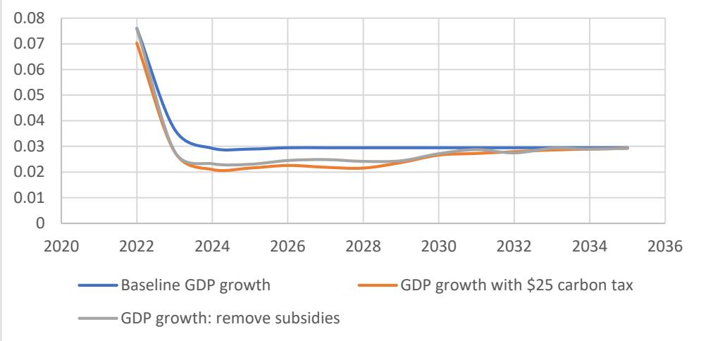

Note: Fig 7a: For a modest carbon tax of \$5 per ton of CO2, removing fossil fuel subsidies is more effective in reducing CO2 emission whether or not carbon tax is imposed (yellow and blue lines coincide and produce less CO2 emission). In fact, imposing carbon tax does little to reduce CO2 (orange and gray lines coincide and produce more CO2). Fig 7b: Only at much higher carbon tax of \$50 per ton of CO2 does carbon tax-based CO2 reductions exceed subsidy elimination (compare gray-orange gap with orange-blue gap). Further, removing fossil fuel subsidy and imposing no carbon tax (yellow line) still ties, until 2029, with a policy of imposing a carbon tax and keeping subsidies (orange line) and only after 2030 is carbon tax more effective in reducing CO2. As for government revenues, while both carbon tax of \$25 and removal of fossil fuel subsidies improves the revenue, removal of fossil fuel subsidies dominates by a wide margin (Fig. 7c). Both policy instruments cause growth to decline very slightly in the short run, with no long run effect as growth rates converge to the baseline in the long run (Fig. 7d).

Figures 8a and 8b: CO2 Emissions: Iraq  
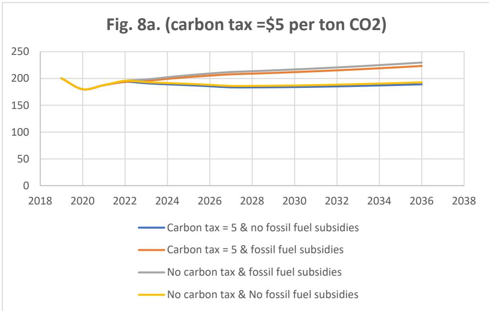

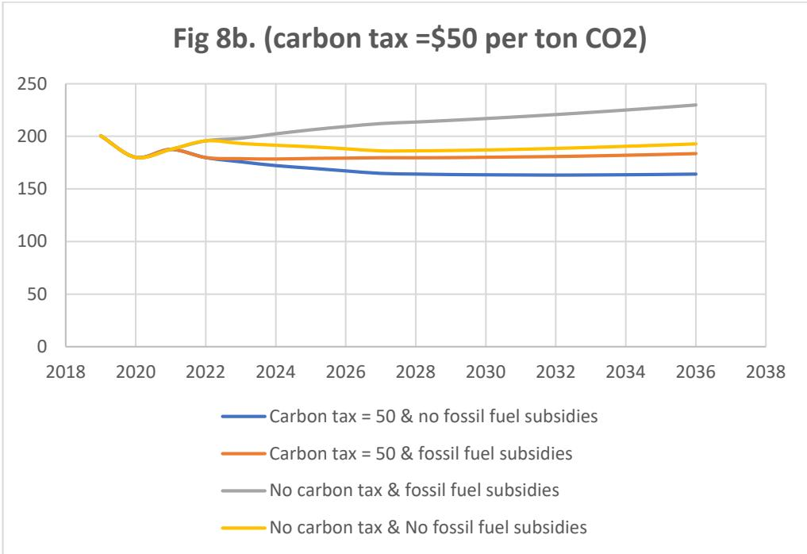

Figures 8c and 8d. Government Revenue and Growth: Iraq  
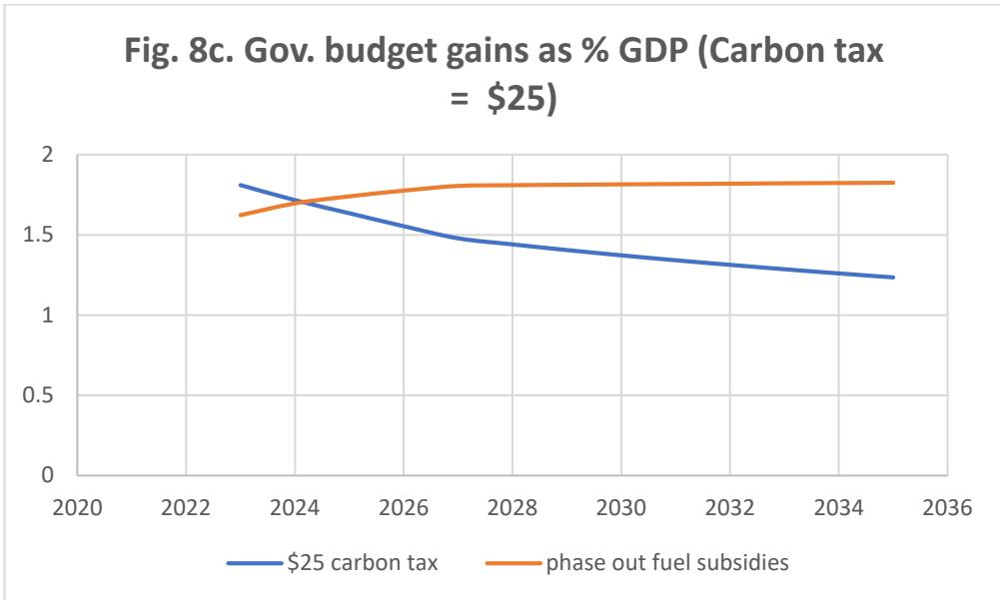

Fig. 8d. Growth contribution of carbon tax vs removing fuel subsidies  
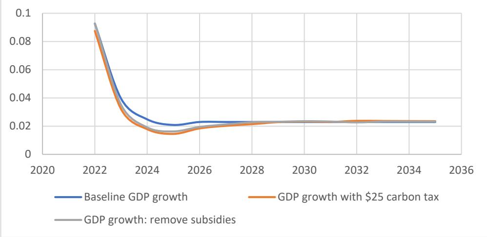

Note: Fig 8a: For a modest carbon tax of \$5 per ton of CO2, removing fossil fuel subsidies is more effective in reducing CO2 emission regardless of whether or not carbon tax is imposed (yellow and blue lines coincide and produce less CO2 emission). In fact, imposing carbon tax does little to reduce CO2 (orange and gray lines coincide and produce more CO2) Fig 8b: Only at much higher carbon tax of \$50 per ton of CO2 does carbon tax-based CO2 reductions exceed subsidy elimination (compare gray-orange gap vs. orange-blue gap). The fiscal and growth effects are similar to Saudi Arabia (Figs. 8c and 8d).

## REMOVING FOSSIL FUEL SUBSIDIES VS CARBON TAX: NON-OIL MENA

## Figures 9a and 9b. CO2 Emissions: Egypt

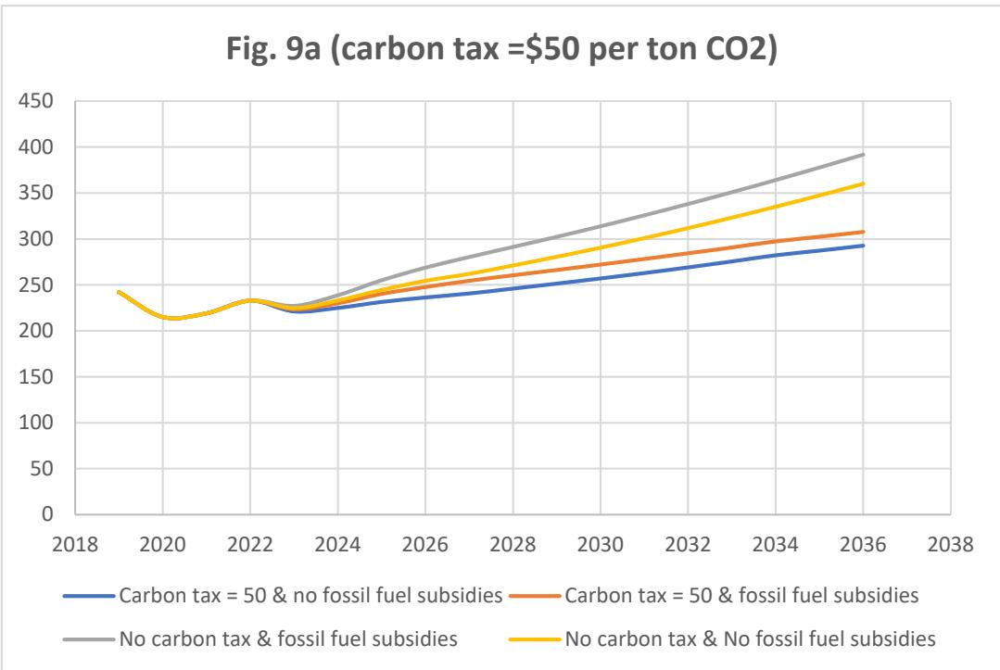

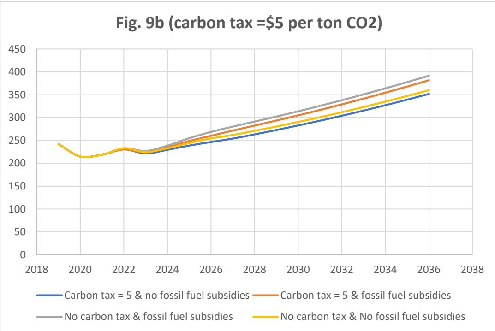

Figures 9c and 9d. Government Revenue and Growth: Egypt  
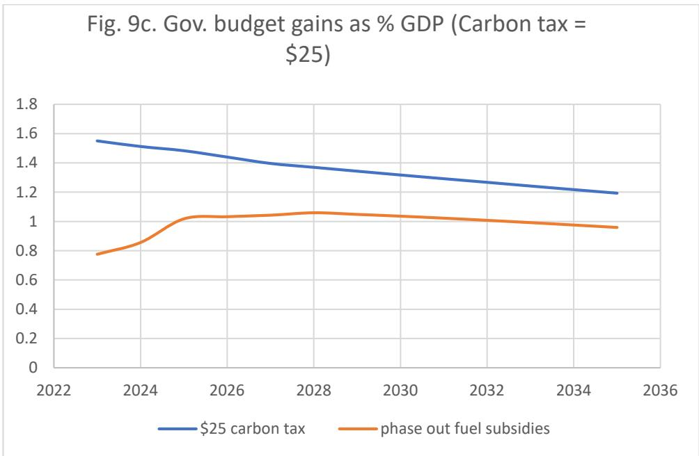

Fig. 9d. Growth contribution of carbon tax versus removing fossil fuel subsidies  
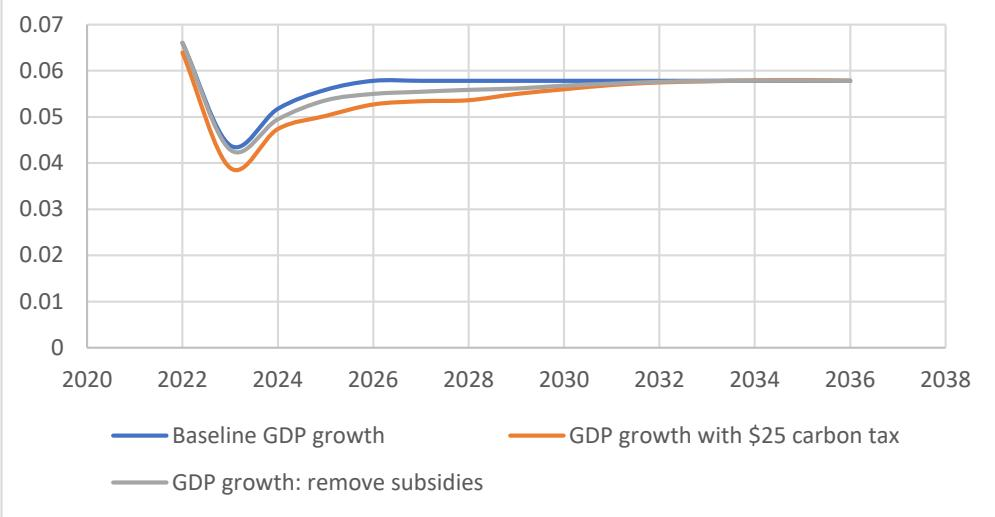

Note: Figure 9a. Results are similar to those for Saudi Arabia (fig. 7a), but with smaller magnitudes. In Figure 9b, at \$50 per ton of CO2, although swapping carbon tax and fossil fuel subsidy policies (imposing the tax but keeping the fuel subsidy -as in orange line- versus no tax but removing the subsidy-as in yellow line) leads to largest gain in CO2 reduction (yellow to orange line shift), the gain in CO2 reduction by removing the subsidies when there is no tax (shift of gray to yellow line) is substantially larger than doing the same at a carbon tax rate of \$50 per ton (shift of orange to blue line). While both carbon tax of \$25 and removal of fossil fuel subsidies improves the revenue, carbon tax dominates removal of fossil fuel subsidies (Figure 9c), unlike Saudi Arabia and Iraq. As in other cases, both policy instruments cause growth to decline very slightly in the short run, with no long run effect as growth rates converge to the baseline in the long run (Figure 9d).

# REMOVING FOSSIL FUEL SUBSIDIES VS CARBON TAX: A FRAGILE MENA

Figures 10a and 10b: CO2 Emissions. Lebanon  
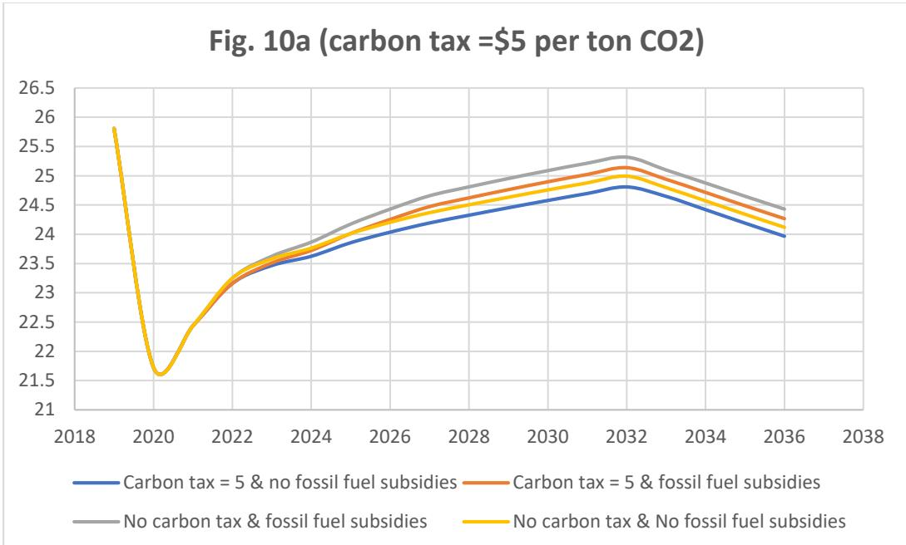

Fig. 10b (carbon tax = \$50 per ton CO2)  
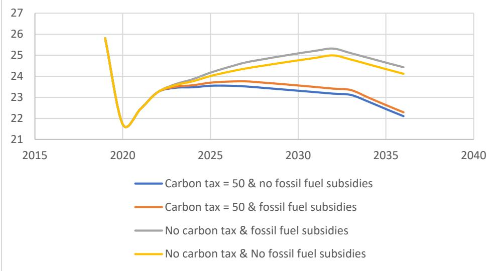

Figures 10c and 10d. Government Revenue and growth: Lebanon  
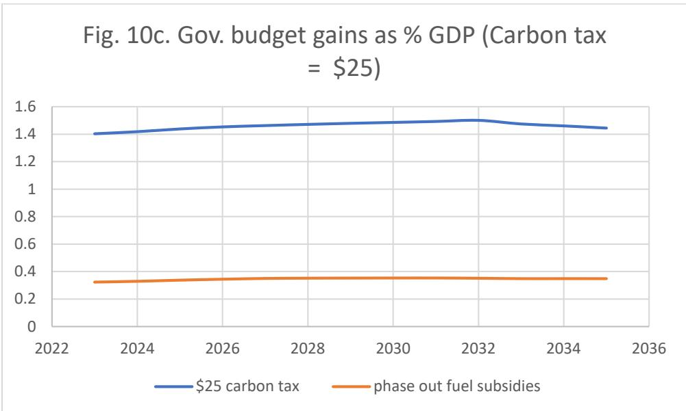

Fig. 10d. Growth contribution of carbon tax versus removing fossil fuel subsidies  
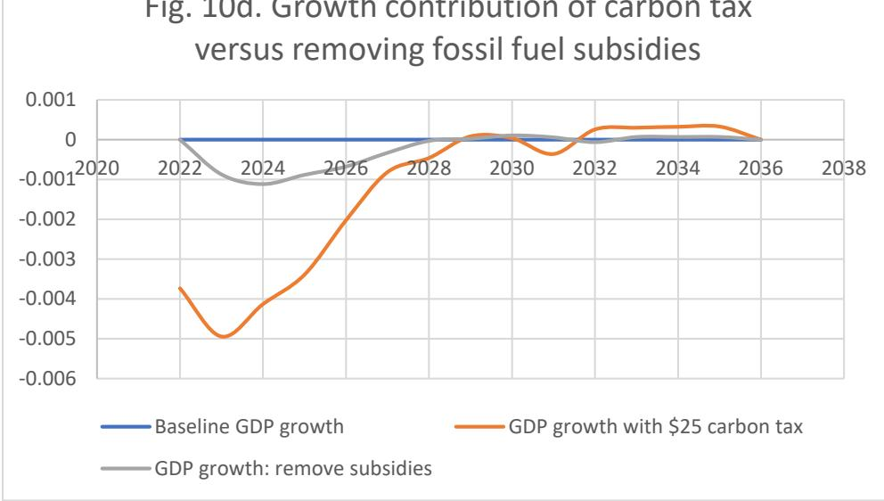

Note. Figure 10a. Following a steep drop in CO2 emissions in 2020, we see a very even divide between the four possible combinations of the two policies. Figure 10b. As in the case of Egypt's second figure, we see a bifurcation of the four combinations. In particular, in this case a large carbon tax is always much more effective than removal of fossil fuel subsidies, probably due to the very small size of the subsidies. Finally, both figures show a uniquely large decline in CO2 emissions after about 2032 (kink in all the lines) despite the growth of the economy. This decline is independent of all policies as the gray line shows. While both carbon tax of \$25 and removal of fossil fuel subsidies improves the revenue, carbon tax dominates removal of fossil fuel subsidies by (Figure 10c), unlike Saudi Arabia and Iraq, but similar to Egypt except that the effect is more dramatic. As in other cases, both policy instruments cause growth to decline slightly in the short run, with no long run effect as growth observed, rates converge to the baseline in the long run Figure 10d).

# REMOVING FOSSIL FUEL SUBSIDIES VS CARBON TAX in a MENA OPEN ECONOMY

## Figures 11a and 11b. CO2 Emissions: Morocco

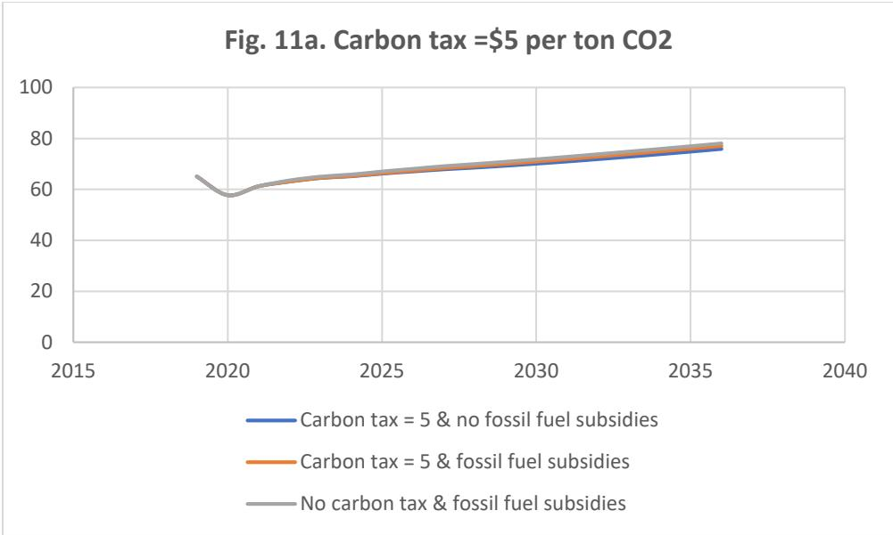

Fig. 11b. Carbon tax = \$50 per ton CO2  
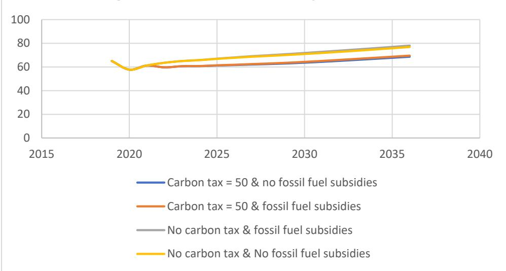

Figures 11c and 11d. Government Revenue and Growth: Morocco  
Fig. 11c. Government Gov. budget gains as % GDP  
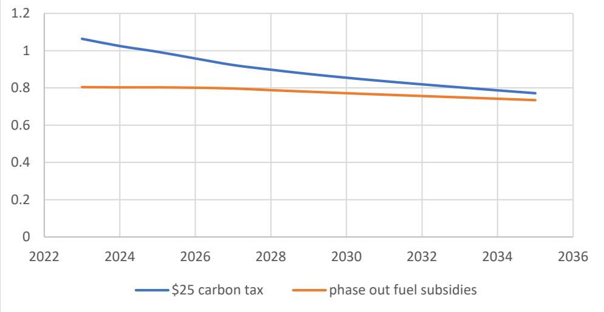

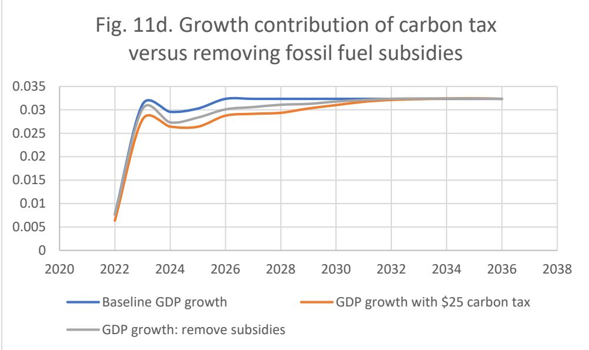

Note. Fig. 11a. For a modest carbon tax of \$5 per ton of CO2, removing or leaving small fossil fuel subsidies makes little difference. This is indicated by the coincidence of the yellow and gray lines, suggesting that subsidy must be very small and inconsequential. Fig 11b. A large Carbon tax of \$50 per ton of CO2 makes some difference, where lines bifurcate. Again however, subsidy, or lack thereof, makes little difference as indicated by the coincidence--this of the orange and blue lines--suggesting that, once again, subsidy must be very small and inconsequential. Also, government budget benefits from a \$25 carbon tax more than subsidy removal, but the effect is less dramatic than in Lebanon or even Egypt (Fig. 11c). Growth effect of both policies shows same short run dip and long run convergence to the baseline as in other countries, but the dip is much shallower (Fig. 11d)

## 7. Growth Effects from Panel Regressions

We re-examine the growth effect of subsidy reduction, just visited from single country studies, but this time using the same dataset used in the Panel study of Section 5. We distinguish between long term and short-term policies of subsidy removal since in theory the two may have opposite effects. For this reason, we adopt a panel Autoregressive Distributive Lag (ARDL) with Error Correction (EC). We adopt this approach due to its ability to distinguish between the short run and the long run effects. Results, reported in Tables 4, show that subsidies do not matter for any of our three samples (world, MENA and MENA oil group) either in the long-run or in the short-run. The single country forward projections from the CPAT tool also suggested no long run effects, consistent with our finding here from historical data. Our results further suggest no short-run effect while the CPAT tool did suggest some short-run dip in the rate of growth. $^{11}$ Between the systematic regression results based on actual historical data, and the CPAT simulation tool, the policy implication of our finding is that removing fuel subsidies do not negatively impact growth. (We cannot say the same about Carbon Taxes since those are only simulation-based results.) With both the climate and the budgetary benefits of subsidy removal from single country simulation on one hand, and the absence of harm to long-run growth on the other, the benefits of such a policy are clear and need to be advocated on this basis, not only on the basis of well known adverse effects on efficiency, fiscal space, and distribution. $^{12}$

## 8. Conclusion

Numerous findings of this paper have been summarized as we have presented them. Here we emphasize some of the points that are worth repeating for policy purposes. Among the highlights are that for the MENA oil producers, known for their high subsidies of fossil fuel, the removal of such subsidies is carbon reducing with no harm to long run growth. We also find that both for this group and for individual MENA countries outside the oil group, while a modest carbon tax is not as effective as fossil subsidy reduction in reducing CO2 emissions, a larger carbon tax does confer greater benefits.

We learn that the reduction of fossil fuel subsidies works through the CO2 intensive consumption path and that there still remains residual direct effect of subsidy reduction on reducing CO2 emissions that is outside the consumption path. This is most likely occurring via the production path. However, we do not have the data to examine this second path.

We also learn that the world oil prices do play a role in leading to an increase in the level of subsidy. The higher the world prices, the higher the subsidy, other things being equal. This seems to be the case in the MENA countries and MENA oil producers.

In reaching these and many other findings, we have utilized both some well-known and some novel econometric methods along with data from the International Energy Agency, and the simulation projections produced by the World Bank and International Monetary Fund (CPAT).

To conclude, increased transparency of fossil fuel pricing policies is key to the development of credible policies that citizens could accept and support. Towards this goal, countries with large natural resource basis, which also are the ones with large fossil fuel subsidies, are the greatest beneficiaries of increased transparency. Unfortunately, this is a challenge. As prior research in this area indicates, resource rich countries are often less transparent than average (Mohtadi, et al. 2019, Mohtadi, et al. 2014, Ross, 2001, Ross 2011). International agencies will need to play a role in providing evidence on the effects of policies and in advocating for greater transparency that improves the credibility of national policies and their impact on emissions.

## 9. References

Acharya, A., Blackwell, M., Sen, M., 2016. Explaining causal findings without bias: detecting and assessing direct effects. Am. Polit. Sci. Rev. 110 (3), 512–529.

Agnolucci, P., Fischer, C., Heine, D., Oca Leon, M. Pryor, J. Patroni, K. Hallegatte, S. (2023) “Measuring Total Carbon Pricing” World Bank Policy Research paper 10486.

Black, S., Liu, A. Parry, I and Vernon, N., (2023). “IMF Fossil Fuel Subsidies Data: 2023 Update.” IMF Working paper WP/23/169.

Favennec, JP. (2022). “Economics of Oil Refining”. In: Hafner, M., Luciani, G. (eds) The Palgrave Handbook of International Energy Economics. Palgrave Macmillan, Cham. https://doi.org/10.1007/978-3-030-86884-0\_3

Frankel, J. A. (2010). The natural resource curse: a survey (No. w15836). National Bureau of Economic Research.

Fuchs, Alan. (2023). Poverty and Distributional Consequences of Air Pollution in Tbilisi. World Bank. Washington D.C.

Heine, Dirk and Simon Black Benefits beyond Climate: Environmental Tax Reform. Fiscal Policies for Development and Climate Action. December 2018, 1-6. https://doi.org/10.1596/978-1-4648-1358-0\_ch1

International Energy Agency 2023. World Energy Outlook.

International Monetary Fund (2019) Policy Papers “Fiscal Policies for Paris Climate Strategies—from Principle to Practice (May 1).

International Monetary Fund (2019) Fiscal Monitor “Fiscal Monitor: How to Mitigate Climate Change” (October).

Kojuma, M. and Koplow, D. (2017) “Fossil Fuel Subsidies: Approaches and Valuation” World Bank Policy Research paper 7220.

Lienard, Clémentine (2022) “Mitigating climate change in the MENA: shifting to a new paradigm” Brussels International Center, March.

Linsenmeier, M., Mohommad, A., and Schwerho\_, G. (2022). Policy sequencing towards carbon pricing - empirical evidence from G20 economies and other major emitters. IMF Working Paper No. 2022/066.

Parry Ian, Dirk Heine, Elisa Liz and Shanjun Li (2014). Getting Energy Prices Right: From Principle to Practice. International Monetary Fund. DOI: https://doi.org/10.5089/9781484388570.071

Meckling, J., Sterner, T. & Wagner, G. (2017) Policy sequencing toward decarbonization. Nat Energy 2, 918–

Mohtadi, Hamid (1996) "Environment, Growth & Optimal Policy Design," Journal of Public Economics, 63: 119140.

Mohtadi, H., Ross, M., & Ruediger, S. (2014). Do natural resources inhibit transparency? Economic research Forum working paper 906; Working Paper, University of Wisconsin and UCLA.

Mohtadi, Hamid, Michael Ross, Uchechukwu Jarrett and Stefan Ruediger (2019) “Kleptocracy and Tax Evasion under Resource Abundance” Economics and Politics, 1-51.

Ross, M. (2001). Does oil hinder democracy? World Politics, 53(3), 325–361. https://doi.org/10.1353/wp.2001.0011

Ross, M. (2011). Mineral wealth and budget transparency. Working paper, UCLA, Department of Political Science.

Tagliapietra S. (2019) The Impact of Global Energy Transition on MENA oil and gas producers. Energy Strategies Reviews 26: 100397. https://doi.org/10.1016/j.esr.2019.100397

Timilsina, G. (2022) “Carbon Taxes” Journal of Economic Literature 60(4), 1452-1502.

United Nations (2021), https://www.un.org/sites/un2.un.org/files/media\_gstc/FACT\_SHEET\_Climate\_Change.pdf

Van der Ploeg, F. (2011). “Natural resources: Curse or blessing?”. Journal of Economic Literature, 49(2), 366-420.

Van der Ploeg, F., & Poelhekke, S. (2009). Volatility and the natural resource curse. Oxford economic papers, 61(4), 727-760.

National Oceanographic and Atmospheric Administration (NOAA), Payne Institute and Colorado School of Mines, GGFR.

World Resources Institute, “9 Charts Explain Per Capita GHG Emissions by Country,” World Resources Institute, Insights, May 8 2023.

Table 1. Oil Subsidy and CO2 production

<table><tr><td rowspan="2">Dependent Variable:</td><td colspan="6">CO2 Emissions</td></tr><tr><td colspan="2">(1) All sample countries</td><td colspan="2">(2) MENA subsample</td><td colspan="2">(3) MENA oil group subsample</td></tr><tr><td>population</td><td>0.00000120(1.43)</td><td>0.00000415***(2.86)</td><td>0.00000278(0.72)</td><td>0.00000179(0.38)</td><td>0.00000986***(4.10)</td><td>0.0000103**(3.00)</td></tr><tr><td>GDP</td><td>1.99e-10***(14.52)</td><td>7.27e-11**(2.60)</td><td>1.72e-10*(1.89)</td><td>2.16e-10(1.21)</td><td>1.94e-10**(3.48)</td><td>3.03e-10*(2.25)</td></tr><tr><td>fossil fuel subsidies as a share of GDP</td><td>-660695926.3(-1.56)</td><td>-484726044.4(-1.63)</td><td>-121424410.6(-0.48)</td><td>25300623.5(0.12)</td><td>376621923.3**(3.23)</td><td>426192820.8*(2.28)</td></tr><tr><td>lag fossil fuel subsidies as a share of GDP</td><td></td><td>-61638905.0(-0.35)</td><td></td><td>-207020669.6(-1.17)</td><td></td><td>200854871.4(1.08)</td></tr><tr><td>Constant</td><td>125.4(1.57)</td><td>-51.83(-0.38)</td><td>27.30(0.29)</td><td>26.49(0.24)</td><td>-158.4*(-2.27)</td><td>-260.1(-1.90)</td></tr><tr><td>N</td><td>369</td><td>328</td><td>99</td><td>88</td><td>63</td><td>56</td></tr></table>

t statistics in parentheses. $^{*}p<0.1$ , $^{**}p<0.05$ , $^{***}p<0.01$ . Data is from International Energy Commission for 2011-2018. All regressions control for country & time fixed effect & use robust error. Fossil fuel subsidies increase carbon footprint only for MENA oil exporters. To address possible cointegration issues, besides country level time fixed effect aggregate the trend variables, year and its square, were added and controls. Further, any potential cointegration, for example to omitted variables, would occur between CO2 emissions, population and GDP. As such, this would not affect the coefficients of the variables of interest, fossil fuel subsidies and its lag.

Table 2. Oil subsidies & CO2 emissions both directly & via CO2 consumption: Sequential G Estimation

<table><tr><td rowspan="2">Dependent Variable</td><td colspan="4">CO2 emissions: full and demediated effects</td></tr><tr><td>Full sample</td><td>Full sample after CO2-intensive consumption is demediated)</td><td>MENA oil group subsample</td><td>MENA oil group subsample after CO2-intensive consumption is demediated</td></tr><tr><td>population</td><td>0.00000433***(3.21)</td><td>0.00000433***(3.21)</td><td>0.00000990**(3.44)</td><td>0.00000990**(5.16)</td></tr><tr><td>GDP</td><td>-1.15e-10**(-2.46)</td><td>-1.15e-10***(-4.01)</td><td>1.54e-10(1.61)</td><td>1.54e-10*(2.88)</td></tr><tr><td>CO2-intensive consumption</td><td>0.735***(8.03)</td><td></td><td>0.545**(3.26)</td><td></td></tr><tr><td>subsidy share of GDP</td><td>93195887.4(0.52)</td><td>93195717.3(0.51)</td><td>728710544.3**(3.71)</td><td>728710648.8**(3.27)</td></tr><tr><td>lag subsidy share of GDP</td><td>-155731716.5(-1.12)</td><td>-155731727.8(-1.23)</td><td>571732359.3***(13.88)</td><td>571733000.8***(13.82)</td></tr><tr><td>co2 emission via flaring</td><td>1.849(1.22)</td><td>1.849(1.16)</td><td>3.530(2.27)</td><td>3.530*(3.00)</td></tr><tr><td>Constant</td><td>-235.9(-1.54)</td><td>-235.9(-1.58)</td><td>-325.2*(-3.10)</td><td>-325.2**(-4.09)</td></tr><tr><td>N</td><td>271</td><td>271</td><td>32</td><td>32</td></tr></table>

t statistics in parentheses. $^{*}p<0.1$ , $^{**}p<0.05$ , $^{***}p<0.01$ . All regressions control for country & time fixed effect & use robust error. Using Sequential g estimation in fixed effects panel, by comparing the full model (columns 1 and 3) with demediated model (columns 2, 4), in which we remove the influence of co2-intensive consumption, strong direct effect of oil subsidies on co2 remains, likely arising from other sources, e.g., manufacturing.

Table 3. Effect of World Oil Price on Fossil Fuel Subsidies in MENA and MENA Oil Exporters

<table><tr><td rowspan="2">Dependent Variable:</td><td colspan="2">fossil fuel subsidy as a share of GDP</td></tr><tr><td>MENA</td><td>MENA oil Group</td></tr><tr><td>population</td><td>-6.85e-17(-1.08)</td><td>-7.18e-17(-1.12)</td></tr><tr><td>GDP</td><td>1.33e-21(1.33)</td><td>1.60e-21(1.57)</td></tr><tr><td>MENA x world oil price</td><td>1.00e-10*(1.75)</td><td></td></tr><tr><td>lag MENA x world oil price</td><td>9.12e-11(1.64)</td><td></td></tr><tr><td>MENA oil group x world oil price</td><td></td><td>1.09e-10(1.39)</td></tr><tr><td>lag MENA oil group x world oil price</td><td></td><td>1.47e-10*(1.92)</td></tr><tr><td>constant</td><td>1.19e-08**(2.56)</td><td>1.28e-08**(2.61)</td></tr><tr><td>N</td><td>328</td><td>328</td></tr></table>

t statistics in parentheses. $^{*}p<0.1$ , $^{**}p<0.05$ , $^{***}p<0.01$ . An increase on world oil price has a mild effect (significant at 10%) on increasing the level of subsidies for both MENA and with a lag, MENA oil exporters, confirming the theory. See section 3. Both regressions control for country & time fixed effect & use robust error. Because World oil price is the same for all countries, it must only be interacted with other variables as it would otherwise drop out due to time fixed effects. For this reason, price x MENA and price x MENA oil exporters is being presented in the full sample as interaction effect.

Table 4. Short-run and long-run effects of oil subsidies on economic growth: all countries, MENA, and MENA oil group

<table><tr><td rowspan="2">Dependent Variable:</td><td colspan="3">Rate of Growth</td></tr><tr><td>Full Sample</td><td>MENA subsample</td><td>MENA oil Group subsample</td></tr><tr><td>Long run results:</td><td></td><td></td><td></td></tr><tr><td>log GDP</td><td>-0.168***(-11.00)</td><td>-0.301***(-9.34)</td><td>-0.316***(-6.87)</td></tr><tr><td>log population</td><td>0.132***(2.59)</td><td>0.0493(0.45)</td><td>0.0849(0.61)</td></tr><tr><td>log subsidy</td><td>-0.000469(-0.26)</td><td>-0.00311(-0.23)</td><td>-0.000923(-0.05)</td></tr><tr><td>Short run results:</td><td></td><td></td><td></td></tr><tr><td>Error correction coeff.</td><td>-1.014***(-85.40)</td><td>-1.022***(-55.14)</td><td>-1.020***(-42.38)</td></tr><tr><td>d (log GDP)</td><td>1.180***(65.36)</td><td>1.213***(41.52)</td><td>1.220***(33.05)</td></tr><tr><td>d (log population)</td><td>0.942***(4.96)</td><td>0.359(1.12)</td><td>0.332(0.56)</td></tr><tr><td>d (log subsidy)</td><td>0.000281(0.17)</td><td>0.0118(0.65)</td><td>0.0165(0.58)</td></tr><tr><td>lagged d(log subsidy)</td><td>0.000209(0.13)</td><td>-0.00573(-0.35)</td><td>-0.0179(-0.71)</td></tr><tr><td>constant</td><td>2.261**(2.41)</td><td>7.413***(3.85)</td><td>7.232***(2.84)</td></tr></table>

t statistics in parentheses. $^{*}p<0.1$ , $^{**}p<0.05$ , $^{***}p<0.01$ . Based on panel autoregressive distributive lag model with error correction (ARDL-EC). Subsidies do not have an adverse effect on long-run and short-run growth. The long-run results are consistent with the single country projections from CPAT which until 2036. Error correction coefficient is negative and significant indicating co-integration among variables as expected. ARDL-EC accounts for this cointegration without the need to test for it. In all regressions robust errors are reported. Using clustered error option did not significantly impact the general direction of the results, although in some instances the significance dropped slightly as would be expected under clustered error.

## Appendix 1. Approximating Oil Transport Cost from refinery to final use in Saudi Arabia

Nearly all refined oil in Saudi Arabia is transported via pipelines. The following figures are used, along with their sources:

\- Total pipeline for refined products for domestic use (as opposed to heavy crude oil for exports) = 1,183 km in 2015, which is the approximate date for our estimation in the main text (https://en.wikipedia.org/wiki/List\_of\_countries\_by\_total\_length\_of\_pipelines).

\- Approximate cost of pipeline: US estimate is \$4.75 million per mile for 2015-2016, about same time as our estimate. Global cost is \$2.34 million per mile https://www.gem.wiki/Oil\_and\_Gas\_Pipeline\_Construction\_Costs. Averaging the two the total cost of pipeline for domestic consumption is approximately \$2.8 billion. Since this is a fixed cost, and we assume rental cost of capital at 5%, the annual rental cost of pipeline capital will be \$138 million.

\- Saudi Arabia produced 10.2 million barrels per in 2015 on average amounting to 3.7 billion barrels. The domestic cost of transport per barrel of oil produced for all purposes (local and exports) is therefore,

138 million / 3.7 billion = 37 cents per barrel

Table A.2.1. List of Countries in the Sample

<table><tr><td>Angola</td><td>Kuwait</td></tr><tr><td>United Arab Emirates</td><td>Libya</td></tr><tr><td>Argentina</td><td>Sri Lanka</td></tr><tr><td>Azerbaijan</td><td>Mexico</td></tr><tr><td>Bangladesh</td><td>Malaysia</td></tr><tr><td>Bahrain</td><td>Nigeria</td></tr><tr><td>Bolivia</td><td>Oman</td></tr><tr><td>China</td><td>Pakistan</td></tr><tr><td>Colombia</td><td>Qatar</td></tr><tr><td>Algeria</td><td>Russian Federation</td></tr><tr><td>Ecuador</td><td>Saudi Arabia</td></tr><tr><td>Egypt, Arab Rep.</td><td>El Salvador</td></tr><tr><td>Gabon</td><td>Thailand</td></tr><tr><td>Ghana</td><td>Turkmenistan</td></tr><tr><td>Indonesia</td><td>Trinidad and Tobago</td></tr><tr><td>India</td><td>Taiwan, Republic of China</td></tr><tr><td>Iran, Islamic Rep.</td><td>Ukraine</td></tr><tr><td>Iraq</td><td>Uzbekistan</td></tr><tr><td>Kazakhstan</td><td>Venezuela, RB</td></tr><tr><td>Korea, Rep.</td><td>Viet Nam</td></tr><tr><td></td><td>South Africa</td></tr></table>

Appendix 2. Data Characteristics  
Figure A.2.1: Distribution of CO2 in the sample  
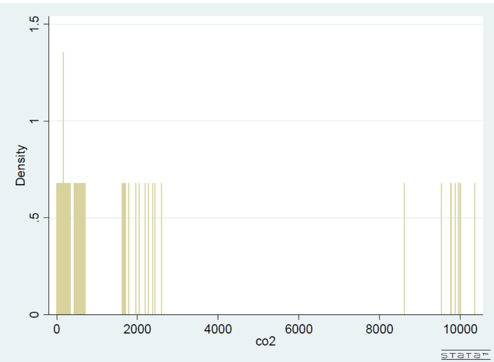

Table A.2.2: Descriptive Statistics

<table><tr><td></td><td></td><td></td><td></td><td></td><td></td></tr><tr><td>Variable</td><td>Observations</td><td>Mean</td><td>Std. Dev.</td><td>Min</td><td>Max</td></tr><tr><td></td><td></td><td></td><td></td><td></td><td></td></tr><tr><td>CO2 emission: all countries</td><td>369</td><td>503.9498</td><td>1525.388</td><td>4.783</td><td>10353.88</td></tr><tr><td>CO2 emission: MENA</td><td>369</td><td>55.86151</td><td>138.721</td><td>0</td><td>700.938</td></tr><tr><td>CO2 emission: MENA oil exporters</td><td>369</td><td>45.8137</td><td>136.6791</td><td>0</td><td>700.938</td></tr><tr><td>subsidy share of GDP: all countries</td><td>369</td><td>8.74E-09</td><td>1.43E-08</td><td>0</td><td>9.97E-08</td></tr><tr><td>subsidy share of GDP: MENA</td><td>369</td><td>5.06E-09</td><td>1.34E-08</td><td>0</td><td>9.97E-08</td></tr><tr><td>subsidy share of GDP: MENA oil exporters</td><td>369</td><td>4.11E-09</td><td>1.32E-08</td><td>0</td><td>9.97E-08</td></tr></table>