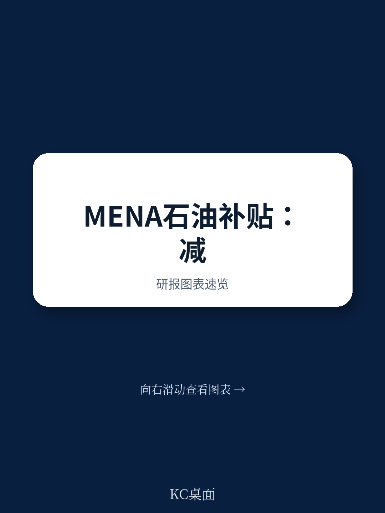
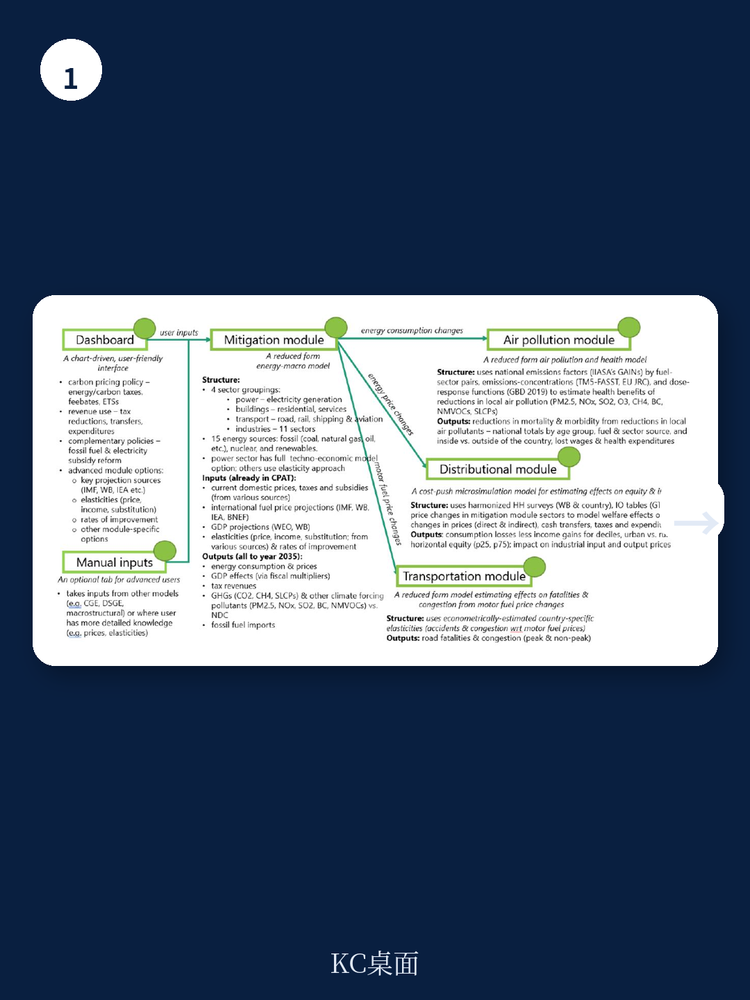
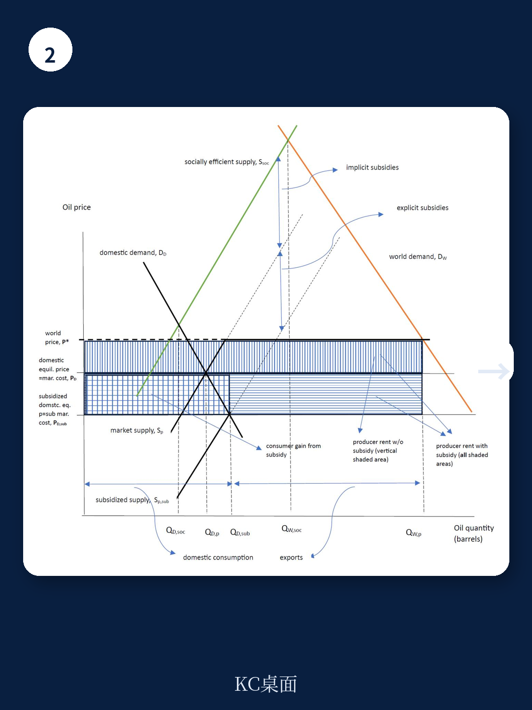

# 世界银行：中东产油国补贴越狠，碳排放越高，但经济并未受益

全球每年有7万亿美元被用于化石燃料补贴，相当于德国和法国GDP之和。这笔钱没有让经济更快增长，却让碳排放居高不下。

世界银行最新工作论文对中东和北非41个国家2011-2018年数据的实证分析，得出了一个反直觉却极具政策含义的结论：石油补贴对中东产油国的经济增长既无短期刺激，也无长期拉动。但补贴每增加一个百分点，二氧化碳排放就显著上升。

这不是一个关于道德的说教，而是一个关于资源配置效率的冷酷计算。

## 1. 补贴的真正问题不是价格，是它掩盖了一个结构性扭曲

传统讨论中，化石燃料补贴被视为一种社会福利安排——政府通过压低能源价格来降低居民生活成本、支持工业竞争力。但这种理解忽略了中东产油国的特殊结构。

世界银行报告指出，中东产油国的补贴机制与石油进口国完全不同。对于沙特、伊朗这样的国家，原油生产成本极低——2016年沙特每桶生产成本仅约8.5美元，而国际油价平均43美元。政府补贴的不是“成本价以上”的部分，而是“国际价格与国内售价之间的差额”。

这意味着补贴的本质不是让穷人买得起油，而是让整个经济体长期生活在扭曲的价格信号中。当国内油价被人为压低到远低于国际水平，能源密集型产业获得了隐性竞争优势，消费者失去了节能激励，整个经济结构被锁定在“高能耗、高碳排”的路径上。

> **KC评论：** 这份报告的真正洞见不在于“补贴不好”这个常识，而在于它量化了“补贴到底有多无效”。报告用面板数据证明了，补贴对经济增长的贡献在统计上不显著，但对碳排放的影响却非常显著。这意味着中东产油国正在用巨大的财政支出，换来了一个既没有增长、又加剧气候风险的坏结果。完整报告中包含了对41个国家2011-2018年逐年的详细回归结果和稳健性检验，这些图表能让你看到不同模型设定下结论是否一致。

## 2. 补贴对碳排放的拉动，主要通过两条路径

报告将补贴对碳排放的影响分解为两个渠道。

第一条是能源消费路径。补贴降低了终端价格，刺激了更多的石油、天然气消费，直接推高排放。这是最直观的传导机制。

但报告发现，即使在控制了能源消费量之后，补贴仍然对碳排放有显著的“直接净效应”。这意味着补贴的影响不止于“多用油”那么简单。它还可能通过改变产业结构、抑制节能技术投资、扭曲制造业结构等方式，间接推高碳排放。比如，低能源价格可能让高耗能制造业在中东地区获得了不应有的比较优势，导致这些产业在本地的过度集聚。

这种双重路径的发现，意味着即使中东国家通过能效提升来减少单位产出的能耗，只要补贴机制不改变，碳排放仍可能居高不下。

> **KC评论：** 报告区分了“消费路径”和“直接净效应”，这个分解非常关键。如果只看消费路径，政策建议就是“提高能效”；但如果直接净效应同样重要，那么政策必须触及补贴本身。完整报告中有详细的回归表格，分别展示了两种路径的系数大小和显著性水平，这些数据是判断政策优先级的关键依据。

## 3. 碳税和补贴削减不是二选一，而是有先后顺序

报告提出了一个重要的政策序列问题：是先削减补贴，还是先征收碳税？

从经济学理论看，补贴是“负外部性的价格扭曲”，碳税是“负外部性的价格纠正”。如果同时存在补贴和碳税，根据次优理论，这两种扭曲叠加可能产生更大的效率损失。正确的顺序应该是：先消除补贴这个扭曲，再引入碳税这个纠正机制。

但现实中，政治经济学的考量往往优先于效率。欧盟、加州和中国都采取了“先补贴可再生能源、后碳定价”的序列。世界银行报告指出，中东产油国的情况有所不同——因为它们的补贴规模太大、对财政的压力太重，削减补贴本身就可以释放出增长红利。

报告实证表明，削减补贴对经济增长没有负面影响。这意味着中东国家可以“减补贴而不伤增长”，同时还能获得减排收益。这是典型的“帕累托改进”——没有输家，只有赢家。

但这只是效率层面的判断。政治层面的挑战在于：补贴的受益者高度集中（能源巨头、高耗能产业），而损失分散在全体纳税人。这种利益格局让补贴改革在政治上极其困难。

> **KC评论：** 报告没有深入讨论政治经济学问题，但它留下的问题是：如果削减补贴在效率上如此合理，为什么中东国家迟迟不动？答案可能在于“补贴的受益者比受损者更有组织能力”。这也是为什么报告提到的“政策序列”问题值得继续探讨——是先动补贴，还是先做碳税，不同顺序会塑造不同的利益联盟。完整报告中对这个问题的讨论仅限于脚注，但恰恰是这个未展开的部分，可能比实证结果更具现实指导意义。

## 4. 一个尚未回答的关键问题：补贴削减的“再分配效应”怎么处理

报告证明了补贴削减不会拖累经济增长，但它没有回答一个更棘手的问题：补贴削减的再分配效应如何处理。

在中东产油国，能源补贴实际上是一种隐性的社会福利体系。低收入家庭可能直接或间接地依赖廉价能源来维持基本生活、获得就业机会。如果没有配套的转移支付机制，单纯削减补贴可能导致社会不稳定。

报告提到，削减补贴可能带来“本地正外部性”，比如空气质量改善带来的健康收益。但它没有量化这些收益能否抵消低收入家庭的福利损失。

此外，报告的数据覆盖到2018年，没有反映近年来中东国家在可再生能源投资、经济多元化方面的最新进展。沙特“2030愿景”、阿联酋的清洁能源战略，是否已经开始改变补贴与经济增长之间的关系？这些都需要新的数据来验证。

> **KC评论：** 这是典型的研究边界问题——世界银行这篇论文的贡献在于建立了“补贴-排放-增长”之间的实证关系，但它没有也无意回答“如何补偿受损者”这个政治问题。而恰恰是后者，决定了政策能否落地。如果你正在研究中东能源转型的投资机会，完整报告中的原始数据和回归结果可以成为你建立自己分析框架的基础。我们的社群每天会由AI agent+人工review生成国际投行中文摘要与KC评论，daily更新约10-40页，也包含当天最新数据图表合集，既方便喂给AI，也方便人工快速把握market dynamics。顺着这些未解问题继续讨论，或许能发现比报告本身更有价值的投资线索。

## 5. 对投资者的启示：中东能源转型的三个观察维度

基于这份报告的逻辑，我们可以建立一个观察中东能源转型的分析框架。

第一个维度是补贴改革的节奏。沙特、阿联酋、卡塔尔等国已经启动了不同程度的能源价格改革。改革的深度和速度，将直接影响这些国家的财政状况、产业竞争力和碳排放轨迹。关注各国财政预算中“能源补贴”科目的变化，比关注油价本身更有预测意义。

第二个维度是碳税的可能性。报告明确指出，碳税需要更长的准备时间。如果中东国家开始讨论或试点碳税，这意味着政策序列正在向“市场化减排”方向移动。碳税的引入将改变能源密集型产业的相对成本，可能催生新的投资机会。

第三个维度是“补贴削减红利”的再分配去向。如果中东国家通过削减补贴释放了财政空间，这些资金会流向哪里？是用于社会福利、基础设施，还是投资于可再生能源？不同的流向将塑造不同的产业格局。

这三个维度不是孤立的。补贴改革越激进，碳税引入的速度可能越快；碳税越早落地，可再生能源的经济性越早显现。这是一条相互关联的政策链条。

## 6. 报告没有说透，但值得追问的三个问题

第一，补贴削减的“增长中性”结论是否适用于所有中东国家？报告使用的是面板数据，给出了平均效应。但不同国家的补贴结构、经济多元化程度、财政弹性差异很大。沙特和伊朗的补贴削减路径可能完全不同。

第二，报告没有区分“生产者补贴”和“消费者补贴”。在中东产油国，生产者补贴（通过压低上游价格）和消费者补贴（通过压低零售价格）的减排效应和增长效应可能不同。区分这两种补贴，是未来研究的重要方向。

第三，报告没有讨论“补贴削减”与“可再生能源补贴”的互动。如果中东国家在削减化石燃料补贴的同时，加大对可再生能源的补贴，这种“一减一增”的组合效果是什么？报告没有给出答案。

这些未解问题，恰恰是深入阅读完整报告的价值所在。原始报告中包含的大量图表、回归结果和稳健性检验，可以为这些问题提供分析起点。

---

如果你对中东能源转型的实证证据感兴趣，或者想看到世界银行这篇论文的完整图表和回归表格，欢迎加入我们的社群。每天我们会用AI agent和人工review的方式，从国际投行最新研报中提取关键判断和图表，形成约10-40页的中文摘要和评论。这些内容既可以直接喂给AI做进一步分析，也适合在早餐时间快速把握全球市场动态。

Personal reading notes and learning share only. Not investment advice.

