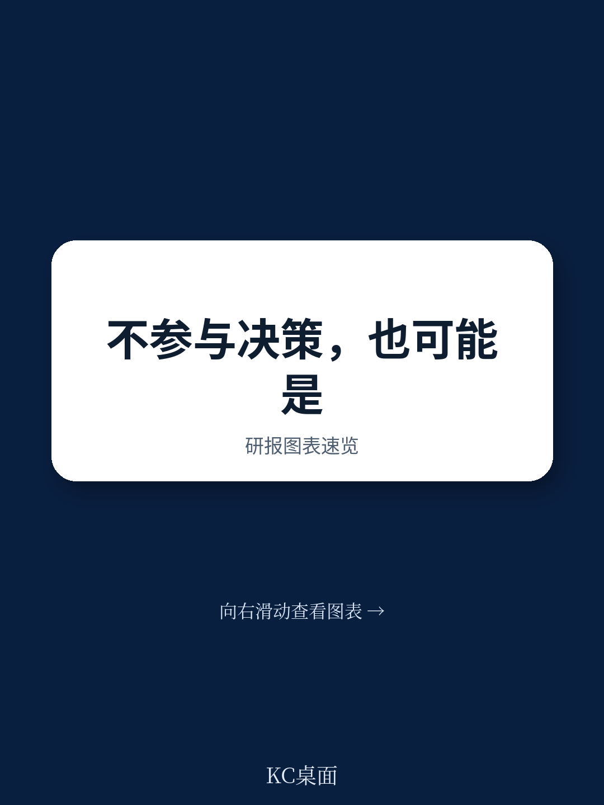
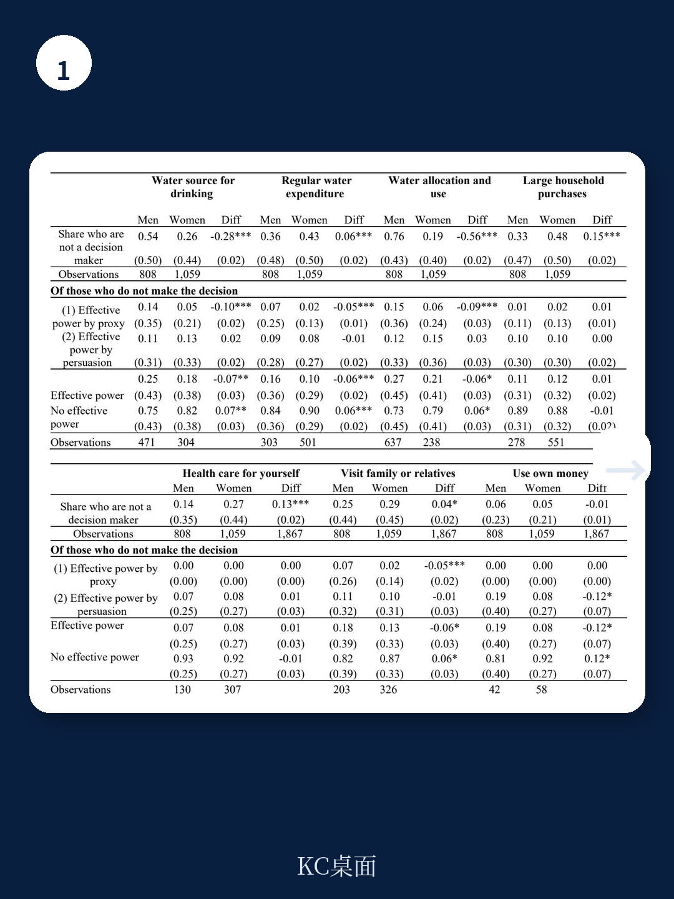
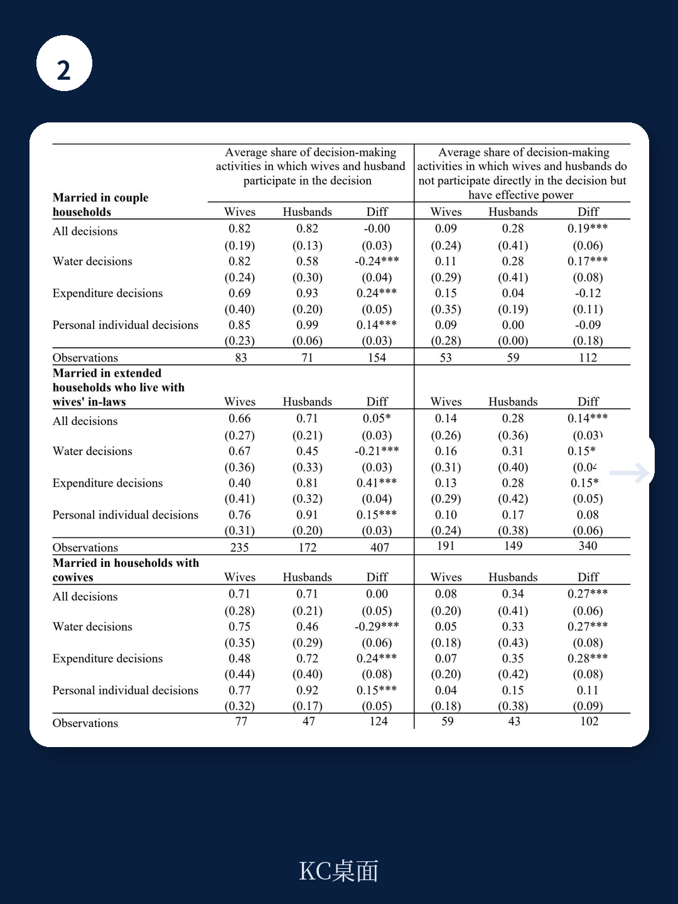

# 世界银行：不决策，也是一种权力

世界银行最新政策研究工作论文提出一个看似反直觉的判断：在家庭决策中，不直接参与决策的人，未必是缺乏权力的人。相反，某些人恰恰因为权力足够大，才选择不决策。这份基于肯尼亚沿海农村家庭数据的深度研究，正在挑战发展经济学和性别研究中沿用了数十年的“代理权”测量框架。

如果你长期关注发展经济学、性别平等政策或家庭内部资源配置，这份报告值得你花时间理解。因为它可能意味着，我们过去用来衡量女性赋权的“决策参与度”指标，存在系统性低估——但不是低估了女性，而是低估了男性。

## 1. “不决策”背后存在两种截然不同的权力逻辑

研究团队在肯尼亚基利菲县的农村家庭中，对每位成年家庭成员进行了独立的入户调查，并辅以质性访谈。他们发现，当一个人没有直接参与某个家庭决策时，背后可能存在完全不同的动机结构。

第一种是“委托式有效权力”。一个人选择不参与决策，是因为他确信自己的偏好会自动被满足。这通常发生在家庭中拥有较高地位的成员身上——比如男性户主。他们知道，无论是否出席会议、是否表态，家庭的水源选择、支出分配都会按照他们的意愿进行。不决策，本质上是一种权力溢出：他们不需要耗费时间和认知资源去争取，结果已经内嵌在家庭默认选项中。

第二种是“影响式有效权力”。一个人不直接参与决策，但通过背后游说、情感施压、日常对话等方式影响决策者。这种路径更多见于家庭中地位较低的成员，尤其是女性。她们可能因为社会规范不允许公开表态，或担心直接参与会招致惩罚，转而采取迂回策略。

> **KC评论：** 这两种“不决策”的权力质量完全不同。委托式权力是高位者的特权，几乎零成本；影响式权力是低位者的策略，需要持续投入。报告用“有效权力”这个框架统一了它们，但读者要记住：同一个“不参与”的表象下，可能是两种天差地别的处境。完整报告中有详细的数据拆解和质性访谈记录，能帮你更清楚地判断在具体场景中如何区分。

## 2. 传统决策参与度指标，系统性高估了“谁在掌权”

这项研究最直接的启示是：如果只问“你是否参与了决策”，你会得到一份有偏差的权力地图。

在基利菲县的样本中，男性在家庭用水决策中的直接参与率并不高。但如果追问“最终结果是否如你所愿”，男性的满足率显著高于女性。换句话说，男性不需要坐在会议桌前，他们的偏好已经通过默认设置实现了。而女性即便参与了讨论，最终结果也未必反映她们的意愿。

这意味着，传统的“决策参与度”指标可能高估了女性的实际权力——她们参与了，但未必有影响力；同时低估了男性的实际权力——他们不参与，但结果早已注定。

> **KC评论：** 这在政策层面有直接含义。许多发展项目用“女性是否参与家庭决策”作为赋权指标，甚至作为项目成功的KPI。但这份报告提醒我们：参与不等于影响，不参与不等于无权。如果你正在设计或评估这类项目，完整报告中关于如何改进测量工具的建议部分非常值得细读。

## 3. 家庭结构比婚姻关系更能解释权力分配

研究还发现，仅仅关注已婚女性与其丈夫之间的决策互动，会忽略一个更复杂的现实：在许多农村家庭中，决策权并不只在夫妻之间流动。

基利菲县的典型家庭是跨代共居的扩展家庭。婆婆、成年儿子、未婚女儿、甚至叔伯都可能参与决策。研究数据显示，当家庭中有婆婆在场时，已婚女性的决策自主权显著下降，而婆婆本人的影响力则上升。同样，成年儿子在父亲年迈后可能接管部分决策权，而母亲则可能被边缘化。

这意味着，性别分析不能只盯着夫妻二元关系。年龄、代际地位、婚姻状态（是否一夫多妻）、家庭生命周期阶段，都在共同塑造权力格局。一个年轻媳妇在丈夫家中的权力，和一个年长婆婆在同一个家庭中的权力，是天壤之别。

> **KC评论：** 这对研究者和政策制定者都是一个提醒：不要把“家庭”当成一个同质化的单位。家庭内部有复杂的等级和利益分化。完整报告中有一张非常清晰的表格，展示了不同家庭结构下的决策参与模式差异，建议对照阅读。

## 4. 报告尚未完全回答的关键问题：这种“不决策的权力”是否可持续？

尽管报告提出了“有效权力”这一有价值的分析框架，但有一个关键问题没有被充分展开：委托式权力是否具有长期的脆弱性？

当一个男性户主长期依赖“不决策”来维持权力时，他实际上是在赌家庭默认选项永远不会被挑战。但如果家庭结构发生变化——比如妻子开始公开提出不同意见，或者成年儿子开始争夺决策权——这种默认状态可能被打破。届时，他可能不得不出面干预，而一旦被迫直接参与，他的权力基础反而可能暴露在审视之下。

同样，影响式权力也面临可持续性挑战。通过背后游说影响决策，需要持续的关系投入和情感劳动。这种策略在短期内有效，但长期来看，它是否会让女性陷入“永远在幕后”的困境，无法真正获得公开的决策席位？报告没有给出明确答案。

这恰恰是完整报告中最值得进一步讨论的部分。如果你对这些问题感兴趣，我们会在社群中继续拆解原始数据和质性访谈的更多细节。

---

**加入社群，每天获取由AI agent与人工review生成的最新国际投行与政策机构研报中文摘要，以及KC评论。每日更新约10-40页，包含当天最新数据图表合集，既方便喂给AI分析，也方便人工快速把握全球市场与政策动态。我们也会在社群中继续讨论这份报告未解的问题，并分享完整的原始图表与数据。**

Personal reading notes and learning share only. Not investment advice.

