# Design of Partial Population Experiments with an Application to Spillovers in Tax Compliance

Guillermo Cruces

Dario Tortarolo

Gonzalo Vazquez-Bare

POLICY RESEARCH WORKING PAPER 11059

## Abstract

This paper develops a framework to analyze partial population experiments, a generalization of the cluster experimental design where clusters are assigned to different treatment intensities. The framework allows for heterogeneity in cluster sizes and outcome distributions. The paper studies the large-sample behavior of OLS estimators and cluster-robust variance estimators and shows that (i) ignoring cluster heterogeneity may result in severely underpowered experiments and (ii) the cluster-robust variance estimator may be upward-biased when clusters are heterogeneous. The paper derives formulas for power, minimum detectable effects, and optimal cluster assignment probabilities. All the results apply to cluster experiments, a particular case of the framework. The paper sets up a potential outcomes framework to interpret the OLS estimands as causal effects. It implements the methods in a large-scale experiment to estimate the direct and spillover effects of a communication campaign on property tax compliance. The analysis reveals an increase in tax compliance among individuals directly targeted with the mailing, as well as compliance spillovers on untreated individuals in clusters with a high proportion of treated taxpayers.

# Design of Partial Population Experiments with an Application to Spillovers in Tax Compliance\*

Guillermo Cruces, U. of Nottingham & CONICET-CEDLAS-UNLP
Dario Tortarolo, World Bank DECRG
Gonzalo Vazquez-Bare, UC Santa Barbara

JEL CODES: C01, C93, H71, H26, H21, O23.

KEYWORDS: partial population experiments, spillovers, randomized controlled trials, cluster experiments, two-stage designs, property tax, tax compliance.

## 1 Introduction

Randomized controlled trials (RCTs) are extensively used in economics. A large fraction of these experiments are based on the assumption that the treatment assignment of one unit or subject does not influence the outcomes of others. The assumption of no interference, however, may be violated in many settings. In such cases, identifying and measuring spillovers between units is crucial for understanding the nature and magnitude of interactions between subjects, as well as for accurately assessing the direct impact of the treatment.

While the early experimental literature considered the impact on untreated units in an ex-post manner (e.g. Miguel and Kremer, 2004), field experiments incorporating spillover effects into their design have gained traction in applied research. In settings where units are grouped into independent clusters, such as schools, villages, or firms, a common design is the partial population design. Partial population designs are a generalization of the clustered design wherein clusters assigned to different treatment intensities or saturations are compared to pure control clusters with no treated units (Moffit, 2001; Duflo and Saez, 2003; Hudgens and Halloran, 2008; Hirano and Hahn, 2010; Baird et al., 2018). The variation in treatment intensity allows researchers to disentangle the direct and indirect effects of a treatment. In this paper, we provide a framework to analyze this type of experiment when clusters are heterogeneous.

We consider two dimensions of cluster heterogeneity that have important practical implications: heterogeneity in cluster sizes and heterogeneity in outcome distributions across clusters (distributional heterogeneity) $^{1}$ . When analyzing an experiment with heterogeneous clusters, correctly accounting for this heterogeneity is crucial for several reasons. On the one hand, variance formulas have to be adjusted accordingly, and failing to do so may result in severely underpowered experiments. On the other hand, cluster heterogeneity can affect the accuracy of the large sample normal approximation, and inference based on this approximation can be misleading when clusters are very heterogeneous (Carter, Schnepel and Steigerwald, 2017; Djogbenou, MacKinnon and ∅rregaard Nielsen, 2019; Hansen and Lee, 2019; Sasaki and Wang, 2022; Chiang, Sasaki and Wang, 2023).

With these challenges in mind, our paper provides five contributions. First, in Theorem 1, we derive an asymptotic distributional approximation for OLS regression estimators in a setting with between-cluster heterogeneity. We consider a double-array asymptotic setting where cluster sizes are allowed, but not required, to grow with the sample size. We provide conditions under which OLS estimators are consistent for cluster-size-weighted averages of within-cluster differences in means, and are asymptotically normal. We also show that, in the presence of distributional heterogeneity, the usual cluster-robust variance estimator is generally upward-biased, and hence inference based on this estimator is conservative (Proposition 1). While similar results have been obtained in design-based settings with non-random potential outcomes (see e.g. Hudgens and Halloran, 2008; Basse and Feller, 2018; Abadie et al., 2022; Jiang, Imai and Malani,

2023), to our knowledge we are the first to show this result in a superpopulation setting under distributional heterogeneity.

Our second contribution is to derive explicit, closed-form formulas to conduct power and minimum detectable effect (MDE) calculations under the two aforementioned sources of cluster heterogeneity. We then consider an intermediate setting where clusters differ in size but not in their outcome distributions, which simplifies power and minimum detectable effects calculations and can be applied more easily when baseline outcome data is not available. We show how our formulas generalize those available in the existing methodological literature on experimental design (Duflo, Glennerster and Kremer, 2007; Hirano and Hahn, 2010; Baird et al., 2018) by allowing for multiple treatment intensities, cluster heterogeneity, heteroskedasticity and general forms of intracluster correlation in outcomes and treatments.

Our third contribution is to derive optimal assignment probabilities determining the proportion of clusters to be assigned to each treatment saturation (Theorem 2). We provide a tractable, closed-form solution to the optimal choice problem of minimizing a weighted average of estimators' variances. We also discuss how alternative optimality criteria may be used in combination with our variance formulas using numerical methods.

Our fourth contribution is to set up a potential outcomes framework with within-cluster spillovers, heterogeneous treatment effects, and heterogeneous clusters. We use this framework to provide sufficient conditions for OLS estimands to recover causal direct and spillover effects.

Fifth, based on our framework, we designed and conducted a large-scale field experiment to estimate direct and spillover effects of a randomized communication campaign on property tax compliance in Argentina. Our experiment sent personalized letters to randomly selected dwellings with reminders about taxes due, information about the status of the account, due dates, past due debt, and payment methods. While there is ample evidence on the effect of tax reminders on compliance and collection (Antinyan and Asatryan, 2024), our goal was to find evidence on relatively elusive spillover effects from information campaigns on tax collection. We designed the experiment based on our methodological results to capture spillover effects of our mailings on neighbors who live in the same street blocks of treated individuals but who did not receive a letter. Our results reveal higher payment rates for treated individuals, but also for their untreated neighbors in the same street block, compared to accounts in pure control blocks where no one received the letter. Spillover effects are lower in magnitude but still substantial and precisely estimated in high-saturation street blocks, especially when accounting for expected (pre-registered) heterogeneity in past compliance: payment rates of untreated accounts in high saturation blocks with above median past compliance increased by 2.6 percentage points, compared to direct effects of about 5.1 percentage points.

Comparison with current literature. Our paper contributes to a growing literature on experimental design (Duflo, Glennerster and Kremer, 2007; Bruhn and McKenzie, 2009; Bugni, Canay and Shaikh, 2018, 2019; Bai, 2022) and in particular to the literature on design and analysis of experiments under spillovers or interference (Hirano and Hahn, 2010; Athey, Eckles and Imbens, 2018; Baird et al., 2018; Basse, Feller and Toulis, 2019; Jiang, Imai and Malani, 2023; Puelz et al., 2022; Viviano, 2024; Leung, 2022; Liu, 2023). More specifically, our results generalize those of Hirano and Hahn (2010), Hudgens and Halloran (2008) and Baird et al. (2018) by allowing for cluster heterogeneity, heteroskedasticity, general treatment assignment mechanisms and within-group correlation structures and alternative criteria for optimal treatment assignment.

In related work, Athey, Eckles and Imbens (2018), Basse, Feller and Toulis (2019) and Puelz et al. (2022) derive randomization inference tests for a general class of null hypotheses under interference. A closely related study is Jiang, Imai and Malani (2023), who analyze two-stage completely randomized experiments and provide randomization-based variance estimators and sample size formulas. Our results complement this literature by considering different estimands, different assignment mechanisms and by conducting super-population-based large-sample (instead of design-based) inference in a double array asymptotic framework. Our approach allows us to determine the role of cluster heterogeneity in the asymptotic behavior of the treatment effect estimators.

Our paper is also related to the literature on inference in clustered experiments, which are a particular case of partial population experiments with only two saturations and no within-cluster treatment variation. Bugni et al. (2023) study inference in clustered experiments with non-ignorable cluster sizes and derive variance estimators and valid inference procedures in a setup with random cluster sizes. We further discuss the relationship between our results and that paper in Section 3.5.

We also contribute to a large empirical literature on property taxes and a small but growing empirical literature on spillover effects in tax compliance. On property taxes, recent contributions include Brockmeyer et al. (2020) study of Mexico City, Bergeron, Tourek and Weigel (2024) and Weigel (2020) for the Democratic Republic of Congo, and Krause (2020) for Haiti, among others. The latter two are randomized controlled trials, and in both cases, the authors address the presence of spillovers, but in ex-post analysis rather than in the experimental designs. The effect of social interactions in tax compliance interventions has remained a relatively elusive issue in the broader experimental compliance literature. Some notable exceptions are Pomeranz (2015), who detects enforcement spillovers up the VAT chain in Chilean firms, Drago, Mengel and Traxler (2020) who study enforcement spillovers of TV licensing inspections on untreated households in Austria, and Boning et al. (2020) who analyze direct and network effects from in-person visits by revenue officers on visited and non-visited firms in the United States (see the review in Pomeranz and Vila-Belda, 2019, for more studies covering spillover effects). In Argentina, a recent study by Carrillo, Castro and Scartascini (2021) finds neighborhood spillover effects from a program that randomly awarded 400 taxpayers with the repair of a sidewalk. Whereas these papers find spillover effects in tax compliance, their original experiments were not designed to capture these effects. We build on these pioneering works with an intervention designed with the purpose of capturing spillovers.

The paper is organized as follows. Section 2 illustrates the practical importance of cluster heterogeneity when conducting power calculations. In Section 3, we set up our framework and derive the main results. In

Section 4, we implement our methods in a large-scale randomized communication campaign, we describe the administrative data used in the analysis, the empirical strategy, and evidence of direct and spillover effects. Section 5 provides some practical recommendations for designing and analyzing partial population experiments. Section 6 concludes.

## 2 Why is Cluster Heterogeneity Important?

We consider a population where units are grouped into mutually exclusive and independent clusters. Common examples of this type of clustering are students in schools (Miguel and Kremer, 2004; Beuermann et al., 2015), family members in households (Barrera-Osorio et al., 2011; Foos and de Rooij, 2017), job seekers in local labor markets (Crépon et al., 2013), employees in firms or organizations (Duflo and Saez, 2003), or households in neighborhoods, villages or other geographic administrative units (Angelucci and De Giorgi, 2009; Ichino and Schündeln, 2012; Haushofer and Shapiro, 2016; Giné and Mansuri, 2018). In our application, a local property tax reminder information campaign, the population of interest consists of taxpayers in residential blocks. Within this population, we study an experimental design where treatment assignments can vary both between and within clusters.

Figure 1 shows the distribution of cluster sizes in six partial population experiments, including our analysis sample and five published papers (Crépon et al., 2013; Giné and Mansuri, 2018; Haushofer and Shapiro, 2016; Ichino and Schündeln, 2012; Imai, Jiang and Malani, 2021). The figure reveals substantial variation in cluster sizes. When cluster sizes are heterogeneous, it is likely that the distribution of outcomes will vary across clusters as well. For instance, one may expect the mean and the variance of the outcome to be different in large clusters compared to small clusters. We refer to the variation in outcome distributions across clusters as distributional heterogeneity.

Intuitively, with heterogeneous clusters, the variance of an estimator of interest $\hat{\beta}$ , such as a difference in means between units in treated and untreated clusters (we define the estimators of interest precisely in the next section), can be decomposed into four parts:

$$
\mathbb {V} [ \hat {\beta} ] \approx \text {variance under uncorrelated observations}\tag{1}
$$

$$
+ \text {   clustering   with   equally - sized   clusters   }\tag{2}
$$

$$
+ \text { cluster   size   heterogeneity }\tag{3}
$$

$$
+ \text { cluster   distributional   heterogeneity }\tag{4}
$$

The first term is the variance that would be obtained if observations were uncorrelated within clusters. The second term is an adjustment factor that accounts for the within-cluster correlation, often known as the “design effect” or the “Moulton factor” (after Moulton, 1986) that depends on the average cluster size. The term in the third line represents the additional variation due to the heterogeneity in cluster sizes, which intuitively accounts for the variance of cluster sizes (Moulton, 1986, also derives this adjustment for a random effects model). Finally, the last component accounts for the between-cluster heterogeneity in outcome distributions. While the need to account for within-cluster correlations (lines (1) and (2)) is well-understood for designing and analyzing clustered experiments, the adjustment terms that account for cluster heterogeneity are typically assumed away by the literature on experimental design (e.g. Bloom, 2005; Duflo, Glennerster and Kremer, 2007; Hirano and Hahn, 2010; Baird et al., 2018).

To numerically illustrate the importance of appropriately accounting for cluster heterogeneity in this design, we consider the simple setting of a cluster RCT (which is a particular case of a partial population experiment) where “a few” clusters are “large”. Specifically, we consider a sample of 200 clusters, indexed by $g = 1, \ldots, 200$ , each having size $n_{g}$ . The first 10 clusters contain 100 units, $n_{g} = 100$ , and the remaining 190 clusters contain 25 units each, $n_{g} = 25$ (these values are chosen to match the median values in the literature in Figure 1). We assume the treatment has no effect, and the outcome of unit $i = 1, \ldots, n_{g}$ in cluster g is given by a random effects model: $Y_{ig} = \alpha_{g} + \nu_{g} + \omega_{ig}, \nu_{g} \stackrel{iid}{\sim} \mathcal{N}(0, 1/2)$ , $\omega_{ig} \stackrel{iid}{\sim} \mathcal{N}(0, 1/2)$ with $\nu_{g}$ independent of $\omega_{ig}$ and where $\alpha_{g}$ is a (non-random) intercept with $\alpha_{g} = 0$ if $n_{g} = 25$ and $\alpha_{g} = 1$ if $n_{g} = 100$ . This model implies that the average outcome is $E[Y_{ig}] = 1$ in large clusters and $E[Y_{ig}] = 0$ in small clusters. In addition, $V[Y_{ig}] = 1$ and the within-cluster correlation between outcomes is $cor(Y_{ig}, Y_{jg}) = 0.5$ .

Figure 2 plots three power functions for the difference in means between treated and untreated clusters that a researcher may consider when designing this experiment. The short-dashed curve represents the power function that is obtained when ignoring both sources of heterogeneity, that is, considering only the terms in lines (1) and (2) of the variance formula. Using this formula, the MDE at 80% power, given this sample size, is 0.29 standard deviations. However, when accounting for the variation in cluster sizes, the corresponding power function is represented by the long-dashed curve. According to this curve, the power to detect an effect of 0.29 is not 80% but 69%, so the experiment is underpowered. Furthermore, the true power function that accounts for both sources of heterogeneity (sizes and outcome distributions) is represented by the solid curve. This curve shows that the true power to detect an effect of 0.29 in this setting with heterogeneous clusters is 48%, significantly below the desired power of 80%. This numerical exercise shows how ignoring heterogeneity may result in severely underpowered experiments. We provide further examples of the importance of accounting for heterogeneity in Section 4.

## 3 Analysis of Partial Population Experiments

## 3.1 Setup

We consider a sample of observations (units) that are divided into mutually independent clusters $g = 1, \ldots, G$ , where each cluster g contains $n_{g}$ observations $i = 1, \ldots, n_{g}$ and the total sample size is $n =$ $\sum_{g=1}^{G} n_g$ . We view cluster sizes as non-random (see Bugni et al., 2023; Sasaki and Wang, 2022, for an alternative sampling approach where cluster sizes are random). In a partial population experiment, clusters are randomly divided into categories or saturations denoted by $T_g \in \{0, 1, 2, \ldots, M\}$ , where by convention $T_g = 0$ denotes a pure control cluster (i.e. a cluster where no unit is treated). Let $P[T_g = t] = q_t \in (0, 1)$ denote the probability that cluster g is assigned to saturation t. Within each cluster, a binary treatment $D_{ig}$ is assigned to units with probability $P[D_{ig} = 1|T_g = t]$ where $P[D_{ig} = 0|T_g = 0] = 1$ . We let $\mathbf{D}_g = (D_{1g}, D_{2g}, \ldots, D_{n_gg})'$ be the vector of unit-level treatment assignments in cluster g, $\mathbf{D} = (\mathbf{D}_1', \ldots, \mathbf{D}_G')'$ and $\mathbf{T} = (T_1, \ldots, T_G)'$ . Figure A.3 provides an example of a partial population design with four saturations. Notice that both standard RCTs with independent observations and cluster RCTs are particular cases of partial population experiments, as we further illustrate in Section 3.5.

The observed outcome of interest for unit i in cluster g is denoted by $Y_{ig}$ and we let $\mathbf{Y}_{g} = (Y_{1g}, \ldots, Y_{n_{g}g})'$ be the vector of observed outcomes in cluster g. In partial population experiments, the estimands of interest are typically comparisons of average outcomes between treated or untreated units in treated clusters to pure control units, $E[Y_{ig}|D_{ig} = d, T_{g} = t] - E[Y_{ig}|T_{g} = 0]$ , pooled across clusters. In the first part of the paper, we take these estimands as given since they are the most commonly analyzed estimands in the empirical literature. In Section 3.6, we set up a potential outcomes framework to rigorously justify the causal interpretation of these estimands. Let $\mu_{g}(d, t) = \mathbb{E}[Y_{ig}|D_{ig} = d, T_{g} = t]$ be the conditional expectation of the outcome in cluster g given assignment $(d, t)$ . We consider the following sample means estimators:

$$
\hat {\mu} (d, t) = \frac {\sum_ {g = 1} ^ {G} \mathbb {1} (T _ {g} = t) \sum_ {i = 1} ^ {n _ {g}} Y _ {i g} \mathbb {1} (D _ {i g} = d)}{\sum_ {g = 1} ^ {G} \mathbb {1} (T _ {g} = t) \sum_ {i = 1} ^ {n _ {g}} \mathbb {1} (D _ {i g} = d)} = \frac {\sum_ {g} \mathbb {1} _ {g} ^ {t} N _ {g} ^ {d} \bar {Y} _ {g} ^ {d}}{\sum_ {g} \mathbb {1} _ {g} ^ {t} N _ {g} ^ {d}}\tag{5}
$$

where $\mathbb{1}_{g}^{t} = \mathbb{1}(T_{g} = t)$ , $N_{g}^{d} = \sum_{i} \mathbb{1}(D_{ig} = d)$ and $\bar{Y}_{g}^{d} = \sum_{i} Y_{ig} \mathbb{1}(D_{ig} = d)/N_{g}^{d}$ , defined whenever $N_{g}^{d} > 0$ . These estimators are commonly computed by running an OLS regression of the outcome on a full set of indicators $(\mathbb{1}(D_{ig} = d, T_{g} = t))_{(d,t)}$ , without an intercept. Thus, in what follows, we refer to these estimators as OLS estimators. Our parameter of interest is the vector of cluster-size-weighted average of cluster-specific differences in means:

$$
\beta_ {n} (d, t) = \sum_ {g = 1} ^ {G} \frac {n _ {g}}{n} \left(\mu_ {g} (d, t) - \mu_ {g} (0, 0)\right).\tag{6}
$$

We note that our framework can easily accommodate other parameters with different weighting schemes, such as the simple average across clusters $\sum_{g=1}^{G}\left(\mu_{g}(d,t)-\mu_{g}(0,0)\right)/G$ .

## 3.2 Asymptotic Behavior of OLS Estimators

We now study the asymptotic distribution of the OLS estimators defined in Equation (5) and functions thereof. We consider a double-array asymptotic setting where the cluster sizes are allowed, but not required, to grow with the sample size. This type of approximation is more appropriate than the bounded cluster size approach when groups can be large and heterogeneous in size, but we note that the settings with bounded cluster sizes and/or equally-sized clusters are nested as particular cases of our analysis. $^{3}$ We consider the following sampling scheme.

## Assumption 1 (Sampling)

(i) $(\mathbf{Y}_g', \mathbf{D}_g', T_g)_{g=1}^G$ are mutually independent across $g$ .

(ii) For each $g$ and for all $i = 1, \ldots, n_g$ , $\mathbb{E}[Y_{ig}^{\ell}|D_{ig} = d, T_g = t] = \mu_g^{\ell}(d, t)$ for all $(d, t)$ and for all $\ell$ such that $\mathbb{E}[|Y_{ig}|^{\ell}|D_{ig} = d, T_g = t] < \infty$ .

(iii) For each $g$ and for all $i = 1, \ldots, n_g$ , $\mathbb{P}[D_{ig} = d|T_g = t] = p_g(d|t)$ and $\mathbb{P}[D_{ig} = d, D_{jg} = d'|T_g = t] = p_g(d, d'|t)$ for all $d, d'$ and $t$ .

Part (i) states that clusters are mutually independent, a standard assumption in the clustering literature. Notice that we do not require clusters to be identically distributed, so outcome distributions can be heterogeneous across clusters. Part (ii) states that average conditional outcomes are the same for all units in the same cluster. In what follows we define $\mu_{g}^{\ell}(d,t)=\mu_{g}(d,t)$ for $\ell=1$ to reduce notation. Part (iii) states that the unit-level treatment probabilities are the same within a cluster. Note that within-cluster assignments may be correlated.

Next, let $\mathbf{D}_{(i)g} = (D_{jg})_{j \neq i}$ denote the vector of treatments excluding unit i and $\mathbf{D}_{(ij)g} = (D_{kg})_{k \neq (i,j)}$ denote the vector of treatments excluding units i and j. We introduce the following restriction on the conditional moments of the outcome.

Assumption 2 (Exchangeability) For all i, j and g,

$$
(i) \mathbb {E} [ Y _ {i g} | D _ {i g} = d, T _ {g} = t, \mathbf {D} _ {(i) g} ] = \mathbb {E} [ Y _ {i g} | D _ {i g} = d, T _ {g} = t ]
$$

$$
(i i) \mathbb {E} [ Y _ {i g} Y _ {j g} | D _ {i g} = d, D _ {j g} = d ^ {\prime}, T _ {g} = t, \mathbf {D} _ {(i j) g} ] = \mathbb {E} [ Y _ {i g} Y _ {j g} | D _ {i g} = d, D _ {j g} = d ^ {\prime}, T _ {g} = t ].
$$

This assumption is a high-level condition stating that, conditional on own treatment assignment and the cluster-level assignment $T_{g}$ , the first and second moments of $Y_{ig}$ do not vary with the peers' treatment indicators. $^{4}$ As shown in Theorem 1 below, these conditions guarantee that the OLS estimator is consistent for a weighted average of cluster-specific conditional means and that the outcome variance only depends on $(d, t)$ , the variation in treatment assignment that is controlled by the experimental design. Assumption 2 can be interpreted as a requirement that the assignment $(D_{ig}, T_g)$ contains all the relevant variation in the outcome moments, so that the spillovers model is “correctly specified”. To further justify this assumption, in Section 3.6 we show that this condition is guaranteed when peers are assumed to be exchangeable, so that potential outcomes only depend on the proportion of treated peers and not on their identities. This exchangeability assumption is very common in the spillovers literature. This requirement may be violated, for example, in networks where units have different degrees of network centrality, and thus both the proportion of and the identities of the treated units matter.

Finally, we restrict cluster heterogeneity in the following way.

## Assumption 3 (Cluster heterogeneity and bounded moments)

(i) For some $2 \leq r < \infty$ , as $n \to \infty$ , $\max_{g} n_{g}^{2} / n \to 0$ and $\left(\sum_{g} n_{g}^{r}\right)^{2/r} / n \leq C < \infty$ .

$$
(i i) \text {   For   some   } \ell > r, \sup _ {i, g, d, t} \mathbb {E} [ | Y _ {i g} | ^ {\ell}   | D _ {i g} = d, T _ {g} = t ] \leq \tilde {C} <   \infty .
$$

Condition (i) is taken from Hansen and Lee (2019). The first part ensures that the largest cluster is small relative to the total sample size, so no cluster dominates the sample. The second part of condition (i) is a regularity condition that rules out unbounded r-th moments in the distribution of cluster sizes. As an example, setting r = 4 restricts the fourth moment of the cluster size distribution, which rules out heavy tails. $^{5}$ Condition (ii) is a standard regularity condition that ensures that the $\ell$ -th conditional moment of the outcome is bounded.

In what follows, we use “ $\rightarrow_{\mathbb{P}}$ ” to denote convergence in probability “ $\mathrm{plim}_{n \to \infty}$ ” to denote probability limits, “ $\rightarrow_{\mathcal{D}}$ ” to denote convergence in distribution and $\|\cdot\|$ to denote the Euclidean norm. We define any generic $(2M + 1)$ -dimensional vector $\mathbf{v}$ as:

$$
\mathbf {v} = (v (d, t)) _ {(d, t)} ^ {\prime} = (v (0, 0), v (0, 1), \dots , v (0, M), v (1, 1), \dots , v (1, M)) ^ {\prime}
$$

Consider the vector of estimators $\hat{\mu}_n = (\hat{\mu}(d,t))_{(d,t)}'$ from (5) and define the vector:

$$
\boldsymbol {\mu} _ {n} ^ {p} = (\mu_ {n} ^ {p} (d, t)) _ {(d, t)} ^ {\prime}, \quad \mu_ {n} ^ {p} (d, t) = \frac {\sum_ {g} n _ {g} p _ {g} (d | t) \mu_ {g} (d , t)}{\sum_ {g} n _ {g} p _ {g} (d | t)}.
$$

Define the $(2M + 1)\times (2M + 1)$ covariance matrix $\Omega_{n}$ with elements:

$$
\begin{array}{l} \Omega_ {n} ((d, t), (d ^ {\prime}, t ^ {\prime})) = \frac {1}{n} \sum_ {g} \frac {\mathbb {E} \left[ \mathbb {1} _ {g} ^ {t} \mathbb {1} _ {g} ^ {t ^ {\prime}} N _ {g} ^ {d} N _ {g} ^ {d ^ {\prime}} \mathbb {C o v} \left(\bar {Y} _ {g} ^ {d} , \bar {Y} _ {g} ^ {d ^ {\prime}} | T _ {g} , \mathbf {D} _ {g}\right) \right]}{q _ {t} q _ {t ^ {\prime}} \bar {p} _ {n} (d | t) \bar {p} _ {n} (d ^ {\prime} | t ^ {\prime})} \\ + \frac {1}{n} \sum_ {g} \frac {(\mu_ {g} (d , t) - \mu_ {n} (d , t)) (\mu_ {g} (d ^ {\prime} , t ^ {\prime}) - \mu_ {n} (d ^ {\prime} , t ^ {\prime})) \mathbb {C o v} (\mathbb {1} _ {g} ^ {t} N _ {g} ^ {d} , \mathbb {1} _ {g} ^ {t ^ {\prime}} N _ {g} ^ {d ^ {\prime}})}{q _ {t} q _ {t ^ {\prime}} \bar {p} _ {n} (d | t) \bar {p} _ {n} (d ^ {\prime} | t ^ {\prime})} \end{array}
$$

where $\bar{p}_{n}(d|t):=\sum_{g}n_{g}p_{g}(d|t)/n$ . In what follows we use $\Omega_{n}(d,t)$ to refer to the diagonal elements of $\Omega_{n}$ . We introduce the following technical conditions to guarantee invertibility of the covariance matrix and to ensure the denominators of the estimators are bounded below.

## Assumption 4 (Invertibility conditions)

(i) The minimum eigenvalue of $\Omega_{n}$ is bounded away from 0.

(ii) For any $(d,t)$ such that $p_{g}(d|t)>0$ for some g, $\bar{p}_{n}(d|t):=\sum_{g}n_{g}p_{g}(d|t)/n\geq c>0.$

The following theorem characterizes the asymptotic distribution and variance of the OLS estimators in (5). Let $I_{2M + 1}$ is a $(2M + 1)$ -dimensional identity matrix.

Theorem 1 If Assumptions 1 to 4 hold, $\| \hat{\boldsymbol{\mu}}_n - \boldsymbol{\mu}_n^p\| \to_{\mathbb{P}}0$ and $\Omega_n^{-1 / 2}\sqrt{n} (\hat{\boldsymbol{\mu}}_n - \boldsymbol{\mu}_n^p)\rightarrow_{\mathcal{D}}\mathcal{N}(\mathbf{0},I_{2M + 1}).$

All the proofs can be found in Appendix D. Because the estimator $\hat{\mu}$ can be obtained through a saturated OLS regression including one regressor per distinct treatment assignment, Theorem 1 can be thought of as generalizing the results in Hansen and Lee (2019) to a specific type of nonparametric regression where coefficients are heterogeneous across clusters.

## 3.3 Estimation and Inference for Differences in Means

Theorem 1 has two main implications. First, each $\hat{\mu}(d,t)$ estimates a weighted average of cluster-specific means $\mu_g(d,t)$ , where the weights depend on the cluster size $n_g$ and the within-cluster probability of treatment $p_g(d|t)$ . Second, the distribution of $\hat{\mu}_n$ can be approximated as $\hat{\mu}_n \stackrel{a}{\sim} \mathcal{N}(\mu_n^p, \Omega_n / n)$ where the variance matrix $\Omega_n$ allows for heterogeneity in cluster sizes and outcomes distributions, heteroskedasticity, different treatment assignment probabilities across clusters and intracluster correlation in both outcomes and unit-level treatment assignments. This result can be applied to obtain an asymptotic distributional approximation and variance formulas for functions of $\hat{\mu}_n$ , such as subvectors, linear combinations (like the pooled and slope effects proposed by Baird et al., 2018) or nonlinear functions thereof, applying the delta method when needed.

Theorem 1 implies that the difference-in-means estimators $\hat{\beta}(d,t) = \hat{\mu}(d,t) - \hat{\mu}(0,0)$ consistently estimate:

$$
\beta_ {n} ^ {p} (d, t) = \frac {\sum_ {g} n _ {g} p _ {g} (d | t) \mu_ {g} (d , t)}{\sum_ {g} n _ {g} p _ {g} (d | t)} - \frac {\sum_ {g} n _ {g} \mu_ {g} (0 , 0)}{n}
$$

which is different from our parameter of interest (6) because treatment probabilities may differ across clusters. When the treatment probabilities are equal across clusters, $p_{g}(d|t) = p(d|t)$ for all g, $\beta_{n}^{p}(d,t) = \beta_{n}(d,t)$ so the parameter of interest can be consistently estimated by OLS. Thus, in settings with heterogeneous clusters, the experimenter may prefer designs in which the within-cluster treatment probabilities do not vary across clusters with the same assignment $T_{g} = t$ , or to reweight the estimators by the inverse of $p_{g}(d|t)$ .

When conducting inference and hypothesis testing, the variance of the estimators of interest is commonly estimated using a cluster-robust variance estimator. In this setting, and ignoring finite-sample degrees-of-freedom adjustments, the cluster-robust variance estimator of $\Omega_{n}$ is:

$$
\hat {\Omega} _ {\mathbf {c r}} = n \left(\sum_ {g} \mathbb {1} _ {g} ^ {\prime} \mathbb {1} _ {g}\right) ^ {- 1} \sum_ {g} \mathbb {1} _ {g} ^ {\prime} (\mathbf {Y} _ {g} - \mathbb {1} _ {g} \hat {\boldsymbol {\mu}}) (\mathbf {Y} _ {g} - \mathbb {1} _ {g} \hat {\boldsymbol {\mu}}) ^ {\prime} \mathbb {1} _ {g} \left(\sum_ {g} \mathbb {1} _ {g} ^ {\prime} \mathbb {1} _ {g}\right) ^ {- 1}\tag{7}
$$

where $\mathbb{1}_{g} = (\mathbb{1}_{1g}^{\prime}, \ldots, \mathbb{1}_{n_{gg}}^{\prime})'$ is an $n_{g} \times (2M + 1)$ matrix and $\mathbb{1}_{ig} = (\mathbb{1}(D_{ig} = d, T_{g} = t))_{(d,t)}$ is an $n_{g}$ -dimensional column vector. Based on this matrix estimator, the cluster-robust variance estimator for the difference in means $\hat{\beta}(d,t)$ is $\hat{V}_{\mathrm{cr}}(d,t) = \hat{\Omega}_{\mathrm{cr}}(d,t) + \hat{\Omega}_{\mathrm{cr}}(0,0)$ using that $\hat{\Omega}_{\mathrm{cr}}((d,t), (d', t')) = 0$ for $t \neq t'$ . The following result shows that, in a setting with distributional heterogeneity, the cluster-robust variance estimator for the difference in means can be conservative.

Proposition 1 Let $V_{n}(d,t) = \Omega_{n}(d,t) + \Omega_{n}(0,0) - 2\Omega_{n}((d,t),(0,0))$ denote the true asymptotic variance of $\hat{\beta}(d,t)$ . Under Assumptions 1 to 4, $\operatorname*{plim}_{n\to \infty}\left(\hat{V}_{\mathrm{cr}}(d,t) / V_n(d,t)\right)\geq 1$ .

The reason why the cluster-robust variance estimator can be conservative is that the true asymptotic variance can be approximated as:

$$
\begin{array}{r l} & V _ {n} (d, t) \approx \frac {1}{q _ {t}} \sum_ {g} \frac {n _ {g} p _ {g} (d | t)}{n \bar {p} _ {n} (d | t) ^ {2}} \sigma_ {g} ^ {2} (d, t) \left\{1 + \rho_ {g} (d, d, t) \frac {p _ {g} (d , d | t)}{p _ {g} (d | t)} (n _ {g} - 1) \right\} \\ & \quad + \frac {1}{q _ {0}} \sum_ {g} \frac {n _ {g}}{n} \sigma_ {g} ^ {2} (0, 0) \left\{1 + \rho_ {g} (0, 0, 0) (n _ {g} - 1) \right\} \\ & \quad + \frac {1}{q _ {t}} \sum_ {g} \frac {n _ {g} p _ {g} (d | t)}{n \bar {p} _ {n} (d | t) ^ {2}} (\mu_ {g} (d, t) - \mu_ {n} ^ {p} (d, t)) ^ {2} \left\{1 + \frac {p _ {g} (d , d | t)}{p _ {g} (d | t)} (n _ {g} - 1) \right\} \\ & \quad + \frac {1}{q _ {0}} \sum_ {g} \frac {n _ {g} ^ {2}}{n} (\mu_ {g} (0, 0) - \mu_ {n} ^ {p} (0, 0)) ^ {2} \\ & \quad - \sum_ {g} \frac {n _ {g} ^ {2}}{n} \left[ \frac {p _ {g} (d | t)}{\bar {p} _ {n} (d | t)} (\mu_ {g} (d, t) - \mu_ {n} ^ {p} (d, t)) - (\mu_ {g} (0, 0) - \mu_ {n} ^ {p} (0, 0)) \right] ^ {2}. \end{array}\tag{8}
$$

The first two lines in Equation (8) represent the average within-cluster variation in outcomes for the units in treated and pure control clusters, respectively. The third and fourth lines represent the between-cluster variation in average outcomes for treated and control clusters, respectively. Finally, the fifth line can be interpreted as a the between-cluster variance of the difference in means, weighted by the relative probabilities of treatment in each cluster. Note that when $p_{g}(d|t) = \bar{p}_{n}(d|t)$ , this last term becomes $\sum_{g} n_{g}^{2}(\beta_{g}(d,t) - \beta_{n}(d,t))^{2}/n$ . The last three lines in this formula equal zero when outcome distributions are homogeneous between clusters, as we discuss below.

The last term in Equation (8) is not estimable because it depends on the within-cluster difference in means between assignments, which is never observed. The cluster-robust variance estimator is, asymptotically:

$$
\hat {V} _ {\mathbf {c r}} (d, t) \approx V _ {n} (d, t) + \sum_ {g} \frac {n _ {g} ^ {2}}{n} \left[ \frac {p _ {g} (d | t)}{\bar {p} _ {n} (d | t)} (\mu_ {g} (d, t) - \mu_ {n} ^ {p} (d, t)) - (\mu_ {g} (0, 0) - \mu_ {n} ^ {p} (0, 0)) \right] ^ {2}\tag{9}
$$

which is Equation (8) without the last term. Thus, $\hat{V}_{\mathrm{cr}}(d,t)$ can be asymptotically upward-biased, and thus inference based on this variance estimator can be conservative. Similar results have also been obtained in design-based causal inference settings with non-random potential outcomes, see for example Hudgens and Halloran (2008); Basse and Feller (2018); Abadie et al. (2022) and Jiang, Imai and Malani (2023). Proposition 1 shows that an analogous result holds in a superpopulation setting when clusters exhibit distributional heterogeneity. In particular, when outcome distributions are homogeneous across clusters, this additional term disappears and inference based on the cluster-robust variance estimator is asymptotically exact, as we discuss further in Section 3.5.

## 3.4 Power Calculations and Optimal Design

By Theorem 1, the power of a two-sided hypothesis test of $\beta_{n}^{p}(d,t)=0$ , can be approximated by:

$$
\Gamma (\beta_ {n} ^ {p} (d, t)) \approx 1 - \Phi \left(\frac {\sqrt {n} \beta_ {n} ^ {p} (d , t)}{\sqrt {V}} + z _ {1 - \alpha / 2}\right) + \Phi \left(\frac {\sqrt {n} \beta_ {n} ^ {p} (d , t)}{\sqrt {V}} - z _ {1 - \alpha / 2}\right)\tag{10}
$$

for some appropriately chosen asymptotic variance V, where $z_{1-\alpha/2}$ is the $(1-\alpha/2)$ -quantile from the standard normal distribution. To use the true variance formula, the researcher may replace V by Equation (8). This variance depends on the within-cluster variances, intra-cluster correlation and the between-cluster variation in outcomes, which can be imputed using baseline data, the cluster size distribution, which is observable, and the cluster- and unit-level assignment probabilities which are chosen by the researcher. One issue with this choice of variance formula is that, as shown in Proposition 1, the variance estimator that is actually used when conducting inference may be upward biased, which may result in an underpowered study. To avoid this issue, the researcher may instead conduct power calculations using the variance formula in Equation (9).

The number of saturations M and the within-cluster treatment probabilities $p_{g}(d|t)$ and $p_{g}(d,d|t)$ play a crucial role in identification, as they determine the type of comparisons that can be made between treated and control units. The choice of these parameters can be guided by previous knowledge or assumptions on how the conditional average outcome varies as a function of the treatment saturation. For instance, if this function is assumed to be linear or close to linear, two saturations would be enough to identify the shape of this function, whereas if the function can be approximated by a quadratic function, one would need three saturations, and so on. In turn, the choice of within-cluster treatment probabilities $p_{g}(d|t)$ depends on the slope of the conditional average outcome as a function of the treatment saturation. For instance, with three saturations $M = \{0, 1, 2\}$ , if average outcomes are expected to jump around some value $\bar{p}$ but to be relatively flat below or above $\bar{p}$ , the researcher can choose $p_{g}(1|1) < \bar{p}$ and $p_{g}(1|2) > \bar{p}$ to increase the chance of detecting these changes. Without knowledge of how this function is expected to change, the researcher may spread these probabilities approximately uniformly, choosing some “low”, “intermediate” and “high” treatment probabilities. While we do not provide formal guidance on choosing M and the within-cluster treatment probabilities, our results in Theorem 1 and power function (10) can be used to compare the power and MDEs of competing designs.

We now propose a method to optimally choose the cluster-level assignment probabilities $\{q_{t}\}_{t=0}^{M}$ . Given M and the within-group treatment probabilities, optimally choosing $\{q_{t}\}_{t=0}^{M}$ requires defining an optimality criterion that determines how the variances of all the estimators of interest are aggregated. The literature on optimal design of experiments has proposed several criteria (see e.g. Silvey, 1980; Melas, 2006; Berger and Wong, 2009). We consider A-optimality, which minimizes the trace of the variance-covariance matrix of the difference in means estimators $(\hat{\beta}(d,t))_{(d,t>0)}$ (or equivalently, the average of the asymptotic variances). $^{6}$ The justification of this criterion is that the trace of the variance-covariance matrix can be seen as a measure of the size of the confidence ellipsoid (i.e. the multidimensional confidence interval) for the vector of parameters of interest. One advantage of A-optimality is its tractability, as the optimal choice has a simple closed-form solution in this setting. In the theorem below, we consider a generalized version of A-optimality that allows the researcher to assign different weights to different variances.

Theorem 2 Let $\omega = (\omega_{dt})'_{(d,t > 0)}$ be a known vector of weights with $\omega_{dt} \geq 0$ , $\omega_{1t} + \omega_{0t} > 0$ , $\sum_{t > 0} (\omega_{0t} + \omega_{1t}) = 1$ . Consider the optimal design problem:

$$
\min _ {q _ {0}, q _ {1}, \dots , q _ {M}} \sum_ {t = 1} ^ {M} \left\{\omega_ {0 t} \mathbb {V} [ \hat {\beta} (0, t) ] + \omega_ {1 t} \mathbb {V} [ \hat {\beta} (1, t) ] \right\}
$$

with $q_{t} > 0$ , $\sum_{t=0}^{M} q_{t} = 1$ using the variance formula in Equation (8) or (9). The optimal assignment probabilities are given by:

$$
q _ {0} ^ {*} (\pmb {\omega}) = \frac {\sqrt {B _ {0}}}{\sqrt {B _ {0}} + \sum_ {t > 0} \sqrt {B _ {t} (\pmb {\omega})}}, q _ {t} ^ {*} (\pmb {\omega}) = \frac {\sqrt {B _ {t} (\pmb {\omega})}}{\sqrt {B _ {0}} + \sum_ {t > 0} \sqrt {B _ {t} (\pmb {\omega})}}, t > 0,
$$

where

$$
B _ {0} = \sum_ {g} n _ {g} \left[ \sigma_ {g} ^ {2} (0, 0) \left\{1 + \rho_ {g} (0, 0, 0) (n _ {g} - 1) \right\} + n _ {g} (\mu_ {g} (0, 0) - \mu_ {n} (0, 0)) ^ {2} \right]
$$

and for t > 0,

$$
\begin{array}{r l} & B _ {t} (\pmb {\omega}) = \omega_ {1 t} \sum_ {g} \frac {n _ {g} p _ {g} (1 | t)}{\bar {p} _ {n} (1 | t) ^ {2}} \left[ \sigma_ {g} ^ {2} (1, t) \left\{1 + \rho_ {g} (1, t) \frac {p _ {g} (1 , 1 | t)}{p _ {g} (1 | t)} (n _ {g} - 1) \right\} \right. \\ & \qquad \quad + (\mu_ {g} (1, t) - \mu_ {n} (1, t)) ^ {2} \left\{1 + \frac {p _ {g} (1 , 1 | t)}{p _ {g} (1 | t)} (n _ {g} - 1) \right\} \Biggr ] \\ & \qquad + \omega_ {0 t} \sum_ {g} \frac {n _ {g} p _ {g} (0 | t)}{\bar {p} _ {n} (0 | t) ^ {2}} \left[ \sigma_ {g} ^ {2} (0, t) \left\{1 + \rho_ {g} (0, t) \frac {p _ {g} (0 , 0 | t)}{p _ {g} (0 | t)} (n _ {g} - 1) \right\} \right. \\ & \qquad \quad + (\mu_ {g} (0, t) - \mu_ {n} (0, t)) ^ {2} \left\{1 + \frac {p _ {g} (0 , 0 | t)}{p _ {g} (0 | t)} (n _ {g} - 1) \right\} \Biggr ]. \end{array}
$$

Theorem 2 provides the formula for the optimal cluster assignment probabilities that minimize a weighted average of estimators variances. By choosing the vector $(\omega_{dt})'_{(d,t > 0)}$ , the researcher can assign lower (or zero) weights to some parameters that are not of interest, and larger weights to parameters that are deemed more important. For instance, to focus on comparisons between untreated units in treated clusters and pure controls, the researcher can set $\omega_{1t} = 0$ for all $t$ .

While A-optimality has the advantage of a simple closed form solution, there are other optimality criteria that may be desirable in different settings. Optimization problems based on these alternative criteria do not have closed form solutions in general, but can be solved numerically using our variance formulas. See Silvey (1980), Melas (2006) and Berger and Wong (2009) for further details and discussions.

It should be noted that researchers may often need to incorporate different sets of constraints (such as logistical, budgetary, political or administrative constraints) when choosing assignment probabilities. These restrictions can be incorporated when choosing $q_{t}$ , either directly into the optimization problem in Theorem 2 or on a case-specific basis. For example, in the experiment we describe in the next section, the total number of treated units was set by the government agency. We set up a system of equations incorporating this restriction to control the variance of the smallest treatment cells (i.e. the noisiest estimators). See Section 4.3 for details.

Finally, we note that our optimality criterion does not incorporate baseline covariates. A strand of the literature on experiments has considered alternative designs that include observed covariates in the treatment assignment mechanism as a way to improve balance and increase precision. A common design in these settings is the matched pairs design (Imai, King and Nall, 2009; Bai, 2022; Liu, 2023), where each cluster is paired with another one with similar covariates and then treatment is randomized within each pair. Our results provide a different and complementary approach that does not require covariates, and instead allows the researcher to assign different weights to the different variances of the estimators of interest.

## 3.5 Power Calculations under Distributional Homogeneity

The formulas for $\Omega_{n}$ from Theorem 1 and Equations (8) and (9) can be difficult to implement when the researcher does not have access to baseline outcome data. We now introduce an additional assumption that simplifies the variance formulas and makes them easier to implement in the absence of this information. Specifically, the following assumption rules out between-cluster heterogeneity in conditional outcome moments.

Assumption 5 (Between-Cluster Moment Homogeneity) $\mathbb{E}[Y_{ig}^{\ell}|D_{ig} = d,T_g = t] = \mu^{\ell}(d,t)$ and $\mathbb{E}[Y_{ig}^{\ell}Y_{jg}^{\ell}|D_{ig} = d,D_{jg} = d',T_g = t] = \tilde{c}^{\ell}(d,d',t)$ for all $g,(d,d',t)$ and for any $\ell$ for which the moments exist.

As before, we write $\mu^{1}(d,t)=\mu(d,t)$ to reduce notation. Under this additional assumption we obtain the following result.

Corollary 1 Suppose Assumptions 1 to 5 hold. Then $\mu_n^p(d,t) = \mu(d,t)$ for all $(d,t)$ , Theorem 1 holds and the variance $\Omega_n$ takes the following form:

$$
\Omega_ {n} (d, t) = \frac {n \sigma^ {2} (d , t)}{q _ {t} \sum_ {g} n _ {g} p _ {g} (d | t)} \left\{1 + \rho (d, t) \frac {\sum_ {g} n _ {g} (n _ {g} - 1) p _ {g} (d , d | t)}{\sum_ {g} n _ {g} p _ {g} (d | t)} \right\}, \quad t > 0,
$$

$$
\Omega_ {n} (0, 0) = \frac {\sigma^ {2} (0 , 0)}{q _ {0}} \left\{1 + \rho (0, 0) \left(\frac {\sum_ {g} n _ {g} ^ {2}}{n} - 1\right) \right\},
$$

$$
\Omega_ {n} ((0, t), (1, t)) = n \sigma (0, t) \sigma (1, t) \rho (0, 1, t) \frac {\sum_ {g} n _ {g} (n _ {g} - 1) p _ {g} (0 , 1 | t)}{\sum_ {g} n _ {g} p _ {g} (0 | t) \sum_ {g} n _ {g} p _ {g} (1 | t)}, \quad t > 0,
$$

$$
\Omega_ {n} ((d, t), (d ^ {\prime}, t ^ {\prime})) = 0, \quad t \neq t ^ {\prime}
$$

and where $\sigma^2 (d,t) = \mathbb{V}[Y_{ig}|D_{ig} = d,T_g = t]$ , $\rho (d,t) = \mathrm{cor}(Y_{ig},Y_{ig}|D_{ig} = d,D_{jg} = d,T_g = t)$ , $p_g(d,d'|t) = \mathbb{P}[D_{ig} = d,D_{jg} = 1|T_g = t]$ , and $\rho (0,1,t) = \mathbb{C}\mathrm{ov}(Y_{ig},Y_{ig}|D_{ig} = 0,D_{jg} = 1,T_g = t)$ . In addition, $\underset {n\to \infty}{\mathrm{plim}}\left(\hat{V}_{\mathrm{cr}}(d,t) / V_n(d,t)\right) = 1$ .

Corollary 1 has three main implications. First, under between-cluster homogeneity, the difference-in-means estimators are consistent for the population differences in means $\beta(d,t)=\mu(d,t)-\mu(0,0)$ . Second, it shows that under this additional assumption, the cluster-robust variance estimator is consistent and thus inference based on this estimator is asymptotically exact. Third, it provides a simplified variance formula that allows for heterogeneity in cluster sizes and within-cluster probabilities, conditional heteroskedasticity and intracluster correlation in outcomes and treatments, but does not depend on cluster-specific average outcomes like the variance formula in Theorem 1. This simplified formula can be readily used to conduct power and MDE calculations for the parameters of interest. Specifically,

$$
\begin{array}{r l} & {\mathbb {V} [ \hat {\beta} (d, t) ] \approx \frac {\sigma^ {2} (d , t)}{q _ {t} \sum_ {g} n _ {g} p _ {g} (d | t)} \left\{1 + \rho (d, t) \frac {\sum_ {g} n _ {g} (n _ {g} - 1) p _ {g} (d , d | t)}{\sum_ {g} n _ {g} p _ {g} (d | t)} \right\}} \\ & {\qquad + \frac {\sigma^ {2} (0 , 0)}{n q _ {0}} \left\{1 + \rho (0, 0) \left(\frac {\sum_ {g} n _ {g} ^ {2}}{n} - 1\right) \right\}} \end{array}\tag{11}
$$

which only depends on the variance and conditional intracluster correlation in outcomes (as in any standard power calculation), the assignment probabilities, which are chosen by the experimenter, and the sample distribution of cluster sizes, which is observable. This variance can be fed into the power formula $(10)$ to calculate power and MDEs. We discuss practical implementation issues in more detail in Sections 4 and 5.

As a word of caution, we note that, just like ignoring cluster size heterogeneity, incorrectly imposing Assumption 5 when conducting power calculations can result in variances and MDEs that are too small because they ignore between-cluster variability in outcomes. While this assumption may be strong in some settings, most of the formulas for experimental design available in the literature rely on it. To illustrate this point, the following examples show how our general formulas simplify to the ones proposed in the literature under further assumptions.

Example 1 (Standard RCT with a binary treatment) Suppose that each cluster has one unit ( $n_g = 1$ ), and there are two saturations so that each (single-unit) cluster is assigned to treatment or control with probability $q$ and $1 - q$ respectively. In this case, $q_t = q$ , $q_0 = 1 - q$ , $\sum_g n_g p_g(1|1) = n$ and under Assumptions 1 to 5, $\mathbb{V}[\hat{\beta}(1,1)] \approx \sigma^2(1,1)/nq + \sigma^2(0,0)/n(1-q)$ . In addition, under the homoskedasticity assumption $\sigma^2(1,1) = \sigma^2(0,0) = \sigma^2$ , $\mathbb{V}[\hat{\beta}(1,1)] \approx \sigma^2/nq(1-q)$ which is Equation (6) in Duflo, Glennerster and Kremer (2007).

Example 2 (Cluster RCT) Suppose that clusters are assigned to two saturations $T_{g} \in \{0, 1\}$ and that all units within the same cluster receive the same treatment. In this case, $p_{g}(1|1) = p_{g}(1, 1|1) = 1$ and under Assumptions 1 to 4,

$$
\mathbb {V} [ \hat {\beta} (1, 1) ] \approx \sum_ {g} \frac {n _ {g} ^ {2}}{n ^ {2}} \left\{\frac {\mathbb {V} [ \bar {Y} _ {g} ^ {1} | T _ {g} = 1 ]}{q _ {1}} + \frac {\mathbb {V} [ \bar {Y} _ {g} ^ {0} | T _ {g} = 0 ]}{q _ {0}} + q _ {0} q _ {1} \left(\frac {\mu_ {g} (1) - \mu_ {n} ^ {p} (1)}{q _ {1}} + \frac {\mu_ {g} (0) - \mu_ {n} ^ {p} (0)}{q _ {0}}\right) ^ {2} \right\}
$$

where $\mu_{g}(1)=\mu_{g}(1,1)$ , $\mu_{g}(0)=\mu_{g}(0,0)$ and similarly for the remaining terms. This formula is analogous to the one derived by Bugni et al. (2023) for what they call the size-weighted cluster-level average treatment effect, up to a term in their formula that accounts for the stratification procedure. $^{7}$ Furthermore, if Assumption 5 holds,

$$
\mathbb {V} [ \hat {\beta} (1, 1) ] \approx \frac {\sigma^ {2} (1 , 1)}{n q} \left\{1 + \rho (1, 1) \left(\frac {\sum_ {g} n _ {g} ^ {2}}{n} - 1\right) \right\} + \frac {\sigma^ {2} (0 , 0)}{n (1 - q)} \left\{1 + \rho (0, 0) \left(\frac {\sum_ {g} n _ {g} ^ {2}}{n} - 1\right) \right\}.
$$

Finally, suppose clusters are equally-sized, $n_g = \bar{n}$ , and assume a random effects structure so that $\sigma^2(1,1) = \sigma^2(0,0) = \sigma^2 + \tau^2$ and $\rho(1,1) = \rho(0,0) = \tau^2 / (\sigma^2 + \tau^2)$ . In this case, $\mathbb{V}[\hat{\beta}(1,1)] \approx (\bar{n}\tau^2 + \sigma^2) / [q(1 - q)G\bar{n}]$ which is Equation (9) in Duflo, Glennerster and Kremer (2007).

Example 3 (Homoskedastic case with two treatment saturations) Suppose there are only two saturations, so that $M \in \{0,1\}$ , as in Duflo and Saez (2003). Let $q = \mathbb{P}[T_g = 1]$ and $p = \mathbb{P}[D_{ig} = 1|T_g = 1]$ . Assume that $\sigma^2(d,t) = 1$ and $\rho(d,t) = 0$ for all $(d,t)$ . In this case, for assignment $(d,t) = (0,1)$ , under Assumptions 1 to 5, $\mathbb{V}[\hat{\beta}(0,1)] \approx (1 - pq)/[(1 - p)q(1 - q)]$ which corresponds to the variance formula in Hirano and Hahn (2010).

Example 4 (Random effects structure with equally-sized clusters) Suppose that all clusters are equally sized, $n_g = \bar{n}$ for all $g$ , and consider a random effects covariance structure so that $\sigma^2(d,t) = \sigma^2 + \tau^2$ , $\rho(d,t) = \tau^2$ for all $(d,t)$ . In addition, suppose that the within-cluster assignment given $T_g = t$ sets a fixed number of treated units $\bar{n} p_t$ in each cluster, which implies that $\mathbb{P}[D_{ig} = 1, D_{jg} = 1|T_g = t] = p_t(\bar{n} p_t - 1)/(\bar{n} - 1)$ . In this case, for assignment $(1,t)$ , under Assumptions 1 to 5, $\mathbb{V}[\hat{\beta}(1,t)] \approx (\sigma^2 + \tau^2) \left\{ \bar{n}\rho \left( \frac{1}{q_t} + \frac{1}{q_0} \right) + (1 - \rho) \left( \frac{1}{p_t q_t} + \frac{1}{q_0} \right) \right\} / n$ which corresponds to Equation (3) in Baird et al. (2018).

## 3.6 A Potential Outcomes Framework

In this section we introduce a potential outcomes framework to study the causal interpretation of the OLS estimands discussed in the previous sections. Let $Y_{ig}(d, \mathbf{d}_g, t)$ denote unit i's (random) potential outcomes where d denotes own treatment, $d_g \in \{0, 1\}^{n_g - 1}$ is a vector denoting unit i's peers' treatments and t denotes the cluster-level assignment. To be able to compare outcomes across clusters, our first assumption is an exclusion restriction stating that the cluster level assignment t does not directly affect potential outcomes.

Assumption 6 (Exclusion restriction) $Y_{ig}(d, \mathbf{d}_g, t) = Y_{ig}(d, \mathbf{d}_g)$ for all $(d, \mathbf{d}_g, t)$ .

While this assumption is required to identify treatment effects using variation across clusters, to our knowledge we are the first to make it explicit. This potential outcome structure allows for within-cluster spillovers, an assumption often known as stratified interference (Hudgens and Halloran, 2008). Specifically, $Y_{ig}(1,\mathbf{d}_g) - Y_{ig}(0,\mathbf{d}_g)$ is the direct effect of the treatment on unit $i$ in cluster $g$ , $Y_{ig}(0,\mathbf{d}_g) - Y_{ig}(0,\tilde{\mathbf{d}}_g)$ is the spillover effect on an untreated unit and $Y_{ig}(1,\mathbf{d}_g) - Y_{ig}(1,\tilde{\mathbf{d}}_g)$ is the spillover effect on a treated unit. The observed outcome of interest for unit $i$ in cluster $g$ is denoted by $Y_{ig} = \sum_{d,\mathbf{d}_g}Y_{ig}(d,\mathbf{d}_g)\mathbb{1}(\mathbf{D}_g = (d,\mathbf{d}_g))$ .

Next, we assume that the vector of treatment assignments $(\mathbf{D}_{g}, T_{g})$ is independent of the vector of potential outcomes, which is guaranteed by random assignment of the treatment.

Assumption 7 (Independence) $(Y_{ig}(d,\mathbf{d}_g))_{(d,\mathbf{d}_g)}\perp (\mathbf{D}_g,T_g)$ .

Finally, we assume that peers are exchangeable. Under this assumption, potential outcomes can depend flexibly on the proportion of treated peers, as long as they do not depend on the peers' identities. This assumption reduces the dimensionality of potential outcomes and is ubiquitous when analyzing spillovers (see Vazquez-Bare, 2023, and references therein for further discussion). In what follows let $\mathbf{1}_g$ be an $(n_g - 1)$ -dimensional column vector of ones.

Assumption 8 (Exchangeability) For all $\mathbf{d}_g$ , $Y_{ig}(d, \mathbf{d}_g) = Y_{ig}(d, \pi_g)$ where $\pi_g = \mathbf{1}_g' \mathbf{d}_g / (n_g - 1)$ is the proportion of unit $i$ 's treated peers.

The following result links moments of observed outcomes to average potential outcomes.

Proposition 2 Under Assumptions 6 to 8, letting $S_{ig} = \sum_{j \neq i} D_{jg}$ ,

$$
\mathbb {E} [ Y _ {i g} ^ {\ell} | D _ {i g} = d, T _ {g} = t ] = \sum_ {s _ {g} = 0} ^ {n _ {g} - 1} \mathbb {E} \left[ Y _ {i g} ^ {\ell} \left(d, \frac {s _ {g}}{n _ {g} - 1}\right) \right] \mathbb {P} [ S _ {i g} = s _ {g} | D _ {i g} = d, T _ {g} = t ]
$$

for any $\ell$ such that the expectations are well defined.

Proposition 2 implies that the conditional mean $E[Y_{ig}|D_{ig}=d,T_{g}=t]$ in cluster g equals an average of average potential outcomes over the proportions of treated peers that are consistent with the assignment mechanism. In particular, if the treatment assignment mechanism exactly determines the proportion of treated units, so that $P[S_{ig}=s_{g}|D_{ig}=d,T_{g}=t]=1$ for some $s_{g}$ , each observed conditional mean point-identifies the average potential outcome.

Theorem 3 Let $N_{g}^{1} = \sum_{i=1}^{n_{g}} D_{ig}$ be the total number of treated units in cluster g and define $y_{g} = (Y_{ig}(d, \mathbf{d}_{g}))_{i,d, \mathbf{d}_{g}}$ . Suppose that:

(i) Assumptions 6 to 8 hold.

(ii) $(\mathbf{y}_{g}^{\prime}, \mathbf{D}_{g}^{\prime}, T_{g})_{g=1}^{G}$ are mutually independent across g; for each g and for all i, $\mathbb{E}[Y_{ig}^{\ell}(d,\pi)] = \tilde{\mu}_{g}^{l}(d,\pi)$ for all $(d,\pi)$ and for all $\ell$ such that $\mathbb{E}[Y_{ig}^{\ell}(d,\pi)] < \infty$ ; Assumption 1(iii) holds.

(iii) Assumption 3(i) holds and for some $\ell > r$ , $\max_{i,g,d,\pi} \mathbb{E}[|Y_{ig}^{\ell}(d,\pi)|] \leq \tilde{C} < \infty$ .

(iv) $N_{g}^{1}$ is nonrandom conditional on $T_{g}$ , with $\mathbb{P}[N_{g}^{1}=n_{g}p_{g}(1|t)|T_{g}=t]=1$ and $p_{g}(d|t)=p(d|t)$ for all g.

Then, Theorem 1 holds and

$$
\beta_ {n} (d, t) := \sum_ {g} \frac {n _ {g}}{n} \left(\mu_ {g} (d, t) - \mu_ {g} (0, 0)\right) = \sum_ {g} \frac {n _ {g}}{n} \mathbb {E} \left[ Y _ {i g} \left(d, \frac {n _ {g} p (1 | t) - d}{n _ {g} - 1}\right) - Y _ {i g} (0, 0) \right].
$$

Theorem 3 provides conditions on the potential outcomes and experimental design to guarantee that Theorem 1 holds. By Proposition 2 and Condition (iii) of Theorem 3, moments of observed outcomes for $(d,t)$ can be replaced by moments of potential outcomes for $(d,(n_{g}p(1|t)-d)/(n_{g}-1))$ so the formulas in Theorem 1 can be readily applied, as long as the variance matrix is invertible. In addition, Theorem 3 ensures that differences in means have a causal interpretation: each $\beta_{n}(d,t)$ equals a cluster-size-weighted average of average differences in potential outcomes. By Theorem 1, these parameters can be consistently estimated by OLS.

When cluster sizes vary, average potential outcomes may vary across clusters, even within the set of clusters with the same assignment $T_{g} = t$ and when the observed proportion of treated units is fixed. To see this, consider the following example. Suppose there are two cluster sizes, $n_{g} = 16$ and $n_{g} = 20$ , and consider clusters with $p_{g}(1|t) = 0.5$ so that half the units are assigned to treatment. In clusters with $n_{g} = 16$ , the total number of treated units will be 8 and thus the proportion of treated peers for each unit is $8/15 \approx 0.535$ for untreated units and $7/16 = 0.438$ for treated units. On the other hand, in clusters with $n_{g} = 20$ there will be 10 treated units and thus the proportion of treated peers is $10/19 \approx 0.526$ for untreated units and $9/19 \approx 0.474$ for treated units. Hence, an untreated unit in a cluster with treatment intensity $p_{g}(1|t) = 0.5$ will have a proportion of 0.533 treated peers if the cluster size is 16, and a proportion of 0.526 treated peers if the cluster size is 20, so the proportions are slightly different even though the treatment assignment is the same. As a result, to be able to use the simplified formula in Corollary 1, the outcome homogeneity assumption needs to be strengthened to ensure that average potential outcomes are invariant to small perturbations in the proportion of treated units, as shown below.

Theorem 4 Suppose that the conditions for Theorem 3 hold, and that:

(i) $\mathbb{E}[Y_{ig}^{\ell}(d,\pi)] = \tilde{\mu}^{\ell}(d,\pi)$ and $\mathbb{E}[Y_{ig}^{\ell}(d,\pi)Y_{jg}^{\ell}(d',\pi')] = \tilde{c}^{\ell}(d,d',\pi,\pi')$ for all $g$ and $(d,d',\pi,\pi')$ .

(ii) For each $(d,d',t)$ there exists a $\pi(d|t)$ such that for $\pi_{g}(d|t)=(n_{g}p_{g}(1|t)-d)/(n_{g}-1)$ , $\max_{g}\left|\tilde{\mu}^{\ell}(d,\pi_{g}(d|t))-\tilde{\mu}^{\ell}\right.$ 0 and

$$
\max _ {g} \left| \tilde {c} ^ {\ell} (d, d ^ {\prime}, \pi_ {g} (d | t), \pi_ {g} (d ^ {\prime} | t)) - \tilde {c} ^ {\ell} (d, d ^ {\prime}, \pi (d | t), \pi (d ^ {\prime} | t)) \right| = 0.
$$

Then Corollary 1 holds and $\beta(d,t):=\mu(d,t)-\mu(0,0)=\mathbb{E}\left[Y_{ig}(d,\pi(d|t))-Y_{ig}(0,0)\right]$ .

Condition (i) above states that, for a given $(d,\pi)$ , potential outcome moments do not vary across clusters, whereas condition (ii) formalizes the requirement that potential outcome moments are invariant to perturbations in the proportion of treated peers generated by the variation in cluster sizes, that is, the function is locally flat. Intuitively, in the example from the previous paragraph, this condition implies for instance that $\mathbb{E}[Y_{ig}(0,0.533)] = \mathbb{E}[Y_{ig}(0,0.526)]$ . While this second condition may be unlikely to hold exactly in practice, it can be a reasonable approximation when $\pi_{g}(d|t)$ shows little variation across g for each $(d,t)$ (which happens for example when clusters are not very small) and/or the function $\tilde{\mu}^{\ell}(d,\pi)$ is relatively flat around relevant values of $\pi$ . Under these conditions, Corollary 1 can be applied to estimate direct and spillover effects by OLS and to conduct power calculations.

## 4 Estimating Spillovers in Tax Compliance

## 4.1 Background

There is a large literature on nudges and tax compliance (Antinyan and Asatryan, 2024), but there is relatively scant evidence on the social interaction effects behind these interventions. We designed and implemented an intervention based on the framework presented in the previous sections to illustrate its potential to capture social interaction effects in tax compliance.

The intervention took place in a large municipality of Argentina where dwellings are billed and required to pay a municipal property tax on a monthly basis (the Tasa por Servicios Generales). The treatment consisted of a one-page personalized letter with information on the current billing period, past due debt, and how to pay online or in person. $^{8}$

The randomized treatment assignment was conducted in two stages—first at the street block level (clusters), and then at the taxpayer account/dwelling level (units). In the first stage, we randomly divided blocks into four categories with different intensity of treatment, as depicted in Figures A.2 and A.3: (1) pure control blocks where no accounts were treated, (2) blocks with 20% of the accounts treated, (3) blocks with 50% of the accounts treated, and (4) blocks with 80% of the accounts treated. These different treatment intensities were designed to assess whether spillovers depend on the saturation of our information campaign at the block level (namely, low, medium, and high saturation levels). $^{9}$ In the second stage, we randomly selected accounts within the latter three groups of blocks according to their treatment saturation to receive the letter. The experiment was run on residential dwellings present in the municipality in 2019. The timeline of the intervention is displayed in Figure A.4. The letters were delivered between September 28th and October 7th, 2020, corresponding to payments due on October 9th, 2020, as well as past due debt (if any).

## 4.2 Administrative Data

We use a combination of administrative databases provided by the revenue agency of the municipality where the experiment took place. The main database is constructed from the monthly bills issued to account holders between January 2018 and December 2020. The unit of observation is an account (cuenta), which coincides with a dwelling unit. The data contain the following billing details and demographic characteristics of the account holder (titular): account number (unique ID), address, block number, name of locality (neighborhood), year and month of the bill (12 bills per year), monthly fee (in pesos), paid fee (amount in pesos), due date, date of payment, days overdue, means of payment (cash or electronic), type of account (residential, retail store, factory), gender of the account holder, age of the account holder, linear front meters of the lot/property, assessed value of the property.

The municipality authorities required us to target blocks with eight to fifty accounts, neither very sparse nor very dense, which was the target for their mailing campaign. Figure 1 shows the distribution of accounts per block. Table A2 shows some descriptive statistics for the year 2019. Our sample size consists of 68,808 accounts distributed in 3,982 blocks. The frequency of payments is highly polarized. About 45 percent of the accounts paid the twelve 2019 monthly bills, and about 35 percent did not pay any bill at all. $^{10}$ We call these two core groups always payers and never payers, respectively. The proportion of always payers is relatively low (45 percent) and, therefore, leaves room for potential behavioral responses from non-compliant and partially-compliant neighbors, and this was compounded by the context of the pandemic, during which lockdown measures reduced payments even from highly compliant individuals.

For the randomization, power calculations, and simulations, we use baseline data from the year 2019. We rely on three different pre-treatment outcomes: (i) an indicator equal to 1 if the account paid the twelve monthly bills of 2019, (ii) an indicator equal to 1 if the account paid at least one bill in 2019, and (iii) an indicator equal to 1 if the account paid six bills or more in 2019.

## 4.3 Experimental Design and MDEs

Following the notation in Section 3, the block-level treatment indicator is denoted by $T_g \in \{0,1,2,3\}$ with distribution $\mathbb{P}[T_g = t] = q_t$ for $t = 0,1,2,3$ where $T_g = 0$ indicates the pure control blocks, $T_g = 1$ indicates the blocks with $20\%$ treated, $T_g = 2$ indicates blocks with $50\%$ treated, and $T_g = 3$ indicates blocks with $80\%$ treated. The account-level treatment indicator is $D_{ig} \in \{0,1\}$ .

We use an independent within-cluster treatment assignment and constant within-cluster treatment probabilities. In the absence of data from a pilot experiment, we assume equal moments across assignments $\sigma_{g}^{2}(d,t)=\sigma_{g}^{2}(0,0)$ , $\mu_{g}(d,t)-\mu_{n}(d,t)=\mu_{g}(0,0)-\mu_{n}(0,0)$ and $\rho_{g}(d,t)=\rho_{g}(0,0)$ for all g,d,t. We further assume that the intracluster correlation is constant across clusters. We then impute all these magnitudes based on our baseline data. The parameters of interest are the difference in means between treated or untreated units in each treated group and the pure control units, $\beta_{n}(d,t)$ for d=0,1 and t=1,2,3.

The municipality authorities requested that the total number of letters sent be set to L = 25,061. To incorporate this constraint into the choice of the saturation probabilities $q_{t}$ , we set up a system of equations as follows. The expected number of treated units is $n_{1} = n(0.2q_{1} + 0.5q_{2} + 0.8q_{3})$ . Since the assignments $T_{g} = 1$ and $T_{g} = 3$ can be seen as symmetric, we set $q_{1} = q_{3}$ . Finally, we add an equation that ensures that the variance of the effect at 50% saturation is equal to the variance for the “small” cells (treated units in 20% clusters and untreated units in 80% clusters), so that $\mathbb{V}[\hat{\beta}(d,2)] = \mathbb{V}[\hat{\beta}(0,3)] = \mathbb{V}[\hat{\beta}(1,1)]$ . This gives a third equation of the form $q_{2} = Rq_{3}$ where R is a constant obtained from our variance formulas. Our system of equations consists of four equations: (i) $L = n(0.2q_{1} + 0.5q_{2} + 0.8q_{3})$ , (ii) $q_{1} = q_{3}$ , (iii) $q_{2} = Rq_{3}$ and (iv). We use the results in Theorem 1 to approximate the variances and calculate the ratio R.

For our MDE calculations, and to illustrate our methods, we consider three scenarios: one with “substantial” heterogeneity (scenario 1), one with “moderate” heterogeneity (scenario 2), and one with “limited” heterogeneity (scenario 3). The first one uses our raw data set that contains all clusters with eight households or more. This raw data contains one cluster with a very large number of units. This is the scenario where cluster heterogeneity is most substantial. The second scenario considers an intermediate case where we drop all clusters with more than 500 units. This second data set still exhibits substantial heterogeneity but eliminates one extreme outlier. Finally, the third scenario considers clusters of size between eight and 50, which is the sample we use in our experiment. While scenarios 1 and 2 are not used in our empirical analysis, we use them to illustrate how ignoring cluster heterogeneity can result in severely underpowered experiments.

These three scenarios are described in Table 1. In scenario 1, the average cluster size is around 21 households, but the data set contains one very large outlier with 2,754 units. This large cluster makes the standard deviation of cluster sizes very large, indeed larger than the average size, so our theoretical results indicate that the adjustment for heterogeneity will make a substantial difference when calculating power and MDEs. In scenario 2, we remove this outlier from the data and this reduces the standard deviation of cluster size, slightly below but very close to the average cluster size. Finally, in scenario 3, while cluster sizes are still heterogeneous and range from eight to 50, the standard deviation is about half the average size. Thus, we may expect the power and MDE adjustment for cluster heterogeneity to be less sizeable in this case. In each scenario, we consider the results obtained with our general formula from Theorem 1 (“Het”), the formulas that rule out between-cluster moment heterogeneity from Corollary 1 (“Homog”) and the formulas that assume homogeneous, equally sized clusters (“Equal”). We emphasize that this last case imposes an incorrect assumption in all three scenarios, as cluster sizes are not homogeneous in our sample.

Table 1 shows the cluster assignment probabilities and MDEs for the binary outcomes of interest. We refer to the corresponding MDEs for the parameters $\beta_{n}(0,1)$ , $\beta_{n}(0,2)$ and $\beta_{n}(0,3)$ as $MDE_{1}$ , $MDE_{2}$ and $MDE_{3}$ , respectively (the MDEs for $\beta_{n}(1,t)$ are symmetric and therefore not reported). Our calculations reveal that in scenario 1, the MDEs vary dramatically and range from 0.02 to almost 0.15 depending on the assumptions one is willing to make about cluster heterogeneity. In scenario 2, the difference in MDEs is less pronounced but still substantial: the MDEs under full heterogeneity are about twice as large as the case with equally-sized and homogeneous clusters. Reassuringly, in scenario 3, the one that we use in our experiment, the MDEs are much more robust to the different assumptions about cluster heterogeneity, although ignoring heterogeneity may still result in MDEs that are about $30\%$ smaller than the ones that account for it.

For comparison, we repeat these MDE calculations using the optimal cluster assignment probabilities from Theorem 2 to assess the extent to which the constraint in the number of treated units affects the power of our experiment. The results are shown in the bottom panels of Table 1. These calculations reveal that our results are very robust: using the optimal cluster assignment probabilities instead of the constrained probabilities would give different proportions of clusters in each saturation, but similar MDEs. The final sample sizes for our experiment are shown in Table A1. We assign 1,102 cluster to pure control, 1,100 clusters to the 20% and 80% saturation and 680 clusters to the 50% saturation. Note that the 20% and 80% saturations are “oversampled” relative to the 50% saturation because they contain small cells (20% treated and 20% untreated, respectively).

## 4.4 Empirical Results

## 4.4.1 Direct and Spillover Effects on the Treated Tax Bill

We begin the empirical analysis by estimating direct and spillover effects on payments of the October 2020 property tax bill. The due date was October 9th, and the letters were delivered between September 28th and October 7th. We show graphical evidence of the causal effect of the intervention in Figure 3 and summarize the point estimates in Table 2. $^{11}$ Figure 3 presents the coefficients and 95% confidence intervals from a saturated regression that estimates the day by day difference in payment rates between treated and untreated units relative to accounts in pure control blocks. $^{12}$ The figure focuses on high-saturation blocks with 80% treated units. The complete analysis with the three saturation groups is presented in Figure B.8 and Table 2.

The top left panel of Figure 3 reveals a clear positive effect of the intervention on tax compliance of treated accounts. The payment rate of treated units started to diverge from the pure control group as soon as the intervention began. This treatment effect reached a magnitude of about 4.5 percentage points exactly by the due date of the current billing period, and it stayed relatively constant thereafter. $^{13}$ The top right panel of Figure 3 shows a clear spillover effect of the intervention on untreated accounts in high-saturation blocks. It is smaller in size than the main direct effect but still substantial. The payment rates increase by about 1.1 percentage points, and the effect is statistically significant in the early days of the intervention, losing significance from the due date onward for the full sample.

Table 2 presents the direct and spillover effect coefficients for the three saturation groups. Panels A, B, and C display the effects in blocks where 80%, 50%, and 20% of accounts were treated, respectively.

The omitted category comprises pure control blocks with untreated accounts only. Columns (1) and (4) show the coefficients and block-clustered standard errors for October 2020 bill payments on two different dates: October 3 (early payments) and October 31 (includes overdue payments). As a benchmark for our treatment effects, the last row reports the average payment rate in pure control blocks at each of these dates (i.e., the constant of each regression).

The results in Table 2 indicate that in the early stage of the intervention high-saturation blocks with 80% treated accounts present statistically significant direct and spillover effects of about 1 percentage point. This is relatively large, considering that only 5.2% of neighbors in pure control blocks had paid their October 2020 bill by this date. Naturally, as time passes and more individuals pay their bills (reaching 34.4% in pure control blocks by the end of the month), small effects become harder to detect. Thus, while the spillover effect on untreated units remains unchanged in size, it statistical significance diminishes over time. Conversely, the direct effect on treated units rises to 4.5 percentage points, representing 13.2% of the payment rate in pure control blocks. $^{14}$

## 4.4.2 Heterogeneous Effects

The results from the full experimental sample presented in Section 4.4.1 revealed modest spillover effects in the high saturation group, primarily in the early days of the intervention. However, as outlined in our pre-analysis plan, treatment effects are likely to vary along a fundamental dimension, namely pretreatment tax compliance behavior. In this section, we study heterogeneous effects along this dimension by dividing the sample into blocks that exhibited average past compliance (i.e., payments) in 2019 above and below the block median. $^{15}$

Columns (2)-(3) and (5)-(6) of Table 2 break down the results from columns (1) and (4), respectively, into blocks with below and above median 2019 (i.e., pre-intervention) compliance. The direct effects at the end of the month are generally larger but not substantially different: for blocks with $80\%$ , $50\%$ , and $20\%$ saturation, direct effects are about 5.1, 5.7, and 4.4 percentage points for street blocks above the median average compliance in 2019, compared to about 4.1, 4.8 and 5.4 for those below the median. The differences are relatively small for early payments.

The division of the sample into these two groups reveals a much starker contrast for spillover effects. As in the main analysis in column (1) of Table 2, there is a spillover effect in early payments for the 80% saturation group but only for blocks above median compliance in 2019. The middle and bottom panels of Figure 3 make this pattern all the more apparent. This effect is relatively large: 1.58 percentage points, larger in fact than the direct effect of 1.06. The end-of-month spillover effect is much larger: 2.56 percentage points, about half of the direct effect in the high-saturation group (5.09 percentage points).

## 5 Recommendations for Practice

In this section, we outline the steps for designing partial population experiments and refer to an example of spillovers on student test scores of an education intervention, the distribution of One Laptop per Child (as in Beuermann et al. 2015) to illustrate these steps.

Step 1. First, the researcher needs to select the number of saturations M (i.e., categories with different intensity of treatment) and the within-cluster treatment probabilities $\{p_{g}(d|t)\}_{(g,d,t)}$ (i.e., the proportion of within-clusters treated units), as discussed in Section 3.4. The choice of M could be guided by previous knowledge or by assumptions on how conditional average outcomes vary as a function of the treatment saturation. Consider, for example, the case of One Laptop per Child (OLPC)-type experiment in which each cluster is a school. Assuming spillovers are linear as a function of saturations, a pure control group of schools with untreated pupils, and two groups of schools with different degrees of intensity of treatment or saturation (low and high) would suffice. To test for non-linear spillovers as a function of saturation, the researcher should specify at least three saturation levels (low, medium, and high). Our framework does not provide specific guidance on these choices, but highlights the trade-off between the level of detail in which this function can be traced and the availability of units in each treatment assignment - i.e., there might not be enough schools or laptops to distribute to test many different saturation levels. Our power formulas quantify these trade-offs in terms of the statistical power for different designs.

Step 2. Use baseline data to assess the degree of cluster size heterogeneity. In the OLPC case, cluster size consists of each school's enrollment which may vary substantially, especially across districts or geographical areas (for instance, if there are large urban and smaller rural schools in the population). In some cases, the researcher may consider excluding clear outliers to satisfy the “no cluster too large” requirement, Assumption 3(i). In the OLPC context, it may be necessary to exclude one particularly large school from the experiment. It should be kept in mind that excluding outliers generally changes the population of interest and thus affects the external validity of the estimates. In addition to accounting for variation in cluster sizes, the researcher may need to account for distributional heterogeneity, i.e., variation in outcome distributions across clusters (see Theorem 1). The variation in outcome distributions across clusters may be assessed using baseline outcome data and possibly some distributional assumptions on outcomes.

Step 3. Select the variance formula for the power and MDE calculations. This step may be based on the general formula in Equation (9) or on the simplified formula in Equation (11) under distributional homogeneity. These formulas may be further simplified under additional assumptions on the data-generating process or the experimental design. For instance, one may assume equal within-cluster probabilities across g. Another possible simplifying assumption is homoskedasticity, $\sigma^{2}(d,t)=\sigma^{2}$ and $\rho(d,t)=\rho$ for all $(d,t)$ , which means, for example, that the variance and intra-school correlation in student test scores are the same across treatment assignments. This assumption may be reasonable when the effects of the treatment (e.g., the effects of OLPC on test scores) are approximately constant across units.

Step 4. Choose the cluster-level assignment probabilities $\{q_{t}\}_{t=0}^{M}$ —that is, what proportion of clusters to assign to each of the saturation levels defined in point 1 above. These probabilities can be chosen using Theorem 2 when the goal is to minimize a weighted average of estimators variances, incorporating ad-hoc constraints as in Section 4.3, or based on another optimization criteria (and possibly numerical methods) as discussed in Section 3.4. One common ad-hoc constraint is having a fixed number of treated units. In this case, researchers may rely on a system of equations as in Section 4.3. For example, in the OLPC RCT example, the government may have mandated the distribution of exactly 10,000 laptops for the experiment. In that case, if we have two saturation groups of 25% and 75% treated pupils within a school (i.e., clusters), and the saturation probabilities are $q_{1}$ and $q_{2}$ , respectively, researchers should use an equation that represents the treatment units as $10,000 = n(0.25q_{1} + 0.75q_{2})$ , where n is the total number of pupils. Another condition may, for example, equalize the variance of the estimators in the “small” cells (i.e., treated units in 25% and untreated units in 75% class), that is: $\mathbb{V}\left[\hat{\beta}(1,1)\right] = \mathbb{V}\left[\hat{\beta}(0,2)\right]$ . See Section 4.3.

Step 5. Use the power formula in Equation (10) together with the variance formula chosen in step 3 and the cluster probabilities in step 4 to calculate power and/or MDEs.

It should be noted that our framework encompasses several other common settings that are particular cases of partial population experiments. For example, our formulas can be used for designing clustered RCTs, such as an intervention where all students in treated schools receive an OLPC laptop. Finally, we note that our results allow for general between-cluster heterogeneity but assume that outcome distributions are homogeneous within each cluster. We leave the generalization of our framework to within-cluster heterogeneity for future work.

## 6 Conclusion

We provide a general framework to analyze and design partial population experiments with heterogeneous clusters. We derive an asymptotic approximation and variance formulas for general clustered experimental designs, allowing for multiple treatment intensities, general forms of intracluster correlation, and two sources of cluster heterogeneity: heterogeneity in cluster sizes and distributional heterogeneity. We then apply our results to analyze inference and to conduct power and MDE calculations in partial population experiments, and derive formulas for optimal group-level assignment probabilities. Our formulas are easy to adapt to other experimental designs.

We estimate total and neighborhood spillover effects of a randomized communication campaign on property tax compliance in a large municipality of Argentina where neighbors must pay a monthly bill on their real estate. We estimate direct effects on monthly payments and analyze whether the campaign creates spillover effects on neighbors who live nearby within a treated block but who do not receive a letter. We find evidence of direct and spillover effects on property tax payment rates. Our results reveal higher payment rates of treated and untreated accounts relative to neighbors in pure control blocks where nobody received the communication letter. We find that spillover effects are stronger in blocks that exhibited a higher degree of tax compliance in the pre-treatment period. This application showcases the usefulness of our methodological framework for designing partial population experiments.

## References

Abadie, Alberto, Susan Athey, Guido W Imbens, and Jeffrey M Wooldridge. 2022. “When Should You Adjust Standard Errors for Clustering?” Quarterly Journal of Economics, 138(1): 1–35.

Angelucci, Manuela, and Giacomo De Giorgi. 2009. “Indirect Effects of an Aid Program: How Do Cash Transfers Affect Ineligibles’ Consumption?” American Economic Review, 99(1): 486–508.

Antinyan, Armenak, and Zareh Asatryan. 2024. “Nudging for Tax Compliance: a Meta-Analysis\*.” The Economic Journal, ueae088.

Athey, Susan, Dean Eckles, and Guido W. Imbens. 2018. “Exact P-values for Network Interference.” Journal of the American Statistical Association, 113(521): 230–240.

Baird, Sarah, Aislinn Bohren, Craig McIntosh, and Berk Özler. 2018. “Optimal Design of Experiments in the Presence of Interference.” The Review of Economics and Statistics, 100(5): 844–860.

Bai, Yuehao. 2022. “Optimality of Matched-Pair Designs in Randomized Controlled Trials.” American Economic Review, 112(12): 3911–3940.

Barrera-Osorio, Felipe, Marianne Bertrand, Leigh L. Linden, and Francisco Perez-Calle. 2011. “Improving the Design of Conditional Transfer Programs: Evidence from a Randomized Education Experiment in Colombia.” American Economic Journal: Applied Economics, 3(2): 167–195.

Basse, Guillaume, and Avi Feller. 2018. “Analyzing two-stage experiments in the presence of interference.” Journal of the American Statistical Association, 113(521): 41–55.

Basse, G W, A Feller, and P Toulis. 2019. “Randomization tests of causal effects under interference.” Biometrika, 106(2): 487–494.

Berger, Martijn P.F., and Weng-Kee Wong. 2009. An Introduction to Optimal Designs for Social and Biomedical Research. Wiley.

Bergeron, Augustin, Gabriel Tourek, and Jonathan Weigel. 2024. “The State Capacity Ceiling on Tax Rates: Evidence from Randomized Tax Abatements in the DRC.” NBER working paper.

Beuermann, Diether W., Julian Cristia, Santiago Cueto, Ofer Malamud, and Yyannu Cruz-Aguayo. 2015. “One Laptop per Child at Home: Short-Term Impacts from a Randomized Experiment in Peru.” American Economic Journal: Applied Economics, 7(2): 53–80.

Bloom, Howard S. 2005. “Randomizing Groups to Evaluate Place-Based Programs.” Learning More from Social Experiments: Evolving Analytic Approaches, 115–172. Russell Sage Foundation.

Boning, William C., John Guyton, Ronald Hodge, and Joel Slemrod. 2020. “Heard it through the grapevine: The direct and network effects of a tax enforcement field experiment on firms.” Journal of Public Economics, 190(C).

Brockmeyer, A, A Estefan, K Ramirez Arras, and J.C. Suarez Serrato. 2020. “Taxing Property in Developing Countries: Theory and Evidence from Mexico.” IFS Working Paper.

Bruhn, Miriam, and David McKenzie. 2009. “In Pursuit of Balance: Randomization in Practice in Development Field Experiments.” American Economic Journal: Applied Economics, 1(4): 200–232.

Bugni, Federico A., Ivan A. Canay, and Azeem M. Shaikh. 2018. “Inference under Covariate-Adaptive Randomization.” Journal of the American Statistical Association, 113(524): 1784–1796.

Bugni, Federico A, Ivan A. Canay, and Azeem M. Shaikh. 2019. “Inference under Covariate-Adaptive Randomization with Multiple Treatments.” Quantitative Economics, 10(4): 1747–1785.

Bugni, Federico A., Ivan A. Canay, Azeem M. Shaikh, and Max Tabord-Meehan. 2023. “Inference for Cluster Randomized Experiments with Non-ignorable Cluster Sizes.” arXiv:2204.08356.

Carrillo, Paul E., Edgar Castro, and Carlos Scartascini. 2021. “Public good provision and property tax compliance: Evidence from a natural experiment.” Journal of Public Economics, 198: 104422.

Carter, Andrew V., Kevin T. Schnepel, and Douglas G. Steigerwald. 2017. “Asymptotic Behavior of a t-Test Robust to Cluster Heterogeneity.” Review of Economics and Statistics, 99(4): 698–709.

Chiang, Harold, Yuya Sasaki, and Yulong Wang. 2023. “On the Inconsistency of Cluster-Robust Inference and How Subsampling Can Fix It.” arXiv:2308.10138.

Crépon, Bruno, Esther Duflo, Marc Gurgand, Roland Rathelot, and Philippe Zamora. 2013. “Do Labor Market Policies have Displacement Effects? Evidence from a Clustered Randomized Experiment.” Quarterly Journal of Economics, 128(2): 531–580.

De Neve, Jan-Emmanuel, Clément Imbert, Johannes Spinnewijn, Teodora Tsankova, and Maarten Luts. 2021. “How to Improve Tax Compliance? Evidence from Population-Wide Experiments in Belgium.” Journal of Political Economy, 129(5): 1425–1463.

Djogbenou, Antoine A., James G. MacKinnon, and Morten ∅rregaard Nielsen. 2019. “Asymptotic theory and wild bootstrap inference with clustered errors.” Journal of Econometrics, 212(2): 393–412.

Drago, Francesco, Friederike Mengel, and Christian Traxler. 2020. “Compliance Behavior in Networks: Evidence from a Field Experiment.” American Economic Journal: Applied Economics, 12(2): 96–133.

Duflo, Esther, and Emmanuel Saez. 2003. “The Role of Information and Social Interactions in Retirement Plan Decisions: Evidence from a Randomized Experiment.” Quarterly Journal of Economics, 118(3): 815–842.

Duflo, Esther, Rachel Glennerster, and Michael Kremer. 2007. “Using Randomization in Development Economics Research: A Toolkit.” In Handbook of Development Economics. Vol. 4 of Handbook of Development Economics, ed. T. Paul Schultz and John A. Strauss, 3895–3962. Elsevier.

Foos, Florian, and Eline A. de Rooij. 2017. “All in the Family: Partisan Disagreement and Electoral Mobilization in Intimate Networks—A Spillover Experiment.” American Journal of Political Science, 61(2): 289–304.

Giné, Xavier, and Ghazala Mansuri. 2018. “Together We Will: Experimental Evidence on Female Voting Behavior in Pakistan.” American Economic Journal: Applied Economics, 10(1): 207–235.

Hansen, Bruce E., and Seojeong Lee. 2019. “Asymptotic theory for clustered samples.” Journal of Econometrics, 210(2): 268–290.

Haushofer, Johannes, and Jeremy Shapiro. 2016. “The Short-term Impact of Unconditional Cash Transfers to the Poor: Experimental Evidence from Kenya.” Quarterly Journal of Economics, 131(4): 1973–2042.

Hirano, Keisuke, and Jinyong Hahn. 2010. “Design of Randomized Experiments to Measure Social Interaction Effects.” Economics Letters, 106(1): 51–53.

Hudgens, Michael G., and M. Elizabeth Halloran. 2008. “Toward Causal Inference with Interference.” Journal of the American Statistical Association, 103(482): 832–842.

Ichino, Nahomi, and Matthias Schündeln. 2012. “Deterring or Displacing Electoral Irregularities? Spillover Effects of Observers in a Randomized Field Experiment in Ghana.” Journal of Politics, 74(1): 292–307.

Imai, Kosuke, Gary King, and Clayton Nall. 2009. “The Essential Role of Pair Matching in Cluster-Randomized Experiments, with Application to the Mexican Universal Health Insurance Evaluation.” Statistical science, 24(1): 29–53.

Imai, Kosuke, Zhichao Jiang, and Anup Malani. 2021. “Causal Inference With Interference and Non-compliance in Two-Stage Randomized Experiments.” Journal of the American Statistical Association, 116(534): 632–644.

Jiang, Zhichao, Kosuke Imai, and Anup Malani. 2023. “Statistical Inference and Power Analysis for Direct and Spillover Effects in Two-Stage Randomized Experiments.” Biometrics, 79(3): 2370–2381.

Krause, Benjamin. 2020. “Balancing Purse and Peace: Tax Collection, Public Goods and Protests.” Mimeo.

Leung, Michael P. 2022. “Rate-optimal cluster-randomized designs for spatial interference.” The Annals of Statistics, 50(5): 3064 – 3087.

Liu, Jizhou. 2023. “Inference for Two-stage Experiments under Covariate-Adaptive Randomization.” arXiv:2301.09016.

Melas, Viatcheslav B. 2006. Functional Approach to Optimal Experimental Design. Springer New York.

Miguel, Edward, and Michael Kremer. 2004. “Worms: Identifying Impacts on Education and Health in the Presence of Treatment Externalities.” Econometrica, 72(1): 159–217.

Moffit, Robert. 2001. “Policy Interventions, Low-level Equilibria and Social Interactions.” In Social Dynamics., ed. Stephen N. Durlauf and Peyton Young, 45–82. MIT Press.

Moulton, Brent R. 1986. “Random group effects and the precision of regression estimates.” Journal of Econometrics, 32(3): 385–397.

Pomeranz, Dina. 2015. “No Taxation without Information: Deterrence and Self-Enforcement in the Value Added Tax.” American Economic Review, 105(8): 2539–2569.

Pomeranz, Dina, and José Vila-Belda. 2019. “Taking State-Capacity Research to the Field: Insights from Collaborations with Tax Authorities.” Annual Review of Economics, 11(1): 755–781.

Puelz, David, Guillaume Basse, Avi Feller, and Panos Toulis. 2022. “A graph-theoretic approach to randomization tests of causal effects under general interference.” Journal of the Royal Statistical Society: Series B, 84(1): 174–204.

Sasaki, Yuya, and Yulong Wang. 2022. “Non-Robustness of the Cluster-Robust Inference: with a Proposal of a New Robust Method.” arXiv:2210.16991.

Silvey, Samuel D. 1980. Optimal Design: An Introduction to the Theory for Parameter Estimation. Springer Netherlands.

Vazquez-Bare, Gonzalo. 2023. “Identification and Estimation of Spillover Effects in Randomized Experiments.” Journal of Econometrics, 237(1): 105237.

Viviano, Davide. 2024. “Policy design in experiments with unknown interference.” working paper.

Weigel, Jonathan L. 2020. “The Participation Dividend of Taxation: How Citizens in Congo Engage More with the State When it Tries to Tax Them.” Quarterly Journal of Economics, 135(4): 1849–1903.

## Figures and Tables

## Figure 1: Distribution of cluster sizes in six partial population experiments

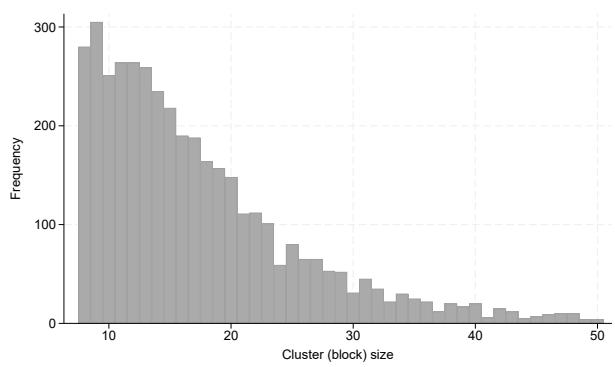  
(a) This paper; $n = 68,808$ ; $G = 3,982$ ; $n / G = 17.3$ ; $sd(n_g) = 8.25$ .

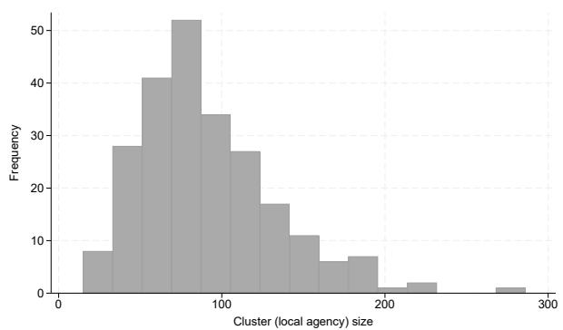  
(b) Crépon et al. (2013); $n = 21,431$ ; $G = 235$ ; $n / G = 91.2$ ; $sd(n_g) = 42.2$ .

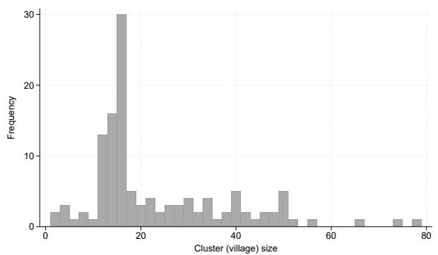  
(c) Haushofer and Shapiro (2016); $n = 2,880$ ; $G = 123$ ; $n / G = 23.4$ ; $sd(n_g) = 14.8$ .

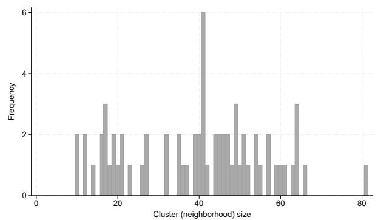  
(d) Giné and Mansuri (2018); n = 2,637; G = 67; n/G = 39.4; $sd(n_{g}) = 16.7$ .

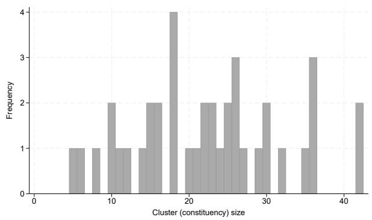  
(e) Ichino and Schündeln (2012); $n = 868$ ; $G = 39$ ; $n / G = 22.3$ ; $sd(n_g) = 9.6$ .

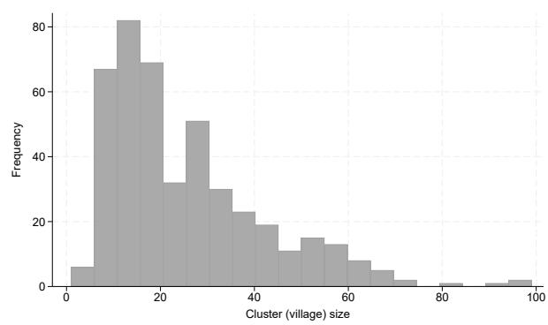  
(f) Imai, Jiang and Malani (2021); $n = 11,089$ ; $G = 437$ ; $n / G = 25.4$ ; $sd(n_g) = 16.7$ .

Notes: This figure shows the distribution of cluster sizes in six partial population experiments; n denotes the total sample size; G denotes the number of clusters; n/G denotes the average cluster size; $sd(n_{g})$ denotes the standard deviation of cluster sizes. Average values across studies are n = 7,781; G = 180; n/G = 40.4; $sd(n_{g}) = 20$ . Median values across studies are n = 2,880; G = 123; n/G = 25.6; $sd(n_{g}) = 16.7$ . The data source for Crépon et al. (2013) is: DARES (2010) “Enquête auprès des jeunes éligibles à la prestation d’insertion jeunes diplômés,” Progedo-Adisp. doi:10.13144/lil-1596.

Figure 2: Power functions - numerical illustration  
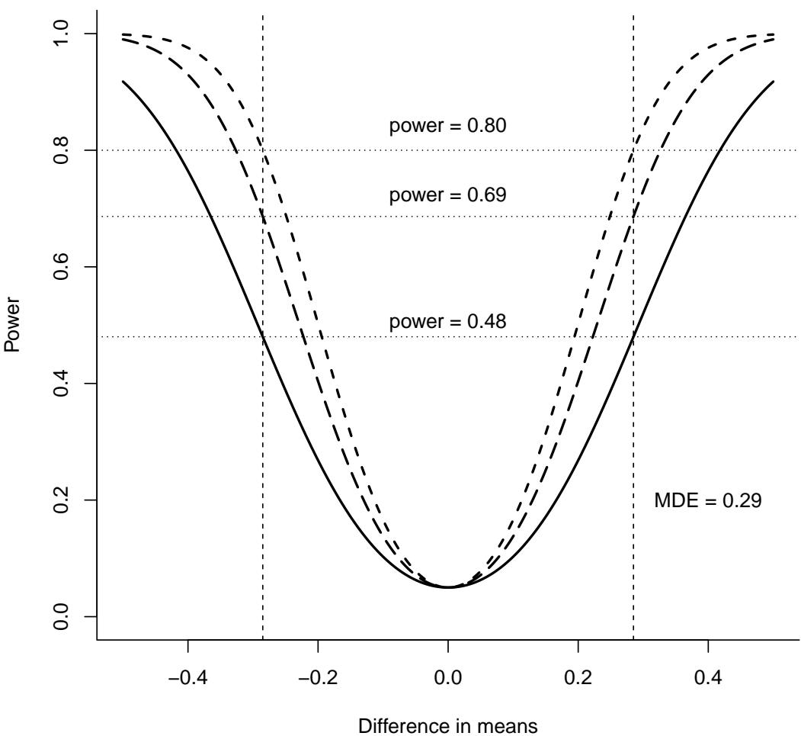  
Notes: This figure illustrates how ignoring heterogeneity can result in severely underpowered experiments. We consider the simple setting of a cluster RCT with a few “large” clusters and variation in the distribution of outcomes across clusters. We assume 200 clusters, with 10 clusters containing 100 units each and the remaining 190 clusters containing 25 units each. The figure plots three power functions corresponding to different variance formulas: the short-dashed curve depicts the power function for the variance formula that accounts for clustering assuming equally-sized clusters. The long-dashed curve depicts the power function using a variance formula that accounts for variation in cluster sizes. The solid curve depicts the power function using a variance formula that accounts for heterogeneity in both cluster sizes and outcome distributions. Given this sample size, the MDE at 80% power, ignoring cluster heterogeneity, is 0.29. Accounting for cluster size heterogeneity decreases the power to detect an effect of 0.29 from 80% to 69%. Accounting for both sources of heterogeneity decreases the power further to 48%.

Figure 3: Direct and spillover effects on property tax payments in high-saturation blocks

Direct Effects
Treated vs. Pure Control

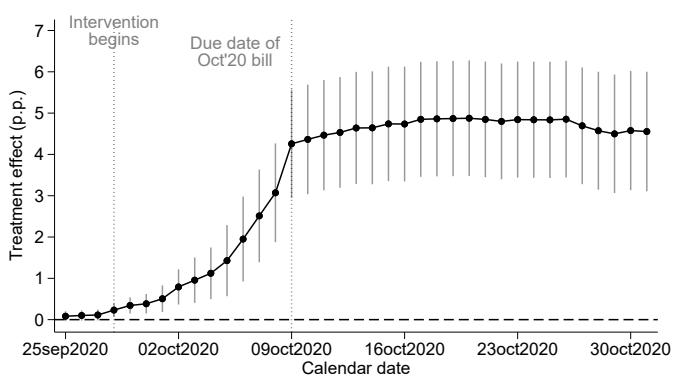  
Spillover Effects
Untreated vs. Pure Control

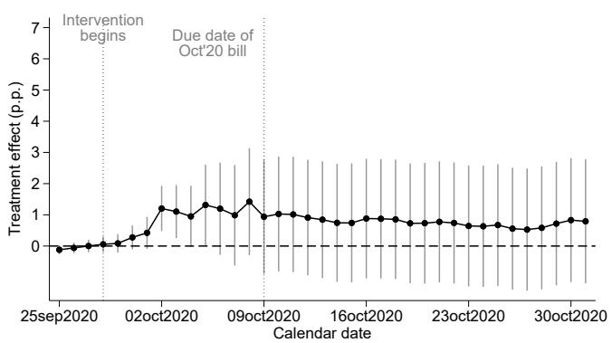

Above Median Compliance  
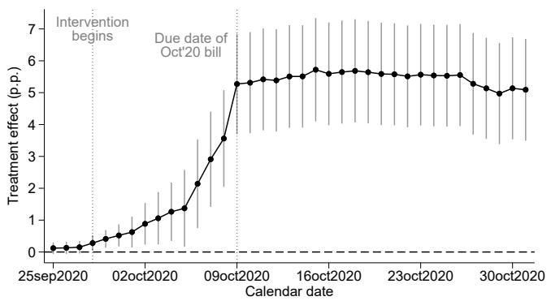

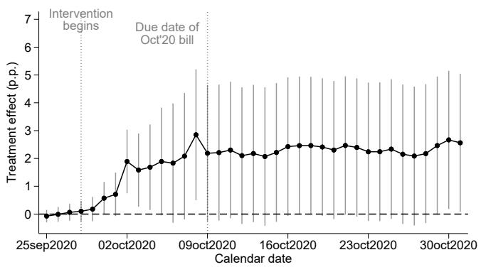

Below Median Compliance  
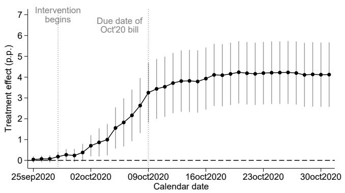

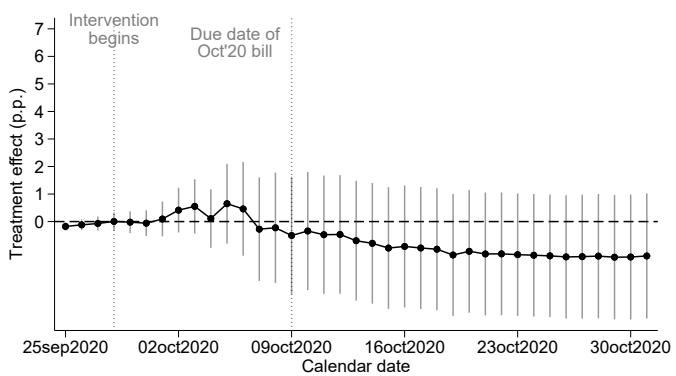  
Notes: These figures show the coefficients and 95% confidence intervals from a saturated regression that computes, at each calendar day, the payment rate difference between treated and untreated groups relative to the pure control group (i.e., blocks where no accounts were treated). We focus the attention on blocks where 80% of the units were treated. The three left figures exhibit the direct effects on treated accounts, and the three right figures present the spillover effects on untreated accounts. The top panel includes all the observations in high-saturation blocks, the middle panel focuses on blocks with baseline compliance above the median, and the bottom panel focuses on blocks with baseline compliance below the median. We define compliance as the share of bills paid by block in 2019. The median compliance is 0.56 (see Figure B.15). Standard errors are clustered by block. The first vertical bar shows the due date for the September 2020 bill. This corresponds to a bill issued and due for payment before our intervention began, thus serving as a placebo. The second vertical bar indicates the start of the intervention. The letters were delivered between September 28th and October 7th.

Table 1: MDEs with constrained and optimal choice of cluster probabilities

<table><tr><td rowspan="2"></td><td colspan="3">Scenario 1</td><td colspan="3">Scenario 2</td><td colspan="3">Scenario 3</td></tr><tr><td>Het</td><td>Homog</td><td>Equal</td><td>Het</td><td>Homog</td><td>Equal</td><td>Het</td><td>Homog</td><td>Equal</td></tr><tr><td colspan="10">Restricted  $q_t$ </td></tr><tr><td> $q_0$ </td><td>0.408</td><td>0.408</td><td>0.408</td><td>0.388</td><td>0.388</td><td>0.388</td><td>0.272</td><td>0.272</td><td>0.272</td></tr><tr><td> $q_1$ </td><td>0.199</td><td>0.209</td><td>0.230</td><td>0.219</td><td>0.231</td><td>0.239</td><td>0.273</td><td>0.283</td><td>0.286</td></tr><tr><td> $q_2$ </td><td>0.194</td><td>0.173</td><td>0.131</td><td>0.173</td><td>0.149</td><td>0.135</td><td>0.182</td><td>0.162</td><td>0.157</td></tr><tr><td> $q_3$ </td><td>0.199</td><td>0.209</td><td>0.230</td><td>0.219</td><td>0.231</td><td>0.239</td><td>0.273</td><td>0.283</td><td>0.286</td></tr><tr><td colspan="10">MDEs</td></tr><tr><td> $MDE_1$ </td><td>0.145</td><td>0.047</td><td>0.022</td><td>0.042</td><td>0.027</td><td>0.022</td><td>0.033</td><td>0.025</td><td>0.023</td></tr><tr><td> $MDE_2$ </td><td>0.146</td><td>0.051</td><td>0.029</td><td>0.047</td><td>0.033</td><td>0.029</td><td>0.039</td><td>0.032</td><td>0.030</td></tr><tr><td> $MDE_3$ </td><td>0.146</td><td>0.051</td><td>0.030</td><td>0.047</td><td>0.034</td><td>0.030</td><td>0.040</td><td>0.033</td><td>0.032</td></tr><tr><td colspan="10">Optimal  $q_t$ </td></tr><tr><td> $q_0$ </td><td>0.364</td><td>0.352</td><td>0.314</td><td>0.348</td><td>0.328</td><td>0.313</td><td>0.332</td><td>0.315</td><td>0.309</td></tr><tr><td> $q_1$ </td><td>0.212</td><td>0.219</td><td>0.238</td><td>0.221</td><td>0.231</td><td>0.238</td><td>0.229</td><td>0.237</td><td>0.240</td></tr><tr><td> $q_2$ </td><td>0.211</td><td>0.211</td><td>0.210</td><td>0.210</td><td>0.210</td><td>0.210</td><td>0.210</td><td>0.210</td><td>0.210</td></tr><tr><td> $q_3$ </td><td>0.212</td><td>0.219</td><td>0.238</td><td>0.221</td><td>0.231</td><td>0.238</td><td>0.229</td><td>0.237</td><td>0.240</td></tr><tr><td colspan="10">MDEs</td></tr><tr><td> $MDE_1$ </td><td>0.145</td><td>0.047</td><td>0.023</td><td>0.043</td><td>0.028</td><td>0.023</td><td>0.033</td><td>0.026</td><td>0.024</td></tr><tr><td> $MDE_2$ </td><td>0.145</td><td>0.049</td><td>0.025</td><td>0.045</td><td>0.030</td><td>0.025</td><td>0.036</td><td>0.028</td><td>0.027</td></tr><tr><td> $MDE_3$ </td><td>0.146</td><td>0.051</td><td>0.030</td><td>0.047</td><td>0.034</td><td>0.030</td><td>0.040</td><td>0.033</td><td>0.032</td></tr><tr><td colspan="10">Scenario Statistics</td></tr><tr><td>n</td><td></td><td>84,175</td><td></td><td></td><td>81,961</td><td></td><td></td><td>68,808</td><td></td></tr><tr><td>G</td><td></td><td>4,139</td><td></td><td></td><td>4,138</td><td></td><td></td><td>3,982</td><td></td></tr><tr><td>min  $n_g$ </td><td></td><td>8</td><td></td><td></td><td>8</td><td></td><td></td><td>8</td><td></td></tr><tr><td>max  $n_g$ </td><td></td><td>2,754</td><td></td><td></td><td>376</td><td></td><td></td><td>50</td><td></td></tr><tr><td>mean( $n_g$ )</td><td></td><td>20.5</td><td></td><td></td><td>19.8</td><td></td><td></td><td>17.3</td><td></td></tr><tr><td>sd( $n_g$ )</td><td></td><td>45.9</td><td></td><td></td><td>17.5</td><td></td><td></td><td>8.3</td><td></td></tr></table>

Notes: This table shows the cluster assignment probabilities and MDEs for the binary outcomes of interest. The parameters of interest are the difference in means between untreated units in each treated group and the pure control units, $\beta_{n}(0,t)$ , with t=1,2,3 indicating the groups with 20%, 50%, and 80% treated units, respectively. We refer to the corresponding MDEs for the parameters $\beta_{n}(0,1)$ , $\beta_{n}(0,2)$ and $\beta_{n}(0,3)$ as $MDE_{1}$ , $MDE_{2}$ and $MDE_{3}$ , respectively. Scenario 1 exhibits “substantial” heterogeneity, scenario 2 has “moderate” heterogeneity, and scenario 3 presents “limited” heterogeneity. n denotes the sample size; G denotes the number of clusters; $\min n_{g}$ and $\max n_{g}$ show the smallest and largest cluster; $mean(n_{g})$ is the average cluster size; $sd(n_{g})$ is the standard deviation of cluster sizes. In each scenario, we consider the results obtained with our general formula from Theorem 1 (“Het”), the formulas that rule out between-cluster moment heterogeneity from Corollary 1 (“Homog”) and the formulas that assume homogeneous, equally-sized clusters (“Equal”). Panels 1 and 2 show the constrained and optimal cluster assignment probabilities and their corresponding MDEs. Panels 3 and 4 show the optimal cluster assignment probabilities and their corresponding MDEs.

Table 2: Direct and spillover effects on property tax payments

<table><tr><td rowspan="2"></td><td colspan="3">Early Payments</td><td colspan="3">On-time &amp; Late Payments</td></tr><tr><td>All(1)</td><td>BelowMedian(2)</td><td>AboveMedian(3)</td><td>All(4)</td><td>BelowMedian(5)</td><td>AboveMedian(6)</td></tr><tr><td colspan="7">A. Blocks with 80% treated</td></tr><tr><td>Treated</td><td>0.96***(0.28)</td><td>0.86**(0.34)</td><td>1.06**(0.42)</td><td>4.55***(0.74)</td><td>4.12***(0.79)</td><td>5.09***(0.81)</td></tr><tr><td>Untreated</td><td>1.10**(0.43)</td><td>0.55(0.50)</td><td>1.58**(0.67)</td><td>0.79(1.01)</td><td>-1.25(1.16)</td><td>2.56**(1.27)</td></tr><tr><td colspan="7">B. Blocks with 50% treated</td></tr><tr><td>Treated</td><td>1.07***(0.41)</td><td>1.24**(0.50)</td><td>1.02(0.62)</td><td>4.87***(0.93)</td><td>4.81***(1.07)</td><td>5.67***(1.08)</td></tr><tr><td>Untreated</td><td>-0.02(0.34)</td><td>0.10(0.43)</td><td>-0.03(0.50)</td><td>-0.10(0.91)</td><td>1.34(1.00)</td><td>-0.76(1.14)</td></tr><tr><td colspan="7">C. Blocks with 20% treated</td></tr><tr><td>Treated</td><td>0.69*(0.42)</td><td>0.85*(0.52)</td><td>0.52(0.63)</td><td>4.97***(0.99)</td><td>5.41***(1.21)</td><td>4.40***(1.27)</td></tr><tr><td>Untreated</td><td>0.11(0.26)</td><td>0.68**(0.33)</td><td>-0.42(0.38)</td><td>-0.18(0.72)</td><td>0.61(0.77)</td><td>-1.09(0.82)</td></tr><tr><td>Payment rate of pure control</td><td>5.15</td><td>3.63</td><td>6.49</td><td>34.37</td><td>23.53</td><td>43.91</td></tr><tr><td>Observations</td><td>68,806</td><td>32,361</td><td>36,445</td><td>68,806</td><td>32,361</td><td>36,445</td></tr><tr><td>Number of clusters (blocks)</td><td>3,981</td><td>2,013</td><td>1,968</td><td>3,981</td><td>2,013</td><td>1,968</td></tr></table>

Notes: This table shows the results from saturated OLS regressions. The dependent variable in columns (1)-(3) is an indicator for paying the October 2020 bill by October 3rd (early payments); while in columns (4)-(6) we use an indicator for paying the October 2020 bill by October 31st (includes early, on time, and overdue payments). Columns (2) and (3) break the main result from column (1) into blocks below and above median compliance in 2019. We define compliance as the share of bills paid by block in 2019 with median value of 0.56 (see Figure B.15). Each column corresponds to a separate regression. The omitted category corresponds to blocks where no accounts were treated (pure control). Panel A shows the results for blocks where $80\%$ were treated, panel B for blocks with $50\%$ treated, and panel C for blocks with $20\%$ treated. The letters were delivered between September 28th and October 7th. The due date for the October 2020 bill was October 9th. The row Payment rate of pure control displays the constant of each regression, corresponding to the average payment rate in blocks with no treated units. Standard errors clustered by blocks are reported in parentheses. \* p<0.10, \*\* p<0.05, \*\*\* p<0.01

Supplementary Materials for:

“Design of Partial Population Experiments with an Application to Spillovers in Tax Compliance”

# A Further Details on Experimental Design

## A.1 Additional Material

Figure A.1: Example of the intervention letter  

Notes: This figure shows an anonymized example of the letters sent during the intervention between September 28th and October 7th, 2020. The headline reads: “Your municipal taxes are now available on the electronic bill.” The information below the headline contains the name of the account holder, the address, and the account number. The main text of the letter reads: “We would like to tell you that now in Tres de Febrero your municipal General Service Fee (TSG) bill is 100% digital. In other words, paper is no longer used. You can access it and pay for it from your cell phone or computer. In this way, we take care of each other by reducing circulation and we also take care of the environment. It is a difficult situation and we appreciate the effort you are making to keep up with your taxes, because that translates directly into constructions and services that do not stop in your neighborhood. We inform you of the status of your account and show you how easy it is:” The table below this text shows the account number, the amount due in the October 2020 billing period, the amount of past due debt from previous months of 2020, and the amount of past due date from earlier years. The large box below the table explains: (1) how to sign up for electronic billing, and (2) how to pay the bill and the different means of payment (online or in person). Finally, below the box, the text reads: “For questions, contact us at reclamos.mistasas@tresdefebrero.gov.ar. If this letter arrived by mistake at your address, inform us in that same email. Many thanks!”

Figure A.2: Map of the municipality with the experimental design  
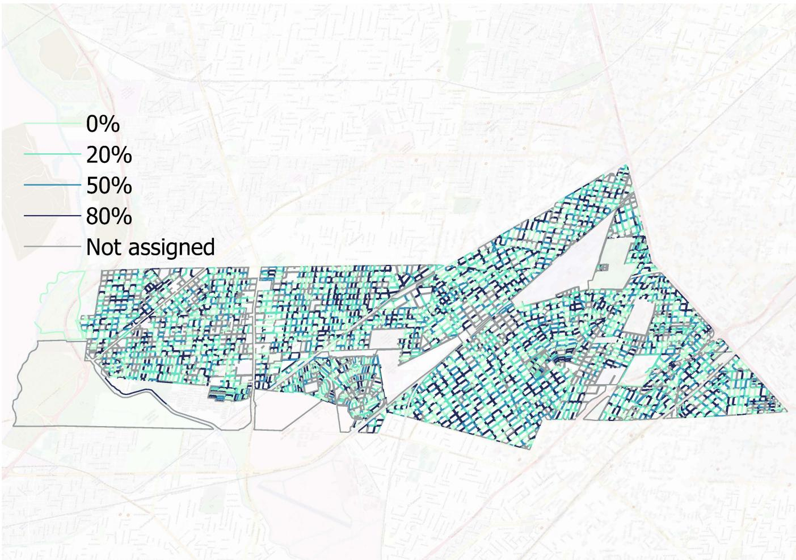  
Notes: This figure shows a map of the municipality where the 2-level randomized communication campaign took place. We highlight the group-level assignment of blocks (cuadras) with different colors: pure control blocks with 0% treated (light green), blocks with 20% treated accounts (green), blocks with 50% treated (blue), and blocks with 80% treated (dark blue). We use gray for blocks that were not part of the experiment (e.g., industrial or commercial blocks).

25,000 letters delivered

Figure A.3: A Partial Population Design  
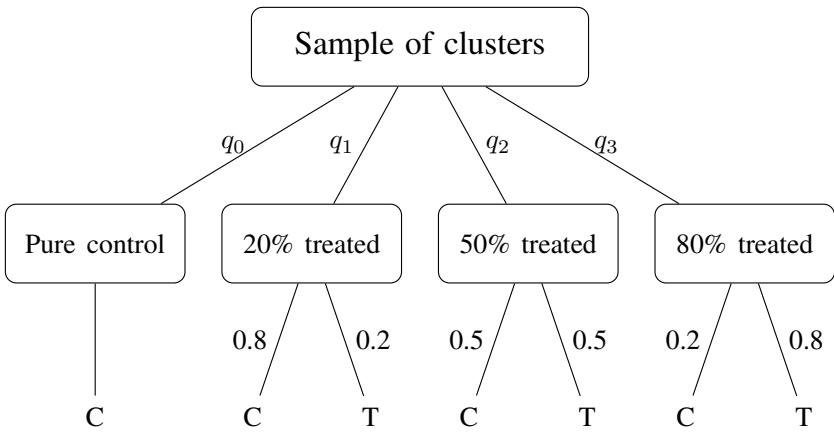  
Notes: In a partial population design, clusters are first randomly assigned to different treatment intensities or saturations. Within each cluster, units are randomly assigned to treatment with a probability equal to their cluster saturation. The figure above shows an example of a partial population design with four saturations, including pure control clusters with no treated units.

Figure A.4: Timeline of the randomized communication campaign

<table><tr><td>September 28First dayof campaign</td><td>October 7Last dayof campaign</td><td>October 9October 2020bill is due</td><td>Timeline2020</td></tr></table>

## A.2 Sample Sizes and Descriptive Statistics

Table A1: Sample sizes

<table><tr><td></td><td></td><td>Blocks</td><td>Control Obs</td><td>Treated Obs</td></tr><tr><td> $T_g = 0$ </td><td>Pure control</td><td>1,102</td><td>19,103</td><td>0</td></tr><tr><td> $T_g = 1$ </td><td>20% treated</td><td>1,100</td><td>15,060</td><td>3,853</td></tr><tr><td> $T_g = 2$ </td><td>50% treated</td><td>680</td><td>5,905</td><td>5,897</td></tr><tr><td> $T_g = 3$ </td><td>80% treated</td><td>1,100</td><td>3,677</td><td>15,311</td></tr><tr><td>Total</td><td></td><td>3,982</td><td>43,745</td><td>25,061</td></tr></table>

Notes: This table shows the final sample sizes used in our experiment. We limit the analysis to clusters of size ranging between 8 and 50 property tax accounts per street-block.

Table A2: Descriptive statistics in 2019 (baseline year)

<table><tr><td></td><td>Blocks</td><td>Obs</td><td>Mean</td><td>SD</td><td>ICC</td></tr><tr><td>Paid the twelve bills in 2019</td><td>3,981</td><td>68,808</td><td>0.449</td><td>0.497</td><td>0.062</td></tr><tr><td>Paid at least one bill in 2019</td><td>3,981</td><td>68,808</td><td>0.650</td><td>0.477</td><td>0.071</td></tr><tr><td>Paid six bills or more in 2019</td><td>3,981</td><td>68,808</td><td>0.572</td><td>0.495</td><td>0.073</td></tr></table>

Notes: This table shows descriptive statistics about the frequency of payments in 2019. This is the baseline year we used for the randomization, power calculations, and simulations. The data set is restricted to blocks with size between 8 and 50 accounts. Figure 1 shows the distribution of accounts per block. Our sample size consists of 68,808 accounts distributed in 3,982 blocks. The frequency of payments is very polarized. About 45 percent of the accounts paid the twelve bills and about 35 percent did not pay any bill. We call these two core groups always payers and never payers, respectively. The perfect compliance rate of 45 percent is presumably low and, therefore, leaves room for potential behavioral responses from non-compliant and partially-compliant neighbors.

Figure A.5: Distribution of payment date for treated, untreated, and pure control (October 2020 billing period)  
(a) Treated vs. Pure Control  
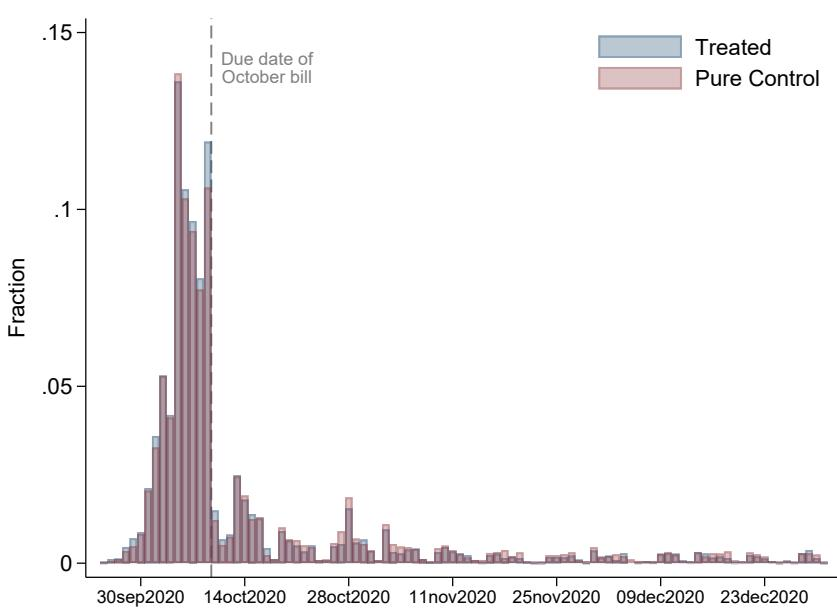

(b) Untreated vs. Pure Control  

Notes: These figures show the fraction of individuals paying the October 2020 bill before and after the due date (October 9th, 2020). Panel (a) shows the distribution of payments for treated units (in blue) relative to pure control units (in red). We pool together treated units from $T_{g} = 1, 2, 3$ . Panel (b) shows the distribution of payments for untreated units (in blue) relative to pure control units (in red). We pool together untreated units from $T_{g} = 1, 2, 3$ . The area of each histogram integrates to one. A larger bar on a particular date means that the payment frequency of the corresponding group is higher than the other group.

## A.3 Balance Checks

We ran balance test checks to verify the comparability of the treated, untreated, and pure control groups in terms of demographic and account-related characteristics in 2019. We jointly estimate the parameters of interest through the following saturated OLS regression:

$$
X _ {i g} = \alpha + \sum_ {t = 1} ^ {3} \theta_ {t} \mathbb {1} (T _ {g} = t) (1 - D _ {i g}) + \sum_ {t = 1} ^ {3} \tau_ {t} \mathbb {1} (T _ {g} = t) D _ {i g} + \varepsilon_ {i g}\tag{12}
$$

where $X_{ig}$ is one of the account holder or dwelling characteristics contained in our baseline data. We allow $\varepsilon_{ig}$ to be correlated within blocks and use a cluster-robust variance estimator. In this regression, $\theta_{t}$ captures the average difference of $X_{ig}$ of untreated units in groups with $T_{g} = t$ relative to the pure control group, and $\tau_{t}$ captures the average difference of $X_{ig}$ of treated units in groups with $T_{g} = t$ relative to the pure control group. The results are reported in Table A3 and reassuringly confirm that our groups are highly balanced. The null effect on timely payments (i.e., excluding past-due payments) of the September 2020 bill—the bill prior to our intervention—sheds further light on the balance between groups (see Figure B.9).

Table A3: Balance test saturated regressions

<table><tr><td rowspan="2"></td><td>Property Value</td><td>Front Metres</td><td>House type</td><td>Tenant Male</td><td>Tenant Age</td><td>Bill amount</td><td>N Bills paid 2019</td><td>Digital payment</td></tr><tr><td>(1)</td><td>(2)</td><td>(3)</td><td>(4)</td><td>(5)</td><td>(6)</td><td>(7)</td><td>(8)</td></tr><tr><td colspan="9">A. Blocks with 80% treated:</td></tr><tr><td rowspan="2">Treated</td><td>0.01</td><td>-8.27</td><td>-0.00</td><td>-0.00</td><td>-0.14</td><td>2.81</td><td>0.05</td><td>-0.00</td></tr><tr><td>(0.02)</td><td>(17.77)</td><td>(0.00)</td><td>(0.01)</td><td>(0.40)</td><td>(7.81)</td><td>(0.09)</td><td>(0.01)</td></tr><tr><td rowspan="2">Untreated</td><td>0.00</td><td>-1.76</td><td>0.00</td><td>0.00</td><td>-0.53</td><td>6.27</td><td>-0.06</td><td>-0.00</td></tr><tr><td>(0.02)</td><td>(20.70)</td><td>(0.01)</td><td>(0.01)</td><td>(0.53)</td><td>(12.95)</td><td>(0.12)</td><td>(0.01)</td></tr><tr><td colspan="9">B. Blocks with 50% treated:</td></tr><tr><td rowspan="2">Treated</td><td>0.01</td><td>12.65</td><td>-0.00</td><td>-0.00</td><td>-0.47</td><td>1.16</td><td>0.03</td><td>0.00</td></tr><tr><td>(0.02)</td><td>(20.38)</td><td>(0.01)</td><td>(0.01)</td><td>(0.50)</td><td>(9.21)</td><td>(0.11)</td><td>(0.01)</td></tr><tr><td rowspan="2">Untreated</td><td>0.01</td><td>25.30</td><td>-0.00</td><td>-0.00</td><td>-0.42</td><td>1.88</td><td>0.02</td><td>0.01</td></tr><tr><td>(0.02)</td><td>(20.66)</td><td>(0.01)</td><td>(0.01)</td><td>(0.48)</td><td>(9.66)</td><td>(0.11)</td><td>(0.01)</td></tr><tr><td colspan="9">C. Blocks with 20% treated:</td></tr><tr><td rowspan="2">Treated</td><td>0.02</td><td>32.57*</td><td>-0.01</td><td>0.01</td><td>0.10</td><td>5.94</td><td>0.07</td><td>-0.01</td></tr><tr><td>(0.02)</td><td>(16.79)</td><td>(0.01)</td><td>(0.01)</td><td>(0.54)</td><td>(9.55)</td><td>(0.12)</td><td>(0.01)</td></tr><tr><td rowspan="2">Untreated</td><td>0.02</td><td>19.14</td><td>-0.01</td><td>-0.01</td><td>0.12</td><td>1.32</td><td>0.00</td><td>0.00</td></tr><tr><td>(0.02)</td><td>(14.05)</td><td>(0.00)</td><td>(0.01)</td><td>(0.40)</td><td>(7.77)</td><td>(0.09)</td><td>(0.01)</td></tr><tr><td>Mean Pure Control</td><td>13.64</td><td>841.50</td><td>0.91</td><td>0.62</td><td>19.15</td><td>368.66</td><td>6.71</td><td>0.35</td></tr><tr><td>Observations</td><td>64,932</td><td>68,808</td><td>68,808</td><td>46,419</td><td>52,714</td><td>68,808</td><td>68,808</td><td>38,112</td></tr><tr><td>Number of clusters</td><td>3,979</td><td>3,981</td><td>3,981</td><td>3,973</td><td>3,976</td><td>3,981</td><td>3,981</td><td>3,968</td></tr></table>

Notes: This table shows balance test regressions to formally test for differences in observable characteristics between the treatment and control groups. Each column corresponds to a separate regression (equation (12) in the text). The dependent variables in each column are: (1) the log of assessed property value; (2) the front metres of the property; (3) an indicator for the property being a house versus a house with a store; (4) whether the tenant is male; (5) a proxy for the tenant's age (first two digits of the ID); (6) the amount paid in the bill corresponding to December 2019 (including zeroes); (7) the number of bills paid in 2019 (the maximum is 12); (8) for those who paid, whether they did so digitally. The row Mean Pure Control displays the constant of each regression, corresponding to the average of the dependent variable for accounts in blocks with no treated units ( $T_g = 0$ ). Missing/non-missing indicators for the dependent variables with missing observations (columns 1, 4, 5 and 8) are also balanced between groups (results not reported). Standard errors clustered by blocks are reported in parentheses. \* p<0.10, \*\* p<0.05, \*\*\* p<0.01

## A.4 Further Details on Within-Group Assignment Mechanisms

Fixed Margins. The within-group treatment is often assigned by choosing a fixed (i.e. nonrandom) number of treated units within each group. Given $T_{g} = t$ , suppose the researcher wants to assign a proportion $p_{t}$ of, or a total of $n_{g}p_{t}$ , units to treatment. Assigning exactly $n_{g}p_{t}$ units to treatment is not possible when $n_{g}p_{t}$ is not an integer. We propose the following procedure to deal with this issue. Define an independent binary random variable $\xi_{g}$ and let the number of treated units in cluster g be:

$$
N _ {g} ^ {1} = \left\lfloor n _ {g} p _ {t} \right\rfloor + \xi_ {g} \mathbb {1} (n _ {g} p _ {t} \notin \mathbb {N}).
$$

so that $\xi_{g}$ plays the role of an adjusting factor that randomly rounds the number of treated up or down. Given $T_{g} = t$ , set the probability that $\xi_{g} = 1$ to:

$$
\mathbb {P} _ {g} [ \xi_ {g} = 1 | T _ {g} = t ] = \left\{ \begin{array}{l l} 0 & \text {if n_{g} p_{t} \in \mathbb {N}} \\ n _ {g} p _ {t} - \lfloor n _ {g} p _ {t} \rfloor & \text {if n_{g} p_{t} \notin \mathbb {N}}. \end{array} \right.
$$

This implies that, given $T_{g}=t$ , the expected number of treated units in group g is $n_{g}p_{t}$ and that $P_{g}[D_{ig}=1|T_{g}=t]=p_{t}$ . Then, given $T_{g}=t$ , the expected number of treated units in group g is $n_{g}p_{t}$ and that $P_{g}[D_{ig}=1|T_{g}=t]=p_{t}$ . More precisely,

$$
\begin{array}{r l} & {\mathbb {E} [ N _ {g} ^ {1} | T _ {g} = t ] = \lfloor n _ {g} p _ {t} \rfloor + \mathbb {E} [ \xi_ {g} | T _ {g} = t ] \mathbb {1} (n _ {g} p _ {t} \notin \mathbb {N})} \\ & {\qquad = \lfloor n _ {g} p _ {t} \rfloor + (n _ {g} p _ {t} - \lfloor n _ {g} p _ {t} \rfloor) \mathbb {1} (n _ {g} p _ {t} \notin \mathbb {N})} \\ & {\qquad = n _ {g} p _ {t}} \end{array}
$$

using that $\lfloor n_g p_t \rfloor = n_g p_t$ when $n_g p_t \in \mathbb{N}$ . It follows that:

$$
\mathbb {E} \left[ \frac {N _ {g} ^ {1}}{n _ {g}} \Bigg | T _ {g} = t \right] = \mathbb {P} [ D _ {i g} = 1 | T _ {g} = t ] = p _ {t}
$$

which doesn't vary across groups conditional on $T_g = t$ . On the other hand, defining $N_g^0 = n_g - N_g^1$ , we have that:

$$
\mathbb {E} \left[ \frac {N _ {g} ^ {0}}{n _ {g}} \Bigg | T _ {g} = t \right] = \mathbb {P} [ D _ {i g} = 0 | T _ {g} = t ] = 1 - p _ {t}.
$$

Next, for this assignment mechanism,

$$
\begin{array}{r l} & {\mathbb {P} [ D _ {i g} = 1, D _ {j g} = 1 | T _ {g} = t ] = \mathbb {E} \left[ \frac {N _ {g} ^ {1}}{n _ {g}} \left(\frac {N _ {g} ^ {1} - 1}{n _ {g} - 1}\right) \Bigg | T _ {g} = t \right]} \\ & {\qquad = \frac {\mathbb {E} [ (N _ {g} ^ {1}) ^ {2} | T _ {g} = t ] - \mathbb {E} [ N _ {g} ^ {1} | T _ {g} = t ]}{n _ {g} (n _ {g} - 1)}} \end{array}
$$

where

$$
\begin{array}{l} \mathbb {E} [ (N _ {g} ^ {1}) ^ {2} | T _ {g} = t ] = \mathbb {E} [ (\lfloor n _ {g} p _ {t} \rfloor + \xi_ {g} \mathbb {1} (n _ {g} p _ {t} \notin \mathbb {N})) ^ {2} | T _ {g} = t ] \\ \qquad = n _ {g} ^ {2} p _ {t} ^ {2} \mathbb {1} (n _ {g} p _ {t} \in \mathbb {N}) \\ \qquad + \left((\lfloor n _ {g} p _ {t} \rfloor + 1) ^ {2} \mathbb {P} _ {g} [ \xi_ {g} = 1 | T _ {g} = t ] + \lfloor n _ {g} p _ {t} \rfloor^ {2} \mathbb {P} _ {g} [ \xi_ {g} = 0 | T _ {g} = t ]\right) \mathbb {1} (n _ {g} p _ {t} \notin \mathbb {N}) \\ \qquad = n _ {g} ^ {2} p _ {t} ^ {2} \mathbb {1} (n _ {g} p _ {t} \in \mathbb {N}) \\ \qquad + \left((\lfloor n _ {g} p _ {t} \rfloor + 1) ^ {2} (n _ {g} p _ {t} - \lfloor n _ {g} p _ {t} \rfloor) + \lfloor n _ {g} p _ {t} \rfloor^ {2} (1 - n _ {g} p _ {t} - \lfloor n _ {g} p _ {t} \rfloor)\right) \mathbb {1} (n _ {g} p _ {t} \notin \mathbb {N}). \end{array}
$$

Similarly,

$$
\mathbb {P} [ D _ {i g} = 0, D _ {j g} = 0 | T _ {g} = t ] = \frac {\mathbb {E} [ (N _ {g} ^ {0}) ^ {2} | T _ {g} = t ] - \mathbb {E} [ N _ {g} ^ {0} | T _ {g} = t ]}{n _ {g} (n _ {g} - 1)}
$$

where

$$
\mathbb {E} [ (N _ {g} ^ {0}) ^ {2} | T _ {g} = t ] = \mathbb {E} [ (n _ {g} - N _ {g} ^ {1}) ^ {2} | T _ {g} = t ] = n _ {g} ^ {2} + \mathbb {E} [ (N _ {g} ^ {1}) ^ {2} | T _ {g} = t ] - 2 n _ {g} ^ {2} p _ {t}
$$

Notice that even if $\mathbb{P}[D_{ig} = d|T_g = t]$ does not change across $g$ , the joint probabilities do. Nevertheless, these terms can be calculated for any sample using the chosen probabilities $p_t$ and the cluster sizes $\{n_g\}_{g=1}^G$ .

Bernoulli Trials. Alternatively, the within-cluster treatment may be assigned to each unit independently as a “coin flip” with probability $p_{t}$ . Under this mechanism, independence between treatment indicators implies that:

$$
\begin{array}{r} \mathbb {P} [ D _ {i g} = 1 | T _ {g} = t ] = \mathbb {P} [ D _ {i g} = 1 | T _ {g} = t ] = p _ {t} \\ \mathbb {P} [ D _ {i g} = d, D _ {j g} = d | T _ {g} = t ] = \mathbb {P} [ D _ {i g} = d | T _ {g} = t ] ^ {2}. \end{array}
$$

which do not vary over g. It follows that:

$$
\frac {\sum_ {g} n _ {g} (n _ {g} - 1) \mathbb {P} [ D _ {i g} = d , D _ {j g} = d | T _ {g} = t ]}{\sum_ {g} n _ {g} \mathbb {P} [ D _ {i g} = d | T _ {g} = t ]} = p _ {t} ^ {d} (1 - p _ {t}) ^ {1 - d} \left(\frac {\sum_ {g} n _ {g} ^ {2}}{n} - 1\right)
$$

Then the variances are approximated by:

$$
\mathbb {V} [ \hat {\beta} _ {0 t} ] \approx \frac {\sigma^ {2} (0 t)}{n q _ {t} (1 - p _ {t})} \left\{1 + \rho_ {0 t} (1 - p _ {t}) \left(\frac {\sum_ {g} n _ {g} ^ {2}}{n} - 1\right) \right\} + \frac {\sigma^ {2} (0 0)}{n q _ {0}} \left\{1 + \rho_ {0 0} \left(\frac {\sum_ {g} n _ {g} ^ {2}}{n} - 1\right) \right\}
$$

and

$$
\mathbb {V} [ \hat {\beta} _ {1 t} ] \approx \frac {\sigma^ {2} (1 t)}{n q _ {t} p _ {t}} \left\{1 + \rho_ {1 t} p _ {t} \left(\frac {\sum_ {g} n _ {g} ^ {2}}{n} - 1\right) \right\} + \frac {\sigma^ {2} (0 0)}{n q _ {0}} \left\{1 + \rho_ {0 0} \left(\frac {\sum_ {g} n _ {g} ^ {2}}{n} - 1\right) \right\}.
$$

B Additional Empirical Results

B.1 Further Details and Figures for Main Results

Figure B.6: Payment rates: Treated groups vs Pure control blocks  
(a) Payment rates in levels  
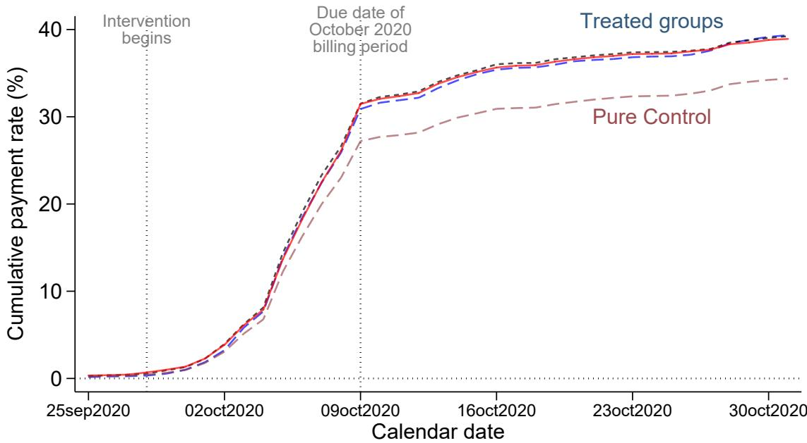

(b) Difference relative to pure control group  
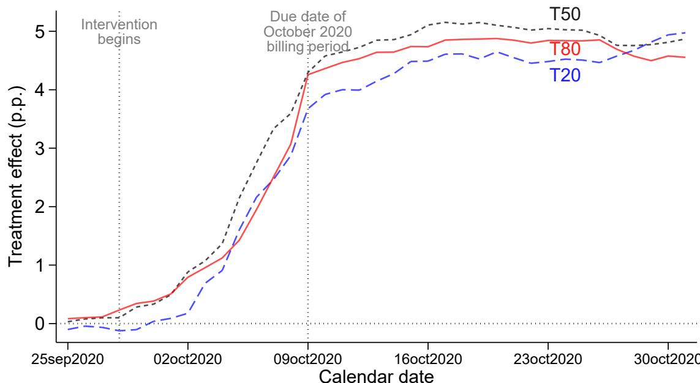  
Notes: These figures show the effect of the intervention on payments of the October 2020 bill for treated groups. Panel (a) shows the cumulative share of individuals paying the October 2020 bill over time. The brown dashed line shows the payment rate for pure control units. The blue dashed line corresponds to treated units in group $T_{g} = 1$ (blocks with 20% treated). The black dashed line corresponds to treated units in group $T_{g} = 2$ (blocks with 50% treated). The red solid line corresponds to treated units in group $T_{g} = 3$ (blocks with 80% treated). Panel (b) shows, for each calendar date, the difference between each treated group and the pure control group (treatment effect coefficients). The letters were delivered between September 28th and October 7th. The first vertical bar denotes the start of the intervention. The due date was October 9th and is indicated with another vertical bar.

Figure B.7: Payment rates: Untreated groups vs Pure control blocks  
(a) Payment rates in levels  
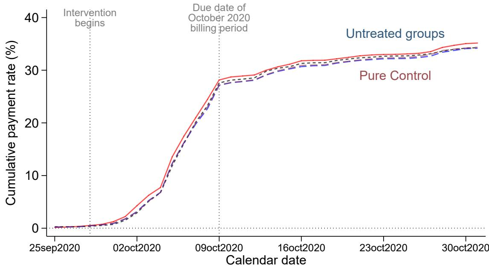

(b) Difference relative to pure control group  
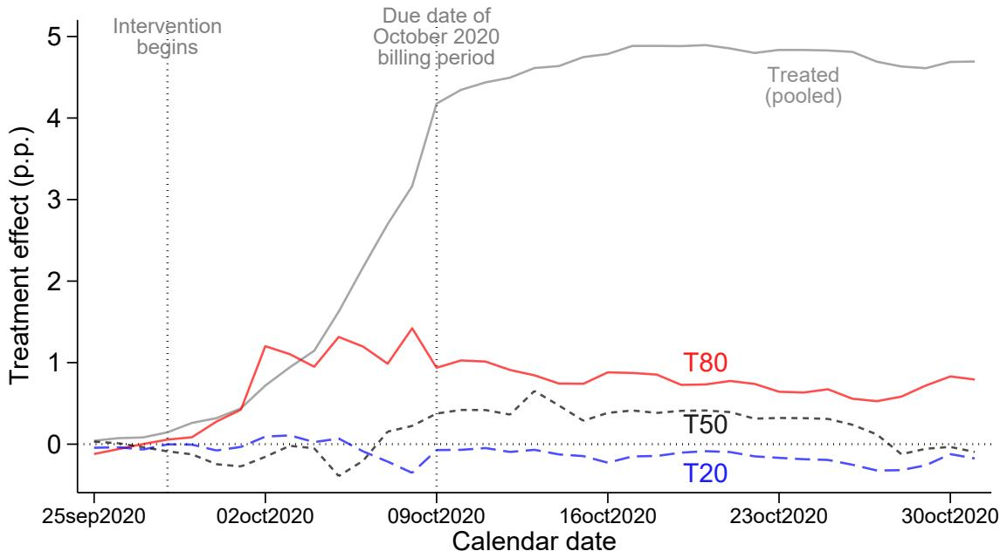  
Notes: These figures show the effect of the intervention on payments of the October 2020 bill for untreated groups. Panel (a) shows the cumulative share of individuals paying the October 2020 bill over time. The brown dashed line shows the payment rate for pure control units. The blue dashed line corresponds to untreated units in group $T_{g} = 1$ (blocks with 20% treated). The black dashed line corresponds to untreated units in group $T_{g} = 2$ (blocks with 50% treated). The red solid line corresponds to untreated units in group $T_{g} = 3$ (blocks with 80% treated). Panel (b) shows, for each calendar date, the difference between each untreated group and the pure control group (treatment effect coefficients). For comparison, the gray solid line shows the treatment effects for treated units (pooled from $T_{g} = 1, 2, 3$ ). The letters were delivered between September 28th and October 7th. The first vertical bar denotes the start of the intervention. The due date was October 9th and is indicated with another vertical bar.

Figure B.8: Direct effects on treated accounts and spillover effects on untreated accounts

Direct Effects
Treated vs. pure controls

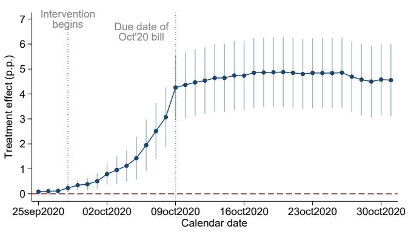  
Spillover Effects
Untreated vs. pure controls

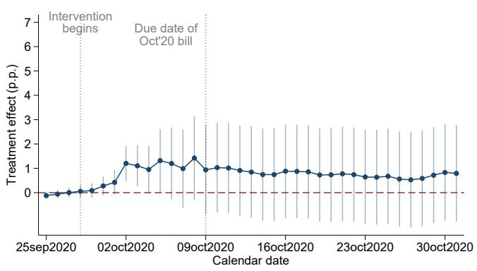

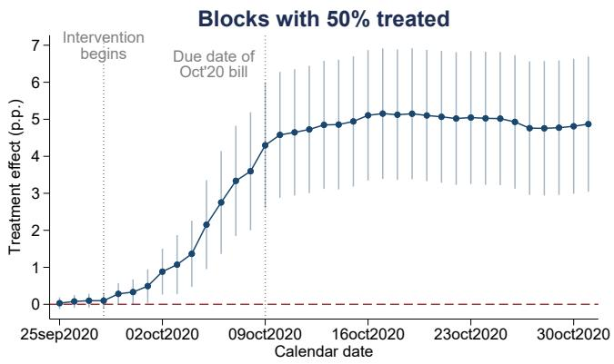

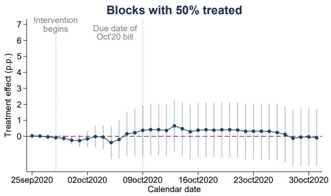

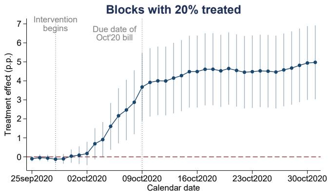

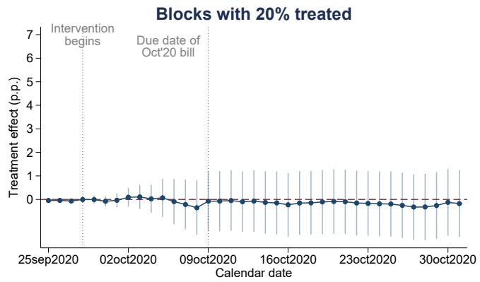  
Notes: These figures show the coefficients and 95% confidence intervals from a saturated regression that computes, at each calendar day, the payment rate difference between each treated and untreated group relative to the pure control group (i.e., blocks where no accounts were treated). The top panel shows the effect on treated (left) and untreated (right) units in blocks with 80% treated ( $T_{g} = 3$ ). The middle panel shows the effect on treated (left) and untreated (right) units in blocks with 50% treated ( $T_{g} = 2$ ). The bottom panel shows the effect on treated (left) and untreated (right) units in blocks with 20% treated ( $T_{g} = 3$ ). These point estimates coincide with those reported in panel (b) of Figures B.6 and B.7. Standard errors are clustered by block. The first vertical bar denotes the start of the intervention. The due date for the October 2020 bill was October 9th and is indicated with another vertical bar. The letters were delivered between September 28th and October 7th.

Figure B.9: Placebo. Direct and spillover effects for the pre-intervention Sep'20 bill

Treated groups
vs. pure controls

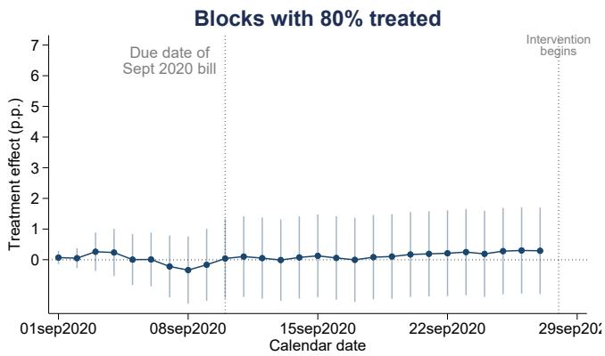  
Untreated groups vs. pure controls

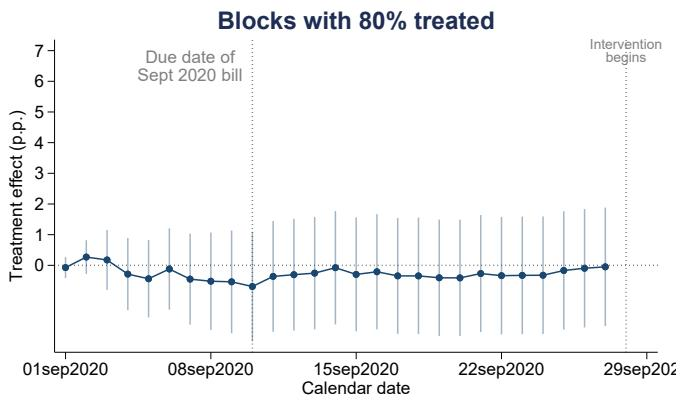

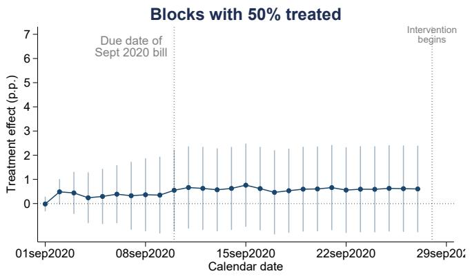

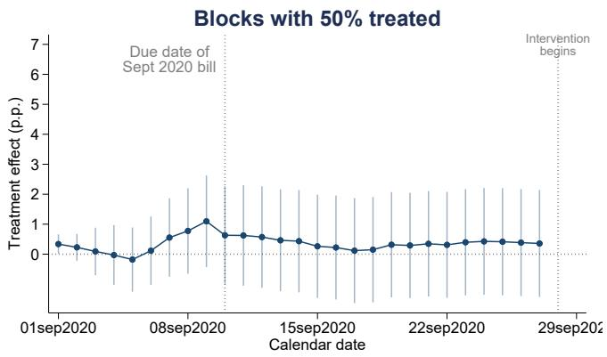

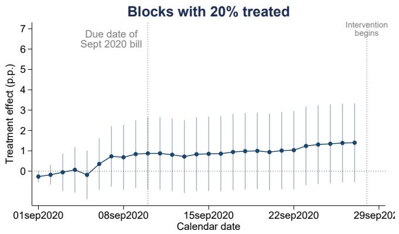

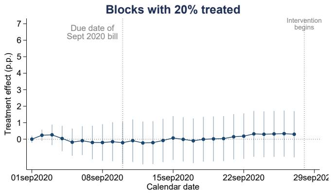  
Notes: These figures show the coefficients and 95% confidence intervals from a saturated regression that computes, at each calendar day, the payment rate difference between each treated and untreated group relative to the pure control group (i.e., blocks where no accounts were treated). The top panel shows the effect on treated (left) and untreated (right) units in blocks with 80% treated ( $T_{g} = 3$ ). The middle panel shows the effect on treated (left) and untreated (right) units in blocks with 50% treated ( $T_{g} = 2$ ). The bottom panel shows the effect on treated (left) and untreated (right) units in blocks with 20% treated ( $T_{g} = 3$ ). Standard errors are clustered by block. The first vertical bar shows the due date for the September 2020 bill. This corresponds to a bill issued and due for payment before our intervention began, thus serving as a placebo. The second vertical bar indicates the start of the intervention. The letters were delivered between September 28th and October 7th.

Table A4: Placebo. Direct and spillover effects for the pre-intervention September 2020 bill

<table><tr><td rowspan="2">Dependent variable:Pr(pay the bill)</td><td colspan="3">Placebo bill (September 2020)</td></tr><tr><td>All(1)</td><td>Below Median(2)</td><td>Above Median(3)</td></tr><tr><td>A. Blocks with 80% treated</td><td></td><td></td><td></td></tr><tr><td>Treated</td><td>0.12(0.69)</td><td>0.10(0.73)</td><td>0.28(0.81)</td></tr><tr><td>Untreated</td><td>-0.30(0.95)</td><td>-1.55(1.09)</td><td>0.78(1.24)</td></tr><tr><td>B. Blocks with 50% treated</td><td></td><td></td><td></td></tr><tr><td>Treated</td><td>0.76(0.88)</td><td>1.54(0.99)</td><td>0.69(1.12)</td></tr><tr><td>Untreated</td><td>0.26(0.88)</td><td>0.81(0.94)</td><td>0.36(1.15)</td></tr><tr><td>C. Blocks with 20% treated</td><td></td><td></td><td></td></tr><tr><td>Treated</td><td>0.85(0.93)</td><td>1.32(1.11)</td><td>0.27(1.24)</td></tr><tr><td>Untreated</td><td>0.07(0.68)</td><td>0.27(0.72)</td><td>-0.32(0.80)</td></tr><tr><td>Payment rate of pure control</td><td>29.70</td><td>20.05</td><td>38.19</td></tr><tr><td>Observations</td><td>68,806</td><td>32,361</td><td>36,445</td></tr><tr><td>Number of clusters (blocks)</td><td>3,981</td><td>2,013</td><td>1,968</td></tr></table>

Notes: Notes: This table shows the results from saturated OLS regressions using as dependent variable an indicator for paying the September 2020 bill by September 15th (pre-intervention). Each column corresponds to a separate regression. The omitted category corresponds to blocks where no accounts were treated (pure control). Panel A shows the results for blocks where 80% were treated, panel B for blocks with 50% treated, and panel C for blocks with 20% treated. Columns (2) and (3) split the sample from column (1) into blocks below and above median compliance in 2019, respectively. We define compliance as the share of bills paid by block in 2019 with median value of 0.56 (see Figure B.15). The estimates reported in column (1) correspond exactly to the numbers shown in Figure (B.9). The row Payment rate of pure control displays the constant of each regression, corresponding to the average payment rate in blocks with no treated units. Standard errors clustered by blocks are reported in parentheses. \* p<0.10, \*\* p<0.05, \*\*\* p<0.01

## B.2 Other Margins

Subscriptions to electronic billing. We find evidence that our tax communication campaign also increases the subscriptions to receive an electronic bill by e-mail. $^{1}$ These effects are greater in high-saturation blocks, albeit small in absolute value. Appendix Section B.2.1 presents graphical evidence of direct and spillover effects (Figure B.10), which are then summarized in Table A5, although spillover effects in this outcome are much more tenuous.

Backward and forward payments. We also find that the effects of our letters are not solely concentrated on the October 2020 billing period (the bill targeted by our intervention). Section B.2.2 presents graphical evidence that the letters also increased the payment rates in subsequent billing periods. Perhaps more strikingly, we also show that some neighbors made backward payments to cancel past-due debt from previous billing periods. This is especially prominent after April 2020 when the COVID-19 lockdown measures were established in Argentina (See Figure B.11).

## B.2.1 Effects on Subscriptions to Electronic Billing

The communication campaign also included information about how to sign up for electronic billing, a system introduced in June 2020. We briefly analyze the effect of our mailing on subscription to this service.

We rely on a database that contains the individuals who signed up for the electronic billing option. This database goes through December 2020 and contains the account number, date of subscription, and email address. This source is linked with the main data through the unique account identifier.

We analyze the intervention's effect on subscriptions to electronic billing and present convincing graphical evidence that the tax communication campaign increased subscriptions to receive an electronic bill by e-mail. These effects are greater in high-saturation blocks, albeit small in absolute value.

The results are summarized in Figure B.10, which follows a similar structure as Figure B.8 but for e-bill subscriptions. We run dynamic difference-in-differences comparing subscription rates between each treated and each untreated group relative to pure control blocks, day by day (fixing September 27, 2020, as the baseline date).

Four important points are worth highlighting: (1) trends are generally parallel, as we estimate no significant differences between the treatment and control groups prior to the intervention; (2) the difference in subscription rates between treated accounts and pure control blocks experiences a noticeable break at the time we started sending letters, which is reassuring and implies that the effects we estimate are indeed caused by our experiment; (3) direct effects are greater in high-saturation blocks with 50% and 80% treated units relative to low-saturation blocks where only 20% received the letter. As happened with payment rates, this could be interpreted as a spillover effect, whereby the intervention creates interference between treated units strengthening the effect of the letter; and (4) although less clear than the left-hand-side panels for treated units, the right-hand-side panels of Figure B.10 also suggest the presence of spillover effects in subscriptions to e-billing for untreated accounts in high-saturation blocks. As was the case with payment rates, these effects are harder to detect. They are precisely estimated but only significant at the 5% level at the beginning of the intervention.

Lastly, Table A5 summarizes the corresponding diff-in-diffs estimates reported in Figures B.10, with the same structure as Table 2. $^{2}$ To benchmark our estimates, in the last row we report the share of e-bill subscribers in pure control blocks on September 27 (our baseline date). For treated accounts, the table shows an immediate effect in the three saturation groups that increases over time. This effect is higher in blocks with 80% treated units, consistent with interference that strengthens the effect. In such blocks, the total effect reaches 0.86 percentage points by the end of October. Although this represents about 20% of the baseline 4.25% share of e-bill subscribers, we find it striking that so few individuals switched to the digital bill. In the case of untreated accounts, spillover effects on subscription rates are smaller and, therefore, much harder to detect than in the analysis of payment rates. The clearest effect arises in blocks with 50% treated accounts with a spillover effect of 0.25 percentage points, significant at the 10% level. The somewhat absence of spillovers in this case can be explained by the fact that the outcome of analysis (subscription rate) has very low take up, making it harder for interference between neighbors to emerge.

In sum, we find that our tax communication campaign also generates direct effects and spillover effects among neighbors in subscriptions to electronic billing. These effects are greater in high-saturation blocks, albeit small in absolute value.

Figure B.10: Direct effects on treated accounts and spillover effects on untreated accounts (subscriptions to e-billing). Difference in differences

Treated groups
vs. pure controls

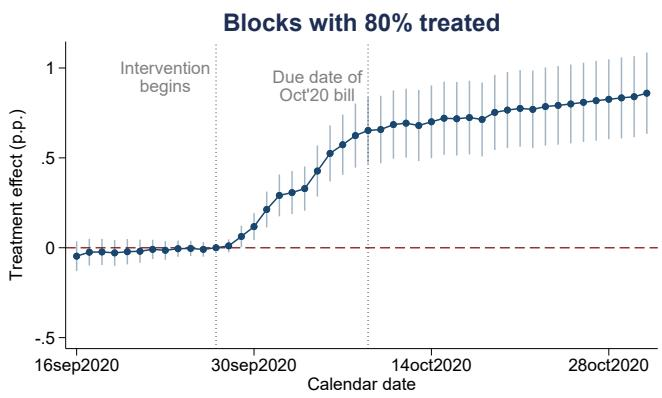  
Untreated groups vs. pure controls

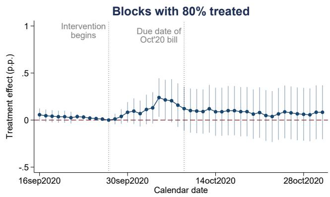

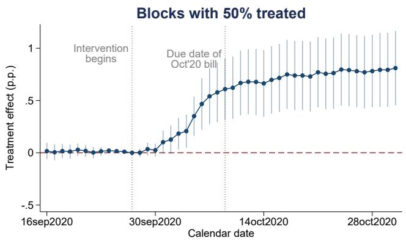

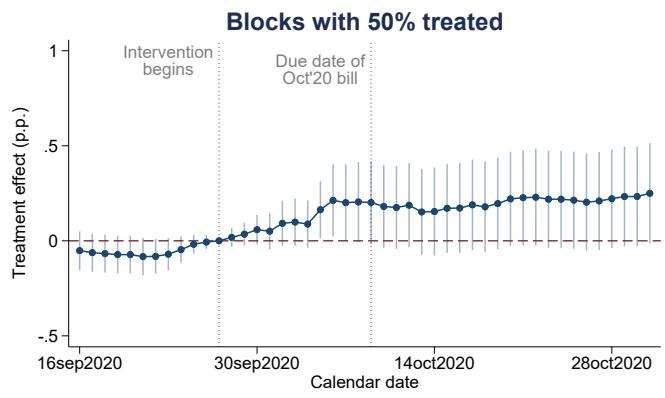

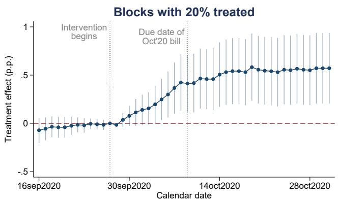

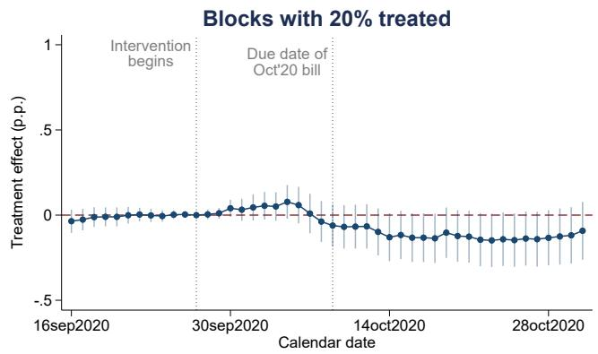  
Notes: These figures show the coefficients and 95% confidence intervals from dynamic difference-in-differences regressions where the outcome of interest is a dummy equal to one if the account is subscribed to an electronic bill. All the coefficients are estimated with respect to September 27th, 2020 (baseline date) and relative to the pure control group (i.e., blocks where no accounts were treated). The top panel shows the effect on treated (left) and untreated (right) units in blocks with 80% treated ( $T_{g} = 3$ ). The middle panel shows the effect on treated (left) and untreated (right) units in blocks with 50% treated ( $T_{g} = 2$ ). The bottom panel shows the effect on treated (left) and untreated (right) units in blocks with 20% treated ( $T_{g} = 1$ ). Standard errors are clustered by block. The first vertical bar denotes the start of the intervention. The due date for the October 2020 bill was October 9th and is indicated with another vertical bar. The letters were delivered between September 28th and October 7th.

Table A5: Total effects and spillover effects for subscriptions to e-billing

<table><tr><td rowspan="2">Dependent variable:Pr(subscribe to e-bill)</td><td rowspan="2">Placebo:By Sep 20(1)</td><td colspan="2">Intervention:</td></tr><tr><td>Early(2)</td><td>By Oct 31(3)</td></tr><tr><td colspan="4">A. Blocks with 80% treated</td></tr><tr><td>Treated</td><td>-0.02(0.04)</td><td>0.31***(0.06)</td><td>0.86***(0.12)</td></tr><tr><td>Untreated</td><td>0.04(0.03)</td><td>0.11(0.08)</td><td>0.08(0.15)</td></tr><tr><td colspan="4">B. Blocks with 50% treated</td></tr><tr><td>Treated</td><td>0.03(0.03)</td><td>0.18**(0.08)</td><td>0.81***(0.18)</td></tr><tr><td>Untreated</td><td>-0.07(0.05)</td><td>0.10(0.06)</td><td>0.25*(0.13)</td></tr><tr><td colspan="4">C. Blocks with 20% treated</td></tr><tr><td>Treated</td><td>-0.04(0.05)</td><td>0.15*(0.08)</td><td>0.57***(0.19)</td></tr><tr><td>Untreated</td><td>-0.01(0.03)</td><td>0.05(0.04)</td><td>-0.09(0.09)</td></tr><tr><td>Mean of Pure Control at baseline</td><td>4.25</td><td>4.25</td><td>4.25</td></tr><tr><td>Observations</td><td>137,612</td><td>137,612</td><td>137,612</td></tr><tr><td>Number of clusters (blocks)</td><td>3,981</td><td>3,981</td><td>3,981</td></tr></table>

Notes: This table shows the results from a saturated dynamic difference-in-differences regression where the dependent variable is an indicator for subscribing to electronic billing. The regression computes the outcome difference between each of the treated and untreated groups relative to the pure control group for each calendar date relative to September 27th, 2020 (baseline date). The estimates correspond exactly to the numbers shown in Figure (B.10). Column (1) shows the results for e-bill subscriptions made before the letters were delivered (placebo); Column (2) shows the results for early subscriptions right after the letters started to be delivered (by October 3); Column (3) shows the results for subscriptions made up to the end of October 2020. The letters were delivered between September 28 and October 7. The due date for the October 2020 bill was October 9th. The row Mean of Pure Control displays the constant of the regression, corresponding to the average subscription rate for units in blocks with no treated units on September 27, 2020. Standard errors clustered by blocks are reported in parentheses. \* p<0.10, \*\* p<0.05, \*\*\* p<0.01

## B.2.2 Timing of Payments and Due Bills

For completeness, we analyze the effects of the intervention on backward and forward payments corresponding to billing periods before and after month 10, the month of our intervention. These results are summarized in Figure B.11.

Intuitively, neighbors can pay their property tax bill at any time before or after the due date, and hence, payments from previous billing periods can also be affected by our intervention. $^{3}$ To illustrate this, the left panels of Figure B.11 only consider timely payments, defined as bills paid before the 27th of the corresponding month. We set any payment made after the 27th as unpaid in our data. Hence, pre-intervention bills mechanically exclude any past-due payment triggered by our intervention. In contrast, the right panels of Figure B.11 consider timely as well as past-due payments made until December 2020 and, thus, capture backward payments triggered by our intervention (e.g., individuals that decide to pay the October 2020 bill as well as previous unpaid bills after receiving the letter).

The top figures show payment rates in levels for treated units (black line) and pure control units (gray line), for 24 consecutive monthly bills between January 2019 and December 2020. Treated units are pooled from groups $T_g = 1,2,3$ . The bottom figures report total treatment effects—i.e., the difference between treated and pure control units—and 95% confidence intervals for the 24 billing periods. The first vertical bar denotes the start of the COVID-19 pandemic in Argentina, and the second vertical bar flags the October'20 bill targeted by our intervention.

Four important points are worth noting: (1) Overall, payment rate levels are low. The top left panel shows that about 48% of households pay their bill before the 27th of each month. This share is relatively constant until March 2020, when the COVID-19 pandemic hit Argentina and payment rates decreased sharply to 23%; (2) a similar pattern emerges when we consider timely and past-due payments. The reason why levels are higher and decrease over time is that as time goes by, it is more likely that individuals cancel unpaid bills; (3) placebo direct effects (red line), based on payment rates constructed with timely payments only, are precisely estimated and not different from zero for the 21 pre-intervention bills. For the October 2020 bill, however, timely payments are 4.4 p.p. higher in treated units relative to control blocks. This is reassuring and implies that our sample is balanced and that the effects we estimate are indeed caused by our experiment; and (4) when we account for past-due payments, the blue line shows that our intervention nudged some individuals to catch up with unpaid bills. The difference in payment rates between treated and pure control accounts experiences a noticeable increase in the pandemic billing periods from April 2020 onward. Although the October bill, when the intervention took place, presents the highest effect (4.2 p.p.), the letters also had some residual positive effects in November and December.

Figure B.11: Direct effects on pre- and post-intervention bills

Timely payments only

Timely and past-due
payments

(a) Payment rates in levels  
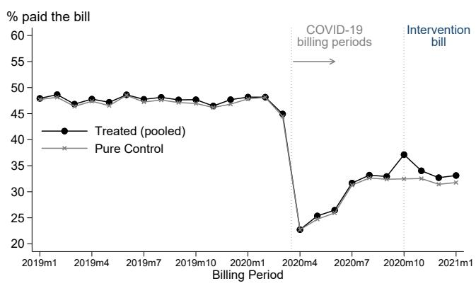

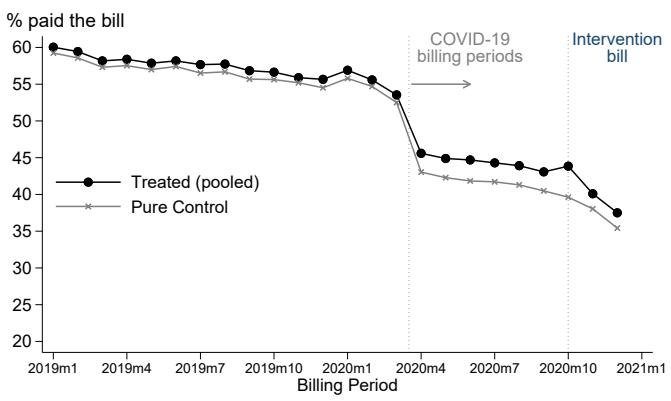

(b) Difference relative to pure control group  
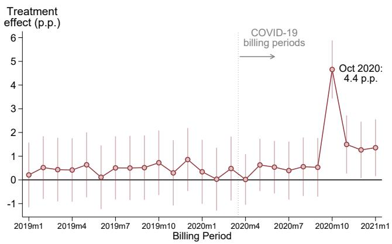

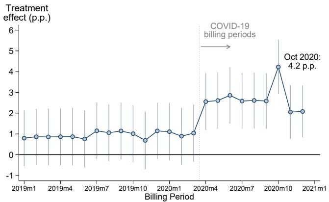

Notes: These figures show the effect of the communication campaign on payment rates of pre- and post-intervention bills. The left panels only consider timely payments, defined as bills paid before the 27th of the corresponding month (i.e., any payment made after the 27th is considered unpaid). Hence, pre-intervention bills mechanically exclude any past-due payment triggered by our intervention. The right panels consider timely as well as past-due payments made until December 2020 and, thus, capture backward payments triggered by our intervention (e.g., individuals who, after receiving the letter, pay the October 2020 bill as well as previous unpaid bills). The top figures show payment rates in levels for treated units (black line) and pure control units (gray line), for 24 consecutive monthly bills between January 2019 and December 2020. Treated units are pooled from groups $T_{g} = 1, 2, 3$ . The bottom figures report total treatment effects—i.e., the difference between treated and pure control units—and 95% confidence intervals for the 24 billing periods. The letters were delivered between September 28th and October 7th. The vertical bar denotes the start of the COVID-19 pandemic in Argentina. Each coefficient is estimated in separate regressions. Standard errors are clustered at the block level. The red line shows no difference on timely payments for pre-intervention bills. In contrast, when we account for past-due payments, the blue line shows that our intervention nudged some individuals to catch up with unpaid bills from April 2020 onwards.

## B.3 Are Untreated Blocks Affected by the Intervention?

A crucial aspect of partial population experiments is the unit within which the experimenter will test the presence of spillovers. In some settings, these are relatively straightforward to establish: electoral precincts for political outcomes, towns for regional policies, and schools or school districts for educational interventions. In our application, we aim to measure information spillovers among taxpayers. Discussions with municipal tax authorities and with taxpayers, as well as the context of our intervention, led us to select city street blocks as the relevant clusters for potential information spillovers about tax reminders and deadlines and their effects on tax compliance. Specifically, the campaign was motivated by the sharp drop in compliance in April 2020 induced by the severe lockdown imposed in the Greater Buenos Aires area in Argentina during the COVID pandemic in a context where most payments were made in person (see Figure B.11). The lockdown was strongly enforced, and as a result, citizens' mobility was severely limited, which justifies the choice of the city street block—a relatively small cluster—as the relevant unit for information spillover since it reflects the limited physical interactions generated by the lockdown. A further justification is the city's street layout, which consists mainly of relatively homogeneous straight streets with orthogonal intersections in square/rectangular city blocks (see Figure A.2).

A potential concern with this setup is that the city street block may not be the relevant unit to capture information spillovers. The random assignment process and the city's physical layout imply that taxpayers in pure control street blocks (i.e., blocks where no one received a tax reminder) were still adjacent and/or surrounded by blocks with treated taxpayers, as shown by inspection of the map in Figure A.2. Interference between adjacent blocks is possible, and this would induce a downward bias in our results, since individuals in pure control (untreated) blocks would be affected by the information campaign via spillovers from adjacent (treated) blocks. Our empirical setup allows for an auxiliary test to rule out this concern and establish that units in pure control blocks indeed provide a valid counterfactual in our analysis. $^{4}$

To test the robustness of untreated blocks as pure controls, we leverage our experimental assignment process, which implies that the “intensity” of treatment in the surrounding blocks is random by definition. Pure control units are by chance surrounded by blocks with varying degrees of treatment intensity (0%, 20%, 50%, or 80%), and thus by a random number of treated taxpayers. If there is interference between treated and untreated blocks, we should observe that pure control payment rates increase with the exposure of untreated blocks to treated blocks.

We construct our measure of the potential exposure of a street-block to the intervention in two steps. First, we use GIS software to calculate a buffer of 100, 200, and 300 meters around the centroid of each street-block (see the three figures in the top panel of Figure B.12), given the typical street block length of 100 meters. Second, for each street-block and radius, we calculate the share of properties receiving a letter (treated) relative to all the properties in the buffer zone. The three figures in the middle panel of Figure

B.12 display the distribution of the share of treated units around pure control blocks.

With this exposure measure at hand, we test whether payment rates of the October 2020 bill in pure control blocks increase with the exposure to the proportion of treated units in surrounding blocks. The figures in the bottom panel of Figure B.12 present parametric and non-parametric evidence of this relationship. Each panel shows a binned scatterplot of payment rates of the October 2020 bill (y-axis) by equally-sized bins of exposure to treated units within the buffer zone (x-axis). Reassuringly, the relationship is flat, and it is robust to increasing the size of the buffer zone to 200 and 300 meters. This is confirmed by the small linear regression coefficients and large p-values reported in these figures.

Our main results indicated that we only found spillover effects in our main research design for high saturation blocks with high previous compliance, as illustrated by the results in Figure 3 and Table 2. We conduct a similar analysis with the exposure measure for the 100-meter buffer in Figure B.13. The parametric and non-parametric results presented there confirm a flat gradient for untreated blocks with both high and low compliance in 2019, further confirming that untreated blocks were not affected by the intervention even when considering this heterogeneity.

Finally, for completeness, we also study the relationship between payment rates and exposure to adjacent treated blocks in blocks where 80% of the units were treated, again for the 100-meter buffer. The results of this exercise are reported in Figure B.14. The left panel corresponds to the October 2020 bill affected by our intervention, whereas the middle and right panels correspond to pre-intervention bills of July and August 2020. In all these cases, the relationship between exposure and payment rates is flat and statistically not significant for both the pure control blocks (with blue dots and blue linear fit) and the 80% saturation blocks (with red triangles and a red linear fit). Interestingly, the vertical distance between the red and blue linear fit in the left panel captures the treatment effect of our experiment, which is clearly uniform in the exposure measure.

Taken together, the results from the exercise in this section indicate that pure control blocks were not affected by adjacent treated blocks, and thus provide a valid counterfactual for the analysis. In more general terms, information spillovers do not seem to have happened at a higher degree of aggregation than the city street block. When combined with the presence of information spillovers documented in the main body of the paper, the city street block seems to have been the relevant level of information dissemination for this campaign.

100m buffer

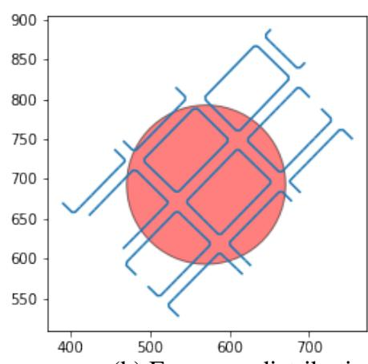  
200m buffer

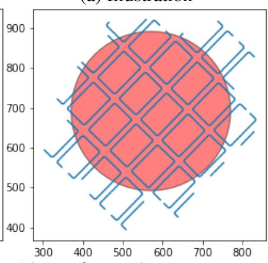  
300m buffer

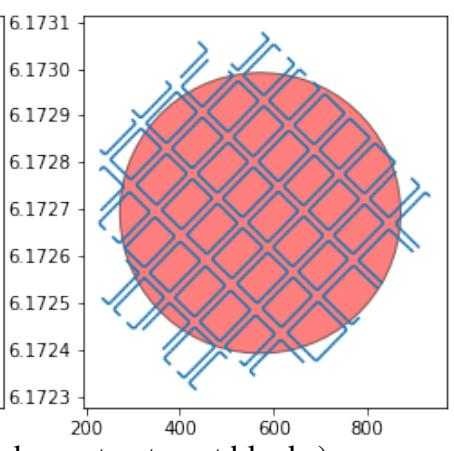  
(b) Exposure distribution (share of treated accounts around pure treatment blocks)

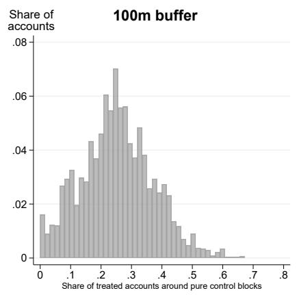

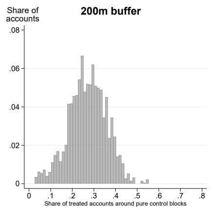

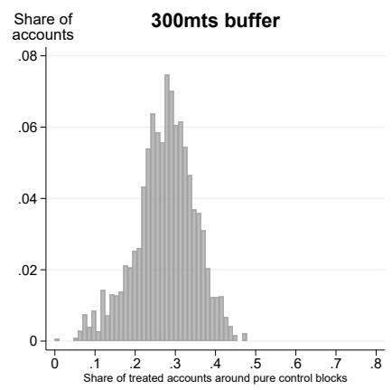

(c) Payment rates for pure controls as a function of exposure  
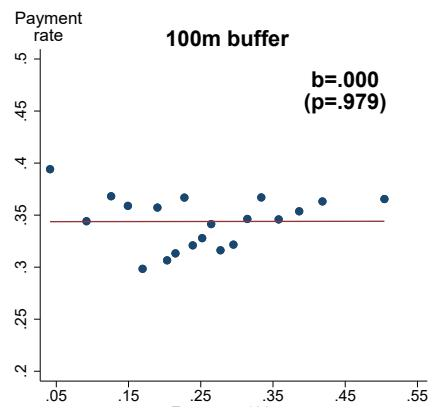

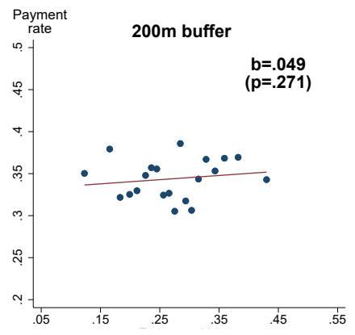

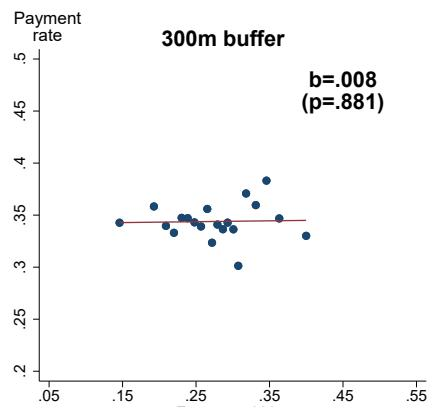

Notes: The top three panels illustrate the way we compute buffer zones around the centroid of each street-block using GIS tools in our data. We consider radiuses of 100 meters (left panel), 200 meters (middle panel), and 300 meters (right panel). The middle panel three figures show the distribution of accounts in pure control street-blocks according to their exposure to treated accounts. The bottom three panels show binned scatterplots of payment rates of the October 2020 bill (y-axis) in pure control blocks and their exposure to treated units within the buffer zone (x-axis). The x-axis is grouped into equally-sized bins. The coefficient and p-value of each regression are also reported in each panel. The regressions flexibly control for a cubic polynomial of the number of properties in the buffer zone. This variable is highly correlated with payment rates, and its omission leads to omitted variable bias.

Figure B.13: Payment rates and exposure of untreated blocks above and below median 2019 compliance, 100 meters buffer  
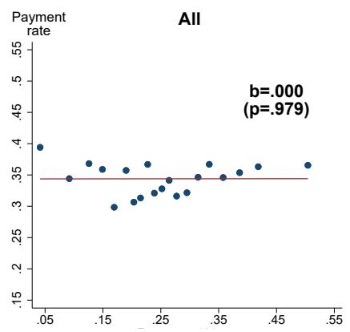

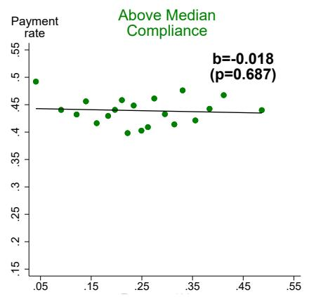

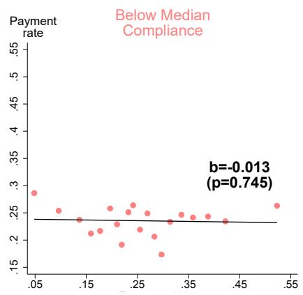  
Notes: This figure shows binned scatterplots of payment rates (y-axis) in pure control blocks by equally-sized bins of exposure to treated units within a buffer zone of 100 meters (x-axis). The left panel replicates the bottom left panel of Figure B.12. The middle and right panels split pure control blocks into blocks with above- and below-median compliance defined in 2019, respectively. The regressions flexibly control for a cubic polynomial of the number of properties in the buffer zone. This variable is highly correlated with payment rates, and its omission leads to omitted variable bias.

Figure B.14: Payment rates and exposure of untreated blocks and blocks with 80% treated units, 100 meters buffer  
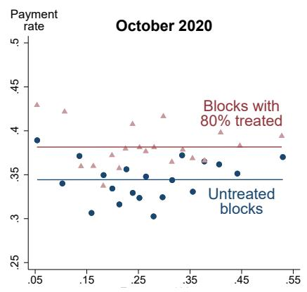

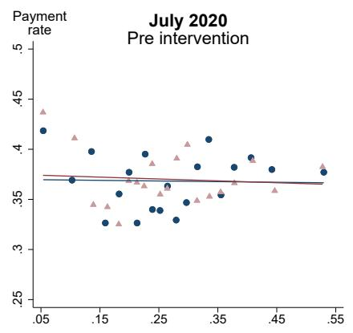

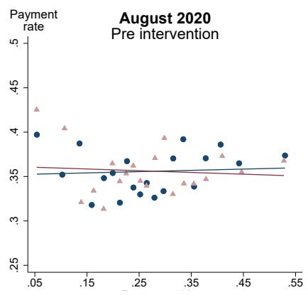  
Notes: This figure shows binned scatterplots of payment rates (y-axis) by equally-sized bins of exposure to treated units within a buffer zone of 100 meters (x-axis). The left panel shows the gradient in both untreated blocks (blue dots) and blocks with 80% treated units (red triangles) for the October 2020 bill (the one affected by the intervention). The middle and right panels correspond to the pre-intervention bills of July and August 2020, respectively. The regressions flexibly control for a cubic polynomial of the number of properties in the buffer zone. This variable is highly correlated with payment rates and its omission leads to omitted variable bias.

## B.4 Heterogeneity and Pre-treatment Tax Compliance

Section 4.4.2 analyzes heterogeneous effects based on pre-treatment tax compliance behavior in the year 2019. The distribution of the 68,806 accounts by the number of bills paid in 2019 is bi-modal, with a core group of neighbors not paying any bills (35%) and another group paying all of them (45%). Panel (a) of Figure B.15 shows the individual-level distribution. We define past compliance by computing the average number of payments of the twelve monthly bills for 2019 in each block. Panel (b) of Figure B.15 shows the block-level distribution. We use this measure to divide our sample into two groups – those above and those below the median block average payment rate.

The logic of this exercise goes as follows. A large fraction of neighbors who typically paid their bills stopped doing so during the pandemic in the first few months of 2020. This decrease in compliance was stronger in blocks that had higher compliance in 2019. Hence, we argue that such a core group of “good compliers” is more likely to be nudged to pay by our intervention, and where spillover effects are more likely to manifest.

Figure B.16 suggests that 2018 and 2019 are comparable in terms of compliance, but compliance decreased substantially in 2020 because of the pandemic—the sharp fall corresponds to the lockdown measures put in place. Figure B.17 shows that payment rates in 2020 decreased more in blocks with higher compliance in 2019. In contrast, 2018 and 2019 show similar levels of compliance. This set of figures thus helps us rationalize the reasoning behind the heterogeneity analysis presented in Section 4.4.2.

Table 2 confirms that spillover effects are driven by blocks with baseline compliance above the median in high saturation blocks (80% treated). Spillover effects are more muted and insignificant in medium (50% treated) and low (20% treated) saturation blocks, however. Reassuringly, the first two columns also show no effects for the pre-intervention bill of September 2020, either above or below the median.

Figure B.15: Distribution of bill payments in 2019 for individuals and blocks (a) Number of monthly bills paid in 2019 (by individuals)  
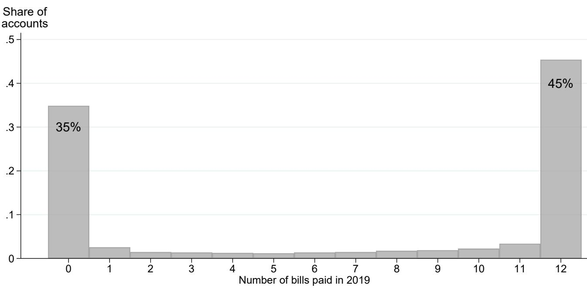

(b) Share of bills paid in 2019 (by blocks)  
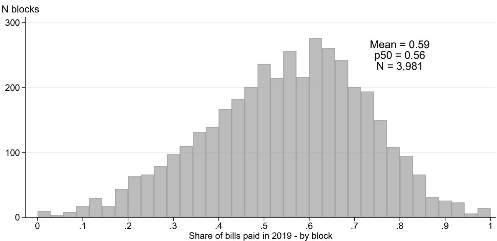  
Notes: Panel (a) shows the distribution of the 68,806 accounts by the number of bills paid in 2019. The distribution is bi-modal with a core group of neighbors not paying any bills (35%) and another group paying all of them (45%). Panel (b) uses the information from panel (a) to compute the share of total bills paid in 2019 for each block. We use this measure of block-level compliance for the heterogeneity analysis, to split our sample into blocks below and above the median of 0.56 (see Table 2). These two figures and values look very similar for the year 2018.

Figure B.16: Compliance in the first nine months of 2018, 2019, and 2020  
(a) 2018 vs 2019  
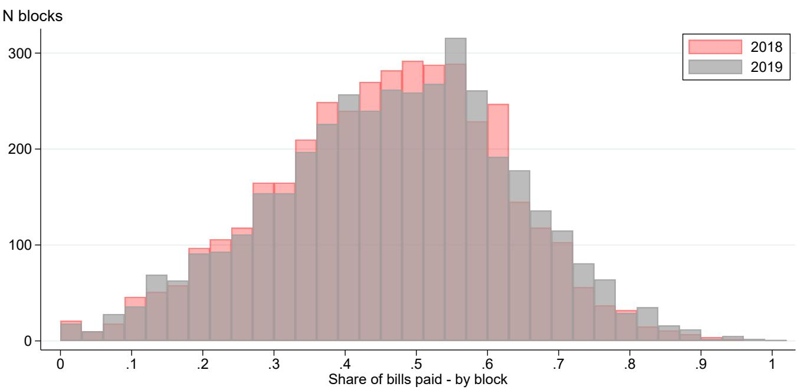

(b) 2019 vs 2020  
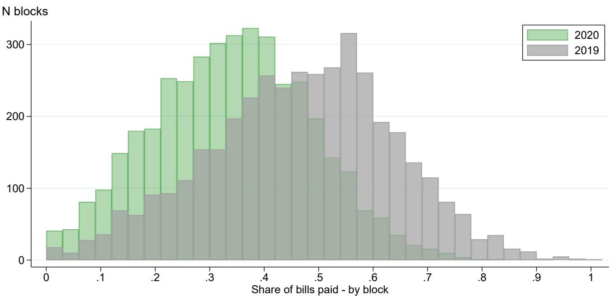  
Notes: These figures show compliance in the first 9 billing periods of the year. For each block, we compute the share of total bills paid out of 9. Panel (a) compares 2018 and 2019, and panel (b) compares 2019 and 2020. We restrict the analysis to the first 9 bills because our intervention takes place in October. To make it comparable, the numerator excludes overdue payments (i.e., payments made after the due date of each month). The figure suggests that 2018 and 2019 are comparable in terms of compliance and that compliance decreased substantially in 2020 because of the pandemic.

Figure B.17: Payment rates in 2020 decreased more in blocks with higher compliance in 2019  
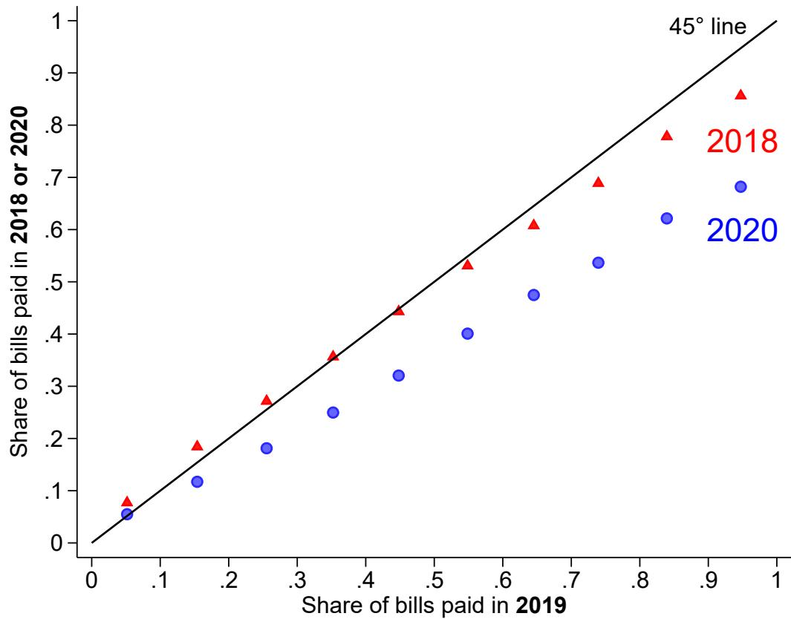  
Notes: This figure compares compliance in 2018 or 2020 (vertical axis) relative to 2019 (horizontal axis) at the block level. To that end, we split the sample of blocks into ten evenly-spaced groups using the share of payments in 2019 (horizontal axis). For each bin, we then compute the average share of payments in 2018, 2019, and 2020. The red triangles compare 2018 to 2019, and the blue circles compare 2020 to 2019. The $45^{\circ}$ line corresponds to the situation where compliance remains unchanged over time. The figure suggests that the drop in compliance in 2020 highlighted in Figure B.16 is more prominent for higher levels of baseline compliance. That is, blocks that had high compliance in 2019 are those where the payment rate decreased the most in the first nine months of 2020. In contrast, 2018 and 2019 display similar levels of compliance. This stylized fact suggests that blocks with high compliance in 2019 (and low compliance in 2020) are more likely to be nudged by our intervention and, thus, where spillovers are more likely to manifest.

## C Additional Numerical Illustration

Figure 1 summarizes the distribution of cluster sizes in five published studies employing partial population designs: Crépon et al. (2013), Giné and Mansuri (2018), Haushofer and Shapiro (2016), Ichino and Schündeln (2012) and Imai, Jiang and Malani (2021).

For this numerical illustration, we calculate the estimators standard errors and minimum detectable effects based on our formulas from Section 3 using the cluster size distribution of these four studies. We refer to these magnitudes as “adjusted” standard errors and MDEs, since they are adjusted for cluster size variation. For comparison, we also calculate the “unadjusted” standard errors and MDEs using average cluster size and assuming that the variance of group size is equal to zero, that is, ignoring cluster size heterogeneity. To make the results comparable, we use as a benchmark the design in our application to tax compliance, which has four saturations: $p_{0}=0$ , $p_{1}=0.2$ , $p_{2}=0.5$ , $p_{3}=0.8$ . We compute the optimal probabilities $\{q_{0}, q_{1}, q_{2}, q_{3}\}$ using Theorem 2. We assume for simplicity that outcomes are homoskedastic with $\sigma^{2}(dt, dt)=1$ for all d, t so that effects are measured in standard deviations, and consider four values for the intraclass correlation, $\rho\in\{0.1,0.2,0.5,0.8\}$ . The parameter of interest is the spillover effect on untreated units in groups with 80% treated.

Table A6: Numerical results

<table><tr><td rowspan="2"></td><td colspan="3">Standard error</td><td colspan="3">MDE</td></tr><tr><td>Adj.</td><td>Unadj.</td><td>Ratio</td><td>Adj.</td><td>Unadj.</td><td>Ratio</td></tr><tr><td colspan="7"> $\rho = 0.1$ </td></tr><tr><td>GM</td><td>0.1262</td><td>0.1181</td><td>1.0687</td><td>0.3536</td><td>0.3308</td><td>1.0689</td></tr><tr><td>HS</td><td>0.1053</td><td>0.0932</td><td>1.1307</td><td>0.2951</td><td>0.2610</td><td>1.1307</td></tr><tr><td>IS</td><td>0.1768</td><td>0.1667</td><td>1.0608</td><td>0.4954</td><td>0.4670</td><td>1.0608</td></tr><tr><td>IJM</td><td>0.0569</td><td>0.0497</td><td>1.1453</td><td>0.1595</td><td>0.1393</td><td>1.1450</td></tr><tr><td colspan="7"> $\rho = 0.5$ </td></tr><tr><td>GM</td><td>0.2593</td><td>0.2393</td><td>1.0835</td><td>0.7265</td><td>0.6705</td><td>1.0835</td></tr><tr><td>HS</td><td>0.2098</td><td>0.1783</td><td>1.1761</td><td>0.5877</td><td>0.4997</td><td>1.1761</td></tr><tr><td>IS</td><td>0.3437</td><td>0.3171</td><td>1.0840</td><td>0.9630</td><td>0.8884</td><td>1.0840</td></tr><tr><td>IJM</td><td>0.1136</td><td>0.0950</td><td>1.1961</td><td>0.3183</td><td>0.2661</td><td>1.1962</td></tr><tr><td colspan="7"> $\rho = 0.8$ </td></tr><tr><td>GM</td><td>0.3252</td><td>0.2997</td><td>1.0851</td><td>0.9112</td><td>0.8397</td><td>1.0851</td></tr><tr><td>HS</td><td>0.2622</td><td>0.2218</td><td>1.1818</td><td>0.7345</td><td>0.6215</td><td>1.1818</td></tr><tr><td>IS</td><td>0.4284</td><td>0.3941</td><td>1.0869</td><td>1.2002</td><td>1.1042</td><td>1.0869</td></tr><tr><td>IJM</td><td>0.1420</td><td>0.1181</td><td>1.2024</td><td>0.3979</td><td>0.3309</td><td>1.2025</td></tr></table>

The numerical results are shown in Table A6. When the intraclass correlation is low ( $\rho = 0.1$ ), accounting for cluster size heterogeneity increases standard errors and MDEs between 6.8% and 14.5%. The problem worsens for larger intraclass correlations. When $\rho = 0.5$ , adjusted standard errors and MDEs are between 8.3% and 19.6% larger, and between 8.5% and 20.2% larger when $\rho = 0.8$ .

## D Proofs

## D.1 Setup and Definitions

Following the notation in the paper, consider clusters $g = 1, \ldots, G$ with cluster size $n_{g}$ , units $i = 1, \ldots, n_{g}$ and total sample size $n = \sum_{g} n_{g}$ . The cluster-level treatment assignment is $T_{g} \in \{0, \ldots, M\}$ with $P[T_{g} = t] = q_{t}$ , and the individual-level treatment indicator $D_{ig}$ with $P[D_{ig} = d | T_{g} = t] = p_{g}(d | t)$ . Within each cluster, the total number of units receiving treatment $D_{ig} = d$ is $N_{g}^{d} = \sum_{i} \mathbb{1}(D_{ig} = d)$ , and conditional on $N_{g}^{d} > 0$ , the within-cluster average outcome under $D_{ig} = d$ is $\bar{Y}_{g}^{d} = \sum_{i=1}^{n_{g}} Y_{ig} \mathbb{1}(D_{ig} = d) / N_{g}^{d}$ .

Letting $\mathbb{1}_{ig}^{dt} = \mathbb{1}(D_{ig} = d, T_g = t)$ , $\mathbb{1}_{ig} = (\mathbb{1}_{ig}^{dt})_{(d,t)}'$ and $\mathbb{1}_g = (\mathbb{1}_{ig}', \ldots, \mathbb{1}_{n_g g}')'$ , the vector of OLS estimators for the sample means is:

$$
\hat {\boldsymbol {\mu}} _ {n} = \left(\sum_ {g} \mathbb {1} _ {g} ^ {\prime} \mathbb {1} _ {g}\right) ^ {- 1} \sum_ {g} \mathbb {1} _ {g} ^ {\prime} \mathbf {Y} _ {g} = (\mathbf {N}) ^ {- 1} \sum_ {g} \mathbb {1} _ {g} ^ {\prime} \mathbf {Y} _ {g}
$$

where $\mathbf{N} = diag(N(d,t))_{(d,t)}$ is a diagonal matrix with entries $N(d,t) = \sum_g\mathbb{1}_g^t N_g^d$ and where $\mathbb{1}_g^t = \mathbb{1}(T_g = t)$ .

Also define $\mathbb{E}[Y_{ig}|D_{ig} = d, T_g = t] = \mu_g(d, t)$ , $\mathbb{V}[Y_{ig}|D_{ig} = d, T_g = t] = \sigma_g^2(d, t)$ , $\mathbb{Cov}(Y_{ig}, Y_{jg}|D_{ig} = d, D_{jg} = d', T_g = t) = c_g(d, d', t)$ with $\mathbb{Cov}(Y_{ig}, Y_{jg}|D_{ig} = d, D_{jg} = d, T_g = t) = c_g(d, t)$ and similarly $\rho_g(d, d', t) = c_g(d, d', t) / (\sigma_g(d, t)\sigma_g(d', t))$ and $\rho_g(d, t) = \rho_g(d, d, t)$ . Finally, let $p_g(d, d'|t) = \mathbb{P}[D_{ig} = d, D_{jg} = d'|T_g = t]$ .

## D.2 Auxiliary Results

Lemma 1 (Convergence of Sample Sizes) Under Assumptions 1 and 3,

$$
\frac {\mathbf {N}}{n} \times \mathbb {E} \left[ \frac {\mathbf {N}}{n} \right] ^ {- 1} \rightarrow_ {\mathbb {P}} I _ {2 M + 1}, \quad \mathbb {E} \left[ \frac {\mathbf {N}}{n} \right] = d i a g \left(q _ {t} \sum_ {g} n _ {g} p _ {g} (d | t) / n\right) _ {(d, t)}.
$$

Proof. For any $(d,t)$ ,

$$
\begin{array}{l} \mathbb {V} \left[ \frac {1}{n} \sum_ {g} \mathbb {1} _ {g} ^ {t} N _ {g} ^ {d} \right] = \frac {1}{n ^ {2}} \sum_ {g} \mathbb {V} [ \mathbb {1} _ {g} ^ {t} N _ {g} ^ {d} ] = \frac {1}{n ^ {2}} \sum_ {g} \left\{\mathbb {V} \left[ \mathbb {1} _ {g} ^ {t} \mathbb {E} [ N _ {g} ^ {d} | T _ {g} ] \right] + \mathbb {E} \left[ \mathbb {1} _ {g} ^ {t} \mathbb {V} [ N _ {g} ^ {d} | T _ {g} ] \right] \right\} \\ = \frac {1}{n ^ {2}} \sum_ {g} \left\{n _ {g} ^ {2} p _ {g} (d | t) ^ {2} q _ {t} (1 - q _ {t}) + q _ {t} n _ {g} p _ {g} (d | t) (1 - p _ {g} (d | t)) + q _ {t} n _ {g} (n _ {g} - 1) \left(p _ {g} (d, d | t) - p _ {g} (d | t) ^ {2}\right) \right\} \\ = q _ {t} (1 - q _ {t}) \sum_ {g} \frac {n _ {g} ^ {2}}{n ^ {2}} p _ {g} (d, t) ^ {2} + q _ {t} \sum_ {g} \frac {n _ {g}}{n ^ {2}} p _ {g} (d | t) (1 - p _ {g} (d | t)) \\ + q _ {t} \sum_ {g} \frac {n _ {g} (n _ {g} - 1)}{n ^ {2}} \left(p _ {g} (d, d | t) - p _ {g} (d | t) ^ {2}\right) \\ = O \left(\frac {\sum_ {g} n _ {g} ^ {2}}{n ^ {2}}\right) = o (1). \end{array}
$$

since $\sum_{g} n_{g}^{2} / n^{2} \leq \max_{g} n_{g} / n \to 0$ . Therefore, by Markov's inequality,

$$
\begin{array}{r l} & {\mathbb {P} \left[ \left\| \frac {\mathbf {N}}{n} \times \mathbb {E} \left[ \frac {\mathbf {N}}{n} \right] ^ {- 1} - I _ {2 M + 1} \right\| > \varepsilon \right] = \mathbb {P} \left[ \sum_ {d, t} \left(\frac {N (d , t) / n}{\mathbb {E} [ N (d , t) / n ]} - 1\right) ^ {2} > \varepsilon^ {2} \right]} \\ & {\qquad \leq \sum_ {d, t} \mathbb {P} \left[ \left| \frac {1}{n} \sum_ {g} \mathbb {1} _ {g} ^ {t} N _ {g} ^ {d} - \mathbb {E} \left[ \frac {1}{n} \sum_ {g} \mathbb {1} _ {g} ^ {t} N _ {g} ^ {d} \right] \right| > \frac {\varepsilon}{\sqrt {2 M + 1}} \frac {\mathbb {E} [ N (d , t) ]}{n} \right]} \\ & {\qquad \leq \frac {(2 M + 1) ^ {2}}{\varepsilon^ {2}} \sum_ {d, t} \left(\frac {n}{q _ {t} \sum_ {g} n _ {g} p _ {g} (d | t)}\right) ^ {2} \mathbb {V} \left[ \frac {1}{n} \sum_ {g} \mathbb {1} _ {g} ^ {t} N _ {g} ^ {d} \right]} \\ & {\qquad \leq \frac {(2 M + 1) ^ {3}}{\varepsilon^ {2}} \cdot \frac {1}{c} \cdot \max _ {d, t} \mathbb {V} \left[ \frac {1}{n} \sum_ {g} \mathbb {1} _ {g} ^ {t} N _ {g} ^ {d} \right] \to 0} \end{array}
$$

using that $\sum_{g} n_{g} p_{g}(d|t) / n$ is bounded below. $\square$

Lemma 2 (Moments of $\bar{Y}_q^d$ ) Under Assumptions 1 and 2,

$$
\begin{array}{r l} & {\mathbb {1} _ {g} ^ {t} \mathbb {E} [ \bar {Y} _ {g} ^ {d} | T _ {g} = t, \mathbf {D} _ {g} ] = \mathbb {1} _ {g} ^ {t} \mu_ {g} (d, t)} \\ & {\mathbb {1} _ {g} ^ {t} \mathbb {V} [ \bar {Y} _ {g} ^ {d} | T _ {g} = t, \mathbf {D} _ {g} ] = \frac {\mathbb {1} _ {g} ^ {t}}{N _ {g} ^ {d}} \sigma_ {g} ^ {2} (d, t) + 2 c _ {g} (d, t) \mathbb {1} _ {g} ^ {t} \sum_ {i} \sum_ {j > i} \frac {\mathbb {1} _ {i g} ^ {d} \mathbb {1} _ {j g} ^ {d}}{(N _ {g} ^ {d}) ^ {2}}} \\ & {\mathbb {E} \left[ \mathbb {1} _ {g} ^ {t} (N _ {g} ^ {d}) ^ {2} \mathbb {V} [ \bar {Y} _ {g} ^ {d} | T _ {g} = t, \mathbf {D} _ {g} ] \right] = \sigma_ {g} ^ {2} (d, t) q _ {t} n _ {g} p _ {g} (d | t) + c _ {g} (d, t) n _ {g} (n _ {g} - 1) q _ {t} p _ {g} (d, d | t).} \end{array}
$$

Proof. By direct calculation, letting $\mathbb{1}_{ig}^{d} = \mathbb{1}(D_{ig} = d)$ ,

$$
\begin{array}{r l} & {\mathbb {1} _ {g} ^ {t} \mathbb {E} [ \bar {Y} _ {g} ^ {d} | T _ {g} = t, \mathbf {D} _ {g} ] = \mathbb {1} _ {g} ^ {t} \mathbb {E} \left[ \frac {1}{N _ {g} ^ {d}} \sum_ {i} Y _ {i g} \mathbb {1} _ {i g} ^ {d} \bigg | T _ {g} = t, \mathbf {D} _ {g} \right] = \frac {\mathbb {1} _ {g} ^ {t}}{N _ {g} ^ {d}} \sum_ {i} \mathbb {E} [ Y _ {i g} | T _ {g} = t, \mathbf {D} _ {g} ] \mathbb {1} _ {i g} ^ {d}} \\ & {\qquad = \mathbb {1} _ {g} ^ {t} \mu_ {g} (d, t)} \end{array}
$$

where the last equality follows from Assumption 2. Similarly,

$$
\begin{array}{r l} & {\mathbb {1} _ {g} ^ {t} \mathbb {V} [ \bar {Y} _ {g} ^ {d} | T _ {g} = t, \mathbf {D} _ {g} ] = \frac {\mathbb {1} _ {g} ^ {t}}{(N _ {g} ^ {d}) ^ {2}} \left\{\sum_ {i} \mathbb {V} [ Y _ {i g} | T _ {g} = t, D _ {i g} = d ] \mathbb {1} _ {i g} ^ {d} + 2 \sum_ {i} \sum_ {j > i} \mathbb {1} _ {i g} ^ {d} \mathbb {1} _ {j g} ^ {d} \mathbb {C o v} (Y _ {i g}, Y _ {j g} | D _ {i g} = d, D _ {j g} = d) \right\}} \\ & {\qquad = \frac {\mathbb {1} _ {g} ^ {t}}{N _ {g} ^ {d}} \sigma_ {g} ^ {2} (d, t) + 2 \mathbb {1} _ {g} ^ {t} c _ {g} (d, t) \sum_ {i} \sum_ {j > i} \frac {\mathbb {1} _ {i g} ^ {d} \mathbb {1} _ {j g} ^ {d}}{(N _ {g} ^ {d}) ^ {2}}} \end{array}
$$

and the third expression follows from taking expectation. □

Lemma 3 (Convergence of squared sums) Given a vector of random variables $\mathbf{X}_g = (X_{1g},\dots ,X_{n_gg})'$ and $(\mathbf{X}_g)_{g = 1}^G$ , let $X_{g} = \sum_{i = 1}^{n_{g}}X_{ig}$ and define $T_{n} = \frac{1}{n}\sum_{g}X_{g}^{2}$ . Suppose that: (i) $(\mathbf{X}_g)_{g = 1}^{G}$ are independent across $g$ ; (ii) Assumption 3(i) holds; (iii) For some $\ell >r$ , $\sup_{i,g}\mathbb{E}\left[|X_{ig}|^\ell \right] < \infty$ . Then $|T_n / \mathbb{E}[T_n] - 1|\to_{\mathbb{P}}0$ .

Proof. This proof follows those of Theorems 2 and 3 in Hansen and Lee (2019). Write

$$
\frac {T _ {n}}{\mathbb {E} [ T _ {n} ]} = \frac {1}{n} \sum_ {g} \frac {X _ {g} ^ {2}}{\mathbb {E} \left[ \frac {1}{n} \sum_ {g} X _ {g} ^ {2} \right]} = \frac {1}{n} \sum_ {g} Z _ {g} ^ {2}, \quad Z _ {i g} := \frac {X _ {i g}}{\mathbb {E} [ T _ {n} ] ^ {1 / 2}}, \quad Z _ {g} := \sum_ {i = 1} ^ {n _ {g}} Z _ {i g}.
$$

Fix $\varepsilon > 0$ . We show that for $n$ large enough, $\mathbb{E}\left[|T_n / \mathbb{E}[T_n] - 1|\right] < \varepsilon$ and the result follows by Markov's inequality. Set $\delta = \varepsilon^2 / 4$ . Then, using that:

$$
\mathbb {E} \left[ \frac {1}{n} \sum_ {g} Z _ {g} ^ {2} \right] = 1 = \frac {1}{n} \sum_ {g} \mathbb {E} [ Z _ {g} ^ {2} \mathbb {1} (Z _ {g} ^ {2} > n \delta) ] + \frac {1}{n} \sum_ {g} \mathbb {E} [ Z _ {g} ^ {2} \mathbb {1} (Z _ {g} ^ {2} \leq n \delta) ]
$$

we have:

$$
\begin{array}{r} \mathbb {E} \left[ \left| \frac {T _ {n}}{\mathbb {E} [ T _ {n} ]} - 1 \right| \right] \leq \mathbb {E} \left[ \left| \frac {1}{n} \sum_ {g} \left(Z _ {g} ^ {2} \mathbb {1} (Z _ {g} ^ {2} > n \delta) - \mathbb {E} [ Z _ {g} ^ {2} \mathbb {1} (Z _ {g} ^ {2} > n \delta) ]\right) \right| \right] \\ + \mathbb {E} \left[ \left| \frac {1}{n} \sum_ {g} \left(Z _ {g} ^ {2} \mathbb {1} (Z _ {g} ^ {2} \leq n \delta) - \mathbb {E} [ Z _ {g} ^ {2} \mathbb {1} (Z _ {g} ^ {2} \leq n \delta) ]\right) \right| \right]. \end{array}
$$

and by the triangle inequality,

$$
\begin{array}{l} \mathbb {E} \left[ \left| \frac {T _ {n}}{\mathbb {E} [ T _ {n} ]} - 1 \right| \right] \leq \frac {2}{n} \sum_ {g} \mathbb {E} [ Z _ {g} ^ {2} \mathbb {1} (Z _ {g} ^ {2} > n \delta) ] \\ \qquad + \frac {1}{n} \mathbb {E} \left[ \left| \sum_ {g} \big (Z _ {g} ^ {2} \mathbb {1} (Z _ {g} ^ {2} \leq n \delta) - \mathbb {E} [ Z _ {g} ^ {2} \mathbb {1} (Z _ {g} ^ {2} \leq n \delta) ] \big) \right| \right]. \end{array}\tag{13}
$$

(14)

Consider the term (13). For $r \geq 2$ ,

$$
\begin{array}{r l}&{\frac {1}{n} \sum_ {g} \mathbb {E} [ Z _ {g} ^ {2} \mathbb {1} (Z _ {g} ^ {2} > n \delta) ] = \frac {1}{n} \sum_ {g} \mathbb {E} \left[ \frac {| Z _ {g} | ^ {r}}{| Z _ {g} | ^ {r - 2}} \mathbb {1} \left(| Z _ {g} | ^ {r - 2} > (n \delta) ^ {r / 2 - 1}\right) \right]}\\&{\qquad \leq \frac {1}{n (n \delta) ^ {r / 2 - 1}} \sum_ {g} \mathbb {E} \left[ | Z _ {g} | ^ {r} \mathbb {1} \left(| Z _ {g} | > (n \delta) ^ {1 / 2}\right) \right]}\\&{\qquad \leq \frac {1}{n ^ {r / 2} \delta^ {r / 2 - 1}} \sum_ {g} n _ {g} ^ {r} \mathbb {E} \left[ \left| \frac {Z _ {g}}{n _ {g}} \right| ^ {r} \mathbb {1} \left(\left| \frac {Z _ {g}}{n _ {g}} \right| > \frac {(n \delta) ^ {1 / 2}}{n _ {g}}\right) \right]}\\&{\qquad \leq \frac {1}{n ^ {r / 2} \delta^ {r / 2 - 1}} \sum_ {g} n _ {g} ^ {r} \mathbb {E} \left[ \left| \frac {Z _ {g}}{n _ {g}} \right| ^ {r} \mathbb {1} \left(\left| \frac {\mathit {Z} _ {g}}{n _ {g}} \right| > \left(\frac {\mathit {Z} _ {g}}{\max _ {g} n _ {g} ^ {2}}\right) ^ {1 / 2} \delta^ {1 / 2}\right) \right]}\\&{\qquad \leq \frac {1}{\delta^ {r / 2 - 1}} \cdot \frac {\sum_ {g} n _ {g} ^ {r}}{n ^ {r / 2}} \sup _ {g} \mathbb {E} \left[ \right.\left| \frac {\mathit {Z} _ {g}}{n _ {g}} \right| ^ {r} \mathbb {1} \left(\left| \frac {\mathit {Z} _ {g}}{n _ {g}} \right| > \left(\frac {\mathit {Z} _ {g}}{\max _ {g} n _ {g} ^ {2}}\right) ^ {1 / 2} \delta^ {1 / 2}\right),}\\&{\qquad \leq \frac {\mathit {C} ^ {r / 2}}{\delta^ {r / 2 - 1}} \sup _ {g} \mathbb {E} \left[ \left| \frac {\mathit {Z} _ {g}}{n _ {g}} \right| ^ {r} \mathbb {1} \left(\left| \frac {\mathit {Z} _ {g}}{n _ {g}} \right| > \left(\frac {\mathit {Z} _ {g}}{\max _ {g} n _ {\mathrm{的}} ^ {2}}\right) ^ {1 / 2} \delta^ {1 / 2}\right) \right]}\end{array}
$$

where the last equality follows from Assumption 3(i). Now, by Condition (iii), for $\ell > r$ ,

$$
\sup _ {i, g} \mathbb {E} \left[ | Z _ {i g} | ^ {\ell} \right] = \frac {\sup _ {i , g} \mathbb {E} \left[ | X _ {i g} | ^ {\ell} \right]}{\mathbb {E} [ T _ {n} ] ^ {l / 2}} <   \infty .
$$

Thus by Lemma 1 in Hansen and Lee (2019), there is a $B$ large enough such that:

$$
\sup _ {g} \mathbb {E} \left[ \left| \frac {Z _ {g}}{n _ {g}} \right| ^ {r} \mathbb {1} \left(\left| \frac {Z _ {g}}{n _ {g}} \right| > B\right) \right] \leq \frac {\varepsilon \delta^ {r / 2 - 1}}{2 C ^ {r / 2}}
$$

and by Assumption 3(i) there is an n large enough such that:

$$
B \leq \left(\frac {n}{\max _ {g} n _ {g} ^ {2}}\right) ^ {1 / 2} \delta^ {1 / 2},
$$

from which:

$$
\sup _ {g} \mathbb {E} \left[ \left| \frac {Z _ {g}}{n _ {g}} \right| ^ {r} \mathbb {1} \left(\left| \frac {Z _ {g}}{n _ {g}} \right| > \left(\frac {n}{\max _ {g} n _ {g} ^ {2}}\right) ^ {1 / 2} \delta^ {1 / 2}\right) \right] \leq \frac {\varepsilon \delta^ {r / 2 - 1}}{2 C ^ {r / 2}}.
$$

Therefore,

$$
\frac {1}{n} \sum_ {g} \mathbb {E} [ Z _ {g} ^ {2} \mathbb {1} (Z _ {g} ^ {2} > n \delta) ] \leq \frac {\varepsilon}{2}.
$$

Next, consider the term (14). We have that:

$$
\begin{array}{l} \frac {1}{n} \mathbb {E} \left[ \left| \sum_ {g} \big (Z _ {g} ^ {2} \mathbb {1} (Z _ {g} ^ {2} \leq n \delta) - \mathbb {E} [ Z _ {g} ^ {2} \mathbb {1} (Z _ {g} ^ {2} \leq n \delta) ] \big) \right| \right] \leq \frac {1}{n} \mathbb {E} \left[ \left(\sum_ {g} \big (Z _ {g} ^ {2} \mathbb {1} (Z _ {g} ^ {2} \leq n \delta) - \mathbb {E} [ Z _ {g} ^ {2} \mathbb {1} (Z _ {g} ^ {2} \leq n \delta) ] \big)\right) ^ {2} \right] ^ {1 / 2} \\ = \frac {1}{n} \mathbb {V} \left[ \sum_ {g} Z _ {g} ^ {2} \mathbb {1} (Z _ {g} ^ {2} \leq n \delta) \right] ^ {1 / 2} \\ = \frac {1}{n} \left(\sum_ {g} \mathbb {E} \left[ \big (Z _ {g} ^ {2} \mathbb {1} (Z _ {g} ^ {2} \leq n \delta) - \mathbb {E} [ Z _ {g} ^ {2} \mathbb {1} (Z _ {g} ^ {2} \leq n \delta) ] \big) ^ {2} \right]\right) ^ {1 / 2} \\ \leq \frac {1}{n} \left(\sum_ {g} \mathbb {E} \left[ Z _ {g} ^ {4} \mathbb {1} (Z _ {g} ^ {2} \leq n \delta) \right]\right) ^ {1 / 2} \end{array}
$$

where the first line uses Jensen's inequality, the second line uses the definition of variance, the third line uses the fact that clusters are independent and the fourth line uses that for any random variable $A$ , $\mathbb{V}[W] \leq \mathbb{E}[W^2]$ . Next, use that $Z_g^4\mathbb{1}(Z_g^2 \leq n\delta) = (Z_g^2\mathbb{1}(Z_g^2 \leq n\delta)) (Z_g^2\mathbb{1}(Z_g^2 \leq n\delta)) \leq n\delta Z_g^2$ and thus

$$
\frac {1}{n} \left(\sum_ {g} \mathbb {E} \left[ Z _ {g} ^ {4} \mathbb {1} (Z _ {g} ^ {2} \leq n \delta) \right]\right) ^ {1 / 2} \leq \delta^ {1 / 2} \left(\frac {1}{n} \sum_ {g} \mathbb {E} [ Z _ {g} ^ {2} ]\right) ^ {1 / 2} \leq \delta^ {1 / 2} = \frac {\varepsilon}{2}
$$

since $\sum_{g}\mathbb{E}[Z_{g}^{2}] / n = 1$ . Collecting these results,

$$
\mathbb {E} \left[ \left| \frac {T _ {n}}{\mathbb {E} [ T _ {n} ]} - 1 \right| \right] \leq \varepsilon
$$

as required. □

## D.3 Proof of Theorem 1

For any $(d,t)$ ,

$$
\begin{array}{c} \hat {\mu} (d, t) - \mu_ {n} ^ {p} (d, t) = \frac {\sum_ {g} \mathbb {1} _ {g} ^ {t} N _ {g} ^ {d} (\bar {Y} _ {g} ^ {d} - \mu_ {n} ^ {p} (d , t))}{N (d , t)} \\ = \frac {\sum_ {g} \mathbb {1} _ {g} ^ {t} N _ {g} ^ {d} (\bar {Y} _ {g} ^ {d} - \mu_ {g} (d , t))}{N (d , t)} + \frac {\sum_ {g} (\mathbb {1} _ {g} ^ {t} N _ {g} ^ {d} - q _ {t} n _ {g} p _ {g} (d | t)) (\mu_ {g} (d , t) - \mu_ {n} ^ {p} (d , t))}{N (d , t)} \end{array}
$$

where the second equality uses that:

$$
\sum_ {g} q _ {t} n _ {g} p _ {g} (d | t) (\mu_ {g} (d, t) - \mu_ {n} ^ {p} (d, t)) = q _ {t} \left(\sum_ {g} n _ {g} p _ {g} (d | t) \mu_ {g} (d, t) - \mu_ {n} ^ {p} (d, t) \sum_ {g} n _ {g} p _ {g} (d | t)\right) = 0.
$$

Next,

$$
\begin{array}{r l} & {\hat {\mu} (d, t) - \mu_ {n} ^ {p} (d, t) = \frac {\sum_ {g} \mathbb {1} _ {g} ^ {t} N _ {g} ^ {d} (\bar {Y} _ {g} ^ {d} - \mu_ {g} (d , t))}{N (d , t)} + \frac {\sum_ {g} (\mathbb {1} _ {g} ^ {t} N _ {g} ^ {d} - q _ {t} n _ {g} p _ {g} (d | t)) (\mu_ {g} (d , t) - \mu_ {n} ^ {p} (d , t))}{N (d , t)}} \\ & {\qquad = \frac {\mathbb {E} [ N (d , t) ]}{N (d , t)} \cdot \frac {1}{n} \sum_ {g} \frac {\mathbb {1} _ {g} ^ {t} N _ {g} ^ {d} (\bar {Y} _ {g} ^ {d} - \mu_ {g} (d , t)) + (\mathbb {1} _ {g} ^ {t} N _ {g} ^ {d} - q _ {t} n _ {g} p _ {g} (d | t)) (\mu_ {g} (d , t) - \mu_ {n} ^ {p} (d , t))}{q _ {t} \sum_ {g} n _ {g} p _ {g} (d | t) / n}} \\ & {\qquad = \frac {\mathbb {E} [ N (d , t) ]}{N (d , t)} \cdot \frac {1}{n} \sum_ {g} \psi_ {g} (d, t)} \end{array}
$$

where

$$
\psi_ {g} (d, t) = \frac {\mathbb {1} _ {g} ^ {t} N _ {g} ^ {d} (\bar {Y} _ {g} ^ {d} - \mu_ {g} (d , t)) + (\mathbb {1} _ {g} ^ {t} N _ {g} ^ {d} - q _ {t} n _ {g} p _ {g} (d | t)) (\mu_ {g} (d , t) - \mu_ {n} ^ {p} (d , t))}{q _ {t} \bar {p} _ {n} (d | t)}, \quad \mathbb {E} [ \psi_ {g} (d, t) ] = 0
$$

with $\bar{p}_n(d|t) = \sum_g n_g p_g(d|t) / n$ and

$$
\begin{array}{l} \mathbb {V} [ \psi_ {g} (d, t) ] = \frac {1}{q _ {t} ^ {2} \bar {p} _ {n} (d | t) ^ {2}} \left\{\mathbb {E} \left[ \mathbb {1} _ {g} ^ {t} (N _ {g} ^ {d}) ^ {2} \mathbb {V} [ \bar {Y} _ {g} ^ {d} | T _ {g} = t, \mathbf {D} _ {g} ] \right] + (\mu_ {g} (d, t) - \mu_ {n} ^ {p} (d, t)) ^ {2} \mathbb {V} [ \mathbb {1} _ {g} ^ {t} N _ {g} ^ {d} ] \right\} \\ \quad + \frac {2}{q _ {t} ^ {2} \bar {p} _ {n} (d | t) ^ {2}} (\mu_ {g} (d, t) - \mu_ {n} ^ {p} (d, t)) \mathbb {C o v} (\mathbb {1} _ {g} ^ {t} N _ {g} ^ {d} (\bar {Y} _ {g} ^ {d} - \mu_ {g} (d, t)), \mathbb {1} _ {g} ^ {t} N _ {g} ^ {d}) \\ \quad = \frac {1}{q _ {t} ^ {2} \bar {p} _ {n} (d | t) ^ {2}} \left\{\sigma_ {g} ^ {2} (d, t) q _ {t} n _ {g} p _ {g} (d | t) + c _ {g} (d, t) n _ {g} (n _ {g} - 1) q _ {t} p _ {g} (d, d | t) \right\} \\ \quad + \frac {\left(\mu_ {g} (d , t) - \mu_ {n} ^ {p} (d , t)\right) ^ {2}}{q _ {t} ^ {2} \bar {p} _ {n} (d | t) ^ {2}} \left\{q _ {t} (1 - q _ {t}) n _ {g} ^ {2} p _ {g} (d | t) ^ {2} + q _ {t} n _ {g} p _ {g} (d | t) (1 - p _ {g} (d | t)) \right\} \\ \quad + \frac {\left(\mu_ {g} (d , t) - \mu_ {n} ^ {p} (d , t)\right) ^ {2}}{q _ {t} ^ {2} \bar {p} _ {n} (d | t) ^ {2}} \left\{q _ {t} n _ {g} (n _ {g} - 1) \left(p _ {g} (d, d | t) - p _ {g} (d | t) ^ {2}\right) \right\}. \end{array}
$$

From this,

$$
\begin{array}{r l} & {\mathbb {V} \left[ \frac {1}{n} \sum_ {g} \psi_ {g} (d, t) \right] = \frac {1}{n ^ {2}} \sum_ {g} \mathbb {V} [ \psi_ {g} (d, t) ]} \\ & {\quad = \frac {1}{q _ {t} ^ {2} \bar {p} _ {n} (d | t) ^ {2}} \sum_ {g} \frac {n _ {g}}{n ^ {2}} \sigma_ {g} ^ {2} (d, t) q _ {t} p _ {g} (d | t)} \\ & {\quad + \frac {1}{q _ {t} ^ {2} \bar {p} _ {n} (d | t) ^ {2}} \sum_ {g} \frac {n _ {g} (n _ {g} - 1)}{n ^ {2}} c _ {g} (d, t) q _ {t} p _ {g} (d, d | t)} \\ & {\quad + \frac {q _ {t} (1 - q _ {t})}{q _ {t} ^ {2} \bar {p} _ {n} (d | t) ^ {2}} \sum_ {g} \frac {n _ {g} ^ {2}}{n ^ {2}} p _ {g} (d | t) ^ {2} (\mu_ {g} (d, t) - \mu_ {n} ^ {p} (d, t)) ^ {2}} \\ & {\quad + \frac {q _ {t}}{q _ {t} ^ {2} \bar {p} _ {n} (d | t) ^ {2}} \sum_ {g} \frac {n _ {g}}{n ^ {2}} p _ {g} (d | t) (1 - p _ {g} (d | t)) (\mu_ {g} (d, t) - \mu_ {n} ^ {p} (d, t)) ^ {2}} \\ & {\quad + \frac {q _ {t}}{q _ {t} ^ {2} \bar {p} _ {n} (d | t) ^ {2}} \sum_ {g} \frac {n _ {g} (n _ {g} - 1)}{n ^ {2}} \left(p _ {g} (d, d | t) - p _ {g} (d | t) ^ {2}\right) (\mu_ {g} (d, t) - \mu_ {n} ^ {p} (d, t)) ^ {2}} \\ & {\quad = O \left(\frac {\sum_ {g} n _ {g} ^ {2}}{n ^ {2}}\right) = o (1)} \end{array}
$$

since $\sigma_g^2 (d,t)$ and $|\mu_g(d,t) - \mu_n(d,t)|$ are bounded by Assumption 3, $\bar{p}_n(d|t)$ is bounded from below and $\max_g n_g / n\to 0$ . This implies that:

$$
| \hat {\mu} (d, t) - \mu_ {n} ^ {p} (d, t) | \to_ {\mathbb {P}} 0
$$

for all $(d,t)$ , which gives the consistency result. Next, stack the elements $\psi_g(d,t)$ in a vector $\psi_g$ and note that

$$
\Omega_ {n} = \mathbb {V} \left[ \frac {1}{\sqrt {n}} \sum_ {g} \psi_ {g} \right] = \frac {1}{n} \sum_ {g} \mathbb {E} [ \psi_ {g} \psi_ {g} ^ {\prime} ]
$$

where

$$
\begin{array}{r l r} & & {\frac {1}{n} \sum_ {g} \mathbb {E} [ \psi_ {g} (d, t) ^ {2} ] = \frac {n}{q _ {t} (\sum_ {g} n _ {g} p _ {g} (d | t)) ^ {2}} \sum_ {g} \left\{n _ {g} \sigma_ {g} ^ {2} (d, t) p _ {g} (d | t) (1 + \rho_ {g} (d, t) (n _ {g} - 1) \frac {p _ {g} (d , d | t)}{p _ {g} (d | t)}) \right.} \\ & & {\left. + n _ {g} (\mu_ {g} (d, t) - \mu_ {n} ^ {p} (d, t)) ^ {2} (n _ {g} (1 - q _ {t}) p _ {g} (d | t) ^ {2} + p _ {g} (d | t) (1 - p _ {g} (d | t))) \right.} \\ & & {\left. + (n _ {g} - 1) \mathbb {C o v} (\mathbb {1} _ {i g} ^ {d}, \mathbb {1} _ {j g} ^ {d} | T _ {g} = t)\right) \Big \},} \\ & & {\frac {1}{n} \sum_ {g} \mathbb {E} [ \psi_ {g} (d, t) \psi_ {g} (d ^ {\prime}, t) ] = \frac {n \sum_ {g} c _ {g} (d , d ^ {\prime} , t) n _ {g} p _ {g} (d , d ^ {\prime} | t)}{q _ {t} (\sum_ {g} n _ {g} p _ {g} (d | t)) (\sum_ {g} n _ {g} p _ {g} (d ^ {\prime} | t))}} \\ & & {\left. + \frac {n \sum_ {g} (\mu_ {g} (d , t) - \mu_ {n} ^ {p} (d , t)) (\mu_ {g} (d ^ {\prime} , t) - \mu_ {n} ^ {p} (d ^ {\prime} , t)) \mathbb {C o v} (\mathbb {1} _ {g} ^ {t} N _ {g} ^ {d} , \mathbb {1} _ {g} ^ {t} N _ {g} ^ {d ^ {\prime}})}{q _ {t} (\sum_ {g} n _ {g} p _ {g} (d | t)) (\sum_ {g} n _ {g} p _ {g} (d ^ {\prime} | t))}, \right.} \\ & & {\frac {1}{n} \sum_ {g} \mathbb {E} [ \psi_ {g} (d, t) \psi_ {g} (d ^ {\prime}, t ^ {\prime}) ] = - \frac {n \sum_ {g} n _ {g} ^ {2} p _ {g} (d | t) p _ {g} (d ^ {\prime} | t ^ {\prime}) (\mu_ {g} (d , t) - \mu_ {n} ^ {p} (d , t)) (\mu_ {g} (d ^ {\prime} , t ^ {\prime}) - \mu_ {n} ^ {p} (d ^ {\prime} , t ^ {\prime}))}{(\sum_ {g} n _ {g} p _ {g} (d | t)) (\sum_ {g} n _ {g} p _ {g} (d ^ {\prime} | t ^ {\prime}))}.} \end{array}
$$

and this variance matrix is invertible because its minimum eigenvalue is bounded below by assumption. Finally, write

$$
\frac {1}{n} \sum_ {g} \psi_ {g} (d, t) = \frac {1}{n} \sum_ {g} \sum_ {i} \psi_ {i g} (d, t)
$$

where

$$
\psi_ {i g} (d, t) = \frac {1}{q _ {t} \bar {p} _ {n} (d | t)} \left\{\mathbb {1} _ {g} ^ {t} \mathbb {1} _ {i g} ^ {d} (Y _ {i g} - \mu_ {g} (d, t)) + \left(\frac {\mathbb {1} _ {g} ^ {t} \mathbb {1} _ {i g} ^ {d}}{n _ {g}} - q _ {t} p _ {g} (d | t)\right) (\mu_ {g} (d, t) - \mu_ {n} ^ {p} (d, t)) \right\}.
$$

Then we have that for $\ell > r \geq 2$ ,

$$
\mathbb {E} \left[ | \psi_ {i g} (d, t) | ^ {\ell} \right] ^ {1 / \ell} \leq \frac {1}{q _ {t} ^ {\ell} c ^ {\ell}} \left(\mathbb {E} \left[ | Y _ {i g} - \mu_ {g} (d, t) | ^ {\ell} \right] ^ {1 / \ell} + | \mu_ {g} (d, t) - \mu_ {n} ^ {p} (d, t) | ^ {1 / \ell}\right) <   \infty
$$

uniformly over $i, g, d, t$ since as moments are uniformly bounded and using Minkowski's inequality and Assumption 3. Thus,

$$
\sup _ {i, g} \mathbb {E} [ \| \psi_ {i g} \| ^ {\ell} ] \leq (2 M + 1) ^ {\ell / 2} \sup _ {i, g, d, t} \mathbb {E} [ | \psi_ {i g} (d, t) | ^ {\ell} ] <   \infty
$$

and by Theorem 2 in Hansen and Lee (2019),

$$
\Omega_ {n} ^ {- 1 / 2} \frac {1}{\sqrt {n}} \sum_ {g} \psi_ {g} \rightarrow_ {\mathcal {D}} \mathcal {N} (0, I _ {(2 M + 1)}).
$$

To complete the proof, notice that by Lemma 1 and the Slutsky theorem:

$$
\Omega_ {n} ^ {- 1 / 2} \sqrt {n} (\hat {\pmb {\mu}} _ {n} - \hat {\pmb {\mu}} _ {n} ^ {p}) = \mathbf {N} ^ {- 1} \mathbb {E} [ \mathbf {N} ] \Omega_ {n} ^ {- 1 / 2} \frac {1}{\sqrt {n}} \sum_ {g} \psi_ {g} = \Omega_ {n} ^ {- 1 / 2} \frac {1}{\sqrt {n}} \sum_ {g} \psi_ {g} + o _ {\mathbb {P}} (1) \to_ {\mathcal {D}} \mathcal {N} (0, I _ {(2 M + 1)})
$$

as required. □

## D.4 Proof of Proposition 1

By Equation (7),

$$
\begin{array}{c} \hat {\Omega} _ {\mathbf {c r}} (d, t) = n \frac {\sum_ {g} \mathbb {1} _ {g} ^ {t} (N _ {g} ^ {d}) ^ {2} (\bar {Y} _ {g} ^ {d} - \hat {\mu} (d , t)) ^ {2}}{N (d , t) ^ {2}} \\ \hat {\Omega} _ {\mathbf {c r}} ((d, t), (d ^ {\prime}, t ^ {\prime})) = n \frac {\sum_ {g} \mathbb {1} _ {g} ^ {t} \mathbb {1} _ {g} ^ {t ^ {\prime}} \left(\sum_ {i} \mathbb {1} _ {i g} ^ {d} (Y _ {i g} - \hat {\mu} (d , t))\right) \left(\sum_ {i} \mathbb {1} _ {i g} ^ {d ^ {\prime}} (Y _ {i g} - \hat {\mu} (d ^ {\prime} , t ^ {\prime}))\right)}{N (d , t) N (d ^ {\prime} , t ^ {\prime})} \end{array}
$$

and notice that $\hat{\Omega}_{\mathrm{cr}}(d,t,d't') = 0$ for $t\neq t'$ . For the main diagonal terms, recall that:

$$
\Omega_ {n} (d, t) = \frac {1}{n q _ {t} ^ {2} \bar {p} _ {n} (d | t) ^ {2}} \sum_ {g} \left\{\mathbb {E} \left[ \mathbb {1} _ {g} ^ {t} (N _ {g} ^ {d}) ^ {2} \mathbb {V} [ \bar {Y} _ {g} ^ {d} | T _ {g}, \mathbf {D} _ {g} ] \right] + (\mu_ {g} (d, t) - \mu_ {n} (d, t)) ^ {2} \mathbb {V} [ \mathbb {1} _ {g} ^ {t} N _ {g} ^ {d} ] \right\}.
$$

Adding and subtracting $\mu_{n}^{p}(d,t)$ and expanding the square, the variance estimator is:

$$
\begin{array}{r l} & {\hat {\Omega} _ {\mathbf {c r}} (d, t) = \left(\frac {n}{N (d , t)}\right) ^ {2} \Bigg \{\frac {1}{n} \sum_ {g} \mathbb {1} _ {g} ^ {t} (N _ {g} ^ {d}) ^ {2} (\bar {Y} _ {g} ^ {d} - \mu_ {n} ^ {p} (d, t)) ^ {2}} \\ & {\qquad + (\mu_ {n} ^ {p} (d, t) - \hat {\mu} (d, t)) ^ {2} \frac {1}{n} \sum_ {g} \mathbb {1} _ {g} ^ {t} (N _ {g} ^ {d}) ^ {2}} \\ & {\qquad + 2 (\mu_ {n} ^ {p} (d, t) - \hat {\mu} (d, t)) \frac {1}{n} \sum_ {g} \mathbb {1} _ {g} ^ {t} (N _ {g} ^ {d}) ^ {2} (\bar {Y} _ {g} ^ {d} - \mu_ {n} ^ {p} (d, t)) \Bigg \}} \end{array}\tag{15}
$$

(16)

(17)

where

$$
| \hat {\mu} (d, t) - \mu_ {n} ^ {p} (d, t) | = O _ {\mathbb {P}} \left(\sqrt {\frac {\sum_ {g} n _ {g} ^ {2}}{n ^ {2}}}\right).
$$

as shown in the proof of Theorem 1. By Lemma 1 and the continuous mapping theorem,

$$
\left(\frac {n}{N (d , t)}\right) ^ {2} = \frac {1}{q _ {t} ^ {2} \bar {p} _ {n} (d | t) ^ {2}} (1 + o _ {\mathbb {P}} (1)).
$$

On the other hand, for term (16),

$$
\begin{array}{l} \frac {1}{n} \sum_ {g} \mathbb {E} [ \mathbb {1} _ {g} ^ {t} (N _ {g} ^ {d}) ^ {2} ] = \frac {1}{n} \sum_ {g} \sum_ {i} \mathbb {E} [ \mathbb {1} _ {g} ^ {t} \mathbb {1} _ {i g} ^ {d} ] + \frac {2}{n} \sum_ {g} \sum_ {i} \sum_ {j > i} \mathbb {E} [ \mathbb {1} _ {g} ^ {t} \mathbb {1} _ {i g} ^ {d} \mathbb {1} _ {j g} ^ {d} ] \\ = \frac {1}{n} \sum_ {g} n _ {g} q _ {t} p _ {g} (d | t) + \frac {1}{n} \sum_ {g} n _ {g} (n _ {g} - 1) q _ {t} p _ {g} (d, d | t) \\ = q _ {t} \bar {p} _ {n} (d | t) + \frac {q _ {t}}{n} \sum_ {g} n _ {g} (n _ {g} - 1) p _ {g} (d, d | t) \\ = O \left(\frac {\sum_ {g} n _ {g} ^ {2}}{n}\right) \end{array}
$$

and letting $X_{ig} = \mathbb{1}_g^t\mathbb{1}_{ig}^d$ , by Lemma 3,

$$
\frac {\frac {1}{n} \sum_ {g} \mathbb {1} _ {g} ^ {t} (N _ {g} ^ {d}) ^ {2}}{\frac {1}{n} \sum_ {g} \mathbb {E} [ \mathbb {1} _ {g} ^ {t} (N _ {g} ^ {d}) ^ {2} ]} = 1 + o _ {\mathbb {P}} (1)
$$

$$
\begin{array}{r l} & {(\mu_ {n} ^ {p} (d, t) - \hat {\mu} (d, t)) ^ {2} \frac {1}{n} \sum_ {g} \mathbb {1} _ {g} ^ {t} (N _ {g} ^ {d}) ^ {2} = (\mu_ {n} ^ {p} (d, t) - \hat {\mu} (d, t)) ^ {2} \frac {1}{n} \sum_ {g} \mathbb {E} [ \mathbb {1} _ {g} ^ {t} (N _ {g} ^ {d}) ^ {2} ] (1 + o _ {\mathbb {P}} (1))} \\ & {\qquad = O _ {\mathbb {P}} \left(\frac {\sum_ {g} n _ {g} ^ {2}}{n ^ {2}}\right) O \left(\frac {\sum_ {g} n _ {g} ^ {2}}{n}\right) \leq O _ {\mathbb {P}} \left(\frac {\max _ {g} n _ {g} ^ {2}}{n}\right) = o _ {\mathbb {P}} (1)} \end{array}
$$

under Assumption 3. For term (17),

$$
\frac {1}{n} \sum_ {g} \mathbb {1} _ {g} ^ {t} (N _ {g} ^ {d}) ^ {2} (\bar {Y} _ {g} ^ {d} - \mu_ {n} ^ {p} (d, t)) = \frac {1}{n} \sum_ {g} \mathbb {1} _ {g} ^ {t} (N _ {g} ^ {d}) ^ {2} (\bar {Y} _ {g} ^ {d} - \mu_ {g} (d, t)) + \frac {1}{n} \sum_ {g} \mathbb {1} _ {g} ^ {t} (N _ {g} ^ {d}) ^ {2} (\mu_ {g} (d, t) - \mu_ {n} ^ {p} (d, t)).
$$

Now,

$$
\mathbb {E} \left[ \mathbb {1} _ {g} ^ {t} (N _ {g} ^ {d}) ^ {2} (\bar {Y} _ {g} ^ {d} - \mu_ {g} (d, t)) \right] = 0
$$

and

$$
\mathbb {E} \left[ \left| \frac {1}{n} \sum_ {g} \mathbb {1} _ {g} ^ {t} (N _ {g} ^ {d}) ^ {2} (\bar {Y} _ {g} ^ {d} - \mu_ {g} (d, t)) \right| \right] \leq \frac {1}{n} \sum_ {g} n _ {g} ^ {2} \mathbb {E} \left[ \left| \bar {Y} _ {g} ^ {d} - \mu_ {g} (d, t) \right| \right] = O \left(\frac {\sum_ {g} n _ {g} ^ {2}}{n}\right)
$$

so by Markov's inequality,

$$
\frac {1}{n} \sum_ {g} \mathbb {1} _ {g} ^ {t} (N _ {g} ^ {d}) ^ {2} (\bar {Y} _ {g} ^ {d} - \mu_ {g} (d, t)) = O _ {\mathbb {P}} \left(\frac {\sum_ {g} n _ {g} ^ {2}}{n}\right).
$$

On the other hand,

$$
\left| \frac {1}{n} \sum_ {g} \mathbb {1} _ {g} ^ {t} (N _ {g} ^ {d}) ^ {2} (\mu_ {g} (d, t) - \mu_ {n} ^ {p} (d, t)) \right| \leq \max _ {g} | \mu_ {g} (d, t) - \mu_ {n} ^ {p} (d, t) | \frac {\sum n _ {g} ^ {2}}{n}
$$

which implies

$$
\frac {1}{n} \sum_ {g} \mathbb {1} _ {g} ^ {t} (N _ {g} ^ {d}) ^ {2} (\bar {Y} _ {g} ^ {d} - \mu_ {n} ^ {p} (d, t)) = O _ {\mathbb {P}} \left(\frac {\sum n _ {g} ^ {2}}{n}\right)
$$

and therefore

$$
\begin{array}{r l} & (\mu_ {n} ^ {p} (d, t) - \hat {\mu} (d, t)) \frac {1}{n} \sum_ {g} \mathbb {1} _ {g} ^ {t} (N _ {g} ^ {d}) ^ {2} (\bar {Y} _ {g} ^ {d} - \mu_ {n} ^ {p} (d, t)) = O _ {\mathbb {P}} \left(\sqrt {\frac {\sum_ {g} n _ {g} ^ {2}}{n ^ {2}}}\right) O _ {\mathbb {P}} \left(\frac {\sum n _ {g} ^ {2}}{n}\right) \\ & \qquad = O _ {\mathbb {P}} \left(\sqrt {\frac {\sum_ {g} n _ {g} ^ {6}}{n ^ {4}}}\right) \leq O _ {\mathbb {P}} \left(\max _ {g} \frac {n _ {g} ^ {2}}{n} \cdot \sqrt {\frac {\sum_ {g} n _ {g} ^ {2}}{n ^ {2}}}\right) = o _ {\mathbb {P}} (1). \end{array}
$$

Thus,

$$
\hat {\Omega} _ {\mathbf {c r}} (d, t) = \left(\frac {n}{N (d , t)}\right) ^ {2} \frac {1}{n} \sum_ {g} \mathbb {1} _ {g} ^ {t} (N _ {g} ^ {d}) ^ {2} (\bar {Y} _ {g} ^ {d} - \mu_ {n} ^ {p} (d, t)) ^ {2} + o _ {\mathbb {P}} (1).
$$

Next, under Assumption 3 and by Lemma 3

$$
\frac {\frac {1}{n} \sum_ {g} \mathbb {1} _ {g} ^ {t} (N _ {g} ^ {d}) ^ {2} (\bar {Y} _ {g} ^ {d} - \mu_ {n} ^ {p} (d , t)) ^ {2}}{\mathbb {E} \left[ \frac {1}{n} \sum_ {g} \mathbb {1} _ {g} ^ {t} (N _ {g} ^ {d}) ^ {2} (\bar {Y} _ {g} ^ {d} - \mu_ {n} ^ {p} (d , t)) ^ {2} \right]} = 1 + o _ {\mathbb {P}} (1)
$$

and therefore:

$$
\begin{array}{r l} & {\hat {\Omega} _ {\mathsf {c r}} (d, t) = \left(\frac {n}{N (d , t)}\right) ^ {2} \mathbb {E} \left[ \frac {1}{n} \sum_ {g} \mathbb {1} _ {g} ^ {t} (N _ {g} ^ {d}) ^ {2} (\bar {Y} _ {g} ^ {d} - \mu_ {n} ^ {p} (d, t)) ^ {2} \right] (1 + o _ {\mathbb {P}} (1)) + o _ {\mathbb {P}} (1)} \\ & {\qquad = \frac {1}{n} \sum_ {g} \frac {\mathbb {E} \left[ \mathbb {1} _ {g} ^ {t} (N _ {g} ^ {d}) ^ {2} (\bar {Y} _ {g} ^ {d} - \mu_ {n} ^ {p} (d , t)) ^ {2} \right]}{q _ {t} ^ {2} \bar {p} _ {n} (d | t) ^ {2}} (1 + o _ {\mathbb {P}} (1)) + o _ {\mathbb {P}} (1).} \end{array}
$$

But

$$
\begin{array}{r l} & {\frac {1}{n} \sum_ {g} \frac {\mathbb {E} \left[ \mathbb {1} _ {g} ^ {t} (N _ {g} ^ {d}) ^ {2} (\bar {Y} _ {g} ^ {d} - \mu_ {n} ^ {p} (d , t)) ^ {2} \right]}{q _ {t} ^ {2} \bar {p} _ {n} (d | t) ^ {2}} = \frac {1}{n} \sum_ {g} \frac {\mathbb {E} \left[ \mathbb {1} _ {g} ^ {t} (N _ {g} ^ {d}) ^ {2} \mathbb {E} \left[ (\bar {Y} _ {g} ^ {d} - \mu_ {n} ^ {p} (d , t)) ^ {2} | T _ {g} , \mathbf {D} _ {g} \right] \right]}{q _ {t} ^ {2} \bar {p} _ {n} (d | t) ^ {2}}} \\ & {\quad = \frac {1}{n} \sum_ {g} \frac {\mathbb {E} \left[ \mathbb {1} _ {g} ^ {t} (N _ {g} ^ {d}) ^ {2} \left(\mathbb {V} \left[ \bar {Y} _ {g} ^ {d} | T _ {g} , \mathbf {D} _ {g} \right] + (\mu_ {g} (d , t) - \mu_ {n} ^ {p} (d , t)) ^ {2}\right) \right]}{q _ {t} ^ {2} \bar {p} _ {n} (d | t) ^ {2}}} \\ & {\quad = \frac {1}{n} \sum_ {g} \frac {\mathbb {E} \left[ \mathbb {1} _ {g} ^ {t} (N _ {g} ^ {d}) ^ {2} \mathbb {V} \left[ \bar {Y} _ {g} ^ {d} | T _ {g} , \mathbf {D} _ {g} \right] \right] + \mathbb {V} \left[ \mathbb {1} _ {g} ^ {t} N _ {g} ^ {d} \right] (\mu_ {g} (d , t) - \mu_ {n} ^ {p} (d , t)) ^ {2}}{q _ {t} ^ {2} \bar {p} _ {n} (d | t) ^ {2}}} \\ & {\quad + \frac {1}{n} \sum_ {g} \frac {\mathbb {E} \left[ \mathbb {1} _ {g} ^ {t} N _ {g} ^ {d} \right] ^ {2} (\mu_ {g} (d , t) - \mu_ {n} ^ {p} (d , t)) ^ {2}}{q _ {t} ^ {2} \bar {p} _ {n} (d | t) ^ {2}}} \\ & {\quad = \Omega_ {n} (d, t) + \sum_ {g} \frac {n _ {g} ^ {2}}{n} \left(\frac {\underline {{p}} _ {g} (d | t)}{\bar {p} _ {n} (d | t)}\right) ^ {2} (\mu_ {g} (d, t) - \mu_ {n} ^ {p} (d, t)) ^ {2}} \end{array}
$$

which implies that:

$$
\frac {\hat {\Omega} _ {\mathbf {c r}} (d , t)}{\Omega (d , t)} = 1 + \sum_ {g} \frac {n _ {g} ^ {2}}{n} \left(\frac {p _ {g} (d | t)}{\bar {p} _ {n} (d | t)}\right) ^ {2} \frac {(\mu_ {g} (d , t) - \mu_ {n} ^ {p} (d , t)) ^ {2}}{\Omega_ {n} (d , t)} + o _ {\mathbb {P}} (1).
$$

Finally, consider the variance estimator for the difference in means, $\hat{V}_{\mathrm{cr}}(d,t)=\hat{\Omega}_{\mathrm{cr}}(d,t)+\hat{\Omega}_{\mathrm{cr}}(0,0)$ . The true variance is:

$$
\begin{array}{l} V _ {n} (d, t) = \Omega_ {n} (d, t) + \Omega_ {n} (0, 0) - 2 \Omega (d, t, 0, 0) \\ \qquad = \Omega_ {n} (d, t) + \Omega_ {n} (0, 0) + 2 \sum_ {g} \frac {n _ {g} ^ {2}}{n} \left(\frac {p _ {g} (d | t)}{\bar {p} _ {n} (d | t)}\right) (\mu_ {g} (d, t) - \mu_ {n} (d, t)) (\mu_ {g} (0, 0) - \mu_ {n} (0, 0)). \end{array}
$$

Therefore,

$$
\frac {\hat {V} _ {\mathbf {c r}} (d , t)}{V _ {n} (d , t)} = 1 + \sum_ {g} \frac {n _ {g} ^ {2}}{n} \left(\frac {p _ {g} (d | t)}{\bar {p} _ {n} (d | t)} \left(\mu_ {g} (d, t) - \mu_ {n} ^ {p} (d, t)\right) - \left(\mu_ {g} (0, 0) - \mu_ {n} ^ {p} (0, 0)\right)\right) ^ {2} \frac {1}{V _ {n} (d , t)} + o _ {\mathbb {P}} (1).
$$

so that

$$
\underset {n \to \infty} {\mathrm{plim}} \frac {\hat {V} _ {\mathbf {c r}} (d , t)}{V _ {n} (d , t)} \geq 1.
$$

as required. □

## D.5 Proof of Theorem 2

Based on Theorem 1, the variance for the difference in means can be approximated as:

$$
\begin{array}{r l} & {\mathbb {V} [ \hat {\beta} (d, t) ] \approx \frac {1}{q _ {t}} \sum_ {g} \frac {n _ {g} p _ {g} (d | t)}{n ^ {2} \bar {p} _ {n} (d | t) ^ {2}} \left[ \sigma_ {g} ^ {2} (d, t) \left\{1 + \rho_ {g} (d, d, t) \frac {p _ {g} (d , d | t)}{p _ {g} (d | t)} (n _ {g} - 1) \right\} \right.} \\ & {\quad \quad + (\mu_ {g} (d, t) - \mu_ {n} (d, t)) ^ {2} \left\{1 + \frac {p _ {g} (d , d | t)}{p _ {g} (d | t)} (n _ {g} - 1) \right\} \Biggr ]} \\ & {\quad \quad + \frac {1}{q _ {0}} \sum_ {g} \frac {n _ {g}}{n ^ {2}} \left[ \sigma_ {g} ^ {2} (0, 0) \left\{1 + \rho_ {g} (0, 0, 0) (n _ {g} - 1) \right\} + n _ {g} (\mu_ {g} (0, 0) - \mu_ {n} (0, 0)) ^ {2} \right]} \\ & {\quad \quad - \sum_ {q} \frac {n _ {g} ^ {2}}{n ^ {2}} \left[ \frac {p _ {g} (d | t)}{\bar {p} _ {n} (d | t)} (\mu_ {g} (d, t) - \mu_ {n} (d, t)) - (\mu_ {g} (0, 0) - \mu_ {n} (0, 0)) \right] ^ {2}} \end{array}
$$

where the last term does not depend on $\{q_{t}\}_{t}$ so after dropping this term and rescaling by $n^{2}$ , the minimization problem is equivalent to:

$$
\min _ {q _ {0}, q _ {1}, \dots , q _ {M}} \sum_ {t = 1} ^ {M} \frac {B _ {t} (\boldsymbol {\omega})}{q _ {t}} + \frac {B _ {0}}{q _ {0}} = f (q _ {0}, q _ {1}, \dots , q _ {M})
$$

subject to $q_{t} > 0$ , $\sum_{t} q_{t} = 1$ where $B_{0}$ and $B_{t}(\omega)$ are defined in the statement of the theorem. The first-order conditions for each $q_{t}$ , t > 0 are given by:

$$
\frac {\partial f}{\partial q _ {t}} = - \frac {B _ {t} (\pmb {\omega})}{q _ {t} ^ {2}} + \frac {B _ {0}}{q _ {0} ^ {2}} = 0 \quad \Longleftrightarrow \quad q _ {t} ^ {*} = \sqrt {\frac {B _ {t} (\pmb {\omega})}{B _ {0}}} q _ {0} ^ {*}
$$

Since $\sum_{t>0} q_{t} = 1 - q_{0}$ ,

$$
1 - q _ {0} ^ {*} = q _ {0} ^ {*} \sum_ {t > 0} \sqrt {\frac {B _ {t} (\pmb {\omega})}{B _ {0}}}
$$

and thus:

$$
q _ {0} ^ {*} = \frac {\sqrt {B _ {0}}}{\sqrt {B _ {0}} + \sqrt {\sum_ {t > 0} B _ {t} (\pmb {\omega})}}, q _ {t} ^ {*} = \frac {\sqrt {B _ {t}}}{\sqrt {B _ {0}} + \sqrt {\sum_ {t > 0} B _ {t} (\pmb {\omega})}}, t > 0.
$$

On the other hand, the second-order conditions for t > 0 are given by:

$$
\frac {\partial^ {2} f}{\partial q _ {t} ^ {2}} = \frac {2 B _ {t} (\pmb {\omega})}{q _ {t} ^ {3}} + \frac {2 B _ {0}}{q _ {0} ^ {3}}, \quad \frac {\partial^ {2} f}{\partial q _ {t} \partial q _ {l}} = \frac {2 B _ {0}}{q _ {0} ^ {3}}
$$

and therefore the Hessian matrix H can be written as:

$$
\mathbf {H} = \mathrm{diag} \left(\frac {2 B _ {1} (\pmb {\omega})}{q _ {1} ^ {3}}, \dots , \frac {2 B _ {M} (\pmb {\omega})}{q _ {M} ^ {3}}\right) + \left(\frac {2 B _ {0}}{q _ {0} ^ {3}}\right) \mathbf {1} _ {M} \mathbf {1} _ {M} ^ {\prime}
$$

where $1_{M}$ is an $M \times 1$ vector of ones. Thus, for any non-zero $M \times 1$ vector v,

$$
\mathbf {v} ^ {\prime} \mathbf {H} \mathbf {v} = \sum_ {t = 1} ^ {M} \frac {2 B _ {t} (\boldsymbol {\omega}) v _ {t} ^ {2}}{q _ {1} ^ {3}} + \left(\frac {2 B _ {0}}{q _ {0} ^ {3}}\right) \mathbf {v} ^ {\prime} \mathbf {1} _ {M} \mathbf {1} _ {M} ^ {\prime} \mathbf {v} = \sum_ {t = 1} ^ {M} \frac {2 B _ {t} (\boldsymbol {\omega}) v _ {t} ^ {2}}{q _ {1} ^ {3}} + \left(\frac {2 B _ {0}}{q _ {0} ^ {3}}\right) \left(\sum_ {t = 1} ^ {M} v _ {t}\right) ^ {2} > 0
$$

using that $B_{t}(\omega) > 0$ for all t so the Hessian is positive definite as required. □

## D.6 Proof of Corollary 1

This proof follows from Theorem 1 and Proposition 1 setting $\mu_g(d,t) = \mu_n^p (d,t) = \mu (d,t)$ throughout.

## D.7 Proof of Proposition 2

Let $\mathcal{D}_g(d,t)$ denote the set of possible values for $\mathbf{D}_{(i)g}$ given $D_{ig} = d$ and $T_{g} = t$ . Then,

$$
\begin{array}{l} \mathbb {E} [ Y _ {i g} | D _ {i g} = d, T _ {g} = t ] = \sum_ {\mathbf {d} _ {g} \in \mathcal {D} _ {g} (d, t)} \mathbb {E} [ Y _ {i g} | D _ {i g} = d, \mathbf {D} _ {(i) g} = \mathbf {d} _ {g}, T _ {g} = t ] \mathbb {P} [ \mathbf {D} _ {(i) g} = \mathbf {d} _ {g} | D _ {i g} = d, T _ {g} = t ] \\ \qquad = \sum_ {\mathbf {d} _ {g} \in \mathcal {D} _ {g} (d, t)} \mathbb {E} [ Y _ {i g} (d, \mathbf {d} _ {g}) | D _ {i g} = d, \mathbf {D} _ {(i) g} = \mathbf {d} _ {g}, T _ {g} = t ] \mathbb {P} [ \mathbf {D} _ {(i) g} = \mathbf {d} _ {g} | D _ {i g} = d, T _ {g} = t ] \\ \qquad = \sum_ {\mathfrak {d} _ {g} \in \mathcal {D} _ {g} (d, t)} \mathbb {E} [ Y _ {i g} (d, \mathbf {d} _ {g}) ] \mathbb {P} [ \mathbf {D} _ {(i) g} = \mathbf {d} _ {g} | D _ {i g} = d, T _ {g} = t ] \\ \qquad = \sum_ {s _ {g} = 0} ^ {n _ {g} - 1} \mathbb {E} \left[ Y _ {i g} \left(d, \frac {s _ {g}}{n _ {g} - 1}\right) \right] \mathbb {P} [ S _ {i g} = s _ {g} | D _ {i g} = d, T _ {g} = t ] \end{array}
$$

where the first equality follows by the law of iterated expectations, the second equality plugs in the potential outcomes under the exclusion restriction (Assumption 6), the third equality uses independence (Assumption 7), and the fourth equality uses exchangeability (Assumption 8).

## D.8 Proof of Theorem 3

We verify the conditions for Theorem 1. First, condition (i) implies that Proposition 2 holds. Second, condition (ii) and Proposition 2 imply Assumption 1. Next, condition (iii) implies that:

$$
\begin{array}{r l} & {\mathbb {P} [ S _ {i g} = s _ {g} | D _ {i g} = d, T _ {g} = t ] = \frac {\mathbb {P} [ S _ {i g} = s _ {g} , D _ {i g} = d | T _ {g} = t ]}{p _ {g} (d | t)} = \frac {\mathbb {P} [ N _ {g} ^ {1} - D _ {i g} = s _ {g} , D _ {i g} = d | T _ {g} = t ]}{p _ {g} (d | t)}} \\ & {\qquad = \frac {\mathbb {P} [ N _ {g} ^ {1} = s _ {g} + d , D _ {i g} = d | T _ {g} = t ]}{p _ {g} (d | t)} = \mathbb {1} (s _ {g} + d = n _ {g} p _ {g} (1 | t)) \frac {\mathbb {P} [ D _ {i g} = d | T _ {g} = t ]}{p _ {g} (d | t)}} \\ & {\qquad = \mathbb {1} (s _ {g} = n _ {g} p _ {g} (1 | t) - d)} \end{array}
$$

and thus by Proposition 2, $\mathbb{E}[Y_{ig}^{\ell}|D_{ig} = d,T_g = t] = \mathbb{E}\left[Y_{ig}^{\ell}\left(d,\frac{n_g p_g(1|t) - d}{n_g - 1}\right)\right]$ . This fact also implies that

$$
\begin{array}{r l} & {\mathbb {E} [ Y _ {i g} | D _ {i g} = d, T _ {g} = t, \mathbf {D} _ {(i) g} ] = \sum_ {\mathbf {d} _ {g}} \mathbb {E} [ Y _ {i g} | D _ {i g} = d, T _ {g} = t, \mathbf {D} _ {(i) g} = \mathbf {d} _ {g} ] \mathbb {1} (\mathbf {D} _ {(i) g} = \mathbf {d} _ {g})} \\ & {\qquad = \sum_ {\mathbf {d} _ {g}} \mathbb {E} [ Y _ {i g} (d, (\mathbf {d} _ {g} ^ {\prime} \mathbf {1} _ {g} - d) / (n _ {g} - 1)) ] \mathbb {1} (\mathbf {D} _ {(i) g} = \mathbf {d} _ {g})} \\ & {\qquad = \sum_ {s _ {g}} \mathbb {E} [ Y _ {i g} (d, (s _ {g} / (n _ {g} - 1)) ] \mathbb {1} (S _ {i g} = s _ {g})} \\ & {\qquad = \mathbb {E} [ Y _ {i g} (d, (n _ {g} p _ {g} (1 | t) - d) / (n _ {g} - 1)) ]} \end{array}
$$

and an analogous argument gives the result for the joint moments, so Assumption 2 holds. Next, condition (iii) implies that Assumption 3 holds, so all the requirements for Theorem 1 are satisfied. Finally, by Proposition 2 and condition (iv),

$$
\beta_ {n} (d, t) := \sum_ {g} \frac {n _ {g}}{n} \mu_ {g} (d, t) - \sum_ {g} \frac {n _ {g}}{n} \mu_ {g} (0, 0) = \sum_ {g} \frac {n _ {g}}{n} \mathbb {E} \left[ Y _ {i g} \left(d, \frac {n _ {g} p (1 | t) - d}{n _ {g} - 1}\right) \right] - \sum_ {g} \frac {n _ {g}}{n} \mathbb {E} [ Y _ {i g} (0, 0) ]
$$

which completes the proof. □

## D.9 Proof of Theorem 4

This result follows from the fact that conditions (i) and (ii) imply Assumption 5 and thus under the conditions for Theorem 3, Corollary 1 holds. $\square$