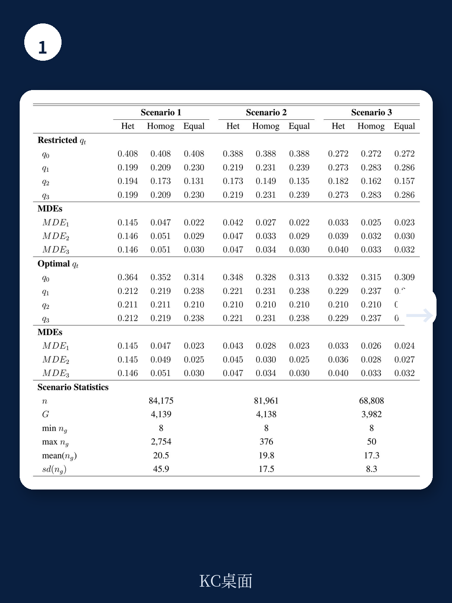

# 世界银行：你的实验可能被“忽视的集群异质性”悄悄削弱了

一份来自世界银行的研究，可能正在改变你对随机对照实验（RCT）设计的理解。它揭示了一个被多数研究者默认为“可忽略”的变量——集群异质性，实际上可能是决定实验成败的关键。

这份报告的核心判断是：**当集群（cluster）的规模和结果分布在实验设计中未被充分建模时，实验的统计功效可能被严重高估，从而导致研究者在实际中无法检测到真实存在的处理效应。**

换句话说，你的实验可能从一开始就注定“不够有力”，而你甚至没有意识到。

## 1. 集群异质性不是噪声，而是实验设计的“隐藏杠杆”

在社会科学和经济学中，随机对照实验通常将个体分组到相互独立的集群中——学校、村庄、企业、街区。研究者假设，只要随机分配发生在集群层面，或者通过控制集群内的相关性（即“聚类效应”），就能得到准确的估计。

但世界银行的这份报告指出，这个假设忽略了两个关键维度：**集群规模的异质性**和**集群结果分布的异质性**。

想象一个场景：200个集群中，前10个集群各有100个单位，后190个集群各有25个单位。如果大集群的平均结果显著高于小集群（例如大集群的居民收入更高、纳税意愿更强），而你只是简单地将所有集群视为同质，那么你的方差估计将严重偏小。

报告通过数值模拟展示了这种偏差的后果：在忽略集群异质性的情况下，研究者计算出在80%统计功效下可检测的最小效应（MDE）为0.29个标准差。但当考虑集群规模异质性时，实际功效降至69%；当进一步考虑分布异质性时，实际功效仅为48%。**这意味着，你有超过一半的概率无法发现真实存在的、大小与预期一致的效应。**

> **KC评论：** 这是一个被低估的“沉默杀手”。很多研究者会检查集群内的相关性（如组内相关系数ICC），但很少系统性地评估集群规模分布和结果分布的异质性是否改变了所需的样本量。这份报告提供了一个可以直接套用的框架：在实验设计阶段，不要只看平均集群规模，要看规模分布的形状，以及不同规模集群的结果均值是否显著不同。

## 2. 标准“聚类稳健标准误”可能让你过度保守

报告的一个技术性但至关重要的发现是：在集群异质性的情况下，常用的“聚类稳健方差估计量”（cluster-robust variance estimator）可能存在**向上偏误**。

这意味着，当你使用聚类稳健标准误时，你的置信区间会比真实情况更宽，你的p值会比真实情况更大。你可能会因为“不够显著”而放弃一个实际上有效的政策或干预。

这听起来似乎“保守”是安全的——毕竟，谁不想避免假阳性呢？但问题在于，这种保守性并非来自对真实不确定性的正确度量，而是来自一个错误的模型假设。它可能导致你浪费大量资源去实施一个被错误认定为无效的干预，或者错过一个本可以改善社会福利的机会。

报告的贡献在于，它在一个“超总体”（superpopulation）框架下首次严格证明了这一偏误的存在，并给出了当集群异质性存在时，如何调整方差公式以进行正确的功效计算。

> **KC评论：** 对实践者来说，这意味着不能盲目依赖统计软件默认输出的聚类稳健标准误。如果你的集群规模差异很大（比如从几十到几千），或者不同规模集群的结果均值有明显差异，那么标准误的向上偏误可能相当可观。报告提供了一个更完整的方差分解公式，其中包含了集群规模异质性和分布异质性的调整项。在实验设计阶段，使用这个完整公式计算样本量，而非依赖简化版的“设计效应”公式，是更严谨的做法。

## 3. 报告提供了一个“可操作的”最优分配方案

对于实验设计者来说，最实际的问题往往是：我应该将多少比例的集群分配到不同的处理强度（saturation）？

报告给出了一个令人惊喜的答案：在最小化估计量加权方差的准则下，存在一个**闭合形式（closed-form）的最优解**。具体来说，最优的集群分配概率可以通过一个简单的公式计算得出，该公式依赖于各处理强度下的方差成分。

这意味着，研究者不再需要依赖数值模拟或经验法则来分配集群。只要能够事先估计出不同处理强度下的方差成分（可以通过试点数据或类似文献的估计值），就可以直接计算出最优分配比例。

报告还讨论了在无法获得基线数据的情况下（即仅有集群规模信息，没有结果分布信息），如何简化计算。这对于许多资源有限、无法进行大规模试点的研究团队来说，是一个实用的替代方案。

> **KC评论：** 这个公式的实际价值在于，它让“实验设计”从一门艺术变成了可以精确计算的工程。但这里有一个关键前提：你需要对方差成分有合理的先验估计。报告没有完全展开的是，当先验估计错误时，最优分配方案对误设的敏感性如何。这是读者在应用该公式时需要自行验证的环节——报告本身留下了这个“未完成”的问题。

## 4. 实证应用：阿根廷房产税的“邻居效应”

报告将上述方法论应用于一个大规模的实地实验：在阿根廷某城市，通过随机向住宅发送个性化信件（提醒税款到期、欠款金额、支付方式等），来评估一项沟通活动对房产税合规性的直接效应和溢出效应。

实验设计利用了报告的“部分总体实验”（partial population experiment）框架：在每个街区（即集群）内，随机选择不同比例的家庭发送信件。这使得研究者能够区分：

- **直接效应**：收到信件的家庭的支付率变化。
- **溢出效应**：同一街区内未收到信件的家庭，因邻居收到信件而发生的支付率变化。

结果令人信服：收到信件的家庭支付率显著提高，直接效应约为5.1个百分点。更重要的是，在信件覆盖率高的街区，未收到信件的家庭也显示出显著的支付率提升——溢出效应约为2.6个百分点（针对过去合规性高于中位数的家庭）。

这一发现对税收征管政策具有直接含义：**信息干预的收益可能远超直接目标群体**。如果政府只计算直接效应，可能会低估干预的社会总收益，从而做出次优的资源配置决策。

但报告也诚实地指出，溢出效应仅在“高饱和度”街区中显著，且对过去合规性较高的群体更为明显。这意味着，溢出效应的存在可能依赖于特定的条件，而非普遍成立。

> **KC评论：** 这个实证结果本身就是一个很好的“why now”案例。在财政压力普遍加大的背景下，各国政府都在寻找低成本、高效益的税收征管手段。如果信息干预的溢出效应能被稳健地复制到其他地区或税种，那么它的政策价值将远高于传统认知。但报告没有展开的是：这种溢出效应的机制是什么？是信息传递（邻居知道了欠款后果），还是社会规范压力（邻居交了，我也要交）？不同机制对应不同的政策可推广性边界。

## 5. 报告尚未完全回答的关键问题：异质性来源的识别与稳健性

尽管报告在方法论上取得了重要进展，但它也留下了一些值得追问的问题。

**第一，集群异质性的来源是什么？** 报告将异质性分为“规模”和“分布”两个维度，但在实际应用中，这两个维度往往是相关的。大集群可能本身就在经济特征、社会结构上与小镇不同。如果研究者无法区分“因规模不同导致的方差变化”与“因其他特征不同导致的方差变化”，那么调整后的方差公式是否仍然有效？

**第二，最优分配方案对参数误设的敏感性如何？** 报告给出了闭合形式的最优解，但该解依赖于对B_t（各处理强度下的方差成分）的准确估计。如果这些估计存在偏差，最优分配方案可能反而比一个简单的均匀分配更差。报告没有提供这方面的敏感性分析或稳健性指导。

**第三，溢出效应的机制是什么？** 实证部分展示了溢出效应的存在，但未深入探讨其传导机制。是信息扩散、社会规范、还是其他因素？不同的机制对政策的可复制性有截然不同的含义。

这些未解问题，恰恰是完整报告中最值得深入阅读的部分。报告正文中包含了更详细的方差公式推导、蒙特卡洛模拟结果、以及实验设计的完整细节——这些内容对于真正想将方法论应用于实践的研究者来说，是不可或缺的。

如果你想进一步了解：
- 如何在Stata或R中实现完整的方差调整和最优分配计算
- 报告中的蒙特卡洛模拟结果如何验证理论推导
- 阿根廷实验的完整设计细节和额外的异质性分析

欢迎加入我们的社群。每天，AI agent 配合人工 review，为你筛选并生成国际投行（高盛、摩根士丹利、世界银行等）最新研究报告的中文摘要与KC评论，每日更新，约10-40页，包含当天最新数据图表合集。既方便喂给AI进行二次分析，也方便人工快速把握全球市场动态。在社群中，你可以直接获取这份世界银行报告的完整解读与原始图表，并与同行讨论这些方法论在自身研究中的应用。

Personal reading notes and learning share only. Not investment advice.

