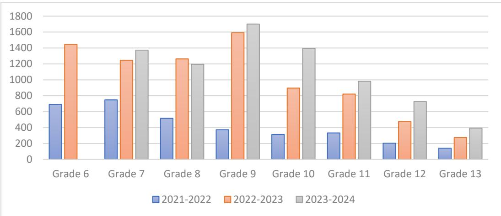
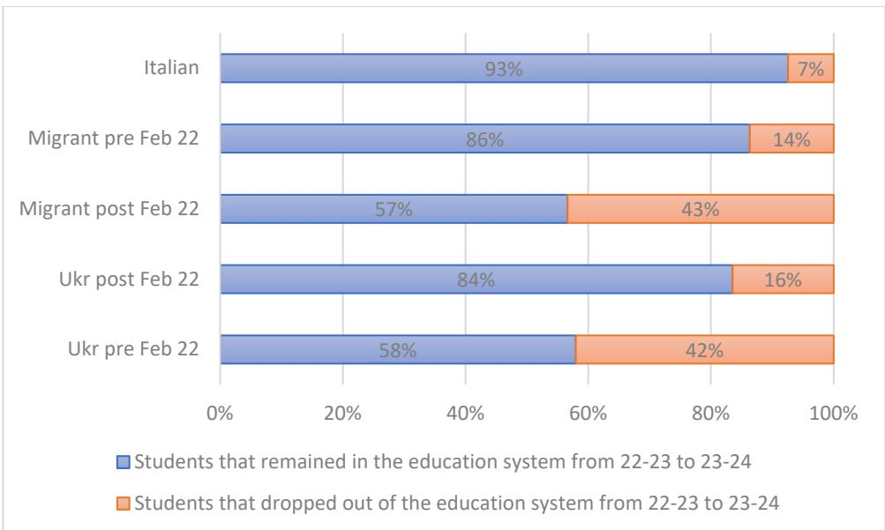
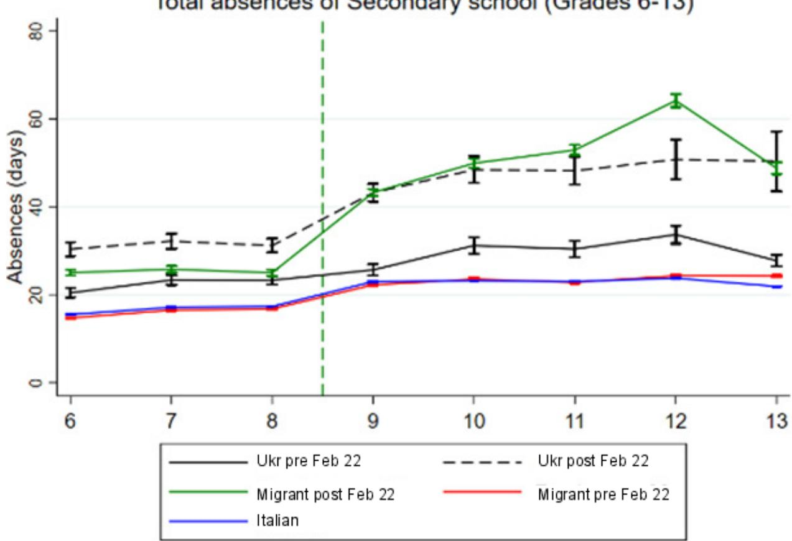
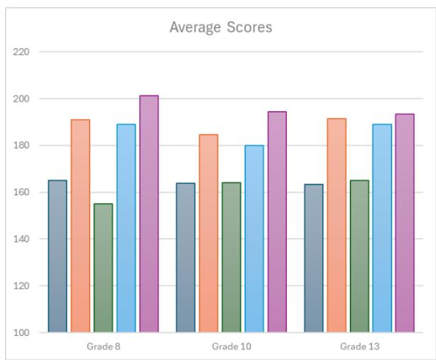
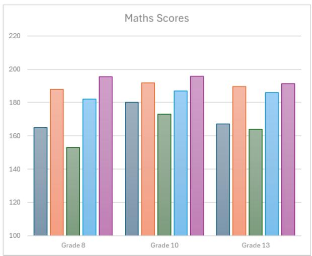
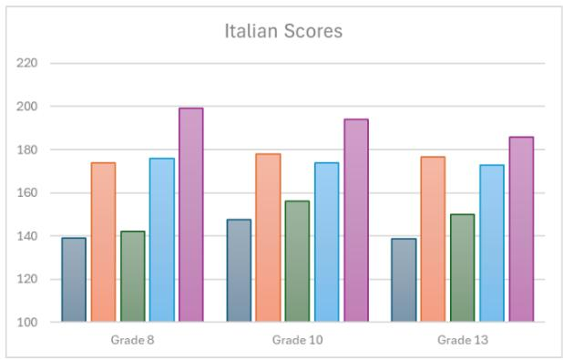
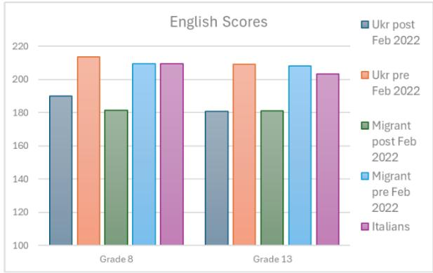
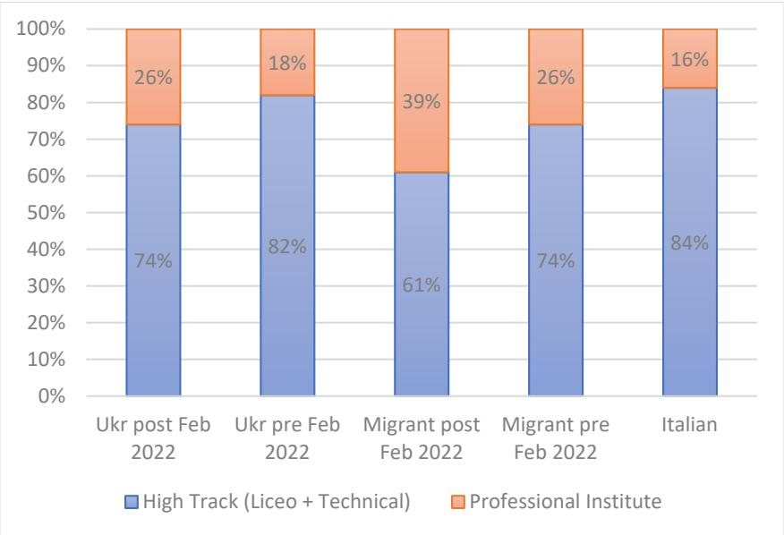
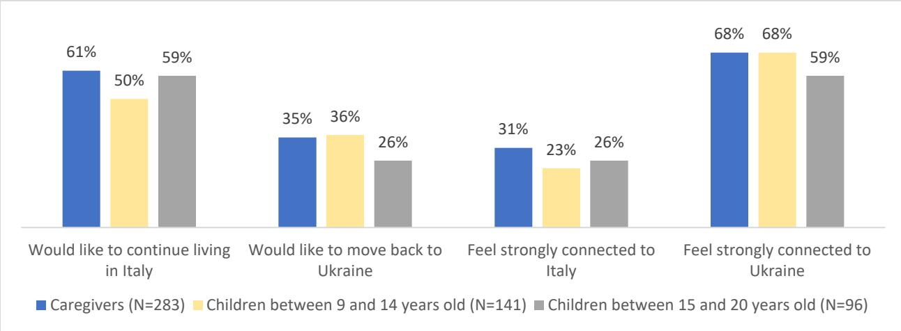

# Displaced Learners

# Early Integration of Ukrainian Refugee Students into Italy's Schools

Michela Carlana

Pauline Castaing

Mauro Testaverde

Marco Tiberti

POLICY RESEARCH WORKING PAPER 11055

## Abstract

The paper examines the early integration of Ukrainian refugee students into Italy's education system following the Russia's invasion of Ukraine in 2022. Using administrative and survey data, the study presents enrollment trends, academic performance, and barriers to educational integration. Findings from the analysis indicate that Ukrainian refugees face lower enrollment rates, higher absenteeism, and lower test scores than other students, particularly in subjects requiring language proficiency. Despite these challenges, teachers often recommend Ukrainian refugee students for advanced educational tracks, thus revealing their optimism about the potential of these students. Language barriers, mental health challenges, and uncertain futures are identified as major obstacles to integration. The study highlights the importance of tailored interventions, such as psychological support and more dedicated teaching time, to foster refugee students' academic and social inclusion.

# Displaced Learners: Early Integration of Ukrainian Refugee Students into Italy's Schools

Michela Carlana\*, Pauline Castaing $^{^}$ , Mauro Testaverde $^{^}$ , Marco Tiberti $^{^}$

JEL codes: I21, 015, R23
Keywords: Education, Forced Migration, Italy, Refugees, Ukraine

\# Harvard Kennedy School and Bocconi University

^ World Bank, Development Data Group

## Acknowledgments

This paper would have not been possible without the data access offered by the Italian Ministry of Education and INVALIDSI. Administrative data were elaborated by the LEAP-Bocconi team for this research project within the protocol “School system, educational choices and interventions to mitigate educational poverty in Italy”. The report team is grateful to the teams in the Italian Ministry of Education (Rita Angelini, Carla Borrini, Lucia De Fabrizio and Annarita Marzullo) and INVALIDSI (Patrizia Falzetti and Paola Giangiacomo) for sharing the data for this study and to Marta Magnani and Lucrezia Di Scanno for their research assistance. This paper was made possible by grants from the Knowledge for Change Program (KCP) and the Global Knowledge Partnership on Migration and Development (KNOMAD).

## 1. Introduction

Russia's invasion of Ukraine in 2022 led to the displacement of more than 6 million Ukrainians, predominantly women and children. By June 2024, data from UNHCR showed approximately 6.5 million refugees had fled Ukraine, with nearly 6 million seeking refuge in European Union (EU) countries. Germany hosted the largest number at 1.17 million, followed by Poland with 957,000, Czechia with 347,000, Spain with 202,000, and Italy with 170,000 (UNHCR, 2024). Due to conscription laws affecting men aged 18-60, around $79\%$ of refugees under temporary protection in Europe as of March 2024 were women and children. $^{1}$

The timing of the invasion and the demographic characteristics of the displaced population created severe challenges for young refugees' human capital formation. This study focuses on Ukrainian refugee students in Italy, the fifth largest host country of Ukrainian refugees within the EU, aiming to examine how Ukrainian refugee children are adapting to the Italian school system during early years of displacement and it investigates factors that may either hinder or support their integration.

Research shows that conflict and displacement adversely affect educational outcomes for children, with extensive evidence pointing to negative effects on both educational attainment and future earnings potential (see, among others, Ichino and Winter-Ebmer, 2004; Alderman et al., 2006: Agüero and Majid, 2014; Akresh and De Walque, 2008; Swee, 2009, 2015; Chamarbagwala and Morán, 2011; Shemyakina, 2011; Oyelere and Wharton, 2013; Rodríguez and Sánchez, 2012; León, 2012; Kecmanovic, 2013; Islam et al., 2016; Brück et al., 2019; Bertoni et al., 2019). These impacts translate into reduced schooling years, lower enrollment rates, decreased likelihood of passing exams, and diminished access to higher-tier academic tracks and institutions of higher education (Collier, 2003;

Gates et al., 2012). The factors driving these impacts are multifaceted, including the destruction of educational facilities, displacement from learning environments, economic shifts prioritizing wartime efforts, the loss of trained educational professionals, and the psychological toll on students exposed to violence (Justino, 2011).

Considering the challenges Ukrainian refugee students encounter abroad, it is essential to evaluate human capital losses and identify factors that can support their educational integration into host countries' systems, aiming to prevent potentially irreversible long-term impacts. Moreover, beginning just after the pandemic, when students could finally return to schools for in-person learning, the displacement may further worsen learning losses among Ukrainian refugee children (UN, 2023; Angrist et al., 2022). Research shows that students who speak a different language at home generally lag behind their peers by about one year of schooling on average (OECD, 2015). Additionally, studies have found that immigrant parents in OECD countries are notably less involved in their children's school communities, a factor associated with lower academic performance and a diminished sense of belonging among students (OECD, 2018). This lower parental engagement in educational settings is often linked to barriers like language and cultural differences, which can hinder students' social and academic integration (Friedberg and Hunt, 1995).

The long-term consequences of these trends are significant, as diminished educational outcomes and social isolation can hinder successful integration into host communities. Conversely, sustained social and educational integration efforts are vital for positive outcomes. For instance, studies indicate that long-term integration can be hampered by social, economic, and institutional barriers (Chiswick and Miller, 2014), while interventions focused on language support and community engagement can lower these barriers (Ozden and Wagner, 2020). Further, specific interventions aimed at removing obstacles to education for children on the move can contribute significantly to better integration outcomes (Schuettler and Caron, 2020).

This paper benefits from key information coming from administrative data on educational records of Ukrainian refugees in Italy for the academic years 2021-2022 to 2023-2024 for grades 6 to 13. This provides a unique opportunity to examine enrollment, attendance, test performance, and other indicators of integration into the Italian educational system. Supplemented by survey data collected in 2023-2024, this study offers an overview of the challenges and opportunities faced by Ukrainian students in secondary schools and highlights areas for potential policy development.

This study advances the literature by adding empirical evidence on the short- to medium-term educational impacts of displacement on young refugees within a European host country, offering insights into the role of education policy in mitigating human capital losses. It also contributes to discussions on human development by identifying factors that support or hinder integration, highlighting pathways for improving educational and social outcomes for refugee students.

Results highlight that despite gradual improvements, enrollment rates remain significantly lower among refugees compared to native and other foreign students. Ukrainian refugees also demonstrate higher absenteeism and lower academic performance, particularly in subjects requiring language proficiency such as Italian and English. However, good performance in mathematics suggests potential strengths linked to their prior educational backgrounds. Despite these challenges, teachers seem to be more inclined to recommend Ukrainian refugees for high-track education compared to other newly arrived foreigners, indicating potential optimism about their academic capabilities. The paper also examines possible barriers to the integration of Ukrainian refugee students into the Italian education system.

This paper contributes to several key areas of the literature. First, while previous studies (e.g., Ichino and Winter-Ebmer, 2004; Alderman et al., 2006) have focused on the broader educational impacts of conflict, this research identifies the specific challenges faced by Ukrainian refugee students, providing targeted insights into a unique and contemporary refugee situation of large-scale displacement in a European context. Second, this paper identifies the potential critical barriers—language proficiency, absenteeism, and psychological distress—that hinder the integration process. Unlike prior studies that generally highlight the effects of displacement (e.g., Justino, 2011; Brück et al., 2019), this paper provides actionable evidence on how these barriers manifest within the Italian context. Third, unlike previous research that aggregates migrant experiences, this study explicitly contrasts the experiences of Ukrainian refugees with other newly arrived migrants, demonstrating unique strengths (e.g., performance in mathematics) and challenges (e.g., Italian language proficiency).

The remainder of the paper is structured as follows. Section 2 presents the context and provides background information on the influx of Ukrainian refugees in Italy as well as on the Italian education system. Section 3 presents the data and the methodology used for the empirical analysis. Section 4 discusses the findings and explores possible barriers to the integration of Ukrainian refugee students into the Italian education system. Finally, Section 5 concludes the study.

## 2. Background and Context

## 2.1 Influx of Ukrainian refugee students in Italy

The massive influx of Ukrainian students into Italian schools following the invasion of their country, paired with the substantial presence of Ukrainian students in the Italian education system in previous years, makes Italy an ideal setting for the empirical analysis. Since February 2022, Italy has received around 190,000 temporary protection applications from Ukrainians, with approximately 170,000 still active as of June 2024. $^{2}$ $^{3}$ During the 2021-2022 school year, around 20,000 Ukrainian children enrolled in Italian schools within the final three months of classes. By May 2022, the Italian education system had registered 22,788 Ukrainian refugee students, as reported by the Ministry of Education (MoE, 2022a): approximately 46% of these students attended primary school, while around 9% were in high school. The proportions of pre-school and middle-school students were similar, each constituting about 22% (MoE, 2022a). The regional distribution of Ukrainian refugee students matched closely with the distribution of Ukrainian students that were attending schools in Italy before February 2022, with 56% of Ukrainian refugee students enrolled in schools in northern regions, while just 24% were in southern regions (MoE, 2022a).

Ukrainian students, both refugees and non-refugees, made up 4% (38,466) of foreign students in Italy's school system during the 2022-2023 academic year. The majority were in elementary school (39.1%), with 24.1% enrolled in lower secondary school and 23.4% in upper secondary school. Additionally, 13.3% of Ukrainian students attended pre-primary school. Data from the Ministry of Education highlights the significant number of unaccompanied minors from Ukraine in Italy since 2022; in the 2022-2023 school year, Ukrainian students represented the largest group of unaccompanied minors in the Italian school system, comprising 25.1% of this population. $^{4}$

Italy's response to the influx of Ukrainian refugees included a range of initiatives to support swift integration. Similarly to other EU countries, Italy activated the EU's Temporary Protection Directive, allowing Ukrainians to reside, work, and access health care and education. The Italian government streamlined temporary protection processes to prevent educational disruptions, enabling refugee children to enroll in local schools and recognize Ukrainian qualifications, allowing students and adults to pursue education and employment matching their skills (MoE, 2022b). The Ministry of Education issued guidelines to help schools support Ukrainian students, including individual education plans, language support, psychological aid, and intercultural activities. Additionally, the Cohesion's Action for Refugees in Europe (CARE) program was introduced to foster integration through digital and intercultural education, sports, artistic expression, and lifelong learning modules for both students and their families (MoE, 2023). $^{5}$

## 2.2 The Italian education system

The Italian education and training system is structured into three cycles, with an integrated system for children under six. The integrated system, lasting six years, is optional for children aged 0 to 6. The first cycle of education is mandatory, lasting eight years and divided into primary (from 6 to 11) and lower secondary schools (from 11 to 14). Transitioning between these stages does not require exams, but a final exam at the end of lower secondary school is needed to move on to the second cycle. The second cycle is divided into two paths: the High Secondary School path, a five-year program offering general, technical, and vocational education for students aged 14 to 19 who have completed the first cycle; and the professional education and training courses, which are three or four-year programs for students who have finished the first cycle. The third cycle comprises higher education, provided by universities, Higher Artistic, Musical, and Dance Education (AFAM), and Higher Technical Institutes (ITS). Compulsory education lasts for ten years, from ages 6 to 16, covering the eight years of the first cycle and the first two years of the second cycle. $^{6}$

## 3. Data Sources and Methods

## 3.1. Administrative data on educational outcomes in Italy

Two administrative data sources represent the backbone of this paper. These are the administrative data obtained from the Ministry of Education (MoE) for academic years 2021-22, 2022-23 and 2023-24, and standardized test score data from the Italian National Institute for the Evaluation of the Educational System (INVALSI) for the 2022-2023 academic year. These datasets offer valuable insights into the educational outcomes of students in Italy, including Ukrainian refugees who entered the Italian school system following the invasion in 2022.

Definitions. In both datasets, students are categorized into five demographic groups based on their nationality and timing of entry into the Italian educational system. These groups are Italian students, Ukrainian refugee students, non-refugee Ukrainian students, newly arrived foreign students, and other foreign students. Among Ukrainian students, the distinction between refugees and non-refugees is based on their enrollment date in the Italian education system. Ukrainian refugees are defined as Ukrainian students who enrolled in Italian schools after February 2022. In this paper, Ukrainian refugees are labeled “Ukr post-Feb 2022”, while non-refugee Ukrainians are labeled “Ukr pre-Feb 2022”. This distinction is also applied to foreign students, with those entering the system after February 2022 referred to as “Migrant post-Feb 2022” and others referred as “Migrant pre-Feb 2022”. $^{7}$

Administrative data from MoE. The Ministry data includes information for all students who enrolled at any point during the academic year. $^{8}$ This information covers academic year, grade, gender, birth date, birthplace, citizenship. They also include school-specific information such as the name and identifying code of the institution where the student is enrolled. Furthermore, the dataset includes a variety of school outcome variables, including grades in English, Italian, Mathematics, overall GPA calculated as the average across all subjects, behavior scores from grade 9 to grade 12, guidance council evaluations from lower secondary school, records of absences, late entries, and early exits.

Given the timing of this study, data for academic year 2022-23 are the most complete. For academic year 2022-2023, school enrollment data at the provincial level was provided for 4,269,348 enrolled students across the 8 years of Italian lower and upper secondary school, encompassing both public and private institutions. The dataset includes nearly all students in the country irrespective of their citizenship. $^{9}$ Table 1 shows the distribution of the different groups of students by grade. In the academic year 2022-2023, 0.2% of students enrolled in the Italian school system were Ukrainian refugees (this share slightly decreases from grade 10 and is negligible in grade 13).

Table 1- Group of students by grade during the academic year 2022-2023 (Source: MoE)

<table><tr><td></td><td>Grade6</td><td>Grade7</td><td>Grade8</td><td>Grade9</td><td>Grade10</td><td>Grade11</td><td>Grade12</td><td>Grade13</td><td>Total</td></tr><tr><td>Ukr post Feb 2022</td><td>1,444</td><td>1,245</td><td>1,263</td><td>1,591</td><td>896</td><td>821</td><td>477</td><td>275</td><td>8,012</td></tr><tr><td>Ukr pre Feb 2022</td><td>1,429</td><td>1,670</td><td>1,757</td><td>1,372</td><td>1,273</td><td>1,160</td><td>995</td><td>900</td><td>10,556</td></tr><tr><td>Migrant post Feb 2022</td><td>10,725</td><td>8,207</td><td>6,871</td><td>16,660</td><td>9,891</td><td>8,859</td><td>6,365</td><td>4,900</td><td>72,478</td></tr><tr><td>Migrant pre Feb 2022</td><td>53,886</td><td>43,939</td><td>44,317</td><td>43,002</td><td>31,905</td><td>30,901</td><td>27,702</td><td>25,195</td><td>300,847</td></tr><tr><td>Italians</td><td>470,319</td><td>495,155</td><td>501,083</td><td>508,873</td><td>484,926</td><td>475,036</td><td>457,203</td><td>486,018</td><td>3,878,613</td></tr><tr><td>Total</td><td>537,803</td><td>550,216</td><td>555,291</td><td>571,498</td><td>528,891</td><td>516,777</td><td>492,742</td><td>517,288</td><td>4,270,506</td></tr><tr><td>Share of Ukr post Feb 2022 over total students</td><td>0.27%</td><td>0.23%</td><td>0.23%</td><td>0.28%</td><td>0.17%</td><td>0.16%</td><td>0.10%</td><td>0.06%</td><td>0.19%</td></tr></table>

Administrative data on enrollment for the academic years 2021-2022 and 2023-2024 are also used to examine the evolution of Ukrainian refugees' enrollment in Italian schools since February 2022. $^{10}$ Figure 1 shows that in 2021-2022, the number of Ukrainian refugees was very low in all grades, with a total of 3,320 Ukrainian refugees that arrived directly after the start of Russia's invasion of their country. In 2023-2024, the number of Ukrainian refugees enrolled increases in all grades with the exception of Grade 8. $^{11}$

Figure 1-Number of Ukrainian Refugees students in the Italian school system across grades and academic years (Source: MoE, academic years 2021-22 to 2023-24)  

INVALSI data. INVALIDSI is a national institute that monitors the performance of the Italian school system and administers national standardized testing. Students are tested in Italian, Mathematics and English in their 2nd, 5th, 8th, 10th, and 13th years of school. $^{12}$ The dataset used for this study includes test scores from Grades 8, 10 and 13. Along with test scores across the three subjects, the INVALIDSI dataset contains key individual-level characteristics, including gender, age and origin, background information on parental education and employment status, as well as the availability of learning devices. Table 2 presents the number of participants at INVALIDSI tests for each category of students.

A close look at the numbers in Tables 1 and 2 suggests that the share of Ukrainian refugee students tested through INVALIDSI in 2022-23 was 88% in grade 8, 58% in grade 10 and 53% in grade 13. These rates are comparable to those of newly arrived foreigners but remain significantly lower than the participation rates of other students. While INVALIDSI participation generally declines in higher grades across all groups, the disparity is more pronounced among Ukrainian refugees and newly arrived foreigners.

Table 2- Number of participants at INVALIDSI tests by group and grade (Source: INVALIDSI, a.y. 2022-23)

<table><tr><td></td><td>Grade8</td><td>Grade10</td><td>Grade13</td><td>Total</td></tr><tr><td>Ukr post Feb 2022</td><td>1,108</td><td>522</td><td>145</td><td>1,775</td></tr><tr><td>Ukr pre Feb 2022</td><td>1,680</td><td>1,115</td><td>818</td><td>3,613</td></tr><tr><td>Migrant post Feb 2022</td><td>6,018</td><td>5,463</td><td>2,037</td><td>13,518</td></tr><tr><td>Migrant pre Feb 2022</td><td>41,917</td><td>29,015</td><td>23,612</td><td>94,544</td></tr><tr><td>Italians</td><td>483,152</td><td>446,496</td><td>450,712</td><td>1,380,360</td></tr><tr><td>Total</td><td>533,875</td><td>482,611</td><td>477,324</td><td>1,493,810</td></tr><tr><td>Share of Ukr post Feb 2022 over total students</td><td>0.21%</td><td>0.11%</td><td>0.03%</td><td>0.12%</td></tr></table>

## 3.2. Survey data on Ukrainian's refugees in Italy

The paper also presents evidence from a survey aimed at gathering insights on the factors that may be associated with educational integration of Ukrainian refugees in the Italian school system. The World Bank, in collaboration with the Centro Studi di Politica Internazionale - CeSPI ETS (CeSPI), has collected survey data on Ukrainian refugees' children and their caregivers residing in Italy between December 2023 and July 2024. This dataset provides insights into personal and familial barriers, such as difficulties faced by refugees in engaging with available educational opportunities, their aspirations for the future, and levels of mental distress. Survey responses are primarily collected by requesting schools to provide contact details of caregivers of 11-19 year old Ukrainian refugees enrolled in lower and upper secondary Italian schools. The list of schools with Ukrainian refugee students was compiled based on data from the Italian Ministry of Education. Additional contacts were collected through organizations working in Italy with Ukrainian refugee children and by publishing the link to the questionnaires via social media, thus tapping into networks of Ukrainians in Italy. The questionnaire was completed by 376 caregivers and 251 children. More details about the design, potential bias, content and implementation of the survey are reported in Appendix A. Tables A4 and A5 in the appendix provide descriptive statistics of caregivers and children, respectively.

The mean age of children in the survey is 14 years old, with 47% being females. All children who completed the questionnaire lived in Ukraine before February 2022. Among the surveyed children, 98% have a family member as their main caregiver, with 95% of the sample being cared for by their parent, while 2% reside with non-family legal guardians. Given the data collection approach, it is not surprising that 97% of refugee children in the sample attend any type of schools, with 83% attending an Italian school. Among those attending Italian schools, 50% are in lower secondary education, and 50% are in upper secondary education. Of those enrolled in upper secondary schools, 37% attend vocational schools, 34% attend technical schools, and 29% attend academic high schools. Additionally, 25% of respondents attend both a Ukrainian school online and an Italian school in person. $^{13}$

For adult caregiver respondents, the mean age is 42, with 93% being females. Of the respondents, 89% are refugees, and 99% of these refugees left Ukraine in 2022. Only 46% of the caregivers were employed at the time of responding to the survey, and their households had 1.8 children on average. Of the surveyed caregivers, 94% identify as parents of a refugee child, 3% as other family members, and 3% as non-family legal guardians. Caregivers who fled the situation in Ukraine come from all over the country, with a predominance from Kyiv (22%) and Kharkiv (14%).

## 3.3. Models

The analytical focus of this paper is on educational disparities captured by absenteeism patterns, exam scores, and high track recommendations. The main indicators extracted from MoE data for analysis include absenteeism records, recommendations for high-track placement at the end of Grade 8, and socio-demographic information of students enrolled in the Italian School System. Absenteeism, measured by the number of days missed during the academic year, can function as an indicator of school attachment or integration for refugee students. To address potential biases from teacher subjectivity, the analysis of score disparities relies on INVALIDSI test results. The standardized and anonymized nature of these tests helps mitigate subjectivity in assessment.

First, the results section presents some summary statistics of the main outcomes across the different categories of students. Second, we use the administrative data to analyze empirically how Ukrainian refugees and newly arrived foreigners compared to other students as regards their education performance. This estimation is based on an OLS model with the following econometric specification:

$$
Y _ {i g s l} = \beta_ {0} u k r e f u g e e _ {i} + \beta_ {1} n e w \_ f o r e i g n e r _ {i} + E S C S _ {i} + g e n d e r _ {i} + f _ {g} + f _ {s} + f _ {l} + \epsilon_ {\mathrm{igs}} (1)
$$

where $Y_{igsl}$ represents the outcome of interest (such as test scores, absenteeism, or high-track recommendation) for student i in school s, in grade g, and with language l. The variable ukrefugee $_{i}$ is a dummy indicating whether the student is a Ukrainian refugee, and new\_foreigner $_{i}$ indicates if the student is a newly arrived foreigner. ESCS $_{i}$ represents the Economic, Social, and Cultural Status of the student, and gender $_{i}$ indicates the student's gender. The model includes fixed effects for grade, school, and language spoken. $^{14}$ The results are presented in Table 3.

We then narrow our focus to foreign students who joined Italian schools after February 2022, specifically comparing Ukrainian refugees to other newly arrived foreign students. This approach allows us to examine how Ukrainian refugees compare to other foreign students who entered the education system around the same time. By restricting the sample to these two categories of students, we estimate the following regression:

$$
Y _ {i g s l} = \beta_ {0} u k r e f u g e e _ {i} + E S C S _ {i} + g e n d e r _ {i} + f _ {g} + f _ {s} + f _ {l} + \epsilon_ {i g s} (2),
$$

with variables as defined in (1), and results presented in Table 4.

Our analysis also aims to explore potential mechanisms that could explain results derived from equations (1) and (2). Using the administrative data, we investigate whether being placed in a smaller class influences school achievement in the sample of Ukrainian refugees. The results are presented in Table 5. We then draw on findings from the survey data to unpack and analyze how Ukrainian refugees feel in Italy, the challenges they face, and their aspirations.

## 4. Results

## 4.1. Integration challenges faced by Ukrainian refugees in Italy

## Low enrollment and substantial dropout rates

At the end of the 2021-2022 school year, the enrollment rate of Ukrainian refugee children in Italian schools was low. In the months following Russia's full-scale invasion of Ukraine in 2022, 3,320 Ukrainian refugees were enrolled into Italian secondary schools. This figure constitutes $24\%$ of the 14,106 Ukrainian refugees aged between 11 and 18 years who sought temporary protection as of

June 30, 2022. $^{15}$ As such, approximately three in each four Ukrainian refugee students in secondary school age were not enrolled in Italian schools in academic year 2021-22.

In the following years, enrollment rates have shown improvement despite still remaining low. As shown in Figure 1, in academic year 2022-2023 around 32% Ukrainian refugees were enrolled in Italian secondary schools, $^{16}$ with the percentage becoming 36% in academic year 2023-24. $^{17}$ These numbers remain low compared to the enrollment rates for other foreign students. According to the data from the MoE, the enrollment rate of students with non-Italian citizenship, except for preprimary schools, is close to that of Italians. In particular, in grades 1-8, the enrollment rate is close to 100 percent; in grades 9 to 11, it reaches almost 90 percent; on the other hand, in the last three years of secondary school, corresponding to the start of non-compulsory school years, the enrollment rate of students with non-Italian citizenship decreases to 78 percent compared to 83 percent for Italian students (MoE, 2023). $^{18}$

Analysis of MoE data covering academic years 2022-23 through 2023-24 highlights a substantial dropout trend from the Italian school system among displaced Ukrainian learners. $^{19}$ Only 58% of Ukrainian refugee students initially enrolled in Grades 6 to 12 during the 2022-23 academic year continued their education within the Italian system the subsequent year, suggesting a 42% drop-out rate. $^{20}$ Figure 2 shows that the dropout rate among Ukrainian refugees is more than twice as high as that of other foreigners and six times higher than that of Italian students. These numbers are in line with observations from previous academic years, when the dropout rate of foreigners was three times higher than that of Italians (30.1 percent vs. 9.8 percent) (ISTAT, 2023). No discernible gender or regional disparities are observed in these dropout rates. $^{21}$

Figure 2- Share of students enrolled during a.y. 22-23 that dropped out or remained enrolled in Italian schools the next year (Source: MoE, a.y. 2022-23 and a.y. 2023-24)  

At the same time, many new Ukrainian students joined the Italian education system in 2023-24. Of the refugee students enrolled in the 2023-24 academic year, 42% were not enrolled in the previous year. This phenomenon cannot be solely attributed to new arrivals of children in Italy, as there was no increase in applications for temporary protection permits issued to 11–18-year-old refugees between March 2023 and May 2024. $^{22}$ This finding may suggest that some Ukrainian refugee students, as they arrived in Italy, preferred to wait to enroll in Italian school with the expectation of returning to Ukraine after a short period of time. However, after several months in Italy, some could have decided to enroll in the Italian school system. These students are considered "new" to the system in 2023-24, even though they were not new arrivals in the country.

## Higher levels of absenteeism

Ukrainian refugee students have a high level of absenteeism. Figure 3 shows the distribution of the number of school days missed during the academic year 2022-23 for different groups of students. For all groups, the average number of days missed is typically higher in the upper secondary school than during the lower secondary school. In lower secondary schools, absenteeism is systematically more pronounced among Ukrainian refugee students across all grades. In upper secondary schools, their absenteeism levels are comparable to those of newly arrived foreigners but significantly higher than those of Italian students, Ukrainian non-refugees, and foreigners who arrived before February 2022.

On average, Ukrainian students miss 46 school days per year in 2022-23, 18 days more than Italians. In upper secondary schools, Ukrainian refugee students exhibit twice the absenteeism of their Italian peers. Italian students miss half as many days (23 days) out of a total of 200 days of schooling in the

2022-23 academic year. On average, Ukrainian refugee students enrolled in lower secondary school miss 31 days of school per year, while their Italian classmates miss 17 days. Absence from school serves not only as an objective gauge of educational integration but also reflects school attachment and integration among refugee students (Tumen, 2023). School absenteeism has been linked to adverse outcomes, such as low academic performance, substantial learning losses, and high drop-out rates (Aucejo and Romano, 2016). Conversely, school attendance facilitates social interaction and integration within the host community, offering mental health and well-being benefits to children (Fiining et al., 2019).

Figure 3- Total absences in Secondary school (Source: MoE, a.y. 2022-23)

Total absences of Secondary school (Grades 6-13)  
  
Note: The green vertical dashed line represents the separation between grades belonging to lower secondary school to those belonging to upper secondary school.

Controlling for gender, grade, school, socio-economic background, and language spoken at home, the results in Table 3 confirm that Ukrainian refugees and recent migrant students have higher rates of absenteeism compared to other student groups. Specifically, Ukrainian refugees miss an additional 8 school days per year on average, while recent migrant students miss 3 additional days. To assess whether the difference between Ukrainian refugees and newly arrived migrants is statistically significant, the analysis is narrowed to a sample including only these two groups. Table 4 reports the coefficients from this estimation. The results indicate that Ukrainian refugees are consistently more absent than other foreign students who entered the Italian education system around the same time.

## Lower test score performance

The evidence suggests that Ukrainian refugees in Italy face important learning gaps across all subjects. Figure 4 reports the INVALIDSI test scores by topic and category of students. $^{23}$ The educational disparity is particularly pronounced between Ukrainian refugees and Italian students, but significant gaps also exist between refugees and both Ukrainian nationals and foreign students who were enrolled in Italian schools before February 2022. However, Ukrainian refugees tend to have INVALIDSI scores comparable to migrant students who joined the educational system after February 2022. Notably, Figure 4 shows that Ukrainian refugees perform better in mathematics than recent migrants but score lower in Italian.

Figure 4-INVALIDSI scores in Grades 8, 10, and 13 (Source: INVALIDSI, a.y. 2022-23)  

Table 3 presents the regression estimates that control for various potential confounding factors. The results indicate that both Ukrainian refugees and recent migrants score lower across all subjects. In mathematics, both groups score 16 points less than the rest of the sample. As expected, given their relatively short time in Italy, their performance in Italian is notably weaker. Ukrainian refugees score

39 points less, and recent migrants score 24 points less than other students, highlighting language as a likely barrier in the learning process.

Table 3- Main results for the full sample

<table><tr><td></td><td>(1)INVALSI Maths</td><td>(2)INVALSI English</td><td>(3)INVALSI Italian</td><td>(4)INVALSI Average</td><td>(5)Number of Absences</td><td>(6)Number of Absences</td><td>(7)Recommended for High Track</td></tr><tr><td>Ukr post</td><td>-16.773***(0.922)</td><td>-21.748***(1.159)</td><td>-39.489***(0.934)</td><td>-25.834***(0.790)</td><td>18.452***(0.243)</td><td>7.783***(0.383)</td><td>-0.002(0.013)</td></tr><tr><td>Migrant post Feb 2022</td><td>-16.913***(0.323)</td><td>-18.841***(0.447)</td><td>-23.801***(0.328)</td><td>-18.870***(0.277)</td><td>17.066***(0.087)</td><td>3.416***(0.139)</td><td>-0.121***(0.006)</td></tr><tr><td>Female</td><td>-7.288***(0.059)</td><td>3.772***(0.076)</td><td>5.881***(0.060)</td><td>0.210***(0.051)</td><td>-0.865***(0.021)</td><td>-0.334***(0.025)</td><td>0.076***(0.001)</td></tr><tr><td>ESCS controls</td><td>YES</td><td>YES</td><td>YES</td><td>YES</td><td>NO</td><td>YES</td><td>YES</td></tr><tr><td>School FE</td><td>YES</td><td>YES</td><td>YES</td><td>YES</td><td>YES</td><td>YES</td><td>YES</td></tr><tr><td>Grade FE</td><td>YES</td><td>YES</td><td>YES</td><td>YES</td><td>YES</td><td>YES</td><td>NO</td></tr><tr><td>Language spoken FE</td><td>YES</td><td>YES</td><td>YES</td><td>YES</td><td>NO</td><td>YES</td><td>YES</td></tr><tr><td>INVALSI avg</td><td>NO</td><td>NO</td><td>NO</td><td>NO</td><td>NO</td><td>NO</td><td>YES</td></tr><tr><td>Mean Y</td><td>196.181</td><td>209.286</td><td>194.867</td><td>198.844</td><td>20.768</td><td>18.511</td><td>0.740</td></tr><tr><td>R-square</td><td>0.353</td><td>0.307</td><td>0.343</td><td>0.398</td><td>0.257</td><td>0.347</td><td>0.354</td></tr><tr><td>Obs</td><td>1284486</td><td>881712</td><td>1286096</td><td>1287456</td><td>3342911</td><td>923057</td><td>462923</td></tr></table>

Standard errors in parentheses. \* p < 0.05, \*\* p < 0.01, \*\*\* p < 0.001. The models use administrative data from INVALSI and the Ministry of Education for the 2022-23 academic year, including all students enrolled in Grades 8 through 13. “Migrant post Feb 2022” is a variable identifying students without non-Italian and non-Ukrainian citizenship who integrated the Italian school system after February 2022. “Ukr Post Feb 2022” is a variable identifying Ukrainian refugees. The “recommended for high-track” variable is relevant for grade 8 only.

Ukrainian refugees' performance in school may not only be negatively impacted by factors related to their recent and abrupt arrival in Italy but is also likely to benefit from their strong educational background in the country of origin. To deepen the analysis, INVALIDSI scores of Ukrainian refugees are compared to those of other recently arrived foreigners. To this end, the sample is restricted to Ukrainian refugees and foreign students who enrolled for the first time after February 2022. $^{24}$ When controlling for language spoken at home, socio-economic background, school, gender, and grade, regression results presented in Table 4 suggest that Ukrainian refugees perform worse than newly arrived foreigners in Italian and English, but better in mathematics. These findings might be driven by the strong educational background of Ukrainian students in mathematics. Conversely, Italian being a new subject, and English for which teaching and testing methods may differ, are subjects in which Ukrainian students encounter more problems than other newly arrived foreigners.

Table 4- Main OLS results for the sample of Ukrainian Refugees and Newly arrived foreigners

<table><tr><td></td><td>(1) INVALSI Maths</td><td>(2) INVALSI English</td><td>(3) INVALSI Italian</td><td>(4) INVALSI Average</td><td>(5) Number of Absences</td><td>(6) Number of Absences</td><td>(7) Recommended for High Track</td></tr><tr><td>Ukr post</td><td>4.407***</td><td>-5.081**</td><td>-8.229***</td><td>-3.890***</td><td>2.698***</td><td>2.691**</td><td>0.080***</td></tr><tr><td>Feb 2022</td><td>(1.583)</td><td>(2.513)</td><td>(1.562)</td><td>(1.349)</td><td>(0.676)</td><td>(1.057)</td><td>(0.028)</td></tr><tr><td>Female</td><td>-2.852***</td><td>5.777***</td><td>3.160***</td><td>1.136</td><td>-1.151***</td><td>0.261</td><td>0.173***</td></tr><tr><td></td><td>(0.850)</td><td>(1.392)</td><td>(0.837)</td><td>(0.724)</td><td>(0.418)</td><td>(0.576)</td><td>(0.016)</td></tr><tr><td>ESCS controls</td><td>YES</td><td>YES</td><td>YES</td><td>YES</td><td>NO</td><td>YES</td><td>YES</td></tr><tr><td>School FE</td><td>YES</td><td>YES</td><td>YES</td><td>YES</td><td>YES</td><td>YES</td><td>YES</td></tr><tr><td>Grade FE</td><td>YES</td><td>YES</td><td>YES</td><td>YES</td><td>YES</td><td>YES</td><td>NO</td></tr><tr><td>Language spoken FE</td><td>YES</td><td>YES</td><td>YES</td><td>YES</td><td>NO</td><td>YES</td><td>YES</td></tr><tr><td>INVALSI avg</td><td>NO</td><td>NO</td><td>NO</td><td>NO</td><td>NO</td><td>NO</td><td>YES</td></tr><tr><td>Mean Y</td><td>164.761</td><td>181.541</td><td>149.984</td><td>164.077</td><td>38.570</td><td>22.660</td><td>0.314</td></tr><tr><td>R-square</td><td>0.623</td><td>0.627</td><td>0.615</td><td>0.615</td><td>0.381</td><td>0.611</td><td>0.639</td></tr><tr><td>Obs</td><td>11240</td><td>7074</td><td>11258</td><td>11305</td><td>50519</td><td>7641</td><td>5340</td></tr></table>

Standard errors in parentheses. \* p < 0.05, \*\* p < 0.01, \*\*\* p < 0.001. The models use administrative data from INVALSI and the Ministry of Education for the 2022-23 academic year, including Ukrainian refugees and foreigners arrived in the country after February 2022 and enrolled in Grades 8 through 13. “Ukr Post Feb 2022 is a variable identifying Ukrainian refugees. The “recommended for high-track” variable is relevant for grade 8 only.

As a robustness check, we re-estimate the regression by restricting the sample of migrants to students coming from Schengen Area member states and Western Balkan countries. The results, presented in Table B8, indicate that the gap in Italian language proficiency between refugees and other foreign students is more pronounced when compared to peers from the same continent. These findings are noteworthy and confirm that Ukrainian refugees may face greater challenges in learning Italian compared to students with similar backgrounds who entered the school system at the same time.

## Track enrollment and recommendation

Ukrainian students are less likely than Italians to enroll in high track education. Figure 5 shows that the rate of Ukrainian refugees (74%) enrolled in the High Track is much lower than that of Italians (84%) but higher to that of recent migrants (61%). $^{25}$ These findings align with previous research, which indicates that immigrants in Italy are more likely to enroll in professional institutes rather than technical and academically oriented ones compared to natives of similar ability (Carlana et al., 2022). This 'educational segregation' is disproportionately more common among students with low ESCS scores, whose parents may have less information about the local education system, such as children of refugees.

Figure 5- Share of students enrolled in High Track and Professional Institutes in upper secondary schools (Source: MoE, a.y. 2022-23)  

Although Ukrainian refugees are less frequently enrolled in High Track classes than Italian students, the results in Table 3 indicate no significant gap in their recommendations for the High Track system at the end of Grade 8 in the 2022/2023 academic year. In fact, Table 4 shows that Ukrainian refugees were more likely to receive recommendations for the High Track compared to other newly arrived foreigners. This finding is particularly interesting, as it suggests that despite higher rates of absenteeism and lower average performance among Ukrainian refugees, teachers are more inclined to encourage them to pursue the High Track compared to other migrant students arrived in Italy after February 2022. Recent research in Italy highlights that teachers' stereotypes about immigrants can significantly influence their recommendations. Specifically, Carlana et al. (2022) show that teachers with negative stereotypes toward immigrants are more likely to recommend lower-tier tracks for immigrant students compared to natives with similar abilities and socioeconomic backgrounds.

## 4.2. Barriers to educational integration for Ukrainian refugees in Italy

Barriers on both the demand for and the supply of schooling may affect Ukrainian refugees' integration into host countries' education systems. To explore potential factors behind the observed educational outcomes among Ukrainian refugee students in Italy, this section uses survey and administrative data to focus on known drivers of integration into schools.

Language barriers typically play a significant role in limiting refugees' successful integration in destination countries (Dustmann and Fabbri, 2003; Bleakley and Chin, 2004). In the World Bank survey on Ukrainian refugees in Italy, 38% of child refugees cite Italian courses as the most important form of assistance needed from Italian schools. Children rated their language skills on average slightly better than caregivers, which may be due to more exposure in the school setting. In the survey, 36% of caregiver refugees rate their Italian speaking skills ‘Not well’ or ‘Not well at all’, as opposed to 15% of child refugees. These findings confirm that Ukrainian students appear to struggle with Italian at school.

Additional analysis with administrative data shows that assigning Ukrainian refugees to smaller classes is associated with higher scores in Italian. In Table 5, we present a linear regression analysis examining the relationship between class size and educational outcomes for Ukrainian refugee students. The results indicate that students in smaller classes scored an average of 5.5 points higher in Italian than their peers in larger classes. This finding supports existing evidence that, while smaller class sizes have a modest impact on the general student population, the benefits are considerably more pronounced for disadvantaged students, such as migrants, ethnic minorities, and those from low-income families with lower levels of parental education (Angrist & Lavy, 1999; Lindahl, 2005; Björklund et al., 2005). These results emphasize the importance of ongoing efforts to place Ukrainian refugee children in smaller classes whenever possible.

Table 5 – Results from OLS regressions of class size on educational outcomes

<table><tr><td rowspan="2"></td><td>(1)</td><td>(2)</td><td>(3)</td><td>(4)</td><td>(5)</td><td>(6)</td><td>(7)</td></tr><tr><td>INVALSI Maths</td><td>INVALSI English</td><td>INVALSI Italian</td><td>INVALSI Average</td><td>Number of Absences</td><td>Number of Absences</td><td>Recommended for High Track</td></tr><tr><td>Small class size</td><td>2.458(2.391)</td><td>1.613(2.856)</td><td>5.500***(2.084)</td><td>2.618(1.889)</td><td>1.320(1.151)</td><td>0.930(1.398)</td><td>0.026(0.035)</td></tr><tr><td>Female</td><td>-4.142*(2.204)</td><td>-1.844(2.736)</td><td>2.115(1.924)</td><td>-1.493(1.742)</td><td>0.201(1.012)</td><td>1.991(1.290)</td><td>0.134***(0.033)</td></tr><tr><td>ESCS controls</td><td>YES</td><td>YES</td><td>YES</td><td>YES</td><td>NO</td><td>YES</td><td>YES</td></tr><tr><td>School FE</td><td>NO</td><td>NO</td><td>NO</td><td>NO</td><td>NO</td><td>NO</td><td>NO</td></tr><tr><td>Grade FE</td><td>YES</td><td>YES</td><td>YES</td><td>YES</td><td>YES</td><td>YES</td><td>NO</td></tr><tr><td>Language spoken FE</td><td>YES</td><td>YES</td><td>YES</td><td>YES</td><td>NO</td><td>YES</td><td>YES</td></tr><tr><td>INVALSI avg</td><td>NO</td><td>NO</td><td>NO</td><td>NO</td><td>NO</td><td>NO</td><td>YES</td></tr><tr><td>Mean Y</td><td>169.151</td><td>189.450</td><td>141.447</td><td>164.549</td><td>38.402</td><td>26.066</td><td>0.444</td></tr><tr><td>R-square</td><td>0.083</td><td>0.114</td><td>0.068</td><td>0.073</td><td>0.041</td><td>0.025</td><td>0.156</td></tr><tr><td>Obs</td><td>1192</td><td>889</td><td>1195</td><td>1199</td><td>5619</td><td>864</td><td>793</td></tr></table>

Standard errors in parentheses. \* p < 0.05, \*\* p < 0.01, \*\*\* p < 0.001. The models use administrative data from INVALIDSI and the Ministry of Education for the 2022-23 academic year. The sample is comprised of Ukrainian refugees enrolled in Grades 8 through 13. Small class size is a dummy variable equal to 1 if the class size is below the median national average for this grade. The “recommended for high-track” variable is relevant for grade 8 only.

Uncertainty about the future may impact refugees' connectedness to Italy, including to its education system. Figure 6 presents the statistics on aspirations and connectedness to Ukraine and Italy for caregivers and children. Displaced Ukrainians are not only unsure about when they will be able to return to Ukraine, but also many are unsure on whether they wish to return. According to the World Bank survey, $32\%$ of refugee students and $35\%$ of caregivers express a wish to return, while $54\%$ of children and 61% of caregivers prefer to remain in Italy. Adolescents between the ages of 15 and 19 express a greater desire to continue living in Italy compared to children aged between 9 and 14. Another survey conducted across Europe from June to December 2022 shows that only 8% of Ukrainian refugees planned to settle outside Ukraine (Adema et al., 2024). Compared to other foreign children in Italy, the aspirations of Ukrainian refugees to return to Ukraine seems significantly higher: indeed, a recent study from ISTAT on children 11 to 19 years old shows that only 11% of foreign children wish to return to their home country (ISTAT, 2024). The relatively strong desire to return to Ukraine can have negative effects in refugee parents' educational decisions, particularly in encouraging their children to learn the language of the host country and in enrolling in school (Dryden-Peterson et al., 2019; Zengin and Atas-Akdemir, 2020).

Figure 6- Aspirations and identity of refugee caregivers and students (Source: World Bank Survey on Ukrainian refugees in Italy)  

Many students facing uncertain futures try to stay connected to both educational systems. Findings from the World Bank survey indicate that 25% of children are engaging in online Ukrainian schooling while being enrolled and attending Italian schools. The lack of certainty means children are trying to prepare for further studies (e.g., in universities) in two separate systems with varying requirements. The survey results indicate that students enrolled in both systems spend as much time in Italian schools as those attending only Italian schools, averaging 31 hours per week. However, students participating in both systems spend an additional 8 hours per week on online Ukrainian classes. This puts an extra burden on these children.

Connectedness to Italy is correlated with demographic characteristics and social environment of refugee children. Additionally, Table 6 shows that making new friends in the country of destination and speaking Italian are strongly associated with higher connection to Italy.

The mental distress resulting from displacement is a key barrier to educational integration for many Ukrainian refugees in Italy. The link between poor mental health and low school attendance and performance is widely acknowledged in the literature (see Fiining et al., 2019 for a systematic review). In the World Bank survey data, children and caregivers reported signs of mental distress, with 16% of children and 24% of refugee caregivers reported experiencing psychological distress consistent with a serious mental illness on the six-items Kessler Psychological Distress Scale (K-6). $^{26}$ Mesa-Vieira et al. (2022) conducted a meta-analysis on the mental health of migrants with prior exposure to armed conflicts and show a prevalence of major depressive disorder among this population at around 25%, which aligns with our observations.

Results in Table 6 suggest that mental distress of children is closely linked to the mental health of their caregivers. This is also confirmed by the literature, according to which children with caregivers with poor mental health are more likely to have high mental distress (Wolicki et al, 2021).

In the World Bank survey, 31% of students reported experiencing at least one incidence of bullying in their Italian school. $^{27}$ Table 6 shows that experiencing bullying is also associated with higher levels of mental distress. PISA 2018 data show that in the majority of countries and economies frequently bullied $^{28}$ students are more likely to feel sad, scared and not satisfied with their lives than their classmates not affected by bullying. Additionally, both bullying aggressors and victims are found to skip classes and drop out of school more often, with negative impacts on their academic performance compared to peers not involved in bullying (Townsend et al, 2008).

Table 6- Correlates of Children's Mental distress (Kessler Scale) and Attachment to Italy (Source: World Bank Survey on Ukrainian refugees in Italy)

<table><tr><td></td><td>(1)Kessler Scale</td><td>(2)Kessler Scale</td><td>(3)Kessler Scale</td><td>(4)Attachment to Italy</td><td>(5)Attachment to Italy</td><td>(6)Attachment to Italy</td></tr><tr><td colspan="7">Child characteristics</td></tr><tr><td>Female</td><td>1.635***(0.618)</td><td>2.577***(0.602)</td><td>3.024***(0.645)</td><td>-0.036(0.027)</td><td>-0.049*(0.028)</td><td>-0.054*(0.030)</td></tr><tr><td>Age</td><td>0.447***(0.150)</td><td>0.678***(0.150)</td><td>0.709***(0.155)</td><td>0.003(0.006)</td><td>0.007(0.007)</td><td>-0.000(0.007)</td></tr><tr><td>Attend multiple school</td><td>-0.025(0.662)</td><td>-1.091(0.668)</td><td>-0.989(0.722)</td><td>0.014(0.032)</td><td>0.026(0.033)</td><td>0.015(0.035)</td></tr><tr><td>Attend extracurricular activities</td><td>0.878(0.636)</td><td>0.473(0.597)</td><td>0.784(0.683)</td><td>-0.010(0.028)</td><td>0.005(0.030)</td><td>-0.022(0.032)</td></tr><tr><td>Growth mindset</td><td>-0.527***(0.110)</td><td>-0.534***(0.123)</td><td>-0.552***(0.121)</td><td>0.006(0.005)</td><td>-0.003(0.006)</td><td>-0.004(0.006)</td></tr><tr><td>Italian speaking</td><td>-2.414*(1.250)</td><td>-3.606***(1.292)</td><td>-3.704**(1.479)</td><td>0.191***(0.053)</td><td>0.203***(0.058)</td><td>0.213***(0.065)</td></tr><tr><td>Made new friends</td><td>-1.884**(0.868)</td><td>-1.653*(0.864)</td><td>-1.275(1.000)</td><td>0.089***(0.032)</td><td>0.073**(0.035)</td><td>0.104***(0.040)</td></tr><tr><td>Wish to stay in Italy</td><td>-1.024*(0.590)</td><td>-1.049*(0.585)</td><td>-0.656(0.626)</td><td>0.190***(0.026)</td><td>0.182***(0.029)</td><td>0.184***(0.032)</td></tr><tr><td>School characteristics</td><td></td><td></td><td></td><td></td><td></td><td></td></tr><tr><td>Experienced bullying</td><td></td><td>3.124***(0.645)</td><td>3.238***(0.668)</td><td></td><td>-0.026(0.029)</td><td>-0.003(0.032)</td></tr><tr><td>Plan to enroll in university</td><td></td><td>0.501(0.638)</td><td>0.292(0.670)</td><td></td><td>0.002(0.031)</td><td>0.025(0.031)</td></tr><tr><td>Caregiver characteristics</td><td></td><td></td><td></td><td></td><td></td><td></td></tr><tr><td>Caregiver is a refugee</td><td></td><td></td><td>-0.045(1.279)</td><td></td><td></td><td>-0.106**(0.051)</td></tr><tr><td>Caregiver is a parent</td><td></td><td></td><td>0.733(1.372)</td><td></td><td></td><td>-0.152***(0.058)</td></tr><tr><td>Kessler scale of caregiver</td><td></td><td></td><td>0.210***(0.060)</td><td></td><td></td><td>0.004(0.003)</td></tr><tr><td>Caregiver owns a car</td><td></td><td></td><td>-0.520(0.634)</td><td></td><td></td><td>-0.002(0.033)</td></tr><tr><td>Constant</td><td>14.015***(3.195)</td><td>10.169***(3.234)</td><td>7.168*(4.027)</td><td>0.037(0.132)</td><td>0.176(0.152)</td><td>0.462**(0.193)</td></tr><tr><td>Observations</td><td>224</td><td>191</td><td>165</td><td>224</td><td>191</td><td>165</td></tr><tr><td>R-squared</td><td>0.217</td><td>0.351</td><td>0.427</td><td>0.286</td><td>0.278</td><td>0.332</td></tr></table>

\* $p < {0.05}, *  * p < {0.01}, *  *  * p < {0.001}$ . The analysis utilizes survey data on Ukrainian refugee children in Italy. The models are estimated using Ordinary Least Squares (OLS) regressions, with the dependent variables being the Kessler Scale and Attachment to Italy. Independent variables include child, caregiver, and school characteristics.

## 5. Discussion and Conclusions

This paper explores the challenges and opportunities faced by Ukrainian refugee students in Italy. Following Russia's full-scale invasion of Ukraine in 2022, hundreds of thousands of Ukrainian children were displaced abroad, significantly affecting various aspects of their lives, including education. The Temporary Protection Directive enabled EU countries to provide an unprecedented support package for Ukrainian households, granting immediate access to services such as education. However, the sudden transition to new countries with unfamiliar languages, education systems, and support networks—compounded by the trauma of displacement and pandemic-induced learning losses—raises critical questions about the academic needs and institutional support required for Ukrainian refugee students. This paper focuses on these issues in the context of Italy, which hosts the fifth-largest number of Ukrainian refugees in the EU.

The findings reveal that, although enrollment rates have gradually improved, they remain notably lower for refugees compared to native and other foreign students. Ukrainian refugees, in particular, exhibit higher absenteeism and weaker academic outcomes, especially in language-intensive subjects like Italian and English. Nevertheless, their strong performance in mathematics hints at potential advantages from their prior education. Despite these hurdles, teachers appeared more likely to recommend Ukrainian refugees for high-track education than other newly arrived foreigners, reflecting optimism about their academic potential. The study also explores potential barriers to integrating Ukrainian refugee students into the Italian education system. These include language barriers, mental distress, potentially due to trauma, as well as uncertainties on the length of stay in Italy,

With almost three years since Russia's full-scale invasion of Ukraine in 2022, addressing the risk of human capital losses among Ukrainian youth has become urgent. Drawing insights from the experiences of refugee students in Italy, this paper highlights a vulnerable group of displaced Ukrainians requiring targeted support. Coordinated efforts by host countries and Ukraine can mitigate these losses and reduce the displacement's long-term impact on Ukrainian students. A strategy addressing immediate needs while also planning for the medium- and long-term challenges of Ukrainian learners and their families offers a promising path to safeguarding their future. A continuous monitoring of the education outcomes of Ukrainian refugees in host countries is crucial to understand whether gaps persist over time. While this study gives a snapshot of the challenges faced by Ukrainian refugees in the initial years following their forced displacement, understanding whether the barriers they face become lower over time as they progressively integrate into host societies is important to calibrate policy responses. In this respect, access to data and continuous analysis in Italy, as well as in other EU host countries, are important pre-requisites to ensure evidence-based policy making in the area of refugees' integration.

## References

Agüero, J., & Majid, M. F. (2014). War and the Destruction of Human Capital. HiCN Working Papers, 163.

Akresh, R., & De Walque, D. (2008). Armed Conflict and Schooling: Evidence From The 1994 Rwandan Genocide. The World Bank.

Alan, S., Duysak, E., Kubilay, E., & Mumcu, I. (2023). Social Exclusion and Ethnic Segregation in Schools: The Role of Teachers' Ethnic Prejudice. Review of Economics and Statistics, 105(5), 1039–1054.

Alderman, H., Hoddinott, J., & Kinsey, B. (2006). Long term consequences of early childhood malnutrition. Oxford Economic Papers, 58(3), 450–474.

Angrist, J., & Lavy, V. (1999). Using Maimonides' Rule to Estimate the Effect of Class Size on Scholastic Achievement, The Quarterly Journal of Economics, 114(2),533–575.

Angrist, N., Djankov, S., Patrinos, H., & Goldberg, P. (2022). The loss of human capital in Ukraine. https://cepr.org/voxeu/columns/loss-human-capital-ukraine

Aucejo, E. M. & T. F. Romano (2016). Assessing the effect of school days and absences on test score performance. Economics of Education Review 55, 70–87.

Bertoni, E., Di Maio, M., Molini, V., & Nisticò, R. (2019a). Education is forbidden: The effect of the Boko Haram conflict on education in North-East Nigeria. Journal of Development Economics, 141, 102249.

Bjorklund, A., Clark, M. & Edin, P., Fredriksson, P., & Krueger, A. (2005). The Market Comes to Education in Sweden: An Evaluation of Sweden's Surprising School Reforms.

Bleakley, H., & Chin, A. (2004). Language Skills and Earnings: Evidence from Childhood Immigrants. The Review of Economics and Statistics, 86(2), 481–496

Brück, T., Di Maio, M., & Miaari, S. H. (2019). Learning The Hard Way: The Effect of Violent Conflict on Student Academic Achievement. Journal of the European Economic Association, 17(5), 1502–1537

Carlana, M., La Ferrara, E. & Pinotti, P. (2022). Implicit Stereotypes in Teachers' Track Recommendations. AEA Papers and Proceedings, 112: 409–14.

Chamarbagwala, R., & Morán, H. E. (2011). The human capital consequences of civil war: Evidence from Guatemala. Journal of Development Economics, 94(1), 41–61.

Chiswick, B. & Miller, P. (2014). International Migration and the Economics of Language (Discussion Paper No. 7880). IZA Institute of Labor Economics.

Collier, P. (Ed.). (2003). Breaking the conflict trap: Civil war and development policy. World Bank ; Oxford University Press.

Dryden-Peterson, S., Adelman, E., Bellino, M., & Chopra, V. (2019). The purposes of refugee education: policy and practice of including refugees in national education systems. Sociol. Educ. 92, 346–366.

Dustmann, C. & Fabbri, F. (2003). Language proficiency and labour market performance of immigrants in the UK. The Economic Journal, 113(489), 695–717.

Finning, K., Ukoumunne, OC., Ford, T., Danielson-Waters, E., Shaw, L., Romero De Jager, I., Stentiford, L., & Moore, DA. (2019). Review: The association between anxiety and poor attendance at school - a systematic review. Child Adolesc Ment Health, 24(3), 205-216.

Friedberg, R. & Hunt, J. (1995), The Impact of Immigrants on Host Country Wages, Employment and Growth, Journal of Economic Perspectives, 9, issue 2, p. 23-44.

Gates, S., Hegre, H., Nygård, H. M., & Strand, H. (2012). Development Consequences of Armed Conflict. World Development, 40(9), 1713–1722.

Ichino, A., & Winter-Ebmer, R. (2004). The Long-Run Educational Cost of World War II. Journal of Labor Economics, 22(1), 57–87.

Islam, A., Ouch, C., Smyth, R., & Wang, L. C. (2016). The long-term effects of civil conflicts on education, earnings, and fertility: Evidence from Cambodia. Journal of Comparative Economics, 44(3), 800–820.

ISTAT (2023). Livelli di Istruzione e Ritorni Occupazionali. Anno 2022.

ISTAT (Istituto Nazionale di Statistica), (2024). Indagine Banini e Ragazzi, Anno 2003. (2024)

Justino, P. (2011), Violent Conflict and Human Capital Accumulation. IDS Working Papers, 2011: 1-17.

Kecmanovic, M. (2013). The Short-run Effects of the Croatian War on Education, Employment, and Earnings. Journal of Conflict Resolution, 57(6), 991-1010.

Kessler, R.C., Barker, P.R., Colpe, L.J., et al. (2003). Screening for serious mental illness in the general population. Archives of General Psychiatry, 60(2), pp. 184–189. doi: 10.1001/archpsyc.60.2.184.

León, G. (2012). Civil Conflict and Human Capital Accumulation: The Long-term Effects of Political Violence in Perú. The Journal of Human Resources, 47(4), 991–1022.

Lindahl, M. (2005). Home versus School Learning: A New Approach to Estimating the Effect of Class Size on Achievement. The Scandinavian Journal of Economics, 107(2), 375–94.

Mesa-Vieira, C., Haas, A.D., Buitrago-Garcia, D., Roa-Diaz, Z.M., Minder, B., Gamba, M., Salvador, D., Gomez, D., Lewis, M., Gonzalez-Jaramillo, W.C. & de Mortanges, A.P. (2022). Mental health of migrants with pre-migration exposure to armed conflict: a systematic review and meta-analysis. The Lancet Public Health, 7(5), 469-481.

MoE (2022). Rilevazione accoglienza scolastica studenti ucraini. url: https://www.istruzione.it/emergenza-educativaucraina/allegati/ReportAlunniUcraini%209 5 22.pdf

MoE (2022a). Accoglienza scolastica degli studenti ucraini esuli. Prime indicazioni e risorse. Gazzetta Ufficiale.

MoE (2022b). Accoglienza scolastica per gli studenti ucraini. Indicazioni operative. Gazzetta Ufficiale.

MoE (2023). REPORT DI MONITORAGGIO. FSE - NOTA N. 36723 DEL 15/03/2023. “Adesione all’iniziativa CARE”Azione 10.1.1 e 10.2.2 SCUOLE. url: https://www.MoE.gov.it/documents/20182/7979726/Report+finale+Avviso+36723 CARE scuole.pdf/da29030c-e5be-1905-dcdd-82ae76f8ee9c?t=1715782579138

OECD (2015). Immigrant Students at School: Easing the Journey towards Integration.

OECD (2018). The Resilience of Students with and Immigrant Background: Factors That Shape Well-Being.

Oyelere, R. U., & Wharton, K. (2013). The Impact of Conflict on Education Attainment and Enrollment in Colombia: Lessons from recent IDPs. HiCN Working Papers, 141.

Özden Ç. & Wagner, M. (2020). Moving for Prosperity: Global Migration and Labor Markets. (Policy Research Report). World Bank, Washington, DC.

Rodríguez, C., & Sánchez, F. (2012). Armed Conflict Exposure, Human Capital Investments, And Child Labor: Evidence From Colombia. Defence and Peace Economics, 23(2), 161–184.

Schuettler, K. & Caron, L. (2020). Jobs Interventions for Refugees and Internally Displaced Persons. Jobs Working Paper, Vol. 47. World Bank, Washington, DC.

Shemyakina, O. (2011). The effect of armed conflict on accumulation of schooling: Results from Tajikistan. Journal of Development Economics, 95(2), 186–200

Swee, E. L. (2009). On War and Schooling Attainment: The Case of Bosnia and Herzegovina. HiCN Working Papers, 57.

Swee, E. L. (2015). On war intensity and schooling attainment: The case of Bosnia and Herzegovina. European Journal of Political Economy, 40, 158–172.

Townsend, L., Flisher, A., Chikobvu, P., & Lombard, C., & King, G. (2008). The Relationship between Bullying Behaviours and High School Dropout in Cape Town, South Africa. South African Journal of Psychology. 38. 21-32.

Tumen, S., Vlassopoulos, M., & Wahba, J. (2023). Training teachers for diversity awareness: Impact on school outcomes of refugee children. Journal of Human Resources.

UN (2023). Ukraine: Widespread learning loss continues due to war, COVID-19. UN News: Global Perspective Human Stories. https://news.un.org/en/story/2023/08/1140157

UNHCR (2024). Retrieved on May 14, 2024. https://data.unhcr.org/en/situations/ukraine

Wolicki, SB., Bitsko, RH., & Cree, RA. (2021). Associations of mental health among parents and other primary caregivers with child health indicators: Analysis of caregivers, by sex—National Survey of Children's Health, 2016–2018, Adversity and Resilience Science: Journal of Research and Practice.

World Bank (forthcoming). Protecting Human Capital During Episodes of Forced Displacement: Ukrainian children in Italy.

Zengin, M., & Atas-Akdemir, O. (2020). Teachers' views on parent involvement for refugee children's education. J. Comput. Edu. Res. 8, 75–85.

## Appendix A World Bank Survey on Ukrainian Refugees in Italy

## Data Collection

Schools

Survey respondents were primarily recruited by requesting contact information of caregivers of Ukrainian refugee students enrolled in Italian schools, as identified by student enrollment data provided by the Italian Ministry of Education. In April 2023, a sample of 1,500 lower and upper secondary schools was selected from those with students of Ukrainian citizenship enrolled in the 2022-2023 academic year, regardless of refugee status, due to the lack of distinction in the Ministry's list. These schools were chosen from 12 of Italy's 20 regions, representing 55% of the total student population in the country (see LIST 1 in Table A1). Schools were initially contacted via email and subsequently followed up with phone calls to obtain contact details for caregivers of any refugee students enrolled during the 2022-2023 academic year. Of a potential 5,055 students at the sampled schools, contact details for 80 students were obtained.

Table A1- List of schools shared by the Ministry of Education

<table><tr><td></td><td>LIST 1 (April 2023)</td><td>LIST 2 (October 2023)</td><td>LIST 3 (January 2024)</td></tr><tr><td colspan="4">Schools</td></tr><tr><td>Schools in the universe (MoE list)</td><td>6245</td><td>4657</td><td>4966</td></tr><tr><td>Student distribution per school (MoE list)</td><td></td><td></td><td></td></tr><tr><td>Schools with 1 Student</td><td>2887</td><td>2,591</td><td>2680</td></tr><tr><td>Schools with 2 Students</td><td>1425</td><td>1071</td><td>1149</td></tr><tr><td>Schools with 3 Students</td><td>771</td><td>508</td><td>510</td></tr><tr><td>Schools with 4 Students</td><td>424</td><td>216</td><td>263</td></tr><tr><td>Schools with 5+ Students</td><td>738</td><td>271</td><td>496</td></tr><tr><td>Schools sampled</td><td>1500*</td><td>3000*</td><td>4844</td></tr><tr><td>Student distribution per school (school sampled)</td><td></td><td></td><td></td></tr><tr><td>Schools with 1 Student</td><td>359</td><td>1,183</td><td>2775</td></tr><tr><td>Schools with 2 Students</td><td>367</td><td>919</td><td>1082</td></tr><tr><td>Schools with 3 Students</td><td>279</td><td>449</td><td>449</td></tr><tr><td>Schools with 4 Students</td><td>186</td><td>193</td><td>232</td></tr><tr><td>Schools with 5+ Students</td><td>309</td><td>256</td><td>306</td></tr><tr><td colspan="4">Students</td></tr><tr><td>Students in the whole universe</td><td>15024</td><td>8476</td><td>9380</td></tr><tr><td>Students in the universe of sampled schools</td><td>5055</td><td>6872</td><td>9243</td></tr><tr><td>Student contacts obtained5</td><td>80</td><td>260</td><td>268</td></tr></table>

\* Schools have been selected from 12 regions (Abruzzo, Campania, Emilia-Romagna, Friuli Venezia Giulia, Lazio, Liguria, Lombardy, Marche, Piemonte, Toscana, Umbria, and Veneto).

In October 2023, after the summer break, a sample of 3,000 schools with Ukrainian students enrolled in the 2022-2023 academic year was selected from the same 12 regions (see LIST 2). Unlike LIST 1, LIST 2 specifically included schools with students who had Ukrainian citizenship and were born abroad, having entered the Italian education system for the first time since the 2021-2022 academic year. Schools were once again contacted via email and followed up with phone calls. This effort resulted in an increase in the number of contact details obtained, rising to 260 of a possible 6,872 students.

In January 2024, following the winter break, the Ministry of Education shared an updated list of schools (see LIST 3). This list comprised schools with Ukrainian students enrolled in the 2023-24 academic year, who had entered the Italian school system for the first time in the 2021/22 academic year, similar to those in LIST 2. A new sample of 4,844 schools was selected from LIST 3, totaling 9,243 Ukrainian students. Among these, 2,610 schools with only one Ukrainian student enrolled were contacted solely via email. The remaining 2,234 schools were reached through both emails and follow-up calls by the data collection firm. This effort resulted in obtaining contact details for 268 students.

## Other sources

Starting in late 2023, due to the limited number of student contacts obtained from schools, 327 organizations that had previously assisted Ukrainian refugee children aged 11-19 years were contacted to provide contact details for both the refugees and their caregivers (see Table A2). Additionally, a post containing links and QR codes to access the questionnaires for children and caregivers was shared on UNHCR Italy's Telegram channel. UNHCR also supported the dissemination of the flyer through its network of Ukrainian volunteers. Furthermore, the same flyer was distributed among facilitators employed by the survey firm, who shared it through their networks and on social media platforms.

Table A2- List of contacted associations

<table><tr><td>Type of association</td><td>Number of associations</td></tr><tr><td>Ukrainian NGOs</td><td>54</td></tr><tr><td>Directed contact</td><td>6</td></tr><tr><td>Consulate</td><td>4</td></tr><tr><td>Italian NGOs</td><td>69</td></tr><tr><td>Caritas</td><td>157</td></tr><tr><td>Churches</td><td>4</td></tr><tr><td>Ukrainian schools</td><td>2</td></tr><tr><td>“Spazi Comuni” UNHCR</td><td>3</td></tr><tr><td>Local authority</td><td>2</td></tr><tr><td>Other NGOs</td><td>26</td></tr><tr><td>Total</td><td>327</td></tr></table>

## Survey Response

Starting in January 2024 until the end of June 2024, eligible contacts were reached out to via email and phone calls to request their participation in completing the questionnaires, unless they explicitly declined to take part or if the contact information provided was inaccurate. Respondents were provided with a link or QR code to access the questionnaire separately for caregivers and children. The completion of the questionnaires was conducted independently through CAWI. The questionnaires were translated into Ukrainian, Russian, Italian, and English to accommodate respondents' preferred languages.

A total of 726 caregiver contacts and 817 child contacts were shared. Among the 817 children, 752 were deemed eligible. Of these eligible children, 608 were sourced from schools, while 144 came from associations or other channels. Finally, 371 caregivers and 251 children successfully completed the questionnaires (see Table A3). To evaluate the bias in the survey data, the regional distribution of Ukrainian refugee students as provided by the Ministry of Education is compared to the distribution of students enrolled in Italian schools observed in the World Bank survey. This analysis suggests that Lombardia and Piemonte are the most underrepresented regions, as they respectively host 27% and 13% of students according to the Ministry, but only 22% and 7% in the survey data.

Table A3- Survey responses

<table><tr><td>Source</td><td>Schools</td><td>Associations</td><td>Telegram, facilitators&#x27; private and social networks</td><td>Total</td></tr><tr><td colspan="5">Contacts received</td></tr><tr><td>Caregivers</td><td>596</td><td>97</td><td>33</td><td>726</td></tr><tr><td>Children</td><td>673</td><td>108</td><td>36</td><td>817</td></tr><tr><td colspan="5">Eligible contacts</td></tr><tr><td>Caregivers</td><td>533</td><td colspan="2">130</td><td>663</td></tr><tr><td>Children</td><td>608</td><td colspan="2">144</td><td>752</td></tr><tr><td colspan="5">Refusals</td></tr><tr><td>Caregivers</td><td>30</td><td colspan="2"></td><td>30</td></tr><tr><td>Children</td><td>32</td><td colspan="2"></td><td>32</td></tr><tr><td colspan="5">Successfully completed questionnaires</td></tr><tr><td>Caregivers</td><td>165</td><td>28</td><td>175</td><td>362</td></tr><tr><td>Children</td><td colspan="3"></td><td>248</td></tr></table>

The caregiver is identified as the person who currently cares for the child and whose contact information (from schools, associations, or other sources) has been shared. In most cases the caregiver corresponds to one of the two parents (usually the mother), but in some cases it may be another relative or legal guardian who did not necessarily live in Ukraine with the child before the invasion. For this reason, the questionnaires were designed to consider different types of relationships and different scenarios with respect to the cohabitation between the caregiver and the child.

## Sample description

Table A4- Characteristics of the caregivers

<table><tr><td>Variables</td><td>count</td><td>mean</td><td>sd</td><td>min</td><td>max</td></tr><tr><td>Age</td><td>360</td><td>42.02</td><td>6.14</td><td>28</td><td>67</td></tr><tr><td>Female</td><td>374</td><td>0.93</td><td>0.26</td><td>0</td><td>1</td></tr><tr><td>Parent of the child</td><td>376</td><td>0.94</td><td>0.23</td><td>0</td><td>1</td></tr><tr><td>Caregiver is a family member</td><td>376</td><td>0.98</td><td>0.15</td><td>0</td><td>1</td></tr><tr><td>Caregiver is a non-family member</td><td>376</td><td>0.02</td><td>0.15</td><td>0</td><td>1</td></tr><tr><td>Number of children</td><td>341</td><td>1.77</td><td>1.21</td><td>1</td><td>18</td></tr><tr><td>Lived in Ukraine before February 2022</td><td>376</td><td>0.89</td><td>0.32</td><td>0</td><td>1</td></tr><tr><td>The caregiver left Ukraine in 2022</td><td>242</td><td>0.99</td><td>0.11</td><td>0</td><td>1</td></tr><tr><td>Currently working for a pay in Italy</td><td>297</td><td>0.46</td><td>0.50</td><td>0</td><td>1</td></tr><tr><td>Feel strongly or very strongly connected to Italy</td><td>283</td><td>0.31</td><td>0.46</td><td>0</td><td>1</td></tr><tr><td>Feel strongly or very strongly connected to Ukraine</td><td>283</td><td>0.68</td><td>0.47</td><td>0</td><td>1</td></tr><tr><td>Italian Identity (scaled from 0 to 1)</td><td>283</td><td>0.52</td><td>0.23</td><td>0</td><td>1</td></tr><tr><td>Ukrainian Identity (scaled from 0 to 1)</td><td>283</td><td>0.70</td><td>0.22</td><td>0</td><td>1</td></tr><tr><td>Would like to continue living in Italy</td><td>282</td><td>0.61</td><td>0.49</td><td>0</td><td>1</td></tr><tr><td>Would like to move back to Ukraine</td><td>282</td><td>0.35</td><td>0.48</td><td>0</td><td>1</td></tr><tr><td>Skills in reading italian (scaled from 0 to 1)</td><td>370</td><td>0.55</td><td>0.25</td><td>0</td><td>1</td></tr><tr><td>Skills in speaking italian (scaled from 0 to 1)</td><td>370</td><td>0.51</td><td>0.26</td><td>0</td><td>1</td></tr><tr><td>The Psychometric Properties of the Kessler Psychological Distress Scale (K6)</td><td>305</td><td>8.34</td><td>5.72</td><td>0</td><td>24</td></tr><tr><td>Probable serious mental illness (K6&gt;=13)</td><td>305</td><td>0.24</td><td>0.43</td><td>0</td><td>1</td></tr></table>

Table A5- Characteristics of the children

<table><tr><td>Variables</td><td>count</td><td>mean</td><td>sd</td><td>min</td><td>max</td></tr><tr><td>Lived in Ukraine before February 2022</td><td>251</td><td>1.00</td><td>0.00</td><td>1</td><td>1</td></tr><tr><td>Caregiver is a refugee</td><td>241</td><td>0.91</td><td>0.29</td><td>0</td><td>1</td></tr><tr><td>Age</td><td>239</td><td>14.20</td><td>2.10</td><td>11</td><td>19</td></tr><tr><td>Female</td><td>249</td><td>0.47</td><td>0.50</td><td>0</td><td>1</td></tr><tr><td>Caregiver is employed</td><td>215</td><td>0.47</td><td>0.50</td><td>0</td><td>1</td></tr><tr><td>Caregiver is the parent</td><td>241</td><td>0.95</td><td>0.23</td><td>0</td><td>1</td></tr><tr><td>Caregiver is a family member</td><td>241</td><td>0.98</td><td>0.13</td><td>0</td><td>1</td></tr><tr><td>Caregiver is a non-family member</td><td>241</td><td>0.02</td><td>0.13</td><td>0</td><td>1</td></tr><tr><td>Currently attend school</td><td>249</td><td>0.97</td><td>0.18</td><td>0</td><td>1</td></tr><tr><td>Currently attend Italian school in person</td><td>249</td><td>0.83</td><td>0.38</td><td>0</td><td>1</td></tr><tr><td>Currently attend Ukrainian school in person</td><td>249</td><td>0.01</td><td>0.09</td><td>0</td><td>1</td></tr><tr><td>Currently attend Ukrainian school online</td><td>249</td><td>0.27</td><td>0.44</td><td>0</td><td>1</td></tr><tr><td>Currently attend both online &amp; in person school</td><td>249</td><td>0.25</td><td>0.43</td><td>0</td><td>1</td></tr><tr><td>Currently attending Italian Lower secondary school</td><td>201</td><td>0.50</td><td>0.50</td><td>0</td><td>1</td></tr><tr><td>Currently attending Italian Upper secondary school</td><td>201</td><td>0.50</td><td>0.50</td><td>0</td><td>1</td></tr><tr><td>Currently attending Vocational Italian Upper secondary school</td><td>98</td><td>0.37</td><td>0.48</td><td>0</td><td>1</td></tr><tr><td>Currently attending Technical Italian Upper secondary school</td><td>98</td><td>0.34</td><td>0.48</td><td>0</td><td>1</td></tr><tr><td>Currently attending Academic Italian Upper secondary school</td><td>98</td><td>0.30</td><td>0.46</td><td>0</td><td>1</td></tr><tr><td>Average number of hours per week attending Italian school</td><td>192</td><td>30.96</td><td>4.34</td><td>10</td><td>45</td></tr><tr><td>Average number of hours per week attending Ukrainian school online</td><td>64</td><td>8.95</td><td>9.79</td><td>0</td><td>35</td></tr><tr><td>Plan to reach university</td><td>239</td><td>0.59</td><td>0.49</td><td>0</td><td>1</td></tr><tr><td>Would like to attend High School (academic track)</td><td>102</td><td>0.48</td><td>0.50</td><td>0</td><td>1</td></tr><tr><td>Would like to attend a Technical Institute</td><td>101</td><td>0.14</td><td>0.35</td><td>0</td><td>1</td></tr><tr><td>Would like to attend a Professional Institute</td><td>101</td><td>0.24</td><td>0.43</td><td>0</td><td>1</td></tr><tr><td>Don't know which High school to attend</td><td>101</td><td>0.20</td><td>0.40</td><td>0</td><td>1</td></tr><tr><td>Don't know how Italian secondary school is organized</td><td>101</td><td>0.15</td><td>0.36</td><td>0</td><td>1</td></tr><tr><td>Italian is main language at home</td><td>250</td><td>0.04</td><td>0.21</td><td>0</td><td>1</td></tr><tr><td>Growth mindset</td><td>243</td><td>20.36</td><td>3.18</td><td>10</td><td>30</td></tr><tr><td>Feel strongly or very strongly connected to Ukraine</td><td>247</td><td>0.64</td><td>0.48</td><td>0</td><td>1</td></tr><tr><td>Feel strongly or very strongly connected to Italy</td><td>247</td><td>0.25</td><td>0.43</td><td>0</td><td>1</td></tr><tr><td>Italian Identity (scaled from 0 to 1)</td><td>247</td><td>0.47</td><td>0.24</td><td>0</td><td>1</td></tr><tr><td>Ukrainian Identity (scaled from 0 to 1)</td><td>247</td><td>0.69</td><td>0.25</td><td>0</td><td>1</td></tr><tr><td>Would like to continue living in Italy</td><td>244</td><td>0.54</td><td>0.50</td><td>0</td><td>1</td></tr><tr><td>Would like to move back to Ukraine</td><td>244</td><td>0.32</td><td>0.47</td><td>0</td><td>1</td></tr><tr><td>Skills in reading italian (scaled from 0 to 1)</td><td>250</td><td>0.64</td><td>0.23</td><td>0</td><td>1</td></tr><tr><td>Skills in speaking italian (scaled from 0 to 1)</td><td>248</td><td>0.61</td><td>0.25</td><td>0</td><td>1</td></tr><tr><td>Attend any extracurricular activities</td><td>247</td><td>0.45</td><td>0.50</td><td>0</td><td>1</td></tr><tr><td>Knew someone in Italy before moving</td><td>249</td><td>0.33</td><td>0.47</td><td>0</td><td>1</td></tr><tr><td>Made new friends in Italy</td><td>249</td><td>0.81</td><td>0.40</td><td>0</td><td>1</td></tr><tr><td>Child never meets with friends</td><td>173</td><td>0.13</td><td>0.34</td><td>0</td><td>1</td></tr><tr><td>The Psychometric Properties of the Kessler Psychological Distress Scale (K6)</td><td>244</td><td>7.17</td><td>4.91</td><td>0</td><td>21</td></tr><tr><td>Probable serious mental illness (K6&gt;=13)</td><td>244</td><td>0.16</td><td>0.37</td><td>0</td><td>1</td></tr><tr><td>Faced at least one bully</td><td>217</td><td>0.32</td><td>0.47</td><td>0</td><td>1</td></tr><tr><td>Assistance need at school: Language Courses</td><td>199</td><td>0.38</td><td>0.49</td><td>0</td><td>1</td></tr><tr><td>Assistance need at school: Psychological Support</td><td>199</td><td>0.03</td><td>0.17</td><td>0</td><td>1</td></tr><tr><td>Assistance need in general: Psychological Support</td><td>237</td><td>0.10</td><td>0.30</td><td>0</td><td>1</td></tr></table>

## Appendix B Additional Tables

Table B1- Group of students by grade during the academic year 2021-22 (Source: MoE)

<table><tr><td></td><td>Grade6</td><td>Grade7</td><td>Grade8</td><td>Grade9</td><td>Grade10</td><td>Grade11</td><td>Grade12</td><td>Grade13</td></tr><tr><td>Ukr post Feb 2022</td><td>691</td><td>748</td><td>516</td><td>373</td><td>314</td><td>333</td><td>204</td><td>141</td></tr><tr><td>Ukr pre Feb 2022</td><td>2,575</td><td>2,686</td><td>2,146</td><td>1,877</td><td>1,641</td><td>1,404</td><td>1,098</td><td>860</td></tr><tr><td>Migrant post Feb 2022</td><td>2,292</td><td>1,751</td><td>1,380</td><td>4,264</td><td>3,220</td><td>3,790</td><td>3,197</td><td>3,482</td></tr><tr><td>Migrant pre Feb 2022</td><td>56,544</td><td>53,032</td><td>55,754</td><td>45,727</td><td>41,448</td><td>36,264</td><td>29,771</td><td>25,656</td></tr><tr><td>Italians</td><td>484,237</td><td>494,387</td><td>492,319</td><td>510,506</td><td>480,512</td><td>484,046</td><td>466,585</td><td>474759</td></tr><tr><td>Total</td><td>546,339</td><td>552,604</td><td>552,115</td><td>562,747</td><td>527,135</td><td>525,837</td><td>500,855</td><td>504,898</td></tr></table>

Table B2- Group of students by grade during the academic year 2023-24 (Source: MoE)

<table><tr><td></td><td>Grade6</td><td>Grade7</td><td>Grade8</td><td>Grade9</td><td>Grade10</td><td>Grade11</td><td>Grade12</td><td>Grade13</td></tr><tr><td>Ukr post Feb 2022</td><td>N.A.</td><td>461,990</td><td>486,657</td><td>467,668</td><td>444,976</td><td>437,299</td><td>423,002</td><td>N.A.</td></tr><tr><td>Ukr pre Feb 2022</td><td>N.A.</td><td>50,527</td><td>41,196</td><td>36,978</td><td>32,720</td><td>26,289</td><td>25,934</td><td>N.A.</td></tr><tr><td>Migrant post Feb 2022</td><td>N.A.</td><td>8,203</td><td>6,285</td><td>3,669</td><td>8,141</td><td>4,807</td><td>4,069</td><td>N.A.</td></tr><tr><td>Migrant pre Feb 2022</td><td>N.A.</td><td>1,308</td><td>1,466</td><td>1,437</td><td>1,093</td><td>1,012</td><td>930</td><td>N.A.</td></tr><tr><td>Italians</td><td>N.A.</td><td>1,022</td><td>829</td><td>707</td><td>881</td><td>444</td><td>381</td><td>N.A.</td></tr><tr><td>Total</td><td>N.A.</td><td>523,050</td><td>536,433</td><td>510,459</td><td>487,811</td><td>469,851</td><td>454,316</td><td>N.A.</td></tr></table>

Table B3- Summary statistics of INVALIDSI data by group of students (Source: Grade 8 Lower secondary school, a.y. 2022-23)

<table><tr><td></td><td>Obs</td><td>Mean</td><td>Median</td><td>S.D.</td><td>Min</td><td>Max</td></tr><tr><td colspan="7">Group: Ukr pre Feb 2022</td></tr><tr><td>Standardized ESCS school</td><td>1680</td><td>-0.054</td><td>-0.12</td><td>0.93</td><td>-4.24</td><td>3.29</td></tr><tr><td>Standardized ESCS class</td><td>1679</td><td>-0.11</td><td>-0.12</td><td>0.93</td><td>-3.85</td><td>2.82</td></tr><tr><td>Standardized ESCS student</td><td>1466</td><td>-0.28</td><td>-0.31</td><td>0.84</td><td>-3.02</td><td>2.48</td></tr><tr><td>Low ESCS level (1st quartile)</td><td>1466</td><td>0.29</td><td>0</td><td>0.46</td><td>0</td><td>1</td></tr><tr><td>Middle-low ESCS level (2nd quartile)</td><td>1466</td><td>0.35</td><td>0</td><td>0.48</td><td>0</td><td>1</td></tr><tr><td>Middle-high ESCS level (3rd quartile)</td><td>1466</td><td>0.23</td><td>0</td><td>0.42</td><td>0</td><td>1</td></tr><tr><td>High ESCS level (4th quartile)</td><td>1466</td><td>0.12</td><td>0</td><td>0.33</td><td>0</td><td>1</td></tr><tr><td>English reading Invalsi</td><td>1669</td><td>212.02</td><td>215.89</td><td>39.94</td><td>80.61</td><td>270.59</td></tr><tr><td>English listening Invalsi</td><td>1650</td><td>215.71</td><td>216.52</td><td>40.7</td><td>74.92</td><td>296.23</td></tr><tr><td>Italian Invalsi</td><td>1663</td><td>174.36</td><td>176.07</td><td>39.7</td><td>60.18</td><td>299.94</td></tr><tr><td>Mathematics Invalsi</td><td>1664</td><td>187.66</td><td>187.37</td><td>39.86</td><td>53.45</td><td>320.02</td></tr><tr><td>Invalsi average</td><td>1680</td><td>191.9</td><td>193.39</td><td>34.35</td><td>94.85</td><td>293.51</td></tr><tr><td colspan="7">Group: Ukr post Feb 2022</td></tr><tr><td>Standardized ESCS school</td><td>1108</td><td>-0.03</td><td>-0.10</td><td>0.93</td><td>-3.93</td><td>2.98</td></tr><tr><td>Standardized ESCS class</td><td>1108</td><td>-0.06</td><td>-0.09</td><td>0.92</td><td>-3.51</td><td>2.82</td></tr><tr><td>Standardized ESCS student</td><td>861</td><td>-0.42</td><td>-0.43</td><td>1.04</td><td>-3.65</td><td>2.32</td></tr><tr><td>Low ESCS level (1st quartile)</td><td>861</td><td>0.39</td><td>0</td><td>0.49</td><td>0</td><td>1</td></tr><tr><td>Middle-low ESCS level (2nd quartile)</td><td>861</td><td>0.26</td><td>0</td><td>0.44</td><td>0</td><td>1</td></tr><tr><td>Middle-high ESCS level (3rd quartile)</td><td>861</td><td>0.18</td><td>0</td><td>0.39</td><td>0</td><td>1</td></tr><tr><td>High ESCS level (4th quartile)</td><td>861</td><td>0.16</td><td>0</td><td>0.37</td><td>0</td><td>1</td></tr><tr><td>English reading Invalsi</td><td>1093</td><td>190.15</td><td>190.88</td><td>42.21</td><td>73.66</td><td>270.59</td></tr><tr><td>English listening Invalsi</td><td>1075</td><td>189.88</td><td>188.28</td><td>43.30</td><td>89.7</td><td>283.92</td></tr><tr><td>Italian Invalsi</td><td>1083</td><td>139</td><td>134.14</td><td>34.33</td><td>43.87</td><td>300.65</td></tr><tr><td>Mathematics Invalsi</td><td>1090</td><td>164.59</td><td>160.42</td><td>40.54</td><td>51.29</td><td>319.88</td></tr><tr><td>Invalsi average</td><td>1108</td><td>164.29</td><td>162.68</td><td>31.83</td><td>89.72</td><td>266.96</td></tr><tr><td colspan="7">Group: Migrant post Feb 2022</td></tr><tr><td>Standardized ESCS school</td><td>6018</td><td>-0.35</td><td>-0.35</td><td>0.96</td><td>-5.18</td><td>3.45</td></tr><tr><td>Standardized ESCS class</td><td>6015</td><td>-0.42</td><td>-0.40</td><td>0.97</td><td>-4.37</td><td>3.35</td></tr><tr><td>Standardized ESCS student</td><td>4891</td><td>-0.79</td><td>-0.81</td><td>0.98</td><td>-4.11</td><td>2.78</td></tr><tr><td>Low ESCS level (1st quartile)</td><td>4891</td><td>0.53</td><td>1</td><td>0.50</td><td>0</td><td>1</td></tr><tr><td>Middle-low ESCS level (2nd quartile)</td><td>4891</td><td>0.27</td><td>0</td><td>0.45</td><td>0</td><td>1</td></tr><tr><td>Middle-high ESCS level (3rd quartile)</td><td>4891</td><td>0.13</td><td>0</td><td>0.34</td><td>0</td><td>1</td></tr><tr><td>High ESCS level (4th quartile)</td><td>4891</td><td>0.065</td><td>0</td><td>0.25</td><td>0</td><td>1</td></tr><tr><td>English reading Invalsi</td><td>5937</td><td>179.04</td><td>175.44</td><td>45.24</td><td>63.49</td><td>270.59</td></tr><tr><td>English listening Invalsi</td><td>5829</td><td>183.61</td><td>179.28</td><td>46.82</td><td>74.92</td><td>283.88</td></tr><tr><td>Italian Invalsi</td><td>5896</td><td>142.1</td><td>136.19</td><td>33.74</td><td>43.08</td><td>317.69</td></tr><tr><td>Mathematics Invalsi</td><td>5893</td><td>152.82</td><td>150.18</td><td>38.70</td><td>48.6</td><td>320.6</td></tr><tr><td>Invalsi average</td><td>6018</td><td>158.42</td><td>155.3</td><td>32.18</td><td>54.81</td><td>288.92</td></tr><tr><td colspan="7">Group: Migrant pre Feb 2022</td></tr><tr><td>Standardized ESCS school</td><td>41917</td><td>-0.21</td><td>-0.26</td><td>0.93</td><td>-4.75</td><td>3.52</td></tr><tr><td>Standardized ESCS class</td><td>41906</td><td>-0.29</td><td>-0.30</td><td>0.94</td><td>-5.61</td><td>3.35</td></tr><tr><td>Standardized ESCS student</td><td>36557</td><td>-0.64</td><td>-0.66</td><td>0.89</td><td>-4.11</td><td>2.78</td></tr><tr><td>Low ESCS level (1st quartile)</td><td>36557</td><td>0.48</td><td>0</td><td>0.50</td><td>0</td><td>1</td></tr><tr><td>Middle-low ESCS level (2nd quartile)</td><td>36557</td><td>0.30</td><td>0</td><td>0.46</td><td>0</td><td>1</td></tr><tr><td>Middle-high ESCS level (3rd quartile)</td><td>36557</td><td>0.15</td><td>0</td><td>0.35</td><td>0</td><td>1</td></tr><tr><td>High ESCS level (4th quartile)</td><td>36557</td><td>0.068</td><td>0</td><td>0.25</td><td>0</td><td>1</td></tr><tr><td>English reading Invalsi</td><td>41667</td><td>206.88</td><td>208</td><td>40.86</td><td>64.05</td><td>295.07</td></tr><tr><td>English listening Invalsi</td><td>41052</td><td>212.21</td><td>212.32</td><td>41.44</td><td>72.32</td><td>307.47</td></tr><tr><td>Italian Invalsi</td><td>41663</td><td>175.69</td><td>175.6</td><td>35.85</td><td>43.09</td><td>321.06</td></tr><tr><td>Mathematics Invalsi</td><td>41561</td><td>181.71</td><td>179.79</td><td>38.84</td><td>48.6</td><td>320.6</td></tr><tr><td>Invalsi average</td><td>41917</td><td>188.87</td><td>188.79</td><td>32.91</td><td>74.45</td><td>299.43</td></tr><tr><td colspan="7">Group: Italian</td></tr><tr><td>Standardized ESCS school</td><td>483152</td><td>0.023</td><td>-0.08</td><td>1.00</td><td>-5.18</td><td>4.53</td></tr><tr><td>Standardized ESCS class</td><td>483054</td><td>0.03</td><td>-0.01</td><td>1.00</td><td>-5.68</td><td>3.74</td></tr><tr><td>Standardized ESCS student</td><td>426585</td><td>0.07</td><td>0.06</td><td>0.99</td><td>-4.11</td><td>2.78</td></tr><tr><td>Low ESCS level (1st quartile)</td><td>426585</td><td>0.23</td><td>0</td><td>0.42</td><td>0</td><td>1</td></tr><tr><td>Middle-low ESCS level (2nd quartile)</td><td>426585</td><td>0.27</td><td>0</td><td>0.44</td><td>0</td><td>1</td></tr><tr><td>Middle-high ESCS level (3rd quartile)</td><td>426585</td><td>0.24</td><td>0</td><td>0.43</td><td>0</td><td>1</td></tr><tr><td>High ESCS level (4th quartile)</td><td>426585</td><td>0.27</td><td>0</td><td>0.44</td><td>0</td><td>1</td></tr><tr><td>English reading Invalsi</td><td>480834</td><td>210.37</td><td>211.79</td><td>39.32</td><td>59.6</td><td>295.83</td></tr><tr><td>English listening Invalsi</td><td>473375</td><td>208.87</td><td>207.72</td><td>39.94</td><td>72.32</td><td>307.47</td></tr><tr><td>Italian Invalsi</td><td>481695</td><td>199.27</td><td>199.82</td><td>36</td><td>43.08</td><td>321.06</td></tr><tr><td>Mathematics Invalsi</td><td>480851</td><td>195.5</td><td>193.66</td><td>39.87</td><td>48.6</td><td>332.25</td></tr><tr><td>Invalsi average</td><td>483152</td><td>201.33</td><td>201.79</td><td>33.74</td><td>48.11</td><td>314.33</td></tr></table>

Table B4- Summary statistics of Ministry data by group of students (Source: all grades in lower secondary school, a.y. 2022-23)

<table><tr><td></td><td>Obs</td><td>Mean</td><td>Median</td><td>S.D.</td><td>Min</td><td>Max</td></tr><tr><td colspan="7">Group: Ukr pre Feb 2022</td></tr><tr><td>Total absences (days)</td><td>4144</td><td>22.5</td><td>18</td><td>21.81</td><td>0</td><td>202</td></tr><tr><td>Total late entries (days)</td><td>2676</td><td>3.33</td><td>1</td><td>6.21</td><td>0</td><td>99</td></tr><tr><td>Class size &gt; median</td><td>4856</td><td>0.40</td><td>0</td><td>0.49</td><td>0</td><td>1</td></tr><tr><td>Track recommendation: Professional</td><td>1676</td><td>0.36</td><td>0</td><td>0.48</td><td>0</td><td>1</td></tr><tr><td>Track recommendation: Technical</td><td>1676</td><td>0.29</td><td>0</td><td>0.45</td><td>0</td><td>1</td></tr><tr><td>Track recommendation: Lyceum (University-oriented)</td><td>1676</td><td>0.31</td><td>0</td><td>0.46</td><td>0</td><td>1</td></tr><tr><td>Track choice: Professional</td><td>1437</td><td>0.14</td><td>0</td><td>0.35</td><td>0</td><td>1</td></tr><tr><td>Track choice: Technical</td><td>1437</td><td>0.41</td><td>0</td><td>0.49</td><td>0</td><td>1</td></tr><tr><td>Track choice: Lyceum (University-oriented)</td><td>1437</td><td>0.45</td><td>0</td><td>0.50</td><td>0</td><td>1</td></tr><tr><td colspan="7">Group: Ukr post Feb 2022</td></tr><tr><td>Total absences (days)</td><td>2921</td><td>31.2</td><td>23</td><td>30.35</td><td>0</td><td>202</td></tr><tr><td>Class size &gt; median</td><td>3952</td><td>0.36</td><td>0</td><td>0.48</td><td>0</td><td>1</td></tr><tr><td>Track recommendation: Professional</td><td>1081</td><td>0.43</td><td>0</td><td>0.50</td><td>0</td><td>1</td></tr><tr><td>Track recommendation: Technical</td><td>1081</td><td>0.24</td><td>0</td><td>0.42</td><td>0</td><td>1</td></tr><tr><td>Track recommendation: Lyceum (University-oriented)</td><td>1081</td><td>0.25</td><td>0</td><td>0.43</td><td>0</td><td>1</td></tr><tr><td>Track choice: Professional</td><td>707</td><td>0.24</td><td>0</td><td>0.43</td><td>0</td><td>1</td></tr><tr><td>Track choice: Technical</td><td>707</td><td>0.37</td><td>0</td><td>0.48</td><td>0</td><td>1</td></tr><tr><td>Track choice: Lyceum (University-oriented)</td><td>707</td><td>0.39</td><td>0</td><td>0.49</td><td>0</td><td>1</td></tr><tr><td colspan="7">Group: Migrant post Feb 2022</td></tr><tr><td>Total absences (days)</td><td>19299</td><td>25.25</td><td>14</td><td>34.33</td><td>0</td><td>250</td></tr><tr><td>Class size &gt; median</td><td>25803</td><td>0.39</td><td>0</td><td>0.49</td><td>0</td><td>1</td></tr><tr><td>Track recommendation: Professional</td><td>5866</td><td>0.63</td><td>1</td><td>0.48</td><td>0</td><td>1</td></tr><tr><td>Track recommendation: Technical</td><td>5866</td><td>0.15</td><td>0</td><td>0.36</td><td>0</td><td>1</td></tr><tr><td>Track recommendation: Lyceum (University-oriented)</td><td>5866</td><td>0.15</td><td>0</td><td>0.35</td><td>0</td><td>1</td></tr><tr><td>Track choice: Professional</td><td>3669</td><td>0.35</td><td>0</td><td>0.48</td><td>0</td><td>1</td></tr><tr><td>Track choice: Technical</td><td>3669</td><td>0.38</td><td>0</td><td>0.49</td><td>0</td><td>1</td></tr><tr><td>Track choice: Lyceum (University-oriented)</td><td>3669</td><td>0.26</td><td>0</td><td>0.44</td><td>0</td><td>1</td></tr><tr><td colspan="7">Group: Migrant pre Feb 2022</td></tr><tr><td>Total absences (days)</td><td>118756</td><td>15.9</td><td>12</td><td>15.29</td><td>0</td><td>392</td></tr><tr><td>Class size &gt; median</td><td>142142</td><td>0.42</td><td>0</td><td>0.49</td><td>0</td><td>1</td></tr><tr><td>Track recommendation: Professional</td><td>42603</td><td>0.45</td><td>0</td><td>0.50</td><td>0</td><td>1</td></tr><tr><td>Track recommendation: Technical</td><td>42603</td><td>0.25</td><td>0</td><td>0.43</td><td>0</td><td>1</td></tr><tr><td>Track recommendation: Lyceum (University-oriented)</td><td>42603</td><td>0.28</td><td>0</td><td>0.45</td><td>0</td><td>1</td></tr><tr><td>Track choice: Professional</td><td>36978</td><td>0.21</td><td>0</td><td>0.41</td><td>0</td><td>1</td></tr><tr><td>Track choice: Technical</td><td>36978</td><td>0.41</td><td>0</td><td>0.49</td><td>0</td><td>1</td></tr><tr><td>Track choice: Lyceum (University-oriented)</td><td>36978</td><td>0.38</td><td>0</td><td>0.49</td><td>0</td><td>1</td></tr><tr><td colspan="7">Group: Italian</td></tr><tr><td>Total absences (days)</td><td>1202116</td><td>16.67</td><td>14</td><td>14.23</td><td>0</td><td>241</td></tr><tr><td>Track recommendation: Professional</td><td>481798</td><td>0.23</td><td>0</td><td>0.42</td><td>0</td><td>1</td></tr><tr><td>Track recommendation: Technical</td><td>481798</td><td>0.24</td><td>0</td><td>0.43</td><td>0</td><td>1</td></tr><tr><td>Track recommendation: Lyceum (University-oriented)</td><td>481798</td><td>0.50</td><td>0</td><td>0.50</td><td>0</td><td>1</td></tr><tr><td>Track choice: Professional</td><td>467668</td><td>0.12</td><td>0</td><td>0.33</td><td>0</td><td>1</td></tr><tr><td>Track choice: Technical</td><td>467668</td><td>0.30</td><td>0</td><td>0.46</td><td>0</td><td>1</td></tr><tr><td>Track choice: Lyceum (University-oriented)</td><td>467668</td><td>0.58</td><td>1</td><td>0.49</td><td>0</td><td>1</td></tr></table>

Table B5- Summary statistics of INVALIDSI data by group of students (Source: Grade 10 Upper secondary school, a.y. 2022-23)

<table><tr><td></td><td>Obs</td><td>Mean</td><td>Median</td><td>S.D.</td><td>Min</td><td>Max</td></tr><tr><td colspan="7">Group: Ukr pre Feb 2022</td></tr><tr><td>Standardized ESCS school</td><td>1115</td><td>-0.22</td><td>-0.32</td><td>0.93</td><td>-2.77</td><td>3.06</td></tr><tr><td>Standardized ESCS class</td><td>1115</td><td>-0.23</td><td>-0.29</td><td>0.91</td><td>-3.04</td><td>3.04</td></tr><tr><td>Standardized ESCS student</td><td>965</td><td>-0.24</td><td>-0.35</td><td>0.83</td><td>-3.82</td><td>2.08</td></tr><tr><td>Low ESCS level (1st quartile)</td><td>965</td><td>0.30</td><td>0</td><td>0.46</td><td>0</td><td>1</td></tr><tr><td>Middle-low ESCS level (2nd quartile)</td><td>965</td><td>0.32</td><td>0</td><td>0.47</td><td>0</td><td>1</td></tr><tr><td>Middle-high ESCS level (3rd quartile)</td><td>965</td><td>0.26</td><td>0</td><td>0.44</td><td>0</td><td>1</td></tr><tr><td>High ESCS level (4th quartile)</td><td>965</td><td>0.12</td><td>0</td><td>0.33</td><td>0</td><td>1</td></tr><tr><td>Italian Invalsi</td><td>1080</td><td>178.0</td><td>179.49</td><td>36.99</td><td>56.88</td><td>310.81</td></tr><tr><td>Mathematics Invalsi</td><td>1080</td><td>191.92</td><td>188.66</td><td>33.11</td><td>96.04</td><td>296.09</td></tr><tr><td>Invalsi average</td><td>1115</td><td>184.56</td><td>182.75</td><td>31.42</td><td>95.12</td><td>290.88</td></tr><tr><td colspan="7">Group: Ukr post Feb 2022</td></tr><tr><td>Standardized ESCS school</td><td>522</td><td>-0.30</td><td>-0.37</td><td>0.93</td><td>-2.50</td><td>3.08</td></tr><tr><td>Standardized ESCS class</td><td>522</td><td>-0.33</td><td>-0.34</td><td>0.90</td><td>-2.80</td><td>2.75</td></tr><tr><td>Standardized ESCS student</td><td>353</td><td>-0.33</td><td>-0.35</td><td>0.85</td><td>-2.61</td><td>1.76</td></tr><tr><td>Low ESCS level (1st quartile)</td><td>353</td><td>0.36</td><td>0</td><td>0.48</td><td>0</td><td>1</td></tr><tr><td>Middle-low ESCS level (2nd quartile)</td><td>353</td><td>0.31</td><td>0</td><td>0.46</td><td>0</td><td>1</td></tr><tr><td>Middle-high ESCS level (3rd quartile)</td><td>353</td><td>0.22</td><td>0</td><td>0.41</td><td>0</td><td>1</td></tr><tr><td>High ESCS level (4th quartile)</td><td>353</td><td>0.11</td><td>0</td><td>0.31</td><td>0</td><td>1</td></tr><tr><td>Italian Invalsi</td><td>492</td><td>147.66</td><td>146.96</td><td>33.79</td><td>57.8</td><td>289.96</td></tr><tr><td>Mathematics Invalsi</td><td>480</td><td>180.14</td><td>175.41</td><td>32.86</td><td>97.07</td><td>294.84</td></tr><tr><td>Invalsi average</td><td>522</td><td>163.93</td><td>161.24</td><td>29.86</td><td>88.52</td><td>276.45</td></tr><tr><td colspan="7">Group: Migrant post Feb 2022</td></tr><tr><td>Standardized ESCS school</td><td>5457</td><td>-0.64</td><td>-0.73</td><td>0.95</td><td>-7.71</td><td>2.85</td></tr><tr><td>Standardized ESCS class</td><td>5457</td><td>-0.65</td><td>-0.68</td><td>0.93</td><td>-6.87</td><td>2.86</td></tr><tr><td>Standardized ESCS student</td><td>4324</td><td>-0.69</td><td>-0.73</td><td>0.98</td><td>-4.11</td><td>2.50</td></tr><tr><td>Low ESCS level (1st quartile)</td><td>4324</td><td>0.52</td><td>1</td><td>0.50</td><td>0</td><td>1</td></tr><tr><td>Middle-low ESCS level (2nd quartile)</td><td>4324</td><td>0.26</td><td>0</td><td>0.44</td><td>0</td><td>1</td></tr><tr><td>Middle-high ESCS level (3rd quartile)</td><td>4324</td><td>0.15</td><td>0</td><td>0.36</td><td>0</td><td>1</td></tr><tr><td>High ESCS level (4th quartile)</td><td>4324</td><td>0.074</td><td>0</td><td>0.26</td><td>0</td><td>1</td></tr><tr><td>Italian Invalsi</td><td>5177</td><td>156.4</td><td>152.36</td><td>36.47</td><td>30.48</td><td>310.81</td></tr><tr><td>Mathematics Invalsi</td><td>5129</td><td>173.31</td><td>169.46</td><td>30.48</td><td>79.74</td><td>296.09</td></tr><tr><td>Invalsi average</td><td>5463</td><td>164.34</td><td>161.37</td><td>29.92</td><td>38</td><td>309.89</td></tr><tr><td colspan="7">Group: Migrant pre Feb 2022</td></tr><tr><td>Standardized ESCS school</td><td>29006</td><td>-0.36</td><td>-0.49</td><td>0.94</td><td>-7.71</td><td>3.48</td></tr><tr><td>Standardized ESCS class</td><td>28992</td><td>-0.39</td><td>-0.45</td><td>0.92</td><td>-6.87</td><td>3.10</td></tr><tr><td>Standardized ESCS student</td><td>24690</td><td>-0.65</td><td>-0.73</td><td>0.90</td><td>-4.11</td><td>2.50</td></tr><tr><td>Low ESCS level (1st quartile)</td><td>24690</td><td>0.50</td><td>1</td><td>0.50</td><td>0</td><td>1</td></tr><tr><td>Middle-low ESCS level (2nd quartile)</td><td>24690</td><td>0.27</td><td>0</td><td>0.45</td><td>0</td><td>1</td></tr><tr><td>Middle-high ESCS level (3rd quartile)</td><td>24690</td><td>0.15</td><td>0</td><td>0.36</td><td>0</td><td>1</td></tr><tr><td>High ESCS level (4th quartile)</td><td>24690</td><td>0.07</td><td>0</td><td>0.25</td><td>0</td><td>1</td></tr><tr><td>Italian Invalsi</td><td>28070</td><td>174.29</td><td>173.41</td><td>38.43</td><td>29.81</td><td>314.51</td></tr><tr><td>Mathematics Invalsi</td><td>27983</td><td>186.91</td><td>182.63</td><td>33.7</td><td>77.57</td><td>296.41</td></tr><tr><td>Invalsi average</td><td>29015</td><td>180.20</td><td>178.41</td><td>32.52</td><td>35.65</td><td>311.97</td></tr><tr><td colspan="7">Group: Italian Students</td></tr><tr><td>Standardized ESCS school</td><td>446237</td><td>0.04</td><td>-0.02</td><td>1.00</td><td>-7.71</td><td>4.41</td></tr><tr><td>Standardized ESCS class</td><td>445999</td><td>0.04</td><td>0.01</td><td>1.00</td><td>-6.87</td><td>3.93</td></tr><tr><td>Standardized ESCS student</td><td>391473</td><td>0.05</td><td>0.05</td><td>0.99</td><td>-4.11</td><td>2.50</td></tr><tr><td>Low ESCS level (1st quartile)</td><td>391473</td><td>0.23</td><td>0</td><td>0.42</td><td>0</td><td>1</td></tr><tr><td>Middle-low ESCS level (2nd quartile)</td><td>391473</td><td>0.25</td><td>0</td><td>0.43</td><td>0</td><td>1</td></tr><tr><td>Middle-high ESCS level (3rd quartile)</td><td>391473</td><td>0.26</td><td>0</td><td>0.44</td><td>0</td><td>1</td></tr><tr><td>High ESCS level (4th quartile)</td><td>391473</td><td>0.26</td><td>0</td><td>0.44</td><td>0</td><td>1</td></tr><tr><td>Italian Invalsi</td><td>435208</td><td>193.94</td><td>195.6</td><td>39.78</td><td>24.47</td><td>314.51</td></tr><tr><td>Mathematics Invalsi</td><td>432917</td><td>195.8</td><td>191</td><td>36.4</td><td>77.57</td><td>327.79</td></tr><tr><td>Invalsi average</td><td>446496</td><td>194.45</td><td>193.56</td><td>34.85</td><td>24.47</td><td>314.51</td></tr></table>

Table B6- Summary statistics of INVALIDSI data by group of students (Source: Grade 13 Upper secondary school, a.y. 2022-23)

<table><tr><td></td><td>Obs</td><td>Mean</td><td>Median</td><td>S.D.</td><td>Min</td><td>Max</td></tr><tr><td colspan="7">Group: Uk pre Feb 2022</td></tr><tr><td>Standardized ESCS school</td><td>818</td><td>-0.20</td><td>-0.28</td><td>0.86</td><td>-2.46</td><td>2.30</td></tr><tr><td>Standardized ESCS class</td><td>815</td><td>-0.23</td><td>-0.27</td><td>0.85</td><td>-3.00</td><td>2.53</td></tr><tr><td>Standardized ESCS student</td><td>748</td><td>-0.16</td><td>-0.16</td><td>0.85</td><td>-2.72</td><td>2.49</td></tr><tr><td>Low ESCS level (1st quartile)</td><td>748</td><td>0.28</td><td>0</td><td>0.45</td><td>0</td><td>1</td></tr><tr><td>Middle-low ESCS level (2nd quartile)</td><td>748</td><td>0.32</td><td>0</td><td>0.47</td><td>0</td><td>1</td></tr><tr><td>Middle-high ESCS level (3rd quartile)</td><td>748</td><td>0.25</td><td>0</td><td>0.43</td><td>0</td><td>1</td></tr><tr><td>High ESCS level (4th quartile)</td><td>748</td><td>0.16</td><td>0</td><td>0.36</td><td>0</td><td>1</td></tr><tr><td>English reading Invalsi</td><td>813</td><td>207.2</td><td>210.99</td><td>38.93</td><td>102.23</td><td>271.66</td></tr><tr><td>English listening Invalsi</td><td>812</td><td>211.14</td><td>210.82</td><td>40.27</td><td>107.95</td><td>281.47</td></tr><tr><td>Italian Invalsi</td><td>815</td><td>176.29</td><td>176.08</td><td>35.89</td><td>68.47</td><td>302.64</td></tr><tr><td>Mathematics Invalsi</td><td>812</td><td>189.31</td><td>188.08</td><td>33.42</td><td>95.04</td><td>296.49</td></tr><tr><td>Invalsi average</td><td>818</td><td>191.45</td><td>192.64</td><td>31.15</td><td>92.1</td><td>277.09</td></tr><tr><td colspan="7">Group: Ukr post Feb 2022</td></tr><tr><td>Standardized ESCS school</td><td>145</td><td>-0.36</td><td>-0.45</td><td>1.00</td><td>-2.28</td><td>2.31</td></tr><tr><td>Standardized ESCS class</td><td>145</td><td>-0.35</td><td>-0.35</td><td>0.96</td><td>-2.46</td><td>2.18</td></tr><tr><td>Standardized ESCS student</td><td>108</td><td>-0.24</td><td>-0.18</td><td>1.11</td><td>-3.18</td><td>1.78</td></tr><tr><td>Low ESCS level (1st quartile)</td><td>108</td><td>0.31</td><td>0</td><td>0.47</td><td>0</td><td>1</td></tr><tr><td>Middle-low ESCS level (2nd quartile)</td><td>108</td><td>0.24</td><td>0</td><td>0.43</td><td>0</td><td>1</td></tr><tr><td>Middle-high ESCS level (3rd quartile)</td><td>108</td><td>0.22</td><td>0</td><td>0.42</td><td>0</td><td>1</td></tr><tr><td>High ESCS level (4th quartile)</td><td>108</td><td>0.22</td><td>0</td><td>0.42</td><td>0</td><td>1</td></tr><tr><td>English reading Invalsi</td><td>145</td><td>178.31</td><td>181.18</td><td>39.58</td><td>96.78</td><td>268.74</td></tr><tr><td>English listening Invalsi</td><td>145</td><td>181.52</td><td>182.66</td><td>38.76</td><td>107.95</td><td>276.56</td></tr><tr><td>Italian Invalsi</td><td>139</td><td>138.2</td><td>135.11</td><td>31.38</td><td>16.49</td><td>211</td></tr><tr><td>Mathematics Invalsi</td><td>141</td><td>166.72</td><td>164.12</td><td>35.77</td><td>76.98</td><td>270.69</td></tr><tr><td>Invalsi average</td><td>145</td><td>162.43</td><td>157.68</td><td>28.42</td><td>107.51</td><td>237.87</td></tr><tr><td colspan="7">Group: Migrant post Feb 2022</td></tr><tr><td>Standardized ESCS school</td><td>2033</td><td>-0.67</td><td>-0.79</td><td>0.81</td><td>-2.75</td><td>2.79</td></tr><tr><td>Standardized ESCS class</td><td>2014</td><td>-0.64</td><td>-0.69</td><td>0.85</td><td>-3.65</td><td>2.64</td></tr><tr><td>Standardized ESCS student</td><td>1763</td><td>-0.65</td><td>-0.67</td><td>0.99</td><td>-3.89</td><td>2.21</td></tr><tr><td>Low ESCS level (1st quartile)</td><td>1763</td><td>0.50</td><td>1</td><td>0.50</td><td>0</td><td>1</td></tr><tr><td>Middle-low ESCS level (2nd quartile)</td><td>1763</td><td>0.25</td><td>0</td><td>0.43</td><td>0</td><td>1</td></tr><tr><td>Middle-high ESCS level (3rd quartile)</td><td>1763</td><td>0.16</td><td>0</td><td>0.37</td><td>0</td><td>1</td></tr><tr><td>High ESCS level (4th quartile)</td><td>1763</td><td>0.09</td><td>0</td><td>0.28</td><td>0</td><td>1</td></tr><tr><td>English reading Invalsi</td><td>2022</td><td>177.54</td><td>172.7</td><td>42.66</td><td>95.78</td><td>287.17</td></tr><tr><td>English listening Invalsi</td><td>2020</td><td>184.75</td><td>180.53</td><td>40.4</td><td>107.95</td><td>281.57</td></tr><tr><td>Italian Invalsi</td><td>2009</td><td>149.81</td><td>145.85</td><td>34.55</td><td>38.04</td><td>264.96</td></tr><tr><td>Mathematics Invalsi</td><td>2010</td><td>164.44</td><td>160.36</td><td>34.39</td><td>76.29</td><td>296.21</td></tr><tr><td>Invalsi average</td><td>2037</td><td>165.18</td><td>161.21</td><td>31.16</td><td>87.17</td><td>269.98</td></tr><tr><td colspan="7">Group: Migrant pre Feb 2022</td></tr><tr><td>Standardized ESCS school</td><td>23611</td><td>-0.22</td><td>-0.34</td><td>0.89</td><td>-3.14</td><td>3.26</td></tr><tr><td>Standardized ESCS class</td><td>23444</td><td>-0.28</td><td>-0.34</td><td>0.89</td><td>-4.37</td><td>2.91</td></tr><tr><td>Standardized ESCS student</td><td>21146</td><td>-0.59</td><td>-0.64</td><td>0.88</td><td>-3.89</td><td>2.49</td></tr><tr><td>Low ESCS level (1st quartile)</td><td>21146</td><td>0.47</td><td>0</td><td>0.50</td><td>0</td><td>1</td></tr><tr><td>Middle-low ESCS level (2nd quartile)</td><td>21146</td><td>0.29</td><td>0</td><td>0.46</td><td>0</td><td>1</td></tr><tr><td>Middle-high ESCS level (3rd quartile)</td><td>21146</td><td>0.16</td><td>0</td><td>0.36</td><td>0</td><td>1</td></tr><tr><td>High ESCS level (4th quartile)</td><td>21146</td><td>0.077</td><td>0</td><td>0.27</td><td>0</td><td>1</td></tr><tr><td>English reading Invalsi</td><td>23469</td><td>204.45</td><td>206.08</td><td>39.22</td><td>95.78</td><td>284.3</td></tr><tr><td>English listening Invalsi</td><td>23442</td><td>211.83</td><td>212.94</td><td>39.45</td><td>107.95</td><td>298.38</td></tr><tr><td>Italian Invalsi</td><td>23496</td><td>173.21</td><td>172.84</td><td>36.58</td><td>2.29</td><td>320.9</td></tr><tr><td>Mathematics Invalsi</td><td>23450</td><td>185.93</td><td>183.66</td><td>36.09</td><td>72.43</td><td>311.89</td></tr><tr><td>Invalsi average</td><td>23612</td><td>189</td><td>188.75</td><td>31.87</td><td>72.59</td><td>294.74</td></tr><tr><td colspan="7">Group: Italian</td></tr><tr><td>Standardized ESCS school</td><td>450357</td><td>0.02</td><td>-0.04</td><td>1.00</td><td>-4.66</td><td>4.17</td></tr><tr><td>Standardized ESCS class</td><td>447706</td><td>0.02</td><td>-0.01</td><td>1.00</td><td>-5.70</td><td>3.77</td></tr><tr><td>Standardized ESCS student</td><td>405901</td><td>0.03</td><td>0.04</td><td>1.00</td><td>-3.89</td><td>2.49</td></tr><tr><td>Low ESCS level (1st quartile)</td><td>405901</td><td>0.24</td><td>0</td><td>0.43</td><td>0</td><td>1</td></tr><tr><td>Middle-low ESCS level (2nd quartile)</td><td>405901</td><td>0.24</td><td>0</td><td>0.43</td><td>0</td><td>1</td></tr><tr><td>Middle-high ESCS level (3rd quartile)</td><td>405901</td><td>0.26</td><td>0</td><td>0.44</td><td>0</td><td>1</td></tr><tr><td>High ESCS level (4th quartile)</td><td>405901</td><td>0.26</td><td>0</td><td>0.44</td><td>0</td><td>1</td></tr><tr><td>English reading Invalsi</td><td>448537</td><td>201.82</td><td>202.5</td><td>41.75</td><td>95.78</td><td>289.57</td></tr><tr><td>English listening Invalsi</td><td>448221</td><td>204.89</td><td>203.74</td><td>41.76</td><td>107.95</td><td>303.01</td></tr><tr><td>Italian Invalsi</td><td>448655</td><td>185.66</td><td>186.56</td><td>40.4</td><td>2.04</td><td>329.86</td></tr><tr><td>Mathematics Invalsi</td><td>448046</td><td>191.42</td><td>189.33</td><td>39.16</td><td>72.41</td><td>330.25</td></tr><tr><td>Invalsi average</td><td>450712</td><td>193.41</td><td>193.43</td><td>35.44</td><td>54.66</td><td>316.06</td></tr></table>

Table B7- Summary statistics of Ministry data by group of students (Source: All grades in upper secondary school, a.y. 2022-23)

<table><tr><td></td><td>Obs</td><td>Mean</td><td>Median</td><td>S.D.</td><td>Min</td><td>Max</td></tr><tr><td colspan="7">Group: Ukr pre Feb 2022</td></tr><tr><td>Total absences (days)</td><td>4235</td><td>29.92</td><td>22</td><td>31.15</td><td>0</td><td>203</td></tr><tr><td>Class size &gt; median</td><td>4800</td><td>0.21</td><td>0</td><td>0.41</td><td>0</td><td>1</td></tr><tr><td>Track choice: Professional</td><td>4800</td><td>0.18</td><td>0</td><td>0.39</td><td>0</td><td>1</td></tr><tr><td>Track choice: Technical</td><td>4800</td><td>0.39</td><td>0</td><td>0.49</td><td>0</td><td>1</td></tr><tr><td>Track choice: Lyceum (University-oriented)</td><td>4800</td><td>0.42</td><td>0</td><td>0.49</td><td>0</td><td>1</td></tr><tr><td colspan="7">Group: Ukr post Feb 2022</td></tr><tr><td>Total absences (days)</td><td>2632</td><td>46.13</td><td>30.5</td><td>44.29</td><td>0</td><td>208</td></tr><tr><td>Class size &gt; median</td><td>3785</td><td>0.18</td><td>0</td><td>0.39</td><td>0</td><td>1</td></tr><tr><td>Track choice: Professional</td><td>3784</td><td>0.26</td><td>0</td><td>0.44</td><td>0</td><td>1</td></tr><tr><td>Track choice: Technical</td><td>3784</td><td>0.39</td><td>0</td><td>0.49</td><td>0</td><td>1</td></tr><tr><td>Track choice: Lyceum (University-oriented)</td><td>3784</td><td>0.35</td><td>0</td><td>0.48</td><td>0</td><td>1</td></tr><tr><td colspan="7">Group: Migrant post Feb 2022</td></tr><tr><td>Total absences (days)</td><td>24833</td><td>48.64</td><td>28</td><td>52.55</td><td>0</td><td>212</td></tr><tr><td>Class size &gt; median</td><td>41775</td><td>0.23</td><td>0</td><td>0.42</td><td>0</td><td>1</td></tr><tr><td>Track choice: Professional</td><td>41751</td><td>0.39</td><td>0</td><td>0.49</td><td>0</td><td>1</td></tr><tr><td>Track choice: Technical</td><td>41751</td><td>0.40</td><td>0</td><td>0.49</td><td>0</td><td>1</td></tr><tr><td>Track choice: Lyceum (University-oriented)</td><td>41751</td><td>0.21</td><td>0</td><td>0.41</td><td>0</td><td>1</td></tr><tr><td colspan="7">Group: Migrant pre Feb 2022</td></tr><tr><td>Total absences (days)</td><td>116121</td><td>23.11</td><td>18</td><td>22.71</td><td>0</td><td>271</td></tr><tr><td>Class size &gt; median</td><td>133510</td><td>0.21</td><td>0</td><td>0.41</td><td>0</td><td>1</td></tr><tr><td>Track choice: Professional</td><td>133508</td><td>0.26</td><td>0</td><td>0.44</td><td>0</td><td>1</td></tr><tr><td>Track choice: Technical</td><td>133508</td><td>0.38</td><td>0</td><td>0.49</td><td>0</td><td>1</td></tr><tr><td>Track choice: Lyceum (University-oriented)</td><td>133508</td><td>0.36</td><td>0</td><td>0.48</td><td>0</td><td>1</td></tr><tr><td colspan="7">Group: Italian</td></tr><tr><td>Total absences (days)</td><td>1625408</td><td>23.23</td><td>18</td><td>23.52</td><td>0</td><td>271</td></tr><tr><td>Class size &gt; median</td><td>1926038</td><td>0.21</td><td>0</td><td>0.41</td><td>0</td><td>1</td></tr><tr><td>Track choice: Professional</td><td>1925650</td><td>0.16</td><td>0</td><td>0.36</td><td>0</td><td>1</td></tr><tr><td>Track choice: Technical</td><td>1925650</td><td>0.30</td><td>0</td><td>0.46</td><td>0</td><td>1</td></tr><tr><td>Track choice: Lyceum (University-oriented)</td><td>1925650</td><td>0.54</td><td>1</td><td>0.50</td><td>0</td><td>1</td></tr></table>

Table B8- Main Results for Ukrainian refugees and Newly Arrived students from the current Schengen Area member countries and Western Balkan countries

<table><tr><td rowspan="2"></td><td>(1)</td><td>(2)</td><td>(3)</td><td>(4)</td><td>(5)</td><td>(6)</td><td>(7)</td></tr><tr><td>INVALSI Maths</td><td>INVALSI English</td><td>INVALSI Italian</td><td>INVALSI Average</td><td>Number of Absences</td><td>Number of Absences</td><td>Recommended for High Track</td></tr><tr><td>Ukrainian Refugee</td><td>-4.479(4.768)</td><td>-16.360*(9.003)</td><td>-11.699***(4.295)</td><td>-9.685**(3.888)</td><td>2.838***(1.083)</td><td>2.034(2.646)</td><td>0.117(0.099)</td></tr><tr><td>Female</td><td>-0.881(2.553)</td><td>5.567(4.086)</td><td>1.787(2.278)</td><td>1.270(2.074)</td><td>-2.947***(0.927)</td><td>-0.322(1.418)</td><td>0.226***(0.043)</td></tr><tr><td>ESCS controls</td><td>YES</td><td>YES</td><td>YES</td><td>YES</td><td>NO</td><td>YES</td><td>YES</td></tr><tr><td>School FE</td><td>YES</td><td>YES</td><td>YES</td><td>YES</td><td>YES</td><td>YES</td><td>YES</td></tr><tr><td>Grade FE</td><td>YES</td><td>YES</td><td>YES</td><td>YES</td><td>YES</td><td>YES</td><td>NO</td></tr><tr><td>Language</td><td>YES</td><td>YES</td><td>YES</td><td>YES</td><td>NO</td><td>YES</td><td>YES</td></tr></table>

spoken FE

<table><tr><td>INVALSI avg</td><td>NO</td><td>NO</td><td>NO</td><td>NO</td><td>NO</td><td>NO</td><td>YES</td></tr><tr><td>Mean Y</td><td>167.102</td><td>189.005</td><td>147.810</td><td>165.593</td><td>39.264</td><td>24.397</td><td>0.373</td></tr><tr><td>R-square</td><td>0.803</td><td>0.802</td><td>0.825</td><td>0.804</td><td>0.523</td><td>0.851</td><td>0.828</td></tr><tr><td>Obs</td><td>2873</td><td>1851</td><td>2880</td><td>2890</td><td>13242</td><td>2073</td><td>1500</td></tr></table>

Standard errors in parentheses. \* p < 0.05, \*\* p < 0.01, \*\*\* p < 0.001. The models use administrative data from INVALSI and the Ministry of Education for the 2022-23 academic year, including Ukrainian refugees and foreigners arrived in the country after February 2022 and enrolled in Grades 8 through 13. “Ukr Post Feb 2022 is a variable identifying Ukrainian refugees. The “recommended for high-track” variable is relevant for grade 8 only.