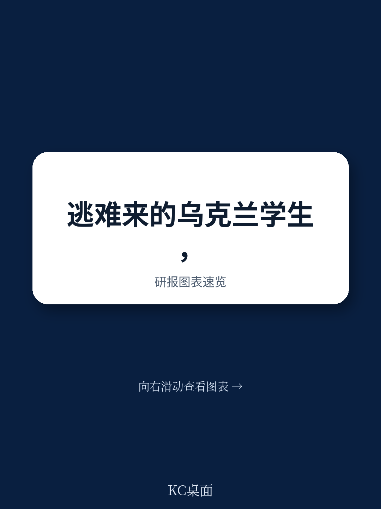
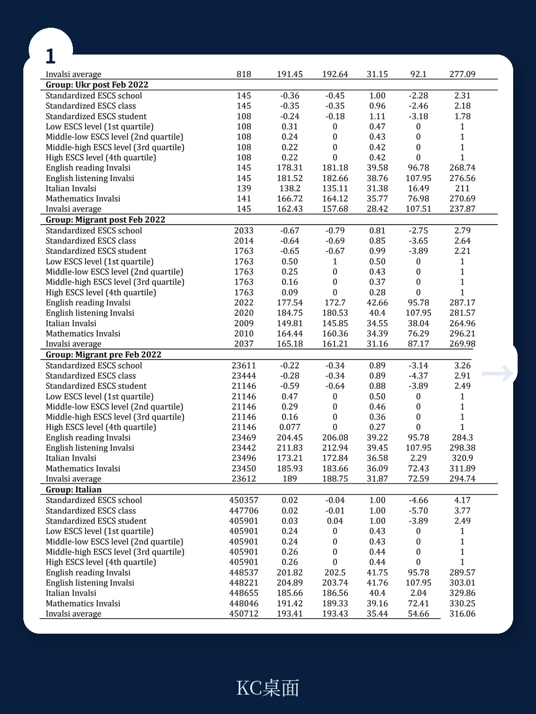
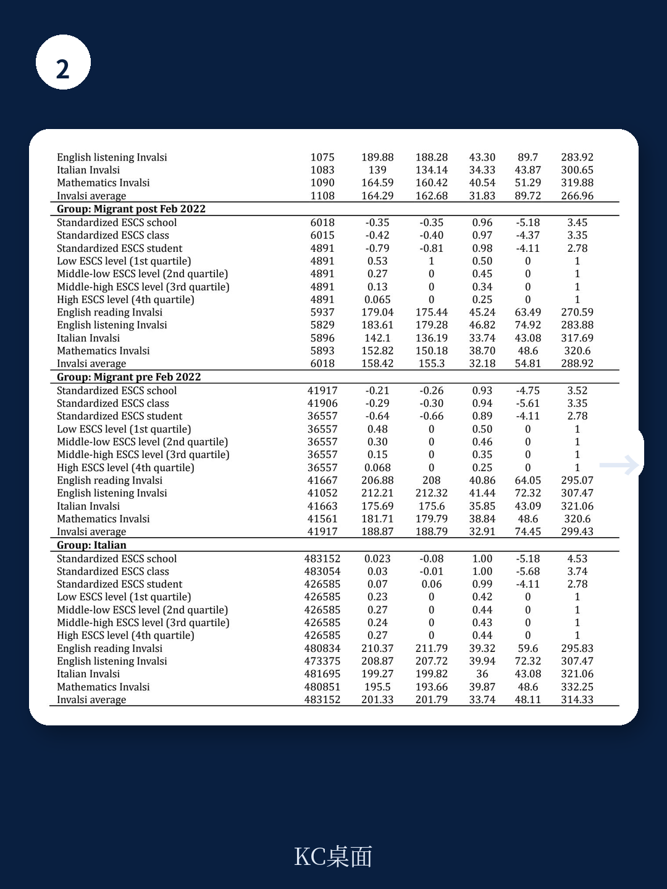

# 世界银行：乌克兰难民学生在意大利的学业，比想象中更依赖语言之外的东西

2022年俄乌冲突爆发后，超过600万乌克兰人被迫流离失所，其中近八成是妇女和儿童。意大利作为欧盟第五大接收国，接纳了约17万乌克兰难民。当这些孩子进入意大利学校时，一个关键问题浮现：他们的教育融入，究竟卡在哪里？

世界银行最新发布的工作论文《Displaced Learners: Early Integration of Ukrainian Refugee Students into Italy‘s Schools》给出了一个既直观又反直觉的答案。这份基于意大利教育部和INVALSI标准化考试数据的实证研究，覆盖了2021-2022至2023-2024学年，追踪了超过8000名乌克兰难民中学生的表现。核心判断是：乌克兰难民学生的学业困境并非单纯的语言障碍，而是语言、心理创伤、出勤率下降和教师期望之间复杂交互的结果。其中，一个被忽视的变量——教师推荐——正在成为决定这些学生长期教育轨迹的隐秘杠杆。

这不是一份简单的“难民需要帮助”的报告。它揭示了在接纳体系中，一个群体的“潜力信号”如何被识别、被放大或被浪费。对于关注人力资本投资、移民政策或欧洲社会结构的读者，这里有一组值得拆解的数据逻辑。

## 1. 入学率在改善，但真正的问题是高年级的“隐形流失”

报告数据显示，乌克兰难民学生的入学率在逐步上升，但远未达到理想水平。与意大利本土学生和已在意大利的其他外国学生相比，乌克兰难民在中学阶段的注册比例持续偏低。更值得关注的是结构性断层：在低年级（6-8年级），乌克兰难民学生的比例相对稳定，但进入高中阶段（10年级以上）后，这一比例急剧下降。到13年级（相当于高三），乌克兰难民学生仅占所有学生的0.06%。

这意味着什么？不是所有乌克兰孩子都留在了教育系统里。高年级的流失可能源于两个因素：一是部分家庭选择让年龄较大的孩子直接进入劳动力市场，以缓解家庭经济压力；二是语言和学术门槛随年级升高而急剧提升，导致辍学风险增加。

> **KC评论：** 入学率改善是一个“好消息陷阱”。如果只看低年级数据，容易得出“融入顺利”的结论。但高年级的断崖式下降才是真正需要干预的信号。完整报告里有一张按年级分布的入学率折线图，对比了乌克兰难民、其他新移民和意大利本土学生的曲线，值得仔细看——它揭示了“越往上走，系统性排斥越强”的规律。

## 2. 数学成绩是亮点，但语言科目暴露了深层短板

在标准化测试中，乌克兰难民学生的表现呈现出鲜明的学科分化。在数学科目上，他们的成绩与意大利本土学生和长期移民学生相比，差距并不显著；在某些年级和学校层面，甚至接近或持平。但到了意大利语和英语这类语言密集型科目，分数差距骤然拉大。

报告指出，乌克兰难民学生在数学上的相对优势，可能与其在乌克兰接受的基础教育质量有关。乌克兰的数学教育传统上较为扎实，这为这些学生提供了一种“可迁移的学术资本”。然而，语言能力的短板正在成为他们向更高学术轨道跃迁的硬约束。INVALSI数据显示，即使在控制社会经济背景后，乌克兰难民学生的意大利语成绩仍显著低于其他新移民群体，差距约在10-12个标准分点。

这种“数学强、语言弱”的模式，与许多第一代移民学生的表现类似，但乌克兰难民的情况更加极端——因为他们中的大部分人是突然被迫迁移，缺乏语言准备期。

> **KC评论：** 数学成绩的“韧性”往往被解读为“这些孩子底子好”，但报告没有展开的一个问题是：这种优势能持续多久？如果语言障碍在两年内没有突破性改善，数学优势也可能被拖累，因为高年级数学教学越来越依赖语言理解。完整报告里有分学科、分年级的分数分布箱线图，展示了这种优势的衰减斜率——它比想象中更陡。

## 3. 缺勤率是比分数更危险的早期预警信号

报告中的一个关键发现是：乌克兰难民学生的缺勤率显著高于其他所有学生群体，包括其他新移民。在2022-2023学年，乌克兰难民学生平均缺勤46天，而意大利本土学生仅23天，长期移民学生也仅29天。这意味着，乌克兰难民学生平均每学年有超过四分之一的时间不在教室里。

缺勤率的背后是多重因素的交织：心理创伤（部分学生经历了战争、分离和流离失所）、家庭不稳定性（母亲独自带孩子，面临经济和工作双重压力）、以及医疗或行政手续的频繁占用。报告特别指出，缺勤率与学业成绩呈显著的负相关，且这一效应在语言科目上尤为突出。

从政策角度看，缺勤率是一个“可干预”的变量。相比改变教学大纲或提升教师水平，降低缺勤率可能是短期内最有效的融入策略。但问题在于，缺勤的原因往往是学校系统无法独立解决的——它需要社会服务、心理支持和家庭经济援助的协同。

## 4. 教师的“乐观偏差”：推荐进入大学预科的比例高于其他新移民

这是报告中最反直觉的发现。尽管乌克兰难民学生在语言科目上表现不佳、缺勤率高，但教师对他们的学术轨迹推荐却出奇地积极。在意大利教育体系中，八年级结束时，教师需要推荐学生进入不同的高中轨道：职业高中、技术高中或大学预科（Lyceum）。数据显示，乌克兰难民学生被推荐进入大学预科的比例，显著高于其他新移民群体，甚至接近意大利本土学生的水平。

报告作者将这一现象解释为“教师对乌克兰学生潜力的乐观预期”。教师可能认为，乌克兰学生的学业困难是暂时的、环境性的（语言障碍、战争创伤），而非能力性的。相比之下，其他新移民群体可能面临更持久的刻板印象或低预期。

> **KC评论：** 教师的乐观是好事，但也可能带来“双刃剑”效应。如果学生被推荐进入高要求轨道，但实际支持不足（如语言辅导、心理疏导），他们可能在高年级遭遇更大的挫败感。报告没有完全回答的问题是：这些被推荐进入大学预科的学生，最终实际升学和毕业率如何？完整报告中有一张教师推荐与实际学业表现交叉分析的表，揭示了“推荐”与“完成”之间的差距——这是整篇报告最值得追问的伏笔。

## 5. 报告未完全回答的关键问题：心理支持的缺口究竟有多大？

报告明确列出了语言障碍、心理健康问题和不确定的未来作为三大整合障碍，但对心理支持的讨论相对有限。这并非报告的缺陷，而是数据限制的体现——行政数据可以记录出勤和分数，却难以捕捉学生的心理状态和创伤体验。

一个值得追问的问题是：目前意大利学校提供的心理支持，是否足以应对乌克兰难民学生的特殊需求？报告提到，意大利教育部发布了指导方针，包括心理援助和跨文化活动，但具体执行力度和效果缺乏系统评估。考虑到这些学生经历了战争、家庭分离和跨文化适应，心理创伤可能比语言障碍更隐蔽、更持久。

另一个未被充分探讨的维度是家庭支持。乌克兰难民家庭中，母亲往往是唯一的监护人，她们自身也在经历就业、住房和语言的多重压力。这种家庭层面的“支持赤字”，可能间接影响学生的学业表现和出勤行为。

## 6. 给观察者的三个分析框架：如何判断融入是否真正成功

基于报告的逻辑，我们可以提炼出三个评估难民学生教育融入的观察框架，供决策者和关注者参考。

第一，不要只看入学率，要看“留存率”。入学率是流量指标，留存率才是存量指标。如果高年级学生持续流失，说明系统在某个节点出现了结构性排斥。跟踪同一批学生从八年级到十二年级的留存曲线，比看单年数据更有意义。

第二，关注“语言-数学差距”的收敛速度。数学成绩是乌克兰学生的“锚点”，语言成绩是“瓶颈”。如果两年内语言成绩没有显著改善，数学优势也会被稀释。这个差距的收敛斜率，是衡量支持政策有效性的关键指标。

第三，警惕“推荐-完成”脱节。教师推荐进入大学预科的比例高，不等于实际毕业率高。推荐是期望，完成是结果。如果推荐率与毕业率之间存在系统性偏差，说明教师评估体系可能存在“乐观偏差”，需要更客观的跟踪数据来校准。

## 顺着这些未解问题继续读完整报告

世界银行这篇论文的价值，不仅在于它用数据刻画了乌克兰难民学生融入意大利教育的全景，更在于它揭示了几个被普遍忽视的“隐形杠杆”：教师推荐如何影响长期轨迹，缺勤率如何成为比分数更敏感的预警信号，以及数学成绩如何成为抵御语言劣势的缓冲垫。

但报告也留下了几个值得继续追问的缺口：心理支持的具体效果如何量化？教师推荐与实际毕业率的差距有多大？家庭层面的支持赤字如何影响学业？这些问题，报告给出了初步框架，但没有给出最终答案。

如果你关注难民政策、教育公平或人力资本投资，这份报告的原始图表、回归结果和分年级、分学科的详细数据，值得完整阅读。我们每天会由AI agent结合人工review，生成国际投行和智库的最新中文摘要与KC评论，包含当天最新数据图表合集，既方便喂给AI，也方便人工快速把握政策动态。加入社群，领取完整研报解读与原始图表，一起讨论这些未解问题。

Personal reading notes and learning share only. Not investment advice.

