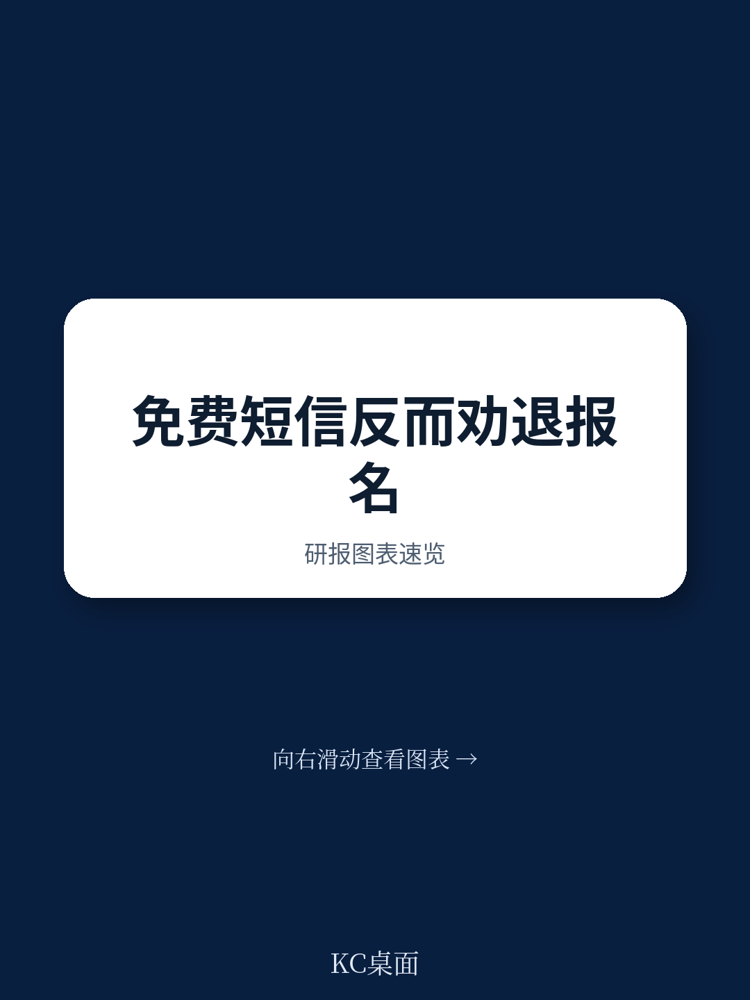
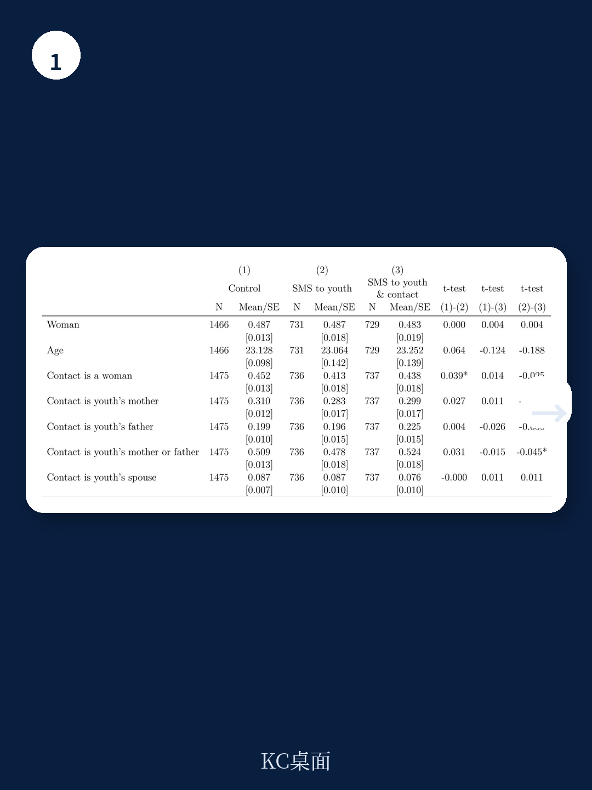
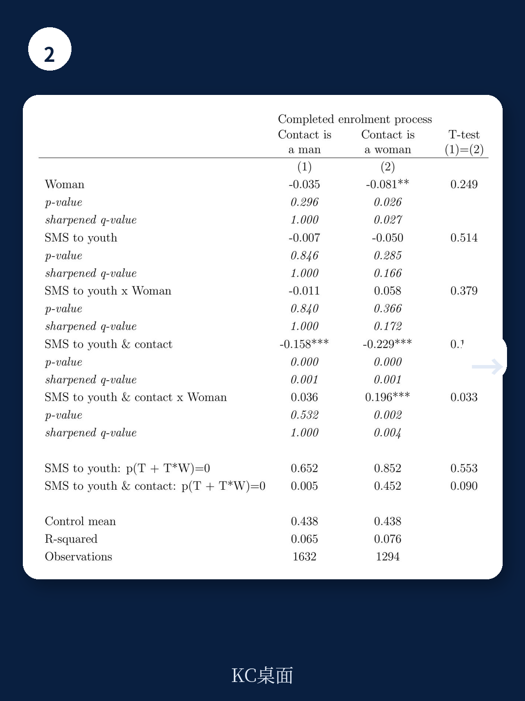

# 世界银行：免费短信反而劝退了求职者

一项在科特迪瓦开展的随机对照实验得出了一个反直觉的结论：当你试图通过短信提醒年轻人某个职业培训项目“完全免费”时，如果这条短信同时发给了他们的家人或联系人，反而会大幅降低报名率。男性报名率下降了42%，女性下降了20%。这个发现挑战了发展援助领域一个根深蒂固的假设——消除价格障碍就能提升参与率。

这份由世界银行研究团队发布的政策研究工作论文，基于国际救援委员会在科特迪瓦实施的PRO-Jeunes青年就业项目，通过对2926名合格申请者的随机分组实验，揭示了信息传递中一个被长期忽视的陷阱：当“免费”成为唯一卖点，它可能被解读为“廉价”或“欺诈”。

## 1. 向申请者和联系人同时发送“免费”信息，反而导致报名率骤降

实验设计了两个处理组：第一组只向青年申请者本人发送短信，提醒项目免费；第二组同时向申请者及其预留的联系人发送相同内容。结果显示，只给本人发短信对报名率没有显著影响——既不提升也不降低。但一旦联系人也被纳入信息接收范围，报名率出现断崖式下跌。

男性从对照组的43.8%降至25.2%，女性从38.5%降至30.7%。这个差异在统计上高度显著。更值得关注的是，这种负面效应在男性身上比女性严重得多——男性的报名率降幅比女性多出10.8个百分点。

> **KC评论：** 这组数据揭示了一个关键机制：信息接收者并非孤立决策者。在集体主义文化浓厚的西非社会，家庭和社区的意见对青年选择有决定性影响。当联系人——通常是父母或配偶——收到“免费”信息时，他们缺乏对项目背景的了解，更容易产生怀疑。完整报告中的定性访谈数据进一步印证了这一点：联系人普遍认为“免费”要么意味着低质量，要么是骗局。

## 2. 免费信号在缺乏信任基础时会反向触发质量担忧

为什么“免费”这个看似积极的信号会适得其反？研究团队引入了一个经典的经济学理论框架——价格信号理论。在信息不对称的市场中，价格往往被消费者用作质量的代理指标。高价传递高质量信号，低价或免费则可能暗示低劣。

在科特迪瓦的语境下，这个问题被进一步放大。青年在预注册阶段已经参加过项目说明会，对实施机构国际救援委员会有一定了解。但他们的联系人从未接触过项目方，收到一条来自陌生号码的“免费培训”短信，第一反应不是机会，而是警惕。

定性访谈中，受访者明确表示：如果短信能够同时说明项目主办方的信誉和背景，他们的信任度会大幅提升。联系人尤其强调“信任组织”的重要性。这意味着，当信息传播链条从项目方延伸到社会网络时，信任的断层就出现了——项目方与青年之间已经建立了初步信任，但与青年背后的社会关系网络之间，信任为零。

## 3. 女性联系人是唯一未被“劝退”的群体，揭示性别角色对决策的深层影响

实验最有趣的发现来自对联系人性别的异质性分析。当联系人被进一步区分为男性和女性时，一个清晰的模式浮现出来：所有向青年和联系人发送短信的组合都显著降低了报名率，唯有一个例外——女性青年加上女性联系人。

具体数据：男性青年无论联系人是男是女，报名率都大幅下降（男性联系人组下降36.2%，女性联系人组下降52.3%）。女性青年如果联系人是男性，报名率下降30.3%；但如果联系人是女性，则没有统计上显著的负面效应。

进一步限制样本至联系人仅为父母的情况，结果依然稳健：只有母亲作为联系人的女性青年不受“免费”短信的负面影响。

> **KC评论：** 这个发现值得政策制定者深入思考。它可能反映了两个层面的现实：一是女性联系人（尤其是母亲）对女性青年就业机会的认知更贴近实际，她们更清楚劳动力市场对年轻女性的限制，因此不会轻易否定一个培训机会；二是性别权力结构在其中发挥作用——男性联系人更倾向于对青年（无论男女）的决策施加影响，而女性联系人的干预意愿或能力可能较弱。但正如报告谨慎指出的，联系人选择本身可能存在自选择偏误：选择母亲作为联系人的青年，与选择父亲作为联系人的青年，本身可能就存在系统性差异。

## 4. 报告尚未完全回答的关键问题：这究竟是信息设计问题，还是信任构建问题？

研究团队在论文结尾提出了几个值得未来研究深挖的方向。其中最核心的一个问题是：如果“免费”信号在缺乏信任时产生反效果，那么什么样的信息设计才能真正提升参与率？

附录中提到了另一组实验——发送强调项目长期收益的短信。结果更加复杂：同样只发给本人时没有效果；同时发给联系人的情况下，男性报名率下降，女性反而上升。这个结果的“非结论性”恰恰说明了问题的复杂性：信息内容、接收者身份、性别组合三者之间存在高度情境依赖的交互效应。

另一个尚未解决的问题是：联系人选择的因果机制。目前的数据只能告诉我们“女性联系人对女性青年有保护作用”，但无法区分这是联系人性别本身的效应，还是选择女性联系人的青年群体本身的特征所致。要厘清这一点，需要随机分配联系人性别——这在现实中操作难度极大。

## 5. 对发展项目传播策略的三个重新设计原则

从这份研究中可以提炼出对任何面向低收入群体的项目传播策略都适用的观察框架：

第一，信任必须先于信息。在向目标群体的社会网络扩散信息之前，必须先建立项目方在该网络中的可信度。这意味着传播策略不能只针对直接受益者，还需要前置性地接触和影响他们的关键联系人——父母、配偶、社区领袖。

第二，“免费”不是万能卖点。在信息不对称严重的环境中，强调价格优势可能适得其反。传播信息应当优先传递项目质量信号——合作机构、过往成功案例、师资背景、就业率数据——这些才是建立信任的基石。

第三，性别维度必须嵌入传播设计。男性联系人对信息的负面解读倾向更强，女性联系人（尤其是母亲）对女性青年的保护效应更明显。这意味着针对不同性别组合的传播策略可能需要差异化设计，甚至可以考虑“只通知女性联系人”的定向策略。

这份研究的价值不仅在于它的反直觉结论，更在于它用严格的实验方法揭示了一个普遍存在于发展项目中的传播盲区：我们习惯于假设“更多信息”等于“更好决策”，却忽略了信息接收者的社会位置和信任状态对信息解读的决定性影响。

报告中的定性数据还包含了更多关于联系人如何解读“免费”信号的细节，以及他们提出改进建议的具体内容——这些信息对于设计下一阶段的传播策略至关重要。同时，附录中关于“长期收益”短信的完整实验结果和分析，也提供了另一个维度的验证。

如果你正在设计或评估面向青年群体的就业培训项目，或者对发展经济学中的行为干预机制感兴趣，这份报告值得从头到尾仔细阅读。我们已将完整研报的解读与原始数据图表整理成每日简报，包含更多细节和我们的分析框架。感兴趣的朋友可以加入社群，每天会由AI agent加上人工审核，生成约10至40页的国际投行与学术机构中文摘要与评论，涵盖最新数据图表合集，方便快速把握全球发展政策研究的前沿动态。

Personal reading notes and learning share only. Not investment advice.

