# Does Social Mobility Affect Economic Development?

Cross-Country Analysis Using Different Mobility Measures

Iván Torre

Michael Lokshin

James Foster

POLICY RESEARCH WORKING PAPER 11056

## Abstract

This paper analyzes the relationship between intergenerational educational mobility and long-term growth across the world using different mobility measures, comparing absolute mobility indicators with relative mobility indicators. The analysis is carried out across a panel of 68 countries over 2000–20. The results indicate that upward mobility in higher education is positively associated with gross domestic product per capita in Europe and Central Asia, but relative mobility indicators are uncorrelated with country income. In Latin America, higher relative mobility is associated with lower income, and higher absolute mobility is associated with higher income. The remaining regions of the world show a mix of these patterns.

# Does Social Mobility Affect Economic Development? Cross-Country Analysis Using Different Mobility Measures

Iván Torre, Michael Lokshin, and James Foster $^{1}$

Keywords: Intergenerational social mobility, education, economic growth

JEL: D63, I24, J62, O15, O52

## 1. Introduction

Technological progress is the primary driver of economic growth and improvements in living standards. However, higher spending on research and development alone may be insufficient to fuel breakthrough scientific innovations that require an increasing flow of talented, well-trained people (Romer 2000). When all the talents in society are fully realized, the labor markets become more efficient, and productivity grows at a faster rate. But only in socially mobile societies, where family circumstances do not matter in explaining educational outcomes, can talent be better allocated. Thus, it is expected that socially mobile societies may also be more prosperous. The extent to which this expectation is true remains unclear.

Complex interactions between inherited traits, social norms, the environment in which children are raised, labor markets, and public policies determine individuals' opportunities to reach their full potential. Education plays a major role in defining a person's career trajectory and lifetime earnings. The level of investment in a child's education strongly depends on parental income and human capital as well as on parental preferences and risk perceptions (Christoph et al. 2024). Better-educated parents not only earn more, but they are also more effective in producing human capital in their children. The complementarity between parental human capital and investments in children leads wealthier parents to invest more in their children's human capital than poor parents do (Heckman and Mosso 2014; Becker and others 2018). Without government involvement, the intergenerational persistence of education will perpetuate cross-generational income inequality, reducing the chances of talented children from poor families succeeding in life (Corak 2013; van der Weide and others 2023). By drawing such children into science and innovation, policies designed to improve intergenerational mobility could increase the number of inventors and boost economic growth (Bell and others 2019). In fact, as the social returns on discoveries usually greatly exceed the personal returns to innovators, the case for public policy interventions is strong.

A challenge in making policy inferences from the analysis of intergenerational educational mobility is the possibility that the observed immobility is a consequence of other economic failures in society. For example, the primogeniture that strongly suppresses social mobility could be a response to inefficient capital markets and the need to ensure a minimal firm size (Rodríguez 2009). Comparing intergenerational mobility across countries and relying on cross-country variations in educational and welfare policies and regulations could help (partially) disentangle the contributions of different correlates of social mobility.

This paper analyzes the link between changes in intergenerational mobility and long-term development. The paper combines data on intergenerational educational mobility from three rounds of the Life in Transition Survey (2010, 2016, and 2022–23) (EBRD 2024), which covers more than 30 countries in Europe and Central Asia, and data from the Global Database on Intergenerational Mobility (GDIM, Van der Weide and others 2023). Data on mobility is complemented by data on present and past economic outcomes to form a panel of 68 countries over the period 2000-2020. This paper contributes to the literature on intergenerational mobility and development in two ways. Our primary contribution is that, unlike existing studies that focus on subnational districts or specific regions, we carry out a worldwide cross-country analysis of the relationship between intergenerational mobility and country income. This allows us to provide evidence of the nature of this relationship across different development contexts. The second contribution of our paper is to introduce a new measure of intergenerational mobility in education—the mobility gap—and compare its performance with several existing mobility measures. This paper presents the first empirical application of this new measure.

The patterns of intergenerational mobility across countries and generations vary significantly depending on the mobility measure used. In Europe and Central Asia, upward absolute mobility has been declining across birth cohorts, while relative mobility has not changed significantly, suggesting that an absolute reduction in intergenerational mobility in education may be common across the entire education distribution. South Asia has seen increases in absolute and relative mobility, while Latin America has experienced little change in absolute mobility but increases in relative mobility.

The empirical analysis of the association between intergenerational mobility and country income levels shows a significant context-specific relationship. Indicators of relative mobility in Europe and Central Asia are not correlated with country income levels over time. Only a specific dimension of absolute mobility—upward mobility in higher education (the probability that an individual whose parents did not achieve higher education does so)—shows a positive and statistically significant association with country income. In Latin America and the Caribbean, higher relative mobility is associated with lower income, while higher absolute mobility is associated with higher income. This finding suggests that some aspects of mobility may be more relevant for development in some contexts than others.

The following section reviews relevant studies of intergenerational educational mobility. Section 3 examines measures of mobility. Section 4 describes the study's empirical methodology. Section 5 describes the data. Section 6 presents the main patterns of intergenerational educational mobility. Section 7 presents the main results of the empirical analysis and associated robustness tests. Section 8 concludes.

## 2. Literature review

Multiple studies carried out a descriptive exploration of the patterns of intergenerational educational mobility. Hertz et al. (2007) use data from 42 countries between 1992 and 2005 to measure the persistence of educational attainment across generations by birth cohort. They find significant variation in the cross-country levels of intergenerational educational mobility, with high persistence of educational attainment in Latin America and much higher educational mobility in countries of Northern Europe. Chevalier, Denny, and McMahon (2009) study the patterns of intergenerational educational mobility in 20 developed countries, including the United States, Canada, New Zealand, and 17 European countries, and find that expanding access to higher education is not always associated with increased mobility. Causa and Johanson (2010) find a positive and significant correlation between parental human capital and their children's educational and wage outcomes in countries of the Organisation for Economic Co-operation and Development (OECD).

Financial constraints may hold back high-ability individuals from disadvantaged backgrounds. Razzu and Wambile (2022) study intergenerational educational mobility in 34 countries of Sub-Saharan Africa for cohorts born in the 1960s–1990s. They find that children’s educational outcomes depend strongly on their parents’ educational status but that the strength of this association is weaker for younger generations. The authors point to high heterogeneity in educational mobility across African countries. Van der Weide and others (2023) compile a global database of intergenerational educational mobility in 153 countries and demonstrate that such mobility is estimated to be lower in the average developing country than in the average high-income country.

Among the few papers that study the link between social mobility and economic development, Aydemir and Yazici (2019) discover that regions of Türkiye with better school availability, greater social capital, higher home resources, and lower educational inequalities tend to have higher intergenerational mobility. Güell and others (2018) find similar results in Italy, where provinces with higher levels of economic activity, lower inequality, and higher social capital and educational attainment have greater intergenerational social mobility. Lee and Lee (2022) analyze the persistence of intergenerational education attainments by age cohorts in 30 developed economies and find that higher per capita GDP positively correlates with social mobility. Neidhofer and others (2023) estimate the relationship between changes in educational intergenerational mobility and regional economic indicators in a sample of 52 regions in six countries in Latin America. They report that increasing social mobility correlates with rising income per capita, income growth, and other development indicators.

A few studies reach different conclusions. Clark and others (2014) conduct a multi-country historical analysis of social mobility based on surnames. They argue that economic development, progressive income redistribution, and development of public education matter less than other studies suggest, claiming that mobility varies little across societies and is, therefore, uncorrelated with economic outcomes.

## 3. Measures of educational mobility

We use four measures to capture trends in intergenerational educational mobility across countries and generations.

## Oriented mobility measures

The new approach to measuring intergenerational mobility proposed by Foster and Rothbaum (2023, unpublished) addresses the shortcomings of many measures of intergenerational mobility and proposes new axiomatically sound, practical, simple-to-implement, and easy-to-communicate measures. This paper offers the first empirical application of this method.

The two most common approaches to measuring intergenerational mobility are to estimate correlations between and the elasticity (as a regression coefficient) of children's education with respect to their parents' education (see, for example, Aydemir and Yazici (2019)). Despite their popularity, both methods have shortcomings.

First, they may fail to register dynamic changes in educational structure. For example, increases in educational attainment by children of better-educated parents and stagnation or decline in the attainment of children from less-educated households could lead to an increase, a decrease, or no change in intergenerational mobility measured by the elasticity (Corak 2013).

Second, the approaches produce misleading subgroup comparisons because they measure regression to the subgroup mean rather than the population mean. As a result, two age cohorts could have the same intergenerational mobility even if the later cohort had much higher mean educational attainment.

Third, the correlation and elasticity measures are not decomposable by group, making it challenging to use them for targeting (e.g., Blyth 1972). $^{2}$

Transition matrices are another popular class of intergenerational mobility measures (Shorrocks 1978). The transition matrices define groups (such as primary, secondary, and higher education) and estimate the probability of transitioning from one group to another. The transition matrixes capture the distribution of movements across groups; they can separate outcomes for children from, for instance, households with low and high levels of education.

Although they yield richer policy implications than the elasticity and correlation-based measures, transition matrices have their own problems. Among them are data censoring and arbitrary thresholds, when only movements across these thresholds “count” as mobility and thus are amplified in the analysis, while movements not observed due to censoring are not counted. $^{3}$ As a result, it might be challenging to separate the effects on intergenerational mobility of the underlying fundamental changes in the educational structure from the effects of censoring and the choice of cutoffs. Transition matrices also produce no headline measures, which is crucial for the ability of policy makers to communicate their intentions to the public and, thus, for successful policy implementation.

Distance-based mobility measures, often used to analyze income mobility (see Cowell 1985; Field and Ok 1996; Batana and Duclos 2010; Corak, Lindquist, and Mazumder 2014; Bárcena-Martín and Cantó 2024), are seldom used to analyze educational intergenerational mobility. Unlike transition matrixes, distance-based measures require no arbitrary thresholds, and they capture the churning or flux of educational attainments across groups well. These measures can also be used to generate policy-relevant headline metrics. Distance-based mobility measures ignore the direction of change or the “quality” of mobility, however, and are not helpful for policy targeting or identifying groups that benefited most from mobility or suffered the most from lack of it.

The new oriented distance-based approach to measuring intergenerational mobility aims to assess whether children have greater educational attainment than their parents and, if so, by how much. Foster and Rothbaum (2023) discuss the axiomatics and theoretical considerations for the class of oriented mobility measures $M(p)$ . We summarize the theoretical results relevant to our empirical analysis. $^{4}$

Define the set of upward movers such that

$$
Q ^ {U} = Q ^ {U} (\boldsymbol {p}) = \bigl \{i \colon s _ {i} ^ {p} <   s _ {i} ^ {c} \bigr \},   p _ {i} = \binom{s _ {i} ^ {p}}{s _ {i} ^ {c}}, i = 1, \ldots n\tag{1}
$$

and a set of downward movers such that:

$$
Q ^ {D} = Q ^ {D} (\pmb {p}) = \{i \colon s _ {i} ^ {p} > s _ {i} ^ {c} \},\tag{2}
$$

where p is a vector of parent–child dyads $p_{i}$ , $s_{i}^{p}$ is the parent's years of education, $s_{i}^{c}$ is the child's years of education, and n is the number of dyads. Once dyads are categorized according to equations (1) and (2), they can be aggregated to obtain oriented measures of intergenerational mobility. The most straightforward metric is the oriented headcount ratio:

$$
H ^ {o} = \frac {q ^ {o}}{n} f o r O = U, D,\tag{3}
$$

where $q^{o} = |Q^{o}|$ is the number of movers.

The oriented headcount ratio conveys meaningful information about mobility. Like the headcount ratios in poverty analysis, however, it is a crude way of assessing the extent of mobility. This shortcoming could be remedied by incorporating the average educational gap between a parent and a child by defining the oriented educational gap $I^{o}$ as follows:

$$
I ^ {o} = \frac {1}{q ^ {o}} \sum_ {i \in Q ^ {o}} \left| s _ {i} ^ {c} - s _ {i} ^ {p} \right| \mathrm{and} G ^ {o} = H ^ {o} I ^ {o} \mathrm{tobetheOrientedmobilitygap.} ^ {5}\tag{4}
$$

## Absolute mobility measures

The oriented mobility gap captures broad movements of the education distribution across generations. Alternative absolute mobility measures focus on the movement of certain parts of the education distribution. A measure proposed by Alesina and others (2021) estimates the probability of completing primary education by children whose parents did not. Neidhofer and others (2023) used a similar measure, the probability of upward mobility, focusing on completing secondary school. These measures may not have adequate empirical support in higher-income countries, where primary education completion is almost universal and secondary education is increasingly so, as Van der Weide and others (2023) point out. Because our sample represents mostly a mix of high- and middle-income countries, we redefine this measure, which we denoted as upward mobility in higher education (UMHE), as the probability of completing higher education by children whose parents did not:

$$
U M H E = P r o b (s _ {i} ^ {c} \geq t e r t i a r y \mid s _ {i} ^ {p} <   t e r t i a r y)\tag{5}
$$

## Relative mobility measures

One of the common measures of relative mobility is intergenerational persistence (IP) in education, defined as the additional years of schooling of a child associated with one more year of schooling of his or her parents. This measure is derived from a multivariate model that is specified as

$$
s _ {i} ^ {c} = \beta s _ {i} ^ {p} + \gamma C _ {i} + \varepsilon_ {i},\tag{6}
$$

where $s_i^c$ is years of education of the child $i$ , $s_i^p$ is years of education of the child's parents, and $\beta$ is the degree of IP. $\beta = 0$ represents a case of complete mobility; the educational attainment of children is unrelated to the education of their parents; $\beta = 1$ represents the case in which the education of the children mirrors the education of the parents (an extra year of education of the parents results in one more year of child schooling). A higher value of $\beta$ represents a lower degree of mobility. $C_i$ is a vector of individual characteristics of the child, the child's parents, and the characteristics of the household when the child was young. However, following Van der Weide and others (2023) and to ensure consistency with the estimates of this measure coming from the

GDIM, we do not include in our specification any control variable other than a dummy indicator for the survey in which the data were collected (to control for differences in the data collection process). $^{6}$

An additional measure of relative mobility is the intergenerational correlation (IC) in education—the correlation between $s_i^c$ and $s_i^p$ . IC is defined similarly to IP but in terms of the standard deviation of schooling. It measures the increase in standard deviations of a child's education associated with a one standard deviation increase in his or her parents' education. A higher correlation indicates a lower degree of mobility.

## 4. Educational mobility and economic development: Empirical framework

To analyze the relationship between educational mobility and economic development, we rely on a framework similar to that of Neidhofer and others (2023). Our main empirical specification is the following:

$$
Y _ {c t} = \omega_ {c} + \tau_ {t} + \beta M _ {c t} + \pmb {\delta} _ {x} \pmb {X} _ {c t} + \pmb {\delta} _ {h} \pmb {H} _ {c t} + \pmb {\delta} _ {i} \pmb {I} _ {c t} + \varepsilon_ {c t},\tag{7}
$$

where $Y_{ct}$ is the level of income in country c in year t; $\omega$ are country fixed effects; $\tau$ are year fixed effects; $M_{ct}$ is the aggregate level of mobility in country c in year t, calculated using maternal education; $^{7}$ $X_{ct}$ , $H_{ct}$ , and $I_{ct}$ are vectors of control variables; $\varepsilon$ is a residual; and $\beta$ and $\delta$ are parameters to be estimated. As control variables, we include contemporary country-level variables ( $X_{ct}$ ), such as income inequality (measured by the Gini index) and the log of population size (which we include with a quadratic polynomial). We also include a set of cohort-level variables ( $H_{ct}$ ), such as the average years of education of the workforce and its standard deviation. These two variables aim to control for different levels and allocations of human capital, respectively. We also include a set of variables related to the initial conditions of the birth cohorts in the workforce (Ict)—namely, the log GDP per capita, the population size, and the infant mortality rate in the decade of birth. The initial conditions during childhood may have long-term effects on adult productivity and affect the relationship between mobility and economic development.

The misallocation of talent that results from low educational mobility within a given birth cohort may impact productivity only when this birth cohort enters the workforce. To take this into account, we follow Neidhofer and others (2023) to estimate cohort participation profiles for each country-year. We estimate the aggregate level of mobility in the following way:

$$
M _ {c t} = \sum_ {b = 1} ^ {B} \frac {n _ {b c t}}{\sum_ {b = 1} ^ {7} n _ {b c t}} m _ {b c},\tag{8}
$$

where $m_{bc}$ is the mobility of cohort b (out of a total of B cohorts) in country c, and $n_{bct}$ is the number of employed people in cohort b in country c in year t. The aggregate level of mobility in a country at a given time is thus the weighted mobility of the different cohorts, where the weights are the share of each cohort in the country’s labor force at that point in time. We apply this same weighting procedure to the cohort-specific variables in equation (7).

## 5. The data

This paper combines data from two main sources: the Life in Transition Survey (LiTS) and the Global Database on Intergenerational Mobility (GDIM).

LiTS is used as the primary data source for deriving intergenerational educational mobility in the countries of Europe and Central Asia. LiTS has been implemented by the European Bank of Reconstruction and Development (EBRD) and the World Bank. The survey covers the transition economies of Europe and Central Asia $^{8}$ and several comparator countries in Western Europe, the Middle East, and North Africa (EBRD 2023). The first round of the LiTS was carried out in 2006, the second in 2010, the third in 2016, and the fourth in 2022–23. This study uses the second, third, and fourth rounds, which provide comparable information on parental education. $^{9}$ The survey included a nationally representative sample of around 1,000 households per country in the second and fourth rounds and around 1,500 households per country in the third round. The second round covers 35 countries, the third round 34, and the fourth round 39. The 30 countries that were included in all three rounds used in our study include all the countries that were part of the former Soviet Union except Turkmenistan; Czechia and the Slovak Republic; and Germany, Türkiye, and the remaining countries in Central and Eastern Europe that transitioned from a planned to a market economy during the 1990s. $^{10}$ Several countries of Western Europe, the Middle East, and North Africa were included in some (but not all) rounds. $^{11}$ For these countries, we estimate intergenerational mobility using GDIM data (discussed later in this section).

The main variable is the educational attainment of the survey respondents and their parents, expressed in years. The second round of the LiTS recorded the educational attainment variable in years; in the third and fourth rounds, educational attainment was recorded in completed levels of education. A country-specific correspondence table between levels of education and years of schooling was used to transform this categorical variable into years of schooling (UNESCO Institute of Statistics 2021). These correspondence tables are based on 2010 data and may not accurately reflect the correspondence between years of schooling and levels of education for past years, particularly for individuals who completed their education several decades ago. The differences are likely to be minor, and, as detailed later, we control for them. $^{12}$ Information on the number of observations with non-missing information per country and birth cohort is included in the appendix. $^{13}$

For countries outside Europe and Central Asia, we use the GDIM dataset, which provides estimates of intergenerational educational mobility for four birth cohorts (individuals born in the 1950s, the 1960s, the 1970s, and the 1980s) across 114 countries (van der Weide and others 2023). It draws on microdata from social and household surveys, which contain retrospective information on parental education. Similarly to the LiTS, the GDIM relies on a correspondence between categorical information on attained levels of education and the equivalent number of years of schooling.

Our empirical analysis includes variables from other sources. GDP per capita and population come from the World Development Indicators (World Bank 2023). Historical GDP per capita and population (used to estimate GDP per capita and population at the decade of birth of the different cohorts) are from the 2020 edition of the Maddison Project Database (Maddison Project Database 2020; Bolt and van Zanden 2020). Historical infant mortality rates from 1950 onward are estimated by the United Nations' World Population Prospects Population Division (UNDESA 2022); rates for 1930–50 are from various historical sources.

Our cross-country panel of educational mobility and economic outcomes includes 1,419 country-year observations in the period 2000-2020, covering 108 countries. However, we have 10 or more non-missing country-year observations only for 68 countries. $^{14}$ This sub-panel of 1,244 country-year observations is the primary sample of our empirical analysis. Table 1 presents the descriptive statistics of the main variables of our analysis for the cross-country sample.

## 6. Educational mobility across countries and generations

This section describes the patterns of intergenerational educational mobility observed across countries and generations, using the enlarged sample of 115 countries for which we have estimates of mobility. We start our descriptive analysis by looking into the patterns of the upward mobility gap, the new oriented mobility measure that we apply in this work.

The average upward mobility gap for the 1980s birth cohort varies from 0.8 (in Uzbekistan, with respect to fathers) to 9.1 (in Tunisia, with respect to mothers). When looking at the 1950s birth cohort, the upward mobility gap varies from 0.7 (in Mauritania, with respect to fathers) to 8.3 (in Viet Nam, with respect to mothers). While the upward mobility gap calculated with respect to fathers and the one calculated with respect to mothers are correlated (figure 1), the values with respect to mothers are, in most cases, above those calculated with respect to fathers. This results from the lower average educational attainment among mothers.

High values of the upward mobility gap usually occur when the share of children having more education than their parents is high (the horizontal axis in figure 2), and the increase in years of education among children who are more educated than their parents is large (the vertical axis in figure 2). For the 1980s birth cohort, the median share of upward movers (calculated relative to their mother's education) is 61 percent (58 percent relative to their fathers'). The median increase in years of education is 5.7 relative to mothers' education and 5.3 years relative to fathers'.

Figure 3 plots the values of upward mobility for every birth cohort, calculated with respect to mothers' education (a similar pattern is found when mobility is calculated with respect to fathers' education). For Europe and Central Asia, we plot the values ranging from the 1930s birth cohorts to the 1990s birth cohorts, using all the information available from LiTS. For the remaining regions of the world, for which we use information from GDIM, we plot the values from the cohorts born between the 1950s and the 1980s. In almost every country, upward mobility is lowest for the younger generations. The patterns of upward mobility across the world are heterogeneous. In South Asia, the Middle East and North Africa, Sub-Saharan Africa, and East Asia and the Pacific, the younger generation have witnessed an increase in upward mobility. In Latin America, in high-income countries, and particularly in Europe and Central Asia, younger generations have lower upward mobility than older generations. In Europe and Central Asia, the median upward mobility of the cohort born in the 1990s was about 40 percent less than those born in the 1930s or 1940s. $^{15}$ The secular increase in education levels might explain part of this movement in the more educated regions: as the average education of parents increased over time, the gap between parental and children's education decreased. $^{16}$

The patterns of upward mobility across generations can be explained by changes in the share of upward movers (figure 4), while in most regions, the average difference in years of schooling for upward movers (figure 5) remained stable. In South Asia, for instance, about 36 percent of people born in the 1950s have more education than their mothers, with an average difference of 6.5 years of education. For people born in the 1980s in the same region, the median share of upward movers is 68 percent, with a median difference of 7.4 years of education. A similar pattern holds for mobility relative to the father's education. In Europe and Central Asia, the median share of upward movers (with respect to mothers) in the 1950s birth cohort was 73 percent, with a median difference of 5.3 years of education. The median values for the 1980s birth cohort were 44 percent and 4 years of education.

The upward mobility gap can be compared with the probability that a child of parents who did not attain higher education does so or upward mobility in higher education (figure 6). Unlike the upward mobility gap, upward mobility in higher education has increased over generations across all regions. There are, however, significant differences in levels, with the upward mobility in higher education considerably higher in high-income countries than in other regions of the world.

The upward mobility gap can also be compared with the more standard relative mobility measures, such as IP and IC. Panel a of figure 7 compares the upward mobility gap with IP; panel b compares the upward mobility gap with IC. In both cases, mothers' education is used as a measure of parental education. The correlation between these indicators of relative mobility and the upward mobility gap is very low. The cross-country correlation between IP and the upward mobility gap has a value of $\rho = 0.17$ , and between IC and the upward mobility gap has a value of $\rho = 0.16$ . Countries with low IC (high relative mobility) can have both small (Kyrgyz Republic) or large (Tunisia) upward mobility gaps. Similarly, countries with high IC can have small (Hungary) or large (Cyprus)

upward mobility gaps. This pattern suggests that absolute and relative mobility may not necessarily be correlated across countries.

Figures 8 and 9 look at changes in IP and IC, respectively. In the case of IP, in all regions except for Europe and Central Asia and Sub-Saharan Africa, the younger generations have lower values of persistence (and, thus, higher relative mobility) than older generations. In the case of IC, the changes have been more muted and more common across regions – the correlation between mothers’ education and their children’s education has slightly increased over generations (indicating a decrease in relative mobility) for all regions. As pointed out by Van der Weide and others (2023), the difference in the mobility trends across these two indicators results from their different association with educational inequality. IP is sensitive to changes in educational inequality within cohorts, while IC is not. For a given level of IC, persistence increases as the dispersion in the children’s education increases and decreases as the dispersion in parents’ education increases. The decrease of IP across generations witnessed in some regions in the context of a relatively stable IC is most probably the result of underlying changes in the distribution of education within cohorts.

The patterns shown by the different mobility measures do not necessarily align. In Europe and Central Asia, upward absolute mobility has been declining across birth cohorts, while relative mobility did not change significantly, suggesting that an absolute reduction in intergenerational mobility in education may be common across the entire education distribution. Other regions, such as South Asia, have seen increases in both absolute and relative mobility, while Latin America has seen little changes in absolute mobility but increases in relative mobility.

## 7. Educational mobility across countries and development

In this section, we present the results of the empirical analysis of the relationship between educational mobility and development. We focus on the subset of 68 countries for which we have non-missing data for the main specification in at least 10 of the 21 years from 2000 to 2020.

Panel “a” of table 2 presents the basic specification of equation (7), with no controls other than country and year fixed effects. The results show no significant correlation with the logs of per capita GDP for any of the four mobility indicators except IP, which is positively associated with per capita GDP, implying that lower relative mobility is associated with higher income. Panel “b”

interacts mobility indicators with regional dummies to uncover geographic heterogeneity. $^{17}$ The positive association of persistence with income is driven mostly by high-income countries, and by developing countries in Asia and Africa to a lesser degree – with no statistically significant association present in the case of Europe and Central Asia or Latin America. In the case of IC, the lack of a strong association with GDP per capita is common across all the regions, although there is a mildly significant positive relationship in Europe and Central Asia and Latin America.

When it comes to indicators of absolute mobility, the upward mobility gap is positively correlated with income in Latin America and in developing countries of Asia and Africa (higher mobility, higher income), but it is negatively correlated with income in Europe and Central Asia (higher mobility, lower income). For upward mobility in higher education, the association with GDP per capita is positive and strongly significant (higher mobility, higher income) in all regions except high-income countries. These results show no clear pattern across regions in terms of the relationship between mobility and country income levels – this association appears to be region-specific. Overall, higher absolute mobility is correlated with higher income, while the evidence points to a more muted relationship for relative mobility.

The inclusion of control variables reinforces these findings (table 3). The association between mobility and GDP per capita is context-specific. In high-income countries, lower relative mobility-as measured by higher values of IP and IC- is correlated positively and significantly with income levels. In Europe and Central Asia, the upward mobility gap has a negative -although statistically weak-association with GDP per capita, while upward mobility in higher education is strongly and positively associated with income levels. In Latin America and the Caribbean, as well as in the developing countries of Asia and Africa, all absolute mobility indicators are positively associated with income, while for relative mobility, the estimates for IC point to a negative relationship with GDP per capita. These results both coincide and contrast those reported by Neidhofer and others (2023) for Latin America, who find a statistically significant and positive association of all mobility indicators—relative and absolute—with subnational GDP per capita. $^{18}$ In our analysis, the positive relationship of absolute mobility with income is also present, but in the case of relative mobility, higher relative mobility is associated with lower income. $^{19}$

The magnitude of the relationship between mobility and GDP per capita varies across indicators and regions. A one standard deviation increase in the upward mobility in higher education results in an increase in GDP per capita of about 0.9-1.6 standard deviations depending on the region - leaving aside high-income countries where the relationship is not statistically significant. A one standard deviation increase in the IC (implying a decrease in mobility) is associated with a 0.5-0.7 standard deviation increase in income levels (excluding Europe and Central Asia). For the upward mobility gap, a one standard deviation increase is associated with a variation in income per capita levels that ranges between -0.4 standard deviations and 0.7 standard deviations. Lastly, only in high-income countries, a statistically significant increase in GDP per capita equivalent to 0.9 standard deviations is associated with a one standard deviation increase in the IP (implying a decrease in mobility).

## Robustness and sensitivity analysis

To test the robustness of our coefficients to changes in the model specification, we conduct model uncertainty analysis (Young and Holsteen 2017) by varying the set of independent variables in equation (7) to find the range of the coefficient estimates for different indicators of educational mobility that is significant with 95 percent probability. We estimate regressions for all possible combinations (permutations) of our independent variables. $^{20}$ We then identify the proportion of negative or positive coefficients and the proportion of statistically significant coefficients. If a large share of coefficients remains significant and of the same sign as in our baseline specification, we can have a fair amount of confidence in the main estimates.

Table 4 displays the results of the model uncertainty analysis for the four mobility indicators. Appendix figure A.1 shows the distribution of the estimated coefficients. Overall, the results confirm the robustness of our estimates under different assumptions and with different model specifications, as in all four cases, most of the estimated coefficients align with those of the baseline specification. $^{21}$ The most robust associations are those between upward mobility in higher education and GDP per capita, with a robustness ratio exceeding the value of two in all regions except high-income countries. The positive association of income levels with the upward mobility gap in Latin America and IC in high-income countries also appears robust, at least in statistical terms.

We also perform Bayesian Model Averaging to account for the uncertainty of which predictors should be included in our model and the posterior distribution of the regression coefficients of interest (Steel 2020). Appendix figure A.2 shows the posterior density distribution of the coefficients on the four mobility indicators across the four regions. The posterior density of a regression coefficient is a mixture of a point mass at zero, representing the probability of not being included in the model, and a continuous density conditional on being included. The results are consistent with our baseline estimations and model uncertainty analysis results in Table 4, which indicate the presence of a significant association between higher upward mobility in higher education and country income in all regions except high-income countries, a significant negative association between higher relative mobility -as measured by IC- in all regions except Europe and Central Asia, and a more mixed pattern for the case of IP and the upward mobility gap.

As an extension of our main specification, we consider an autoregressive model in which the level of income in period t also depends on the lagged level of income in period t - 1:

$$
Y _ {c t} = \omega_ {c} + \tau_ {t} + \beta M _ {c t} + \pmb {\delta} _ {x} \pmb {X} _ {c t} + \pmb {\delta} _ {h} \pmb {H} _ {c t} + \pmb {\delta} _ {i} \pmb {I} _ {c t} + \alpha Y _ {c t - 1} + \varepsilon_ {c t}.\tag{9}
$$

Following Neidhofer and others (2023), this specification can be understood as estimating the effects of mobility on growth, as $\alpha - 1$ can be interpreted as $\theta$ in a model in which the dependent variable is $Y_{it} - Y_{it-1}$ (the log growth rate of GDP per capita) and $\theta$ is the coefficient associated with lagged GDP per capita. The “de-meaning” method (which subtracts the country mean values of the dependent and independent variables from the respective variables) yields an estimation of equation (9) in a fixed-effect regression that produces a correlation between regressors and the error terms, introducing potential bias in estimated coefficients in (equation 9) (dynamic panel bias) (Nickell 1981). $^{22}$ The standard approach to address such a bias is an estimating model (equation 9) using a dynamic panel data approach by a system generalized method of moments (GMM) estimator that uses lagged regressors as instruments (Arellano and Bover 1995; Blundell and Bond 1998). However, the properties of the system GMM estimator on small samples, like the one we use here (T = 17 on average with a minimum of 10 and a maximum of 20) are not well understood (Soto 2009). In particular, the standard errors and auto-correlation tests may be unreliable. Because of these limitations, we present the estimation results of model (9) only to test the sensitivity of our main results to this change in the specification.

Table 5 presents the results of the system GMM estimation of model (9). We use all available lags of the log per capita income (> t -2) and limit the number of instruments by collapsing the instrument set, as recommended by Roodman (2009). The estimates show that the value of $\alpha$ is below one, so the requirement of conditional convergence is satisfied. The Hansen overidentification test is not significant, suggesting that the instrument set is valid. However, the transformed model is not stationary, as the Arellano-Bond AR (2) test is significant. Therefore, the estimations are not fully robust, and we abstain from making further conclusions, other than pointing out the coincidence in the sign of the point estimates between our baseline specification and this estimation for all mobility indicators and regions except the upward mobility gap.

There could be multiple reasons for the endogeneity of mobility to country income levels. For example, richer countries may spend more on public education and targeted transfers to the poor, which, all else equal, may increase intergenerational mobility. While, theoretically, such endogeneity could be addressed through convincing instrumental variable estimates, in practice, finding valid instruments for growth regressions at a country level is notoriously difficult (e.g., Durlauf et al. 2005). So, despite the battery of tests and estimations of alternative specifications, we cannot claim to have estimated the causal effect of intergenerational educational mobility on economic development.

## 8. Conclusions

This paper analyzes the relationship between intergenerational educational mobility and income levels using panel data covering 68 countries from across the world over the period 2000-2020. The dataset relies on data from the Life in Transition Survey and the Global Database on Intergenerational Mobility. It introduces and applies a new oriented distance-based measure of educational mobility - the upward mobility gap - which improves over the standard absolute mobility measures and provides unambiguous mobility rankings. It compares the patterns of educational mobility over generations and across regions observed by this measure with those observed by other absolute and relative mobility measures. Countries with high upward mobility gaps may have low mobility as measured by relative mobility indicators.

The empirical analysis shows that the relationship between intergenerational educational mobility and country income is region-specific. For instance, the indicators of relative mobility in Europe and Central Asia are uncorrelated with a country's income levels over time, and only a specific dimension of absolute mobility—upward mobility in higher education—shows a positive and statistically robust association with country income across different specifications. In Latin America and the Caribbean countries, higher relative mobility is associated with lower income, while higher absolute mobility is associated with higher income. These findings suggest that the relationship between social mobility and long-term development may be context-specific, with some aspects of mobility more relevant for economic growth in some contexts but not others.

The reasons behind the heterogeneous relationship between intergenerational mobility and country income over time are potentially manifold. In contexts where growth is driven by investments in capital -be it physical or human- higher absolute mobility may be associated with a greater success in increasing the human capital stock across generations. When growth is driven by increases in total factor productivity, a higher human capital stock across generations will only be associated with higher income levels if such capital leads to the adoption of new technologies or to generate innovations (Akcigit, Pearce, and Prato, 2024; World Bank, 2024). This could be the case in countries with higher upward mobility in higher education. Further research will be needed to understand the mechanisms behind the complex relationship between mobility and development.

## References

Alesina, A., S. Hohmann, S. Michalopoulos, and E. Papaioannou (2021). “Intergenerational Mobility in Africa.” Econometrica, 89: 1 and 35.

Arellano, M., and O. Bover (1995). “Another look at the instrumental variable estimation of error-components models.” Journal of Econometrics, 68: 29–51.

Aydemir, A., and H. Yazici (2019). “Intergenerational education mobility and the level of development.” European Economic Review, 116: 160–85.

Azomahou, T. and E. Yitbarek (2016). “Intergenerational education mobility in Africa: Has progress been inclusive?” World Bank Policy Research Working Paper 7843.

Batana, Y., and J. Duclos (2010). “Testing for Mobility Dominance.” SSRN Electronic Journal. 10.2139/ssrn.1549806.

Bárcena-Martín, E, and O. Cantó (2024). “The three ’I’s of downward income mobility: A directional subgroup decomposable measure.” Review of Income and Wealth, 71 (1): e12686

Becker, G., Kominers, S., Murphy, K., and J. Spenkuch (2018). “A Theory of Intergenerational Mobility.” Journal of Political Economy, 126(S1): S7–S25.

Bell, A., Chetty, R., Jaravel, X., Petkova, N., and J. Reenen (2019). “Who Becomes an Inventor in America? The Importance of Exposure to Innovation.” Quarterly Journal of Economics, 134(2): 647–713.

Björklund, A., M. Lindahl, and E. Plug (2006). “The origins of intergenerational associations: Lessons from Swedish adoption data.” Quarterly Journal of Economics, 121, 999–1028.

Blundell, R., and S. Bond (1998). “Initial conditions and moment restrictions in dynamic panel data models.” Journal of econometrics, 87: 115–43.

Bolt, J., and J. van Zanden (2020). “Maddison style estimates of the evolution of the world economy. A new 2020 update.” Maddison Project Working Paper WP-15. University of Groningen.

Blyth, C. (1972). “On Simpson’s Paradox and the Sure-Thing Principle.” Journal of the American Statistical Association 67: 364-366.

Causa, O., and A. Johansson (2010). “Intergenerational social mobility in OECD countries.” OECD Journal: Economic Studies, (1): 1–44.

Chevalier, A., K. Denny, and D. McMahon, (2009). “A multi-country study of inter-generational educational mobility.” In P. Dolton, R. Asplundh, and E. Barth (Eds.), Education and inequality across Europe. London: Edward Elgar.

Christoph, B., Spangenberg, H., and H. Quast. (2024). “Tertiary Education, Changing One’s Educational Decision and the Role of Parental Preferences.” Research in Higher Education, 65: 283–302.

Clark, G., with N. Cummins and Y. Hao and D. Diaz Vidal (2014). The Son Also Rises: Surnames and the History of Social Mobility. Princeton, NJ: Princeton University Press.

Corak, M. (2013). “Income Inequality, Equality of Opportunity, and Intergenerational Mobility.” Journal of Economic Perspectives, 27(3): 79–102.

Corak, M., Lindquist, M. and B. Mazumder (2014). “A comparison of upward and downward intergenerational mobility in Canada, Sweden and the United States.” Labour Economics, 30: 185-200.

Cowell, F. (1985). “Measures of Distributional Change: An Axiomatic Approach.” Review of Economic Studies, 52(1): 135–51.

Durlauf, S., Johnson, P. and J. Temple. (2005). “Growth Econometrics,” Handbook of Economic Growth, in: Philippe Aghion & Steven Durlauf (ed.), Handbook of Economic Growth, edition 1, volume 1, chapter 8, pages 555-677, Elsevier.

EBRD (European Bank for Reconstruction and Development) (Various years). Life in Transition Survey. London.

Field, G., and E. Ok (1996). “The Meaning and Measurement of Income Mobility.” Journal of Economic Theory, 71(2): 349–77.

Foster, J., and M. Rothbaum (2023). “The Mobility Curve: Measuring the Welfare Effects of Mobility.” Mimeo, Department of Economics, George Washington University, Washington, DC.

Ganzeboom, H., and P. Nieuwbeerta (1999). “Access to education in six Eastern European countries between 1940 and 1985: Results of a cross-national survey.” Communist and Post-Communist Studies, 32(4): 339–57.

Girdwood, S. and M. Leibbrandt. (2009). “Intergenerational Mobility: Analysis of the NIDS Wave 1 Dataset”, National Income Dynamics Study Discussion Paper 15.

Güell, M., Pellizzari, M., Pica, G., and J. Rodríguez Mora (2018). “Correlating social mobility and economic outcomes.” The Economic Journal, 128: F353–F403.

Heckman, J., and S. Mosso (2014). “The Economics of Human Development and Social Mobility.” Annual Review of Economics, 6: 689–733.

Hertz, T., T. Jayasundera, P. Piraino, S. Selcuk, N. Smith, and A. Verashchagina (2007). “The Inheritance of Educational Inequality: International Comparisons and Fifty-Year Trends.” B.E. Journal of Economic Analysis and Policy, 7(2): https://doi.org/10.2202/1935-1682.1775.

Joffé, G. (2009). “Morocco’s Reform Process: Wider Implications.” Mediterranean Politics, 14(2):151–164.

Lam, D. (1999). ‘Generating Extreme Inequality: Schooling, Earnings, and Intergenerational Transmission of Human Capital in South Africa and Brazil’, Research Report.

Lee, H., and J. Lee (2020). “Patterns and determinants of intergenerational educational mobility: Evidence across countries.” Pacific Economic Review, 26: 70–90.

Maddison Project Database (2020). Available at:
https://www.rug.nl/ggdc/historicaldevelopment/maddison/releases/maddison-project-database-2020?lang=en

Narayan, A., Van der Weide, R., Cojocaru, A., Lakner, C., Redaelli, S., Mahler, D., Ramasubbaiah, R., and S. Thewissen (2018). Fair Progress? Economic Mobility across Generations around the World. World Bank: Washington, DC:

Neidhofer, G., M. Ciaschi, L. Gasparini, and J. Serrano (2023). “Social mobility and economic growth.” Journal of Economic Growth, https://doi.org/10.1007/s10887-023-09234-8

Nickell, S. (1981). “Biases in dynamic models with fixed effects.” Econometrica, 49: 1417–26.

Plagborg-Møller, M. and C. Wolf. (2021). Local Projections and VARs Estimate the Same Impulse Responses. Econometrica, 89: 955-980.

Ranasinghe, R. (2015). “The transmission of education across generations: Evidence from Australia.” BE Journal of Economic Analysis & Policy, 15: 1893–917.

Razzu, G., and A. Wambile (2022). “Four Decades of Intergenerational Educational Mobility in Sub-Saharan Africa.” The Journal of Development Studies, 58(5): 931–50.

Romer, P. (2000). “Should the Government Subsidize Supply or Demand in the Market for Scientists and Engineers?.” NBER Working Paper 7723.

Roodman, D. (2009). “How to do xtabond2: An introduction to difference and system GMM in Stata.” Stata Journal, 9: 86–136.

Rodríguez Mora, J.V. (2009). The misallocation of talent. Centre de Recerca en Economia Internacional: CREI.

Shorrocks, A. (1978). “The measurement of mobility.” Econometrica, 46(5): 1013–24.

Silova, I., (2005). “Traveling Policies: hijacked in Central Asia.” European Educational Research Journal, 4(1): 50-59.

Soto, M. (2009). “System GMM estimator with a small sample.” Working Paper 395, Barcelona Economics Working Paper Series.

Steel, M. (2020). “Model averaging and its use in economics.” American Economic Review, 58:644–719.

Tansel, A. (2015). “Intergenerational educational mobility in Turkey.” Working Paper 1528, Koç University-TÜSİAD Economic Research Forum (ERF), Istanbul.

van der Weide, R., C. Lakner, D. Mahler, A. Narayan, and R. Ramasubbaiah (2023). "Intergenerational mobility around the world: A new database." Journal of Development Economics, 103167.

UNESCO Institute of Statistics (2021). Using ISCED Diagrams to Compare Education Systems. Montreal.

United Nations, Department of Economic and Social Affairs Population Division (2022). World Population Prospects 2022. New York, NY.

Wang, L., Dorien, E., Sean, S., Yu, B., and S. Rozelle. (2024). “Rural-Urban Differences in the Intergenerational Transmission of Cognitive Capabilities in China: Evidence from a Northwestern Province of China.” China Agricultural Review, https://doi.org/10.1108/CAER-12-2023-0374

World Bank (2023). World Development Indicators. Washington, DC.

Young, C., and K. Holsteen (2017). “Model uncertainty and robustness: a computational framework for multi-model analysis.” Sociological Methodology and Research, 46(1): 3–40.

Table 1 Descriptive statistics of the cross-country panel

<table><tr><td></td><td>Mean</td><td>SD</td><td>Min</td><td>Max</td><td>Obs</td></tr><tr><td colspan="6">Mobility indicators (with respect to mothers)</td></tr><tr><td>Intergenerational persistence (cohort weighted)</td><td>0.408</td><td>0.134</td><td>0.162</td><td>0.894</td><td>1,244</td></tr><tr><td>Intergenerational Correlation (cohort weighted)</td><td>0.418</td><td>0.096</td><td>0.212</td><td>0.645</td><td>1,244</td></tr><tr><td>Upward mobility gap (cohort weighted)</td><td>3.909</td><td>1.343</td><td>1.323</td><td>8.512</td><td>1,244</td></tr><tr><td>Upward mobility in higher education (cohort weighted)</td><td>0.233</td><td>0.120</td><td>0.023</td><td>0.633</td><td>1,244</td></tr><tr><td colspan="6">Mobility indicators (with respect to fathers)</td></tr><tr><td>Intergenerational persistence (cohort weighted)</td><td>0.400</td><td>0.125</td><td>0.189</td><td>0.807</td><td>1,244</td></tr><tr><td>Intergenerational Correlation (cohort weighted)</td><td>0.440</td><td>0.094</td><td>0.259</td><td>0.649</td><td>1,244</td></tr><tr><td>Upward mobility gap (cohort weighted)</td><td>3.473</td><td>1.225</td><td>1.220</td><td>7.795</td><td>1,244</td></tr><tr><td>Upward mobility in higher education (cohort weighted)</td><td>0.224</td><td>0.116</td><td>0.023</td><td>0.613</td><td>1,244</td></tr><tr><td colspan="6">Socio-economic variables</td></tr><tr><td>Log GDP per capita</td><td>10.194</td><td>0.699</td><td>8.348</td><td>11.514</td><td>1,244</td></tr><tr><td>Log population</td><td>16.499</td><td>1.513</td><td>12.547</td><td>19.619</td><td>1,244</td></tr><tr><td>Average years of schooling (cohort weighted)</td><td>11.191</td><td>2.358</td><td>4.589</td><td>15.618</td><td>1,244</td></tr><tr><td>Standard deviation of schooling (cohort weighted)</td><td>3.599</td><td>0.713</td><td>1.931</td><td>5.454</td><td>1,244</td></tr><tr><td>Population at birth (cohort weighted)</td><td>24.799</td><td>37.003</td><td>0.148</td><td>207.414</td><td>1,244</td></tr><tr><td>Log GDP per capita at birth (cohort weighted)</td><td>8.877</td><td>0.729</td><td>4.822</td><td>10.138</td><td>1,244</td></tr><tr><td>Infant mortality rate at birth (cohort weighted)</td><td>49.814</td><td>33.653</td><td>9.995</td><td>148.961</td><td>1,244</td></tr></table>

Note: the sample includes all the countries for which there are at least 10 non-missing observations in the period 2000-2020. This amounts to a total of 68 countries.

Table 2 Basic specification of the model
Panel a

<table><tr><td>Dependent variable: Log GDP per capita</td><td>(1)</td><td>(2)</td><td>(3)</td><td>(4)</td></tr><tr><td>Intergenerational persistence</td><td>1.9437***(0.7224)</td><td></td><td></td><td></td></tr><tr><td>Intergenerational correlation</td><td></td><td>1.2317(0.7810)</td><td></td><td></td></tr><tr><td>Upward mobility gap</td><td></td><td></td><td>-0.0321(0.0358)</td><td></td></tr><tr><td>Upward mobility in higher education</td><td></td><td></td><td></td><td>-0.0359(0.4997)</td></tr><tr><td> $R^2$ </td><td>0.985</td><td>0.985</td><td>0.984</td><td>0.984</td></tr><tr><td>Number of observations</td><td>1244</td><td>1244</td><td>1244</td><td>1244</td></tr><tr><td>Number of countries</td><td>68</td><td>68</td><td>68</td><td>68</td></tr><tr><td colspan="5">Panel b</td></tr><tr><td>Dependent variable: Log GDP per capita</td><td>(1)</td><td>(2)</td><td>(3)</td><td>(4)</td></tr><tr><td>Intergenerational persistence</td><td></td><td></td><td></td><td></td></tr><tr><td>× High Income Countries</td><td>4.0703***(1.3521)</td><td></td><td></td><td></td></tr><tr><td>× Eastern Europe and Central Asia</td><td>1.7261(1.4239)</td><td></td><td></td><td></td></tr><tr><td>× Latin America and the Caribbean</td><td>0.5276(0.9445)</td><td></td><td></td><td></td></tr><tr><td>× Other Developing Countries</td><td>0.8207*(0.3466)</td><td></td><td></td><td></td></tr><tr><td>Intergenerational correlation</td><td></td><td></td><td></td><td></td></tr><tr><td>× High Income Countries</td><td></td><td>1.4584(2.3473)</td><td></td><td></td></tr><tr><td>× Eastern Europe and Central Asia</td><td></td><td>0.3230(1.0612)</td><td></td><td></td></tr><tr><td>× Latin America and the Caribbean</td><td></td><td>3.2639*(1.9435)</td><td></td><td></td></tr><tr><td>× Other Developing Countries</td><td></td><td>2.6847*(1.5037)</td><td></td><td></td></tr><tr><td>Upward mobility gap</td><td></td><td></td><td></td><td></td></tr><tr><td>× High Income Countries</td><td></td><td></td><td>0.0000(0.0326)</td><td></td></tr><tr><td>× Eastern Europe and Central Asia</td><td></td><td></td><td>-0.2903***(0.0694)</td><td></td></tr><tr><td>× Latin America and the Caribbean</td><td></td><td></td><td>0.2516**(0.0962)</td><td></td></tr><tr><td>× Other Developing Countries</td><td></td><td></td><td>0.2555***(0.0953)</td><td></td></tr><tr><td>Upward mobility in higher education</td><td></td><td></td><td></td><td></td></tr><tr><td>× High Income Countries</td><td></td><td></td><td></td><td>-0.8294(0.6392)</td></tr><tr><td>× Eastern Europe and Central Asia</td><td></td><td></td><td></td><td>4.3389***(0.9254)</td></tr><tr><td>× Latin America and the Caribbean</td><td></td><td></td><td></td><td>3.8166**(1.7349)</td></tr><tr><td>× Other Developing Countries</td><td></td><td></td><td></td><td>6.0788**(2.7205)</td></tr><tr><td> $R^2$ </td><td>0.986</td><td>0.985</td><td>0.987</td><td>0.988</td></tr><tr><td>Number of observations</td><td>1244</td><td>1244</td><td>1244</td><td>1244</td></tr><tr><td>Number of countries</td><td>68</td><td>68</td><td>68</td><td>68</td></tr></table>

Source: All specifications include country and year fixed effects. Standard errors (in parentheses) are clustered at the country level.

\*\*\* significant at the 1% level, \*\* significant at the 5% level, \* significant at the 10% level.

Table 3 Full specification of the model

<table><tr><td>Dependent variable: Log GDP per capita Item</td><td>(1)</td><td>(2)</td><td>(3)</td><td>(4)</td></tr><tr><td>Intergenerational persistence</td><td></td><td></td><td></td><td></td></tr><tr><td>× High Income Countries</td><td>4.5824***(1.3357)</td><td></td><td></td><td></td></tr><tr><td>× Eastern Europe and Central Asia</td><td>1.0773(1.2991)</td><td></td><td></td><td></td></tr><tr><td>× Latin America and the Caribbean</td><td>1.2622(1.8260)</td><td></td><td></td><td></td></tr><tr><td>× Other Developing Countries</td><td>2.3290(1.4040)</td><td></td><td></td><td></td></tr><tr><td>Intergenerational correlation</td><td></td><td></td><td></td><td></td></tr><tr><td>× High Income Countries</td><td></td><td>3.9513*(2.3518)</td><td></td><td></td></tr><tr><td>× Eastern Europe and Central Asia</td><td></td><td>0.6523(0.7874)</td><td></td><td></td></tr><tr><td>× Latin America and the Caribbean</td><td></td><td>5.2302**(2.2642)</td><td></td><td></td></tr><tr><td>× Other Developing Countries</td><td></td><td>4.8377**(2.1168)</td><td></td><td></td></tr><tr><td>Upward mobility gap</td><td></td><td></td><td></td><td></td></tr><tr><td>× High Income Countries</td><td></td><td></td><td>0.0112(0.0272)</td><td></td></tr><tr><td>× Eastern Europe and Central Asia</td><td></td><td></td><td>-0.1942*(0.1110)</td><td></td></tr><tr><td>× Latin America and the Caribbean</td><td></td><td></td><td>0.2970**(0.1126)</td><td></td></tr><tr><td>× Other Developing Countries</td><td></td><td></td><td>0.3477**(0.1484)</td><td></td></tr><tr><td>Upward mobility in higher education</td><td></td><td></td><td></td><td></td></tr><tr><td>× High Income Countries</td><td></td><td></td><td></td><td>-0.2144(0.5208)</td></tr><tr><td>× Eastern Europe and Central Asia</td><td></td><td></td><td></td><td>5.6392***(1.0303)</td></tr><tr><td>× Latin America and the Caribbean</td><td></td><td></td><td></td><td>5.8244***(1.4582)</td></tr><tr><td>× Other Developing Countries</td><td></td><td></td><td></td><td>9.5098***(2.4581)</td></tr><tr><td>Year-level controls</td><td></td><td></td><td></td><td></td></tr><tr><td>Log population</td><td>-1.4247(1.7602)</td><td>-0.6160(1.6649)</td><td>1.2397(1.7795)</td><td>1.9588(1.5036)</td></tr><tr><td>Log population (squared)</td><td>0.0448(0.0541)</td><td>0.0141(0.0501)</td><td>-0.0408(0.0557)</td><td>-0.0690(0.0460)</td></tr><tr><td>Cohort-level controls</td><td></td><td></td><td></td><td></td></tr><tr><td>Average years of education (cohort weighted)</td><td>-0.0925(0.0580)</td><td>-0.1697***(0.0554)</td><td>-0.1258**(0.0591)</td><td>-0.1826***(0.0445)</td></tr><tr><td>Standard deviation of years of education (cohort weighted)</td><td>-0.1785(0.2252)</td><td>-0.1777(0.1815)</td><td>0.1431(0.1027)</td><td>-0.0076(0.0863)</td></tr><tr><td>Cohort-specific initial conditions</td><td></td><td></td><td></td><td></td></tr><tr><td>Log GDP per capita at decade of birth(cohort weighted)</td><td>0.0112(0.0591)</td><td>0.0254(0.0567)</td><td>0.0014(0.0542)</td><td>0.0010(0.0446)</td></tr><tr><td>Population at decade of birth (cohort weighted)</td><td>0.0207*(0.0110)</td><td>0.0235**(0.0092)</td><td>0.0096(0.0115)</td><td>0.0160**(0.0076)</td></tr><tr><td>Population at decade of birth squared (cohort weighted)</td><td>-0.0001**(0.0000)</td><td>-0.0001***(0.0000)</td><td>-0.0000(0.0000)</td><td>-0.0000(0.0000)</td></tr><tr><td>Infant mortality rate at decade of birth (cohort weighted)</td><td>-0.0015(0.0028)</td><td>-0.0015(0.0025)</td><td>-0.0025(0.0029)</td><td>0.0046**(0.0020)</td></tr><tr><td> $R^2$ </td><td>0.988</td><td>0.988</td><td>0.988</td><td>0.990</td></tr><tr><td>Number of observations</td><td>1244</td><td>1244</td><td>1244</td><td>1244</td></tr><tr><td>Number of countries</td><td>68</td><td>68</td><td>68</td><td>68</td></tr></table>

Source: All specifications include country and year fixed effects. Standard errors (in parentheses) are clustered at the country level.  
\*\* significant at the 1% level, \*\* significant at the 5% level, \* significant at the 10% level.

Table 4 Results of model uncertainty analysis

<table><tr><td>Mobility indicator</td><td>Baseline coefficient</td><td>Positive (%)</td><td>Positive and significant (%)</td><td>Negative (%)</td><td>Negative and significant (%)</td><td>Robustness ratio</td></tr><tr><td colspan="7">Intergenerational persistence</td></tr><tr><td>HIC</td><td>4.582</td><td>100</td><td>100</td><td>0</td><td>0</td><td>2.666</td></tr><tr><td>ECA</td><td>1.077</td><td>100</td><td>5</td><td>0</td><td>0</td><td>0.587</td></tr><tr><td>LAC</td><td>1.262</td><td>93</td><td>0</td><td>7</td><td>0</td><td>0.543</td></tr><tr><td>Others</td><td>2.329</td><td>100</td><td>28</td><td>0</td><td>0</td><td>1.169</td></tr><tr><td colspan="7">Intergenerational correlation</td></tr><tr><td>HIC</td><td>3.951</td><td>100</td><td>0</td><td>0</td><td>0</td><td>1.280</td></tr><tr><td>ECA</td><td>0.652</td><td>76</td><td>0</td><td>24</td><td>0</td><td>0.525</td></tr><tr><td>LAC</td><td>5.230</td><td>100</td><td>94</td><td>0</td><td>0</td><td>1.879</td></tr><tr><td>Others</td><td>4.838</td><td>100</td><td>23</td><td>0</td><td>0</td><td>1.700</td></tr><tr><td colspan="7">Upward mobility gap</td></tr><tr><td>HIC</td><td>0.011</td><td>75</td><td>0</td><td>25</td><td>0</td><td>0.317</td></tr><tr><td>ECA</td><td>-0.194</td><td>0</td><td>0</td><td>100</td><td>76</td><td>-1.264</td></tr><tr><td>LAC</td><td>0.297</td><td>100</td><td>100</td><td>0</td><td>0</td><td>2.116</td></tr><tr><td>Others</td><td>0.348</td><td>100</td><td>95</td><td>0</td><td>0</td><td>1.784</td></tr><tr><td colspan="7">Upward mobility in higher education</td></tr><tr><td>HIC</td><td>-0.214</td><td>0</td><td>0</td><td>100</td><td>0</td><td>-0.244</td></tr><tr><td>ECA</td><td>5.639</td><td>100</td><td>100</td><td>0</td><td>0</td><td>3.643</td></tr><tr><td>LAC</td><td>5.824</td><td>100</td><td>94</td><td>0</td><td>0</td><td>2.325</td></tr><tr><td>Others</td><td>9.510</td><td>100</td><td>86</td><td>0</td><td>0</td><td>2.448</td></tr></table>

Table 5 System generalized method of moments (GMM) estimation of the model with lagged log per capita income.

<table><tr><td>Dependent variable: Log GDP per capita</td><td>(1)</td><td>(2)</td><td>(3)</td><td>(4)</td></tr><tr><td>Intergenerational persistence</td><td></td><td></td><td></td><td></td></tr><tr><td>HIC</td><td>-0.070 (0.641)</td><td></td><td></td><td></td></tr><tr><td>ECA</td><td>0.336 (0.562)</td><td></td><td></td><td></td></tr><tr><td>LAC</td><td>0.483 (0.892)</td><td></td><td></td><td></td></tr><tr><td>Others</td><td>0.909 (1.056)</td><td></td><td></td><td></td></tr><tr><td>Intergenerational correlation</td><td></td><td></td><td></td><td></td></tr><tr><td>HIC</td><td></td><td>-0.016 (1.334)</td><td></td><td></td></tr><tr><td>ECA</td><td></td><td>0.254 (0.947)</td><td></td><td></td></tr><tr><td>LAC</td><td></td><td>-0.018 (0.901)</td><td></td><td></td></tr><tr><td>Others</td><td></td><td>0.886 (1.877)</td><td></td><td></td></tr><tr><td>Upward mobility gap</td><td></td><td></td><td></td><td></td></tr><tr><td>HIC</td><td></td><td></td><td>-0.066 (0.058)</td><td></td></tr><tr><td>ECA</td><td></td><td></td><td>-0.039 (0.079)</td><td></td></tr><tr><td>LAC</td><td></td><td></td><td>-0.076 (0.076)</td><td></td></tr><tr><td>Others</td><td></td><td></td><td>-0.046 (0.129)</td><td></td></tr><tr><td>Upward mobility in higher education</td><td></td><td></td><td></td><td></td></tr><tr><td>HIC</td><td></td><td></td><td></td><td>-0.085 (0.556)</td></tr><tr><td>ECA</td><td></td><td></td><td></td><td>0.612 (0.678)</td></tr><tr><td>LAC</td><td></td><td></td><td></td><td>-0.419 (0.896)</td></tr><tr><td>Others</td><td></td><td></td><td></td><td>1.106 (0.972)</td></tr><tr><td>Lagged Log GDP per capita (one year)</td><td>0.920***(0.078)</td><td>0.915***(0.124)</td><td>0.974***(0.071)</td><td>0.913***(0.065)</td></tr><tr><td>Number of observations</td><td>1158</td><td>1158</td><td>1158</td><td>1158</td></tr><tr><td>Number of countries</td><td>68</td><td>68</td><td>68</td><td>68</td></tr><tr><td>Arellano-Bond test for AR(1): Prob &gt; $\chi^2$ </td><td>0.012</td><td>0.023</td><td>0.015</td><td>0.010</td></tr><tr><td>Arellano-Bond test for AR(2): Prob &gt; $\chi^2$ </td><td>0.001</td><td>0.001</td><td>0.001</td><td>0.001</td></tr><tr><td>Sargan test for overidentifying restrictions (p-value)</td><td>0.714</td><td>0.798</td><td>0.813</td><td>0.813</td></tr><tr><td>Hansen test for overidentifying restrictions (p-value)</td><td>0.307</td><td>0.320</td><td>0.365</td><td>0.317</td></tr></table>

Source: All specifications include country and year fixed effects as well as all of the control variables included in the specifications of table 2. Standard errors (in parentheses) are clustered at the country level.
\*\*\* significant at the 1% level, \*\* significant at the 5% level, \* significant at the 10% level.

Figure 1 Upward mobility, by country and parent (1980s birth cohort)  
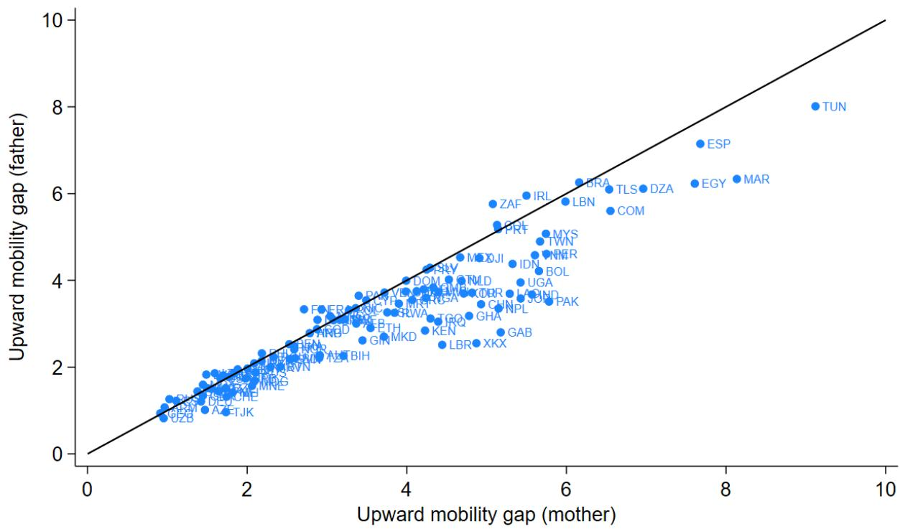  
Note: This figure plots the upward mobility gap by parent for the 1980s birth cohort. The vertical axis plots the value calculated with respect to fathers, while the horizontal axis plots the value calculated with respect to mothers. The 45 degree line is plotted in black. The figure is based on data from the Life in Transition Survey (Europe and Central Asia) and the GDIM (remaining regions of the world).

Figure 2 Correlation between share of upward movers and upward education gap, by country (1980s birth cohort)  
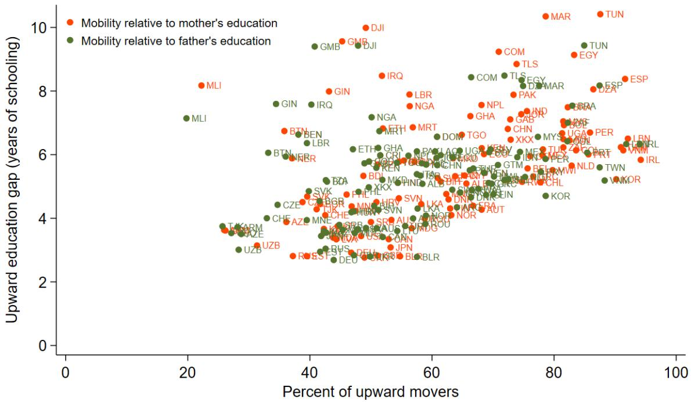  
Note: The figure is based on data from the Life in Transition Survey (Europe and Central Asia) and the GDIM (remaining regions of the world).

Figure 3 Average upward mobility (based on mothers' education), by birth cohort  
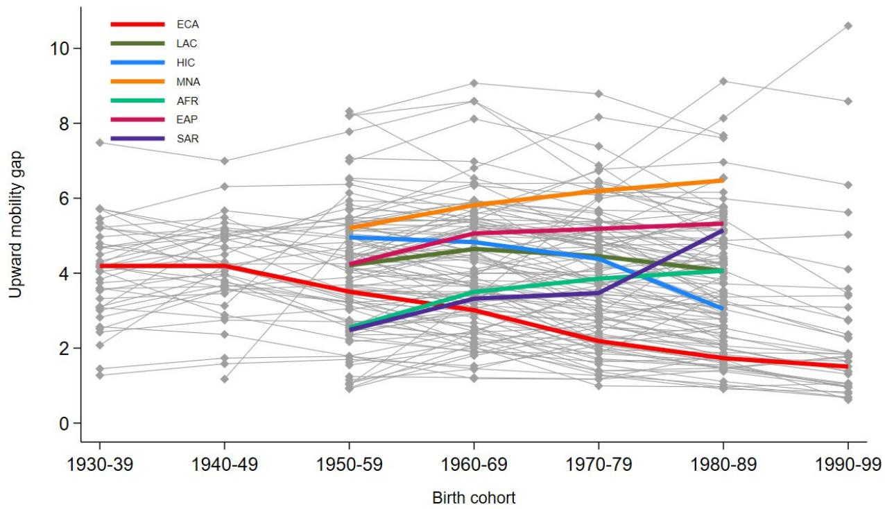  
Note: The figure is based on data from the Life in Transition Survey (Europe and Central Asia) and the GDIM (remaining regions of the world). Thick lines indicate regional medians Grey lines plot values for individual countries.

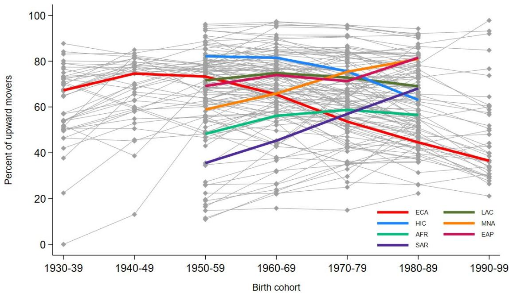  
Note: The figure is based on data from the Life in Transition Survey (Europe and Central Asia) and the GDIM (remaining regions of the world). Thick lines indicate regional medians Grey lines plot values for individual countries.

Figure 5 Average upward education gap (based on mothers' education), by birth cohort  
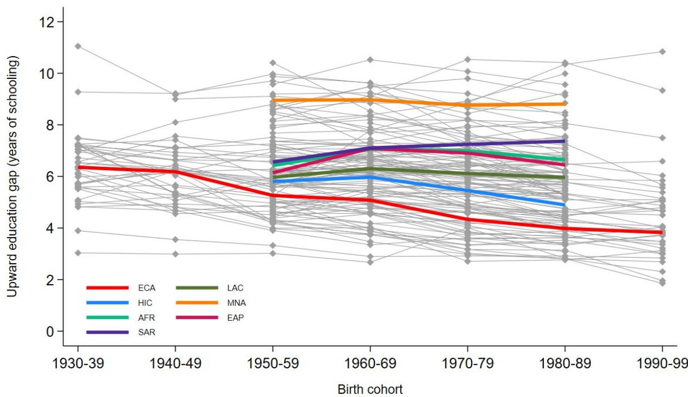  
Note: The figure is based on data from the Life in Transition Survey (Europe and Central Asia) and the GDIM (remaining regions of the world). Thick lines indicate regional medians Grey lines plot values for individual countries.

Figure 6 Average upward mobility into higher education (based on mothers' education), by birth cohort  
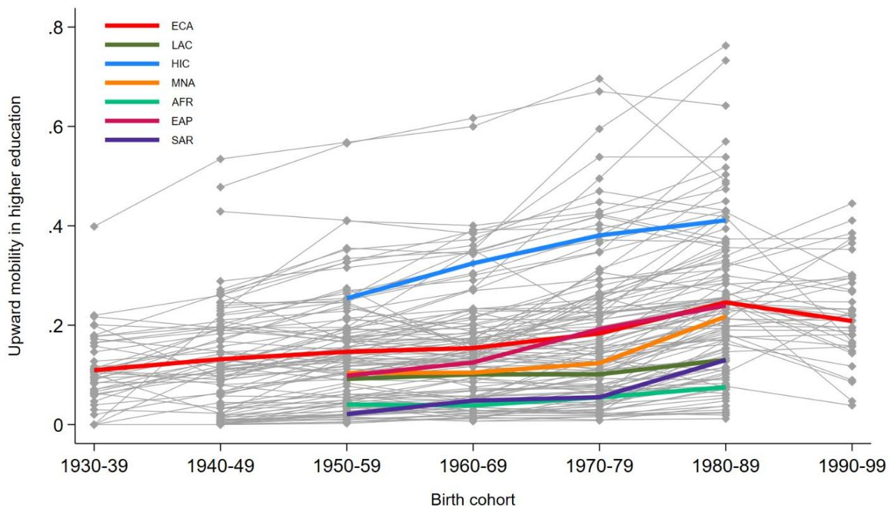  
Note: The figure is based on data from the Life in Transition Survey (Europe and Central Asia) and the GDIM (remaining regions of the world). Thick lines indicate regional medians Grey lines plot values for individual countries.

a. Intergenerational persistence  
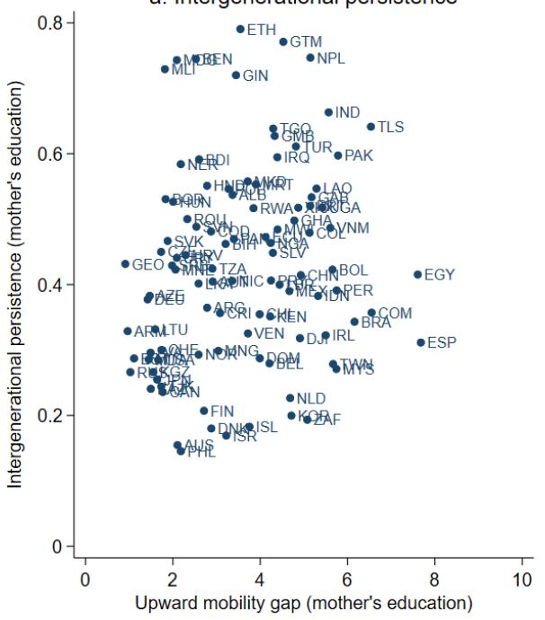  
b. Intergenerational correlation

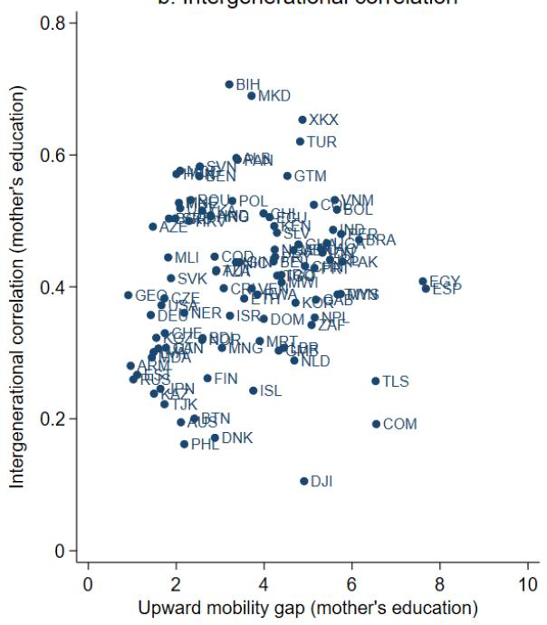  
Note: The figure is based on data from the Life in Transition Survey (Europe and Central Asia) and the GDIM (remaining regions of the world).

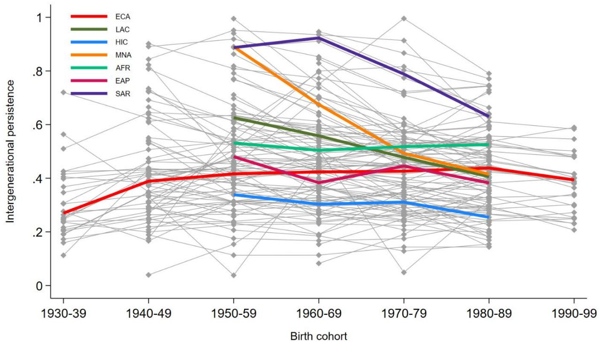  
Note: The figure is based on data from the Life in Transition Survey (Europe and Central Asia) and the GDIM (remaining regions of the world). Thick lines indicate regional medians Grey lines plot values for individual countries.

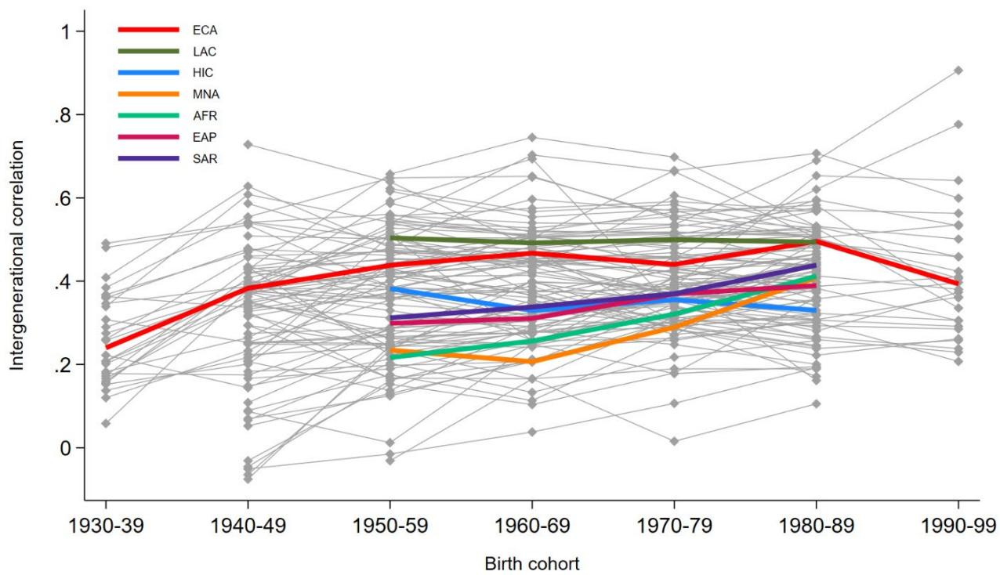  
Note: The figure is based on data from the Life in Transition Survey (Europe and Central Asia) and the GDIM (remaining regions of the world). Thick lines indicate regional medians Grey lines plot values for individual countries.

Appendix tables and figures

Table A.1: Number of non-missing observations in the LiTS sample used in the analysis by selected age cohorts and survey years.

<table><tr><td rowspan="3">Survey year</td><td colspan="12">Age cohorts</td></tr><tr><td colspan="4">1940-1949</td><td colspan="4">1960-1969</td><td colspan="4">1990-1999</td></tr><tr><td>2010</td><td>2016</td><td>2023</td><td>Total</td><td>2010</td><td>2016</td><td>2023</td><td>Total</td><td>2010</td><td>2016</td><td>2023</td><td>Total</td></tr><tr><td>Country</td><td></td><td></td><td></td><td></td><td></td><td></td><td></td><td></td><td></td><td></td><td></td><td></td></tr><tr><td>Albania</td><td>346</td><td>330</td><td>163</td><td>839</td><td>714</td><td>823</td><td>415</td><td>1,952</td><td>486</td><td>813</td><td>443</td><td>1,742</td></tr><tr><td>Armenia</td><td>280</td><td>366</td><td>159</td><td>805</td><td>553</td><td>725</td><td>431</td><td>1,709</td><td>729</td><td>668</td><td>406</td><td>1,803</td></tr><tr><td>Azerbaijan</td><td>192</td><td>116</td><td>45</td><td>353</td><td>601</td><td>748</td><td>364</td><td>1,713</td><td>747</td><td>1,180</td><td>538</td><td>2,465</td></tr><tr><td>Bosnia and Herzegovina</td><td>267</td><td>255</td><td>142</td><td>664</td><td>462</td><td>734</td><td>429</td><td>1,625</td><td>421</td><td>719</td><td>253</td><td>1,393</td></tr><tr><td>Bulgaria</td><td>348</td><td>441</td><td>221</td><td>1,010</td><td>415</td><td>619</td><td>339</td><td>1,373</td><td>250</td><td>397</td><td>187</td><td>834</td></tr><tr><td>Croatia</td><td>340</td><td>323</td><td>201</td><td>864</td><td>378</td><td>619</td><td>384</td><td>1,381</td><td>302</td><td>497</td><td>236</td><td>1,035</td></tr><tr><td>Czechia</td><td>235</td><td>359</td><td>97</td><td>691</td><td>405</td><td>446</td><td>311</td><td>1,162</td><td>325</td><td>296</td><td>343</td><td>964</td></tr><tr><td>Estonia</td><td>262</td><td>448</td><td>170</td><td>880</td><td>269</td><td>427</td><td>327</td><td>1,023</td><td>258</td><td>221</td><td>174</td><td>653</td></tr><tr><td>Georgia</td><td>303</td><td>444</td><td>159</td><td>906</td><td>479</td><td>746</td><td>368</td><td>1,593</td><td>506</td><td>593</td><td>332</td><td>1,431</td></tr><tr><td>Germany</td><td>233</td><td>164</td><td>69</td><td>466</td><td>450</td><td>568</td><td>342</td><td>1,360</td><td>238</td><td>283</td><td>239</td><td>760</td></tr><tr><td>Hungary</td><td>344</td><td>420</td><td>154</td><td>918</td><td>305</td><td>421</td><td>340</td><td>1,066</td><td>263</td><td>334</td><td>267</td><td>864</td></tr><tr><td>Kazakhstan</td><td>177</td><td>175</td><td>29</td><td>381</td><td>487</td><td>595</td><td>224</td><td>1,306</td><td>510</td><td>622</td><td>362</td><td>1,494</td></tr><tr><td>Kosovo</td><td>323</td><td>313</td><td>147</td><td>783</td><td>636</td><td>912</td><td>555</td><td>2,103</td><td>956</td><td>1,302</td><td>616</td><td>2,874</td></tr><tr><td>Kyrgyzstan</td><td>201</td><td>193</td><td>61</td><td>455</td><td>469</td><td>742</td><td>365</td><td>1,576</td><td>849</td><td>1,018</td><td>493</td><td>2,360</td></tr><tr><td>Latvia</td><td>274</td><td>397</td><td>236</td><td>907</td><td>282</td><td>491</td><td>239</td><td>1,012</td><td>249</td><td>304</td><td>166</td><td>719</td></tr><tr><td>Lithuania</td><td>293</td><td>338</td><td>204</td><td>835</td><td>380</td><td>535</td><td>222</td><td>1,137</td><td>303</td><td>329</td><td>329</td><td>961</td></tr><tr><td>Moldova</td><td>285</td><td>306</td><td>161</td><td>752</td><td>372</td><td>524</td><td>231</td><td>1,127</td><td>352</td><td>419</td><td>176</td><td>947</td></tr><tr><td>Montenegro</td><td>231</td><td>263</td><td>91</td><td>585</td><td>504</td><td>620</td><td>295</td><td>1,419</td><td>516</td><td>632</td><td>439</td><td>1,587</td></tr><tr><td>North Macedonia</td><td>363</td><td>408</td><td>183</td><td>954</td><td>653</td><td>728</td><td>398</td><td>1,779</td><td>563</td><td>729</td><td>356</td><td>1,648</td></tr><tr><td>Poland</td><td>461</td><td>376</td><td>132</td><td>969</td><td>580</td><td>404</td><td>300</td><td>1,284</td><td>489</td><td>309</td><td>285</td><td>1,083</td></tr><tr><td>Romania</td><td>321</td><td>411</td><td>108</td><td>840</td><td>376</td><td>411</td><td>296</td><td>1,083</td><td>265</td><td>300</td><td>241</td><td>806</td></tr><tr><td>Russian Federation</td><td>341</td><td>179</td><td>53</td><td>573</td><td>472</td><td>427</td><td>226</td><td>1,125</td><td>393</td><td>429</td><td>213</td><td>1,035</td></tr><tr><td>Serbia</td><td>482</td><td>404</td><td>108</td><td>994</td><td>617</td><td>609</td><td>338</td><td>1,564</td><td>487</td><td>410</td><td>284</td><td>1,181</td></tr><tr><td>Slovak Republic</td><td>141</td><td>413</td><td>158</td><td>712</td><td>495</td><td>566</td><td>355</td><td>1,416</td><td>443</td><td>442</td><td>198</td><td>1,083</td></tr><tr><td>Slovenia</td><td>243</td><td>440</td><td>223</td><td>906</td><td>520</td><td>532</td><td>442</td><td>1,494</td><td>327</td><td>355</td><td>280</td><td>962</td></tr><tr><td>Tajikistan</td><td>208</td><td>184</td><td>70</td><td>462</td><td>631</td><td>799</td><td>451</td><td>1,881</td><td>1,296</td><td>1,357</td><td>740</td><td>3,393</td></tr><tr><td>Türkiye</td><td>134</td><td>54</td><td>51</td><td>239</td><td>472</td><td>585</td><td>335</td><td>1,392</td><td>642</td><td>951</td><td>777</td><td>2,370</td></tr></table>

Note: Column “Total” shows the number of non-missing observations (sum) in the three selected cohorts.

Table A2. Full specification of the model including inequality

<table><tr><td>Dependent variable: Log GDP per capita Item</td><td>(1)</td><td>(2)</td><td>(3)</td><td>(4)</td></tr><tr><td>Intergenerational persistence</td><td></td><td></td><td></td><td></td></tr><tr><td>× High Income Countries</td><td>4.6918***(1.4411)</td><td></td><td></td><td></td></tr><tr><td>× Eastern Europe and Central Asia</td><td>1.4544(1.3379)</td><td></td><td></td><td></td></tr><tr><td>× Latin America and the Caribbean</td><td>1.4330(1.8857)</td><td></td><td></td><td></td></tr><tr><td>× Other Developing Countries</td><td>0.3689(1.5603)</td><td></td><td></td><td></td></tr><tr><td>Intergenerational correlation</td><td></td><td></td><td></td><td></td></tr><tr><td>× High Income Countries</td><td></td><td>3.3693(2.3986)</td><td></td><td></td></tr><tr><td>× Eastern Europe and Central Asia</td><td></td><td>1.0608(0.8183)</td><td></td><td></td></tr><tr><td>× Latin America and the Caribbean</td><td></td><td>4.3107*(2.3758)</td><td></td><td></td></tr><tr><td>× Other Developing Countries</td><td></td><td>7.5284**(3.5323)</td><td></td><td></td></tr><tr><td>Upward mobility gap</td><td></td><td></td><td></td><td></td></tr><tr><td>× High Income Countries</td><td></td><td></td><td>0.0093(0.0248)</td><td></td></tr><tr><td>× Eastern Europe and Central Asia</td><td></td><td></td><td>-0.1552(0.1074)</td><td></td></tr><tr><td>× Latin America and the Caribbean</td><td></td><td></td><td>0.2957***(0.1095)</td><td></td></tr><tr><td>× Other Developing Countries</td><td></td><td></td><td>0.5665**(0.1671)</td><td></td></tr><tr><td>Upward mobility in higher education</td><td></td><td></td><td></td><td></td></tr><tr><td>× High Income Countries</td><td></td><td></td><td></td><td>-0.4609(0.3205)</td></tr><tr><td>× Eastern Europe and Central Asia</td><td></td><td></td><td></td><td>5.8365***(1.0608)</td></tr><tr><td>× Latin America and the Caribbean</td><td></td><td></td><td></td><td>5.3322***(1.8470)</td></tr><tr><td>× Other Developing Countries</td><td></td><td></td><td></td><td>12.5791***(3.8729)</td></tr><tr><td>Year-level controls</td><td></td><td></td><td></td><td></td></tr><tr><td>Gini index (income)</td><td>-0.0077(0.0047)</td><td>-0.0094**(0.0045)</td><td>-0.0081**(0.0035)</td><td>-0.0065(0.0042)</td></tr><tr><td>Log population</td><td>-1.9417(2.0193)</td><td>-0.6051(1.8841)</td><td>1.1437(1.8868)</td><td>1.7808(1.7730)</td></tr><tr><td>Log population (squared)</td><td>0.0495(0.0635)</td><td>0.0041(0.0580)</td><td>-0.0426(0.0616)</td><td>-0.0634(0.0566)</td></tr><tr><td>Cohort-level controls</td><td></td><td></td><td></td><td></td></tr><tr><td>Average years of education (cohort weighted)</td><td>-0.0881(0.0688)</td><td>-0.1912***(0.0555)</td><td>-0.1570***(0.0466)</td><td>-0.2127***(0.0393)</td></tr><tr><td>Standard deviation of years of education (cohort weighted)</td><td>-0.0874(0.2349)</td><td>-0.1097(0.1892)</td><td>0.1214(0.1213)</td><td>0.0584(0.1038)</td></tr><tr><td>Log GDP per capita at decade of birth (cohort weighted)</td><td>0.0202(0.0454)</td><td>0.0328(0.0449)</td><td>-0.0007(0.0480)</td><td>-0.0093(0.0387)</td></tr><tr><td>Population at decade of birth (cohort weighted)</td><td>0.0220**(0.0103)</td><td>0.0226**(0.0093)</td><td>0.0049(0.0117)</td><td>0.0122(0.0082)</td></tr><tr><td>Population at decade of birth squared (cohort weighted)</td><td>-0.0001**(0.0000)</td><td>-0.0001**(0.0000)</td><td>-0.0000(0.0000)</td><td>-0.0000(0.0000)</td></tr><tr><td>Infant mortality rate at decade of birth (cohort weighted)</td><td>0.0008(0.0029)</td><td>0.0007(0.0027)</td><td>-0.0022(0.0031)</td><td>0.0048**(0.0020)</td></tr><tr><td> $R^2$ </td><td>0.988</td><td>0.988</td><td>0.988</td><td>0.990</td></tr><tr><td>Number of observations</td><td>1015</td><td>1015</td><td>1015</td><td>1015</td></tr><tr><td>Number of countries</td><td>68</td><td>68</td><td>68</td><td>68</td></tr></table>

Source: All specifications include country and year fixed effects. Standard errors (in parentheses) are clustered at the country level.  
\*\*\* significant at the 1% level, \*\* significant at the 5% level, \* significant at the 10% level.

Table A3: Impulse response dynamic effects of various measures of intergenerational mobility on per capita GDP.

<table><tr><td rowspan="2"></td><td colspan="2">Intergenerational persistence</td><td colspan="2">Intergenerational correlation</td><td colspan="2">Upward mobility gap</td><td colspan="2">Upward mobility in higher education</td></tr><tr><td>Coeff.</td><td>Std.Err</td><td>Coeff.</td><td>Std.Err</td><td>Coeff.</td><td>Std.Err</td><td>Coeff.</td><td>Std.Err</td></tr><tr><td>High income countries Contemporaneous effect</td><td>-0.106***</td><td>0.032</td><td>-0.078**</td><td>0.037</td><td>-0.001</td><td>0.002</td><td>0.077***</td><td>0.029</td></tr><tr><td>Horizon 1</td><td>-0.183***</td><td>0.041</td><td>-0.138***</td><td>0.047</td><td>-0.003</td><td>0.003</td><td>0.115***</td><td>0.037</td></tr><tr><td>Horizon 2</td><td>-0.255***</td><td>0.048</td><td>-0.191***</td><td>0.055</td><td>-0.006**</td><td>0.003</td><td>0.153***</td><td>0.044</td></tr><tr><td>Horizon 3</td><td>-0.315***</td><td>0.053</td><td>-0.231***</td><td>0.062</td><td>-0.008**</td><td>0.003</td><td>0.187***</td><td>0.049</td></tr><tr><td>Horizon 4</td><td>-0.365***</td><td>0.056</td><td>-0.265***</td><td>0.065</td><td>-0.009**</td><td>0.004</td><td>0.208***</td><td>0.052</td></tr><tr><td>Horizon 5</td><td>-0.411***</td><td>0.057</td><td>-0.297***</td><td>0.067</td><td>-0.010***</td><td>0.004</td><td>0.221***</td><td>0.053</td></tr><tr><td>Horizon 6</td><td>-0.455***</td><td>0.057</td><td>-0.326***</td><td>0.067</td><td>-0.010***</td><td>0.004</td><td>0.234***</td><td>0.053</td></tr><tr><td>Horizon 7</td><td>-0.500***</td><td>0.057</td><td>-0.354***</td><td>0.068</td><td>-0.011***</td><td>0.004</td><td>0.255***</td><td>0.054</td></tr><tr><td>Horizon 8</td><td>-0.551***</td><td>0.061</td><td>-0.400***</td><td>0.073</td><td>-0.011***</td><td>0.004</td><td>0.278***</td><td>0.058</td></tr><tr><td>Europe and C. Asia Contemporaneous effect</td><td>-0.024</td><td>0.027</td><td>0.004</td><td>0.030</td><td>0.009***</td><td>0.003</td><td>0.281***</td><td>0.048</td></tr><tr><td>Horizon 1</td><td>-0.062*</td><td>0.034</td><td>-0.015</td><td>0.039</td><td>0.009**</td><td>0.004</td><td>0.406***</td><td>0.061</td></tr><tr><td>Horizon 2</td><td>-0.106***</td><td>0.040</td><td>-0.037</td><td>0.045</td><td>0.008</td><td>0.005</td><td>0.507***</td><td>0.071</td></tr><tr><td>Horizon 3</td><td>-0.142***</td><td>0.044</td><td>-0.055</td><td>0.051</td><td>0.007</td><td>0.006</td><td>0.581***</td><td>0.079</td></tr><tr><td>Horizon 4</td><td>-0.170***</td><td>0.047</td><td>-0.068</td><td>0.054</td><td>0.006</td><td>0.006</td><td>0.622***</td><td>0.084</td></tr><tr><td>Horizon 5</td><td>-0.194***</td><td>0.048</td><td>-0.082</td><td>0.055</td><td>0.006</td><td>0.006</td><td>0.640***</td><td>0.086</td></tr><tr><td>Horizon 6</td><td>-0.205***</td><td>0.047</td><td>-0.082</td><td>0.055</td><td>0.008</td><td>0.006</td><td>0.678***</td><td>0.086</td></tr><tr><td>Horizon 7</td><td>-0.214***</td><td>0.048</td><td>-0.080</td><td>0.056</td><td>0.011*</td><td>0.006</td><td>0.755***</td><td>0.088</td></tr><tr><td>Horizon 8</td><td>-0.216***</td><td>0.051</td><td>-0.084</td><td>0.060</td><td>0.015**</td><td>0.007</td><td>0.867***</td><td>0.094</td></tr><tr><td>Latin America and C. Contemporaneous effect</td><td>-0.103***</td><td>0.028</td><td>-0.076**</td><td>0.035</td><td>-0.002</td><td>0.003</td><td>0.113*</td><td>0.062</td></tr><tr><td>Horizon 1</td><td>-0.158***</td><td>0.035</td><td>-0.113**</td><td>0.045</td><td>-0.004</td><td>0.004</td><td>0.208***</td><td>0.079</td></tr><tr><td>Horizon 2</td><td>-0.210***</td><td>0.041</td><td>-0.143***</td><td>0.053</td><td>-0.006</td><td>0.005</td><td>0.294***</td><td>0.092</td></tr><tr><td>Horizon 3</td><td>-0.249***</td><td>0.045</td><td>-0.164***</td><td>0.059</td><td>-0.008</td><td>0.005</td><td>0.355***</td><td>0.103</td></tr><tr><td>Horizon 4</td><td>-0.274***</td><td>0.048</td><td>-0.176***</td><td>0.063</td><td>-0.009</td><td>0.006</td><td>0.387***</td><td>0.110</td></tr><tr><td>Horizon 5</td><td>-0.290***</td><td>0.049</td><td>-0.183***</td><td>0.064</td><td>-0.009</td><td>0.006</td><td>0.408***</td><td>0.112</td></tr><tr><td>Horizon 6</td><td>-0.302***</td><td>0.048</td><td>-0.183***</td><td>0.064</td><td>-0.008</td><td>0.006</td><td>0.432***</td><td>0.113</td></tr><tr><td>Horizon 7</td><td>-0.330***</td><td>0.049</td><td>-0.200***</td><td>0.065</td><td>-0.008</td><td>0.006</td><td>0.441***</td><td>0.115</td></tr><tr><td>Horizon 8</td><td>-0.390***</td><td>0.052</td><td>-0.271***</td><td>0.069</td><td>-0.011*</td><td>0.006</td><td>0.362***</td><td>0.123</td></tr><tr><td>Other developing Contemporaneous effect</td><td>-0.130***</td><td>0.036</td><td>-0.102**</td><td>0.048</td><td>-0.003</td><td>0.003</td><td>0.059</td><td>0.065</td></tr><tr><td>Horizon 1</td><td>-0.208***</td><td>0.046</td><td>-0.156**</td><td>0.061</td><td>-0.006</td><td>0.004</td><td>0.138*</td><td>0.083</td></tr><tr><td>Horizon 2</td><td>-0.289***</td><td>0.054</td><td>-0.208***</td><td>0.072</td><td>-0.010*</td><td>0.005</td><td>0.186*</td><td>0.097</td></tr><tr><td>Horizon 3</td><td>-0.353***</td><td>0.060</td><td>-0.250***</td><td>0.080</td><td>-0.013**</td><td>0.006</td><td>0.207*</td><td>0.108</td></tr><tr><td>Horizon 4</td><td>-0.396***</td><td>0.063</td><td>-0.278***</td><td>0.085</td><td>-0.016***</td><td>0.006</td><td>0.206*</td><td>0.115</td></tr><tr><td>Horizon 5</td><td>-0.415***</td><td>0.064</td><td>-0.286***</td><td>0.086</td><td>-0.016***</td><td>0.006</td><td>0.221*</td><td>0.118</td></tr><tr><td>Horizon 6</td><td>-0.426***</td><td>0.064</td><td>-0.282***</td><td>0.087</td><td>-0.015**</td><td>0.006</td><td>0.263**</td><td>0.119</td></tr><tr><td>Horizon 7</td><td>-0.453***</td><td>0.065</td><td>-0.297***</td><td>0.088</td><td>-0.014**</td><td>0.006</td><td>0.318***</td><td>0.121</td></tr><tr><td>Horizon 8</td><td>-0.501***</td><td>0.069</td><td>-0.367***</td><td>0.094</td><td>-0.016**</td><td>0.007</td><td>0.299**</td><td>0.129</td></tr></table>

Note: Standard errors are calculated with a small-sample degrees-of-freedom adjustment. \*\*\* significant at the 1% level, \*\* significant at the 5% level, \* significant at the 10% level.

## a. Intergenerational persistence

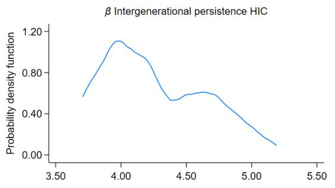

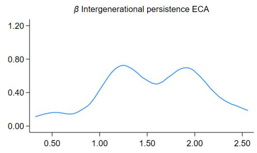

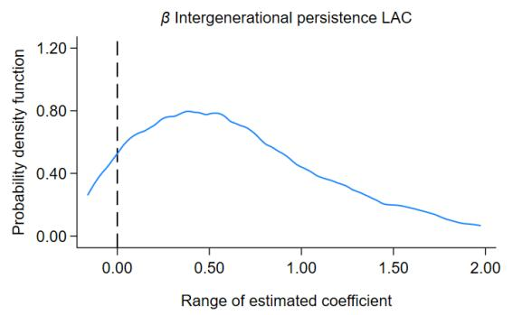

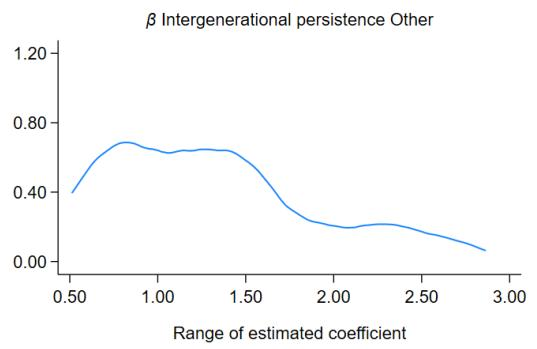  
b. Intergenerational correlation

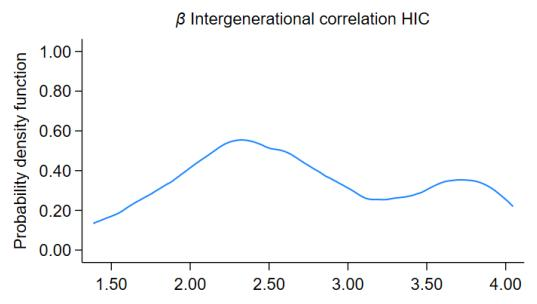

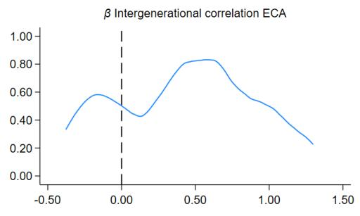

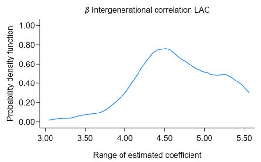

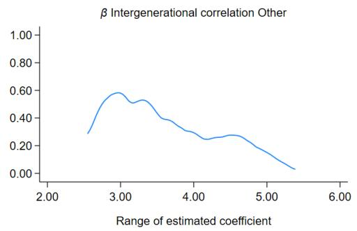  
c. Upward mobility gap

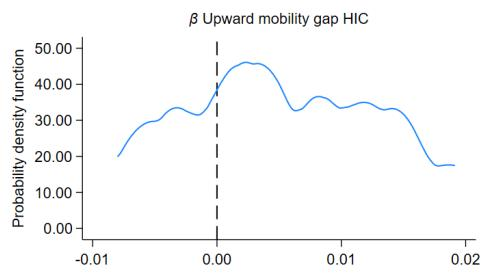

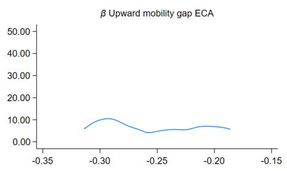

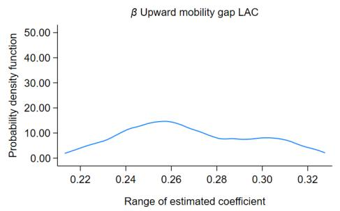

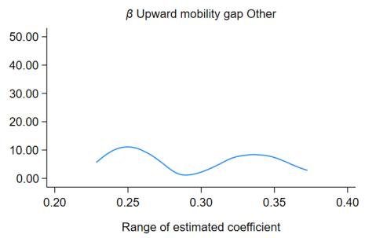  
d. Upward mobility in higher education

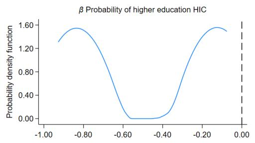

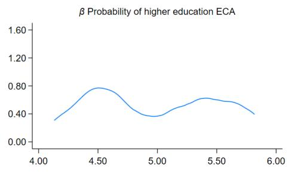

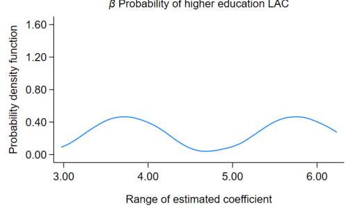

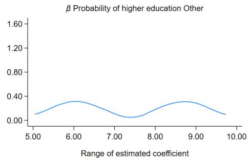  
Note: The figure plots the distribution of the estimated coefficients for each of the four regions resulting from the model uncertainty analysis proposed by Young and Holsteen (2017). The distribution is derived from the estimation of 255 possible specifications of equation (7), reflecting all combinations of control variables.

Figure A.2 Posterior density plots of estimated coefficients in the Bayesian Model Averaging Analysis

## a. Intergenerational persistence

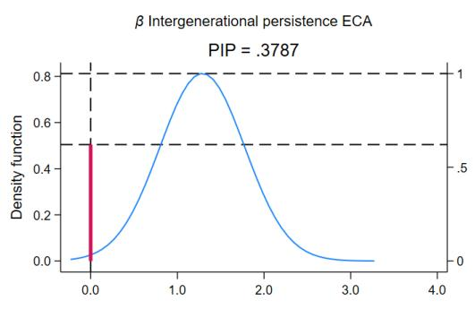

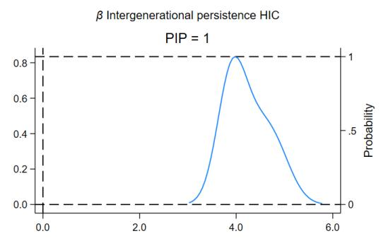

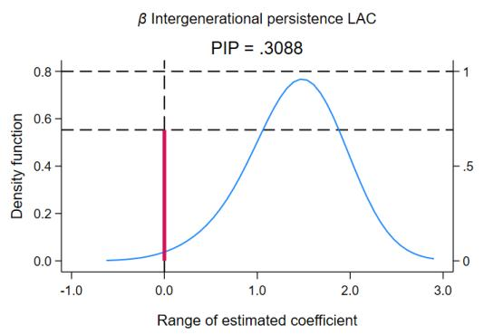

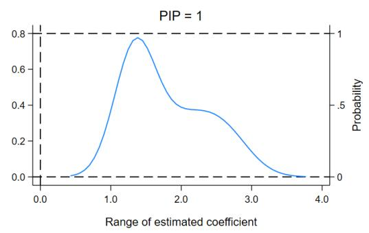

## b. Intergenerational correlation

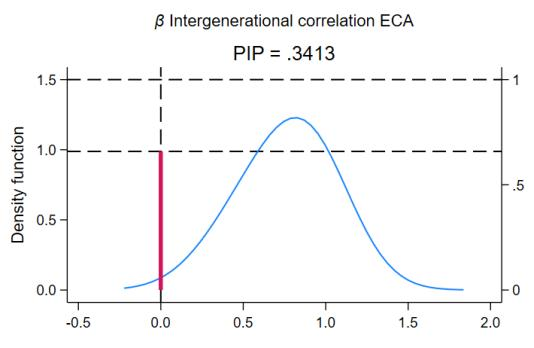

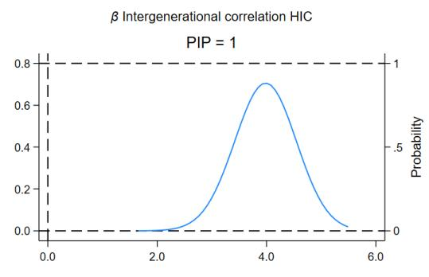

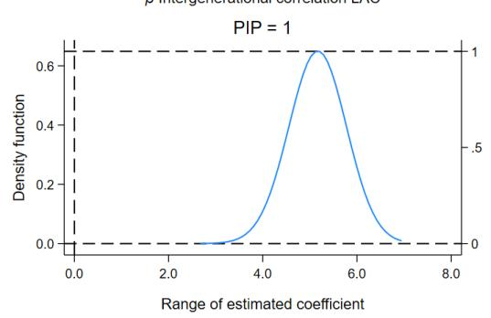

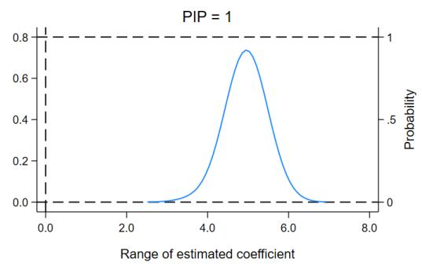

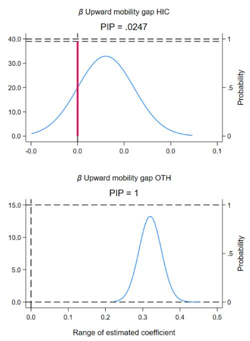

## c. Upward mobility gap

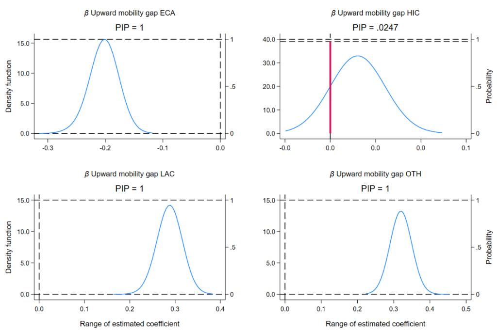

## d. Upward mobility in higher education

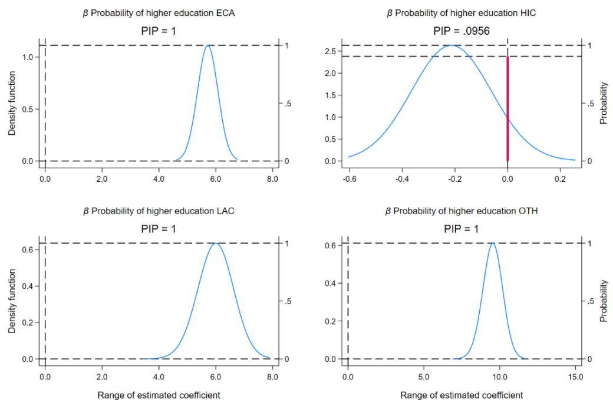  
Note: The figure plots the posterior densities in the Bayesian Model Averaging linear regression for each of the four mobility indices.