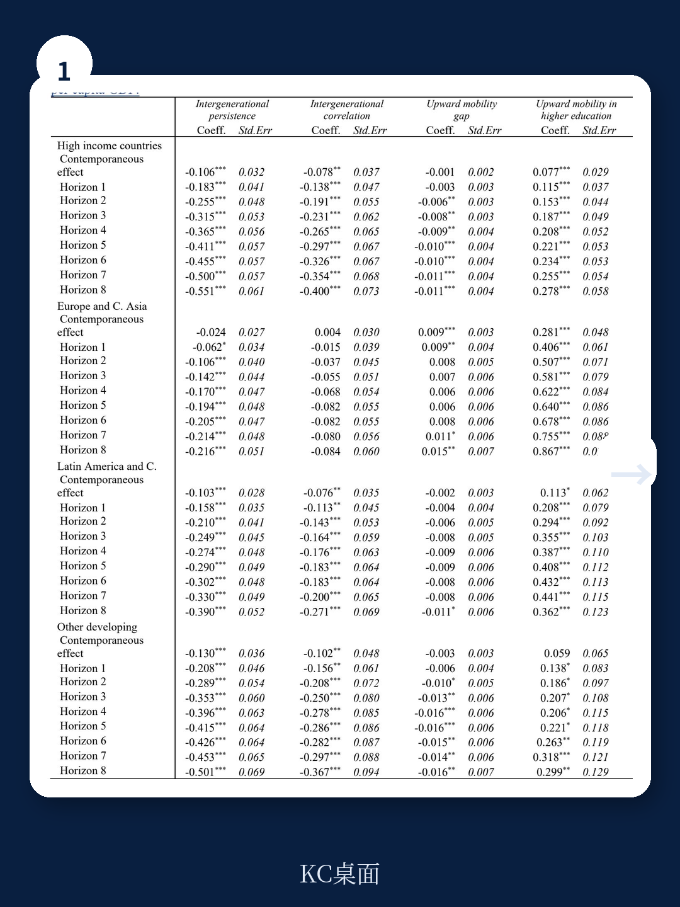
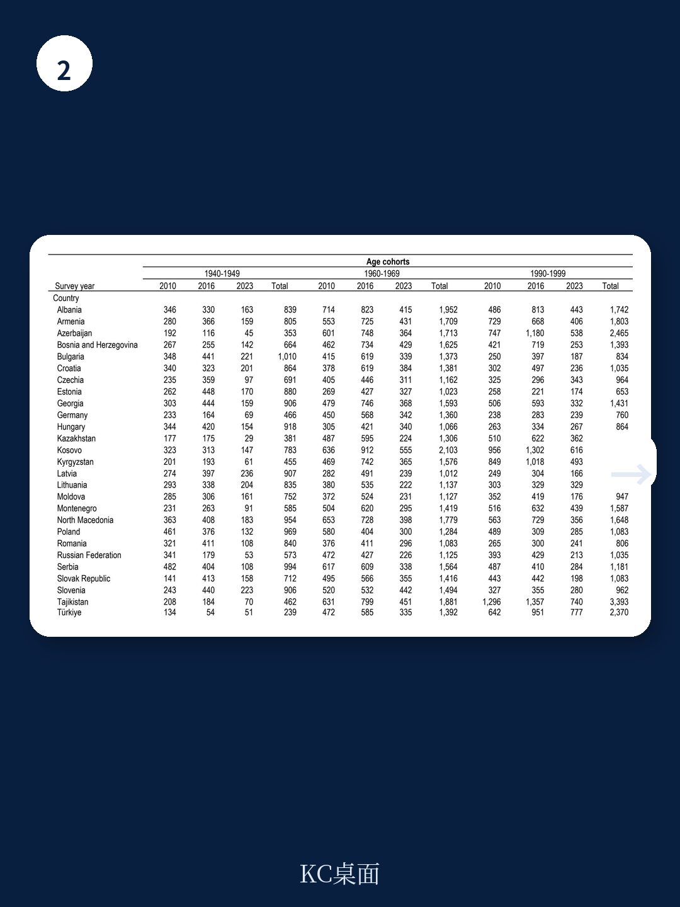

# 世界银行：社会流动性不能只看“相对”，真正拉动增长的只有一件事

社会流动性越高，经济发展就越快——这个直觉听起来无懈可击。但世界银行最新发布的工作论文，用68个国家20年的数据，给出了一个反直觉的结论：不是所有形式的流动性都促进增长，有些甚至与更高收入负相关。

这份由Ivan Torre、Michael Lokshin和James Foster完成的政策研究工作论文，核心判断是：**只有“绝对向上流动”——特别是高等教育层面的向上流动——才与人均GDP有显著正相关；而经济学界常用的“相对流动性”指标，在多数地区与经济发展无关，在拉丁美洲甚至呈现负相关。**

这个结论之所以重要，是因为全球政策制定者和国际组织长期将“提升社会流动性”作为经济改革的核心目标之一。如果选错了衡量标准，政策资源可能被导向一个与增长无关甚至相反的方向。

## 1. 你熟悉的“流动性指标”可能正在误导政策判断

学术界和媒体讨论社会流动性时，最常引用两类指标：一是“代际弹性”或“代际相关性”——衡量子女教育在多大程度上由父母教育决定；二是“转型矩阵”——计算不同教育阶层之间的流动概率。前者是相对指标，后者可转化为绝对指标。

世界银行这篇论文的贡献之一，是首次将这些指标放在同一个框架下，检验它们与经济发展的关系。结果令人意外。

在欧洲和中亚地区，相对流动性指标（代际弹性和代际相关性）与人均GDP没有任何统计显著关系。真正与增长挂钩的，是一个更窄的指标：**子女完成高等教育的概率，当他们的父母没有完成高等教育时**。论文将这个指标称为“高等教育向上流动概率”（UMHE）。

换句话说，一个社会是否“公平”并不直接决定它是否繁荣；真正重要的是，这个社会是否能让那些出身教育弱势家庭的孩子，最终拿到大学文凭。

> **KC评论：** 这个发现对中国的政策讨论有直接含义。很多讨论聚焦于“寒门难出贵子”的相对公平问题，但世界银行的数据暗示，在经济发展的语境下，更紧迫的可能是绝对层面的“能不能上大学”，而非“上了谁的大学”。完整报告里对不同收入国家的细分回归，值得仔细看——它会告诉你这个结论在什么条件下成立、在什么条件下不成立。

## 2. 拉丁美洲的反常信号：相对流动性越高，收入反而越低

论文最引人注目的发现来自拉丁美洲和加勒比地区。在这里，更高的相对流动性居然与更低的人均GDP显著相关。同时，更高的绝对流动性又与更高的人均GDP显著相关。

这个看似矛盾的结果，其实揭示了一个关键机制：当整个教育体系快速扩张时，相对流动性指标可能被“分母效应”扭曲。如果大量父母一辈本身教育水平很低，那么即使子女教育进步幅度很小，相对流动性也会显得很高——因为起点太低了。但这种“进步”并不意味着人力资本积累足够支撑经济增长。

论文采用的“流动性缺口”新指标——即子女与父母教育年限差距的绝对值——在拉美地区的表现，更准确地捕捉了人力资本的真实积累。这个新指标也是世界银行团队首次在实证中应用Foster和Rothbaum（2023）提出的定向流动性测量方法。

> **KC评论：** 报告里有一张图展示了四个地区、四种流动性指标与增长的回归系数分布。如果你只打算看一张图，就看那张。它会让你直观理解为什么“选对指标”比“提升流动性”本身更重要。完整报告中的图表注释还包含了模型不确定性分析的细节，这是判断结论稳健性的关键。

## 3. 定向流动性的新框架：比传统方法更“诚实”的测量

这篇论文在方法论上的核心贡献，是引入了“定向流动性缺口”这个概念。传统的距离型流动性测量虽然避免了转型矩阵的阈值随意性，但它不区分向上还是向下移动。一个社会如果大量子女的教育水平低于父母，它的“流动性”仍然可能很高——这显然不是政策制定者想要的。

定向流动性缺口将移动方向纳入考虑，只计算向上移动的距离。它的计算公式很直观：先找出所有子女教育年限超过父母的个体（向上移动者），然后计算他们的平均教育差距，再乘以向上移动者的比例。这个指标既能反映“有多少人向上流动”，也能反映“向上流动了多少”。

论文的实证结果显示，在多数地区，定向向上流动性缺口与经济增长的关系比传统指标更稳定、更显著。这意味着，如果一个社会想要通过提升流动性来促进增长，政策资源应该集中在“让更多人向上移动更远”这个目标上，而不是追求教育分布的“平等化”。

## 4. 报告尚未完全回答的关键问题：因果方向与政策杠杆

尽管论文在关联性分析上做了扎实工作，但它坦诚承认一个核心局限：这些发现是相关性，而非因果性。更高的向上流动性是否导致经济增长，还是经济增长本身就创造了更多向上流动的机会？论文的识别策略——使用长期滞后项和面板固定效应——部分缓解了反向因果问题，但无法完全排除。

另一个未解问题是：什么政策能最有效地提升“高等教育向上流动概率”？论文的文献综述提到，公共教育支出、早期儿童干预、信贷约束缓解都被认为是可能的渠道，但跨国的宏观数据无法提供微观层面的政策处方。不同类型的国家——比如已经完成高等教育普及化的高收入国家，和仍在扩张基础教育覆盖面的中低收入国家——可能需要完全不同的干预重点。

> **KC评论：** 报告末尾有一张表格，展示了不同时间跨度（从当期到8年滞后）下流动性指标与经济增长的回归结果。你会发现，向上流动性的正向效应随时间推移而增强，而相对流动性的负向效应也在增强。这意味着什么？报告没有完全展开，但这恰恰是值得继续深挖的方向——它可能暗示了教育回报的长期滞后结构。这部分分析在完整报告的附录中，图表和数据都非常详细。

## 5. 对决策者的观察框架：三个需要追问的问题

基于世界银行这篇论文的分析框架，决策者在审视本国的社会流动性政策时，可以建立以下三个追问：

第一，**你用的是哪种流动性指标？** 如果报告只给出了“代际弹性”或“基尼系数”这类相对指标，它可能掩盖了真正与增长相关的绝对向上流动。要求报告同时提供定向流动性缺口或高等教育向上流动概率，否则政策优先级可能被误导。

第二，**你的国家处在哪个教育发展阶段？** 论文发现，欧洲和中亚地区只有高等教育向上流动与增长相关，而拉美地区绝对流动性与相对流动性呈现相反符号。这意味着，一个仍在普及高中教育的国家，和一个已经进入高等教育大众化的国家，关注点应该完全不同。

第三，**政策干预的“剂量”是否足够大？** 论文的回归系数显示，流动性对增长的效应虽然统计显著，但经济规模相对有限。仅靠提升流动性无法替代技术进步、制度质量和资本积累等传统增长引擎。社会流动性政策应该被视为“放大器”，而非“发动机”。

## 继续探索：完整报告中的未解问题

这篇论文打开了几个值得继续追问的方向，但受限于篇幅和出版格式，它们没有在正文中完全展开。

比如，论文使用了三种不同的数据来源——欧洲和中亚的生命转型调查（LiTS）、全球代际流动性数据库（GDIM）、以及世界发展指标——但不同数据源的测量口径和覆盖人群并不完全一致。报告在稳健性检验中尝试了多种模型规格，但数据拼接本身带来的测量误差是否会影响结论，需要进一步验证。

再比如，论文定义“高等教育向上流动”时，使用的阈值是“父母未完成高等教育”且“子女完成高等教育”。但在许多发展中国家，高等教育本身的质量差距极大。一个毕业于低质量大学的学生，和另一个毕业于顶尖大学的学生，对经济增长的贡献可能截然不同。报告没有也无法在跨国框架下处理这个异质性。

这些未解问题，恰恰是继续阅读完整报告、深入理解数据细节的最好理由。每天由AI agent与人工review联合生成的国际投行中文摘要与KC评论，会持续追踪这类底层方法论论文，并提供10-40页的每日数据图表合集，既方便喂给AI模型，也方便人工快速把握全球研究前沿的动态。如果你对这些未解问题有想法，欢迎加入社群继续讨论。

Personal reading notes and learning share only. Not investment advice.

