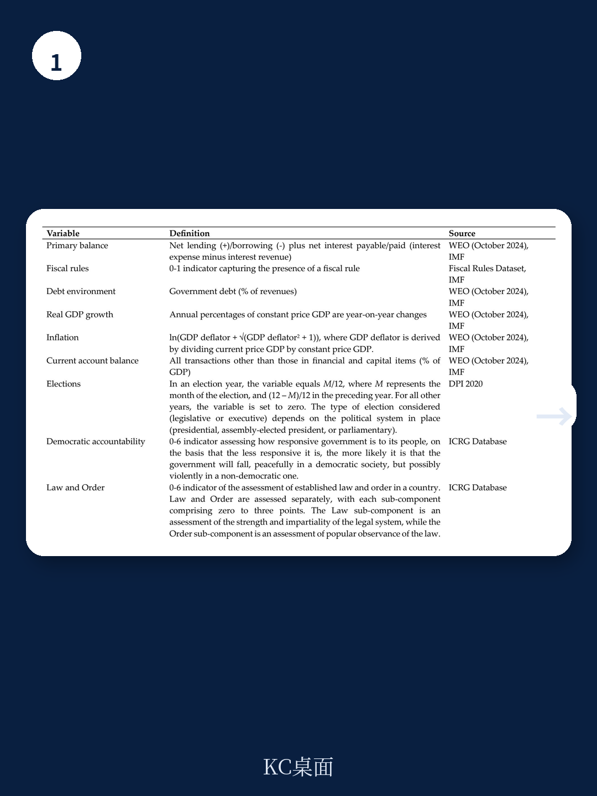

# 世界银行：财政规则的效果，关键不在规则本身，而在引入时的条件

一份来自世界银行的最新研究，对全球108个国家近三十年的财政规则实践做了系统检验，得出一个反直觉的判断：财政规则的效果并非随时间线性增强，而是取决于“谁在什么时候、什么状态下引入它”。对于正在讨论新一轮财政框架改革的中国，以及所有面临债务约束的新兴市场，这份报告的结论值得细读。

报告的核心发现是：财政规则的引入确实能改善初级财政余额，十年内平均提升约1%的GDP。但这个平均数字掩盖了巨大的结构性差异。在发达经济体和制度质量高的国家，财政规则的效果会随时间逐渐增强；而在新兴市场和发展中经济体，尤其是制度薄弱的国家，这些效果往往在中期后逐渐消退。

更关键的是，初始条件——规则引入时的经济状况和政治格局——对规则的长期效果有决定性影响。在经济困难时期或政治权力高度集中时引入的财政规则，其中期效果往往大打折扣。这意味着，财政规则的成功，与其说取决于规则本身的条款设计，不如说取决于引入的时机和共识基础。

> **KC评论：** 这份报告最值得关注的点不是“财政规则有没有用”，而是“什么条件下它会失效”。对于投资者和政策研究者来说，理解这些条件，远比记住一个平均效应重要。完整报告中有大量关于制度质量、政治集中度、经济周期不同阶段下效果差异的细分图表，这些才是真正可以用于判断具体国家财政纪律前景的工具。

## 1. 财政规则的效果不是线性的，发达经济体和新兴市场走的是两条完全不同的路径

报告使用局部投影法（Local Projections）追踪了财政规则引入后十年内的动态效果。结果显示，在全部样本中，初级财政余额在规则引入后逐步改善，十年累计提升约1%的GDP。但这个平均效应掩盖了发达经济体与新兴市场之间的根本性分化。

对于发达经济体，财政规则的效果随时间递增。规则引入后的第一年效果有限，但到第五年、第十年，改善幅度持续扩大。这表明，在制度健全的环境中，财政规则通过不断积累的信用和约束力，逐渐改变了政府的财政行为模式。

对于新兴市场和发展中经济体，情况截然不同。规则引入后的短期（一到三年）内，效果甚至比发达经济体更明显——这可能反映了国际金融机构的压力或市场约束的即时作用。但从中期（五年后）开始，效果逐渐消退，到十年时已不再显著。报告将此归因于制度薄弱导致的执行疲软和规则规避。

这种分化背后的机制很清晰：财政规则的有效性依赖于“可信承诺”。在制度健全的国家，规则本身就是一个信号——市场相信政府会遵守规则，因此政府也有动力维持信用。在制度薄弱的国家，规则往往被视为外部强加的约束，缺乏内生的执行动力，时间一长就会被各种例外条款和会计操作所侵蚀。

> **KC评论：** 这个发现对投资新兴市场债券的机构有直接含义。一个新兴市场国家引入财政规则，短期内可能带来利差收窄和信用改善，但这并不意味着五年后依然有效。完整报告中对不同制度质量国家的效果衰减曲线做了量化对比，这些数据对判断主权信用趋势非常关键。

## 2. 初始条件决定规则命运：经济困难时期引入的规则，效果往往不持久

报告最引人注目的发现之一，是对“初始条件”的系统性检验。研究将财政规则引入时的经济状态分为两类：经济困难时期（产出缺口为负或债务压力高企）和相对平稳时期。

结果清晰：在经济困难时期引入的财政规则，其效果在中期后明显弱于平稳时期引入的规则。这意味着，当财政规则是被迫引入——例如在债务危机或国际纾困压力下——它更像是一剂强心针，短期有效但难以持续。相反，在经济相对健康、政府有选择空间时自愿引入的规则，更有可能成为长期财政纪律的基石。

这个发现与“改革窗口期”理论高度一致。经济困难时期虽然为改革创造了政治动力，但也往往意味着规则的设计和执行都面临更大的阻力。政府可能急于展示承诺，而忽视了规则的可持续性设计；市场也会怀疑这种承诺的真实性。

对于当前全球环境，这一结论尤其值得关注。许多新兴市场国家在后疫情时代面临高债务和低增长的困境，正考虑或已经引入新的财政规则。报告提醒，如果这些规则是在经济压力下仓促出台，而不是经过充分共识和制度准备，其长期效果可能远低于预期。

> **KC评论：** 这解释了为什么一些拉美国家多次引入财政规则又多次突破——因为每次都是在危机中引入，危机一过约束力就自然衰减。完整报告中还讨论了政治权力集中度对规则效果的影响，这个变量对理解某些新兴市场的财政纪律前景非常关键。

## 3. 政治共识比政治权力更重要：权力越集中，规则效果越差

报告另一个反直觉的发现涉及政治格局。研究使用“政治集中度”指标——即执政党在议会中的席位占比——来检验政治环境对财政规则效果的影响。

直觉上，权力越集中的政府越容易推行财政纪律，因为反对派的阻力小。但报告发现，恰恰相反：当执政党拥有压倒性多数席位时引入的财政规则，其长期效果反而更弱。而在政府与反对派力量相对平衡的环境下引入的规则，效果更为持久。

这个悖论的解释在于“承诺的可信性”。当权力高度集中时，政府随时可以修改或废除规则，市场知道这一点，因此规则缺乏真正的约束力。而当权力分散、需要跨党派共识才能修改规则时，规则本身就成为更可信的承诺工具。此外，共识驱动的规则往往在设计阶段就经过了更充分的讨论，条款更合理、例外更少。

这一发现对理解全球财政规则实践有重要启示。许多新兴市场国家在强人政治下引入财政规则，短期内确实改善了财政指标，但这种改善往往不可持续。一旦政治格局变化或经济压力出现，规则很容易被突破。

> **KC评论：** 这个结论对主权信用评级有直接含义。评级机构在评估一个国家的财政纪律时，不仅要看是否有财政规则，还要看引入时的政治格局。权力高度集中下引入的规则，评级上调的可持续性存疑。完整报告中对政治集中度的量化分档及其与规则效果的关系做了详细图表展示。

## 4. 制度质量是放大器，但不是替代品

报告的一个重要延伸发现是：制度质量确实能增强财政规则的效果，但它不是唯一的条件。即使在制度质量较高的国家，如果规则是在经济困难时期或权力高度集中时引入，其长期效果也会打折扣。

这意味着，制度质量更像是一个“放大器”而非“替代品”。好的制度能让好的规则效果更好，但不能弥补规则引入时机或政治环境上的缺陷。反过来，即使在制度相对薄弱的国家，如果在经济平稳时期、经过充分政治共识引入规则，其效果也可能优于制度健全但规则引入时机不佳的国家。

这个发现对政策设计有直接含义：与其追求完美的规则条款设计，不如花更多精力确保引入的时机和政治环境合适。对于正在考虑引入财政规则的国家，报告建议优先在以下条件下推进：经济相对平稳、债务压力可控、政治力量相对平衡或已形成跨党派共识。

> **KC评论：** 这个结论对研究中国财政框架改革有参考价值。中国不是典型意义上的财政规则国家，但近年来关于地方债务约束和财政纪律的讨论日益增多。报告关于“引入时机”和“共识基础”的分析框架，或许可以用于理解不同财政改革方案的可能效果。完整报告中对制度质量的分解维度及其与规则效果的交互作用做了更细致的量化分析。

## 5. 报告尚未完全回答的关键问题：规则设计与初始条件如何相互作用？

尽管报告在初始条件的影响上做出了重要贡献，但它对“规则设计”与“初始条件”之间的交互作用着墨不多。例如，在经济困难时期引入的规则，是否可以通过更灵活的设计（如自动稳定器条款、投资豁免条款）来弥补时机上的劣势？在权力高度集中环境下引入的规则，是否可以通过更强的法律基础（如宪法化）来增强可信度？

报告在稳健性检验中排除了规则设计差异对结果的驱动作用，但这并不意味着设计不重要。更可能的情况是，规则设计与初始条件之间存在复杂的交互关系：某些设计特征可能特别适合某种初始条件，而在其他条件下效果不佳。

此外，报告聚焦于“是否引入规则”，而未充分区分“引入后是否严格执行”。许多国家名义上有财政规则，但实际执行率很低。初始条件是否也影响执行率？规则设计是否能弥补执行意愿的不足？这些都是有待进一步研究的问题。

> **KC评论：** 这些未解问题恰好是完整报告中最值得深入阅读的部分。报告提供了大量关于不同子样本、不同时间窗口、不同制度质量分组的异质性分析结果，这些细节对于理解财政规则的实际效果边界非常有价值。加入社群后，可以获取完整报告的详细解读和原始图表，包括那些未在本文展开的异质性分析结果。

---

财政规则不是银弹。世界银行的这份报告用严谨的实证方法提醒我们：规则的有效性取决于谁在什么时候、什么条件下引入它。对于投资者而言，这意味着不能简单地将“某国引入了财政规则”等同于“该国财政纪律将改善”。需要追问：规则是在什么经济环境下引入的？政治格局如何？制度基础是否牢固？

对于政策制定者而言，报告的核心启示是：与其急于在经济困难时推出财政规则作为信号，不如等待更好的时机，或在规则设计中预留足够的灵活性和执行保障。好的时机和充分的共识，可能比完美的条款设计更重要。

这些未解问题，正是我们每日在社群中深入讨论的内容。每天，AI agent 与人工 review 会生成国际投行中文摘要与 KC 评论，涵盖当天最新数据图表合集，既方便喂给 AI 进行深度分析，也方便人工快速把握市场动态。欢迎加入社群，领取完整研报解读与原始图表，继续探讨财政规则在不同环境下的真实效果边界。

Personal reading notes and learning share only. Not investment advice.

