# Dynamic, High-Resolution Wealth Measurement in Data-Scarce Environments

Zhuo Zheng

Timothy Wu

Richard Lee

David Newhouse

Talip Kilic

Marshall Burke

Stefano Ermon

David B. Lobell

POLICY RESEARCH WORKING PAPER 11058

## Abstract

Accurate and comprehensive measurement of household livelihoods is critical for monitoring progress toward poverty alleviation and targeting social assistance programs for those who most need it. However, the high cost of traditional data collection has historically made comprehensive measurement a difficult task. This paper evaluates alternative satellite-based deep learning approaches using detailed household census extracts from four African countries to accelerate progress toward comprehensive, fine-scale, and dynamic measurement of asset wealth at scale. The results indicate that transformer architectures solve multiple open measurement problems, by providing the most accurate measurement of local-level variation in household asset wealth across countries and cities, as well as changes in household asset wealth over time. Experiments that artificially restrict data availability show the model's ability to achieve high performance with limited data. The proposed approach demonstrates the promise of combining satellite imagery, publicly available geo-features, and new deep learning architectures for hyperlocal and dynamic measurement of wealth in data-scarce environments.

# Dynamic, High-Resolution Wealth Measurement in Data-Scarce Environments

Zhuo Zheng, $^{a}$ Timothy Wu, $^{a}$ Richard Lee, $^{b,c}$ David Newhouse, $^{d}$ Talip Kilic, $^{d}$ Marshall Burke, $^{c,e}$ Stefano Ermon, $^{a}$ and David B. Lobell $^{b,c}$

$^{a}$ Department of Computer Science, Stanford University, Stanford, 94305, CA, USA

$^{b}$ Department of Earth System Science, Stanford University, Stanford, 94305, CA, USA

$^{c}$ Center on Food Security and the Environment, Stanford University, Stanford, 94305, CA, USA

$^{d}$ Development Economics Data Group, World Bank Group, Washington DC, 20433, DC, USA

$^{e}$ Department of Environmental Social Science, Stanford University, Stanford, 94305, CA, USA

## ARTICLE INFO

Keywords:
Economic well-being
High-resolution
Poverty mapping
Satellite image
Deep learning

JEL codes: C45, I32

Accurate, up-to-date, and highly resolved measurements of economic well-being are essential for monitoring and achieving international goals of poverty alleviation. These goals include the United Nations' Sustainable Development Goal 1 of "No Poverty," which is nearing its original 2030 deadline, as well as countless other international and regional poverty targets. Granular estimates of household poverty and wealth are critical for understanding whether these goals are being met, as well as for targeting and evaluating anti-poverty interventions in regions where progress is lagging [6].

Official poverty measurement in low- and middle-income countries has long relied on household surveys, an indispensable but time-consuming tool for livelihood measurement. Given the technical capacity needed for reliable survey measurement and the substantial logistical difficulties in carrying out nationally or sub-nationally representative livelihood surveys, such surveys are often infrequently completed in much of the world, rendering comprehensive and timely measures of poverty and related outcomes unavailable for many periods in many regions $[6, 9]$ . Meanwhile, survey data are typically based on samples meant to be representative at larger spatial scales and are thus usually inadequate for generating reliable estimates at the village or neighborhood level – the level at which anti-poverty interventions often need to be targeted. Consequently, there is a pressing need for more cost-effective and scalable alternatives to local-level livelihood measurement that can complement and scale existing household survey-based efforts.

In recent years, the abundance of publicly available remote sensing data and recent advances in machine learning have transformed the livelihood measurement landscape, progressively shifting from national censuses and related household surveys to efforts to combine this information with information from satellites and other sensors. Early studies used coarse, publicly

available satellite imagery and/or mobile phone data, combined with early machine learning and deep learning architectures, to show how these new sources of information could be used to support broad-scale measurement of wealth and poverty $[4, 17, 29]$ . Subsequent studies introduced further refinements that used publicly available or proprietary geospatial data to improve satellite-based wealth measurement $[8, 12, 2]$ . These advances confirmed that leveraging satellite images and machine learning can be an accurate, inexpensive, and scalable solution to estimate wealth $[6, 21, 23]$ .

Here we assemble a large-scale, multi-resolution, and multi-temporal wealth dataset using national censuses or extracts obtained from National Statistics Offices and multi-spectral satellite imagery from multiple public and private sensors of varying resolutions. Our dataset comprises over 12 million households in four African countries (Malawi, Mozambique, Burkina Faso, and Madagascar) and, uniquely, contains precisely georeferenced measurements within two Malawian cities as well as repeated measurements of the same locations over time – two features lacking in prior studies.

We use these data to make four contributions relative to earlier work. First, we directly test a new type of deep learning model – specifically, vision transformers – against earlier deep learning architectures based on convolutional neural networks (CNNs) that are common in the literature, as well as against simpler models that use geospatial features and a tabular machine learning approach (XGBoost) for prediction. Specifically, we design a conditioning module that enables our transformer model to handle multi-modal inputs, integrating both satellite imagery and geospatial features simultaneously (see “Methods”). We test models that use satellite imagery from Landsat (30m/pixel), PlanetScope (3m/pixel), and/or SkySat (0.5m/pixel) sensors. We then compare these more sophisticated methods and inputs with simpler methods that rely

solely on predefined geospatial features from a range of sources.

These comparisons are important because simpler approaches that rely on publicly available data could be both easier and cheaper to implement at scale, particularly for public organizations interested in their widespread application, and so understanding performance tradeoffs across model architectures and inputs is critical to understanding how to scale promising new measurement approaches.

Second, a key advantage in our setting is the use of accurate, high-resolution data from national censuses or extracts for model training and evaluation. In contrast to earlier work that relied primarily on publicly available household survey data characterized by spatially imprecise location data and limited household samples, our data cover a much larger set of households in a given location and in some cases are precisely georeferenced. Comparisons against such “gold standard” data allow us to understand whether model prediction errors are a result of inaccurate predictions or noise in the measure of ground truth – an understanding that was often elusive in earlier work in developing countries $[6, 29]$ . In addition, it allows us to consider a wide range of sample sizes to assess the minimum training data requirements for advanced machine learning methods to produce accurate estimates. To quantify the importance of training sample size for performance, we extensively test the extent to which additional training data affects model performance across multiple settings.

Third, our high-resolution census data enables a novel understanding of how satellite imagery and other geospatial data can be used to predict variation in livelihoods within urban areas in Africa – a capability that was again hard to evaluate in previous settings given limited samples and spatial noise in training data. This could be particularly consequential in urban environments that exhibit substantial spatial variability in livelihoods even within small spatial domains. Using comprehensive and precisely georeferenced census data from two cities in Malawi, we are able to train and test models using different resolutions of satellite data, and we find that the models are surprisingly accurate in predicting street- and neighborhood-level variation in wealth within these cities.

Fourth, the censuses and extracts allow us to evaluate whether imagery-based models can make accurate predictions of changes in wealth over time. Previous efforts were again substantially constrained by ground data that did not repeatedly sample the same locations in different surveys $[29]$ . As a result, it remains unclear whether an imagery-based model trained largely to predict spatial variation in wealth or consumption would be able to predict temporal variation, as the latter is typically both smaller and potentially driven by changes that are harder to detect in imagery. Repeated census data from the same locations 10 years apart in Malawi and Mozambique allows us to evaluate whether models can indeed extract information from imagery capable of predicting temporal variation in asset wealth.

## Results

Performance on prediction of country-level wealth
For country-level wealth prediction, we train each model on each country individually and conduct country-wise five-fold cross validation for each model. The CNN model uses only Landsat satellite imagery as input. XGBoost utilizes geospatial features (geo-features) either alone or combined with satellite image statistical features. All models were trained to predict the asset wealth index (AWI) [29]. Estimates of AWI were generated and linked to imagery at fine administrative levels in Madagascar, Malawi, and Mozambique. In Burkina Faso, AWI estimates are only available for 334 communes (Table 1). This reduced the effective sample size of the training data in Burkina Faso, as seen in the clumped pattern of survey-measured asset wealth shown in the right panel of Figure 1d. This difference is reflected in the results. As shown in Figure 1a, a naive transformer model that does not condition on geo-features consistently outperforms other models across the Malawi, Mozambique, and Madagascar datasets. In those countries, predictions using the transformer model achieve $R^2$ values of 0.83, 0.70, and 0.62, respectively, when trained on the full census extract. In Burkina Faso, because of the smaller effective sample size, XGBoost using satellite imagery and geospatial features achieves the best average performance among the models (62.9% of variation explained). A naive transformer, when using only satellite imagery, remains competitive (57.4% of variation explained). We also limit the number of training samples to 1%, 5%, 10%, 25%, and 50% of the original training dataset to analyze how model performance varies with training sample size. Based on the results from these four countries, we empirically identify 10% as a critical inflection point for model performance, below which the accuracy of the estimates deteriorates rapidly.

Another key factor in reducing training sample collection costs for wealth prediction is the number of households aggregated per sample. To analyze this factor, we randomly sample 10 households per administrative area to construct the training sample, yielding a “10-household” training dataset for each country. We then train a naive transformer model on this “10-household” training set while still evaluating its performance on the original full household test set. The results (Figure 1b) indicate that our transformer models trained with the 10-household data exhibit comparable performance to those trained with data on all households. Using Malawi as an example, the 10-household data only include approximately 23% of all surveyed households. The performance gap between models trained on all households and the 10-household sample is only 3 percentage points (82% versus 79%). In contrast, when reducing the number of training samples, the performance gap between models trained on full training samples and those trained on 25% of the samples is as large as 12 percentage points (82% versus 70%).

These results offer significant insights into data-efficient wealth measurement. When at least 10 households are available per image, surveying more enumeration areas takes precedence over surveying additional households within the enumeration area for predicting wealth with our transformer model. Geospatial features, recognized as valuable auxiliary data for improving economic measurement $[21]$ , are widely used in wealth prediction. Here we design a conditioning module (see “Methods”) for our transformer model, enabling the efficient fusion of geospatial features and deep visual features. The results, as shown in Figure 1c, suggest that geospatial features significantly improve the

a  
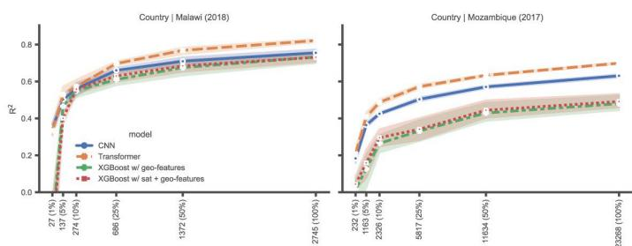

b  
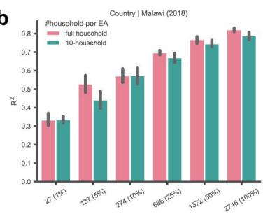

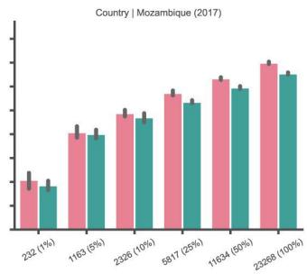

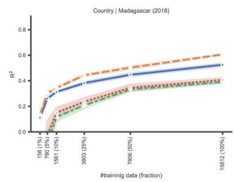

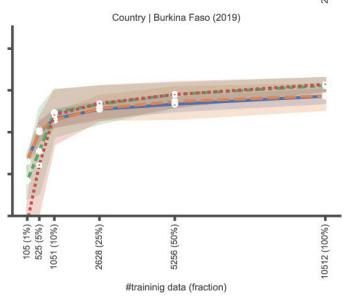

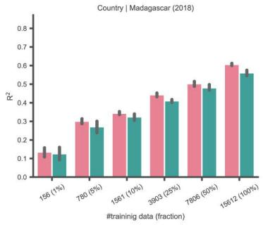

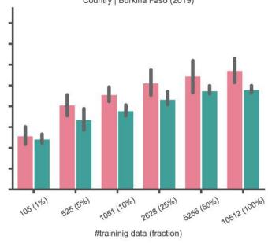

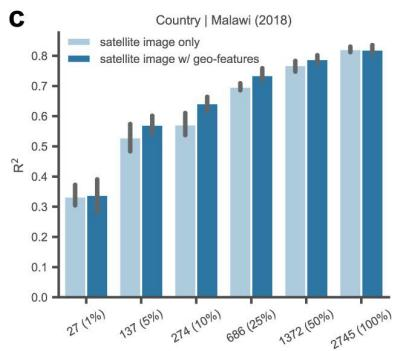

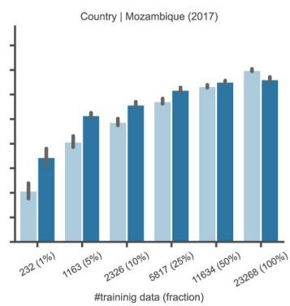

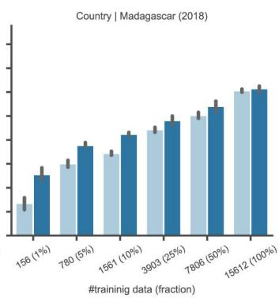

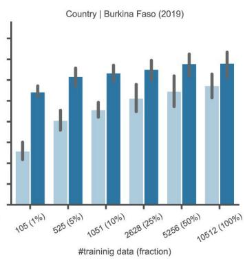

d  
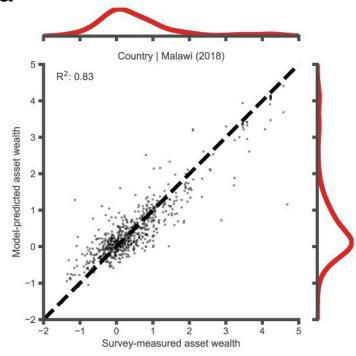

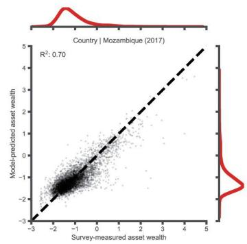

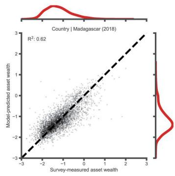

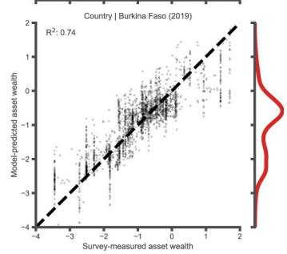  
Figure 1: Performance of country-level asset wealth index predictions. a. Performance comparison for four countries across four different machine learning methods trained on various fractions of the census extract. Negative $R^{2}$ values are not shown. Transformer results do not integrate geo-features and are trained using asset wealth constructed from all sample households. b. Performance comparison between Transformer models trained with asset wealth constructed from all households versus 10 households per administrative area. c. Performance comparison between Transformer models with and without integrating geospatial features. d. Scatterplot of survey-measured asset wealth against predicted wealth from the best-performing fold.

model performance across all countries, especially in Burkina Faso due to the lower effective sample size resulting from linking images to survey data at the commune level. Geospatial features appear particularly beneficial when the training sample size is smaller, indicating that the model can struggle to learn optimal visual representations from raw imagery at smaller sample sizes, at which point geospatial features serve as a valuable supplement for wealth prediction. Of the methods shown in Figure 1, the transformer model with geo-features shown in Figure 1c yields estimates with the highest $R^{2}$ in all cases except one, when training using the full census in Mozambique, for which the naive transformer model is slightly more accurate. The four gridded wealth maps in Figure 2, with a 4.8 km/pixel resolution, are generated solely using our transformer model and Landsat imagery. Without the need for geospatial feature preparation, the entire mapping process can be completed within an hour using 8 NVIDIA RTX A4000 GPUs. This means that our approach has great potential to accelerate granular wealth measurement at a national scale.

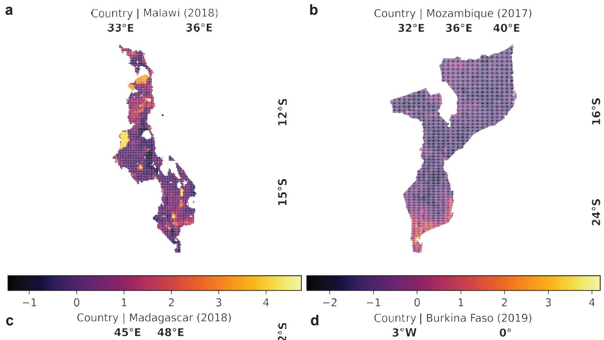

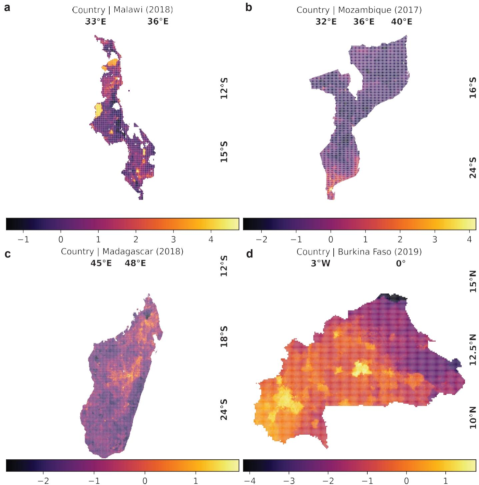  
Figure 2: Maps of country-level predicted asset wealth index. a. Country-level wealth asset map for Malawi in 2018. b. Country-level wealth asset map for Mozambique in 2017. c. Country-level wealth asset map for Madagascar in 2018. d. Country-level wealth asset map for Burkina Faso in 2019. AWI values are generated from country-specific models and are therefore not comparable across countries.

## Performance on prediction of change in country-level wealth

We further evaluate country-level wealth change prediction for each country via fivefold cross-validation. Following $[29]$ , the CNN model uses concatenated bitemporal Landsat images along the channel dimension as input. Our transformer model processes each of the bitemporal images individually through a weight-shared, single-image encoder and concatenates encoded features along the channel dimension before feeding into the final regression network. Unlike the previous setting, XGBoost only takes bitemporal satellite images as input since no geospatial features are available for Malawi in 2008 and Mozambique in 2007. The results (Figure 3a) show that deep learning models trained on the full sample can capture a remarkable 52% of the variation in Malawi and 42% in Mozambique. The deep models outperform XGBoost when given the same input data, which implies that representation also matters in the measurement of wealth. Our transformer model slightly outperforms the commonly used CNN in estimating decadal wealth changes in Mozambique and achieves comparable performance in Malawi. This difference may be attributed to variations in training sample sizes and model complexities. Mozambique has approximately $10\times$ more training samples than Malawi, which could explain why the more flexible Transformer model outperforms CNN estimates in Mozambique. As with the cross-sectional results above, we simulate two scenarios of data scarcity for predicting change: (i) restricting the number of sampled enumeration areas; and (ii) reducing the number of households aggregated per sample to 10. The results (Figure 3c) suggest that reducing the number of sampled locations degrades accuracy more than reducing the number of households aggregated per sample, consistent with experimental results of

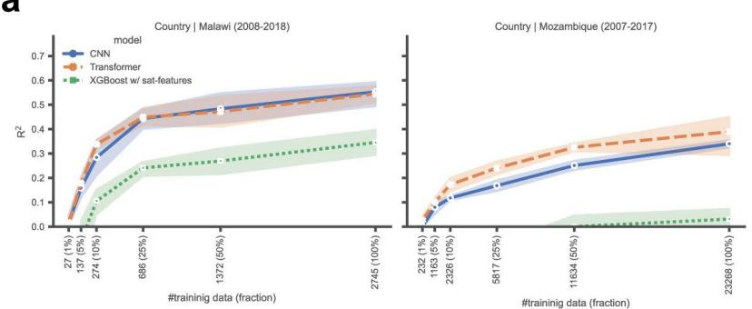

a  
b  
C  
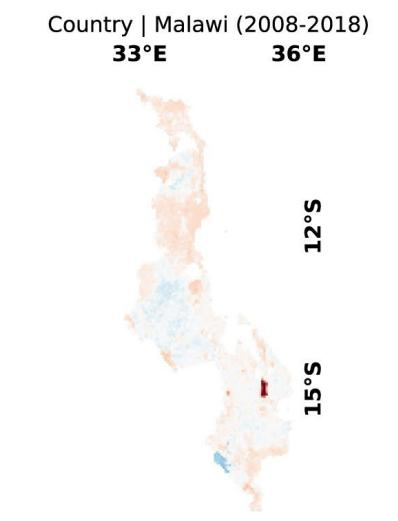

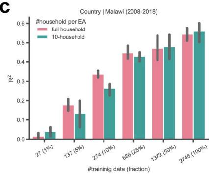

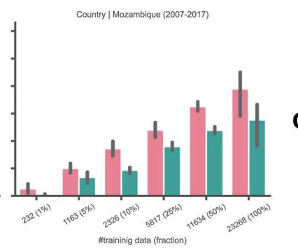  
d

e  
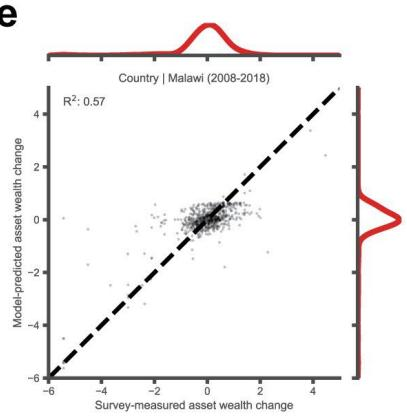

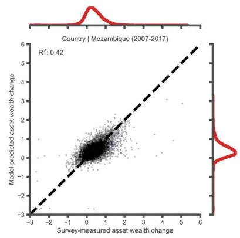

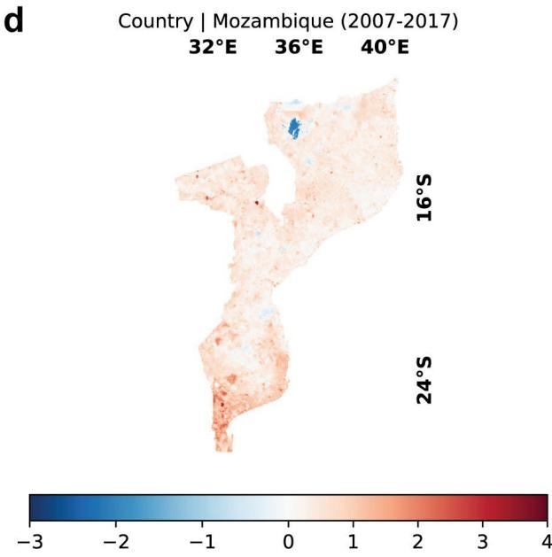  
Figure 3: Performance of country-level predictions of decadal change in asset wealth index. a. Performance comparison for two countries across three machine learning methods trained on various fractions of the census extract. Negative $R^{2}$ values are not shown. b. Country-level wealth asset change map for Malawi from 2008 to 2018. c. Performance comparison between Transformer models trained with asset wealth constructed from all households per administrative area and 10 households per administrative area. d. Country-level wealth asset change map for Mozambique from 2007 to 2017. e. Scatterplot of survey-measured asset wealth against predicted wealth from the best-performing fold.

country-level wealth prediction.

We further demonstrate the scalability of our transformer model on decadal wealth change mapping of Malawi (Figure 3b) and Mozambique (Figure 3d). Unlike single-temporal wealth maps, bitemporal wealth change maps provide deeper insights into the dynamics of economic development, allowing for the identification of regions experiencing significant growth or decline over time. We find that the southern part of Malawi exhibits more negative changes, indicating a decline in wealth over the decade, whereas the northern and some central areas are relatively neutral or slightly positive. In Mozambique, most regions show an overall increase in wealth, with southern regions showing more wealth gains compared to the northern regions. There are a few isolated areas, notably a blue region near the northern part, which experienced a decrease in wealth. In both

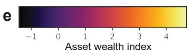

a  
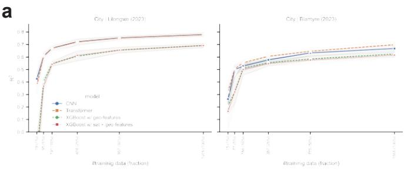

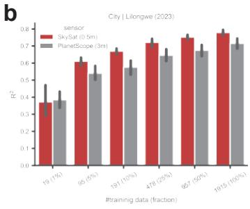

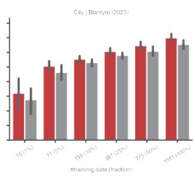

C  
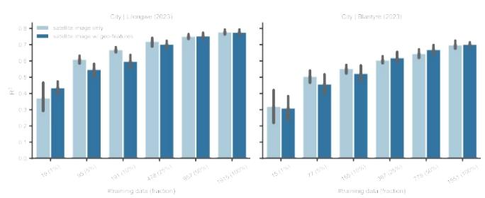

d  
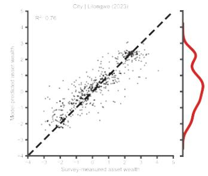

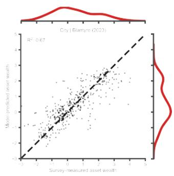

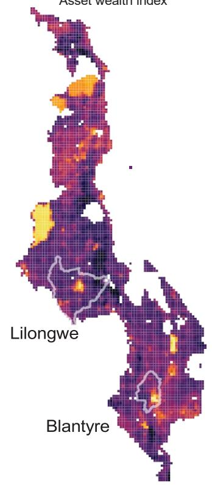

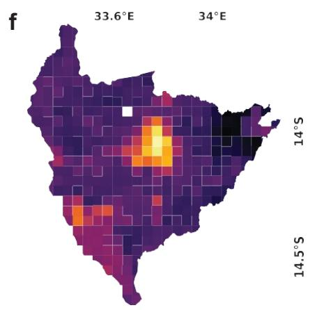

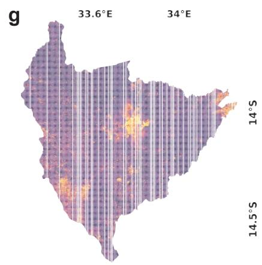

h  
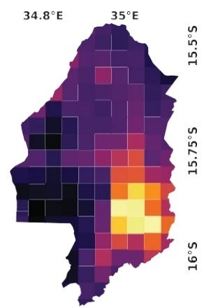

|  
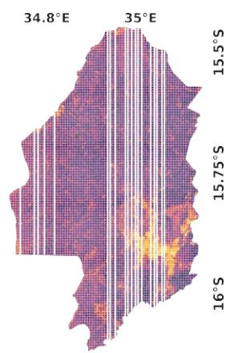  
Figure 4: Performance of city-level asset wealth index prediction. a. Performance comparison for two cities across four different machine learning methods trained on various fractions of the census. b. Performance comparison between Transformer models estimated using Skysat imagery versus Planetscope imagery c. Performance comparison between Transformer models with and without integrating geospatial features. d. Scatterplot of survey-measured asset wealth against predicted wealth from the best-performing fold. e. Satellite-based national wealth asset map for Malawi. f. Country-level wealth asset map for Lilongwe. g. City-level wealth asset map for Lilongwe. h. Country-level wealth asset map for Blantyre. i. City-level wealth asset map for Blantyre.

countries, the wealth distribution changes are not uniform, suggesting that certain areas are benefiting more from economic growth while others are falling behind. This wealth disparity could provide insights into economic policies, development programs, or external factors such as climate impacts that have influenced these changes.

## Performance on prediction of city-level wealth

The Landsat-based wealth prediction models above produced wealth maps with a spatial resolution of 4.8 km. For some applications, such as targeting aid within urban areas, finer-resolution wealth maps are of interest. To that end, we utilized household-level census data from two cities to test wealth prediction using high-resolution satellite imagery (PlanetScope and SkySat). Following the same settings with the above two subsections, we evaluate the CNN, transformer, and XGBoost models, as shown in Figure 4a. The CNN and Transformer models consistently perform better than XGBoost (with or without geospatial features) across both cities. This highlights the importance of deep visual representation from high-resolution satellite imagery for city-level wealth prediction, which constitutes the main gap between deep learning-based models and XGBoost. Our transformer model outperforms the CNN by a noticeable margin in Blantyre, especially when utilizing the full dataset, demonstrating greater scalability with increased data while also achieving comparable performance to the CNN in Lilongwe. Across both cities, all models exhibit significant improvements as the training data fraction increases; however, performance gains begin to plateau after approximately 25%-50% of the data, resulting in diminishing gains beyond that threshold.

We compare two kinds of commonly used proprietary high-resolution, multi-spectral satellite imagery, i.e., PlanetScope (3m) and SkySat (0.5m), as shown in Figure 4b. The results indicate that SkySat consistently outperforms PlanetScope across various training data fractions in both cities. Both sensors capture 4-band (red, green, blue, and near-infrared) satellite imagery, but they differ in spatial resolution and swath width. This highlights the importance of urban spatial detail in accurately measuring wealth using our transformer model. While PlanetScope demonstrates lower average performance than SkySat, its broader swath width and high revisit frequency yield more comprehensive satellite imagery, facilitating large-scale wealth mapping with commendable accuracy (Figures 4g and 4i). Consequently, SkySat is well-suited for wealth measurement in local areas with high accuracy requirements, and PlanetScope is more suitable for large-scale wealth mapping to obtain macro insights.

While city-level wealth prediction is promising, training a city-level transformer still requires sufficient samples that are expensive to collect. We also evaluate whether integrating geospatial features can reduce the required training samples for city-level wealth prediction. As presented in Figure 4c, we find that unlike for country-level predictions, geospatial features generally reduce model performance. This is because geospatial features are always derived from low-resolution satellite imagery, e.g., Landsat (30m), to achieve global coverage. These low-resolution geospatial features introduce spatial errors into high-resolution satellite image-based wealth prediction. For example, a coarse land cover map can ignore small but important spatial details in urban areas. In this case, our transformer model can learn more accurate wealth representations solely from satellite images, even when trained on varying sample sizes.

Overall, we demonstrate accurate large-scale, city-level wealth mapping in two cities in Malawi, i.e., Lilongwe and Blantyre. Compared to country-level wealth maps at a 4.8km resolution (Figures 4f and 4h), our 0.3km resolution city-level wealth maps (Figures 4g and 4i) provide an unprecedentedly granular spatial distribution of wealth across these two cities and with strong performance explaining up to 76% of the variation for Lilongwe and up to 67% for Blantyre (Figure 4d).

## Discussion

This paper proposes and evaluates the use of a vision transformer architecture to solve multiple open problems pertaining to combining survey and satellite data to produce wealth estimates at fine spatial scales. For cross-sectional wealth predictions, careful evaluations using georeferenced census extracts from four countries show that estimates from the transformer model perform well. When paired with Landsat imagery, $R^{2}$ values for transformer models that incorporate geo-features outperform commonly used CNN and XGboost models for asset index prediction in all four countries, for all sample sizes considered. Across all countries, accuracy degrades rapidly when using less than 10% of the census extract for training. In Mozambique and Madagascar, estimates produced using transformer models explained approximately 20 to 30 percentage points more of the variation in wealth than estimates produced using XGboost and geo-features. Transformer models also outperform CNNs in all four countries, by amounts up to approximately 5 percentage points in Madagascar and Mozambique. Incorporating geo-features into the transformer architecture improves performance by 5 to 10 percentage points at small sample sizes in Mozambique, Madagascar, and Burkina Faso.

Transformer models also perform well when predicting variation within cities at 0.3km scales, achieving $R^{2}$ up to 0.76 in Lilongwe and 0.67 in Blantyre. However, incorporating geo-features at this scale reduced performance, because they are constructed from lower-resolution Landsat imagery. Finally, the transformer model also generates more accurate estimates than CNNs and XGboost when predicting decadal changes in the asset wealth index in Mozambique and Malawi. Model predictions achieve $R^{2}$ values of 0.57 in Malawi and 0.42 in Mozambique at fine spatial levels, despite the lack of available geo-features. This is a large improvement over the 0.15 to 0.17 $R^{2}$ reported by [29] in comparable settings, and demonstrates the feasibility of combining transformer models with imagery to estimate wealth changes at granular levels, given sufficient training data.

The results point to the benefits of applying transformer models that incorporate geospatial features to generate high-resolution predictions of asset wealth. This in turn underscores the importance of developing tools, documentation, and training materials to make estimation feasible for national statistics offices, international organizations, and other data providers. In addition, developing and evaluating methods for estimating the uncertainty associated with predictions is crucial to facilitate implementation.

The results also highlight the importance of having access to a critical mass of training data to estimate predictive models. In general, when the number of images we used to train the model fell below 10% of the population, predictive performance deteriorated rapidly. However, the results were far more robust to restricting the size of the sample used to generate the training data labels. Furthermore, prediction accuracy remained high in Burkina Faso, despite a reduced effective sample size of the training data due to linking satellite images to survey data at a much higher geographic level. Future work could investigate methods to further improve performance when training transformer models using the types of small samples typically collected for household surveys.

Finally, the results demonstrate the potential of using transformer models to predict changes in wealth and household well-being more generally. Future work can examine the extent to which the parameters in change models are stable across time and/or space. This could point the way toward the use of geospatial data to generate approximate micro estimates of welfare change in settings where survey data are unavailable.

## Methods

We describe the details of our large-scale, multi-resolution, and multi-temporal wealth dataset, wealth and its change prediction approaches, and evaluation methods.

Multi-resolution and multi-temporal wealth dataset. We utilize data from four low-income countries (Malawi, Mozambique, Burkina Faso, and Madagascar) and two cities in Malawi as study areas in Africa. These countries were selected due to the availability of location identifiers in available census extracts. This allows us to pinpoint models on the most comprehensive scale to date, to tune a general model to specific countries and even cities, and to robustly simulate the impact of data scarcity on model performance across three spatiotemporal scenarios: country-level wealth level prediction, decadal country-level wealth change prediction, and city-level wealth level prediction.

Asset wealth index (AWI). We construct the asset wealth index using data from the national census questionnaire. We utilize full census data in Mozambique and Madagascar, and census extracts in Malawi and Burkina Faso, resulting in a total dataset comprising over 12 million households across four countries, with more than 700,000 households represented in each country's dataset. In contrast, previous studies [29, 23] leveraging DHS data included approximately 500,000 households across 23 African countries, while LSMS data measured about 9,000 households across five countries. Table 1 provides a full description of the size of the datasets.

From the census questionnaire, we rank seven housing characteristics (housing type, wall material, roof material, floor material, water source, toilet type, and energy source) on a scale of 1 to 5. Additionally, we assess the presence of six assets (radio, television, landline, car, motorbike, and bicycle) using a binary classification (ownership/non-ownership). This data is then standardized and used to construct a principal components analysis (PCA) model, from which the first principal component was extracted as the asset wealth index $[13, 25, 29]$ . Asset wealth index labels are then aggregated from the household to the

## Table 1

National census data details.

<table><tr><td>Country</td><td># Images</td><td># Admin areas</td><td># Households Surveyed</td></tr><tr><td>Malawi (2008)</td><td>3,432</td><td>12,412</td><td>572,764</td></tr><tr><td>Malawi (2018)</td><td>3,432</td><td>18,700</td><td>796,925</td></tr><tr><td>Mozambique (2007)</td><td>37,325</td><td>45,244</td><td>4,797,372</td></tr><tr><td>Mozambique (2017)</td><td>37,325</td><td>67,218</td><td>6,119,847</td></tr><tr><td>Burkina Faso (2019)</td><td>13,142</td><td>334</td><td>875,872</td></tr><tr><td>Madagascar (2018)</td><td>31,182</td><td>14,328</td><td>4,518,322</td></tr></table>

administrative area level, and then each pixel of the images is labeled based on the administrative area to which they belong. Finally, we average the pixel-wise asset wealth index map to obtain a scalar value as the ground truth for each image. Since a different PCA is constructed for each country, a value of 0 in one country does not correspond to the same level of wealth as a 0 in another country.

Satellite imagery. For country-level wealth and its change prediction, we collected daylight Landsat (30m/pixel) satellite imagery for Malawi, Mozambique, Madagascar, and Burkina Faso, where Malawi and Mozambique have bitemporal image pairs. Our Landsat imagery dataset was constructed using a 3-year median of cloud-free pixels, centered around the census year for each country. For countries with two census periods, imagery from Landsat 5 and Landsat 7 was used for the earlier census, while Landsat 8 was utilized for the more recent census. Each Landsat image has a fixed size of 150×150 pixels, resulting in each image covering 20.25km² (4.5×4.5km²). These images have six bands that are red, green, blue, near-infrared, short-wave infrared 1, and short-wave infrared 2. For city-level wealth prediction, we collect PlanetScope (3m/pixel) and SkySat (0.5m/pixel) multispectral satellite imagery to cover each administrative area in Lilongwe and Blantyre. Based on the average size of administrative areas, we empirically define the size of each grid as 0.3×0.3km², which results in each PlanetScope image with 100×100 pixels and each SkySat image with 600×600 pixels. Despite using 2018 household-level census data, we utilized available PlanetScope and SkySat imagery acquired in April 2023. These images contain red, green, blue, and near-infrared bands.

Geospatial features. In addition, we supplement satellite imagery with publicly available processed geospatial features, which we refer to as geo-features. These geo-features capture population, developmental, and environmental statistics. These features are population structure $[18]$ , population density $[28]$ , annual rainfall $[1]$ , minimum and maximum temperature $[1]$ , nighttime lights $[3, 11]$ , terra net primary product $[10]$ , aqua net primary production $[24]$ , cellphone tower count $[22]$ , impervious surface change year $[15]$ , land cover type $[5]$ , GHSL $[26]$ , building counts $[27]$ , building areas $[27]$ , soil pH $[16]$ , and soil organic carbon $[16]$ . A visual representation of one datapoint is provided in Figure 5; note that final asset wealth labels are combined into a single scalar value.

## Training wealth measurement models

The comparisons include a tree-based model, namely extreme gradient boosting (XGBoost) [7] and two advanced deep learning models (convolutional neural networks and transformers based on an encoder-linear architecture [29]. Based on empirical and

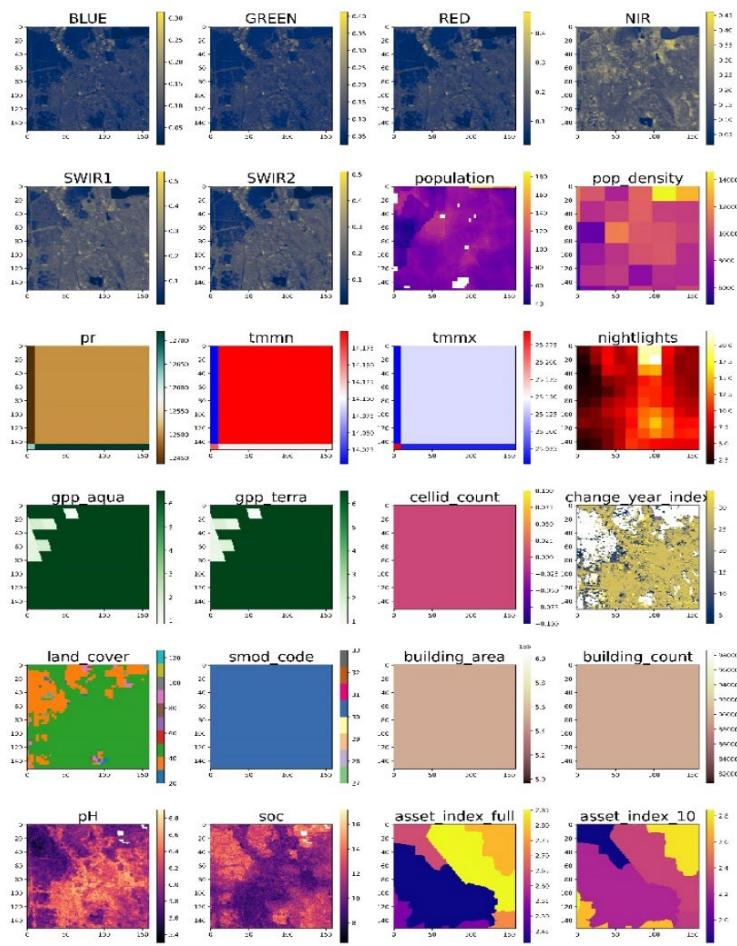  
Figure 5: An example of satellite image with geospatial features and asset wealth index label. This is a case of a country-level training sample.

systematic observations from $[14]$ , we choose SwinV2-T $[19]$ as a representative backbone for the transformer model.

XGBoost. An XGBoost regression model is used in this paper. Through experimentation, we determined that simply inputting the image-level channel moments as XGBoost input features resulted in the best performance. We used three moments (mean, standard deviation, and skew) when using satellite imagery only and one moment (mean only) when using satellite imagery and geospatial features. For wealth change predictions, we input the moments for all channels for both years into a single XGBoost model trained to directly predict the AWI change.

Convolutional neural network (CNN). Following $[29]$ , we build a CNN model with ResNet-18 for wealth level prediction and change prediction. For level prediction, we first use ResNet-18 to extract deep features and then compute an embedding vector via the global average pooling layer. Two multilayer perceptron (MLP) layers are appended on the last deep feature to predict AWI. For wealth change prediction, the main difference lies in feature extraction. We concatenated the bitemporal images along the channel axis and fed the result into a CNN to extract deep features.

Vision transformer and its multi-modal variant. For the transformer architecture, we first adopt SwinV2-T as the backbone to extract deep hierarchical features. As with the CNN, two MLP layers are appended to predict AWI. To integrate geospatial features into this transformer model, we provide a conditioning mechanism that adopts a standard cross-attention layer to incorporate geospatial features into deep features in a learnable way. SwinV2-T produces four deep hierarchical features; therefore, we adopt four cross-attention layers for conditioning. Through four times conditioning, the final deep feature is well integrated with geospatial features. The last deep feature is used for wealth regression based on the above two MLP layers. For wealth change prediction, we employ a Siamese network architecture that shares a SwinV2-T backbone across the bitemporal images, i.e., we extract deep features for each image with SwinV2-T independently. We then concatenated these two deep feature sets along the channel axis and fed the resulting tensor into two MLP layers for predicting wealth change.

Implementation details of deep models. We train all deep models using the same configuration. All models are trained end-to-end by minimizing the mean square error loss with the AdamW optimizer $[20]$ . Each model is trained for 100 epochs. The total batch size of 32, a constant learning rate of 1e-4, and a weight decay of 1e-2 are used. Training data augmentation adopts D4 dihedral group transformations to alleviate overfitting. (MLP) layers are used to predict AWI. For wealth change prediction, the main difference lies in feature extraction. We concatenated the bitemporal images along the channel axis and fed the result into a CNN to extract deep features.

## Model evaluation

Data splits and cross-validation. To ensure a robust evaluation of model performance, we employed five-fold cross-validation, training five distinct models for each country or city. Each model is trained on four folds and tested on the remaining one. The fold splits were created by uniformly sampling administrative areas, to keep all the images within the same administrative area together, such that all five folds have approximately the same number of images. The $R^{2}$ is used as the metric for both level and change prediction.

Simulating data scarcity. To investigate the model's performance under data scarcity, we simulate two scenarios of limited data availability. (i) Restricting the number of images. We reduce the number of images that we sample into our training data. When restricting data, we uniformly and randomly sample images within each of the four training folds. We conducted experiments using 1%, 5%, 10%, 25%, 50%, and 100% of the samples in the full training set. (ii) Restricting the number of households within images. We include an alternative "10-household asset wealth" label. For the creation of our 10-household AWI labels, households were sampled uniformly from each enumeration area. After this, the creation of the 10-household AWI labels was identical to the creation of full AWI labels described above. These labels only use data from 10 households per enumeration area, while our full asset wealth labels use hundreds to thousands of households per enumeration area.

## Acknowledgments

We thank Lina Cardona, Carlos Da Maia, Francis Mulangu, Mario Negre, Soudiki Soubeiga, and Michael Weber for their help obtaining data; Haishan Fu, Olivier Dupriez, Craig Hammer, and Jed Friedman for their support; and Brian Amaro, Nahum Maru, and Rohan Sikand for help with initial analysis. This project was partially funded by the Knowledge for Change Program's Phase IV-funded programmatic research project “Understanding Trends in Sub-National Differences in Economic Well-Being in Low- and Middle-Income Countries" and by the Keck Foundation.

## Author Contributions

DN, TK, MB, SE, and DL conceived of the project and designed analysis; RL processed data; ZZ and TW led the analysis; ZZ, DL, DN, and MB wrote the paper.

## Code and Data Availability

Code to conduct analysis and generate figures is available at https://github.com/Z-Zheng/dynamic\_highres\_poverty. We do not currently have permission from country national statistics offices to share the household level data or image-level labels.

## References

[1] Abatzoglou, J.T., Dobrowski, S.Z., Parks, S.A., Hegewisch, K.C., 2018. Terraclimate, a high-resolution global dataset of monthly climate and climatic water balance from 1958–2015. Scientific Data 5, 170191. doi:10.1038/sdata.2017.191.

[2] Ayush, K., Uzkent, B., Burke, M., Lobell, D., Ermon, S., 2020. Generating interpretable poverty maps using object detection in satellite images. arXiv preprint arXiv:2002.01612.

[3] Baugh, K., Elvidge, C.D., Ghosh, T., Ziskin, D., 2010. Development of a 2009 stable lights product using dm sp-ols data, in: Proceedings of the Asia-Pacific Advanced Network 30, p. 114.

[4] Blumenstock, J., Cadamuro, G., On, R., 2015. Predicting poverty and wealth from mobile phone metadata. Science 350, 1073–1076.

[5] Buchhorn, M., Lesiv, M., Tsendbazar, N.E., Herold, M., Bertels, L., Smets, B., 2020. Copernicus global land cover layers—collection 2. Remote Sensing 12. URL: https://www.mdpi.com/2072-4292/12/6/1044, doi:10.3390/rs12061044.

[6] Burke, M., Driscoll, A., Lobell, D.B., Ermon, S., 2021. Using satellite imagery to understand and promote sustainable development. Science 371, eabe8628.

[7] Chen, T., Guestrin, C., 2016. XGBoost: A scalable tree boosting system, in: Proceedings of the 22nd acm sigkdd international conference on knowledge discovery and data mining, pp. 785–794.

[8] Chi, G., Fang, H., Chatterjee, S., Blumenstock, J.E., 2022. Microestimates of wealth for all low-and middle-income countries. Proceedings of the National Academy of Sciences 119, e2113658119.

[9] Dang, H.A.H., Serajuddin, U., 2020. Tracking the sustainable development goals: Emerging measurement challenges and further reflections. World Development 127, 104570.

[10] Didan, K., 2021. Modis/terra vegetation indices 16-day l3 global 500m sin grid v061 [data set]. URL: https://doi.org/10.5067/MODIS/MOD13A1.061.accessed 2024-06-08.

[11] Elvidge, C.D., Baugh, K., Zhizhin, M., Hsu, F.C., Ghosh, T., 2017. Viirs night-time lights. International Journal of Remote Sensing 38, 5860–5879.

[12] Engstrom, R., Hersh, J., Newhouse, D., 2022. Poverty from space: Using high resolution satellite imagery for estimating economic well-being. The World Bank Economic Review 36, 382–412.

[13] Filmer, D., Pritchett, L.H., 2001. Estimating wealth effects without expenditure data—or tears: an application to educational enrollments in states of india. Demography 38, 115–132.

[14] Goldblum, M., Souri, H., Ni, R., Shu, M., Prabhu, V.U., Somepalli, G., Chattopadhyay, P., Ibrahim, M., Bardes, A., Hoffman, J., Chellappa, R., Wilson, A.G., Goldstein, T., 2023. Battle of the backbones: A large-scale comparison of pretrained models across computer vision tasks, in: Thirty-seventh Conference on Neural Information Processing Systems Datasets and Benchmarks Track.

[15] Gong, P., Li, X., Wang, J., Bai, Y., Chen, B., Hu, T., Liu, X., Xu, B., Yang, J., Zhang, W., Zhou, Y., 2020. Annual maps of global artificial impervious area (gaia) between 1985 and 2018. Remote Sensing of Environment 236, 111510. URL: https://www.sciencedirect.com/science/article/pii/S0034425719305292, doi:https://doi.org/10.1016/j.rse.2019.111510.

[16] Hengl, T., Miller, M.A.E., Križan, J., Shepherd, K.D., Sila, A., Kilibarda, M., Antonijević, O., Glušica, L., Doğan, I., Shutcha, M.N., Leenaars, J.G.B., Wolf, J.W., van den Bosch, R., Kempen, B., de Jesus, J.M., Ribeiro, E., MacMillan, R.A., 2021. African soil properties and nutrients mapped at 30 m spatial resolution using two-scale ensemble machine learning. Scientific Reports 11, 6130. doi:10.1038/s41598-021-85639-y.

[17] Jean, N., Burke, M., Xie, M., Davis, W.M., Lobell, D.B., Ermon, S., 2016. Combining satellite imagery and machine learning to predict poverty. Science 353, 790–794.

[18] Linard, C., Gilbert, M., Snow, R.W., Noor, A.M., Tatem, A.J., 2012. Population distribution, settlement patterns and accessibility across africa in 2010. PLoS ONE 7, e31743. doi:10.1371/journal.pone.0031743.

[19] Liu, Z., Hu, H., Lin, Y., Yao, Z., Xie, Z., Wei, Y., Ning, J., Cao, Y., Zhang, Z., Dong, L., et al., 2022. Swin transformer v2: Scaling up capacity and resolution, in: Proceedings of the IEEE/CVF conference on computer vision and pattern recognition, pp. 12009–12019.

[20] Loshchilov, I., 2017. Decoupled weight decay regularization. arXiv preprint arXiv:1711.05101.

[21] Newhouse, D., 2024. Small area estimation of poverty and wealth using geospatial data: What have we learned so far? Calcutta Statistical Association Bulletin 76, 7–32.

[22] OpenCellid, 2024. Opencellid: The world's largest open database of cell towers. Accessed: 2024-06-08. URL: https://opencellid.org. data governed by Attribution-ShareAlike 4.0 International (CC BY-SA 4.0).

[23] Pettersson, M.B., Kakooei, M., Ortheden, J., Johansson, F.D., Daoud, A., 2023. Time series of satellite imagery improve deep learning estimates of neighborhood-level poverty in africa., in: IJCAI, pp. 6165–6173.

[24] Running, S., Zhao, M., 2021. Modis/aqua net primary production gap-filled yearly l4 global 500m sin grid v061 [data set]. URL: https://doi.org/10.5067/MODIS/MYD17A3HGF.061. accessed 2024-06-08.

[25] Sahn, D.E., Stifel, D., 2003. Exploring alternative measures of welfare in the absence of expenditure data. Review of income and wealth 49, 463–489

[26] Schiavina, M., Melchiorri, M., Pesaresi, M., 2023. Ghs-smod r2023a - ghs settlement layers, application of the degree of urbanisation methodology (stage i) to ghs-pop r2023a and ghs-built-s r2023a, multitemporal (1975-2030). URL: http://data.europa.eu/89h/a0df7a6f-49de-46ea-9bde-563437a6e2ba, doi:10.2905/A0DF7A6F-49DE-46EA-9BDE-563437A6E2BA. [Dataset]

[27] Sirko, W., Kashubin, S., Ritter, M., Annkah, A., Bouchareb, Y.S.E., Dauphin, Y.N., Keysers, D., Neumann, M., Cissé, M., Quinn, J., 2021. Continental-scale building detection from high resolution satellite imagery. CoRR abs/2107.12283. URL: https://arxiv.org/abs/2107.12283, arXiv:2107.12283.

[28] WorldPop, School of Geography and Environmental Science, University of Southampton, Department of Geography and Geosciences, University of Louisville, Departement de Geographie, Universite de Namur, Center for International Earth Science Information Network (CIESIN), Columbia University, 2018. Global high resolution population denominators project - funded by the bill and melinda gates foundation (opp1134076). URL: https://dx.doi.org/10.5258/SOTON/WP00674. accessed: 2024-06-08.

[29] Yeh, C., Perez, A., Driscoll, A., Azzari, G., Tang, Z., Lobell, D., Ermon, S., Burke, M., 2020. Using publicly available satellite imagery and deep learning to understand economic well-being in africa. Nature communications 11, 2