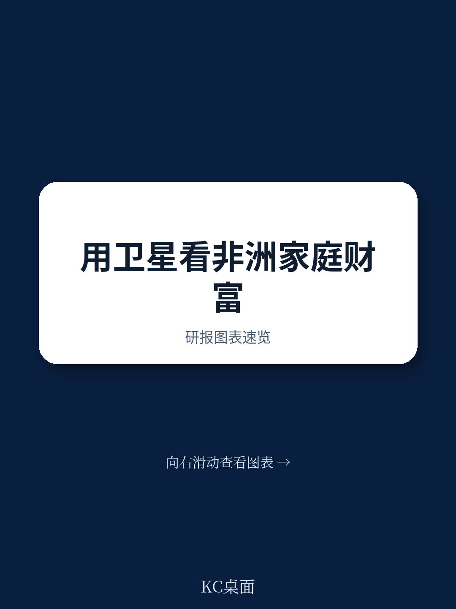
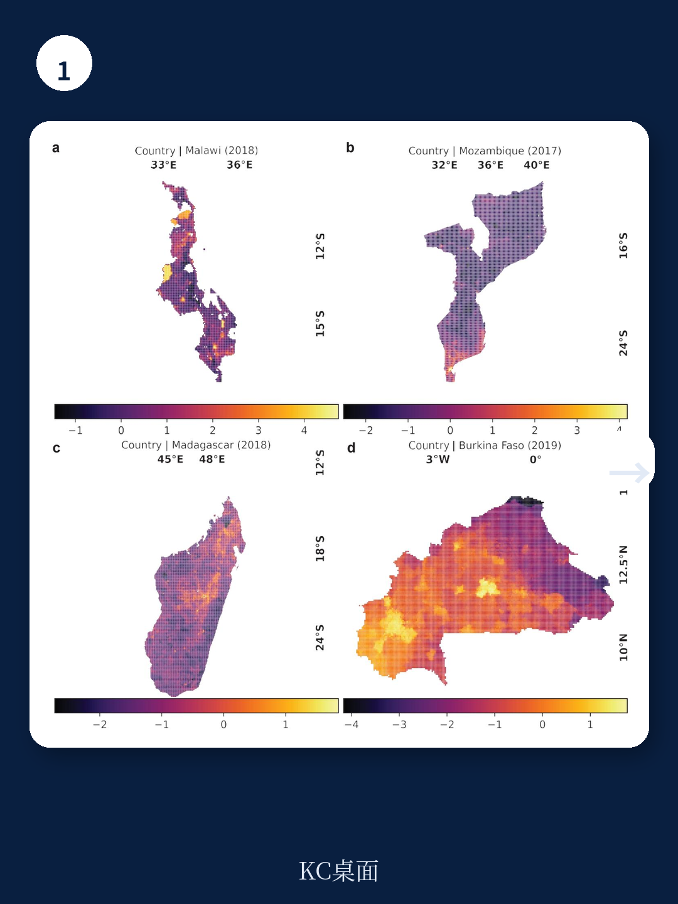
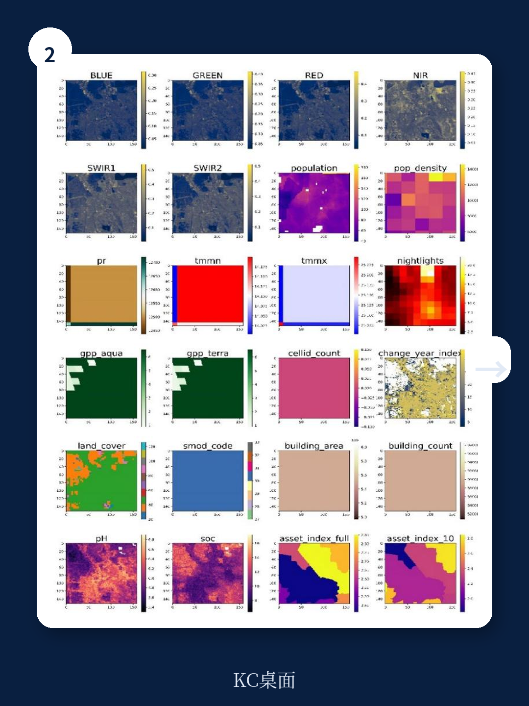

# 世界银行：卫星+AI正在重塑非洲财富测绘，10%样本量是关键拐点

当国际发展机构还在为2030年“消除贫困”目标倒计时，一个根本性的障碍始终未被攻克：我们无法及时、精确地知道贫困在哪里、变化有多快。传统入户调查成本高昂、频次低、空间颗粒度粗，往往在贫困干预需要落地时，数据已经过时。

世界银行与斯坦福大学联合发布的最新工作论文，给出了一个令人意外的答案。这份基于四个非洲国家超过1200万家庭数据的实证研究证明，视觉Transformer架构配合公开卫星影像，能够在数据稀缺环境中实现高精度、高分辨率的财富测绘。更关键的是，研究找到了一个数据效率的“临界点”——当训练样本覆盖10%的普查区域时，模型性能开始急剧提升，而在此之前，增加每区域内的家庭样本数对精度提升几乎无效。

这意味着，贫困测绘的成本结构正在被根本性改变。过去，精度的瓶颈是“调查多少家庭”；未来，精度的瓶颈可能是“覆盖多少空间单元”。这个判断如果成立，将直接影响国际援助资金分配、政府社保瞄准机制，甚至商业机构在新兴市场的选址策略。

---

> **KC评论：**
> 这份报告最有价值的地方不在于“AI能预测贫困”这个已经不算新闻的结论，而在于它用大规模、高精度的黄金标准数据，定量回答了“到底需要多少数据、什么类型的数据、什么样的模型”才能让卫星测绘真正可用。这些答案直接关系到这项技术能否从学术论文走向政策落地。

---

## 1. 视觉Transformer首次在贫困测绘中全面超越CNN，精度提升并非渐进而是结构性

此前该领域的主流模型是卷积神经网络。Yeh等人2020年在《自然·通讯》上的开创性工作，就是用CNN结合Landsat影像在非洲五国实现了财富预测。但CNN有一个固有缺陷：它在捕获全局空间依赖关系时能力有限，而贫困的空间分布往往具有非局部的结构性特征——比如一个区域的财富水平不仅取决于该区域的建筑密度，还取决于它与城市中心、交通干线、水源地的相对位置关系。

世界银行这份报告首次将视觉Transformer（Swin Transformer V2）引入这一任务，并在四个国家进行了系统对比。结果清晰：在马拉维、莫桑比克、马达加斯加三个国家，Transformer的预测R²分别达到0.83、0.70和0.62，全面优于CNN和基于XGBoost的传统方法。只有在布基纳法索，由于有效训练样本量极小（仅334个区），XGBoost才以微弱优势胜出。

这一差异不是算法竞赛的胜负，而是方法论层面的转向。Transformer的自注意力机制天然适合捕获地理空间中的长程依赖——一个村庄的贫困程度可能与其50公里外的城市辐射力相关，而非仅取决于本村的卫星像素。这意味着，当训练数据量足够时，模型能够从影像中“学到”比人类专家预设的特征更丰富的空间规律。

## 2. 10%的样本覆盖率是性能拐点，低于此阈值精度急剧恶化

对于任何想将这项技术投入实际应用的组织，这个问题比模型架构选择更现实：到底需要多少地面真实数据才能训练出可用的模型？

研究团队通过系统性地缩减训练样本量——从100%逐步降至1%——给出了一个经验性的答案。在马拉维、莫桑比克、马达加斯加三国，当训练样本从100%降至50%时，R²下降约5-8个百分点；从50%降至25%，再降约5-7个百分点；但从25%降至10%，下降幅度收窄；而一旦从10%降至5%，R²骤降10-15个百分点，降至1%时模型基本失效。

这个10%的阈值具有直接的预算含义。如果一个国家有10万个普查小区，过去需要全部调查才能获得高精度模型；现在，只需要调查其中1万个小区，就能达到接近全样本的性能。剩余90%的区域可以用卫星影像来推断。对于每年预算有限的国家统计局或国际组织，这意味着测绘覆盖范围可以在不增加地面调查成本的情况下扩大数倍。

> **KC评论：**
> 这个发现对读者意味着什么？如果你在非洲运营一个扶贫项目或投资一个农业供应链，过去你可能需要在每个村庄做入户调查才能知道哪里最需要资源。现在，你只需要在10%的村庄做抽样，然后用卫星模型推断其余90%。但注意，报告说的是“10%的普查小区”，不是“10%的人口”。实际落地时，如何选择这10%的样本——是随机抽样还是基于某些地理特征的分层抽样——报告没有完全展开，这恰恰是完整报告里值得细读的部分。

## 3. 每区10户即可，增加区内样本不如增加覆盖区域

这是另一个反直觉的发现。研究团队设计了一个实验：在每个普查小区内只随机抽取10户家庭来计算资产财富指数，然后训练模型，再与使用全部家庭数据训练的模型对比性能。

结果令人惊讶。以马拉维为例，10户样本只占全部家庭的约23%，但模型R²仅从82%降至79%，差距仅3个百分点。相比之下，当样本量从100%降至25%时，R²从82%降至70%，差距达12个百分点。

这意味着什么？在预测财富的空间分布时，模型的误差主要来自“没看到某个区域”，而不是“没看到某个区域里的所有家庭”。只要每个被覆盖的区域内有10户以上家庭的数据，模型就能捕捉到该区域的财富特征。这完全改变了地面调查的设计原则：与其在一个区域里调查100户，不如在10个区域里各调查10户。

对于实地调查成本极高、交通不便的偏远地区，这一发现可以直接转化为调查方案优化。世界银行和各国统计部门正在推动的“轻量级调查”模式，恰好可以从中受益。

## 4. 空间特征在样本量不足时是“救生圈”，但Transformer学会后可以不需要

研究团队还测试了是否需要在模型中加入预设的地理空间特征——如夜间灯光、人口密度、距城市距离、土壤类型等。这些特征在以往的文献中被广泛使用，被认为能显著提升预测精度。

结果呈现出一个有趣的模式：在样本量充足时，加入这些特征对Transformer模型的提升有限，甚至在某些情况下略微降低性能（模型可能过度拟合噪声）。但在样本量不足时——尤其是低于10%的阈值时——这些特征成为关键的补充信息，能挽回5-10个百分点的R²。

这揭示了Transformer模型的学习逻辑：当数据足够多时，模型能够从卫星影像中自动提取出与财富相关的视觉特征，这些特征可能比人类预设的“夜间灯光”“植被指数”更丰富、更本地化。但当样本量不足时，模型无法学到稳健的视觉表征，此时人类专家预设的特征就起到了“脚手架”的作用。

这意味着，对于数据基础设施较好的国家（已有高分辨率人口图、灯光数据、土地利用分类），初期可以依赖这些特征快速建立模型；但随着数据积累，最终应该过渡到以影像为主的端到端学习，以释放Transformer的全部潜力。

## 5. 时间维度上的财富变化预测：最难的测试，但结果超出预期

如果说预测空间分布是“拍快照”，那么预测财富随时间的变化就是“拍电影”。后者在技术上困难得多：时间变化通常幅度小、信号弱，且可能由卫星影像难以捕捉的因素驱动——比如政策变化、价格波动、汇款流入。

研究团队利用马拉维（2008-2018）和莫桑比克（2007-2017）的重复普查数据，首次系统评估了深度学习模型在时间变化预测上的表现。结果：在马拉维，模型解释了52%的十年财富变化方差；在莫桑比克，解释了42%。

这个数字需要放在语境中理解。传统上，经济学家用面板数据回归模型预测消费增长，R²通常在10-20%之间。一个仅依赖卫星影像的模型能达到40-50%的解释力，已经远高于多数基准。更重要的是，Transformer在样本量更大的莫桑比克明显优于CNN，再次印证了“数据量越大，Transformer优势越明显”的规律。

但这里有一个关键局限：报告没有测试更短时间尺度（如年度或季度）的变化。十年变化中包含了大量可被卫星捕捉的物理变化——新建筑、道路延伸、农田扩张——这些在年度数据中可能并不显著。因此，这项技术在“实时监测贫困”这一终极目标上，距离真正可用还有距离。

## 6. 报告尚未完全回答的关键问题：城市内部的精细测绘能否推广到其他地区？

报告中最令人兴奋的发现之一，是模型在马拉维两个城市（利隆圭和布兰太尔）内部的表现。利用精确地理定位的普查数据，模型在街区级别（约100米分辨率）的R²达到0.67-0.74，甚至能区分相邻街道的财富差异。这在此前的研究中几乎不可能实现，因为传统调查数据缺乏如此精确的空间定位。

但问题在于，这两个城市的测试样本有限，且马拉维的城市化水平较低。模型能否在拉各斯、内罗毕、约翰内斯堡这类超大城市中达到同样精度？这些城市内部的空间异质性更大，贫民窟与高端社区可能仅一墙之隔，且建筑形态、屋顶材料、道路密度等视觉特征更加复杂。报告没有提供这方面的证据。

此外，模型在城市中的表现严重依赖于卫星影像的分辨率。研究使用0.5米分辨率的SkySat影像时效果最佳，但这种商业影像的成本远高于免费公开的Landsat（30米）或PlanetScope（3米）。对于希望大规模推广的发展中国家政府，成本问题仍是现实障碍。

---

> **KC评论：**
> 城市测绘可能是这项技术商业价值最高的应用场景——保险公司可以用它来评估城市贫困区的风险暴露，电商可以用它来优化最后一公里配送网络，政府可以用它来精准投放社会保障。但报告关于城市的结论是基于两个中等规模的非洲城市，样本量有限。如果你关注这项技术在东南亚或拉美城市的适用性，完整报告中的方法细节和模型架构设计值得逐段阅读，因为迁移到新环境时需要调整哪些参数，报告给出了具体的技术路径。

---

## 7. 一个观察框架：如何判断卫星贫困测绘是否进入实用阶段？

对于产业决策者和政策制定者，以下三个指标可以帮助判断这项技术何时从“学术前沿”跨入“可规模部署”：

第一，模型是否能在无地面数据的新区域保持精度。目前所有测试都是在有普查数据的区域进行的。真正的考验是，模型能否在从未调查过的区域给出可信的预测。报告通过限制样本量模拟了这一场景，但实际应用中，新区域的影像特征可能与训练数据存在系统性偏差。

第二，时间分辨率是否从“十年”压缩到“年”甚至“季度”。目前模型在十年变化上表现良好，但政策制定者需要的是年度甚至季度更新。这需要更频繁的卫星重访和更稳健的时序模型。Transformer架构在时序建模上的潜力尚未被充分挖掘。

第三，是否出现第三方独立验证。世界银行和斯坦福是这项研究的发起方，也是利益相关方。如果其他研究团队能在不同的大洲、使用不同的卫星数据源、独立复现类似的结果，这项技术的可信度才会真正建立。

---

## 8. 顺着这些未解问题继续

从10%的样本拐点到城市内部测绘的商业化瓶颈，从十年变化预测到年度监测的可行性，这份世界银行报告打开了一个新窗口，但也留下了一串需要继续追问的问题。

如果你在做非洲市场的投资决策、国际发展项目的设计，或者只是关注AI如何改变我们对世界的认知方式，这些问题的答案可能直接关系到你的判断依据。

我们每天会由AI agent配合人工review，生成国际投行与智库的最新中文摘要与KC评论，每日更新，内容约10-40页，也包含当天最新数据图表合集。既方便喂给AI做进一步分析，也方便人工快速把握市场动态。如果你希望拿到这份报告的完整原始图表、模型架构细节，以及我们团队对非洲城市测绘可行性的延伸分析，欢迎加入社群继续讨论。

Personal reading notes and learning share only. Not investment advice.

