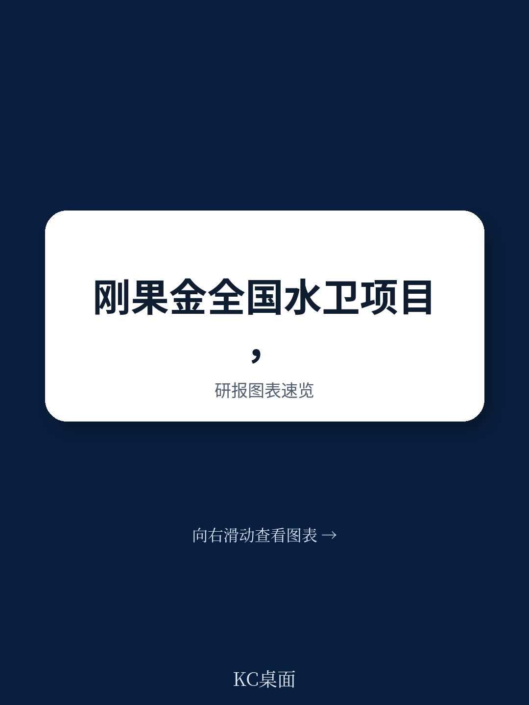
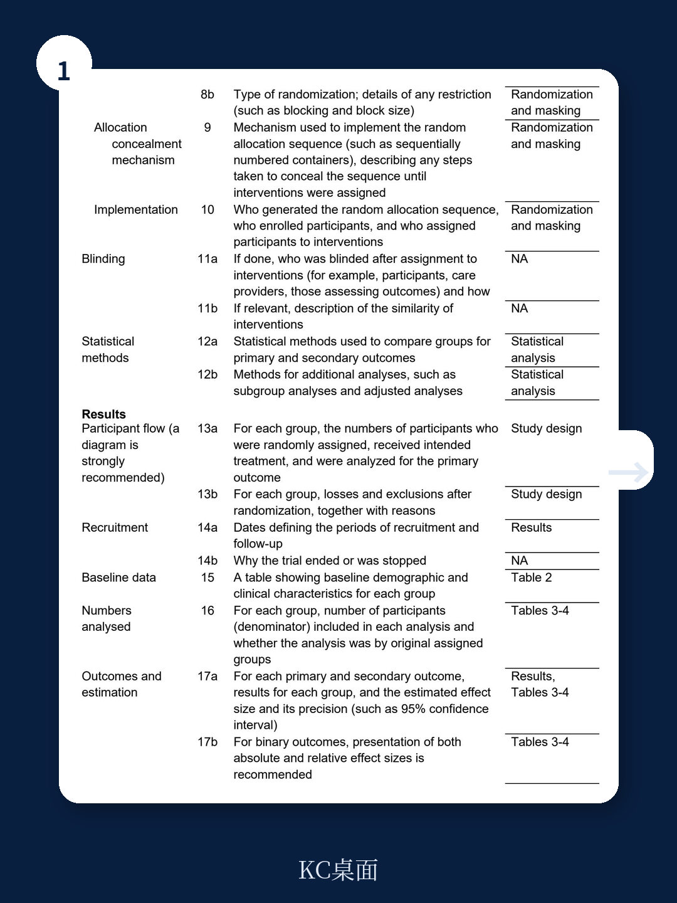
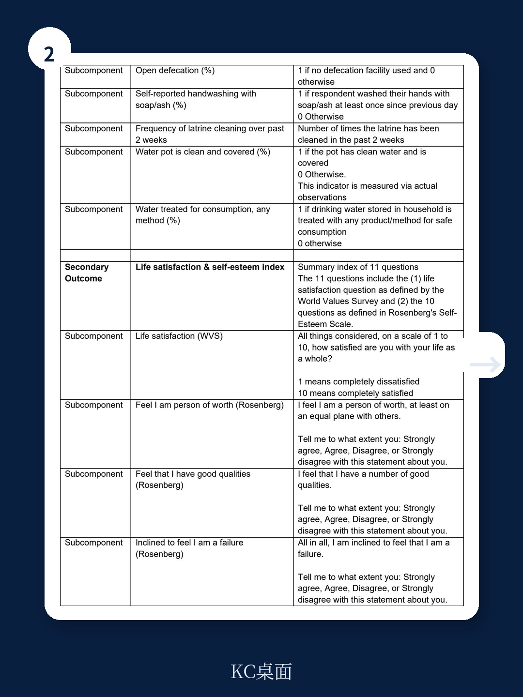

# 世界银行：刚果金国家WASH项目“有设施，无健康”，基础设施改善并未转化为腹泻与发育迟缓的下降

一份来自世界银行的随机对照试验，在刚果民主共和国农村地区评估了一个国家级水、环境卫生与个人卫生项目的长期效果。结论清晰且令人警醒：项目成功建立了村级WASH委员会，显著提升了改善水源和卫生设施的使用率，但这些基础设施层面的进步，并未带来儿童腹泻发病率的降低，也未改善儿童的身长发育指标。这为全球发展领域一个长期悬而未决的问题——基础设施改善与健康结果之间的“最后一公里”鸿沟——提供了来自冲突地区的高质量证据。

这份研究报告发表于2025年1月，基于对刚果金五个省份、121个村庄集群、超过3200户家庭的追踪调查，随访中位时间长达3.6年。其核心发现是：社区主导的WASH项目在“硬件”和“制度”上取得了成功，但在最核心的“健康”目标上失败了。这一结果对全球每年数百亿美元的发展援助资金投向，提出了根本性的拷问。

## 1. 项目在“制度”与“设施”上取得了可量化的成功，且效果持续超过三年

报告最坚实的正向结论，在于项目成功构建了可持续的基层治理结构。在干预组村庄，一个活跃的WASH委员会（或仅水委员会）的存在比例，比对照组高出21个百分点。更关键的是，这个制度优势并非短期现象，而是在干预结束三年多后依然可被观测到。

这种制度能力直接转化为了基础设施的改善。干预组家庭报告使用改善水源的比例高出对照组24个百分点，使用改善卫生设施的比例高出18个百分点。村民对水治理的感知也更为积极。这组数据表明，社区主导的发展模式在刚果金这样一个治理薄弱、部分地区受冲突影响的复杂环境中，依然有能力动员社区、建立组织、并完成物理设施的升级。

> **KC评论：** 对发展经济学和公共卫生研究者而言，这个结论本身就是一个重要信号：在低收入、高冲突环境中，通过社区动员和约7000美元/村的投入，是可以建立起“能运转的制度”和“能用的设施”的。但这恰恰引出了更核心的追问——为什么这些看得见、摸得着的改变，没有触及健康的终点？

## 2. 核心健康指标“零效果”：基础设施改善并未自动关闭疾病传播链条

这是报告最令人不安，也最具政策冲击力的部分。在主要终点指标上，干预组与对照组在儿童腹泻患病率和身长发育Z评分（LAZ）上，均未出现统计学显著差异。这意味着，即使更多家庭用上了“改善”的水源和厕所，儿童依然在拉肚子，依然在发育迟缓。

报告本身并未给出确定的因果解释，但基于其数据和分析框架，我们可以推演出几种最可能的机制。第一，“改善水源”不必然等于“安全水源”。在刚果金的农村，一个“改善”的水源可能是一个加了盖、有水泥圈的手压井，但如果取水、储水、用水环节的二次污染未被阻断，病原体依然可以进入儿童体内。第二，暴露路径的复杂性。WASH干预通常只针对水、厕、手三个维度，但儿童在环境中（如土壤、食物、动物粪便）的粪口暴露，可能远超出家庭层面的干预范围。第三，干预强度问题。项目在每个村的直接投入约为7000美元，平均覆盖456人，这笔钱用于建设，但用于持续维护、行为监督和卫生教育的资源可能依然不足。

> **KC评论：** 这个“零效果”结论，实际上是对“WASH万能论”的一次强力纠偏。它提醒所有关注非洲发展、公共卫生或ESG投资的读者：不要将“投入增加”与“结果改善”画等号。在评估此类项目时，必须追问“从设施到健康的因果链条中，哪一环断了？” 完整报告中对暴露路径的讨论和亚组分析，恰恰是理解这个断点在哪里的关键，值得仔细阅读。

## 3. 报告尚未完全回答的关键问题：是“剂量不足”还是“路径错误”？

这是本文最值得深入探讨的未解问题。报告本身设计精良，是一个高质量的集群随机对照试验，但它留下的核心疑问恰好是政策制定者最需要知道的：如果投入更多钱、或者改变干预组合，健康结果就能改变吗？

“剂量不足”假说认为，当前每个村约7000美元的投入，对于建立一套能阻断所有粪口传播路径的系统来说，可能远远不够。也许需要翻倍的硬件投入，或者更长期、更密集的行为改变干预。“路径错误”假说则认为，即便投入再翻倍，如果干预不触及社区层面的环境粪便污染（例如家禽家畜管理、公共区域卫生），或者不解决儿童营养不良的根本驱动因素（如饮食多样性、食物安全、疾病负担），那么单纯优化家庭WASH行为，天花板是显而易见的。

报告的数据无法区分这两种假说。但它的价值在于，为全球发展领域提供了一个清晰的“压力测试”结果：在一个真实的、大规模的、由政府主导的国家级项目中，当前流行的社区主导WASH干预模式，在健康终点上失效了。这迫使学界和实务界必须重新审视干预理论，并设计下一代的、可能更昂贵或更复杂的解决方案。

## 4. 对产业决策者和投资者的观察框架：从“投入指标”转向“结果指标”

这份报告对于关注非洲基建、医疗健康或影响力投资的读者，提供了一个极为重要的分析框架升级。过去，评估一个WASH项目或一家水务公司的社会影响力，常用的指标是“新增覆盖人口数”或“修建的厕所数量”。这份世界银行的研究直接挑战了这种评估方式的合理性。

如果基础设施的改善无法转化为健康结果，那么这些投入的社会回报率就会被高估。对于布局非洲市场的企业而言，这意味着：单纯销售净水设备、修建供水站或推广厕所，可能无法兑现其对社区健康改善的承诺。真正的商业机会和影响力溢价，可能存在于那些能够解决“从水龙头到儿童健康”全链条痛点的解决方案中——例如结合水质监测、储水卫生、社区健康教育、甚至与营养干预打包的服务模式。

报告同时揭示了一个被忽视的风险：在冲突影响地区，项目的长期可持续性面临巨大挑战。刚果金东部的北基伍省甚至因安全原因被排除在试验之外。对于任何在类似区域有业务的机构，地缘政治风险和运营中断风险，必须被纳入投资决策的核心考量。

## 5. 一个被长期忽视的维度：健康结果的改善，可能需要超越WASH的“组合拳”

报告的讨论部分隐含了一个更深层的判断：儿童发育迟缓是一个多因素决定的复杂问题。WASH只是拼图之一，营养、疾病负担（如疟疾、肠道寄生虫）、孕产妇健康、早期刺激与认知发展，每一个因素都不可或缺。试图通过单一维度的干预（即使是高质量的WASH干预）来解决发育迟缓，很可能注定失败。

这恰恰是报告最具战略价值的洞察。它暗示，未来在非洲等地区的发展项目，必须走向“多部门联合干预”。例如，将WASH项目与营养补充计划、儿童早期发展项目、以及初级医疗保健体系的强化进行捆绑。这对于大型国际组织（如世界银行、联合国儿童基金会）和各国援助机构而言，意味着项目设计逻辑的根本性重构——从“部门项目”转向“结果导向的跨部门平台”。

对于读者而言，这一判断意味着，如果你关注全球健康或新兴市场，那么单纯跟踪WASH领域的投资是不够的。真正的拐点，可能出现在WASH、营养、农业和卫生系统四个领域的交叉点上。这份报告虽然没有给出联合干预的实证，但它清晰地指出了必须这么做的方向。

---

这份世界银行的报告，用严谨的方法论证实了一个令人沮丧但极其重要的真相：在复杂的现实世界中，好的意图和可见的投入，并不总能通向预期的终点。它没有提供简单的答案，但它提出了正确的问题。对于任何关心发展有效性、全球健康或新兴市场社会影响力的决策者而言，这份报告都值得纳入必读清单，并围绕“剂量不足”与“路径错误”这两个未解问题，展开更深入的讨论。

社群每日会由AI agent与人工review，生成国际投行与顶级智库的中文摘要与KC评论，涵盖当天最新数据图表合集。这份报告的完整解读、原始图表及方法论细节，已收录其中。如果您希望获得更完整的分析框架，或就“WASH干预失效后的下一轮投资逻辑”进行深入交流，欢迎加入社群，与我们一同追踪这些关键问题的后续进展。

Personal reading notes and learning share only. Not investment advice.

