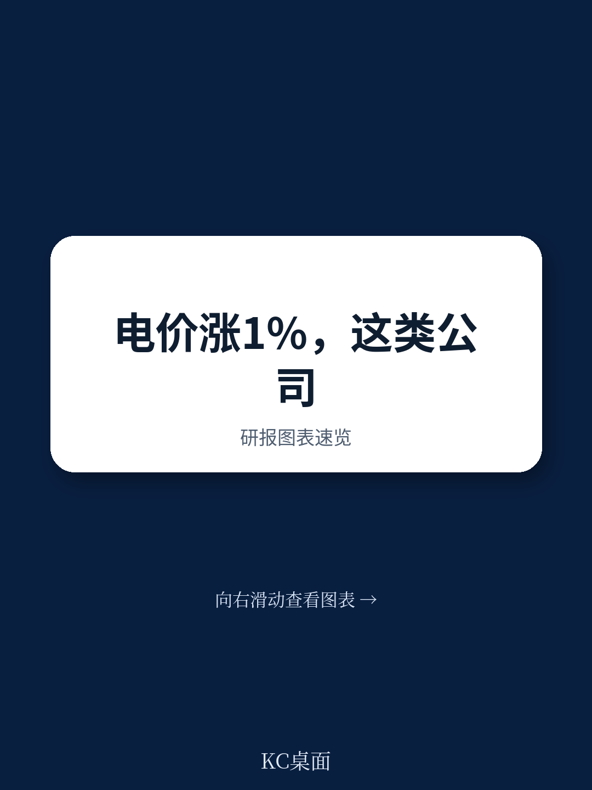
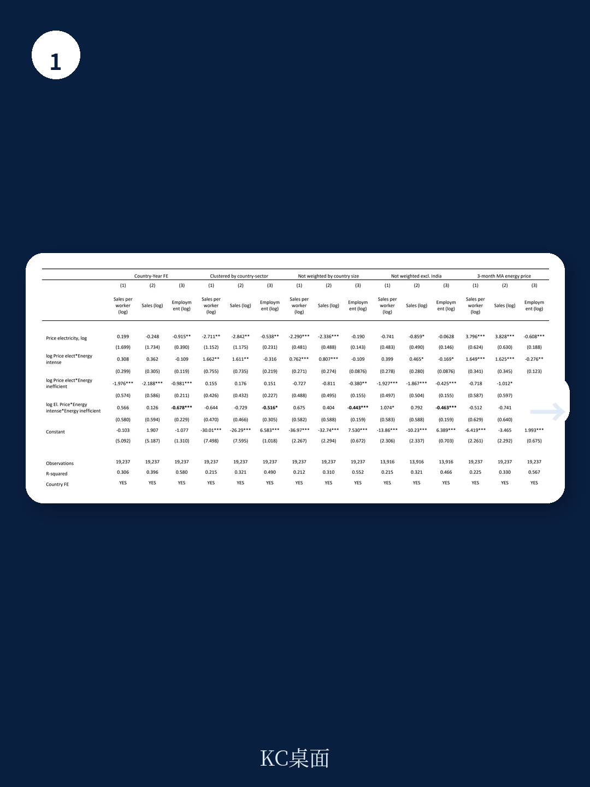
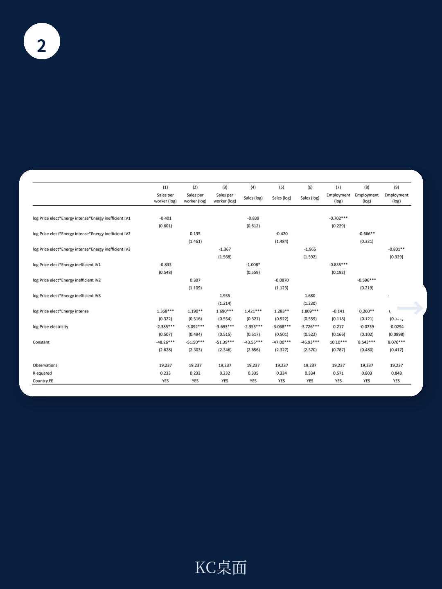

# 世界银行：电价上涨1%，高能耗低效企业裁员1.5%

全球能源转型进程中，一个被反复追问但始终缺乏实证答案的问题是：电价上涨，到底会怎样影响企业——尤其是那些本就脆弱的新兴市场企业？

世界银行最新发布的工作论文给出了一个既反直觉又令人警惕的答案。这份基于24个新兴市场和发展中经济体、超过6万家企业在2019至2023年间表现的研究，没有简单重复“能源价格伤害企业”的常识。它揭示了一个更精细的传导机制：电价上涨对不同企业的冲击，取决于两个关键变量——行业能源密集度，以及企业是否采取了能效措施。

这份报告最核心的判断是：电价上涨1%，在没有采取能效措施的高能耗行业中，企业就业人数将下降约1.5%。与此同时，这些企业的销售额和生产率反而可能上升。这不是统计上的矛盾，而是一个关于企业如何“牺牲劳动力来保护利润”的残酷故事。

---

## 1. 电价上涨的真正赢家是“有效率的企业”，不是“所有的企业”

研究的第一层发现，与直觉相悖：整体来看，电价上涨后，企业的销售额和生产率反而上升。但这一结果在统计上并不稳健——当研究者改变模型设定后，这个“正面效应”消失了。

真正稳健的发现隐藏在交叉项中。报告显示，电价上涨对销售额和生产率的正面影响，几乎完全集中在已经实施了能效措施的企业身上。对于没有采取能效措施的企业，这个正面效应显著减弱，甚至消失。

这意味着什么？电价上涨本身并不会自动激发企业变得更高效。它更像一个筛选器：那些提前布局能效的企业，在成本上升时能够更快调整，甚至利用竞争对手的困境扩大市场份额。而那些没有行动的企业，则被成本压力挤压，无法从价格上涨中获得任何好处。

> **KC评论：** 这份报告揭示了一个被许多政策讨论忽略的事实——能源价格改革的效果，很大程度上取决于企业的“准备状态”。如果企业没有能效基础，单纯提高电价只会造成就业损失，而不会倒逼出更高效的生产。完整报告中包含了对不同能效措施（如LEED认证、ISO 50001标准）的详细分类分析，这些细节对于理解哪些措施真正有效至关重要。

---

## 2. 就业是最大的“隐形受害者”，而且伤害集中在最脆弱的企业

如果说销售额和生产率的结果存在争议，那么就业效应则是报告最稳健、也最令人担忧的发现。

在能源密集型行业中，那些没有实施能效措施的企业，电价每上涨1%，就业人数下降约1.5%。这个结果在几乎所有稳健性检验中都保持显著——无论研究者如何调整固定效应、聚类标准误、权重设定，甚至更换电价变量，这个负向效应始终存在。

更关键的是，这一效应在非能源密集型行业中并不显著。换言之，电价上涨对就业的打击是有选择性的，它精准地击中了那些“既离不开能源、又没有能力优化能源使用”的企业。

报告的机制解释是：这些企业面临成本压力时，无法通过提高价格转嫁成本（因为市场竞争激烈或需求弹性高），也无法通过技术替代来降低能耗，唯一可调整的变量就是劳动力。于是，裁员成为最直接的应对手段。

> **KC评论：** 1.5%的就业弹性听起来不大，但如果放在宏观背景下——2022年全球电价平均上涨超过30%——这意味着高能耗、低能效行业可能面临超过45%的就业收缩。这已经不是边际调整，而是结构性冲击。完整报告中的图表展示了不同国家、不同行业的就业效应差异，这些细节对于理解哪些区域和行业风险最高至关重要。

---

## 3. 能效措施是“就业保护伞”，但新兴市场企业的采用率令人担忧

报告最具有政策含义的发现是：能效措施显著缓解了电价上涨对就业的负面冲击。

具体而言，在能源密集型行业中，那些已经实施了能效措施的企业，电价上涨对就业的负面影响大幅降低，甚至不再显著。能效措施在这里扮演的角色，不是帮助企业在电价上涨时“做得更好”，而是帮助它们“避免变得更糟”。

但问题在于，在新兴市场和发展中经济体，能效措施的采用率并不高。报告使用的世界银行企业脉搏调查数据显示，在样本覆盖的13个国家中，只有一部分企业报告采取了能效措施。这意味着，大多数高能耗企业正暴露在没有保护的状态下。

报告引用了Black等人（2023）的数据指出，2023年全球化石燃料补贴达到创纪录的7万亿美元。这些补贴虽然在短期内保护了消费者和企业，但也可能延迟了能效投资的决策。当补贴最终被削减时，那些没有提前做好准备的企业将面临更大的调整成本。

---

## 4. 报告没有完全回答的关键问题：能效措施为什么没有被广泛采用？

这份报告在实证层面做得相当扎实，但它也留下了一个悬而未决的问题：既然能效措施如此有效，为什么企业不主动采用？

报告本身没有深入探讨这个“为什么”。可能的答案包括：初始投资成本过高、信息不对称（企业不知道哪些措施有效）、融资约束（新兴市场企业普遍面临信贷限制）、以及政策不确定性（企业不知道电价是否会持续上涨）。

此外，报告也没有区分不同类型的能效措施。LED照明、建筑节能认证、ISO 50001能源管理体系——这些措施的成本、实施周期和效果差异巨大。对于一家微型企业来说，安装高效照明可能是一个可行的选项，但申请ISO认证则完全不现实。

报告使用的数据是企业在调查问卷中“自我报告”是否采取了能效措施，这本身就存在测量问题。企业可能高估或低估自己的能效行动，而报告没有对此进行校正。

> **KC评论：** 这些未解问题恰恰是理解政策设计的关键。如果企业不采用能效措施是因为信息不足，那么政策重点应该是技术推广和培训；如果是因为融资约束，那么绿色信贷和补贴设计就更重要。完整报告中的附录表格包含了不同国家、不同规模企业的能效措施采用率分布，这些数据对于判断政策优先级具有直接价值。

---

## 5. 对读者的观察框架：如何判断一个企业或行业是否面临电价风险？

基于这份报告的发现，我们可以建立一个简单的评估框架，用于判断特定企业或行业在电价上涨时的脆弱性。

第一个维度是能源强度。报告使用了气候政策相关行业分类框架，将行业分为能源密集型和非能源密集型。能源密集型行业包括高排放、低燃料替代性的行业，如水泥、钢铁、化工、造纸等。这些行业在电价上涨时面临最大的成本压力。

第二个维度是能效措施。报告发现，即使在同一能源密集型行业内，是否采取能效措施造成了巨大的结果差异。这意味着，在评估一个具体企业时，不能只看行业标签，还必须了解该企业的能源管理实践。

第三个维度是劳动力调整能力。报告显示，就业效应是电价上涨最敏感的指标。如果一个行业或企业的劳动力密集度高、技能替代性低（即裁员后难以快速重新招聘），那么电价上涨带来的就业风险就更大。

第四个维度是市场定价能力。报告指出，企业可以通过向消费者转嫁成本来保护销售额和生产率。这意味着，在需求弹性低、竞争格局稳定的行业中，企业的抗风险能力更强。

将这些维度组合起来，就能形成一个风险矩阵：能源密集型 + 无能效措施 + 劳动力密集 + 弱定价能力 = 最高风险。而能源非密集型 + 有能效措施 + 资本密集 + 强定价能力 = 最低风险。

---

这份世界银行报告的价值，不仅在于它提供了实证证据，更在于它把讨论从“能源价格好不好”这种意识形态争论，拉回到“谁受影响、如何应对”的具体分析框架。对于新兴市场的政策制定者和企业管理者来说，关键问题不是“要不要提高电价”，而是“在提高电价之前，如何帮助企业建立能效基础”。

报告没有给出完美的答案，但它提供了足够清晰的问题和方向。而这些未解的问题——能效措施的扩散机制、不同类型措施的差异化效果、补贴退出与就业保护的权衡——正是我们需要继续深入阅读和讨论的内容。

在每日更新的国际投行研报解读社群中，我们会持续跟踪这类关键研究，通过AI agent与人工review相结合的方式，提供约10-40页的每日摘要，涵盖最新数据图表合集，既方便喂给AI模型，也方便人工快速把握市场动态。如果你对这份报告的原始图表、稳健性检验的完整结果，或者对能效措施的分类细节感兴趣，欢迎加入社群，与我们一同拆解这些关键问题。

Personal reading notes and learning share only. Not investment advice.

