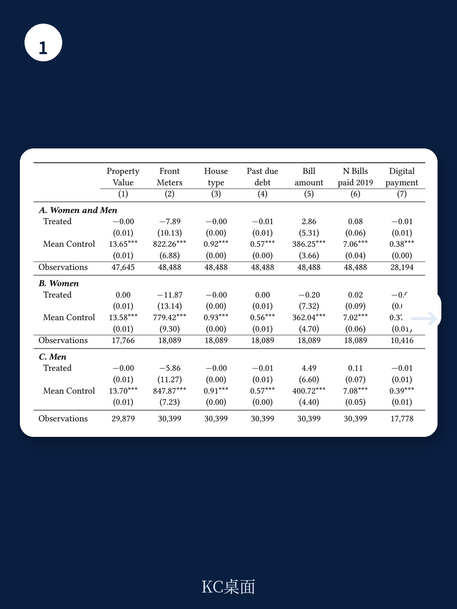
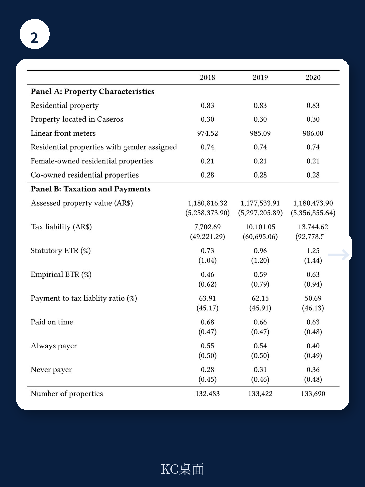

# 世界银行：阿根廷房产税揭示的真正性别差距不在逃税，而在高价值资产所有权

世界银行最新发布的工作论文，借助阿根廷一个大型城市的微观税务数据，对房地产所有权和房产税合规中的性别差异进行了迄今最为细致的实证分析。这份报告的核心发现，指向一个反直觉的判断：在逃税行为上，男性和女性几乎没有差别；真正的性别鸿沟，隐藏在财产价值金字塔的顶端。

这份研究覆盖了布宜诺斯艾利斯都会区第三大城市特雷斯德费布雷罗，分析了超过10万处房产、跨越2018至2020年的完整税务记录。对于关注新兴市场资产配置、公共财政和性别经济学的读者而言，这份报告提供的数据颗粒度和因果识别策略，值得深入剖析。

## 1. 逃税率高达46%，但男性和女性的合规行为几乎镜像一致

报告首先提供了一个令人警醒的宏观背景：该市的房产税逃税率平均为46%。这一比例意味着每年流失的税收大约相当于该市全年公共安全预算的总和，占市政总支出的8%。

然而，真正值得注意的发现是性别维度的分析。世界银行的研究者利用阿根廷个人税务识别号码的结构特征，成功推断出超过10万处房产所有者的性别信息，并进行了严格的因果识别。结果显示，无论从总体逃税率、按时支付率，还是对税务催缴信函的反应来看，男性和女性的行为模式高度相似。

具体而言，女性拥有的房产逃税率约为46%，男性约为48.5%，差异在统计上微乎其微。在按时支付率上，两者也几乎完全重叠，均随房产价值上升而提高——从最低百分位的约35%升至最高百分位的约60%。报告还利用2020年10月进行的一项大规模随机实验发现，收到个性化催缴信函后，女性的按时支付率提高了4.2个百分点，男性提高了4.7个百分点，差异不显著。

> **KC评论：** 这个发现对政策制定者意味着什么？它挑战了税务领域一个流传已久的假设——女性因为更厌恶风险或更守法，所以逃税更少。至少在房产税这个低执法、高逃税的环境里，性别不是一个有效的合规预测因子。这提示我们，如果政策目标只是提高税收征管效率，那么性别定向策略可能效果有限。真正有价值的，是理解为什么在如此高的逃税率下，所有人都选择了“观望”。

## 2. 真正的性别鸿沟：高价值房产的所有权呈现断崖式下降

如果说逃税行为上的性别差异是“伪命题”，那么报告揭示的另一个维度则具有更深远的经济含义：房产所有权在不同价值区间内的性别分布，呈现出惊人的分化。

在房产价值分布的最底部（第40百分位以下），所有权结构相当均衡：女性、男性和夫妻共有各约占三分之一。但随着房产价值攀升，女性的所有权占比开始急剧下降。在最顶端的1%高价值房产中，夫妻共有占50%，男性独占约30%，而女性的所有权比例跌至20%以下。

这一发现并非孤例。它呼应了此前在巴西圣保罗、埃塞俄比亚农村等不同发展水平地区的研究结果。世界银行的研究者指出，这种高价值资产所有权的性别差距，可能源于信贷获取渠道的差异、继承制度中的性别偏见，以及劳动力市场中女性在创业和高收入岗位上的结构性劣势。

> **KC评论：** 这里有一个容易被忽视的税收政策含义。虽然逃税率在性别上没有差异，但由于女性更多持有低价值房产，而该市的房产税制度具有轻度累退性（固定费用占比对低价值房产更高），导致女性实际承担的有效税率略高于男性。换言之，税制本身可能在不经意间放大了性别财富不平等。报告没有完全展开的是，如果叠加通货膨胀——阿根廷年通胀率长期在30%以上——这种累退性对女性财富的侵蚀效应会如何被放大？完整报告中关于固定费用占比从第一十分位的65%降至第十十分位的14%的图表，值得仔细研究。

## 3. 软性催缴有效，但男性反应更快，女性更持久

报告的另一大亮点，是利用随机实验数据分析了男性和女性对税务催缴信函的差异化反应。这种“软性”干预措施——一封包含账单金额、到期日和在线支付方式的一页纸信件——在整体上显著提升了按时支付率。

但时间维度揭示了有趣的差异。研究者利用每日支付数据发现，男性在收到信函后反应更快，效果在到期日之前就已显现并趋于稳定。而女性虽然初始反应稍慢，但在到期日后继续以更高频率补缴欠款，迅速弥合了与男性之间的初始差距。

更细致的分层分析显示，在最低房产价值五分位组中，催缴信函对男性按时支付率的提升幅度达到8个百分点，是女性提升幅度（4个百分点）的两倍。报告对此的解释是，低价值房产的男性所有者可能拥有更灵活的现金流或更积极的财务决策习惯。但报告也坦诚，这一异质性的机制仍需进一步验证。

## 4. 新冠疫情冲击：宏观经济震荡下的性别对称性

这份报告的分析期恰好覆盖了新冠疫情的冲击。2020年3月至4月间，该市的房产税支付率骤降约25个百分点。研究者利用这一外生冲击，检验了男性和女性在面对宏观经济震荡时的行为差异。

结果再次指向“对称性”：无论是支付率的下降幅度，还是随后的恢复速度，男性和女性之间均未观察到显著的性别差异。这一发现对于理解家庭财务韧性具有参考价值——在系统性危机面前，性别可能不是决定短期支付行为的关键变量。

## 5. 报告尚未完全回答的关键问题：低执法环境下的“自愿合规”机制

尽管这份报告提供了迄今为止最严谨的因果证据，但它也揭示了一个更深层的谜题。在阿根廷的语境下，房产税的执法能力极其有限：税务审计部门只有5名员工，依赖1980年代的IBM大型机处理数据，而年化12%的滞纳金利率远低于通胀率，再加上政府频繁推出债务减免计划（过去五年中有四年）。这些因素共同导致了一个“准自愿”的纳税环境。

报告发现，在这种环境下，无论是男性还是女性，都表现出高度的逃税行为和对催缴信函的相似反应。但报告并没有完全解释：为什么在如此低的执法概率下，仍然有超过50%的人选择按时纳税？社会规范、互惠心理，还是对公共服务质量的隐性评估？这些机制在男女之间是否真的没有差异？

> **KC评论：** 这个问题恰恰是这份报告最有价值的地方。它告诉我们，当外部执法极其薄弱时，性别差异会“退场”，而另一些更底层的因素——比如对地方政府的信任、社区规范、甚至是对未来被追缴的预期——会成为主导行为的力量。完整报告中关于债务减免计划（moratorias）如何影响纳税人等待策略的讨论，以及不同财产价值组别之间支付行为的非线性变化，都值得进一步拆解。这些细节不会出现在摘要里，但恰恰是理解真实世界税务行为的钥匙。

## 6. 对读者的观察框架：从这份报告能学到什么

对于关注新兴市场公共财政、资产性别差距或税务科技应用的读者，这份报告提供了几个可以持续追踪的视角：

第一，高价值资产所有权的性别差距，可能比收入差距更顽固。房产通常是家庭财富的最大单一组成部分。当女性在高价值房产中的所有权比例出现断崖式下降时，这直接转化为财富积累能力的系统性差异。后续可以关注的是，这种差距在下一代继承中是否会自我强化。

第二，“软性”干预措施在低执法环境中效果显著，但边际收益递减。催缴信函提升了12%左右的按时支付率，但仍有超过40%的人不按时支付。这意味着，要进一步提升合规率，可能需要更严厉的执法手段或更根本的制度变革。

第三，税务数据的性别标签化本身具有巨大政策价值。世界银行团队利用税务识别号码推断性别的方法论，为其他缺乏性别标签的行政数据提供了可复制的范本。这可能是这份报告最被低估的贡献。

---

**如果你想继续深入探讨：**

这份报告完整版包含超过40页的正文、附录图表和详细的计量识别策略。我们每天由AI agent结合人工审核，从世界银行、IMF、BIS等机构的最新工作论文中提取核心发现，并附上独立的KC评论。今天的完整解读包还包含了报告中关于固定费用占比如何随房产价值变化的图表、催缴信函实验的每日支付动态图，以及不同财产价值组别的异质性分析数据。

这些内容既适合作为AI模型的训练语料，也方便你在讨论中快速引用最新证据。加入社群，可以获取今日完整研报解读包（约15页PDF），以及过去一周内所有已发布的国际投行与多边机构研究报告摘要合集。

Personal reading notes and learning share only. Not investment advice.

