Policy Research Working Paper

11081

# Firm-Level Climate Change Adaptation Micro Evidence from 134 Nations

Claudia Berg

Luca Bettarelli

Davide Furceri

Michael Ganslmeier

Arti Grover

Megan Lang

Marc Schiffbauer

WORLD BANK GROUP

POLICY RESEARCH WORKING PAPER 11081

## Abstract

Are firms adapting to climate change? This paper studies this question by combining geocoded World Bank Enterprise Survey data with spatially granular weather data to estimate temperature response functions for nearly 160,000 firms in 134 countries over a 15-year period. Our results show that market imperfections in low- and middle-income countries constrain firms' ability to adapt. Small and medium-size firms in low- and low-middle income countries are most vulnerable, with revenues declining by 12 percent in years with temperatures $0.5^{\circ}$ C above historical averages. The impact is equally strong for manufacturing and services firms and result from declines in labor productivity and wages. Heat-sensitive sectors and less resilient firms are more severely affected, reinforcing the causal interpretation. Unique firm-level information on policy constraints including limited financing, burdensome regulations, and unsafe conditions suggest that such factors raise adaptation costs, undermining economic resilience to climate change.

# Firm-Level Climate Change Adaptation: Micro Evidence from 134 Nations

Claudia Berg $^{1}$ , Luca Bettarelli $^{2}$ , Davide Furceri $^{3}$ , Michael Ganslmeier $^{4}$ , Arti Grover $^{5}$ , Megan Lang $^{1}$ , and Marc Schiffbauer $^{1}$

$^{1}$ 1: World Bank, 2: University of Palermo, 3: International Monetary Fund, 4: University of Exeter, 5: IFC

KEYWORDS: CLIMATE ADAPTATION, FIRMS, TEMPERATURE, RESILIENCE
JEL CODES: D22, Q56, Q54, O12, O14
©2024 The World Bank and International Monetary Fund.

## 1 Introduction

Empirical studies have documented a robust association between extreme weather and reductions in national economic growth (e.g., Burke, Solomon M Hsiang, and Miguel 2015, Somanathan et al. 2021). Extreme weather may reduce economic activity by affecting the performance of firms. Economic theory predicts that rational, forward-looking firms should make self-protective investments. However, firms operating in low- and middle-income countries face a host of market imperfections that may constrain their ability to adapt. Understanding which types of firms are best able to cope with weather shocks and which features of the business environment support firm-level adaptation is critical for designing well-targeted policies for private sector climate resilience.

To this end, we combine granular satellite weather data with global firm-level data to study the impact of rising temperatures on firms' performance, ability to adapt, and the policy constraints hindering their adaptation capacity. We use standardized, repeated cross-sectional microdata from the World Bank's Enterprise Survey (WBES, Enterprise Survey 2023) covering 134 countries and more than 160,000 firms—of which more than half operate in low and low-middle income countries—over a 15-year period. We assess the marginal effect of weather deviations from historical trends on corporate revenues and the associated transmission channels such as firmsâ investments, labor productivity, wages, energy intensity, and propensity to innovate. The data also enable us to estimate how firmsâ characteristics and the policy constraints they encounter influence their capacity to adapt to higher temperatures.

This study is among the first to use granular satellite weather data combined with microeconomic data to assess the economic impact of climate change at a global scale, particularly in low- and middle-income countries. The integration of granular climate and firm-level data is critical for identifying the causal economic effects of temperature shocks as it enables us to measure temperature deviations at firmsâ specific locations and account for firm-level heterogeneities, addressing key endogeneity concerns. Our empirical strategy relies on computing location-specific differences between temperatures within firms' fiscal year and historical average temperatures from 1980–2008. We use these temperature differences to estimate heterogeneous, nonlinear firm responses along multiple dimensions of firm performance. Our identifying assumption is that temperature deviations are as good as random after conditioning on country by sector by year fixed effects, firm size (a general proxy for firm quality), and firms' location-specific historical mean temperatures.

Another novel feature of our study is that the standardized firm-level data include manufacturing and services firms, as well as a rich set of firm-level characteristics and measures of the business environment. For instance, it includes measures of firms' main sales markets, the resilience of firms' production processes, firms' access to finance, the quality of electricity services, the level of local security and political stability, and the quality of the local regulatory environment. Interacting these measures with location-specific weather data allows us to describe which types of firms and policy reforms are best able to “weather the storm”.

We document large, negative impacts of higher-than-average temperatures on revenues for firms in low and low-middle income countries. Small and medium-size firms as well as startups are most vulnerable to rising temperatures. These firms exhibit a 12% decline in revenues when annual average temperatures are $0.5^{\circ}$ C higher than the historical average. The impact is equally significant for manufacturing and services firms and driven by declines in labor productivity, which also result in lower wages. Firms in heat-sensitive sectors and with less resilient production processes are more affected, supporting our empirical identification. Consistent with the findings in Carleton et al. (2022), we find that income significantly flattens the temperature-revenue curve. In low and low-middle income countries, firms facing limited access to finance, burdensome local business regulations, and unsafe conditions are more vulnerable to temperature increases, weakening economies' resilience to climate change.

Taken together, our results highlight two novel facts about economic resilience to rising heat. First, the performances of most manufacturing and services firms in low- and low-middle income countries has been affected by rising temperatures, with substantial differences in the degree of vulnerabilities depending on firms' specific characteristics. Second, local policy constraints including finance, business regulation, and the quality of public goods affect firms' adaptive capacity, undermining developing countries' economic resilience. Our results underline the importance of designing local context-specific policies to support climate adaptation in the private sector.

## 2 Literature

In the last decades, deteriorating climate conditions have encouraged scholars to investigate the economic costs of climate change. Studies find that increasing average temperatures by 1°C reduces global output and productivity by about 1-3% in hot regions (Nordhaus, 2006; Stern 2008; Bansal and Ochoa 2011; Graff Zivin and Neidell 2012). In contrast, cold countries may benefit from warmer temperatures (Tol, 2021). Along this line, Burke, Solomon M Hsiang, and Miguel (2015) present evidence that the productivity of countries increases along with temperatures until an annual average threshold of 13°C, with countries' productivity declining significantly at higher temperatures. As hotter regions are on average poorer, climate change is also expected to hit developing regions harder (Dell, Jones, and Olken 2012; Letta, Montalbano, and R. Tol 2018; Newell, Prest, and Sexton 2021). In fact, many developing nations face greater natural disaster risks such as typhoons and are exposed to extreme heat and precipitation (Bakkensen and Barrage 2018; Solomon M. Hsiang and Jina 2018). Moreover, climate risks in the developing world are amplified by weak governance capacity (Acemoglu and Robinson 2013; La Porta, Lopez-de-Silanes, and Shleifer 2008; Allcott, Collard-Wexler, and D. O'Connell 2016; Chong et al. 2014).

A recent study by Bilal and Kanzig (2024) suggests that previous evidence based on country-level temperature data could underestimate the real effect of climate on the economy. The authors propose the use of aggregate global temperature—as it accounts for correlated local temperatures and spillover effects across countries—and find that the peak effect of warming temperatures reduces economic activity by about 12% in the medium term, approximately twelve times larger than what was previously estimated.

While these studies provide important insights, the reliance on cross-country data does not allow to adequately address institutional and other differences across countries that matter for the economic impact of climate change but are typically unobservable, raising endogeneity concerns (see, for example, Durlauf, Johnson, and Temple 2009; Hauk and Wacziarg 2009). Cross-country data also neglect subnational variation in (the impact of) climate change which has been found to be substantial (Bettarelli et al. 2024).

Recent literature has extended the level of granularity of analyses to the sub-national level, leading to more accurate estimates. Kotz, Levermann, and Wenz (2024) use a sample of 1,600 regions worldwide over the past 40 years to project sub-national damages from temperature and precipitation, including daily variability and extremes. They suggest a reduction in global output of 19% by 2050, compared to a scenario without climate impact. Burke and Tanutama (2019) assemble panel data on economic output from over 11,000 districts across 37 countries and find that district-level growth declines for higher average temperatures. Carleton et al. (2022) use subnational data from 40 countries to investigate the age-specific mortality-temperature relationships and suggest a nonlinear effect, whereby extreme cold and hot temperatures increase mortality rates.

We contribute to this literature by using more granular spatial data combined with firm-level information. The more granular spatial data can help address endogeneity concerns since the effect of climate change can vary at a very granular spatial level such as within provinces or districts due to correlations of local geographies with climate and economic activity—more districts with higher elevations, for example, typically have lower average temperatures and economic activity while coastlines have milder climates and higher activity. Moreover, firm-level data allow assessing how the impact of climate change differs across firms given their ability to adapt. Young or small firms, for example, often face tighter financial constraints or higher costs to access construction permits needed to invest into more resilient buildings.

At the firm-level, Somanathan et al. (2021) find that rising heat days in India between

1998 and 2010 have reduced formal manufacturing firms' revenues by about $2\%$ per year. Severe reductions in manufacturing output due to extreme heat have also been documented among Chinese plants (Zhang et al. 2018) and at the global level (N. Pankratz, Bauer, and Derwall 2023). For the U.S., Addoum, Ng, and Ortiz-Bobea (2020) find no significant impact of temperature exposure on establishment-level sales or productivity using granular climate data from 1990 to 2015. Beyond temperatures, Keiller and Van Reenen (2024) demonstrate that natural disasters adversely affect firm performance. Cevik and Miryugin (2022) find that firms in more climate vulnerable countries have a lower profitability and access to debt financing. A detrimental impact of climate risks on the firm's financial position is also documented by Venturini (2022), Bansal, Ochoa, and Kiku (2016), Addoum, Ng, and Ortiz-Bobea 2020, and N. Pankratz, Bauer, and Derwall (2023). Huang, Kerstein, and Wang (2018) find that the impact of climate risks on firms is larger in climate vulnerable sectors such as food, healthcare, communications, business services, or transportation. Recent studies also use transcripts from conference calls to quantify the degree of exposure of firms to different climate risks and link it with firm-level outcomes (Li et al. 2020; Sautner et al. 2023). These single-country studies carefully identify local marginal effects but are unable to sketch out the cross-sectional gradient of how firms worldwide are coping with similar shocks.

Several studies also use survey data to measure how rising heat affects labor productivity. Somanathan et al. (2021) collect high-frequency survey data in India. They document that an additional day above $35^{\circ}$ C in the six preceding days has caused a 2.7% decrease in daily output among textile workers in sites without climate control while worker efficiency has still declined by 1.1% in climate-controlled garment plants. The latter stems from absenteeism, with each heat day raising worker absenteeism by 0.5% and reducing output by 1.4%. Similarly, Graff Zivin and Neidell (2014) find that extreme heat reduces hours worked in heat-sensitive industries in the U.S. Adhvaryu, Kala, and Nyshadham (2020) exploit differences in temperatures across workplaces within the same factory in India due to selected use of lighting technology—low heat-emitting LED bulbs—and find large adverse efficiency effects for indoor temperatures above 28 $^{\circ}$ C. Rode et al. (2022) use data from several large economies to show that increasing temperature impacts on workers disutility. And Park, N. Pankratz, and Behrer (2024) find that temperatures above 32 $^{\circ}$ C in California, U.S., have increased workplace injuries in construction, indoor manufacturing, and warehousing by 9%.

Rising temperatures have also been estimated to raise firms' input costs. N. M. C. Pankratz and Schiller (2022) find that exposures to high temperatures at supplier locations in a sample of large multinational firms reduce downstream firms operating income over assets by 0.6%. Using plant-level data from the U.S. Census Bureau, Ponticelli, Xu, and Zeume (2023) find that warmer than average temperatures increase energy costs and decrease productivity in small manufacturing plants (see also Birkie, Trucco, and Campos 2017; Cevik and Miryugin 2022). Moreover, the World Bank (2004) estimates that rising energy demand from additional cooling needs in commercial buildings rises 11-fold by 2037 implying surging energy costs for firms.

Our work also links to studies investigating strategies to adapt/respond to climate risks (Burke, Zahid, et al. 2024). Risk reduction is generally pursued through technical measures such as maintenance, materials, facilities, assets and process engineering, risk monitoring and assessment (Berkhout 2012; Hertin et al. 2003; Weinhofer and Busch 2013), or by adopting establishment-level climate controls (Gasbarro and Pinkse 2016; Somanathan et al. 2021; Zhao et al., 2024). Moreover, infrastructure investments such as new roads, sea walls, bridges, water treatment facilities, or power generation plants support firms to cope with climate risks (Hallegatte, Rentschler, and Rozenberg 2019; Hsiao 2023; He et al. 2021). Bettarelli et al. (2024) show that firms facing financial constraints are more exposed to climate uncertainty.

We contribute to the literature by combining highly granular climate data with firm-level data from nearly 160,000 firms in 134 countries from 2006 to 2023 to estimate the economic costs of increasing temperatures at the global level. It is thus one of the first studies to use, at a global scale, granular Satellite weather data combined with rich firm-level data, which is key to address endogeneity concerns. The paper most similar to ours is Kassa and

Woldemichael (2024) who also use global WBES data to analyze the effect of heat on firm productivity, finding larger impacts in large firms, manufacturing, and low-income countries. In contrast to previous studies, we make four major contributions. First, we allow for non-linear temperature response functions and model heterogeneities in country or firm typologies and temperature levels. Second, we assess the impact of yearly deviations of temperatures from locations' long-term trends and its transmission channels such as investment, labor productivity, labor compensation, or energy costs. Third, we assess which types of firms are more exposed to climate change / less able to adapt accounting for firm characteristics, such as firms' size, age, main sales market, resilience, and economic activity. Fourth, we assess how policy failures raise firms' transaction costs to investment in adaptation—including access to finance, security, and business regulations—which is key to design effective policies supporting economic resilience.

## 3 Firm Choices: Location and Adaptation Investments

The impact of local weather on a firm's performance depends on where the firm locates and what self-protective measures it takes. Some firms may choose to gamble by investing little in self-protection while others may incur significant costs, for instance purchasing backup power generators or investing in redundant supply chains. In this section, we discuss the joint decision made by firms concerning where to locate and how much to invest in self-protection. As we discuss below, our empirical work focuses on the set of firms who are operating in a given location at a given point in time.

Within a country, locations differ along many dimensions. Some locations may be close to final consumers while other locations may be close to export ports. Given that firms and workers compete for scarce land, the hedonic compensating differentials literature predicts that areas with productive features will have higher rents and higher wages in equilibrium, while other areas will feature lower wages and higher rents.

Each firm knows its own production function and calculates its expected profit in each location. The site selection literature models firms as if they calculate their expected flow profits at each discrete location and then choose the location that offers the highest expected present discounted value of profits. Conditional on selecting a location, the firm has an incentive to make customized investments to self-protect from expected weather realizations. For example, a firm that locates close to the equator will anticipate that on average it will be very hot, so it has an incentive to invest in cooling technologies.

Throughout this paper, we assume that a country/region's expected weather conditions could play a role in where firms choose to locate. Firms have incentives to use all available information to update their beliefs about short-term weather realizations and longer-term changes in climate. If firms can perfectly anticipate and respond to weather realizations, then firm outcomes like revenue will be uncorrelated with weather realizations. If firms cannot perfectly anticipate or cannot fully respond to weather realizations, then firm outcomes may suffer. For example, if Las Vegas has historically featured a summer average temperature of 94 degrees Fahrenheit then we assume that firms in this area are adapted to 94 degree summers. If in the year 2025, Las Vegas experiences a summer average temperature of 98 degrees Fahrenheit then this is a 4-degree deviation. Our identifying assumption is that this deviation is uncorrelated with unobservable firm attributes affecting corporate performance, conditional on a set of fixed effects and observable firm attributes (see section 5.2). As we discuss below, our empirical work studies how such deviations are associated with firm outcomes (see section 5.1).

Our empirical work will focus on the economic performance of firms in low- and middle-income countries. Such economies often feature market imperfections that undermine firms' ability to fully adapt to climate change. For instance, credit constraints may prevent firms from relocating to areas with smaller temperature deviations even when relocation would be optimal. Firms that face capital market imperfections will also be less able to finance lumpy adaptation investments. For example, air conditioning equipment may be too costly for some firms to purchase, and credit constraints could prevent them from financing such an investment, difficulties in accessing local construction permits may discourage their investment in more resilient buildings. Even if the firm's manager perfectly anticipates the adverse impact of climate change on her firm's performance, she faces a more constrained adaptation menu. In this case, the observer is more likely to estimate a larger negative impact of rising temperatures on firm revenue. To the extent that the degree of credit or other local business environment constraints are correlated with firm performance within a given country, sector, and year, such market imperfections could bias our estimates. We evaluate the extent of the potential bias empirically and examine heterogeneity by measures of market imperfections to document how well firms in different contexts can adapt to rising temperatures.

## 4 Data

## 4.1 World Bank Enterprise Survey data

To investigate the economic costs of climate change, we rely on novel, geocoded firm-level data from the World Bank Enterprise Surveys (WBES). The data provide information from nearly 160,000 establishments that are harmonized across 134 countries and are collected about every five years in each country between 2010 to 2023. The WBES is designed to provide internationally comparable establishment-level data that are representative for the formal private sector economy for each country-year survey round. The surveys are stratified by firm size, broad sector (manufacturing versus services), and region. The WBES is the only available dataset that provides comparable firm-level data for a large set of countries, including many low- and middle-income countries. It allows us to estimate the impact of climate change based on microdata at a global scale rather than relying on temperature response functions estimated on a small subset of countries to predict marginal damages for other countries. The data are geocoded, making it possible to exploit rich variation in climate change across detailed locations within countries over time.

The data include balance sheet information for each establishment's latest fiscal year including sales, the number of full-time employees, total labor compensation (wages), investment, and energy consumption. As such, they allow us to assess the impact of climate change on a variety of firm performance measures. They also provide detailed information on establishments' characteristics such as their year of establishment (age), the main market of their sales (international, domestic, or local), and the main economic activity (4-digit ISIC codes). Moreover, they include detailed information on the business environment, ranging from access to finance, transport, electricity, trade restrictions, business regulation, and corruption. The data are thus well-suited to test the specific microeconomic mechanisms underlying the impact of climate change on firms and to identify policy constraints that may undermine firms' ability to adapt. Appendix subsection A.1 provides additional details on the survey design and sampling. $^{1}$

## 4.2 Matched firms and climate data

The climate data comes from the EU Copernicus satellite and ground-based measurement system, which provides, among other, highly granular geospatial information on hourly temperatures (27 x 27 km at the equator) for the entire world, from 1950–2023. The geocoded weather data include hourly temperatures from which we compute the average annual temperature for the detailed location of each firm.

We match establishments in the WBES data with their relevant weather data based on firms' geocodes. This is done in three steps. First, we collapse daily temperatures at the yearly frequency by computing within-year measures of weather-related shocks for each firm, exactly matching each firm's fiscal year by the day. That is, as firm-level balance sheet data refers to the last fiscal year with respect to the date of the interview, we do not aggregate weather data according to calendar years, but consider each firm's relevant fiscal year as reported in the WBES data. Second, we match the annual temperature data to each firm's geocoded location. Third, we calculate historical averages for each firm's location by considering the panel of weather data from 1980–2008.

## 5 Empirical framework

## 5.1 Empirical specification

Our main metric of temperature shocks is the average annual temperature, although in principle our approach works with any weather metric. For each weather variable, we compute the difference between the variable in the fiscal year in which we observe a firm in the WBES and the historical average of the variable between 1980 and 2008, denoting this difference CDiff. Using differences allows us to identify shocks, or deviations from “business as usual” weather conditions. The deviations remove the impact of fixed factors such as local geography which can affect local temperatures and economic activity—for example, coastlines face milder climates and proximity to ports can imply lower transport costs.

Our core specification includes country by fiscal year by sector fixed effects. As such, we compare the performance of firms in the same sector in the same country over the same fiscal year who face different weather shocks. We control for the historical average of the variable between 1980 and 2008, denoted CHist, so that we draw direct comparisons between locations with similar historical climates.

The WBES provides weights that can be used to construct nationally-representative statistics for firms within a fiscal year. However, as Solon, Haider, and Wooldridge (2015) point out, using survey weights in regressions does not resolve mis-specification stemming from weighted data. $^{2}$ The authors show that it is preferable for to model the important sources of heterogeneity instead of using sample weights. We follow their recommendation and identify two key dimensions of heterogeneity for our core set of results in our sample. The first is GDP per capita (e.g., Carleton et al. (2022)). The second is firm size, measured as the number of permanent, full-time employees (Emp), which we consider a stable long-term proxy for firm quality. Modeling these two dimensions of heterogeneity allows us to test the hypotheses that the economic effects of climate change mostly materialize in poorer regions and that small firms may face more constraints in adapting to climate change. Including additional dimensions of heterogeneity beyond GDP and firm size does not change the relationship between temperature differences and firm performance, suggesting that GDP and firm size parsimoniously capture first-order heterogeneity (see Figure A1).

We flexibly model each weather variable using a third-order polynomial, which allows the data to drive the observed relationship between weather deviations and firm performance while preserving statistical power. $^{3}$ We fully saturate the model by interacting each term in the polynomial with the our two dimensions of heterogeneity. Following the recommendation of Abadie et al. (2023), we cluster our standard errors at the strata level (i.e., by subnational regions, sectors, and firm size categories). Indexing firms with i, sectors with j, countries with c, fiscal years with t, and strata with s, we estimate

$$
\begin{array}{c} y _ {i j c s t} = \sum_ {k} \left(\beta_ {1 k} C D i f f _ {i j c s t} ^ {k} + \beta_ {2 k} C D i f f _ {i j c s t} ^ {k} \times \log (G D P _ {c t}) + \beta_ {3 k} C D i f f _ {i j c s t} ^ {k} \times E m p _ {i j c s t} + \right. \\ \left. \beta_ {4 k} C l i m _ {i j c s t} ^ {k} \times \log (G D P _ {c t}) \times E m p _ {i j c s t}\right) + \delta E m p _ {i j c s t} + C H i s t _ {i j c s} + \gamma_ {j c t} + \epsilon_ {j s c}. \end{array}\tag{1}
$$

Here, $CDiff_{ijcst}$ is the difference between the relevant climate variable for firm i in year t (when the Enterprise Survey was conducted) relative to that climate variable in firm i's location from 1980–2008. The variable $\log(GDP_{ct})$ is the logarithm of GDP for country c in the year we observe firms in the Enterprise Survey and $Emp_{ijcst}$ is the number of employees working at firm i in year t. $CHist_{ijcs}$ is the historical average of the relevant climate variable from 1980–2008, $\gamma_{jct}$ is a sector by country by fiscal year fixed effect, and $\epsilon_{jsc}$ is the error

term.

## 5.2 Identification

The granularity of our data allow us to identify causal economic effects of temperature shocks. Our key identifying assumption is that changes in temperatures in a firm's geocoded location (relative to the location's long-term mean) are exogenous to the firm's output other than through the direct impact on its performance, after conditioning on our set of fixed effects and controls. The geographical granularity in our data enables us to account for unobserved heterogeneity across countries, economic activities, and years through country by sector by year fixed effects. Controlling for historical temperatures and firm size further restricts the comparisons we make. We thus exploit within-country, within-sector, within-year fluctuations in temperature, conditional on historical temperature and firm size. In this section, we consider the plausibility of our identifying assumption.

Reverse causality is unlikely to apply in our setting. Although economic activity at more aggregate levels can influence temperature, it is unreasonable to expect that this would happen at a firm's geocoded location level since an individual firm's output only has a negligible impact on the climate.

Subnational geography such as proximity to the coast or mountains may influence temperatures as well as economic activity. For instance, coastal regions may have more stable temperatures and potentially more economic opportunities due to their proximity to ports or better transport infrastructure. Comparing the impact of temperatures across firms may thus suffer from omitted variables bias since a location's fixed geographical characteristics could be correlated with other factors affecting firm performance. Our estimation addresses this by leveraging the impact of temperature changes relative to each location's long-term mean, which differences out fixed geographical characteristics. Combining granular geocoded climate data with rich firm data is thus key to identifying the economic impact of climate change because it allows us to control for the impact of variation in local geographical characteristics. This is essential since temperatures vary significantly within countries.

Firms may change their locations over time to adapt to the impact of rising temperatures and new firms may choose locations less vulnerable to climate change. This can affect the estimated impact of climate changes on firms if those firms also happen to be more productive, resulting in selection bias. Descriptive evidence from the WBES mitigates concerns about selection bias. First, around 70% of firms in the WBES were established before 2005, when awareness of climate change risks were absent or low. As such, initial firm location decisions for a large majority of firms in our sample were likely not informed by future climate risks. Second, the WBES data in India allow us to track a panel of firms over time. Among the 4,066 panel firms interviewed in 2014 and 2022, only 0.5% changed their location between survey rounds, suggesting that a small share of firms in our sample are relocating over time. Third, Table 1 shows that correlations are low between temperature differences and a set of firm characteristics that are stable over time. $^{4}$ However, since some of the covariates are statistically significantly correlated with the temperature shocks we use to identify effects, there is some evidence of selection. We therefore show that our core results are robust to controlling for additional firm characteristics.

Finally, measuring the impact of changes in temperatures from a location's long-term average may neglect effects of firms' past adaptive decisions. Specifically, firms in locations with higher average temperatures may have taken measures to reduce their exposure to heat. Neglecting the effects of past adaptive actions biases our estimates away from finding effects of higher than average temperatures on firm performances. This implies that our results, if anything, underestimate the impact of temperature shocks on firms.

## 6 Results

## 6.1 The economic impact of rising temperatures

Figure 1 and the first row of Table 2 show the baseline results from Equation 1 measuring the impact of temperature differences on firms' revenues. To ease the visualization of results, we report nine charts in Figure 1, based on World Bank income classifications (high income, upper-middle income, and combining low income and lower-middle income, denoted LMCs) and firm size categories (small, medium, and large). For instance, the bottom-left panel reports the effect of temperature differences on firms' revenues for small firms in low and lower-middle income countries; the top-right panel shows the effect on large firms in high-income countries. Each chart in Figure 1 plots the predicted response functions of the logarithm of firms' revenues to a N-degree Celsius difference between the historical average temperature and the current fiscal year temperature at the mean value of each income group and size category, based on the coefficients from the estimation of Equation 1. In Table 2, we instead present the estimated effect of a 1 standard deviation increase in temperature, relative to a location's historical average temperature, at the mean value of each income group and size category, based on the coefficients from the estimation of Equation 1. Each row shows estimated effects of a 1 standard deviation increase in temperature differences for a different measure of firm performance: revenue, revenue per worker, average wages, whether a firm makes any investments in the current fiscal year, the value of investments made in the current fiscal year, whether the firm has engaged in innovation, and the firm's energy intensity.

Figure 1 shows that the economic costs of climate change from rising temperatures are large and significant for all firms in low and lower-middle income countries, which include the majority of firms (more than 80,000) in our sample. For small and medium-size firms, a 1 standard deviation increase in temperatures relative to the historical average in firms' locations—corresponding to $0.75^{\circ}\mathrm{C}$ —reduces corporate revenues by approximately $20 - 22\%$ (Table 2, first row). The negative effect of climate change is lower for large firms in low and lower-middle income countries but still sizable and statistically significant at 14%, suggesting that large firms in LMCs are better able to adapt but cannot fully mitigate the adverse impact of higher temperatures on firm revenues.

The negative effects of higher temperatures disappear among firms in upper-middle income (UMCs) and high-income countries (HCs). The result may reflect that countries in both income groups face substantially lower average temperature levels. That is, while the average temperature is $23^{\circ}$ C in LMCs, it is only $17^{\circ}$ C in UMCs and $15^{\circ}$ C in HCs. In other words, although it is possible that firms in higher income countries face fewer constraints to adapt to rising temperatures, the results may also indicate that the costs are larger in hotter regions, in line with earlier studies using macroeconomic data (Dell, Jones, and Olken 2012; Burke, Solomon M Hsiang, and Miguel 2015). Notably, all sizes of firms in high income countries—which face relatively low average temperatures of $15^{\circ}$ C in our sample—benefit from positive temperature deviations, which is consistent with the finding of R. S. Tol (2021). Our results remain stable when we include all covariates that displayed statistically significant correlations with temperature differences as additional controls (see Table A1).

The baseline results establish that temperatures exceeding location-specific historical means significantly slow private sector growth in LMCs, disproportionately affecting small and medium firms. The findings thus highlight substantial heterogeneity in the effects of rising temperatures depending on firm-level and location-specific characteristics, emphasizing the importance of using granular data to assess the economic impact of climate change.

To isolate the effect of high temperatures, we estimate the impact of extremely hot days on firm performance. This also serves as a robustness check for our baseline results, using an alternative measure of heat. We re-estimate Equation 1 using an alternative climate shock reflecting the impact of hot days, i.e., the difference in the total number of days in a fiscal year with temperatures reaching at least $35^{\circ}\mathrm{C}$ for at least 1 hour in the fiscal year in the WBES compared to the historical mean. As with average temperatures, there is a significant difference in the number of extreme heat days across country income groups, ranging from 6 in HCs to 32 in LMCs.

The shapes of the response functions for firm revenues to differences in days with extreme heat mirror those in Figure 1 for average temperature (see Figure A3). Specifically, a 1 standard deviation increase in the number of extreme heat days within a fiscal year relative to the locations' long-term mean—corresponding to around 10 additional hot days—reduces corporate revenues by about 6-12% in LMCs. $^{5}$ Smaller firms in UMCs also tend to be negatively affected by more extreme heat with 10 additional heat days reducing corporate revenues by about 3%. Firms in HCs are not adversely affected by additional extreme heat days in our sample which points to a higher resilience of firms to rising temperatures possibly supported by the small average number of such days in in HCs.

## 6.2 Impact channels

What drives the effect of high temperatures on firm revenues? We examine the channels through which rising temperatures impact corporate revenues by estimating the effects of temperature differences on firms' production factors (Table 2). We find that temperature shocks reduce the labor productivity in firms of all sizes in LMCs. Consistent with the impact on revenues, the adverse effect of higher-than-expected temperatures on labor productivity in LMCs is about $50\%$ larger for small and medium-size firms than for large firms. In line with the impact on corporate revenues, years with positive temperature deviations raise labor productivity in firms of all sizes in HCs, which are relatively cold in our sample.

The lower productivity of workers among firms in LMCs also translate into lower wages. A 1 standard deviation increase in temperatures relative to historical trends in firms' locations and fiscal years reduces wages, measured by average labor compensation per worker, by approximately $9\%$ (Table 2, third row). The reduction in labor productivity is consistent with previous firm-level studies for individual countries such as India (see Somanathan et al.

2021 and Section 2).

Although higher temperatures reduce workers' productivity, they do not seem to affect firm investments. We measure investments as a binary variable, if the firm invested in the corresponding fiscal year or not, and as the log of total investment value. In both cases, we do not find systematic evidence that higher-than-expected temperatures reduce firms' quantity of investments in LMCs (Table 2, rows 4-5). In fact, small and medium firms exhibit strikingly little heterogeneity by income level in both measures of investment relative to the patterns observed in revenues, labor productivity, and wages. Consistent with the decline in labor productivity, however, we find that higher temperature deviations tend to reduce the innovative capacity of small and medium-size firms in LMCs who are less likely to introduce new products or processes in those years (Table 2, row 6).

Notably, temperature deviations do not affect the energy intensity of small or medium firms in LMCs—defined as total costs of energy inputs over sales (Table 2, row 7). The absence of temperature effects on energy intensity despite their negative impact on labor productivity suggests that either many small and medium-size firms in LMCs have not invested in energy-consuming cooling solutions such as air conditioning or that their ability to use them effectively is constrained by the lack of reliable electricity access. However, higher than usual temperatures raise the energy intensity of large firms in LMCs. This is consistent with the weaker impact of heat on large firms' labor productivity and suggests that large firms in LMCs tend to invest in energy-consuming adaptation solutions such as air conditioning. Similarly, large firms in UMCs and HCs are more energy intensive when they face higher temperatures relative to long-term trends while small and medium firms do not, potentially pointing to the importance of firm-level constraints to adaptation.

Taken together, the results suggest that higher than average temperatures lead to an economically large decline in labor productivity in LMCs causing revenue losses for firms. The decline in labor productivity also leads to cuts in labor compensation and lower willingness or ability to experiment with new products and production processes. Large firms in LMCs seem to be able to reduce the adverse impact on heat on their workers' productivity at the cost of higher energy intensity, but such adaptation is insufficient to completely mitigate the negative effects of high temperatures.

## 6.3 Differences in impacts depending on firm characteristics and sectors

Although firm size empirically accounts for significant differences in firm responses to temperature, a firm's size is the result of a host of other firm characteristics. Studying these underlying characteristics allows us to better understand which factors may drive firm responses to rising temperatures. For instance, studies like Bettarelli et al. (2024) suggest that young firms can be more exposed to climate change as they may face tighter credit constraints hindering their capacity to invest in adaption. Export-orientation further signals firms' ability to compete in international markets and makes them less dependent on domestic demand shocks due to climate change. We replace firm size with these measures of underlying firm characteristics in Equation 1 to better understand which characteristics are most strongly associated with flatter temperature response functions for firms in different income categories.

The top panel of Figure 2 shows that young firms (blue) in LMCs are more affected by higher-than-expected temperatures than older firms, especially for relatively smaller temperature differences. A one standard deviation increase in temperature differences reduces revenues by 31% for firms in the bottom decile of age in LMCs while only reducing revenues by 15% for firms in the top decile of age in LMCs (Table 3, row 1). In UMcs and HCs, there are no significant differences in temperature response functions by firm age.

Temperature shocks in LMCs also disproportionately affect the performance of firms that export less relative to those that export most of their output. Qualitatively, firms in the bottom decile of exports in LMCs are less resilient to local temperature shocks than those in the top decile, although differences are not statistically significant (Figure 2, bottom panel). However, even firms in LMCs that sell almost all their output in international markets experience substantial negative effects, with a one standard deviation increase in temperature differences reducing revenues by 17.1%, labor productivity by 12.3%, and wages by 8.4% (Table 4). The results imply that higher temperatures disrupt the production process of firms (supply side) rather than the (local) demand for their products given that firms selling their product in international markets are not affected by demand swings from local temperature variations in their home country. The finding is consistent with our documented impact of heat on labor productivity.

Next, we explore differences across economic activities in the impact of temperature shocks, using information on the economic sector (ISIC rev. 3.1) in which firms operate. First, we distinguish between firms operating in manufacturing and services. The top panel of Figure 3 shows no significant differences in the impact of temperature differences between manufacturing and services firms in LMCs: revenues for both decline significantly as a result from higher-than-expected-temperatures within a fiscal year. Among UMCs and HCs, manufacturing firms respond better to temperature shocks. For high-income countries which have relatively low average temperatures, Figure 3 reveals that the positive effect of temperature shocks is driven entirely by manufacturing firms, which could be explained by the adverse impact of cold days on manufacturing in some countries (see Table A2 for results on other firm performance metrics).

We also use classifications in the literature on heat-sensitive sectors such as transport, construction, or utilities given the intensity of specific tasks more exposed to heat (see Graff Zivin and Neidell (2014) and Addoum, Ng, and Ortiz-Bobea (2020), for more details). We follow this classification to test the effect of temperature shocks on corporate revenues in heat- and non-heat-sensitive sectors across country income groups (Figure 3, bottom panel). We find that a 1 standard deviation increase in temperature differences in LMCs reduces firms' revenues by $43\%$ in heat-sensitive sectors while the effect is negative $(12.5\%)$ but not statistically significant at for firms in non-heat-sensitive sectors (Table 5). Large temperature deviations exceeding 1 standard deviation also reduce firms' performances in heat-sensitive sectors in UMCs whereby firms in both types of sectors in HCs are not affected. The stronger impact of temperature deviations on firms in heat-sensitive sectors corroborates the robustness of our causal interpretation of the results.

Overall, the results highlight that—consistent with recent microeconomic studies—the effect of climate change is not limited to specific aggregate sectors, such as agriculture, construction, or specific manufacturing sectors such as food or textiles. Instead, the impact of temperature changes seems to primarily depend on task-specific exposure to heat across all sectors. Moreover, small, young, or non-exporting firms in developing countries often face stronger constraints to adaptation, making them more vulnerable to the impact of rising temperatures.

## 6.4 How a favorable business environment enhances firms' resilience to climate change

The stronger impact of rising temperatures on small and young firms points to binding constraints for those firms to adapt. $^{6}$ For example, limited access to affordable finance, high transaction costs, or long waiting times due to cumbersome procedures to get construction permits can limit firms' investment in resilient buildings or cooling technologies. Deficiencies in labor, health, and safety regulations such as indoor temperature limits or in the implementation/inspections to enforce these can further undermine firms' adoption of more resilient technology or practices.

The WBES is unique in that it provides information on the business environment, allowing us to directly estimate how it impacts the vulnerability of firms to climate change. We therefore construct four business environment indices measuring (i) access to finance, (ii) business regulations, (iii) the quality of electricity services, and (iv) security. The indices combine questions on managers' assessment of different business environment obstacles, use of informal sources to finance working capital, lack of an account or line of credit, power outages, and losses due to theft or vandalism, among others (see Appendix A2 for a complete description of the variables and the construction of the indices).

The results suggest that favorable business environments enhance economic resilience to rising temperatures in LMCs. Specifically, a one standard deviation temperature shock reduces the revenues of firms with limited access to finance in LMCs by 30%, compared to just 23% for firms with high access to finance (Table 6). Firms with access to more affordable financing only see revenues decline for large shocks beyond 1.5 degrees Celsius above historical averages (Figure 4, top panel). Similarly, a one standard deviation temperature shock reduces firms by 32% if they face cumbersome business regulations and only by 21% when facing streamlined regulations (Table 7). The difference is statistically significant and widens for larger temperature shocks, as shown in the bottom panel of Figure 4.

Certain public goods also matter in LMCs and UMCs. The bottom panel of Figure 5 shows that firms reporting lower security in LMCs and UMCs, meaning that they operate under unsafe conditions and are more exposed to theft or vandalism, are disproportionately more vulnerable to temperature shocks. A one standard deviation temperature difference reduces firm revenues by 35% for firms in the bottom decile of our security index in LMCs relative to just 17% for firms in the top decile of the security index (Table 8). By contrast, we do not find evidence that firms reporting less reliable electricity services are more severely impacted by temperature shocks in any income category (Figure 5, top panel and ??).

As countries' income increases, the differences between business environment regimes (e.g., low vs. high access to finance) generally become less clear-cut and sometimes only emerge among large temperature shocks. Overall, however, temperature response functions suggest that a favorable business environments are associated with economies that are more resilient to climate shocks.

## 7 Conclusion

We merge granular satellite weather data with unique global firm-level data to examine the impact of rising temperatures on firms' performance, adaptation capacity, and the policy constraints limiting their ability to adapt. Using standardized microdata from the World Bank's Enterprise Survey covering 134 countries from 2008 to 2023 and over 160,000 firms—more than half of which are located in low and lower-middle income countries—we evaluate the marginal effects of weather deviations from historical trends on firm revenues. We explore transmission channels such as firm investments, labor productivity, wages, energy intensity, and innovation, and assess how firms' characteristics and the policy constraints they face affect their ability to adapt to rising temperatures.

We find significant negative impacts of higher-than-average temperatures on corporate revenues among firms in low- and lower-middle-income countries. Small and medium-sized firms are especially vulnerable to rising temperatures, with revenues dropping by $12\%$ when annual average temperatures exceed the historical average by 0.5C. The effect is driven by lower labor productivity, also reducing the compensation of labor. Younger firms and firms in heat-sensitive sectors are more severely affected, supporting our causal interpretation. In low and lower-middle income countries, firms with limited access to finance, burdensome regulations, and lower security are more susceptible to temperature increases, further undermining the economy's resilience to climate change.

Taken together, our results highlight two novel facts about economic resilience to rising heat. First, the performances of most manufacturing and services firms in low- and low-middle income countries has been affected by rising temperatures, with substantial differences in the degree of vulnerabilities depending on firms' specific characteristics. Second, local policy constraints including finance, business regulation, and the quality of public goods are associated with firms' ability to adapt to climate change. This suggests that poor business environments may be undermining developing countries' economic resilience. Our results underline the importance of designing local context-specific policies to support climate adaptation in the private sector. Moving forward, it seems critical to better understand how such constraints affect specific adaptation technologies or organizational practices that enable firms to adjust to rising temperatures which may be pursued by future research once better data on firm technology adoption become available.

## References

Abadie, Alberto et al. (2023). “When Should You Adjust Standard Errors for Clustering?” The Quarterly Journal of Economics 138, 1–35.

Acemoglu, Daron and James A. Robinson (2013). Why nations fail. New York: Crown Publishers.

Addoum, Jawad M, David T Ng, and Ariel Ortiz-Bobea (2020). “Temperature Shocks and Establishment Sales”. The Review of Financial Studies 33, 1331–1366.

Adhvaryu, Achyuta, Namrata Kala, and Anant Nyshadham (2020). “The Light and the Heat: Productivity Co-Benefits of Energy-Saving Technology”. The Review of Economics and Statistics 102, 779–792.

Allcott, Hunt, Allan Collard-Wexler, and Stephen D. O'Connell (2016). "How Do Electricity Shortages Affect Industry? Evidence from India". American Economic Review 16, 587–624.

Anderson, M. (2008). “Multiple inference and gender differences in the effects of early intervention: A reevaluation of the Abecedarian, Perry preschool, and early training projects”. Journal of the American Statistical Association 103, 1481–1495.

Bakkensen, Laura and Lint Barrage (2018). Climate Shocks, Cyclones, and Economic Growth: Bridging the Micro-Macro Gap.

Bansal, Ravi and Marcelo Ochoa (2011). Temperature, Aggregate Risk, and Expected Returns.

Bansal, Ravi, Marcelo Ochoa, and Dana Kiku (2016). Climate Change and Growth Risks.

Berkhout, Frans (2012). “Adaptation to climate change by organizations”. WIRES Climate Change 3.

Bettarelli, Luca et al. (2024). The Economic Costs of Temperature Uncertainty.

Bilal, Adrien and Diego R. Kanzig (2024). The Macroeconomic Impact of Climate Change: Global vs. Local Temperature.

Birkie, Seyoum Eshetu, Paolo Trucco, and Pablo Fernandez Campos (2017). “Effectiveness of resilience capabilities in mitigating disruptions: leveraging on supply chain structural complexity”. Supply Chain Management 22, 179–192.

Burke, Marshall, Solomon M Hsiang, and Edward Miguel (2015). “Global non-linear effect of temperature on economic production”. Nature 527, 235–239.

Burke, Marshall and Vincent Tanutama (2019). Climatic Constraints on Aggregate Economic Output.

Burke, Marshall, Mustafa Zahid, et al. (2024). Are We Adapting to Climate Change?

Carleton, Tamma et al. (2022). “Valuing the Global Mortality Consequences of Climate Change Accounting for Adaptation Costs and Benefits\*”. The Quarterly Journal of Economics 137, 2037–2105.

Cevik, Serhan and Fedor Miryugin (2022). Rogue Waves: Climate Change and Firm Performance.

Chong, Alberto et al. (2014). “Letter Grading Government Efficiency”. Journal of the European Economic Association 12, 277–299.

Dell, Melissa, Benjamin F. Jones, and Benjamin A. Olken (2012). “Temperature Shocks and Economic Growth: Evidence from the Last Half Century”. American Economic Journal: Macroeconomics 4, 66–95.

Durlauf, Steven N., Paul A. Johnson, and Jonathan R. W. Temple (2009). “The Methods of Growth Econometrics”. Palgrave Macmillan, 1119–1179.

Enterprise Survey (2023). Tech. rep. url http://www.enterprisesurveys.org. World Bank.

Gasbarro, Federica and Jonatan Pinkse (2016). “Corporate Adaptation Behaviour to Deal With Climate Change: The Influence of Firm-Specific Interpretations of Physical Climate Impacts”. Corporate Social Responsibility and Environmental Management 23, 179–192.

Graff Zivin, Joshua and Matthew Neidell (2012). “The impact of pollution on worker productivity”. American Economic Review 102, 3652–3673.

Graff Zivin, Joshua and Matthew Neidell (2014). “Temperature and the Allocation of Time: Implications for Climate Change”. The Journal of Labor Economics 32.

Hallegatte, Stephane, Jun Rentschler, and Julie Rozenberg (2019). Lifelines: The Resilient Infrastructure Opportunity.

Hauk, William and Romain Wacziarg (2009). “A Monte Carlo study of growth regressions”. Journal of Economic Growth 14, 103–147.

He, Yiyi et al. (2021). “Flood impacts on urban transit and accessibility—A case study of Kinshasa”. Transportation Research Part D: Transport and Environment 96.

Hertin, Julia et al. (2003). “Climate change and the UK house building sector: perceptions, impacts and adaptive capacity”. Building Research and Information 31, 278–290.

Hsiang, Solomon M. and Amir S. Jina (2018). The Causal Effect of Environmental Catastrophe on Long-Run Economic Growth: Evidence From 6,700 Cyclones.

Hsiao, Allan (2023). Sea Level Rise and Urban Adaptation in Jakarta.

Huang, Henry He, Joseph Kerstein, and Chong Wang (2018). “The impact of climate risk on firm performance and financing choices: An international comparison”. Journal of International Business Studies 49.

Kassa, Woubet and Andinet Woldemichael (2024). Hotter Planet, Hotter Factories: Uneven Impacts of Climate Change on Productivity.

Keiller, Agnes Norris and John Van Reenen (2024). Disaster Management.

Kotz, Maximilian, Anders Levermann, and Leonie Wenz (2024). “The economic commitment of climate change”. Nature 628, 551–557.

La Porta, Rafael, Florencio Lopez-de-Silanes, and Andrei Shleifer (2008). “The Economic Consequences of Legal Origins”. Journal of Economic Literature 46, 285–332.

Letta, Marco, Pierluigi Montalbano, and Richard Tol (2018). “Temperature shocks, short-term growth and poverty thresholds: Evidence from rural Tanzania”. World Development 112, 13–32.

Li, Qing et al. (2020). “Corporate Climate Risk: Measurements and Responses”.

Newell, Richard G., Brian C. Prest, and Steven E. Sexton (2021). “The GDP-temperature relationship: Implications for climate change damages”. Journal of Environmental Economics and Management 108.

Pankratz, Nora, Rob Bauer, and Jeroen Derwall (2023). “Climate Change, Firm Performance, and Investor Surprises”. Management Science 69, 7352–7398.

Pankratz, Nora M. C. and Christoph M. Schiller (2022). “Climate Change and Adaptation in Global Supply-Chain Networks”.

Park, R. Jisung, Nora Pankratz, and A. Patrick Behrer (2024). Temperature, Workplace Safety, and Labor Market Inequality.

Ponticelli, Jacopo, Qiping Xu, and Stefan Zeume (2023). Temperature, Adaptation, and Local Industry Concentration.

Rode, Ashwin et al. (2022). Labor Disutility in a Warmer World: The Impact of Climate Change on the Global Workforce.

Sautner, Zacharias et al. (2023). “Firm-Level Climate Change Exposure”. The Journal of Finance 78.

Solon, Gary, Steven J. Haider, and Jeffrey M. Wooldridge (2015). “What Are We Weighting For?” The Journal of Human Resources 50, 301–316.

Somanathan, E. et al. (2021). “The Impact of Temperature on Productivity and Labor Supply: Evidence from Indian Manufacturing”. Journal of Political Economy 129, 1797–1827.

Stern, Nicholas (2008). “The Economics of Climate Change”. American Economic Review 98, 1–37.

Tol, Richard S.J. (2021). “The distributional impact of climate change”. Annals of the New York Academy of Sciences 1504, 179–192.

Venturini, Alessio (2022). “Climate change, risk factors and stock returns: A review of the literature”. International Review of Financial Analysis 79.

Weinhofer, Georg and Timo Busch (2013). “Corporate Strategies for Managing Climate Risks”. Business Strategy and the Environment 22, 121–144.

Zhang, Peng et al. (2018). “Temperature effects on productivity and factor reallocation: Evidence from a half million chinese manufacturing plants”. Journal of Environmental Economics and Management 88, 1–17.

## 8 Figures

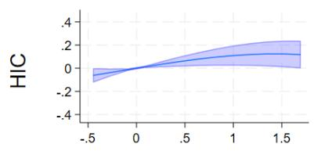

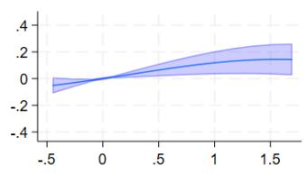

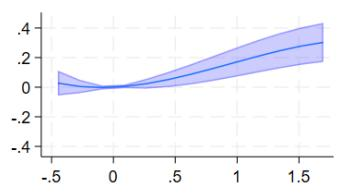

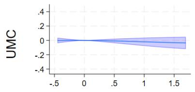

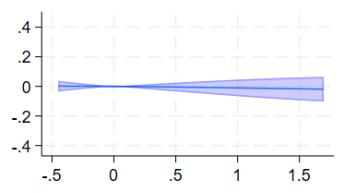

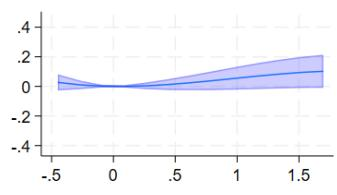

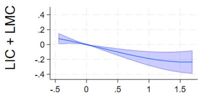  
Small (0-19)

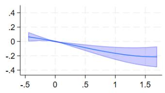  
Medium (20-99)

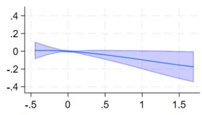  
Large (100+)  
Figure 1: Temperature Response Functions by GDP and Firm Size Vertical axes show changes in the logarithm of sales revenues. Horizontal axes show differences in current fiscal year temperatures compared to historical average temperatures from 1980–2008. Blue lines are estimated using Equation 1. Shaded regions show 95% confidence intervals calculated using standard errors clustered at the Enterprise Survey strata level (region x size category x sector). The top row shows the results for high income countries (mean temperature $17^{\circ}$ C), the second row for upper-middle income countries (mean temperature $17^{\circ}$ C), and the bottom row for low and lower-middle income countries (mean temperature $17^{\circ}$ C). The first column shows results for small firms with under 20 full-time employees, the middle shows results for medium firms with 20–99 employees, and the third column shows results for firms with 100 or more employees.

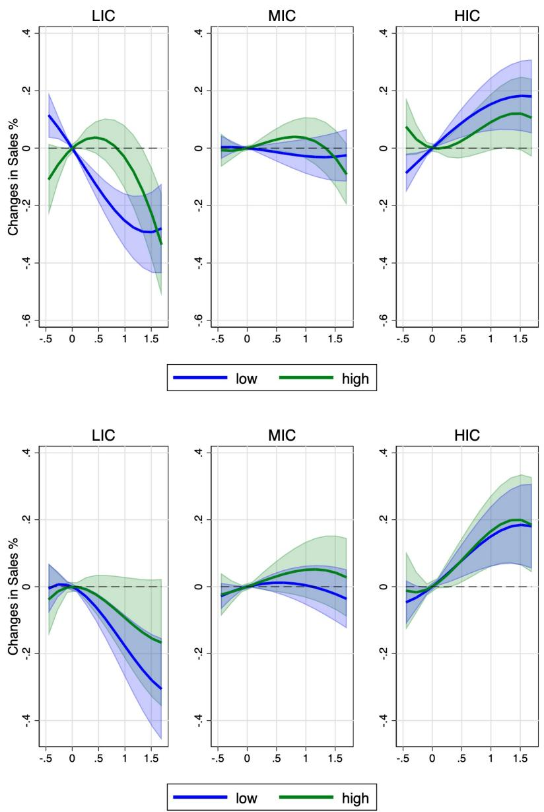  
Figure 2: Temperature Response Functions by GDP and Firm Characteristics The top panel shows heterogeneity by firm age. The bottom shows heterogeneity by the proportion of sales that are direct exports. Vertical axes show changes in the logarithm of sales revenues. Horizontal axes show differences in current fiscal year temperatures compared to historical average temperatures from 1980–2008. Lines are estimated using Equation 1. Shaded regions show 95% confidence intervals calculated using standard errors clustered at the Enterprise Survey strata level (region x size category x sector). The right column shows the results for high income countries (mean temperature $17^{\circ}$ C), the middle for upper-middle income countries (mean temperature $17^{\circ}$ C), and the left for low and lower-middle income countries (mean temperature $17^{\circ}$ C). Blue lines show estimates evaluated at the 10th percentile of the characteristic in a given income category. Green lines show estimates evaluated at the 90th percentile of the characteristic in a given income category.

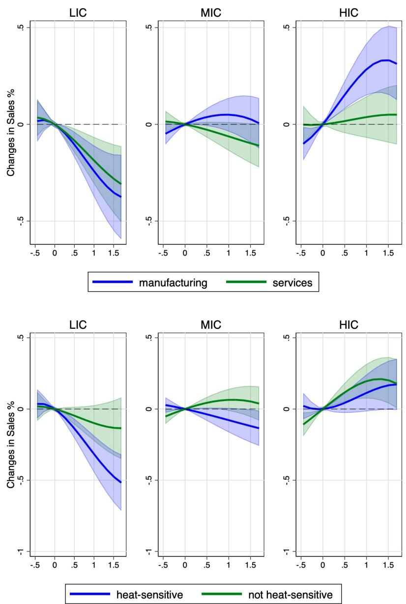  
Figure 3: Temperature Response Functions by GDP and Sectoral Attributes Vertical axes show changes in the logarithm of sales revenues. Horizontal axes show differences in current fiscal year temperatures compared to historical average temperatures from 1980–2008. Lines are estimated using Equation 1. Shaded regions show 95% confidence intervals calculated using standard errors clustered at the Enterprise Survey strata level (region x size category x sector). The right column shows the results for high income countries (mean temperature $17^{\circ}$ C), the middle for upper-middle income countries (mean temperature $17^{\circ}$ C), and the left for low and lower-middle income countries (mean temperature $17^{\circ}$ C). The bottom panel shows firms sorted by heat sensitivity according to Graff Zivin and Neidell (2014).

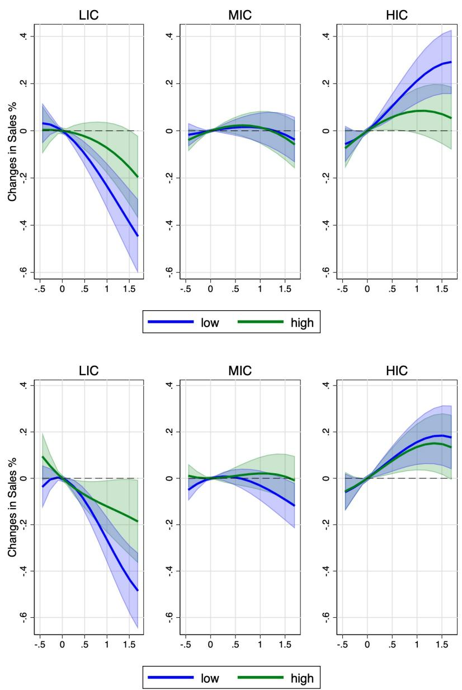  
Figure 4: Temperature Response Functions by GDP and Attributes of Business Environment. The top panel shows heterogeneity by access to finance. The bottom panel shows heterogeneity by the regulatory environment. Vertical axes show changes in the logarithm of sales revenues. Horizontal axes show differences in current fiscal year temperatures compared to historical average temperatures from 1980–2008. Lines are estimated using Equation 1. Shaded regions show 95% confidence intervals calculated using standard errors clustered at the Enterprise Survey strata level (region x size category x sector). The right column shows the results for high income countries (mean temperature $17^{\circ}$ C), the middle for upper-middle income countries (mean temperature $17^{\circ}$ C), and the left for low and lower-middle income countries (mean temperature $17^{\circ}$ C). Blue lines show estimates evaluated at the 10th percentile of the attribute in a given income category, green lines show estimates evaluated at the 90th percentile of the attribute in a given income category.

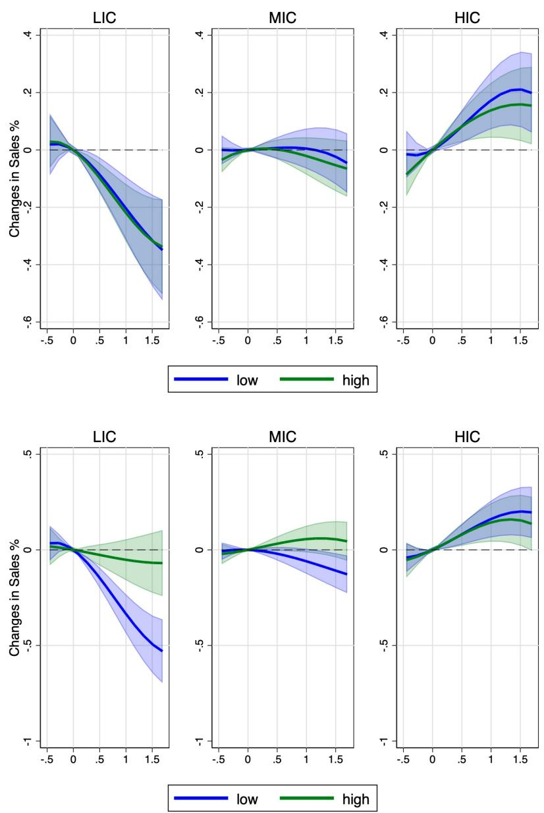  
Figure 5: Temperature Response Functions by GDP and Quality of Public Goods The top panel shows heterogeneity by the quality of electricity access. The bottom panel shows heterogeneity by security. Vertical axes show changes in the logarithm of sales revenues. Horizontal axes show differences in current fiscal year temperatures compared to historical average temperatures from 1980–2008. Lines are estimated using Equation 1. Shaded regions show 95% confidence intervals calculated using standard errors clustered at the Enterprise Survey strata level (region x size category x sector). The right column shows the results for high income countries (mean temperature $17^{\circ}$ C), the middle for upper-middle income countries (mean temperature $17^{\circ}$ C), and the left for low and lower-middle income countries (mean temperature $17^{\circ}$ C). Blue lines show estimates evaluated at the 10th percentile of the attribute in a given income category, green lines show estimates evaluated at the 90th percentile of the attribute in a given income category.

## 9 Tables

Table 1: Correlations between Temperature Differences and Firm Characteristics

<table><tr><td></td><td>(1) Temp. Difference</td></tr><tr><td>Age</td><td>-0.000 (0.000)</td></tr><tr><td>Part of Larger Firm</td><td>0.010*** (0.003)</td></tr><tr><td>Managerial Experience</td><td>-0.000 (0.000)</td></tr><tr><td>Pct. Owned Private Domestic</td><td>0.000 (0.000)</td></tr><tr><td>Pct. Owned Private Foreign</td><td>0.000 (0.000)</td></tr><tr><td>Pct. Owned Govt.</td><td>-0.000 (0.000)</td></tr><tr><td>Pct. Owned Other</td><td>0.000 (0.000)</td></tr><tr><td>Female Top Manager</td><td>-0.006** (0.003)</td></tr><tr><td>No. Employees</td><td>-0.000 (0.000)</td></tr><tr><td>Long-term Mean Temperature</td><td>-0.009*** (0.002)</td></tr><tr><td>N</td><td>137033</td></tr></table>

Note: Correlations come from a regression of average annual temperature differences on the listed firm characteristics. We report standard errors clustered at the WBES strata level in parentheses. \* $p < 0.10$ , \*\* $p < 0.05$ , \*\*\*, $p < 0.01$ .

Table 2: Effect of Average Temperature Difference on Firm Performance, Accounting for Heterogeneity in GDP and Firm Size

<table><tr><td></td><td>Small LIC+LMC</td><td>Small UMC</td><td>Small HIC</td><td>Medium LIC+LMC</td><td>Medium UMC</td><td>Medium HIC</td><td>Large LIC+LMC</td><td>Large UMC</td><td>Large HIC</td></tr><tr><td>Log(Revenue)</td><td>-0.226**(0.065)</td><td>-0.028(0.037)</td><td>0.123**(0.055)</td><td>-0.202**(0.06)</td><td>-0.015(0.036)</td><td>0.141**(0.054)</td><td>-0.137*(0.072)</td><td>0.083*(0.049)</td><td>0.245**(0.061)</td></tr><tr><td>Log(Rev. per worker)</td><td>-0.174**(0.046)</td><td>0.004(0.026)</td><td>0.139**(0.039)</td><td>-0.153**(0.043)</td><td>0.005(0.026)</td><td>0.136**(0.039)</td><td>-0.113**(0.048)</td><td>0(0.032)</td><td>0.101**(0.041)</td></tr><tr><td>Log(Avg. Wage)</td><td>-0.091**(0.037)</td><td>-0.002(0.021)</td><td>0.065**(0.033)</td><td>-0.084**(0.034)</td><td>-0.005(0.021)</td><td>0.061*(0.033)</td><td>-0.091**(0.04)</td><td>-0.032(0.027)</td><td>0.025(0.035)</td></tr><tr><td>Invest (Binary)</td><td>-0.004**(0.002)</td><td>-0.002(0.002)</td><td>-0.002(0.003)</td><td>-0.003(0.002)</td><td>-0.003(0.002)</td><td>-0.002(0.003)</td><td>-0.004(0.003)</td><td>-0.004**(0.002)</td><td>-0.003(0.003)</td></tr><tr><td>Log(Investment)</td><td>-0.094(0.117)</td><td>-0.107*(0.061)</td><td>-0.117(0.087)</td><td>-0.104(0.109)</td><td>-0.092(0.06)</td><td>-0.083(0.086)</td><td>-0.161(0.113)</td><td>0.03(0.07)</td><td>0.147*(0.089)</td></tr><tr><td>Innovation</td><td>-0.024*(0.013)</td><td>-0.012*(0.007)</td><td>-0.004(0.011)</td><td>-0.021*(0.012)</td><td>-0.011(0.007)</td><td>-0.004(0.011)</td><td>-0.008(0.013)</td><td>-0.004(0.009)</td><td>-0.002(0.012)</td></tr><tr><td>Log(Energy Intensity)</td><td>0.023(0.053)</td><td>-0.003(0.034)</td><td>-0.023(0.054)</td><td>0.036(0.049)</td><td>0.015(0.034)</td><td>-0.005(0.053)</td><td>0.165**(0.058)</td><td>0.161**(0.044)</td><td>0.126**(0.058)</td></tr></table>

Notes: Each row represents a different regression of a given firm performance variable on the model specified in equation (1). Coefficients show estimated effects of a one standard deviation change in average temperature differences based on the fully saturated model with third-order polynomials. We evaluate the estimated model at average firm size and GDP per capita within each group of firms listed at the top of the table. Mean temperatures are 15C in HICs, 17C in UMCs, and 23C in LICs and LMICs. We report standard errors clustered at the Enterprise Survey strata level in parentheses. \* (p<0.10), \*\* (p<0.05)

Table 3: Effect of Average Temperature Difference on Firm Performance: Heterogeneity in GDP and Age

<table><tr><td rowspan="2"></td><td colspan="2">LIC + LMIC</td><td colspan="2">UMC</td><td colspan="2">HIC</td></tr><tr><td>Low</td><td>High</td><td>Low</td><td>High</td><td>Low</td><td>High</td></tr><tr><td>Log(Revenue)</td><td>-0.309(0.076)</td><td>-0.149(0.084)</td><td>0.011(0.047)</td><td>-0.066(0.052)</td><td>0.268(0.069)</td><td>0(0.07)</td></tr><tr><td>Log(Rev. per worker)</td><td>-0.154(0.046)</td><td>-0.151(0.049)</td><td>0.033(0.028)</td><td>-0.047(0.029)</td><td>0.184(0.04)</td><td>0.037(0.039)</td></tr><tr><td>Invest (binary)</td><td>-0.004(0.002)</td><td>-0.002(0.002)</td><td>-0.004(0.002)</td><td>-0.001(0.002)</td><td>-0.003(0.003)</td><td>-0.001(0.003)</td></tr><tr><td>Log(Investment)</td><td>-0.197(0.124)</td><td>0.02(0.14)</td><td>-0.049(0.07)</td><td>-0.082(0.08)</td><td>0.069(0.097)</td><td>-0.165(0.099)</td></tr><tr><td>Log(Avg. wage)</td><td>-0.109(0.037)</td><td>-0.048(0.039)</td><td>-0.008(0.022)</td><td>-0.008(0.025)</td><td>0.074(0.033)</td><td>0.025(0.034)</td></tr><tr><td>Log(Capacity Util)</td><td>0.009(0.018)</td><td>0.023(0.019)</td><td>-0.008(0.011)</td><td>0.016(0.012)</td><td>-0.022(0.016)</td><td>0.01(0.016)</td></tr><tr><td>Log(Energy Intensity)</td><td>0.034(0.053)</td><td>0.104(0.057)</td><td>-0.027(0.037)</td><td>0.116(0.038)</td><td>-0.076(0.056)</td><td>0.125(0.055)</td></tr><tr><td>Innovation</td><td>-0.033(0.013)</td><td>-0.001(0.014)</td><td>-0.014(0.008)</td><td>-0.004(0.008)</td><td>0.001(0.012)</td><td>-0.007(0.012)</td></tr></table>

Notes: Each row represents a different regression of a given firm performance variable on a variation of the model specified in equation 1, where we model heterogeneity by GDP and age. Coefficients show estimated effects of a one standard deviation change in average temperature differences based on the fully saturated model with third-order polynomials. Columns labeled “low” evaluate the estimated model at the 10th percentile of firm age and columns labeled “high” evaluate the estimated model at the 90th percentile of firm age within each group of countries listed at the top of the table. Mean temperatures are 15C in HICs, 17C in UMCs, and 23C in LICs + LMICs. We report standard errors clustered at the Enterprise Survey strata level in parentheses.

Table 4: Effect of Average Temperature Difference on Firm Performance: Heterogeneity in GDP and Percent Direct Exports

<table><tr><td rowspan="2"></td><td colspan="2">LIC + LMIC</td><td colspan="2">UMC</td><td colspan="2">HIC</td></tr><tr><td>Low</td><td>High</td><td>Low</td><td>High</td><td>Low</td><td>High</td></tr><tr><td>Log(Revenue)</td><td>-0.249(0.075)</td><td>-0.171(0.086)</td><td>-0.011(0.045)</td><td>0.031(0.054)</td><td>0.18(0.068)</td><td>0.193(0.072)</td></tr><tr><td>Log(Rev. per worker)</td><td>-0.156(0.044)</td><td>-0.123(0.049)</td><td>-0.002(0.026)</td><td>0.017(0.03)</td><td>0.121(0.038)</td><td>0.13(0.04)</td></tr><tr><td>Invest (binary)</td><td>-0.003(0.002)</td><td>-0.005(0.002)</td><td>-0.003(0.002)</td><td>-0.004(0.002)</td><td>-0.003(0.003)</td><td>-0.004(0.003)</td></tr><tr><td>Log(Investment)</td><td>-0.098(0.122)</td><td>-0.158(0.131)</td><td>-0.076(0.067)</td><td>-0.084(0.074)</td><td>-0.058(0.095)</td><td>-0.024(0.098)</td></tr><tr><td>Log(Avg. wage)</td><td>-0.099(0.035)</td><td>-0.084(0.04)</td><td>-0.02(0.021)</td><td>-0.005(0.024)</td><td>0.043(0.033)</td><td>0.059(0.034)</td></tr><tr><td>Log(Capacity Util)</td><td>0.007(0.017)</td><td>0.043(0.018)</td><td>-0.001(0.01)</td><td>0.021(0.011)</td><td>-0.008(0.015)</td><td>0.002(0.016)</td></tr><tr><td>Log(Energy Intensity)</td><td>0.053(0.051)</td><td>0.093(0.057)</td><td>0.029(0.035)</td><td>0.06(0.039)</td><td>0.01(0.054)</td><td>0.033(0.056)</td></tr><tr><td>Innovation</td><td>-0.022(0.013)</td><td>-0.013(0.014)</td><td>-0.01(0.007)</td><td>-0.001(0.008)</td><td>0(0.011)</td><td>0.009(0.012)</td></tr></table>

Notes: Each row represents a different regression of a given firm performance variable on a variation of the model specified in equation 1, where we model heterogeneity by GDP and the percentage of sales that are direct exports. Coefficients show estimated effects of a one standard deviation change in average temperature differences based on the fully saturated model with third-order polynomials. Columns labeled “low” evaluate the estimated model at the 10th percentile of the percentage of direct exports and columns labeled “high” evaluate the estimated model at the 90th percentile of the percentage of direct exports within each group of countries listed at the top of the table. Mean temperatures are 15C in HICs, 17C in UMCs, and 23C in LICs + LMICs. We report standard errors clustered at the Enterprise Survey strata level in parentheses.

Table 5: Effect of Average Temperature Difference on Firm Performance: Heterogeneity in GDP and Sector Heat Sensitivity

<table><tr><td rowspan="2"></td><td colspan="2">LIC + LMIC</td><td colspan="2">UMC</td><td colspan="2">HIC</td></tr><tr><td>High</td><td>Low</td><td>High</td><td>Low</td><td>High</td><td>Low</td></tr><tr><td>Log(Revenue)</td><td>-0.429(0.101)</td><td>-0.125(0.104)</td><td>-0.106(0.065)</td><td>0.061(0.06)</td><td>0.154(0.097)</td><td>0.21(0.092)</td></tr><tr><td>Log(Rev. per worker)</td><td>-0.249(0.062)</td><td>-0.065(0.057)</td><td>-0.047(0.038)</td><td>0.046(0.033)</td><td>0.116(0.056)</td><td>0.136(0.049)</td></tr><tr><td>Invest (binary)</td><td>-0.004(0.002)</td><td>-0.002(0.003)</td><td>-0.001(0.002)</td><td>-0.005(0.002)</td><td>0.001(0.004)</td><td>-0.007(0.004)</td></tr><tr><td>Log(Investment)</td><td>-0.328(0.186)</td><td>0.058(0.159)</td><td>-0.044(0.104)</td><td>-0.077(0.086)</td><td>0.184(0.152)</td><td>-0.186(0.118)</td></tr><tr><td>Log(Avg. wage)</td><td>-0.145(0.045)</td><td>-0.037(0.053)</td><td>-0.024(0.029)</td><td>0.005(0.028)</td><td>0.074(0.049)</td><td>0.038(0.042)</td></tr><tr><td>Log(Capacity Util)</td><td>0.06(0.027)</td><td>-0.025(0.022)</td><td>0.037(0.018)</td><td>-0.02(0.012)</td><td>0.018(0.029)</td><td>-0.016(0.018)</td></tr><tr><td>Log(Energy Intensity)</td><td>0.15(0.072)</td><td>-0.025(0.067)</td><td>0.116(0.049)</td><td>-0.047(0.046)</td><td>0.089(0.077)</td><td>-0.065(0.072)</td></tr><tr><td>Innovation</td><td>-0.003(0.016)</td><td>-0.043(0.018)</td><td>-0.004(0.009)</td><td>-0.018(0.01)</td><td>-0.005(0.016)</td><td>0.002(0.016)</td></tr></table>

Notes: Each row represents a different regression of a given firm performance variable on a variation of the model specified in equation 1, where we model heterogeneity by GDP and whether a firm is in a heat-sensitive industry. Coefficients show estimated effects of a one standard deviation change in average temperature differences based on the fully saturated model with third-order polynomials. Columns labeled “low” evaluate the estimated model for firms not in heat sensitive sectors and columns labeled “high” evaluate the estimated model for firms in heat sensitive sectors within each group of countries listed at the top of the table. Mean temperatures are 15C in HICs, 17C in UMCs, and 23C in LICs + LMICs. We report standard errors clustered at the Enterprise Survey strata level in parentheses.

Table 6: Effect of Average Temperature Difference on Firm Performance: Heterogeneity in GDP and Access to Finance

<table><tr><td rowspan="2"></td><td colspan="2">LIC + LMIC</td><td colspan="2">UMC</td><td colspan="2">HIC</td></tr><tr><td>Low</td><td>High</td><td>Low</td><td>High</td><td>Low</td><td>High</td></tr><tr><td>Log(Revenue)</td><td>-0.295(0.078)</td><td>-0.229(0.086)</td><td>0.009(0.049)</td><td>-0.035(0.052)</td><td>0.253(0.072)</td><td>0.122(0.073)</td></tr><tr><td>Log(Rev. per worker)</td><td>-0.171(0.047)</td><td>-0.138(0.05)</td><td>0.032(0.029)</td><td>-0.023(0.029)</td><td>0.196(0.042)</td><td>0.069(0.04)</td></tr><tr><td>Invest (binary)</td><td>-0.002(0.002)</td><td>-0.006(0.002)</td><td>-0.001(0.002)</td><td>-0.005(0.002)</td><td>-0.001(0.003)</td><td>-0.004(0.003)</td></tr><tr><td>Log(Investment)</td><td>-0.13(0.134)</td><td>-0.141(0.136)</td><td>-0.023(0.08)</td><td>-0.116(0.078)</td><td>0.063(0.107)</td><td>-0.096(0.1)</td></tr><tr><td>Log(Avg. wage)</td><td>-0.068(0.038)</td><td>-0.125(0.041)</td><td>0.024(0.024)</td><td>-0.048(0.025)</td><td>0.099(0.036)</td><td>0.014(0.035)</td></tr><tr><td>Log(Capacity Util)</td><td>-0.013(0.019)</td><td>0.051(0.021)</td><td>-0.019(0.012)</td><td>0.028(0.012)</td><td>-0.024(0.017)</td><td>0.009(0.016)</td></tr><tr><td>Log(Energy Intensity)</td><td>0.082(0.054)</td><td>0.037(0.058)</td><td>0.027(0.038)</td><td>0.047(0.039)</td><td>-0.018(0.058)</td><td>0.054(0.056)</td></tr><tr><td>Innovation</td><td>-0.013(0.013)</td><td>-0.031(0.014)</td><td>-0.004(0.008)</td><td>-0.017(0.009)</td><td>0.003(0.012)</td><td>-0.006(0.012)</td></tr></table>

Notes: Each row represents a different regression of a given firm performance variable on a variation of the model specified in equation 1, where we model heterogeneity by GDP and an index of access to finance. Coefficients show estimated effects of a one standard deviation change in average temperature differences based on the fully saturated model with third-order polynomials. Columns labeled “low” evaluate the estimated model at the 10th percentile of the access to finance index and columns labeled “high” evaluate the estimated model at the 90th percentile of the access to finance index within each group of countries listed at the top of the table. Mean temperatures are 15C in HICs, 17C in UMCs, and 23C in LICs + LMICs. We report standard errors clustered at the Enterprise Survey strata level in parentheses.

Table 7: Effect of Average Temperature Difference on Firm Performance: Heterogeneity in GDP and Regulatory Index

<table><tr><td rowspan="2"></td><td colspan="2">LIC + LMIC</td><td colspan="2">UMC</td><td colspan="2">HIC</td></tr><tr><td>Low</td><td>High</td><td>Low</td><td>High</td><td>Low</td><td>High</td></tr><tr><td>Log(Revenue)</td><td>-0.323(0.08)</td><td>-0.211(0.084)</td><td>-0.052(0.05)</td><td>-0.001(0.051)</td><td>0.166(0.073)</td><td>0.168(0.072)</td></tr><tr><td>Log(Rev. per worker)</td><td>-0.169(0.046)</td><td>-0.143(0.05)</td><td>-0.009(0.029)</td><td>0.004(0.029)</td><td>0.119(0.041)</td><td>0.123(0.04)</td></tr><tr><td>Invest (binary)</td><td>-0.004(0.002)</td><td>-0.003(0.002)</td><td>-0.004(0.002)</td><td>-0.001(0.002)</td><td>-0.005(0.003)</td><td>0(0.003)</td></tr><tr><td>Log(Investment)</td><td>-0.049(0.131)</td><td>-0.214(0.14)</td><td>0.033(0.076)</td><td>-0.164(0.079)</td><td>0.098(0.105)</td><td>-0.124(0.102)</td></tr><tr><td>Log(Avg. wage)</td><td>-0.098(0.039)</td><td>-0.08(0.039)</td><td>-0.022(0.025)</td><td>-0.002(0.024)</td><td>0.039(0.036)</td><td>0.061(0.034)</td></tr><tr><td>Log(Capacity Util)</td><td>0.03(0.019)</td><td>-0.004(0.02)</td><td>0.009(0.012)</td><td>-0.002(0.012)</td><td>-0.008(0.017)</td><td>0(0.017)</td></tr><tr><td>Log(Energy Intensity)</td><td>0.055(0.056)</td><td>0.071(0.057)</td><td>0.036(0.039)</td><td>0.043(0.038)</td><td>0.021(0.057)</td><td>0.021(0.056)</td></tr><tr><td>Innovation</td><td>-0.026(0.013)</td><td>-0.018(0.014)</td><td>-0.016(0.008)</td><td>-0.008(0.008)</td><td>-0.008(0.012)</td><td>0.001(0.012)</td></tr></table>

Notes: Each row represents a different regression of a given firm performance variable on a variation of the model specified in equation 1, where we model heterogeneity by GDP and an index of regulation. Coefficients show estimated effects of a one standard deviation change in average temperature differences based on the fully saturated model with third-order polynomials. Columns labeled “low” evaluate the estimated model at the 10th percentile of the regulatory index and columns labeled “high” evaluate the estimated model at the 90th percentile of the regulatory index within each group of countries listed at the top of the table. Mean temperatures are 15C in HICs, 17C in UMCs, and 23C in LICs + LMICs. We report standard errors clustered at the Enterprise Survey strata level in parentheses.

Table 8: Effect of Average Temperature Difference on Firm Performance: Heterogeneity in GDP and Security Index

<table><tr><td rowspan="2"></td><td colspan="2">LIC + LMIC</td><td colspan="2">UMC</td><td colspan="2">HIC</td></tr><tr><td>Low</td><td>High</td><td>Low</td><td>High</td><td>Low</td><td>High</td></tr><tr><td>Log(Revenue)</td><td>-0.174(0.085)</td><td>-0.348(0.084)</td><td>0.054(0.053)</td><td>-0.102(0.051)</td><td>0.238(0.074)</td><td>0.096(0.072)</td></tr><tr><td>Log(Rev. per worker)</td><td>-0.07(0.051)</td><td>-0.23(0.048)</td><td>0.058(0.031)</td><td>-0.06(0.029)</td><td>0.162(0.042)</td><td>0.076(0.04)</td></tr><tr><td>Invest (binary)</td><td>0(0.002)</td><td>-0.006(0.002)</td><td>0(0.002)</td><td>-0.006(0.002)</td><td>0.001(0.003)</td><td>-0.005(0.003)</td></tr><tr><td>Log(Investment)</td><td>-0.175(0.14)</td><td>-0.083(0.132)</td><td>-0.062(0.083)</td><td>-0.075(0.075)</td><td>0.029(0.108)</td><td>-0.069(0.1)</td></tr><tr><td>Log(Avg. wage)</td><td>-0.017(0.041)</td><td>-0.154(0.04)</td><td>0.029(0.026)</td><td>-0.054(0.024)</td><td>0.067(0.036)</td><td>0.026(0.034)</td></tr><tr><td>Log(Capacity Util)</td><td>-0.002(0.021)</td><td>0.025(0.02)</td><td>-0.007(0.013)</td><td>0.014(0.012)</td><td>-0.011(0.018)</td><td>0.004(0.017)</td></tr><tr><td>Log(Energy Intensity)</td><td>-0.022(0.06)</td><td>0.135(0.057)</td><td>-0.016(0.04)</td><td>0.104(0.039)</td><td>-0.012(0.058)</td><td>0.08(0.056)</td></tr><tr><td>Innovation</td><td>-0.029(0.015)</td><td>-0.014(0.014)</td><td>-0.016(0.009)</td><td>-0.008(0.009)</td><td>-0.007(0.013)</td><td>-0.003(0.012)</td></tr></table>

Notes: Each row represents a different regression of a given firm performance variable on a variation of the model specified in equation 1, where we model heterogeneity by GDP and an index of security. Coefficients show estimated effects of a one standard deviation change in average temperature differences based on the fully saturated model with third-order polynomials. Columns labeled “low” evaluate the estimated model at the 10th percentile of the security index and columns labeled “high” evaluate the estimated model at the 90th percentile of the security index within each group of countries listed at the top of the table. Mean temperatures are 15C in HICs, 17C in UMCs, and 23C in LICs + LMICs. We report standard errors clustered at the Enterprise Survey strata level in parentheses.

## A Appendix

## A.1 World Bank Enterprise Survey data

To investigate the economic costs of climate change, we rely on a novel firm-level data from the World Bank Enterprise Surveys (WBES) available for over 120 developing countries from 2006 to 2023. The WBES are designed to provide internationally comparable establishment-level data that are representative for the formal private sector economy (that is, establishments with at least five employees) for each country-year episode. The surveys are stratified by size (small, medium, and large), economic activity (sectors), and region (states). The data provides sampling weights for each country-year episode so that the weighted estimations are representative at the country level. The sampling considers the following industries (ISIC codes): all manufacturing sectors (group D), construction (group F), services (groups G and H), and transport, storage, and communications (group I).

The sample size ensures a minimum precision of 7.5% for the 90% confidence interval about estimates of (i) the population proportion and (ii) the mean of log sales of these industries. A second level of stratification is firm size defined as small (5-19 employees), medium (20-99 employees), and large (100 or more employees). The targeted firms are establishments with at least five full-time employees with a minimum of eight working hours (or a complete work shift) per day. The restriction in firm size is supposed to limit the surveys to the formal economy; firms that are un-registered with the registrar/tax authority are thus excluded. An establishment is defined as a single physical business location and may be part of a firm. However, establishments are required to make their own financial decisions, have their own managerial oversight, and have books separated from the parent firm.

The questionnaire is designed to be administered in face-to-face interviews with owners, managing directors, accountants, or other relevant staff. The interviewers as well as all other staff involved in the survey are thoroughly trained, whereas the World Bank experts supervise the training. The interviewers have to pass an exam in the end of the training in order to qualify for the work. The World Bank assures the strict confidentiality of the survey information. Any missing data or inconsistencies are checked by the interviewer and a field supervisor immediately after the interview and after the filing of the data.

Neither the name of the respondent nor the name of the firm is used in any document based on the survey. The high degree of confidentiality is necessary to avoid biased declarations of respondents, who are informed of these conditions at the outset of the interview. Pilot surveys and field experience suggest that the completion of the core Enterprise Surveys lasts approximately 45 minutes. This limitation in the length also contributes to the quality of the responses. In spite of these carefully designed survey characteristics, non-responses could compromise the random nature of the sample if the rationales for non-responses vary systematically with the respondents' innovation activity. The WBES team thus conducts additional field-work reports that examine the reasons for non-responds in each country, industry, and class of firm size.

The survey includes a broad set of firm-level information, including balance sheet, income statement, as well as other specific questions related to access to finance, reliability of energy, corruption, infrastructure, competition, and green technology adoption and management practices. For the baseline analysis, we focus on firms' performance and specifically look at firms' total sales, labor productivity, total numbers of employment, wages (total labor compensation), energy consumption, capacity utilization, the year of establishment (age), the 4-digit sector classification of the firms' main economic activity, and the frequency of power outages reported by the firm. Moreover, each firm reports to which extent the following policy areas are an obstacle for the operation of the individual establishment: access to finance, electricity, transport, business licensing and permits, and corruption.

The WBES data are geo-coded. All surveys are conducted on-site, and each interviewer applied an electronic tablet to conduct the survey and register the responses. The tablet automatically registers the exact geo-coded location of the individual establishment while each survey is conducted, thus avoiding any potential manual reporting error when it comes to the firmsâ location. The exact location of the firm is masked in the final published data using a random deviation within a 3 km radius of the true location of the firm.

## A.2 Construction of index variables

All of our index variables follow the method outlined in Anderson 2008, with individual questions reverse-coded to ensure that higher values for all questions are consistently coded.

The index of firm-level resilience combines five questions: “what percentage of total annual sales comes from the main product of this establishment”, “did this establishment own or share a generator over the course of the last fiscal year”, “in the last fiscal year, did this establishment pay for security”, “did this establishment secure or attempt to secure a government contract over the course of the last fiscal year”, and “did this establishment have its financial statements checked and certified by an external auditor in the last fiscal year.” We reverse code the first question so that higher values of the index correspond to firms taking more measures to aid with general business resilience.

The index of electricity quality combines responses to two questions: “over the last fiscal year, did this establishment experience power outages” and “how much of an obstacle is electricity to the operations of this establishment”. The latter is on a 5-point scale with higher values indicating a greater obstacle. We reverse code both questions so that higher values of the electricity index correspond to better access to electricity.

The index of security combines two questions: “did this establishment experience losses due to theft, robbery, vandalism, or arson over the last fiscal year” and “how much of an obstacle are crime, theft, and disorder to the operations of this establishment.” We reverse code both so that higher values in the security index correspond to more secure locations.

The index of access to finance combines four questions: “how much of an obstacle is access to finance to the operations of this establishment”, “what is the percentage of working capital financed through other sources (money lenders, friends, relatives, etc.)”, “does this establishment have a checking and/or savings account", and "does this establishment have a line of credit or loan from a financial institution." We reverse code the first two questions so that higher values on the access to finance index correspond to having greater access to external capital and financial services.

The index of regulation combines three questions: “over the last 12 months, was this establishment inspected by tax officials”, “how much of an obstacle is business permitting and licensing to the operations of this establishment”, and “how much of an obstacle are labor regulations to the operations of this establishment.” We do not reverse code any of these questions so higher values in the index correspond to greater regulatory burdens.

The index of export orientation combines two questions: “how much of an obstacle customs and trade regulations to the operations of this establishment” and “in the last fiscal year, what was the main market for this establishment’s main product.” The latter has three categories: local, national, and international. We code these separately as three binary variables, then reverse code the local market variable as well as the question on how much of an obstacle customs and trade regulations pose. Doing so ensures that higher values on the index correspond to more export-oriented firms.

Temperature Difference (C)

Temperature Difference (C)

## A.3 Additional supporting figures

Temperature Difference (C)  
Temperature Difference (C)  
Temperature Difference (C)  
Temperature Difference (C)  
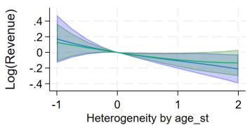

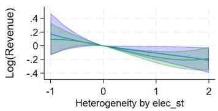

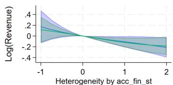  
Temperature Difference (C)

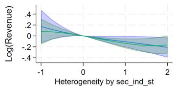

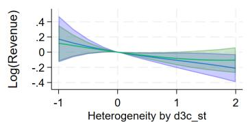

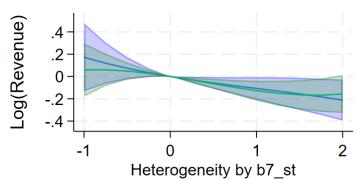  
Temperature Difference (C)

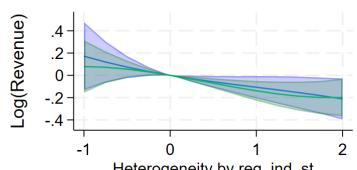

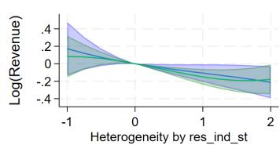  
Figure A1: Temperature Response Functions Added Dimensions of Heterogeneity Blue lines show changes in log revenues in response to deviations from long-term average temperatures for average-sized firms in countries in low and lower-middle income countries, modeling heterogeneity in GDP and firm size. Green lines show response functions modeling heterogeneity in GDP, firm size, and one additional dimension of heterogeneity. From the top right, the additional dimension of heterogeneity is: manager experience, an index of the quality of electricity access, firm age, an index of access to finance, and index of security, the proportion of sales that are direct exports, years of managerial experience, an index of regulation, and an index of general resilience. Shaded regions show 95% confidence intervals calculated using standard errors clustered at the strata level.

## A.4 Additional supporting tables

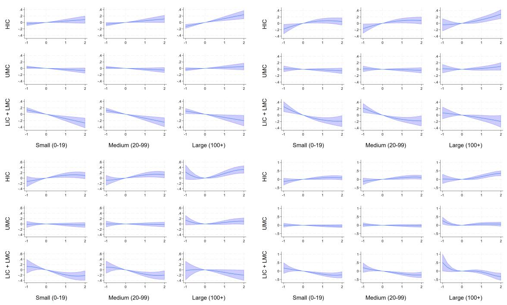  
Figure A2: Temperature Response Functions Using First through Fourth-Order Polynomials Vertical axes show changes in the logarithm of sales revenues. Horizontal axes show differences in current fiscal year temperatures compared to historical average temperatures from 1980–2008. Blue lines are estimated using Equation 1. Shaded regions show 95% confidence intervals calculated using standard errors clustered at the strata level. The upper left panel shows results that are linear in temperature differences, the upper right shows results that are quadratic in temperature differences, the bottom left shows results that are cubic in temperature differences (our preferred specification), and the bottom right shows fourth-order polynomials in temperature differences.

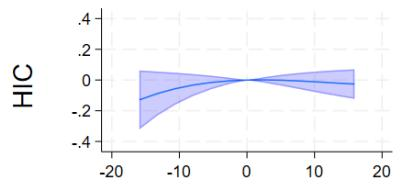

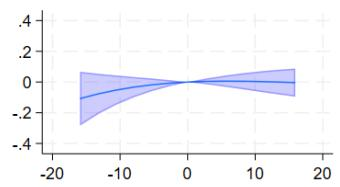

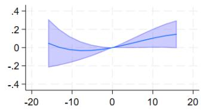

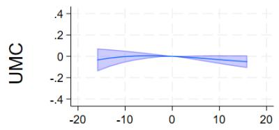

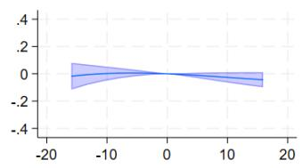

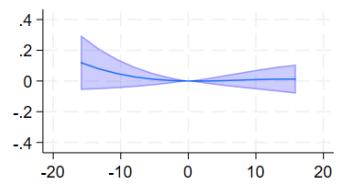

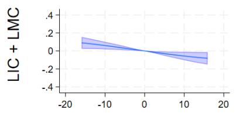  
Small (0-19)

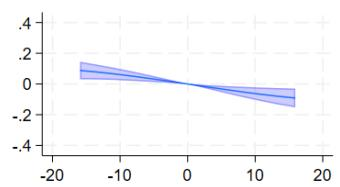  
Medium (20-99)

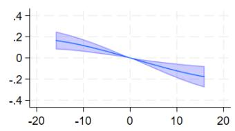  
Large (100+)  
Figure A3: Temperature Response Functions by GDP and Firm Size - Extreme Temperatures Vertical axes show changes in the logarithm of sales revenues. Horizontal axes show differences in the number of days in the current fiscal year where temperatures exceed 35C compared to historical averages from 1980–2008. Blue lines are estimated using Equation 1. Shaded regions show 95% confidence intervals calculated using standard errors clustered at the Enterprise Survey strata level (region x size category x sector). The top row shows high income countries (mean days above 35C of 6), the second row upper-middle income countries (mean days above 35C of 12), and the bottom row low and lower-middle income countries (mean days above 35C is 32). The first column shows results for small firms with under 20 full-time employees, the middle shows results for medium firms with 20–99 employees, and the third column shows results for firms with 100 or more employees.

Table A1: Effect of Average Temperature Difference on Firm Performance, Accounting for Heterogeneity in GDP and Firm Size and Controlling for Additional Covariates

<table><tr><td></td><td>Small LIC+LMC</td><td>Small UMC</td><td>Small HIC</td><td>Medium LIC+LMC</td><td>Medium UMC</td><td>Medium HIC</td><td>Large LIC+LMC</td><td>Large UMC</td><td>Large HIC</td></tr><tr><td>Log(Revenue)</td><td>-0.258(0.071)</td><td>-0.073(0.039)</td><td>0.089(0.048)</td><td>-0.227(0.066)</td><td>-0.061(0.038)</td><td>0.106(0.047)</td><td>-0.124(0.076)</td><td>0.057(0.053)</td><td>0.217(0.055)</td></tr><tr><td>Log(Rev. per worker)</td><td>-0.209(0.052)</td><td>-0.04(0.028)</td><td>0.108(0.034)</td><td>-0.183(0.048)</td><td>-0.039(0.027)</td><td>0.106(0.034)</td><td>-0.117(0.052)</td><td>-0.022(0.034)</td><td>0.077(0.037)</td></tr><tr><td>Invest (Binary)</td><td>-0.004(0.002)</td><td>-0.003(0.002)</td><td>-0.002(0.003)</td><td>-0.004(0.002)</td><td>-0.003(0.002)</td><td>-0.002(0.003)</td><td>-0.004(0.003)</td><td>-0.004(0.002)</td><td>-0.004(0.003)</td></tr><tr><td>Log(Investment)</td><td>-0.075(0.13)</td><td>-0.091(0.067)</td><td>-0.105(0.076)</td><td>-0.086(0.121)</td><td>-0.081(0.066)</td><td>-0.076(0.075)</td><td>-0.144(0.123)</td><td>0.007(0.078)</td><td>0.136(0.08)</td></tr><tr><td>Log(Avg. Wage)</td><td>-0.109(0.042)</td><td>-0.025(0.022)</td><td>0.049(0.029)</td><td>-0.099(0.039)</td><td>-0.027(0.022)</td><td>0.046(0.029)</td><td>-0.089(0.043)</td><td>-0.043(0.029)</td><td>0.012(0.032)</td></tr><tr><td>Log(Capacity Util)</td><td>0.013(0.02)</td><td>0.001(0.011)</td><td>-0.008(0.014)</td><td>0.015(0.019)</td><td>0.004(0.011)</td><td>-0.008(0.014)</td><td>0.04(0.018)</td><td>0.023(0.012)</td><td>-0.001(0.014)</td></tr><tr><td>Log(Energy Intensity)</td><td>0.023(0.059)</td><td>0(0.034)</td><td>-0.019(0.048)</td><td>0.034(0.055)</td><td>0.017(0.034)</td><td>-0.001(0.048)</td><td>0.148(0.062)</td><td>0.164(0.046)</td><td>0.135(0.054)</td></tr><tr><td>Innovation</td><td>-0.02(0.015)</td><td>-0.012(0.008)</td><td>-0.005(0.01)</td><td>-0.017(0.014)</td><td>-0.011(0.008)</td><td>-0.005(0.01)</td><td>0.001(0.014)</td><td>0.002(0.009)</td><td>0(0.011)</td></tr></table>

Notes: Each row represents a different regression of a given firm performance variable on the model specified in equation (1), controlling for all covariates that displayed statistically significant correlations with our measure of temperature differences. Coefficients show estimated effects of a one standard deviation change in average temperature differences based on the fully saturated model with third-order polynomials. We evaluate the estimated model at average firm size and GDP per capita within each group of firms listed at the top of the table. Mean temperatures are 15C in HICs, 17C in UMCs, and 23C in LICs + LMICs. We report standard errors clustered at the Enterprise Survey strata level in parentheses.

Table A2: Effect of Average Temperature Difference on Firm Performance: Heterogeneity in GDP and Manufacturing vs Service

<table><tr><td rowspan="2"></td><td colspan="2">LIC + LMIC</td><td colspan="2">UMC</td><td colspan="2">HIC</td></tr><tr><td>Serv.</td><td>Man.</td><td>Serv.</td><td>Man.</td><td>Serv.</td><td>Man.</td></tr><tr><td>Log(Revenue)</td><td>-0.323(0.108)</td><td>-0.253(0.097)</td><td>0.039(0.067)</td><td>-0.087(0.057)</td><td>0.33(0.101)</td><td>0.048(0.081)</td></tr><tr><td>Log(Rev. per worker)</td><td>-0.163(0.058)</td><td>-0.168(0.063)</td><td>0.043(0.035)</td><td>-0.047(0.036)</td><td>0.208(0.052)</td><td>0.05(0.05)</td></tr><tr><td>Invest (binary)</td><td>-0.001(0.002)</td><td>-0.006(0.003)</td><td>-0.004(0.002)</td><td>-0.002(0.003)</td><td>-0.006(0.004)</td><td>0(0.004)</td></tr><tr><td>Log(Investment)</td><td>-0.011(0.171)</td><td>-0.232(0.171)</td><td>-0.027(0.092)</td><td>-0.11(0.098)</td><td>-0.041(0.129)</td><td>-0.011(0.132)</td></tr><tr><td>Log(Avg. wage)</td><td>-0.059(0.047)</td><td>-0.139(0.049)</td><td>0.003(0.027)</td><td>-0.032(0.03)</td><td>0.053(0.042)</td><td>0.054(0.044)</td></tr><tr><td>Log(Capacity Util)</td><td>0.013(0.017)</td><td>0.113(0.298)</td><td>0.003(0.01)</td><td>-0.15(0.208)</td><td>-0.005(0.015)</td><td>-0.362(0.231)</td></tr><tr><td>Log(Energy Intensity)</td><td>0.092(0.066)</td><td>0.046(0.074)</td><td>0.066(0.046)</td><td>0.009(0.049)</td><td>0.046(0.073)</td><td>-0.021(0.073)</td></tr><tr><td>Innovation</td><td>0.011(0.017)</td><td>-0.061(0.017)</td><td>-0.001(0.01)</td><td>-0.023(0.01)</td><td>-0.011(0.016)</td><td>0.008(0.014)</td></tr></table>

Notes: Each row represents a different regression of a given firm performance variable on a variation of the model specified in equation 1, where we model heterogeneity by GDP and whether a firm is in manufacturing or services. Coefficients show estimated effects of a one standard deviation change in average temperature differences based on the fully saturated model with third-order polynomials. Columns labeled “Serv.” evaluate the estimated model for firms providing services and columns labeled “Man.” evaluate the estimated model for manufacturing firms within each group of countries listed at the top of the table. Mean temperatures are 15C in HICs, 17C in UMCs, and 23C in LICs + LMICs. We report standard errors clustered at the Enterprise Survey strata level in parentheses.

Table A3: Effect of Average Temperature Difference on Firm Performance: Heterogeneity in GDP and Electricity Index

<table><tr><td rowspan="2"></td><td colspan="2">LIC + LMIC</td><td colspan="2">UMC</td><td colspan="2">HIC</td></tr><tr><td>Low</td><td>High</td><td>Low</td><td>High</td><td>Low</td><td>High</td></tr><tr><td>Log(Revenue)</td><td>-0.279(0.082)</td><td>-0.332(0.085)</td><td>-0.044(0.052)</td><td>-0.02(0.051)</td><td>0.145(0.076)</td><td>0.231(0.072)</td></tr><tr><td>Log(Rev. per worker)</td><td>-0.163(0.049)</td><td>-0.191(0.049)</td><td>-0.017(0.03)</td><td>0.003(0.029)</td><td>0.101(0.042)</td><td>0.16(0.04)</td></tr><tr><td>Invest (binary)</td><td>-0.003(0.002)</td><td>-0.003(0.002)</td><td>-0.004(0.002)</td><td>-0.002(0.002)</td><td>-0.005(0.003)</td><td>-0.002(0.003)</td></tr><tr><td>Log(Investment)</td><td>-0.001(0.131)</td><td>-0.343(0.142)</td><td>0.033(0.078)</td><td>-0.187(0.079)</td><td>0.061(0.106)</td><td>-0.062(0.101)</td></tr><tr><td>Log(Avg. wage)</td><td>-0.073(0.041)</td><td>-0.131(0.038)</td><td>-0.006(0.026)</td><td>-0.018(0.023)</td><td>0.047(0.036)</td><td>0.073(0.034)</td></tr><tr><td>Log(Capacity Util)</td><td>-0.029(0.019)</td><td>0.065(0.02)</td><td>-0.019(0.012)</td><td>0.027(0.012)</td><td>-0.011(0.018)</td><td>-0.003(0.016)</td></tr><tr><td>Log(Energy Intensity)</td><td>0.064(0.057)</td><td>0.047(0.058)</td><td>0.046(0.04)</td><td>0.034(0.038)</td><td>0.032(0.059)</td><td>0.024(0.056)</td></tr><tr><td>Innovation</td><td>-0.022(0.014)</td><td>-0.04(0.014)</td><td>-0.024(0.009)</td><td>-0.007(0.008)</td><td>-0.026(0.013)</td><td>0.018(0.012)</td></tr></table>

Notes: Each row represents a different regression of a given firm performance variable on a variation of the model specified in equation 1, where we model heterogeneity by GDP and an index of electricity quality. Coefficients show estimated effects of a one standard deviation change in average temperature differences based on the fully saturated model with third-order polynomials. Columns labeled “low” evaluate the estimated model at the 10th percentile of the electricity index and columns labeled “high” evaluate the estimated model at the 90th percentile of the electricity index within each group of countries listed at the top of the table. Mean temperatures are 15C in HICs, 17C in UMCs, and 23C in LICs + LMICs. We report standard errors clustered at the Enterprise Survey strata level in parentheses.

## A.5 Evidence on temperature variability

To explore the importance of temperature variability, we calculate the coefficient of variation of temperature using daily data across the fiscal year. We then regress logged sales revenues on the coefficient of variation, the number of extremely hot days, and a country by year by sector fixed effect. We control for the number of hot days to avoid attributing effects of extreme temperatures to the coefficient of variation, as higher variance often implies more extremes. We estimate the regression on different subsets of the data to provide evidence on the effects of temperature variability in Table ??

<table><tr><td rowspan="2">Country</td><td colspan="4">Temperature</td><td colspan="2">Hot Days</td></tr><tr><td>Long-Term</td><td>Deviation</td><td>Mean</td><td>Deviation SD</td><td>Mean</td><td>Deviation</td></tr><tr><td>Austria</td><td>7.764</td><td></td><td>1.924</td><td>-0.769</td><td>0.222</td><td>0.016</td></tr><tr><td>Barbados</td><td>26.260</td><td></td><td>0.258</td><td>0.071</td><td>0.000</td><td>0.000</td></tr><tr><td>Belgium</td><td>10.298</td><td></td><td>1.414</td><td>-0.053</td><td>1.580</td><td>1.544</td></tr><tr><td>Chile</td><td>14.100</td><td></td><td>-0.563</td><td>0.316</td><td>0.000</td><td>-0.020</td></tr><tr><td>Croatia</td><td>12.039</td><td></td><td>1.668</td><td>0.124</td><td>6.766</td><td>5.453</td></tr><tr><td>Cyprus</td><td>19.464</td><td></td><td>1.546</td><td>-0.002</td><td>21.896</td><td>2.531</td></tr><tr><td>Czechia</td><td>8.407</td><td></td><td>2.134</td><td>0.714</td><td>0.474</td><td>0.287</td></tr><tr><td>Denmark</td><td>8.474</td><td></td><td>1.714</td><td>-0.787</td><td>0.000</td><td>0.000</td></tr><tr><td>Estonia</td><td>5.910</td><td></td><td>1.431</td><td>-0.291</td><td>0.000</td><td>0.000</td></tr><tr><td>Finland</td><td>4.316</td><td></td><td>1.857</td><td>-1.234</td><td>0.000</td><td>0.000</td></tr><tr><td>France</td><td>11.717</td><td></td><td>1.719</td><td>-0.186</td><td>3.278</td><td>2.675</td></tr><tr><td>Germany</td><td>9.151</td><td></td><td>1.832</td><td>-0.719</td><td>0.571</td><td>0.383</td></tr><tr><td>Greece</td><td>16.600</td><td></td><td>0.644</td><td>0.377</td><td>7.186</td><td>0.537</td></tr><tr><td>Hong Kong</td><td>22.937</td><td></td><td>0.755</td><td>-0.008</td><td>0.652</td><td>0.595</td></tr><tr><td>Hungary</td><td>10.723</td><td></td><td>1.651</td><td>-0.039</td><td>9.271</td><td>7.974</td></tr><tr><td>Ireland</td><td>9.969</td><td></td><td>0.518</td><td>-0.305</td><td>0.000</td><td>0.000</td></tr><tr><td>Israel</td><td>19.651</td><td></td><td>1.279</td><td>-0.165</td><td>4.161</td><td>-1.878</td></tr><tr><td>Italy</td><td>14.287</td><td></td><td>1.373</td><td>0.386</td><td>2.929</td><td>1.284</td></tr><tr><td>Latvia</td><td>6.629</td><td></td><td>1.696</td><td>0.283</td><td>0.000</td><td>0.000</td></tr><tr><td>Lithuania</td><td>7.030</td><td></td><td>1.744</td><td>0.577</td><td>0.000</td><td>0.000</td></tr><tr><td>Luxembourg</td><td>9.245</td><td></td><td>1.422</td><td>0.086</td><td>1.824</td><td>1.646</td></tr><tr><td>Malta</td><td>19.052</td><td></td><td>0.775</td><td>-0.080</td><td>0.000</td><td>0.000</td></tr><tr><td>Netherlands</td><td>10.135</td><td></td><td>1.457</td><td>-0.155</td><td>1.968</td><td>1.930</td></tr><tr><td>New Zealand</td><td>13.254</td><td></td><td>1.231</td><td>-0.099</td><td>0.000</td><td>0.000</td></tr><tr><td>Panama</td><td>25.835</td><td></td><td>0.869</td><td>0.136</td><td>2.176</td><td>1.073</td></tr><tr><td>Poland</td><td>8.452</td><td></td><td>2.024</td><td>0.793</td><td>0.098</td><td>-0.075</td></tr><tr><td>Portugal</td><td>15.922</td><td></td><td>1.086</td><td>-0.133</td><td>4.615</td><td>2.210</td></tr><tr><td>Romania</td><td>10.009</td><td></td><td>1.649</td><td>-0.287</td><td>4.291</td><td>2.667</td></tr><tr><td>Saudi Arabia</td><td>24.385</td><td></td><td>2.044</td><td>0.014</td><td>124.114</td><td>18.078</td></tr><tr><td>Seychelles</td><td>26.300</td><td></td><td>0.262</td><td>0.183</td><td>0.000</td><td>0.000</td></tr><tr><td>Singapore</td><td>26.883</td><td></td><td>0.521</td><td>-0.012</td><td>0.000</td><td>0.000</td></tr><tr><td>Slovak Rep</td><td>8.625</td><td></td><td>2.251</td><td>0.509</td><td>0.331</td><td>-0.171</td></tr><tr><td>Slovenia</td><td>9.745</td><td></td><td>1.911</td><td>0.358</td><td>0.064</td><td>-0.042</td></tr><tr><td>Spain</td><td>15.040</td><td></td><td>1.274</td><td>-0.061</td><td>14.972</td><td>6.537</td></tr><tr><td>Sweden</td><td>5.933</td><td></td><td>1.683</td><td>-0.926</td><td>0.000</td><td>0.000</td></tr><tr><td>Uruguay</td><td>16.408</td><td></td><td>0.262</td><td>0.356</td><td>0.723</td><td>0.381</td></tr></table>

Table A4: Temperature and Hot Days Data for High Income Countries

<table><tr><td rowspan="2">Country</td><td colspan="3">Temperature</td><td colspan="2">Hot Days</td></tr><tr><td>Long-Term</td><td>Deviation Mean</td><td>Deviation SD</td><td>Mean</td><td>Deviation</td></tr><tr><td>Albania</td><td>14.580</td><td>1.539</td><td>-0.036</td><td>0.170</td><td>-1.023</td></tr><tr><td>Argentina</td><td>16.897</td><td>0.256</td><td>0.271</td><td>3.441</td><td>1.176</td></tr><tr><td>Armenia</td><td>8.371</td><td>1.654</td><td>-0.229</td><td>2.617</td><td>2.084</td></tr><tr><td>Azerbaijan</td><td>14.165</td><td>1.430</td><td>0.080</td><td>2.618</td><td>1.345</td></tr><tr><td>Belarus</td><td>6.488</td><td>1.446</td><td>-0.309</td><td>0.000</td><td>-0.031</td></tr><tr><td>Bosnia and Herzegovina</td><td>10.370</td><td>1.916</td><td>-0.089</td><td>6.003</td><td>4.425</td></tr><tr><td>Botswana</td><td>20.879</td><td>0.187</td><td>-0.375</td><td>22.207</td><td>0.130</td></tr><tr><td>Bulgaria</td><td>11.305</td><td>1.298</td><td>-0.039</td><td>3.334</td><td>1.668</td></tr><tr><td>China</td><td>15.949</td><td>0.417</td><td>0.168</td><td>7.506</td><td>1.186</td></tr><tr><td>Colombia</td><td>18.710</td><td>0.530</td><td>-0.050</td><td>1.257</td><td>-0.025</td></tr><tr><td>Costa Rica</td><td>19.250</td><td>0.196</td><td>-0.118</td><td>0.135</td><td>-0.568</td></tr><tr><td>Dominican Republic</td><td>24.779</td><td>0.775</td><td>-0.139</td><td>0.329</td><td>-0.095</td></tr><tr><td>Ecuador</td><td>15.600</td><td>1.746</td><td>0.123</td><td>0.006</td><td>0.004</td></tr><tr><td>El Salvador</td><td>25.305</td><td>0.979</td><td>-0.166</td><td>19.169</td><td>6.244</td></tr><tr><td>Georgia</td><td>10.593</td><td>1.413</td><td>0.006</td><td>3.370</td><td>2.173</td></tr><tr><td>Guatemala</td><td>19.681</td><td>1.076</td><td>0.168</td><td>0.499</td><td>0.367</td></tr><tr><td>Indonesia</td><td>26.028</td><td>0.726</td><td>0.011</td><td>0.452</td><td>-0.638</td></tr><tr><td>Iraq</td><td>23.104</td><td>2.374</td><td>-0.064</td><td>169.515</td><td>22.127</td></tr><tr><td>Kazakhstan</td><td>6.098</td><td>0.093</td><td>0.186</td><td>5.782</td><td>2.267</td></tr><tr><td>Kosovo</td><td>10.304</td><td>1.783</td><td>-0.414</td><td>0.048</td><td>-1.762</td></tr><tr><td>Malaysia</td><td>26.508</td><td>0.938</td><td>0.077</td><td>2.684</td><td>0.184</td></tr><tr><td>Mauritius</td><td>23.422</td><td>0.202</td><td>0.031</td><td>0.000</td><td>0.000</td></tr><tr><td>Mexico</td><td>18.953</td><td>1.125</td><td>-0.044</td><td>16.520</td><td>2.410</td></tr><tr><td>Moldova</td><td>9.919</td><td>1.710</td><td>0.530</td><td>0.000</td><td>-0.928</td></tr><tr><td>Montenegro</td><td>11.071</td><td>1.275</td><td>0.732</td><td>0.007</td><td>-0.073</td></tr><tr><td>Namibia</td><td>19.089</td><td>0.511</td><td>-0.229</td><td>9.672</td><td>4.016</td></tr><tr><td>North Macedonia</td><td>11.300</td><td>1.098</td><td>0.187</td><td>8.452</td><td>2.827</td></tr><tr><td>Paraguay</td><td>22.492</td><td>0.271</td><td>0.591</td><td>56.867</td><td>35.441</td></tr><tr><td>Peru</td><td>18.844</td><td>-0.465</td><td>0.034</td><td>0.816</td><td>-0.106</td></tr><tr><td>Russian Federation</td><td>4.756</td><td>1.096</td><td>-0.027</td><td>0.983</td><td>0.478</td></tr><tr><td>Serbia</td><td>11.609</td><td>1.768</td><td>-0.025</td><td>1.139</td><td>-3.191</td></tr><tr><td>South Africa</td><td>17.991</td><td>0.905</td><td>-0.264</td><td>2.294</td><td>0.879</td></tr><tr><td>Suriname</td><td>26.231</td><td>0.821</td><td>0.117</td><td>0.966</td><td>0.645</td></tr><tr><td>Thailand</td><td>27.613</td><td>1.090</td><td>0.079</td><td>62.854</td><td>17.943</td></tr><tr><td>Turkiye</td><td>12.640</td><td>1.828</td><td>-0.345</td><td>10.272</td><td>1.911</td></tr><tr><td>Venezuela</td><td>23.592</td><td>1.611</td><td>-0.085</td><td>9.702</td><td>8.948</td></tr><tr><td>West Bank and Gaza</td><td>19.443</td><td>0.974</td><td>0.450</td><td>15.489</td><td>2.844</td></tr></table>

Table A5: Temperature and Hot Days Data for Upper Middle Income Countries

<table><tr><td rowspan="2">Country</td><td colspan="3">Temperature</td><td colspan="2">Hot Days</td></tr><tr><td>Long-Term</td><td>Deviation Mean</td><td>Deviation SD</td><td>Mean</td><td>Deviation</td></tr><tr><td>Bangladesh</td><td>25.315</td><td>0.736</td><td>0.420</td><td>29.161</td><td>14.477</td></tr><tr><td>Benin</td><td>26.508</td><td>0.546</td><td>-0.015</td><td>3.280</td><td>0.781</td></tr><tr><td>Bhutan</td><td>14.095</td><td>0.809</td><td>0.033</td><td>0.000</td><td>-0.311</td></tr><tr><td>Bolivia</td><td>14.300</td><td>1.609</td><td>0.136</td><td>4.854</td><td>3.560</td></tr><tr><td>Cambodia</td><td>27.953</td><td>0.505</td><td>-0.278</td><td>36.763</td><td>-16.776</td></tr><tr><td>Cameroon</td><td>23.787</td><td>1.102</td><td>0.178</td><td>0.482</td><td>0.404</td></tr><tr><td>CÃŽte d’Ivoire</td><td>25.889</td><td>0.680</td><td>0.112</td><td>21.502</td><td>9.822</td></tr><tr><td>Djibouti</td><td>28.919</td><td>0.445</td><td>0.277</td><td>115.075</td><td>9.571</td></tr><tr><td>Egypt, Arab Rep.</td><td>21.487</td><td>2.045</td><td>-0.213</td><td>78.260</td><td>27.460</td></tr><tr><td>Eswatini</td><td>17.950</td><td>1.560</td><td>0.268</td><td>9.746</td><td>7.661</td></tr><tr><td>Ghana</td><td>26.480</td><td>0.738</td><td>0.146</td><td>27.698</td><td>4.193</td></tr><tr><td>Guinea</td><td>26.172</td><td>0.485</td><td>-0.073</td><td>1.173</td><td>0.375</td></tr><tr><td>Honduras</td><td>22.710</td><td>1.156</td><td>0.201</td><td>3.877</td><td>1.644</td></tr><tr><td>India</td><td>25.142</td><td>0.384</td><td>-0.078</td><td>55.474</td><td>-1.614</td></tr><tr><td>Jordan</td><td>18.096</td><td>1.920</td><td>-0.519</td><td>21.047</td><td>3.433</td></tr><tr><td>Kenya</td><td>19.773</td><td>1.174</td><td>0.035</td><td>0.024</td><td>-0.003</td></tr><tr><td>Kyrgyz Republic</td><td>8.187</td><td>1.895</td><td>-0.852</td><td>5.257</td><td>2.232</td></tr><tr><td>Lao PDR</td><td>25.428</td><td>1.013</td><td>-0.422</td><td>26.527</td><td>1.350</td></tr><tr><td>Lebanon</td><td>17.308</td><td>1.927</td><td>-0.475</td><td>0.327</td><td>-0.176</td></tr><tr><td>Lesotho</td><td>13.693</td><td>0.524</td><td>-0.605</td><td>0.000</td><td>-0.138</td></tr><tr><td>Mauritania</td><td>23.339</td><td>0.257</td><td>0.228</td><td>25.247</td><td>7.349</td></tr><tr><td>Mongolia</td><td>-0.412</td><td>1.592</td><td>0.446</td><td>0.303</td><td>-0.181</td></tr><tr><td>Morocco</td><td>18.220</td><td>1.523</td><td>0.072</td><td>23.151</td><td>10.834</td></tr><tr><td>Myanmar</td><td>26.815</td><td>0.862</td><td>0.077</td><td>86.675</td><td>10.318</td></tr><tr><td>Nepal</td><td>20.467</td><td>0.598</td><td>0.426</td><td>23.168</td><td>3.016</td></tr><tr><td>Nicaragua</td><td>26.765</td><td>0.868</td><td>0.157</td><td>56.045</td><td>14.374</td></tr><tr><td>Nigeria</td><td>26.642</td><td>0.578</td><td>-0.107</td><td>75.821</td><td>3.360</td></tr><tr><td>Pakistan</td><td>22.973</td><td>0.944</td><td>-0.030</td><td>98.888</td><td>18.077</td></tr><tr><td>Papua New Guinea</td><td>24.867</td><td>0.309</td><td>0.267</td><td>0.000</td><td>0.000</td></tr><tr><td>Philippines</td><td>26.727</td><td>0.734</td><td>-0.132</td><td>3.011</td><td>1.014</td></tr><tr><td>Samoa</td><td>25.957</td><td>0.083</td><td>0.035</td><td>0.000</td><td>0.000</td></tr><tr><td>Senegal</td><td>24.855</td><td>0.064</td><td>0.326</td><td>30.705</td><td>5.042</td></tr><tr><td>Solomon Is.</td><td>24.447</td><td>0.448</td><td>0.146</td><td>0.000</td><td>0.000</td></tr><tr><td>Tajikistan</td><td>13.115</td><td>1.728</td><td>-0.433</td><td>26.219</td><td>10.284</td></tr><tr><td>Tanzania</td><td>23.265</td><td>0.671</td><td>0.198</td><td>0.245</td><td>0.159</td></tr><tr><td>Timor-Leste</td><td>25.297</td><td>0.992</td><td>-0.039</td><td>0.000</td><td>0.000</td></tr><tr><td>Tunisia</td><td>18.953</td><td>0.991</td><td>0.028</td><td>19.587</td><td>-1.872</td></tr><tr><td>Ukraine</td><td>8.473</td><td>1.936</td><td>0.471</td><td>0.302</td><td>-0.214</td></tr><tr><td>Uzbekistan</td><td>13.930</td><td>1.125</td><td>0.006</td><td>45.213</td><td>11.234</td></tr><tr><td>Vietnam</td><td>25.326</td><td>0.645</td><td>-0.137</td><td>12.750</td><td>-2.177</td></tr><tr><td>Zambia</td><td>21.241</td><td>0.761</td><td>0.077</td><td>11.278</td><td>6.952</td></tr><tr><td>Zimbabwe</td><td>18.963</td><td>1.209</td><td>0.600</td><td>4.663</td><td>4.139</td></tr></table>

Table A6: Temperature and Hot Days Data for Lower Middle Income Countries

<table><tr><td rowspan="2">Country</td><td colspan="4">Temperature</td><td colspan="2">Hot Days</td></tr><tr><td>Long-Term</td><td>Deviation</td><td>Mean</td><td>Deviation SD</td><td>Mean</td><td>Deviation</td></tr><tr><td>Afghanistan</td><td>15.373</td><td></td><td>0.434</td><td>0.109</td><td>51.705</td><td>4.887</td></tr><tr><td>Burundi</td><td>21.387</td><td></td><td>0.896</td><td>-0.046</td><td>0.000</td><td>-0.069</td></tr><tr><td>Central African Republic</td><td>25.670</td><td></td><td>0.812</td><td>0.085</td><td>60.250</td><td>33.420</td></tr><tr><td>Chad</td><td>28.403</td><td></td><td>0.287</td><td>0.078</td><td>183.195</td><td>-2.202</td></tr><tr><td>Congo, Dem. Rep.</td><td>22.990</td><td></td><td>0.519</td><td>0.049</td><td>0.707</td><td>0.485</td></tr><tr><td>Ethiopia</td><td>16.810</td><td></td><td>1.341</td><td>0.206</td><td>2.006</td><td>0.456</td></tr><tr><td>Gambia, The</td><td>25.352</td><td></td><td>0.787</td><td>-0.074</td><td>4.747</td><td>1.377</td></tr><tr><td>Liberia</td><td>25.522</td><td></td><td>0.833</td><td>0.019</td><td>0.808</td><td>0.497</td></tr><tr><td>Madagascar</td><td>20.925</td><td></td><td>0.790</td><td>0.270</td><td>0.649</td><td>0.419</td></tr><tr><td>Malawi</td><td>21.141</td><td></td><td>0.560</td><td>0.073</td><td>2.574</td><td>1.825</td></tr><tr><td>Mali</td><td>27.722</td><td></td><td>0.723</td><td>0.415</td><td>125.849</td><td>-0.309</td></tr><tr><td>Mozambique</td><td>23.579</td><td></td><td>0.449</td><td>-0.138</td><td>8.972</td><td>0.106</td></tr><tr><td>Niger</td><td>28.853</td><td></td><td>1.013</td><td>-0.317</td><td>196.775</td><td>-1.854</td></tr><tr><td>Rwanda</td><td>21.038</td><td></td><td>1.104</td><td>0.261</td><td>0.346</td><td>-0.153</td></tr><tr><td>Sierra Leone</td><td>25.860</td><td></td><td>0.775</td><td>0.075</td><td>24.359</td><td>8.953</td></tr><tr><td>South Sudan</td><td>26.148</td><td></td><td>0.921</td><td>0.234</td><td>74.939</td><td>18.017</td></tr><tr><td>Sudan</td><td>29.259</td><td></td><td>1.020</td><td>0.010</td><td>199.000</td><td>-28.655</td></tr><tr><td>Togo</td><td>26.544</td><td></td><td>0.640</td><td>0.076</td><td>4.054</td><td>0.874</td></tr><tr><td>Uganda</td><td>21.512</td><td></td><td>0.578</td><td>0.123</td><td>0.550</td><td>-0.036</td></tr><tr><td>Yemen, Rep.</td><td>22.581</td><td></td><td>0.953</td><td>0.011</td><td>35.133</td><td>3.764</td></tr></table>

Table A7: Temperature and Hot Days Data for Low Income Countries

<table><tr><td></td><td>Pooled</td><td>Pre 2017</td><td>Post 2017</td><td>High Hist. CV</td><td>Low Hist. CV</td><td>Small</td><td>Medium</td><td>Large</td></tr><tr><td colspan="9">Panel A: Low-Income Countries</td></tr><tr><td>CV</td><td>-0.122(0.046)</td><td>-0.128(0.052)</td><td>-0.147(0.056)</td><td>-0.176(0.070)</td><td>-0.098(0.090)</td><td>-0.068(0.041)</td><td>-0.136(0.059)</td><td>0.113(0.096)</td></tr><tr><td colspan="9">Panel B: Middle and High-Income Countries</td></tr><tr><td>CV</td><td>-0.070(0.034)</td><td>0.108(0.071)</td><td>-0.113(0.036)</td><td>-0.063(0.034)</td><td>-0.166(0.228)</td><td>-0.034(0.041)</td><td>-0.136(0.059)</td><td>0.113(0.096)</td></tr></table>

Table A8: Regression Results using Coefficient of Variation