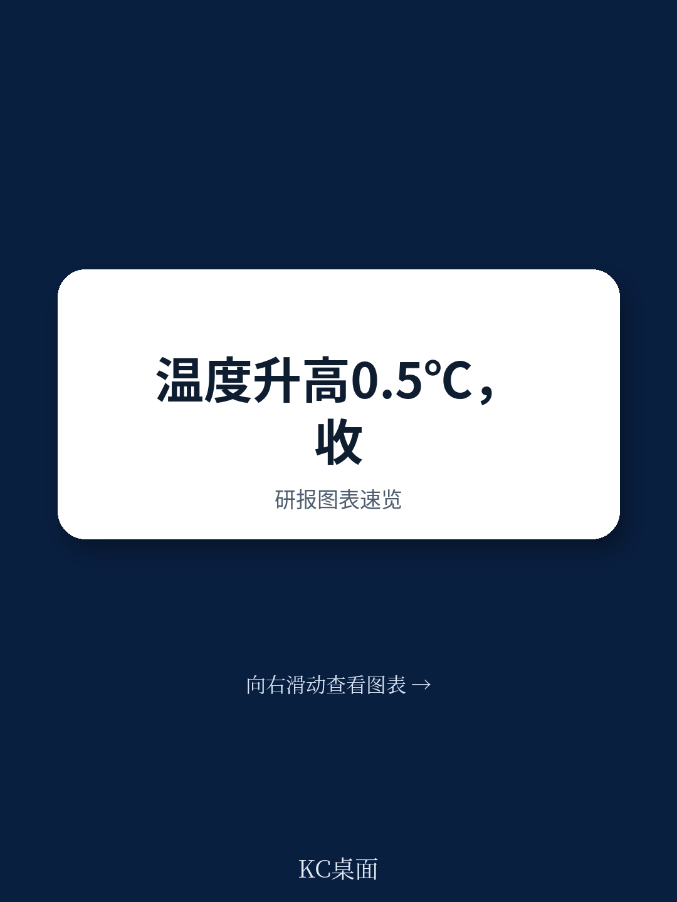
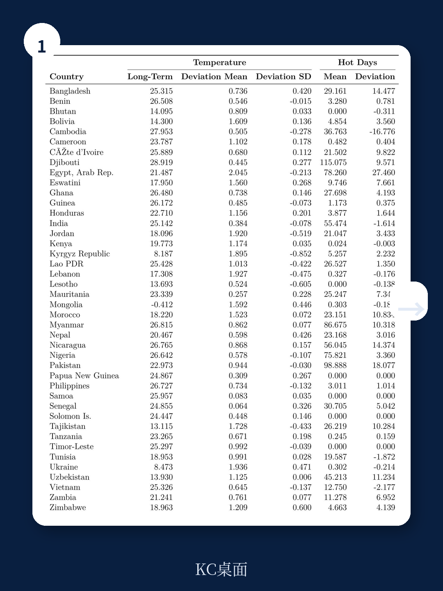
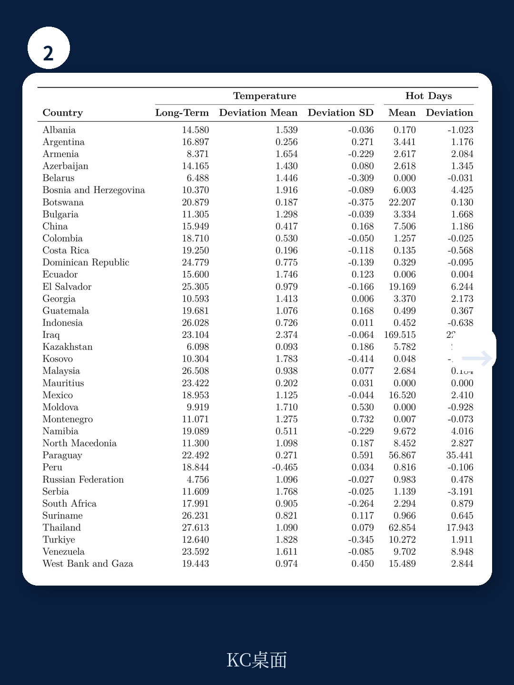

# 世界银行：气温每升高0.5度，中小企营收下降12%

气温上升对经济的影响，大多数讨论停留在宏观层面——GDP增速放缓、农业减产、能源需求上升。但世界银行这份覆盖134个国家、近16万家企业的微观研究，给出了一组更具体的数字：在低和低中收入国家，当年度平均气温比历史均值高出0.5摄氏度时，中小企业的营收下降12%。这个数字并不抽象。它意味着，对于一家年营收100万美元的制造企业，一次异常高温年份直接抹去12万美元的收入。更关键的是，这份研究回答了一个长期被忽视的问题：企业到底有没有在适应气候变化？答案令人不安——市场缺陷严重限制了企业的适应能力，尤其是在发展中国家。

这份报告的核心判断可以概括为一句话：气温上升对企业的冲击，不是均匀分布的，而是由企业的规模、所在国的收入水平、以及当地政策环境共同决定的。小企业、新创企业、以及面临融资约束和监管负担的企业，承受了不成比例的压力。而制造业和服务业受到的冲击同样显著，这意味着没有哪个部门可以幸免。

> **KC评论：** 0.5度听起来不大，但报告用的是“偏离历史均值”的概念。对于许多热带国家，基线温度已经在25-30度区间，再往上加0.5度，就进入了劳动生产率和设备效率显著下降的临界区。完整报告中有134个国家各自的历史温度偏差数据，你可以对照自己关注的区域，看看哪些国家已经进入了“危险区间”。

## 1. 中小企业是气温上升的最大受害者，大企业反而几乎没有影响

报告最核心的发现来自对温度响应函数的估计。研究团队将每家企业的地理位置与高分辨率卫星气象数据匹配，计算出该企业所在位置在报告财年内的平均温度与1980-2008年历史均值的偏差。然后将这个偏差与企业营收、劳动生产率、投资等指标建立非线性关系。

结果清晰得令人不安：在低和低中收入国家，中小企业的营收弹性约为-0.12，即温度每高出历史均值0.5度，营收下降12%。而大型企业——通常定义为员工超过100人的企业——其营收变化在统计上不显著。换句话说，大企业要么有更多的资源投资于适应措施（如空调、备用电源、灵活供应链），要么拥有更强的议价能力将成本转嫁给上下游。

这个差异在制造业和服务业中同样存在。报告特别指出，冲击的传导机制主要是劳动生产率的下降和工资的降低。当温度升高，工人的有效工作时间减少、效率下降，企业为了维持运营不得不支付更多加班费或招聘临时工，但最终仍表现为人均产出下降。而工资的下降则反映了劳动力市场对生产率下降的调整。

> **KC评论：** 这里有一个容易被忽略的细节：报告发现，即使是有空调的工厂，工人的效率仍然下降。原因是高温不仅影响体力劳动，也影响认知能力和决策质量。对于以知识密集型服务为主的企业，这意味着即使办公环境恒温，员工的外出、通勤、以及供应链上下游的效率损失同样会传导回来。完整报告中有专门一节讨论“热敏感行业”与非热敏感行业的差异，值得细看。

## 2. 收入水平是最大的“缓冲垫”，但政策环境才是真正的杠杆

报告另一个关键发现是：收入水平显著“压平”了温度-营收曲线。在高收入国家，温度偏离对企业的负面效应大幅减弱，甚至在某些情况下不显著。这并不令人意外——富裕国家有更多的资源投资于空调、建筑隔热、备用电力等适应措施。

但真正值得关注的是，报告通过企业层面的政策约束数据，揭示了为什么低收入国家的中小企业如此脆弱。研究团队利用世界银行企业调查中关于融资可得性、商业法规负担、以及安全状况的问卷数据，与温度偏差进行交互分析。结果发现：

- 面临融资约束的企业，其温度冲击效应比无融资约束的企业高出约40%。
- 在商业法规负担沉重的地区，企业适应成本显著上升，导致冲击效应更大。
- 不安全的环境（如犯罪率高、政治不稳定）进一步削弱了企业的适应能力。

这意味着，政策本身不仅是适应能力的“背景条件”，而是直接影响企业能否投资的变量。一家无法获得贷款的小企业，即使想购买空调或升级屋顶隔热，也无能为力。一项繁琐的施工许可审批流程，可能让企业推迟或放弃关键的基础设施改造。

> **KC评论：** 这份报告的独特价值在于，它把“政策约束”这个通常被归为制度经济学的问题，直接量化到了企业的营收损失上。如果你关注新兴市场的投资组合，完整报告中有一个非常实用的交互效应表格，列出了不同政策环境下的温度冲击弹性系数。它可以帮助你判断，哪些国家或行业在气候变暖趋势下可能面临更大的系统性风险。

## 3. 制造业和服务业同样脆弱，但传导机制不同

一个反直觉的发现是：制造业和服务业受到的温度冲击在统计上同样显著，且幅度相近。传统观点认为，制造业受高温影响更大，因为工厂设备需要冷却、工人体力劳动强度高。但报告显示，服务业企业的营收损失同样显著。

原因在于，服务业同样依赖劳动生产率。零售、餐饮、物流等行业的员工在高温下效率下降，顾客流量也可能减少。更重要的是，服务业的供应链同样脆弱——物流延迟、电力中断、以及供应商产能下降，都会传导到服务企业的成本端。

报告还发现，热敏感行业（如食品加工、交通运输、建筑）的冲击效应显著大于非热敏感行业，这为因果识别提供了支持。如果温度冲击只影响热敏感行业，而对非热敏感行业没有影响，那么就有更强的证据表明温度是原因，而不是其他未观察到的因素。

## 4. 报告尚未完全回答的关键问题：适应投资的动态成本与收益

尽管这份研究在实证设计上非常扎实，但它也留下了一些未解的问题。其中最核心的是：企业的适应投资是否具有“不可逆性”？

报告的实证策略本质上是在估计“短期冲击”的效应——即给定企业当前的技术和投资水平，温度偏离对其营收的影响。但企业是否会在连续几年的高温后调整投资？这种调整需要多长时间？成本有多高？报告没有完全展开。

例如，一家中小企业如果连续三年遭遇高温年份，它可能会决定投资空调系统。但这个决策涉及沉没成本——如果第四年温度回归正常，这笔投资就变成了浪费。这种“等待期权”的价值，在报告的分析框架中没有被充分模型化。

另一个未解问题是：适应投资是否具有规模门槛？报告发现大企业几乎不受温度影响，但这究竟是因为大企业有更多的资本储备，还是因为适应技术本身具有规模经济（例如，中央空调的单位成本远低于分体空调）？如果是后者，那么中小企业面临的可能不仅是融资约束，还有技术可及性的问题。

> **KC评论：** 这些问题在完整报告的“企业选址与适应投资”理论框架部分有更深入的讨论。报告用了一个简洁的模型来刻画企业的“赌博”行为——有些企业选择少投资、赌天气正常，有些企业选择多投资、确保无论天气如何都能正常运营。这个框架对于理解为什么同一行业、同一地区的企业表现差异巨大，非常有帮助。

## 5. 对决策者的观察框架：三个维度判断企业的气候韧性

基于报告的发现，可以提炼出一个简单的观察框架，用于评估特定企业或行业的“气候韧性”：

**第一，看规模。** 中小企业是温度冲击的最大受害者，大企业几乎免疫。这一条适用于几乎所有行业和国家。如果关注的是中小企业占主导的经济体（如大多数东南亚和非洲国家），那么气温上升对整体经济的拖累可能被系统性地低估。

**第二，看融资环境。** 报告的证据表明，融资约束是放大温度冲击的关键变量。如果一个国家的信贷市场不发达、中小企业贷款可得性低，那么即使该国的平均温度没有显著上升，一次极端高温年份也可能造成不成比例的经济损失。反之，改善融资可得性可能是最有效的适应政策之一。

**第三，看监管负担。** 商业法规的繁琐程度直接影响企业的适应投资决策。如果施工许可、设备采购、环保审批等流程过于复杂，企业可能干脆放弃适应投资，选择“硬扛”。这不仅是效率问题，更是一个气候风险管理的盲区。

这三个维度共同决定了企业的“有效适应能力”。报告的数据显示，在低收入国家，这三个维度往往同时恶化，形成恶性循环：融资难导致无法投资，监管繁导致不愿投资，安全差导致投资风险高。最终，企业陷入“不投资-更脆弱”的螺旋。

## 6. 为什么这份报告值得你花时间读完

这份世界银行的工作论文，其价值不仅在于它提供了全球最大规模的企业层面气候适应证据，更在于它把政策约束从“背景噪音”变成了“可量化的变量”。对于关注新兴市场投资的读者，它提供了一个新的风险定价维度：气温上升不再只是一个ESG议题，而是一个可以影响企业营收、进而影响资产定价的实变量。

报告中的134个国家温度偏差数据、按企业规模和收入水平分组的弹性系数、以及政策约束的交互效应表格，都是可以直接用于投资分析或政策建议的工具。这些内容在本文中只能点到为止，完整的图表和回归结果在原始报告中有详细的呈现。

如果你对以下问题感兴趣：哪些国家的企业面临最大的气候适应挑战？制造业和服务业的具体传导机制有何不同？企业层面的适应投资决策如何建模？那么，完整报告值得你花时间逐节阅读。

---

我们每天会由AI agent加人工review，生成一份国际投行和权威机构最新研报的中文摘要与KC评论，约10-40页，涵盖当天最新数据图表合集。既方便喂给AI进行二次分析，也方便人工快速把握全球市场的动态变化。如果你希望获取这份世界银行报告的完整解读、原始图表以及134个国家的温度偏差数据，欢迎加入社群，与我们一起持续跟踪这些关键信号。

Personal reading notes and learning share only. Not investment advice.

