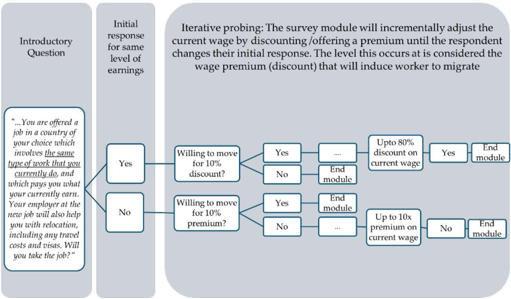
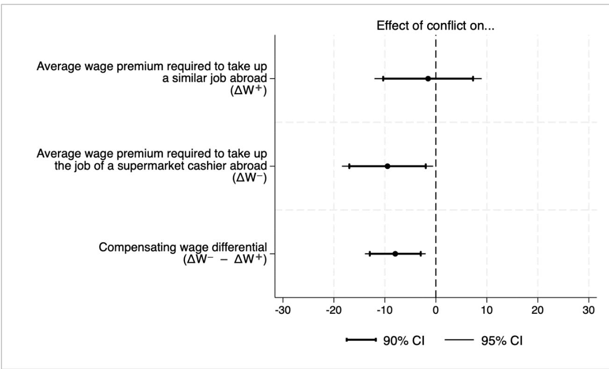

# From Conflict to Compromise

Experimental Evidence on Occupational Downgrading in Migration from Myanmar

Yashodhan Ghorpade

Muhammad Saad Imtiaz

POLICY RESEARCH WORKING PAPER 11075

## Abstract

This paper examines the relationship between violent conflict and the willingness of potential migrants to accept lower skilled work (occupational downgrading). The paper develops a theoretical model of migration decisions and tests it using an innovative survey module administered to high-skilled youth in Myanmar. Consistent with the predictions of the model, the findings show that insecurity induced by conflict reduces the additional wage premium that individuals would typically demand for taking on lower skilled work, indicating greater amenability to occupational downgrading. These effects are particularly pronounced for disadvantaged groups, such as women, ethnic minorities, and those with weaker labor market networks or English language skills. The results are driven by respondents from areas under territorial contestation, and those interviewed after the sudden activation of a conscription law during the survey. This further confirms how security considerations may override the preference for skill-appropriate job matching, suggesting that conflict may worsen labor market outcomes and reduce potential gains from migration, especially for disadvantaged groups.

# From Conflict to Compromise: Experimental Evidence on Occupational Downgrading in Migration from Myanmar

Yashodhan Ghorpade and Muhammad Saad Imtiaz

## 1. Introduction

International migration can lead to workers taking on jobs that they are overqualified for, a phenomenon known as occupational downgrading (Kossoudji and Cobb-Clark, 2000; Borjas, 2003; Eckstein and Weiss, 2004). This can have important consequences for both labor market and welfare outcomes, as it represents an underutilization of human capital, and can also have detrimental effects on individual wellbeing (Devillanova et al. 2024), further aggravating the stress that migrants may already face (Garcini et al. 2021). The occurrence of occupational downgrading is symptomatic of labor market imperfections, indicating the likely presence of search frictions, and job-skill mismatches (Akresh et al., 2008; Nikolov et al., 2022). These negative effects may often persist across generations (Achard, 2024).

The literature postulates that occupational downgrading may be observed in the early stages of migrant life, with the expectation that migrants over time assimilate better in the labor market by acquiring destination-specific human capital and eventually finding work better suited to their qualifications (Chiswick, 1978; Zorlu, 2016). However, empirical evidence on the persistence of occupational downgrading is more mixed. On the one hand, Cortes (2004) finds that while refugees in the U.S. initially earn less than natives and economic migrants, by investing in U.S.-specific skills they catch up after a period of 10 years. On the other hand, Borjas (2015) finds only a minimal (2.5 percent) rate of wage growth among a cohort of migrants in the U.S. despite the large initial wage disadvantage (of 27 percent). Bell and Johnson (2023) find little evidence of any labor market improvements among a panel of migrants from the time they initially arrive in the UK and experience substantial occupational downgrading. These workers remained at the lower end of the wage distribution throughout the duration of their stay in the UK. Brell et al. (2020) and Ruiz and Vargas-Silva (2018) find similar results on the persistence of downgrading effects on wages.

The persistence of occupational downgrading depends on several factors such as the initial level of migrants' qualifications, transferability of these skills to the destination country (Akresh, 2008; Adversario, 2020; Evans, 1999; Zorlu, 2016), legal restrictions (World Bank, 2025), language barriers (Akresh, 2008; Adversario, 2020; Nikolov et al., 2022), social networks (Adversario, 2020), cultural similarity between origin and destination (Chiswick et al. 2002; Duleep and Regets 1999; Zorlu, 2016), and gender (Nikolov et al., 2022; Ruiz and Vargas-Silva, 2018). Migrants who face greater barriers in accessing suitable labor market opportunities at destination due to these factors are more likely to experience more severe and persistent downgrading than those better placed to assimilate. Occupational downgrading can be particularly pronounced in the case of refugees (Brell et al., 2020; Zorlu, 2016; Nikolov et al., 2022). Unlike economic migrants who move to leverage spatial disparities in wages (i.e., earn higher wages for work they are qualified to perform), refugee movements are driven primarily by fears of persecution.

Traditional measurements of occupational downgrading tend to focus on migrants' labor market trajectories and outcomes at destination, i.e., after migration. The level of downgrading thus observed is the aggregate effect of factors that operate before, during, and after relocation, and therefore cannot be attributed to pre-departure conditions of the areas of origin alone. We document another driver of migrant occupational-downgrading which has not yet been studied in the literature, which is the willingness of migrants to accept occupational downgrading in the destination because of desperate conditions at home. In other words, conflict induces migration among a group of people who, absent conflict in the origin country, would not otherwise migrate if it resulted in occupational downgrading. Moreover, while occupational downgrading has been studied in several cases of pure economic migration (Akresh, 2008; Adversario, 2020; Nikolov et al., 2022; Chiswick et al. 2002; Duleep and Regets 1999; Ruiz and Vargas-Silva, 2018; Zorlu, 2016; Lebow, 2024), and to some extent among refugees (Brell et al., 2020; Zorlu, 2016; Nikolov et al., 2022), it has not been specifically examined in the context of economic migration from conflict-affected settings.

As the incidence of wars and violent conflict increases globally, $^{1}$ it gives rise not only to refugee movements, but also distress-induced economic migration on a large scale. The effects of the latter on labor market outcomes need to be understood better. For instance, little is known about how exposure to conflict in the country of origin affects migrants' choice of occupation and wages in a safer destination country. Understanding this gap in the literature is critical for both academic and policy objectives. From an academic perspective, measuring the trade-off between physical security and the utility derived from job suitability is imperative to understanding the fuller effects of conflict on economic (especially labor market) outcomes. From a policy standpoint, such analysis can help design suitable policies in destination and origin countries, that can minimize the extent of such downgrading, and therefore maximize the gains from migration for those fleeing hardship. Disaggregating these effects can also help identify which groups of migrants are more likely to experience occupational downgrading, and tailor policy interventions to their needs.

In this paper, we seek to fill some of these gaps in the literature to explain how exposure to conflict affects the likely extent of occupational downgrading among potential migrants. We zoom in on Myanmar, in the aftermath of a military coup and subsequent escalation in conflict, insecurity, and economic hardship. In doing so, we posit migrants' acceptance of occupational downgrading as a trade-off between security and economic wellbeing. By studying the preferences and choices of such individuals before they migrate, we focus on how conflict in the country of origin affects migrants' propensity to accept occupational downgrading. In addition to the literature on occupational downgrading in migration (Leuven and Oosterbeek, 2011; Dustmann and Preston, 2012; Dustmann, Frattini, and Preston, 2013; Lebow, 2024; Brell et al., 2020; Zorlu, 2016; Nikolov et al., 2022), this paper contributes to the wider literature on individual and household decision-making under conditions of violent conflict (Justino et al., 2013; Brück et al., 2014; Justino, 2009) and duress, more generally.

We employ an innovative method to measure migration intentions among high-skilled youth residing and working in Myanmar (and constituting a pool of potential migrants) by analyzing survey respondents' take-up of migration at different wage premia. We examine this for two hypothetical work scenarios; one involves work that is similar to the respondents' current occupation, and another that represents work that the respondent would be overqualified for. A higher premium is generally expected for the lower-skilled job, with the excess of the premium required to take up the lower-skilled job over that for a similar job representing a compensating wage differential (CWD). The CWD can be thought of as the monetary value that compensates a worker for the loss of utility from working on a relatively lower-skilled job and is therefore a measure of the amenability to occupational downgrading. A higher CWD indicates lower amenability to occupational downgrading. Our paper explores how exposure to violent conflict affects the compensating wage differential, and therefore the likelihood of accepting occupational downgrading.

We find that in line with economic theory on compensating wage differentials, respondents demand a 20-percentage point higher wage premium to accept a lower skilled job than they would for a similar job. However, exposure to conflict reduces this incremental premium, suggesting that potential migrants exposed to conflict are more willing to compromise on the suitability of work to their skills when considering work opportunities abroad. These results are stronger for women, ethnic and linguistic minorities, those who are underpaid, have experienced income reductions recently, and lack access to social networks for migration. We argue that political instability and uncertainty makes residents of conflict-affected areas desperate, and more willing to compromise on work suitability. We find suggestive evidence for this mechanism; the effects of conflict on the amenability to occupational downgrading are driven by subgroups that face bleaker prospects and uncertainty at home: those living in areas experiencing territorial contestation and those eligible for military conscription interviewed after the sudden enactment of a conscription law in Myanmar during the rollout of our survey.

Our results contribute to the understanding of migration decisions of people living in fragile and conflict affected countries, where security concerns heavily impress upon the economic calculations that determine migratory flows. They also highlight the challenges distressed economic migrants are likely to face even before they migrate, which in turn should inform policy to minimize hardship and maximize potential gains from migration.

The remainder of this paper is organized as follows: section 2 presents a theoretical model that relates conflict with occupational downgrading considerations; section 3 provides an overview of the study design and the measurement of occupational downgrading; section 4 describes the empirical setting and data sources; section 5 presents results; and section 6 concludes with a discussion of the findings and their implications.

## 2. Theoretical Motivation

Occupational downgrading may arise due to mechanisms that operate at different stages of the migration process. First, conditions before departure can determine the acceptance of occupational downgrading. Those residing in conflict-affected areas may perceive a trade-off between the physical safety at their destination and economic security at home. A fear of persecution or exposure to violence at home may compel them to compromise on earnings and the desirability of a job abroad; a trade-off that those residing in peaceful areas do not have to consider. The imminent consideration to escape violence may also prevent them from taking more time to research more suitable and adequately remunerative jobs abroad. Consequently, adverse conditions before departure may predispose individuals to accept occupational downgrading more readily. Second, the conditions during departure may be markedly different in the case of pure economic migrants viz. refugees or distressed migrants. Unlike the former, the latter categories of migrants may be unable to plan adequately before migrating. Refugee movements typically occur suddenly, whereby movers have limited choice over their destination, and restricted ability to assess jobs or wages, or even to make adequate arrangements for housing and employment before migrating. Conditions of urgent, swift, and insufficiently planned relocation may compel migrants to accept any available work, including jobs they are overqualified for. Finally, conditions after departure, pertaining to destination country policies may limit labor market opportunities. Migrants and especially refugees may not always have access to the legal right to work, or to adequate opportunities for suitable work, especially in camp settings. This puts pressure on them to take up any available job, including those that imply significant downgrading. In the remainder of this paper, we focus exclusively on the first mechanism; i.e. the role of pre-departure conditions in the country of origin (chiefly exposure to violent conflict) in determining the proclivity for occupational downgrading.

## 2.1 Modeling Migration Decisions

Individuals base their decision to move abroad for prospective work, largely driven by wage differentials. Batista and McKenzie (2023) suggest that an individual will migrate to take up a job abroad if the utility from wages and non-wage amenities of working abroad ( $V^{A}(W^{A})$ ) exceed the sum of utility from wages and non-wage amenities of working at home ( $V^{H}(W^{H})$ ) and the cost of migration (C):

$$
V ^ {A} (W ^ {A}) - V ^ {H} (W ^ {H}) > C
$$

We further propose that the utility a person derives from a potential job abroad ( $V^{A}$ ) likely depends not only on wages and non-wage amenities of working abroad ( $W^{A}$ ), but also on qualitative factors related to the nature of the work, such as the individual's perceived relative suitability for the position abroad ( $S^{A}$ ). The total utility that a worker finds abroad is therefore:

$$
V ^ {A} = U (W ^ {A}) + \gamma (S ^ {A})
$$

Where $U(W^{A})$ is the utility from wages and non-wage amenities, and $\gamma(S^{A})$ is the additional utility a worker enjoys from the relative suitability of the prospective job abroad, assumed independent of the former. We conjecture that generally individuals derive higher total utility from work that they perceive is more suitable to them $\left(\frac{\partial\gamma(S^{A})}{\partial S}>0\right)$ . If $\Delta W$ is some wage premium added to the wage earned abroad. Then $\Delta\overline{W}$ is the break-even wage premium, one that makes the individual indifferent between staying home and moving abroad. This indifference condition is given by:

$$
V ^ {A} (W ^ {A} + \Delta \overline {{W}}) = V ^ {H} (W ^ {H}) + C
$$

Solving for $\Delta\overline{W}$ gets us this break-even wage premium over the wage abroad, such that it makes a prospective migrant indifferent between remaining home and migrating abroad: $^{2}$

$$
\Delta \overline {{W}} = \frac {V ^ {H} + C - V ^ {A}}{V ^ {A ^ {\prime}}}
$$

Where $V^{A'}$ measures how utility abroad changes with respect to wages abroad.

## 2.1.1 Compensating Wage Differential

Let $A^{+}$ represent a job abroad that is relatively more suitable to a prospective migrant, perhaps because it is similar in nature to the job at home and let A- represent a less suitable job, perhaps one the individual is overqualified for. We define the compensating wage differential, $\Delta\overline{W}^{D}$ , as the difference between the wage premiums required for the less suitable job, A-, and the more suitable job, $A^{+}$ , which will be given as: $^{3}$

$$
\Delta \overline {{W}} ^ {D} = \Delta \overline {{W}} ^ {-} - \Delta \overline {{W}} ^ {+} = \frac {\gamma (S ^ {A +}) - \gamma (S ^ {A -})}{V ^ {A ^ {\prime}}}
$$

The above expression shows that the compensating wage differential constitutes the loss of utility from job suitability – how much a worker seeks to offset the mismatch of being in a less suitable job by demanding a higher wage premium. Since $\gamma(S^{A+}) > \gamma(S^{A-})$ , we hypothesize:

$$
\Delta \bar {W} ^ {D} > 0
$$

[Hypothesis 1]

As long as a worker derives positive utility from job suitability ( $\frac{\partial\gamma(S^{A})}{\partial S}>0$ ), the break-even wage premium for a less suitable job will likely be higher, resulting in a positive compensating wage differential.

## 2.1.2 The Effects of Conflict

In the presence of adverse conditions at home such as ongoing conflict (F), we argue that an individual's utility depends relatively lesser on wages and job suitability and more on the risks to life, property, and psychological wellbeing. This shift varies continuously with changing conflict, as outlined in the framework that we introduce below. The new utility at home and abroad, in the presence of conflict, are given by:

$$
V ^ {H} (W ^ {H}, F) = U (W ^ {H}) - \psi (F) R ^ {H} (F)
$$

$$
\begin{array}{c} \text {and} \\ V ^ {A} (W ^ {A}, S ^ {A}, F) = (1 - \psi (F)) [ U (W ^ {A}) + \gamma (S ^ {A}) ] \end{array}
$$

Where $-R^{H}(F)$ is the disutility at home due to threat of conflict (F), and $\psi(F) \in [0,1]$ represents the individual's exposure to conflict, with $\psi(F) \to 1$ suggesting that as conflict intensifies, the individual's utility decreases. The term $(1-\psi)$ shows the decreasing weight individuals place on the economic utility of work abroad (e.g., wages and job suitability) as conflict intensity increases at home. This is based on the assumption that as conflict increases, individuals will prioritize minimizing threats to life and property over economic considerations such as wages because survival and safety are now the main motivators under intensified conflict. It also follows that when F = 0 (i.e. in no-conflict areas), the individual's utility depends entirely on wages and job suitability. As conflict escalates, wages and job suitability abroad become less important in determining overall utility. Reflecting these changes, the break-even wage premium in the presence of conflict is given as:

$$
\Delta \bar {W} (F) = \frac {U (W ^ {H}) - \psi (F) R ^ {H} (F) + C - (1 - \psi (F)) [ U (W ^ {A}) + \gamma (S ^ {A}) ]}{V ^ {A ^ {\prime}}}
$$

As long as the threat of conflict $R^{H}(F)$ is substantial, rising conflict (F) will start to reduce the break-even wage premium $(\frac{\partial\Delta\overline{W}(F)}{\partial F}<0)^{4}$ . Further, the compensating wage differential in the presence of conflict at home is given by:

$$
\Delta \overline {{W}} ^ {D} (F) = \left(1 - \psi (F)\right) \Delta \overline {{W}} ^ {D} (F _ {= 0})
$$

Where $\Delta\overline{W}^{D}(F_{=0})$ is the compensating wage differential when there is no conflict at home. (F) increases, $\Delta\overline{W}^{D}(F)$ attenuates towards zero, suggesting that the individual values the utility from job suitability less and becomes relatively indifferent between the two jobs: $^{5}$

$$
\frac {\partial \Delta \overline {{W}} ^ {D} (F)}{\partial F} <   0 \text { and } \lim _ {F \rightarrow \infty} \Delta \overline {{W}} ^ {D} (F) = 0
$$

[Hypothesis 2]

## 3. Study Design

This paper is set against the backdrop of the military takeover of the Government of Myanmar since 2021, which was followed by high levels of violent conflict and economic slowdown. We explore the factors prompting high-skilled youth to migrate abroad for work in such a setting, specifically for comparing the potential uptake of lower skilled work with that of skillappropriate work. As the economic and security outlook in Myanmar worsens, opportunities abroad may appear more appealing, and the hesitation to perform work that one is overqualified for may reduce. To quantify such amenability to occupational downgrading, we first calculate the wage premium that workers are willing to accept for hypothetical jobs abroad that are similar to their current occupation in Myanmar, and then for a hypothetical job abroad for which they are likely overqualified. The difference between the two is treated as a measure of the amenability to occupational downgrading. We then examine how exposure to conflict affects respondents' amenability to occupational downgrading.

## 3.1 Measuring the Willingness to Migrate

Our primary data sources are two iterative modules in a CATI based questionnaire. The first module opens with the following hypothetical scenario and follow up questions: "Imagine a situation: You are offered a job in a country of your choice $^{6}$ which involves the same type of work that you currently do, and which pays you what your currently earn. Your employer at the new job will also help you with relocation, including any travel costs and visas. Will you take the job?" Respondents are expected to respond with a simple "yes" or "no" regarding their willingness to migrate with the intention of taking a job that entails similar type of work. By eliminating moving costs and logistical frictions in the scenario, we aim to focus exclusively on the role of wages in influencing their decision to migrate.

Figure 1. Iterative module to measure willingness to migrate (similar type of work)  

The flow of the module is detailed in Figure 1. For a respondent who refuses to migrate abroad at their current wage level, we follow up by asking if they would now reconsider under a hypothetical 10 percent wage increase to their existing wage in Myanmar. If they now switch their original answer and indicate a willingness to migrate at this new wage level, the module concludes. For such a respondent, we record the break-even wage at a 10 percent premium of the current wage. However, if the respondent remains unwilling, we incrementally increase the hypothetical wage by intervals of 20%, 30%, 50%, and so on, up to more than ten times their current earnings, and similarly record the break-even wage as the level at which the respondent switches their original answer. For respondents who remain unwilling leading up to the final iteration, they are then given the option to indicate that they will not migrate no matter the increase in wages, before proceeding to the next module.

In contrast, for respondents who agree to migrate at their current wage level in the opening question of the module, we instead follow up by asking whether they would still be willing to migrate if their current wage were reduced by 10 percent. If they change their response to “no”, the module ends, and we record their break-even wage as 10 percent below their current wage (or a negative 10 percent premium). For a respondent who is willing to migrate even with a 10 percent discount, the subsequent iterations propose deeper cuts to their existing wage — 20%, 30%, 50%, and so on — up to 80% their current earnings, with the break-even discount identified as the level at which the respondent would switch their original answer from a “yes” to a “no.” For respondents who will be willing to migrate for a wage discount as deep as 80%, we assume, the break-even wage discount is 90% (or a negative 90 percent premium), before ending the module. At the end of the module, we measure the value respondents associate with migration in terms of the migration-inducing wage premium, as described above (Wage Premium 1).

The second iterative module mirrors that of the first, with one key difference in the type of hypothetical job abroad the respondent is asked to consider. This is indicated by a slightly different wording of the question from the preceding one: "Imagine a situation: You are offered a job in a country of your choice as a cashier in a supermarket, and which pays you what your currently earn. Your employer at the new job will also help you with relocation, including any travel costs and visas. Will you take the job?" [emphasis added] This allows us to capture the decision dynamics of a high-skilled youth respondent, similar to the ones in the first module, but now in relation to a job they may be overqualified for. Analogous to the first question, this allows us to compute the migration-inducing wage premium, this time for the job of a supermarket cashier (Wage Premium 2). $^{7}$ The excess of Wage Premium 2 over Wage Premium 1 is our measure of the compensating wage differential (CWD) for working as (an overqualified) supermarket cashier, which in turn indicates the respondents' amenability to occupational downgrading.

## 4. Empirical Setting and Data

## 4.1 Empirical Setting

Myanmar has faced several crises in recent years. Following the military coup in February 2021, the country has experienced a severe economic downturn and domestic unrest. The country's GDP is still $10\%$ below pre-pandemic levels and a third of the population has slipped below the poverty line. The country's economic prospects remain bleak; the World Bank projects a continuation of slow growth, rising unemployment and inflation linked to the depreciation of the domestic currency (World Bank 2024a). Violent conflict in the country, which escalated since the military takeover, continued to rise through 2024, fueling both internal displacement and forced migration outside the borders. It is estimated that $18.5\%$ of the country's population has either voluntarily migrated or was forcibly displaced between December 2021 and June 2023 (MAPSA 2024), though this is likely to comprise overwhelmingly of individuals with less than tertiary education who typically migrate to Thailand (World Bank 2024b). This intersection of pervasive economic hardship (World Bank 2024 a, b), high levels of conflict, and insecurity (ACLED 2024), and the long-standing salience of international migration in livelihood considerations of skilled youth (World Bank 2018), allows us to study how potential migrants factor conflict and instability into their migration and occupational choice decisions.

## 4.2 Data

Our analysis is based on data from a primary phone-based survey of high-skilled youth living and working in Myanmar that we conducted between January and April 2024. The sample consists of 2,400 respondents, sampled from a representative panel of over 300,000 households maintained by a prominent local survey firm. To be included in the sample, potential respondents had to meet three conditions: be between 20 and 45 years of age, hold at least a bachelor's degree or equivalent, and be currently employed and living in Myanmar. Interviews were conducted on the telephone and typically lasted 20 to 25 minutes. $^{8}$ We ensure adequate representation of all states, and the final distribution of states in the sample closely mirrors that of actual employed graduates in Myanmar. $^{9}$ This dataset is combined with secondary data on the township (admin-4)-level exposure to violent conflict collated from the Armed Conflict Location and Event Data (ACLED). $^{10}$

Annex 1 shows detailed descriptive statistics on our sample. A majority of the respondents of the respondents in the final sample are female (61%), with an overall average age of approximately 31 (SD = 5.83). Most respondents are not married (62%), and only 29% have children, suggesting that our sample is largely composed of young individuals with limited familial responsibilities. The highest educational attainment of an overwhelming majority (94%) is a bachelor's degree, though a few have vocational diplomas (3%). The average monthly income is around \$118 (compared to the national average of \$51.58), and respondents generally felt they were slightly underpaid relative to their qualifications (by five percentage points).

Approximately half of the respondents expressed willingness to migrate abroad, even though only 19% possess valid passports, and just 10% meet the criteria for migration readiness (i.e. possessing a passport, having savings or assets that can finance a move, and having any kind of social network that can help them find a job). In line with the broader challenging conditions in Myanmar, more than half of the sample reported experiencing employment disruptions, with 36% reporting a decline in wages. Moreover, the average respondent has moderate exposure to conflict, with an average of 39 conflict-related fatalities occurring in their township over the year leading up to the survey.

## 5. Results

## 5.1 Descriptive Results

Table 1 shows the mean wage premium for which the respondent is willing to move abroad for a similar job (column 1) and for the job of a supermarket cashier (column 2). The additional premium demanded to take on the job of supermarket cashier is indicated in percentage points in column 3, while column 4 reports differences between sub-groups. Overall, we see that respondents would demand about a 175-percentage points premium over their current earnings to take up a similar job, but a slightly higher premium of 192 percent (16.5 percentage points, or 9.4 percent) to work abroad as a supermarket cashier. This confirms hypothesis (1) in section 2 which posited that only a positive wage differential will induce the uptake of a job less suited to the individual's qualifications. The compensating wage differential for taking on lesser skilled work is especially high among those in occupations that are high-skilled (comprising managers and professionals), very different from that of a supermarket cashier (as indicated by the ISCO 1-digit classification), and low in routine task intensity. The additional wage premia required for a lower skilled job does not appear to vary by gender, marital status, or by whether respondents have children. Importantly, respondents in low conflict areas demand a considerably higher premium to work as a cashier than those in high-conflict areas.

Table 1. Mean Wage premium required to induce move abroad

<table><tr><td></td><td>(1)Similar job</td><td>(2)Supermarket Cashier</td><td>(3)Difference (2) - (1)</td><td>(4)Within-category Δ</td></tr><tr><td>Full Sample</td><td>171.06</td><td>191.75</td><td>20.7***</td><td>-</td></tr><tr><td>Men</td><td>168.87</td><td>186.93</td><td>18.06*</td><td rowspan="2">-4.42</td></tr><tr><td>Women</td><td>172.54</td><td>195.02</td><td>22.48***</td></tr><tr><td>Married</td><td>185.58</td><td>209.63</td><td>24.06***</td><td rowspan="2">5.3</td></tr><tr><td>Not married</td><td>162.68</td><td>181.44</td><td>18.76***</td></tr><tr><td>Has children</td><td>194.29</td><td>213.75</td><td>19.46*</td><td rowspan="2">-1.7</td></tr><tr><td>Does not have children</td><td>162.38</td><td>183.54</td><td>21.16***</td></tr><tr><td>Employee or intern</td><td>181.00</td><td>203.79</td><td>22.79***</td><td rowspan="2">6.11</td></tr><tr><td>Employers and self-employed</td><td>151.93</td><td>168.61</td><td>16.68*</td></tr><tr><td>Managers and professionals</td><td>161.20</td><td>209.61</td><td>48.41***</td><td rowspan="2">36.98***</td></tr><tr><td>Mid and low skilled occupations</td><td>174.35</td><td>185.79</td><td>11.43*</td></tr><tr><td>ISCO code 5 (occupation is similar to a cashier)</td><td>136.38</td><td>136.36</td><td>-0.02</td><td rowspan="2">-28.84***</td></tr><tr><td>Other ISCO codes</td><td>184.65</td><td>213.47</td><td>28.82***</td></tr><tr><td>Low routine task intensity(RTI ≤ median)</td><td>157.12</td><td>187.59</td><td>30.47***</td><td rowspan="2">19.98**</td></tr><tr><td>High routine task intensity (RTI &gt; median)</td><td>189.48</td><td>199.97</td><td>10.5</td></tr><tr><td>Low conflict exposure (≤ median events in 1 year)</td><td>187.60</td><td>220.76</td><td>33.15***</td><td rowspan="2">25.4**</td></tr><tr><td>High conflict exposure (&gt; median events in 1 year)</td><td>153.87</td><td>161.63</td><td>7.76</td></tr><tr><td>Low conflict exposure (≤ median fatalities in 1 year)</td><td>171.69</td><td>200.68</td><td>28.98***</td><td rowspan="2">17.4</td></tr><tr><td>High conflict exposure (&gt; median fatalities in 1 year)</td><td>170.36</td><td>181.95</td><td>11.59</td></tr></table>

## 5.2 Econometric Results

## 5.2.1 OLS Estimation

We estimate a simple model to identify the effect of exposure to conflict on the wage premium required to take on a job similar to the respondent's current occupation abroad, given by:

$$
W _ {i j s} = \alpha_ {1} + \beta_ {1} F _ {j} + \beta_ {2} X _ {i} + \varepsilon_ {1 i j}
$$

... Equation 1

W is the wage premium required by individual i in township j to move abroad for a job s that is similar to her current occupation. F is the measure of exposure to fatalities in conflict in the township of residence in the year preceding the survey. X is the matrix of individual controls comprising demographic and labor market characteristics, including the sector and occupation of work and the field of study in tertiary education. We can similarly estimate Equation (2) that identifies the effect of exposure to conflict on the wage premium required to take on a lower-skilled job $l$ (i.e. that of a supermarket cashier) viz. the respondent's current occupation abroad:

$$
W _ {i j l} = \alpha_ {2} + \gamma_ {1} F _ {j} + \gamma_ {2} X _ {i} + \varepsilon_ {2 i j}
$$

... Equation 2

(2) - (1) gives us

$$
C W D _ {i j} = \alpha_ {3} + \theta_ {1} F _ {j} + \theta_ {2} X _ {i} + \varepsilon_ {3 i j}
$$

... Equation 3

Where CWD is the compensating wage differential for individual i in township j to work as a supermarket cashier abroad (instead of working in a job similar to the individual's current occupation abroad). Table 2 presents the results of the OLS regression used to estimate $\beta_{1},\gamma_{1}$ and $\theta_{1}$ from the regressions represented by equations 1 - 3, respectively.

Table 2. Effect of Conflict on Compensating Wage Differential for Work abroad (OLS estimates)

<table><tr><td></td><td>Job: Similar to Current Job (Equation 1)</td><td>Job: Supermarket Cashier (Equation 2)</td><td>Compensating Wage Differential (Equation 3)</td></tr><tr><td>Conflict Fatalities in Township log (1+n)</td><td>-1.519(5.336)</td><td>-9.478**(4.540)</td><td>-7.959***(3.024)</td></tr><tr><td>R-squared</td><td>0.062</td><td>0.064</td><td>0.046</td></tr><tr><td>ymean</td><td>171.8</td><td>191.6</td><td>19.8</td></tr><tr><td>|Coeff. | / Mean (%)</td><td>0.88%</td><td>5%</td><td>40%</td></tr><tr><td>N</td><td>1630</td><td>1630</td><td>1630</td></tr></table>

Standard errors clustered at the township level in parentheses. Controls include individual demographic and labor market characteristics including occupation, sector of employment, and field of study.

\* p < 0.10, \*\* p < 0.05, \*\*\* p < 0.01

We find that conflict has no statistically significant association with the wage premium required to take on a similar job abroad but had a negative effect on that for a lower skilled job. It also has a significant, negative, and relatively large effect on the compensating wage differential for lower-skilled work, that is robust to controlling for demographic and labor market characteristics. In the specification shown in column 3, a 1 percent increase in conflict reduces the additional wage premium required for taking on lower-skilled work ( $\theta_{1}$ ) by almost 8 percentage points, representing an effect size of 40 percent relative to the mean CWD. Taken together, these results suggest that while conflict does not appear to influence the wage premium potential migrants demand for job similar to their current job, it makes them more amenable to compromise on the nature of work, specifically, the extent to which work is skill-appropriate. This supports the intuition proposed in hypothesis (2) in section 2 which posits that conflict, or other similar adverse circumstances at home, will reduce the compensating wage differential demanded for taking on less suitable work. $^{[11]}$ Economic agents under duress, such as potentially high-skilled migrants facing adverse circumstances like conflict, begin to place less value on job suitability. As the threat from conflict intensifies and safety takes on the primary consideration for migration, the wage premium demanded for a less suitable job, such as a cashier in a supermarket, declines sharply. This shows that the utility associated with a better job match is outweighed by the growing disutility of deteriorating conditions at home. Concurrently, conflict does not appear to alter the overall valuation of migration in wage terms, as reflected in the statistically insignificant coefficient for the similar job. Figure 2 depicts the estimates for $\beta_{1}, \gamma_{1}$ and $\theta_{1}$ respectively. For the remainder of the paper, we focus on the effect of conflict on the Compensating Wage Differential, as indicated in Equation 3.

Figure 2. Effect of conflict on average wage premium over current earnings acceptable to take up a job abroad  
  
5.2.2 Instrumental Variables Estimation

We employ Instrumental Variables (IV) estimation to overcome any potential endogeneity issues between conflict exposure and the respondents' willingness to accept occupational downgrading as measured by the CWD. Endogeneity may potentially arise from unobservable omitted variables that simultaneously affect exposure to conflict and the amenability to occupational downgrading in migration. To address these concerns and check the robustness of our results in section 5.2.1, we use (combinations of) two separate instruments: the average altitude of the township's territory, and the historical share of the adult population in the township without any national ID card. $^{12}$

Altitude plays a crucial role in Myanmar's current conflict as higher altitude allows armed groups strategic advantage for both greater resistance and offense against the military. As such, areas of higher elevation offer tactical advantage for guerrilla warfare, allowing longer drawn-out battles and fighting compared to flatter areas where military presence and control faces lesser resistance. According to a detailed report on subnational conflict in Myanmar, “A clear correlation between altitude and subnational conflict is revealed when elevation and conflict data are overlaid ... Armed clashes and EAOs (Ethnic Armed Organizations) are most prevalent in highly mountainous townships, where the guerilla tactics that many EAOs adopt tend to be more effective, and where EAOs are able to maintain close relationships with the local population. In most lower and typically flatter terrain, the Tatmadaw (National Army) dominates militarily, and the central state has been able to expand its authority.” (The Asia Foundation, 2017, pp.11) Altitude therefore serves as a potentially good IV because it is positively correlated with more intense violence. More importantly, we believe that altitude does not directly affect the respondent's CWD and therefore fulfills the exclusion restriction. Further, we control for human capital (level and field of study in education) and labor market characteristics (sector and occupation of employment). While we expect a linear correlation between altitude (measured in meters above sea level) and conflict exposure at the township level to be positive, we also consider that a non-linear relationship may be more precise as fighting may be both difficult and less valuable at very high altitudes. We therefore propose two specifications for altitude as an IV: linear and quadratic.

Our alternate IV draws on the centrality of ethnicity in citizenship, disaffection, and conflict in Myanmar. Myanmar's 1982 Citizenship Law lays the foundation for differentiated citizenship and recognition of peoples' rights by invoking the notion of 135 'national races' that are believed to have resided in Myanmar before 1823, the year of the First Anglo-Burmese War that marked the arrival of the British in Burma (Simpson, Holliday, and Farrelly, 2018). However, the law is often described as installing three differentiated levels of citizenship - citizen by birth or descent, associate citizen and naturalized citizen, each accompanied by their own type of National Identity (ID) card (officially called "Citizenship Scrutiny Cards"), based on ethnic identity. Although Myanmar's laws technically allow individuals who are not part of these 'national races' to attain full citizenship by descent after three generations, discrimination against the most marginalized ethnic groups often prevents this in practice. A large section of the Myanmar population (around 11 million $^{13}$ of the country's 54 million population) experiences a de facto denial of citizenship rights as they do not fall under any of the three categories of citizenship and do not have any national ID cards (ICG 2020). $^{14}$ High concentrations of people without national IDs would indicate the presence of marginalized ethnic groups, especially those that face greater disaffection compared to other ethnic groups that are recognized under the Citizenship Law. Such exclusion breeds disaffection and hostility, leading observers to note that “armed conflict in Myanmar can be seen as the militarization of ethnicity” (ICG 2020).

We therefore use the township-level share of the population without a national ID card in 2014 as a proxy of the presence (and strength) of disaffected and disenfranchised ethnic minorities, and therefore as an IV for conflict. While the presence of disenfranchised ethnic minorities is positively correlated with conflict, when using it as an IV we need to be careful also about any direct effects that living in an area with a larger share of disenfranchised ethnic minorities may have on respondents' amenability to occupational downgrading. This may be the case when respondents themselves belong to such groups and are more amenable to occupational downgrading because of their minority status (which may reduce their social standing, and access to jobs in Myanmar due to discrimination) rather than because of conflict. To overcome this limitation and to ensure that the IV does not violate the exclusion restriction in such a way, we repeat the IV estimation only for respondents from the majority (Bamar and Buddhist) group so that IV estimates may be treated as causal effects of conflict rather than indicative of any direct association of the IV with respondents' rights and employment opportunities in Myanmar, which affect the relative attractiveness of potential employment options abroad. The implicit assumption is that members of the Bamar ethnicity almost always have national ID cards themselves, which is rather likely given the “institutionalized dominance” of the Bamar (Walton, 2012) in Myanmar society and its Citizenship Law. We use data from 2014 on the township-level share of the adult population without national ID cards, included in Township Profiles prepared by the General Administration Department under the Government of Myanmar in 2016, and accessed online through the Myanmar Information Management Unit. $^{15}$

Recall equation (3) that estimates the effect of exposure to fatal conflict on the CWD using an OLS specification:

$$
C W D _ {i j} = \alpha_ {3} + \theta_ {1} F _ {j} + \theta_ {2} X _ {i} + \varepsilon_ {3 i j}
$$

... Equation 3

The IV first stage equation is given by:

$$
F _ {i j} = \alpha_ {4} + \varnothing_ {1} Z _ {j} + \varnothing_ {2} X _ {i} + \omega_ {i j}
$$

... Equation 4

Where Z is the Instrumental Variable (elevation, or share of population without national ID cards, or their combination) for township j. The IV second stage equation is given by Equation 5 below in which now depicts the causal effect of conflict F on CWD:

$$
C W D _ {i j} = \alpha_ {5} + \theta_ {1} ^ {\prime} \hat {F} _ {j} + \theta_ {2} ^ {\prime} X _ {i} + \varepsilon_ {r 3 i j}
$$

... Equation 5

Table 3 shows the coefficients of exposure to conflict on the compensating wage differential using IV estimation. The coefficients are statistically significant and slightly larger in magnitude compared to the OLS estimates across all specifications and combinations of the two IVs. Annex 3 also confirms that estimates using township share of persons without national IDs as the IV hold even when estimated separately for the subsample of Bamar ethnicity respondents who are very likely to possess national ID cards themselves.

Table 3. Effect of Conflict on Compensating Wage Differential for Work abroad (IV estimates)

<table><tr><td rowspan="2"></td><td colspan="5">Dependent Variable: Compensating Wage Differential (Equation 5)</td></tr><tr><td>(1)</td><td>(2)</td><td>(3)</td><td>(4)</td><td>(5)</td></tr><tr><td rowspan="2">Conflict Fatalities in Township log (1+n)</td><td>-31.095**</td><td>-21.977*</td><td>-35.734*</td><td>-33.458***</td><td>-25.872***</td></tr><tr><td>(14.599)</td><td>(11.498)</td><td>(20.839)</td><td>(12.002)</td><td>(9.290)</td></tr><tr><td colspan="6">Instrumental Variable</td></tr><tr><td rowspan="2">Altitude Altitude (quadratic) % township population without National ID Card</td><td>X</td><td>X</td><td></td><td>X</td><td>X</td></tr><tr><td></td><td></td><td>X</td><td>X</td><td>X</td></tr><tr><td>No. of clusters (townships)</td><td>220</td><td>220</td><td>220</td><td>220</td><td>220</td></tr><tr><td>Cragg-Donald Wald F statistic (IV 1ststage)</td><td>37.42</td><td>53.44</td><td>38.91</td><td>40.29</td><td>50.18</td></tr><tr><td>N</td><td>1630</td><td>1630</td><td>1630</td><td>1630</td><td>1630</td></tr><tr><td colspan="6">Standard errors clustered at the township level in parentheses. Controls include individual demographic and labor market characteristics including occupation, sector of employment, and field of study.</td></tr></table>

^ Preferred specification  
\* $p < {0.10},{}^{* * }p < {0.05},{}^{* *  * }p < {0.01}$ . See Annex 3 for IV first stage statistics

## 5.3 Heterogeneous Effects: By Individual and Household Characteristics

We examine the effects of conflict on the CWD across different subgroups of the population, by demographic, labor market and household characteristics. The effects are stronger among women, ethnic and linguistic minorities, those who experienced income reductions in the past year or believe they are underpaid relative to peers, those with weaker spoken and written English language skills, higher-skilled occupations (managers and professionals), and those without family experience of or access to social networks for migration (Annex 4). Following the literature discussed in section 1, this suggests that those most likely to experience occupational downgrading in regular settings (disadvantaged groups that lack social networks, or the skills valued at destination) are in fact also more amenable to occupational downgrading on account of conflict. Exposure to conflict exacerbates the disadvantages such groups face when migrating, thereby reducing potential gains from migration through inferior job matching and downgrading. Interestingly, while individual characteristics mediate the effects of conflict on the likelihood of downgrading, characteristics such as household income (levels/ sufficiency) or family indebtedness do not appear to have such effects.

## 5.4 Mechanism: The Role of Insecurity

We posit that insecurity at home weighs heavily on individuals' considerations when deciding on migration options and specifically on the relative weight they place on the suitability of a job to their skills. This is outlined in the theoretical model presented in section 2.1 where we show that as exposure to conflict increases, the individual values the utility from job suitability less, in large part because they value the security offered at destination relatively more than job suitability compared to when making such a choice in a more peaceful home setting. If this is true, it would follow that the effect of violence would be driven mainly by its effect in exacerbating insecurity at home, and that effects on the CWD are greater in settings of greater insecurity. We examine the effects discussed thus far under alternate scenarios of insecurity. First, we disaggregate results by the nature of territorial control in the respondents' township during the survey period, hypothesizing that areas under active contestation represent greater insecurity than areas that are firmly under the control of military or rebel/ resistance forces. We then exploit an exogenous announcement of military conscription during the survey period, hypothesizing that among those who would be eligible for conscription, those interviewed after the sudden announcement of conscription experienced greater insecurity because of a marked increase in the threat of being drafted to fight and face mortal danger, compared to those who were interviewed before the announcement. In other words, the sudden announcement of the Conscription Law dramatically increased perceived insecurity among respondents eligible for conscription.

## 5.4.1 Insecurity through the Nature of Territorial Control

The negative effects of conflict on the CWD appear to be driven by areas under contestation; the effect is neither negative nor significant in areas under the firm control of either the military or resistance actors (Table 4). Conflict in territories where control is contested could reflect the presence of increased political uncertainty and therefore exacerbate the disutility faced by people on account of adverse circumstances at home (referred to as $-R^{H}(F)$ in section 2.1.2). Individuals facing conflict and contestation at home may be more willing to compromise on the suitability of work for their skill-level to live in a more secure setting abroad.

Table 4. Effect of Conflict on Compensating Wage Differential for Lower-skilled Work Abroad, by Type of Territorial Control $^{16}$ (OLS estimates)

<table><tr><td></td><td>(1) Military Control</td><td>(2) Contested</td><td>(3) Resistance Control</td></tr><tr><td rowspan="2">Conflict Fatalities in Township log (1+n)</td><td>11.066</td><td>-8.919**</td><td>13.669</td></tr><tr><td>(10.845)</td><td>(4.210)</td><td>(29.450)</td></tr><tr><td>N</td><td>625</td><td>847</td><td>158</td></tr></table>

Standard errors clustered at the township level in parentheses.  
For equivalent regression output table using IV estimation, see Annex Table A3.3.  
\* p < 0.10, \*\* p < 0.05, \*\*\* p < 0.01  
5.4.2 Insecurity through Activation of Military Conscription Law

Our survey coincided with the sudden enaction of a dormant law enforcing military conscription among youth. Although the law had been originally passed in November 2010, $^{17}$ it was never enacted until an unexpected announcement on the evening of February 10, 2024. Men aged 18 to 35 and unmarried women aged 18 to 27 were eligible to be drafted into the military, with an initial declared target of 60,000 new recruits. For those with specialized / professional qualifications (i.e. university or higher education), the eligibility threshold age bands were 18 to 45 for men and 18 to 35 for women, respectively. $^{18}$ The latter criteria overlap considerably with our sample, and therefore allow us to test the effects of an unanticipated exogenous shock that would plausibly and substantially alter respondents' valuations of wellbeing at home and abroad.

Table 5. Effect of Conflict on Compensating Wage Differential for Lower-skilled Work Abroad, by individual eligibility status for conscription and timing of survey (OLS estimates)

<table><tr><td rowspan="2"></td><td colspan="2">Not Eligible for Conscription</td><td colspan="2">Eligible for Conscription</td></tr><tr><td>Before Conscription Announcement</td><td>After Conscription Announcement</td><td>Before Conscription Announcement</td><td>After Conscription Announcement</td></tr><tr><td>Conflict Fatalities in Township log (1+n)</td><td>-5.531(14.072)</td><td>-5.427(5.979)</td><td>3.803(10.574)</td><td>-8.805**(4.141)</td></tr><tr><td>N</td><td>91</td><td>377</td><td>260</td><td>902</td></tr></table>

Standard errors clustered at the township level in parentheses. For equivalent regression output table using IV estimation, see Annex Table A3.4.  
\* p < 0.10, \*\* p < 0.05, \*\*\* p < 0.01

Following the announcement of military conscription, respondents who have been exposed to conflict perceive a greater threat to their wellbeing and security because of the prospect of having to work against their will in a potentially dangerous and undesirable job. This may be especially true for those who meet the eligibility criteria for conscription as they face a credible risk of being drafted and experiencing the consequent disutility. $^{19}$ As the results in Table 5 indicate, eligible individuals interviewed in the post-conscription announcement period (column 4) would be the most willing to forgo a part of earnings to take on a lower skilled job abroad, as the perceived loss of utility from a poorly matched job abroad may be lower than the loss of utility from remaining exposed to risks of conflict and conscription/ imprisonment at home, as outlined in the theoretical model in section 2.1.2. The overall negative effect of conflict on the CWD is strongest and significant only among those eligible for conscription and interviewed after the February 10, 2024, announcement. Among the same group, conflict did not affect the CWD before the announcement of conscription; suggesting that the combined effect of exposure to violent conflict and a credible threat of physical insecurity and disutility because of the risk of being drafted or imprisoned exacerbates the desperation of potential migrants; wanting to avoid multiple sources of duress at home makes them more amenable to occupational downgrading.

Taken together, we find compelling evidence that the effects of conflict on the amenability to occupational downgrading operate through an insecurity-aggravating channel, whereby conflict increases insecurity to life, and makes respondents attach a lower value to job suitability in their migration decisions compared to the greater security offered at destination. The evidence presented on this mechanism is also robust to IV estimation (presented in Annex 3).

## 6. Discussion and Conclusion

Occupational downgrading undermines the potential gains from migration as it represents an underutilization of human capital and sub-optimal labor market matching. Its effects on wellbeing and productivity can be persistent. The underutilization of migrants' skills is a foregone benefit, for migrants, their family members back home, as well as the economy of the destination country.

This paper examines the effect of exposure to violent conflict on the potential acceptance of occupational downgrading among high-skilled graduates in Myanmar. Using an experimental setup embedded in a national phone survey, we measure the wage premium required by respondents over their current earnings in Myanmar to accept two types of hypothetical jobs abroad: one that is similar to their current jobs and another that represents a significant underutilization of their skills. In line with established theory on compensating wage differentials, we find that respondents demand a higher wage premium to take on work that they are overqualified for and would typically find less desirable than jobs that make better use of their skills. However, exposure to violent conflict reduces this incremental premium demanded for taking on lower-skilled work, reflecting a higher acceptance of occupational downgrading under circumstances of duress.

Our results are stronger for groups that are currently disadvantaged in the labor market (women, ethic/ religious minorities, those who are underpaid relative to peers or who experienced recent reductions in earnings) as well as those who will likely face greater hurdles in assimilating well in a foreign labor market (those with weaker English language skills, and without access to social networks for migration). Conflict may therefore further limit the potential benefits of migration to the most vulnerable in the labor market. As predicted by our model, we find that while conflict does not have an effect on the premium demanded for a similar job, it reduces the premium demanded for a lower skilled job (and therefore also the difference between the two). This suggests that while conflict may not affect the valuation of migration for jobs abroad per se (in wage difference terms), it makes migrants more willing to compromise on the attributes of work – specifically the extent to which such work is appropriate for their competencies and experience.

Why does exposure to conflict predispose migrants to occupational downgrading? We theorize that conflict reduces the utility derived from livelihood options at home, making job opportunities abroad, even those that imply downgrading, relatively more acceptable when the prospective migrant compares her utility between working at an insecure home location and a more secure destination abroad. Such utility is derived not only from wages, but also other aspects of the job, chiefly, in our analysis, its suitability to the skills of a graduate worker. In conflict affected areas individuals must factor in the disutility experienced on account of instability and insecurity when comparing options of staying or migrating. The suitability of work may be a secondary consideration, or at least one that they may be more willing to compromise on. We formalize this hypothesis in a theoretical model and find suggestive empirical evidence; we see that the effects of conflict are especially stronger in areas under territorial contestation, and among respondents eligible for military conscription who were interviewed after the sudden activation of a conscription law during the rollout of our survey. The overlap of conflict with factors that may exacerbate insecurity at home (through exposure to instability due to contestation or the risk of conscription or imprisonment) drives the willingness to accept occupational downgrading among prospective migrants.

Our findings contribute to better understanding the drivers of occupational downgrading in international migration, particularly the role of conflict in countries of origin. They also highlight important policy considerations: migrants from conflict-affected countries and regions, especially those without access to social networks and transferable skills, may be more willing to compromise on the terms of employment only on account of their desperation to escape. This may make them vulnerable to exploitation by employers, agents, and middlemen, which in turn may result suboptimal gains from migration, or even frustration with the decision to migrate. As larger numbers of people experience violent conflict across the world and seek to migrate in response, these findings may offer valuable insights on likely trajectories and terms of job matching in the labor market at destination. They also underline the need for policy interventions that can provide prospective migrants with accurate information on the remuneration for different skills and competencies in destination countries to strengthen their bargaining position and thereby maximize the gains from economic migration, even under conditions of distress.

## References

ACLED (2024) Myanmar: Mid-year Metrics 2024. Accessed online at https://acleddata.com/acleddatanew/wp-content/uploads/2024/08/Mid-year-metrics-2024-Myanmar.pdf

Adversario, J. (2021). The Occupational Downgrading of Immigrants and Its Effects on Their Career Development. In J. Keengwe & K. Kungu (Eds.), Examining the Career Development Practices and Experiences of Immigrants (pp. 56-78). IGI Global Scientific Publishing.

Ahmed, F., Baker-Bell, A., Clayton, D., & Cushing, I. (2023). Spring 2024 Special Edition (Vol. 58, Issue 1) Race, language and (in)equality. English in Education, 57(1), 69–72.
https://doi.org/10.1080/04250494.2022.2157568

Akresh, I. R. (2008). Occupational trajectories of legal US immigrants: Downgrading and recovery. Population and Development Review, 34(3), 435–456. https://doi.org/10.1111/j.1728-4457.2008.00231.x

Akresh, R. (2016). Climate Change, Conflict, and Children. The Future of Children, 26(1), 51–71. http://www.jstor.org/stable/43755230

Borjas, G. J. (2003) The Labor Demand Curve is Downward Sloping: Reexamining the Impact of Immigration on the Labor Market, The Quarterly Journal of Economics, Volume 118, Issue 4, November 2003, Pages 1335–1374, https://doi.org/10.1162/003355303322552810

Borjas, G. J. (2015). Immigration and globalization: A review essay. Journal of Economic Literature, 53(4), 961–974. https://doi.org/10.1257/jel.53.4.961

Brell, Courtney, Christian Dustmann, and Ian Preston. 2020. "The Labor Market Integration of Refugee Migrants in High-Income Countries." Journal of Economic Perspectives, 34 (1): 94–121. DOI: 10.1257/jep.34.1.94

Brück, Tilman, Damir Esenaliev, Antje Kroeger, Alma Kudebayeva, Bakhrom Mirkasimov, Susan Steiner (2014) Household survey data for research on well-being and behavior in Central Asia, Journal of Comparative Economics, Volume 42, Issue 3, 2014, Pages 819-835, ISSN 0147-5967, https://doi.org/10.1016/j.jce.2013.02.003. Volume 26, 2024,101652,ISSN 2352-8273, https://doi.org/10.1016/j.ssmph.2024.101652.

Carlo Devillanova, Cristina Franco, Anna Spada, Downgraded dreams: Labor market outcomes and mental health in undocumented migration, SSM - Population Health, Catia Batista, David McKenzie, Testing classic theories of migration in the lab, Journal of International Economics, Volume 145, 2023, 103826, ISSN 0022-1996, https://doi.org/10.1016/j.jinteco.2023.103826.

Chiswick, B. R. (1999). Are immigrants favorably self-selected?. American Economic Review, 89(2), 181-185.

Chiswick, B., Miller, P. Immigrant earnings: Language skills, linguistic concentrations and the business cycle. J Popul Econ 15, 31–57 (2002). https://doi.org/10.1007/PL00003838

Christian Dustmann, Ian Preston, Comment: Estimating The Effect of Immigration on Wages, Journal of the European Economic Association, Volume 10, Issue 1, 1 February 2012, Pages 216–223, https://doi.org/10.1111/j.1542-4774.2011.01056.x

Christian Dustmann, Tommaso Frattini, Ian P. Preston, The Effect of Immigration along the Distribution of Wages, The Review of Economic Studies, Volume 80, Issue 1, January 2013, Pages 145–173, https://doi.org/10.1093/restud/rds019

Devillanova, C., Franco, C., & Spada, A. (2024). Downgraded dreams: Labor market outcomes and mental health in undocumented migration. SSM - Population Health, 20, 101652. https://doi.org/10.1016/j.ssmph.2024.101652

Duleep, Harriet, Orcutt, and Mark C. Regets. 1999. "Immigrants and Human-Capital Investment." American Economic Review, 89 (2): 186–191. DOI: 10.1257/aer.89.2.186

Evans, P. (1999). Occupational downgrading and upgrading in Britain. Economica, 66(261), 79–96. https://doi.org/10.1111/1468-0335.00157

Garcini, L. M., Daly, R., Chen, N., Mehl, J., Pham, T., Phan, T., Hansen, B., & Kothare, A. (2021). Undocumented immigrants and mental health: A systematic review of recent methodology and findings in the United States. Journal of Migration and Health, 4, 100058.
https://doi.org/10.1016/j.jmh.2021.100058
https://documents1.worldbank.org/curated/en/099121024092015654/pdf/P50720310fc16e0251ba691e1227abb7375.pdf

https://doi.org/10.4018/978-1-7998-5811-9.ch003

ICG (2020) Identity Crisis: Ethnicity and Conflict in Myanmar Asia Report N°312. 28 August 2020. Brussels: International Crisis Group.

Institute for Economics & Peace (2024) Global Peace Index 2024: Measuring Peace in a Complex World, Sydney, June 2024. Available from: http://visionofhumanity.org/resources (accessed 21 November 2024).

Justino, P. (2009). Poverty and Violent Conflict: A Micro-Level Perspective on the Causes and Duration of Warfare. Journal of Peace Research, 46(3), 315-333.
https://doi.org/10.1177/0022343309102655

Justino, P. and Verwimp, P. (2013), Poverty Dynamics, Violent Conflict, and Convergence in Rwanda. Review of Income and Wealth, 59: 66-90. https://doi.org/10.1111/j.1475-4991.2012.00528.x

Kalena E. Cortes; Are Refugees Different from Economic Immigrants? Some Empirical Evidence on the Heterogeneity of Immigrant Groups in the United States. The Review of Economics and Statistics 2004; 86 (2): 465–480. doi: https://doi.org/10.1162/003465304323031058

Kossoudji, Sherrie A.; Cobb-Clark, Deborah A.; (2000). "IRCA's impact on the occupational concentration and mobility of newly-legalized Mexican men." Journal of Population Economics 13(1): 81-98. http://hdl.handle.net/2027.42/41898

Leuven, Edwin, Hessel Oosterbeek, Chapter 3 - Overeducation and Mismatch in the Labor Market in Editor(s): Eric A. Hanushek, Stephen Machin, Ludger Woessmann, Handbook of the Economics of Education, Elsevier, Volume 4,2011, Pages 283-326, ISSN 1574-0692, ISBN 9780444534446, https://doi.org/10.1016/B978-0-444-53444-6.00003-1.

Myanmar Agriculture Policy Support Activity. 2024. Migration in Myanmar. Myanmar SSP Research Note 106. Washington, DC: International Food Policy Research Institute (IFPRI). https://hdl.handle.net/10568/139828

Nikolov, Plamen and Salarpour Goodarzi, Leila and Titus, David, Skill Downgrading Among Refugees and Economic Immigrants in Germany: Evidence from the Syrian Refugee Crisis. IZA Discussion Paper No. 15426, Available at SSRN: https://ssrn.com/abstract=4163303 or http://dx.doi.org/10.2139/ssrn.4163303

Pascal Achard, Sabina Albrecht, Riccardo Ghidoni, Elena Cettolin, Sigrid Suetens, Local exposure to refugees changed attitudes to ethnic minorities in the Netherlands, The Economic Journal, 2024;, ueae080, https://doi.org/10.1093/ej/ueae080

Raleigh, C., Kishi, R. & Linke, A. (2023) Political instability patterns are obscured by conflict dataset scope conditions, sources, and coding choices. Humanities and Social Sciences Communications 10, 74 (2023). https://doi.org/10.1057/s41599-023-01559-4

Ruiz, I., Carlos Vargas-Silva, Differences in labour market outcomes between natives, refugees and other migrants in the UK, Journal of Economic Geography, Volume 18, Issue 4, July 2018, Pages 855–885, https://doi.org/10.1093/jeg/lby027

SAC-M (2024) Effective Control in Myanmar: 2024 Update. Briefing Paper – Special Advisory Council for Myanmar. May 2024. Accessed online at https://bit.ly/4fFrhSL on 7 November 2024.

Simpson, A; Holliday, I; Farrelly, Nicholas (2018) Myanmar Futures. In Routledge Handbook of Contemporary Myanmar (pp. 433-438). Taylor and Francis.

The Asia Foundation (2017) The Contested Areas of Myanmar: Subnational Conflict, Aid, and Development. San Francisco, USA: The Asia Foundation. Retrieved online on 13 February 2025 at https://www.themimu.info/sites/themimu.info/files/documents/Report\_The\_Contested\_Areas\_of\_Myanmar\_TAF\_Oct2017.pdf

Walton, M. J. (2012). The “Wages of Burman-ness:” Ethnicity and Burman Privilege in Contemporary Myanmar. Journal of Contemporary Asia, 43(1), 1–27.
https://doi.org/10.1080/00472336.2012.730892

World Bank (2024a) Myanmar Economic Monitor: Livelihoods Under Threat (English). Washington, D.C.: World Bank Group. April 2024.
http://documents.worldbank.org/curated/en/099061124195517221/P5006631cca59607d182041fae76ab566cc

World Bank (2024b) Myanmar Economic Monitor: Compounding Crises - Special Focus: International Migration from Myanmar (English). Washington, D.C.: World Bank Group. December 2024

Zorlu, Aslan, Martin, Iván, Arcarons, Albert, Aumüller, Jutta, Bevelander, Pieter, Emilsson, Henrik, Kalantaryan, Sona, Maciver, Alastair, Mara, Isilda, Scalettaris, Giulia, Venturini, Alessandra, Vidovic, Hermine, Van Der Welle, Inge, Windisch, Michael, Wolffberg, Rebecca, (2016) From refugees to workers: mapping labour market integration support measures for asylum-seekers and refugees in EU member states. Volume II: Literature review and country case studies, Bertelsmann Stiftung, Migration Policy Centre, 2016 - https://hdl.handle.net/1814/43505

Zvi Eckstein, Yoram Weiss, On the Wage Growth of Immigrants: Israel, 1990–2000, Journal of the European Economic Association, Volume 2, Issue 4, 1 June 2004, Pages 665–695, https://doi.org/10.1162/1542476041423340

Annex 1. Summary Statistics

<table><tr><td></td><td>N</td><td>Mean</td><td>SD</td></tr><tr><td colspan="4">Panel A: Outcome variables</td></tr><tr><td colspan="4">Job offered abroad: Same as current job (= same skill level)</td></tr><tr><td>Will accept job abroad for current nominal earnings</td><td>2400</td><td>0.35</td><td>0.48</td></tr><tr><td>Migration-inducing wage premium (%)</td><td>1850</td><td>175.57</td><td>352.16</td></tr><tr><td>Respondent will not migrate regardless of earnings premium offered</td><td>2400</td><td>0.23</td><td>0.42</td></tr><tr><td colspan="4">Job offered abroad: Cashier in a supermarket (= lower skill level)</td></tr><tr><td>Will accept job abroad for current nominal earnings</td><td>2400</td><td>0.28</td><td>0.45</td></tr><tr><td>Migration-inducing wage premium (%)</td><td>1680</td><td>192.08</td><td>361.17</td></tr><tr><td>Respondent will not migrate regardless of earnings premium offered</td><td>2400</td><td>0.30</td><td>0.46</td></tr><tr><td>Incremental premium on wage for taking job as cashier (%)</td><td>1637</td><td>20.70</td><td>204.66</td></tr><tr><td colspan="4">Panel B: Control variables</td></tr><tr><td>Daily survey success rate</td><td>2398</td><td>0.27</td><td>0.08</td></tr><tr><td>After 11 February 2024</td><td>2400</td><td>0.77</td><td>0.42</td></tr><tr><td>Respondent is male</td><td>2400</td><td>0.39</td><td>0.49</td></tr><tr><td>Age of respondent (years)</td><td>2400</td><td>30.88</td><td>5.83</td></tr><tr><td>Respondent is married</td><td>2400</td><td>0.38</td><td>0.49</td></tr><tr><td>Respondent has children</td><td>2400</td><td>0.29</td><td>0.45</td></tr><tr><td>Perceived price difference ratio (1 = same as Myanmar)</td><td>2281</td><td>2.15</td><td>2.28</td></tr><tr><td colspan="4">Panel C: Other covariates</td></tr><tr><td>Highest level of education is TVET diploma (GTI, GTC etc.)</td><td>2400</td><td>0.03</td><td>0.16</td></tr><tr><td>Highest level of education is Undergraduate Diploma</td><td>2400</td><td>0.01</td><td>0.12</td></tr><tr><td>Highest level of education is Bachelor/ Graduate</td><td>2400</td><td>0.94</td><td>0.24</td></tr><tr><td>Highest level of education is Postgraduate Diploma</td><td>2400</td><td>0.01</td><td>0.08</td></tr><tr><td>Highest level of education is Master's degree</td><td>2400</td><td>0.01</td><td>0.11</td></tr><tr><td>Highest level of education is PhD</td><td>2400</td><td>0.00</td><td>0.02</td></tr><tr><td>Employment type is employee</td><td>2400</td><td>0.66</td><td>0.47</td></tr><tr><td>Employment type is paid apprentice/intern</td><td>2400</td><td>0.02</td><td>0.13</td></tr><tr><td>Employment type is employer (that hires workers)</td><td>2400</td><td>0.12</td><td>0.32</td></tr><tr><td>Employment type is self-employed (no hired workers)</td><td>2400</td><td>0.21</td><td>0.41</td></tr><tr><td>Individual income (USD)</td><td>2391</td><td>117.89</td><td>73.19</td></tr><tr><td>Household income per capita (USD)</td><td>2394</td><td>75.77</td><td>85.48</td></tr><tr><td>Ratio of individual income to average income for similar work</td><td>2337</td><td>0.95</td><td>1.40</td></tr><tr><td>Respondent has a high skilled occupation (ISCO codes 1-2)</td><td>2394</td><td>0.29</td><td>0.46</td></tr><tr><td>Willing to migrate</td><td>2400</td><td>0.52</td><td>0.50</td></tr><tr><td>Want to migrate alone</td><td>1245</td><td>0.52</td><td>0.50</td></tr><tr><td>Want to migrate with family</td><td>1245</td><td>0.48</td><td>0.50</td></tr><tr><td>No. of contacts abroad who can help find a job</td><td>2400</td><td>1.42</td><td>3.02</td></tr><tr><td>No. of contacts in Myanmar who can help find a job abroad</td><td>2400</td><td>1.47</td><td>3.41</td></tr><tr><td>No. of contacts abroad who may be able to host short term</td><td>2400</td><td>1.03</td><td>2.39</td></tr><tr><td>Have savings or liquid assets if needed for move abroad</td><td>2400</td><td>0.63</td><td>0.48</td></tr><tr><td>Have a valid passport</td><td>2400</td><td>0.19</td><td>0.40</td></tr><tr><td>Received remittances</td><td>2399</td><td>0.16</td><td>0.37</td></tr><tr><td>Have ability to migrate (network, liquid assets and passport)</td><td>2400</td><td>0.10</td><td>0.30</td></tr><tr><td>Experienced reduced wages or business</td><td>2400</td><td>0.36</td><td>0.48</td></tr><tr><td>Experienced any employment shock</td><td>2400</td><td>0.53</td><td>0.50</td></tr><tr><td>Believe political situation will improve economic situation (ordinal)</td><td>2400</td><td>4.42</td><td>0.90</td></tr><tr><td>Believe economic situation will improve political situation (ordinal)</td><td>2400</td><td>3.17</td><td>1.55</td></tr><tr><td>Overall risk appetite (ordinal, 1-10)</td><td>2400</td><td>6.04</td><td>2.76</td></tr><tr><td>Routine task intensity of job</td><td>2367</td><td>-0.28</td><td>0.68</td></tr><tr><td>No. of conflict related events in township last year (ACLED)</td><td>2400</td><td>33.25</td><td>52.12</td></tr><tr><td>No. of conflict related fatalities in township last year (ACLED)</td><td>2400</td><td>39.34</td><td>79.88</td></tr><tr><td colspan="4">Panel D: Instrumental Variables</td></tr><tr><td>Altitude (meters)</td><td>2400</td><td>588.50</td><td>1213.36</td></tr><tr><td>Share of adults in township without national IDs (%)</td><td>2400</td><td>0.22</td><td>0.08</td></tr></table>

## Annex 2. Supporting Proofs

Proof 1: $\Delta \overline{W} = \frac{V^H + C - V^A}{V^{A_1}}$ :

Starting with our indifference condition:

$$
V ^ {A} (W ^ {A} + \Delta \overline {{W}}) = V ^ {H} (W ^ {H}) + C
$$

We can apply first order Taylor expansion around $W_{t}^{A}$ to get:

$$
\mathrm{V} ^ {A} (W ^ {A} + \Delta \overline {{W}}) = \mathrm{V} ^ {A} (W ^ {A}) + \mathrm{V} ^ {A ^ {\prime}} (W ^ {A}) \Delta \overline {{W}}
$$

And then plug this into the indifference condition:

$$
\mathrm{V} ^ {A} (W ^ {A}) + \mathrm{V} ^ {A ^ {\prime}} (W ^ {A}) \Delta \overline {{W}} = \mathrm{V} ^ {H} (W ^ {H}) + C
$$

And then solve for $\Delta W$ after isolating the terms to arrive at:

$$
\Delta \overline {{W}} = \frac {V ^ {H} (W ^ {H}) + C - V ^ {A} (W ^ {A})}{V ^ {A \prime} (W ^ {A})}
$$

Where $V^{A'}$ measures how utility abroad changes with respect to wages abroad.

## Proof 2: Compensating Wage Differential

Break-even wage premium for the less suitable job (A-):

$$
\Delta \bar {W} ^ {-} = \frac {V ^ {H} + C - (U (W ^ {A}) + \gamma (S ^ {A -}))}{V ^ {A ^ {\prime}}}
$$

Break-even wage premium for the more suitable job (A $^{+}$ ):

$$
\Delta \overline {{W}} ^ {+} = \frac {V ^ {H} + C - (U (W ^ {A}) + \gamma (S ^ {A +}))}{V ^ {A ^ {\prime}}}
$$

CWD is the difference of the two:

$$
\Delta \bar {W} ^ {D} = \Delta \bar {W} ^ {-} - \Delta \bar {W} ^ {+}
$$

$$
\Delta \bar {W} ^ {D} = \frac {V ^ {H} + C - (U (W ^ {A}) + \gamma (S ^ {A -}))}{V ^ {A ^ {\prime}}} - \frac {V ^ {H} + C - (U (W ^ {A}) + \gamma (S ^ {A +}))}{V ^ {A ^ {\prime}}}
$$

After canceling out common terms:

$$
\Delta \overline {{W}} ^ {D} = \frac {\gamma (S ^ {A +}) - \gamma (S ^ {A -})}{V ^ {A \prime}}
$$

We also assume $V^{A+'} = V^{A-'} = V^{A'}$ . Under this assumption, the additional utility gained by a worker from a small increase in wages is approximately the same for each type of job, which is not unreasonable once we take the wage level abroad as given.

Proof 3: Conditions needed for $\frac{\partial\Delta\overline{W}(F)}{\partial F}<0$

The break-even wage premium in the presence of conflict is given as:

$$
\begin{array}{c} \Delta \overline {{W}} (F) = \frac {V ^ {H} (W ^ {H} , F) + C - V ^ {A} (W ^ {A} , S ^ {A} , F)}{V ^ {A ^ {\prime}}} \\ = \frac {U (W ^ {H}) - \psi (F) R ^ {H} (F) + C - (1 - \psi (F)) [ U (W ^ {A}) + \gamma (S ^ {A}) ]}{V ^ {A ^ {\prime}}} \end{array}
$$

Differentiating the break-even wage premium with respect to conflict gives us:

$$
\Delta \bar {W} ^ {\prime} (F) = \frac {1}{V ^ {A ^ {\prime}}} \{- \psi^ {\prime} (F) R ^ {H} (F) - \psi (F) R ^ {H ^ {\prime}} (F) + \psi^ {\prime} (F) [ U (W ^ {A}) + \gamma (S ^ {A}) ] \}
$$

For $\Delta\overline{W}^{\prime}(F)<0$ , we need:

$$
- \psi^ {\prime} (F) R ^ {H} (F) - \psi (F) R ^ {H \prime} (F) + \psi^ {\prime} (F) [ U (W ^ {A}) + \gamma (S ^ {A}) ] <   0
$$

Rearranging terms to isolate $R^{H}(F)$ gives us the critical value for $R^{*}$ , above which $\Delta\bar{W}'(F) < 0$ :

$$
R ^ {*} = \frac {\psi (F) R ^ {H ^ {\prime}} (F) - \psi^ {\prime} (F) [ U (W ^ {A}) + \gamma (S ^ {A}) ]}{\psi^ {\prime} (F)}
$$

When individuals quickly shift their focus to conflict $(\psi'(F)$ is large), or disutility from conflict increases sharply $(R^{H'}(F)$ is large), the threat of conflict will approach a point where it starts to reflect negatively into the worker's break-even premiums.

Proof 4: $\frac{\partial\Delta\overline{W}^{+}(F)}{\partial F}<\frac{\partial\Delta\overline{W}^{-}(F)}{\partial F}$

The break-even wage premium in the presence of conflict is given as:

$$
\begin{array}{c} \Delta \overline {{W}} (F) = \frac {V ^ {H} (W ^ {H} , F) + C - V ^ {A} (W ^ {A} , S ^ {A} , F)}{V ^ {A ^ {\prime}}} \\ = \frac {U (W ^ {H}) - \psi (F) R ^ {H} (F) + C - (1 - \psi (F)) [ U (W ^ {A}) + \gamma (S ^ {A}) ]}{V ^ {A ^ {\prime}}} \end{array}
$$

Differentiating the break-even wage premium with respect to conflict gives us:

$$
\Delta \bar {W} ^ {\prime} (F) = \frac {1}{V ^ {A ^ {\prime}}} \{- \psi^ {\prime} (F) R ^ {H} (F) - \psi (F) R ^ {H ^ {\prime}} (F) + \psi^ {\prime} (F) [ U (W ^ {A}) + \gamma (S ^ {A}) ] \}
$$

In the specific cases for $A^{+}$ and $A^{-}$ :

$$
\frac {\partial \Delta \bar {W} ^ {+} (F)}{\partial F} = \frac {1}{V ^ {A ^ {\prime}}} \{- \psi^ {\prime} (F) R ^ {H} (F) - \psi (F) R ^ {H ^ {\prime}} (F) + \psi^ {\prime} (F) [ U (W ^ {A}) + \gamma (S ^ {A +}) ] \}
$$

$$
\frac {\partial \Delta \overline {{W}} ^ {-} (F)}{\partial F} = \frac {1}{V ^ {A ^ {\prime}}} \{- \psi^ {\prime} (F) R ^ {H} (F) - \psi (F) R ^ {H ^ {\prime}} (F) + \psi^ {\prime} (F) [ U (W ^ {A}) + \gamma (S ^ {A -}) ] \}
$$

And therefore:

$$
\frac {\partial \Delta \overline {{W}} ^ {+} (F)}{\partial F} - \frac {\partial \Delta \overline {{W}} ^ {-} (F)}{\partial F} = \frac {\psi^ {\prime} (F)}{V ^ {A ^ {\prime}}} [ \gamma (S ^ {A +}) - \gamma (S ^ {A -}) ]
$$

Since $\gamma(S^{A+}) > \gamma(S^{A-})$ and $\frac{\psi'(F)}{V^{A_1}} > 0$ :

$$
\frac {\partial \Delta \bar {W} ^ {+} (F)}{\partial F} - \frac {\partial \Delta \bar {W} ^ {-} (F)}{\partial F} > 0
$$

Further assuming $\frac{\partial\Delta W(F)}{\partial F}<0$ [Proof 3]:

$$
\frac {\partial \Delta \bar {W} ^ {-} (F)}{\partial F} <   \frac {\partial \Delta \bar {W} ^ {+} (F)}{\partial F} <   0
$$

## Annex 3. IV Estimation

Table A3.1 IV First Stage Statistics

<table><tr><td></td><td>Instrumental Variables</td><td>Coeff.</td><td>Std. Error</td><td>t</td><td>P &gt; |t|</td><td colspan="2">IV First Stage Statistics</td></tr><tr><td rowspan="3">(1)</td><td rowspan="3">Altitude</td><td rowspan="3">2.4E-04***</td><td rowspan="3">0.000</td><td rowspan="3">6.120</td><td rowspan="3">0.000</td><td>Cragg-Donald Wald F statistic</td><td>37.42</td></tr><tr><td>Kleibergen-Paap rk LM statistic</td><td>5.274</td></tr><tr><td>1st Stage R-squared</td><td>0.0916</td></tr><tr><td rowspan="3">(2)</td><td>Altitude</td><td>0.001***</td><td>0.000</td><td>9.630</td><td>0.000</td><td>Cragg-Donald Wald F statistic</td><td>53.44</td></tr><tr><td rowspan="2">Altitude-squared</td><td rowspan="2">-2.4E-07***</td><td rowspan="2">0.000</td><td rowspan="2">-8.240</td><td rowspan="2">0.000</td><td>Kleibergen-Paap rk LM statistic</td><td>9.586</td></tr><tr><td>1st Stage R-squared</td><td>0.1292</td></tr><tr><td rowspan="3">(3)</td><td rowspan="3">% population without National ID Card (2016)</td><td rowspan="3">3.642***</td><td rowspan="3">0.584</td><td rowspan="3">6.240</td><td rowspan="3">0.000</td><td>Cragg-Donald Wald F statistic</td><td>38.91</td></tr><tr><td>Kleibergen-Paap rk LM statistic</td><td>3.654</td></tr><tr><td>1st Stage R-squared</td><td>0.0925</td></tr><tr><td rowspan="3">(4)</td><td>Altitude</td><td>2.4E-04***</td><td>0.000</td><td>6.380</td><td>0.000</td><td>Cragg-Donald Wald F statistic</td><td>40.29</td></tr><tr><td rowspan="2">% population without National ID Card (2016)</td><td rowspan="2">3.746***</td><td rowspan="2">0.577</td><td rowspan="2">6.500</td><td rowspan="2">0.000</td><td>Kleibergen-Paap rk LM statistic</td><td>8.972</td></tr><tr><td>1st Stage R-squared</td><td>0.1153</td></tr><tr><td rowspan="3">(5)</td><td>Altitude</td><td>0.001***</td><td>0.000</td><td>9.630</td><td>0.000</td><td>Cragg-Donald Wald F statistic</td><td>50.18</td></tr><tr><td>Altitude-squared</td><td>-1.3E-07***</td><td>0.000</td><td>-8.160</td><td>0.000</td><td>Kleibergen-Paap rk LM statistic</td><td>12.18</td></tr><tr><td>% population without National ID Card (2016)</td><td>3.618***</td><td>0.565</td><td>6.400</td><td>0.000</td><td>1st Stage R-squared</td><td>0.1512</td></tr><tr><td rowspan="2"></td><td colspan="6">Number of Clusters (all specifications)</td><td>220</td></tr><tr><td colspan="6">N (all specifications)</td><td>1,630</td></tr></table>

Table A3.2 Effect of Conflict on Compensating Wage Differential for Work abroad (IV estimates): Bamar population only

<table><tr><td></td><td colspan="3">Dependent Variable: Compensating Wage Differential (Equation 5)</td></tr><tr><td rowspan="2">Conflict Fatalities in Township log (1+n)</td><td>-35.472*</td><td>-35.346**</td><td>-17.924**</td></tr><tr><td>(19.867)</td><td>(15.435)</td><td>(7.805)</td></tr><tr><td>Altitude</td><td></td><td>X</td><td></td></tr><tr><td>Altitude (quadratic)</td><td></td><td></td><td>X</td></tr><tr><td>% township population without National ID Card</td><td>X</td><td>X</td><td>X</td></tr><tr><td>No. of clusters (townships)</td><td>202</td><td>202</td><td>202</td></tr><tr><td>Cragg-Donald Wald F statistic (IV 1 $^{st}$  stage)</td><td>45.23</td><td>31.53</td><td>69.65</td></tr><tr><td>N</td><td>1382</td><td>1382</td><td>1382</td></tr></table>

Standard errors clustered at the township level in parentheses. Controls include individual demographic and labor market characteristics including occupation, sector of employment, and field of study.  
\* $p < {0.10},{}^{* * }p < {0.05},{}^{* *  * }p < {0.01}$ .

\* p < 0.10, \*\* p < 0.05, \*\*\* p < 0.01

Table A3.3. Effect of Conflict on Compensating Wage Differential for Lower-skilled Work Abroad, by Type of Territorial Control $^{20}$ (IV estimates)

IV specification as in column 5 of Table 3 – altitude (quadratic) + township share of adults without national ID cards

<table><tr><td></td><td>(1) Military Control</td><td>(2) Contested</td><td>(3) Resistance Control</td></tr><tr><td rowspan="2">Conflict Fatalities in Township log (1+n)</td><td>-53.395</td><td>-21.682**</td><td>20.328</td></tr><tr><td>(42.756)</td><td>(9.805)</td><td>(87.824)</td></tr><tr><td>N</td><td>625</td><td>847</td><td>158</td></tr></table>

Standard errors clustered at the township level in parentheses  
\* p < 0.10, \*\* p < 0.05, \*\*\* p < 0.01

Table A3.4. Effect of Conflict on Compensating Wage Differential for Lower-skilled Work Abroad, by individual eligibility status for conscription and timing of survey (IV estimates)

IV specification as in column 5 of Table 3 – altitude (quadratic) + township share of adults without national ID cards

<table><tr><td rowspan="2"></td><td colspan="2">Not Eligible for Conscription</td><td colspan="2">Eligible for Conscription</td></tr><tr><td>Before Conscription Announcement</td><td>After Conscription Announcement</td><td>Before Conscription Announcement</td><td>After Conscription Announcement</td></tr><tr><td rowspan="2">Conflict Fatalities in Township log (1+n)</td><td>38.351</td><td>-14.383</td><td>-42.075</td><td>-26.702**</td></tr><tr><td>(26.220)</td><td>(15.359)</td><td>(28.016)</td><td>(10.901)</td></tr><tr><td>N</td><td>164</td><td>627</td><td>187</td><td>652</td></tr></table>

Standard errors clustered at the township level in parentheses

## Annex 4. Heterogeneous Effects

Table A4.1 Heterogeneous Effects: By Gender, Marital Status

<table><tr><td rowspan="2"></td><td rowspan="2">Men</td><td rowspan="2">Women</td><td rowspan="2">Unmarried</td><td rowspan="2">Married</td><td colspan="2">Men</td><td colspan="2">Women</td></tr><tr><td>Unmarried</td><td>Married</td><td>Unmarried</td><td>Married</td></tr><tr><td rowspan="2">Conflict Fatalities in Township: log(1+n)</td><td>-5.64</td><td>-10.02***</td><td>-5.48</td><td>-9.34**</td><td>-0.62</td><td>-14.72</td><td>-8.38*</td><td>-7.31</td></tr><tr><td>(5.035)</td><td>(3.489)</td><td>(3.482)</td><td>(4.546)</td><td>(6.034)</td><td>(10.930)</td><td>(4.308)</td><td>(6.058)</td></tr><tr><td>N</td><td>646</td><td>984</td><td>1033</td><td>597</td><td>416</td><td>230</td><td>617</td><td>367</td></tr></table>

Table A4.2 Heterogeneous Effects: By Age, Gender

<table><tr><td rowspan="2"></td><td colspan="2">Total</td><td colspan="2">Women</td><td colspan="2">Men</td></tr><tr><td>Age 30 and below</td><td>Age above 30</td><td>Age 30 and below</td><td>Age above 30</td><td>Age 30 and below</td><td>Age above 30</td></tr><tr><td rowspan="2">Conflict Fatalities in Township: log(1+n)</td><td>-7.35*</td><td>-7.46</td><td>-9.10*</td><td>-8.44</td><td>-5.48</td><td>-4.24</td></tr><tr><td>(3.949)</td><td>(4.701)</td><td>(5.037)</td><td>(5.683)</td><td>(6.396)</td><td>(10.218)</td></tr><tr><td>N</td><td>983</td><td>647</td><td>568</td><td>416</td><td>415</td><td>231</td></tr></table>

Table A4.3 Heterogeneous Effects: Minority Status, Gender

<table><tr><td rowspan="2"></td><td rowspan="2">Non-minority(Buddhist + Bamar)</td><td rowspan="2">Linguistic/ ReligiousMinority</td><td colspan="2">Non-minority</td><td colspan="2">Linguistic/ Religious Minority</td></tr><tr><td>Women</td><td>Men</td><td>Women</td><td>Men</td></tr><tr><td rowspan="2">Conflict Fatalities in Township: log(1+n)</td><td>-6.04*</td><td>-23.95***</td><td>-7.64*</td><td>-4.10</td><td>-19.50*</td><td>-24.14</td></tr><tr><td>(3.586)</td><td>(8.039)</td><td>(4.048)</td><td>(5.629)</td><td>(11.387)</td><td>(22.660)</td></tr><tr><td>N</td><td>1382</td><td>248</td><td>827</td><td>555</td><td>157</td><td>91</td></tr></table>

Table A4.4 Heterogeneous Effects: By Occupational Group, Gender

<table><tr><td></td><td>High-skilled occupations(Managers/ Professionals)</td><td>Mid/ Low-skilled Occupations</td></tr><tr><td>Conflict Fatalities in Township: log(1+n)</td><td>-17.55**(8.409)</td><td>-5.56*(3.248)</td></tr><tr><td>N</td><td>412</td><td>1218</td></tr></table>

Table A4.5 Heterogeneous Effects: By English Language Skills

<table><tr><td rowspan="2"></td><td colspan="2">English (speaking)</td><td colspan="2">English (Reading/ Writing)</td></tr><tr><td>Less than good</td><td>Good</td><td>Less than good</td><td>Good</td></tr><tr><td rowspan="2">Conflict Fatalities in Township: log(1+n)</td><td>-7.17**</td><td>-17.95</td><td>-9.34***</td><td>-0.41</td></tr><tr><td>(3.121)</td><td>(15.220)</td><td>(3.067)</td><td>(9.626)</td></tr><tr><td>N</td><td>1510</td><td>120</td><td>1381</td><td>249</td></tr></table>

Table A4.6 Heterogeneous Effects: By Household Migration Status, Gender

<table><tr><td rowspan="2"></td><td rowspan="2">No HH member migrated recently</td><td rowspan="2">Some HH member migrated recently</td><td colspan="2">No HH member migrated recently</td><td colspan="2">Some HH member migrated recently</td></tr><tr><td>Women</td><td>Men</td><td>Women</td><td>Men</td></tr><tr><td rowspan="2">Conflict Fatalities in Township: log(1+n)</td><td>-9.81***</td><td>15.35</td><td>-11.69***</td><td>-7.65</td><td>7.88</td><td>30.69</td></tr><tr><td>(3.249)</td><td>(10.193)</td><td>(3.682)</td><td>(5.752)</td><td>(12.388)</td><td>(37.478)</td></tr><tr><td>N</td><td>1476</td><td>148</td><td>888</td><td>588</td><td>93</td><td>55</td></tr></table>

Table A4.7 Heterogeneous Effects: By Access to Social Networks for Migration

<table><tr><td rowspan="2"></td><td colspan="2">HH received remittances</td><td colspan="2">HH has job search contact abroad</td><td colspan="2">HH has foreign job search contact in Myanmar</td><td colspan="2">HH knows someone who can host members abroad</td></tr><tr><td>No</td><td>Yes</td><td>No</td><td>Yes</td><td>No</td><td>Yes</td><td>No</td><td>Yes</td></tr><tr><td rowspan="2">Conflict Fatalities in Township: log(1+n)</td><td>-7.36**</td><td>-8.10</td><td>-9.99**</td><td>-5.89</td><td>-11.55***</td><td>-1.39</td><td>-8.45*</td><td>-7.20</td></tr><tr><td>(3.514)</td><td>(5.919)</td><td>(4.439)</td><td>(4.684)</td><td>(3.582)</td><td>(5.293)</td><td>(4.310)</td><td>(5.366)</td></tr><tr><td>N</td><td>1354</td><td>276</td><td>999</td><td>631</td><td>1015</td><td>615</td><td>1014</td><td>616</td></tr></table>

Table A4.8 Heterogeneous Effects: By extent of labor market match (current), Gender

<table><tr><td rowspan="2"></td><td rowspan="2">Job not related to field of study</td><td rowspan="2">Job somewhat related to field of study</td><td rowspan="2">Job closely related to field of study</td><td colspan="2">Job not related to field of study</td><td colspan="2">Job somewhat related to field of study</td><td colspan="2">Job closely related to field of study</td></tr><tr><td>Women</td><td>Men</td><td>Women</td><td>Men</td><td>Women</td><td>Men</td></tr><tr><td rowspan="2">Conflict Fatalities in Township: log(1+n)</td><td>-9.97**</td><td>-6.71*</td><td>-3.84</td><td>-8.10</td><td>-11.97</td><td>-11.10**</td><td>4.52</td><td>-6.01</td><td>-6.00</td></tr><tr><td>(4.367)</td><td>(47)</td><td>(8.226)</td><td>(5.909)</td><td>(8.616)</td><td>(51)</td><td>(8.883)</td><td>(13.304)</td><td>(10.174)</td></tr><tr><td>N</td><td>617</td><td>697</td><td>316</td><td>361</td><td>256</td><td>435</td><td>262</td><td>188</td><td>128</td></tr></table>

Table A4.9 Heterogeneous Effects: By Relative Income, Gender

<table><tr><td rowspan="2"></td><td rowspan="2">Paid on par/ above peers (perceived)</td><td rowspan="2">Underpaid (perceived)</td><td colspan="2">Paid on par/ above peers (perceived)</td><td colspan="2">Underpaid (perceived)</td></tr><tr><td>Women</td><td>Men</td><td>Women</td><td>Men</td></tr><tr><td rowspan="2">Conflict Fatalities in Township: log(1+n)</td><td>-4.51</td><td>-10.72**</td><td>-9.21*</td><td>1.14</td><td>-10.97**</td><td>-7.18</td></tr><tr><td>(3.553)</td><td>(4.165)</td><td>(4.731)</td><td>(7.106)</td><td>(5.261)</td><td>(7.241)</td></tr><tr><td>N</td><td>869</td><td>761</td><td>506</td><td>363</td><td>478</td><td>283</td></tr></table>

Table A4.10 Heterogeneous Effects: By Income changes, Gender

<table><tr><td rowspan="2"></td><td colspan="2">Income Change in past Year</td><td colspan="2">Income Same/ Increased since last year</td><td colspan="2">Income decreased since last year</td></tr><tr><td>Same/ Increase</td><td>Decrease</td><td>Women</td><td>Men</td><td>Women</td><td>Men</td></tr><tr><td rowspan="2">Conflict Fatalities in Township: log(1+n)</td><td>-4.81</td><td>-20.87**</td><td>-7.59*</td><td>-0.74</td><td>-25.71**</td><td>-16.24</td></tr><tr><td>(3.493)</td><td>(8.173)</td><td>(4.055)</td><td>(5.170)</td><td>(11.269)</td><td>(18.327)</td></tr><tr><td>N</td><td>1272</td><td>358</td><td>777</td><td>495</td><td>207</td><td>151</td></tr></table>

Table A4.11 Heterogeneous Effects: By Household Characteristics

<table><tr><td rowspan="2"></td><td colspan="2">HH income per capita</td><td colspan="2">HH income relative to needs</td><td colspan="2">Outstanding household debt?</td></tr><tr><td>Low</td><td>High</td><td>Insufficient</td><td>Sufficient</td><td>No</td><td>Yes</td></tr><tr><td rowspan="2">Conflict Fatalities in Township: log(1+n)</td><td>-7.08*</td><td>-8.06**</td><td>-10.76**</td><td>-8.01**</td><td>-7.07**</td><td>-11.86**</td></tr><tr><td>(4.277)</td><td>(3.674)</td><td>(5.148)</td><td>(3.632)</td><td>(3.309)</td><td>(5.929)</td></tr><tr><td>N</td><td>762</td><td>868</td><td>614</td><td>1016</td><td>1098</td><td>454</td></tr></table>

For all tables: Standard errors clustered at the township level and indicated in parentheses. Controls as indicated in Table 2.