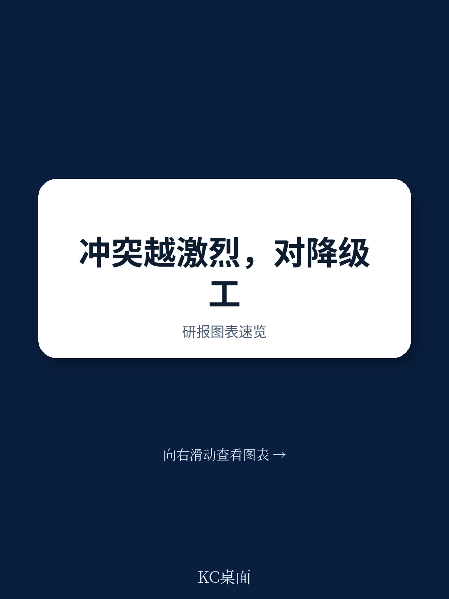
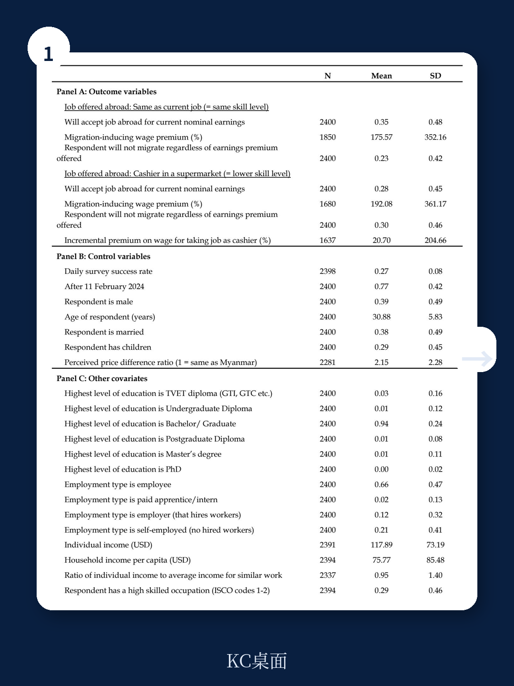
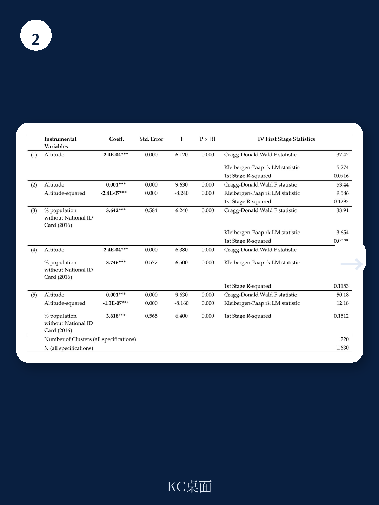

# 世界银行：冲突改变的不只是流亡路线，还有对职业尊严的定价

一份来自世界银行的最新工作论文，以缅甸为实验场，揭示了一个被长期忽视的机制：当暴力冲突升级，高技能潜在移民愿意接受多少降级工作的“补偿溢价”会显著下降。换句话说，安全威胁在改写人力资本市场的定价逻辑。

这份报告的核心判断并不复杂，但含义深远：冲突不仅仅在物理上驱赶人口，它还在心理上降低了移民对“工作是否匹配自身技能”的要求。当生存成为首要目标，职业尊严的溢价就被压缩了。

对于关注全球劳动力流动、东南亚地缘风险，以及移民政策制定的人来说，这份报告提供了一个关键的分析框架：冲突对人力资本的损耗，不仅发生在流亡途中，更早在人们决定离开之前就已经开始了。

## 1. 一个被忽略的机制：冲突降低了移民对职业匹配的要价

传统经济学研究移民的职业降级，大多聚焦于移民抵达目的地之后——语言障碍、资质不认、社会网络缺失。但这份报告提出了一个不同的问题：在离开之前，冲突地区的人是不是已经准备好接受更差的工作了？

答案是肯定的。

研究人员设计了一个精巧的实验。他们向缅甸的高技能青年提供两个虚构的海外工作场景：一个与当前工作相似，另一个明显低于其技能水平。受访者需要回答，需要多高的工资溢价才愿意接受这两个工作。两者的溢价之差，就是“补偿性工资差异”——可以理解为一个人为了接受降级工作所要求的额外补偿。补偿越高，说明越不愿意接受降级。

理论预测，所有人都会要求更高的溢价去接受降级工作。但关键发现是：生活在冲突更激烈地区的人，这个额外溢价显著更低。冲突每增加一个单位，补偿性工资差异下降约7-9个百分点。这意味着，冲突地区的人愿意以更低的“价格”出卖自己的技能优势。

> **KC评论：** 这不是说冲突地区的人能力更差或要求更低，而是说他们的决策权重发生了根本性偏移。当安全成为稀缺品，经济偏好就会被压缩。这对理解难民劳动力市场的定价机制非常关键——传统模型假设移民是效用最大化者，但冲突引入了安全变量，改变了效用函数的形状。完整报告中包含的异质性分析表格，展示了这种效应在不同群体中的差异，值得细读。

## 2. 谁最脆弱：女性、少数民族、语言弱势群体承受了更大的妥协

报告最值得关注的部分，是异质性分析。冲突对职业降级意愿的影响，并非均匀分布。

数据显示，女性受冲突影响后，对降级工作的接受度显著高于男性。少数民族和语言弱势群体同样如此。那些在缅甸国内已经感受到收入下降、或自认为被低估的人，面对冲突时更愿意妥协。

这背后是一个残酷的逻辑：冲突放大了原有的不平等。已经在劳动力市场中处于弱势的人，在安全威胁下，更没有议价能力。他们不仅失去了国内的工作机会，还失去了对海外工作质量的谈判筹码。

报告还发现，那些缺乏海外社会网络的人——没有亲戚在国外、没有工作联系人、没有接收家庭——对冲突的反应更强烈。社会网络在这里充当了一个缓冲垫：有网络的人，即使在冲突中，也保留了一定的选择空间。

> **KC评论：** 这一发现对政策制定者非常关键。如果冲突地区的弱势群体在移民前就已经准备接受降级工作，那么目的地国家的技能认证、语言培训、职业匹配服务，可能需要前置到移民决策阶段。否则，人力资本的损耗将是系统性的。报告中的交互效应表格提供了分性别、分网络状态的详细回归结果，这些数据对于设计针对性干预方案不可或缺。

## 3. 机制验证：征兵法和领土争夺区提供了“准自然实验”

研究最大的亮点，是找到了两个“自然实验”来验证冲突影响职业降级意愿的因果机制。

第一个是领土争夺区。生活在政府军和武装组织争夺区域的受访者，冲突对降级意愿的影响最大。这些地区的不确定性最高——你无法预测明天谁控制这个区域，经济活动随时可能中断。

第二个更具戏剧性。2024年2月，缅甸军政府突然激活了《人民兵役法》，征召年轻男性入伍。这个法律在调查进行期间突然生效，等于在数据中制造了一个天然的“断点”。研究发现，那些符合征召条件、且在法律生效后接受采访的男性，对降级工作的接受度急剧上升。

这两个机制共同指向一个结论：不是冲突本身，而是冲突带来的“不确定性”和“对未来的悲观预期”在驱动决策。当一个人觉得自己可能被征召入伍、或者自己的家乡随时可能变成战场，他对海外工作质量的要求就会下降。生存压倒一切。

> **KC评论：** 征兵法这个外生冲击非常干净。它排除了反向因果——不是想移民的人更关注冲突，而是冲突（通过征兵）直接改变了他们的选择集。报告对这一部分的分析还比较初步，但已经足够说明问题。更细致的机制检验，包括对预期形成过程的分析，在完整报告中有进一步展开。

## 4. 报告尚未完全回答的关键问题：这种妥协是暂时的还是永久的？

报告的核心贡献在于证明了“冲突降低职业降级要价”这一机制的存在。但一个关键问题悬而未决：这种妥协是暂时的，还是会在移民后持续存在？

理论上有两种可能。一种认为，一旦抵达安全的目的地，冲突的“紧迫感”消退，移民会重新寻找匹配的工作。另一种认为，初始的降级选择会形成路径依赖——接受低技能工作后，技能退化、社会网络固化、雇主偏见形成，导致长期锁定在低端岗位。

现有文献对此存在分歧。一些研究显示难民在10年后可以追上收入差距，另一些则发现降级效应持续整个居留期。这份报告没有直接回答这个问题，因为它只测量了移民前的意愿，而非移民后的实际结果。

但这恰恰是它最有价值的延伸方向。如果冲突导致的降级意愿是持久性的，那么它意味着冲突不仅造成即时的人力资本损失，还会产生代际影响。报告讨论中提到了Achard (2024)关于代际效应的研究，但没有展开。

## 5. 一个观察框架：如何用“安全溢价”重新审视全球移民市场

对关注全球劳动力流动的人来说，这份报告提供了一个可操作的观察框架。

传统上，我们分析移民决策时，主要看工资差、迁移成本、政策限制。这份报告提示我们，需要加入第三个维度：原籍国的安全溢价。这个溢价不是固定的，而是随着冲突强度、个人脆弱性、社会网络密度而变化。

具体来说，可以构建一个简单的三维评估模型：
- 工资差：目的地与来源地的收入差距
- 迁移成本：签证、交通、中介费用、政策门槛
- 安全溢价：冲突强度 x 个人脆弱性指数

当安全溢价足够高，工资差和迁移成本的重要性就会下降。这意味着，冲突地区的移民可能不是“最优选择”的结果，而是“别无选择”的结果。这对目的地国家的劳动力市场政策、技能认证体系、社会融入项目都有直接影响。

例如，如果目的地国家知道来自冲突地区的移民已经“准备好”接受降级工作，那么它应该主动提供技能评估和职业匹配服务，否则就是在系统性地浪费人力资本。

## 6. 对读者的实际含义：如何从这份报告中提取可操作信号

这份报告虽然聚焦缅甸，但其分析框架具有普适性。全球冲突热点——从苏丹到乌克兰，从加沙到缅甸——都在产生类似的“被迫妥协型移民”。

对投资者和企业来说，这意味着：
- 来自冲突地区的劳动力供给，其“质量”可能被低估。表面上看是低技能工人，但实际可能是工程师、教师、医护人员在从事低端工作。这既是人力资本的浪费，也是潜在的机会——如果能够识别并匹配这些人的真实技能。
- 移民政策的变化，尤其是针对冲突地区难民的劳动权利，会显著影响这些人的职业轨迹。允许早期工作权利、简化技能认证，可以大幅减少降级效应。
- 社会网络的价值被低估。报告显示，有海外联系的潜在移民，对冲突的反应更温和。这意味着，旨在扩大难民社会网络的项目，可能具有很高的边际回报。

对政策制定者来说，这份报告最直接的启示是：冲突后的人力资本重建，不能等到难民到达后再开始。应该在移民决策阶段就介入，提供信息、认证、匹配服务，避免“初始降级”导致长期锁定。

> **KC评论：** 报告的局限性在于，它只测量了意愿，而非实际行为。意愿和行动之间可能有差距。但考虑到实验设计的严谨性——包括随机排序、假设场景、以及外部冲击的验证——这个差距可能不会太大。完整报告中包含的调查问卷设计和稳健性检验，可以帮助读者更准确地评估结论的可信度。

## 7. 延伸思考：当安全溢价成为全球劳动力市场的“隐性变量”

这份报告引出一个更大的问题：在全球化退潮、地缘冲突升温的背景下，安全溢价正在成为全球劳动力市场的隐性变量。

过去二十年，经济学家讨论移民时，主要关注经济激励。但未来，安全因素可能越来越重要。气候变化、政治极化、区域冲突都在制造新的“不安全源”。这意味着，全球劳动力供给的质量和结构，可能正在发生系统性的变化。

传统模型假设移民是“向上流动”的——从低工资地区流向高工资地区，同时提升职业地位。但冲突地区的移民，可能是“侧向流动”甚至“向下流动”的——他们为了安全，愿意接受职业降级。这会改变目的地国家的劳动力市场结构，压低某些低技能岗位的工资，同时造成高技能岗位的供给短缺。

对投资者来说，这意味着需要重新评估某些行业的劳动力成本曲线。如果来自冲突地区的移民持续涌入低端服务业，那么这些行业的工资增长可能长期受限。但如果政策允许这些移民快速获得技能认证，那么某些高技能行业可能迎来意外的供给冲击。

## 8. 未完的问题：下一份报告应该回答什么？

这份世界银行的工作论文，打开了一个新的研究领域。但它留下的问题，可能比回答的更多。

最紧迫的问题包括：冲突导致的降级意愿，在移民后是否持续？初始降级是否形成路径依赖？社会网络能否真正缓解降级效应，还是只是推迟了它？政策干预——如技能认证、语言培训、工作匹配——在哪个阶段介入效果最好？

这些问题，需要更长周期的追踪数据、更多国家的比较研究、以及更细致的政策实验来回答。但至少，这份报告提供了一个坚实的起点：它证明了冲突确实在改变人们对职业尊严的定价，而且这种改变在弱势群体中更加明显。

对于关注全球人力资本流动的人来说，这是一个不容忽视的信号。冲突不再只是新闻头条上的数字，它正在系统性地改变全球劳动力的供给曲线，而且这种改变，早在人们踏上流亡之路之前就已经开始了。

---

**如果你想进一步探讨这些未解问题，或者希望获取完整报告中的原始图表、异质性分析表格以及更详细的机制检验，可以加入我们的社群。我们每天会由AI agent加上人工review，生成国际投行最新报告的完整中文摘要与KC评论，每日更新，约10-40页，包含当天最新数据图表合集，既方便喂给AI，也方便人工快速把握全球市场动态。**

Personal reading notes and learning share only. Not investment advice.

